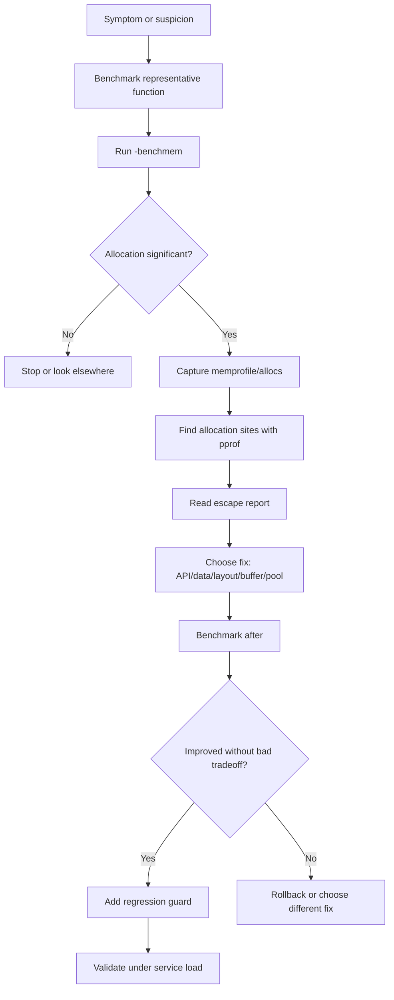
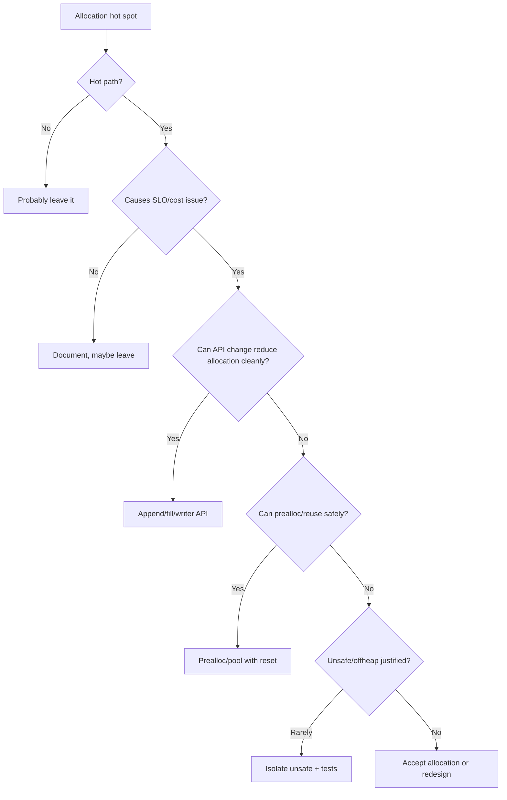
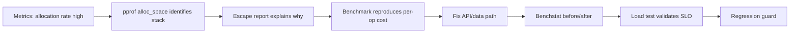

# learn-go-memory-systems-part-030.md

# Go Memory Systems Part 030 — Allocation Profiling Workflow: Benchmark, `-benchmem`, `pprof`, Escape Reports

> Seri: `learn-go-memory-systems`  
> Part: `030`  
> Target: Go 1.26.x  
> Perspektif: Java software engineer menuju Go systems engineer  
> Status seri: **belum selesai** — ini bukan bagian terakhir.

---

## 0. Posisi Part Ini Dalam Seri

Part 028 membahas pprof dan observability.  
Part 029 membahas runtime metrics dan dashboard produksi.

Part 030 sekarang menyatukan semuanya menjadi **workflow engineering**:

> Bagaimana dari dugaan “ini banyak allocation” menjadi bukti, perbaikan, dan regression guard.

Kita akan fokus pada alur yang bisa kamu pakai sehari-hari:

1. tulis benchmark yang tidak bohong;
2. jalankan `-benchmem`;
3. baca `B/op` dan `allocs/op`;
4. ambil memory profile;
5. pakai `pprof`;
6. baca escape analysis;
7. ubah API/data layout;
8. bandingkan sebelum/sesudah;
9. pasang guardrail di CI;
10. validasi di workload service, bukan microbenchmark saja.

---

## 1. Tujuan Pembelajaran

Setelah menyelesaikan part ini, kamu harus mampu:

1. Membuat benchmark Go yang cukup reliable untuk allocation analysis.
2. Memakai:
   - `go test -bench`,
   - `-benchmem`,
   - `-memprofile`,
   - `-cpuprofile`,
   - `go tool pprof`,
   - `-gcflags=-m`.
3. Membedakan:
   - allocation per operation,
   - allocation cumulative,
   - retained heap,
   - escape report,
   - compiler optimization effect.
4. Menghindari benchmark yang menipu:
   - dead-code elimination,
   - unrealistic input,
   - missing setup isolation,
   - measuring test data generation,
   - tiny benchmark noise.
5. Menentukan apakah allocation harus diperbaiki atau dibiarkan.
6. Mendesain API untuk mengurangi allocation tanpa menghancurkan readability.
7. Membuat before/after diff dengan evidence.
8. Membuat CI performance guardrail.
9. Menghubungkan microbenchmark ke service-level profile.
10. Menghindari premature optimization.

---

## 2. Prinsip Utama

Allocation profiling bukan mencari “0 allocation” di semua tempat.

Tujuannya:

> Mengurangi allocation yang relevan terhadap SLO, cost, memory pressure, atau throughput.

Allocation boleh ada jika:

- di cold path;
- di startup;
- di admin/control plane;
- tidak mempengaruhi latency/throughput;
- membuat kode jauh lebih aman/sederhana;
- jumlahnya kecil dan tidak berada di loop besar;
- profile menunjukkan bukan bottleneck.

Allocation perlu diperhatikan jika:

- di request hot path;
- per item dalam large batch;
- per token/parser event;
- per log line hot path;
- per message high-throughput queue;
- menyebabkan GC CPU naik;
- menyebabkan p99 latency naik;
- meningkatkan object count besar;
- menyebabkan retained heap lewat accidental reference.

---

## 3. Mental Model Workflow



---

## 4. Basic Benchmark

```go
func BenchmarkEncode(b *testing.B) {
    input := Sample{
        ID:   123,
        Name: "fajar",
    }

    b.ReportAllocs()

    for i := 0; i < b.N; i++ {
        _ = Encode(input)
    }
}
```

Run:

```bash
go test -bench BenchmarkEncode -benchmem
```

Output example:

```text
BenchmarkEncode-16    1000000    1200 ns/op    512 B/op    8 allocs/op
```

Interpretation:

| Field | Meaning |
|---|---|
| ns/op | time per operation |
| B/op | bytes allocated per operation |
| allocs/op | number of heap allocations per operation |

---

## 5. `b.ReportAllocs`

`-benchmem` usually reports memory stats for benchmarks, and `b.ReportAllocs()` can be used to request allocation reporting in benchmark output.

For library benchmarks, include `b.ReportAllocs()` for clarity.

---

## 6. Go 1.24+ `b.Loop`

Modern Go provides `b.Loop()` as a benchmark loop helper.

Conceptual usage:

```go
func BenchmarkEncode(b *testing.B) {
    input := makeInput()
    b.ReportAllocs()

    for b.Loop() {
        _ = Encode(input)
    }
}
```

It helps avoid some classic mistakes around loop setup and compiler optimization, but the same principles remain:

- setup outside measured loop;
- avoid measuring input generation unless intended;
- consume results if needed;
- use realistic inputs.

---

## 7. Avoid Dead-Code Elimination

Bad:

```go
func BenchmarkParse(b *testing.B) {
    data := []byte("12345")
    for i := 0; i < b.N; i++ {
        Parse(data)
    }
}
```

Compiler may optimize if result unused.

Better:

```go
var sinkInt int

func BenchmarkParse(b *testing.B) {
    data := []byte("12345")
    b.ReportAllocs()

    for i := 0; i < b.N; i++ {
        sinkInt = Parse(data)
    }
}
```

Use package-level sink carefully.

---

## 8. Avoid Measuring Setup

Bad:

```go
func BenchmarkEncode(b *testing.B) {
    for i := 0; i < b.N; i++ {
        input := makeLargeInput()
        _ = Encode(input)
    }
}
```

Unless you want to measure input generation too.

Better:

```go
func BenchmarkEncode(b *testing.B) {
    input := makeLargeInput()
    b.ReportAllocs()
    b.ResetTimer()

    for i := 0; i < b.N; i++ {
        _ = Encode(input)
    }
}
```

`b.ResetTimer()` excludes setup before it.

---

## 9. Setup Per Iteration

Sometimes each iteration needs fresh mutable input.

Use:

```go
func BenchmarkDecode(b *testing.B) {
    raw := loadRawFixture()
    b.ReportAllocs()

    for i := 0; i < b.N; i++ {
        data := append([]byte(nil), raw...)
        b.StartTimer()
        _ = DecodeInPlace(data)
        b.StopTimer()
    }
}
```

But frequent `StartTimer`/`StopTimer` has overhead. Prefer designing benchmark so setup is minimal or measured intentionally.

---

## 10. Benchmark Realistic Input Sizes

Allocation behavior can change with size.

Test matrix:

```go
func BenchmarkEncodeSmall(b *testing.B)  {}
func BenchmarkEncodeMedium(b *testing.B) {}
func BenchmarkEncodeLarge(b *testing.B)  {}
```

Or table benchmark:

```go
func BenchmarkEncode(b *testing.B) {
    cases := []struct {
        name string
        size int
    }{
        {"small", 128},
        {"medium", 4096},
        {"large", 1 << 20},
    }

    for _, tc := range cases {
        b.Run(tc.name, func(b *testing.B) {
            input := makeInput(tc.size)
            b.ReportAllocs()
            b.ResetTimer()

            for i := 0; i < b.N; i++ {
                sinkBytes = Encode(input)
            }
        })
    }
}
```

---

## 11. `-run '^$'`

When running benchmarks, skip tests if not needed:

```bash
go test -run '^$' -bench . -benchmem
```

This avoids slow tests interfering with benchmark iteration.

---

## 12. Multiple Runs

Benchmark noise exists.

Use multiple counts:

```bash
go test -run '^$' -bench BenchmarkEncode -benchmem -count=10
```

Then compare statistically with tools like `benchstat`.

---

## 13. Before/After With Benchstat

Workflow:

```bash
go test -run '^$' -bench . -benchmem -count=10 > before.txt
# apply change
go test -run '^$' -bench . -benchmem -count=10 > after.txt
benchstat before.txt after.txt
```

Look at:

- ns/op;
- B/op;
- allocs/op;
- variance;
- statistical significance.

Do not trust one run.

---

## 14. Memory Profile From Benchmark

Generate memory profile:

```bash
go test -run '^$' -bench BenchmarkEncode -benchmem -memprofile mem.out
```

Open:

```bash
go tool pprof mem.out
```

View alloc space:

```text
(pprof) sample_index=alloc_space
(pprof) top
(pprof) top -cum
```

View inuse space:

```text
(pprof) sample_index=inuse_space
(pprof) top
```

For allocation optimization, `alloc_space` is often more useful.

---

## 15. CPU Profile Alongside Memory

Allocation may show up in CPU.

Generate:

```bash
go test -run '^$' -bench BenchmarkEncode -benchmem -cpuprofile cpu.out
go tool pprof cpu.out
```

Look for:

- `runtime.mallocgc`;
- `runtime.gcAssistAlloc`;
- `runtime.mapassign`;
- `fmt`;
- `reflect`;
- `encoding/json`;
- string conversion functions;
- slice growth.

---

## 16. pprof From Test Binary

Sometimes you want more control:

```bash
go test -c -o bench.test
./bench.test -test.run '^$' -test.bench BenchmarkEncode -test.benchmem -test.memprofile mem.out
go tool pprof ./bench.test mem.out
```

Providing binary improves symbol/source mapping.

---

## 17. Escape Analysis

Run:

```bash
go build -gcflags=-m ./...
```

More detail:

```bash
go build -gcflags=-m=2 ./...
```

For tests/bench package:

```bash
go test -run '^$' -bench BenchmarkEncode -gcflags=-m
```

Escape report helps answer:

- why object moved to heap;
- whether parameter leaks;
- whether closure captures;
- whether interface conversion forces escape;
- whether inlining affects escape.

---

## 18. Escape Report Is Not a Performance Profile

Escape analysis output is compiler reasoning, not runtime frequency.

A value escaping in cold path may not matter.

A tiny allocation in hot path may matter.

Use escape report with benchmark/profile:

```text
escape report tells why
benchmark tells how much per op
pprof tells where cumulatively
```

---

## 19. Common Escape Patterns

### Returning pointer

```go
func NewUser() *User {
    u := User{}
    return &u
}
```

May escape because returned pointer outlives frame.

### Interface conversion

```go
func Log(v any) {
    fmt.Println(v)
}
```

May cause value to escape depending usage.

### Closure capture

```go
func Make() func() int {
    x := 1
    return func() int { return x }
}
```

Captured variable can escape.

### Goroutine capture

```go
go func() {
    use(buf)
}()
```

Captured values may escape because goroutine outlives caller.

### Dynamic size

```go
make([]byte, n)
```

Allocation location depends on size/lifetime/proof.

---

## 20. Allocation Root Cause Classes

| Class | Example | Fix direction |
|---|---|---|
| Temporary formatting | `fmt.Sprintf` | `strconv.Append*`, builder |
| Byte/string conversion | `string(b)` in loop | avoid conversion, use bytes APIs |
| Interface/any | `[]any`, `...any` | generics/concrete typed API |
| Reflection | JSON/map/ORM | typed structs/codegen |
| Slice growth | repeated append | prealloc/caller buffer |
| Map growth | unknown size | pre-size map |
| Closure capture | callbacks/goroutines | pass args explicitly |
| Large read | `io.ReadAll` | streaming |
| Retention | subslice cache | clone small data |
| Pool misuse | reset missing | clear/drop large |

---

## 21. API Shapes That Reduce Allocation

### Return allocated

```go
func Encode(v Value) []byte
```

Simple but allocates.

### Caller-provided buffer

```go
func AppendEncode(dst []byte, v Value) []byte
```

Lets caller reuse buffer.

### Writer-based

```go
func WriteEncode(w io.Writer, v Value) error
```

Streams output.

### Borrowed view callback

```go
func LookupView(key []byte, fn func([]byte) error) error
```

Avoids copy but constrains lifetime.

### Copy explicit

```go
func LookupCopy(key []byte) ([]byte, error)
```

Safe boundary.

---

## 22. Append-Style API

Pattern:

```go
func AppendUser(dst []byte, u User) []byte {
    dst = append(dst, "id="...)
    dst = strconv.AppendInt(dst, int64(u.ID), 10)
    dst = append(dst, ",name="...)
    dst = append(dst, u.Name...)
    return dst
}
```

Caller:

```go
buf := make([]byte, 0, 128)
buf = AppendUser(buf, user)
```

Benefits:

- caller controls allocation;
- reuse possible;
- no hidden global state;
- composable.

---

## 23. Preallocation

Slice:

```go
out := make([]Item, 0, len(input))
for _, x := range input {
    out = append(out, transform(x))
}
```

Map:

```go
m := make(map[string]Value, len(items))
```

Preallocation reduces growth allocations but can waste memory if estimate too high.

For untrusted input, cap limits are needed.

---

## 24. Avoid `[]T` to `[]any` Allocation Trap

Cannot convert `[]T` to `[]any` without creating new slice.

Bad hot path:

```go
vals := make([]any, len(users))
for i := range users {
    vals[i] = users[i]
}
log(vals...)
```

Fix:

- avoid variadic `any`;
- use typed logger;
- loop with typed handling;
- design API generic/concrete.

---

## 25. String/Byte Conversion

Bad hot parser:

```go
for _, token := range tokens {
    s := string(token)
    use(s)
}
```

Each `string(token)` copies.

Options:

- use `[]byte` APIs;
- intern only if needed;
- convert once at boundary;
- unsafe only with strict lifetime/immutability and evidence;
- use `strconv` byte-oriented functions where possible.

---

## 26. `fmt` vs `strconv`

`fmt` is flexible but can allocate and use reflection-like machinery.

Hot path numeric formatting:

```go
dst = strconv.AppendInt(dst, n, 10)
```

Instead of:

```go
dst = []byte(fmt.Sprintf("%d", n))
```

Use `fmt` for readability in cold paths. Use `strconv`/append in hot paths.

---

## 27. JSON Allocation Workflow

If profile shows JSON:

1. Is input decoded into `map[string]any`?
2. Can it decode into struct?
3. Is large array streamed?
4. Is `RawMessage` retaining full input?
5. Are repeated marshal calls allocating temporary maps?
6. Is custom `MarshalJSON` allocating unnecessarily?
7. Would generated codec be justified?

Measure before adding complex library/codegen.

---

## 28. Buffer Reuse

Use `bytes.Buffer`/`strings.Builder`/append buffer.

But reset carefully:

```go
var buf bytes.Buffer
buf.Grow(1024)

for _, item := range items {
    buf.Reset()
    writeItem(&buf, item)
    consume(buf.Bytes())
}
```

Do not store `buf.Bytes()` after buffer reuse unless copied.

---

## 29. `sync.Pool` Workflow

Use pool only after profile shows allocation pressure.

Pattern:

```go
var bufPool = sync.Pool{
    New: func() any {
        b := make([]byte, 0, 64<<10)
        return &b
    },
}

func getBuf() *[]byte {
    p := bufPool.Get().(*[]byte)
    *p = (*p)[:0]
    return p
}

func putBuf(p *[]byte) {
    if cap(*p) > 1<<20 {
        return
    }
    clear(*p)
    *p = (*p)[:0]
    bufPool.Put(p)
}
```

But:

- `clear` full cap can be expensive;
- clearing secrets may be required;
- do not return buffer still used;
- drop huge buffers.

---

## 30. Allocation Fix Decision Tree



---

## 31. Retention Is Not Allocation

Sometimes reducing allocation does not fix memory footprint.

Example:

```go
small := big[:10]
cache[key] = small
```

Allocation site is big buffer, but issue is retention.

Fix is copy boundary:

```go
cache[key] = bytes.Clone(big[:10])
```

This adds a small allocation to remove huge retention.

Therefore:

> Fewer allocations is not always better. Correct lifetime is better.

---

## 32. Benchmarking Copy vs Retention

A copy can improve memory.

Benchmark plus heap profile:

- version A: no copy, retains big array;
- version B: copy 10 bytes;
- compare `B/op`;
- compare `inuse_space`.

Microbenchmark may show B allocates more per op, but service memory improves dramatically.

---

## 33. Escape Analysis Example

Code:

```go
func Build() any {
    x := Small{A: 1}
    return x
}
```

Escape output may show `x escapes to heap` depending representation.

Fix may be impossible if API requires `any`.

Better design:

```go
func BuildSmall() Small
```

or generic/typed interface.

---

## 34. Inlining Affects Escape

Inlining can expose more context to compiler and improve escape decisions.

Small helper functions often get inlined.

But do not manually inline everything. Check:

```bash
go build -gcflags='-m=2'
```

You may see:

```text
can inline foo
inlining call to foo
```

Inlining can reduce allocations, but readability matters.

---

## 35. Compiler Version Changes

Escape decisions can change between Go versions.

Therefore:

- benchmark after Go upgrade;
- do not rely on fragile escape behavior;
- keep API ownership clear;
- measure with target Go version;
- review performance-sensitive packages after upgrade.

---

## 36. CI Guardrail

For critical hot paths:

```bash
go test -run '^$' -bench BenchmarkParser -benchmem -count=5
```

Policy examples:

```text
BenchmarkParser:
- allocs/op must remain 0
- B/op must remain <= 16
- ns/op regression > 10% requires approval
```

Use guardrails sparingly. Too many flaky perf gates hurt development.

---

## 37. Golden Benchmark Baseline

Store benchmark result in CI artifacts, not necessarily repo.

Track:

- Go version;
- GOOS/GOARCH;
- CPU model;
- commit;
- benchmark flags;
- result.

Performance is environment-sensitive.

---

## 38. Service-Level Validation

Microbenchmark improvement may not improve service.

Validate:

- p99 latency;
- throughput;
- CPU;
- allocation rate;
- GC CPU;
- RSS;
- error rate;
- realistic payloads;
- concurrency;
- backpressure.

Example:

```text
Parser allocs/op 5 -> 0
Service GC CPU 12% -> 7%
p99 180ms -> 150ms
RSS unchanged
```

This is meaningful.

---

## 39. When Not to Optimize

Do not optimize allocation if:

- cold path;
- admin endpoint;
- startup config parsing;
- error path rare;
- code becomes unsafe/fragile;
- benchmark improvement not service-visible;
- complexity cost too high;
- allocation is necessary for ownership safety.

Top engineers know when to stop.

---

## 40. Case Study 1 — Formatting Hot Path

### Baseline

```go
func Key(tenant string, id int64) string {
    return fmt.Sprintf("%s:%d", tenant, id)
}
```

Benchmark:

```text
120 ns/op  32 B/op  2 allocs/op
```

### Fix

```go
func AppendKey(dst []byte, tenant string, id int64) []byte {
    dst = append(dst, tenant...)
    dst = append(dst, ':')
    dst = strconv.AppendInt(dst, id, 10)
    return dst
}
```

### Trade-off

- faster;
- fewer allocations;
- API more complex;
- caller must manage buffer lifetime.

Use only if key creation is hot.

---

## 41. Case Study 2 — JSON Map

### Baseline

```go
var m map[string]any
_ = json.Unmarshal(data, &m)
```

Symptoms:

- many allocations;
- reflection;
- interface values;
- map growth.

### Fix

```go
var req Request
_ = json.Unmarshal(data, &req)
```

Or stream if huge:

```go
dec := json.NewDecoder(r)
```

### Result

- fewer allocations;
- clearer schema;
- better validation;
- less dynamic flexibility.

---

## 42. Case Study 3 — Slice Growth

### Baseline

```go
var out []Item
for _, raw := range raws {
    out = append(out, parse(raw))
}
```

### Fix

```go
out := make([]Item, 0, len(raws))
for _, raw := range raws {
    out = append(out, parse(raw))
}
```

### Caveat

If `len(raws)` is attacker-controlled huge, validate size.

---

## 43. Case Study 4 — Pool Regression

Team adds pool. Benchmark improves. Production RSS rises.

Root cause:

- pool retains huge buffers;
- buffers not dropped by cap;
- references not reset.

Fix:

- cap threshold;
- reset pointer fields;
- drop huge;
- maybe remove pool.

Lesson:

> Allocation reduction can increase memory retention if ownership/reset is wrong.

---

## 44. Case Study 5 — Unsafe Zero-Copy Rejected

Team proposes unsafe `[]byte` to `string`.

Benchmark saves 1 allocation.

Risk:

- buffer reused after string created;
- string used as map key;
- corruption possible;
- input lifetime unclear.

Decision:

- reject unsafe;
- copy string at API boundary;
- optimize elsewhere.

Lesson:

> Saving one allocation is not worth corrupting invariants.

---

## 45. Pprof Checklist

When opening profile:

1. Confirm profile type.
2. Confirm sample index.
3. Confirm workload/time.
4. Check top flat.
5. Check top cumulative.
6. Use `list` on suspected function.
7. Check callers/callees if needed.
8. Compare before/after.
9. Map stack to code ownership.
10. Form fix hypothesis.

---

## 46. Escape Report Checklist

When reading escape output:

- Which variable escapes?
- Why does it escape?
- Is it hot path?
- Is it caused by API boundary?
- Is it interface/closure/goroutine?
- Can caller-provided buffer help?
- Would value return help?
- Would generic/concrete API help?
- Would fix hurt readability?
- Does benchmark confirm?

---

## 47. Benchmark Review Checklist

Before trusting benchmark:

- Is input realistic?
- Is setup excluded or intentionally included?
- Is result consumed?
- Are allocations reported?
- Are multiple runs used?
- Is variance acceptable?
- Is Go version target correct?
- Is CPU scaling/noise controlled?
- Is parallelism representative?
- Is service-level validation planned?

---

## 48. Parallel Benchmarks

For concurrent hot paths:

```go
func BenchmarkEncodeParallel(b *testing.B) {
    input := makeInput()
    b.ReportAllocs()

    b.RunParallel(func(pb *testing.PB) {
        buf := make([]byte, 0, 1024)
        for pb.Next() {
            buf = buf[:0]
            sinkBytes = AppendEncode(buf, input)
        }
    })
}
```

Use for:

- contention;
- pool behavior;
- shared locks;
- per-goroutine buffer strategy.

Beware data races in sink/shared state.

---

## 49. Allocation Under Parallel Load

Single-thread benchmark can hide:

- lock contention;
- `sync.Pool` behavior;
- cache line contention;
- allocator scaling;
- shared buffer race;
- memory bandwidth saturation.

Use both sequential and parallel benchmarks.

---

## 50. Trace for Allocation Latency

If p99 issue persists:

- use trace;
- inspect GC assist;
- inspect scheduler delays;
- inspect blocking;
- inspect syscall/page fault-like behavior where visible.

Allocation profile tells where bytes come from. Trace helps timeline.

---

## 51. Tooling Script Example

PowerShell-style workflow:

```powershell
go test -run '^$' -bench . -benchmem -count=10 | Tee-Object before.txt
# change code
go test -run '^$' -bench . -benchmem -count=10 | Tee-Object after.txt
benchstat before.txt after.txt
```

Linux/macOS:

```bash
go test -run '^$' -bench . -benchmem -count=10 > before.txt
go test -run '^$' -bench . -benchmem -count=10 > after.txt
benchstat before.txt after.txt
```

---

## 52. Common Anti-Patterns

Avoid:

1. Optimizing without benchmark.
2. Benchmarking unrealistic tiny input.
3. Ignoring `allocs/op`.
4. Ignoring retained heap.
5. Trusting one benchmark run.
6. Using escape report alone as proof.
7. Unsafe conversion for tiny gain.
8. Pooling everything.
9. Preallocating attacker-controlled size.
10. Returning pooled buffer to caller.
11. Measuring setup accidentally.
12. Ignoring parallel behavior.
13. Adding perf CI gate for noisy benchmark.
14. Copying benchmark numbers across machines.
15. Forgetting service-level validation.

---

## 53. Allocation Optimization Patterns

| Problem | Pattern |
|---|---|
| repeated string concat | `strings.Builder` or append bytes |
| numeric formatting | `strconv.Append*` |
| growing slice | preallocate |
| map growth | pre-size map |
| temporary output | caller-provided buffer |
| large file | streaming |
| repeated object | reset/reuse/pool carefully |
| dynamic `any` | typed/generic API |
| subslice retention | clone boundary |
| hot JSON struct | typed decode or codegen |
| per-request scratch | per-request buffer |

---

## 54. Optimization Trade-Off Matrix

| Fix | Benefit | Cost |
|---|---|---|
| prealloc | simple, effective | may over-allocate |
| append-style API | low allocation | caller complexity |
| writer API | streaming | error handling, interface cost |
| sync.Pool | lower churn | reset/lifetime complexity |
| unsafe | possible zero-copy | safety/corruption risk |
| off-heap | reduce GC scan | manual lifecycle |
| pointer-light layout | lower GC scan | harder code |
| codegen | faster/less alloc | build complexity |

Choose based on evidence.

---

## 55. Incident Example: Allocation Regression

Symptoms:

- after deploy, CPU +30%;
- GC CPU 8% -> 20%;
- heap live stable;
- p99 +40ms;
- RSS slightly higher.

Metrics indicate allocation churn.

Workflow:

1. capture allocs profile from old/new.
2. compare `alloc_space`.
3. top new stack: `fmt.Sprintf` in request middleware.
4. benchmark middleware.
5. replace with append-style formatting.
6. benchstat confirms `allocs/op` down.
7. load test p99 recovers.
8. add benchmark guard.

---

## 56. Incident Example: False Optimization

Team sees `bytes.Clone` in profile and removes it.

Result:

- allocations down;
- RSS up massively;
- cache retains large backing arrays.

Correct fix:

- keep clone;
- reduce upstream buffer size;
- add cache byte budget.

Lesson:

> Not all allocations are bad. Some allocations are ownership boundaries.

---

## 57. Mermaid: Evidence Chain



---

## 58. Documentation Template

For a performance fix PR:

```text
Problem:
- Allocation rate increased under peak.
- p99 latency affected.

Evidence:
- Runtime metrics:
- pprof allocs:
- Benchmark before:

Root cause:
- ...

Change:
- ...

Benchmark after:
- ...

Trade-offs:
- ...

Validation:
- ...

Rollback:
- ...
```

This prevents cargo-cult optimization.

---

## 59. What Top Engineers Notice

A weak optimization says:

> “I removed allocations.”

A strong optimization says:

- It was in the request hot path.
- It accounted for 35% of alloc_space under peak.
- Escape report showed interface conversion via `...any`.
- Replaced with typed append API.
- `allocs/op` dropped from 9 to 2.
- GC CPU dropped from 18% to 11%.
- p99 improved 14%.
- Code complexity is contained in one internal package.
- Regression benchmark added.

That is engineering.

---

## 60. Summary

Allocation profiling workflow is a loop:

1. detect with metrics;
2. attribute with pprof;
3. explain with escape analysis;
4. reproduce with benchmark;
5. fix with appropriate pattern;
6. compare with benchstat;
7. validate at service level;
8. guard with CI when justified.

The goal is not zero allocation everywhere. The goal is memory behavior that supports correctness, latency, throughput, and operability.

---

## 61. Part 030 Completion Checklist

Kamu siap lanjut jika bisa menjawab:

- Apa arti `B/op` dan `allocs/op`?
- Kapan memakai `alloc_space`?
- Kapan memakai `inuse_space`?
- Kenapa escape report bukan profile?
- Bagaimana benchmark bisa menipu?
- Bagaimana memakai `benchstat`?
- Kapan `bytes.Clone` justru benar?
- Kapan `sync.Pool` berbahaya?
- Bagaimana membuat allocation regression guard?
- Bagaimana menghubungkan microbenchmark dengan service SLO?

---

## 62. Seri Belum Selesai

Bagian ini adalah:

```text
learn-go-memory-systems-part-030.md
```

Part berikutnya:

```text
learn-go-memory-systems-part-031.md
```

Topik berikutnya:

```text
High-performance patterns: pools, arenas-like design, object reuse, ownership transfer
```

<!-- NAVIGATION_FOOTER -->
<div class="page-nav">
<a href="./learn-go-memory-systems-part-029.md">⬅️ Go Memory Systems Part 029 — Runtime Metrics: `runtime/metrics`, `ReadMemStats`, Production Dashboards</a>
<a href="./index.md">📚 Kategori</a>
<a href="../../index.md">🏠 Home</a>
<a href="./learn-go-memory-systems-part-031.md">Go Memory Systems Part 031 — High-Performance Patterns: Pools, Arena-Like Design, Object Reuse, Ownership Transfer ➡️</a>
</div>
