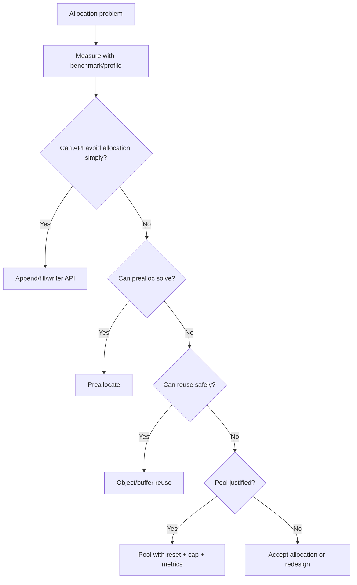
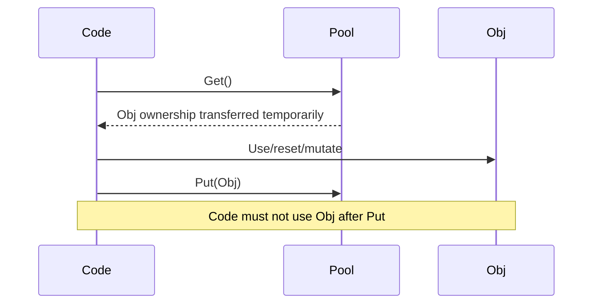
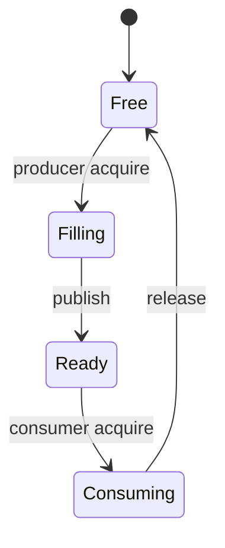
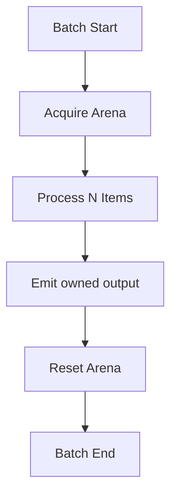

# learn-go-memory-systems-part-031.md

# Go Memory Systems Part 031 — High-Performance Patterns: Pools, Arena-Like Design, Object Reuse, Ownership Transfer

> Seri: `learn-go-memory-systems`  
> Part: `031`  
> Target: Go 1.26.x  
> Perspektif: Java software engineer menuju Go systems engineer  
> Status seri: **belum selesai** — ini bukan bagian terakhir.

---

## 0. Posisi Part Ini Dalam Seri

Part 030 membahas workflow allocation profiling:

- benchmark,
- `-benchmem`,
- `pprof`,
- escape report,
- before/after,
- CI guardrail.

Part 031 menjawab pertanyaan praktis berikutnya:

> Setelah tahu allocation hot spot, pattern apa yang layak dipakai?

Kita akan membahas:

- `sync.Pool`,
- object reuse,
- buffer reuse,
- per-request scratch,
- per-worker scratch,
- arena-like allocation,
- region lifetime,
- ownership transfer,
- reset discipline,
- bounded pool,
- pointer-free layout,
- slice-backed arena,
- byte arena,
- when to copy,
- when not to pool,
- production review checklist.

Fokusnya bukan “trik cepat”. Fokusnya adalah membuat pattern performa yang tetap aman, observable, dan tidak menciptakan retention leak.

---

## 1. Tujuan Pembelajaran

Setelah menyelesaikan part ini, kamu harus mampu:

1. Menentukan kapan pooling membantu dan kapan merusak.
2. Memahami `sync.Pool` sebagai temporary object cache, bukan resource manager.
3. Mendesain object reuse yang tidak membocorkan pointer.
4. Membuat reset function yang benar.
5. Menentukan kapan buffer besar harus dibuang, bukan dipool.
6. Mendesain per-request scratch dan per-worker scratch.
7. Memahami arena-like design tanpa bergantung pada experimental arena.
8. Mendesain ownership transfer API.
9. Menghindari use-after-reuse.
10. Menghubungkan pattern performa dengan GC scan cost dan retention.
11. Membuat bounded memory pool dengan byte budget.
12. Menulis review checklist untuk pattern high-performance.

---

## 2. Prinsip Utama

High-performance pattern Go harus mematuhi empat invariant:

```text
1. Lifetime jelas.
2. Ownership jelas.
3. Reset benar.
4. Memory budget bounded.
```

Jika salah satu hilang, “optimasi” bisa berubah menjadi:

- data race,
- stale data,
- use-after-reuse,
- memory leak,
- secret leak,
- corrupted response,
- GC retention,
- pool poisoning,
- unbounded RSS.

---

## 3. Jangan Mulai Dari Pool

Urutan yang benar:



Pool adalah pilihan setelah desain API dan preallocation dipertimbangkan.

---

## 4. `sync.Pool` Mental Model

`sync.Pool` adalah cache temporary object yang aman dipakai concurrent.

Karakteristik penting:

- item bisa hilang kapan saja;
- runtime boleh mengosongkan pool;
- pool bukan tempat menyimpan state penting;
- pool bukan deterministic resource manager;
- cocok untuk object temporary yang bisa dibuat ulang;
- sangat terkait dengan GC cycle;
- object di pool harus dianggap “milik pool” setelah `Put`.

Rule:

> Setelah `Put(x)`, jangan pakai `x` lagi.

---

## 5. `sync.Pool` Cocok Untuk Apa?

Cocok:

- temporary `bytes.Buffer`;
- temporary `[]byte` scratch;
- encoder/decoder state yang bisa reset;
- per-request work object;
- compression buffer;
- hash scratch;
- parser token buffer;
- reusable large-ish temporary object.

Tidak cocok:

- database connection;
- file descriptor;
- mmap mapping;
- C memory ownership;
- cache business data;
- object yang tidak bisa reset;
- object dengan lifetime panjang;
- object yang masih dipakai caller;
- resource yang harus release deterministik.

---

## 6. Basic Pool Pattern

```go
var bufferPool = sync.Pool{
    New: func() any {
        b := make([]byte, 0, 64<<10)
        return &b
    },
}

func getBuffer() *[]byte {
    p := bufferPool.Get().(*[]byte)
    *p = (*p)[:0]
    return p
}

func putBuffer(p *[]byte) {
    if p == nil {
        return
    }

    // Drop huge buffers to avoid retaining outliers.
    if cap(*p) > 1<<20 {
        return
    }

    // Reset length. Clear only if needed for pointer/security.
    *p = (*p)[:0]
    bufferPool.Put(p)
}
```

Key points:

- object returned by pointer to avoid copying slice header holder if needed;
- reset before use and before put;
- cap large buffers;
- do not assume pool retains object.

---

## 7. Pool Ownership Rule

Borrow lifecycle:



After `Put`, object can be acquired by another goroutine.

Use-after-put is data race/corruption.

---

## 8. Use-After-Put Bug

Bad:

```go
bufp := getBuffer()
defer putBuffer(bufp)

*bufp = append(*bufp, "hello"...)

return *bufp
```

Caller receives slice backed by buffer that will be returned to pool. Another goroutine can overwrite it.

Fix options:

```go
out := append([]byte(nil), (*bufp)...)
return out
```

Or change API to writer/callback:

```go
func WriteResponse(w io.Writer) error
```

---

## 9. Buffer Pool + HTTP Response

Bad:

```go
bufp := getBuffer()
defer putBuffer(bufp)

buildResponse(bufp)
w.Write(*bufp)
```

This is usually okay if `w.Write` fully consumes before return. But if you pass buffer to async writer/goroutine, unsafe.

Danger:

```go
go asyncSend(*bufp)
putBuffer(bufp)
```

Never return pooled memory before all consumers are done.

---

## 10. Reset Discipline

For pointer-containing object:

```go
type Work struct {
    Buf  []byte
    Req  *http.Request
    User *User
    Err  error
    Tags []string
}
```

Reset:

```go
func (w *Work) Reset() {
    if cap(w.Buf) > maxBufferCap {
        w.Buf = nil
    } else {
        clear(w.Buf)
        w.Buf = w.Buf[:0]
    }

    w.Req = nil
    w.User = nil
    w.Err = nil

    clear(w.Tags)
    w.Tags = w.Tags[:0]
}
```

If pointer fields are not cleared, pool retains object graph.

---

## 11. `clear` Cost

`clear(slice)` zeroes elements.

Use it when:

- slice contains pointers and must release references;
- slice contains secrets and must wipe;
- correctness requires zero state.

Avoid full clear of huge byte slices on every request unless needed. For `[]byte` without secrets, length reset is often enough.

But if buffer contains secrets/token/passwords, wipe before pool/drop.

---

## 12. Pool Poisoning by Huge Buffer

One request creates 50 MB buffer. You put it back into pool. Future small requests keep 50 MB capacity alive.

Fix:

```go
const maxKeep = 1 << 20 // 1 MiB

func putBytes(b []byte) {
    if cap(b) > maxKeep {
        return
    }
    pool.Put(b[:0])
}
```

This is mandatory in services with variable payload size.

---

## 13. Pool Metrics

`sync.Pool` does not expose internal inventory.

Wrap behavior:

```text
pool_get_total
pool_put_total
pool_new_total
pool_drop_large_total
pool_reuse_total
```

For custom pools:

```text
pool_bytes_in_use
pool_bytes_idle
pool_capacity
```

Metrics help detect pool misuse.

---

## 14. Per-Request Scratch

Instead of global pool, allocate scratch once per request and reuse inside.

```go
type Scratch struct {
    buf []byte
}

func (s *Scratch) Reset() {
    s.buf = s.buf[:0]
}

func handle(req Request) {
    scratch := Scratch{
        buf: make([]byte, 0, 64<<10),
    }

    parse(&scratch, req)
    encode(&scratch, req)
}
```

Benefits:

- lifetime clear;
- no cross-request contamination;
- no pool contention;
- easier correctness.

Cost:

- allocation per request unless scratch object itself reused;
- may be enough if allocation count small.

---

## 15. Per-Worker Scratch

If you have worker goroutines:

```go
func worker(jobs <-chan Job) {
    buf := make([]byte, 0, 64<<10)

    for job := range jobs {
        buf = buf[:0]
        buf = process(buf, job)
        emit(buf)
    }
}
```

Benefits:

- no global pool contention;
- buffer reused across jobs;
- ownership local to worker;
- predictable memory: workers * buffer cap.

Trade-off:

- memory reserved per worker;
- worker count determines memory footprint.

---

## 16. Per-P / Sharded Pools

Global lock contention can hurt custom pools.

Alternative:

- per-worker scratch;
- sharded pool by hash/goroutine/work partition;
- `sync.Pool` already has runtime optimizations for per-P behavior;
- custom bounded pool if memory cap needed.

Do not build custom pool unless you need semantics `sync.Pool` lacks.

---

## 17. Bounded Pool

`sync.Pool` is not a bounded memory budget.

If you need hard-ish cap:

```go
type BytePool struct {
    ch       chan []byte
    maxCap   int
    bufSize  int
}

func NewBytePool(n int, bufSize int, maxCap int) *BytePool {
    return &BytePool{
        ch:      make(chan []byte, n),
        bufSize: bufSize,
        maxCap:  maxCap,
    }
}

func (p *BytePool) Get() []byte {
    select {
    case b := <-p.ch:
        return b[:0]
    default:
        return make([]byte, 0, p.bufSize)
    }
}

func (p *BytePool) Put(b []byte) {
    if cap(b) > p.maxCap {
        return
    }
    b = b[:0]
    select {
    case p.ch <- b:
    default:
    }
}
```

This bounds idle buffers by channel capacity.

---

## 18. Byte-Budgeted Pool

For variable buffer sizes, count bytes.

```go
type BudgetPool struct {
    limit int64
    used  atomic.Int64
    pool  sync.Pool
}

func (p *BudgetPool) Put(b []byte) {
    c := cap(b)
    if c == 0 {
        return
    }

    for {
        cur := p.used.Load()
        if cur+int64(c) > p.limit {
            return
        }
        if p.used.CompareAndSwap(cur, cur+int64(c)) {
            p.pool.Put(b[:0])
            return
        }
    }
}

func (p *BudgetPool) Get() []byte {
    v := p.pool.Get()
    if v == nil {
        return nil
    }
    b := v.([]byte)
    p.used.Add(-int64(cap(b)))
    return b[:0]
}
```

This is simplified and has caveats, but shows budget thinking.

---

## 19. Arena-Like Design Without Experimental Arena

Go has had experimental arena work, but production code should not depend on experimental APIs unless you accept instability.

Arena-like design can be implemented at application level using:

- byte buffers;
- slices;
- offsets;
- region lifetime;
- batch reset;
- pointer-free metadata;
- immutable views.

Mental model:

> Allocate many related temporary things into one region, then discard/reset the whole region together.

---

## 20. Region Lifetime

Arena-like design works when lifetime is uniform.

Good:

- parse one request;
- process one batch;
- build one response;
- load one segment;
- per-worker scratch for one job.

Bad:

- objects have mixed lifetimes;
- some items escape to cache;
- data returned to caller;
- cross-request references;
- async goroutines use region after reset.

---

## 21. Byte Arena

```go
type ByteArena struct {
    buf []byte
}

func NewByteArena(capacity int) *ByteArena {
    return &ByteArena{buf: make([]byte, 0, capacity)}
}

func (a *ByteArena) Alloc(n int) []byte {
    if n < 0 {
        panic("negative allocation")
    }
    off := len(a.buf)
    a.buf = append(a.buf, make([]byte, n)...)
    return a.buf[off : off+n]
}

func (a *ByteArena) Reset() {
    clear(a.buf)
    a.buf = a.buf[:0]
}
```

This naive implementation zeroes new allocation via `make`. More optimized patterns avoid extra temporary but require care.

---

## 22. Append Arena

Better:

```go
func (a *ByteArena) AppendBytes(p []byte) []byte {
    off := len(a.buf)
    a.buf = append(a.buf, p...)
    return a.buf[off:len(a.buf)]
}
```

But returned slice is valid only until arena reset or buffer reallocation. If `append` grows backing array, old returned slices still point to old array, which may remain alive if referenced.

For strict arena, preallocate enough or use chunked arena.

---

## 23. Chunked Byte Arena

```go
type ChunkedArena struct {
    chunks [][]byte
    cur    []byte
    size   int
}

func (a *ChunkedArena) Alloc(n int) []byte {
    if n > len(a.cur)-cap(a.cur[:len(a.cur)]) {
        a.newChunk(max(n, a.size))
    }
    off := len(a.cur)
    a.cur = a.cur[:off+n]
    return a.cur[off : off+n]
}
```

This pseudocode needs careful implementation, but concept:

- allocate chunks;
- avoid moving old allocations;
- reset all chunks at once;
- optionally reuse chunks.

Chunked arena avoids invalidating old views due to growth.

---

## 24. Offset-Based Arena

Instead of returning slices/pointers, return offsets.

```go
type Ref struct {
    Off uint32
    Len uint32
}

type Arena struct {
    buf []byte
}

func (a *Arena) Add(p []byte) Ref {
    off := len(a.buf)
    a.buf = append(a.buf, p...)
    return Ref{Off: uint32(off), Len: uint32(len(p))}
}

func (a *Arena) View(r Ref) []byte {
    end := int(r.Off + r.Len)
    return a.buf[int(r.Off):end]
}
```

Benefits:

- metadata pointer-free;
- easy serialization;
- GC scan cost lower;
- compact.

Risks:

- overflow;
- bounds validation;
- arena reset invalidates refs;
- max size constraints.

---

## 25. Pointer-Free Hot Data

Pointer-rich:

```go
type Token struct {
    Kind string
    Text string
    Next *Token
}
```

Pointer-light:

```go
type Token struct {
    Kind uint16
    Off  uint32
    Len  uint32
}
```

Text lives in byte arena. Tokens are contiguous `[]Token`.

Benefits:

- fewer objects;
- less GC scanning;
- better cache locality;
- easier batch reset.

Costs:

- less ergonomic;
- must validate offsets;
- harder to mutate;
- lifetime bound to arena.

---

## 26. Ownership Transfer

Ownership must be explicit.

Example:

```go
func ProcessOwned(b []byte) {
    // callee may retain or mutate b
}

func ProcessBorrowed(b []byte) {
    // callee must not retain after return
}

func ProcessCopy(b []byte) {
    owned := append([]byte(nil), b...)
    _ = owned
}
```

In Go, function signature does not encode ownership. Naming/doc/tests must.

---

## 27. Borrowed vs Owned API

| API | Allocation | Safety | Complexity |
|---|---:|---:|---:|
| return copy | higher | high | low |
| borrowed callback | low | high if enforced | medium |
| raw view | low | low | low initially, high later |
| ownership transfer | low | medium | medium |
| pool borrow | low | medium/high risk | high |

Use safe API by default. Expose unsafe/borrowed variants only for hot paths.

---

## 28. Callback Ownership Pattern

```go
func (s *Store) LookupView(key []byte, fn func([]byte) error) error {
    return s.mapping.WithBytes(func(data []byte) error {
        v, ok := lookup(data, key)
        if !ok {
            return ErrNotFound
        }
        return fn(v)
    })
}
```

Benefits:

- view lifetime bounded;
- no allocation;
- caller cannot store accidentally unless it copies intentionally;
- close/reload can coordinate around callback.

---

## 29. Copy Boundary Pattern

```go
func (s *Store) LookupCopy(key []byte) ([]byte, error) {
    var out []byte
    err := s.LookupView(key, func(v []byte) error {
        out = append([]byte(nil), v...)
        return nil
    })
    return out, err
}
```

Offer both:

- `View` for hot immediate use;
- `Copy` for long-lived ownership.

---

## 30. Reuse and Concurrency

Object reuse across goroutines requires strict ownership.

Safe:

```text
goroutine A owns buffer
goroutine A passes ownership to goroutine B
goroutine A no longer touches
goroutine B returns/releases
```

Unsafe:

```text
goroutine A writes buffer
goroutine B reads buffer
goroutine A resets buffer
```

Use channels to transfer ownership, not share mutable buffers accidentally.

---

## 31. Ownership Transfer Through Channel

```go
type Chunk struct {
    Buf []byte
}

func producer(out chan<- Chunk) {
    buf := make([]byte, 0, 64<<10)
    for {
        buf = buf[:0]
        buf = fill(buf)

        out <- Chunk{Buf: buf}

        // Ownership transferred.
        buf = make([]byte, 0, 64<<10)
    }
}
```

Better with explicit buffer return path:

```go
type Chunk struct {
    Buf []byte
}

free := make(chan []byte, n)
out := make(chan Chunk, n)
```

Pipeline must define who returns buffer.

---

## 32. Buffer Ring

For single-producer/single-consumer bounded pipeline, a ring of buffers can work.

Invariants:

- buffer state: free, filling, ready, consuming;
- no buffer reused while consumer holds it;
- backpressure when no free buffer;
- bounded memory.



---

## 33. Object Reuse vs Readability

Do not convert clear code into fragile code for minor win.

Example:

```go
func BuildResponse(req Request) Response
```

Maybe allocates 2 objects. If not hot, fine.

High-performance patterns are justified when:

- profile shows hotspot;
- SLO/cost affected;
- optimization localized;
- tests cover ownership;
- complexity documented.

---

## 34. Reset Function Tests

For any pooled object, test reset.

```go
func TestWorkResetClearsReferences(t *testing.T) {
    req := &http.Request{}
    user := &User{}

    w := &Work{
        Req:  req,
        User: user,
        Tags: []string{"a", "b"},
    }

    w.Reset()

    if w.Req != nil || w.User != nil {
        t.Fatal("references not cleared")
    }
    if len(w.Tags) != 0 {
        t.Fatal("tags not reset")
    }
}
```

For pointer slices, ensure elements cleared before length reset if backing array reused.

---

## 35. Secret Data

If buffer holds secrets:

- tokens;
- passwords;
- private keys;
- PII;
- session cookies;

Then reset must wipe bytes before reuse/drop.

```go
for i := range b {
    b[i] = 0
}
```

`clear(b)` is clearer.

Caveat: compiler optimizations and copies can complicate guaranteed wiping. For strict cryptographic secrecy, use specialized libraries/patterns and understand compiler/runtime behavior.

---

## 36. Object Reuse and Errors

Error paths must also return objects.

Bad:

```go
bufp := getBuffer()
if err := step1(bufp); err != nil {
    return err // leak borrowed buffer from pool perspective
}
putBuffer(bufp)
```

Good:

```go
bufp := getBuffer()
defer putBuffer(bufp)

if err := step1(bufp); err != nil {
    return err
}
```

But ensure returned data does not reference buffer before defer returns.

---

## 37. Pool and Panic

If function can panic, defer release prevents pool leak.

```go
bufp := getBuffer()
defer putBuffer(bufp)

doWork(bufp)
```

But if panic occurs while buffer is in inconsistent state, reset function must be robust.

---

## 38. Arena Reset and Panic

Region reset should happen with defer:

```go
arena := getArena()
defer putArena(arena)

process(arena)
```

But if `process` returns slices to caller, this is invalid. Arena lifetime must exceed all views.

---

## 39. Avoid Reusing Mutable Input

If caller passes `[]byte`, do not retain and mutate unless contract says owned.

Bad:

```go
func ParseAndStore(b []byte) {
    global = b
}
```

If caller reuses buffer, global changes.

Fix:

```go
global = append([]byte(nil), b...)
```

or ownership contract:

```go
// ParseAndStoreOwned takes ownership of b; caller must not reuse b.
func ParseAndStoreOwned(b []byte)
```

---

## 40. Slab-Like Allocation

For fixed-size objects, slab-like design:

- allocate large chunk;
- split into slots;
- reuse slots;
- maintain free list;
- avoid per-object heap allocation.

In Go, pure heap slab still lives in Go heap, but can reduce object count if slots are represented as indexes into arrays.

Pointer-free slot metadata reduces GC scan.

---

## 41. Index Instead of Pointer

Instead of:

```go
type Node struct {
    Next *Node
}
```

Use:

```go
type Node struct {
    Next uint32 // index into []Node
}
```

Benefits:

- no pointer graph;
- contiguous memory;
- lower GC scan;
- serializable.

Costs:

- index validation;
- max size;
- less idiomatic;
- harder mutation.

Great for performance-critical internal structures, not always for app DTOs.

---

## 42. Free List With Indexes

```go
type Pool struct {
    nodes []Node
    free  []uint32
}

func (p *Pool) Alloc() uint32 {
    n := len(p.free)
    if n > 0 {
        id := p.free[n-1]
        p.free = p.free[:n-1]
        p.nodes[id] = Node{}
        return id
    }
    id := uint32(len(p.nodes))
    p.nodes = append(p.nodes, Node{})
    return id
}

func (p *Pool) Free(id uint32) {
    p.nodes[id] = Node{}
    p.free = append(p.free, id)
}
```

This is arena/slab-like inside Go heap.

---

## 43. Generation Counter for Handle Safety

Index reuse can cause stale handle bug.

Use generation:

```go
type Handle struct {
    Index uint32
    Gen   uint32
}

type Slot struct {
    Gen  uint32
    Node Node
}
```

On free/reuse, increment generation. Validate handle.

This prevents stale handle accessing new object accidentally.

---

## 44. Object Pool vs Arena vs Cache

| Pattern | Purpose | Lifetime |
|---|---|---|
| Pool | reuse temporary objects | repeated short lifetimes |
| Arena/region | bulk allocate/free together | uniform phase lifetime |
| Cache | keep valuable data | long-lived until eviction |
| Slab | manage many same-size slots | controlled reuse |
| Buffer ring | bounded pipeline transfer | producer/consumer lifetime |

Do not confuse them.

A cache is not a pool.  
A pool is not a cache.  
An arena is not a general heap.

---

## 45. When Pooling Hurts

Pooling can hurt when:

- object allocation already cheap;
- object is small pointer-free;
- pool causes cache misses;
- reset cost > allocation cost;
- contention appears;
- pool retains too much memory;
- object lifetime unclear;
- GC would have cleaned it cheaply;
- code complexity creates bugs.

Always benchmark before and after.

---

## 46. When Allocation Is Better

Allocation can be better than reuse when:

- object small;
- lifetime simple;
- correctness important;
- cold path;
- pool reset expensive;
- per-goroutine stack allocation possible;
- escape analysis keeps it on stack.

Do not force heap/pool if compiler can stack-allocate.

---

## 47. Stack Allocation Beats Pool

If object can stay on stack:

```go
func Handle() {
    var tmp Small
    use(&tmp)
}
```

Pooling it would move it to heap and add complexity.

Use escape report:

```bash
go build -gcflags=-m=2
```

If compiler keeps it on stack, leave it.

---

## 48. Measuring Pool Benefit

Benchmark:

1. no pool;
2. prealloc/caller buffer;
3. pool;
4. per-worker scratch.

Compare:

- ns/op;
- B/op;
- allocs/op;
- p99 under parallel load;
- RSS;
- GC CPU;
- contention.

Pool that improves microbenchmark but worsens RSS may be rejected.

---

## 49. Parallel Pool Benchmark

```go
func BenchmarkPoolParallel(b *testing.B) {
    b.ReportAllocs()

    b.RunParallel(func(pb *testing.PB) {
        for pb.Next() {
            bufp := getBuffer()
            *bufp = append(*bufp, "hello"...)
            putBuffer(bufp)
        }
    })
}
```

Compare to per-worker local buffer.

---

## 50. Pool and False Sharing

Custom pool metadata counters can create false sharing under high concurrency.

If adding atomic metrics in hot pool path:

- measure overhead;
- shard counters;
- avoid per-operation expensive labels;
- aggregate periodically.

---

## 51. High-Performance Parser Pattern

Design:

- input `[]byte` borrowed;
- tokens as `[]Token` pointer-free;
- token text as offsets into input;
- optional copy at boundary;
- parser scratch reused per request;
- no string conversion in hot loop.

```go
type Token struct {
    Kind uint16
    Off  uint32
    Len  uint32
}
```

Contract:

- tokens valid only while input valid;
- caller copies if retaining.

---

## 52. High-Performance Encoder Pattern

Design:

- append-style API;
- caller-provided buffer;
- no `fmt`;
- precompute capacity if possible;
- use `strconv.Append*`;
- write to `io.Writer` for streaming.

```go
func AppendRecord(dst []byte, r Record) []byte {
    dst = append(dst, r.Key...)
    dst = append(dst, '=')
    dst = strconv.AppendInt(dst, r.Value, 10)
    return dst
}
```

---

## 53. High-Performance Batch Pattern

Design:

- batch has arena/scratch;
- process items;
- output copies only what escapes;
- reset arena after batch;
- byte budget by batch size.



---

## 54. Ownership Documentation Template

For hot APIs:

```go
// AppendX appends encoded x to dst and returns the extended buffer.
// It does not retain dst.
// The returned slice may share backing storage with dst.
func AppendX(dst []byte, x X) []byte
```

```go
// LookupView calls fn with a borrowed view.
// The view is only valid during fn.
// fn must copy the data if it needs to retain it.
func LookupView(key []byte, fn func([]byte) error) error
```

```go
// PutOwned takes ownership of b.
// The caller must not read, write, or reuse b after calling PutOwned.
func PutOwned(b []byte)
```

---

## 55. Testing Ownership

Tests should catch:

- use after close;
- use after put;
- reset clears refs;
- returned copy remains valid after reuse;
- borrowed view cannot escape through API if possible;
- concurrent close waits for active borrower;
- pool drops huge buffers;
- arena reset invalidates views only internally.

---

## 56. Fuzzing Reuse Code

Fuzz parser/arena code with:

- random input;
- random reset timing in tests;
- boundary offsets;
- huge sizes;
- invalid refs;
- repeated reuse;
- concurrency stress if applicable.

Goal:

- no panic;
- no stale data;
- no out-of-bounds;
- no data race.

Run race detector for safe-code reuse patterns:

```bash
go test -race ./...
```

Race detector may not catch unsafe/native misuse fully.

---

## 57. Production Incident Pattern 1 — Pool Retains User Data

Symptoms:

- user A sees user B data;
- buffer pool used for response;
- buffer returned before async write completed.

Root cause:

- use-after-put.

Fix:

- copy before async;
- do not return until write complete;
- redesign ownership;
- add tests with concurrent reuse.

---

## 58. Production Incident Pattern 2 — Heap Increased After Pool

Symptoms:

- allocation rate down;
- RSS/heap up;
- pool added.

Root cause:

- huge buffers retained in pool;
- pointer fields not reset.

Fix:

- drop over cap;
- reset references;
- remove pool if unnecessary;
- add pool metrics.

---

## 59. Production Incident Pattern 3 — Arena Ref Escapes

Symptoms:

- rare corrupt lookup result;
- arena reset per batch;
- cache stores offset/view into arena.

Root cause:

- data escaped beyond arena lifetime.

Fix:

- copy at cache boundary;
- encode ownership in API name;
- add tests for post-reset cache reads.

---

## 60. Review Checklist

Before approving high-performance memory pattern:

### Evidence

- Is there benchmark/profile evidence?
- Is hot path identified?
- Is service-level impact expected?

### Lifetime

- Who owns object/buffer?
- Can view escape?
- When is reset/free?
- What happens on error/panic?

### Reset

- Are pointer fields cleared?
- Are secret bytes wiped?
- Are huge buffers dropped?
- Is object valid after reset?

### Concurrency

- Can two goroutines access same buffer?
- Does `Put` happen after last use?
- Is close/reuse synchronized?

### Budget

- Is idle memory bounded?
- Are metrics exposed?
- Does pool interact with container limit?

### Simplicity

- Is complexity justified?
- Is unsafe avoided or isolated?
- Are tests/race/fuzz added?

---

## 61. Anti-Patterns

Avoid:

1. Adding `sync.Pool` before profiling.
2. Pooling tiny stack-allocatable objects.
3. Returning pooled buffers to caller.
4. Putting object in pool while goroutine still uses it.
5. Not clearing pointer fields.
6. Keeping huge buffers in pool.
7. Using pool as cache.
8. Using pool for FD/native resource ownership.
9. Arena with mixed lifetimes.
10. Storing arena refs in cache.
11. Offset arithmetic without bounds/overflow check.
12. Unsafe zero-copy without ownership contract.
13. Per-request global lock around pool.
14. No tests for reset.
15. No metrics for custom pool/budget.

---

## 62. What Top Engineers Notice

A weak optimization says:

> “Use sync.Pool to reduce allocations.”

A strong design says:

- Allocation profile shows 28% alloc_space from response buffers.
- Append-style API reduced half of it.
- Remaining buffer allocation is per request under high RPS.
- `sync.Pool` reduces allocs/op from 4 to 1.
- Buffers over 1 MiB are dropped.
- Pointer fields are cleared.
- Async writes copy before release.
- Pool metrics track drops/new/reuse.
- Race tests and benchmark added.
- RSS under load did not increase.

That is a production-grade performance pattern.

---

## 63. Summary

High-performance memory patterns in Go are not about blindly avoiding allocation.

They are about aligning:

- allocation behavior,
- GC cost,
- object lifetime,
- ownership,
- concurrency,
- reset semantics,
- memory budget,
- observability.

`sync.Pool` is useful but narrow. Arena-like design is powerful but only when lifetimes are uniform. Object reuse can reduce GC pressure but can corrupt data if ownership is unclear.

The governing invariant:

> Reuse is safe only when lifetime and ownership are stricter than allocation.

If you cannot prove that, allocate and keep the code simple.

---

## 64. Part 031 Completion Checklist

Kamu siap lanjut jika bisa menjawab:

- Kapan `sync.Pool` membantu?
- Kenapa `sync.Pool` bukan cache?
- Kenapa object setelah `Put` tidak boleh dipakai?
- Apa yang harus dilakukan reset function?
- Kenapa huge buffer harus didrop?
- Apa perbedaan per-request scratch dan global pool?
- Apa itu arena-like region lifetime?
- Kapan offset lebih baik daripada pointer?
- Bagaimana mencegah arena ref escape?
- Bagaimana membuktikan pool benar lewat benchmark/test/metrics?

---

## 65. Seri Belum Selesai

Bagian ini adalah:

```text
learn-go-memory-systems-part-031.md
```

Part berikutnya:

```text
learn-go-memory-systems-part-032.md
```

Topik berikutnya:

```text
Anti-patterns: premature pooling, unsafe abuse, accidental retention, slice leaks
```

<!-- NAVIGATION_FOOTER -->
<div class="page-nav">
<a href="./learn-go-memory-systems-part-030.md">⬅️ Go Memory Systems Part 030 — Allocation Profiling Workflow: Benchmark, `-benchmem`, `pprof`, Escape Reports</a>
<a href="./index.md">📚 Kategori</a>
<a href="../../index.md">🏠 Home</a>
<a href="./learn-go-memory-systems-part-032.md">Go Memory Systems Part 032 — Anti-Patterns: Premature Pooling, Unsafe Abuse, Accidental Retention, Slice Leaks ➡️</a>
</div>
