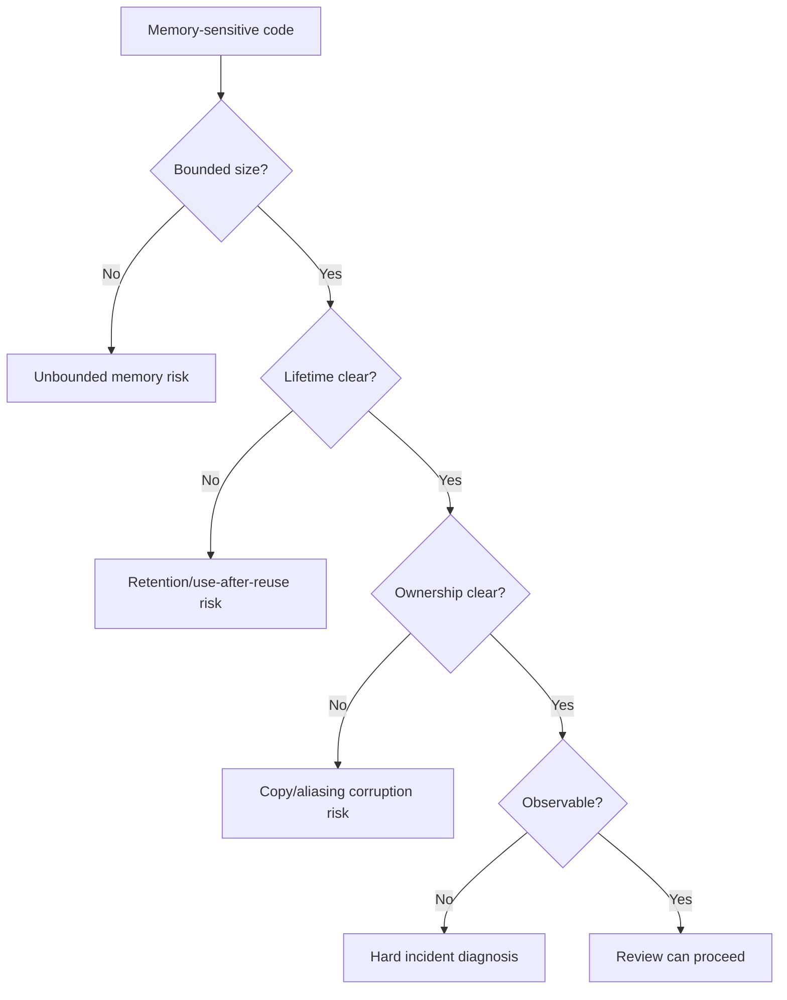
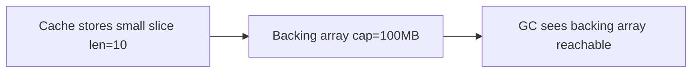
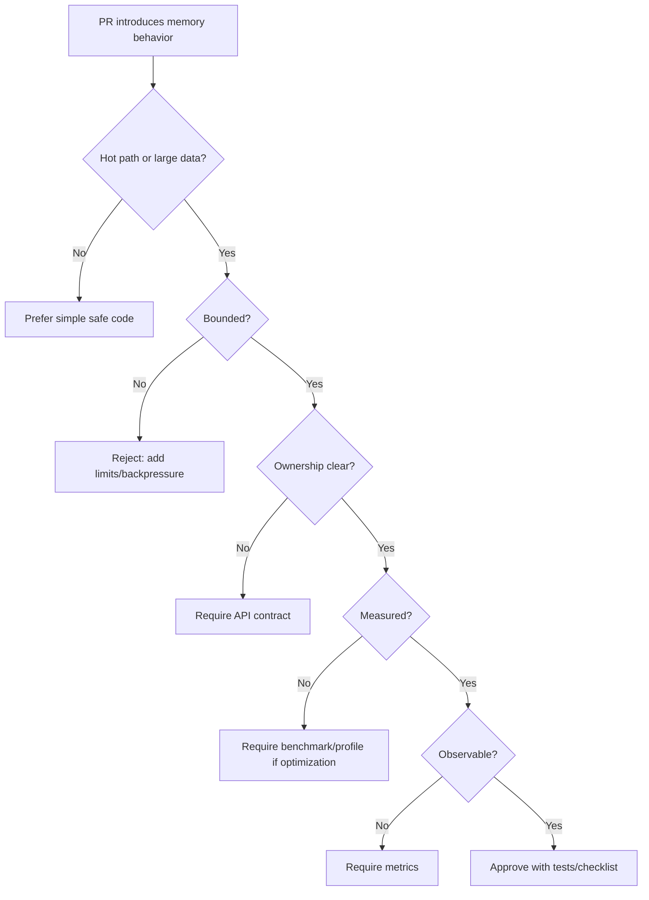

# learn-go-memory-systems-part-032.md

# Go Memory Systems Part 032 — Anti-Patterns: Premature Pooling, Unsafe Abuse, Accidental Retention, Slice Leaks

> Seri: `learn-go-memory-systems`  
> Part: `032`  
> Target: Go 1.26.x  
> Perspektif: Java software engineer menuju Go systems engineer  
> Status seri: **belum selesai** — ini bukan bagian terakhir.

---

## 0. Posisi Part Ini Dalam Seri

Part 031 membahas high-performance patterns:

- `sync.Pool`,
- object reuse,
- arena-like design,
- ownership transfer,
- pointer-free layout,
- bounded pools,
- callback view,
- copy boundary.

Part 032 adalah kebalikannya: katalog anti-pattern.

Tujuannya bukan sekadar membuat daftar “jangan”. Tujuannya membangun kemampuan review:

> Ketika membaca kode Go, kamu bisa melihat bentuk bug memory sebelum bug itu muncul di production.

Anti-pattern yang dibahas:

- premature pooling,
- unsafe abuse,
- accidental retention,
- slice leaks,
- `io.ReadAll` pada input tidak terbatas,
- unbounded channel/cache,
- `context.WithValue` sebagai object bag,
- logging payload besar,
- error yang menyimpan buffer besar,
- goroutine leak,
- finalizer sebagai destructor,
- off-heap tanpa budget,
- zero-copy palsu,
- pooling yang retain huge buffer,
- pointer everywhere,
- `map[string]any` di hot path.

---

## 1. Tujuan Pembelajaran

Setelah menyelesaikan part ini, kamu harus mampu:

1. Mengenali anti-pattern memory Go di code review.
2. Menjelaskan konsekuensi runtime dan production dari setiap anti-pattern.
3. Membedakan:
   - allocation problem,
   - retention problem,
   - lifecycle problem,
   - observability problem,
   - correctness problem.
4. Menentukan fix yang tepat, bukan sekadar “kurangi allocation”.
5. Menghindari optimasi yang memperburuk correctness.
6. Mendesain checklist anti-pattern untuk PR review.
7. Menghubungkan symptom production dengan anti-pattern kode.
8. Menghindari cargo-cult `sync.Pool`, `unsafe`, dan zero-copy.
9. Memahami bahwa beberapa allocation justru sehat sebagai ownership boundary.
10. Menyiapkan diri untuk Part 033: production design review dan incident playbook.

---

## 2. Mental Model Anti-Pattern

Anti-pattern memory biasanya melanggar salah satu invariant:

```text
1. Size bounded?
2. Lifetime clear?
3. Ownership clear?
4. Mutability controlled?
5. Cleanup deterministic?
6. Observability exists?
```

Jika salah satu jawabannya “tidak”, kode tersebut berpotensi menjadi incident.



---

## 3. Anti-Pattern 1 — Pointer Everywhere

### Bentuk

```go
type User struct {
    ID    *int64
    Name  *string
    Email *string
    Age   *int
}
```

Dipakai tanpa alasan jelas hanya karena “menghindari copy”.

### Masalah

- pointer graph lebih besar;
- GC harus scan lebih banyak pointer;
- nil checks meningkat;
- cache locality buruk;
- object count meningkat;
- API semantics kabur;
- escape lebih mudah terjadi.

### Fix

Gunakan value untuk field kecil dan wajib.

```go
type User struct {
    ID    int64
    Name  string
    Email string
    Age   int
}
```

Gunakan pointer hanya jika ada semantics:

- optional;
- shared mutable object;
- large object dengan ownership jelas;
- avoiding copy terbukti hot path;
- identity/reference semantics memang dibutuhkan.

---

## 4. Anti-Pattern 2 — Pointer Receiver Selalu

### Bentuk

```go
func (v *SmallValue) String() string
```

Padahal `SmallValue` kecil, immutable, dan tidak perlu mutasi.

### Masalah

- bisa memaksa addressability;
- bisa menyebabkan escape pada method value/interface;
- memberi sinyal mutability palsu;
- memperbesar aliasing.

### Fix

Gunakan value receiver untuk small immutable value.

```go
func (v SmallValue) String() string
```

Gunakan pointer receiver jika:

- method mutasi receiver;
- receiver besar dan copy cost terbukti signifikan;
- type mengandung mutex/resource;
- consistency method set butuh pointer.

---

## 5. Anti-Pattern 3 — `io.ReadAll` Pada Input Tidak Terpercaya

### Bentuk

```go
body, err := io.ReadAll(r.Body)
```

Pada HTTP request body tanpa limit.

### Masalah

- unbounded memory;
- attacker bisa mengirim body besar;
- OOMKill;
- GC pressure;
- latency spike;
- service-wide impact.

### Fix

Gunakan limit dan streaming.

```go
r.Body = http.MaxBytesReader(w, r.Body, 10<<20)
dec := json.NewDecoder(r.Body)
```

Atau stream ke file/hash/processor.

### Review Rule

Setiap `io.ReadAll` harus menjawab:

```text
Berapa ukuran maksimum input?
Siapa yang enforce limit?
Apakah streaming lebih tepat?
```

---

## 6. Anti-Pattern 4 — Slice Leak dari Subslice

### Bentuk

```go
small := big[:10]
cache[key] = small
```

### Masalah

`small` menahan seluruh backing array `big`.

Jika `big` 100 MB, cache 10 bytes bisa retain 100 MB.



### Fix

Copy boundary.

```go
small := bytes.Clone(big[:10])
cache[key] = small
```

Atau:

```go
small := append([]byte(nil), big[:10]...)
```

### Key Insight

Copy kecil bisa menghemat memory besar.

---

## 7. Anti-Pattern 5 — Full Slice Capacity Leak

### Bentuk

```go
func parse(buf []byte) []byte {
    return buf[:n]
}
```

Caller append ke result dan tidak sadar capacity masih besar.

### Masalah

- append bisa mutate backing array milik caller;
- retained capacity besar;
- aliasing hazard.

### Fix

Gunakan full slice expression untuk membatasi capacity:

```go
return buf[:n:n]
```

Atau return copy jika ownership harus independen.

---

## 8. Anti-Pattern 6 — Returning Borrowed Buffer as Owned

### Bentuk

```go
func ReadName(tmp []byte) []byte {
    return tmp[:10]
}
```

Caller mengira result owned.

### Masalah

- tmp bisa reused;
- data berubah;
- retention;
- race.

### Fix

Nama/API jelas:

```go
func ReadNameView(tmp []byte) []byte
func ReadNameCopy(tmp []byte) []byte
```

Atau callback:

```go
func WithName(tmp []byte, fn func([]byte) error) error
```

---

## 9. Anti-Pattern 7 — `sync.Pool` Sebagai Cache

### Bentuk

```go
var userPool sync.Pool

func PutUser(u *User) {
    userPool.Put(u)
}
```

Dipakai untuk menyimpan user penting atau long-lived object.

### Masalah

- runtime boleh drop item kapan saja;
- tidak ada eviction semantics;
- tidak ada size control;
- bukan cache;
- object bisa stale;
- reset/lifetime sulit.

### Fix

Gunakan cache yang benar:

- bounded by bytes/items;
- TTL/eviction;
- ownership jelas;
- metrics;
- invalidation.

Gunakan `sync.Pool` hanya untuk temporary reusable object.

---

## 10. Anti-Pattern 8 — Pooling Tanpa Reset

### Bentuk

```go
type Work struct {
    Req  *http.Request
    User *User
    Buf  []byte
}

pool.Put(work)
```

Tanpa reset.

### Masalah

- request/user tetap reachable;
- secrets bisa bocor ke request berikutnya;
- heap retention;
- data corruption.

### Fix

```go
func (w *Work) Reset() {
    w.Req = nil
    w.User = nil

    if cap(w.Buf) > maxKeep {
        w.Buf = nil
    } else {
        clear(w.Buf)
        w.Buf = w.Buf[:0]
    }
}
```

---

## 11. Anti-Pattern 9 — Pool Retains Huge Buffer

### Bentuk

```go
buf := make([]byte, 0, requestSize)
pool.Put(buf[:0])
```

Tidak ada cap limit.

### Masalah

- satu request besar bisa membuat pool menahan buffer besar;
- RSS/heap naik;
- memory tidak turun setelah spike.

### Fix

```go
if cap(buf) <= maxKeep {
    pool.Put(buf[:0])
}
```

Set `maxKeep` berbasis memory budget.

---

## 12. Anti-Pattern 10 — Use-After-Put

### Bentuk

```go
b := pool.Get().([]byte)
defer pool.Put(b[:0])

go func() {
    use(b)
}()
```

### Masalah

`defer` return ke pool sebelum goroutine selesai.

### Fix

- jangan async dengan pooled buffer;
- copy untuk async;
- ownership transfer dan release explicit;
- wait sebelum put.

```go
owned := append([]byte(nil), b...)
go use(owned)
```

---

## 13. Anti-Pattern 11 — Arena Dengan Mixed Lifetime

### Bentuk

```go
arena.Reset()
cache[key] = arenaView
```

### Masalah

Cache menyimpan view ke memory yang akan dipakai ulang.

### Fix

Copy saat data melewati boundary lifetime.

```go
cache[key] = append([]byte(nil), arenaView...)
```

Arena cocok hanya jika lifetime uniform.

---

## 14. Anti-Pattern 12 — Unsafe String dari Mutable Buffer

### Bentuk

```go
s := unsafe.String(unsafe.SliceData(buf), len(buf))
reuse(buf)
map[s] = value
```

### Masalah

String harus immutable. Jika backing bytes berubah:

- map key corruption;
- log corruption;
- security issue;
- undefined-like behavior at application level.

### Fix

Gunakan safe conversion:

```go
s := string(buf)
```

Unsafe hanya boleh jika:

- buffer immutable setelah conversion;
- lifetime guaranteed;
- no mutation;
- no reuse;
- measured need;
- isolated internal package.

---

## 15. Anti-Pattern 13 — `reflect.StringHeader` / `SliceHeader` Hack

### Bentuk

```go
hdr := (*reflect.StringHeader)(unsafe.Pointer(&s))
```

### Masalah

- deprecated for new unsafe string/slice conversion patterns;
- GC visibility hazards;
- invalid lifetime assumptions;
- fragile.

### Fix

Gunakan API modern:

- `unsafe.String`,
- `unsafe.StringData`,
- `unsafe.Slice`,
- `unsafe.SliceData`.

Tetap dengan invariant ketat.

---

## 16. Anti-Pattern 14 — `uintptr` Disimpan Sebagai Pointer

### Bentuk

```go
addr := uintptr(unsafe.Pointer(p))
// later
p2 := unsafe.Pointer(addr)
```

### Masalah

`uintptr` bukan pointer bagi GC. Object bisa tidak dianggap live. Stack/object movement/lifetime bisa salah.

### Fix

Jangan simpan pointer sebagai integer melintasi safepoint. Ikuti pattern valid `unsafe.Pointer`/`uintptr` sesuai dokumentasi.

Gunakan `runtime.KeepAlive` bila raw pointer/handle dipakai.

---

## 17. Anti-Pattern 15 — Off-Heap Tanpa Budget

### Bentuk

```go
p := C.malloc(size)
// no accounting
```

### Masalah

- tidak terlihat di heap profile;
- `GOMEMLIMIT` tidak membatasi secara penuh;
- RSS naik;
- OOMKill;
- leak sulit didiagnosis.

### Fix

- native memory limiter;
- explicit Close/free;
- metrics;
- finalizer/cleanup safety net only;
- RSS dashboard;
- ownership model.

---

## 18. Anti-Pattern 16 — Finalizer Sebagai Destructor

### Bentuk

```go
runtime.SetFinalizer(r, func(r *Resource) {
    r.Close()
})
// caller never closes
```

### Masalah

- nondeterministic;
- resource bisa habis sebelum GC;
- finalizer queue backlog;
- close ordering tidak jelas;
- business correctness tergantung GC.

### Fix

- explicit `Close`;
- `defer Close`;
- finalizer hanya leak detector/safety net;
- metrics jika finalizer triggered.

---

## 19. Anti-Pattern 17 — `runtime.GC()` Sebagai Normal Operation

### Bentuk

```go
ticker := time.NewTicker(time.Minute)
for range ticker.C {
    runtime.GC()
}
```

### Masalah

- hides real retention problem;
- adds latency/CPU;
- disrupts pacer;
- not a memory design fix.

### Fix

- diagnose with metrics/profile;
- fix allocation/retention;
- use `runtime.GC` only for tests/diagnostics/specific phase transition.

---

## 20. Anti-Pattern 18 — Periodic `debug.FreeOSMemory`

### Bentuk

```go
debug.FreeOSMemory()
```

dipanggil rutin di service.

### Masalah

- forces GC/scavenging;
- can hurt latency;
- does not fix live heap;
- masks memory budget issue.

### Fix

- tune `GOMEMLIMIT`;
- fix retention;
- use only for diagnostic or special batch phase.

---

## 21. Anti-Pattern 19 — Unbounded Map Cache

### Bentuk

```go
var cache = map[string][]byte{}
cache[key] = value
```

Tidak ada eviction.

### Masalah

- live heap grows forever;
- map buckets retain memory;
- values may retain backing arrays;
- no memory budget.

### Fix

- bounded cache;
- byte budget;
- TTL/eviction;
- max entry size;
- metrics.

---

## 22. Anti-Pattern 20 — Map Delete Dianggap Shrink Otomatis

### Bentuk

```go
for k := range m {
    delete(m, k)
}
```

Lalu berharap backing memory turun drastis.

### Masalah

Map backing storage may remain allocated for reuse.

### Fix

Jika perlu release:

```go
m = make(map[string]Value)
```

Atau rebuild periodically. Tetapi pastikan no references to old map.

---

## 23. Anti-Pattern 21 — Unbounded Channel as Queue

### Bentuk

```go
jobs := make(chan Job, 1000000)
```

Atau channel besar tanpa byte budgeting.

### Masalah

- channel retains jobs;
- jobs retain payloads;
- memory queue unbounded secara praktis;
- latency grows;
- cancellation harder.

### Fix

- smaller bounded queue;
- byte semaphore;
- backpressure;
- drop/reject;
- worker scaling;
- streaming.

---

## 24. Anti-Pattern 22 — Context as Object Bag

### Bentuk

```go
ctx = context.WithValue(ctx, "body", body)
ctx = context.WithValue(ctx, "user", user)
ctx = context.WithValue(ctx, "dbResult", result)
```

### Masalah

- context tree retains large object;
- hidden dependency;
- difficult lifetime reasoning;
- hard profiling.

### Fix

- context for cancellation/deadline/small request-scoped values;
- pass large objects explicitly;
- store IDs, not payload.

---

## 25. Anti-Pattern 23 — Logging Payload Besar

### Bentuk

```go
logger.Info("request", "body", body)
```

### Masalah

- allocation;
- retention;
- PII/security risk;
- log cost;
- GC pressure.

### Fix

```go
logger.Info("request",
    "body_len", len(body),
    "request_id", requestID,
)
```

Log sample/excerpt only with strict policy.

---

## 26. Anti-Pattern 24 — Error Menyimpan Input Besar

### Bentuk

```go
type ParseError struct {
    Input []byte
    Err   error
}
```

### Masalah

Jika error disimpan/logged/retried, input besar retained.

### Fix

```go
type ParseError struct {
    Offset int
    Code   string
    Err    error
}
```

Optionally small excerpt with max length.

---

## 27. Anti-Pattern 25 — Goroutine Leak

### Bentuk

```go
go func() {
    resultCh <- work()
}()
select {
case <-ctx.Done():
    return
case r := <-resultCh:
    _ = r
}
```

Jika context done, goroutine bisa blocked sending.

### Masalah

- goroutine retained;
- stack retained;
- captured buffers retained;
- scheduler overhead;
- memory leak.

### Fix

- buffered result channel size 1;
- context-aware work;
- select on send;
- worker pool lifecycle;
- cancellation/drain.

---

## 28. Anti-Pattern 26 — Timer/Ticker Tidak Di-Stop

### Bentuk

```go
ticker := time.NewTicker(time.Second)
go func() {
    for range ticker.C {}
}()
```

No stop.

### Masalah

- timer retained;
- goroutine leak;
- shutdown leak.

### Fix

```go
ticker := time.NewTicker(time.Second)
defer ticker.Stop()
```

And goroutine exits on context.

---

## 29. Anti-Pattern 27 — Response Body Tidak Di-Close

### Bentuk

```go
resp, err := http.Get(url)
if err != nil {
    return err
}
data, _ := io.ReadAll(resp.Body)
```

No close.

### Masalah

- connection not reused/released;
- FD/socket leak;
- goroutine/transport resource retained.

### Fix

```go
defer resp.Body.Close()
```

Also consider reading/discarding body for reuse semantics where appropriate.

---

## 30. Anti-Pattern 28 — `defer` Dalam Hot Loop Tanpa Perlu

### Bentuk

```go
for _, item := range items {
    f, _ := os.Open(item)
    defer f.Close()
}
```

### Masalah

- files stay open until function returns;
- FD exhaustion;
- memory/resource retention.

### Fix

Use inner function:

```go
for _, item := range items {
    if err := processFile(item); err != nil {
        return err
    }
}
```

Where `processFile` defers close per file.

---

## 31. Anti-Pattern 29 — Large Struct Copied Accidentally

### Bentuk

```go
func Process(v LargeStruct) {}
```

Large struct contains arrays or many fields.

### Masalah

- copy cost;
- cache pressure;
- hidden movement.

### Fix

- pass pointer if mutation/large copy issue proven;
- split hot/cold;
- avoid large arrays inside frequently copied struct;
- benchmark.

Do not blindly pointer everything.

---

## 32. Anti-Pattern 30 — Copying Mutex/Resource Owner

### Bentuk

```go
type Counter struct {
    mu sync.Mutex
    n  int
}

func (c Counter) Inc() {
    c.mu.Lock()
    defer c.mu.Unlock()
    c.n++
}
```

### Masalah

Method copies mutex and state. Correctness bug.

### Fix

```go
func (c *Counter) Inc() {}
```

Resource owner types should not be copied after first use.

---

## 33. Anti-Pattern 31 — `map[string]any` di Hot Path

### Bentuk

```go
var payload map[string]any
json.Unmarshal(data, &payload)
```

### Masalah

- reflection;
- interface allocation;
- dynamic type assertions;
- many maps/slices;
- GC-heavy.

### Fix

- typed struct;
- streaming decoder;
- custom parser/codegen if justified;
- dynamic map only for control plane/admin/unknown schema.

---

## 34. Anti-Pattern 32 — `[]T` to `[]any` Conversion Per Request

### Bentuk

```go
args := make([]any, len(items))
for i := range items {
    args[i] = items[i]
}
log(args...)
```

### Masalah

- allocation;
- boxing-like interface conversions;
- object graph growth.

### Fix

- typed API;
- loop without converting whole slice;
- structured logger typed fields;
- generics/concrete functions.

---

## 35. Anti-Pattern 33 — JSON Roundtrip for Copy/Map

### Bentuk

```go
json.Marshal(x)
json.Unmarshal(data, &y)
```

Dipakai untuk deep copy atau mapping.

### Masalah

- massive allocation;
- reflection;
- lossy semantics;
- performance poor.

### Fix

- explicit copy;
- mapper function;
- code generation;
- schema-specific transform.

---

## 36. Anti-Pattern 34 — Hidden Allocation in Interface-Based API

### Bentuk

```go
func Handle(v any) {
    store(v)
}
```

### Masalah

- values can escape;
- allocation hidden from caller;
- dynamic type graph retained;
- hard profile attribution.

### Fix

- typed API for hot path;
- generic API if appropriate;
- document ownership.

---

## 37. Anti-Pattern 35 — Unbounded `bytes.Buffer` Reuse

### Bentuk

```go
var buf bytes.Buffer
// one huge write
buf.Reset()
// reused forever
```

### Masalah

`Reset` keeps capacity.

### Fix

If buffer too large, replace it.

```go
if buf.Cap() > maxKeep {
    buf = bytes.Buffer{}
} else {
    buf.Reset()
}
```

---

## 38. Anti-Pattern 36 — `strings.Builder` Misuse

### Bentuk

- copying builder after use;
- retaining huge builder capacity;
- converting repeatedly.

### Masalah

Builder has ownership semantics. Misuse can panic or retain memory.

### Fix

- use builder locally;
- reset or discard huge;
- don't copy non-zero builder;
- use `Grow` only with reasonable size.

---

## 39. Anti-Pattern 37 — Assuming `append` Does Not Alias

### Bentuk

```go
func AddTag(tags []string, tag string) []string {
    return append(tags, tag)
}
```

Caller assumes original unchanged, but if capacity allows, backing array mutates.

### Fix

If independent copy required:

```go
out := append([]string(nil), tags...)
out = append(out, tag)
return out
```

Or document mutation/ownership.

---

## 40. Anti-Pattern 38 — Ignoring Bounds in Binary Parser

### Bentuk

```go
n := binary.LittleEndian.Uint32(b[off:])
```

Without ensuring `off+4 <= len(b)`.

### Masalah

- panic;
- DoS from malformed input;
- fuzz failure.

### Fix

```go
if off < 0 || off+4 > len(b) {
    return 0, ErrShort
}
n := binary.LittleEndian.Uint32(b[off : off+4])
```

---

## 41. Anti-Pattern 39 — Struct Overlay for File/Network Format

### Bentuk

```go
hdr := (*Header)(unsafe.Pointer(&b[0]))
```

### Masalah

- alignment;
- padding;
- endian;
- portability;
- malformed input;
- unsafe.

### Fix

Use explicit binary decoding.

---

## 42. Anti-Pattern 40 — mmap Mutable File Without Protocol

### Bentuk

- writer mutates mapped bytes directly;
- no checksum;
- no WAL;
- no commit marker;
- reader maps same file.

### Masalah

- crash-inconsistent file;
- partial update;
- SIGBUS/truncation;
- corruption.

### Fix

- immutable segment;
- temp file + sync + rename;
- WAL/manifest/checksum;
- reader maps sealed files.

---

## 43. Anti-Pattern 41 — Heap Profile Only for OOM

### Bentuk

OOMKilled pod, engineer only checks heap profile.

### Masalah

OOM may be from:

- mmap;
- cgo;
- stacks;
- RSS gap;
- page cache/accounting;
- native allocator;
- container limit too low.

### Fix

Check:

- RSS/cgroup;
- runtime memory classes;
- mmap/native metrics;
- goroutine count;
- heap profile;
- OS maps/smaps where needed.

---

## 44. Anti-Pattern 42 — Tuning Before Diagnosis

### Bentuk

```text
memory high -> lower GOGC
GC high -> raise GOGC
```

Without profile/metrics.

### Masalah

- can worsen latency;
- can increase OOM risk;
- masks retention;
- no evidence.

### Fix

Use workflow:

1. metrics;
2. profile;
3. classify;
4. fix design/allocation;
5. tune last.

---

## 45. Anti-Pattern 43 — `GOMEMLIMIT` Equal Container Limit

### Bentuk

```text
container limit = 2GiB
GOMEMLIMIT = 2GiB
```

### Masalah

- native/mmap/stacks/libs need memory;
- soft limit not hard RSS cap;
- OOM risk.

### Fix

Reserve margin:

```text
GOMEMLIMIT = container_limit - native_budget - stack_budget - safety_margin
```

---

## 46. Anti-Pattern 44 — Ignoring CPU Throttling

### Bentuk

GC latency blamed, but pod CPU throttled.

### Masalah

- GC progresses slower;
- mutator assist increases;
- heap grows;
- latency rises.

### Fix

Monitor CPU throttling with GC metrics.

---

## 47. Anti-Pattern 45 — No Memory Budget for Feature

### Bentuk

Feature adds:

- cache;
- queue;
- buffer;
- mmap;
- worker pool;

but no memory budget.

### Masalah

Production memory becomes accidental.

### Fix

Every memory-owning feature should define:

```text
max bytes
eviction/backpressure
metric
alert
failure behavior
```

---

## 48. Anti-Pattern 46 — No Profile Baseline

### Bentuk

Incident happens; no known normal heap/alloc/goroutine profile.

### Masalah

Hard to know if profile is abnormal.

### Fix

Capture baseline:

- idle;
- steady load;
- peak;
- after cache warmup;
- batch phase.

---

## 49. Anti-Pattern 47 — Premature Unsafe

### Bentuk

Unsafe used before simple alternatives:

- prealloc;
- append-style API;
- bytes API;
- streaming;
- typed struct.

### Masalah

- data corruption risk;
- Go version fragility;
- portability issues;
- maintenance cost.

### Fix

Unsafe only after:

- profile evidence;
- safe alternatives tested;
- invariant documented;
- tests/fuzz/race;
- isolated package.

---

## 50. Anti-Pattern 48 — “Zero-Copy” That Retains Gigabytes

### Bentuk

```go
view := bigFileBytes[offset : offset+20]
store(view)
```

### Masalah

20-byte view retains huge backing array/mmap/lifetime.

### Fix

Copy small data that escapes.

```go
store(bytes.Clone(view))
```

Zero-copy is beneficial only when lifetime and size make sense.

---

## 51. Anti-Pattern 49 — Unbounded Recursive/Deep Stack

### Bentuk

Recursive parser over untrusted nested input.

### Masalah

- stack growth;
- possible stack overflow;
- memory pressure;
- DoS.

### Fix

- depth limit;
- iterative parser;
- explicit stack with budget.

---

## 52. Anti-Pattern 50 — Large Local Array in Hot Function

### Bentuk

```go
func handle() {
    var scratch [1 << 20]byte
    use(scratch[:])
}
```

### Masalah

- large stack frame;
- stack growth/copy cost;
- possible escape;
- per-goroutine memory.

### Fix

- allocate/reuse buffer with clear lifetime;
- per-worker scratch;
- pool with cap;
- smaller chunks.

---

## 53. Anti-Pattern 51 — Retaining Request in Closure

### Bentuk

```go
go func() {
    logLater(r)
}()
```

### Masalah

Captures entire request, body, context, headers.

### Fix

Capture only necessary small fields.

```go
requestID := getRequestID(r)
go func(id string) {
    logLater(id)
}(requestID)
```

---

## 54. Anti-Pattern 52 — Accidental Method Value Capture

### Bentuk

```go
cb := bigObj.Handle
queue.Enqueue(cb)
```

### Masalah

Method value captures receiver; `bigObj` retained.

### Fix

Capture small ID or explicit function.

```go
id := bigObj.ID
queue.Enqueue(func() { handleByID(id) })
```

---

## 55. Anti-Pattern 53 — Retaining `time.After` in Loop

### Bentuk

```go
for {
    select {
    case <-time.After(time.Second):
    }
}
```

### Masalah

Creates timer repeatedly; in some patterns can increase allocation/timer pressure.

### Fix

Use `time.NewTimer` reuse or `time.Ticker` with Stop.

---

## 56. Anti-Pattern 54 — Ignoring Close Error on Write Path

### Bentuk

```go
defer f.Close()
f.Write(data)
```

### Masalah

Close can report delayed write error.

### Fix

Capture close error when writing important data.

```go
func write(path string, data []byte) (err error) {
    f, err := os.Create(path)
    if err != nil {
        return err
    }
    defer func() {
        cerr := f.Close()
        if err == nil {
            err = cerr
        }
    }()

    _, err = f.Write(data)
    return err
}
```

---

## 57. Anti-Pattern 55 — No Explicit Ownership in API

### Bentuk

```go
func Store(b []byte)
```

Does it copy? retain? mutate? own?

### Masalah

Caller and callee make different assumptions.

### Fix

Name/document:

```go
func StoreCopy(b []byte)
func StoreBorrowed(b []byte)
func StoreOwned(b []byte)
```

Or callback/reader/writer API.

---

## 58. Symptom-to-Anti-Pattern Map

| Symptom | Likely anti-pattern |
|---|---|
| RSS high, heap low | mmap/native/off-heap no budget |
| heap grows with traffic and never drops | unbounded cache/map/channel |
| GC CPU high, heap stable | allocation churn: fmt/json/logging/interface |
| p99 spikes under load | allocation assist, blocking, pool contention |
| user sees wrong data | pooled buffer use-after-put |
| memory spike after one large request | huge buffer retained in pool |
| OOM on upload | `io.ReadAll` no limit |
| goroutines grow | channel send leak/context not cancelled |
| heap profile points to `io.ReadAll` | body buffering or subslice retention |
| close resources late | finalizer relied on |

---

## 59. Code Review Checklist

Ask for memory-sensitive PR:

### Size

- What is max input size?
- Is buffer/cache/queue bounded?
- Is size measured in bytes?

### Lifetime

- Who owns the data?
- Can this view escape?
- Does this retain a backing array?
- Is there async use?

### Allocation

- Is this hot path?
- Are allocations measured?
- Is prealloc possible?

### Retention

- Are pointer fields reset?
- Are slices cloned at boundary?
- Are maps/caches evicted?

### Resource

- Is Close explicit?
- Is Close idempotent?
- Is finalizer only safety net?

### Unsafe

- Is unsafe necessary?
- Are invariants documented?
- Are tests/fuzz added?

### Observability

- Are metrics added for memory-owning feature?
- Is there alert/runbook?

---

## 60. Mermaid: Anti-Pattern Review Flow



---

## 61. Mini Lab 1 — Find Slice Leak

Write code that:

1. allocates 100 MB;
2. stores 10-byte subslice globally;
3. prints heap profile;
4. fixes with clone.

Goal:

- see retention.

---

## 62. Mini Lab 2 — Pool Poisoning

Create pool of `[]byte`.

1. put 64 KiB buffers normally;
2. process one 50 MB input;
3. put it into pool;
4. observe memory;
5. add cap drop.

Goal:

- understand huge buffer retention.

---

## 63. Mini Lab 3 — Goroutine Leak

Create request-like function that starts goroutine blocked on send after cancellation.

Capture goroutine profile.

Fix with buffered channel/context-aware send.

---

## 64. Mini Lab 4 — Unsafe Corruption

Create unsafe string view over byte slice, use as map key, mutate byte slice.

Observe wrong behavior conceptually. Do not use this pattern in real code.

Goal:

- internalize immutability invariant.

---

## 65. Mini Lab 5 — Context Retention

Store large buffer in context and keep context in global list.

Observe heap retention.

Fix by storing request ID only.

---

## 66. Production Guardrails

Add automated checks where possible:

- benchmarks for critical hot paths;
- static lint for `io.ReadAll` in handlers;
- review rule for `unsafe`;
- tests for pool reset;
- max body size middleware;
- cache byte budget;
- queue byte budget;
- pprof secured;
- memory dashboard baseline;
- OOM runbook.

---

## 67. What Top Engineers Notice

A weaker engineer says:

> “This code has fewer allocations.”

A stronger engineer asks:

- Does it retain more memory?
- Does it corrupt ownership?
- Does it hide data race?
- Is lifetime clear?
- Is size bounded?
- Is `unsafe` justified?
- Is there a metric?
- What happens after one huge request?
- What happens when context is cancelled?
- What happens if caller stores returned slice?
- What happens during reload/shutdown?

Memory engineering is not just reducing allocation. It is controlling lifetime, ownership, and failure modes.

---

## 68. Summary

Most serious Go memory bugs are not caused by “GC being bad”. They are caused by:

- unclear ownership;
- unbounded size;
- accidental retention;
- unsafe lifetime violation;
- pooling without reset;
- buffering instead of streaming;
- hidden goroutine/resource leaks;
- missing observability.

The strongest default strategy:

1. Use simple safe code first.
2. Bound memory.
3. Stream large data.
4. Copy at ownership boundaries.
5. Profile before optimizing.
6. Use pools/unsafe/off-heap only with evidence.
7. Add metrics for memory-owning features.

---

## 69. Part 032 Completion Checklist

Kamu siap lanjut jika bisa menjawab:

- Kenapa `sync.Pool` bukan cache?
- Bagaimana subslice bisa retain backing array besar?
- Kenapa unsafe string dari mutable buffer berbahaya?
- Kenapa `io.ReadAll` butuh limit?
- Bagaimana channel bisa menjadi memory queue?
- Kenapa context tidak boleh menjadi object bag?
- Kenapa finalizer bukan destructor?
- Apa tanda pool poisoning?
- Kapan copy lebih baik daripada zero-copy?
- Apa checklist review untuk PR memory-sensitive?

---

## 70. Seri Belum Selesai

Bagian ini adalah:

```text
learn-go-memory-systems-part-032.md
```

Part berikutnya:

```text
learn-go-memory-systems-part-033.md
```

Topik berikutnya:

```text
Production design review: memory budgets, SLOs, failure modes, incident playbook
```


<!-- NAVIGATION_FOOTER -->
<div class="page-nav">
<a href="./learn-go-memory-systems-part-031.md">⬅️ Go Memory Systems Part 031 — High-Performance Patterns: Pools, Arena-Like Design, Object Reuse, Ownership Transfer</a>
<a href="./index.md">📚 Kategori</a>
<a href="../../index.md">🏠 Home</a>
<a href="./learn-go-memory-systems-part-033.md">Go Memory Systems Part 033 — Production Design Review: Memory Budgets, SLOs, Failure Modes, Incident Playbook ➡️</a>
</div>
