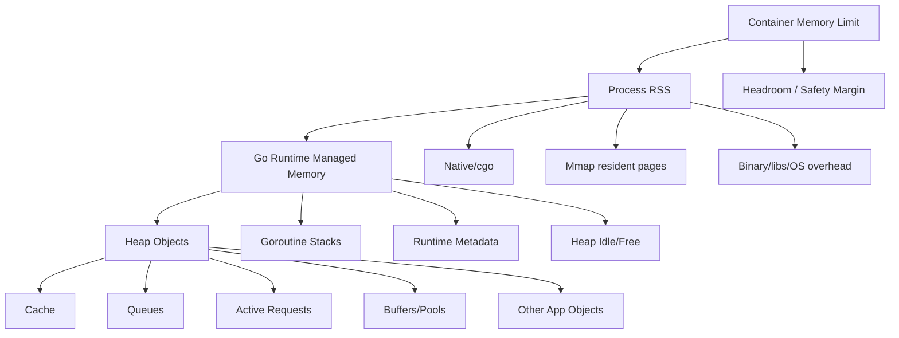
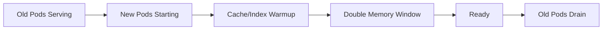
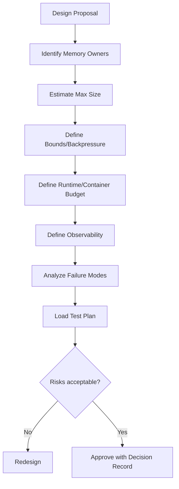

# learn-go-memory-systems-part-033.md

# Go Memory Systems Part 033 — Production Design Review: Memory Budgets, SLOs, Failure Modes, Incident Playbook

> Seri: `learn-go-memory-systems`  
> Part: `033`  
> Target: Go 1.26.x  
> Perspektif: Java software engineer menuju Go systems engineer  
> Status seri: **belum selesai** — ini bukan bagian terakhir.

---

## 0. Posisi Part Ini Dalam Seri

Part 032 membahas anti-pattern memory:

- premature pooling,
- unsafe abuse,
- accidental retention,
- slice leaks,
- unbounded queues,
- off-heap tanpa budget,
- context/log/error retention,
- tuning sebelum diagnosis.

Part 033 mengubah seluruh pengetahuan itu menjadi **production design review**.

Ini bagian yang biasanya membedakan engineer “bisa menulis Go cepat” dari engineer yang bisa menjaga service tetap hidup di production.

Pertanyaan utama:

> Bagaimana kita menilai desain Go dari sisi memory sebelum incident terjadi?

Kita akan membahas:

- memory budget,
- SLO dan memory trade-off,
- container/cgroup planning,
- heap/RSS/native/mmap breakdown,
- request memory budget,
- cache/queue/buffer budget,
- failure mode analysis,
- readiness checklist,
- incident playbook,
- dashboard/alert requirements,
- design review template,
- production decision record.

---

## 1. Tujuan Pembelajaran

Setelah menyelesaikan part ini, kamu harus mampu:

1. Membuat memory budget untuk Go service.
2. Membedakan budget:
   - heap,
   - RSS,
   - cache,
   - queue,
   - buffer,
   - native/mmap,
   - goroutine stack,
   - safety margin.
3. Menghubungkan memory dengan:
   - latency SLO,
   - throughput,
   - availability,
   - OOM risk,
   - deployment capacity.
4. Mendesain review checklist untuk memory-sensitive feature.
5. Menganalisis failure mode sebelum implementasi.
6. Menentukan observability wajib sebelum release.
7. Membuat incident playbook untuk:
   - OOMKilled,
   - GC CPU spike,
   - heap leak,
   - RSS gap,
   - goroutine leak,
   - buffer/queue explosion,
   - native/mmap leak.
8. Membuat decision record untuk tuning/performance choice.
9. Menghindari “optimasi lokal” yang merusak operability.
10. Menyiapkan capstone part 034.

---

## 2. Prinsip Utama

Production memory engineering bukan dimulai dari `GOGC`.

Dimulai dari:

```text
What is the maximum memory this service is allowed to use,
under what workload,
with what latency,
and what happens when that assumption is violated?
```

Jika tidak ada jawaban, maka memory behavior service bersifat accidental.

---

## 3. Memory Budget Sebagai Kontrak

Memory budget adalah kontrak antara:

- aplikasi,
- runtime Go,
- container/orchestrator,
- infrastructure,
- SLO,
- cost model,
- failure mode.

Contoh kontrak:

```text
Service: payment-api
Pod memory limit: 2 GiB
Expected steady RSS: <= 1.2 GiB
Expected p99 RSS: <= 1.5 GiB
OOM safety margin: >= 512 MiB
GOMEMLIMIT: 1400 MiB
Cache budget: 300 MiB
Queue budget: 100 MiB
Max request body: 10 MiB
Max concurrent in-flight body memory: 200 MiB
Native/mmap budget: 0 MiB
Expected goroutines: <= 2000
```

Ini jauh lebih kuat daripada “service pakai Go, GC otomatis”.

---

## 4. Memory Budget Breakdown



Review rule:

> Setiap kategori besar harus punya estimasi, limit, metric, dan owner.

---

## 5. Heap Budget

Heap budget bukan hanya angka “berapa heap boleh”.

Ia harus menjawab:

- berapa live heap steady state?
- berapa heap peak?
- berapa heap goal dengan `GOGC`?
- berapa allocation rate?
- apakah heap didominasi cache?
- apakah object pointer-rich?
- apakah heap growth intentional?
- apa yang terjadi saat heap melewati budget?

Contoh:

```text
heap live steady: 600 MiB
heap live peak: 900 MiB
heap goal expected: 1.3 GiB
GOMEMLIMIT: 1.5 GiB
```

Jika heap goal sering lebih tinggi dari safe budget, tuning/desain perlu diperbaiki.

---

## 6. RSS Budget

RSS adalah yang menentukan OOM di level OS/container.

RSS mencakup lebih dari Go heap:

- Go runtime memory;
- stacks;
- mmap resident pages;
- cgo/native allocations;
- binary/shared libraries;
- page tables;
- OS/accounting overhead.

Review rule:

> Production memory budget harus berbasis RSS/cgroup, bukan heap profile saja.

---

## 7. Native/Mmap Budget

Jika service menggunakan:

- cgo,
- mmap,
- syscall allocation,
- external native library,
- memory-mapped index,
- direct OS buffers,

maka buat budget terpisah.

Contoh:

```text
mapped index virtual size: 8 GiB
expected resident working set: 500 MiB
max tolerated resident set: 900 MiB
reload double-map window: 1.8 GiB
container limit adjusted: yes
metrics: mapped_file_bytes, mapped_generation, major_faults
```

Perhatikan reload. Saat versi baru dimap, bisa ada dua mapping aktif sementara.

---

## 8. Goroutine Stack Budget

Goroutine murah, bukan gratis.

Budget:

```text
expected goroutines: 1,500
max goroutines: 5,000
stack memory expected: 64 MiB
goroutine leak alert: growth 3x baseline for 30m
```

Goroutine leak tidak hanya memakan stack, tetapi juga menahan object dari stack/closure.

---

## 9. Request Memory Budget

Setiap request bisa memakai memory.

Contoh API upload:

```text
max body size: 10 MiB
max concurrent uploads: 50
stream buffer per upload: 64 KiB
worst body memory if streaming: ~3.2 MiB
worst body memory if ReadAll: 500 MiB
```

Inilah alasan streaming bisa mengubah feasibility service.

---

## 10. Queue Budget

Channel/queue harus dibudget berdasarkan bytes.

```text
queue capacity: 1000 jobs
max job payload: 256 KiB
worst-case queue memory: 256 MiB
```

Jika job payload tidak dibatasi, queue memory juga tidak dibatasi.

Better:

```text
queue item count: 1000
queue byte budget: 128 MiB
backpressure: block/reject
overflow behavior: 429/drop/dead-letter
metric: queue_payload_bytes
```

---

## 11. Cache Budget

Cache harus punya:

- max bytes;
- max entry size;
- eviction policy;
- TTL/staleness policy;
- metrics;
- warmup plan;
- cold-start behavior;
- invalidation behavior.

Bad:

```text
cache entries max = 100000
```

If entry size variable, item count insufficient.

Good:

```text
cache max bytes = 300 MiB
max entry = 1 MiB
eviction = LRU
metric = cache_bytes
alert = cache_bytes > 95% budget for 10m
```

---

## 12. Buffer Pool Budget

If pool exists:

- max kept buffer cap;
- idle memory cap;
- drop policy;
- reset policy;
- secret wipe policy;
- metrics.

Example:

```text
buffer default cap: 64 KiB
drop if cap > 1 MiB
pool idle target: best effort
custom pool max idle bytes: 128 MiB
metrics: pool_get, pool_new, pool_drop_large
```

---

## 13. Memory SLOs

Memory itself is rarely customer-facing, but it affects:

- availability via OOM;
- latency via GC/assist/page faults;
- throughput via CPU;
- cost via pod size;
- deploy reliability via rollouts;
- noisy neighbor risk.

Example SLO-supporting objectives:

```text
RSS p99 <= 75% container limit
OOMKilled = 0
GC CPU <= 15% under peak
p99 latency does not regress > 10% during GC cycles
goroutine count stable after traffic normalizes
allocation rate does not exceed 2x baseline after deploy
```

---

## 14. Latency vs Memory Trade-Off

Raising `GOGC` may:

- reduce GC CPU;
- reduce assist;
- improve p99;
- increase memory footprint;
- increase OOM risk.

Lowering `GOGC` may:

- reduce heap footprint;
- increase GC frequency;
- increase CPU;
- hurt p99.

Production review must state which trade-off is acceptable.

---

## 15. Capacity During Deployment

Rolling deployment can increase memory usage:

- old pod + new pod overlap;
- cache warmup duplicates memory;
- mmap reload double maps files;
- startup loads large config;
- readiness waits while memory high.

Capacity review must include deployment phase, not just steady state.



---

## 16. Memory Failure Modes

Classify failure modes:

| Failure | Symptom | Primary tool |
|---|---|---|
| Heap leak | heap live grows | heap profile |
| Allocation churn | GC CPU high | allocs profile |
| OOM RSS | pod killed | cgroup/RSS metrics |
| Native leak | RSS high, heap low | native metrics |
| Mmap working set | page faults/RSS high | mmap metrics/OS |
| Goroutine leak | goroutine count grows | goroutine profile |
| Queue explosion | queue bytes grows | app queue metric |
| Cache unbounded | cache bytes grows | cache metrics |
| Pool poisoning | heap/RSS after spike | pool metrics |
| Blocking | latency high, CPU low | block/mutex profile |

---

## 17. Failure Mode Analysis Template

For each feature:

```text
Feature:
Memory-owned components:
Maximum size:
Who enforces maximum:
What happens if exceeded:
Backpressure/reject behavior:
Cleanup/release path:
Metrics:
Alerts:
Profiles to capture:
Rollback:
```

If “maximum size” is unknown, feature is not production-ready.

---

## 18. Example Review — HTTP Upload Service

### Risky design

```go
body, _ := io.ReadAll(r.Body)
process(body)
```

### Review findings

- no max body;
- memory per request unbounded;
- concurrent requests multiply risk;
- OOM possible;
- no active upload bytes metric.

### Production design

```text
max request body: 100 MiB
processing mode: stream
buffer per upload: 256 KiB
max concurrent upload workers: 20
max active upload memory: ~5 MiB buffer + OS/socket
backpressure: 429 when worker queue full
metrics: active_uploads, active_upload_bytes, rejected_uploads
```

---

## 19. Example Review — Cache Feature

### Risky design

```go
map[string][]byte
```

No limit.

### Production design

```text
cache max bytes: 512 MiB
max entry: 2 MiB
eviction: LRU by bytes
TTL: 15m
admission: reject too large
metrics: cache_bytes, entries, evictions, rejects
alerts: cache_bytes > 95% budget
```

Also:

- clone small slices crossing boundary;
- avoid retaining giant backing arrays;
- clear on shutdown if needed.

---

## 20. Example Review — Mmap Index

### Questions

- Is file immutable?
- Can file be truncated?
- How is file published?
- Is checksum validated?
- Is reload double-map budgeted?
- What is working set?
- What happens on page fault storm?
- What metrics show mapped bytes?
- How are readers drained before unmap?
- Is `LookupView` lifetime bounded?

### Production requirements

- temp + sync + rename publish;
- read-only mapping;
- validation before serving;
- callback view API;
- refcount/RCU reload;
- mapped bytes metric;
- RSS/page fault monitoring.

---

## 21. Example Review — Native Buffer

### Questions

- Who frees?
- Is `Close` explicit?
- Is finalizer only safety net?
- Is memory accounted?
- What if allocation fails?
- What if Close races with use?
- Is `runtime.KeepAlive` needed?
- Is native memory included in pod budget?

### Production requirements

- native limiter;
- idempotent Close;
- borrowed lease;
- metrics;
- tests for double close/use after close;
- no finalizer-only lifecycle.

---

## 22. Observability Requirements Before Release

For memory-sensitive feature, require:

- runtime metrics dashboard exists;
- RSS/cgroup dashboard exists;
- app-level memory metrics added;
- alert thresholds defined;
- pprof access path secured;
- runbook updated;
- benchmark/profile baseline captured;
- load test artifact stored.

No observability means no production confidence.

---

## 23. Readiness Checklist

Before production:

### Runtime

- `GOMEMLIMIT` configured with margin?
- `GOGC` default/tuned documented?
- pprof secured?
- runtime metrics exported?
- dashboard includes heap goal/live/RSS?

### App

- caches bounded?
- queues bounded?
- request bodies limited?
- buffers capped?
- native/mmap accounted?
- goroutines lifecycle controlled?

### Testing

- load test peak?
- spike test?
- large payload test?
- cancellation test?
- shutdown test?
- leak test?

### Operations

- alerts?
- runbooks?
- rollback?
- deployment memory double-count?

---

## 24. Memory Design Decision Record

Template:

```text
Title:
Service:
Date:
Owner:

Context:
- Workload:
- SLO:
- Memory limit:
- Runtime version:
- Key memory owners:

Decision:
- ...

Memory budget:
- Heap:
- Cache:
- Queue:
- Buffer:
- Native/mmap:
- Safety margin:

Alternatives considered:
- ...

Evidence:
- Benchmarks:
- Profiles:
- Load test:
- Metrics:

Risks:
- ...

Failure modes:
- ...

Observability:
- ...

Rollback:
- ...

Review date:
```

---

## 25. Incident Playbook — OOMKilled

### Signal

- pod restarted;
- reason OOMKilled;
- RSS/cgroup near limit before death.

### Immediate questions

1. Was there a deployment?
2. Was traffic/request size abnormal?
3. Was heap high or RSS gap?
4. Did cache/queue grow?
5. Did goroutines grow?
6. Any native/mmap feature?
7. Was `GOMEMLIMIT` set correctly?
8. Was CPU throttling slowing GC?

### Data to collect

- previous pod logs;
- cgroup memory metrics;
- RSS trend;
- Go heap/runtime metrics before death;
- app cache/queue/native metrics;
- deploy marker;
- traffic histogram.

### Mitigation

- scale out;
- reduce traffic;
- rollback;
- lower cache budget;
- reject large requests;
- increase pod limit;
- adjust `GOMEMLIMIT`;
- disable memory-heavy feature.

### Root cause

Use profile/reproduction if possible.

---

## 26. Incident Playbook — GC CPU Spike

### Signal

- CPU up;
- GC CPU up;
- allocation rate up;
- p99 latency up;
- heap live may be stable.

### Collect

- allocs profile;
- CPU profile;
- runtime metrics;
- deployment diff;
- benchmark of suspected path.

### Likely causes

- logging change;
- JSON/map dynamic decode;
- string/byte conversion;
- `fmt.Sprintf`;
- new intermediate slice/map;
- pool removed/broken;
- request size changed;
- `GOMEMLIMIT` too tight.

### Mitigation

- rollback;
- reduce logging;
- raise `GOGC` temporarily if memory safe;
- increase memory limit if needed;
- patch allocation source.

---

## 27. Incident Playbook — Heap Leak

### Signal

- heap live grows over time;
- does not return after GC;
- RSS follows;
- allocation rate may not be high.

### Collect

- heap `inuse_space`;
- goroutine profile;
- cache/queue metrics;
- before/after heap diff.

### Likely causes

- unbounded cache;
- map not cleared/rebuilt;
- subslice retention;
- goroutine leak;
- context value retention;
- error/log retention;
- channel queue.

### Mitigation

- reduce cache;
- clear queue;
- rollback;
- add bounds;
- clone small slices at boundary;
- fix goroutine cancellation.

---

## 28. Incident Playbook — RSS High, Heap Normal

### Signal

- RSS/cgroup high;
- Go heap normal;
- heap profile not explaining memory.

### Collect

- runtime memory classes;
- mmap/native metrics;
- OS maps/smaps if available;
- cgo/native allocator stats;
- goroutine stack metrics;
- page fault metrics.

### Likely causes

- mmap resident working set;
- cgo/native leak;
- heap idle not released;
- goroutine stacks;
- page cache/accounting;
- binary/shared libs;
- fragmentation.

### Mitigation

- reduce mmap working set;
- unmap unused files;
- fix native free;
- adjust `GOMEMLIMIT` downward to leave RSS room;
- increase pod limit;
- shard workload.

---

## 29. Incident Playbook — Goroutine Leak

### Signal

- goroutine count increasing;
- stack memory growing;
- heap retained;
- shutdown slow.

### Collect

- goroutine profile `debug=2`;
- heap profile;
- block profile if blocked on sync/channel;
- request cancellation logs.

### Likely causes

- blocked channel send;
- missing context cancellation;
- ticker not stopped;
- worker pool no shutdown;
- response body not closed;
- retry goroutine leak.

### Mitigation

- restart affected pods if needed;
- reduce traffic;
- patch cancellation/drain;
- add goroutine leak tests;
- alert on monotonic growth.

---

## 30. Incident Playbook — Queue Explosion

### Signal

- queue items/bytes grow;
- latency rises;
- memory rises;
- CPU may be normal or high.

### Causes

- producer faster than consumer;
- downstream slow;
- no backpressure;
- queue capacity too high;
- job payload too large.

### Mitigation

- apply backpressure;
- reject/drop with policy;
- scale consumers if CPU allows;
- reduce job size;
- set byte budget;
- drain/dead-letter.

---

## 31. Incident Playbook — Pool Poisoning

### Signal

- memory remains high after one large request/spike;
- allocation rate may be lower;
- pool added recently.

### Causes

- huge buffer retained;
- pointer fields not cleared;
- pool used as cache;
- async use-after-put.

### Mitigation

- drop buffers above cap;
- reset references;
- remove pool;
- add pool metrics;
- add tests.

---

## 32. Incident Playbook — mmap Reload Spike

### Signal

- RSS spikes during reload;
- OOM during deploy/reload;
- heap normal;
- mapped bytes double temporarily.

### Causes

- old and new mappings overlap;
- readers hold old mapping;
- compaction/reload not budgeted;
- file working set warms all at once.

### Mitigation

- stagger reload;
- drain readers faster;
- increase memory during reload;
- map smaller shards;
- warm critical pages only;
- budget double-map window.

---

## 33. Incident Severity Matrix

| Severity | Example |
|---|---|
| SEV1 | OOM loop, service unavailable |
| SEV2 | p99 severe degradation due to GC/memory |
| SEV3 | memory trend will breach limit soon |
| SEV4 | allocation regression without SLO impact |

Severity guides response speed and acceptable mitigation.

---

## 34. Mitigation vs Fix

Mitigation reduces impact now:

- rollback;
- scale out;
- raise memory;
- lower traffic;
- disable feature;
- reduce cache limit;
- reject large requests.

Fix removes root cause:

- streaming;
- bounded cache;
- clone boundary;
- cancellation;
- reset pool;
- memory budget;
- API redesign.

Do not confuse mitigation with fix.

---

## 35. Memory Review for PRs

Review checklist:

```text
Does this allocate per request/item?
Does it retain input?
Does it store slices?
Does it store context values?
Does it start goroutines?
Does it create channels/queues?
Does it add cache?
Does it use unsafe?
Does it use native/mmap?
Does it use pool?
Does it read entire body/file?
Does it define max size?
Does it expose metrics?
```

If yes, require deeper review.

---

## 36. Review Comment Examples

### For `io.ReadAll`

```text
This reads the full body into memory. What is the maximum body size and where is it enforced? If the body can be large or user-controlled, this should stream or use MaxBytesReader.
```

### For cache

```text
This cache appears unbounded by bytes. Please define max bytes, max entry size, eviction behavior, and metrics.
```

### For slice storage

```text
This stores a subslice derived from a larger buffer. Is the backing array intentionally retained? If not, copy/clone at this ownership boundary.
```

### For pool

```text
Please show benchmark/profile evidence that pooling helps, and add reset/drop-large behavior to avoid retention after large requests.
```

---

## 37. Architecture Review Questions

For a new Go service:

1. What are top memory owners?
2. What is max request size?
3. What is max concurrency?
4. What queues exist?
5. What caches exist?
6. What is cache byte budget?
7. Any native/mmap/off-heap?
8. Any long-lived goroutines?
9. Any per-request goroutines?
10. What is GOMEMLIMIT?
11. What is pod memory limit?
12. What is expected RSS?
13. What is p99 latency SLO?
14. What is allocation rate target?
15. How do we profile production safely?

---

## 38. Design Review Mermaid



---

## 39. Load Test Acceptance Criteria

A memory-sensitive service should pass:

- steady-state test;
- peak traffic test;
- large payload test;
- cancellation test;
- slow downstream test;
- cache warmup test;
- deploy/reload test;
- shutdown test.

Acceptance example:

```text
RSS p99 <= 75% pod limit
No OOM
GC CPU <= 15%
p99 latency <= SLO
goroutines return to baseline after test
queue bytes bounded
cache bytes bounded
no heap live monotonic growth after traffic stops
```

---

## 40. Failure Injection

Test:

- huge request body;
- malformed binary frame;
- slow reader;
- slow writer;
- cancelled context;
- downstream unavailable;
- cache stampede;
- mmap file missing/corrupt;
- native allocation failure;
- disk full;
- partial write;
- response body not read.

Memory-safe systems must fail bounded.

---

## 41. Bounded Failure

Good failure behavior:

- reject request with 413;
- return 429 when queue full;
- evict cache entry;
- drop too-large buffer;
- degrade feature;
- fail readiness during unsafe memory state;
- shed load.

Bad failure behavior:

- allocate until OOM;
- block forever;
- leak goroutines;
- retain failed request;
- panic without recovery boundary;
- corrupt shared buffer.

---

## 42. Memory and Readiness

Readiness should consider:

- cache/index loaded?
- memory budget safe?
- mmap validation complete?
- background workers started?
- queue not overloaded?
- service not in GC thrash during startup?

But do not make readiness flap due to noisy memory metric. Use stable threshold.

---

## 43. Graceful Shutdown

Shutdown must:

1. stop accepting new work;
2. cancel contexts;
3. drain in-flight work with timeout;
4. flush writers;
5. close resources;
6. stop tickers;
7. unmap/close native resources;
8. release metrics/logs.

Memory-related shutdown bugs:

- goroutines leak after SIGTERM;
- buffers retained in worker queues;
- mmap closed while reader active;
- WAL close error ignored;
- context cancel not called.

---

## 44. Cost Model

Memory affects cost:

```text
pod memory request * replicas * environment count
```

A service using 2 GiB instead of 1 GiB may:

- reduce node density;
- increase cloud cost;
- reduce bin-packing efficiency;
- increase rollout capacity need.

But reducing memory too aggressively can increase CPU cost via GC.

Cost review must consider memory+CPU together.

---

## 45. Memory vs CPU Trade Example

Option A:

```text
GOGC=100
RSS=1.2GiB
CPU=1.5 cores
p99=180ms
```

Option B:

```text
GOGC=200
RSS=1.7GiB
CPU=1.1 cores
p99=150ms
```

Which is better?

Depends on:

- pod limit;
- node memory availability;
- CPU cost;
- latency SLO;
- replica count;
- OOM risk.

---

## 46. Documentation as Control

For every non-trivial memory decision, document:

- why chosen;
- what measured;
- what alternatives rejected;
- what risks remain;
- what metric monitors it;
- what rollback exists.

This prevents future cargo-cult changes.

---

## 47. Production Dashboard Requirements

Minimum panels:

- RPS/error/p99 latency;
- CPU/throttling;
- RSS/cgroup/limit;
- Go heap live/goal;
- allocation rate;
- GC CPU/cycles/pause;
- goroutine count/stack memory;
- cache bytes;
- queue bytes;
- native/mmap bytes if applicable;
- deployment markers.

If a feature owns memory but has no metric, dashboard is incomplete.

---

## 48. Alert Runbook Pairing

Every alert should have:

- meaning;
- likely causes;
- first commands;
- profiles to capture;
- mitigation;
- escalation;
- known false positives.

Alert without runbook causes panic, not reliability.

---

## 49. Post-Incident Review Questions

After memory incident:

1. Was memory category budgeted?
2. Was metric available before incident?
3. Did alert fire early enough?
4. Was runbook useful?
5. Was pprof accessible securely?
6. Did deployment marker help?
7. Was mitigation safe?
8. Was root cause allocation/retention/lifecycle/native?
9. Could test have caught it?
10. What invariant should be added to review checklist?

---

## 50. Organizational Memory Standards

A team can define standards:

- all HTTP bodies must be limited;
- all caches must be byte-bounded;
- all queues must have byte/backpressure policy;
- all native/mmap must expose bytes metric;
- all pools must drop large buffers;
- all resource owners must implement idempotent Close;
- all hot paths need allocation benchmark;
- all unsafe requires design note;
- all pprof endpoints protected.

Standards reduce repeated review debates.

---

## 51. Go Memory Review Scorecard

Score each area 0–2:

| Area | 0 | 1 | 2 |
|---|---|---|---|
| Bounds | none | partial | explicit byte budget |
| Ownership | unclear | documented | enforced by API |
| Observability | none | runtime only | runtime + app metrics |
| Cleanup | implicit | partial | explicit/idempotent |
| Profiling | none | manual | baseline + runbook |
| Failure mode | unknown | listed | tested |
| Tuning | default/unknown | configured | evidence-based |
| Concurrency | ad hoc | partially safe | tested/race-reviewed |

Use to decide readiness.

---

## 52. Example Scorecard Result

```text
Feature: mmap product index

Bounds: 2
Ownership: 2
Observability: 2
Cleanup: 2
Profiling: 1
Failure mode: 1
Tuning: 1
Concurrency: 2

Decision:
- approve for staging
- require corrupt file failure test before production
- require load test profile baseline
```

---

## 53. Mini Lab 1 — Create Memory Budget

Pick a service and fill:

```text
Container limit:
GOMEMLIMIT:
Expected RSS:
Heap live:
Heap goal:
Cache:
Queue:
Buffers:
Native/mmap:
Goroutines:
Safety margin:
```

Identify unknowns and required metrics.

---

## 54. Mini Lab 2 — Review a Fake PR

Fake change:

```go
body, _ := io.ReadAll(r.Body)
cache[id] = body[:100]
go processLater(r)
```

Find all memory issues:

- unbounded read;
- subslice retention;
- cache unbounded;
- goroutine captures request;
- no context cancellation;
- no metrics.

Propose production-safe rewrite.

---

## 55. Mini Lab 3 — Incident Triage Drill

Given:

```text
RSS high
heap normal
mapped_file_bytes doubled after deploy
OOM during index reload
```

Write:

- likely root cause;
- immediate mitigation;
- permanent fix;
- metric/alert to add.

---

## 56. Mini Lab 4 — Decision Record

Write a decision record for:

```text
Use sync.Pool for response buffers
```

Include:

- evidence;
- cap limit;
- reset policy;
- metrics;
- risks;
- rollback.

---

## 57. What Top Engineers Notice

A weaker production review asks:

> “Does it pass tests?”

A stronger review asks:

- What is max memory?
- What enforces max?
- What happens when max is exceeded?
- What is retained and for how long?
- What is copied at ownership boundaries?
- What does GC scan?
- What is outside Go heap?
- How does this behave during deploy/reload?
- What metric proves it?
- What alert catches it before outage?
- What profile do we capture if it fails?

That is production-grade memory engineering.

---

## 58. Summary

Go memory production readiness requires more than knowing pointers, slices, GC, or pprof.

It requires a review system:

- budget every memory owner;
- bound every queue/cache/input;
- define ownership/lifetime;
- stream large data;
- copy at boundaries;
- tune GC based on evidence;
- observe runtime + OS + app memory;
- test failure modes;
- document decisions;
- create incident playbooks.

The central production invariant:

> Every byte must either be bounded, observable, or intentionally accepted as risk.

If it is none of those, it is future incident material.

---

## 59. Part 033 Completion Checklist

Kamu siap lanjut jika bisa menjawab:

- Apa isi memory budget Go service?
- Kenapa RSS budget lebih penting dari heap saja?
- Bagaimana menghitung request memory budget?
- Apa beda cache budget dan queue budget?
- Kenapa deployment/reload bisa menggandakan memory?
- Apa playbook OOMKilled?
- Apa playbook GC CPU spike?
- Apa playbook RSS high heap normal?
- Apa observability wajib sebelum release?
- Bagaimana membuat memory decision record?

---

## 60. Seri Belum Selesai

Bagian ini adalah:

```text
learn-go-memory-systems-part-033.md
```

Part berikutnya:

```text
learn-go-memory-systems-part-034.md
```

Topik berikutnya:

```text
Capstone: building a memory-conscious streaming binary protocol pipeline
```

Part 034 adalah bagian terakhir dari seri ini.

<!-- NAVIGATION_FOOTER -->
<div class="page-nav">
<a href="./learn-go-memory-systems-part-032.md">⬅️ Go Memory Systems Part 032 — Anti-Patterns: Premature Pooling, Unsafe Abuse, Accidental Retention, Slice Leaks</a>
<a href="./index.md">📚 Kategori</a>
<a href="../../index.md">🏠 Home</a>
<a href="./learn-go-memory-systems-part-034.md">Go Memory Systems Part 034 — Capstone: Building a Memory-Conscious Streaming Binary Protocol Pipeline ➡️</a>
</div>
