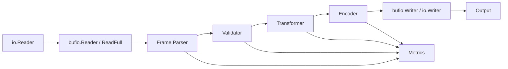
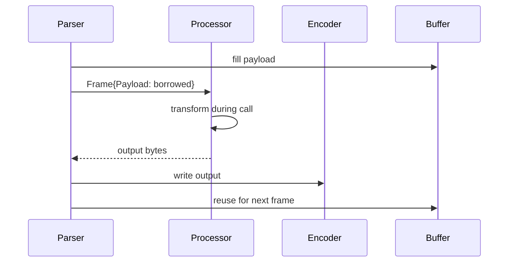
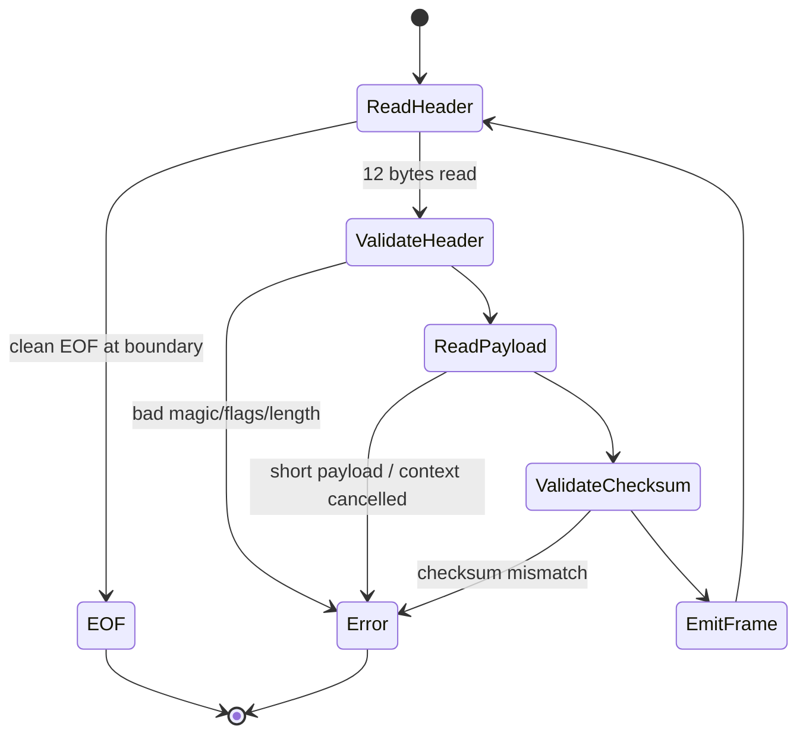
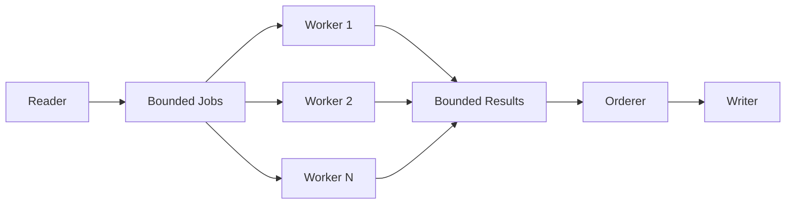
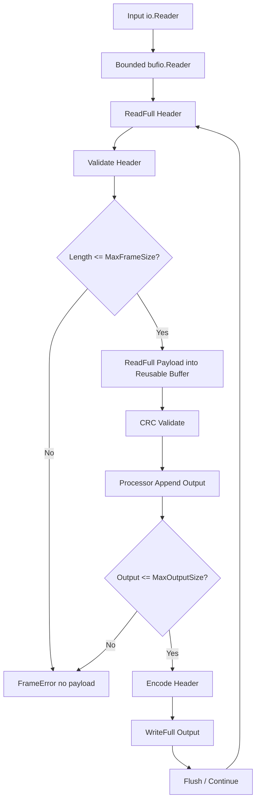

# learn-go-memory-systems-part-034.md

# Go Memory Systems Part 034 — Capstone: Building a Memory-Conscious Streaming Binary Protocol Pipeline

> Seri: `learn-go-memory-systems`  
> Part: `034`  
> Target: Go 1.26.x  
> Perspektif: Java software engineer menuju Go systems engineer  
> Status seri: **selesai** — ini adalah bagian terakhir.

---

## 0. Posisi Part Ini Dalam Seri

Ini adalah capstone.

Kita akan menggabungkan seluruh konsep dari part sebelumnya:

- value representation,
- pointer,
- stack/heap,
- escape analysis,
- allocator,
- slice/string/interface,
- byte/bit programming,
- buffer,
- stream,
- copy semantics,
- zero-copy,
- network/file I/O,
- unsafe/off-heap/mmap,
- cleanup/finalizer,
- GC,
- tuning,
- observability,
- profiling,
- pooling,
- anti-pattern,
- production design review.

Target capstone:

> Mendesain dan membangun pipeline binary protocol yang memory-conscious, bounded, streaming, observable, testable, dan production-reviewable.

Kita tidak akan membuat “toy parser” yang hanya bisa happy path. Kita akan membuat mental model dan skeleton desain untuk sistem yang tahan failure.

---

## 1. Problem Statement

Kita ingin membangun Go service/library yang membaca stream binary frames dari `io.Reader`, memvalidasi frame, melakukan transform ringan, lalu menulis frame hasil ke `io.Writer`.

Sumber input bisa:

- TCP connection;
- file;
- HTTP request body;
- pipe;
- compressed stream;
- test fixture.

Output bisa:

- TCP connection;
- file;
- HTTP response;
- downstream writer;
- hash/checksum sink;
- storage segment.

Constraint:

```text
1. Tidak boleh membaca seluruh input ke memory.
2. Memory harus bounded.
3. Frame size harus dibatasi.
4. Parser harus aman terhadap malformed input.
5. Backpressure harus natural.
6. Allocation per frame harus minimal.
7. Ownership buffer harus jelas.
8. Pipeline harus context-aware.
9. Error harus tidak retain payload besar.
10. Observability harus production-grade.
```

---

## 2. Binary Frame Format

Kita desain format sederhana.

```text
+----------------+----------------+----------------+----------------+
| magic  uint16  | flags  uint16  | length uint32  | crc32  uint32  |
+----------------+----------------+----------------+----------------+
| payload bytes length=N                                      ...     |
+--------------------------------------------------------------------+
```

Header size:

```text
12 bytes
```

Fields:

| Field | Size | Meaning |
|---|---:|---|
| magic | 2 | protocol magic, e.g. `0xCAFE` |
| flags | 2 | bit flags |
| length | 4 | payload length, little-endian |
| crc32 | 4 | checksum of payload |

Rules:

- `length <= MaxFrameSize`;
- `magic` must match;
- unknown mandatory flags rejected;
- payload must be fully read;
- checksum must match;
- EOF only valid at frame boundary.

---

## 3. Why Binary Protocol?

Binary protocol forces us to apply:

- byte parsing;
- endian;
- bounds;
- streaming;
- buffer ownership;
- error metadata;
- checksum;
- partial read;
- max size;
- zero-copy vs copy decision;
- observability.

It is a compact capstone for memory systems thinking.

---

## 4. Architecture Overview



Pipeline design:

```text
Reader -> Parse Frame -> Validate -> Transform -> Write Frame
```

Memory policy:

- one reusable payload buffer up to max frame size;
- no unbounded `ReadAll`;
- no payload stored in errors/logs;
- optional copy only at ownership boundaries;
- output written streaming.

---

## 5. Core Types

```go
type Frame struct {
    Flags   uint16
    Payload []byte // borrowed view; valid until next read/reuse
}

type Config struct {
    MaxFrameSize int
    BufferSize   int
}

type Processor interface {
    Process(ctx context.Context, f Frame, dst []byte) ([]byte, error)
}
```

Important: `Frame.Payload` is a **borrowed view**.

It must not be retained after `Process` returns unless copied.

---

## 6. Ownership Contract

```text
Parser owns reusable buffer.
Frame.Payload borrows parser buffer.
Processor may read payload during call.
Processor must copy if retaining.
Encoder writes output before buffer reuse.
```

Mermaid:



---

## 7. Error Type Must Not Retain Payload

Bad:

```go
type FrameError struct {
    Payload []byte
    Err     error
}
```

Good:

```go
type FrameError struct {
    Offset int64
    Code   string
    Detail string
    Cause  error
}
```

Optional small excerpt only with max size and no secrets.

Rule:

> Errors store metadata, not payload.

---

## 8. Parser State Machine



Invariant:

- EOF at header boundary = normal end.
- EOF mid-header = truncated frame.
- EOF mid-payload = truncated frame.
- length over max = reject before allocation/read.

---

## 9. Header Parsing

Use explicit endian.

```go
const (
    magic          uint16 = 0xCAFE
    headerSize           = 12
    maxAllowedFlag uint16 = 0x0003
)

type Header struct {
    Flags  uint16
    Length uint32
    CRC32  uint32
}

func parseHeader(b []byte) (Header, error) {
    if len(b) != headerSize {
        return Header{}, ErrBadHeaderSize
    }

    gotMagic := binary.LittleEndian.Uint16(b[0:2])
    if gotMagic != magic {
        return Header{}, ErrBadMagic
    }

    flags := binary.LittleEndian.Uint16(b[2:4])
    if flags &^ maxAllowedFlag != 0 {
        return Header{}, ErrUnsupportedFlags
    }

    length := binary.LittleEndian.Uint32(b[4:8])
    crc := binary.LittleEndian.Uint32(b[8:12])

    return Header{
        Flags:  flags,
        Length: length,
        CRC32:  crc,
    }, nil
}
```

No unsafe struct overlay.

---

## 10. Safe ReadFull

`io.Reader` may return partial data.

Use:

```go
_, err := io.ReadFull(r, header[:])
```

EOF logic:

```go
n, err := io.ReadFull(r, header[:])
if err == io.EOF && n == 0 {
    return Done
}
if err != nil {
    return truncated
}
```

Do not assume one `Read` returns full header.

---

## 11. Payload Buffer Strategy

Simplest bounded approach:

```go
payload := make([]byte, maxFrameSize)
```

For each frame:

```go
view := payload[:length]
_, err := io.ReadFull(r, view)
```

Memory:

```text
O(maxFrameSize + output buffer + bufio buffers)
```

Not:

```text
O(total stream size)
```

If `MaxFrameSize=1MiB`, parser payload memory is bounded.

---

## 12. Max Frame Size

Never allocate based on untrusted length before validation.

Bad:

```go
payload := make([]byte, hdr.Length)
```

without max.

Good:

```go
if hdr.Length > uint32(cfg.MaxFrameSize) {
    return ErrFrameTooLarge
}
```

Then use bounded buffer.

---

## 13. Context-Aware Pipeline

`io.Reader` itself does not universally accept context.

For network/HTTP, cancellation can be propagated by:

- closing connection/body;
- deadlines;
- wrapping reader;
- selecting between pipeline stages if goroutines used.

At minimum, check context between frames:

```go
select {
case <-ctx.Done():
    return ctx.Err()
default:
}
```

For blocking reads, use deadline-capable connection where possible.

---

## 14. Single-Goroutine Streaming Pipeline

Simplest robust design:

```go
func Run(ctx context.Context, r io.Reader, w io.Writer, p Processor, cfg Config) error {
    // read -> process -> write in same goroutine
}
```

Benefits:

- natural backpressure;
- no channel queue memory;
- simple ownership;
- no goroutine leak;
- easier error handling.

Downside:

- no parallel processing.

Default to single-goroutine until parallelism is justified.

---

## 15. Backpressure

With single pipeline:

```text
if writer is slow -> Write blocks -> parser stops reading -> upstream backpressure
```

No unbounded queue.


This is often exactly what you want.

---

## 16. When to Add Concurrency

Add concurrency only if:

- processing CPU-heavy;
- order can be preserved or not required;
- memory budget for in-flight frames defined;
- each worker gets owned copy or leased buffer;
- cancellation and drain are implemented;
- backpressure bounded.

Concurrency multiplies memory.

If `maxFrameSize=1MiB` and `workers=100`, worst-case payload memory can become 100MiB+.

---

## 17. Bounded Concurrent Pipeline

If concurrency needed:

```text
reader -> bounded jobs channel -> workers -> bounded results -> writer
```

Budget:

```text
job capacity * max frame size
+ result capacity * max output size
+ worker scratch
```

No unbounded channels.

---

## 18. Buffer Ownership in Concurrent Pipeline

Reader cannot reuse payload buffer until worker done.

Options:

1. copy payload per job;
2. lease buffer from bounded pool and release after processing;
3. process synchronously;
4. split pipeline where parser only emits metadata and payload copied to owned buffer.

For correctness, start with copy or bounded lease.

---

## 19. Processor API

Append-style processor:

```go
type Processor interface {
    Process(ctx context.Context, f Frame, dst []byte) ([]byte, error)
}
```

This lets processor reuse output buffer.

Example:

```go
type UppercaseProcessor struct{}

func (UppercaseProcessor) Process(ctx context.Context, f Frame, dst []byte) ([]byte, error) {
    dst = dst[:0]
    dst = append(dst, f.Payload...)
    for i := range dst {
        if 'a' <= dst[i] && dst[i] <= 'z' {
            dst[i] -= 'a' - 'A'
        }
    }
    return dst, nil
}
```

Output owns `dst`, not input.

---

## 20. In-Place Transform?

In-place transform on `f.Payload` is possible only if:

- parser buffer is mutable;
- input need not be preserved;
- no other consumer sees original;
- checksum validation already done;
- ownership contract says processor may mutate.

Safer default:

- processor treats payload read-only;
- writes output to separate buffer.

---

## 21. Encoder

```go
func writeFrame(w io.Writer, flags uint16, payload []byte) error {
    var header [headerSize]byte

    binary.LittleEndian.PutUint16(header[0:2], magic)
    binary.LittleEndian.PutUint16(header[2:4], flags)
    binary.LittleEndian.PutUint32(header[4:8], uint32(len(payload)))
    binary.LittleEndian.PutUint32(header[8:12], crc32.ChecksumIEEE(payload))

    if _, err := w.Write(header[:]); err != nil {
        return err
    }

    if len(payload) == 0 {
        return nil
    }

    _, err := w.Write(payload)
    return err
}
```

For strict writer contract, handle short write.

`io.Writer` must return non-nil error if `n < len(p)`, but defensive wrappers can use `writeFull`.

---

## 22. WriteFull Helper

```go
func writeFull(w io.Writer, p []byte) error {
    for len(p) > 0 {
        n, err := w.Write(p)
        if err != nil {
            return err
        }
        if n <= 0 {
            return io.ErrShortWrite
        }
        p = p[n:]
    }
    return nil
}
```

Use for robust low-level writer handling.

---

## 23. Run Implementation Skeleton

```go
func Run(ctx context.Context, r io.Reader, w io.Writer, proc Processor, cfg Config) error {
    if cfg.MaxFrameSize <= 0 {
        return ErrInvalidConfig
    }
    if cfg.BufferSize <= 0 {
        cfg.BufferSize = 64 << 10
    }

    br := bufio.NewReaderSize(r, cfg.BufferSize)
    bw := bufio.NewWriterSize(w, cfg.BufferSize)
    defer bw.Flush()

    payload := make([]byte, cfg.MaxFrameSize)
    out := make([]byte, 0, cfg.BufferSize)

    var header [headerSize]byte
    var offset int64

    for {
        select {
        case <-ctx.Done():
            return ctx.Err()
        default:
        }

        n, err := io.ReadFull(br, header[:])
        if err == io.EOF && n == 0 {
            return bw.Flush()
        }
        if err != nil {
            return FrameError{Offset: offset, Code: "truncated_header", Cause: err}
        }
        offset += int64(headerSize)

        h, err := parseHeader(header[:])
        if err != nil {
            return FrameError{Offset: offset - int64(headerSize), Code: "bad_header", Cause: err}
        }

        if h.Length > uint32(cfg.MaxFrameSize) {
            return FrameError{Offset: offset, Code: "frame_too_large"}
        }

        view := payload[:int(h.Length)]
        if _, err := io.ReadFull(br, view); err != nil {
            return FrameError{Offset: offset, Code: "truncated_payload", Cause: err}
        }
        offset += int64(h.Length)

        if crc32.ChecksumIEEE(view) != h.CRC32 {
            return FrameError{Offset: offset - int64(h.Length), Code: "checksum_mismatch"}
        }

        out, err = proc.Process(ctx, Frame{Flags: h.Flags, Payload: view}, out[:0])
        if err != nil {
            return FrameError{Offset: offset, Code: "process_failed", Cause: err}
        }

        if err := writeFrame(bw, h.Flags, out); err != nil {
            return FrameError{Offset: offset, Code: "write_failed", Cause: err}
        }

        if cap(out) > cfg.MaxFrameSize {
            out = make([]byte, 0, cfg.BufferSize)
        }
    }
}
```

This is skeleton, not copy-paste final library. It highlights memory decisions.

---

## 24. FrameError Implementation

```go
type FrameError struct {
    Offset int64
    Code   string
    Cause  error
}

func (e FrameError) Error() string {
    if e.Cause == nil {
        return fmt.Sprintf("frame error at offset %d: %s", e.Offset, e.Code)
    }
    return fmt.Sprintf("frame error at offset %d: %s: %v", e.Offset, e.Code, e.Cause)
}

func (e FrameError) Unwrap() error {
    return e.Cause
}
```

No payload.

---

## 25. Memory Budget

For single-goroutine pipeline:

```text
payload buffer: MaxFrameSize
output buffer: up to MaxOutputSize or bounded by policy
bufio reader: BufferSize
bufio writer: BufferSize
header: 12 bytes
processor scratch: defined by processor
```

Example:

```text
MaxFrameSize = 1 MiB
BufferSize   = 64 KiB
Output cap   = 1 MiB
Total core   ≈ 2.125 MiB + processor scratch
```

This is predictable.

---

## 26. Output Size Policy

Processor might expand payload.

Need config:

```go
type Config struct {
    MaxFrameSize  int
    MaxOutputSize int
    BufferSize    int
}
```

After processing:

```go
if len(out) > cfg.MaxOutputSize {
    return FrameError{Code: "output_too_large"}
}
```

Without output bound, input bound is insufficient.

---

## 27. Metrics

Expose:

```text
frames_read_total
frames_written_total
frame_bytes_read_total
frame_bytes_written_total
frame_errors_total{code}
frame_payload_size_bytes histogram
frame_process_duration_seconds histogram
pipeline_active
pipeline_inflight_bytes
pipeline_alloc_bytes_per_frame if measured in test
```

Runtime dashboard still needed:

- allocation rate;
- heap live;
- GC CPU;
- RSS;
- goroutines.

---

## 28. Avoid High Cardinality

Do not label metrics with:

- raw error message;
- offset;
- file path unbounded;
- user ID;
- payload content.

Good labels:

- error code;
- protocol version;
- pipeline name;
- route/template;
- outcome.

---

## 29. Logging

Good:

```go
logger.Error("frame processing failed",
    "offset", err.Offset,
    "code", err.Code,
)
```

Bad:

```go
logger.Error("bad frame", "payload", payload)
```

No payload logging unless explicit redaction and size cap.

---

## 30. Testing Strategy

Test categories:

1. valid single frame;
2. valid multiple frames;
3. zero-length payload;
4. max-size payload;
5. frame too large;
6. bad magic;
7. unsupported flags;
8. checksum mismatch;
9. truncated header;
10. truncated payload;
11. writer short write;
12. processor error;
13. context cancelled;
14. output too large;
15. malformed random bytes fuzz;
16. allocation regression benchmark;
17. race test if concurrent variant.

---

## 31. Unit Test Example

```go
func TestParseHeaderRejectsBadMagic(t *testing.T) {
    var h [headerSize]byte
    binary.LittleEndian.PutUint16(h[0:2], 0x1234)

    _, err := parseHeader(h[:])
    if !errors.Is(err, ErrBadMagic) {
        t.Fatalf("expected bad magic, got %v", err)
    }
}
```

---

## 32. Fuzz Parser

```go
func FuzzParseHeader(f *testing.F) {
    f.Add(make([]byte, headerSize))

    f.Fuzz(func(t *testing.T, data []byte) {
        if len(data) == headerSize {
            _, _ = parseHeader(data)
        }
    })
}
```

Better fuzz full pipeline:

```go
func FuzzRun(f *testing.F) {
    f.Add(validFrameBytes("hello"))

    f.Fuzz(func(t *testing.T, data []byte) {
        ctx := context.Background()
        var out bytes.Buffer
        _ = Run(ctx, bytes.NewReader(data), &out, NopProcessor{}, Config{
            MaxFrameSize: 1 << 20,
            BufferSize:   4096,
        })
    })
}
```

Invariant:

- no panic;
- no unbounded memory;
- error allowed.

---

## 33. Benchmark Allocation

```go
func BenchmarkRunValidFrames(b *testing.B) {
    input := buildFrames(100, 1024)
    cfg := Config{
        MaxFrameSize: 1 << 20,
        BufferSize:   64 << 10,
    }

    b.ReportAllocs()

    for i := 0; i < b.N; i++ {
        r := bytes.NewReader(input)
        w := io.Discard
        if err := Run(context.Background(), r, w, NopProcessor{}, cfg); err != nil {
            b.Fatal(err)
        }
    }
}
```

This benchmark includes setup of reader per op. That may be okay if measuring end-to-end. For inner loop, isolate parser.

---

## 34. Benchmark Parser Only

```go
func BenchmarkParseHeader(b *testing.B) {
    h := validHeader(1024)
    b.ReportAllocs()

    for i := 0; i < b.N; i++ {
        sinkHeader, sinkErr = parseHeader(h[:])
    }
}
```

Goal:

- should be 0 allocation.

---

## 35. Benchmark Processor

```go
func BenchmarkProcessor(b *testing.B) {
    p := UppercaseProcessor{}
    payload := bytes.Repeat([]byte("a"), 1024)
    dst := make([]byte, 0, 1024)

    b.ReportAllocs()

    for i := 0; i < b.N; i++ {
        var err error
        dst, err = p.Process(context.Background(), Frame{Payload: payload}, dst[:0])
        if err != nil {
            b.Fatal(err)
        }
    }
}
```

Check `B/op` and `allocs/op`.

---

## 36. pprof Workflow

If benchmark shows allocation:

```bash
go test -run '^$' -bench BenchmarkRunValidFrames -benchmem -memprofile mem.out
go tool pprof -sample_index=alloc_space mem.out
```

Look for:

- `bytes.Buffer` growth;
- `fmt.Sprintf` in errors/logging;
- processor allocation;
- `binary` not likely allocation;
- interface conversion;
- `bufio` allocation per Run.

Some allocation per pipeline startup is acceptable. Per frame allocation is the target.

---

## 37. Escape Analysis Workflow

```bash
go test -run '^$' -bench BenchmarkProcessor -gcflags=-m=2
```

Look for:

- `FrameError` formatting path;
- processor output escaping;
- interface `Processor` dispatch;
- closure capture in metrics/logging;
- `context` retention.

If interface dispatch in hot loop matters, a generic or function parameter can be considered, but measure first.

---

## 38. Generic Variant

```go
func RunWith[P interface {
    Process(context.Context, Frame, []byte) ([]byte, error)
}](ctx context.Context, r io.Reader, w io.Writer, proc P, cfg Config) error {
    // same core
}
```

Potential benefit:

- compile-time concrete processor;
- possible inlining/devirtualization.

Cost:

- more complex API;
- code bloat;
- less dynamic.

Use if profile proves interface dispatch/allocation issue.

---

## 39. Writer Fast Path

If output is file/network, `bufio.Writer` can help.

But double buffering can hurt if writer already buffered.

Review:

- TCP conn: buffering may be useful for small frames;
- file: buffering useful for small writes;
- HTTP response: already buffered by server internals in some cases;
- bytes.Buffer: extra bufio unnecessary.

Config should allow disabling or tuning buffer size.

---

## 40. CRC Cost

Checksum validates data but costs CPU.

Options:

- always checksum;
- checksum only if flag set;
- stronger hash;
- hardware acceleration where available;
- skip checksum for trusted transport? risky.

Do not remove checksum to optimize without failure model.

---

## 41. Flags and Versioning

Protocol flags should distinguish:

- compression;
- encryption;
- reserved;
- critical extension.

Unknown critical flags reject. Unknown optional flags can ignore if defined.

Bit-level part applies here.

---

## 42. Compression

If payload compressed:

- compressed length bounded;
- decompressed length also bounded;
- streaming decompression preferred;
- beware zip bomb;
- buffer budget includes decompressed output.

Never allocate decompressed size from untrusted header without max.

---

## 43. Failure Injection

Inject:

- slow reader;
- slow writer;
- reader returns 1 byte at a time;
- writer short writes;
- corrupted checksum;
- huge length;
- truncated stream;
- context cancellation mid-payload;
- processor panic/error;
- output expansion above max.

Goal:

> Every failure is bounded and returns controlled error.

---

## 44. Slow Reader Test

```go
type slowReader struct {
    r io.Reader
}

func (s slowReader) Read(p []byte) (int, error) {
    if len(p) > 1 {
        p = p[:1]
    }
    return s.r.Read(p)
}
```

Ensures `io.ReadFull` logic correct.

---

## 45. Short Writer Test

```go
type shortWriter struct {
    w io.Writer
}

func (s shortWriter) Write(p []byte) (int, error) {
    if len(p) > 1 {
        p = p[:1]
    }
    return s.w.Write(p)
}
```

Ensures `writeFull` if used.

---

## 46. Context Cancellation Test

If using blocking reader, context may not interrupt instantly.

For testable cancellation:

- use reader wrapper that checks context;
- use network deadlines;
- close pipe on cancel.

Design must be explicit:

```text
Context checked between frames.
For blocking reads, caller must provide cancelable reader or deadline.
```

---

## 47. Production API Surface

Suggested package API:

```go
type Runner struct {
    cfg Config
    proc Processor
    metrics Metrics
    logger Logger
}

func NewRunner(cfg Config, proc Processor, opts ...Option) (*Runner, error)

func (r *Runner) Run(ctx context.Context, in io.Reader, out io.Writer) error
```

Keep:

- config validated once;
- metrics optional but injectable;
- logger avoids payload;
- processor contract documented.

---

## 48. Config Validation

```go
func (c Config) Validate() error {
    if c.MaxFrameSize <= 0 {
        return ErrInvalidMaxFrameSize
    }
    if c.MaxFrameSize > 64<<20 {
        return ErrMaxFrameTooLarge
    }
    if c.BufferSize <= 0 {
        return ErrInvalidBufferSize
    }
    if c.MaxOutputSize <= 0 {
        return ErrInvalidMaxOutputSize
    }
    return nil
}
```

Upper bound is policy.

---

## 49. Memory Decision Record

For capstone system:

```text
Decision:
Use single-goroutine streaming pipeline by default.

Reason:
- Natural backpressure.
- Bounded memory.
- Clear buffer ownership.
- Avoid goroutine/channel leak.
- Easier correctness.

Rejected:
- Unbounded worker pool.
- ReadAll then process.
- Unsafe struct overlay.
- Zero-copy string view.
- Mutable mmap for input.

Memory budget:
- MaxFrameSize 1MiB.
- Output max 1MiB.
- bufio reader/writer 64KiB each.
- Core memory ~2.125MiB per pipeline.
```

---

## 50. Production Dashboard

Panels:

- frames/sec;
- bytes/sec input/output;
- error rate by code;
- payload size histogram;
- processing duration p99;
- active pipelines;
- inflight bytes;
- RSS/cgroup;
- heap live/goal;
- allocation rate;
- GC CPU;
- goroutines;
- queue bytes if concurrent variant.

---

## 51. Alerts

Examples:

```text
frame_errors_total{code="checksum_mismatch"} rate > baseline
frame_errors_total{code="frame_too_large"} spike
pipeline_process_duration p99 > SLO
RSS > 85% container limit
allocation_rate > 2x baseline
goroutines > 3x baseline
```

Avoid per-offset labels.

---

## 52. Security Review

Risks:

- malformed length;
- checksum bypass;
- decompression bomb;
- payload logged;
- unbounded output expansion;
- resource exhaustion via many connections;
- slowloris;
- replay if protocol security relevant;
- unknown flags.

Controls:

- max frame size;
- max output size;
- deadlines;
- auth at transport layer;
- no payload logs;
- fuzzing;
- rate limit;
- backpressure.

---

## 53. Memory Review Score

| Area | Decision |
|---|---|
| Input bounded | `MaxFrameSize` |
| Output bounded | `MaxOutputSize` |
| Streaming | yes |
| Ownership | borrowed frame view |
| Copy boundary | output buffer, optional copy |
| Unsafe | none |
| Pool | not default |
| Off-heap | none |
| Backpressure | single pipeline write blocks read |
| Observability | metrics + runtime |
| Failure | controlled errors |

This is a strong default design.

---

## 54. When to Optimize Further

Only after profile:

- replace interface processor with generic;
- introduce per-worker scratch;
- add bounded buffer pool;
- add zero-copy view API;
- add SIMD/checksum acceleration;
- use mmap for file input if random access needed.

Do not add complexity before evidence.

---

## 55. Common Wrong Capstone Designs

### Wrong 1 — ReadAll

```go
data, _ := io.ReadAll(r)
```

Fails bounded memory.

### Wrong 2 — Unbounded Workers

```go
go process(frame)
```

Fails memory/concurrency bound.

### Wrong 3 — Unsafe Header Overlay

```go
hdr := (*Header)(unsafe.Pointer(&buf[0]))
```

Fails portability/safety.

### Wrong 4 — Error Contains Payload

```go
return ParseError{Payload: payload}
```

Fails retention/security.

### Wrong 5 — Pool Without Ownership

```go
pool.Put(buf)
return buf
```

Fails correctness.

---

## 56. Capstone Extension: Concurrent Ordered Pipeline

If required:

- reader assigns sequence number;
- bounded job channel;
- workers process owned copies/leases;
- result channel bounded;
- writer reorders by sequence;
- memory budget includes all in-flight copies;
- cancellation drains workers.

Only implement if throughput requires.



---

## 57. Concurrent Pipeline Budget Example

```text
max frame: 1 MiB
job channel: 16
workers: 8
result channel: 16
output max: 1 MiB

worst-case payload copies: ~16 MiB
worker scratch: ~8 MiB
result buffers: ~16 MiB
core overhead: ~40 MiB+
```

Bounded, but much larger than single pipeline.

---

## 58. Capstone Extension: File Segment Writer

If writing output frames to file:

- write temp file;
- use buffered writer;
- flush;
- file sync;
- close with error check;
- rename atomic;
- optionally sync directory;
- manifest update.

Memory design intersects crash consistency.

---

## 59. Capstone Extension: mmap Reader

If input is immutable file and random lookup:

- validate file;
- map read-only;
- parse headers by offset;
- no struct overlay;
- callback view API;
- copy if retaining;
- unmap after readers drain.

But for sequential stream, normal file streaming is simpler.

---

## 60. Capstone Extension: Production Package Layout

```text
binarypipe/
  config.go
  frame.go
  parser.go
  encoder.go
  runner.go
  errors.go
  metrics.go
  processor.go
  internal/
    testutil/
  parser_test.go
  runner_test.go
  fuzz_test.go
  bench_test.go
```

Keep unsafe/off-heap absent unless truly needed.

---

## 61. Final Integration Diagram



---

## 62. What This Capstone Proves

This design proves you can apply Go memory systems beyond isolated tips:

- slices as borrowed views;
- byte parsing without unsafe;
- bounded allocation;
- streaming I/O;
- backpressure;
- copy boundaries;
- no payload retention in errors/logs;
- allocation profiling readiness;
- runtime observability;
- production budget;
- failure injection.

That is the level of reasoning expected in serious Go infrastructure work.

---

## 63. Final Review Checklist

Before production:

- [ ] Max input frame size enforced.
- [ ] Max output size enforced.
- [ ] No `io.ReadAll`.
- [ ] No unbounded goroutines/channels.
- [ ] No unsafe header overlay.
- [ ] No payload in error/log.
- [ ] Context/cancellation behavior documented.
- [ ] Writer short write handled.
- [ ] EOF/truncation semantics tested.
- [ ] Checksum tested.
- [ ] Fuzz test added.
- [ ] Benchmark with `-benchmem`.
- [ ] pprof workflow documented.
- [ ] Runtime/app metrics exposed.
- [ ] Memory budget documented.
- [ ] Alerts/runbook defined.

---

## 64. Final Summary of Entire Series

This series started with the simplest but most important idea:

> Go passes values, but values can contain pointers to shared memory.

From there, we built a complete mental model:

- stack vs heap;
- escape analysis;
- allocator mechanics;
- struct/slice/string/interface representation;
- byte/bit/buffer/stream design;
- copy semantics;
- zero-copy truth vs illusion;
- network/file I/O memory behavior;
- unsafe/off-heap/mmap boundaries;
- cleanup/finalizer/lifetime pinning;
- GC architecture and tuning;
- observability and profiling;
- pools/arena-like reuse;
- anti-patterns;
- production review;
- capstone pipeline.

The core engineering lesson:

> Memory management in Go is not manual free.  
> It is lifetime, ownership, boundedness, observability, and failure design.

---

## 65. What “Top 1%” Looks Like Here

A top-tier Go engineer does not merely know:

```go
s := append(s, x)
```

They know:

- what backing array is retained;
- who owns the resulting slice;
- whether append aliases caller memory;
- whether conversion allocates;
- whether object escapes;
- what GC must scan;
- what happens under cancellation;
- what metric proves memory is bounded;
- what profile to capture in incident;
- when copying is safer than zero-copy;
- when pooling helps and when it corrupts data;
- why RSS can kill pod while heap looks fine.

That is the practical standard.

---

## 66. Suggested Next Steps After This Series

Recommended follow-up series:

1. **Go Performance Engineering & Runtime Internals**
   - scheduler,
   - netpoller,
   - syscall,
   - CPU profiling,
   - lock contention,
   - trace,
   - PGO,
   - compiler optimization.

2. **Go Network Protocol Engineering**
   - TCP,
   - HTTP/1.1,
   - HTTP/2,
   - gRPC,
   - binary framing,
   - backpressure,
   - timeout,
   - proxying.

3. **Go Storage Engine Engineering**
   - WAL,
   - SSTable,
   - mmap,
   - page cache,
   - compaction,
   - crash consistency,
   - checksum,
   - recovery.

4. **Go Production Reliability**
   - SLO,
   - observability,
   - incident response,
   - graceful shutdown,
   - resilience,
   - load shedding.

---

## 67. Seri Selesai

Bagian ini adalah:

```text
learn-go-memory-systems-part-034.md
```

Ini adalah bagian terakhir dari seri:

```text
learn-go-memory-systems
```

Daftar lengkap:

```text
learn-go-memory-systems-part-000.md
learn-go-memory-systems-part-001.md
learn-go-memory-systems-part-002.md
learn-go-memory-systems-part-003.md
learn-go-memory-systems-part-004.md
learn-go-memory-systems-part-005.md
learn-go-memory-systems-part-006.md
learn-go-memory-systems-part-007.md
learn-go-memory-systems-part-008.md
learn-go-memory-systems-part-009.md
learn-go-memory-systems-part-010.md
learn-go-memory-systems-part-011.md
learn-go-memory-systems-part-012.md
learn-go-memory-systems-part-013.md
learn-go-memory-systems-part-014.md
learn-go-memory-systems-part-015.md
learn-go-memory-systems-part-016.md
learn-go-memory-systems-part-017.md
learn-go-memory-systems-part-018.md
learn-go-memory-systems-part-019.md
learn-go-memory-systems-part-020.md
learn-go-memory-systems-part-021.md
learn-go-memory-systems-part-022.md
learn-go-memory-systems-part-023.md
learn-go-memory-systems-part-024.md
learn-go-memory-systems-part-025.md
learn-go-memory-systems-part-026.md
learn-go-memory-systems-part-027.md
learn-go-memory-systems-part-028.md
learn-go-memory-systems-part-029.md
learn-go-memory-systems-part-030.md
learn-go-memory-systems-part-031.md
learn-go-memory-systems-part-032.md
learn-go-memory-systems-part-033.md
learn-go-memory-systems-part-034.md
```

Seri ini selesai.

<!-- NAVIGATION_FOOTER -->
<div class="page-nav">
<a href="./learn-go-memory-systems-part-033.md">⬅️ Go Memory Systems Part 033 — Production Design Review: Memory Budgets, SLOs, Failure Modes, Incident Playbook</a>
<a href="./index.md">📚 Kategori</a>
<a href="../../index.md">🏠 Home</a>
<span></span>
</div>
