# learn-go-logging-observability-profiling-troubleshooting-part-000.md

# Part 000 — Orientation: Observability as Runtime Truth

> Seri: **Go Logging, Observability, Profiling, dan Troubleshooting**  
> Format file: `learn-go-logging-observability-profiling-troubleshooting-part-000.md`  
> Target Go: **Go 1.26.x**  
> Target pembaca: **Java software engineer yang ingin memahami Go pada level production/runtime/operational engineering**  
> Status seri: **Part 000 dari 032 — seri belum selesai**

---

## 0. Mengapa Part 000 Ini Penting?

Banyak engineer memulai observability dari pertanyaan seperti:

- "Library logging Go yang bagus apa?"
- "Pakai Prometheus atau OpenTelemetry?"
- "Cara buka pprof gimana?"
- "Kenapa service Go saya memory naik?"
- "Kenapa goroutine banyak?"
- "Kenapa latency p99 naik padahal CPU normal?"

Pertanyaan itu valid, tetapi belum menyentuh inti masalah.

Observability pada level senior bukan soal tool. Observability adalah kemampuan sistem untuk **menjelaskan perilakunya sendiri berdasarkan bukti runtime**.

Kalau sistem gagal, observability yang baik harus membantu menjawab:

1. Apa yang terjadi?
2. Kapan mulai terjadi?
3. Siapa/apa yang terdampak?
4. Apakah ini bug aplikasi, konfigurasi, dependency, runtime, OS, container, network, database, atau traffic pattern?
5. Apakah problem sedang memburuk, stabil, atau membaik?
6. Apakah mitigasi bekerja?
7. Apa root cause yang didukung evidence?
8. Bagaimana mencegah class of failure yang sama muncul lagi?

Part 000 ini membangun fondasi mental model sebelum masuk ke logging, metrics, tracing, profiling, GC, goroutine leak, Kubernetes, alerting, dan runbook.

---

## 1. Core Thesis: Observability Is Runtime Truth

Dalam sistem produksi, source code hanya menjelaskan **apa yang mungkin terjadi**.

Observability menjelaskan **apa yang benar-benar sedang terjadi**.

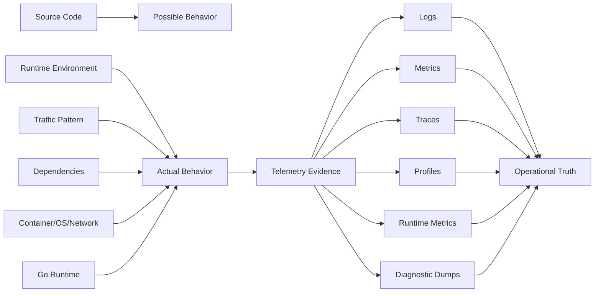

Production system tidak gagal dalam bentuk "kode baris 123 salah" saja.

Ia gagal sebagai kombinasi:

- workload berubah,
- dependency lambat,
- GC bekerja lebih keras,
- goroutine tertahan,
- queue backlog,
- lock contention,
- retry storm,
- memory limit terlalu kecil,
- DNS delay,
- database pool habis,
- deployment versi baru mengubah allocation pattern,
- logging terlalu mahal,
- metrics label meledak,
- trace sampling menyembunyikan request penting,
- pprof endpoint tidak aman,
- alert terlalu noisy sehingga diabaikan.

Maka observability tidak boleh dipahami sebagai "menambahkan output". Observability adalah desain agar sistem punya **jejak bukti** yang cukup untuk menjawab kegagalan.

---

## 2. Apa yang Berbeda di Go Dibanding Java?

Sebagai Java engineer, mental model awal biasanya dibentuk oleh:

- JVM,
- thread pool,
- heap dump,
- thread dump,
- GC logs,
- JFR,
- Micrometer,
- SLF4J/Logback/Log4j,
- actuator endpoint,
- APM agent,
- servlet filter,
- executor service,
- object allocation model JVM.

Go berbeda.

Go punya runtime sendiri, tetapi bukan JVM. Go binary biasanya single native executable. Observability Go banyak bertumpu pada standard library, runtime, compiler, dan profil yang bisa dikumpulkan langsung dari proses.

| Area | Java Mindset | Go Mindset |
|---|---|---|
| Runtime | JVM sebagai VM besar | Go runtime embedded dalam binary |
| Threading | OS thread visible sebagai Java thread | goroutine multiplexed ke OS thread oleh scheduler |
| Thread dump | `jstack`, thread dump | goroutine profile, runtime trace |
| Flight recorder | JFR | kombinasi `pprof`, `runtime/trace`, logs, metrics |
| Logging | SLF4J facade + backend | `log/slog` standard, zap/zerolog populer |
| Metrics | Micrometer abstraction | Prometheus client, OTel metrics, runtime/metrics |
| Tracing | OpenTelemetry agent/manual | mostly manual/instrumented libraries via context |
| Heap | JVM heap | Go heap + stacks + runtime + mmap + cgo/native |
| GC | banyak collector JVM | Go GC concurrent, tunable via `GOGC`, `GOMEMLIMIT`; Go 1.26 memakai Green Tea GC sebagai default |
| Profiling | async-profiler/JFR/APM | `pprof`, `go tool pprof`, `runtime/trace` |
| Context propagation | ThreadLocal sering dipakai | `context.Context` eksplisit |
| Runtime metrics | JMX/MBeans/Micrometer | `runtime/metrics`, `runtime.ReadMemStats`, collectors |
| Deployment | JVM + jar/container | static-ish binary/container |

### 2.1 Perubahan Mental Model Paling Penting

Di Java, banyak framework menyembunyikan runtime boundary.

Di Go, production-grade observability sering menuntut engineer memahami langsung:

- apa itu goroutine,
- kapan goroutine blocked,
- kapan goroutine runnable tetapi tidak running,
- bagaimana scheduler membagi P/M/G,
- apa yang masuk heap,
- mengapa allocation rate menaikkan kerja GC,
- mengapa RSS tidak sama dengan heap,
- bagaimana `context.Context` membawa deadline/cancellation/trace,
- bagaimana HTTP client reuse connection,
- bagaimana pprof profile dibaca,
- kapan runtime trace lebih tepat daripada CPU profile,
- kapan metric terlihat sehat tetapi user experience rusak.

Go membuat hal-hal ini lebih dekat ke engineer aplikasi.

Itu kelebihannya sekaligus tantangannya.

---

## 3. Istilah Fundamental

Sebelum masuk ke detail, kita harus pisahkan istilah yang sering dicampur.

### 3.1 Logging

Logging adalah pencatatan **event**.

Log yang baik menjawab:

- event apa terjadi,
- pada operasi apa,
- dengan input identity apa,
- pada entity apa,
- hasilnya apa,
- durasinya berapa,
- error classification apa,
- correlation/trace id apa,
- service/version/instance apa.

Contoh log buruk:

```text
failed
```

Contoh log lebih baik:

```json
{
  "time": "2026-06-23T12:00:00+07:00",
  "level": "ERROR",
  "msg": "payment_capture_failed",
  "service": "payment-api",
  "env": "prod",
  "version": "2026.06.23-1",
  "request_id": "req_01J...",
  "trace_id": "4bf92f3577b34da6a3ce929d0e0e4736",
  "operation": "CapturePayment",
  "payment_id": "pay_123",
  "provider": "acquirer-x",
  "error_kind": "dependency_timeout",
  "retryable": true,
  "duration_ms": 2500
}
```

Log bukan pengganti metrics. Log juga bukan pengganti tracing. Log adalah bukti naratif/eventual.

### 3.2 Monitoring

Monitoring adalah proses melihat sinyal untuk tahu apakah sistem sehat.

Monitoring biasanya menjawab:

- apakah service up,
- apakah latency naik,
- apakah error rate naik,
- apakah CPU/memory/queue mendekati limit,
- apakah dependency gagal,
- apakah alert perlu dipicu.

Monitoring sering berbasis metrics dan alert.

### 3.3 Observability

Observability adalah kemampuan untuk memahami state internal sistem dari output eksternal.

Dalam konteks engineering praktis, observability berarti:

- sistem mengeluarkan telemetry yang cukup,
- telemetry dapat dikorelasikan,
- telemetry punya semantic meaning,
- telemetry mendukung diagnosis cepat,
- telemetry tidak terlalu mahal,
- telemetry tidak membocorkan data sensitif,
- telemetry membantu engineer mengambil keputusan operasional.

Observability bukan "punya Grafana". Grafana hanya UI.

Observability bukan "pakai OpenTelemetry". OpenTelemetry hanya framework/instrumentasi.

Observability bukan "semua logs masuk Elasticsearch". Itu hanya storage.

Observability adalah kualitas sistem.

### 3.4 Diagnostics

Diagnostics adalah aktivitas mengambil evidence tambahan saat investigasi.

Contoh diagnostics di Go:

- mengambil CPU profile,
- mengambil heap profile,
- mengambil goroutine profile,
- mengambil mutex/block profile,
- menjalankan `runtime/trace`,
- melihat runtime metrics,
- membandingkan profile sebelum/sesudah,
- mengambil Kubernetes pod events,
- melihat DNS/TLS/connect timing,
- melihat database pool stats.

Diagnostics sering lebih invasif daripada observability normal.

Telemetry rutin harus low overhead. Diagnostics boleh lebih tajam, tetapi harus dikendalikan.

### 3.5 Profiling

Profiling adalah sampling/measurement untuk memahami konsumsi resource.

Profile menjawab:

- CPU dihabiskan di fungsi mana,
- memory dialokasikan/ditahan oleh jalur mana,
- goroutine tertahan di stack mana,
- mutex mana yang menyebabkan contention,
- channel/blocking mana yang menyebabkan delay,
- thread dibuat dari mana.

Profiling bukan logging.

Profiling tidak menjelaskan business event. Profiling menjelaskan runtime cost.

### 3.6 Tracing

Tracing adalah rekonstruksi perjalanan satu operasi/request lintas komponen.

Trace menjawab:

- request melewati service apa saja,
- span mana paling lambat,
- call ke dependency mana gagal,
- retry terjadi berapa kali,
- parent-child causality seperti apa,
- operation mana membentuk critical path.

Tracing bukan sekadar "log dengan trace id". Trace punya struktur waktu.

### 3.7 Troubleshooting

Troubleshooting adalah proses diagnosis dan mitigasi.

Troubleshooting yang matang bukan "coba-coba". Ia mengikuti loop:

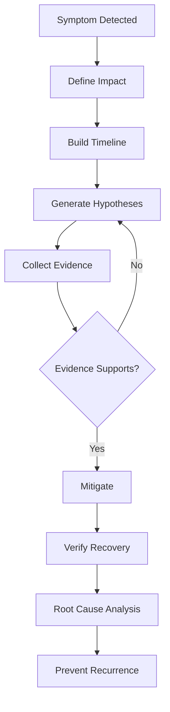

Observability menyediakan evidence agar troubleshooting tidak menjadi spekulasi.

---

## 4. The Three Classic Signals Are Not Enough

Banyak materi observability berhenti pada tiga pilar:

1. logs,
2. metrics,
3. traces.

Itu berguna, tetapi untuk Go production engineering, kita perlu model lebih lengkap.

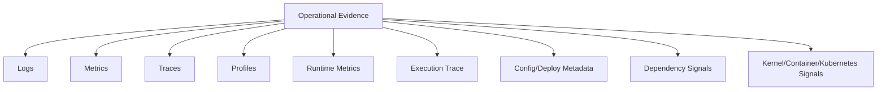

### 4.1 Logs

Logs paling baik untuk:

- event penting,
- error context,
- decision point,
- audit-ish trail,
- state transition,
- request boundary,
- external dependency result,
- retry/circuit breaker event,
- panic recovery evidence.

Logs buruk untuk:

- high-cardinality metric,
- latency distribution,
- CPU bottleneck,
- heap retention,
- scheduler delay,
- distributed critical path jika tanpa trace structure.

### 4.2 Metrics

Metrics paling baik untuk:

- rate,
- error ratio,
- latency distribution,
- queue depth,
- pool saturation,
- memory growth,
- goroutine count,
- GC cycles,
- traffic volume,
- SLO/error budget,
- alerting.

Metrics buruk untuk:

- detail satu request,
- root cause spesifik,
- payload context,
- stack path,
- causal chain lintas service tanpa trace.

### 4.3 Traces

Traces paling baik untuk:

- distributed request path,
- critical path latency,
- dependency call duration,
- fan-out/fan-in,
- retry visibility,
- context propagation,
- request-specific debugging.

Traces buruk untuk:

- agregasi resource global,
- high-frequency local loop,
- CPU hotspot,
- memory retention,
- event audit,
- semua request jika sampling agresif.

### 4.4 Profiles

Profiles paling baik untuk:

- CPU hotspot,
- memory allocation hotspot,
- retained heap,
- goroutine leak,
- lock contention,
- blocking,
- low-level runtime cost.

Profiles buruk untuk:

- business causality,
- user-visible rate/error,
- distributed dependency graph,
- alerting langsung.

### 4.5 Runtime Metrics

Runtime metrics paling baik untuk:

- early warning Go runtime,
- goroutine growth,
- heap behavior,
- GC pressure,
- scheduler state,
- stack memory,
- OS thread trends.

Runtime metrics buruk untuk:

- business-level semantics,
- endpoint-specific latency,
- root cause tanpa korelasi,
- reconstruct request path.

### 4.6 Execution Trace

Execution trace paling baik untuk:

- scheduler behavior,
- goroutine state transition,
- network blocking,
- syscall blocking,
- GC/scheduler interaction,
- fine-grained latency spike reconstruction.

Execution trace buruk untuk:

- long-term continuous monitoring,
- high-retention production telemetry,
- low-cost always-on usage.

---

## 5. Why Go Observability Requires Runtime Awareness

Di Go, banyak gejala produksi muncul dari interaksi antara aplikasi dan runtime.

### 5.1 Goroutine Bukan Thread

Goroutine ringan, tetapi bukan gratis.

Goroutine bisa:

- running,
- runnable,
- waiting on channel,
- waiting on mutex,
- waiting on syscall,
- waiting on network poller,
- waiting on timer,
- waiting on GC assist,
- leaked.

Ketika jumlah goroutine naik, belum tentu CPU naik. Banyak goroutine bisa hanya blocked. Tetapi blocked goroutine tetap bisa menahan memory melalui stack dan reachable objects.

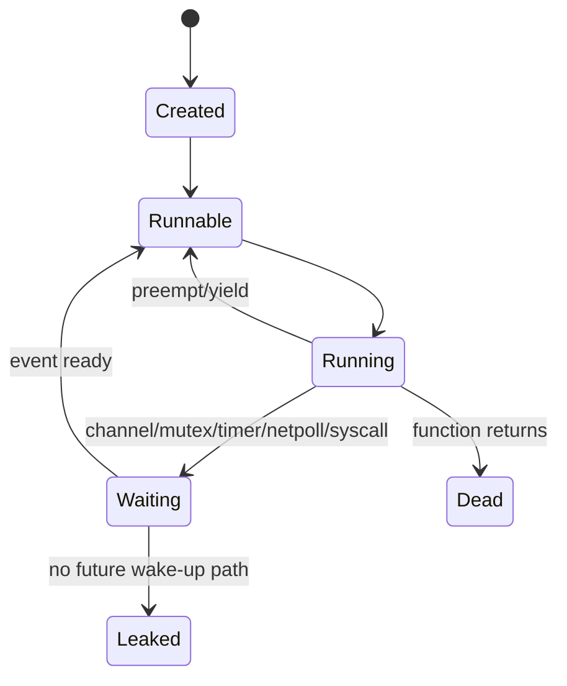

Operational implication:

- CPU normal + goroutine naik bisa berarti goroutine leak.
- Memory naik + goroutine naik bisa berarti stack retention/leaked references.
- Latency naik + goroutine runnable naik bisa berarti scheduler pressure.
- Latency naik + goroutine waiting pada mutex bisa berarti contention.
- Latency naik + goroutine waiting network bisa berarti dependency/DNS/socket issue.

### 5.2 Go Heap Bukan RSS

Heap profile menjelaskan Go heap, tetapi container memory/RSS bisa mencakup:

- Go heap,
- goroutine stacks,
- runtime metadata,
- memory returned/not returned to OS,
- mmap,
- cgo/native memory,
- page cache,
- allocator fragmentation,
- memory used by linked native libraries.

Maka "heap profile kecil tapi pod OOM" mungkin terjadi.

Kemungkinan penyebab:

- cgo/native memory,
- mmap,
- many goroutine stacks,
- memory not yet scavenged,
- non-Go allocation,
- container limit terlalu ketat,
- burst allocation,
- profiling timing salah.

### 5.3 Allocation Rate Menggerakkan GC

Di Go, masalah memory bukan hanya "berapa besar heap sekarang". Yang sangat penting adalah:

- allocation rate,
- live heap,
- object lifetime,
- pointer density,
- GC assist,
- heap goal,
- memory limit,
- object churn.

Service bisa punya retained heap stabil tetapi CPU tinggi karena allocation churn menyebabkan GC bekerja terus.

Contoh:

```text
Heap in-use stabil: 500 MiB
Alloc rate: sangat tinggi
GC cycles: sering
CPU: naik
Latency p99: naik
```

Kesimpulan yang salah:

> "Bukan memory issue karena heap stabil."

Kesimpulan yang lebih benar:

> "Mungkin allocation churn/GC overhead issue, bukan leak."

### 5.4 Context adalah Jalur Causality

Di Java, banyak context operasional bisa tersembunyi di `ThreadLocal`.

Di Go, context harus eksplisit.

`context.Context` membawa:

- cancellation,
- deadline,
- request-scoped values,
- trace/span context,
- propagation boundary.

Jika context tidak diteruskan:

- cancellation tidak sampai,
- timeout tidak dihormati,
- trace putus,
- log kehilangan correlation,
- goroutine bisa leak,
- dependency call tetap berjalan setelah request selesai.

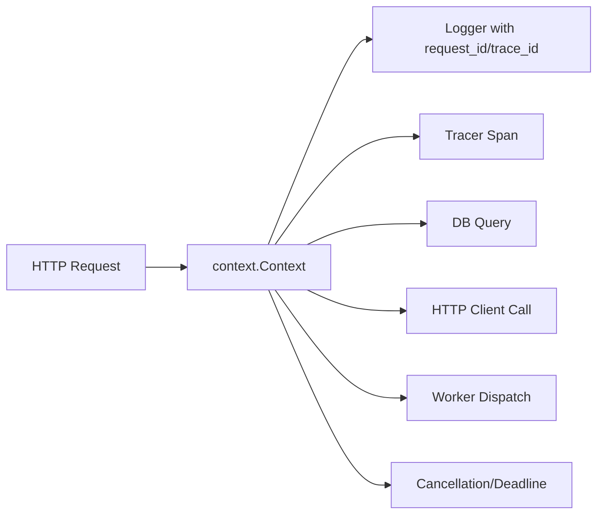

### 5.5 Standard Library Sangat Observability-Friendly, Tetapi Tidak Otomatis Sempurna

Go memberi banyak primitive:

- `log/slog`,
- `runtime/metrics`,
- `runtime/pprof`,
- `net/http/pprof`,
- `runtime/trace`,
- `expvar`,
- `testing` benchmark/profiles,
- `context`,
- `httptrace`,
- build info.

Tetapi primitive ini tidak otomatis menjadi operational system.

Engineer harus mendesain:

- field taxonomy,
- metrics naming,
- trace boundaries,
- endpoint protection,
- sampling,
- profile capture SOP,
- dashboard,
- alert,
- runbook,
- incident process.

---

## 6. Observability as a Control System

Observability bukan hanya "melihat". Observability adalah bagian dari loop kendali produksi.

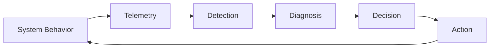

Contoh:

1. p99 latency naik.
2. Alert berbasis burn rate aktif.
3. Dashboard menunjukkan error tidak naik, traffic naik 3x, DB pool saturated.
4. Trace menunjukkan sebagian request menunggu DB.
5. Metrics DB pool menunjukkan wait count naik.
6. Logs menunjukkan query tertentu meningkat setelah deployment.
7. Mitigasi: rollback atau reduce concurrency.
8. Verify: p99 turun, pool wait turun, error budget burn normal.
9. RCA: query path baru tidak indexed / batch fan-out tidak dibatasi.
10. Prevention: test load, query budget, pool metrics alert, code review checklist.

Tanpa observability:

- engineer menebak,
- reload/restart random,
- rollback tanpa tahu efek,
- incident note penuh opini,
- root cause salah,
- problem terulang.

---

## 7. Golden Signals, RED, dan USE

### 7.1 Four Golden Signals

Google SRE book mendefinisikan empat golden signals:

1. latency,
2. traffic,
3. errors,
4. saturation.

Untuk service user-facing, empat ini adalah minimum viable operating view.

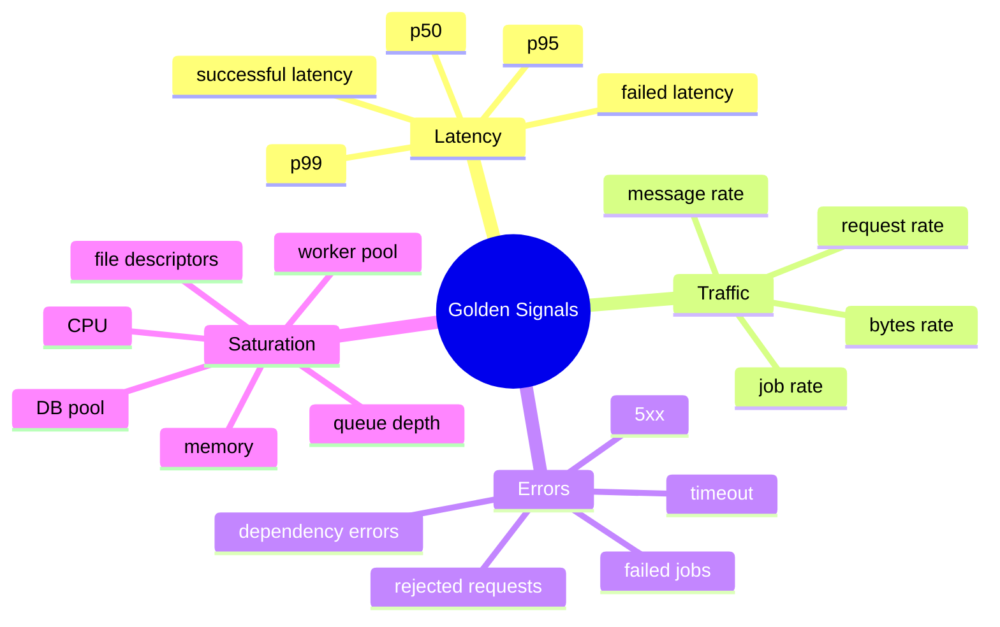

### 7.2 RED Method

RED cocok untuk service/request-driven system:

- **Rate**: berapa banyak request/event per detik.
- **Errors**: berapa banyak request/event gagal.
- **Duration**: berapa lama request/event diproses.

Untuk Go HTTP API:

```text
http_server_requests_total{method, route, status}
http_server_request_duration_seconds_bucket{method, route}
```

Tetapi hati-hati:

- jangan label dengan raw URL path berisi ID,
- jangan label dengan user_id,
- jangan label dengan request_id,
- jangan label dengan error message bebas,
- jangan membuat cardinality explosion.

### 7.3 USE Method

USE cocok untuk resource:

- **Utilization**: seberapa banyak resource dipakai.
- **Saturation**: seberapa banyak demand tidak langsung terlayani.
- **Errors**: error pada resource.

Untuk Go service:

| Resource | Utilization | Saturation | Errors |
|---|---|---|---|
| CPU | CPU usage | run queue / throttling / runnable goroutine pressure | throttling/failed scheduling rarely direct |
| Memory | heap/RSS | near limit / GC pressure / OOM risk | OOMKilled |
| DB pool | open/in-use conns | wait count/wait duration | query errors |
| Worker pool | active workers | queue depth | dropped jobs |
| HTTP client | active conns | pending requests | timeout/connect errors |
| Goroutines | count/state | runnable/waiting buildup | leak symptom |
| Locks | hold/wait | mutex wait | deadlock-like symptoms |

### 7.4 Menggabungkan Golden Signals + RED + USE

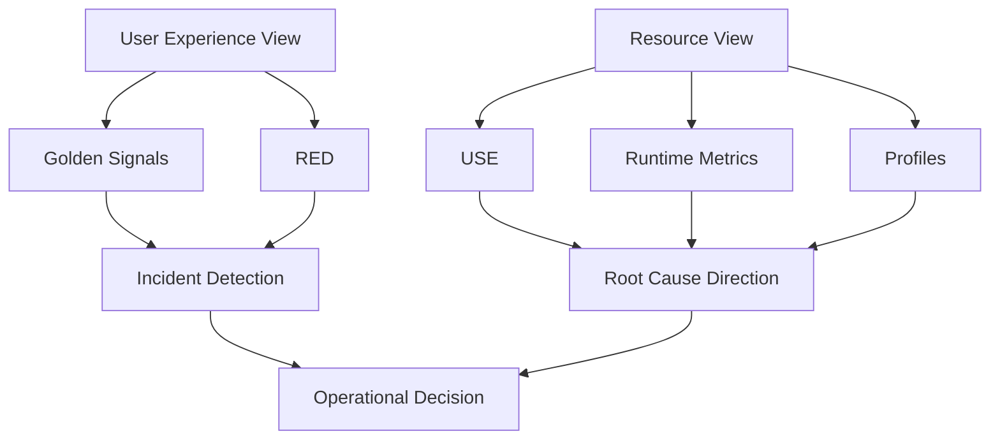

Golden signals dan RED membantu mendeteksi masalah dari perspektif user/service.

USE dan runtime/profile membantu mencari penyebab resource/runtime.

---

## 8. The Evidence Ladder

Tidak semua evidence punya fungsi yang sama. Senior engineer tahu evidence mana dipakai untuk pertanyaan apa.

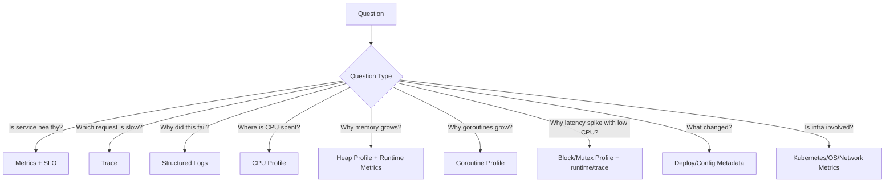

### 8.1 Metric Answers "How Much / How Often?"

Examples:

- request per second,
- error percentage,
- p99 latency,
- heap bytes,
- goroutine count,
- DB pool wait duration,
- queue depth.

### 8.2 Log Answers "What Happened?"

Examples:

- request rejected because validation failed,
- downstream timeout,
- retry exhausted,
- token refresh failed,
- panic recovered,
- state transition denied,
- job dropped due to backpressure.

### 8.3 Trace Answers "Where Did Time Go?"

Examples:

- 20 ms in auth,
- 600 ms in DB query,
- 300 ms in external API,
- 2 retries to downstream,
- fan-out to 10 services,
- queue consumer lag.

### 8.4 Profile Answers "Where Did Resource Go?"

Examples:

- CPU in JSON encoding,
- heap retained by cache map,
- allocation churn in string formatting,
- goroutines blocked on channel receive,
- mutex contention in global logger,
- block profile points to bounded queue.

### 8.5 Runtime Trace Answers "How Did Execution Happen?"

Examples:

- goroutine runnable but not scheduled,
- network poller delay,
- GC pause/mark assist around spike,
- syscall blocking,
- scheduler utilization.

---

## 9. Observability Maturity Model

Kita akan memakai maturity model agar jelas level yang ingin dicapai.

### Level 0 — Blind System

Ciri:

- hanya `fmt.Println`,
- log tidak structured,
- tidak ada metrics,
- tidak ada trace,
- tidak bisa profiling production,
- alert berdasarkan "user complain".

Risiko:

- MTTR tinggi,
- RCA spekulatif,
- incident berulang.

### Level 1 — Basic Visibility

Ciri:

- structured logs sebagian,
- basic Prometheus metrics,
- health endpoint,
- dashboards sederhana.

Masalah:

- correlation lemah,
- cardinality belum dikendalikan,
- alert noisy,
- profile tidak ada SOP.

### Level 2 — Service Observability

Ciri:

- request logs standar,
- RED metrics,
- runtime metrics,
- trace untuk inbound/outbound,
- pprof endpoint aman,
- dashboards per service,
- alert berbasis symptom.

Masalah:

- cross-service causality mungkin belum matang,
- cost governance belum kuat,
- runbook belum lengkap.

### Level 3 — Production Diagnostics

Ciri:

- CPU/heap/goroutine/mutex/block profile SOP,
- incident evidence capture,
- trace/log correlation,
- deployment markers,
- SLO burn alerts,
- runtime-aware dashboards,
- Kubernetes integration,
- on-call runbook.

### Level 4 — Engineering Operating System

Ciri:

- observability contract linted/tested,
- internal observability toolkit,
- standard instrumentation package,
- service template,
- cost and privacy governance,
- incident learning loop,
- profile-driven optimization,
- performance regression workflow,
- capacity planning berbasis telemetry.

Target seri ini adalah membawa kita ke Level 4.

---

## 10. Anatomy of an Observable Go Service

Service Go yang observable tidak hanya punya satu endpoint `/metrics`.

Ia punya beberapa layer evidence.

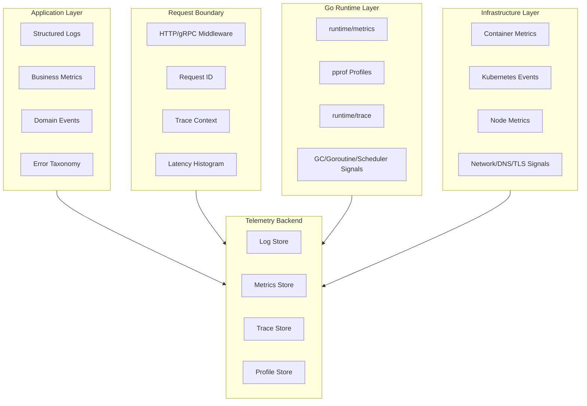

### 10.1 Minimal Production Surface

Untuk service Go production-grade, minimal surface yang masuk akal:

1. `/healthz` atau equivalent liveness endpoint.
2. `/readyz` readiness endpoint.
3. `/metrics` Prometheus endpoint atau OTel metrics export path.
4. Structured JSON logs ke stdout/stderr.
5. Trace propagation untuk inbound/outbound boundary.
6. Runtime metrics.
7. Debug/pprof endpoint yang **tidak public**.
8. Build/version metadata.
9. Graceful shutdown logging/metrics.
10. Panic recovery middleware.
11. Request ID/trace ID correlation.
12. Standard error classification.

### 10.2 Non-Negotiable Constraints

Observability harus:

- low overhead untuk always-on path,
- safe secara security/privacy,
- memiliki semantic consistency,
- bisa dikorelasikan,
- bisa digunakan saat incident,
- tidak membuat incident baru.

Contoh observability yang membuat incident baru:

- debug log dinyalakan global lalu storage penuh,
- log payload PII,
- metrics label memakai `user_id`,
- pprof endpoint public,
- trace sampling 100% pada high throughput tanpa capacity,
- sync logger blocking hot path,
- exporter failure membuat request path gagal,
- instrumentation mengunci global mutex,
- dashboard query terlalu berat.

---

## 11. Go 1.26.x Relevance for This Series

Go 1.26.x relevan untuk seri ini karena beberapa area observability/profiling/runtime berubah atau makin penting:

1. `pprof` web UI default menggunakan flame graph.
2. Green Tea GC menjadi default.
3. Ada experimental `goroutineleak` profile dengan `GOEXPERIMENT=goroutineleakprofile`.
4. `runtime/metrics` menambah scheduler-related metrics.
5. Tooling testing/benchmarking terus membaik untuk artifact dan analysis workflow.

Kita tidak akan membahas Go 1.26 sebagai release-note tour. Kita akan membahas dampaknya pada operational engineering.

### 11.1 Dampak Flame Graph Default

Flame graph membantu engineer melihat distribusi cost secara visual.

Tetapi flame graph bukan jawaban otomatis. Ia harus dibaca dengan benar:

- lebar frame kira-kira proporsi sample,
- stack menunjukkan call path,
- flat vs cumulative tetap penting,
- profile harus representatif,
- workload harus sesuai,
- CPU profile tidak menjawab blocking time,
- heap profile tidak otomatis membuktikan leak.

### 11.2 Dampak Green Tea GC

Green Tea GC sebagai default berarti GC behavior pada Go 1.26 bisa berbeda dari versi sebelumnya.

Operational implication:

- baseline ulang latency/CPU/memory setelah upgrade,
- jangan menyalin tuning lama tanpa validasi,
- pantau allocation rate, GC CPU, heap goal, pause, memory limit,
- profile sebelum/sesudah,
- gunakan benchmark representative.

### 11.3 Dampak Experimental Goroutine Leak Profile

Experimental profile bisa berguna, tetapi jangan menjadikannya satu-satunya defense.

Production-grade goroutine leak detection tetap perlu:

- goroutine count metrics,
- goroutine profile,
- tests dengan leak checking,
- context cancellation discipline,
- shutdown tests,
- worker lifecycle design,
- timeout/deadline consistency.

---

## 12. Observability Design Principles

### Principle 1 — Every Signal Must Answer a Question

Jangan membuat metric/log/span tanpa pertanyaan operasional.

Buruk:

```text
metric: operation_count
```

Lebih baik:

```text
Pertanyaan: "Berapa rate request per route dan status?"
Metric: http_server_requests_total{method, route, status}
```

Buruk:

```text
log: "done"
```

Lebih baik:

```text
Pertanyaan: "Operasi apa selesai, untuk entity apa, durasinya berapa, hasilnya apa?"
Log: order_approval_completed with fields operation, order_id, duration_ms, outcome
```

### Principle 2 — Prefer Stable Semantic Fields

Field harus stabil supaya query/dashboard/alert tidak rusak.

Contoh standard fields:

```text
service
environment
version
instance_id
request_id
trace_id
span_id
operation
component
module
tenant
route
method
status_code
error_kind
duration_ms
```

Hindari field yang berubah-ubah:

```text
err1
x
data
message2
user
debug_info
payload
```

### Principle 3 — Correlation Is a First-Class Requirement

Log tanpa correlation ID sulit digunakan.

Trace tanpa log correlation sulit menjawab "kenapa".

Metric tanpa deployment label/version marker sulit menjawab "apa berubah".

Profile tanpa timestamp/workload metadata sulit dibandingkan.

### Principle 4 — Observability Must Be Designed at Boundaries

Boundary penting:

- inbound HTTP/gRPC,
- outbound HTTP/gRPC,
- DB query,
- message publish,
- message consume,
- background job,
- goroutine start/stop,
- cache call,
- authorization decision,
- state transition,
- external dependency,
- process startup/shutdown.

Boundary adalah tempat terbaik untuk instrumentation karena di sana causality berubah.

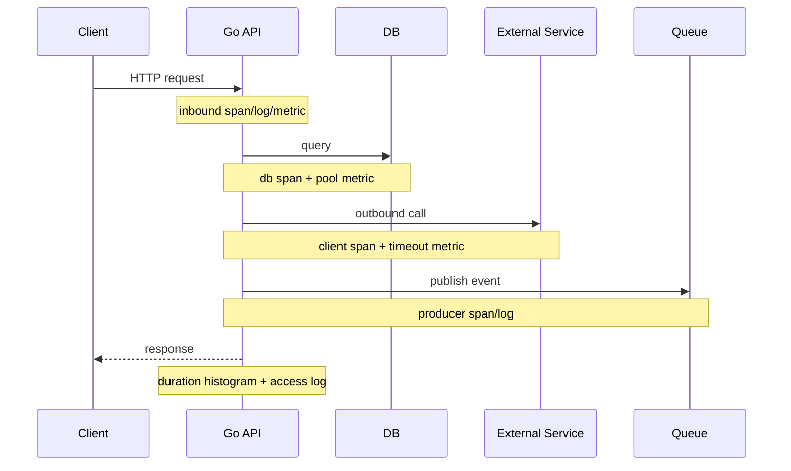

### Principle 5 — Avoid Duplicated Noise

Jika error sudah dilog di boundary dengan context lengkap, inner layer tidak perlu log error yang sama berkali-kali.

Buruk:

```text
repository logs error
service logs same error
handler logs same error
middleware logs same error
```

Akibat:

- log noise,
- inflated error perception,
- storage cost,
- incident confusion.

Lebih baik:

- inner layer returns enriched/classified error,
- boundary logs once with context,
- metrics increments once,
- trace span records status.

### Principle 6 — Debug Data Must Not Become Production Risk

Debugging tools powerful:

- pprof,
- trace,
- debug logs,
- payload logs,
- heap profile,
- goroutine dump.

Tetapi juga berisiko:

- mengandung secret/PII,
- memberi attacker runtime insight,
- menambah overhead,
- memperbesar storage,
- menyebabkan DoS,
- membuka internal topology.

Production observability harus punya access control.

---

## 13. Failure-Oriented Observability

Observability terbaik dimulai dari pertanyaan failure.

Bukan:

> "Metric apa yang bisa kita expose?"

Melainkan:

> "Saat failure X terjadi, evidence apa yang kita butuhkan untuk membedakan root cause A, B, C, D?"

### 13.1 Example: Latency p99 Naik

Kemungkinan:

1. CPU saturated.
2. CPU throttling container.
3. GC overhead.
4. DB pool wait.
5. slow query.
6. external API slow.
7. lock contention.
8. goroutine scheduler pressure.
9. queue backlog.
10. logging/exporter blocking.
11. DNS/TLS issue.
12. retry storm.
13. bad deployment.

Evidence yang dibutuhkan:

| Hypothesis | Evidence |
|---|---|
| CPU saturated | CPU metrics, CPU profile |
| CPU throttling | container CPU throttling metrics |
| GC overhead | runtime metrics, gctrace, heap/alloc profile |
| DB pool wait | pool metrics, traces, logs |
| slow query | DB metrics/query logs, trace span |
| external slow | outbound duration metrics, trace span |
| lock contention | mutex/block profile |
| scheduler pressure | runtime metrics, runtime trace |
| queue backlog | queue depth, worker metrics |
| logging blocking | CPU/block profile, logger queue metrics |
| DNS/TLS | httptrace/client metrics |
| retry storm | retry metrics/logs/traces |
| bad deploy | deployment marker, version label |

### 13.2 Example: Memory Naik

Kemungkinan:

1. real leak.
2. cache growth.
3. allocation churn.
4. goroutine leak retaining references.
5. large payload buffering.
6. cgo/native memory.
7. stack growth.
8. memory returned slowly to OS.
9. container limit too low.
10. profiling artifact.

Evidence:

| Hypothesis | Evidence |
|---|---|
| Real heap leak | heap in-use profile diff |
| Cache growth | cache metrics, heap profile |
| Allocation churn | alloc_space, alloc_objects, GC metrics |
| Goroutine leak | goroutine count/profile |
| Large payload | request metrics/logs, heap profile |
| cgo/native | RSS vs heap gap, cgo metrics if available |
| Stack growth | runtime stack metrics |
| Return to OS delay | runtime memory classes |
| Limit too low | container metrics, OOM events |
| Profiling artifact | repeated profiles under stable workload |

### 13.3 Example: Error Rate Naik

Kemungkinan:

1. dependency down,
2. timeout budget too low,
3. auth/permission regression,
4. validation rule changed,
5. database constraint conflict,
6. schema mismatch,
7. bad config,
8. traffic shape changed,
9. rate limit triggered,
10. panic after deployment.

Evidence:

| Hypothesis | Evidence |
|---|---|
| Dependency down | outbound error metrics/traces |
| Timeout too low | context deadline logs/traces |
| Auth regression | error_kind, status, authorization logs |
| Validation changed | validation error metrics/log fields |
| DB conflict | classified DB errors |
| Schema mismatch | deployment/version + error logs |
| Bad config | config hash/version log |
| Traffic changed | traffic metrics/labels |
| Rate limit | limiter metrics/logs |
| Panic | recovery logs + stack + version |

---

## 14. Observability Layer Map

Sistem Go berjalan di banyak layer. Jangan hanya melihat aplikasi.

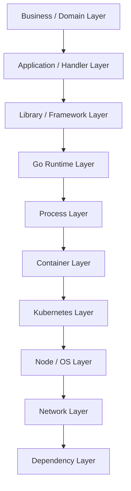

### 14.1 Business / Domain Layer

Signals:

- successful operation count,
- failed operation count,
- state transition count,
- rejected action by reason,
- backlog by business status,
- age of pending work,
- SLA breach count.

Contoh untuk regulatory/case management:

- case_created_total,
- case_escalated_total,
- case_assignment_failed_total,
- enforcement_action_transition_denied_total,
- pending_case_age_seconds,
- overdue_task_total.

### 14.2 Application / Handler Layer

Signals:

- HTTP/gRPC request rate,
- status code,
- route latency,
- request size,
- response size,
- panic recovery,
- timeout/cancellation,
- request ID/trace ID.

### 14.3 Library / Framework Layer

Signals:

- router/middleware behavior,
- JSON/XML/protobuf encode/decode cost,
- validation errors,
- auth middleware result,
- DB driver metrics,
- HTTP client instrumentation.

### 14.4 Go Runtime Layer

Signals:

- goroutines,
- heap,
- allocation,
- GC,
- scheduler,
- stacks,
- OS threads,
- mutex/block profiles.

### 14.5 Process Layer

Signals:

- PID lifecycle,
- file descriptors,
- CPU,
- RSS,
- signal handling,
- graceful shutdown,
- build info,
- start time,
- config load success.

### 14.6 Container Layer

Signals:

- CPU throttling,
- memory limit,
- OOMKilled,
- restart count,
- container logs,
- resource requests/limits.

### 14.7 Kubernetes Layer

Signals:

- pod phase,
- events,
- readiness,
- liveness,
- deployment rollout,
- replica availability,
- service endpoints,
- DNS/CoreDNS,
- node pressure.

### 14.8 Node / OS Layer

Signals:

- load average,
- CPU steal,
- disk IO,
- network errors,
- conntrack,
- ephemeral ports,
- kernel OOM.

### 14.9 Network Layer

Signals:

- DNS latency,
- TCP connect latency,
- TLS handshake latency,
- retransmits,
- packet loss,
- load balancer 5xx,
- NAT exhaustion.

### 14.10 Dependency Layer

Signals:

- DB latency,
- DB pool saturation,
- external API error,
- queue lag,
- cache hit ratio,
- Redis timeout,
- Kafka/RabbitMQ backlog.

---

## 15. Production Debugging Without Lying to Yourself

Troubleshooting sering gagal bukan karena kurang data, tetapi karena salah membaca data.

### 15.1 Common Cognitive Traps

#### Trap 1 — Correlation Is Not Root Cause

Deployment terjadi pukul 10:00, latency naik pukul 10:05.

Mungkin deployment penyebabnya. Tapi mungkin juga traffic campaign mulai pukul 10:05.

Evidence tambahan:

- apakah latency naik hanya versi baru?
- apakah rollback menurunkan latency?
- apakah traffic shape berubah?
- apakah dependency latency juga naik?
- apakah CPU/GC berubah?
- apakah logs error kind berubah?

#### Trap 2 — Average Hides Tail

Average latency 100 ms bisa terlihat sehat meskipun p99 5 detik.

Tail latency penting karena user experience dan retries sering dipicu oleh tail.

#### Trap 3 — CPU Normal Does Not Mean Service Healthy

CPU rendah bisa terjadi saat:

- semua goroutine blocked,
- dependency lambat,
- DB pool habis,
- network timeout,
- deadlock-like waiting,
- queue tidak dikonsumsi.

#### Trap 4 — Memory Growth Does Not Always Mean Leak

Memory growth bisa karena:

- higher traffic,
- cache warming,
- larger live set,
- batch job,
- allocator behavior,
- delayed scavenging,
- profiling timing.

Leak perlu dibuktikan dengan retained heap/goroutine/reference path over time.

#### Trap 5 — Logs Can Mislead if Duplicated

Satu request error bisa dilog 4 kali oleh layer berbeda. Error count dari logs bisa 4x lebih besar dari actual failed requests.

Metric request error lebih tepat untuk rate.

#### Trap 6 — Trace Sampling Can Hide the Bad Case

Jika sampling random 1%, rare slow/error request mungkin tidak terekam.

Untuk incident, tail sampling atau error-biased sampling lebih berguna.

#### Trap 7 — pprof Needs Representative Workload

Profile saat traffic rendah bisa tidak merepresentasikan bottleneck peak traffic.

Profile setelah mitigasi mungkin tidak menunjukkan root cause asli.

#### Trap 8 — Local Benchmark Is Not Production

Benchmark lokal sering tidak memiliki:

- real dependency latency,
- container CPU limit,
- Kubernetes network,
- TLS,
- real payload,
- connection pool pressure,
- log exporter overhead,
- noisy neighbor,
- GC pressure real.

---

## 16. Observability Contract

Agar observability konsisten lintas service, buat kontrak.

### 16.1 Log Contract

Minimal fields:

```yaml
time: RFC3339Nano timestamp
level: DEBUG|INFO|WARN|ERROR
msg: stable event name
service: service name
environment: dev|staging|prod
version: build/deploy version
instance: pod/container/host identity
request_id: request correlation id when available
trace_id: trace id when available
span_id: span id when available
operation: stable operation name
component: logical component
error_kind: stable error classification when error
duration_ms: operation duration when relevant
```

Rules:

- `msg` should be stable event name, not arbitrary sentence.
- Do not log secrets.
- Do not log raw payload by default.
- Do not use user ID as metric label; for logs, treat as sensitive depending domain.
- Log once at boundary for expected errors.
- Panic recovery logs stack with care.
- Include cause chain classification, not only raw error string.

### 16.2 Metrics Contract

Rules:

- use counters for totals,
- use histograms for latency,
- use gauges for current values,
- avoid high-cardinality labels,
- labels must be bounded/stable,
- route should be templated path, not raw URL,
- status label should be class/code with controlled values,
- error_kind label must be enum-like,
- metrics should support SLO and troubleshooting.

Good labels:

```text
method="GET"
route="/cases/{id}"
status="200"
status_class="2xx"
operation="case_approve"
error_kind="dependency_timeout"
```

Bad labels:

```text
path="/cases/123456"
user_id="98765"
request_id="abc..."
error="dial tcp 10.1.2.3:443: i/o timeout after ..."
sql="select * from ..."
```

### 16.3 Trace Contract

Rules:

- inbound request creates server span,
- outbound dependency creates client span,
- async publish/consume uses producer/consumer semantics,
- span names are stable,
- attributes are bounded,
- errors recorded with classification,
- context propagation must be explicit,
- no secrets/payload in span attributes,
- trace ID appears in logs.

### 16.4 Profile Contract

Rules:

- pprof endpoint must not be public,
- profile capture requires timestamp/service/version/pod/workload metadata,
- capture duration standardized,
- profiles stored securely,
- sensitive data risk acknowledged,
- compare profile under similar workload,
- profile attached to incident evidence when relevant.

### 16.5 Dashboard Contract

Rules:

- every dashboard answers an operational question,
- overview dashboard starts with SLO/golden signals,
- runtime dashboard separates heap/allocation/GC/goroutine,
- dependency dashboard shows latency/errors/saturation,
- panels use percentiles/histograms, not only averages,
- deployment markers visible,
- dashboards avoid unbounded label selectors.

### 16.6 Alert Contract

Rules:

- page on symptoms/user impact, not every cause,
- cause alerts may be tickets/non-paging,
- use burn rate for SLO,
- alert message includes dashboard/runbook links,
- alert has owner,
- alert has action,
- noisy alerts must be fixed or deleted.

---

## 17. Reference Architecture: Observable Go Service

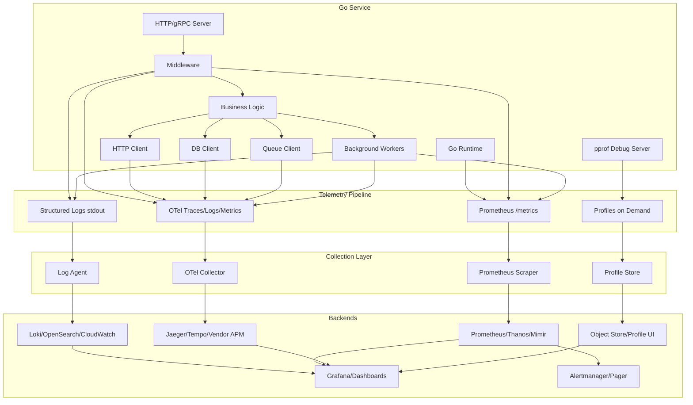

### 17.1 Why Separate Debug Server?

Jangan sembarang import `net/http/pprof` ke default mux public.

Pola yang lebih aman:

- main API listen di `:8080`,
- debug/pprof listen di `127.0.0.1:6060` atau internal-only port,
- akses via Kubernetes port-forward / VPN / admin network,
- lindungi dengan auth/mTLS/network policy,
- jangan expose via public ingress.

### 17.2 Why stdout Logs?

Dalam container/Kubernetes, praktik umum adalah aplikasi menulis log ke stdout/stderr, lalu agent/platform mengumpulkan.

Aplikasi tidak perlu tahu langsung Elasticsearch/Loki/CloudWatch kecuali ada requirement khusus.

### 17.3 Why Prometheus Pull?

Prometheus scrape model cocok untuk service metrics:

- service expose `/metrics`,
- Prometheus scrape berkala,
- scrape failure terlihat,
- target discovery via Kubernetes.

Tetapi untuk ephemeral/batch job, pola berbeda bisa dibutuhkan.

### 17.4 Why OTel Collector?

OTel Collector membantu:

- memisahkan app dari vendor backend,
- batching/retry/export,
- sampling,
- resource enrichment,
- routing telemetry,
- central policy.

Tetapi Collector bukan magic. Salah konfigurasi bisa membuat telemetry hilang atau mahal.

---

## 18. Top 1% Lens: What Senior Engineers Actually Do

Engineer biasa menambahkan log saat bug muncul.

Engineer senior mendesain sistem agar bug masa depan bisa dianalisis.

### 18.1 Senior Habit 1 — Think in Failure Classes

Bukan "tambahkan metrics".

Melainkan:

- jika dependency lambat, signal mana berubah?
- jika goroutine leak, apa early warning?
- jika cache grow unbounded, dashboard mana menunjukkan?
- jika retry storm, bagaimana tahu?
- jika pprof endpoint terekspos, siapa bisa akses?
- jika trace sampling drop error request, bagaimana mitigasi?
- jika DB pool saturated, alert apa muncul?

### 18.2 Senior Habit 2 — Separate Detection from Diagnosis

Detection:

- SLO burn,
- golden signals,
- error rate,
- saturation.

Diagnosis:

- traces,
- logs,
- profiles,
- runtime metrics,
- dependency dashboards.

Jangan paging engineer karena "goroutine > 10k" tanpa user impact, kecuali itu indikator kuat untuk imminent failure dan runbook jelas.

### 18.3 Senior Habit 3 — Preserve Causality

Causality flows through:

- request ID,
- trace context,
- context cancellation/deadline,
- operation name,
- entity ID,
- version,
- deployment timestamp,
- dependency span,
- error classification.

Jika causality putus, troubleshooting jadi mahal.

### 18.4 Senior Habit 4 — Treat Observability as API

Log fields, metric names, span attributes adalah API untuk:

- engineers,
- SRE,
- dashboards,
- alerts,
- incident automation,
- forensic/audit analysis.

Breaking them sembarangan sama seperti breaking public API.

### 18.5 Senior Habit 5 — Instrument Before Optimizing

Optimisasi tanpa evidence sering salah.

Urutan yang benar:

1. Define symptom.
2. Capture baseline metrics/profile.
3. Identify bottleneck.
4. Change one meaningful thing.
5. Compare.
6. Verify no regression.

### 18.6 Senior Habit 6 — Design for Safe Degradation

Observability backend bisa down.

Service tidak boleh ikut down hanya karena:

- log exporter gagal,
- trace exporter lambat,
- metrics registry lock,
- collector unavailable.

Telemetry path harus degrade safely.

---

## 19. The Go Observability Stack by Responsibility

### 19.1 `log/slog`

Responsibility:

- structured event logging,
- standard logging API,
- JSON/Text handler,
- attributes/groups,
- context-aware methods,
- custom handlers.

Not responsibility:

- metrics,
- traces,
- profile,
- alerting,
- storage.

### 19.2 Prometheus Go Client

Responsibility:

- application metrics,
- counters/gauges/histograms,
- `/metrics`,
- registry,
- collectors.

Not responsibility:

- request-level causality,
- logging,
- profiling,
- distributed tracing.

### 19.3 `runtime/metrics`

Responsibility:

- stable runtime metric interface,
- Go runtime internals,
- memory classes,
- GC,
- scheduler/goroutine metrics.

Not responsibility:

- application-specific metrics,
- endpoint latency,
- business events.

### 19.4 `net/http/pprof` and `runtime/pprof`

Responsibility:

- runtime profiling data,
- CPU/heap/goroutine/mutex/block/thread profiles,
- pprof-compatible output.

Not responsibility:

- continuous alerting,
- business context,
- distributed tracing.

### 19.5 `runtime/trace`

Responsibility:

- execution-level event trace,
- scheduler/GC/network/syscall timing,
- user annotations/tasks/regions.

Not responsibility:

- long-term always-on telemetry,
- low-cardinality metrics,
- logs.

### 19.6 OpenTelemetry

Responsibility:

- vendor-neutral telemetry API/SDK,
- traces,
- metrics,
- logs/log bridge,
- propagation,
- exporters,
- collector ecosystem.

Not responsibility:

- automatically choosing good semantic design,
- preventing high-cardinality misuse,
- solving bad context propagation automatically,
- replacing pprof.

---

## 20. Decision Table: Which Tool for Which Problem?

| Problem | First Signal | Follow-up Evidence | Likely Tooling |
|---|---|---|---|
| Error rate spike | Metrics | Logs + traces | Prometheus, `slog`, OTel |
| p99 latency spike | Metrics | traces + pprof/trace | Prometheus, OTel, pprof, runtime/trace |
| High CPU | CPU metrics | CPU profile | pprof |
| High memory/OOM | runtime/container metrics | heap profile, goroutine profile | runtime/metrics, pprof, Kubernetes |
| Goroutine growth | runtime metrics | goroutine profile | runtime/metrics, pprof |
| Lock contention | latency metrics | mutex/block profile | pprof |
| Blocked workers | queue metrics | goroutine/block profile | Prometheus, pprof |
| Slow downstream | dependency metrics | client spans/logs | OTel, slog, Prometheus |
| DB pool saturated | DB metrics | traces/logs | DB pool stats, OTel |
| Retry storm | retry metrics | logs/traces | Prometheus, slog, OTel |
| CPU normal but latency bad | RED metrics | trace/block/runtime trace | OTel, pprof, runtime/trace |
| After deploy regression | versioned metrics | profile diff, logs | Prometheus, pprof |
| Unknown incident | golden signals | evidence ladder | all relevant |

---

## 21. Observability Data Model

### 21.1 Event

Event adalah sesuatu yang terjadi pada waktu tertentu.

Examples:

- request received,
- request completed,
- payment capture failed,
- case escalated,
- job started,
- job completed,
- retry attempted,
- panic recovered,
- dependency timeout.

Event cocok untuk logs.

### 21.2 Measurement

Measurement adalah angka yang bisa diagregasi.

Examples:

- request count,
- latency seconds,
- heap bytes,
- queue depth,
- active workers,
- DB pool wait count.

Measurement cocok untuk metrics.

### 21.3 Causal Segment

Causal segment adalah potongan kerja dalam trace.

Examples:

- HTTP server handling,
- DB query,
- external API call,
- queue publish,
- worker processing.

Causal segment cocok untuk spans.

### 21.4 Sample

Sample adalah potongan representatif dari resource usage.

Examples:

- CPU samples,
- heap allocation samples,
- mutex wait samples,
- goroutine stacks.

Sample cocok untuk profiles.

### 21.5 State

State adalah nilai saat ini.

Examples:

- readiness status,
- current goroutine count,
- in-use DB conns,
- cache size,
- queue depth.

State cocok untuk gauges, health endpoints, runtime metrics.

---

## 22. Building the Incident Mental Model

Incident bukan sekadar "ada error".

Incident adalah perubahan tidak diinginkan pada behavior sistem yang berdampak atau berpotensi berdampak pada user/business/SLO.

### 22.1 Incident Timeline

```mermaid
timeline
    title Incident Timeline Example
    10:00 : Deployment v42 started
    10:03 : Traffic shifted to v42
    10:05 : p99 latency starts increasing
    10:07 : DB pool wait duration increases
    10:09 : Error budget burn alert fires
    10:12 : On-call investigates traces
    10:16 : Query path regression suspected
    10:20 : Rollback started
    10:27 : Latency returns to baseline
    11:10 : Profile/log/trace evidence reviewed
```

Good observability lets you reconstruct this quickly.

### 22.2 Impact Definition

Always define:

- affected service,
- affected endpoints,
- affected users/tenants,
- start time,
- end time,
- error rate,
- latency impact,
- data correctness risk,
- workaround,
- current mitigation status.

### 22.3 Hypothesis Tree

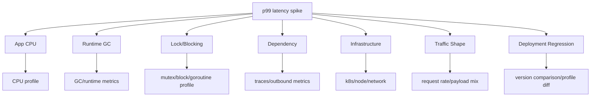

Top engineer tidak hanya mencari "the answer". Mereka mengurangi search space dengan evidence.

---

## 23. Go-Specific Failure Taxonomy

### 23.1 Runtime/Concurrency Failures

- goroutine leak,
- channel send/receive blocked forever,
- context not cancelled,
- worker pool not drained,
- unbounded goroutine fan-out,
- mutex contention,
- RWMutex writer starvation-like symptoms,
- timer/ticker not stopped,
- response body not closed,
- blocked finalizers/cleanup assumptions,
- scheduler pressure.

### 23.2 Memory/GC Failures

- allocation churn,
- retained slice backing array,
- unbounded map/cache,
- large JSON/XML buffering,
- excessive string/byte conversions,
- `sync.Pool` misuse,
- high pointer density,
- cgo/native leak,
- memory limit thrashing,
- OOMKilled,
- heap profile misread.

### 23.3 Network/HTTP Failures

- missing timeout,
- global `http.Client` misuse,
- no connection reuse,
- not closing body,
- DNS latency,
- TLS handshake spike,
- ephemeral port exhaustion,
- retry storm,
- bad circuit breaker,
- proxy/load balancer idle timeout mismatch.

### 23.4 Logging/Telemetry Failures

- blocking logger,
- high-cardinality metric,
- log storm,
- exporter backpressure,
- trace sampling too low,
- pprof exposed,
- PII leakage,
- duplicate error logs,
- missing correlation ID,
- dashboard too slow.

### 23.5 Deployment/Config Failures

- version mismatch,
- missing config,
- feature flag rollout,
- dependency endpoint changed,
- Kubernetes resource limit changed,
- environment variable changed,
- collector config changed,
- scrape target dropped.

---

## 24. From Java Tools to Go Equivalents

| Java Tool/Pattern | Go Equivalent / Go Approach | Notes |
|---|---|---|
| SLF4J + Logback | `log/slog`, zap, zerolog | `slog` is standard structured logging |
| MDC | context-carried fields / logger derived from context | Avoid hidden global state |
| Micrometer | Prometheus client / OTel metrics | Decide semantic conventions early |
| Actuator `/metrics` | `/metrics` with promhttp or OTel exporter | Keep endpoint safe |
| JFR | `pprof` + `runtime/trace` + metrics | Not identical, but powerful |
| Thread dump | goroutine profile | Goroutine != OS thread |
| Heap dump | heap profile | Go heap profile is sampled/statistical |
| JVM GC logs | runtime metrics + `GODEBUG=gctrace=1` when needed | Use carefully |
| Executor metrics | worker pool metrics | Build yourself |
| Servlet filter | net/http middleware | Instrument boundary |
| ThreadLocal trace context | `context.Context` | Explicit propagation |
| APM javaagent | OTel manual/library instrumentation | Go auto-instrumentation has different constraints |

---

## 25. Production Readiness Checklist for Part 000

Sebelum lanjut ke Part 001, pastikan mental model ini jelas.

### 25.1 Conceptual Checklist

- [ ] Saya bisa menjelaskan perbedaan logging, monitoring, observability, diagnostics, profiling, tracing, troubleshooting.
- [ ] Saya paham bahwa logs/metrics/traces saja tidak cukup untuk Go; profiles/runtime metrics juga penting.
- [ ] Saya paham bahwa Go runtime adalah bagian dari production behavior.
- [ ] Saya paham perbedaan goroutine dan OS thread secara operational.
- [ ] Saya paham bahwa heap profile tidak sama dengan RSS/container memory.
- [ ] Saya paham bahwa context propagation adalah causality propagation.
- [ ] Saya paham kapan pakai metric, log, trace, profile, runtime trace.
- [ ] Saya paham golden signals, RED, dan USE.
- [ ] Saya paham observability harus aman, murah, dan bisa dikorelasikan.
- [ ] Saya paham observability contract adalah API internal.

### 25.2 Design Checklist

- [ ] Apakah service punya standard log fields?
- [ ] Apakah request ID dan trace ID muncul di logs?
- [ ] Apakah route metric memakai templated route?
- [ ] Apakah metrics label bounded?
- [ ] Apakah pprof endpoint tidak public?
- [ ] Apakah runtime metrics tersedia?
- [ ] Apakah trace context diteruskan ke outbound calls?
- [ ] Apakah error classification stabil?
- [ ] Apakah dashboard menjawab pertanyaan operasional?
- [ ] Apakah alert punya action/runbook?

### 25.3 Incident Checklist

Ketika incident muncul:

- [ ] Define impact.
- [ ] Build timeline.
- [ ] Check golden signals.
- [ ] Check deployment/config changes.
- [ ] Split hypotheses by layer.
- [ ] Use traces for request path.
- [ ] Use logs for event/error details.
- [ ] Use metrics for rates/distributions/saturation.
- [ ] Use pprof for CPU/memory/goroutine/contention.
- [ ] Use runtime trace for scheduler/blocking/GC timing.
- [ ] Mitigate.
- [ ] Verify recovery.
- [ ] Preserve evidence.
- [ ] Write RCA with supported facts.

---

## 26. Exercises

### Exercise 1 — Classify Signals

Untuk setiap pertanyaan berikut, tentukan evidence utama dan secondary evidence.

1. "Endpoint `/cases/{id}/approve` p99 naik dari 200 ms ke 4 detik."
2. "Memory pod naik 200 MiB per jam."
3. "CPU 90%, error rate normal, latency naik."
4. "CPU rendah, tetapi request timeout."
5. "Goroutine count naik dari 500 ke 50.000."
6. "Setelah deployment, hanya tenant tertentu error."
7. "DB pool wait duration naik, DB CPU normal."
8. "Trace hilang setelah publish message ke queue."
9. "Log storage cost naik 5x."
10. "pprof heap tidak besar, tetapi pod OOMKilled."

Expected reasoning:

- Jangan langsung loncat ke root cause.
- Tulis 3–5 hypothesis.
- Tentukan evidence mana membedakan hypothesis.

### Exercise 2 — Observability Contract Draft

Buat kontrak minimal untuk service Go API:

- log fields,
- metrics,
- trace spans,
- pprof/debug access rule,
- dashboard panels,
- alerts.

### Exercise 3 — Failure Class Matrix

Pilih satu service yang kamu kenal. Buat matrix:

| Failure Class | User Symptom | Detection Metric | Diagnostic Evidence | Mitigation |
|---|---|---|---|---|

Isi minimal:

- slow DB,
- external dependency down,
- goroutine leak,
- memory leak,
- CPU hotspot,
- retry storm,
- bad deployment,
- logging overload.

### Exercise 4 — Java-to-Go Translation

Ambil satu runbook Java yang biasa memakai:

- thread dump,
- heap dump,
- GC logs,
- JFR,
- actuator metrics.

Terjemahkan ke Go equivalent:

- goroutine profile,
- heap profile,
- runtime metrics,
- pprof,
- runtime trace,
- Prometheus/OTel metrics.

---

## 27. Common Anti-Patterns to Avoid from Day One

### Anti-Pattern 1 — "We'll Add Observability Later"

Observability yang ditambahkan belakangan sering tidak punya semantic consistency.

Akibat:

- field tidak konsisten,
- metric tidak comparable,
- trace tidak lengkap,
- runbook tidak bisa dibuat,
- incident pertama menjadi chaos.

### Anti-Pattern 2 — Logging Raw Error Everywhere

Error logging tanpa classification membuat query buruk.

Buruk:

```text
error="pq: duplicate key value violates unique constraint ..."
error="context deadline exceeded"
error="dial tcp ..."
```

Lebih baik tambahkan:

```text
error_kind="conflict"
error_kind="timeout"
error_kind="dependency_connect_failed"
```

Raw error tetap bisa ada, tetapi classification harus stabil.

### Anti-Pattern 3 — High Cardinality Labels

Contoh bencana:

```text
http_request_duration_seconds{user_id="...", request_id="...", path="/cases/123"}
```

Akibat:

- Prometheus/cardinality cost meledak,
- query lambat,
- storage mahal,
- scrape/ingestion pressure.

### Anti-Pattern 4 — Public pprof

pprof bisa membocorkan informasi runtime, stack, endpoint, query, bahkan data yang muncul di memory/profile. Jangan expose public.

### Anti-Pattern 5 — Trace Everything at 100% Forever

100% tracing bisa valid untuk low traffic atau temporary incident mode. Untuk high-throughput production, pikirkan sampling, retention, dan cost.

### Anti-Pattern 6 — Alert on Everything

Alert yang tidak actionable akan diabaikan.

Alert buruk:

```text
goroutine_count > 1000
```

Alert lebih baik:

```text
p99 latency burn rate high
AND goroutine count increasing rapidly
```

atau goroutine alert sebagai warning/ticket dengan runbook jelas.

### Anti-Pattern 7 — Dashboard as Wall Decoration

Dashboard yang bagus membantu keputusan.

Dashboard buruk hanya kumpulan grafik tanpa urutan investigasi.

### Anti-Pattern 8 — No Version Labels

Tanpa version/deployment metadata, sulit tahu apakah regression terkait release.

### Anti-Pattern 9 — Instrumentation That Changes Behavior Too Much

Instrumentation harus low overhead.

Jika telemetry:

- menambah lock contention,
- blocking hot path,
- mengalokasikan terlalu banyak,
- melakukan network call sync per request,

maka observability menjadi penyebab incident.

---

## 28. Mental Model Summary

Observability Go production-grade = gabungan dari:

```text
structured event evidence
+ numerical health evidence
+ distributed causality evidence
+ runtime resource evidence
+ diagnostic sampling evidence
+ deployment/config evidence
+ safe operational process
```

Atau lebih ringkas:

```text
Logs tell what happened.
Metrics tell how much and how often.
Traces tell where time went.
Profiles tell where resources went.
Runtime metrics tell what Go runtime is doing.
Runtime trace tells how execution was scheduled.
Runbooks turn evidence into action.
```

---

## 29. What Comes Next

Part berikutnya:

```text
learn-go-logging-observability-profiling-troubleshooting-part-001.md
```

Judul:

```text
Production Logging Philosophy in Go
```

Fokus Part 001:

- log sebagai event stream,
- structured logging,
- log levels,
- event naming,
- stable fields,
- correlation,
- redaction,
- duplicate error logging,
- PII/secrets,
- audit vs diagnostic logs,
- logging anti-patterns,
- desain logging contract untuk Go services.

---

## 30. References

Sumber utama yang menjadi basis seri ini:

1. Go 1.26 Release Notes  
   https://go.dev/doc/go1.26

2. Go Diagnostics  
   https://go.dev/doc/diagnostics

3. `log/slog` package documentation  
   https://pkg.go.dev/log/slog

4. Go blog — Structured Logging with slog  
   https://go.dev/blog/slog

5. `net/http/pprof` documentation  
   https://pkg.go.dev/net/http/pprof

6. `runtime/metrics` documentation  
   https://pkg.go.dev/runtime/metrics

7. `runtime/trace` documentation  
   https://pkg.go.dev/runtime/trace

8. Prometheus — Instrumenting a Go application  
   https://prometheus.io/docs/guides/go-application/

9. Prometheus Go client  
   https://github.com/prometheus/client_golang

10. OpenTelemetry Go documentation  
    https://opentelemetry.io/docs/languages/go/

11. OpenTelemetry Go getting started  
    https://opentelemetry.io/docs/languages/go/getting-started/

12. OpenTelemetry Go instrumentation  
    https://opentelemetry.io/docs/languages/go/instrumentation/

13. OpenTelemetry specification status  
    https://opentelemetry.io/docs/specs/status/

14. Google SRE Book — Monitoring Distributed Systems  
    https://sre.google/sre-book/monitoring-distributed-systems/

15. Grafana — RED Method  
    https://grafana.com/blog/2018/08/02/the-red-method-how-to-instrument-your-services/

---

## 31. Closing Note

Part 000 bukan tentang API tertentu. Ini adalah fondasi cara berpikir.

Mulai Part 001, kita akan masuk ke logging secara dalam, tetapi tetap dengan prinsip yang sama:

> Jangan hanya menulis telemetry.  
> Desain evidence agar sistem bisa menjelaskan dirinya sendiri saat produksi bermasalah.

**Status seri: belum selesai. Ini baru Part 000 dari 032.**

<!-- NAVIGATION_FOOTER -->
<div class="page-nav">
<span></span>
<a href="./index.md">📚 Kategori</a>
<a href="../../index.md">🏠 Home</a>
<a href="./learn-go-logging-observability-profiling-troubleshooting-part-001.md">Part 001 — Production Logging Philosophy in Go ➡️</a>
</div>
