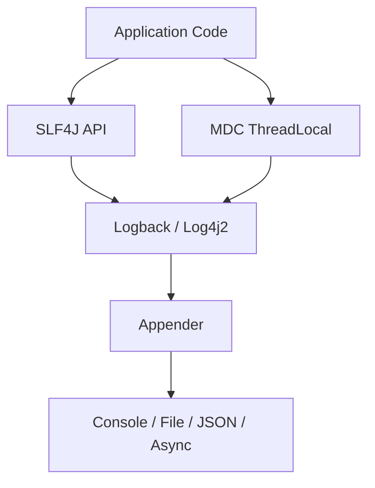
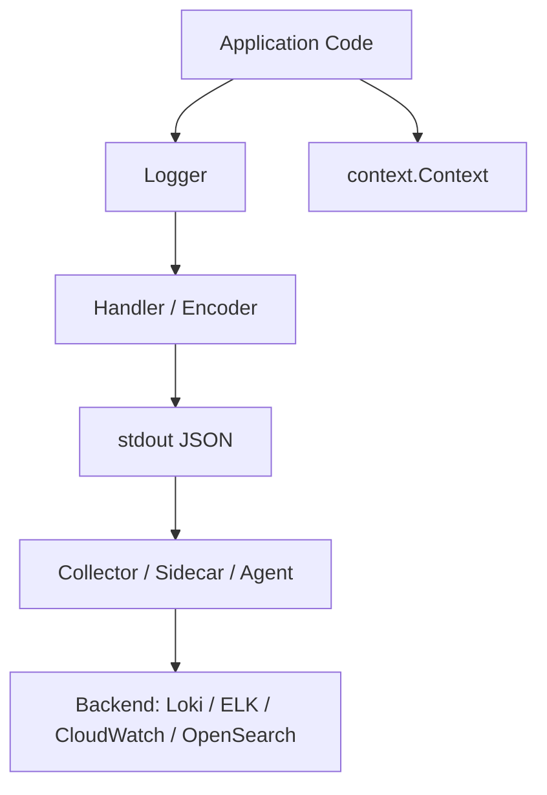
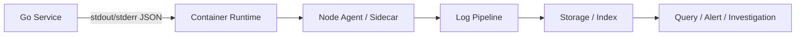
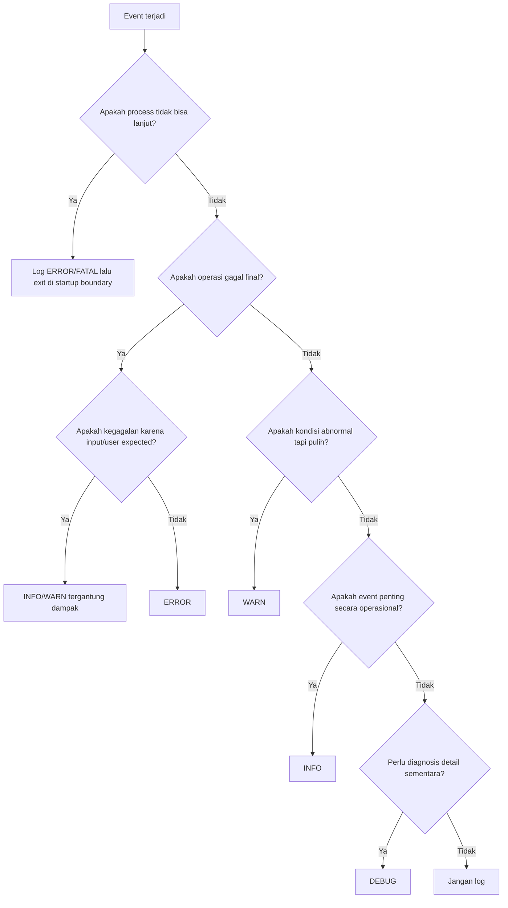
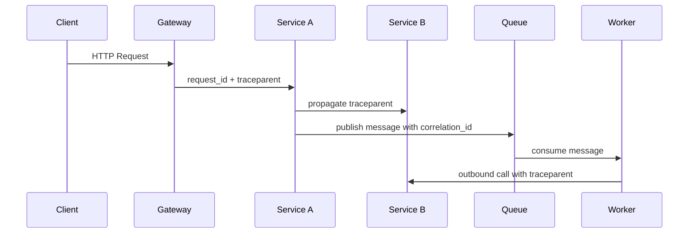
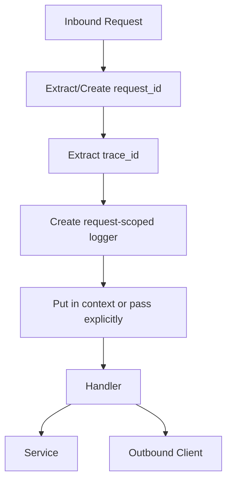
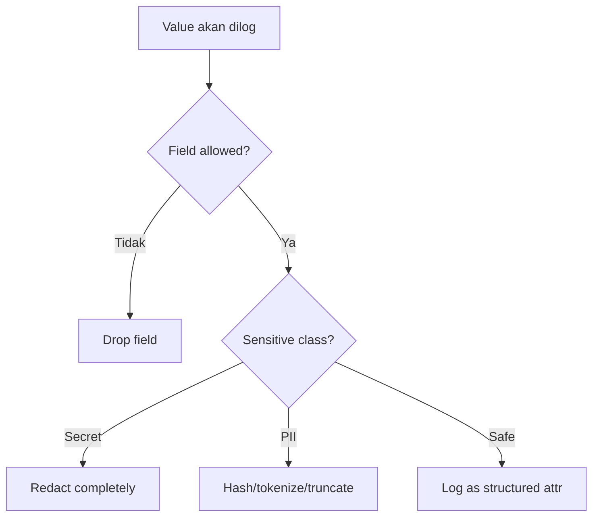
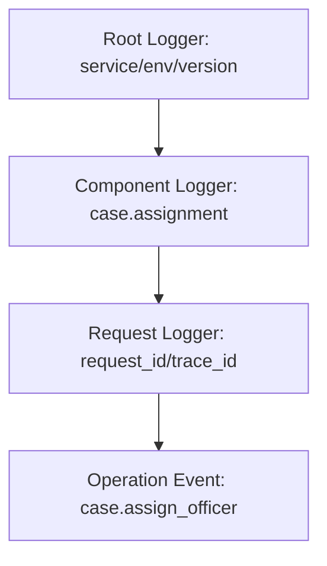
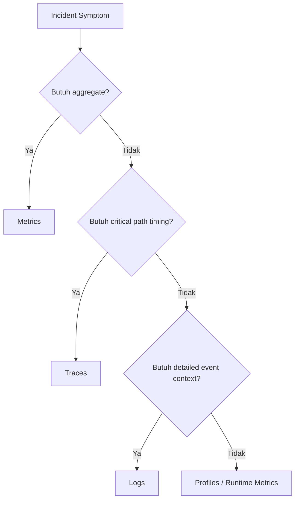

# learn-go-logging-observability-profiling-troubleshooting-part-001.md

# Part 001 — Production Logging Philosophy in Go

> Seri: `learn-go-logging-observability-profiling-troubleshooting`  
> Bagian: `001`  
> Topik: Production logging philosophy, event design, causality, schema, levels, cardinality, privacy, dan failure evidence  
> Target pembaca: Java software engineer yang ingin berpikir seperti production Go engineer / SRE-minded backend engineer  
> Prasyarat: sudah memahami Go dasar, error handling dasar, context dasar, HTTP dasar, dan concurrency dasar

---

## 0. Posisi Part Ini dalam Seri

Part 000 membangun ide utama bahwa observability adalah kemampuan sistem untuk menjelaskan dirinya sendiri saat berjalan.

Part 001 masuk ke sinyal pertama yang paling sering disentuh developer: **log**.

Namun bagian ini sengaja **belum** membahas detail API `log/slog` secara penuh. Itu akan masuk di Part 002. Di sini kita membahas pertanyaan yang lebih fundamental:

> Bagaimana cara berpikir tentang logging supaya log benar-benar menjadi bukti operasional, bukan sekadar tumpukan teks?

Dalam production engineering, logging yang buruk sering lebih berbahaya daripada tidak ada logging sama sekali:

- log terlalu banyak membuat sinyal penting tenggelam;
- log terlalu sedikit membuat insiden tidak bisa direkonstruksi;
- log tidak terstruktur membuat query lambat dan rapuh;
- log tanpa correlation membuat request tidak bisa dilacak lintas service;
- log berisi PII/secrets menjadi risiko security/regulatory;
- log dengan cardinality liar membuat biaya observability meledak;
- log error yang diduplikasi membuat severity terlihat lebih buruk daripada realita;
- log yang tidak punya kontrak schema membuat dashboard, alert, dan forensic workflow mudah rusak.

Logging production bukan soal “menulis pesan”, tetapi soal **mendesain event evidence**.

---

## 1. Learning Objectives

Setelah bagian ini, kamu harus bisa:

1. Membedakan log sebagai **event evidence** vs log sebagai **debug print**.
2. Mendesain structured log yang queryable, stable, dan aman.
3. Memilih level log berdasarkan dampak operasional, bukan perasaan developer.
4. Menentukan apa yang harus dan tidak harus dilog.
5. Menghindari duplikasi error logging.
6. Mendesain correlation field untuk request, trace, tenant, user, module, dan operation.
7. Menilai risiko cardinality, PII, secret leakage, dan log injection.
8. Membuat logging contract internal untuk service Go production.
9. Menghubungkan logging dengan metrics, tracing, profiling, dan incident workflow.
10. Berpikir seperti engineer yang harus menyelamatkan production pada jam 02:00 pagi.

---

## 2. Core Thesis

Logging yang baik harus menjawab lima pertanyaan:

1. **What happened?**  
   Event apa yang terjadi?

2. **Where did it happen?**  
   Service, module, component, endpoint, worker, dependency mana?

3. **Who/what was affected?**  
   Tenant, user class, request, entity, job, message, atau dependency apa?

4. **Why did it happen?**  
   Apa penyebab terdekat, error class, status, reason, atau state transition?

5. **How can I correlate it?**  
   Bagaimana event ini dihubungkan ke request, trace, span, deployment, version, dan timeline lain?

Log yang hanya berkata:

```text
failed to process request
```

hampir tidak berguna.

Log yang berkata:

```json
{
  "time": "2026-06-23T04:10:11.812Z",
  "level": "ERROR",
  "service": "payment-api",
  "env": "prod",
  "version": "2026.06.23-4f2a91c",
  "component": "invoice.worker",
  "operation": "invoice.finalize",
  "request_id": "req_7F9...",
  "trace_id": "5b8aa5...",
  "tenant_id": "agency-a",
  "invoice_id": "inv_123",
  "error_kind": "dependency_timeout",
  "dependency": "tax-service",
  "timeout_ms": 1500,
  "attempt": 3,
  "retryable": true,
  "msg": "invoice finalization failed after dependency timeout"
}
```

bisa dipakai untuk investigasi, korelasi, dashboard, alert enrichment, dan postmortem.

---

## 3. Logging dalam Go vs Java: Perbedaan Mental Model

Sebagai Java engineer, kamu mungkin terbiasa dengan:

- SLF4J sebagai facade;
- Logback/Log4j2 sebagai backend;
- MDC untuk correlation context;
- appender async;
- log pattern;
- JSON encoder;
- thread-local context;
- Spring Boot auto-configuration;
- actuator/observability auto instrumentation;
- Micrometer untuk metrics;
- APM agent yang melakukan banyak hal otomatis.

Di Go, idiom production-nya berbeda.

### 3.1 Java Logging Bias

Java ecosystem cenderung menyediakan banyak kemampuan framework-level:



Kelebihan:

- sangat matang;
- banyak pattern enterprise;
- automatic integration dengan Spring;
- MDC nyaman selama model thread-per-request.

Kekurangan:

- mudah terlalu implicit;
- thread-local context bisa membingungkan di async/reactive;
- framework sering menyembunyikan cost;
- logging menjadi konfigurasi, bukan desain event.

### 3.2 Go Logging Bias

Go lebih eksplisit:



Di Go:

- tidak ada MDC standar berbasis thread-local;
- goroutine murah dan banyak, sehingga thread-local bukan model utama;
- `context.Context` adalah carrier eksplisit untuk cancellation/deadline dan sering juga membawa request-scoped observability metadata;
- logger biasanya dipassing atau dibungkus dalam dependency;
- output production biasanya stdout/stderr JSON;
- log collector di platform/container mengambil stdout.

### 3.3 Konsekuensi Penting

Dalam Go, kamu harus lebih disiplin mendesain boundary:

- kapan request ID dibuat;
- kapan trace ID diekstrak;
- bagaimana logger diberi field request-scoped;
- bagaimana goroutine background mendapat context;
- bagaimana worker mencatat message/job ID;
- bagaimana library internal tidak sembarangan log;
- bagaimana error bubble-up tanpa duplicate log.

Java sering memberi “logging infrastructure” lebih dulu. Go memaksa kamu mendesain **logging semantics** lebih dulu.

---

## 4. Log Bukan Debug Print

Debug print menjawab:

> “Apa yang sedang saya pikirkan saat menulis kode ini?”

Production log harus menjawab:

> “Apa yang perlu diketahui engineer lain saat sistem gagal tanpa akses ke local debugger?”

### 4.1 Debug Print

Contoh buruk:

```go
fmt.Println("here 1")
fmt.Println("user", user)
fmt.Println("err", err)
```

Masalah:

- tidak ada level;
- tidak ada timestamp standar;
- tidak ada schema;
- tidak ada correlation;
- tidak bisa difilter reliably;
- bisa bocor PII;
- sulit dibedakan dari output lain;
- tidak bisa menjadi operational evidence.

### 4.2 Production Event Log

Contoh lebih baik:

```go
logger.ErrorContext(ctx,
    "user profile update failed",
    "component", "profile.service",
    "operation", "profile.update",
    "user_id_hash", hashUserID(userID),
    "error_kind", "validation_failed",
    "field", "email",
    "err", err,
)
```

Catatan: contoh ini akan dibahas secara API-level di Part 002. Di Part ini yang penting adalah bentuk pikirannya:

- event bernama jelas;
- ada component;
- ada operation;
- ada identifier aman;
- ada klasifikasi error;
- ada error object;
- memakai context untuk correlation.

---

## 5. Log sebagai Event Stream

Log bukan file. Log adalah **event stream**.

File hanyalah salah satu media. Dalam cloud-native/container system, log biasanya mengalir seperti ini:



Karena log adalah stream, setiap log entry sebaiknya diperlakukan seperti event immutable:

- punya timestamp;
- punya level;
- punya message;
- punya attributes;
- punya identity service;
- punya correlation;
- tidak bergantung pada entry sebelum/sesudahnya untuk dimengerti.

### 5.1 Event Should Stand Alone

Buruk:

```text
start
step 1 ok
step 2 failed
```

Masalah: ketika log diambil dari distributed backend, urutan bisa tidak sempurna, service instance bisa banyak, dan query bisa mengambil potongan saja.

Lebih baik:

```json
{
  "level": "ERROR",
  "service": "case-api",
  "component": "case.assignment",
  "operation": "case.assign_officer",
  "case_id": "case_891",
  "step": "validate_officer_capacity",
  "error_kind": "capacity_exceeded",
  "msg": "case assignment failed because officer capacity limit was exceeded"
}
```

Entry ini tetap dimengerti walaupun berdiri sendiri.

---

## 6. Log sebagai Evidence, Bukan Cerita

Production incident membutuhkan evidence.

Evidence harus:

1. **Specific** — tidak ambigu.
2. **Queryable** — bisa dicari dengan field.
3. **Correlatable** — bisa disambung ke event lain.
4. **Minimal but sufficient** — cukup untuk diagnosis, tidak berlebihan.
5. **Safe** — tidak membocorkan data sensitif.
6. **Stable** — schema tidak berubah sembarangan.

### 6.1 Story Log

```text
Something went wrong while trying to process the request, maybe because the downstream is slow
```

Ini cerita. Kurang evidence.

### 6.2 Evidence Log

```json
{
  "level": "WARN",
  "component": "payment.gateway_client",
  "operation": "payment.authorize",
  "dependency": "stripe",
  "status_code": 504,
  "duration_ms": 2003,
  "timeout_ms": 2000,
  "attempt": 1,
  "retryable": true,
  "error_kind": "dependency_timeout",
  "msg": "payment authorization dependency timed out"
}
```

Ini evidence. Engineer bisa bertanya:

- berapa banyak timeout?
- dependency mana?
- endpoint mana?
- tenant mana?
- version mana?
- retry berhasil atau tidak?
- apakah timeout berubah sejak deploy?

---

## 7. Structured Logging sebagai Default

Go standard library menyediakan `log/slog` untuk structured logging. `slog` memperlakukan log sebagai message + level + key-value attributes, bukan sekadar string.

### 7.1 Unstructured Log

```text
2026-06-23T04:10:11Z ERROR failed to create order for user 8123: timeout calling inventory
```

Query harus parsing string:

- cari `failed to create order`;
- regex user;
- regex dependency;
- regex error type;
- raw text rentan berubah.

### 7.2 Structured Log

```json
{
  "time": "2026-06-23T04:10:11Z",
  "level": "ERROR",
  "msg": "order creation failed",
  "operation": "order.create",
  "user_id_hash": "u_9a31",
  "dependency": "inventory",
  "error_kind": "dependency_timeout"
}
```

Query bisa field-based:

```text
operation="order.create" AND error_kind="dependency_timeout"
```

### 7.3 Structured Logging Bukan Berarti Semua Harus JSON Manual

Jangan membuat string JSON manual:

```go
log.Printf(`{"order_id":"%s","err":"%v"}`, orderID, err)
```

Masalah:

- escaping rawan;
- type hilang;
- inconsistent fields;
- injection risk;
- sulit distandardisasi.

Gunakan logger yang memahami attribute typed.

---

## 8. Anatomy of a Production Log Event

Sebuah production log event idealnya punya beberapa kelompok field.

```mermaid
flowchart TD
    A[Log Event] --> B[Core]
    A --> C[Service Identity]
    A --> D[Correlation]
    A --> E[Execution Context]
    A --> F[Domain Context]
    A --> G[Failure Context]
    A --> H[Security / Governance]

    B --> B1[time]
    B --> B2[level]
    B --> B3[msg]

    C --> C1[service]
    C --> C2[env]
    C --> C3[version]
    C --> C4[instance]

    D --> D1[request_id]
    D --> D2[trace_id]
    D --> D3[span_id]
    D --> D4[correlation_id]

    E --> E1[component]
    E --> E2[operation]
    E --> E3[endpoint]
    E --> E4[method]

    F --> F1[tenant]
    F --> F2[module]
    F --> F3[entity_type]
    F --> F4[entity_id]

    G --> G1[error_kind]
    G --> G2[err]
    G --> G3[retryable]
    G --> G4[attempt]

    H --> H1[data_class]
    H --> H2[redaction]
    H --> H3[audit_marker]
```



Tidak semua event butuh semua field. Tetapi setiap service production perlu punya **field taxonomy** yang disepakati.

---

## 9. Field Taxonomy

### 9.1 Core Fields

| Field | Tujuan | Contoh |
|---|---|---|
| `time` | kapan event terjadi | `2026-06-23T04:10:11Z` |
| `level` | severity operasional | `INFO`, `WARN`, `ERROR` |
| `msg` | ringkasan event manusiawi | `order creation failed` |

`msg` harus stabil dan deskriptif. Jangan membuat message terlalu dinamis.

Buruk:

```text
order 123 failed because inventory timeout for sku ABC after 4 retries
```

Lebih baik:

```text
order creation failed
```

dengan fields:

```json
{
  "order_id": "ord_123",
  "dependency": "inventory",
  "sku": "sku_abc",
  "attempt": 4,
  "error_kind": "dependency_timeout"
}
```

### 9.2 Service Identity Fields

| Field | Tujuan |
|---|---|
| `service` | nama service stabil |
| `env` | dev/staging/prod |
| `region` | region deployment |
| `zone` | availability zone, jika relevan |
| `version` | release/build version |
| `commit` | git commit |
| `instance` | pod/container/host id |

Field ini penting untuk pertanyaan:

> “Apakah error hanya terjadi di version baru?”

### 9.3 Correlation Fields

| Field | Tujuan |
|---|---|
| `request_id` | id internal satu request masuk |
| `correlation_id` | id bisnis/lintas sistem jika ada |
| `trace_id` | distributed tracing id |
| `span_id` | span saat log ditulis |
| `parent_span_id` | opsional untuk debugging tracing |

`request_id` dan `trace_id` tidak selalu sama.

- `request_id`: sering dibuat oleh gateway/service untuk request logging.
- `trace_id`: mengikuti W3C Trace Context/OpenTelemetry.
- `correlation_id`: bisa berasal dari bisnis/external system.

### 9.4 Execution Fields

| Field | Tujuan |
|---|---|
| `component` | komponen internal |
| `operation` | operasi logis |
| `endpoint` | route template, bukan raw URL |
| `method` | HTTP method |
| `status_code` | HTTP/gRPC/app status |
| `duration_ms` | durasi operasi |

Gunakan route template:

```text
/cases/{case_id}/assignments
```

bukan raw path:

```text
/cases/12345/assignments
```

Raw path membuat cardinality tinggi.

### 9.5 Domain Fields

| Field | Tujuan |
|---|---|
| `tenant_id` | tenant/agency/customer |
| `module` | domain module |
| `entity_type` | jenis entity |
| `entity_id` | id entity, jika aman |
| `workflow_state` | state sebelum/sesudah |
| `actor_type` | user/system/job |

Untuk regulatory/case management system, domain fields sangat penting. Tetapi field harus diseleksi agar tidak bocor PII.

### 9.6 Failure Fields

| Field | Tujuan |
|---|---|
| `error_kind` | klasifikasi error stabil |
| `err` | error detail |
| `retryable` | apakah bisa retry |
| `attempt` | attempt ke berapa |
| `timeout_ms` | timeout configured |
| `dependency` | dependency yang gagal |
| `failure_domain` | app/db/network/dependency/runtime |

Contoh `error_kind`:

```text
validation_failed
not_found
conflict
unauthorized
dependency_timeout
dependency_5xx
db_deadlock
db_timeout
rate_limited
context_cancelled
context_deadline_exceeded
invariant_violation
panic_recovered
```

---

## 10. Message Design

`msg` adalah nama event manusiawi. Field adalah data.

### 10.1 Rule of Thumb

Message harus:

- singkat;
- stabil;
- lower-case atau style konsisten;
- menjelaskan event, bukan variabel;
- tidak memuat PII;
- tidak bergantung pada formatting dinamis;
- bisa dipakai sebagai grouping.

### 10.2 Buruk vs Baik

Buruk:

```text
User john.doe@example.com failed login from 192.168.1.1 due to wrong password
```

Lebih baik:

```text
user login failed
```

fields:

```json
{
  "actor_type": "external_user",
  "user_id_hash": "u_8f21",
  "client_ip_class": "external",
  "auth_failure_reason": "invalid_credential"
}
```

### 10.3 Event Naming Pattern

Gunakan pola:

```text
<noun/domain> <operation/event> <outcome>
```

Contoh:

```text
order creation started
order creation succeeded
order creation failed
invoice finalization timed out
case assignment rejected
worker message consumed
worker message dead-lettered
```

Hindari:

```text
Start
Done
Failed
Oops
Should not happen
```

---

## 11. Log Levels: Semantics, Bukan Emosi

Level log harus dipilih berdasarkan **dampak operasional**.

### 11.1 Level Taxonomy

| Level | Makna Operasional | Contoh |
|---|---|---|
| `DEBUG` | Detail untuk diagnosis sementara atau deep debugging | payload size, branch decision, cache lookup detail |
| `INFO` | Event normal yang penting secara operasional | service started, request completed, job completed |
| `WARN` | Kondisi tidak ideal tetapi service masih bisa lanjut | retry akan dilakukan, fallback aktif, dependency lambat |
| `ERROR` | Operasi gagal dan membutuhkan perhatian jika terjadi berulang/berdampak | request gagal, job gagal final, dependency unavailable |
| `FATAL` | Process tidak bisa lanjut | config invalid saat startup, port bind gagal |

Go `slog` menyediakan level dasar debug/info/warn/error. `fatal` biasanya bukan level `slog` bawaan; fatal behavior biasanya dilakukan dengan log error lalu `os.Exit(1)` di boundary startup tertentu.

### 11.2 DEBUG

Gunakan untuk detail yang biasanya tidak aktif di production normal.

Contoh cocok:

- decision branch internal;
- cache hit/miss detail jika tidak terlalu ramai;
- feature flag resolution;
- SQL generated di dev/staging;
- request payload summary aman di staging.

Jangan gunakan DEBUG untuk menyimpan data sensitif dengan asumsi “tidak aktif di prod”. Banyak insiden data leakage terjadi karena debug log tiba-tiba diaktifkan saat incident.

### 11.3 INFO

INFO adalah event normal yang membantu melihat lifecycle.

Contoh:

- service started;
- service shutting down;
- migration completed;
- scheduled job completed;
- worker batch processed;
- admin action accepted;
- external callback received.

Jangan log setiap micro-step sebagai INFO. INFO terlalu ramai akan menenggelamkan sinyal.

### 11.4 WARN

WARN berarti:

> Ada kondisi abnormal, tetapi sistem masih punya jalan aman untuk lanjut.

Contoh:

- retryable dependency timeout;
- fallback digunakan;
- config deprecated;
- request mendekati limit;
- queue lag meningkat tetapi belum gagal;
- partial result dikembalikan dengan graceful degradation.

WARN bukan untuk error final. Jika operasi akhirnya sukses setelah retry, biasanya tiap attempt gagal bisa WARN, final success INFO dengan `attempts=3`.

### 11.5 ERROR

ERROR berarti:

> Operasi gagal dari sudut pandang caller/business/system boundary.

Contoh:

- request return 5xx;
- job gagal final;
- message masuk DLQ;
- invariant violation;
- dependency unavailable setelah retry habis;
- panic recovered di request boundary.

ERROR harus punya owner dan actionability. Kalau setiap validation error user menjadi ERROR, dashboard akan tampak seperti production rusak padahal hanya input salah.

### 11.6 FATAL/PANIC Boundary

Dalam Go, jangan jadikan panic sebagai control flow. Panic cocok untuk bug/invariant violation yang tidak bisa dipulihkan di local scope.

Fatal logging cocok hanya pada boundary process startup:

- config wajib tidak ada;
- secret tidak bisa dibaca;
- port tidak bisa bind;
- migration mandatory gagal;
- incompatible schema version.

Di HTTP request boundary, panic biasanya di-recover, dicatat sebagai ERROR, lalu response 500 dikembalikan.

---

## 12. Level Decision Tree



---

## 13. What to Log

Log event yang mewakili **boundary**, **state transition**, **failure**, dan **operational decision**.

### 13.1 Boundary Events

Boundary adalah tempat sistem berinteraksi dengan dunia luar.

Log di boundary:

- inbound HTTP/gRPC request selesai;
- outbound dependency call gagal/lambat;
- queue message consumed;
- queue message published;
- scheduled job started/completed/failed;
- service startup/shutdown;
- config loaded summary;
- database migration lifecycle.

### 13.2 State Transition

Untuk sistem workflow/regulatory/case management, state transition sangat penting.

Contoh:

```json
{
  "level": "INFO",
  "msg": "case state transition completed",
  "module": "enforcement",
  "entity_type": "case",
  "case_id": "case_123",
  "from_state": "under_review",
  "to_state": "escalated",
  "operation": "case.escalate",
  "actor_type": "officer"
}
```

State transition log membantu menjawab:

- siapa/apa yang menyebabkan state berubah?
- kapan berubah?
- dari state apa ke apa?
- melalui operasi mana?
- apakah transition valid?

Catatan: Untuk audit legal/regulatory, jangan mengandalkan application log biasa sebagai audit trail resmi. Audit log perlu kontrak integrity, retention, access control, dan immutability yang lebih kuat. Tetapi application log bisa membantu forensic.

### 13.3 Failure Events

Log failure final di boundary owner.

Contoh:

- HTTP handler mencatat request failed;
- worker mencatat message failed setelah retry exhausted;
- startup mencatat config invalid;
- scheduler mencatat job failed.

Library/helper internal biasanya **return error**, bukan log error.

### 13.4 Operational Decisions

Log keputusan yang memengaruhi perilaku runtime:

- fallback activated;
- circuit breaker opened;
- rate limit applied;
- request rejected due to overload;
- feature flag evaluated untuk path penting;
- cache bypassed;
- degraded mode enabled.

---

## 14. What Not to Log

### 14.1 Jangan Log Secrets

Jangan log:

- password;
- access token;
- refresh token;
- API key;
- private key;
- session cookie;
- authorization header;
- signed URL;
- database credential;
- raw JWT;
- OTP;
- recovery code.

### 14.2 Jangan Log PII Sembarangan

Hindari raw:

- email;
- phone number;
- address;
- full name;
- national ID;
- passport;
- birth date;
- biometric data;
- financial account;
- medical data;
- free-text user input.

Gunakan:

- hash irreversible dengan salt/pepper sesuai kebijakan;
- internal surrogate id;
- classification;
- truncated safe value;
- redaction.

### 14.3 Jangan Log Payload Besar

Jangan log raw request/response body di production normal.

Risiko:

- PII leakage;
- secret leakage;
- storage cost;
- latency overhead;
- log indexing explosion;
- compliance issue.

Jika perlu debug payload:

- gated by environment;
- allowlist endpoint;
- redaction first;
- sampling;
- TTL pendek;
- explicit incident approval.

### 14.4 Jangan Log High-Cardinality Sebagai Label/Indexed Field Sembarangan

High-cardinality field boleh ada sebagai non-indexed attribute tergantung backend, tetapi hati-hati.

Contoh berbahaya untuk indexed field:

- raw user id;
- raw email;
- raw path;
- search query;
- request body;
- stack trace as indexed field;
- unique error message;
- UUID di message.

### 14.5 Jangan Log Noise

Noise umum:

- “enter function X”;
- “exit function X”;
- setiap loop iteration;
- setiap cache hit pada high-QPS path;
- setiap successful health check;
- setiap validation failure user sebagai ERROR;
- duplicate stack trace di tiap layer.

---

## 15. Causality: Log Harus Membantu Menjawab “Mengapa”

Causality berarti hubungan sebab-akibat antar event.

Dalam distributed system, causality sulit karena:

- request melewati banyak service;
- goroutine bisa berjalan paralel;
- retry membuat event berulang;
- queue membuat processing async;
- clock antar node tidak sempurna;
- logs bisa datang tidak berurutan.

Karena itu, log butuh correlation.

### 15.1 Correlation Model



Semua boundary harus membawa context semampunya:

- HTTP headers;
- gRPC metadata;
- queue message headers;
- job metadata;
- database audit context jika perlu;
- logs fields.

### 15.2 Request ID vs Trace ID vs Business Correlation ID

| ID | Scope | Sumber | Fungsi |
|---|---|---|---|
| `request_id` | satu inbound request ke service/gateway | gateway/service | access log dan request debugging |
| `trace_id` | distributed trace lintas service | tracing system | korelasi logs/traces/spans |
| `correlation_id` | workflow/business transaction | client/domain/external system | korelasi proses bisnis panjang |
| `job_id` | scheduled/batch job | scheduler | batch observability |
| `message_id` | queue message | broker/producer | async processing |

Satu request bisa punya semua ID ini.

---

## 16. Error Logging: Jangan Duplikasi di Semua Layer

Kesalahan umum:

```go
func repoSave(ctx context.Context, x X) error {
    if err := db.Save(x); err != nil {
        logger.Error("failed to save x", "err", err)
        return err
    }
    return nil
}

func serviceCreate(ctx context.Context, x X) error {
    if err := repoSave(ctx, x); err != nil {
        logger.Error("failed to create x", "err", err)
        return err
    }
    return nil
}

func handler(w http.ResponseWriter, r *http.Request) {
    if err := serviceCreate(r.Context(), x); err != nil {
        logger.Error("request failed", "err", err)
        http.Error(w, "internal", 500)
        return
    }
}
```

Satu root failure menghasilkan tiga ERROR. Ini merusak signal.

### 16.1 Better Pattern

Lower layer menambah context ke error, upper boundary log sekali.

```go
func repoSave(ctx context.Context, x X) error {
    if err := db.Save(x); err != nil {
        return fmt.Errorf("save x: %w", err)
    }
    return nil
}

func serviceCreate(ctx context.Context, x X) error {
    if err := repoSave(ctx, x); err != nil {
        return fmt.Errorf("create x: %w", err)
    }
    return nil
}

func handler(w http.ResponseWriter, r *http.Request) {
    if err := serviceCreate(r.Context(), x); err != nil {
        logger.ErrorContext(r.Context(),
            "request failed",
            "operation", "x.create",
            "error_kind", classifyError(err),
            "err", err,
        )
        http.Error(w, "internal", http.StatusInternalServerError)
        return
    }
}
```

### 16.2 Rule

> Log error once at the boundary that owns the decision.

Boundary examples:

- HTTP handler decides response;
- worker decides ack/nack/DLQ;
- scheduler decides job failed;
- CLI command decides exit code;
- process startup decides exit.

Lower layer may log DEBUG for diagnostic detail, but not ERROR for every returned error.

---

## 17. Logging and `context.Context`

`context.Context` di Go bukan tempat menyimpan semua hal. Tetapi untuk observability metadata request-scoped, context sering dipakai sebagai carrier.

### 17.1 Apa yang Cocok Dibawa di Context

Cocok:

- request ID;
- trace/span context;
- deadline/cancellation;
- logger request-scoped jika tim memilih pattern itu;
- auth principal summary yang aman;
- tenant id jika memang request-scoped.

Tidak cocok:

- large objects;
- mutable state;
- optional dependencies;
- config global;
- business objects besar;
- payload.

### 17.2 Context Propagation Problem

Ketika membuat goroutine:

```go
go func() {
    doWork(context.Background())
}()
```

Kamu memutus correlation.

Lebih baik:

```go
go func(ctx context.Context) {
    doWork(ctx)
}(ctx)
```

Tetapi hati-hati: jika goroutine harus hidup lebih lama daripada request, jangan langsung memakai request context karena akan cancel saat request selesai. Buat context baru dengan metadata yang disalin secara eksplisit.

### 17.3 Request-Scoped Logger

Pattern umum:



Ada dua kubu:

1. **Pass logger explicitly**  
   Lebih eksplisit, cocok untuk dependency clarity.

2. **Store logger in context**  
   Praktis untuk request-scoped correlation, tetapi bisa disalahgunakan.

Untuk internal engineering handbook, pilihan terbaik biasanya:

- logger dependency dimiliki component;
- request-scoped fields ditambahkan dari context di boundary/middleware;
- helper `LoggerFrom(ctx)` boleh ada, tetapi jangan membuat context menjadi service locator besar.

---

## 18. Logging in Goroutines and Workers

Go service sering punya goroutine background:

- worker pool;
- queue consumer;
- scheduler;
- async fan-out;
- cache refresher;
- metrics collector;
- stream reader.

Logging di goroutine harus punya lifecycle dan identity.

### 18.1 Buruk

```go
go func() {
    for {
        err := syncCache()
        if err != nil {
            logger.Error("error", "err", err)
        }
    }
}()
```

Masalah:

- component tidak jelas;
- interval tidak jelas;
- tidak ada attempt;
- tidak ada backoff;
- bisa spam log;
- shutdown tidak jelas;
- error message generik.

### 18.2 Lebih Baik

```go
go func() {
    componentLogger := logger.With(
        "component", "cache.refresher",
        "operation", "cache.refresh",
    )

    componentLogger.Info("background worker started")
    defer componentLogger.Info("background worker stopped")

    for attempt := 1; ; attempt++ {
        if err := syncCache(ctx); err != nil {
            componentLogger.WarnContext(ctx,
                "cache refresh failed",
                "error_kind", classifyError(err),
                "attempt", attempt,
                "err", err,
            )
        }
    }
}()
```

Part berikutnya akan membahas implementasi `With` dan `Context` secara detail.

---

## 19. Logging Boundary Pattern

### 19.1 HTTP Boundary

Access log harus mencatat outcome request.

Field penting:

- method;
- route template;
- status code;
- duration;
- request size jika aman;
- response size jika tersedia;
- request id;
- trace id;
- user/tenant summary aman;
- error kind untuk failure.

Jangan log raw URL dengan query sensitif. Query string sering membawa token/search term/PII.

### 19.2 Outbound HTTP Boundary

Log hanya saat abnormal, atau sampled untuk normal jika perlu.

Field:

- dependency;
- method;
- endpoint template;
- status code;
- duration;
- attempt;
- timeout;
- retryable;
- error kind.

### 19.3 Queue Consumer Boundary

Field:

- topic/queue;
- message id;
- correlation id;
- attempt/redelivery count;
- handler operation;
- processing duration;
- ack/nack/DLQ decision.

### 19.4 Scheduled Job Boundary

Field:

- job name;
- run id;
- scheduled time;
- start time;
- duration;
- processed count;
- failed count;
- skipped count;
- final status.

---

## 20. Log Cardinality

Cardinality adalah jumlah kemungkinan nilai unik untuk sebuah field.

### 20.1 Low Cardinality

Cocok untuk indexed/filter field:

- `service`;
- `env`;
- `region`;
- `operation`;
- `component`;
- `error_kind`;
- `status_code`;
- `dependency`;
- `tenant_id` jika jumlah tenant terkendali.

### 20.2 High Cardinality

Hati-hati:

- `request_id`;
- `trace_id`;
- `user_id`;
- `order_id`;
- `email`;
- raw URL;
- raw SQL;
- exception message yang memuat id unik.

High-cardinality field tetap berguna untuk lookup, tetapi bisa mahal jika dijadikan indexed label di backend tertentu.

### 20.3 Message Cardinality

Buruk:

```go
logger.Error("failed to process order " + orderID)
```

Setiap order menghasilkan message unik.

Baik:

```go
logger.Error("order processing failed", "order_id", orderID)
```

Message tetap stabil. ID menjadi field.

### 20.4 Route Cardinality

Buruk:

```text
/api/users/123/orders/456
```

Baik:

```text
/api/users/{user_id}/orders/{order_id}
```

---

## 21. Privacy, Security, and Compliance

Logging adalah surface area security.

### 21.1 Threats

1. Secret leakage.
2. PII leakage.
3. Log injection.
4. Excessive access to logs.
5. Long retention of sensitive data.
6. Attackers using logs as reconnaissance.
7. LLM/debugging agent reading malicious log content.
8. Compliance violation due to raw payload retention.

### 21.2 Log Injection

Jika user input ditulis mentah ke log, attacker bisa menyisipkan newline atau format tertentu untuk memalsukan entry.

Contoh input:

```text
alice@example.com\n{"level":"INFO","msg":"admin login succeeded"}
```

Jika logging dilakukan sebagai raw text tanpa escaping, log stream bisa terlihat seperti event palsu.

Structured logger dengan JSON encoder membantu escaping, tetapi tetap perlu sanitasi dan jangan mengandalkan log viewer untuk aman.

### 21.3 Redaction Strategy

Gunakan allowlist lebih baik daripada denylist.



### 21.4 Data Classification

Contoh classification:

| Class | Boleh dilog? | Treatment |
|---|---:|---|
| Public technical metadata | Ya | normal |
| Internal operational metadata | Ya | access controlled |
| User identifier | Tergantung | hash/surrogate |
| PII | Sangat terbatas | redaction/tokenization |
| Secret/token/password | Tidak | never log |
| Raw payload | Default tidak | gated/sampled/redacted |
| Audit event | Ya, tapi terpisah | immutable/auditable |

### 21.5 Audit Log vs Application Log

Application log:

- untuk debugging/operations;
- retention relatif pendek;
- volume tinggi;
- bisa berubah format;
- tidak selalu immutable.

Audit log:

- untuk accountability/legal/regulatory;
- schema ketat;
- retention panjang;
- integrity penting;
- access controlled;
- harus tahan forensic review.

Jangan mencampur keduanya tanpa desain.

---

## 22. Sampling

Tidak semua event perlu ditulis 100%.

Sampling berguna untuk:

- high-volume debug;
- repeated warnings;
- noisy dependency errors;
- per-request success logs di very high QPS;
- cache hit/miss detail.

### 22.1 Sampling Types

| Type | Ide | Cocok untuk |
|---|---|---|
| probabilistic | log x% event | high volume normal events |
| rate limit | max N per interval | repeated warnings/errors |
| first-N | log N pertama | startup/anomaly burst |
| key-based | sample by user/tenant/request hash | deterministic debugging |
| tail-based | keep when error/slow | tracing/log pipeline advanced |

### 22.2 Jangan Sampling Critical Evidence Sembarangan

Jangan sampling:

- security event penting;
- audit event;
- fatal startup failure;
- DLQ event;
- data corruption/invariant violation;
- panic recovered;
- admin action;
- final job failure.

Sampling harus menjadi policy sadar, bukan efek samping logger async drop tanpa visibility.

---

## 23. Performance Cost of Logging

Logging punya cost:

- CPU formatting/encoding;
- allocation;
- lock contention;
- syscall/write;
- stdout backpressure;
- network shipping;
- backend indexing;
- storage;
- query cost.

### 23.1 Hot Path Logging

Di high-QPS path, hindari:

- membuat string mahal sebelum level check;
- serialisasi object besar;
- `fmt.Sprintf` untuk message;
- stack trace setiap error expected;
- logging dalam tight loop;
- logging dengan lock global berat;
- synchronous network appender.

### 23.2 Disabled Log Level Tetap Bisa Mahal

Buruk:

```go
logger.Debug("payload decoded", "payload", expensiveMarshal(payload))
```

Walau DEBUG disabled, `expensiveMarshal(payload)` bisa tetap dieksekusi sebelum call.

Gunakan pattern lazy atau level check jika operasi mahal. Detail implementasi tergantung logger.

### 23.3 Log Backpressure

Dalam container, stdout bisa menjadi bottleneck jika log terlalu banyak.

Dampak:

- latency naik;
- CPU naik;
- disk/node pressure;
- collector lag;
- log loss;
- pod eviction;
- incident makin buruk karena log storm.

Observability system juga bisa menjadi dependency yang memperburuk failure jika tidak didesain dengan backpressure/drop policy yang jelas.

---

## 24. Logger Ownership

### 24.1 Application-Owned Logger

Setiap service sebaiknya punya logger root:

```text
service=case-api env=prod version=... region=...
```

Dari root logger, buat component logger:

```text
component=case.assignment
```

Dari component logger, tambahkan operation/request fields.



### 24.2 Library Logging

Internal library harus hati-hati.

Rules:

- library reusable sebaiknya tidak log secara default;
- library boleh menerima logger interface jika memang operationally meaningful;
- library jangan membuat global logger sendiri;
- library return error dengan context;
- boundary aplikasi yang log.

### 24.3 Global Logger

Global logger praktis, tetapi bisa membuat testing dan dependency clarity buruk.

Boleh untuk:

- small CLI;
- startup bootstrap;
- fallback emergency.

Untuk service production, prefer explicit dependency atau structured app context.

---

## 25. Logging Contract

Logging contract adalah kesepakatan antar engineer, SRE, security, dan platform tentang format log.

### 25.1 Minimal Contract

Setiap log JSON wajib punya:

```text
time
level
msg
service
env
version
component atau operation
```

Setiap request-bound log sebaiknya punya:

```text
request_id
trace_id jika ada
route
method
status_code untuk access log
```

Setiap failure log sebaiknya punya:

```text
error_kind
err
retryable jika relevan
dependency jika relevan
```

### 25.2 Field Naming Convention

Pilih satu style:

- `snake_case` umum untuk logs JSON;
- jangan campur `traceID`, `trace_id`, `traceId`;
- gunakan unit suffix: `duration_ms`, `timeout_ms`, `size_bytes`;
- boolean pakai nama jelas: `retryable`, `cache_hit`, `degraded`.

### 25.3 Schema Evolution

Jangan sembarangan rename field. Query, alert, dashboard, dan runbook bisa rusak.

Evolution rules:

1. Additive changes aman.
2. Rename perlu masa transisi.
3. Removing field perlu audit consumer.
4. Message text jangan dipakai sebagai satu-satunya contract.
5. Document field semantics.

---

## 26. Logs, Metrics, and Traces: Jangan Pakai Log untuk Semua Hal

Log bukan pengganti metrics atau traces.

### 26.1 Pakai Metrics untuk Agregasi

Pertanyaan:

> “Berapa error rate per endpoint selama 5 menit?”

Jawaban terbaik: metrics.

Jangan menghitung semuanya dari logs kalau butuh alert reliable dan murah.

### 26.2 Pakai Traces untuk Critical Path

Pertanyaan:

> “Request ini lambat di service mana?”

Jawaban terbaik: trace.

Log bisa membantu detail event, tapi trace menunjukkan hubungan span dan timing.

### 26.3 Pakai Logs untuk Detail Kontekstual

Pertanyaan:

> “Kenapa request ini gagal?”

Logs sering paling berguna, terutama bila dikorelasikan dengan trace/request ID.



---

## 27. Access Logs vs Application Logs

### 27.1 Access Log

Access log mencatat request boundary.

Contoh fields:

```json
{
  "msg": "http request completed",
  "method": "POST",
  "route": "/cases/{case_id}/assignments",
  "status_code": 500,
  "duration_ms": 823,
  "request_id": "req_...",
  "trace_id": "..."
}
```

### 27.2 Application Log

Application log mencatat event internal bermakna.

```json
{
  "msg": "case assignment failed",
  "operation": "case.assign_officer",
  "case_id": "case_123",
  "error_kind": "capacity_exceeded"
}
```

### 27.3 Jangan Duplikasi Berlebihan

Jika access log sudah mencatat 500, application log harus memberi reason. Jangan menulis 5 log berbeda yang semuanya berkata “failed”.

---

## 28. Startup and Shutdown Logging

### 28.1 Startup Log

Startup log harus mencatat konfigurasi aman dan identity.

Contoh:

```json
{
  "level": "INFO",
  "msg": "service starting",
  "service": "case-api",
  "version": "2026.06.23-4f2a91c",
  "env": "prod",
  "region": "ap-southeast-1",
  "go_version": "go1.26",
  "gomemlimit": "1536MiB",
  "gogc": 100
}
```

Jangan log secret/config sensitive.

### 28.2 Readiness Log

Catat saat service ready:

- HTTP server listening;
- DB connectivity ready;
- queue consumer started;
- cache warmup status;
- migration status.

### 28.3 Shutdown Log

Shutdown log penting untuk membedakan crash vs graceful shutdown.

Fields:

- signal;
- in-flight request count;
- drain timeout;
- workers stopped;
- flush telemetry status;
- shutdown duration.

---

## 29. Panic and Recovery Logging

Panic di Go harus diperlakukan sebagai bug/invariant violation kecuali ada boundary recovery yang jelas.

### 29.1 HTTP Recovery

Recovery middleware harus:

- recover panic;
- log ERROR dengan stack trace;
- attach request_id/trace_id;
- return 500;
- increment metric panic count;
- avoid leaking panic detail ke client.

### 29.2 Worker Recovery

Worker recovery harus:

- log message/job id;
- mark attempt failed;
- decide retry/DLQ;
- avoid worker silently dying;
- expose metric.

### 29.3 Stack Trace

Stack trace mahal dan noisy, tetapi penting untuk panic dan invariant violation.

Jangan stack trace untuk setiap validation error.

---

## 30. Logging and Regulatory/Case Management Systems

Untuk sistem regulatory/case management, log design harus memperhatikan:

1. Lifecycle case.
2. Enforcement state transition.
3. Actor accountability.
4. Cross-entity impact.
5. Data access sensitivity.
6. Multi-agency/tenant boundary.
7. Audit vs operational logs.
8. Retention requirements.
9. Legal defensibility.

### 30.1 Example: Case Escalation

```json
{
  "level": "INFO",
  "msg": "case escalation completed",
  "service": "enforcement-api",
  "module": "case",
  "operation": "case.escalate",
  "case_id": "case_123",
  "from_state": "assessment",
  "to_state": "investigation",
  "actor_type": "officer",
  "actor_id_hash": "actor_9f1",
  "request_id": "req_...",
  "trace_id": "..."
}
```

### 30.2 Example: Access Denied

```json
{
  "level": "WARN",
  "msg": "case access denied",
  "service": "enforcement-api",
  "module": "case",
  "operation": "case.view",
  "case_id": "case_123",
  "actor_type": "officer",
  "actor_id_hash": "actor_9f1",
  "authorization_reason": "missing_case_assignment",
  "request_id": "req_..."
}
```

Catatan: access denied bisa INFO atau WARN tergantung konteks. Jika user biasa salah akses karena UI stale, mungkin INFO. Jika pola mencurigakan/security-sensitive, WARN/security event.

---

## 31. Common Logging Anti-Patterns

### 31.1 Log Everything

Gejala:

- INFO di setiap function;
- DEBUG payload besar;
- repeated warnings;
- logs lebih banyak daripada traffic;
- query lambat;
- biaya tinggi;
- incident sulit dibaca.

Remedy:

- log boundary and decisions;
- metrics untuk aggregate;
- trace untuk path;
- sampling untuk high volume;
- reduce low-value logs.

### 31.2 Log Nothing

Gejala:

- hanya startup log;
- request gagal tanpa reason;
- worker mati tanpa evidence;
- tidak ada correlation id;
- incident bergantung pada reproduksi.

Remedy:

- access log;
- failure boundary log;
- operational decision log;
- startup/shutdown log;
- error classification.

### 31.3 Stringly-Typed Context

```go
logger.Info("status=" + status + " user=" + userID)
```

Remedy:

```go
logger.Info("operation completed", "status", status, "user_id_hash", userHash)
```

### 31.4 Duplicate Error Logging

Satu error dilog di repo, service, handler, middleware.

Remedy:

- wrap lower;
- log once at boundary;
- classify at boundary.

### 31.5 Dynamic Message

```go
logger.Error("failed for user " + userID)
```

Remedy:

```go
logger.Error("user operation failed", "user_id_hash", userHash)
```

### 31.6 Hidden Sensitive Data

```go
logger.Info("request", "body", body)
```

Remedy:

- no raw body;
- field allowlist;
- redaction;
- sample/gate.

### 31.7 Logging as Control Flow

```go
if err != nil {
    logger.Error("failed", "err", err)
}
// continue as if nothing happened
```

Remedy:

- return error;
- decide outcome;
- log outcome.

### 31.8 “Should Never Happen” Without Evidence

```go
logger.Error("should never happen")
```

Remedy:

```go
logger.Error("invariant violation detected",
    "operation", "case.transition",
    "from_state", from,
    "to_state", to,
    "entity_type", "case",
)
```

---

## 32. Logging Review Checklist

Gunakan checklist ini saat code review.

### 32.1 Event Quality

- [ ] Apakah event ini penting secara operasional?
- [ ] Apakah message stabil?
- [ ] Apakah fields cukup untuk diagnosis?
- [ ] Apakah field names konsisten?
- [ ] Apakah units eksplisit?
- [ ] Apakah event bisa dimengerti sendiri?

### 32.2 Error Handling

- [ ] Apakah error dilog hanya sekali di boundary?
- [ ] Apakah lower layer wrap error, bukan duplicate log?
- [ ] Apakah error_kind stabil?
- [ ] Apakah retryable/attempt/dependency dicatat jika relevan?
- [ ] Apakah validation/user error tidak salah level?

### 32.3 Correlation

- [ ] Ada request_id?
- [ ] Ada trace_id/span_id jika tracing aktif?
- [ ] Ada job/message id untuk async?
- [ ] Ada tenant/module/entity context jika relevan?

### 32.4 Security

- [ ] Tidak ada secrets?
- [ ] Tidak ada raw PII?
- [ ] Tidak ada raw payload?
- [ ] User input aman dari log injection?
- [ ] Redaction policy diterapkan?

### 32.5 Cost

- [ ] Tidak high-volume tanpa sampling?
- [ ] Tidak logging dalam tight loop?
- [ ] Tidak expensive formatting saat level disabled?
- [ ] Tidak membuat cardinality liar?
- [ ] Tidak stack trace untuk expected error?

---

## 33. Logging Policy Template

Berikut template policy yang bisa dijadikan baseline internal.

```markdown
# Logging Policy

## Goals

Application logs are operational evidence. They must support incident response, debugging, forensic reconstruction, and safe production operations.

## Required Fields

All logs must include:

- time
- level
- msg
- service
- env
- version

Request-scoped logs should include:

- request_id
- trace_id when available
- route or operation

Failure logs should include:

- error_kind
- err
- dependency when applicable
- retryable when applicable
- attempt when applicable

## Message Rules

- Use stable event names.
- Do not put IDs or dynamic values in the message.
- Put dynamic values in structured fields.
- Do not use vague messages such as "failed", "error", or "unexpected" without context.

## Levels

- DEBUG: detailed diagnostic information, normally disabled in production.
- INFO: normal operational lifecycle event.
- WARN: abnormal condition with recovery/fallback.
- ERROR: final operation failure or unrecoverable boundary failure.

## Security

Never log:

- passwords
- tokens
- API keys
- private keys
- session cookies
- raw Authorization headers
- raw PII
- raw request/response body by default

Sensitive identifiers must be hashed, tokenized, truncated, or omitted according to data classification policy.

## Error Logging

Errors should be logged once at the boundary that owns the operational decision. Lower layers should return wrapped errors instead of logging duplicate ERROR entries.

## Cardinality

Avoid high-cardinality values in message text and indexed fields. Use route templates instead of raw paths.

## Sampling

High-volume normal events may be sampled. Security, audit, panic, DLQ, and final failure events must not be sampled unless explicitly approved.
```

---

## 34. End-to-End Example: Bad vs Good

### 34.1 Bad Version

```go
func (h *Handler) Assign(w http.ResponseWriter, r *http.Request) {
    id := r.URL.Query().Get("caseId")
    user := r.URL.Query().Get("user")

    log.Println("assign start", id, user)

    err := h.Service.Assign(r.Context(), id, user)
    if err != nil {
        log.Println("assign error", err)
        http.Error(w, err.Error(), 500)
        return
    }

    log.Println("assign ok")
    w.WriteHeader(204)
}
```

Masalah:

- raw user mungkin PII;
- raw query;
- no structured fields;
- no request id;
- no trace id;
- error exposed to client;
- status code tidak tercatat structured;
- message tidak stabil untuk query;
- tidak ada operation/module;
- semua via standard `log.Println`;
- no classification.

### 34.2 Better Version Conceptually

```go
func (h *Handler) Assign(w http.ResponseWriter, r *http.Request) {
    ctx := r.Context()
    started := time.Now()

    caseID := routeParam(r, "case_id")
    actorHash := actorHashFromContext(ctx)

    err := h.Service.Assign(ctx, caseID)
    if err != nil {
        kind := classifyError(err)
        status := statusFromError(err)

        h.Logger.ErrorContext(ctx,
            "case assignment failed",
            "module", "case",
            "component", "case.handler",
            "operation", "case.assign_officer",
            "case_id", caseID,
            "actor_id_hash", actorHash,
            "status_code", status,
            "duration_ms", time.Since(started).Milliseconds(),
            "error_kind", kind,
            "err", err,
        )

        writeError(w, status)
        return
    }

    h.Logger.InfoContext(ctx,
        "case assignment completed",
        "module", "case",
        "component", "case.handler",
        "operation", "case.assign_officer",
        "case_id", caseID,
        "actor_id_hash", actorHash,
        "status_code", http.StatusNoContent,
        "duration_ms", time.Since(started).Milliseconds(),
    )

    w.WriteHeader(http.StatusNoContent)
}
```

Catatan:

- Ini belum final API design; Part 002/003 akan memperbaiki dengan middleware agar handler tidak terlalu penuh logging boilerplate.
- Fokus di sini adalah field semantics.

---

## 35. Incident Reconstruction Example

Bayangkan alert:

```text
p99 latency case-api POST /cases/{case_id}/assignments naik dari 300ms ke 4s
```

Dengan log buruk, kamu mungkin hanya punya:

```text
failed
failed
failed
```

Dengan log baik, kamu bisa query:

```text
service="case-api"
operation="case.assign_officer"
level="WARN" OR level="ERROR"
```

Lalu menemukan:

```json
{
  "msg": "case assignment dependency timed out",
  "dependency": "officer-capacity-service",
  "duration_ms": 2001,
  "timeout_ms": 2000,
  "attempt": 1,
  "retryable": true,
  "error_kind": "dependency_timeout"
}
```

Kemudian korelasikan dengan metrics:

- dependency latency naik;
- retry count naik;
- request p99 naik;
- error rate belum naik karena retry berhasil;
- saturation mulai naik karena goroutine menunggu dependency.

Lalu trace menunjukkan critical path di dependency call.

Logs memberi **why**, metrics memberi **how much**, traces memberi **where in path**.

---

## 36. Production Logging Design Matrix

| Concern | Bad Design | Better Design |
|---|---|---|
| Searchability | raw text | structured fields |
| Correlation | no ids | request_id + trace_id |
| Error signal | duplicate ERROR | log once at boundary |
| Security | raw payload | allowlist + redaction |
| Cost | log everything | event discipline + sampling |
| Schema | ad-hoc | documented contract |
| Routing | raw URL | route template |
| Severity | emotional | operational semantics |
| Async work | no job/message id | job_id/message_id/correlation_id |
| Debugging | local print | production evidence |

---

## 37. Practical Exercises

### Exercise 1 — Rewrite Bad Logs

Ubah log berikut menjadi structured production log:

```text
ERROR failed to update user john@example.com order 123 because timeout
```

Pertanyaan:

1. Apa `msg` stabilnya?
2. Field apa yang harus ada?
3. Mana yang harus dihash/redact?
4. Level apa yang tepat?
5. Apakah timeout retryable?

### Exercise 2 — Classify Log Levels

Tentukan level untuk event berikut:

1. User salah password.
2. User salah password 50 kali dalam 1 menit dari IP sama.
3. DB timeout setelah retry habis.
4. DB timeout attempt pertama lalu retry berhasil.
5. Service start.
6. Config mandatory missing saat startup.
7. Request validation failed karena field kosong.
8. Panic recovered di HTTP handler.
9. Queue message masuk DLQ.
10. Cache miss.

### Exercise 3 — Design Logging Contract

Untuk service `case-api`, definisikan field wajib untuk:

1. access log;
2. case state transition;
3. authorization denied;
4. outbound dependency timeout;
5. worker message failed.

### Exercise 4 — Find Anti-Patterns

Review snippet ini:

```go
func (s *Service) Submit(ctx context.Context, req SubmitRequest) error {
    s.logger.Info("submit", "req", req)

    if err := s.repo.Save(ctx, req); err != nil {
        s.logger.Error("save failed for " + req.UserEmail, "err", err)
        return err
    }

    s.logger.Info("done " + req.ID)
    return nil
}
```

Cari minimal 8 masalah.

---

## 38. Answers Sketch

### Exercise 2 Suggested Answers

| Event | Suggested Level | Reason |
|---|---|---|
| User salah password | INFO | expected auth failure, unless suspicious |
| 50 failed login dari IP sama | WARN/security event | abnormal/security-relevant |
| DB timeout retry habis | ERROR | final operation failure |
| DB timeout attempt pertama lalu retry berhasil | WARN for attempt, INFO for final success if needed | abnormal but recovered |
| Service start | INFO | lifecycle |
| Config mandatory missing | ERROR then exit | startup fatal boundary |
| Request validation failed | INFO/WARN | usually client error, not system failure |
| Panic recovered | ERROR | bug/invariant failure |
| Queue message DLQ | ERROR | final async failure |
| Cache miss | DEBUG or metric only | normal high-volume event |

---

## 39. Internal Engineering Standard: Logging Invariants

Gunakan invariants berikut sebagai standar:

1. Every production log event must be structured.
2. Every error log must be actionable or classifiable.
3. Every request failure must be correlatable.
4. Every async failure must include message/job identity.
5. Every boundary must own its outcome logging.
6. Lower layers return enriched errors instead of duplicating error logs.
7. Dynamic values belong in fields, not message text.
8. Route templates must be used instead of raw paths.
9. Secrets must never be logged.
10. Raw PII must not be logged by default.
11. Raw payload logging is disabled by default.
12. Log schema changes are compatibility changes.
13. High-volume logs require sampling or metrics replacement.
14. Panic recovery must log stack and correlation.
15. Startup/shutdown must be visible.

---

## 40. What This Part Intentionally Did Not Cover

Belum dibahas detail:

- `slog.Logger` API;
- custom `slog.Handler`;
- JSONHandler/TextHandler;
- zap vs zerolog vs slog benchmark;
- context logger implementation;
- middleware code final;
- OTel log bridge;
- log shipping backend setup;
- Loki/ELK/OpenSearch query syntax;
- Kubernetes logging pipeline.

Itu akan masuk ke part berikutnya.

---

## 41. Key Takeaways

1. Logging production adalah desain evidence, bukan debug print.
2. Structured logging harus menjadi default.
3. Message harus stabil; data dinamis masuk fields.
4. Level dipilih berdasarkan dampak operasional.
5. Error sebaiknya dilog sekali di boundary yang mengambil keputusan.
6. Correlation ID, request ID, trace ID, job/message ID adalah fondasi debugging distributed system.
7. Logs harus aman dari PII/secrets/log injection.
8. Cardinality dan cost adalah bagian dari desain logging, bukan urusan platform belakangan.
9. Logs tidak menggantikan metrics/traces/profiles.
10. Logging contract harus diperlakukan sebagai API internal bagi operasi, SRE, security, dan engineer lain.

---

## 42. Referensi

Referensi yang relevan untuk pendalaman:

1. Go Blog — Structured Logging with `slog`.
2. Go package documentation — `log/slog`.
3. OpenTelemetry Logs Data Model.
4. OpenTelemetry Logs signal documentation.
5. Google SRE Book — Monitoring Distributed Systems.
6. OWASP Logging Cheat Sheet.
7. OWASP Logging Vocabulary Cheat Sheet.
8. OWASP Log Injection.
9. OWASP Top 10 A09: Security Logging and Monitoring Failures.

---

## 43. Status Seri

Seri belum selesai.

Bagian ini adalah:

```text
Part 001 dari 032
```

Lanjut ke bagian berikutnya:

```text
learn-go-logging-observability-profiling-troubleshooting-part-002.md
```

Topik berikutnya:

```text
log/slog Deep Dive
```


<!-- NAVIGATION_FOOTER -->
<div class="page-nav">
<a href="./learn-go-logging-observability-profiling-troubleshooting-part-000.md">⬅️ Part 000 — Orientation: Observability as Runtime Truth</a>
<a href="./index.md">📚 Kategori</a>
<a href="../../index.md">🏠 Home</a>
<a href="./learn-go-logging-observability-profiling-troubleshooting-part-002.md">Part 002 — `log/slog` Deep Dive ➡️</a>
</div>
