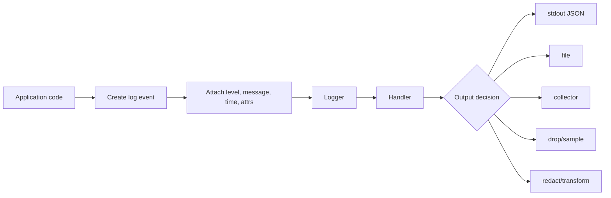
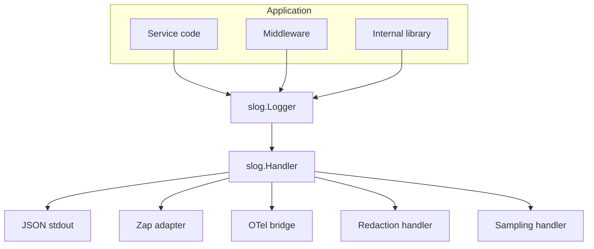
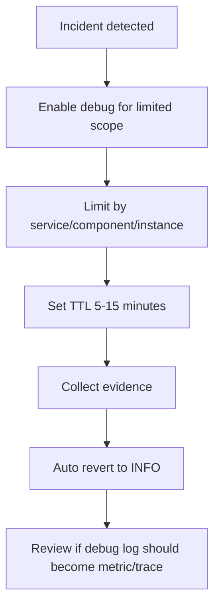
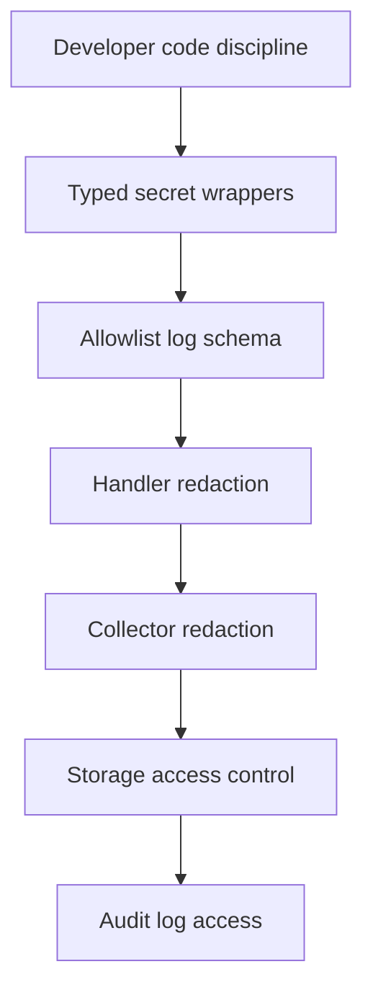
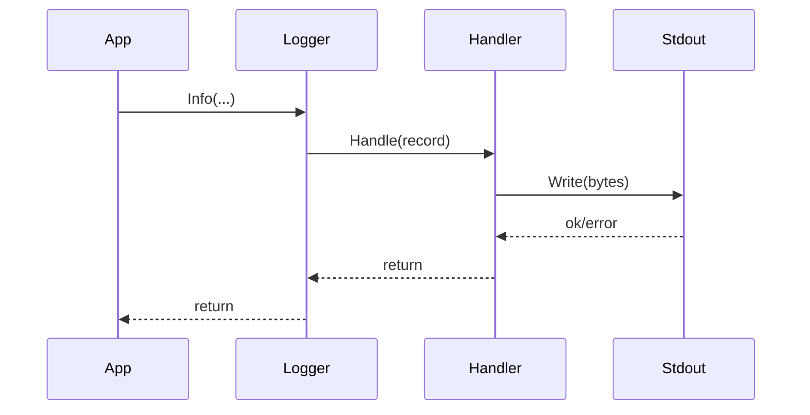
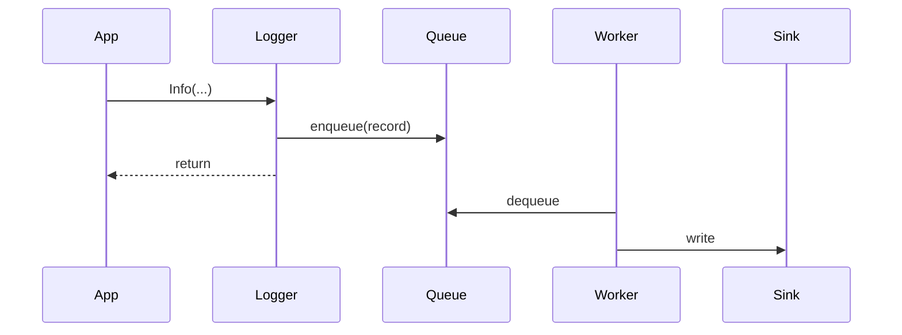
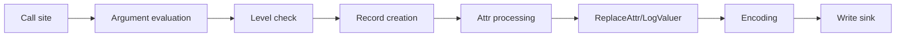
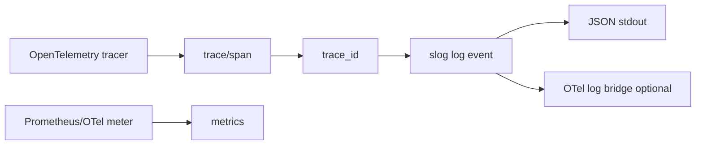

# learn-go-logging-observability-profiling-troubleshooting-part-002.md

# Part 002 — `log/slog` Deep Dive

> Seri: `learn-go-logging-observability-profiling-troubleshooting`  
> Bagian: `002 / 032`  
> Topik: Standard-library structured logging in Go  
> Target pembaca: Java software engineer yang ingin berpikir seperti engineer production Go tingkat senior/principal  
> Fokus: `log/slog` sebagai kontrak logging, bukan sekadar API pemanggilan log

---

## 0. Posisi Part Ini dalam Seri

Pada Part 001 kita sudah membangun filosofi bahwa log production bukan `println`, melainkan **event evidence**. Bagian ini turun satu layer: bagaimana event evidence itu direpresentasikan menggunakan package standar Go, yaitu `log/slog`.

`log/slog` penting karena sejak Go 1.21 Go akhirnya punya structured logging package resmi di standard library. Artinya, walaupun di sistem nyata kita masih mungkin memakai zap, zerolog, logrus, apex/log, atau adapter vendor tertentu, `slog` menjadi **common mental model** dan **common API vocabulary** untuk logging Go modern.

Bagian ini tidak bertujuan membuat Anda hafal semua method. Tujuannya adalah membuat Anda memahami:

1. Apa abstraction boundary di balik `slog`.
2. Bagaimana log record dibentuk.
3. Bagaimana handler menentukan format, filtering, routing, redaction, sampling, dan performance behavior.
4. Bagaimana memakai `slog` tanpa merusak observability contract.
5. Bagaimana mendesain custom handler yang aman untuk production.
6. Kapan `slog` cukup, kapan perlu backend/logger lain.

---

## 1. Mental Model Utama: `slog` Memisahkan “Event Creation” dari “Event Handling”

Di banyak codebase, logging dianggap seperti ini:

```go
log.Println("user created", userID)
```

Mental model ini terlalu dangkal. Dalam structured logging, yang terjadi sebenarnya:



`Logger` adalah façade yang dipakai application code. `Handler` adalah backend decision layer yang menentukan apa yang dilakukan terhadap record.

Dalam terminologi `slog`:

| Konsep | Peran |
|---|---|
| `Logger` | API yang dipakai caller untuk membuat log event |
| `Record` | Representasi satu event log |
| `Attr` | Key-value field terstruktur |
| `Value` | Representasi value yang typed |
| `Handler` | Komponen yang menerima record dan memutuskan enable/format/output |
| `HandlerOptions` | Konfigurasi behavior handler built-in |
| `Level` | Severity numerik |
| `LevelVar` | Level dinamis yang bisa diubah runtime |
| `TextHandler` | Handler built-in untuk output teks key=value |
| `JSONHandler` | Handler built-in untuk output JSON |

Package resmi mendeskripsikan `slog` sebagai structured logging: setiap log record berisi message, severity level, dan attribute key-value. Ini berbeda dari log string biasa yang memaksa downstream parser menebak struktur dari teks.

---

## 2. Mengapa `slog` Ada: Masalah yang Diselesaikan

Sebelum `slog`, ecosystem Go punya banyak logger populer:

- `log` standard library: sederhana, tetapi tidak structured secara native.
- zap: sangat cepat, structured, populer.
- zerolog: zero allocation style, JSON-first.
- logrus: populer lama, tetapi relatif lebih berat.
- hclog, apex/log, kit/log, dan lainnya.

Masalahnya bukan hanya pilihan library. Masalah besarnya adalah **fragmentasi kontrak logging**.

Dalam organisasi besar, fragmentasi ini menimbulkan masalah:

1. Setiap service punya field naming berbeda.
2. Setiap library punya cara berbeda untuk context fields.
3. Wrapping logger antar package menjadi sulit.
4. Instrumentation internal tidak punya target API standar.
5. Migration antar backend mahal.
6. Library internal sulit memilih logger tanpa memaksa dependency.

`slog` tidak otomatis membuat semua log bagus. Tetapi `slog` memberi standar abstraction:



Dengan kata lain: `slog` adalah boundary antara **application logging intent** dan **logging backend policy**.

---

## 3. Basic API, tapi dengan Production Meaning

Contoh paling sederhana:

```go
package main

import (
    "log/slog"
)

func main() {
    slog.Info("application started", "port", 8080, "env", "dev")
}
```

Secara surface, ini terlihat sederhana. Tetapi secara production, log ini punya beberapa komponen penting:

| Komponen | Nilai |
|---|---|
| Level | `INFO` |
| Message | `application started` |
| Attr `port` | `8080` |
| Attr `env` | `dev` |
| Time | Diisi handler |
| Source | Opsional, jika enabled |

Dalam logging production, message bukan tempat utama untuk data. Message adalah **event name/description**, sedangkan data masuk ke attributes.

Buruk:

```go
slog.Info("application started on port 8080 in dev")
```

Lebih baik:

```go
slog.Info("application started", "port", 8080, "env", "dev")
```

Mengapa?

Karena query downstream menjadi mungkin:

```text
message = "application started" AND port = 8080 AND env = "dev"
```

Bukan regex rapuh terhadap string.

---

## 4. `Logger`: Bukan Sekadar Object, tetapi Context Carrier

`Logger` adalah objek yang membawa handler dan pre-attached attributes.

```go
logger := slog.Default()
logger.Info("request received", "method", "GET", "path", "/users")
```

Logger dapat diberi attribute tetap dengan `With`:

```go
serviceLogger := logger.With(
    "service", "billing-api",
    "env", "prod",
    "version", "2026.06.23-1",
)

serviceLogger.Info("application started")
```

Output conceptually:

```json
{
  "time": "2026-06-23T10:00:00Z",
  "level": "INFO",
  "msg": "application started",
  "service": "billing-api",
  "env": "prod",
  "version": "2026.06.23-1"
}
```

### 4.1 Logger sebagai Carrier untuk Stable Context

Attribute yang cocok ditempel ke logger:

| Scope | Contoh field |
|---|---|
| Process/service | `service`, `env`, `version`, `region`, `instance_id` |
| Component | `component`, `module`, `subsystem` |
| Request | `request_id`, `trace_id`, `span_id`, `tenant_id` |
| Job | `job_name`, `run_id`, `attempt` |
| Worker | `worker_name`, `partition`, `consumer_group` |

Prinsipnya:

> Field yang berlaku untuk banyak event dalam scope yang sama sebaiknya dipasang sekali pada logger turunan, bukan diulang manual di setiap log call.

---

## 5. `With`: Scope, Inheritance, dan Kesalahan Umum

Contoh request logger:

```go
func handleRequest(logger *slog.Logger, requestID string, userID string) {
    requestLogger := logger.With(
        "request_id", requestID,
        "user_id", userID,
    )

    requestLogger.Info("request accepted")
    requestLogger.Info("loading user profile")
    requestLogger.Info("request completed")
}
```

Ini menghasilkan tiga log dengan context yang sama.

### 5.1 Kapan `With` Tepat?

Gunakan `With` ketika:

1. Attribute akan dipakai lebih dari sekali.
2. Attribute adalah context scope.
3. Attribute membentuk causal chain.
4. Anda ingin mengurangi risiko lupa menambahkan field penting.

Contoh baik:

```go
orderLogger := logger.With(
    "order_id", orderID,
    "customer_id", customerID,
)

orderLogger.Info("order validation started")
orderLogger.Info("order payment authorized")
orderLogger.Info("order committed")
```

### 5.2 Kapan `With` Tidak Tepat?

Jangan membuat logger baru untuk field yang hanya berlaku pada satu event.

Kurang tepat:

```go
logger.With("duration_ms", duration.Milliseconds()).Info("request completed")
```

Lebih tepat:

```go
logger.Info("request completed", "duration_ms", duration.Milliseconds())
```

Karena `duration_ms` adalah property event `request completed`, bukan scope.

---

## 6. `WithGroup`: Namespace untuk Field

`WithGroup` membuat attribute dikelompokkan di bawah namespace tertentu.

```go
logger := slog.Default().WithGroup("http")
logger.Info("request completed", "method", "GET", "status", 200)
```

Output JSON conceptually:

```json
{
  "time": "2026-06-23T10:00:00Z",
  "level": "INFO",
  "msg": "request completed",
  "http": {
    "method": "GET",
    "status": 200
  }
}
```

### 6.1 Kapan Group Berguna?

Group berguna untuk menghindari collision dan membuat domain field lebih jelas.

Contoh:

```go
logger.Info(
    "dependency call completed",
    slog.Group("http",
        "method", "POST",
        "url", "https://payment.internal/charge",
        "status", 200,
    ),
    slog.Group("retry",
        "attempt", 2,
        "max", 3,
    ),
)
```

Output conceptually:

```json
{
  "msg": "dependency call completed",
  "http": {
    "method": "POST",
    "url": "https://payment.internal/charge",
    "status": 200
  },
  "retry": {
    "attempt": 2,
    "max": 3
  }
}
```

### 6.2 Trade-off Grouping

Grouping punya trade-off:

| Keuntungan | Risiko |
|---|---|
| Menghindari collision | Query syntax downstream bisa lebih rumit |
| Membuat schema rapi | Beberapa log backend flatten nested object |
| Cocok untuk complex event | Terlalu banyak nesting mengganggu operator |

Prinsip praktis:

> Gunakan group untuk data kompleks yang memang domain-nya berbeda. Jangan group semua field hanya agar terlihat rapi.

---

## 7. `Attr` dan `Value`: Typed Structured Fields

`slog` mendukung attribute typed.

```go
slog.String("service", "billing-api")
slog.Int("status", 200)
slog.Bool("cache_hit", true)
slog.Duration("elapsed", 120*time.Millisecond)
slog.Time("deadline", deadline)
slog.Any("error", err)
```

Ada dua gaya umum:

### 7.1 Alternating Key-Value Style

```go
logger.Info("request completed", "status", 200, "duration_ms", 42)
```

Kelebihan:

- Ringkas.
- Mudah dibaca.
- Cocok untuk sebagian besar call site.

Kekurangan:

- Runtime bisa mendeteksi key tidak string, tetapi bug tetap lebih mudah terjadi.
- Type value implicit.
- Lebih rawan jumlah argumen ganjil.

### 7.2 Explicit Attr Style

```go
logger.Info(
    "request completed",
    slog.Int("status", 200),
    slog.Duration("duration", 42*time.Millisecond),
)
```

Kelebihan:

- Type lebih eksplisit.
- Lebih aman untuk field penting.
- Cocok untuk helper function dan library.

Kekurangan:

- Lebih verbose.

Rekomendasi production:

| Konteks | Style |
|---|---|
| Log sederhana di service code | key-value boleh |
| Field penting/standar | explicit `slog.Attr` lebih baik |
| Helper observability internal | explicit `slog.Attr` |
| Custom handler/test | explicit `slog.Attr` |

---

## 8. Message: Event Name, Bukan Tempat Data

Message harus stabil. Jangan masukkan ID, jumlah, status, atau error detail yang berubah-ubah ke message.

Buruk:

```go
logger.Info("user 123 created order 456 with status paid")
```

Baik:

```go
logger.Info(
    "order created",
    "user_id", "123",
    "order_id", "456",
    "status", "paid",
)
```

### 8.1 Message Stability Rule

Message sebaiknya:

1. Menggambarkan event.
2. Stabil antar kejadian.
3. Bisa dipakai sebagai query dimension.
4. Tidak memuat data high-cardinality.
5. Tidak memuat PII.
6. Tidak terlalu generic.

Terlalu generic:

```go
logger.Info("success")
logger.Error("failed", "err", err)
```

Lebih baik:

```go
logger.Info("order payment authorized")
logger.Error("order payment authorization failed", "err", err)
```

Namun jangan terlalu spesifik dengan data runtime:

```go
logger.Info("order payment authorized for order 456") // buruk
```

---

## 9. Levels: Numerik, Policy, dan Dynamic Filtering

`slog` level adalah severity numerik. Level built-in utama:

| Level | Nilai umum | Makna |
|---|---:|---|
| `DEBUG` | `-4` | Detail diagnosis, tidak normal untuk volume production tinggi |
| `INFO` | `0` | Event normal yang berguna secara operasional |
| `WARN` | `4` | Kondisi abnormal tetapi request/sistem masih bisa lanjut |
| `ERROR` | `8` | Operasi gagal atau invariant penting rusak |

### 9.1 Level sebagai Operational Contract

Level bukan preferensi developer. Level adalah kontrak ke operator.

| Pertanyaan | Implikasi level |
|---|---|
| Apakah operator harus bereaksi? | mungkin `WARN` atau `ERROR` |
| Apakah ini normal lifecycle? | `INFO` |
| Apakah hanya berguna saat debugging? | `DEBUG` |
| Apakah ini request failure? | sering `ERROR`, tapi tergantung domain |
| Apakah ini client validation error normal? | sering bukan `ERROR` |

Contoh:

```go
logger.Warn("dependency retry scheduled",
    "dependency", "payment-api",
    "attempt", 2,
    "max_attempts", 3,
    "err", err,
)
```

Ini `WARN` karena abnormal, tetapi sistem masih mencoba recover.

```go
logger.Error("dependency call failed",
    "dependency", "payment-api",
    "attempts", 3,
    "err", err,
)
```

Ini `ERROR` karena operasi akhirnya gagal.

---

## 10. `LevelVar`: Runtime Log Level Control

`LevelVar` memungkinkan level minimum diubah saat runtime.

```go
var level slog.LevelVar

func newLogger() *slog.Logger {
    level.Set(slog.LevelInfo)

    handler := slog.NewJSONHandler(os.Stdout, &slog.HandlerOptions{
        Level: &level,
    })

    return slog.New(handler)
}

func enableDebug() {
    level.Set(slog.LevelDebug)
}
```

### 10.1 Mengapa Ini Penting?

Dalam incident, Anda kadang perlu meningkatkan detail log tanpa restart atau redeploy.

Namun dynamic debug logging bisa berbahaya:

1. Bisa membuat volume log melonjak.
2. Bisa menaikkan latency.
3. Bisa membocorkan data jika debug field tidak direview.
4. Bisa membuat collector/storage kewalahan.

### 10.2 Pattern Aman Dynamic Level



Dalam implementasi internal, jangan hanya menyediakan endpoint `POST /debug/log-level?level=debug` tanpa kontrol. Minimal butuh:

- authz admin,
- audit log,
- TTL,
- scope,
- rate limit,
- visibility di incident note.

---

## 11. `Handler`: Core Abstraction yang Sering Diremehkan

`Handler` adalah interface yang menerima record.

Secara konsep, handler melakukan tiga tugas:

1. Menentukan apakah record enabled.
2. Memproses context/static attributes.
3. Menulis/meroute record.

Handler punya method utama:

```go
type Handler interface {
    Enabled(context.Context, Level) bool
    Handle(context.Context, Record) error
    WithAttrs(attrs []Attr) Handler
    WithGroup(name string) Handler
}
```

### 11.1 `Enabled`: Filtering Sebelum Work Mahal

`Enabled` dipakai untuk memutuskan apakah log pada level tertentu perlu dibuat/diproses.

Ini penting karena log field bisa mahal:

```go
logger.Debug("payload decoded", "payload", expensiveSerialize(payload))
```

Masalah: `expensiveSerialize(payload)` tetap dieksekusi sebelum logger tahu debug disabled.

Pattern lebih aman:

```go
if logger.Enabled(ctx, slog.LevelDebug) {
    logger.DebugContext(ctx, "payload decoded", "payload", expensiveSerialize(payload))
}
```

Prinsip:

> Level filtering tidak otomatis menghindari biaya membuat argument yang sudah dievaluasi oleh Go sebelum function call.

Ini mirip Java logging lama:

```java
log.debug("payload {}", expensiveSerialize(payload));
```

Kalau framework tidak lazy, biaya tetap terjadi. Di Go, karena argument dievaluasi eagerly, Anda harus eksplisit untuk work mahal.

---

## 12. Built-in Handlers: Text vs JSON

### 12.1 TextHandler

```go
handler := slog.NewTextHandler(os.Stdout, &slog.HandlerOptions{
    Level: slog.LevelInfo,
})
logger := slog.New(handler)
```

Output contoh:

```text
time=2026-06-23T10:00:00.000Z level=INFO msg="request completed" method=GET status=200
```

Cocok untuk:

- local development,
- CLI tools,
- human scanning,
- simple environment.

Kurang ideal untuk:

- log ingestion pipeline yang mengharapkan JSON,
- nested fields,
- high-volume distributed services.

### 12.2 JSONHandler

```go
handler := slog.NewJSONHandler(os.Stdout, &slog.HandlerOptions{
    Level: slog.LevelInfo,
})
logger := slog.New(handler)
```

Output contoh:

```json
{"time":"2026-06-23T10:00:00Z","level":"INFO","msg":"request completed","method":"GET","status":200}
```

Cocok untuk:

- Kubernetes stdout collection,
- CloudWatch Logs,
- Loki,
- Elasticsearch/OpenSearch,
- Datadog/Splunk/New Relic,
- structured parsing.

Production default yang biasanya lebih aman: **JSON ke stdout**.

---

## 13. HandlerOptions: Level, Source, ReplaceAttr

```go
handler := slog.NewJSONHandler(os.Stdout, &slog.HandlerOptions{
    Level:     slog.LevelInfo,
    AddSource: true,
    ReplaceAttr: func(groups []string, a slog.Attr) slog.Attr {
        return a
    },
})
```

### 13.1 `Level`

`Level` menentukan minimum level.

```go
slog.NewJSONHandler(os.Stdout, &slog.HandlerOptions{
    Level: slog.LevelWarn,
})
```

Hanya `WARN` dan `ERROR` yang keluar.

Dengan `LevelVar`:

```go
var level slog.LevelVar
level.Set(slog.LevelInfo)

handler := slog.NewJSONHandler(os.Stdout, &slog.HandlerOptions{
    Level: &level,
})
```

### 13.2 `AddSource`

`AddSource` menambahkan source file/line.

Contoh output:

```json
{
  "time":"2026-06-23T10:00:00Z",
  "level":"ERROR",
  "source":{"function":"main.handle","file":"/app/handler.go","line":42},
  "msg":"request failed"
}
```

Trade-off:

| Benefit | Cost/Risk |
|---|---|
| Membantu debugging | Overhead tambahan |
| Berguna untuk error/panic | Bisa terlalu verbose |
| Membantu migration codebase | Source path bisa leak struktur repo |

Rekomendasi:

- Aktifkan di development/test.
- Di production, pertimbangkan aktif untuk `WARN+` saja via custom handler, atau aktif jika cost dan exposure diterima.
- Jangan bergantung pada source line sebagai primary observability; event name dan fields harus tetap cukup.

### 13.3 `ReplaceAttr`

`ReplaceAttr` adalah hook transformasi attribute.

Use case:

1. Rename default fields.
2. Redact sensitive fields.
3. Normalize level.
4. Format time.
5. Drop field tertentu.
6. Flatten/reshape fields untuk backend tertentu.

Contoh rename `msg` menjadi `message`:

```go
handler := slog.NewJSONHandler(os.Stdout, &slog.HandlerOptions{
    ReplaceAttr: func(groups []string, a slog.Attr) slog.Attr {
        if len(groups) == 0 && a.Key == slog.MessageKey {
            a.Key = "message"
        }
        return a
    },
})
```

Contoh redaction sederhana:

```go
func redactAttr(groups []string, a slog.Attr) slog.Attr {
    switch a.Key {
    case "password", "token", "authorization", "secret", "api_key":
        return slog.String(a.Key, "[REDACTED]")
    default:
        return a
    }
}
```

Namun redaction berdasarkan nama key saja tidak cukup untuk sistem besar. Lebih baik kombinasikan:

- allowlist field,
- type wrapper untuk secret,
- domain-specific redactor,
- tests yang memastikan secret tidak bocor.

---

## 14. Context-aware Logging: `InfoContext`, `ErrorContext`, dan Causality

`slog` menyediakan method context-aware:

```go
logger.InfoContext(ctx, "request completed", "status", 200)
logger.ErrorContext(ctx, "request failed", "err", err)
```

`context.Context` tidak otomatis membuat `slog` mengambil value seperti request ID. Built-in handler juga tidak otomatis membaca context. Context baru berguna jika handler/custom wrapper Anda memakainya.

### 14.1 Salah Kaprah Umum

Banyak developer mengira ini otomatis:

```go
ctx = context.WithValue(ctx, "request_id", "abc")
logger.InfoContext(ctx, "hello") // otomatis ada request_id? Tidak.
```

Tidak ada `request_id` otomatis kecuali handler/wrapper Anda mengambilnya.

### 14.2 Pattern Context Enrichment

Ada dua pendekatan umum.

#### Pendekatan A: Request Logger Diturunkan dengan `With`

```go
func middleware(next http.Handler, base *slog.Logger) http.Handler {
    return http.HandlerFunc(func(w http.ResponseWriter, r *http.Request) {
        requestID := getOrCreateRequestID(r)
        logger := base.With("request_id", requestID)

        ctx := context.WithValue(r.Context(), loggerKey{}, logger)
        next.ServeHTTP(w, r.WithContext(ctx))
    })
}
```

Lalu handler mengambil logger dari context:

```go
func LoggerFromContext(ctx context.Context, fallback *slog.Logger) *slog.Logger {
    if l, ok := ctx.Value(loggerKey{}).(*slog.Logger); ok && l != nil {
        return l
    }
    return fallback
}
```

Kelebihan:

- Field jelas dan attached sekali.
- Tidak perlu custom handler rumit.
- Works dengan built-in JSONHandler.

Kekurangan:

- Menyimpan logger dalam context sering diperdebatkan.
- Harus disiplin tidak menyimpan dependency besar sembarangan.

#### Pendekatan B: Handler Membaca Context Values

```go
type contextHandler struct {
    next slog.Handler
}

func (h contextHandler) Enabled(ctx context.Context, level slog.Level) bool {
    return h.next.Enabled(ctx, level)
}

func (h contextHandler) Handle(ctx context.Context, r slog.Record) error {
    if requestID, ok := ctx.Value(requestIDKey{}).(string); ok && requestID != "" {
        r.AddAttrs(slog.String("request_id", requestID))
    }
    return h.next.Handle(ctx, r)
}

func (h contextHandler) WithAttrs(attrs []slog.Attr) slog.Handler {
    return contextHandler{next: h.next.WithAttrs(attrs)}
}

func (h contextHandler) WithGroup(name string) slog.Handler {
    return contextHandler{next: h.next.WithGroup(name)}
}
```

Kelebihan:

- Application code cukup memanggil `InfoContext`.
- Context propagation lebih otomatis.

Kekurangan:

- Handler punya hidden coupling ke context keys.
- Bisa ada overhead.
- Debugging field origin lebih sulit.

### 14.3 Rekomendasi Praktis

Untuk service internal production:

1. Pakai request-scoped logger untuk field penting seperti `request_id`, `trace_id`, `tenant_id`.
2. Pakai `InfoContext/ErrorContext` agar handler masa depan bisa memakai context.
3. Jangan menaruh banyak value arbitrer di context.
4. Buat package internal kecil untuk context keys dan logger extraction.

---

## 15. Error Logging dengan `slog`

`slog` tidak punya special `Error` type field otomatis selain convention.

Umum:

```go
logger.Error("dependency call failed", "err", err)
```

Atau eksplisit:

```go
logger.Error("dependency call failed", slog.Any("err", err))
```

### 15.1 Nama Field Error

Pilih satu nama standar. Biasanya:

```text
err
```

atau:

```text
error
```

Keduanya bisa. Yang buruk adalah campur:

```text
err
error
exception
cause
reason
failure
```

Dalam Java, banyak logger otomatis punya exception stack sebagai argumen terakhir. Di Go, error adalah value. Kalau ingin stack, Anda harus punya error type/wrapper yang menyimpan stack atau menambahkan stack saat panic/recovery.

### 15.2 Jangan Log Error di Semua Layer

Buruk:

```go
func repositoryGetUser(...) error {
    if err != nil {
        logger.Error("query failed", "err", err)
        return err
    }
}

func serviceGetUser(...) error {
    if err != nil {
        logger.Error("get user failed", "err", err)
        return err
    }
}

func handler(...) {
    if err != nil {
        logger.Error("request failed", "err", err)
    }
}
```

Ini menghasilkan tiga error log untuk satu failure.

Lebih baik:

- Lower layer menambah context ke error.
- Boundary layer log sekali dengan context lengkap.

```go
func repositoryGetUser(...) error {
    if err != nil {
        return fmt.Errorf("query user by id: %w", err)
    }
    return nil
}

func serviceGetUser(...) error {
    if err != nil {
        return fmt.Errorf("get user profile: %w", err)
    }
    return nil
}

func handler(...) {
    if err != nil {
        logger.ErrorContext(ctx, "request failed",
            "operation", "get_user_profile",
            "err", err,
        )
    }
}
```

### 15.3 Error Field Shape

Untuk error sederhana:

```go
logger.Error("request failed", "err", err)
```

Untuk error terklasifikasi:

```go
logger.Error("request failed",
    "err", err,
    "error_kind", "dependency_timeout",
    "dependency", "payment-api",
    "retryable", true,
)
```

Untuk domain error:

```go
logger.Info("request rejected",
    "reason", "validation_failed",
    "field", "email",
)
```

Validation failure normal dari client tidak harus `ERROR`. Ini penting agar error log tidak menjadi noise.

---

## 16. Custom Handler: Cara Berpikir yang Benar

Custom handler bukan hanya untuk output file. Handler adalah tempat policy.

Policy yang sering ditempatkan di handler:

1. Redaction.
2. Sampling.
3. Level remapping.
4. Attribute normalization.
5. Context enrichment.
6. Multi-sink routing.
7. Error counting side effect — harus hati-hati.
8. Formatting compatibility.

### 16.1 Minimal Wrapping Handler

```go
type wrappingHandler struct {
    next slog.Handler
}

func (h wrappingHandler) Enabled(ctx context.Context, level slog.Level) bool {
    return h.next.Enabled(ctx, level)
}

func (h wrappingHandler) Handle(ctx context.Context, r slog.Record) error {
    return h.next.Handle(ctx, r)
}

func (h wrappingHandler) WithAttrs(attrs []slog.Attr) slog.Handler {
    return wrappingHandler{next: h.next.WithAttrs(attrs)}
}

func (h wrappingHandler) WithGroup(name string) slog.Handler {
    return wrappingHandler{next: h.next.WithGroup(name)}
}
```

Dua method yang sering salah adalah `WithAttrs` dan `WithGroup`. Jika wrapper tidak meneruskan ini dengan benar, logger turunan bisa kehilangan attributes/group.

---

## 17. Redaction Handler Production-grade

Redaction tidak boleh dipikir belakangan. Di sistem production, log sering masuk ke tempat yang lebih luas aksesnya daripada database utama. Jadi log bisa menjadi jalur kebocoran data.

### 17.1 Redaction by Key

```go
type redactingHandler struct {
    next slog.Handler
}

func (h redactingHandler) Enabled(ctx context.Context, level slog.Level) bool {
    return h.next.Enabled(ctx, level)
}

func (h redactingHandler) Handle(ctx context.Context, r slog.Record) error {
    nr := slog.NewRecord(r.Time, r.Level, r.Message, r.PC)

    r.Attrs(func(a slog.Attr) bool {
        nr.AddAttrs(redact(a))
        return true
    })

    return h.next.Handle(ctx, nr)
}

func (h redactingHandler) WithAttrs(attrs []slog.Attr) slog.Handler {
    redacted := make([]slog.Attr, 0, len(attrs))
    for _, a := range attrs {
        redacted = append(redacted, redact(a))
    }
    return redactingHandler{next: h.next.WithAttrs(redacted)}
}

func (h redactingHandler) WithGroup(name string) slog.Handler {
    return redactingHandler{next: h.next.WithGroup(name)}
}

func redact(a slog.Attr) slog.Attr {
    switch strings.ToLower(a.Key) {
    case "password", "passwd", "pwd", "secret", "token", "access_token", "refresh_token", "authorization", "api_key":
        return slog.String(a.Key, "[REDACTED]")
    default:
        return a
    }
}
```

### 17.2 Keterbatasan Redaction by Key

Redaction by key gagal ketika:

1. Secret ada dalam nested struct.
2. Secret ada dalam URL query string.
3. Secret ada dalam error message.
4. Secret ada dalam raw payload string.
5. Developer memakai key baru seperti `jwt` atau `credential`.

Karena itu production-grade redaction butuh lapisan lain:



### 17.3 Typed Secret Wrapper

```go
type Secret string

func (s Secret) LogValue() slog.Value {
    return slog.StringValue("[REDACTED]")
}
```

Jika type mengimplementasikan `LogValuer`, `slog` dapat memakai representasi log-safe.

```go
logger.Info("token refreshed", "access_token", Secret(token))
```

Output:

```json
{"msg":"token refreshed","access_token":"[REDACTED]"}
```

Ini lebih kuat daripada bergantung hanya ke nama key.

---

## 18. `LogValuer`: Membuat Type Aman dan Berguna untuk Logging

`LogValuer` memungkinkan sebuah type menentukan representasi log-nya sendiri.

Contoh domain type:

```go
type User struct {
    ID       string
    Email    string
    Password string
}

func (u User) LogValue() slog.Value {
    return slog.GroupValue(
        slog.String("id", u.ID),
        slog.String("email_domain", emailDomain(u.Email)),
    )
}
```

Maka:

```go
logger.Info("user loaded", "user", user)
```

Output conceptually:

```json
{
  "msg": "user loaded",
  "user": {
    "id": "u-123",
    "email_domain": "example.com"
  }
}
```

Bukan:

```json
{
  "user": {
    "ID": "u-123",
    "Email": "alice@example.com",
    "Password": "secret"
  }
}
```

### 18.1 Kapan Implement `LogValuer`?

Gunakan untuk type yang:

1. Sering dilog.
2. Mengandung field sensitif.
3. Butuh representasi stabil.
4. Punya domain identity penting.
5. Jika `fmt.Stringer` terlalu human-oriented atau tidak aman.

---

## 19. Sampling Handler: Mengontrol Volume Tanpa Kehilangan Sinyal

Dalam incident tertentu, log bisa menjadi self-DOS. Contoh:

- dependency down,
- retry storm,
- validation spam,
- bot traffic,
- per-item batch failure.

Sampling membantu mengurangi volume.

### 19.1 Sampling Harus Berdasarkan Event Class, Bukan Random Buta

Buruk:

```text
Drop 90% semua log
```

Risiko: Anda membuang satu-satunya evidence untuk failure langka.

Lebih baik:

```text
Sample repeated identical WARN event by key: message + dependency + error_kind
Always keep ERROR for first N per window
Always keep security/audit logs
Always keep startup/shutdown logs
```

### 19.2 Conceptual Sampling Handler

```go
type samplingHandler struct {
    next slog.Handler
    // production implementation perlu concurrency-safe windowed counter
}
```

Sampling handler production harus menjawab:

1. Apa key sampling?
2. Berapa window waktunya?
3. Apakah first occurrence selalu disimpan?
4. Apakah summary count ditulis?
5. Apakah error/security/audit dikecualikan?
6. Apakah sampling decision observable?

Output summary bisa seperti:

```json
{
  "msg": "log events sampled",
  "sample_key": "dependency_retry_scheduled|payment-api|timeout",
  "dropped_count": 18293,
  "window_seconds": 60
}
```

Tanpa summary, sampling bisa membuat operator salah mengira masalah kecil.

---

## 20. Async Logging: Trade-off yang Harus Dipahami

`slog` built-in handler menulis sink secara langsung. Banyak engineer bertanya: apakah perlu async logger?

Jawabannya: tergantung bottleneck dan reliability requirement.

### 20.1 Sync Logging



Kelebihan:

- Simpler.
- Event written before call returns.
- Failure semantics lebih jelas.
- Backpressure natural.

Kekurangan:

- Logging sink lambat bisa memengaruhi request latency.
- High-volume logging bisa meningkatkan contention.

### 20.2 Async Logging



Kelebihan:

- Request path lebih cepat ketika sink lambat.
- Bisa batching.
- Bisa sampling/drop policy.

Kekurangan:

- Log bisa hilang saat crash.
- Perlu flush saat shutdown.
- Queue bisa penuh.
- Butuh policy drop/block.
- Bisa menyembunyikan backpressure.
- Ordering bisa berubah.

### 20.3 Production Decision Matrix

| Kondisi | Pilihan |
|---|---|
| Normal web service ke stdout di Kubernetes | sync JSON biasanya cukup |
| Extremely high volume event logging | sampling dulu, baru async jika perlu |
| Audit/security log | hindari lossy async kecuali durable queue |
| Low-latency trading/control path | custom async/buffered dengan policy eksplisit |
| CLI/local tool | sync cukup |

Prinsip:

> Async logging bukan optimisasi gratis. Ia menukar latency dengan durability, ordering, complexity, dan failure mode baru.

---

## 21. Performance Model `slog`

Logging cost terdiri dari beberapa bagian:



Bottleneck bisa muncul di mana saja.

### 21.1 Biaya yang Sering Terlupakan

1. Membuat string besar.
2. Serialisasi object untuk field debug.
3. Error formatting mahal.
4. Source location lookup.
5. JSON encoding.
6. Lock pada writer.
7. stdout pipe backpressure.
8. Collector lambat.
9. High-cardinality indexing downstream.

### 21.2 Guard Expensive Debug Logs

```go
if logger.Enabled(ctx, slog.LevelDebug) {
    logger.DebugContext(ctx, "candidate set computed",
        "candidate_count", len(candidates),
        "candidates", summarizeCandidates(candidates),
    )
}
```

### 21.3 Jangan Benchmark Logger dengan Cara Salah

Benchmark logging harus mempertimbangkan:

1. Output sink: discard vs stdout vs file.
2. Handler type: text vs JSON.
3. Attr count.
4. Attr type.
5. `AddSource` on/off.
6. Disabled level path.
7. Enabled level path.
8. Contention concurrent goroutine.
9. Realistic message/field schema.

Benchmark `io.Discard` hanya mengukur sebagian pipeline, bukan cost production end-to-end.

---

## 22. Logger Propagation Patterns

Ada beberapa cara menyebarkan logger di aplikasi Go.

### 22.1 Global Logger

```go
slog.Info("application started")
```

Kelebihan:

- Sederhana.
- Cocok untuk kecil/CLI.

Kekurangan:

- Sulit test.
- Sulit multi-service/component config.
- Sulit request-scoped fields.
- Hidden dependency.

### 22.2 Dependency Injection

```go
type Service struct {
    logger *slog.Logger
}

func NewService(logger *slog.Logger) *Service {
    return &Service{logger: logger.With("component", "user_service")}
}
```

Kelebihan:

- Explicit.
- Testable.
- Component fields mudah.

Kekurangan:

- Boilerplate.

### 22.3 Context Logger

```go
logger := observability.LoggerFromContext(ctx)
logger.InfoContext(ctx, "operation completed")
```

Kelebihan:

- Request-scoped context mudah.
- Cocok untuk handlers/workflows.

Kekurangan:

- Bisa disalahgunakan sebagai service locator.

### 22.4 Rekomendasi Hybrid

Untuk production service:

1. Root logger dibuat di `main`.
2. Component logger di-inject ke service/repository/client.
3. Request logger dibuat di middleware dan ditempel ke context.
4. Library internal menerima `*slog.Logger` jika memang perlu logging.
5. Library reusable sebaiknya tidak memaksa global logger.

---

## 23. Designing an Internal Logging Package

Daripada setiap service menulis setup sendiri, buat package internal.

Contoh struktur:

```text
/internal/observability/logging
    logger.go
    context.go
    redaction.go
    sampling.go
    levels.go
    testing.go
```

### 23.1 Config

```go
type Config struct {
    Service     string
    Environment string
    Version     string
    Format      string // json/text
    Level       string // debug/info/warn/error
    AddSource   bool
}
```

### 23.2 Constructor

```go
func NewLogger(cfg Config, out io.Writer) (*slog.Logger, *slog.LevelVar, error) {
    var level slog.LevelVar

    parsed, err := parseLevel(cfg.Level)
    if err != nil {
        return nil, nil, err
    }
    level.Set(parsed)

    opts := &slog.HandlerOptions{
        Level:     &level,
        AddSource: cfg.AddSource,
        ReplaceAttr: func(groups []string, a slog.Attr) slog.Attr {
            return redactAttr(groups, normalizeAttr(groups, a))
        },
    }

    var handler slog.Handler
    switch cfg.Format {
    case "json":
        handler = slog.NewJSONHandler(out, opts)
    case "text":
        handler = slog.NewTextHandler(out, opts)
    default:
        return nil, nil, fmt.Errorf("unsupported log format: %s", cfg.Format)
    }

    logger := slog.New(handler).With(
        "service", cfg.Service,
        "env", cfg.Environment,
        "version", cfg.Version,
    )

    return logger, &level, nil
}
```

### 23.3 Standard Field Helpers

```go
func RequestAttrs(requestID, traceID, spanID string) []slog.Attr {
    return []slog.Attr{
        slog.String("request_id", requestID),
        slog.String("trace_id", traceID),
        slog.String("span_id", spanID),
    }
}
```

```go
func DependencyAttrs(name, operation string) []slog.Attr {
    return []slog.Attr{
        slog.String("dependency", name),
        slog.String("dependency_operation", operation),
    }
}
```

Tujuan helper bukan membuat logging “magical”, melainkan menjaga schema tetap konsisten.

---

## 24. Testing Logs

Log testing sering disepelekan. Padahal untuk observability contract, log bisa menjadi bagian dari behavior penting.

### 24.1 Kapan Log Perlu Ditest?

Tidak semua log perlu dites. Test log ketika:

1. Field wajib harus ada.
2. Redaction harus terbukti.
3. Error classification harus benar.
4. Audit/security event harus keluar.
5. Sampling/drop policy harus benar.
6. Middleware harus attach request ID/trace ID.

### 24.2 Test dengan Buffer

```go
func TestLoggerRedactsToken(t *testing.T) {
    var buf bytes.Buffer

    handler := slog.NewJSONHandler(&buf, &slog.HandlerOptions{
        ReplaceAttr: redactAttr,
    })
    logger := slog.New(handler)

    logger.Info("token refreshed", "access_token", "secret-token")

    got := buf.String()
    if strings.Contains(got, "secret-token") {
        t.Fatalf("log leaked token: %s", got)
    }
    if !strings.Contains(got, "[REDACTED]") {
        t.Fatalf("log did not contain redaction marker: %s", got)
    }
}
```

### 24.3 Test JSON Shape

```go
func TestRequestLogContainsCorrelationFields(t *testing.T) {
    var buf bytes.Buffer
    logger := slog.New(slog.NewJSONHandler(&buf, nil))

    logger.Info("request completed",
        "request_id", "req-123",
        "trace_id", "trace-456",
        "status", 200,
    )

    var event map[string]any
    if err := json.Unmarshal(buf.Bytes(), &event); err != nil {
        t.Fatal(err)
    }

    if event["request_id"] != "req-123" {
        t.Fatalf("missing request_id: %#v", event)
    }
    if event["trace_id"] != "trace-456" {
        t.Fatalf("missing trace_id: %#v", event)
    }
}
```

---

## 25. Logging and OpenTelemetry: Jangan Campur Aduk Signal

`slog` adalah logging API. OpenTelemetry membawa konsep traces, metrics, logs, context propagation, resource attributes, exporters, dan collector.

Hubungan yang sehat:



Logging harus dikorelasikan dengan trace, bukan menggantikan trace.

Contoh field correlation:

```go
logger.InfoContext(ctx, "dependency call completed",
    "trace_id", traceID,
    "span_id", spanID,
    "dependency", "payment-api",
    "duration_ms", duration.Milliseconds(),
)
```

Namun jangan membuat log untuk setiap span event secara membabi buta. Trace sudah punya span/event model sendiri. Jika semua span juga jadi log, volume bisa meledak.

---

## 26. `slog` vs zap vs zerolog

`slog` adalah standard API. zap/zerolog sering dipilih untuk performance/backend-specific behavior.

| Aspek | `slog` | zap | zerolog |
|---|---|---|---|
| Standard library | Ya | Tidak | Tidak |
| Structured logging | Ya | Ya | Ya |
| API umum ecosystem | Semakin kuat | Library-specific | Library-specific |
| Performance ekstrem | Baik, tapi bukan selalu tercepat | Sangat kuat | Sangat kuat |
| Handler abstraction | Ya | Core abstraction sendiri | Event builder style |
| Migration friendliness | Tinggi | Sedang | Sedang |
| Local simplicity | Tinggi | Sedang | Sedang |

Rekomendasi:

1. Untuk service baru: mulai dari `slog` kecuali ada kebutuhan performance/compatibility khusus.
2. Untuk organisasi besar: expose `slog.Logger`/`slog.Handler` di boundary internal agar backend bisa diganti.
3. Untuk hot path high-volume: benchmark dengan realistic workload sebelum mengganti logger.
4. Untuk existing zap/zerolog estate: pertimbangkan adapter handler, bukan rewrite total.

---

## 27. Production Log Schema dengan `slog`

Schema minimum untuk service:

```json
{
  "time": "2026-06-23T10:00:00Z",
  "level": "INFO",
  "msg": "request completed",
  "service": "billing-api",
  "env": "prod",
  "version": "2026.06.23-1",
  "request_id": "req-123",
  "trace_id": "trace-456",
  "span_id": "span-789",
  "component": "http_server",
  "operation": "POST /payments",
  "status": 200,
  "duration_ms": 42
}
```

### 27.1 Field yang Sebaiknya Distandardisasi

| Field | Makna |
|---|---|
| `service` | Nama service stabil |
| `env` | Environment |
| `version` | Build/release version |
| `instance` | Pod/host/process identity jika tersedia |
| `component` | Komponen internal |
| `operation` | Operasi logis |
| `request_id` | ID request lokal/cross-service jika ada |
| `trace_id` | Distributed trace ID |
| `span_id` | Current span ID |
| `tenant_id` | Jika multi-tenant dan aman |
| `user_id` | Hati-hati cardinality/privacy |
| `duration_ms` | Durasi event boundary |
| `error_kind` | Klasifikasi error |
| `err` | Error string |

### 27.2 Field yang Berbahaya

| Field | Risiko |
|---|---|
| raw request body | PII/secrets/volume |
| raw response body | PII/secrets/volume |
| authorization header | credential leak |
| access token | credential leak |
| email | PII, cardinality |
| full URL dengan query | token/PII leak |
| stack trace setiap error | volume/noise |
| user input mentah | injection/noise/privacy |

---

## 28. Anti-pattern `slog` yang Harus Dihindari

### 28.1 Treating `slog` as `fmt.Printf`

```go
logger.Info(fmt.Sprintf("user %s created order %s", userID, orderID))
```

Perbaikan:

```go
logger.Info("order created", "user_id", userID, "order_id", orderID)
```

### 28.2 Logging Whole Struct with `Any` Tanpa Review

```go
logger.Info("user loaded", "user", user)
```

Risiko: field sensitif ikut keluar.

Perbaikan:

```go
logger.Info("user loaded", "user_id", user.ID, "email_domain", emailDomain(user.Email))
```

Atau implement `LogValuer`.

### 28.3 Dynamic Message

```go
logger.Info("payment for " + paymentID + " completed")
```

Perbaikan:

```go
logger.Info("payment completed", "payment_id", paymentID)
```

### 28.4 Duplicate Error Logging

Sudah dibahas: log error sekali di boundary yang punya context cukup.

### 28.5 Debug Log Mahal Tanpa Guard

```go
logger.Debug("state", "snapshot", buildHugeSnapshot())
```

Perbaikan:

```go
if logger.Enabled(ctx, slog.LevelDebug) {
    logger.DebugContext(ctx, "state snapshot", "snapshot", buildHugeSnapshot())
}
```

### 28.6 Secrets in Error Message

```go
return fmt.Errorf("auth failed with token %s: %w", token, err)
```

Nanti saat `err` dilog, token bocor.

Perbaikan:

```go
return fmt.Errorf("auth failed: %w", err)
```

Tambahkan metadata aman secara terpisah:

```go
logger.Warn("auth failed", "token_present", token != "", "err", err)
```

### 28.7 Overusing `AddSource`

Source line bisa berguna, tetapi jika semua log mengandalkan source line, event schema sering malas dirancang. Source line juga berubah saat refactor, sementara event name harus stabil.

### 28.8 Context Value Chaos

Jika semua package menaruh arbitrary key ke context dan handler mengambil semuanya, log schema akan liar. Gunakan context key terbatas dan typed.

---

## 29. End-to-End Example: Production Logger Setup

```go
package observability

import (
    "fmt"
    "io"
    "log/slog"
    "strings"
)

type LogConfig struct {
    Service     string
    Environment string
    Version     string
    Format      string
    Level       string
    AddSource   bool
}

func NewLogger(cfg LogConfig, out io.Writer) (*slog.Logger, *slog.LevelVar, error) {
    if cfg.Service == "" {
        return nil, nil, fmt.Errorf("service is required")
    }
    if cfg.Environment == "" {
        return nil, nil, fmt.Errorf("environment is required")
    }
    if cfg.Version == "" {
        cfg.Version = "unknown"
    }

    var level slog.LevelVar
    parsedLevel, err := parseLevel(cfg.Level)
    if err != nil {
        return nil, nil, err
    }
    level.Set(parsedLevel)

    opts := &slog.HandlerOptions{
        Level:     &level,
        AddSource: cfg.AddSource,
        ReplaceAttr: func(groups []string, a slog.Attr) slog.Attr {
            return redactAttr(groups, normalizeAttr(groups, a))
        },
    }

    var handler slog.Handler
    switch strings.ToLower(cfg.Format) {
    case "", "json":
        handler = slog.NewJSONHandler(out, opts)
    case "text":
        handler = slog.NewTextHandler(out, opts)
    default:
        return nil, nil, fmt.Errorf("unsupported log format: %q", cfg.Format)
    }

    logger := slog.New(handler).With(
        slog.String("service", cfg.Service),
        slog.String("env", cfg.Environment),
        slog.String("version", cfg.Version),
    )

    return logger, &level, nil
}

func parseLevel(s string) (slog.Level, error) {
    switch strings.ToLower(strings.TrimSpace(s)) {
    case "", "info":
        return slog.LevelInfo, nil
    case "debug":
        return slog.LevelDebug, nil
    case "warn", "warning":
        return slog.LevelWarn, nil
    case "error":
        return slog.LevelError, nil
    default:
        return slog.LevelInfo, fmt.Errorf("unsupported log level: %q", s)
    }
}

func normalizeAttr(groups []string, a slog.Attr) slog.Attr {
    if len(groups) == 0 {
        switch a.Key {
        case slog.MessageKey:
            a.Key = "message"
        case slog.LevelKey:
            a.Key = "severity"
        }
    }
    return a
}

func redactAttr(groups []string, a slog.Attr) slog.Attr {
    key := strings.ToLower(a.Key)
    switch key {
    case "password", "passwd", "pwd", "secret", "token", "access_token", "refresh_token", "authorization", "api_key":
        return slog.String(a.Key, "[REDACTED]")
    default:
        return a
    }
}
```

Pemakaian:

```go
logger, level, err := observability.NewLogger(observability.LogConfig{
    Service:     "billing-api",
    Environment: "prod",
    Version:     "2026.06.23-1",
    Format:      "json",
    Level:       "info",
    AddSource:   false,
}, os.Stdout)
if err != nil {
    panic(err)
}

logger.Info("application started")
level.Set(slog.LevelDebug) // contoh dynamic change; production perlu guard/TTL/audit
```

---

## 30. End-to-End Example: HTTP Middleware dengan Request Logger

```go
package observability

import (
    "context"
    "log/slog"
    "net/http"
    "time"
)

type loggerKey struct{}

func ContextWithLogger(ctx context.Context, logger *slog.Logger) context.Context {
    return context.WithValue(ctx, loggerKey{}, logger)
}

func LoggerFromContext(ctx context.Context, fallback *slog.Logger) *slog.Logger {
    if logger, ok := ctx.Value(loggerKey{}).(*slog.Logger); ok && logger != nil {
        return logger
    }
    return fallback
}

func LoggingMiddleware(base *slog.Logger, next http.Handler) http.Handler {
    return http.HandlerFunc(func(w http.ResponseWriter, r *http.Request) {
        start := time.Now()
        requestID := requestIDFromHeaderOrNew(r)

        rw := &statusRecorder{ResponseWriter: w, status: http.StatusOK}

        requestLogger := base.With(
            slog.String("request_id", requestID),
            slog.String("component", "http_server"),
            slog.String("http_method", r.Method),
            slog.String("http_route", routePattern(r)),
        )

        ctx := ContextWithLogger(r.Context(), requestLogger)

        requestLogger.InfoContext(ctx, "request started")

        defer func() {
            duration := time.Since(start)
            requestLogger.InfoContext(ctx, "request completed",
                slog.Int("http_status", rw.status),
                slog.Duration("duration", duration),
                slog.Int64("duration_ms", duration.Milliseconds()),
            )
        }()

        next.ServeHTTP(rw, r.WithContext(ctx))
    })
}

type statusRecorder struct {
    http.ResponseWriter
    status int
}

func (r *statusRecorder) WriteHeader(code int) {
    r.status = code
    r.ResponseWriter.WriteHeader(code)
}
```

Catatan:

1. Untuk route, gunakan route pattern seperti `/users/{id}`, bukan raw path `/users/123`, agar cardinality aman.
2. Jangan log query string mentah.
3. Jangan log body mentah.
4. Tambahkan trace ID/span ID saat Part tracing sudah masuk.

---

## 31. Operational Checklist untuk `slog`

Gunakan checklist ini saat review service Go.

### 31.1 Setup

- [ ] Logger dibuat di `main` atau composition root.
- [ ] Output production default JSON ke stdout.
- [ ] Service/env/version selalu ada.
- [ ] Level configurable.
- [ ] Dynamic level jika ada punya auth, TTL, audit.
- [ ] `AddSource` diputuskan sadar cost/security-nya.

### 31.2 Schema

- [ ] Message stabil.
- [ ] Field standar konsisten.
- [ ] Error field konsisten (`err` atau `error`).
- [ ] Duration field punya unit jelas.
- [ ] Route memakai pattern, bukan raw high-cardinality path.
- [ ] Tenant/user field direview privacy/cardinality-nya.

### 31.3 Security

- [ ] Secret redaction ada.
- [ ] Typed secret wrapper tersedia.
- [ ] No raw auth header.
- [ ] No raw token.
- [ ] No raw request/response body by default.
- [ ] Redaction tests ada.

### 31.4 Performance

- [ ] Expensive debug logs diguard dengan `Enabled`.
- [ ] Hot path log volume direview.
- [ ] Sampling policy ada untuk repeated noisy event.
- [ ] Logging tidak menyebabkan retry storm/noise storm.
- [ ] Sink/backpressure dipahami.

### 31.5 Causality

- [ ] Request ID ada di inbound boundary.
- [ ] Trace ID/span ID akan dikorelasikan saat tracing aktif.
- [ ] Error dilog di boundary yang tepat.
- [ ] Retry attempt/max attempt dilog.
- [ ] Dependency name/operation/status/duration dilog.

---

## 32. Exercises

### Exercise 1 — Convert Print Logs to Structured Logs

Ubah log berikut:

```go
log.Printf("payment failed for user %s order %s amount %d: %v", userID, orderID, amount, err)
```

Menjadi structured log yang production-ready.

Target jawaban:

```go
logger.ErrorContext(ctx, "payment failed",
    slog.String("user_id", userID),
    slog.String("order_id", orderID),
    slog.Int64("amount_cents", amount),
    slog.String("currency", currency),
    slog.Any("err", err),
)
```

Diskusi:

- Apakah `user_id` aman untuk log?
- Apakah `amount` perlu unit?
- Apakah error ini benar-benar `ERROR`, atau domain rejection biasa?

### Exercise 2 — Design Standard Fields

Untuk service case management regulatory, desain field standar untuk event:

```text
case escalated
```

Minimal pikirkan:

- `case_id`
- `module`
- `previous_state`
- `next_state`
- `actor_type`
- `decision_source`
- `rule_id`
- `request_id`
- `trace_id`

Pertanyaan:

1. Mana field yang high-cardinality tetapi tetap perlu?
2. Mana field yang boleh menjadi metric label?
3. Mana field yang hanya cocok di log?
4. Mana yang perlu redaction?

### Exercise 3 — Implement `LogValuer`

Buat type `Credential` yang tidak pernah menampilkan value asli saat dilog.

```go
type Credential struct {
    Kind  string
    Value string
}
```

Expected log shape:

```json
{
  "credential": {
    "kind": "api_key",
    "value": "[REDACTED]"
  }
}
```

### Exercise 4 — Guard Expensive Debug Log

Refactor:

```go
logger.Debug("computed routing table", "table", dumpRoutingTable(table))
```

Menjadi aman untuk production.

### Exercise 5 — Write a Redaction Test

Tulis test yang memastikan field berikut tidak pernah keluar mentah:

- `password`
- `authorization`
- `access_token`
- `refresh_token`
- `api_key`

---

## 33. Kesimpulan Part 002

`slog` bukan sekadar package logging baru. Ia adalah standard abstraction untuk membuat log event terstruktur di Go.

Mental model yang harus dibawa:

1. `Logger` membuat event.
2. `Record` membawa message, level, time, PC, dan attributes.
3. `Handler` adalah policy boundary.
4. `With` menempelkan scope context.
5. `WithGroup` memberi namespace.
6. `Attr`/`Value` membuat field typed.
7. `LevelVar` memungkinkan runtime level control, tetapi harus aman.
8. `ReplaceAttr`, wrapper handler, dan `LogValuer` adalah alat utama untuk normalization/redaction.
9. Context tidak otomatis memperkaya log kecuali Anda mendesain handler/wrapper-nya.
10. Performance logging harus dipikirkan dari call site sampai sink.

Jika Part 001 menjelaskan **mengapa production logging harus diperlakukan sebagai evidence**, Part 002 menjelaskan **bagaimana Go standard library merepresentasikan dan memproses evidence itu**.

Pada Part 003, kita akan naik dari API `slog` ke desain arsitektur logging service nyata: logger lifecycle, dependency injection, middleware, workers, boundary logging, schema governance, dan integrasi dengan log pipeline seperti Loki/OpenSearch/CloudWatch.

---

## 34. Referensi Utama

1. Go `log/slog` package documentation — structured logging, `Logger`, `Handler`, `Record`, `Attr`, levels, handlers.  
   https://pkg.go.dev/log/slog
2. Go Blog — Structured Logging with slog.  
   https://go.dev/blog/slog
3. Go source documentation for `log/slog`.  
   https://go.dev/src/log/slog/doc.go
4. Go 1.26 Release Notes — baseline versi seri.  
   https://go.dev/doc/go1.26

---

## Status Seri

- Part ini: `002 / 032`
- Status: **belum selesai**
- Part berikutnya: `learn-go-logging-observability-profiling-troubleshooting-part-003.md` — **Logging Architecture for Services**


<!-- NAVIGATION_FOOTER -->
<div class="page-nav">
<a href="./learn-go-logging-observability-profiling-troubleshooting-part-001.md">⬅️ Part 001 — Production Logging Philosophy in Go</a>
<a href="./index.md">📚 Kategori</a>
<a href="../../index.md">🏠 Home</a>
<a href="./learn-go-logging-observability-profiling-troubleshooting-part-003.md">Part 003 — Logging Architecture for Services ➡️</a>
</div>
