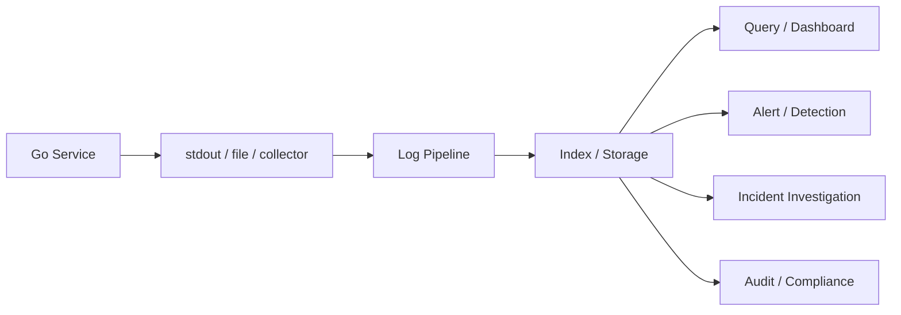
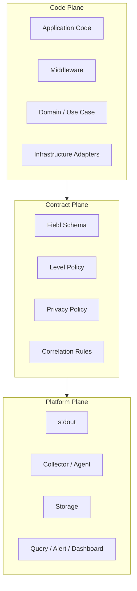
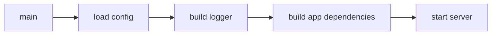
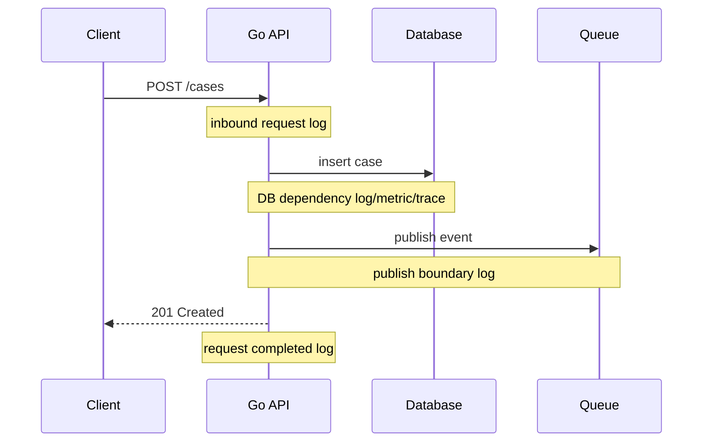
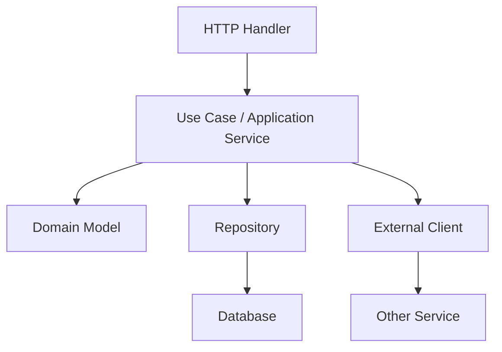
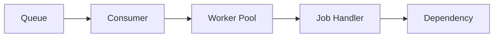
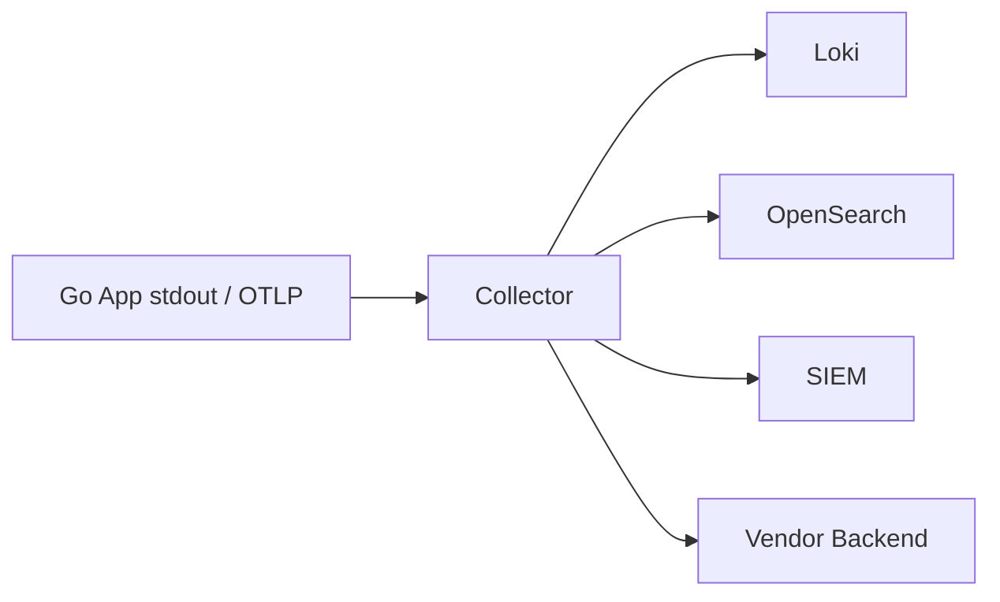
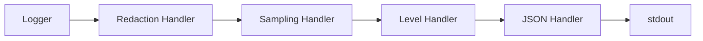
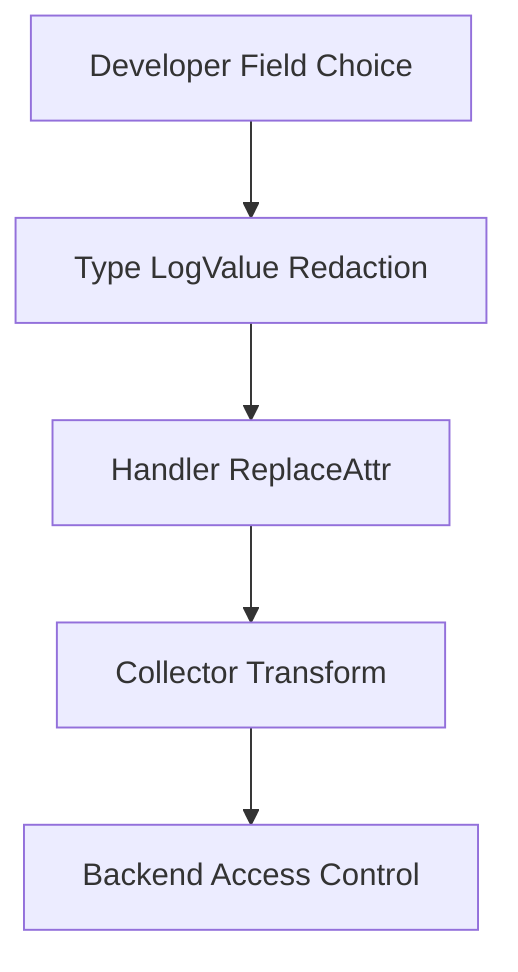
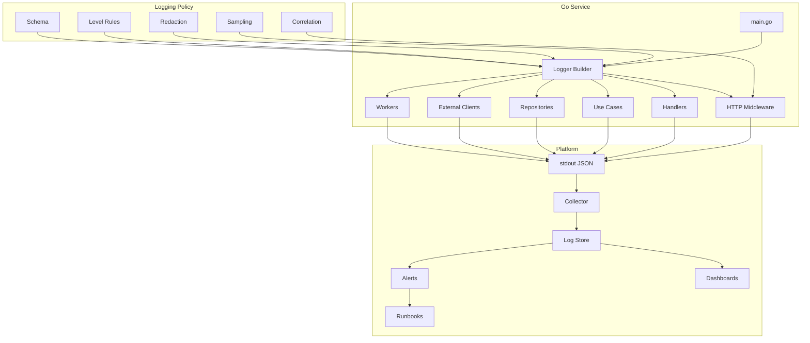

# learn-go-logging-observability-profiling-troubleshooting-part-003.md

# Part 003 — Logging Architecture for Services

> Seri: `learn-go-logging-observability-profiling-troubleshooting`  
> Bagian: `003 / 032`  
> Topik: Logging Architecture for Services  
> Target pembaca: Java software engineer yang ingin menguasai Go production logging pada level internal engineering handbook  
> Fokus: bagaimana merancang logging sebagai arsitektur service, bukan sekadar memanggil `logger.Info()`

---

## 0. Posisi Part Ini dalam Seri

Part sebelumnya membahas dua fondasi:

1. **Part 001**: filosofi production logging.
2. **Part 002**: mekanika `log/slog`.

Part ini berada satu level di atasnya.

Kita tidak lagi bertanya:

```go
logger.Info("request received")
```

Tetapi:

- logger dibuat di mana?
- field apa yang selalu ada?
- field apa yang hanya boleh ada di boundary tertentu?
- siapa yang bertanggung jawab menambahkan `trace_id`?
- apakah domain layer boleh tahu tentang logger?
- bagaimana log dari goroutine tetap bisa dikaitkan ke request asal?
- bagaimana log schema berevolusi tanpa merusak query/dashboard/runbook?
- bagaimana mencegah biaya observability meledak karena cardinality?
- bagaimana membuat log tetap berguna saat incident, bukan hanya ramai?

Dalam Java, banyak organisasi menyelesaikan ini dengan kombinasi:

- SLF4J facade,
- Logback/Log4j2 backend,
- MDC,
- appenders,
- JSON encoder,
- centralized logging agent,
- Spring Boot auto-configuration.

Di Go, arsitektur itu biasanya lebih eksplisit. Itu memberi kontrol lebih besar, tetapi juga membuat kualitas logging sangat bergantung pada desain internal service.

---

## 1. Mental Model: Logging Architecture adalah Data Contract

Kesalahan umum adalah menganggap logging sebagai side effect lokal.

```go
logger.Info("created user")
```

Padahal di sistem production, log adalah **data contract** antara service dan sistem operasi manusia + mesin:



Artinya, setiap log entry bukan hanya untuk developer yang menulis kode. Ia akan dibaca oleh:

- on-call engineer,
- SRE,
- security analyst,
- auditor,
- product engineer,
- support engineer,
- future you,
- automated detection rules,
- correlation engine,
- incident timeline builder.

Karena itu, logging architecture harus menjawab tiga pertanyaan besar:

1. **Identity** — log ini berasal dari service, instance, environment, version, request, tenant, dan operation mana?
2. **Causality** — log ini bagian dari alur kejadian apa?
3. **Evidence** — log ini membuktikan apa yang terjadi, dengan cukup konteks tapi tanpa data berbahaya?

---

## 2. Logging Architecture Bukan Logging Library Choice

Memilih `slog`, `zap`, atau `zerolog` bukan arsitektur. Itu hanya implementasi output.

Arsitektur logging mencakup:

| Area | Pertanyaan desain |
|---|---|
| Logger lifecycle | Dibuat sekali saat startup atau per request? |
| Schema | Field standar apa yang wajib? |
| Context propagation | Bagaimana request/trace/user/tenant dibawa? |
| Boundary policy | Layer mana yang boleh emit log? |
| Redaction | Field apa yang disensor? |
| Sampling | Log apa yang boleh dikurangi? |
| Sink | stdout, file, sidecar, collector, vendor SDK? |
| Compatibility | Bisa dibaca Loki, OpenSearch, CloudWatch, OTel Collector? |
| Governance | Siapa yang boleh menambah field? |
| Testing | Bagaimana mencegah schema rusak? |

`log/slog` memberi fondasi structured logging standar. Dokumentasi Go menegaskan bahwa `slog` menyediakan structured logging dengan record yang terdiri dari message, level, time, dan attributes; logger dihubungkan ke handler yang menentukan cara record diproses/output. Konsep ini penting karena arsitektur logging service sebaiknya dibangun di sekitar **handler pipeline** dan **attribute contract**, bukan string formatting lokal.

Referensi primer:

- Go `log/slog` package documentation.
- Go blog: structured logging with `slog`.
- OpenTelemetry logs data model.
- OpenTelemetry semantic conventions.
- Grafana Loki label cardinality best practices.

---

## 3. The Three Planes of Service Logging

Untuk service Go production, logging bisa dibagi menjadi tiga plane:



### 3.1 Code Plane

Ini tempat log dibuat dari kode:

- HTTP middleware,
- gRPC interceptor,
- handler,
- use case,
- repository,
- HTTP client,
- worker,
- scheduler,
- goroutine,
- startup/shutdown code.

### 3.2 Contract Plane

Ini aturan yang membuat log konsisten:

- nama field,
- level,
- event name,
- privacy,
- correlation,
- error taxonomy,
- allowed cardinality,
- schema version.

### 3.3 Platform Plane

Ini tempat log dikumpulkan, diproses, dan dicari:

- stdout/stderr,
- Fluent Bit / Vector / Promtail / OTel Collector,
- Loki / OpenSearch / Elasticsearch / CloudWatch,
- SIEM,
- alerting,
- dashboard.

Top 1% engineer tidak hanya berpikir di code plane. Mereka mendesain agar tiga plane ini selaras.

---

## 4. Logger Lifecycle

### 4.1 Prinsip Dasar

Logger production biasanya dibuat saat startup, dikonfigurasi berdasarkan environment, lalu dibagikan ke komponen service.



Contoh struktur minimal:

```go
package main

import (
    "log/slog"
    "os"
)

type Config struct {
    ServiceName string
    Environment string
    Version     string
    LogLevel    slog.Level
}

func NewLogger(cfg Config) *slog.Logger {
    handler := slog.NewJSONHandler(os.Stdout, &slog.HandlerOptions{
        Level: cfg.LogLevel,
    })

    return slog.New(handler).With(
        slog.String("service.name", cfg.ServiceName),
        slog.String("deployment.environment", cfg.Environment),
        slog.String("service.version", cfg.Version),
    )
}
```

Field `service.name`, `service.version`, dan `deployment.environment` mengikuti gaya resource identity yang selaras dengan OpenTelemetry semantic conventions. Mengikuti konvensi umum membuat log lebih mudah dikorelasikan dengan traces dan metrics di platform observability modern.

### 4.2 Jangan Membuat Logger Berulang-ulang

Anti-pattern:

```go
func handle(w http.ResponseWriter, r *http.Request) {
    logger := slog.New(slog.NewJSONHandler(os.Stdout, nil))
    logger.Info("handling request")
}
```

Masalah:

- konfigurasi tidak konsisten,
- handler/redaction/sampling bisa terlewat,
- field service/version/environment hilang,
- overhead alokasi tidak perlu,
- sulit dikontrol level-nya,
- sulit dites.

Logger utama sebaiknya dibuat sekali, lalu di-derive dengan `.With(...)` untuk menambah konteks.

---

## 5. Global Logger vs Dependency Injection

Ada tiga pendekatan umum.

### 5.1 Global Logger

```go
var logger *slog.Logger
```

Kelebihan:

- mudah dipakai,
- sedikit boilerplate,
- cocok untuk program kecil.

Kekurangan:

- sulit dites,
- sulit mengganti logger per test,
- dependency tersembunyi,
- package domain bisa diam-diam bergantung pada logging infra,
- context propagation sering kacau.

### 5.2 Explicit Dependency Injection

```go
type UserService struct {
    logger *slog.Logger
    repo   UserRepository
}

func NewUserService(logger *slog.Logger, repo UserRepository) *UserService {
    return &UserService{
        logger: logger.With(slog.String("component", "user_service")),
        repo:   repo,
    }
}
```

Kelebihan:

- dependency jelas,
- testable,
- component field konsisten,
- bisa diganti dengan test handler.

Kekurangan:

- sedikit boilerplate,
- harus disiplin desain constructor.

### 5.3 Context-Carried Logger

```go
func LoggerFromContext(ctx context.Context) *slog.Logger
```

Kelebihan:

- mudah membawa request fields,
- mirip MDC di Java.

Kekurangan:

- context bisa berubah jadi dumping ground,
- dependency tersembunyi,
- domain layer jadi mengambil logger dari context,
- raw context value sulit dikelola.

### 5.4 Rekomendasi

Untuk service production besar:

1. Gunakan **DI untuk base/component logger**.
2. Gunakan `context.Context` untuk **correlation data**, bukan sebagai tempat utama menyimpan logger.
3. Middleware boleh membuat request-scoped logger, tetapi aksesnya harus lewat helper kecil yang terkontrol.
4. Domain pure logic sebaiknya tidak bergantung pada logger kecuali memang ada event observability domain yang penting.

Pola yang seimbang:

```go
type Handler struct {
    logger *slog.Logger
    users  *UserService
}

func (h *Handler) CreateUser(w http.ResponseWriter, r *http.Request) {
    ctx := r.Context()

    log := h.logger.With(
        slog.String("operation", "user.create"),
        slog.String("request.id", RequestIDFromContext(ctx)),
        slog.String("trace.id", TraceIDFromContext(ctx)),
    )

    log.InfoContext(ctx, "request accepted")

    if err := h.users.Create(ctx); err != nil {
        log.ErrorContext(ctx, "request failed", slog.Any("error", err))
        http.Error(w, "internal error", http.StatusInternalServerError)
        return
    }

    log.InfoContext(ctx, "request completed")
}
```

---

## 6. Standard Service Fields

Field standar adalah fondasi query saat incident.

Tanpa field standar, log menjadi kumpulan event yang tidak bisa disatukan.

### 6.1 Resource Identity Fields

Field yang menjawab: log ini berasal dari binary/service mana?

| Field | Contoh | Tujuan |
|---|---|---|
| `service.name` | `payment-api` | Identitas service |
| `service.version` | `2026.06.23-1a2b3c` | Korelasi dengan deployment |
| `deployment.environment` | `prod` | Environment |
| `service.instance.id` | `pod/payment-api-7d9...` | Instance/pod |
| `cloud.region` | `ap-southeast-1` | Region |
| `host.name` | `ip-10-0-1-12` | Host/node |

Untuk Kubernetes, field ini biasanya bisa ditambahkan oleh collector/agent dari metadata pod. Namun service tetap sebaiknya menyertakan minimal `service.name`, `service.version`, dan `deployment.environment`, karena log lokal dan test run juga butuh identitas.

### 6.2 Request/Trace Fields

| Field | Contoh | Tujuan |
|---|---|---|
| `request.id` | `req_abc123` | Korelasi internal per request |
| `trace_id` atau `trace.id` | W3C trace id | Korelasi dengan distributed trace |
| `span_id` atau `span.id` | span id | Korelasi span spesifik |
| `http.request.method` | `POST` | HTTP method |
| `url.path` | `/users/{id}` | Route template, bukan raw path high-cardinality |
| `http.response.status_code` | `201` | Status |
| `duration_ms` | `23.4` | Latency |

Catatan penting: gunakan **route template** (`/users/{id}`), bukan path mentah (`/users/472819`). Path mentah dapat menimbulkan cardinality tinggi dan membuat query/dashboard rusak.

### 6.3 Actor/Tenant Fields

| Field | Contoh | Catatan |
|---|---|---|
| `tenant.id` | `agency-a` | Jangan jadikan label Loki/Prometheus sembarangan |
| `actor.type` | `user`, `system`, `job` | Aman dan rendah cardinality |
| `actor.id_hash` | hash stabil | Hindari raw user id jika sensitif |
| `auth.client_id` | `cpds-web` | Berguna untuk OAuth/OIDC service |

### 6.4 Operation Fields

| Field | Contoh | Tujuan |
|---|---|---|
| `component` | `user_service` | Komponen internal |
| `operation` | `user.create` | Operasi logis |
| `event.name` | `user_create_started` | Event stabil |
| `dependency.name` | `postgres`, `redis`, `payment-gateway` | Dependency |
| `attempt` | `2` | Retry evidence |
| `outcome` | `success`, `failure`, `timeout`, `cancelled` | Outcome eksplisit |

### 6.5 Error Fields

| Field | Contoh | Tujuan |
|---|---|---|
| `error.type` | `*net.OpError` | Klasifikasi teknis |
| `error.code` | `dependency_timeout` | Klasifikasi stabil |
| `error.message` | redacted message | Ringkasan |
| `error.retryable` | `true` | Operasional |
| `error.cause` | `postgres_unavailable` | Root-ish cause bila diketahui |

Jangan bergantung hanya pada string error. Untuk query dan alert, string error sering terlalu variatif.

---

## 7. Field Naming Strategy

### 7.1 Prinsip

Field name harus:

1. stabil,
2. pendek tapi jelas,
3. konsisten antar service,
4. tidak ambigu,
5. kompatibel dengan log backend,
6. mudah dikorelasikan dengan metrics/traces.

Contoh buruk:

```json
{
  "msg": "done",
  "rid": "abc",
  "usr": "123",
  "t": "99ms",
  "err": "timeout"
}
```

Contoh lebih baik:

```json
{
  "time": "2026-06-23T10:00:00Z",
  "level": "INFO",
  "msg": "request completed",
  "service.name": "case-api",
  "service.version": "2026.06.23-a1b2c3",
  "deployment.environment": "prod",
  "request.id": "req_abc",
  "trace_id": "4bf92f3577b34da6a3ce929d0e0e4736",
  "operation": "case.create",
  "http.request.method": "POST",
  "url.path": "/cases",
  "http.response.status_code": 201,
  "duration_ms": 42.7,
  "outcome": "success"
}
```

### 7.2 Dot-separated Names

Dot-separated names seperti `service.name`, `http.response.status_code`, `deployment.environment` selaras dengan banyak semantic convention observability modern. Namun pastikan backend Anda mendukung field dengan titik.

Beberapa backend memperlakukan titik sebagai nested object atau memiliki batasan mapping. Jika memakai OpenSearch/Elasticsearch, diskusikan mapping lebih awal.

Alternatif:

```json
{
  "service_name": "case-api",
  "http_response_status_code": 201
}
```

Tidak ada satu format universal terbaik. Yang terpenting adalah **konsisten** dan didokumentasikan.

### 7.3 Jangan Campur Nama Field

Anti-pattern:

```json
{"request_id": "a"}
{"req_id": "b"}
{"requestId": "c"}
{"x_request_id": "d"}
```

Ini membuat query menjadi rapuh:

```text
request_id="..." OR req_id="..." OR requestId="..." OR x_request_id="..."
```

Dalam incident, query rapuh berarti waktu hilang.

---

## 8. Boundary Logging

Boundary logging adalah pola di mana log terutama dibuat pada batas sistem, bukan di setiap baris internal.

Boundary penting:

1. inbound HTTP/gRPC request,
2. outbound HTTP/gRPC call,
3. database call,
4. cache operation,
5. message publish,
6. message consume,
7. batch job start/end,
8. worker task start/end,
9. startup/shutdown,
10. panic recovery.



### 8.1 Inbound Request Logging

Request logging sebaiknya punya satu log completion utama.

```json
{
  "level": "INFO",
  "msg": "http request completed",
  "operation": "http.server.request",
  "request.id": "req_123",
  "trace_id": "...",
  "http.request.method": "POST",
  "url.path": "/cases",
  "http.response.status_code": 201,
  "duration_ms": 42.7,
  "request.size_bytes": 1024,
  "response.size_bytes": 348,
  "outcome": "success"
}
```

Untuk error:

```json
{
  "level": "ERROR",
  "msg": "http request failed",
  "operation": "http.server.request",
  "request.id": "req_123",
  "trace_id": "...",
  "http.request.method": "POST",
  "url.path": "/cases",
  "http.response.status_code": 503,
  "duration_ms": 1002.2,
  "outcome": "dependency_timeout",
  "error.code": "database_timeout",
  "error.retryable": true
}
```

### 8.2 Outbound Dependency Logging

Outbound call logs harus menjawab:

- dependency mana,
- operation apa,
- latency berapa,
- status apa,
- retry ke berapa,
- timeout/cancelled atau tidak,
- trace/request apa.

```go
log.InfoContext(ctx, "dependency call completed",
    slog.String("operation", "dependency.http.call"),
    slog.String("dependency.name", "profile-service"),
    slog.String("http.request.method", "GET"),
    slog.String("url.path", "/profiles/{id}"),
    slog.Int("http.response.status_code", 200),
    slog.Float64("duration_ms", 18.3),
    slog.String("outcome", "success"),
)
```

Jangan log full URL jika berisi token, user id, query sensitif, atau high cardinality.

---

## 9. Logger di Layered Architecture

Misalkan service punya layer:



### 9.1 HTTP Handler

Boleh logging:

- request accepted/completed,
- invalid request,
- auth failure,
- panic recovery,
- response status.

### 9.2 Application Service / Use Case

Boleh logging event bisnis/operasi penting:

- workflow transition,
- command accepted,
- important branch,
- idempotency hit,
- conflict decision,
- retry/exhausted retry,
- compensation triggered.

Tapi jangan logging setiap function enter/exit.

### 9.3 Domain Model

Biasanya jangan bergantung pada logger.

Domain sebaiknya menghasilkan:

- return value,
- error,
- domain event,
- decision object.

Application layer yang menulis log.

Contoh:

```go
decision, err := policy.Evaluate(caseFile, actor)
if err != nil {
    return err
}

log.InfoContext(ctx, "case policy evaluated",
    slog.String("operation", "case.policy.evaluate"),
    slog.String("decision", decision.Outcome.String()),
    slog.String("reason_code", decision.ReasonCode),
)
```

### 9.4 Repository

Repository boleh logging boundary database bila:

- query gagal,
- timeout,
- retry,
- unexpected row count,
- transaction conflict,
- pool saturation evidence.

Namun detail query sebaiknya hati-hati. Jangan log parameter mentah berisi PII/secrets.

### 9.5 External Client

External client sebaiknya punya observability wrapper:

- log call completed/failed,
- metrics latency/error,
- tracing client span,
- retry evidence,
- circuit breaker state.

---

## 10. Request-scoped Logger

Request-scoped logger adalah logger turunan yang sudah membawa field request.

```go
func RequestLogger(base *slog.Logger, r *http.Request) *slog.Logger {
    ctx := r.Context()

    return base.With(
        slog.String("request.id", RequestIDFromContext(ctx)),
        slog.String("trace_id", TraceIDFromContext(ctx)),
        slog.String("http.request.method", r.Method),
        slog.String("url.path", RoutePatternFromRequest(r)),
    )
}
```

Pemakaian:

```go
func (h *Handler) ServeHTTP(w http.ResponseWriter, r *http.Request) {
    log := RequestLogger(h.logger, r).With(
        slog.String("component", "case_handler"),
        slog.String("operation", "case.create"),
    )

    log.InfoContext(r.Context(), "request accepted")
}
```

### 10.1 Jangan Simpan Semua Hal di Request Logger

Request logger sebaiknya membawa field yang stabil untuk seluruh request:

- request id,
- trace id,
- method,
- route,
- component/operation jika jelas.

Jangan otomatis tambahkan:

- request body,
- raw query,
- authorization header,
- user email,
- token,
- full response,
- high-cardinality object id jika tidak perlu.

---

## 11. Context Propagation untuk Logging

`context.Context` di Go adalah carrier untuk cancellation, deadlines, dan request-scoped values. Untuk observability, context penting karena traces, deadlines, dan request metadata biasanya berjalan di dalam context.

Namun context bukan database global.

### 11.1 Value yang Layak di Context

Layak:

- request id,
- trace/span context,
- authenticated actor summary,
- tenant summary,
- deadline,
- logger pointer jika dibatasi ketat.

Tidak layak:

- full user object besar,
- raw JWT,
- request body,
- database connection,
- optional parameter bisnis,
- mutable map observability.

### 11.2 Helper Typed Key

```go
type contextKey string

const requestIDKey contextKey = "request_id"

func WithRequestID(ctx context.Context, requestID string) context.Context {
    return context.WithValue(ctx, requestIDKey, requestID)
}

func RequestIDFromContext(ctx context.Context) string {
    value, ok := ctx.Value(requestIDKey).(string)
    if !ok {
        return ""
    }
    return value
}
```

Jangan gunakan string key langsung di banyak package.

```go
// buruk
ctx.Value("request_id")
```

Karena raw string key rawan collision dan tidak discoverable.

---

## 12. Correlation ID, Request ID, Trace ID

### 12.1 Request ID

Request ID biasanya identitas lokal request. Bisa dibuat oleh edge gateway atau service pertama.

Berguna untuk:

- log search cepat,
- support ticket,
- debugging service tunggal,
- fallback jika tracing tidak aktif.

### 12.2 Trace ID

Trace ID adalah identitas distributed trace. Biasanya mengikuti W3C Trace Context jika memakai OpenTelemetry.

Berguna untuk:

- korelasi antar service,
- critical path latency,
- dependency analysis,
- fan-out/fan-in.

### 12.3 Apakah Perlu Keduanya?

Ya, sering perlu.

| ID | Scope | Sumber | Kegunaan |
|---|---|---|---|
| `request.id` | lokal/edge | gateway/app | support/debugging cepat |
| `trace_id` | distributed | tracing system | korelasi lintas service |
| `span_id` | span spesifik | tracing system | korelasi operation detail |

### 12.4 Jangan Jadikan Trace ID Sebagai Loki Label

Grafana Loki documentation menekankan bahwa label sebaiknya low-cardinality dan long-lived; value ephemeral seperti trace ID/order ID tidak sebaiknya diekstrak sebagai label. Trace ID tetap boleh ada sebagai structured metadata/field yang bisa dicari, tetapi bukan label/index dimension utama.

---

## 13. Logging dalam Goroutine

Goroutine membuat observability lebih sulit karena eksekusi keluar dari call stack request.

Anti-pattern:

```go
go func() {
    logger.Info("async work started")
    doWork()
}()
```

Masalah:

- kehilangan request id,
- kehilangan trace id,
- tidak tahu operation asal,
- panic bisa tidak terlihat jika tidak recover,
- lifecycle goroutine tidak jelas.

Pola lebih baik:

```go
func StartAsyncWork(ctx context.Context, base *slog.Logger, jobID string) {
    log := base.With(
        slog.String("component", "async_worker"),
        slog.String("operation", "case.post_process"),
        slog.String("request.id", RequestIDFromContext(ctx)),
        slog.String("trace_id", TraceIDFromContext(ctx)),
        slog.String("job.id", jobID),
    )

    go func() {
        defer func() {
            if r := recover(); r != nil {
                log.ErrorContext(ctx, "async work panicked",
                    slog.Any("panic", r),
                )
            }
        }()

        log.InfoContext(ctx, "async work started")
        if err := doWork(ctx); err != nil {
            log.ErrorContext(ctx, "async work failed", slog.Any("error", err))
            return
        }
        log.InfoContext(ctx, "async work completed")
    }()
}
```

### 13.1 Context Lifetime Trap

Jika goroutine harus hidup setelah request selesai, jangan pakai request context mentah karena akan cancelled ketika request selesai.

Buruk:

```go
go doLongWork(r.Context())
```

Lebih baik:

```go
parent := r.Context()
ctx := context.WithoutCancel(parent) // Go 1.21+
ctx = WithRequestID(ctx, RequestIDFromContext(parent))
ctx = WithTraceID(ctx, TraceIDFromContext(parent))

go doLongWork(ctx)
```

Namun gunakan ini secara hati-hati. Background work harus punya lifecycle, timeout, dan shutdown mechanism sendiri.

---

## 14. Logging dalam Worker Pool

Worker pool punya pola observability berbeda dari HTTP request.



Field penting:

| Field | Tujuan |
|---|---|
| `worker.name` | jenis worker |
| `worker.id` | instance worker |
| `job.id` | identitas job |
| `job.type` | jenis job |
| `job.attempt` | retry attempt |
| `queue.name` | queue/source |
| `message.id` | message broker id |
| `duration_ms` | durasi proses |
| `outcome` | success/failure/retry/dead_letter |

Contoh:

```go
func (w *Worker) Handle(ctx context.Context, msg Message) error {
    log := w.logger.With(
        slog.String("component", "worker"),
        slog.String("worker.name", w.name),
        slog.String("queue.name", msg.Queue),
        slog.String("message.id", msg.ID),
        slog.String("job.type", msg.Type),
        slog.Int("job.attempt", msg.Attempt),
    )

    started := time.Now()
    log.InfoContext(ctx, "job started")

    err := w.process(ctx, msg)
    duration := time.Since(started)

    if err != nil {
        log.ErrorContext(ctx, "job failed",
            slog.Duration("duration", duration),
            slog.Any("error", err),
            slog.Bool("retryable", IsRetryable(err)),
        )
        return err
    }

    log.InfoContext(ctx, "job completed",
        slog.Duration("duration", duration),
        slog.String("outcome", "success"),
    )
    return nil
}
```

### 14.1 Worker Logging Anti-pattern

Buruk:

```go
log.Info("processing")
log.Info("done")
```

Tidak cukup karena tidak menjawab:

- job mana,
- queue mana,
- attempt ke berapa,
- berapa lama,
- outcome apa,
- apakah retry/dead-letter.

---

## 15. Startup and Shutdown Logging

Startup/shutdown log sering disepelekan, padahal sangat penting saat incident rollout.

### 15.1 Startup Events

Log saat startup harus mencakup:

- service name,
- version/commit,
- environment,
- config mode,
- listen address,
- enabled features,
- external dependencies configured,
- migrations status jika ada,
- observability endpoints.

Contoh:

```go
logger.Info("service starting",
    slog.String("service.name", cfg.ServiceName),
    slog.String("service.version", cfg.Version),
    slog.String("deployment.environment", cfg.Environment),
    slog.String("http.addr", cfg.HTTPAddr),
    slog.Bool("pprof.enabled", cfg.PprofEnabled),
)
```

### 15.2 Jangan Log Secrets saat Startup

Buruk:

```go
logger.Info("loaded config", slog.Any("config", cfg))
```

Karena config sering berisi:

- password,
- token,
- DSN,
- private key path,
- internal URL sensitif,
- customer-specific setting.

Gunakan sanitized config summary.

### 15.3 Shutdown Events

Log saat shutdown harus mencakup:

- signal diterima,
- server stop accepting traffic,
- graceful shutdown started,
- active request/job count,
- timeout,
- flush telemetry,
- final result.

```go
logger.Info("shutdown started", slog.String("signal", sig.String()))

ctx, cancel := context.WithTimeout(context.Background(), 30*time.Second)
defer cancel()

if err := server.Shutdown(ctx); err != nil {
    logger.Error("shutdown failed", slog.Any("error", err))
} else {
    logger.Info("shutdown completed")
}
```

---

## 16. Access Log vs Application Log vs Audit Log

Jangan campur semua jenis log.

### 16.1 Access Log

Access log menjawab request/response di boundary.

Contoh:

```json
{
  "msg": "http request completed",
  "http.request.method": "GET",
  "url.path": "/cases/{id}",
  "http.response.status_code": 200,
  "duration_ms": 15.2
}
```

### 16.2 Application Log

Application log menjelaskan keputusan internal penting.

```json
{
  "msg": "case escalation rule matched",
  "operation": "case.escalation.evaluate",
  "rule.id": "late_response_escalation",
  "decision": "escalate"
}
```

### 16.3 Audit Log

Audit log menjelaskan aksi yang perlu dipertanggungjawabkan.

```json
{
  "event.name": "case.status.changed",
  "actor.id_hash": "...",
  "case.id": "...",
  "from_status": "draft",
  "to_status": "submitted",
  "reason_code": "user_submit"
}
```

Audit log biasanya punya requirement berbeda:

- retention lebih lama,
- immutability,
- access control lebih ketat,
- schema lebih formal,
- privacy/legal review,
- tidak boleh sampling sembarangan.

### 16.4 Security Log

Security log mencatat event seperti:

- login failure,
- token invalid,
- permission denied,
- suspicious activity,
- privilege change,
- API key usage.

Security log harus dirancang bersama security/compliance team.

---

## 17. Log Schema Evolution

Log schema akan berubah. Jika tidak dikelola, query dan dashboard rusak.

### 17.1 Schema Version

Untuk sistem besar, pertimbangkan field:

```json
{
  "log.schema.version": "1.0"
}
```

Namun jangan menjadikan ini alasan untuk sering breaking change.

### 17.2 Compatibility Rules

Aturan praktis:

1. Menambah field baru biasanya aman.
2. Menghapus field wajib tidak aman.
3. Mengubah tipe field tidak aman.
4. Mengganti nama field tidak aman.
5. Mengubah meaning field tanpa rename sangat berbahaya.

Contoh breaking change:

```json
{"duration_ms": 123}
```

berubah menjadi:

```json
{"duration_ms": "123ms"}
```

Query numeric histogram bisa rusak.

### 17.3 Deprecation Pattern

Jika harus mengganti field:

1. Tambahkan field baru.
2. Emit dua field selama periode transisi.
3. Update query/dashboard/alert/runbook.
4. Hapus field lama setelah aman.

Contoh:

```json
{
  "request.id": "req_123",
  "request_id": "req_123"
}
```

Lalu migrasi bertahap.

---

## 18. Platform Compatibility

### 18.1 stdout sebagai Default Container-native

Untuk Kubernetes/container, pola umum adalah menulis structured log ke stdout/stderr, lalu agent/collector mengambilnya.

Keuntungan:

- sederhana,
- tidak perlu file rotation di app,
- selaras dengan container runtime,
- mudah dikumpulkan oleh platform.

### 18.2 Jangan Tulis File Log Tanpa Alasan

File log di container sering bermasalah:

- lifecycle ephemeral,
- rotation rumit,
- permission issue,
- sidecar complexity,
- disk pressure,
- duplikasi dengan stdout.

File log masih bisa valid untuk:

- legacy VM,
- audit append-only lokal,
- high-performance local buffer,
- regulated environment tertentu.

Namun default service cloud-native sebaiknya stdout JSON.

### 18.3 Loki

Loki menggunakan label untuk indexing. Best practice Loki menekankan label rendah cardinality dan long-lived. Karena itu:

Baik sebagai label:

- `service.name`,
- `deployment.environment`,
- `namespace`,
- `pod`,
- `container`,
- `level` dengan hati-hati.

Buruk sebagai label:

- `trace_id`,
- `request.id`,
- `user.id`,
- `order.id`,
- `path` mentah,
- `error.message`.

### 18.4 OpenSearch/Elasticsearch

Perhatikan:

- mapping explosion,
- dynamic fields,
- field type conflicts,
- high-cardinality keyword fields,
- nested object mapping,
- index lifecycle management,
- retention cost.

### 18.5 CloudWatch Logs

Perhatikan:

- JSON parsing/search limitations tergantung query,
- ingestion cost,
- retention,
- log group/stream naming,
- cross-account access.

### 18.6 OTel Collector

OTel Collector bisa menjadi pusat pipeline:



Namun jangan gunakan collector sebagai alasan untuk mengabaikan schema di aplikasi. Collector bisa transform, tetapi tidak bisa memperbaiki log yang tidak punya causality.

---

## 19. Handler Pipeline Architecture with `slog`

Karena `slog` memisahkan `Logger` dan `Handler`, kita bisa membuat pipeline.



Contoh konseptual:

```go
func BuildHandler(w io.Writer, level slog.Leveler) slog.Handler {
    json := slog.NewJSONHandler(w, &slog.HandlerOptions{
        Level: level,
        ReplaceAttr: func(groups []string, a slog.Attr) slog.Attr {
            switch a.Key {
            case "password", "token", "authorization":
                return slog.String(a.Key, "[REDACTED]")
            default:
                return a
            }
        },
    })

    return json
}
```

Untuk service besar, redaction sebaiknya bukan hanya berdasarkan nama field exact, tetapi policy yang lebih kuat:

- denylist field names,
- allowlist for audit logs,
- type-based redaction,
- `LogValue()` custom,
- test redaction,
- review saat menambah field baru.

---

## 20. Component Logger Pattern

Base logger:

```go
base := slog.New(handler).With(
    slog.String("service.name", "case-api"),
    slog.String("service.version", version),
    slog.String("deployment.environment", env),
)
```

Component logger:

```go
caseLog := base.With(slog.String("component", "case_service"))
repoLog := base.With(slog.String("component", "case_repository"))
httpLog := base.With(slog.String("component", "http_server"))
```

Kelebihan:

- query `component="case_repository"`,
- jelas sumber internal,
- tidak perlu menambahkan field component manual setiap call,
- testing lebih mudah.

### 20.1 Component Naming

Gunakan nama stabil:

Baik:

- `http_server`,
- `case_service`,
- `case_repository`,
- `profile_client`,
- `event_publisher`,
- `cleanup_worker`.

Buruk:

- nama struct yang sering berubah,
- nama developer,
- nama file,
- nama package terlalu internal.

---

## 21. Operation Naming

Operation adalah aktivitas logis.

Contoh:

- `case.create`,
- `case.submit`,
- `case.escalate`,
- `profile.lookup`,
- `email.send`,
- `audit.write`,
- `job.cleanup_expired_sessions`.

Operation harus cukup stabil untuk query dan dashboard.

Jangan gunakan message log sebagai operation.

Buruk:

```json
{
  "msg": "user clicked submit and case will be created maybe"
}
```

Baik:

```json
{
  "msg": "case creation requested",
  "operation": "case.create"
}
```

### 21.1 Event Name vs Operation

`operation` = aktivitas logis.  
`event.name` = event spesifik yang terjadi.

Contoh:

```json
{
  "operation": "case.create",
  "event.name": "case_create_validation_failed"
}
```

---

## 22. Logging and Domain Events

Untuk domain kompleks, log bukan pengganti domain event.

Domain event:

- bagian dari business model,
- bisa diproses oleh sistem lain,
- punya contract bisnis,
- sering durable.

Log:

- observability evidence,
- diagnostic,
- query/investigation,
- biasanya tidak menjadi source of truth bisnis.

Anti-pattern:

```text
Menggunakan log sebagai satu-satunya bukti perubahan state penting.
```

Jika perubahan state perlu audit/regulatory defensibility, gunakan audit event/table/event store, bukan hanya application log.

---

## 23. Privacy and Redaction Architecture

Redaction tidak boleh bergantung pada developer ingat atau lupa.

### 23.1 Redaction Layers



Layer terbaik adalah kombinasi:

1. Jangan log data sensitif.
2. Gunakan type yang tahu cara meredaksi dirinya.
3. Handler melakukan guardrail.
4. Collector bisa melakukan transform tambahan.
5. Backend membatasi akses.

### 23.2 Type-based Redaction

```go
type Email string

func (e Email) LogValue() slog.Value {
    return slog.StringValue(maskEmail(string(e)))
}
```

```go
logger.Info("user loaded", slog.Any("user.email", Email("alice@example.com")))
```

### 23.3 Field Policy

Buat daftar field:

| Category | Policy |
|---|---|
| Password/token/private key | never log |
| Authorization header | never log |
| Raw JWT | never log |
| Email | mask/hash jika perlu |
| User ID | hash atau internal opaque id |
| Request body | disabled by default |
| Response body | disabled by default |
| DB query param | redacted/sampled |
| Object ID | allowed jika non-sensitive dan bukan label |

---

## 24. Sampling Architecture

Tidak semua log sama.

### 24.1 Jangan Sampling Log Penting

Jangan sampling:

- error fatal,
- security event,
- audit event,
- panic recovery,
- startup/shutdown,
- data corruption evidence,
- permission denied penting,
- payment/regulatory state change.

Boleh sampling:

- repetitive success debug,
- high-frequency dependency success,
- known noisy warning,
- repeated validation failure jika metrics sudah ada,
- health check access log.

### 24.2 Sampling Berdasarkan Event

Lebih baik sampling berdasarkan `event.name`/`operation` daripada message string.

```text
sample 1% event.name=http_request_completed where status<500
keep 100% status>=500
keep 100% event.name=panic_recovered
```

### 24.3 Sampling Harus Dikompensasi Metrics

Jika success logs disampling, metrics harus tetap lengkap.

```text
Logs sampled, metrics complete.
```

Kalau tidak, Anda kehilangan visibility terhadap volume sebenarnya.

---

## 25. Performance Architecture

Logging punya biaya:

- alokasi object/attr,
- JSON encoding,
- string conversion,
- lock/IO,
- stdout blocking,
- collector ingestion,
- backend indexing,
- storage.

### 25.1 Avoid Expensive Argument Construction

Buruk:

```go
logger.Debug("payload", slog.String("payload", expensiveSerialize(obj)))
```

Meskipun debug disabled, fungsi `expensiveSerialize` tetap dieksekusi sebelum call.

Lebih baik:

```go
if logger.Enabled(ctx, slog.LevelDebug) {
    logger.DebugContext(ctx, "payload",
        slog.String("payload", expensiveSerialize(obj)),
    )
}
```

### 25.2 Jangan Log di Hot Loop Tanpa Batas

Buruk:

```go
for _, item := range items {
    logger.Info("processing item", slog.String("item.id", item.ID))
}
```

Jika `items` ribuan per request, log bisa menjadi bottleneck.

Lebih baik:

```go
logger.Info("batch processing completed",
    slog.Int("item.count", len(items)),
    slog.Int("failed.count", failed),
    slog.Duration("duration", duration),
)
```

Gunakan detail per item hanya untuk debug terbatas/sampling/diagnostic mode.

---

## 26. Testing Logging Architecture

Log schema yang penting harus dites.

### 26.1 Test Handler

Buat handler yang menangkap records.

```go
type CapturingHandler struct {
    records []slog.Record
}
```

Atau gunakan buffer JSON dan decode.

```go
var buf bytes.Buffer
logger := slog.New(slog.NewJSONHandler(&buf, nil))

logger.Info("request completed",
    slog.String("operation", "case.create"),
    slog.Int("http.response.status_code", 201),
)

var got map[string]any
if err := json.Unmarshal(buf.Bytes(), &got); err != nil {
    t.Fatal(err)
}

if got["operation"] != "case.create" {
    t.Fatalf("missing operation")
}
```

### 26.2 Test Redaction

```go
logger.Info("login failed",
    slog.String("password", "secret"),
    slog.String("authorization", "Bearer abc"),
)
```

Assert output tidak mengandung:

- `secret`,
- `Bearer`,
- raw token.

### 26.3 Golden Schema Tests

Untuk critical logs, gunakan golden JSON schema-like assertions.

Yang dites bukan exact timestamp, tetapi field wajib:

- `service.name`,
- `operation`,
- `event.name`,
- `request.id`,
- `outcome`,
- `duration_ms`,
- `error.code` jika error.

---

## 27. Reference Architecture: Observable Go Service Logging



---

## 28. Reference Package Layout

Contoh package layout:

```text
internal/
  observability/
    logging/
      logger.go
      handler.go
      redaction.go
      context.go
      fields.go
      testing.go
    tracing/
    metrics/
  httpserver/
    middleware_logging.go
    middleware_recovery.go
  users/
    handler.go
    service.go
    repository.go
```

### 28.1 `fields.go`

```go
package logging

const (
    FieldServiceName        = "service.name"
    FieldServiceVersion     = "service.version"
    FieldEnvironment        = "deployment.environment"
    FieldComponent          = "component"
    FieldOperation          = "operation"
    FieldEventName          = "event.name"
    FieldRequestID          = "request.id"
    FieldTraceID            = "trace_id"
    FieldSpanID             = "span_id"
    FieldOutcome            = "outcome"
    FieldDurationMS         = "duration_ms"
    FieldErrorCode          = "error.code"
    FieldErrorType          = "error.type"
    FieldErrorRetryable     = "error.retryable"
)
```

Menggunakan constants membantu mengurangi variasi field typo.

### 28.2 `logger.go`

```go
package logging

import (
    "io"
    "log/slog"
)

type Config struct {
    ServiceName string
    Version     string
    Environment string
    Level       slog.Leveler
}

func New(w io.Writer, cfg Config) *slog.Logger {
    handler := NewHandler(w, cfg.Level)

    return slog.New(handler).With(
        slog.String(FieldServiceName, cfg.ServiceName),
        slog.String(FieldServiceVersion, cfg.Version),
        slog.String(FieldEnvironment, cfg.Environment),
    )
}
```

### 28.3 `handler.go`

```go
package logging

import (
    "io"
    "log/slog"
)

func NewHandler(w io.Writer, level slog.Leveler) slog.Handler {
    return slog.NewJSONHandler(w, &slog.HandlerOptions{
        Level:       level,
        ReplaceAttr: RedactAttr,
    })
}
```

### 28.4 `redaction.go`

```go
package logging

import "log/slog"

func RedactAttr(groups []string, a slog.Attr) slog.Attr {
    switch a.Key {
    case "password", "secret", "token", "authorization", "cookie", "set-cookie":
        return slog.String(a.Key, "[REDACTED]")
    default:
        return a
    }
}
```

Production redaction biasanya lebih kompleks dari ini, tetapi struktur awalnya jelas.

---

## 29. HTTP Middleware Example

```go
type responseRecorder struct {
    http.ResponseWriter
    status int
    bytes  int
}

func (r *responseRecorder) WriteHeader(status int) {
    r.status = status
    r.ResponseWriter.WriteHeader(status)
}

func (r *responseRecorder) Write(b []byte) (int, error) {
    if r.status == 0 {
        r.status = http.StatusOK
    }
    n, err := r.ResponseWriter.Write(b)
    r.bytes += n
    return n, err
}

func LoggingMiddleware(base *slog.Logger, next http.Handler) http.Handler {
    return http.HandlerFunc(func(w http.ResponseWriter, r *http.Request) {
        started := time.Now()
        rec := &responseRecorder{ResponseWriter: w}

        ctx := r.Context()
        requestID := RequestIDFromContext(ctx)
        traceID := TraceIDFromContext(ctx)
        route := RoutePatternFromRequest(r)

        log := base.With(
            slog.String("component", "http_server"),
            slog.String("operation", "http.server.request"),
            slog.String("request.id", requestID),
            slog.String("trace_id", traceID),
            slog.String("http.request.method", r.Method),
            slog.String("url.path", route),
        )

        defer func() {
            duration := time.Since(started)
            status := rec.status
            if status == 0 {
                status = http.StatusOK
            }

            level := slog.LevelInfo
            outcome := "success"
            if status >= 500 {
                level = slog.LevelError
                outcome = "server_error"
            } else if status >= 400 {
                level = slog.LevelWarn
                outcome = "client_error"
            }

            log.LogAttrs(ctx, level, "http request completed",
                slog.Int("http.response.status_code", status),
                slog.Int("http.response.body.size", rec.bytes),
                slog.Float64("duration_ms", float64(duration.Microseconds())/1000.0),
                slog.String("outcome", outcome),
            )
        }()

        next.ServeHTTP(rec, r)
    })
}
```

Catatan:

- route harus route pattern, bukan raw `r.URL.Path` bila mengandung ID.
- jangan log query string penuh secara default.
- request body tidak dilog.
- response body tidak dilog.
- `duration_ms` numeric agar bisa dianalisis.

---

## 30. Panic Recovery Logging

Panic harus dilog di boundary recovery dengan evidence cukup.

```go
func RecoveryMiddleware(base *slog.Logger, next http.Handler) http.Handler {
    return http.HandlerFunc(func(w http.ResponseWriter, r *http.Request) {
        defer func() {
            if recovered := recover(); recovered != nil {
                ctx := r.Context()
                base.ErrorContext(ctx, "panic recovered",
                    slog.String("component", "http_server"),
                    slog.String("operation", "http.server.request"),
                    slog.String("request.id", RequestIDFromContext(ctx)),
                    slog.String("trace_id", TraceIDFromContext(ctx)),
                    slog.String("http.request.method", r.Method),
                    slog.String("url.path", RoutePatternFromRequest(r)),
                    slog.Any("panic", recovered),
                )
                http.Error(w, "internal server error", http.StatusInternalServerError)
            }
        }()

        next.ServeHTTP(w, r)
    })
}
```

Untuk production, pertimbangkan stack trace terbatas:

```go
buf := make([]byte, 64<<10)
n := runtime.Stack(buf, false)
stack := string(buf[:n])
```

Namun stack trace bisa besar dan berisi data sensitif dari argument string; gunakan policy.

---

## 31. Logging Contract Example

Contoh contract internal:

```yaml
logging:
  format: json
  timestamp: rfc3339nano
  required_fields:
    - time
    - level
    - msg
    - service.name
    - service.version
    - deployment.environment
    - component
    - operation
  request_fields:
    - request.id
    - trace_id
    - span_id
    - http.request.method
    - url.path
    - http.response.status_code
    - duration_ms
    - outcome
  error_fields:
    - error.code
    - error.type
    - error.retryable
  forbidden_fields:
    - password
    - token
    - authorization
    - cookie
    - set-cookie
    - raw_jwt
    - private_key
  cardinality_rules:
    label_safe:
      - service.name
      - deployment.environment
      - component
      - level
    field_only:
      - request.id
      - trace_id
      - user.id_hash
      - order.id
      - case.id
```

Contract seperti ini membuat logging bisa direview dalam PR.

---

## 32. Anti-patterns

### 32.1 Message-only Logging

```go
logger.Info("done")
```

Tidak ada operation, outcome, duration, request id.

### 32.2 Duplicate Error Logging

Repository log error, service log error, handler log error, middleware log error — hasilnya satu error terlihat seperti empat error.

Gunakan policy: log di boundary yang paling informatif.

### 32.3 Raw Payload Logging

```go
logger.Debug("request", slog.String("body", string(body)))
```

Risiko:

- PII leak,
- secrets leak,
- storage explosion,
- compliance issue,
- latency.

### 32.4 High-cardinality Labels

Trace ID, request ID, user ID sebagai index label dapat menghancurkan backend log/metrics.

### 32.5 Inconsistent Field Names

`request_id`, `req_id`, `requestId`, `RequestID` dalam service berbeda.

### 32.6 Domain Logic Polluted by Logging

Domain model memanggil logger untuk semua decision internal sehingga domain sulit dites dan bergantung pada infra.

### 32.7 Debug Mode Permanent

Debug log aktif terus di production tanpa sampling/guardrail.

### 32.8 Logging as Control Flow

Mengandalkan log sebagai satu-satunya mekanisme untuk mendeteksi state change penting.

---

## 33. Decision Matrix

### 33.1 Logger Placement

| Situasi | Rekomendasi |
|---|---|
| Small CLI | global/default logger cukup |
| Production API | DI base logger + middleware request fields |
| Library umum | jangan paksa logger; terima optional logger/interface jika perlu |
| Domain model | hindari logger langsung |
| Worker service | component logger + job fields |
| Shared infra client | wrapper dengan logger/metrics/tracing |

### 33.2 What to Log

| Event | Log? | Level |
|---|---:|---|
| Service startup | Ya | Info |
| Service shutdown | Ya | Info/Warn/Error |
| HTTP request completed | Ya, biasanya | Info/Warn/Error |
| Health check success | Biasanya sample/drop | Debug/None |
| Dependency timeout | Ya | Warn/Error |
| Validation failure | Tergantung volume | Warn/Info |
| Auth failure | Ya, hati-hati privacy | Warn |
| Permission denied | Ya | Warn |
| Panic recovered | Ya | Error |
| Per item loop success | Biasanya tidak | Debug sampled |
| Raw payload | Hampir selalu tidak | None |

---

## 34. Production Checklist

Sebelum service dianggap logging-ready:

- [ ] Output log JSON structured.
- [ ] Base fields ada: service, version, environment.
- [ ] Component field konsisten.
- [ ] Operation field konsisten.
- [ ] Request ID tersedia.
- [ ] Trace ID dikorelasikan bila tracing aktif.
- [ ] HTTP access log punya method, route, status, duration, outcome.
- [ ] Outbound dependency log punya dependency, status/outcome, duration.
- [ ] Worker log punya job/message identity.
- [ ] Startup/shutdown log tersedia.
- [ ] Panic recovery log tersedia.
- [ ] Error logging tidak duplikatif.
- [ ] Redaction handler aktif.
- [ ] Forbidden fields dites.
- [ ] Request/response body tidak dilog default.
- [ ] High-cardinality field tidak dijadikan label.
- [ ] Log schema terdokumentasi.
- [ ] Logging tests untuk event penting.
- [ ] Debug logging punya guardrail.
- [ ] Sampling policy jelas.
- [ ] Runbook tahu query field utama.

---

## 35. Exercises

### Exercise 1 — Design Logging Schema

Ambil satu service imajiner: `case-api`.

Rancang field wajib untuk:

1. inbound HTTP request,
2. create case use case,
3. database insert,
4. event publish,
5. worker consume,
6. panic recovery.

Pastikan setiap log bisa dikorelasikan via `request.id` atau `trace_id`.

### Exercise 2 — Refactor Message Logs

Ubah log berikut menjadi structured production log:

```go
logger.Println("failed to save case")
```

Pertimbangkan:

- operation,
- component,
- error code,
- retryable,
- request id,
- dependency,
- duration.

### Exercise 3 — Identify Cardinality Risk

Tentukan field mana yang aman menjadi label dan mana yang harus field-only:

- service.name
- deployment.environment
- user.id
- trace_id
- request.id
- http.route
- raw url path
- status code
- error message
- tenant id
- pod name

### Exercise 4 — Build Middleware

Implementasikan middleware Go yang:

1. mencatat method,
2. route pattern,
3. status code,
4. duration,
5. request id,
6. trace id,
7. outcome.

Pastikan tidak log request body.

### Exercise 5 — Redaction Test

Buat unit test yang memastikan field berikut tidak muncul mentah dalam output log:

- password,
- token,
- authorization,
- cookie,
- raw JWT.

---

## 36. Key Takeaways

1. Logging architecture adalah data contract antara service, platform observability, dan manusia yang menginvestigasi incident.
2. `slog` memberi fondasi structured logging, tetapi kualitas production logging ditentukan oleh schema, lifecycle, boundary, redaction, dan governance.
3. Logger sebaiknya dibuat saat startup, diberi base fields, lalu diturunkan menjadi component/request/job logger.
4. Field standar lebih penting daripada message cantik.
5. Boundary logging lebih berguna daripada function-level noise.
6. Context penting untuk correlation, tetapi jangan jadikan context sebagai global dumping ground.
7. Request ID dan trace ID punya fungsi berbeda; sering perlu keduanya.
8. Goroutine dan worker membutuhkan propagation/logging policy khusus.
9. Access log, application log, audit log, dan security log harus dibedakan.
10. Cardinality dan privacy adalah bagian dari desain logging, bukan optimisasi belakangan.
11. Log schema harus dites dan dikelola seperti API contract.
12. Production logging yang baik membuat incident bisa direkonstruksi cepat tanpa membuka payload sensitif.

---

## 37. Referensi

- Go `log/slog` package documentation: structured logging, `Logger`, `Handler`, `Record`, `Attr`, handler options, context-aware logging.
- Go Blog: **Structured Logging with slog** — menjelaskan motivasi structured logging di standard library Go.
- OpenTelemetry Logs Data Model — model standar untuk merepresentasikan logs dari berbagai sumber.
- OpenTelemetry Semantic Conventions — common naming scheme untuk attributes logs, metrics, traces, profiles, dan resources.
- Grafana Loki Documentation: label best practices — label sebaiknya low-cardinality; value ephemeral seperti trace ID/order ID tidak cocok sebagai label.

---

# Status Seri

- Part ini selesai: `Part 003 — Logging Architecture for Services`.
- Seri belum selesai.
- Berikutnya: `Part 004 — Error Logging, Causality, and Failure Evidence`.


<!-- NAVIGATION_FOOTER -->
<div class="page-nav">
<a href="./learn-go-logging-observability-profiling-troubleshooting-part-002.md">⬅️ Part 002 — `log/slog` Deep Dive</a>
<a href="./index.md">📚 Kategori</a>
<a href="../../index.md">🏠 Home</a>
<a href="./learn-go-logging-observability-profiling-troubleshooting-part-004.md">Part 004 — Error Logging, Causality, and Failure Evidence ➡️</a>
</div>
