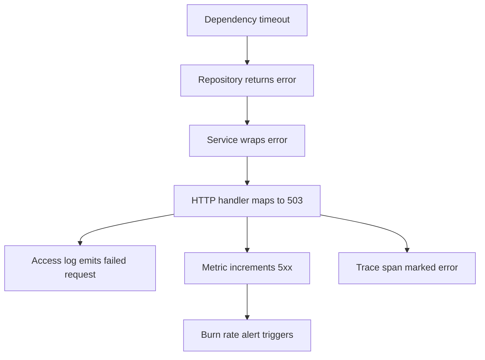
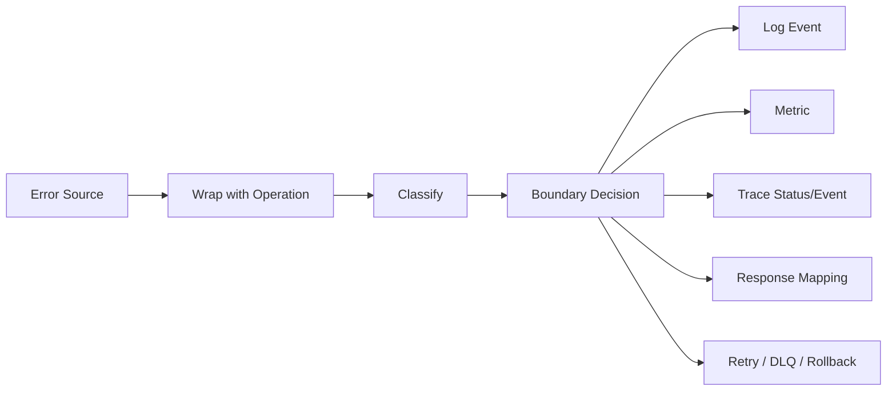
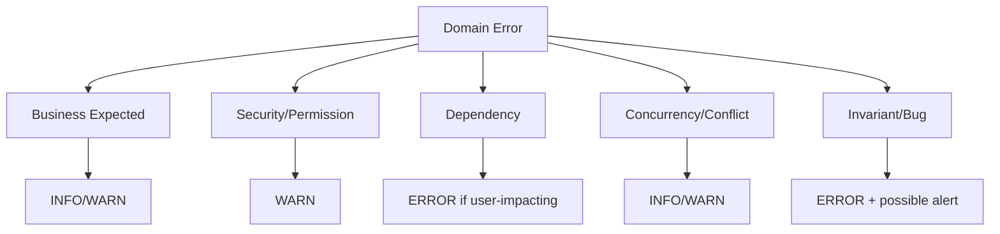
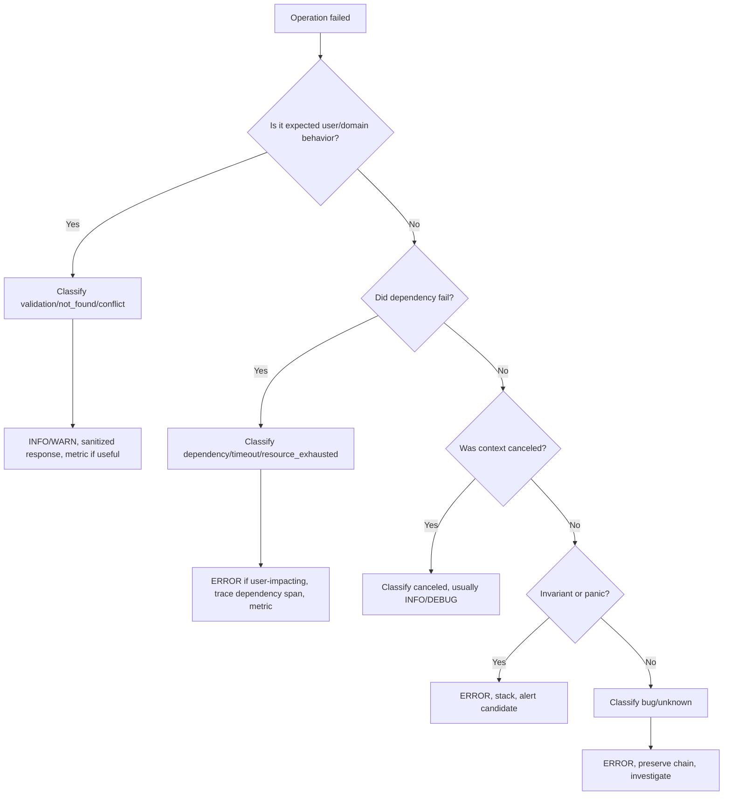

# learn-go-logging-observability-profiling-troubleshooting-part-004.md

# Part 004 — Error Logging, Causality, and Failure Evidence

> Seri: **Go Logging, Observability, Profiling, dan Troubleshooting**  
> Bagian: **004 dari 032**  
> Target pembaca: Java software engineer yang ingin menguasai Go production engineering pada level operational/runtime architecture.

---

## 0. Tujuan Bagian Ini

Di seri error handling sebelumnya, kita sudah membahas error sebagai value, wrapping, sentinel error, typed error, propagation, cancellation, retry, dan reliability semantics.

Bagian ini **tidak mengulang error handling dasar**. Fokusnya adalah:

1. Bagaimana error menjadi **evidence**.
2. Bagaimana log error dibuat agar bisa dipakai investigasi incident.
3. Bagaimana menjaga **causal chain** dari source failure sampai operational symptom.
4. Bagaimana menghindari duplicate logging, noisy logging, dan loss of root cause.
5. Bagaimana membedakan error yang perlu log, metric, trace event, alert, retry, atau panic.
6. Bagaimana membangun taxonomy error untuk service Go production.

Tujuan akhirnya: ketika sistem gagal, engineer tidak hanya tahu “ada error”, tetapi bisa menjawab:

- Apa yang gagal?
- Di boundary mana gagal?
- Karena input, dependency, bug, race, timeout, cancellation, resource exhaustion, atau policy?
- Apakah failure ini expected, degraded, atau invariant violation?
- Apakah perlu alert?
- Apakah bisa retry?
- Apakah user terdampak?
- Apakah root cause masih bisa dilacak dari log/trace/profile?

---

## 1. Mental Model: Error Is Not Automatically a Log

Kesalahan umum engineer yang baru membangun observability adalah menganggap:

```text
error returned => log error
```

Dalam Go production system, ini berbahaya.

Error di Go adalah **control-flow signal**. Log adalah **event evidence**. Metric adalah **aggregated signal**. Trace adalah **causal timeline**. Alert adalah **operator interruption**.

Tidak semua error harus menjadi log.

### 1.1 Error as Value

Error sebagai value berarti fungsi melaporkan bahwa operasi tidak bisa memenuhi kontrak normalnya.

Contoh:

```go
user, err := repo.FindUser(ctx, userID)
if err != nil {
    return nil, fmt.Errorf("find user: %w", err)
}
```

Di sini error belum tentu layak dilog. Ia baru menjadi bagian dari causal chain.

### 1.2 Error as Event

Error menjadi event ketika ia melewati boundary yang penting secara operasional.

Contoh boundary:

- HTTP request selesai gagal.
- gRPC method gagal.
- Message consumer gagal memproses message.
- Batch job gagal.
- Outbound call ke dependency gagal.
- Invariant internal rusak.
- Panic recovered.
- Data corruption terdeteksi.

Di boundary ini, error perlu diterjemahkan menjadi:

- log event,
- metric increment,
- trace span status/event,
- response code,
- retry/dead-letter decision,
- alert signal jika memenuhi kondisi.

### 1.3 Error Is Local; Failure Is Systemic

Error terjadi di satu titik kode. Failure adalah efek sistemik yang bisa merambat.



Log error yang baik tidak hanya mengatakan “error happened”, tetapi memberi posisi error dalam graph failure.

---

## 2. The Core Rule: Log Once at the Operational Boundary

Aturan dasar:

> **Propagate errors through internal layers. Log once when the error crosses an operational boundary.**

Boundary adalah tempat di mana sistem harus membuat keputusan eksternal:

- respond ke client,
- ack/nack message,
- commit/rollback transaction,
- retry dependency,
- stop job,
- crash process,
- degrade feature,
- emit alert signal.

### 2.1 Bad: Log at Every Layer

```go
func loadUser(ctx context.Context, id string) (*User, error) {
    user, err := repo.Get(ctx, id)
    if err != nil {
        slog.Error("failed to get user", "error", err, "user_id", id)
        return nil, err
    }
    return user, nil
}

func handleGetUser(w http.ResponseWriter, r *http.Request) {
    user, err := loadUser(r.Context(), chi.URLParam(r, "id"))
    if err != nil {
        slog.Error("request failed", "error", err)
        http.Error(w, "internal error", http.StatusInternalServerError)
        return
    }
    writeJSON(w, user)
}
```

Masalah:

1. Error yang sama muncul dua kali.
2. Volume log meningkat.
3. On-call bingung mana root event.
4. Alert/log query bisa menghitung error dua kali.
5. Log bawah sering tidak punya full context request.
6. Layer bawah mulai tahu policy logging yang seharusnya milik boundary.

### 2.2 Good: Wrap Internally, Log at Boundary

```go
func loadUser(ctx context.Context, id string) (*User, error) {
    user, err := repo.Get(ctx, id)
    if err != nil {
        return nil, fmt.Errorf("load user %q: %w", id, err)
    }
    return user, nil
}

func handleGetUser(w http.ResponseWriter, r *http.Request) {
    ctx := r.Context()
    requestID := requestIDFrom(ctx)
    userID := chi.URLParam(r, "id")

    user, err := loadUser(ctx, userID)
    if err != nil {
        status, kind := classifyHTTPError(err)

        slog.ErrorContext(ctx, "request failed",
            "request_id", requestID,
            "operation", "get_user",
            "user_id", userID,
            "status", status,
            "error_kind", kind,
            "error", err,
        )

        http.Error(w, http.StatusText(status), status)
        return
    }

    writeJSON(w, user)
}
```

Keuntungan:

- Satu event final.
- Error chain tetap ada.
- Boundary punya context request lengkap.
- Status mapping jelas.
- Metric/tracing bisa konsisten.
- Query log tidak double count.

---

## 3. Error Context vs Log Context

Ada dua jenis context yang sering tercampur:

| Jenis | Tujuan | Bentuk |
|---|---|---|
| Error context | Menjelaskan causal chain program | wrapping, typed error, sentinel error |
| Log context | Menjelaskan operational event | structured fields |

Contoh:

```go
return fmt.Errorf("reserve inventory for order %s: %w", orderID, err)
```

Ini error context. Berguna untuk developer membaca chain.

```go
slog.ErrorContext(ctx, "checkout failed",
    "order_id", orderID,
    "customer_type", customerType,
    "payment_provider", provider,
    "error", err,
)
```

Ini log context. Berguna untuk query, aggregation, correlation, dan incident analysis.

### 3.1 Jangan Masukkan Semua Data ke Error String

Bad:

```go
return fmt.Errorf("failed to call payment provider stripe for order %s tenant %s region %s retry %d latency %s: %w",
    orderID, tenantID, region, retry, latency, err)
```

Masalah:

- Sulit query per field.
- Bisa leak PII/secrets.
- Error string jadi tidak stabil.
- Cardinality tinggi di log aggregation.

Better:

```go
return fmt.Errorf("charge payment: %w", err)
```

Lalu log boundary:

```go
logger.ErrorContext(ctx, "payment charge failed",
    "operation", "charge_payment",
    "provider", provider,
    "order_id", orderID,
    "tenant", tenant,
    "attempt", attempt,
    "latency_ms", latency.Milliseconds(),
    "error", err,
)
```

### 3.2 Error Message Should Be Stable Enough

Error message yang baik:

- menjelaskan operation,
- pendek,
- tidak berisi rahasia,
- tidak terlalu banyak high-cardinality values,
- bisa dibaca manusia.

Structured fields yang baik:

- punya nama stabil,
- punya tipe stabil,
- bisa di-query,
- aman secara privacy/security,
- cardinality terkendali.

---

## 4. Causal Chain: From Root Cause to User Impact

Causal chain adalah rangkaian penjelasan mengapa operasi gagal.

Contoh:

```text
HTTP GET /cases/123
  -> service LoadCase
    -> repository SelectCase
      -> database query timeout
```

Dalam Go, causal chain biasanya dibangun dengan wrapping:

```go
func (r *CaseRepository) Find(ctx context.Context, id string) (*Case, error) {
    row := r.db.QueryRowContext(ctx, query, id)

    var c Case
    if err := row.Scan(&c.ID, &c.Status); err != nil {
        return nil, fmt.Errorf("scan case row: %w", err)
    }
    return &c, nil
}

func (s *CaseService) Load(ctx context.Context, id string) (*Case, error) {
    c, err := s.repo.Find(ctx, id)
    if err != nil {
        return nil, fmt.Errorf("load case: %w", err)
    }
    return c, nil
}
```

Boundary log:

```go
logger.ErrorContext(ctx, "case request failed",
    "operation", "load_case",
    "case_id", caseID,
    "http_route", "/cases/{id}",
    "http_method", "GET",
    "status", 500,
    "error", err,
)
```

Possible output:

```json
{
  "time":"2026-06-23T10:00:00Z",
  "level":"ERROR",
  "msg":"case request failed",
  "operation":"load_case",
  "case_id":"123",
  "http_route":"/cases/{id}",
  "http_method":"GET",
  "status":500,
  "error":"load case: scan case row: context deadline exceeded"
}
```

Ini sudah lebih baik dari `failed` saja. Tetapi untuk top-level operation, kita masih perlu classification.

---

## 5. Error Classification: The Missing Layer

Tanpa classification, semua error terlihat sama.

Production system butuh taxonomy seperti:

| Class | Meaning | User impact | Retry? | Log level | HTTP |
|---|---|---:|---:|---|---:|
| `validation` | Input invalid | Yes, client-side | No | INFO/WARN | 400 |
| `not_found` | Resource tidak ada | Usually expected | No | INFO | 404 |
| `conflict` | State conflict | Yes | Maybe | INFO/WARN | 409 |
| `unauthorized` | Not authenticated | Yes | No | WARN | 401 |
| `forbidden` | Not permitted | Yes | No | WARN | 403 |
| `timeout` | Deadline exceeded | Yes | Maybe | WARN/ERROR | 504/503 |
| `canceled` | Caller canceled | Usually no | No | DEBUG/INFO | 499/none |
| `dependency` | Dependency failed | Yes | Maybe | ERROR | 502/503 |
| `resource_exhausted` | Pool/memory/queue full | Yes | Maybe | ERROR | 429/503 |
| `invariant_violation` | Internal impossible state | Yes | No | ERROR | 500 |
| `bug` | Programming defect | Yes | No | ERROR | 500 |
| `panic` | Unhandled crash path | Yes | No | ERROR/CRITICAL | 500 |

### 5.1 Typed Classification Wrapper

A lightweight approach:

```go
package failure

type Kind string

const (
    KindValidation         Kind = "validation"
    KindNotFound           Kind = "not_found"
    KindConflict           Kind = "conflict"
    KindUnauthorized       Kind = "unauthorized"
    KindForbidden          Kind = "forbidden"
    KindTimeout            Kind = "timeout"
    KindCanceled           Kind = "canceled"
    KindDependency         Kind = "dependency"
    KindResourceExhausted  Kind = "resource_exhausted"
    KindInvariantViolation Kind = "invariant_violation"
    KindBug                Kind = "bug"
)

type Error struct {
    Kind Kind
    Op   string
    Err  error
}

func (e *Error) Error() string {
    if e.Op == "" {
        return string(e.Kind) + ": " + e.Err.Error()
    }
    return e.Op + ": " + string(e.Kind) + ": " + e.Err.Error()
}

func (e *Error) Unwrap() error { return e.Err }

func Wrap(kind Kind, op string, err error) error {
    if err == nil {
        return nil
    }
    return &Error{Kind: kind, Op: op, Err: err}
}

func KindOf(err error) Kind {
    if err == nil {
        return ""
    }

    var e *Error
    if errors.As(err, &e) {
        return e.Kind
    }

    if errors.Is(err, context.Canceled) {
        return KindCanceled
    }
    if errors.Is(err, context.DeadlineExceeded) {
        return KindTimeout
    }

    return KindBug
}
```

Usage:

```go
func (s *PaymentService) Charge(ctx context.Context, req ChargeRequest) error {
    if req.Amount <= 0 {
        return failure.Wrap(failure.KindValidation, "validate charge request", ErrInvalidAmount)
    }

    if err := s.gateway.Charge(ctx, req); err != nil {
        return failure.Wrap(failure.KindDependency, "charge payment gateway", err)
    }

    return nil
}
```

Boundary:

```go
if err != nil {
    kind := failure.KindOf(err)
    status := statusFromFailureKind(kind)
    level := levelFromFailureKind(kind)

    logger.LogAttrs(ctx, level, "request failed",
        slog.String("operation", "charge_payment"),
        slog.String("error_kind", string(kind)),
        slog.Int("status", status),
        slog.Any("error", err),
    )
}
```

### 5.2 Why Classification Matters

Classification memungkinkan:

- consistent HTTP status,
- consistent retry policy,
- consistent log level,
- consistent metric label,
- consistent trace status,
- consistent alert filtering,
- better incident triage.

Tanpa classification, engineer hanya melihat `error != nil`.

---

## 6. Severity Is Not the Same as Error Type

Kesalahan umum:

```text
all errors => ERROR level
```

Tidak benar.

Severity bergantung pada **operator actionability** dan **unexpectedness**.

### 6.1 Example Severity Mapping

| Situation | Recommended level | Reason |
|---|---|---|
| User submits invalid form | INFO/DEBUG | Expected client behavior |
| User accesses missing resource | INFO | Often normal |
| Unauthorized request burst | WARN | Security-relevant pattern |
| Dependency timeout causing request failure | ERROR | User-impacting dependency failure |
| Context canceled because client disconnected | DEBUG/INFO | Not necessarily service failure |
| Retried dependency call failed but final attempt succeeds | WARN/DEBUG | Useful if sampled/aggregated |
| Invariant violation | ERROR | Internal correctness problem |
| Panic recovered | ERROR/CRITICAL | Bug or unsafe unexpected state |
| Background job permanently failed | ERROR | Operational intervention likely |
| Queue message moved to DLQ | ERROR | Business process intervention likely |

### 6.2 ERROR Means “Something We May Need to Operate”

A good rule:

> Use `ERROR` when the system failed to fulfill its responsibility in a way that may require engineering/operator attention.

Do not use `ERROR` for every invalid user input.

### 6.3 WARN Means “Abnormal but handled”

Examples:

- retryable dependency failure but request still succeeds,
- slow operation near timeout,
- invalid external message that is skipped,
- rate limit applied,
- partial degradation.

### 6.4 INFO Means “Business/operational milestone”

Examples:

- service started,
- request completed if access logs are enabled,
- job completed,
- config loaded,
- deployment metadata,
- important state transition.

### 6.5 DEBUG Means “Diagnostic detail”

Examples:

- branch decision,
- cache hit/miss if low volume,
- retry internal detail,
- payload summary in non-production.

DEBUG should not be required to understand normal production incident. DEBUG is for deeper investigation.

---

## 7. Context Cancellation and Deadline Errors

In Go, `context.Canceled` and `context.DeadlineExceeded` are operationally important but often misunderstood.

### 7.1 `context.Canceled`

Means the context was canceled. Common causes:

- client disconnected,
- caller stopped waiting,
- parent operation canceled,
- shutdown initiated,
- fan-out branch canceled because another branch succeeded/failed.

Not always an error worth logging at ERROR.

Example:

```go
if errors.Is(err, context.Canceled) {
    logger.InfoContext(ctx, "request canceled",
        "operation", op,
        "reason", "context_canceled",
    )
    return
}
```

But beware: context cancellation can hide internal bugs if the service cancels too aggressively.

### 7.2 `context.DeadlineExceeded`

Means deadline expired. This is usually more important.

Possible causes:

- downstream slow,
- DB query slow,
- connection pool saturated,
- CPU starvation,
- lock contention,
- GC pressure,
- network problem,
- timeout budget too low,
- retry consumed budget.

Log classification should distinguish:

```text
context deadline exceeded at which boundary?
```

Bad:

```json
{"level":"ERROR","msg":"failed","error":"context deadline exceeded"}
```

Better:

```json
{
  "level":"ERROR",
  "msg":"outbound dependency call failed",
  "operation":"fetch_customer_profile",
  "dependency":"customer-service",
  "timeout_ms":800,
  "elapsed_ms":801,
  "error_kind":"timeout",
  "error":"fetch profile: context deadline exceeded"
}
```

### 7.3 Deadline Budget Logging

For advanced troubleshooting, log both configured budget and elapsed time at boundary.

```go
start := time.Now()
err := call(ctx)
elapsed := time.Since(start)

if err != nil {
    logger.WarnContext(ctx, "dependency call failed",
        "dependency", "risk-engine",
        "elapsed_ms", elapsed.Milliseconds(),
        "timeout_ms", timeout.Milliseconds(),
        "error_kind", failure.KindOf(err),
        "error", err,
    )
}
```

This makes timeout incidents debuggable.

---

## 8. Retriable vs Non-Retriable Errors

Retries are operational decisions. Logging must reveal retry behavior without flooding logs.

### 8.1 Error Classification for Retry

| Error kind | Retry? | Notes |
|---|---:|---|
| validation | No | Client must fix input |
| not_found | Usually no | Unless eventual consistency expected |
| conflict | Maybe | State transition conflict may retry |
| timeout | Maybe | With budget and idempotency |
| canceled | No | Caller stopped waiting |
| dependency | Maybe | Depends on status and idempotency |
| resource_exhausted | Maybe | Backoff required |
| invariant_violation | No | Bug/data corruption |
| panic | No | Bug |

### 8.2 Log Final Outcome, Not Every Attempt by Default

Bad:

```text
ERROR attempt 1 failed
ERROR attempt 2 failed
ERROR attempt 3 failed
ERROR request failed
```

Better:

- DEBUG per attempt if needed,
- WARN for intermediate retries if abnormal and sampled,
- ERROR once when final outcome fails.

Example:

```go
for attempt := 1; attempt <= maxAttempts; attempt++ {
    err := call(ctx)
    if err == nil {
        if attempt > 1 {
            logger.WarnContext(ctx, "dependency call succeeded after retry",
                "dependency", dep,
                "attempts", attempt,
            )
        }
        return nil
    }

    lastErr = err
    if !isRetriable(err) {
        break
    }

    logger.DebugContext(ctx, "dependency call attempt failed",
        "dependency", dep,
        "attempt", attempt,
        "max_attempts", maxAttempts,
        "error_kind", failure.KindOf(err),
        "error", err,
    )

    sleep(backoff(attempt))
}

return fmt.Errorf("call dependency %s after %d attempts: %w", dep, maxAttempts, lastErr)
```

Boundary log:

```go
logger.ErrorContext(ctx, "request failed after dependency retries",
    "dependency", dep,
    "attempts", maxAttempts,
    "error_kind", failure.KindOf(err),
    "error", err,
)
```

### 8.3 Retry Logs Must Include Budget

Important fields:

- `attempt`
- `max_attempts`
- `backoff_ms`
- `elapsed_ms`
- `remaining_budget_ms`
- `idempotent`
- `dependency`
- `error_kind`

Without these, retry logs often fail to explain retry storm.

---

## 9. Panic Logging and Recovery

Panic is not ordinary error handling. Panic means the program reached a state it did not safely expect to handle through normal return values.

### 9.1 When Panic Is Acceptable

In production service code, panic may be acceptable for:

- startup configuration invariant failure,
- impossible programmer error in internal library,
- unrecoverable corruption,
- fail-fast when continuing would be unsafe.

Panic is usually not acceptable for:

- invalid user input,
- dependency timeout,
- database error,
- file not found,
- normal business validation.

### 9.2 HTTP Panic Recovery Boundary

```go
type statusRecorder struct {
    http.ResponseWriter
    status int
}

func (r *statusRecorder) WriteHeader(code int) {
    r.status = code
    r.ResponseWriter.WriteHeader(code)
}

func RecoverMiddleware(logger *slog.Logger) func(http.Handler) http.Handler {
    return func(next http.Handler) http.Handler {
        return http.HandlerFunc(func(w http.ResponseWriter, r *http.Request) {
            ctx := r.Context()

            defer func() {
                if rec := recover(); rec != nil {
                    logger.ErrorContext(ctx, "panic recovered",
                        "operation", "http_request",
                        "http_method", r.Method,
                        "http_route", routePattern(r),
                        "panic", rec,
                        "stack", stackTrace(),
                    )
                    http.Error(w, http.StatusText(http.StatusInternalServerError), http.StatusInternalServerError)
                }
            }()

            next.ServeHTTP(w, r)
        })
    }
}
```

Stack helper:

```go
func stackTrace() string {
    buf := make([]byte, 64<<10)
    n := runtime.Stack(buf, false)
    return string(buf[:n])
}
```

### 9.3 Panic Logging Fields

Use fields:

- `panic`
- `stack`
- `operation`
- `component`
- `request_id`
- `trace_id`
- `http_route`
- `http_method`
- `tenant` if safe
- `version`
- `instance`

Do not include raw request body unless explicitly safe, bounded, redacted, and necessary.

### 9.4 Panic Recovery Is Not a Fix

Recovery keeps the process alive. It does not make the state safe.

For severe invariants, the right action may be:

- log panic,
- flush telemetry,
- let process crash,
- rely on supervisor/Kubernetes restart.

Recovering every panic globally can hide corruption.

---

## 10. Stack Traces: Useful but Expensive Signal

Go errors do not automatically carry stack trace. You must decide when stack is needed.

### 10.1 When Stack Helps

Stack helps when:

- panic recovered,
- invariant violation,
- unexpected nil pointer path,
- data corruption,
- rare internal bug,
- unknown error class,
- investigation requires source location.

### 10.2 When Stack Is Noise

Stack is often noise for:

- validation error,
- not found,
- auth failure,
- normal timeout,
- expected conflict,
- context cancellation.

### 10.3 Stack Trace Strategy

A practical strategy:

| Situation | Stack? |
|---|---:|
| Panic | Yes |
| Invariant violation | Yes |
| Unknown bug-class error | Maybe sampled |
| Dependency timeout | Usually no |
| Validation | No |
| Not found | No |
| Context canceled | No |

### 10.4 Avoid Stack in Hot Path

Capturing stack frequently can be expensive and verbose. Do not attach stack to every error creation by default unless you understand the cost and volume.

---

## 11. Trace Events vs Error Logs

In a traced system, not every error needs both a detailed log and a detailed trace event.

### 11.1 Trace Span Status

For request failure, mark span status as error and attach relevant attributes.

Pseudo-example:

```go
span := trace.SpanFromContext(ctx)
if err != nil {
    span.RecordError(err)
    span.SetStatus(codes.Error, failure.KindOf(err).String())
}
```

### 11.2 Log/Trace Correlation

The log should include trace identifiers when possible:

```json
{
  "level":"ERROR",
  "msg":"request failed",
  "trace_id":"4bf92f3577b34da6a3ce929d0e0e4736",
  "span_id":"00f067aa0ba902b7",
  "error_kind":"dependency",
  "error":"charge payment: gateway timeout"
}
```

This lets the operator jump from log to trace.

### 11.3 Decision Rule

Use:

- **log** for durable event evidence and search,
- **trace** for causal timeline,
- **metric** for aggregate behavior,
- **profile** for runtime cost.

Do not force one signal to do all jobs.

---

## 12. Metrics for Errors

Logs tell individual stories. Metrics tell population behavior.

### 12.1 Error Metric Design

Example counter:

```text
http_server_requests_total{route="/cases/{id}", method="GET", status="500"}
```

Or separate application error metric:

```text
app_operation_errors_total{operation="load_case", error_kind="dependency"}
```

### 12.2 Cardinality Warning

Never use raw error message as metric label.

Bad:

```text
errors_total{error="load user 123 failed: timeout"}
```

Good:

```text
errors_total{operation="load_user", error_kind="timeout"}
```

### 12.3 Error Metrics Should Align With Classification

The same `error_kind` should appear in:

- logs,
- metrics,
- traces,
- dashboards,
- alert rules,
- runbooks.

This creates operational coherence.

---

## 13. Building an Error-to-Observability Pipeline

Think in pipeline form:



The boundary decision is where semantics become operational.

### 13.1 Boundary Decision Matrix

| Question | Example |
|---|---|
| What operation failed? | `approve_case` |
| Who called it? | HTTP/gRPC/worker/job |
| What was the failure kind? | `dependency_timeout` |
| What was the external effect? | HTTP 503 |
| Was it retried? | 3 attempts |
| Was state changed? | transaction rolled back |
| Is it user-caused? | no |
| Is it alertable? | if rate exceeds SLO |
| Is it safe to expose? | expose generic message only |
| Is it correlated? | request_id/trace_id present |

---

## 14. HTTP Error Mapping

A production HTTP service needs a consistent mapping from internal error semantics to HTTP response and observability fields.

### 14.1 Example Mapping

```go
func statusFromFailureKind(kind failure.Kind) int {
    switch kind {
    case failure.KindValidation:
        return http.StatusBadRequest
    case failure.KindNotFound:
        return http.StatusNotFound
    case failure.KindConflict:
        return http.StatusConflict
    case failure.KindUnauthorized:
        return http.StatusUnauthorized
    case failure.KindForbidden:
        return http.StatusForbidden
    case failure.KindTimeout:
        return http.StatusGatewayTimeout
    case failure.KindDependency:
        return http.StatusServiceUnavailable
    case failure.KindResourceExhausted:
        return http.StatusTooManyRequests
    case failure.KindCanceled:
        return 499 // non-standard; often used internally for client closed request
    default:
        return http.StatusInternalServerError
    }
}
```

### 14.2 Public Error Response Must Be Sanitized

Internal log:

```json
{
  "error":"load case: query primary oracle: ORA-00054 resource busy and acquire with NOWAIT specified",
  "case_id":"CASE-123",
  "error_kind":"dependency"
}
```

Public response:

```json
{
  "error": {
    "code": "SERVICE_UNAVAILABLE",
    "message": "The service is temporarily unavailable.",
    "request_id": "req-abc"
  }
}
```

Never expose:

- SQL query internals,
- table names if sensitive,
- stack traces,
- secret values,
- full dependency hostnames if internal,
- raw upstream error body.

### 14.3 Log Status and Response Code Together

At HTTP boundary, log:

- `status`
- `error_kind`
- `operation`
- `route`
- `method`
- `duration_ms`
- `request_id`
- `trace_id`

This enables queries like:

```text
error_kind=dependency AND route=/cases/{id} AND status=503
```

---

## 15. Worker and Queue Error Logging

Message consumers have different semantics than HTTP handlers.

An error does not map to HTTP status. It maps to:

- ack,
- nack,
- retry,
- requeue,
- delay,
- dead-letter,
- poison message,
- idempotency conflict,
- partial side effect.

### 15.1 Worker Error Event Fields

Recommended fields:

- `worker`
- `queue`
- `message_id`
- `message_type`
- `operation`
- `attempt`
- `max_attempts`
- `ack_decision`
- `retry_delay_ms`
- `dlq`
- `error_kind`
- `error`
- `trace_id` if propagated
- `tenant` if safe

### 15.2 Example

```go
func (c *Consumer) Handle(ctx context.Context, msg Message) error {
    err := c.process(ctx, msg)
    if err == nil {
        c.logger.InfoContext(ctx, "message processed",
            "queue", msg.Queue,
            "message_type", msg.Type,
            "message_id", msg.ID,
        )
        return nil
    }

    kind := failure.KindOf(err)
    decision := c.retryPolicy.Decide(msg.Attempt, kind)

    c.logger.LogAttrs(ctx, levelForDecision(decision), "message processing failed",
        slog.String("queue", msg.Queue),
        slog.String("message_type", msg.Type),
        slog.String("message_id", msg.ID),
        slog.Int("attempt", msg.Attempt),
        slog.String("ack_decision", string(decision.Action)),
        slog.String("error_kind", string(kind)),
        slog.Any("error", err),
    )

    return decision.Apply(err)
}
```

### 15.3 Poison Message vs System Failure

Distinguish:

| Failure | Meaning | Action |
|---|---|---|
| Poison message | Message invalid forever | DLQ, alert if rate high |
| Temporary dependency failure | Retry later | backoff/requeue |
| Invariant violation | Code/data bug | DLQ + alert |
| Context canceled shutdown | Consumer stopping | requeue or graceful stop |
| Duplicate message | Idempotency expected | ack/idempotent no-op |

Worker logs without this classification are almost useless during incidents.

---

## 16. Background Job Error Logging

Background jobs are often under-observed.

A job should emit lifecycle events:

1. job started,
2. checkpoint/milestone,
3. recoverable failure,
4. final failure,
5. job completed,
6. job canceled,
7. job skipped.

### 16.1 Job Fields

- `job_name`
- `job_run_id`
- `schedule`
- `trigger`
- `started_at`
- `duration_ms`
- `records_total`
- `records_processed`
- `records_failed`
- `checkpoint`
- `error_kind`
- `error`

### 16.2 Example

```go
runID := uuid.NewString()
start := time.Now()

logger.InfoContext(ctx, "job started",
    "job_name", "rebuild_case_index",
    "job_run_id", runID,
)

processed, err := job.Run(ctx)
if err != nil {
    logger.ErrorContext(ctx, "job failed",
        "job_name", "rebuild_case_index",
        "job_run_id", runID,
        "duration_ms", time.Since(start).Milliseconds(),
        "records_processed", processed,
        "error_kind", failure.KindOf(err),
        "error", err,
    )
    return err
}

logger.InfoContext(ctx, "job completed",
    "job_name", "rebuild_case_index",
    "job_run_id", runID,
    "duration_ms", time.Since(start).Milliseconds(),
    "records_processed", processed,
)
```

---

## 17. Duplicate Error Logging Patterns

Duplicate logging is one of the biggest sources of production noise.

### 17.1 The Three Common Duplicates

#### Duplicate 1: Repository + Service + Handler

```text
repository logs DB error
service logs service failure
handler logs request failure
```

Fix: repository wraps, service wraps/classifies, handler logs.

#### Duplicate 2: Retry Attempt + Final Failure

```text
attempt 1 ERROR
attempt 2 ERROR
attempt 3 ERROR
final ERROR
```

Fix: attempts DEBUG/sampled WARN, final ERROR.

#### Duplicate 3: Middleware + Handler

```text
handler logs request failed
access middleware logs request failed as error too
```

Fix: access log is completion event; application error log contains cause. Or combine deliberately.

### 17.2 When Duplicate-Looking Logs Are Acceptable

Sometimes two logs for same failure are valid if they represent different events:

- outbound dependency failure,
- inbound request failure.

Example:

```text
WARN dependency call failed dependency=risk-engine operation=score_case
ERROR request failed operation=approve_case error_kind=dependency
```

This is acceptable if:

- dependency log is at dependency boundary,
- request log is at user boundary,
- both have same trace ID,
- they answer different questions,
- volume is controlled.

---

## 18. Error Logging and Transactions

Transaction boundaries are observability boundaries.

Important questions:

- Did the transaction begin?
- Did it commit?
- Did it rollback?
- Was rollback successful?
- Was there partial external side effect?

### 18.1 Transaction Failure Pattern

```go
tx, err := db.BeginTx(ctx, nil)
if err != nil {
    return failure.Wrap(failure.KindDependency, "begin transaction", err)
}

committed := false
defer func() {
    if !committed {
        if rbErr := tx.Rollback(); rbErr != nil && !errors.Is(rbErr, sql.ErrTxDone) {
            logger.ErrorContext(ctx, "transaction rollback failed",
                "operation", "approve_case",
                "error", rbErr,
            )
        }
    }
}()

if err := updateCase(ctx, tx, caseID); err != nil {
    return fmt.Errorf("update case in transaction: %w", err)
}

if err := tx.Commit(); err != nil {
    return failure.Wrap(failure.KindDependency, "commit transaction", err)
}
committed = true
return nil
```

### 18.2 Logging Rollback Failure

Rollback failure is a separate operational event because it may indicate connection failure or uncertain transaction state.

It may deserve its own ERROR log even if outer boundary also logs request failure.

Why? Because rollback failure answers a different question:

```text
Do we know the state is clean?
```

---

## 19. Error Logging and Idempotency

Idempotency affects severity and action.

Example: duplicate request.

```text
payment request with same idempotency key already processed
```

This may be INFO, not ERROR.

Fields:

- `idempotency_key_hash`
- `operation`
- `existing_result`
- `decision`

Do not log raw idempotency key if it is sensitive.

### 19.1 Idempotency Conflict

```go
if errors.Is(err, ErrDuplicateIdempotencyKey) {
    logger.InfoContext(ctx, "duplicate idempotency key",
        "operation", "create_payment",
        "idempotency_key_hash", hashKey(key),
        "decision", "return_existing_result",
    )
    return existingResult, nil
}
```

---

## 20. Error Logging and Security

Error logs are a common data leakage path.

### 20.1 Never Log These Raw

- password,
- token,
- authorization header,
- cookie,
- private key,
- OTP,
- full session ID,
- full national ID / personal identifier,
- raw request body with PII,
- raw database connection string,
- raw upstream response containing sensitive data.

### 20.2 Redaction by Type

Use domain types that control their own log representation.

```go
type SecretString string

func (s SecretString) LogValue() slog.Value {
    return slog.StringValue("[REDACTED]")
}
```

Then:

```go
logger.ErrorContext(ctx, "auth failed",
    "username", username,
    "token", SecretString(token),
    "error", err,
)
```

### 20.3 Error String Can Leak

Some dependency errors include raw values.

Example:

```text
failed login for token abc123
```

If upstream/library error may leak, sanitize before logging or wrap with safe message and put unsafe details only in protected debug evidence if policy allows.

---

## 21. Error Logging and Cardinality

High-cardinality fields make log systems expensive and hard to query.

### 21.1 Cardinality Risk Fields

| Field | Risk |
|---|---|
| `user_id` | High but sometimes necessary |
| `request_id` | Very high, use for correlation not aggregation |
| `trace_id` | Very high, use for correlation |
| `error` | Very high if raw message varies |
| `url` | High if raw path contains IDs/query |
| `sql` | High + sensitive |
| `stack` | Very high |
| `payload` | Very high + sensitive |

### 21.2 Use Route Pattern, Not Raw URL

Bad:

```json
{"path":"/cases/CASE-2026-000001/documents/998812"}
```

Good:

```json
{"http_route":"/cases/{case_id}/documents/{document_id}"}
```

### 21.3 Use Error Kind for Aggregation

Bad aggregation:

```text
group by error
```

Good aggregation:

```text
group by error_kind, operation, dependency, route
```

---

## 22. Domain Error Taxonomy for Regulatory/Case Systems

For complex case management/regulatory systems, a useful taxonomy is richer than generic HTTP errors.

Example:

| Domain failure kind | Meaning |
|---|---|
| `invalid_transition` | State machine transition not allowed |
| `missing_required_evidence` | Required document/evidence absent |
| `approval_conflict` | Concurrent approval/update conflict |
| `deadline_expired` | Regulatory/process deadline exceeded |
| `case_locked` | Case locked by another process/user |
| `permission_denied` | Actor lacks permission |
| `external_registry_unavailable` | External agency/dependency unavailable |
| `document_integrity_failed` | Hash/signature/integrity check failed |
| `notification_delivery_failed` | Email/SMS/letter delivery failed |
| `audit_write_failed` | Audit trail write failed |
| `policy_evaluation_failed` | Rule/policy engine failed |
| `data_invariant_violation` | Internal data impossible state |

These can map to technical categories:



### 22.1 Why Domain Taxonomy Matters

Generic error kind:

```json
{"error_kind":"conflict"}
```

Domain-enriched error:

```json
{
  "error_kind":"conflict",
  "domain_error":"invalid_transition",
  "case_status":"SUBMITTED",
  "requested_transition":"APPROVE"
}
```

This gives far better evidence for workflow-heavy systems.

---

## 23. A Reference Error Package for Observability

Below is a minimal but production-oriented pattern.

```go
package failure

import (
    "context"
    "errors"
    "fmt"
)

type Kind string

const (
    Validation         Kind = "validation"
    NotFound           Kind = "not_found"
    Conflict           Kind = "conflict"
    Unauthorized       Kind = "unauthorized"
    Forbidden          Kind = "forbidden"
    Timeout            Kind = "timeout"
    Canceled           Kind = "canceled"
    Dependency         Kind = "dependency"
    ResourceExhausted  Kind = "resource_exhausted"
    InvariantViolation Kind = "invariant_violation"
    Bug                Kind = "bug"
)

type Error struct {
    Kind   Kind
    Op     string
    Domain string
    Cause  error
}

func (e *Error) Error() string {
    if e == nil {
        return "<nil>"
    }
    if e.Op == "" {
        return fmt.Sprintf("%s: %v", e.Kind, e.Cause)
    }
    return fmt.Sprintf("%s: %s: %v", e.Op, e.Kind, e.Cause)
}

func (e *Error) Unwrap() error {
    if e == nil {
        return nil
    }
    return e.Cause
}

func Wrap(kind Kind, op string, err error) error {
    if err == nil {
        return nil
    }
    return &Error{Kind: kind, Op: op, Cause: err}
}

func WrapDomain(kind Kind, domain, op string, err error) error {
    if err == nil {
        return nil
    }
    return &Error{Kind: kind, Domain: domain, Op: op, Cause: err}
}

func Of(kind Kind, msg string) error {
    return &Error{Kind: kind, Cause: errors.New(msg)}
}

func KindOf(err error) Kind {
    if err == nil {
        return ""
    }

    var e *Error
    if errors.As(err, &e) && e.Kind != "" {
        return e.Kind
    }

    switch {
    case errors.Is(err, context.Canceled):
        return Canceled
    case errors.Is(err, context.DeadlineExceeded):
        return Timeout
    default:
        return Bug
    }
}

func DomainOf(err error) string {
    var e *Error
    if errors.As(err, &e) {
        return e.Domain
    }
    return ""
}
```

### 23.1 Boundary Adapter

```go
func logFailure(ctx context.Context, logger *slog.Logger, msg string, err error, attrs ...slog.Attr) {
    kind := failure.KindOf(err)
    level := levelFromKind(kind)

    base := []slog.Attr{
        slog.String("error_kind", string(kind)),
        slog.Any("error", err),
    }

    if domain := failure.DomainOf(err); domain != "" {
        base = append(base, slog.String("domain_error", domain))
    }

    base = append(base, attrs...)
    logger.LogAttrs(ctx, level, msg, base...)
}
```

This keeps error classification consistent.

---

## 24. Complete Example: HTTP Handler with Classification

```go
func (h *Handler) ApproveCase(w http.ResponseWriter, r *http.Request) {
    ctx := r.Context()
    start := time.Now()

    caseID := chi.URLParam(r, "caseID")
    actorID := actorIDFrom(ctx)

    err := h.service.ApproveCase(ctx, caseID, actorID)
    duration := time.Since(start)

    if err != nil {
        kind := failure.KindOf(err)
        status := statusFromKind(kind)
        level := levelFromKind(kind)

        h.logger.LogAttrs(ctx, level, "case approval failed",
            slog.String("operation", "approve_case"),
            slog.String("case_id", caseID),
            slog.String("actor_id", actorID),
            slog.String("error_kind", string(kind)),
            slog.String("domain_error", failure.DomainOf(err)),
            slog.Int("status", status),
            slog.Int64("duration_ms", duration.Milliseconds()),
            slog.Any("error", err),
        )

        h.metrics.OperationErrors.WithLabelValues("approve_case", string(kind)).Inc()
        h.metrics.HTTPRequests.WithLabelValues("POST", "/cases/{caseID}/approve", strconv.Itoa(status)).Inc()

        writeError(w, status, publicError(kind, requestIDFrom(ctx)))
        return
    }

    h.logger.InfoContext(ctx, "case approved",
        "operation", "approve_case",
        "case_id", caseID,
        "actor_id", actorID,
        "duration_ms", duration.Milliseconds(),
    )

    w.WriteHeader(http.StatusNoContent)
}
```

Key points:

- service returns semantic error,
- handler logs once,
- status is derived from kind,
- metric uses bounded labels,
- public response sanitized,
- operation field stable.

---

## 25. Anti-Patterns

### 25.1 Log and Return Everywhere

```go
if err != nil {
    logger.Error("failed", "error", err)
    return err
}
```

This creates duplicate logs and unclear ownership.

### 25.2 Error Without Operation

```go
return err
```

At boundary, operator sees:

```text
context deadline exceeded
```

But not what timed out.

### 25.3 Logging Raw Payload on Error

```go
logger.Error("invalid request", "body", string(body), "error", err)
```

This risks PII/secrets and huge logs.

### 25.4 Error Message as Metric Label

```go
errorsTotal.WithLabelValues(err.Error()).Inc()
```

This can destroy metrics backend cardinality.

### 25.5 All Client Errors as ERROR

Invalid user input is usually not service failure.

### 25.6 Swallowing Root Cause

```go
return errors.New("failed to approve case")
```

This discards the cause.

### 25.7 Exposing Internal Error to Client

```go
http.Error(w, err.Error(), 500)
```

This leaks internals.

### 25.8 Panic for Business Rule

```go
if !canApprove(caseStatus) {
    panic("invalid transition")
}
```

Invalid transition should be domain error, not panic.

### 25.9 Missing Correlation ID

Error logs without request/trace correlation force manual guessing.

### 25.10 Stack Trace Everywhere

Stack traces on expected errors create noise and cost.

---

## 26. Troubleshooting Decision Tree



---

## 27. Production Checklist

For every service, validate:

### 27.1 Error Semantics

- [ ] There is an error taxonomy.
- [ ] Errors are classified consistently.
- [ ] `context.Canceled` and `context.DeadlineExceeded` are handled distinctly.
- [ ] Domain errors are distinguishable from system errors.
- [ ] Dependency errors are distinguishable from internal bugs.

### 27.2 Logging Discipline

- [ ] Internal layers wrap errors instead of logging repeatedly.
- [ ] Operational boundaries log final failure.
- [ ] Logs include stable `operation`.
- [ ] Logs include `error_kind`.
- [ ] Logs include request/trace correlation.
- [ ] Logs avoid raw payloads and secrets.
- [ ] Stack traces are limited to panic/invariant/unknown bug paths.

### 27.3 Metrics and Traces

- [ ] Error metrics use bounded labels.
- [ ] Error kind labels align with log taxonomy.
- [ ] Failed spans record error status.
- [ ] Logs can be correlated to traces.

### 27.4 Boundary Behavior

- [ ] HTTP status mapping is consistent.
- [ ] Public error responses are sanitized.
- [ ] Worker ack/retry/DLQ decisions are logged.
- [ ] Job lifecycle logs include final outcome.
- [ ] Transaction rollback failure is visible.

### 27.5 Incident Readiness

- [ ] On-call can answer what failed from one boundary log.
- [ ] On-call can group errors by operation/kind/dependency.
- [ ] On-call can distinguish client noise from service failure.
- [ ] On-call can detect retry storm from logs/metrics.
- [ ] On-call can identify panic/invariant violations quickly.

---

## 28. Exercises

### Exercise 1 — Refactor Duplicate Logging

Given code where repository, service, and handler all log the same DB error:

1. Remove duplicate lower-layer logs.
2. Add error wrapping.
3. Add boundary logging.
4. Add `error_kind`.
5. Add sanitized HTTP response.

Expected result:

- one final error log per failed request,
- causal chain preserved,
- status code consistent.

### Exercise 2 — Design Error Taxonomy

For a case management module, define taxonomy for:

- invalid transition,
- missing attachment,
- duplicate submission,
- permission denied,
- external registry timeout,
- audit write failure,
- notification delivery failure,
- optimistic locking conflict.

For each, define:

- technical kind,
- domain error,
- log level,
- HTTP status,
- retry decision,
- alertability.

### Exercise 3 — Timeout Investigation Log

Create logging for outbound HTTP call that includes:

- dependency,
- operation,
- elapsed time,
- timeout budget,
- retry attempt,
- error kind,
- final decision.

### Exercise 4 — Worker Failure Logging

Create a queue consumer error logging design for:

- transient dependency failure,
- poison message,
- duplicate message,
- DLQ decision,
- shutdown cancellation.

### Exercise 5 — Panic Recovery Policy

Define when your service should:

- recover and continue,
- recover and terminate,
- not recover,
- include stack trace,
- emit alert.

---

## 29. Key Takeaways

1. Error is not automatically a log.
2. Log once at the operational boundary.
3. Internal layers should preserve cause, not create noise.
4. Error context and log context are different.
5. Production systems need error classification.
6. Severity depends on actionability and unexpectedness.
7. `context.Canceled` and `context.DeadlineExceeded` mean different things operationally.
8. Retry logs must show attempts and budget without flooding logs.
9. Panic recovery is an observability boundary, not a correctness fix.
10. Stack traces are valuable but should be selective.
11. Error metrics need bounded labels.
12. Logs, metrics, and traces must share the same taxonomy.
13. Public error responses must be sanitized.
14. Worker errors require ack/retry/DLQ semantics.
15. Domain-heavy systems need domain error taxonomy, not only generic technical errors.

---

## 30. How This Connects to the Next Part

This part focused on error evidence.

Next part:

```text
learn-go-logging-observability-profiling-troubleshooting-part-005.md
```

will move from individual error events to **metrics mental model**:

- counters,
- gauges,
- histograms,
- summaries,
- cardinality,
- RED,
- USE,
- SLO-oriented measurements,
- why logs cannot replace metrics,
- why averages are dangerous,
- how to design operational signals for Go services.

---

## 31. References

Primary references used for this series direction:

1. Go `errors` package documentation — wrapping, `errors.Is`, `errors.As`.
2. Go `context` package documentation — cancellation and deadlines.
3. Go `log/slog` documentation — structured logging, `Logger`, `Handler`, `Attr`, `LogValuer`.
4. Go blog: structured logging with `slog`.
5. OpenTelemetry specification and Go documentation — traces, span errors, context propagation.
6. Prometheus documentation — counter/gauge/histogram labels and cardinality practices.
7. Google SRE materials — symptoms, golden signals, alerting philosophy.


<!-- NAVIGATION_FOOTER -->
<div class="page-nav">
<a href="./learn-go-logging-observability-profiling-troubleshooting-part-003.md">⬅️ Part 003 — Logging Architecture for Services</a>
<a href="./index.md">📚 Kategori</a>
<a href="../../index.md">🏠 Home</a>
<a href="./learn-go-logging-observability-profiling-troubleshooting-part-005.md">Part 005 — Metrics Mental Model ➡️</a>
</div>
