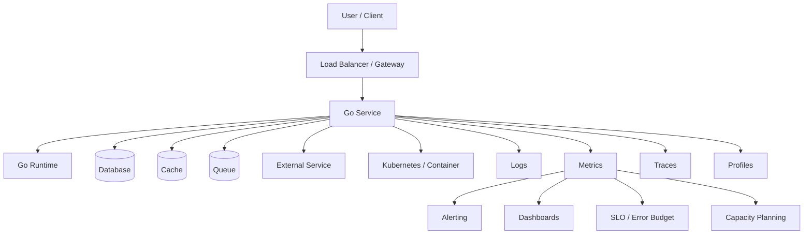
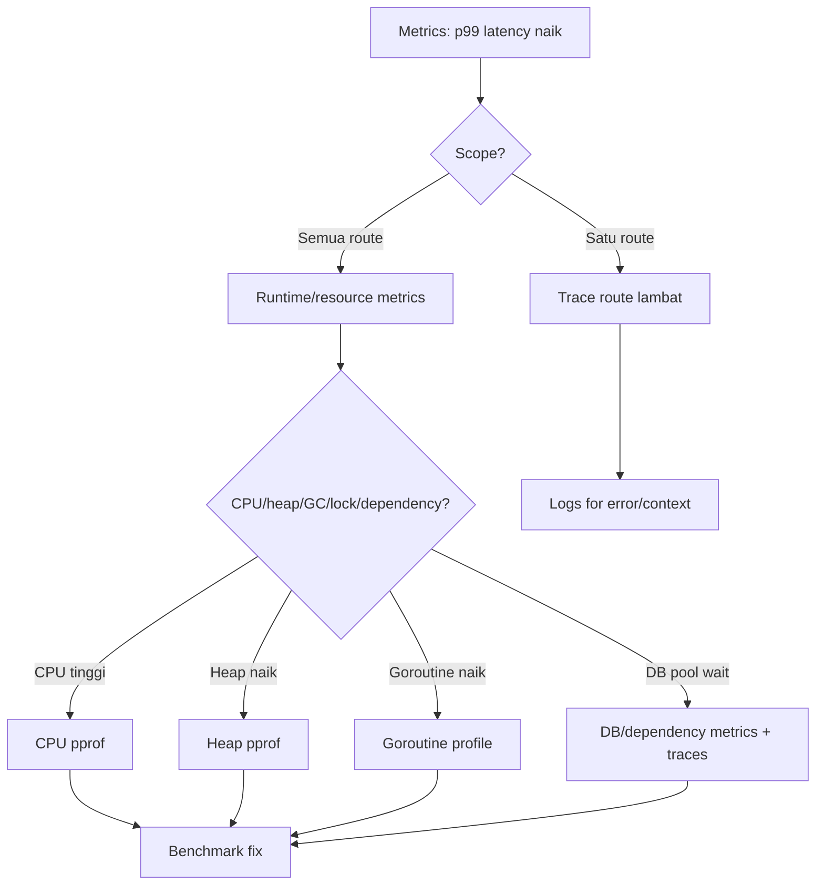

# learn-go-logging-observability-profiling-troubleshooting-part-005.md

# Part 005 — Metrics Mental Model

> Seri: **Go Logging, Observability, Profiling, dan Troubleshooting**  
> Bagian: **005 dari 032**  
> Topik: **Metrics Mental Model**  
> Target pembaca: **Java Software Engineer yang ingin menguasai Go production observability di level senior/staff/principal**  
> Fokus: **cara berpikir tentang metrics sebelum masuk ke Prometheus/OpenTelemetry instrumentation**

---

## 0. Tujuan Bagian Ini

Bagian ini tidak dimulai dari package Go, bukan dari Prometheus client, bukan dari Grafana dashboard, dan bukan dari `runtime/metrics` API.

Bagian ini dimulai dari pertanyaan yang lebih fundamental:

> Ketika sistem Go sedang berjalan di production, angka apa yang benar-benar menjelaskan keadaan sistem, dan angka apa yang hanya membuat kita merasa sedang memonitor?

Metrics adalah observability signal yang paling sering dipakai untuk:

1. **alerting**,
2. **capacity planning**,
3. **SLO tracking**,
4. **performance regression detection**,
5. **incident triage**,
6. **trend analysis**,
7. **autoscaling**,
8. **cost control**,
9. **operational governance**.

Namun metrics juga sering menjadi sumber kesalahan berpikir:

- dashboard terlihat hijau, tapi user tetap mengalami error;
- rata-rata latency rendah, tapi `p99` hancur;
- CPU rendah, tapi throughput collapse;
- goroutine count naik, tapi tidak ada alert;
- error rate rendah, tapi hanya karena traffic juga turun;
- metrics terlalu banyak, tapi tidak ada yang menjawab pertanyaan incident;
- label terlalu detail, lalu Prometheus/OpenTelemetry backend meledak karena cardinality;
- metric diberi nama bagus, tapi semantiknya salah.

Tujuan bagian ini adalah membangun fondasi agar kita bisa:

1. membedakan **measurement**, **metric**, **time series**, **signal**, dan **indicator**;
2. memahami tipe metric secara semantik, bukan hafalan;
3. memilih metric yang tepat untuk event, state, latency, saturation, dan runtime behavior;
4. membaca metrics sebagai bukti, bukan dekorasi dashboard;
5. memahami kenapa cardinality adalah masalah arsitektur, bukan hanya masalah tool;
6. menghubungkan metrics dengan SLO, alerting, profiling, logs, dan traces;
7. mulai berpikir seperti engineer yang bisa memimpin investigasi production.

---

## 1. Apa Itu Metric?

Secara sederhana:

> Metric adalah pengukuran numerik tentang sistem pada waktu tertentu atau sepanjang rentang waktu tertentu.

Namun dalam production observability, definisi ini belum cukup. Kita perlu memecahnya menjadi beberapa konsep.

### 1.1 Measurement

**Measurement** adalah satu kejadian pengukuran.

Contoh:

```text
request duration = 183 ms
heap allocated = 512 MiB
active goroutines = 1804
http response status = 500
queue depth = 912
```

Measurement adalah fakta mentah.

### 1.2 Metric Name

**Metric name** adalah nama stabil untuk jenis pengukuran.

Contoh:

```text
http_server_requests_total
http_server_request_duration_seconds
go_goroutines
process_resident_memory_bytes
worker_jobs_processed_total
```

Nama metric harus menyatakan **apa yang diukur**, bukan bagaimana nanti ditampilkan.

Buruk:

```text
slow_requests
bad_stuff
api_metric
count
latency
```

Lebih baik:

```text
http_server_request_duration_seconds
http_server_requests_total
http_client_request_errors_total
worker_job_duration_seconds
queue_messages_visible
```

### 1.3 Label / Attribute / Dimension

Label adalah metadata yang membagi metric menjadi beberapa time series.

Contoh:

```text
http_server_requests_total{method="GET", route="/orders/{id}", status_class="5xx"}
```

Label membuat metric menjadi bisa dianalisis per dimensi:

- method,
- route,
- status,
- dependency,
- tenant,
- region,
- version,
- worker type,
- queue name.

Namun label juga sumber bahaya cardinality. Kita akan bahas detail nanti.

### 1.4 Time Series

**Time series** adalah urutan nilai metric yang memiliki kombinasi label yang sama.

Contoh:

```text
http_server_requests_total{method="GET", route="/orders/{id}", status_class="2xx"}
```

adalah time series berbeda dari:

```text
http_server_requests_total{method="POST", route="/orders", status_class="2xx"}
```

Dan berbeda lagi dari:

```text
http_server_requests_total{method="GET", route="/orders/{id}", status_class="5xx"}
```

Satu metric name dapat menghasilkan ribuan bahkan jutaan time series jika label tidak dikontrol.

### 1.5 Signal

**Signal** adalah metric yang membantu menjawab pertanyaan operasional.

Metric belum tentu signal.

Contoh metric yang belum tentu berguna:

```text
internal_loop_iteration_total
json_encoder_created_total
last_cache_cleanup_timestamp
```

Bisa berguna, tetapi hanya jika ada pertanyaan operasional yang jelas.

Contoh signal yang kuat:

```text
http_server_request_duration_seconds_bucket
http_server_requests_total
http_server_errors_total
queue_backlog_messages
worker_job_duration_seconds_bucket
db_pool_wait_duration_seconds_bucket
```

Karena bisa menjawab:

- apakah user lambat?
- apakah traffic berubah?
- apakah error naik?
- apakah dependency bottleneck?
- apakah worker tidak mengejar backlog?
- apakah database pool menjadi bottleneck?

### 1.6 Indicator

**Indicator** adalah signal yang dipakai untuk keputusan.

Contoh:

```text
availability over 30 days = 99.93%
p99 latency over 5 minutes = 1.8s
error budget burn rate over 1h = 8x
queue freshness p95 = 4m
```

Indicator biasanya terkait SLO, alerting, capacity review, atau release gate.

---

## 2. Metrics vs Logs vs Traces vs Profiles

Metrics bukan pengganti logs, traces, atau profiles. Metrics punya fungsi berbeda.

| Signal | Pertanyaan yang dijawab | Bentuk | Kekuatan | Kelemahan |
|---|---|---|---|---|
| Metrics | Apa yang berubah? Seberapa besar? Seberapa sering? | angka/time series | murah, agregat, bagus untuk alerting | miskin konteks individual |
| Logs | Apa yang terjadi pada event tertentu? | event record | detail, evidence, audit trail | mahal, noisy, sulit untuk agregasi berat |
| Traces | Request ini melewati apa saja? Mana yang lambat? | graph/span timeline | causal path lintas service | sampling, overhead, butuh propagation |
| Profiles | CPU/memory/blocking dipakai di mana? | sampled runtime evidence | sangat kuat untuk hot path | tidak selalu menjelaskan business impact |

Mental model penting:

> Metrics memberi tahu bahwa ada masalah. Logs/traces/profiles membantu menjelaskan kenapa.

Namun ini bukan aturan absolut. Kadang metric runtime seperti goroutine count atau heap growth bisa langsung menunjukkan kelas masalah. Kadang trace langsung menunjukkan dependency lambat. Kadang log error rate cukup untuk melihat root cause. Tetapi untuk desain sistem observability, pembagian tanggung jawab ini sangat berguna.

---

## 3. Kenapa Metrics Sangat Penting di Go?

Di Java, engineer sering terbiasa dengan:

- JVM metrics,
- Micrometer,
- Actuator,
- JMX,
- GC logs,
- thread pools,
- heap/non-heap memory,
- connection pool metrics,
- executor metrics,
- servlet container metrics.

Di Go, default runtime lebih kecil dan lebih dekat ke aplikasi. Banyak hal yang di Java muncul sebagai komponen eksplisit, di Go sering berupa:

- goroutine,
- channel,
- `http.Transport`,
- custom worker pool,
- custom queue,
- database connection pool,
- runtime scheduler,
- GC,
- heap allocation,
- context cancellation,
- custom retry loop.

Karena Go mendorong composition sederhana, banyak abstraction production dibuat sendiri oleh team. Akibatnya, metrics harus didesain dengan sadar.

Contoh:

Java/Spring app mungkin otomatis punya:

```text
http.server.requests
jvm.memory.used
jvm.threads.live
hikaricp.connections.active
executor.completed
executor.queued
```

Go app mungkin tidak punya semua itu kecuali kita instrument sendiri:

```text
http_server_requests_total
http_server_request_duration_seconds
go_goroutines
go_memstats_heap_alloc_bytes
sql_db_in_use_connections
worker_queue_depth
worker_jobs_processed_total
```

Go memberi fleksibilitas besar, tetapi operational visibility harus dibangun secara eksplisit.

---

## 4. Model Besar Metrics dalam Production System

Sebuah service production biasanya perlu metrics di beberapa layer.



Kita bisa membagi metrics menjadi beberapa kelompok:

| Kelompok | Contoh | Tujuan |
|---|---|---|
| User-facing | request rate, error rate, latency | health dari sudut pandang user |
| Runtime | goroutine, heap, GC, scheduler | health Go runtime |
| Resource | CPU, memory, file descriptor, network | health process/container/node |
| Dependency | DB latency, HTTP client errors, cache hits | health hubungan keluar |
| Workload | queue depth, job duration, backlog age | health async processing |
| Business | orders created, payments failed, cases escalated | dampak domain |
| SLO | availability, latency compliance, freshness | reliability target |

Metric yang kuat biasanya menjawab satu dari pertanyaan berikut:

1. Apakah user terdampak?
2. Seberapa banyak user/request terdampak?
3. Sejak kapan?
4. Apakah memburuk atau membaik?
5. Apakah masalah lokal atau global?
6. Apakah bottleneck di app, runtime, dependency, resource, atau workload?
7. Apakah kita perlu rollback, scale, shed load, atau investigate lebih dalam?

---

## 5. Tipe Metrics: Bukan Sekadar Counter/Gauge/Histogram/Summary

Prometheus secara tradisional membahas empat tipe utama:

1. counter,
2. gauge,
3. histogram,
4. summary.

Namun sebagai engineer, yang lebih penting adalah memahami **semantik angka**.

---

## 6. Counter

### 6.1 Definisi

Counter adalah nilai yang hanya naik, kecuali reset saat proses restart.

Contoh:

```text
http_server_requests_total
http_server_errors_total
worker_jobs_processed_total
cache_hits_total
retry_attempts_total
```

Counter cocok untuk event yang terjadi berulang.

### 6.2 Counter Bukan Untuk Nilai Saat Ini

Jangan gunakan counter untuk:

```text
current_queue_depth
active_connections
memory_used
inflight_requests
```

Itu state, bukan event. Gunakan gauge.

### 6.3 Counter Harus Dibaca sebagai Rate

Nilai mentah counter biasanya tidak terlalu berguna.

Contoh:

```text
http_server_requests_total = 92839123
```

Angka itu tidak langsung menjawab apakah traffic sekarang tinggi atau rendah.

Yang lebih berguna:

```promql
rate(http_server_requests_total[5m])
```

Artinya kira-kira request per detik selama 5 menit terakhir.

Untuk error rate:

```promql
sum(rate(http_server_requests_total{status_class="5xx"}[5m]))
/
sum(rate(http_server_requests_total[5m]))
```

### 6.4 Counter Reset

Counter reset saat process restart. Query engine seperti Prometheus `rate()` memahami reset counter, tetapi hanya jika metric memang counter.

Anti-pattern:

```text
queue_depth_total
```

tetapi nilainya naik turun. Ini merusak semantik query.

### 6.5 Counter Naming

Konvensi umum:

```text
*_total
```

Contoh:

```text
http_server_requests_total
worker_jobs_failed_total
db_transactions_committed_total
```

### 6.6 Counter dalam Go Service

Gunakan counter untuk:

- request masuk,
- response berdasarkan status class,
- job processed,
- retry attempts,
- cache hit/miss,
- messages consumed,
- messages published,
- validation failures,
- circuit breaker opened,
- panic recovered.

Jangan gunakan counter untuk:

- active goroutine,
- queue length,
- memory usage,
- current open connections,
- current config version,
- timestamp terakhir.

---

## 7. Gauge

### 7.1 Definisi

Gauge adalah nilai yang bisa naik dan turun.

Contoh:

```text
go_goroutines
process_resident_memory_bytes
queue_depth
http_server_inflight_requests
sql_db_in_use_connections
cache_entries
```

Gauge cocok untuk state saat ini.

### 7.2 Gauge Harus Punya Makna Snapshot

Gauge menjawab:

> Berapa nilai saat ini?

Contoh:

```text
queue_depth = 12000
```

Berguna untuk membaca backlog.

Tetapi hati-hati. Gauge tunggal tanpa konteks sering menipu.

Queue depth 12000 bisa buruk jika worker hanya memproses 100/s dan SLA 1 menit. Tetapi bisa normal jika worker memproses 10000/s dan backlog hanya spike sementara.

Karena itu gauge sering perlu digabung dengan rate/duration.

### 7.3 Gauge untuk Timestamp

Kadang gauge dipakai untuk Unix timestamp:

```text
last_successful_sync_timestamp_seconds
last_config_reload_timestamp_seconds
```

Ini valid, tetapi query-nya harus benar.

Contoh freshness:

```promql
time() - last_successful_sync_timestamp_seconds
```

### 7.4 Gauge Anti-pattern

Buruk:

```text
last_error_code{error_message="connection refused to 10.2.3.4:5432"}
```

Masalah:

- error message sebagai label cardinality tinggi,
- gauge dipakai sebagai log,
- tidak cocok untuk alerting stabil.

Lebih baik:

```text
dependency_requests_total{dependency="orders-db", outcome="error", error_class="connection"}
```

Dan detail spesifiknya masuk log/trace.

---

## 8. Histogram

### 8.1 Definisi

Histogram merekam distribusi nilai ke dalam bucket.

Biasanya digunakan untuk:

- latency,
- request duration,
- response size,
- payload size,
- job duration,
- DB query duration,
- queue delay,
- retry delay,
- lock wait duration.

Contoh Prometheus histogram biasanya menghasilkan time series seperti:

```text
http_server_request_duration_seconds_bucket{le="0.1"}
http_server_request_duration_seconds_bucket{le="0.3"}
http_server_request_duration_seconds_bucket{le="1"}
http_server_request_duration_seconds_bucket{le="+Inf"}
http_server_request_duration_seconds_sum
http_server_request_duration_seconds_count
```

### 8.2 Kenapa Histogram Penting

Latency bukan satu angka. Latency adalah distribusi.

Rata-rata bisa sangat menipu.

Contoh:

```text
99 request = 50 ms
1 request  = 10 seconds
```

Average:

```text
(99*50ms + 1*10000ms) / 100 = 149.5ms
```

Average terlihat tidak terlalu buruk, tetapi satu user mengalami 10 detik.

Histogram memungkinkan kita membaca:

- p50,
- p90,
- p95,
- p99,
- tail behavior,
- SLO threshold compliance.

### 8.3 Bucket Design

Bucket adalah keputusan arsitektur.

Untuk HTTP latency, bucket harus sesuai SLO.

Jika SLO adalah 95% request < 300ms, maka bucket harus punya boundary sekitar 300ms.

Contoh:

```text
0.005
0.01
0.025
0.05
0.1
0.25
0.3
0.5
1
2.5
5
10
```

Jika tidak ada bucket di sekitar threshold, SLO calculation menjadi kasar.

### 8.4 Bucket Terlalu Banyak

Setiap bucket adalah time series tambahan untuk setiap kombinasi label.

Jika histogram punya 20 bucket dan label menghasilkan 1000 kombinasi, maka minimal ada 20.000 bucket time series, belum termasuk `_sum` dan `_count`.

Histogram adalah salah satu sumber cardinality cost terbesar.

### 8.5 Histogram Untuk SLO

Misal SLO:

> 99% request `/checkout` harus selesai < 500ms.

Dengan histogram bucket `le="0.5"`, kita bisa menghitung compliance:

```promql
sum(rate(http_server_request_duration_seconds_bucket{route="/checkout", le="0.5"}[5m]))
/
sum(rate(http_server_request_duration_seconds_count{route="/checkout"}[5m]))
```

Ini sering lebih stabil untuk SLO daripada menghitung percentile saja.

### 8.6 Histogram vs Summary

Di Prometheus, histogram bisa diagregasi lintas instance karena bucket-nya konsisten.

Summary menghitung quantile di client dan umumnya sulit diagregasi secara benar lintas instance.

Dalam distributed service, histogram biasanya lebih disukai untuk server-side aggregation dan SLO.

---

## 9. Summary

### 9.1 Definisi

Summary juga mengukur distribusi, tetapi quantile dihitung di client.

Contoh:

```text
request_duration_seconds{quantile="0.99"}
```

### 9.2 Kapan Summary Berguna

Summary bisa berguna jika:

- hanya satu process,
- tidak perlu agregasi lintas instance,
- ingin client-side quantile cepat,
- menggunakan library/tooling yang memang cocok.

### 9.3 Kenapa Summary Sering Tidak Cocok untuk Fleet

Jika ada 10 instance dan masing-masing punya p99 sendiri, rata-rata dari p99 instance bukan p99 global.

Contoh:

```text
instance A p99 = 100ms
instance B p99 = 2s
```

Mengambil rata-rata 1.05s tidak menjawab p99 seluruh request.

Karena itu untuk service production dengan banyak replica, histogram biasanya pilihan default.

---

## 10. Event, State, dan Distribution

Sebelum memilih tipe metric, tanya dulu:

> Yang saya ukur ini event, state, atau distribution?

| Yang diukur | Contoh | Tipe umum |
|---|---|---|
| Event terjadi | request selesai, job gagal, retry dilakukan | counter |
| State saat ini | goroutine aktif, queue depth, memory used | gauge |
| Durasi/ukuran distribusi | latency, payload size, job duration | histogram |
| Timestamp | last success time | gauge |
| Ratio | error rate, availability | biasanya derived dari counter |
| Percentile | p95/p99 latency | derived dari histogram |

Jangan mulai dari “saya butuh counter atau gauge?”. Mulai dari “apa semantik fenomenanya?”.

---

## 11. Rate, Ratio, Percentile, dan Aggregation

Metric mentah jarang langsung menjadi keputusan. Biasanya kita membuat derived indicator.

### 11.1 Rate

Rate menjawab:

> Seberapa cepat counter bertambah?

Contoh:

```promql
rate(http_server_requests_total[5m])
```

Makna:

```text
request per second selama window 5 menit
```

### 11.2 Ratio

Ratio menjawab:

> Dari total event, berapa proporsi yang memenuhi kondisi tertentu?

Contoh error ratio:

```promql
sum(rate(http_server_requests_total{status_class="5xx"}[5m]))
/
sum(rate(http_server_requests_total[5m]))
```

### 11.3 Percentile

Percentile menjawab:

> Berapa nilai maksimum yang dialami X% request tercepat?

p99 latency 800ms berarti 99% request <= 800ms, dan 1% request lebih lambat.

Tapi percentile harus dibaca hati-hati:

- p99 dari traffic rendah bisa noisy;
- p99 dari bucket kasar bisa tidak presisi;
- p99 tidak memberi tahu jumlah absolut user terdampak;
- p99 tidak menunjukkan request mana yang lambat;
- p99 dari aggregate bisa menyembunyikan satu route yang buruk.

### 11.4 Aggregation

Aggregation bisa menyembunyikan masalah.

Contoh:

```text
Global error rate = 0.1%
```

Terlihat aman. Tapi mungkin:

```text
/payment error rate = 30%
/health error rate = 0%
/static error rate = 0%
```

Traffic besar dari endpoint sehat membuat global rate terlihat baik.

Aturan:

> Aggregate untuk alert overview, drill down untuk diagnosis.

---

## 12. The Four Golden Signals

Google SRE mendefinisikan empat golden signals:

1. latency,
2. traffic,
3. errors,
4. saturation.

Ini bukan daftar metric final, tetapi mental model.

### 12.1 Latency

Latency menjawab:

> Berapa lama operasi membutuhkan waktu?

Untuk user-facing service:

```text
http_server_request_duration_seconds
```

Untuk dependency:

```text
http_client_request_duration_seconds
db_query_duration_seconds
cache_operation_duration_seconds
```

Untuk async job:

```text
worker_job_duration_seconds
queue_message_age_seconds
```

Penting:

- pisahkan successful latency dan failed latency jika relevan;
- failed requests bisa cepat karena langsung reject;
- timeout bisa terlihat sebagai latency panjang;
- cancellation perlu classification.

### 12.2 Traffic

Traffic menjawab:

> Berapa banyak demand yang masuk?

Contoh:

```text
http_server_requests_total
worker_jobs_received_total
queue_messages_consumed_total
```

Traffic penting karena error rate tanpa traffic tidak cukup.

Error 10/s saat traffic 10.000/s berbeda dari error 10/s saat traffic 12/s.

### 12.3 Errors

Errors menjawab:

> Berapa banyak request/operation gagal?

Contoh:

```text
http_server_requests_total{status_class="5xx"}
worker_jobs_failed_total
dependency_requests_total{outcome="error"}
```

Error harus diklasifikasikan.

Minimal:

```text
outcome="success|error"
```

Lebih baik:

```text
error_class="validation|timeout|dependency|conflict|bug|panic|cancelled"
```

Tetapi jangan memasukkan raw error message sebagai label.

### 12.4 Saturation

Saturation menjawab:

> Seberapa penuh atau seberapa dekat resource terhadap limit?

Contoh:

```text
cpu utilization
memory usage vs limit
queue depth
connection pool wait duration
db connections in use / max
worker active / capacity
file descriptors used
```

Saturation sering merupakan early warning sebelum latency dan error naik.

Contoh:

- DB pool wait naik → latency naik → timeout naik → error naik.
- Queue depth naik → freshness memburuk → job expired.
- CPU throttling naik → latency p99 spike.
- Heap mendekati memory limit → GC thrash/OOM.

---

## 13. RED Method

RED umum dipakai untuk request-driven service.

RED =

1. **Rate**,
2. **Errors**,
3. **Duration**.

Untuk HTTP service Go:

```text
Rate     = requests/sec
Errors   = error ratio or errors/sec
Duration = latency distribution
```

Contoh metric:

```text
http_server_requests_total{method, route, status_class}
http_server_request_duration_seconds{method, route}
```

Derived query:

```text
R: sum rate requests by route
E: sum rate 5xx by route / sum rate all by route
D: histogram_quantile p95/p99 by route
```

RED sangat cocok untuk:

- REST API,
- gRPC service,
- RPC endpoint,
- public/internal HTTP service.

RED kurang cukup untuk:

- batch processing,
- streaming consumer,
- storage engine,
- queue workers,
- scheduler/background jobs.

Untuk itu perlu ditambah workload metrics.

---

## 14. USE Method

USE =

1. **Utilization**,
2. **Saturation**,
3. **Errors**.

USE cocok untuk resource.

Contoh untuk CPU:

```text
Utilization = CPU used / CPU available
Saturation  = run queue, throttling, scheduler latency
Errors      = CPU-related errors jarang langsung, tapi bisa throttling events
```

Contoh untuk DB pool:

```text
Utilization = in_use_connections / max_open_connections
Saturation  = wait_count, wait_duration
Errors      = connection acquisition errors, timeout
```

Contoh untuk worker pool:

```text
Utilization = active_workers / max_workers
Saturation  = queue_depth, queue_wait_duration
Errors      = job failures, rejected jobs
```

USE membantu menemukan bottleneck saat user-facing RED sudah menunjukkan gejala.

---

## 15. Metrics untuk Go Runtime

Go runtime bukan black box. Beberapa runtime metrics penting:

| Area | Signal | Kenapa penting |
|---|---|---|
| Goroutine | jumlah goroutine | leak, fan-out tidak terkendali, blocked worker |
| Heap | heap alloc/live/goal | memory pressure, GC behavior |
| Allocation | alloc bytes/objects | churn, GC pressure |
| GC | cycles, pauses, CPU fraction | latency dan throughput impact |
| Scheduler | goroutine states, threads | runnable backlog, scheduler pressure |
| Stack | stack memory | goroutine growth impact |
| OS thread | thread count | syscall/cgo/blocking pressure |

Runtime metrics perlu dibaca bersama application metrics.

Contoh:

```text
p99 latency naik
+ goroutine count naik
+ heap naik
+ DB pool wait naik
```

Kemungkinan:

- dependency lambat menyebabkan goroutine menumpuk;
- request menunggu DB connection;
- heap naik karena goroutine stack dan retained request state;
- GC ikut memburuk akibat live heap.

Bukan langsung “GC problem”.

---

## 16. Metrics untuk Go HTTP Service

Baseline HTTP service metrics:

```text
http_server_requests_total{method, route, status_class}
http_server_request_duration_seconds{method, route, status_class?}
http_server_inflight_requests{method?, route?}
http_server_request_size_bytes
http_server_response_size_bytes
http_server_panics_total{route}
```

Label yang aman:

```text
method="GET"
route="/cases/{case_id}"
status_class="2xx"
```

Label yang berbahaya:

```text
path="/cases/CASE-2026-0000009123"
user_id="u-123123"
email="person@example.com"
error="dial tcp 10.2.3.4:5432: connect: connection refused"
```

Gunakan route template, bukan raw path.

---

## 17. Metrics untuk Outbound Dependency

Service Go jarang hidup sendiri. Outbound dependency sering menjadi root cause incident.

Baseline:

```text
http_client_requests_total{dependency, method, operation, outcome, status_class}
http_client_request_duration_seconds{dependency, method, operation, outcome}
http_client_retries_total{dependency, operation, reason}
http_client_timeouts_total{dependency, operation, timeout_type}
http_client_circuit_breaker_state{dependency}
```

Untuk database:

```text
db_queries_total{database, operation, outcome}
db_query_duration_seconds{database, operation, outcome}
db_pool_in_use_connections{database}
db_pool_idle_connections{database}
db_pool_wait_count_total{database}
db_pool_wait_duration_seconds_total{database}
db_pool_max_open_connections{database}
```

Untuk cache:

```text
cache_operations_total{cache, operation, outcome}
cache_operation_duration_seconds{cache, operation}
cache_hits_total{cache}
cache_misses_total{cache}
cache_entries{cache}
```

Untuk queue:

```text
queue_messages_published_total{queue, outcome}
queue_messages_consumed_total{queue, outcome}
queue_depth{queue}
queue_oldest_message_age_seconds{queue}
consumer_lag{queue, consumer_group}
```

---

## 18. Metrics untuk Worker dan Batch Job

Worker dan batch sering gagal dimonitor karena tidak punya request/response user-facing.

Baseline:

```text
worker_jobs_started_total{worker, job_type}
worker_jobs_completed_total{worker, job_type, outcome}
worker_job_duration_seconds{worker, job_type, outcome}
worker_active_jobs{worker}
worker_queue_depth{worker}
worker_job_retries_total{worker, job_type, reason}
worker_job_deadlettered_total{worker, job_type, reason}
worker_last_success_timestamp_seconds{worker, job_type}
```

Untuk job freshness:

```text
time() - worker_last_success_timestamp_seconds
```

Untuk backlog:

```text
queue_depth / processing_rate
```

Contoh estimated drain time:

```promql
queue_depth / sum(rate(worker_jobs_completed_total{outcome="success"}[5m]))
```

Tentu ini perkiraan kasar, tetapi berguna untuk incident triage.

---

## 19. Business Metrics vs Technical Metrics

Technical metrics menjelaskan sistem.

Business metrics menjelaskan dampak domain.

Contoh technical:

```text
http_server_requests_total
http_server_request_duration_seconds
db_query_duration_seconds
```

Contoh business:

```text
case_submissions_total
case_approvals_total
payment_authorizations_failed_total
user_logins_total
applications_auto_escalated_total
```

Business metrics penting karena tidak semua incident terlihat sebagai HTTP 500.

Contoh:

- semua endpoint 200, tetapi approval tidak pernah diproses;
- job sukses secara teknis, tetapi mengirim email ke recipient salah;
- payment API sukses, tetapi settlement event tidak diterbitkan;
- case state transition salah tapi tidak error.

Observability yang matang selalu menghubungkan:

```text
technical health -> workflow health -> business/domain outcome
```

---

## 20. SLO-Oriented Metrics

SLO bukan dashboard. SLO adalah kontrak reliability.

Contoh SLO:

```text
99.9% HTTP requests over 30 days must not return 5xx.
95% search requests over 7 days must complete under 500ms.
99% queue messages must be processed within 2 minutes.
```

Metric yang baik untuk SLO harus:

1. berhubungan dengan user impact;
2. bisa dihitung secara konsisten;
3. punya numerator dan denominator jelas;
4. tahan terhadap noise;
5. tidak bergantung pada label cardinality liar;
6. bisa dipakai untuk alert burn-rate.

### 20.1 Availability SLO

Numerator:

```text
successful requests
```

Denominator:

```text
total eligible requests
```

Contoh:

```promql
1 - (
sum(rate(http_server_requests_total{status_class="5xx"}[30d]))
/
sum(rate(http_server_requests_total[30d]))
)
```

Tapi definisi harus jelas:

- Apakah 4xx dihitung failure?
- Apakah 429 failure?
- Apakah client cancellation failure?
- Apakah health check dikecualikan?
- Apakah admin endpoint dikecualikan?

### 20.2 Latency SLO

Contoh:

```text
95% request route critical < 300ms
```

Lebih baik dihitung dari histogram bucket threshold:

```promql
sum(rate(http_server_request_duration_seconds_bucket{route="/submit", le="0.3"}[5m]))
/
sum(rate(http_server_request_duration_seconds_count{route="/submit"}[5m]))
```

### 20.3 Freshness SLO

Untuk pipeline/job:

```text
99% event processed within 2 minutes
```

Metric:

```text
queue_message_age_seconds
worker_processing_delay_seconds
```

Freshness lebih tepat daripada sekadar “worker running”.

---

## 21. Cardinality: Masalah Arsitektur Metrics

Cardinality adalah jumlah kombinasi label unik yang menghasilkan time series.

### 21.1 Contoh Aman

```text
http_server_requests_total{method="GET", route="/cases/{id}", status_class="2xx"}
```

Jika:

- method: 5 nilai,
- route: 50 nilai,
- status_class: 5 nilai,

maka maksimum:

```text
5 * 50 * 5 = 1250 time series
```

Masih masuk akal.

### 21.2 Contoh Berbahaya

```text
http_server_requests_total{user_id, path, ip, user_agent, error_message}
```

Jika:

- user_id: 500.000,
- path: 2.000.000 raw path,
- ip: 100.000,
- user_agent: 10.000,
- error_message: unbounded,

maka backend metrics bisa hancur.

### 21.3 Cardinality Multiplication

Cardinality bukan ditambah, tetapi dikalikan.

```text
routes * methods * status * tenants * versions * pods * regions * buckets
```

Histogram memperparah karena setiap bucket menjadi time series.

### 21.4 Label yang Biasanya Aman

```text
service
environment
region
zone
method
route template
status_class
operation
dependency
queue
worker_type
outcome
error_class
version
```

Tetap harus dibatasi.

### 21.5 Label yang Biasanya Berbahaya

```text
user_id
email
ip_address
raw_path
query_string
request_id
trace_id
session_id
token
error_message
stack_trace
payload
order_id
case_id
file_name
```

Beberapa bisa dipakai di logs/traces, bukan metrics.

### 21.6 Cardinality Budget

Production-grade observability perlu budget:

```text
Per service max active series: N
Per histogram max labels: M
Per route metric label count: controlled
No unbounded labels
No raw user data in labels
```

Cardinality review harus menjadi bagian code review untuk instrumentation.

---

## 22. Metric Naming Discipline

Nama metric harus stabil, jelas, dan punya unit.

### 22.1 Unit Suffix

Gunakan unit suffix:

```text
_seconds
_bytes
_total
_ratio
_percent rarely, prefer ratio 0..1
```

Contoh:

```text
http_server_request_duration_seconds
process_resident_memory_bytes
worker_jobs_completed_total
```

Buruk:

```text
request_latency
memory
job_count
```

Karena tidak jelas unit dan semantiknya.

### 22.2 Prefix by Domain

Contoh:

```text
http_server_...
http_client_...
db_...
cache_...
queue_...
worker_...
go_...
process_...
```

### 22.3 Jangan Encode Label ke Nama

Buruk:

```text
get_orders_200_total
get_orders_500_total
post_orders_200_total
```

Lebih baik:

```text
http_server_requests_total{method="GET", route="/orders", status_class="2xx"}
```

### 22.4 Jangan Pakai Nama Berdasarkan Dashboard

Buruk:

```text
red_panel_metric_1
latency_chart_data
```

Metric adalah contract, bukan panel implementation.

---

## 23. Metrics as Contract

Metric production adalah contract antara:

- application developer,
- SRE/platform team,
- incident responder,
- dashboard,
- alert rule,
- autoscaler,
- capacity planner,
- business stakeholder.

Karena itu metric tidak boleh berubah sembarangan.

Perubahan breaking:

- rename metric,
- rename label,
- ubah unit,
- ubah semantik counter/gauge,
- ubah route label dari template ke raw path,
- hapus bucket SLO,
- ubah outcome classification.

Metric schema perlu versioning/migration discipline.

---

## 24. Common Metrics Anti-patterns

### 24.1 Dashboard-Driven Instrumentation

Buruk:

> Kita butuh dashboard bagus, jadi tambahkan banyak metric.

Lebih baik:

> Kita butuh menjawab incident question X, SLO Y, dan capacity question Z.

### 24.2 Average Latency Only

Average latency menyembunyikan tail.

Gunakan histogram dan percentile/threshold compliance.

### 24.3 High-Cardinality Labels

Metric dengan `user_id`, `trace_id`, atau raw path adalah bom waktu.

### 24.4 Counter Dipakai Seperti Gauge

Misalnya `active_requests_total` tetapi naik turun.

### 24.5 Gauge Dipakai Sebagai Event Log

Misalnya `last_error_message` sebagai label.

### 24.6 Missing Denominator

Metric error tanpa total membuat ratio tidak bisa dihitung.

Buruk:

```text
errors_total
```

Tanpa total operations, kita tidak tahu apakah 100 error itu banyak atau sedikit.

### 24.7 No Outcome Label

Buruk:

```text
jobs_total
```

Lebih baik:

```text
worker_jobs_completed_total{outcome="success|failure|cancelled"}
```

### 24.8 Label Value Tidak Stabil

Buruk:

```text
route="/orders/123"
```

Harus:

```text
route="/orders/{id}"
```

### 24.9 Metrics Tanpa Ownership

Metric ada, tapi tidak ada yang tahu:

- siapa pemiliknya,
- kapan dipakai,
- alert mana yang bergantung,
- boleh dihapus atau tidak.

### 24.10 Runtime Metrics Tanpa Application Context

Goroutine naik tidak otomatis berarti leak. Bisa traffic naik. Butuh korelasi.

---

## 25. Metrics Reading During Incident

Saat incident, jangan mulai dari dashboard random. Mulai dari pertanyaan.

### 25.1 Pertanyaan Pertama: User Impact

```text
Apakah request user gagal atau lambat?
```

Metrics:

```text
http_server_requests_total
http_server_request_duration_seconds
```

Lihat:

- traffic,
- error rate,
- p95/p99 latency,
- affected route,
- affected status class.

### 25.2 Pertanyaan Kedua: Scope

```text
Apakah semua route, satu route, satu dependency, satu pod, satu region, satu version?
```

Drill down by:

```text
route
pod
version
region
dependency
```

Tapi hanya jika label tersedia dan aman.

### 25.3 Pertanyaan Ketiga: Saturation

```text
Apakah ada resource penuh?
```

Lihat:

- CPU,
- memory,
- GC,
- goroutine,
- DB pool,
- queue,
- file descriptor,
- network,
- throttling.

### 25.4 Pertanyaan Keempat: Recent Change

```text
Apakah release/config/traffic berubah?
```

Metrics:

- requests by version,
- deployment marker,
- config reload timestamp,
- pod restart count,
- new error class.

### 25.5 Pertanyaan Kelima: Causal Path

Jika metrics menunjukkan dependency latency naik, pindah ke traces/logs.

Jika metrics menunjukkan CPU/heap/GC abnormal, pindah ke pprof/runtime trace.

Metrics memberi arah investigasi.

---

## 26. Metrics and Alerting

Metrics untuk dashboard dan metrics untuk alert tidak selalu sama.

Alert harus:

1. actionable,
2. symptom-oriented,
3. punya severity jelas,
4. punya runbook,
5. tidak terlalu noisy,
6. tidak terlalu lambat,
7. tidak terlalu sensitif terhadap traffic rendah.

### 26.1 Bad Alert

```text
CPU > 80% for 5m
```

Tidak selalu buruk. CPU tinggi mungkin normal saat traffic tinggi.

### 26.2 Better Alert

```text
p99 latency > SLO threshold
AND traffic > minimum threshold
AND error budget burn rate high
```

Atau:

```text
DB pool wait p95 > 100ms
AND HTTP p99 latency degraded
```

### 26.3 Runtime Alerts

Runtime alerts berguna jika dikaitkan dengan impact.

Contoh:

```text
goroutine count increased 5x over 30m
AND request rate stable
AND memory increasing
```

Lebih kuat daripada:

```text
goroutine count > 10000
```

Karena angka absolut tergantung service.

---

## 27. Metrics and Capacity Planning

Metrics bukan hanya untuk incident. Metrics membantu menjawab:

1. kapan perlu scale up?
2. resource apa yang menjadi bottleneck?
3. apakah headroom cukup?
4. apakah growth traffic linear terhadap resource?
5. apakah release baru lebih mahal?
6. apakah cache efektif?
7. apakah DB pool sizing tepat?
8. apakah worker capacity mengejar backlog?

Capacity metrics:

```text
request rate
CPU utilization
CPU throttling
memory working set
heap live
GC CPU fraction
DB pool utilization
queue depth
worker utilization
dependency latency
```

Capacity review yang matang melihat rasio:

```text
cost per request
CPU per request
allocation bytes per request
DB queries per request
external calls per request
```

Metric seperti ini membantu menemukan regression sebelum menjadi outage.

---

## 28. Metrics and Performance Engineering

Metrics berbeda dari benchmark dan profiling, tetapi saling melengkapi.

### 28.1 Metrics

Menjawab:

```text
Apakah production behavior berubah?
```

### 28.2 Profiling

Menjawab:

```text
CPU/memory/blocking digunakan di mana?
```

### 28.3 Benchmark

Menjawab:

```text
Apakah perubahan kode memperbaiki/memperburuk performa dalam kondisi terkontrol?
```

### 28.4 Trace

Menjawab:

```text
Request lambat melewati path apa?
```

Contoh workflow:



---

## 29. Metrics Testing

Instrumentation juga harus dites.

Yang perlu dites:

1. counter increment saat operation sukses/gagal;
2. histogram observe duration;
3. label value stabil;
4. route menggunakan template, bukan raw path;
5. error classification benar;
6. no high-cardinality labels;
7. metrics registered once;
8. custom registry untuk test;
9. concurrent access aman;
10. no panic saat exporter scrape.

Testing metrics sering diabaikan, padahal salah metric bisa menyebabkan alert buta atau noisy.

---

## 30. Metric Design Checklist

Sebelum menambahkan metric, jawab:

1. Pertanyaan operasional apa yang dijawab metric ini?
2. Apakah ini event, state, atau distribution?
3. Counter/gauge/histogram/summary mana yang sesuai?
4. Apa unitnya?
5. Apa nama metric yang stabil?
6. Label apa yang dibutuhkan?
7. Apakah label bounded?
8. Apakah ada user data/PII/secrets?
9. Apakah metric ini bisa dipakai untuk alert?
10. Apakah metric ini bisa dipakai untuk dashboard?
11. Apakah metric ini bisa dipakai untuk SLO?
12. Apakah metric ini punya owner?
13. Berapa estimasi cardinality?
14. Apakah histogram bucket sesuai SLO?
15. Apakah ada denominator untuk ratio?
16. Apakah metric bisa diagregasi lintas instance?
17. Apakah kompatibel dengan Prometheus/OpenTelemetry backend?
18. Apakah metric ini akan tetap berguna 6 bulan lagi?
19. Apakah logs/traces lebih cocok daripada metric?
20. Bagaimana metric ini akan dipakai saat incident?

---

## 31. Reference Metrics Set untuk Go Service

Untuk service HTTP Go production, baseline minimal:

```text
# HTTP server
http_server_requests_total{method, route, status_class}
http_server_request_duration_seconds{method, route}
http_server_inflight_requests{method, route?}
http_server_panics_total{route}

# HTTP client/dependency
http_client_requests_total{dependency, operation, outcome, status_class}
http_client_request_duration_seconds{dependency, operation, outcome}
http_client_retries_total{dependency, operation, reason}
http_client_timeouts_total{dependency, operation, timeout_type}

# DB
sql_db_open_connections{database}
sql_db_in_use_connections{database}
sql_db_idle_connections{database}
sql_db_wait_count_total{database}
sql_db_wait_duration_seconds_total{database}
db_query_duration_seconds{database, operation, outcome}
db_queries_total{database, operation, outcome}

# Worker/queue
worker_jobs_completed_total{worker, job_type, outcome}
worker_job_duration_seconds{worker, job_type, outcome}
worker_active_jobs{worker}
queue_depth{queue}
queue_oldest_message_age_seconds{queue}
worker_last_success_timestamp_seconds{worker, job_type}

# Runtime/process
process_cpu_seconds_total
process_resident_memory_bytes
go_goroutines
go_threads
go_gc_duration_seconds or runtime GC metrics
go_memstats_heap_alloc_bytes or runtime heap metrics

# Build/service identity
build_info{service, version, commit, go_version}
```

Catatan:

- nama exact tergantung library/exporter;
- jangan paksa semua service punya semua metric;
- baseline harus disesuaikan workload;
- metric runtime akan dibahas lebih detail di Part 007;
- Prometheus instrumentation detail masuk Part 006.

---

## 32. Java-to-Go Translation

Sebagai Java engineer, mapping mental model kira-kira:

| Java ecosystem | Go equivalent / concern |
|---|---|
| Micrometer meter registry | Prometheus client / OTel meter provider |
| Spring Boot Actuator metrics | explicit Go instrumentation |
| JVM memory metrics | Go runtime heap/GC metrics |
| Thread count | goroutine count + OS thread count |
| Executor queue metrics | custom worker queue metrics |
| HikariCP metrics | `database/sql` DBStats exported manually/library |
| Servlet request metrics | HTTP middleware metrics |
| JFR events | pprof/runtime trace + metrics/logs/traces |
| MDC trace id | context propagation + log fields + trace context |

Perbedaan penting:

1. Go tidak otomatis memberi semua abstraction metrics yang biasa ada di framework Java enterprise.
2. Go service sering lebih eksplisit dan kecil, jadi instrumentation harus menjadi bagian arsitektur.
3. Goroutine bukan thread Java; goroutine count tinggi perlu interpretasi berbeda.
4. GC metrics Go berbeda dari JVM GC metrics; jangan memaksakan model heap generation JVM ke Go.
5. Banyak bottleneck Go muncul di `http.Transport`, goroutine leak, channel blocking, allocation churn, DB pool wait, atau container limit.

---

## 33. Exercises

### Exercise 1 — Metric Type Classification

Klasifikasikan berikut sebagai counter, gauge, histogram, atau derived metric:

1. total request masuk,
2. jumlah request aktif saat ini,
3. durasi request,
4. jumlah goroutine,
5. jumlah retry,
6. error rate,
7. queue depth,
8. umur pesan tertua,
9. p99 latency,
10. last successful sync timestamp.

Jawaban yang diharapkan:

| Measurement | Type |
|---|---|
| total request masuk | counter |
| request aktif | gauge |
| durasi request | histogram |
| jumlah goroutine | gauge |
| jumlah retry | counter |
| error rate | derived ratio from counters |
| queue depth | gauge |
| umur pesan tertua | gauge or histogram depending design |
| p99 latency | derived from histogram/summary |
| last sync timestamp | gauge |

### Exercise 2 — Cardinality Review

Metric berikut bermasalah:

```text
http_requests_total{method, path, user_id, trace_id, status, error_message}
```

Perbaiki.

Jawaban yang lebih baik:

```text
http_server_requests_total{method, route, status_class, outcome, error_class}
```

Detail seperti `user_id`, `trace_id`, dan `error_message` masuk logs/traces, bukan metrics label.

### Exercise 3 — SLO Metric Design

SLO:

```text
99% application submissions must complete under 2 seconds over 30 days.
```

Design metric:

```text
application_submission_duration_seconds_bucket{le="2", outcome}
application_submission_duration_seconds_count{outcome}
```

Derived compliance:

```promql
sum(rate(application_submission_duration_seconds_bucket{le="2", outcome="success"}[30d]))
/
sum(rate(application_submission_duration_seconds_count{outcome="success"}[30d]))
```

Pertanyaan lanjutan:

- Apakah failed submission dihitung?
- Apakah validation error dihitung?
- Apakah duplicate submission dihitung?
- Apakah timeout dihitung sebagai failure atau latency violation?
- Apakah operation async atau sync?

### Exercise 4 — Incident Interpretation

Kondisi:

```text
request rate normal
error rate normal
p99 latency naik 5x
global CPU normal
db_pool_wait_duration naik
db_in_use_connections mendekati max
```

Hipotesis kuat:

```text
DB pool saturation menyebabkan request menunggu connection, sehingga p99 latency naik.
```

Langkah berikut:

1. lihat route mana yang paling terdampak;
2. lihat query/operation mana yang menahan connection;
3. cek slow query/dependency traces;
4. cek release/config change;
5. cek apakah max open connections berubah;
6. cek database-side saturation;
7. mitigasi: reduce concurrency, rollback query change, scale DB/read replica jika valid, atau adjust pool setelah evidence cukup.

---

## 34. Ringkasan Mental Model

Metrics yang baik bukan “angka yang bisa digrafikkan”.

Metrics yang baik adalah:

1. punya semantik jelas;
2. punya unit jelas;
3. punya label terbatas;
4. punya hubungan dengan pertanyaan operasional;
5. bisa diagregasi;
6. bisa dipakai untuk SLO/alert/dashboard/capacity;
7. tidak membocorkan data sensitif;
8. tidak menciptakan cardinality explosion;
9. membantu incident response;
10. bisa dikorelasikan dengan logs, traces, dan profiles.

Dalam Go, metrics harus didesain dengan sadar karena banyak abstraction production dibuat eksplisit oleh aplikasi. Runtime Go memberi sinyal penting, tetapi application-level metrics tetap wajib agar runtime evidence bisa ditafsirkan dalam konteks user impact.

---

## 35. Apa yang Akan Dibahas di Part Berikutnya

Part berikutnya:

```text
learn-go-logging-observability-profiling-troubleshooting-part-006.md
```

Judul:

```text
Prometheus Instrumentation in Go
```

Fokus:

- `client_golang`,
- registry,
- collectors,
- counters,
- gauges,
- histograms,
- middleware HTTP,
- metrics untuk worker/dependency,
- testing instrumentation,
- cardinality-safe implementation,
- Prometheus scrape model,
- production endpoint design.

---

## 36. Status Seri

Seri belum selesai.

Progress saat ini:

```text
Completed: Part 000 sampai Part 005
Remaining: Part 006 sampai Part 032
```

<!-- NAVIGATION_FOOTER -->
<div class="page-nav">
<a href="./learn-go-logging-observability-profiling-troubleshooting-part-004.md">⬅️ Part 004 — Error Logging, Causality, and Failure Evidence</a>
<a href="./index.md">📚 Kategori</a>
<a href="../../index.md">🏠 Home</a>
<a href="./learn-go-logging-observability-profiling-troubleshooting-part-006.md">Part 006 — Prometheus Instrumentation in Go ➡️</a>
</div>
