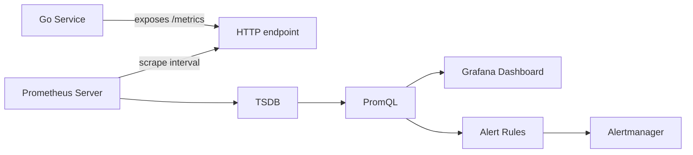
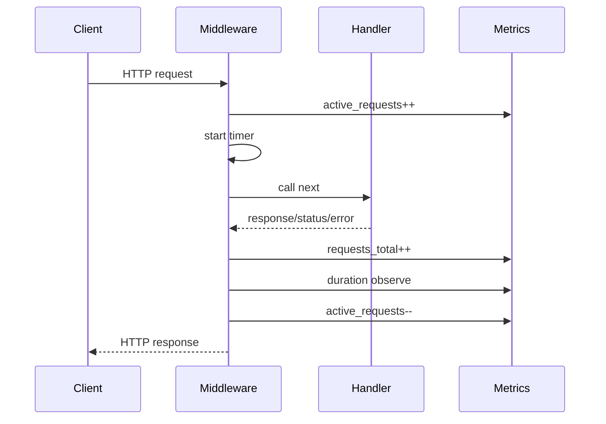
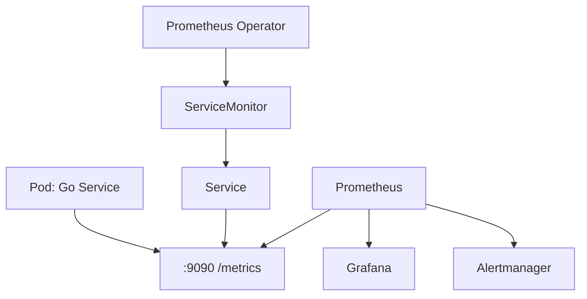
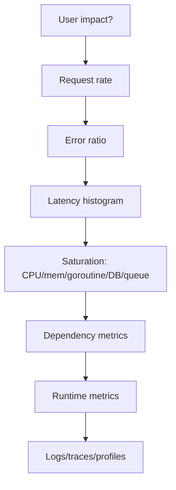

# learn-go-logging-observability-profiling-troubleshooting-part-006.md

# Part 006 — Prometheus Instrumentation in Go

> Seri: **Go Logging, Observability, Profiling, dan Troubleshooting**  
> Bagian: **006 dari 032**  
> Fokus: **Prometheus instrumentation untuk service Go production-grade**  
> Target pembaca: **Java software engineer / tech lead yang ingin membangun observability internal-engineering-handbook level**

---

## 0. Posisi Part Ini dalam Seri

Pada Part 005 kita membangun mental model metrics: counter, gauge, histogram, rate, ratio, RED, USE, SLO, dan cardinality.

Part ini mulai masuk ke implementasi konkret menggunakan **Prometheus Go client**.

Prometheus menyediakan official Go client library untuk instrumentasi aplikasi Go. Library utama yang akan sering dipakai adalah:

```text
github.com/prometheus/client_golang/prometheus
github.com/prometheus/client_golang/prometheus/promauto
github.com/prometheus/client_golang/prometheus/promhttp
```

Prometheus sendiri memakai model data dimensional: sebuah time series diidentifikasi oleh **metric name** dan sekumpulan **label key-value**. Ini kuat, tetapi juga berbahaya jika label cardinality tidak dikendalikan.

Dokumen ini bukan sekadar “cara expose `/metrics`”. Targetnya adalah membuat Anda mampu mendesain instrumentasi Go yang:

1. bisa dipakai untuk troubleshooting nyata,
2. aman dari cardinality explosion,
3. kompatibel dengan Prometheus/Grafana/Alertmanager,
4. stabil sebagai kontrak operasional,
5. tidak membuat overhead aplikasi tidak terkendali,
6. bisa dipakai sebagai dasar SLO dan incident response.

---

## 1. Mental Model: Prometheus Bukan Logger Numerik

Kesalahan umum engineer yang baru memakai Prometheus adalah memperlakukan metric seperti log:

```text
"Saya ingin tahu user mana yang error, maka saya taruh user_id sebagai label."
```

Itu salah untuk Prometheus.

Prometheus bukan tempat menyimpan event detail per user/per request. Prometheus adalah sistem agregasi numerik berbasis time series.

### 1.1 Log vs Metric

| Pertanyaan | Cocoknya pakai |
|---|---|
| Request ini gagal karena apa? | log / trace |
| Endpoint mana error rate-nya naik? | metric |
| User mana terkena error? | log / trace / audit store |
| Apakah p99 latency melanggar SLO? | metric histogram |
| Apakah service overload? | metric |
| Apakah ada dependency timeout storm? | metric + trace + log |
| Berapa goroutine sekarang? | runtime metric |
| Apa stack goroutine yang bocor? | pprof goroutine profile |

### 1.2 Prometheus adalah kontrak agregasi

Metric yang baik menjawab pertanyaan agregat seperti:

```text
Dalam 5 menit terakhir, berapa request rate endpoint X?
Dalam 5 menit terakhir, berapa error ratio endpoint X?
Dalam 5 menit terakhir, berapa p95/p99 latency endpoint X?
Saat ini, berapa active workers?
Saat ini, berapa queue depth?
Saat ini, berapa DB connections in use?
```

Metric yang buruk mencoba menjawab pertanyaan event-level seperti:

```text
Request ID mana yang gagal?
Payload mana yang buruk?
User siapa yang lambat?
Order ID berapa yang timeout?
```

Event-level detail masuk ke log/trace, bukan label metric.

---

## 2. Prometheus Pull Model

Prometheus umumnya memakai **pull model**:



Service Anda tidak “mengirim” metric ke Prometheus secara langsung dalam pola umum. Service hanya mengekspos endpoint HTTP, biasanya `/metrics`, lalu Prometheus melakukan scrape periodik.

### 2.1 Konsekuensi pull model

Pull model punya beberapa konsekuensi desain:

1. Metric harus tersedia saat scrape.
2. Metric endpoint harus cepat dan tidak memblokir aplikasi utama terlalu lama.
3. Counter akan terlihat sebagai sample periodik, bukan event satu per satu.
4. Jika pod mati sebelum scrape berikutnya, event counter terakhir bisa tidak terlihat.
5. Untuk batch job pendek, Pushgateway kadang dipakai, tetapi tidak boleh menjadi default untuk service biasa.
6. Metric tidak cocok untuk exact accounting finansial/audit.

### 2.2 Scrape interval dan resolusi data

Misalnya Prometheus scrape setiap 15 detik.

Jika ada spike 2 detik di antara scrape, data yang muncul bisa terlihat lebih halus atau bahkan kurang jelas tergantung metric dan query.

Karena itu untuk incident high-resolution kadang perlu:

1. log,
2. trace,
3. profile,
4. runtime trace,
5. temporary high-resolution dashboard,
6. shorter scrape interval pada target tertentu.

Namun jangan asal menurunkan scrape interval global karena biaya storage dan query bisa naik besar.

---

## 3. Setup Minimal Prometheus di Go

Contoh paling sederhana:

```go
package main

import (
    "log"
    "net/http"

    "github.com/prometheus/client_golang/prometheus/promhttp"
)

func main() {
    mux := http.NewServeMux()
    mux.Handle("/metrics", promhttp.Handler())

    log.Println("metrics server listening on :8080")
    if err := http.ListenAndServe(":8080", mux); err != nil {
        log.Fatal(err)
    }
}
```

Ini akan mengekspos default registry. Jika Anda mengimpor collector default, beberapa runtime/process metric juga bisa muncul tergantung registrasi yang dipakai oleh package.

Namun untuk production service, jangan puas dengan contoh ini. Anda perlu memikirkan:

1. registry isolation,
2. metric naming,
3. label contract,
4. middleware placement,
5. histogram buckets,
6. testing,
7. security endpoint,
8. overhead,
9. dashboard/alert compatibility.

---

## 4. Registry Model

Prometheus Go client memakai konsep **Collector** dan **Registry**.

Secara sederhana:

```mermaid
flowchart TD
    A[Counter / Gauge / Histogram] --> B[Collector]
    B --> C[Registry]
    C --> D[Gatherer]
    D --> E[promhttp.Handler]
    E --> F[/metrics response]
```

### 4.1 Default registry

Default registry mudah dipakai:

```go
promhttp.Handler()
```

Tetapi default registry bersifat global. Ini bisa menyulitkan test dan aplikasi modular.

Masalah umum default registry:

1. metric duplicate registration saat test,
2. package init side effect,
3. sulit membuat registry per service/module,
4. sulit mengisolasi metric pihak ketiga,
5. hidden dependency antar package.

### 4.2 Custom registry

Untuk production code yang rapi, sering lebih baik memakai custom registry:

```go
registry := prometheus.NewRegistry()

registry.MustRegister(
    prometheus.NewGoCollector(),
    prometheus.NewProcessCollector(prometheus.ProcessCollectorOpts{}),
)

handler := promhttp.HandlerFor(registry, promhttp.HandlerOpts{})
```

Keuntungan:

1. test lebih deterministik,
2. tidak bergantung pada global mutable state,
3. registrasi eksplisit,
4. mudah membuat service template,
5. bisa menghindari duplicate metric registration.

### 4.3 Mental model Java comparison

Dalam Java/Spring ecosystem, Anda mungkin terbiasa dengan Micrometer `MeterRegistry`.

Prometheus Go client `Registry` punya peran mirip, tetapi lebih manual.

| Java/Micrometer | Go/Prometheus client |
|---|---|
| `MeterRegistry` | `prometheus.Registry` |
| `Counter` | `prometheus.Counter` |
| `Gauge` | `prometheus.Gauge` |
| `Timer` | `Histogram` atau Summary |
| auto-config Spring Boot Actuator | manual setup / internal package |
| tags | labels |
| `/actuator/prometheus` | `/metrics` |

Go tidak memaksa framework. Anda harus membangun disiplin sendiri.

---

## 5. Metric Naming Discipline

Metric name adalah kontrak jangka panjang. Jangan dianggap sebagai detail implementation.

Prometheus best practice umum:

1. nama metric lowercase,
2. words dipisahkan underscore,
3. gunakan unit suffix,
4. counter biasanya suffix `_total`,
5. duration biasanya seconds,
6. byte size biasanya bytes.

Contoh baik:

```text
http_server_requests_total
http_server_request_duration_seconds
http_client_requests_total
worker_jobs_processed_total
queue_depth
cache_entries
cache_evictions_total
db_pool_connections_in_use
```

Contoh buruk:

```text
requestCount
latency
my_metric
user_error_123
processDataTime
http_request_duration_milliseconds
```

### 5.1 Namespace, subsystem, name

Prometheus client menyediakan `Namespace`, `Subsystem`, dan `Name`.

```go
prometheus.CounterOpts{
    Namespace: "billing",
    Subsystem: "http",
    Name:      "requests_total",
    Help:      "Total number of HTTP requests.",
}
```

Output metric:

```text
billing_http_requests_total
```

Namun jangan terlalu panjang. Untuk shared platform metric, sering cukup:

```text
http_server_requests_total
```

Untuk domain/business metric:

```text
payment_authorizations_total
case_escalations_total
```

### 5.2 Unit harus eksplisit

Jangan:

```text
request_duration
payload_size
```

Lebih baik:

```text
request_duration_seconds
payload_size_bytes
```

Prometheus ecosystem cenderung memakai seconds untuk duration.

---

## 6. Label Discipline

Label adalah sumber kekuatan sekaligus sumber bencana.

Satu metric dengan label:

```text
http_server_requests_total{method="GET", route="/cases/{id}", status="200"}
```

adalah satu time series.

Jika label values berubah menjadi banyak, time series bertambah secara kombinatorial.

### 6.1 Label yang biasanya aman

| Label | Aman jika... |
|---|---|
| `method` | nilai terbatas: GET/POST/PUT/... |
| `route` | route template, bukan raw path |
| `status` | status code atau status class |
| `operation` | enum terkendali |
| `queue` | jumlah queue terbatas |
| `worker` | worker type, bukan worker id unik |
| `dependency` | nama dependency terbatas |
| `outcome` | success/error/canceled/timeout |
| `error_type` | enum klasifikasi, bukan error message |

### 6.2 Label yang berbahaya

Jangan pakai sebagai label:

```text
user_id
request_id
trace_id
email
phone
ip_address
session_id
token
order_id
case_id
raw_url
raw_error_message
sql_query
payload_hash
filename arbitrary
```

Alasannya:

1. high cardinality,
2. bisa berisi PII/secrets,
3. bisa membuat TSDB meledak,
4. dashboard/query menjadi lambat,
5. alert menjadi mahal dan tidak stabil.

### 6.3 Route template wajib, bukan raw path

Buruk:

```text
http_server_requests_total{path="/cases/123"}
http_server_requests_total{path="/cases/456"}
http_server_requests_total{path="/cases/789"}
```

Baik:

```text
http_server_requests_total{route="/cases/{case_id}"}
```

Jika menggunakan router seperti chi/gin/echo/fiber, cari cara mengambil matched route pattern, bukan `r.URL.Path` mentah.

---

## 7. Counter

Counter adalah metric yang hanya naik dan reset saat process restart.

Cocok untuk:

1. request total,
2. error total,
3. job processed total,
4. retry total,
5. cache eviction total,
6. message consumed total,
7. panic recovered total.

### 7.1 Counter contoh

```go
package metrics

import "github.com/prometheus/client_golang/prometheus"

var RequestsTotal = prometheus.NewCounterVec(
    prometheus.CounterOpts{
        Name: "http_server_requests_total",
        Help: "Total number of HTTP server requests.",
    },
    []string{"method", "route", "status"},
)
```

Register:

```go
registry.MustRegister(metrics.RequestsTotal)
```

Increment:

```go
RequestsTotal.WithLabelValues("GET", "/cases/{id}", "200").Inc()
```

### 7.2 Counter query

Request rate:

```promql
sum by (route, method) (
  rate(http_server_requests_total[5m])
)
```

Error rate:

```promql
sum by (route) (
  rate(http_server_requests_total{status=~"5.."}[5m])
)
```

Error ratio:

```promql
sum by (route) (rate(http_server_requests_total{status=~"5.."}[5m]))
/
sum by (route) (rate(http_server_requests_total[5m]))
```

### 7.3 Counter anti-pattern

Jangan memakai counter untuk nilai yang bisa turun:

```text
current_active_requests_total
```

Itu gauge, bukan counter.

Jangan melakukan:

```go
counter.Add(-1)
```

Counter tidak untuk decrement.

---

## 8. Gauge

Gauge adalah nilai yang bisa naik dan turun.

Cocok untuk:

1. active requests,
2. in-flight jobs,
3. queue depth,
4. DB connections in use,
5. cache size,
6. goroutine count,
7. config reload timestamp,
8. current leader state,
9. current memory limit.

### 8.1 Gauge contoh

```go
var ActiveRequests = prometheus.NewGaugeVec(
    prometheus.GaugeOpts{
        Name: "http_server_active_requests",
        Help: "Current number of active HTTP requests.",
    },
    []string{"route", "method"},
)
```

Usage:

```go
ActiveRequests.WithLabelValues(route, method).Inc()
defer ActiveRequests.WithLabelValues(route, method).Dec()
```

### 8.2 GaugeFunc

Untuk nilai yang dibaca saat scrape:

```go
prometheus.NewGaugeFunc(
    prometheus.GaugeOpts{
        Name: "cache_entries",
        Help: "Current number of cache entries.",
    },
    func() float64 {
        return float64(cache.Len())
    },
)
```

Perhatikan: fungsi ini dipanggil saat scrape. Jangan membuat fungsi ini lambat, blocking, atau memanggil dependency eksternal.

### 8.3 Gauge anti-pattern

Jangan pakai gauge untuk jumlah event kumulatif:

```text
requests_count
```

Jika value harus dihitung sebagai rate, gunakan counter.

---

## 9. Histogram

Histogram adalah metric paling penting untuk latency SLO.

Histogram menyimpan jumlah observasi dalam bucket kumulatif.

Metric histogram menghasilkan beberapa series:

```text
http_server_request_duration_seconds_bucket{le="0.1"}
http_server_request_duration_seconds_bucket{le="0.2"}
http_server_request_duration_seconds_bucket{le="0.5"}
http_server_request_duration_seconds_bucket{le="+Inf"}
http_server_request_duration_seconds_sum
http_server_request_duration_seconds_count
```

### 9.1 Histogram contoh

```go
var RequestDuration = prometheus.NewHistogramVec(
    prometheus.HistogramOpts{
        Name: "http_server_request_duration_seconds",
        Help: "HTTP server request duration in seconds.",
        Buckets: []float64{
            0.005,
            0.01,
            0.025,
            0.05,
            0.1,
            0.25,
            0.5,
            1,
            2.5,
            5,
            10,
        },
    },
    []string{"method", "route", "status"},
)
```

Observe:

```go
start := time.Now()
defer func() {
    RequestDuration.WithLabelValues(method, route, status).Observe(time.Since(start).Seconds())
}()
```

### 9.2 PromQL percentile

p95 latency per route:

```promql
histogram_quantile(
  0.95,
  sum by (route, le) (
    rate(http_server_request_duration_seconds_bucket[5m])
  )
)
```

p99 latency:

```promql
histogram_quantile(
  0.99,
  sum by (route, le) (
    rate(http_server_request_duration_seconds_bucket[5m])
  )
)
```

### 9.3 Bucket design

Bucket harus didesain berdasarkan pertanyaan operasional.

Jika SLO Anda:

```text
95% request selesai < 300ms
99% request selesai < 1s
```

maka bucket harus punya boundary di sekitar:

```text
0.1, 0.2, 0.3, 0.5, 1.0
```

Jika bucket Anda hanya:

```text
1, 5, 10
```

maka Anda tidak bisa membaca pelanggaran 300ms dengan baik.

### 9.4 Bucket bukan gratis

Setiap bucket dikalikan label combinations.

Misalnya:

```text
20 buckets
10 routes
5 methods
5 status classes
```

Total series kasar:

```text
20 * 10 * 5 * 5 = 5000 bucket series
```

Ditambah `_sum` dan `_count`.

Jika route menjadi raw path dengan 50.000 value, ini menjadi bencana.

---

## 10. Summary

Prometheus Go client juga punya Summary.

Summary menghitung quantile client-side.

Namun untuk banyak service production, Histogram lebih sering dipilih karena:

1. bisa diagregasi antar instance,
2. cocok untuk PromQL `histogram_quantile`,
3. cocok untuk fleet-level SLO,
4. lebih sesuai dengan Prometheus server-side aggregation.

Summary punya tempat, tetapi jangan default untuk HTTP latency multi-instance.

### 10.1 Rule of thumb

| Use case | Pilihan umum |
|---|---|
| HTTP latency service multi-pod | Histogram |
| Dependency latency multi-instance | Histogram |
| Need server-side percentile aggregation | Histogram |
| Local quantile tanpa aggregation | Summary mungkin cocok |
| SLO alerting | Histogram |

---

## 11. `promauto`: Convenience vs Control

`promauto` otomatis register metric ke default registry atau registry tertentu.

Contoh:

```go
var RequestsTotal = promauto.NewCounterVec(
    prometheus.CounterOpts{
        Name: "http_server_requests_total",
        Help: "Total number of HTTP requests.",
    },
    []string{"method", "route", "status"},
)
```

Ini ringkas, tetapi untuk library/internal package production, hati-hati.

Masalah `promauto`:

1. registrasi terjadi saat init/global var,
2. bisa panic saat duplicate registration,
3. sulit test isolated,
4. sulit membuat multi-registry,
5. membuat package punya side effect.

Lebih baik untuk service template:

```go
type Metrics struct {
    RequestsTotal   *prometheus.CounterVec
    RequestDuration *prometheus.HistogramVec
}

func NewMetrics(reg prometheus.Registerer) *Metrics {
    m := &Metrics{
        RequestsTotal: prometheus.NewCounterVec(...),
        RequestDuration: prometheus.NewHistogramVec(...),
    }
    reg.MustRegister(m.RequestsTotal, m.RequestDuration)
    return m
}
```

Ini lebih eksplisit, testable, dan production-friendly.

---

## 12. HTTP Server Instrumentation

HTTP server metrics minimal:

```text
http_server_requests_total{method, route, status}
http_server_request_duration_seconds{method, route, status}
http_server_active_requests{method, route}
http_server_request_size_bytes{method, route}
http_server_response_size_bytes{method, route, status}
```

Namun jangan semua harus ada dari hari pertama. Mulai dari request total + duration + active requests.

### 12.1 Middleware design



### 12.2 ResponseWriter wrapper

Untuk mendapatkan status code, kita perlu wrap `http.ResponseWriter`.

```go
package observability

import (
    "net/http"
    "time"

    "github.com/prometheus/client_golang/prometheus"
)

type statusRecorder struct {
    http.ResponseWriter
    status int
    bytes  int
}

func (r *statusRecorder) WriteHeader(status int) {
    r.status = status
    r.ResponseWriter.WriteHeader(status)
}

func (r *statusRecorder) Write(b []byte) (int, error) {
    if r.status == 0 {
        r.status = http.StatusOK
    }
    n, err := r.ResponseWriter.Write(b)
    r.bytes += n
    return n, err
}

type HTTPMetrics struct {
    RequestsTotal   *prometheus.CounterVec
    RequestDuration *prometheus.HistogramVec
    ActiveRequests  *prometheus.GaugeVec
}

func HTTPMetricsMiddleware(m *HTTPMetrics, routeName func(*http.Request) string) func(http.Handler) http.Handler {
    return func(next http.Handler) http.Handler {
        return http.HandlerFunc(func(w http.ResponseWriter, r *http.Request) {
            method := r.Method
            route := routeName(r)

            m.ActiveRequests.WithLabelValues(method, route).Inc()
            defer m.ActiveRequests.WithLabelValues(method, route).Dec()

            start := time.Now()
            rec := &statusRecorder{ResponseWriter: w, status: http.StatusOK}

            next.ServeHTTP(rec, r)

            status := http.StatusText(rec.status)
            if status == "" {
                status = "unknown"
            }

            statusCode := http.StatusText(rec.status)
            _ = statusCode // avoid using text in real labels if numeric string preferred

            statusLabel := httpStatusClass(rec.status)

            m.RequestsTotal.WithLabelValues(method, route, statusLabel).Inc()
            m.RequestDuration.WithLabelValues(method, route, statusLabel).Observe(time.Since(start).Seconds())
        })
    }
}

func httpStatusClass(code int) string {
    switch {
    case code >= 100 && code < 200:
        return "1xx"
    case code >= 200 && code < 300:
        return "2xx"
    case code >= 300 && code < 400:
        return "3xx"
    case code >= 400 && code < 500:
        return "4xx"
    case code >= 500 && code < 600:
        return "5xx"
    default:
        return "unknown"
    }
}
```

Catatan:

1. `status` bisa disimpan sebagai exact code `200`, `404`, `500` atau class `2xx`, `4xx`, `5xx`.
2. Exact status code masih cardinality kecil.
3. Untuk dashboard overview, status class sering cukup.
4. Untuk debugging endpoint tertentu, exact status code bisa lebih membantu.

### 12.3 Route extraction

Jangan pakai raw path.

Buruk:

```go
route := r.URL.Path
```

Baik:

```go
route := matchedRoutePattern(r)
```

Untuk `chi`, misalnya, route pattern bisa diambil dari route context. Untuk framework lain, cari API route pattern masing-masing.

Jika tidak bisa, buat wrapper saat register route:

```go
func Instrumented(pattern string, handler http.Handler) http.Handler {
    return http.HandlerFunc(func(w http.ResponseWriter, r *http.Request) {
        ctx := context.WithValue(r.Context(), routeKey{}, pattern)
        handler.ServeHTTP(w, r.WithContext(ctx))
    })
}
```

---

## 13. `promhttp` Instrumentation Helpers

Package `promhttp` menyediakan helper untuk HTTP instrumentation, termasuk handler untuk expose metrics dan tooling sekitar HTTP server/client.

Contoh expose custom registry:

```go
handler := promhttp.HandlerFor(
    registry,
    promhttp.HandlerOpts{
        EnableOpenMetrics: true,
    },
)

mux.Handle("/metrics", handler)
```

### 13.1 `promhttp.Handler()` vs `HandlerFor`

| API | Makna |
|---|---|
| `promhttp.Handler()` | memakai default gatherer |
| `promhttp.HandlerFor(registry, opts)` | memakai registry/gatherer eksplisit |

Untuk production template, pilih `HandlerFor`.

### 13.2 Error handling scrape

`HandlerOpts` bisa mengatur behavior saat gather error.

Dalam production, Anda perlu menentukan:

1. apakah error scrape harus logged,
2. apakah continue on error,
3. apakah panic collector boleh menjatuhkan endpoint,
4. apakah timeout scrape cukup.

Metric endpoint sendiri adalah bagian dari reliability surface.

---

## 14. HTTP Client Instrumentation

Outbound dependency sering menjadi sumber latency dan error.

Metric minimal:

```text
http_client_requests_total{dependency, method, status, outcome}
http_client_request_duration_seconds{dependency, method, status, outcome}
http_client_in_flight_requests{dependency, method}
```

### 14.1 Dependency label harus stabil

Baik:

```text
dependency="identity-service"
dependency="payment-gateway"
dependency="onemap"
```

Buruk:

```text
dependency="https://api.vendor.com/customer/123"
dependency="10.2.3.4:443"
```

### 14.2 RoundTripper wrapper

```go
package observability

import (
    "net/http"
    "strconv"
    "time"

    "github.com/prometheus/client_golang/prometheus"
)

type ClientMetrics struct {
    RequestsTotal   *prometheus.CounterVec
    RequestDuration *prometheus.HistogramVec
    InFlight        *prometheus.GaugeVec
}

type InstrumentedRoundTripper struct {
    Base       http.RoundTripper
    Dependency string
    Metrics    *ClientMetrics
}

func (rt *InstrumentedRoundTripper) RoundTrip(req *http.Request) (*http.Response, error) {
    base := rt.Base
    if base == nil {
        base = http.DefaultTransport
    }

    method := req.Method
    dependency := rt.Dependency

    rt.Metrics.InFlight.WithLabelValues(dependency, method).Inc()
    defer rt.Metrics.InFlight.WithLabelValues(dependency, method).Dec()

    start := time.Now()
    resp, err := base.RoundTrip(req)
    elapsed := time.Since(start).Seconds()

    status := "error"
    outcome := "error"

    if err == nil && resp != nil {
        status = strconv.Itoa(resp.StatusCode)
        if resp.StatusCode >= 500 {
            outcome = "server_error"
        } else if resp.StatusCode >= 400 {
            outcome = "client_error"
        } else {
            outcome = "success"
        }
    }

    rt.Metrics.RequestsTotal.WithLabelValues(dependency, method, status, outcome).Inc()
    rt.Metrics.RequestDuration.WithLabelValues(dependency, method, status, outcome).Observe(elapsed)

    return resp, err
}
```

### 14.3 Timeout classification

Tidak semua `error` sama.

Untuk metric label, jangan gunakan `err.Error()`.

Gunakan controlled enum:

```text
outcome="success"
outcome="http_4xx"
outcome="http_5xx"
outcome="timeout"
outcome="canceled"
outcome="network_error"
outcome="tls_error"
outcome="dns_error"
```

Klasifikasi detail bisa masuk log/trace.

---

## 15. Worker dan Background Job Metrics

Worker sering tidak terlihat dari HTTP metrics.

Metric minimal:

```text
worker_jobs_started_total{worker, job_type}
worker_jobs_completed_total{worker, job_type, outcome}
worker_job_duration_seconds{worker, job_type, outcome}
worker_jobs_in_flight{worker, job_type}
worker_queue_depth{queue}
worker_retries_total{worker, job_type, reason}
```

### 15.1 Worker instrumentation pattern

```go
func RunJob(ctx context.Context, m *WorkerMetrics, worker, jobType string, fn func(context.Context) error) error {
    m.Started.WithLabelValues(worker, jobType).Inc()
    m.InFlight.WithLabelValues(worker, jobType).Inc()
    defer m.InFlight.WithLabelValues(worker, jobType).Dec()

    start := time.Now()
    err := fn(ctx)

    outcome := "success"
    if err != nil {
        outcome = classifyJobError(err)
    }

    m.Completed.WithLabelValues(worker, jobType, outcome).Inc()
    m.Duration.WithLabelValues(worker, jobType, outcome).Observe(time.Since(start).Seconds())

    return err
}
```

### 15.2 Job type vs job ID

Baik:

```text
job_type="send-email"
job_type="recalculate-risk-score"
job_type="sync-address"
```

Buruk:

```text
job_id="c4c4732b-..."
```

Job ID masuk log/trace.

---

## 16. Queue Metrics

Untuk RabbitMQ/Kafka/SQS/internal queue, metric yang berguna:

```text
queue_depth{queue}
queue_lag{queue, partition?}
queue_oldest_message_age_seconds{queue}
queue_messages_published_total{queue, outcome}
queue_messages_consumed_total{queue, outcome}
queue_message_processing_duration_seconds{queue, handler, outcome}
queue_retries_total{queue, reason}
queue_dead_letter_total{queue, reason}
```

### 16.1 Queue depth sebagai gauge

Jika queue internal:

```go
prometheus.NewGaugeFunc(
    prometheus.GaugeOpts{
        Name: "worker_queue_depth",
        Help: "Current number of queued jobs.",
    },
    func() float64 {
        return float64(q.Len())
    },
)
```

Jika queue eksternal, hati-hati mengambil depth saat scrape. Jangan membuat scrape endpoint bergantung pada call lambat ke broker.

Lebih baik:

1. update gauge secara periodik oleh background poller,
2. cache hasil terakhir,
3. expose gauge dari memory,
4. log error poller secara terpisah.

### 16.2 Lag dan age lebih penting dari depth

Queue depth 10.000 bisa normal jika throughput 100.000/s.

Queue depth 100 bisa kritis jika oldest message age 2 jam.

Karena itu untuk queue, pantau:

1. arrival rate,
2. processing rate,
3. backlog depth,
4. oldest age,
5. retry rate,
6. dead letter rate.

---

## 17. Database Pool Metrics

Walaupun SQL detail sudah dibahas di seri database, observability database pool tetap penting di sini.

Go `database/sql` punya `DB.Stats()`.

Metric penting:

```text
db_pool_open_connections{db}
db_pool_in_use_connections{db}
db_pool_idle_connections{db}
db_pool_wait_count_total{db}
db_pool_wait_duration_seconds_total{db}
db_pool_max_open_connections{db}
db_pool_max_idle_closed_total{db}
db_pool_max_lifetime_closed_total{db}
```

### 17.1 Collector dari `DB.Stats()`

```go
func RegisterDBStats(reg prometheus.Registerer, name string, db *sql.DB) {
    reg.MustRegister(prometheus.NewGaugeFunc(
        prometheus.GaugeOpts{
            Name:        "db_pool_open_connections",
            Help:        "Current number of open database connections.",
            ConstLabels: prometheus.Labels{"db": name},
        },
        func() float64 { return float64(db.Stats().OpenConnections) },
    ))

    reg.MustRegister(prometheus.NewGaugeFunc(
        prometheus.GaugeOpts{
            Name:        "db_pool_in_use_connections",
            Help:        "Current number of database connections in use.",
            ConstLabels: prometheus.Labels{"db": name},
        },
        func() float64 { return float64(db.Stats().InUse) },
    ))

    reg.MustRegister(prometheus.NewGaugeFunc(
        prometheus.GaugeOpts{
            Name:        "db_pool_idle_connections",
            Help:        "Current number of idle database connections.",
            ConstLabels: prometheus.Labels{"db": name},
        },
        func() float64 { return float64(db.Stats().Idle) },
    ))
}
```

### 17.2 Pool saturation signals

DB pool saturation biasanya terlihat dari:

```text
in_use ~= max_open_connections
wait_count rate naik
wait_duration rate naik
HTTP latency naik
DB CPU mungkin normal
application CPU mungkin normal
```

PromQL contoh:

```promql
rate(db_pool_wait_count_total[5m])
```

Jika wait naik dan latency naik, kemungkinan request menunggu connection, bukan query lambat saja.

---

## 18. Cache Metrics

Cache tanpa metric sering menjadi sumber ilusi performance.

Metric minimal:

```text
cache_requests_total{cache, operation, outcome}
cache_hits_total{cache}
cache_misses_total{cache}
cache_entries{cache}
cache_evictions_total{cache, reason}
cache_load_duration_seconds{cache, outcome}
```

### 18.1 Hit ratio

```promql
sum(rate(cache_hits_total[5m]))
/
(
  sum(rate(cache_hits_total[5m]))
  +
  sum(rate(cache_misses_total[5m]))
)
```

Atau jika menggunakan satu counter dengan label `outcome`:

```promql
sum(rate(cache_requests_total{outcome="hit"}[5m]))
/
sum(rate(cache_requests_total[5m]))
```

### 18.2 Cache cardinality

Jangan label berdasarkan key:

```text
cache_requests_total{key="user:123"}
```

Gunakan:

```text
cache_requests_total{cache="profile-cache", operation="get", outcome="hit"}
```

---

## 19. Runtime and Process Collectors

Prometheus Go client menyediakan collector untuk runtime Go dan process.

Biasanya Anda ingin expose:

1. goroutine count,
2. GC metrics,
3. memory allocation,
4. heap metrics,
5. process CPU,
6. file descriptors,
7. process start time.

Dengan custom registry:

```go
registry := prometheus.NewRegistry()

registry.MustRegister(
    prometheus.NewGoCollector(),
    prometheus.NewProcessCollector(prometheus.ProcessCollectorOpts{}),
)
```

### 19.1 Runtime metrics tidak menggantikan pprof

Runtime metrics menjawab:

```text
Apakah goroutine count naik?
Apakah heap naik?
Apakah GC pause naik?
Apakah allocation rate naik?
```

pprof menjawab:

```text
Fungsi mana yang allocate?
Stack mana yang bocor?
Hot path CPU ada di mana?
Lock contention ada di mana?
```

Metric adalah alarm dan trend. Profile adalah forensic evidence.

---

## 20. Custom Collector

Kadang metric tidak cocok dengan Counter/Gauge yang di-update manual. Anda bisa membuat custom collector.

Namun custom collector harus hati-hati karena dipanggil saat scrape.

### 20.1 Kapan custom collector cocok?

Cocok untuk:

1. membaca snapshot state internal cepat,
2. expose banyak metric dari satu source,
3. bridge dari subsystem yang sudah punya stats,
4. DB pool stats,
5. cache stats.

Tidak cocok untuk:

1. call HTTP eksternal saat scrape,
2. query database berat saat scrape,
3. melakukan lock panjang,
4. menghasilkan label value arbitrary,
5. operasi yang bisa panic tanpa recovery.

### 20.2 Skeleton custom collector

```go
type CacheCollector struct {
    cache *Cache

    entriesDesc *prometheus.Desc
    hitsDesc    *prometheus.Desc
}

func NewCacheCollector(cache *Cache) *CacheCollector {
    return &CacheCollector{
        cache: cache,
        entriesDesc: prometheus.NewDesc(
            "cache_entries",
            "Current cache entries.",
            []string{"cache"},
            nil,
        ),
        hitsDesc: prometheus.NewDesc(
            "cache_hits_total",
            "Total cache hits.",
            []string{"cache"},
            nil,
        ),
    }
}

func (c *CacheCollector) Describe(ch chan<- *prometheus.Desc) {
    ch <- c.entriesDesc
    ch <- c.hitsDesc
}

func (c *CacheCollector) Collect(ch chan<- prometheus.Metric) {
    stats := c.cache.Stats()

    ch <- prometheus.MustNewConstMetric(
        c.entriesDesc,
        prometheus.GaugeValue,
        float64(stats.Entries),
        c.cache.Name(),
    )

    ch <- prometheus.MustNewConstMetric(
        c.hitsDesc,
        prometheus.CounterValue,
        float64(stats.Hits),
        c.cache.Name(),
    )
}
```

---

## 21. Exposing `/metrics` Safely

Metric endpoint biasanya tidak mengandung payload user, tetapi tetap bisa membocorkan informasi:

1. service name,
2. endpoint route,
3. dependency name,
4. database name,
5. queue name,
6. build version,
7. process info,
8. internal topology.

### 21.1 Jangan expose `/metrics` ke internet publik

Pola aman:

```text
internal network only
Kubernetes ServiceMonitor scrape only
mTLS protected scrape
sidecar collector
private load balancer
firewall/security group restricted
```

### 21.2 Separate public server and admin server

Production service sering punya dua server:

```mermaid
flowchart TD
    A[Public HTTP Server :8080] --> B[Business APIs]
    C[Admin HTTP Server :9090] --> D[/metrics]
    C --> E[/debug/pprof]
    C --> F[/healthz]
    C --> G[/readyz]
```

Contoh:

```go
func startAdminServer(reg *prometheus.Registry) *http.Server {
    mux := http.NewServeMux()
    mux.Handle("/metrics", promhttp.HandlerFor(reg, promhttp.HandlerOpts{}))

    srv := &http.Server{
        Addr:              ":9090",
        Handler:           mux,
        ReadHeaderTimeout: 5 * time.Second,
    }

    go func() {
        if err := srv.ListenAndServe(); err != nil && !errors.Is(err, http.ErrServerClosed) {
            slog.Error("admin server failed", "error", err)
        }
    }()

    return srv
}
```

---

## 22. Metric Initialization and Zero Series

Problem umum: metric dengan label baru tidak muncul sampai ada event.

Misalnya endpoint belum menerima request error, maka:

```text
http_server_requests_total{route="/cases",status="5xx"}
```

belum ada.

Ini bisa membuat dashboard kosong atau alert query tricky.

### 22.1 Pre-initialize label combinations?

Kadang berguna untuk small finite dimensions:

```go
for _, method := range []string{"GET", "POST"} {
    for _, route := range []string{"/cases", "/appeals"} {
        for _, status := range []string{"2xx", "4xx", "5xx"} {
            RequestsTotal.WithLabelValues(method, route, status)
        }
    }
}
```

Tapi jangan preinitialize kombinasi besar.

### 22.2 PromQL fallback

Kadang gunakan `or vector(0)` untuk dashboard tertentu, tetapi hati-hati agar tidak menyembunyikan missing data.

---

## 23. Avoiding Duplicate Registration

Duplicate registration sering terjadi saat:

1. test membuat metric global berulang,
2. package init register metric,
3. service restart in-process test,
4. multiple module memakai metric name sama.

### 23.1 Pattern production-friendly

```go
type AppMetrics struct {
    HTTP *HTTPMetrics
    DB   *DBMetrics
}

func NewAppMetrics(reg prometheus.Registerer) *AppMetrics {
    return &AppMetrics{
        HTTP: NewHTTPMetrics(reg),
        DB:   NewDBMetrics(reg),
    }
}
```

Dalam test:

```go
reg := prometheus.NewRegistry()
m := NewAppMetrics(reg)
```

Setiap test dapat registry baru.

### 23.2 Avoid global registration in libraries

Library internal sebaiknya tidak otomatis register ke default registry.

Lebih baik menerima `prometheus.Registerer` dari caller.

---

## 24. Testing Metrics

Metric adalah kontrak. Test perlu memastikan instrumentasi benar.

### 24.1 Test increment

Prometheus client menyediakan package testutil.

```go
func TestRequestCounter(t *testing.T) {
    reg := prometheus.NewRegistry()
    m := NewHTTPMetrics(reg)

    m.RequestsTotal.WithLabelValues("GET", "/cases", "2xx").Inc()

    got := testutil.ToFloat64(m.RequestsTotal.WithLabelValues("GET", "/cases", "2xx"))
    if got != 1 {
        t.Fatalf("counter = %v, want 1", got)
    }
}
```

### 24.2 Test full gather output

Untuk memastikan metric exposition:

```go
expected := `
# HELP http_server_requests_total Total number of HTTP server requests.
# TYPE http_server_requests_total counter
http_server_requests_total{method="GET",route="/cases",status="2xx"} 1
`

if err := testutil.GatherAndCompare(reg, strings.NewReader(expected), "http_server_requests_total"); err != nil {
    t.Fatal(err)
}
```

### 24.3 Apa yang perlu dites?

Test metric untuk:

1. label value benar,
2. counter increment pada success/error,
3. active gauge decrement meski panic/error,
4. duration observed,
5. route memakai template bukan raw path,
6. tidak ada user/request id sebagai label,
7. registry tidak duplicate.

---

## 25. PromQL Basics untuk Instrumentation Engineer

Sebagai engineer yang membuat metric, Anda harus bisa membayangkan query yang akan dipakai.

Metric tanpa query adalah dekorasi.

### 25.1 Request rate

```promql
sum by (route) (
  rate(http_server_requests_total[5m])
)
```

### 25.2 Error ratio

```promql
sum by (route) (rate(http_server_requests_total{status="5xx"}[5m]))
/
sum by (route) (rate(http_server_requests_total[5m]))
```

### 25.3 p95 latency

```promql
histogram_quantile(
  0.95,
  sum by (route, le) (
    rate(http_server_request_duration_seconds_bucket[5m])
  )
)
```

### 25.4 Active requests

```promql
sum by (route) (http_server_active_requests)
```

### 25.5 DB pool utilization

```promql
db_pool_in_use_connections / db_pool_max_open_connections
```

### 25.6 Queue processing lag

```promql
queue_oldest_message_age_seconds
```

### 25.7 Retry storm

```promql
sum by (dependency, reason) (
  rate(http_client_retries_total[5m])
)
```

---

## 26. Metric Design from SLO Backward

Jangan mulai dari “metric apa yang mudah dibuat”.

Mulai dari keputusan operasional.

### 26.1 Example SLO

```text
99% successful HTTP requests to public API complete within 500ms over rolling 30 days.
```

Anda butuh:

```text
http_server_requests_total{route, status}
http_server_request_duration_seconds_bucket{route, status, le}
```

Anda perlu mendefinisikan:

1. request mana masuk SLO,
2. error apa yang dihitung bad event,
3. latency dihitung sampai kapan,
4. route mana excluded,
5. status 4xx dianggap user error atau service error,
6. apakah timeout client masuk bad event,
7. apakah canceled request masuk bad event.

### 26.2 Metric tidak netral

Metric mencerminkan definisi bisnis/operasional.

Contoh:

```text
status="4xx"
```

Apakah 404 adalah kegagalan service? Belum tentu.

Untuk API public, 4xx sering bukan service failure. Untuk internal API, 4xx bisa menunjukkan contract break antar service.

Karena itu metric label `outcome` kadang lebih berguna daripada hanya status:

```text
outcome="success"
outcome="client_error"
outcome="server_error"
outcome="timeout"
outcome="canceled"
```

---

## 27. Designing HTTP Metrics: Status vs Outcome

Ada dua pendekatan:

### 27.1 Exact status code

```text
http_server_requests_total{status="200"}
http_server_requests_total{status="404"}
http_server_requests_total{status="500"}
```

Keuntungan:

1. detail lebih kaya,
2. mudah melihat 429/503/504,
3. cardinality masih kecil.

Kekurangan:

1. dashboard lebih ramai,
2. query SLO perlu mapping status.

### 27.2 Status class

```text
http_server_requests_total{status_class="2xx"}
```

Keuntungan:

1. sederhana,
2. cardinality lebih kecil,
3. bagus untuk overview.

Kekurangan:

1. kehilangan detail 429 vs 404 vs 499,
2. troubleshooting perlu log/trace tambahan.

### 27.3 Recommended compromise

Untuk service penting:

```text
status_code="200"
outcome="success"
```

Tetapi jangan terlalu banyak label. Jika label combination terlalu besar, pilih salah satu.

---

## 28. Metrics for Retries, Timeouts, and Circuit Breakers

Retry/circuit breaker tanpa metric adalah bom waktu.

Metric penting:

```text
retry_attempts_total{dependency, operation, reason}
circuit_breaker_state{dependency}
circuit_breaker_open_total{dependency, reason}
timeouts_total{dependency, operation, phase}
rate_limited_total{dependency, operation}
```

### 28.1 Retry metric

```go
RetriesTotal.WithLabelValues("onemap", "postal_lookup", "timeout").Inc()
```

Reason harus enum:

```text
timeout
connection_error
http_429
http_500
http_503
rate_limited
```

Jangan:

```text
reason="Post \"https://...\": context deadline exceeded"
```

### 28.2 Retry storm symptom

```promql
sum by (dependency, reason) (rate(retry_attempts_total[5m]))
```

Jika request rate stabil tetapi retry rate naik, dependency mungkin bermasalah atau timeout terlalu agresif.

---

## 29. Exemplars: Bridge Metrics to Traces

Prometheus/OpenMetrics mendukung konsep exemplar: sample tambahan yang bisa menghubungkan metric ke trace ID.

Secara konseptual:

```text
latency bucket exceeded -> exemplar trace_id -> buka trace spesifik
```

Ini sangat berguna untuk p99 latency.

Namun:

1. tidak semua backend mendukung penuh,
2. trace ID tetap jangan dijadikan label utama,
3. exemplar harus dikontrol sampling-nya,
4. hati-hati privacy.

Metric label:

```text
route="/cases/{id}"
```

Exemplar:

```text
trace_id="abc123..."
```

Ini berbeda. Label membentuk time series. Exemplar adalah metadata sample.

---

## 30. Native Histograms

Prometheus mendukung native histograms dalam versi modern, dan client_golang juga berkembang mendukung fitur terkait.

Namun untuk engineering handbook, pendekatan aman:

1. pahami classic histogram dulu,
2. gunakan native histogram jika backend dan query sudah siap,
3. evaluasi storage/cost,
4. validasi dashboard/alert compatibility,
5. jangan campur tanpa governance.

Classic histogram masih menjadi baseline portable.

---

## 31. Performance Overhead of Metrics

Instrumentasi tidak gratis.

Overhead berasal dari:

1. label lookup,
2. mutex/atomic internal collector,
3. histogram observe,
4. high-frequency path,
5. allocation akibat label construction,
6. scrape gathering,
7. custom collector lock.

### 31.1 Hot path guidelines

Untuk hot path:

1. hindari membuat label string baru terus-menerus,
2. gunakan label value dari enum/stable constant,
3. cache handle metric jika label combination fixed,
4. jangan observe terlalu banyak histogram di inner loop,
5. jangan pakai dynamic labels,
6. benchmark jika QPS sangat tinggi.

Contoh caching observer:

```go
successObserver := RequestDuration.WithLabelValues("GET", "/healthz", "2xx")
successCounter := RequestsTotal.WithLabelValues("GET", "/healthz", "2xx")

successCounter.Inc()
successObserver.Observe(duration)
```

Namun jangan over-optimize sebelum ada evidence.

### 31.2 Metrics can cause contention

Pada service QPS sangat tinggi, satu metric vector dengan label hot bisa menjadi contention point.

Jika terlihat di CPU/mutex profile, mitigation bisa berupa:

1. reduce instrumentation frequency,
2. sample non-critical metric,
3. aggregate locally per worker lalu flush,
4. reduce label dimensions,
5. use separate metrics for hot path,
6. evaluate client overhead.

---

## 32. Cardinality Explosion: Failure Mode Nyata

Cardinality explosion terjadi saat jumlah time series meningkat tidak terkendali.

### 32.1 Formula kasar

```text
series = metric_count × label_value_1 × label_value_2 × ... × buckets
```

Contoh buruk:

```text
http_server_request_duration_seconds_bucket{
  method,
  raw_path,
  status,
  user_id,
  le
}
```

Jika:

```text
methods = 5
raw_path = 100000
status = 20
user_id = 500000
buckets = 20
```

Secara teoritis mustahil dikelola.

### 32.2 Cardinality review checklist

Untuk setiap label, tanyakan:

1. Berapa jumlah value maksimum?
2. Apakah value bounded?
3. Apakah value bisa dibuat oleh user?
4. Apakah value mengandung PII?
5. Apakah value berubah setiap request?
6. Apakah value perlu untuk alert/dashboard?
7. Apakah lebih cocok di log/trace?
8. Apakah ada enum resmi?
9. Apakah label bisa diganti dengan route template?
10. Apakah label akan tetap stabil 1 tahun lagi?

Jika ragu, jangan jadikan label.

---

## 33. Business Metrics vs Technical Metrics

Prometheus bisa menyimpan business metrics, tetapi harus hati-hati.

Contoh business metric yang cocok:

```text
case_submissions_total{channel, outcome}
payment_authorizations_total{provider, outcome}
appeals_created_total{source}
notifications_sent_total{channel, outcome}
```

Contoh yang tidak cocok:

```text
case_submissions_total{case_id}
payment_amount{transaction_id}
user_balance{user_id}
```

Prometheus bukan ledger, bukan audit DB, bukan OLAP utama.

Business metrics di Prometheus cocok untuk operational trend dan alert, bukan exact accounting.

---

## 34. Metrics Package Architecture

Untuk service Go production, buat package internal observability/metrics.

Struktur contoh:

```text
internal/
  observability/
    metrics/
      registry.go
      http.go
      client.go
      worker.go
      db.go
      cache.go
      runtime.go
```

### 34.1 Registry setup

```go
package metrics

import "github.com/prometheus/client_golang/prometheus"

type Registry struct {
    Prometheus *prometheus.Registry
    HTTP       *HTTPMetrics
    Client     *ClientMetrics
    Worker     *WorkerMetrics
}

func NewRegistry() *Registry {
    reg := prometheus.NewRegistry()

    reg.MustRegister(
        prometheus.NewGoCollector(),
        prometheus.NewProcessCollector(prometheus.ProcessCollectorOpts{}),
    )

    return &Registry{
        Prometheus: reg,
        HTTP:       NewHTTPMetrics(reg),
        Client:     NewClientMetrics(reg),
        Worker:     NewWorkerMetrics(reg),
    }
}
```

### 34.2 Metric constructor

```go
func NewHTTPMetrics(reg prometheus.Registerer) *HTTPMetrics {
    m := &HTTPMetrics{
        RequestsTotal: prometheus.NewCounterVec(
            prometheus.CounterOpts{
                Name: "http_server_requests_total",
                Help: "Total number of HTTP server requests.",
            },
            []string{"method", "route", "status"},
        ),
        RequestDuration: prometheus.NewHistogramVec(
            prometheus.HistogramOpts{
                Name: "http_server_request_duration_seconds",
                Help: "HTTP server request duration in seconds.",
                Buckets: []float64{0.005, 0.01, 0.025, 0.05, 0.1, 0.25, 0.5, 1, 2.5, 5, 10},
            },
            []string{"method", "route", "status"},
        ),
        ActiveRequests: prometheus.NewGaugeVec(
            prometheus.GaugeOpts{
                Name: "http_server_active_requests",
                Help: "Current number of active HTTP server requests.",
            },
            []string{"method", "route"},
        ),
    }

    reg.MustRegister(m.RequestsTotal, m.RequestDuration, m.ActiveRequests)
    return m
}
```

---

## 35. Build Info Metric

Build info metric berguna untuk deployment correlation.

```text
app_build_info{version="1.2.3", commit="abc123", build_time="2026-06-23T..."} 1
```

### 35.1 Implementasi

```go
func RegisterBuildInfo(reg prometheus.Registerer, version, commit, buildTime string) {
    buildInfo := prometheus.NewGaugeVec(
        prometheus.GaugeOpts{
            Name: "app_build_info",
            Help: "Application build information.",
        },
        []string{"version", "commit", "build_time"},
    )

    reg.MustRegister(buildInfo)
    buildInfo.WithLabelValues(version, commit, buildTime).Set(1)
}
```

Catatan: `commit` dan `version` adalah bounded by deployment. Masih acceptable jika jumlah deployment tidak terlalu ekstrem dan retention masuk akal.

---

## 36. Health, Readiness, and Metrics Are Different

Jangan mencampur health endpoint dengan metrics.

| Endpoint | Tujuan |
|---|---|
| `/healthz` | apakah process hidup |
| `/readyz` | apakah siap menerima traffic |
| `/metrics` | expose time series |
| `/debug/pprof` | diagnostic forensic |

Metric boleh menunjukkan service sakit, tetapi readiness menentukan routing traffic.

Jangan membuat Prometheus scrape gagal hanya karena dependency downstream sedang down. Metric endpoint harus sebisa mungkin tetap tersedia untuk investigasi.

---

## 37. Kubernetes Integration Mental Model

Dalam Kubernetes, Prometheus sering scrape via annotation atau ServiceMonitor/PodMonitor.



### 37.1 Recommended pattern

1. Business API di port 8080.
2. Admin/metrics di port 9090.
3. `/metrics` hanya internal cluster.
4. ServiceMonitor scrape port 9090.
5. pprof optional di admin port, protected.
6. Labels Kubernetes dipakai untuk service discovery, bukan app metric label secara berlebihan.

---

## 38. Alerting Implication of Metric Design

Metric yang buruk membuat alert buruk.

### 38.1 Good alert metric

```text
http_server_requests_total{status="5xx"}
http_server_request_duration_seconds_bucket
```

Bisa dibuat alert:

```promql
sum(rate(http_server_requests_total{status="5xx"}[5m]))
/
sum(rate(http_server_requests_total[5m]))
> 0.05
```

### 38.2 Bad alert metric

```text
last_error_message{message="database timeout for user 123"} 1
```

Tidak stabil, high-cardinality, tidak agregatif.

### 38.3 Alert should be symptom-oriented

Alert yang baik:

```text
5xx ratio tinggi
p99 latency tinggi
queue oldest age tinggi
DB pool wait tinggi
memory near limit
```

Alert yang sering noisy:

```text
goroutine count > arbitrary number
heap > arbitrary number
CPU > 80% tanpa impact
one dependency error event
```

Runtime alerts harus dikaitkan dengan symptom atau clear saturation.

---

## 39. Incident Reading Pattern with Prometheus

Saat incident, jangan membuka dashboard secara acak.

Gunakan flow.



### 39.1 Latency naik

Cek:

1. request rate naik?
2. error ratio naik?
3. p95/p99 route mana?
4. DB pool wait naik?
5. outbound dependency duration naik?
6. queue age naik?
7. GC pause/allocation naik?
8. CPU throttling?
9. goroutine count naik?
10. lock/block profile perlu diambil?

### 39.2 Error naik

Cek:

1. status code apa?
2. route mana?
3. dependency mana?
4. timeout/canceled/server error?
5. release baru?
6. retry rate naik?
7. circuit breaker open?
8. logs boundary error?
9. trace sample?

### 39.3 Memory naik

Cek:

1. heap in use?
2. allocation rate?
3. goroutine count?
4. cache entries?
5. queue depth?
6. request size?
7. process RSS?
8. OOMKilled?
9. heap profile perlu diambil?

---

## 40. Common Anti-Patterns

### 40.1 `user_id` sebagai label

```go
RequestsTotal.WithLabelValues(userID).Inc()
```

Ini fatal untuk Prometheus.

### 40.2 Raw URL sebagai label

```go
route := r.URL.Path
```

Raw path sering mengandung ID.

### 40.3 Error message sebagai label

```go
ErrorsTotal.WithLabelValues(err.Error()).Inc()
```

Error message bisa unbounded dan mengandung sensitive data.

### 40.4 Histogram untuk semua hal

Histogram mahal. Jangan observe setiap micro-operation jika tidak ada kebutuhan operasional.

### 40.5 Metric tanpa help

```go
prometheus.CounterOpts{Name: "x"}
```

Metric harus punya Help yang jelas.

### 40.6 Metric name berubah setiap release

Dashboard dan alert rusak.

### 40.7 Package library register metric global

Menyulitkan test dan komposisi.

### 40.8 Scrape endpoint melakukan dependency call

Jika DB down, `/metrics` juga down. Padahal saat DB down Anda butuh metrics.

### 40.9 Dashboard averages only

Average latency menyembunyikan tail latency.

### 40.10 Alert pada metric mentah tanpa rate/window

Counter harus dianalisis dengan `rate`/`increase`, bukan nilai absolut mentah.

---

## 41. Production Metric Review Checklist

Sebelum merge instrumentation baru, review:

### 41.1 Naming

- [ ] lowercase snake_case.
- [ ] unit suffix jelas.
- [ ] counter suffix `_total`.
- [ ] nama stabil.
- [ ] help text jelas.

### 41.2 Labels

- [ ] semua label bounded.
- [ ] tidak ada user_id/request_id/trace_id sebagai label.
- [ ] tidak ada raw path.
- [ ] tidak ada raw error message.
- [ ] tidak ada PII/secrets.
- [ ] label value berasal dari enum/template.

### 41.3 Metric type

- [ ] counter untuk event kumulatif.
- [ ] gauge untuk current state.
- [ ] histogram untuk distribusi latency/size.
- [ ] summary hanya jika benar-benar perlu.

### 41.4 Query

- [ ] ada PromQL contoh untuk dashboard.
- [ ] ada PromQL contoh untuk alert jika critical.
- [ ] metric bisa diagregasi antar instance.
- [ ] histogram bucket sesuai SLO.

### 41.5 Runtime

- [ ] metric update tidak blocking.
- [ ] custom collector tidak call dependency lambat.
- [ ] no unbounded allocation in hot path.
- [ ] test registry isolated.
- [ ] duplicate registration dihindari.

### 41.6 Security

- [ ] `/metrics` tidak public internet.
- [ ] label tidak mengandung sensitive data.
- [ ] build info tidak membocorkan secret.
- [ ] endpoint admin dibatasi.

---

## 42. Reference Minimal Production Template

Berikut template ringkas yang menyatukan konsep utama.

```go
package main

import (
    "errors"
    "log/slog"
    "net/http"
    "os"
    "time"

    "github.com/prometheus/client_golang/prometheus"
    "github.com/prometheus/client_golang/prometheus/promhttp"
)

type Metrics struct {
    RequestsTotal   *prometheus.CounterVec
    RequestDuration *prometheus.HistogramVec
    ActiveRequests  *prometheus.GaugeVec
}

func NewMetrics(reg prometheus.Registerer) *Metrics {
    m := &Metrics{
        RequestsTotal: prometheus.NewCounterVec(
            prometheus.CounterOpts{
                Name: "http_server_requests_total",
                Help: "Total number of HTTP server requests.",
            },
            []string{"method", "route", "status"},
        ),
        RequestDuration: prometheus.NewHistogramVec(
            prometheus.HistogramOpts{
                Name: "http_server_request_duration_seconds",
                Help: "HTTP server request duration in seconds.",
                Buckets: []float64{0.005, 0.01, 0.025, 0.05, 0.1, 0.25, 0.5, 1, 2.5, 5, 10},
            },
            []string{"method", "route", "status"},
        ),
        ActiveRequests: prometheus.NewGaugeVec(
            prometheus.GaugeOpts{
                Name: "http_server_active_requests",
                Help: "Current number of active HTTP server requests.",
            },
            []string{"method", "route"},
        ),
    }

    reg.MustRegister(m.RequestsTotal, m.RequestDuration, m.ActiveRequests)
    return m
}

type statusRecorder struct {
    http.ResponseWriter
    status int
}

func (r *statusRecorder) WriteHeader(status int) {
    r.status = status
    r.ResponseWriter.WriteHeader(status)
}

func (r *statusRecorder) Write(b []byte) (int, error) {
    if r.status == 0 {
        r.status = http.StatusOK
    }
    return r.ResponseWriter.Write(b)
}

func metricsMiddleware(m *Metrics, route string, next http.Handler) http.Handler {
    return http.HandlerFunc(func(w http.ResponseWriter, r *http.Request) {
        method := r.Method

        m.ActiveRequests.WithLabelValues(method, route).Inc()
        defer m.ActiveRequests.WithLabelValues(method, route).Dec()

        start := time.Now()
        rec := &statusRecorder{ResponseWriter: w, status: http.StatusOK}

        next.ServeHTTP(rec, r)

        status := statusClass(rec.status)
        m.RequestsTotal.WithLabelValues(method, route, status).Inc()
        m.RequestDuration.WithLabelValues(method, route, status).Observe(time.Since(start).Seconds())
    })
}

func statusClass(code int) string {
    switch {
    case code >= 200 && code < 300:
        return "2xx"
    case code >= 300 && code < 400:
        return "3xx"
    case code >= 400 && code < 500:
        return "4xx"
    case code >= 500 && code < 600:
        return "5xx"
    default:
        return "unknown"
    }
}

func main() {
    logger := slog.New(slog.NewJSONHandler(os.Stdout, nil))

    reg := prometheus.NewRegistry()
    reg.MustRegister(
        prometheus.NewGoCollector(),
        prometheus.NewProcessCollector(prometheus.ProcessCollectorOpts{}),
    )

    metrics := NewMetrics(reg)

    appMux := http.NewServeMux()
    appMux.Handle("/hello", metricsMiddleware(metrics, "/hello", http.HandlerFunc(func(w http.ResponseWriter, r *http.Request) {
        w.WriteHeader(http.StatusOK)
        _, _ = w.Write([]byte("hello"))
    })))

    adminMux := http.NewServeMux()
    adminMux.Handle("/metrics", promhttp.HandlerFor(reg, promhttp.HandlerOpts{EnableOpenMetrics: true}))

    appServer := &http.Server{
        Addr:              ":8080",
        Handler:           appMux,
        ReadHeaderTimeout: 5 * time.Second,
    }

    adminServer := &http.Server{
        Addr:              ":9090",
        Handler:           adminMux,
        ReadHeaderTimeout: 5 * time.Second,
    }

    go func() {
        logger.Info("admin server started", "addr", adminServer.Addr)
        if err := adminServer.ListenAndServe(); err != nil && !errors.Is(err, http.ErrServerClosed) {
            logger.Error("admin server failed", "error", err)
        }
    }()

    logger.Info("app server started", "addr", appServer.Addr)
    if err := appServer.ListenAndServe(); err != nil && !errors.Is(err, http.ErrServerClosed) {
        logger.Error("app server failed", "error", err)
        os.Exit(1)
    }
}
```

Template ini sengaja sederhana. Pada part berikutnya, kita akan lebih dalam ke runtime metrics dan bagaimana menghubungkan runtime Go ke Prometheus/OpenTelemetry.

---

## 43. Exercises

### Exercise 1 — Route cardinality review

Ambil service Go yang punya HTTP API. Buat daftar route dan tentukan label `route` yang aman.

Contoh:

| Raw Path | Safe Route Label |
|---|---|
| `/cases/123` | `/cases/{case_id}` |
| `/users/abc/orders/999` | `/users/{user_id}/orders/{order_id}` |

Lalu jawab:

1. Apakah route label mengandung ID?
2. Apakah jumlah route bounded?
3. Apakah framework bisa memberi matched route pattern?

### Exercise 2 — Design metrics for dependency

Untuk dependency eksternal seperti identity provider, payment gateway, atau geocoding API, desain metric:

1. request total,
2. request duration,
3. retry total,
4. timeout total,
5. circuit breaker state.

Tentukan label yang aman.

### Exercise 3 — Build histogram buckets

Misalnya SLO:

```text
95% request < 250ms
99% request < 1s
```

Desain bucket histogram yang masuk akal.

Jelaskan kenapa bucket tersebut dipilih.

### Exercise 4 — Convert log thinking to metric thinking

Diberikan event:

```text
user 123 failed payment due to timeout on provider X after 2 retries
```

Pisahkan menjadi:

1. log fields,
2. metric labels,
3. trace attributes.

Jangan memasukkan user ID ke metric label.

### Exercise 5 — Write PromQL

Tulis query untuk:

1. request rate per route,
2. 5xx ratio per route,
3. p95 latency per route,
4. dependency timeout rate,
5. DB pool wait rate,
6. queue oldest age.

---

## 44. Ringkasan Part 006

Prometheus instrumentation di Go bukan tentang “menambahkan `/metrics`”. Itu hanya permukaan.

Hal penting yang harus dikuasai:

1. Prometheus adalah sistem agregasi time series, bukan event store.
2. Metric name dan label adalah kontrak operasional.
3. Counter untuk event kumulatif.
4. Gauge untuk current state.
5. Histogram untuk distribusi latency/size dan SLO.
6. Label harus bounded, stable, dan non-sensitive.
7. Jangan pernah memakai user ID, request ID, trace ID, raw path, atau error message sebagai label.
8. Gunakan custom registry untuk service production yang testable.
9. Instrument HTTP server, HTTP client, worker, queue, DB pool, cache, runtime/process.
10. Metric harus didesain dari dashboard/alert/SLO backward.
11. Runtime metrics memberi sinyal; pprof memberi bukti forensik.
12. `/metrics` harus internal/protected.
13. Test metric sebagai bagian dari contract.
14. Cardinality review adalah bagian wajib code review.

Jika Part 005 memberi mental model metrics, Part 006 memberi toolkit implementasi Prometheus di Go.

---

## 45. Referensi

- Prometheus official guide: Instrumenting a Go application.
- Prometheus official documentation: metric and label naming.
- Prometheus Go client library documentation.
- `promhttp` package documentation.
- Go `runtime/metrics` package documentation.
- OpenMetrics / Prometheus exposition model.
- Google SRE concepts: golden signals, symptom-based alerting, SLO-oriented monitoring.

---

## 46. Status Seri

Seri belum selesai.

Saat ini selesai sampai:

```text
Part 006 — Prometheus Instrumentation in Go
```

Berikutnya:

```text
Part 007 — Runtime Metrics with runtime/metrics
```


<!-- NAVIGATION_FOOTER -->
<div class="page-nav">
<a href="./learn-go-logging-observability-profiling-troubleshooting-part-005.md">⬅️ Part 005 — Metrics Mental Model</a>
<a href="./index.md">📚 Kategori</a>
<a href="../../index.md">🏠 Home</a>
<a href="./learn-go-logging-observability-profiling-troubleshooting-part-007.md">Part 007 — Runtime Metrics with `runtime/metrics` ➡️</a>
</div>
