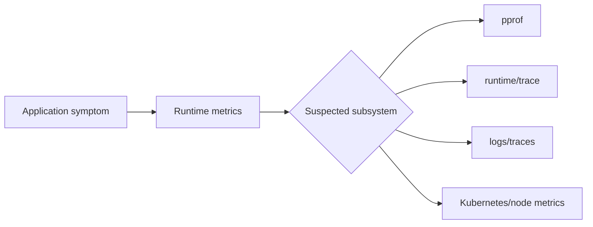
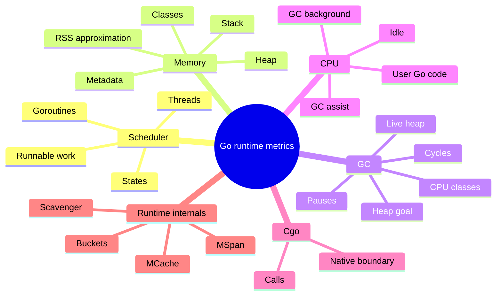
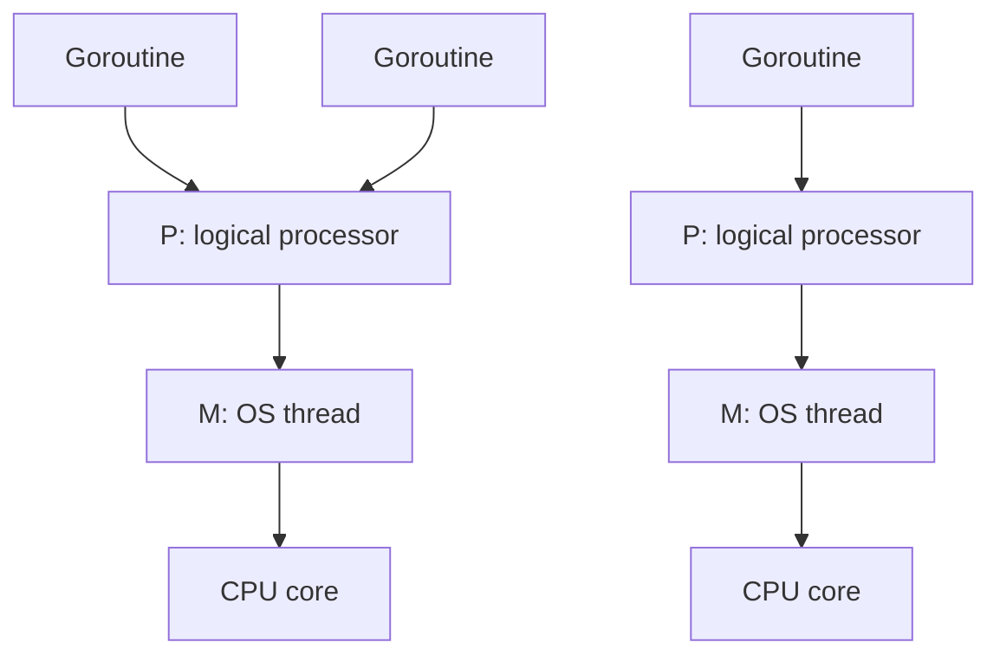
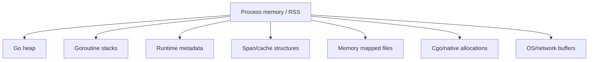
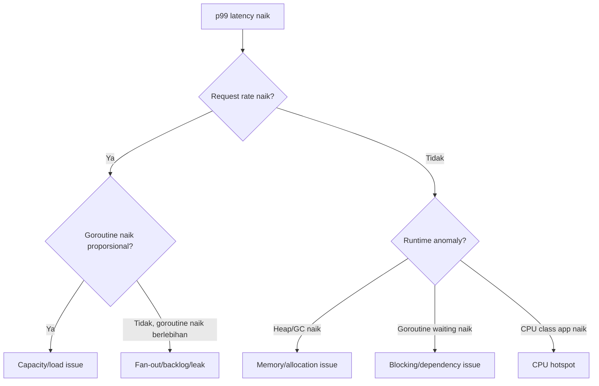
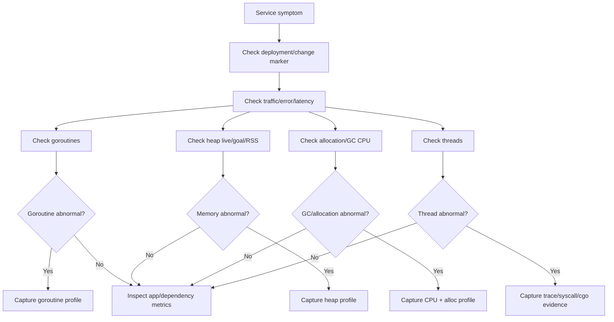

# learn-go-logging-observability-profiling-troubleshooting-part-007.md

# Part 007 — Runtime Metrics with `runtime/metrics`

> Seri: **Go Logging, Observability, Profiling, dan Troubleshooting**  
> Target pembaca: **Java software engineer / tech lead** yang ingin memahami Go runtime observability sampai level production engineering.  
> Fokus bagian ini: memahami runtime metrics sebagai sinyal internal Go runtime untuk membaca kesehatan goroutine, scheduler, GC, heap, stack, thread, dan memory pressure sebelum investigasi lebih mahal seperti `pprof` atau `runtime/trace`.

---

## 0. Posisi Part Ini dalam Seri

Di Part 005 kita membangun mental model metrics: counter, gauge, histogram, label cardinality, RED, USE, dan SLO. Di Part 006 kita masuk ke Prometheus instrumentation untuk application metrics.

Bagian ini berbeda.

Di sini kita tidak sedang membuat metrics bisnis seperti:

- jumlah request,
- latency endpoint,
- error ratio,
- queue depth,
- DB pool saturation.

Kita membaca **runtime Go itu sendiri**.

Dengan kata lain:

```text
Application metrics menjawab:
"Apa yang sedang dialami service dari sudut pandang domain dan API?"

Runtime metrics menjawab:
"Apa yang sedang terjadi di dalam process Go saat service mengalami kondisi itu?"
```

Contoh pertanyaan yang bisa dijawab runtime metrics:

1. Apakah jumlah goroutine meningkat terus?
2. Apakah heap tumbuh karena live data atau karena allocation churn?
3. Apakah GC terlalu sering?
4. Apakah service sedang terkena memory pressure?
5. Apakah OS thread meningkat tidak wajar?
6. Apakah scheduler mulai menunjukkan antrean atau state goroutine mencurigakan?
7. Apakah p99 latency spike berkorelasi dengan GC, goroutine growth, atau blocking?
8. Apakah service low CPU karena idle, atau karena semua goroutine blocked?

Runtime metrics bukan pengganti `pprof`. Runtime metrics adalah **early-warning and continuous runtime telemetry**. `pprof` adalah **deep diagnostic snapshot**.

---

## 1. Sumber Faktual Utama

Materi ini berdasarkan sumber primer berikut:

1. Go package documentation `runtime/metrics`: package ini menyediakan stable interface untuk mengakses implementation-defined metrics dari Go runtime.
2. Go 1.26 release notes: Go 1.26 menambah observability runtime terkait scheduler/goroutine dan menjadikan beberapa perubahan runtime/GC lebih relevan untuk operasional.
3. Go diagnostics documentation: menjelaskan hubungan profile, trace, execution tracer, runtime stats, dan caveat penggunaan diagnostic tools.
4. OpenTelemetry semantic conventions for Go runtime metrics: menjelaskan mapping runtime metrics ke konvensi telemetry modern.
5. Prometheus instrumentation conventions: untuk cara mengekspor runtime metrics tanpa merusak cardinality atau semantics.

Catatan penting: nama metrics di `runtime/metrics` dapat bertambah dari rilis ke rilis Go. Karena itu engineer production sebaiknya mendesain exporter yang toleran terhadap perubahan, bukan hard-code asumsi sempit tanpa validasi.

---

## 2. Mental Model: Runtime Metrics sebagai “Vitals” dari Process Go

Bayangkan service Go seperti tubuh manusia:

| Area tubuh | Sinyal medis | Padanan Go runtime |
|---|---|---|
| Detak jantung | heart rate | request rate / goroutine activity |
| Tekanan darah | blood pressure | memory pressure / heap goal pressure |
| Pernapasan | oxygen flow | scheduler throughput / runnable work |
| Suhu | fever | GC overhead / allocation rate |
| Refleks | nervous system response | latency / blocking / syscall behavior |
| Scan MRI | deep inspection | pprof / trace |

Runtime metrics adalah **vital signs**. Mereka tidak selalu memberi root cause final, tetapi memberi arah investigasi.

Contoh:

```text
Symptom:
p99 latency naik dari 80ms ke 2s.

Application metrics:
request latency naik, error belum naik.

Runtime metrics:
goroutine count naik dari 800 ke 90,000.

Interpretasi awal:
masalah mungkin bukan CPU murni; mungkin leak, blocked goroutine, queue buildup, missing cancellation, atau slow dependency.

Next diagnostic:
gambil goroutine profile.
```

Runtime metrics yang baik tidak menjawab semua hal, tetapi menjawab:

```text
Ke arah mana saya harus menggali?
```

---

## 3. Perbedaan dengan Java Mindset

Sebagai Java engineer, Anda mungkin terbiasa dengan:

- JVM memory pools,
- GC logs,
- JMX,
- Micrometer JVM metrics,
- thread dump,
- heap dump,
- JFR,
- safepoint logs,
- executor pool metrics,
- Netty event loop metrics.

Di Go, modelnya berbeda.

| Java/JVM | Go |
|---|---|
| OS thread visible as primary execution unit | goroutine adalah unit concurrency utama |
| thread dump sangat umum | goroutine profile lebih umum |
| heap dump object graph detail | heap profile sampling, bukan full heap dump standar seperti JVM |
| JMX/Micrometer common | Prometheus + runtime/metrics + pprof + trace common |
| GC logs often heavily analyzed | runtime metrics + gctrace + pprof lebih umum |
| explicit executor pools sering dominan | goroutine + channel + internal scheduler dominan |
| JVM has many memory regions | Go memory model lebih sederhana tetapi RSS/heap/stack/mspan/mcache/cgo tetap harus dibedakan |
| JFR one integrated event stream | Go memakai kombinasi pprof, runtime/trace, logs, metrics |

Kesalahan umum Java engineer saat masuk Go:

1. Mengira goroutine count setara thread count.
2. Mengira heap profile sama seperti Java heap dump.
3. Mengira GC pause satu-satunya GC problem.
4. Mengira CPU rendah berarti service sehat.
5. Mengira memory leak selalu terlihat sebagai heap object graph besar.
6. Mengira runtime metrics sudah cukup untuk root cause tanpa pprof.
7. Mengira `runtime.ReadMemStats` adalah satu-satunya sumber runtime stats.

Mental model yang lebih tepat:

```text
Go runtime observability = continuous runtime metrics + targeted pprof + execution trace + application telemetry.
```

---

## 4. Apa Itu `runtime/metrics`?

`runtime/metrics` adalah package standar Go untuk membaca metrics yang diekspor oleh Go runtime.

Secara konseptual:

```go
import "runtime/metrics"
```

Package ini menyediakan:

1. daftar metrics yang tersedia,
2. deskripsi setiap metric,
3. kind/unit metric,
4. fungsi untuk membaca sample metric.

`runtime/metrics` lebih modern dan lebih general dibanding hanya memakai `runtime.ReadMemStats`.

Perbedaan penting:

| Aspek | `runtime.ReadMemStats` | `runtime/metrics` |
|---|---|---|
| Fokus | terutama memory/GC | lebih luas: memory, GC, scheduler, CPU classes, goroutine, thread, dll |
| Format | struct tetap | daftar metric dinamis |
| Evolusi | terbatas oleh struct API | bisa bertambah seiring runtime berkembang |
| Cocok untuk exporter | bisa, tapi kurang fleksibel | lebih cocok |
| Semantics | perlu tahu field struct | setiap metric punya description/kind |

Prinsip desain:

```text
runtime/metrics adalah interface stabil untuk membaca sinyal runtime yang implementation-defined.
```

Artinya:

- API membaca metrics stabil.
- Set metrics dapat berevolusi.
- Metric baru bisa muncul pada versi Go baru.
- Exporter harus bisa menghadapi metric yang tidak tersedia di versi Go tertentu.

---

## 5. Kenapa Runtime Metrics Penting di Production?

Tanpa runtime metrics, Anda sering hanya punya gejala luar:

```text
latency naik
error naik
pod restart
CPU naik
memory naik
```

Tetapi gejala luar belum menjawab:

```text
mengapa process Go berperilaku seperti itu?
```

Runtime metrics membantu menghubungkan symptom ke subsystem:

| Symptom | Runtime metric yang membantu |
|---|---|
| latency spike | GC pauses, goroutine states, scheduler, heap growth |
| memory growth | heap live, heap objects, allocation rate, stack memory |
| OOMKilled | heap/RSS relation, memory classes, GC heap goal |
| high CPU | GC CPU, user CPU class, allocation churn |
| low CPU but stuck | goroutine states, blocking, syscall, thread count |
| growing pods memory | heap growth, stack growth, metadata, cgo/native suspicion |
| slow shutdown | goroutine count, blocked goroutine, context cancellation evidence |
| connection leaks | goroutine growth + network wait profile later |
| queue backlog | goroutine states + application queue metrics |

Runtime metrics menjadi jembatan antara:



---

## 6. Cara Membaca Runtime Metrics Secara Programatik

Contoh minimal:

```go
package main

import (
	"fmt"
	"runtime/metrics"
)

func main() {
	descs := metrics.All()
	for _, d := range descs {
		fmt.Printf("%s | kind=%v | cumulative=%v\n", d.Name, d.Kind, d.Cumulative)
		fmt.Println("  ", d.Description)
	}
}
```

Untuk membaca sample spesifik:

```go
package main

import (
	"fmt"
	"runtime/metrics"
)

func main() {
	samples := []metrics.Sample{
		{Name: "/sched/goroutines:goroutines"},
		{Name: "/gc/heap/live:bytes"},
		{Name: "/gc/heap/goal:bytes"},
	}

	metrics.Read(samples)

	for _, s := range samples {
		fmt.Printf("%s = %v\n", s.Name, s.Value)
	}
}
```

Tetapi contoh di atas belum production-grade karena:

1. tidak validasi apakah metric ada,
2. tidak handle kind berbeda,
3. tidak expose ke Prometheus/OTel,
4. tidak menghindari panic pada kind mismatch,
5. tidak menjaga semantic type.

---

## 7. Struktur Nama Metric

Nama metric runtime biasanya memiliki pola:

```text
/<namespace>/<subsystem>/<name>:<unit-or-kind>
```

Contoh umum:

```text
/gc/heap/live:bytes
/gc/heap/goal:bytes
/sched/goroutines:goroutines
/memory/classes/heap/objects:bytes
/cpu/classes/gc/mark/assist:cpu-seconds
```

Elemen penting:

| Bagian | Makna |
|---|---|
| `/gc` | subsystem garbage collector |
| `/sched` | scheduler/goroutine/thread subsystem |
| `/memory` | memory classes |
| `/cpu` | CPU time classes |
| `:bytes` | unit bytes |
| `:cpu-seconds` | cumulative CPU seconds |
| `:goroutines` | count goroutines |
| `:objects` | count objects |

Nama metric mengandung unit. Ini penting karena exporter perlu mapping unit ke metric type yang benar.

---

## 8. Metric Value Kind

`runtime/metrics` tidak hanya mengembalikan angka float. Ia punya value kind.

Secara konseptual, value bisa berupa:

1. unsigned integer,
2. float64,
3. float64 histogram,
4. bad/unsupported kind.

Pseudocode handling:

```go
switch sample.Value.Kind() {
case metrics.KindUint64:
	v := sample.Value.Uint64()
	_ = v
case metrics.KindFloat64:
	v := sample.Value.Float64()
	_ = v
case metrics.KindFloat64Histogram:
	h := sample.Value.Float64Histogram()
	_ = h
case metrics.KindBad:
	// metric unavailable or invalid
}
```

Production implication:

- Jangan menganggap semua metric adalah gauge scalar.
- Histogram runtime harus diekspor sebagai histogram, bukan diringkas sembarangan.
- Cumulative metrics harus diperlakukan sebagai counter/rate.
- Instantaneous metrics harus diperlakukan sebagai gauge.

---

## 9. Runtime Metrics Taxonomy

Untuk belajar efektif, kita kelompokkan runtime metrics ke beberapa keluarga:



Dalam production, Anda jarang membaca semua metric satu per satu. Anda membangun dashboard dan alert dari subset yang menjawab pertanyaan operasional.

---

## 10. Scheduler Metrics

### 10.1 Mengapa Scheduler Metrics Penting?

Go scheduler adalah layer yang menjalankan goroutine di atas OS thread.

Model sederhananya:



Jika service bermasalah, scheduler metrics membantu menjawab:

1. Apakah goroutine bertambah terus?
2. Apakah banyak goroutine blocked?
3. Apakah OS thread meningkat?
4. Apakah ada indikasi goroutine creation storm?
5. Apakah concurrency sedang terkendali atau liar?

### 10.2 Goroutine Count

Metric paling terkenal:

```text
/sched/goroutines:goroutines
```

Makna:

```text
Jumlah goroutine yang saat ini hidup dalam process.
```

Interpretasi:

| Pola | Kemungkinan arti |
|---|---|
| stabil rendah | normal |
| naik saat traffic naik, turun lagi | normal burst |
| naik terus tanpa turun | leak atau backlog |
| sangat tinggi dan CPU tinggi | work explosion, retry storm, fan-out liar |
| sangat tinggi dan CPU rendah | banyak goroutine blocked/waiting |
| turun mendadak | crash/restart/shutdown/error path massal |

Contoh alert yang buruk:

```text
alert if goroutines > 1000
```

Kenapa buruk?

Karena normal untuk satu service punya 2.000 goroutine jika workload-nya memang banyak koneksi, worker, timers, dan background tasks.

Alert yang lebih baik:

```text
alert if goroutines increased 5x above baseline for 15m
and request rate is not increasing proportionally
```

Atau:

```text
alert if goroutines keep increasing while throughput is flat or falling
```

### 10.3 Goroutine States di Go 1.26

Go 1.26 menambah runtime metrics yang memberi insight lebih baik ke goroutine scheduling, termasuk state goroutine dan total goroutine created.

Secara operasional, state goroutine membantu membedakan:

```text
Banyak goroutine karena banyak kerja aktif
vs
banyak goroutine karena banyak yang menunggu/blocking/leak.
```

Contoh interpretasi state-level:

| Dominan state | Kemungkinan investigasi |
|---|---|
| runnable meningkat | CPU/scheduler pressure, GOMAXPROCS, CPU throttling |
| waiting meningkat | blocked on channel, timer, select, network, cond |
| syscall meningkat | syscall/network/file IO pressure |
| dead/leak-related suspicious profile | perlu goroutine profile / goroutine leak profile |

Catatan: nama spesifik metrics scheduler dapat berbeda antar versi Go. Selalu gunakan `metrics.All()` untuk inspeksi runtime yang benar pada versi Go Anda.

### 10.4 Total Goroutines Created

Metric total goroutine created bersifat cumulative.

Makna operasional:

```text
Seberapa cepat program membuat goroutine dari waktu ke waktu.
```

Yang Anda cari bukan hanya totalnya, tetapi rate:

```promql
rate(go_sched_goroutines_created_total[5m])
```

Interpretasi:

| Pola | Kemungkinan arti |
|---|---|
| creation rate mengikuti request rate | normal jika per-request goroutine memang dibuat |
| creation rate naik tajam tanpa traffic naik | retry storm, timer storm, loop spawn bug |
| creation rate tinggi + live goroutine stabil | churn tinggi, mungkin overhead tapi bukan leak |
| creation rate tinggi + live goroutine naik | leak/backlog/fan-out runaway |

### 10.5 OS Thread Metrics

Go scheduler membuat dan memakai OS thread untuk menjalankan goroutine, syscall, cgo, dan blocking operation tertentu.

Thread count meningkat bisa berarti:

1. banyak syscall blocking,
2. cgo blocking,
3. locked OS thread,
4. scheduler harus membuat thread tambahan,
5. program memakai `runtime.LockOSThread`,
6. external library/native binding bermasalah.

Interpretasi:

| Pola | Kemungkinan arti |
|---|---|
| thread count stabil | normal |
| thread count naik perlahan | syscall/cgo/thread leak suspicion |
| thread count naik saat downstream lambat | goroutine masuk syscall/network wait |
| thread tinggi + goroutine rendah | cgo/native/thread issue |

---

## 11. Memory Metrics: Jangan Hanya Lihat “Heap”

Memory Go process tidak hanya heap.

Process memory bisa terdiri dari:



Kesalahan umum:

```text
RSS naik => heap leak
```

Belum tentu.

Bisa saja:

1. heap naik,
2. stack memory naik karena goroutine explosion,
3. runtime metadata naik,
4. cgo/native memory naik,
5. mmap/file buffer,
6. memory belum dikembalikan ke OS,
7. container accounting berbeda,
8. GC belum menurunkan live heap.

### 11.1 Heap Live

Metric penting:

```text
/gc/heap/live:bytes
```

Makna:

```text
Estimasi heap bytes yang masih live setelah GC terakhir.
```

Interpretasi:

| Pola | Arti |
|---|---|
| live heap stabil | retained data stabil |
| live heap naik terus | kemungkinan retained memory leak/cache growth |
| live heap sawtooth tapi baseline naik | leak perlahan atau working set naik |
| live heap naik seiring traffic dan turun setelah traffic turun | load-related working set |

### 11.2 Heap Goal

Metric:

```text
/gc/heap/goal:bytes
```

Makna:

```text
Target ukuran heap sebelum GC berikutnya, dipengaruhi GOGC dan memory limit.
```

Relasi penting:

```text
heap live -> heap goal -> allocation until next GC
```

Jika live heap naik, heap goal biasanya ikut naik.

Jika memory limit ketat, heap goal bisa ditekan sehingga GC lebih sering.

### 11.3 Heap Objects

Metric seperti:

```text
/gc/heap/objects:objects
```

Makna:

```text
Jumlah object heap live.
```

Interpretasi:

| Heap bytes | Object count | Kemungkinan |
|---|---|---|
| naik | naik | banyak object retained |
| naik | stabil | object besar retained |
| stabil | naik | banyak object kecil, overhead metadata mungkin relevan |
| turun | naik | object kecil menggantikan object besar; perlu profile |

### 11.4 Allocation Rate

Allocation metric biasanya cumulative. Yang penting adalah rate.

Contoh konsep PromQL:

```promql
rate(go_gc_heap_allocs_bytes_total[5m])
```

Allocation rate tinggi tidak otomatis leak.

Perbedaan:

| Kondisi | Allocation rate | Live heap |
|---|---:|---:|
| high churn | tinggi | stabil |
| leak | mungkin sedang/tinggi | naik |
| normal burst | naik saat traffic naik | naik lalu turun |
| cache warmup | tinggi awal | naik sampai plateau |

### 11.5 Stack Memory

Goroutine stack dimulai kecil dan tumbuh sesuai kebutuhan. Banyak goroutine berarti total stack memory bisa signifikan.

Jika goroutine count naik, periksa juga stack memory.

Pola:

```text
goroutine count naik + stack memory naik = concurrency/leak/backlog berdampak ke memory.
```

### 11.6 Memory Classes

Runtime metrics menyediakan memory classes untuk membedakan kategori memory.

Secara mental:

| Class | Makna operasional |
|---|---|
| heap objects | memory object aplikasi yang live |
| heap free/unused/released | memory heap yang free/idle/released |
| stack | goroutine stack |
| metadata | runtime allocator/GC metadata |
| total | total memory yang diketahui runtime |

Gunanya:

```text
Jika RSS naik tetapi heap live tidak naik, lihat memory classes lain.
```

---

## 12. GC Metrics

Garbage collector di Go memengaruhi:

1. CPU,
2. latency,
3. memory footprint,
4. allocation throughput,
5. tail behavior.

Runtime metrics memberi sinyal GC lebih halus dari sekadar “pause time”.

### 12.1 GC Cycle Count

GC cycle count biasanya cumulative. Yang penting rate:

```promql
rate(go_gc_cycles_total[5m])
```

Interpretasi:

| Pola | Kemungkinan |
|---|---|
| cycle rate stabil | normal |
| cycle rate naik seiring allocation rate | normal load increase |
| cycle rate naik tanpa traffic naik | allocation regression |
| cycle rate sangat tinggi + heap goal dekat memory limit | memory limit pressure |

### 12.2 GC Pause Histogram

Pause histogram menjawab:

```text
Seberapa lama stop-the-world pause terjadi?
```

Tetapi Go GC modern lebih banyak concurrent. Jangan hanya fokus ke pause.

Masalah GC bisa muncul sebagai:

1. pause spike,
2. GC CPU meningkat,
3. mark assist mengganggu goroutine aplikasi,
4. heap goal ditekan memory limit,
5. allocation throughput turun,
6. latency naik karena CPU digunakan GC.

### 12.3 GC CPU Classes

Runtime metrics punya CPU classes, misalnya waktu CPU untuk:

1. user Go code,
2. GC mark assist,
3. GC background,
4. GC idle,
5. total CPU.

Interpretasi mark assist:

```text
Jika GC mark assist CPU naik, goroutine aplikasi membantu kerja GC karena allocation pressure.
```

Dampak:

- latency request bisa naik,
- CPU profile mungkin menunjukkan runtime GC frames,
- allocation optimization lebih berguna daripada tuning sembarangan.

### 12.4 GOGC dan GOMEMLIMIT dari Sudut Observability

`GOGC` mengatur target growth relatif terhadap live heap.

Secara sederhana:

```text
GOGC lebih tinggi -> heap goal lebih besar -> GC lebih jarang -> memory lebih besar.
GOGC lebih rendah -> heap goal lebih kecil -> GC lebih sering -> memory lebih kecil tapi CPU GC bisa naik.
```

`GOMEMLIMIT` memberi soft memory limit ke runtime.

Jika memory limit terlalu dekat dengan live heap:

```text
runtime akan dipaksa GC lebih agresif.
```

Gejala:

1. GC cycle rate naik,
2. GC CPU naik,
3. heap goal dekat live heap,
4. application throughput turun,
5. latency naik,
6. memory tetap sulit turun karena live data memang besar.

### 12.5 Green Tea GC di Go 1.26

Go 1.26 menjadikan Green Tea GC sebagai default. Dari sisi observability, implikasinya bukan berarti “tidak perlu memonitor GC”. Justru baseline runtime dapat berubah setelah upgrade.

Setelah upgrade Go runtime:

1. bandingkan allocation rate,
2. bandingkan live heap,
3. bandingkan GC CPU,
4. bandingkan pause distribution,
5. bandingkan p95/p99 latency,
6. bandingkan memory footprint,
7. bandingkan CPU per request.

Rule:

```text
Go runtime upgrade adalah operational change. Treat it like performance-sensitive dependency upgrade.
```

---

## 13. CPU Class Metrics

CPU metrics runtime menjawab:

```text
Ke mana waktu CPU process Go digunakan?
```

Kategori umum:

| CPU class | Makna |
|---|---|
| user/application | menjalankan kode Go aplikasi |
| GC total | CPU untuk GC |
| GC mark assist | CPU GC yang dibayar goroutine aplikasi |
| GC background | CPU GC background workers |
| idle | idle GC resources |
| scavenger | memory scavenging |

Contoh interpretasi:

```text
High CPU process
+ high application CPU
=> cari CPU hotspot dengan CPU pprof.

High CPU process
+ high GC CPU
=> cari allocation churn, live heap, GOGC/GOMEMLIMIT pressure.

High latency
+ low CPU
+ high waiting goroutines
=> kemungkinan blocking/dependency/lock, bukan CPU.
```

---

## 14. Runtime Metrics vs `pprof`

Perbedaan utama:

| Aspek | Runtime metrics | pprof |
|---|---|---|
| Sifat | continuous time series | snapshot/sample diagnostic |
| Overhead | rendah | tergantung profile |
| Pertanyaan | “subsystem mana bermasalah?” | “fungsi/kode mana penyebabnya?” |
| Cocok untuk alert | ya | tidak langsung |
| Cocok untuk root cause detail | terbatas | ya |
| Retention | bisa lama | biasanya artifact incident |
| Granularity | process/subsystem | stack/function/call path |

Contoh:

```text
runtime metrics:
heap live naik terus.

pprof heap:
retained by map in cache.go:87.
```

```text
runtime metrics:
goroutine count naik terus.

pprof goroutine:
80,000 goroutines blocked on channel receive in worker.go:141.
```

```text
runtime metrics:
GC CPU naik.

pprof alloc_space:
json.Marshal path allocates heavily in response builder.
```

Runtime metrics memberi **where to look**. pprof memberi **what code path**.

---

## 15. Runtime Metrics vs `runtime/trace`

`runtime/trace` lebih detail untuk scheduling, blocking, syscalls, GC timeline, dan goroutine execution.

| Aspek | Runtime metrics | runtime/trace |
|---|---|---|
| Time series | ya | tidak seperti metrics biasa |
| Continuous | ya | biasanya short capture |
| Scheduler detail | agregat | sangat detail timeline |
| Blocking detail | indikasi | detail event |
| Overhead | rendah | lebih tinggi, capture pendek |
| Use case | dashboard/alert/triage | deep latency/scheduling investigation |

Workflow:

```text
runtime metrics menunjukkan runnable goroutine spike
=> ambil execution trace 5-10 detik saat incident
=> lihat scheduler latency, goroutine states, blocking timeline.
```

---

## 16. Runtime Metrics vs Application Metrics

Application metrics:

```text
http_requests_total
http_request_duration_seconds
jobs_processed_total
queue_depth
external_call_duration_seconds
```

Runtime metrics:

```text
/sched/goroutines:goroutines
/gc/heap/live:bytes
/gc/heap/goal:bytes
/cpu/classes/gc/...
/memory/classes/...
```

Keduanya harus dikorelasikan.

Contoh analisis:



---

## 17. Exporting Runtime Metrics ke Prometheus

Ada beberapa pendekatan:

### 17.1 Menggunakan Go Collector dari Prometheus Client

Prometheus Go client menyediakan collector runtime Go. Ini cukup untuk banyak kasus.

Kelebihan:

1. mudah,
2. standar,
3. umum dipakai,
4. minim custom code.

Kekurangan:

1. mapping tidak selalu mencakup semua runtime metrics terbaru,
2. naming mengikuti client library,
3. custom dashboard mungkin perlu memahami mapping.

Contoh umum:

```go
reg := prometheus.NewRegistry()
reg.MustRegister(prometheus.NewGoCollector())
reg.MustRegister(prometheus.NewProcessCollector(prometheus.ProcessCollectorOpts{}))

http.Handle("/metrics", promhttp.HandlerFor(reg, promhttp.HandlerOpts{}))
```

### 17.2 Custom Runtime Metrics Exporter

Jika Anda butuh metrics tertentu dari `runtime/metrics`, buat custom collector.

Namun hati-hati:

1. jangan expose metric tanpa memahami semantics,
2. jangan ubah cumulative metric menjadi gauge,
3. jangan flatten histogram sembarangan,
4. jangan membuat label dari metric name secara liar,
5. jangan crash jika metric tidak tersedia.

### 17.3 Mapping Naming

Runtime metric name:

```text
/gc/heap/live:bytes
```

Prometheus style:

```text
go_gc_heap_live_bytes
```

Rules:

1. unit menjadi suffix,
2. namespace jelas,
3. cumulative menjadi `_total`,
4. histogram menjadi `_bucket`, `_sum`, `_count`,
5. label harus bounded.

---

## 18. Exporting Runtime Metrics ke OpenTelemetry

OpenTelemetry punya semantic convention untuk Go runtime metrics.

Konsep penting:

1. runtime metrics bisa dikonversi ke OTel metrics,
2. resource attributes harus menyertakan service identity,
3. instrument scope harus jelas,
4. units harus benar,
5. cumulative vs gauge semantics harus benar.

Contoh resource attributes:

```text
service.name=payment-api
service.version=2026.06.23-abc123
service.instance.id=pod/payment-api-74f8c9
telemetry.sdk.language=go
```

Dalam environment multi-service, runtime metrics tanpa resource identity tidak berguna.

---

## 19. Dashboard Runtime Metrics Minimum

Dashboard runtime Go minimum sebaiknya punya panel:

### 19.1 Overview

1. goroutine count,
2. goroutine creation rate,
3. OS thread count,
4. heap live,
5. heap goal,
6. allocation rate,
7. GC cycle rate,
8. GC CPU fraction/class,
9. GC pause p50/p95/p99,
10. stack memory,
11. runtime memory total,
12. process RSS,
13. CPU usage,
14. restarts/OOMKilled if Kubernetes.

### 19.2 Correlation Panels

Panel yang lebih berguna adalah correlation:

```text
request rate vs goroutine count
request rate vs allocation rate
p99 latency vs GC CPU
p99 latency vs goroutine count
heap live vs container memory usage
GC cycles vs allocation rate
thread count vs outbound dependency latency
```

### 19.3 Bad Dashboard Pattern

Dashboard buruk:

```text
Panel 1: goroutine count
Panel 2: heap bytes
Panel 3: GC count
```

Tanpa:

- traffic,
- latency,
- error,
- deployment marker,
- container memory,
- CPU,
- baseline.

Dashboard seperti ini sering membuat engineer salah menyimpulkan.

Dashboard baik menjawab:

```text
Apakah runtime behavior berubah karena load, release, dependency, atau bug internal?
```

---

## 20. Alerting dari Runtime Metrics

Runtime metrics bisa menjadi alert, tetapi harus hati-hati.

### 20.1 Alert yang Baik

Alert runtime yang baik biasanya:

1. berbasis trend,
2. dikorelasikan dengan service symptom,
3. memakai baseline,
4. punya action jelas,
5. tidak page untuk noise kecil.

Contoh:

```text
Page if:
p99 latency SLO burn high
AND GC CPU > 25% for 10m
AND allocation rate increased > 3x baseline.
```

Action:

```text
Capture CPU profile and allocation profile.
Check recent deployment.
Inspect endpoint allocation regression.
```

### 20.2 Alert yang Buruk

```text
goroutines > 1000
```

Buruk karena:

1. tidak tahu normal baseline,
2. tidak tahu traffic,
3. tidak tahu state goroutine,
4. bisa sangat noisy.

Lebih baik:

```text
goroutine count 4x above 7-day p95 baseline for 15m
AND request rate not 2x above baseline
```

Atau:

```text
goroutine count monotonically increasing for 30m
AND no corresponding throughput increase
```

### 20.3 Runtime Alerts sebagai Ticket vs Page

Tidak semua runtime anomaly harus page.

| Alert | Severity |
|---|---|
| heap live slowly increasing over days | ticket/investigate |
| goroutine monotonic growth with latency impact | page |
| GC CPU high but SLO unaffected | warning/ticket |
| memory near container limit + OOM risk | page |
| thread count spike after deploy | warning/page depending impact |
| allocation rate regression in canary | deployment gate |

---

## 21. Production Interpretation Patterns

### Pattern 1: Goroutine Leak

Signals:

```text
goroutine count naik terus
throughput flat
after traffic drop goroutine tidak turun
stack memory naik
latency mungkin naik
```

Next steps:

1. ambil goroutine profile,
2. grouping stack,
3. cari blocked channel/network/timer,
4. korelasikan dengan release,
5. buat reproducer/test leak.

Common causes:

- missing context cancellation,
- response body not closed,
- worker goroutine never exits,
- channel send blocked forever,
- fan-out without draining,
- retry loop spawning goroutines,
- timer/ticker not stopped.

### Pattern 2: Allocation Churn

Signals:

```text
allocation rate tinggi
GC cycle rate tinggi
GC CPU tinggi
live heap relatif stabil
CPU naik
latency naik
```

Interpretasi:

```text
Bukan leak utama. Ini churn.
```

Next steps:

1. ambil allocation profile (`alloc_space`),
2. lihat hot allocation path,
3. benchmark path,
4. kurangi allocation,
5. validasi dengan profile diff.

Common causes:

- JSON encoding/decoding repeated,
- building strings with concatenation,
- regex per request,
- `fmt.Sprintf` hot path,
- unnecessary `[]byte`/`string` conversions,
- logging field construction before level check,
- excessive map allocation.

### Pattern 3: Retained Heap Leak

Signals:

```text
heap live naik terus
heap goal naik
GC cycles terjadi tapi baseline live tidak turun
container memory naik
allocation rate mungkin normal atau tinggi
```

Next steps:

1. ambil heap profile `inuse_space`,
2. diff profile sebelum/sesudah growth,
3. identifikasi retaining path,
4. cek cache/map/slice/global references,
5. cek goroutine yang retain object.

Common causes:

- unbounded map/cache,
- slice retaining large backing array,
- never deleting tenant/session data,
- metrics labels high cardinality,
- logger buffer retention,
- pending queue unbounded.

### Pattern 4: Memory Limit Thrashing

Signals:

```text
container memory dekat limit
heap goal dekat live heap
GC cycle rate tinggi
GC CPU tinggi
throughput turun
latency naik
heap live tidak turun signifikan
```

Interpretasi:

```text
Runtime dipaksa berusaha memenuhi memory limit, tetapi live data terlalu besar.
```

Mitigation:

1. reduce concurrency,
2. reduce cache,
3. increase memory limit/request,
4. reduce batch size,
5. traffic shift,
6. fix retained memory.

### Pattern 5: Low CPU, High Latency

Signals:

```text
latency tinggi
CPU rendah
GC tidak tinggi
goroutine count tinggi atau waiting state tinggi
thread mungkin stabil
```

Interpretasi:

```text
Kemungkinan blocking/dependency/lock, bukan CPU bottleneck.
```

Next steps:

1. traces untuk critical path,
2. goroutine profile,
3. block profile,
4. mutex profile,
5. outbound dependency metrics,
6. DB pool metrics.

### Pattern 6: Thread Growth

Signals:

```text
OS thread count naik
cgo/syscall/network wait mungkin naik
goroutine count belum tentu naik proporsional
```

Common causes:

- cgo call blocking,
- syscall-heavy workload,
- DNS resolver behavior,
- file/network blocking,
- `LockOSThread`,
- native library issue.

Next steps:

1. inspect cgo usage,
2. inspect syscall/blocking profile,
3. inspect runtime trace,
4. inspect OS process threads,
5. inspect dependency latency.

---

## 22. Designing Runtime Observability Package

Dalam service production, Anda bisa punya package internal:

```text
internal/observability/runtime
```

Tanggung jawab:

1. expose Go runtime metrics,
2. configure Go collector,
3. configure process collector,
4. expose build info,
5. optionally expose selected `runtime/metrics`,
6. provide dashboard documentation,
7. provide alert rule templates.

Contoh layout:

```text
internal/observability/
  logger.go
  metrics.go
  runtime.go
  tracing.go
  pprof.go
  middleware.go
```

Prinsip:

```text
Application code tidak boleh tersebar membaca runtime metrics secara manual.
```

Kenapa?

Karena:

1. semantics bisa salah,
2. duplicate exporter,
3. naming tidak konsisten,
4. cardinality berantakan,
5. sulit governance.

---

## 23. Contoh Runtime Metrics Reader yang Lebih Aman

Contoh berikut bukan exporter penuh, tetapi menunjukkan prinsip validasi metric availability.

```go
package runtimemetrics

import (
	"fmt"
	"runtime/metrics"
)

type Snapshot struct {
	Goroutines uint64
	HeapLive   uint64
	HeapGoal   uint64
}

func ReadSnapshot() (Snapshot, error) {
	wanted := []string{
		"/sched/goroutines:goroutines",
		"/gc/heap/live:bytes",
		"/gc/heap/goal:bytes",
	}

	available := make(map[string]metrics.Description)
	for _, d := range metrics.All() {
		available[d.Name] = d
	}

	for _, name := range wanted {
		if _, ok := available[name]; !ok {
			return Snapshot{}, fmt.Errorf("runtime metric %q not available", name)
		}
	}

	samples := []metrics.Sample{
		{Name: wanted[0]},
		{Name: wanted[1]},
		{Name: wanted[2]},
	}

	metrics.Read(samples)

	for _, s := range samples {
		if s.Value.Kind() != metrics.KindUint64 {
			return Snapshot{}, fmt.Errorf("runtime metric %q has unexpected kind %v", s.Name, s.Value.Kind())
		}
	}

	return Snapshot{
		Goroutines: samples[0].Value.Uint64(),
		HeapLive:   samples[1].Value.Uint64(),
		HeapGoal:   samples[2].Value.Uint64(),
	}, nil
}
```

Production lessons:

1. check availability,
2. check kind,
3. fail explicitly during startup if required metric missing,
4. avoid silent zero values,
5. avoid exposing wrong type.

---

## 24. Example: Correlating Runtime Metrics with Request Metrics

Misalnya Anda punya metrics:

```text
http_server_requests_total
http_server_request_duration_seconds
http_server_errors_total
go_sched_goroutines
go_gc_heap_live_bytes
go_gc_heap_goal_bytes
go_gc_cycles_total
go_gc_cpu_seconds_total
```

### Scenario A: Traffic naik normal

```text
request rate naik 3x
goroutine naik 2x
allocation rate naik 3x
latency naik sedikit
error tetap rendah
```

Interpretasi:

```text
Load increase normal. Perlu capacity check, bukan bug langsung.
```

### Scenario B: Goroutine runaway

```text
request rate flat
goroutine naik 10x
latency naik
CPU rendah
heap/stack naik
```

Interpretasi:

```text
Kemungkinan blocked goroutine leak/backlog. Ambil goroutine profile.
```

### Scenario C: Allocation regression after deploy

```text
request rate sama
latency naik
CPU naik
allocation rate naik 5x
GC cycle rate naik
heap live stabil
```

Interpretasi:

```text
Allocation churn regression. Ambil allocation profile dan compare release.
```

### Scenario D: Retained memory growth

```text
request rate sama
heap live naik per jam
heap goal naik
GC terjadi tapi live baseline tetap naik
container memory mendekati limit
```

Interpretasi:

```text
Retained memory leak/cache growth. Ambil heap inuse profile.
```

---

## 25. PromQL Patterns untuk Runtime Metrics

Nama metric aktual tergantung exporter. Di bawah ini contoh konseptual.

### 25.1 Goroutine Growth Rate

```promql
increase(go_sched_goroutines[30m])
```

Lebih baik dengan baseline:

```promql
go_sched_goroutines
  > 4 * avg_over_time(go_sched_goroutines[7d])
```

### 25.2 Goroutine per Request Rate

```promql
go_sched_goroutines
/
clamp_min(rate(http_server_requests_total[5m]), 1)
```

Hati-hati: ini bukan formula universal, tetapi berguna untuk melihat abnormality.

### 25.3 Allocation Rate

```promql
rate(go_gc_heap_allocs_bytes_total[5m])
```

### 25.4 GC Cycle Rate

```promql
rate(go_gc_cycles_total[5m])
```

### 25.5 Heap Live vs Heap Goal Ratio

```promql
go_gc_heap_live_bytes / go_gc_heap_goal_bytes
```

Jika ratio sering mendekati 1 dan GC CPU tinggi, ada pressure.

### 25.6 Heap Live vs Container Limit

```promql
go_gc_heap_live_bytes / container_spec_memory_limit_bytes
```

Tetapi jangan lupa RSS bisa lebih besar dari heap live.

### 25.7 Runtime Memory vs RSS Gap

```promql
process_resident_memory_bytes - go_memory_classes_total_bytes
```

Gap besar bisa mengarah ke:

1. cgo/native,
2. mmap,
3. allocator/OS accounting,
4. runtime metric mapping issue,
5. non-Go memory.

---

## 26. Runtime Metrics dalam Kubernetes

Di Kubernetes, runtime metrics harus dibaca bersama:

1. container CPU usage,
2. CPU throttling,
3. memory working set,
4. memory limit,
5. restart count,
6. OOMKilled reason,
7. pod age,
8. deployment revision,
9. node pressure,
10. HPA events.

Contoh interpretasi:

```text
Go CPU rendah tapi latency tinggi.
Container CPU throttling tinggi.
```

Kemungkinan:

```text
Service tidak bisa memakai CPU sesuai kebutuhan karena CFS throttling.
Runtime metrics saja tidak cukup.
```

Contoh lain:

```text
heap live 600MB
container memory 1.7GB
limit 2GB
```

Interpretasi:

```text
Masalah memory bukan hanya live heap. Lihat stack, runtime metadata, mmap, cgo, RSS accounting, buffers.
```

---

## 27. Runtime Metrics dan Deployment

Runtime dashboard harus punya deployment markers.

Kenapa?

Karena banyak runtime anomaly adalah regression:

1. allocation rate naik setelah release,
2. goroutine count mulai bocor setelah release,
3. heap live baseline naik setelah feature flag,
4. thread count naik setelah library change,
5. GC CPU naik setelah payload format berubah,
6. memory limit thrash setelah config berubah.

Tanpa deployment marker, engineer sering melakukan “dashboard archaeology”.

Prinsip:

```text
Every runtime anomaly investigation starts with: what changed?
```

Perubahan bisa berupa:

1. app release,
2. Go version upgrade,
3. dependency upgrade,
4. config change,
5. traffic pattern change,
6. downstream latency change,
7. Kubernetes resource change,
8. node/kernel/container runtime change.

---

## 28. Runtime Metrics for Canary and Regression Gates

Runtime metrics bisa dipakai untuk canary analysis.

Bandingkan canary vs baseline:

1. CPU per request,
2. allocation bytes per request,
3. goroutine count normalized by RPS,
4. heap live after warmup,
5. GC CPU fraction,
6. GC cycles per request,
7. p99 latency,
8. error rate.

Contoh rule:

```text
Reject canary if:
allocation bytes/request > 1.5x baseline for 20m
AND request mix comparable
```

Atau:

```text
Reject canary if:
goroutine count slope positive for 30m
while baseline stable
```

Ini jauh lebih kuat daripada hanya melihat error rate.

---

## 29. Runtime Metrics Anti-Patterns

### 29.1 Treating Runtime Metrics as Root Cause

Salah:

```text
GC naik, berarti GC adalah root cause.
```

Lebih tepat:

```text
GC naik adalah symptom dari allocation/live heap/memory pressure.
Cari penyebab allocation atau retention.
```

### 29.2 Alerting on Absolute Goroutine Count

Salah:

```text
if goroutines > 1000 then page.
```

Lebih tepat:

```text
compare against baseline, traffic, state, and impact.
```

### 29.3 Ignoring Runtime Metrics During Load Test

Load test tanpa runtime metrics hanya menjawab throughput/latency, tetapi tidak menjawab sustainability.

Wajib pantau:

1. heap live plateau,
2. allocation rate,
3. GC CPU,
4. goroutine count,
5. stack memory,
6. thread count,
7. RSS.

### 29.4 Comparing Different Go Versions Without Caution

Go runtime implementation berubah. Metric behavior bisa berubah.

Saat upgrade Go:

1. re-baseline,
2. re-check dashboards,
3. re-check exporter mapping,
4. re-check alert thresholds.

### 29.5 Ignoring Process RSS

Runtime heap terlihat aman, tetapi pod OOM.

Kemungkinan:

1. stack memory,
2. cgo/native,
3. mmap,
4. fragmentation/accounting,
5. runtime metadata,
6. non-Go memory.

### 29.6 Exporting Every Metric Without Understanding

Tidak semua metric harus jadi dashboard/alert.

Rule:

```text
Export broadly if cheap, dashboard selectively, alert very selectively.
```

---

## 30. Incident Workflow: Runtime Metrics First Pass

Saat incident, gunakan flow berikut:



First pass questions:

1. Did traffic change?
2. Did release/config change?
3. Did goroutine count change?
4. Did heap live change?
5. Did allocation rate change?
6. Did GC CPU change?
7. Did OS thread count change?
8. Did RSS change more than heap?
9. Is latency correlated with any runtime signal?
10. Is the issue per instance or fleet-wide?

---

## 31. Load Test Runtime Checklist

Saat load test Go service, jangan hanya ukur RPS dan latency.

Checklist runtime:

```text
[ ] goroutine count reaches plateau
[ ] goroutine count drops after load stops
[ ] heap live reaches plateau
[ ] heap live drops or stabilizes after load stops
[ ] allocation bytes/request acceptable
[ ] GC CPU within target
[ ] GC pause distribution acceptable
[ ] process RSS below safe headroom
[ ] stack memory not growing unexpectedly
[ ] OS thread count stable
[ ] no monotonic growth after warmup
[ ] pprof captured at steady-state
[ ] pprof captured during peak
[ ] profile diff reviewed after optimization
```

A service that passes latency test but leaks goroutines is not production-ready.

---

## 32. Production Runtime SLO Support

Runtime metrics bukan SLO user langsung, tetapi support SLO.

| User-facing SLO | Runtime supporting signal |
|---|---|
| latency p99 | GC CPU, goroutine states, allocation rate |
| availability | OOM risk, restart count, panic logs |
| throughput | CPU class, scheduler pressure, GC overhead |
| freshness | worker goroutines, queue saturation, blocking |
| dependency reliability | goroutine wait, threads, outbound latency |

Rule:

```text
Never define SLO as "goroutine count must be below X".
Define SLO from user impact. Use runtime metrics as diagnostic and predictive signals.
```

---

## 33. Reference Runtime Dashboard Decision Table

| Observation | Ask next | Likely next tool |
|---|---|---|
| goroutines rising | what are they doing? | goroutine profile |
| heap live rising | what retains memory? | heap inuse profile |
| alloc rate rising | who allocates? | alloc_space profile |
| GC CPU rising | churn or live heap? | CPU + alloc profile |
| thread count rising | syscall/cgo? | trace / OS tools |
| latency high, CPU low | blocked where? | trace/block/mutex/goroutine profile |
| RSS >> heap | non-heap memory? | memory classes, cgo, OS tools |
| canary alloc higher | which code path changed? | profile diff |

---

## 34. Exercises

### Exercise 1 — Runtime Metrics Inventory

Buat program kecil yang mencetak semua metrics dari `runtime/metrics`:

1. name,
2. kind,
3. cumulative,
4. description.

Lalu kelompokkan ke:

1. scheduler,
2. GC,
3. heap,
4. memory classes,
5. CPU classes,
6. cgo/runtime internals.

Tujuan:

```text
Membiasakan diri bahwa metric set adalah kontrak runtime yang bisa diinspeksi, bukan asumsi hafalan.
```

### Exercise 2 — Goroutine Growth Simulation

Buat program yang membuat goroutine leak secara sengaja:

```go
func leak() {
	ch := make(chan struct{})
	go func() {
		<-ch
	}()
}
```

Loop panggil `leak()` setiap 100ms. Export goroutine metric.

Amati:

1. goroutine count,
2. stack memory,
3. heap live,
4. RSS.

Lalu ambil goroutine profile.

### Exercise 3 — Allocation Churn Simulation

Buat endpoint yang melakukan allocation besar per request tetapi tidak retain data.

Amati:

1. allocation rate,
2. GC cycle rate,
3. GC CPU,
4. heap live.

Lalu ambil allocation profile.

Tujuan:

```text
Membedakan churn dari leak.
```

### Exercise 4 — Retained Heap Simulation

Buat global map yang terus diisi dan tidak pernah dihapus.

Amati:

1. heap live,
2. heap goal,
3. GC cycles,
4. RSS,
5. OOM risk.

Ambil heap `inuse_space` profile.

### Exercise 5 — Runtime Dashboard

Buat dashboard minimal dengan panel:

1. request rate,
2. p99 latency,
3. error rate,
4. goroutine count,
5. heap live,
6. heap goal,
7. allocation rate,
8. GC cycle rate,
9. GC CPU,
10. RSS/container memory.

Lalu buat 3 skenario:

1. traffic spike normal,
2. goroutine leak,
3. allocation regression.

Tuliskan bagaimana dashboard terlihat pada masing-masing skenario.

---

## 35. Checklist Production Readiness Runtime Metrics

```text
[ ] Go runtime metrics exported
[ ] process metrics exported
[ ] runtime metrics include service/resource identity
[ ] dashboard has request/error/latency correlation
[ ] dashboard has deployment markers
[ ] goroutine baseline known
[ ] heap live baseline known
[ ] allocation rate baseline known
[ ] GC CPU baseline known
[ ] RSS vs heap gap visible
[ ] container memory limit visible
[ ] OOMKilled/restart visible
[ ] runtime alert rules use trend/baseline, not arbitrary absolute thresholds
[ ] pprof capture runbook linked from dashboard
[ ] trace capture runbook linked from dashboard
[ ] canary compares allocation and goroutine behavior
[ ] Go version upgrade includes runtime re-baseline
```

---

## 36. Key Takeaways

1. `runtime/metrics` adalah stable interface untuk membaca sinyal internal Go runtime.
2. Runtime metrics adalah vital signs process Go, bukan root cause final.
3. Goroutine count harus dibaca bersama traffic, state, stack memory, CPU, dan latency.
4. Heap live berbeda dari allocation rate; ini inti membedakan leak dan churn.
5. GC problem tidak selalu pause problem; GC CPU dan mark assist juga penting.
6. RSS lebih luas dari Go heap; OOM bisa terjadi walau heap live terlihat tidak ekstrem.
7. Runtime metrics membantu memilih diagnostic berikutnya: goroutine profile, heap profile, CPU profile, block/mutex profile, atau runtime trace.
8. Alert runtime harus berbasis trend, baseline, dan user impact.
9. Upgrade Go runtime harus diikuti re-baseline observability.
10. Runtime metrics yang dikorelasikan dengan application metrics menghasilkan troubleshooting yang jauh lebih cepat dan lebih defensible.

---

## 37. Bridge ke Part Berikutnya

Part berikutnya adalah:

```text
learn-go-logging-observability-profiling-troubleshooting-part-008.md
```

Judul:

```text
OpenTelemetry Go: Architecture and Trade-offs
```

Di bagian berikutnya kita akan naik satu layer:

```text
Dari membaca Go runtime sebagai process lokal
menuju mengirim telemetry vendor-neutral lintas service, environment, dan observability backend.
```

Kita akan membahas:

1. OpenTelemetry API vs SDK,
2. resource identity,
3. traces,
4. metrics,
5. logs,
6. OTLP,
7. collector topology,
8. direct export vs sidecar vs daemonset vs gateway,
9. sampling,
10. kapan OTel membantu dan kapan malah menambah kompleksitas.

---

## 38. Status Seri

Part ini adalah:

```text
Part 007 dari 032
```

Seri belum selesai.

<!-- NAVIGATION_FOOTER -->
<div class="page-nav">
<a href="./learn-go-logging-observability-profiling-troubleshooting-part-006.md">⬅️ Part 006 — Prometheus Instrumentation in Go</a>
<a href="./index.md">📚 Kategori</a>
<a href="../../index.md">🏠 Home</a>
<a href="./learn-go-logging-observability-profiling-troubleshooting-part-008.md">Part 008 — OpenTelemetry Go: Architecture and Trade-offs ➡️</a>
</div>
