# learn-go-logging-observability-profiling-troubleshooting-part-008.md

# Part 008 — OpenTelemetry Go: Architecture and Trade-offs

> Seri: `learn-go-logging-observability-profiling-troubleshooting`  
> Bagian: `008 / 032`  
> Fokus: OpenTelemetry Go sebagai arsitektur telemetry production, bukan sekadar library  
> Target pembaca: Java software engineer / tech lead yang ingin memahami observability Go sampai level internal engineering handbook

---

## 0. Posisi Part Ini Dalam Seri

Sebelum bagian ini, kita sudah membangun fondasi:

1. Observability sebagai cara sistem menjelaskan dirinya sendiri saat runtime.
2. Logging sebagai event evidence.
3. `log/slog` sebagai structured logging baseline Go.
4. Logging architecture untuk service nyata.
5. Error logging dan causal evidence.
6. Metrics mental model.
7. Prometheus instrumentation.
8. Go runtime metrics dengan `runtime/metrics`.

Bagian ini masuk ke layer yang lebih strategis: **OpenTelemetry**, atau sering disingkat **OTel**.

Namun bagian ini tidak akan langsung lompat ke “copy paste setup tracer provider”. Itu terlalu dangkal.

Kita akan membahas:

- apa masalah arsitektural yang diselesaikan OTel,
- apa yang tidak diselesaikan OTel,
- bagaimana OTel berbeda dari Prometheus-native instrumentation,
- bagaimana OTel Go bekerja,
- kapan memakai OTel langsung ke backend,
- kapan memakai Collector,
- bagaimana topology production-nya,
- bagaimana trade-off cost, coupling, sampling, cardinality, dan operability,
- bagaimana menyusun strategi adoption untuk organisasi/service Go.

Mental model penting:

> OpenTelemetry bukan “observability backend”. OpenTelemetry adalah **standard instrumentation and telemetry transport layer**.

Observability backend masih bisa Jaeger, Tempo, Zipkin, Prometheus, Mimir, Cortex, VictoriaMetrics, Datadog, New Relic, Honeycomb, Elastic, CloudWatch, Google Cloud Trace, Grafana Cloud, atau platform lain.

OTel berada di antara aplikasi dan backend.

---

## 1. Masalah Besar yang Diselesaikan OpenTelemetry

Tanpa OTel, banyak organisasi jatuh ke pola seperti ini:

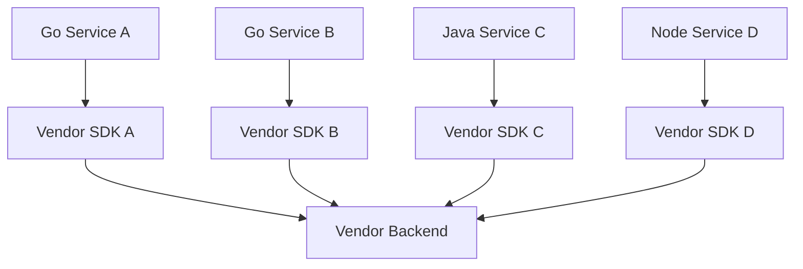

Awalnya terlihat praktis. Vendor menyediakan SDK, agent, dashboard, dan exporter. Masalah muncul setelah sistem bertumbuh:

1. Instrumentation terkunci ke vendor tertentu.
2. Migrasi observability backend menjadi mahal.
3. Setiap bahasa punya pola telemetry berbeda.
4. Trace context propagation tidak konsisten.
5. Metric naming tidak konsisten.
6. Correlation antara logs, metrics, traces sulit.
7. Sampling strategy tersebar di aplikasi.
8. Security/redaction/enrichment tersebar di tiap service.
9. Cost control sulit karena setiap service langsung kirim data ke backend.
10. Platform team sulit membuat policy telemetry secara konsisten.

OpenTelemetry mencoba memisahkan:

- **instrumentation contract** dari
- **telemetry processing** dari
- **observability backend**.

Dengan OTel, architecture ideal menjadi:

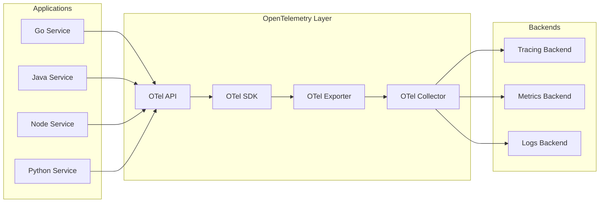

Aplikasi memakai API/SDK standar. Collector menerima, memproses, dan mengirim telemetry ke backend yang bisa berubah tanpa harus rewrite semua aplikasi.

---

## 2. Definisi Singkat OpenTelemetry

OpenTelemetry adalah framework open-source untuk:

1. **Instrument** aplikasi.
2. **Generate** telemetry data.
3. **Collect** telemetry data.
4. **Process** telemetry data.
5. **Export** telemetry data ke observability backend.

Tiga sinyal utama:

1. **Traces** — representasi perjalanan request/operation lintas boundary.
2. **Metrics** — measurements numerik agregatif/time-series.
3. **Logs** — event records.

Namun maturity tiap sinyal tidak selalu sama di setiap bahasa.

Untuk Go, tracing dan metrics adalah area yang paling matang untuk penggunaan production. Logs di OTel Go secara ekosistem masih perlu dipahami hati-hati karena banyak organisasi tetap memakai logger native seperti `slog`, zap, atau zerolog, lalu melakukan correlation dengan trace ID/span ID, atau memakai bridge/handler tertentu.

Prinsipnya:

> Jangan memakai OTel karena hype. Pakai OTel jika ia menyelesaikan masalah standardisasi, correlation, vendor neutrality, dan telemetry pipeline di organisasi Anda.

---

## 3. Mental Model: API, SDK, Exporter, Collector

Empat komponen ini wajib jelas.

### 3.1 API

API adalah interface yang dipakai kode aplikasi untuk membuat telemetry.

Contoh secara konseptual:

```go
tracer := otel.Tracer("checkout-service")
ctx, span := tracer.Start(ctx, "ReserveInventory")
defer span.End()
```

Kode bisnis berinteraksi dengan API.

Mental model:

> API adalah contract compile-time untuk instrumentation.

Idealnya library package Anda bergantung pada API, bukan SDK.

Mengapa?

Karena library seharusnya tidak memutuskan:

- exporter apa yang dipakai,
- sampling policy apa,
- endpoint collector mana,
- batching policy apa,
- resource identity apa.

Itu keputusan aplikasi/platform.

### 3.2 SDK

SDK adalah implementation runtime yang benar-benar:

- membuat span,
- menyimpan span context,
- menjalankan sampler,
- mem-batch telemetry,
- mengirim ke exporter,
- mengelola shutdown/flush.

Mental model:

> SDK adalah engine telemetry di dalam process.

Aplikasi executable biasanya menginisialisasi SDK.

Library sebaiknya tidak.

### 3.3 Exporter

Exporter mengirim telemetry ke tujuan tertentu.

Contoh:

- OTLP gRPC exporter.
- OTLP HTTP exporter.
- stdout exporter untuk development.
- Prometheus exporter untuk metrics.

Mental model:

> Exporter adalah adapter dari SDK ke transport/backend.

Exporter bukan tempat ideal untuk business logic.

### 3.4 Collector

Collector adalah proses terpisah yang bisa menerima, memproses, dan mengekspor telemetry.

Collector dapat menjalankan pipeline seperti:

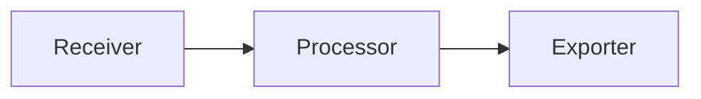

Lebih realistis:

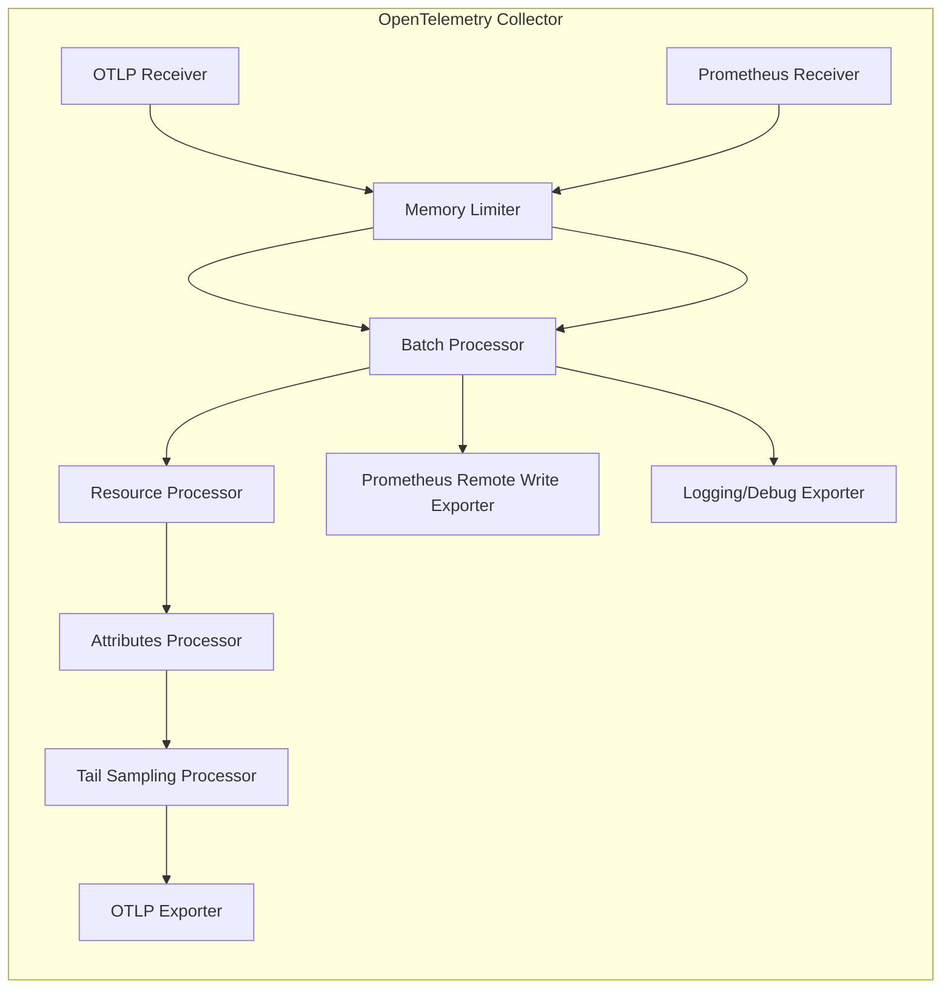

Collector adalah telemetry control plane/data plane boundary.

---

## 4. Kenapa Ini Penting untuk Go Engineer

Dari perspektif Java engineer, Anda mungkin terbiasa dengan stack seperti:

- SLF4J + Logback/Log4j2,
- Micrometer,
- OpenTelemetry Java agent,
- Spring Boot Actuator,
- JFR,
- Prometheus endpoint,
- Zipkin/Jaeger tracing.

Di Go, ekosistemnya lebih eksplisit.

Go tidak punya Spring Boot Actuator default. Go tidak punya JVM-style managed platform dengan satu standar framework dominan. Anda sering menyusun sendiri:

- logger,
- metrics endpoint,
- tracer provider,
- HTTP middleware,
- pprof server,
- health endpoint,
- runtime metrics exporter,
- graceful shutdown flushing.

Artinya Go memberi kontrol lebih besar, tetapi juga menuntut desain yang lebih disiplin.

OpenTelemetry membantu membuat discipline lintas-service, tetapi tidak menghilangkan kebutuhan desain.

Kesalahan umum engineer yang pindah dari Java ke Go:

| Java mindset | Risiko di Go |
|---|---|
| Framework akan auto-instrument semuanya | Banyak instrumentation perlu manual atau explicit middleware |
| Agent bisa menyelesaikan semua correlation | Context propagation tetap harus benar |
| Metrics otomatis cukup | Runtime/app metrics harus dirancang sesuai service behavior |
| Logging bisa bebas string karena parser downstream | Go service sebaiknya structured sejak awal |
| Thread dump = observability utama | Go perlu gabungan goroutine profile, runtime metrics, trace, logs |
| Instrumentation bisa dipasang belakangan | Boundary design sebaiknya dibuat dari awal |

---

## 5. Tiga Signal: Traces, Metrics, Logs

### 5.1 Traces

Trace menjawab:

> “Request/operation ini melewati mana saja, menghabiskan waktu di mana, dan gagal di boundary mana?”

Trace cocok untuk:

- distributed request path,
- latency breakdown,
- dependency attribution,
- fan-out/fan-in analysis,
- retry behavior,
- context propagation validation,
- operation-level debugging.

Trace tidak cocok sebagai:

- full audit trail,
- full payload storage,
- metric replacement,
- log replacement total,
- source of truth untuk semua request jika sampling aktif.

### 5.2 Metrics

Metrics menjawab:

> “Seberapa sering, seberapa lambat, seberapa penuh, seberapa error, dan bagaimana tren agregatnya?”

Metrics cocok untuk:

- alerting,
- SLO,
- trend,
- capacity planning,
- regression detection,
- saturation monitoring,
- runtime health.

Metrics tidak cocok untuk:

- menjelaskan satu request individual,
- menyimpan stack trace,
- menyimpan payload,
- high-cardinality identity seperti user ID/order ID/request ID.

### 5.3 Logs

Logs menjawab:

> “Event diskret apa yang terjadi, dengan konteks apa, dan evidence apa yang perlu dipakai manusia saat investigasi?”

Logs cocok untuk:

- boundary event evidence,
- error context,
- audit-like application event,
- operational state transition,
- rare condition,
- decision record.

Logs tidak cocok untuk:

- real-time aggregate alert utama,
- high-volume per-item telemetry tanpa sampling,
- unstructured debugging permanen,
- metric storage murah.

### 5.4 Cara Mereka Saling Melengkapi

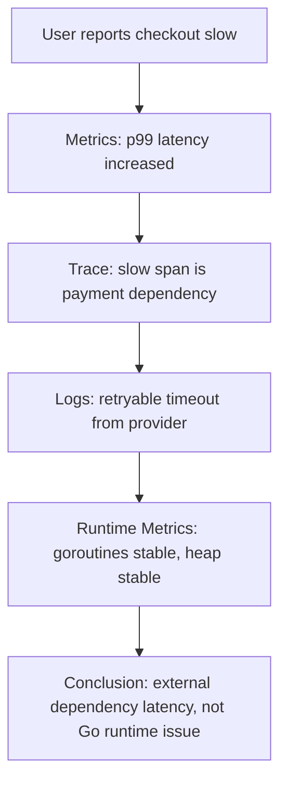

Tanpa metrics, Anda tidak tahu skala masalah.

Tanpa trace, Anda tidak tahu critical path.

Tanpa logs, Anda mungkin tidak tahu keputusan/error spesifik.

Tanpa runtime metrics, Anda tidak tahu apakah runtime Go ikut bermasalah.

---

## 6. OpenTelemetry Data Flow in Go

Secara production, alur umum Go service adalah:

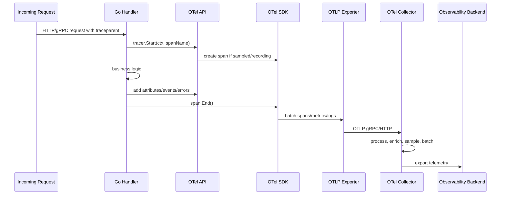

Beberapa keputusan penting terjadi di titik berbeda:

| Keputusan | Lokasi ideal |
|---|---|
| Span naming | Application instrumentation |
| Domain attributes | Application instrumentation |
| Sampling head-based | SDK/application config |
| Tail sampling | Collector/backend pipeline |
| Resource enrichment | SDK + Collector |
| Secret redaction | Application + Collector defense-in-depth |
| Export destination | Collector/platform config |
| Batching | SDK + Collector |
| Cost control | SDK + Collector + backend policy |

---

## 7. Resource: Identitas Service yang Sering Diremehkan

Dalam OTel, **Resource** mendeskripsikan entitas yang menghasilkan telemetry.

Contoh resource attributes:

- `service.name`
- `service.namespace`
- `service.version`
- `service.instance.id`
- `deployment.environment.name`
- `cloud.provider`
- `cloud.region`
- `k8s.cluster.name`
- `k8s.namespace.name`
- `k8s.pod.name`
- `container.name`

Tanpa resource yang konsisten, telemetry Anda akan sulit dipakai.

Contoh buruk:

```text
service.name = app
service.name = my-service
service.name = checkout
service.name = checkout-service
service.name = checkout_svc
```

Akibat:

1. Dashboard pecah.
2. Alert salah grouping.
3. Trace service map kacau.
4. Deployment comparison sulit.
5. Incident timeline tidak jelas.

Contoh lebih baik:

```text
service.namespace = commerce
service.name = checkout-api
service.version = 2026.06.23-17.42.10-a1b2c3d
service.instance.id = pod UID / hostname / instance ID
deployment.environment.name = prod
```

Resource harus distandardisasi oleh platform/team, bukan dibiarkan per developer.

---

## 8. Instrumentation Scope

Instrumentation scope mendeskripsikan library/package yang menghasilkan telemetry.

Contoh:

```go
tracer := otel.Tracer("github.com/acme/checkout/internal/payment")
```

Ini berbeda dari service name.

- `service.name` = aplikasi/process yang menghasilkan telemetry.
- tracer/instrumentation name = package/component yang menginstrumentasi operasi.

Kesalahan umum:

```go
otel.Tracer("checkout-api")
```

Ini tidak selalu salah untuk aplikasi kecil, tetapi untuk service besar lebih baik memakai nama package/component agar trace bisa menunjukkan sumber instrumentation.

Prinsip:

> Resource menjawab “siapa yang menjalankan process ini”, instrumentation scope menjawab “kode/instrumentasi mana yang membuat telemetry ini”.

---

## 9. TracerProvider, MeterProvider, LoggerProvider

Dalam OTel Go, provider adalah factory dan runtime manager untuk signal tertentu.

### 9.1 TracerProvider

Menghasilkan tracer untuk traces.

Tanggung jawab:

- sampler,
- span processor,
- exporter,
- resource,
- shutdown.

### 9.2 MeterProvider

Menghasilkan meter untuk metrics.

Tanggung jawab:

- reader,
- exporter,
- aggregation,
- temporality,
- resource,
- shutdown.

### 9.3 LoggerProvider

Menghasilkan logger untuk OTel logs.

Dalam praktik Go, banyak service tetap memakai `slog` sebagai logger utama, lalu memasukkan trace/span ID ke log record. OTel log pipeline bisa digunakan jika organisasi sudah siap dan tooling mendukung.

Prinsip praktis:

> Jangan memaksa semua logs lewat OTel sebelum Anda memahami maturity, backend support, cost, dan compatibility. Untuk Go, `slog` + trace correlation sering menjadi baseline yang lebih aman.

---

## 10. Context Propagation

OpenTelemetry sangat bergantung pada `context.Context`.

Di Go, context membawa:

- cancellation,
- deadline,
- request-scoped values,
- trace context,
- baggage.

Trace context tidak berjalan otomatis jika Anda memutus context.

Contoh buruk:

```go
func handle(w http.ResponseWriter, r *http.Request) {
    ctx := context.Background() // memutus trace parent dan cancellation
    callDependency(ctx)
}
```

Contoh benar:

```go
func handle(w http.ResponseWriter, r *http.Request) {
    ctx := r.Context()
    callDependency(ctx)
}
```

Dalam goroutine:

```go
func handle(w http.ResponseWriter, r *http.Request) {
    ctx := r.Context()

    go func() {
        // Hati-hati: ctx bisa cancelled saat request selesai.
        doAsync(ctx)
    }()
}
```

Untuk background async job, Anda perlu memutus cancellation secara sadar tetapi tetap membawa correlation seperlunya.

Misalnya:

```go
func detachForAsync(parent context.Context) context.Context {
    // Konseptual: bawa trace/baggage tertentu, tapi jangan bawa deadline request mentah.
    // Implementasi detail akan dibahas di part tracing/middleware.
    return context.Background()
}
```

Rule:

1. Jangan pakai `context.Background()` sembarangan di request path.
2. Jangan menyimpan context dalam struct jangka panjang.
3. Jangan mengoper nil context.
4. Jangan membawa request deadline ke job background tanpa desain.
5. Jangan memakai context values sebagai dependency injection umum.
6. Pastikan outbound client menerima context yang sama.

---

## 11. Propagators

Propagator bertugas inject/extract context across process boundary.

Boundary umum:

- HTTP headers,
- gRPC metadata,
- message queue headers,
- batch metadata,
- job envelope.

W3C Trace Context umum memakai header seperti:

```text
traceparent: 00-<trace-id>-<span-id>-<trace-flags>
tracestate: ...
```

Dalam service mesh/microservices, propagation adalah syarat agar distributed trace utuh.

Jika propagation gagal:

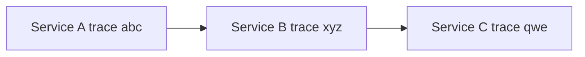

Alih-alih satu trace end-to-end, Anda mendapat tiga trace terpisah.

Propagation correctness sering lebih penting daripada jumlah span.

---

## 12. Baggage: Powerful but Dangerous

Baggage adalah metadata cross-service yang ikut propagate bersama context.

Contoh kandidat baggage:

- tenant category,
- experiment cohort,
- region routing hint,
- risk class.

Namun baggage berbahaya jika disalahgunakan:

- terlalu besar,
- mengandung PII,
- mengandung secret,
- high-cardinality,
- dipakai sebagai storage state,
- dipakai untuk authorization tanpa validasi.

Rule:

> Baggage adalah propagation metadata, bukan database, bukan session, bukan authorization source of truth.

Untuk regulatory-grade system, baggage harus sangat dibatasi dan direview.

---

## 13. Semantic Conventions

OpenTelemetry memiliki semantic conventions untuk memberi nama attributes secara konsisten.

Contoh konsep:

- HTTP method/status/route.
- Network peer.
- Database system/name/statement.
- Messaging system/destination/operation.
- RPC system/service/method.
- Exception attributes.
- Service/resource attributes.

Mengapa penting?

Karena backend dan dashboard bisa memahami telemetry secara konsisten.

Contoh buruk:

```text
method=GET
httpMethod=GET
verb=GET
request_method=GET
```

Contoh lebih baik:

```text
http.request.method=GET
```

Namun jangan buta mengikuti semantic convention tanpa mempertimbangkan cardinality dan privacy.

Contoh attribute berbahaya:

```text
http.route=/users/123456/orders/987654
```

Seharusnya route templated:

```text
http.route=/users/{user_id}/orders/{order_id}
```

Untuk Go service, middleware harus mengisi route template, bukan raw URL path jika path mengandung identifier.

---

## 14. Span Design

Span adalah unit operasi dalam trace.

Span yang baik memiliki:

1. Nama stabil.
2. Start/end jelas.
3. Parent context benar.
4. Attributes rendah cardinality.
5. Error status benar.
6. Events seperlunya.
7. Tidak terlalu granular.
8. Tidak terlalu luas.

### 14.1 Span Name

Buruk:

```text
GET /users/123/orders/456
process 9283918273
Call payment for user fajar
```

Baik:

```text
HTTP GET /users/{user_id}/orders/{order_id}
PaymentClient.Authorize
ReserveInventory
PublishOrderCreated
```

Span name harus stabil. Identifier spesifik masuk attribute/log/event dengan kontrol, bukan nama span.

### 14.2 Span Granularity

Terlalu sedikit span:

```text
HandleCheckout: 2.8s
```

Anda tidak tahu apa yang lambat.

Terlalu banyak span:

```text
ValidateFieldA
ValidateFieldB
AppendString
MapLookup
IfBranchTrue
```

Trace menjadi noise dan mahal.

Granularity yang masuk akal:

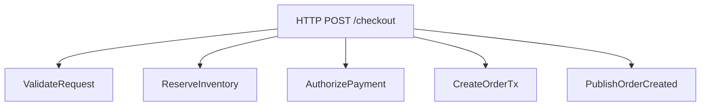

Gunakan span untuk boundary logis atau dependency significant, bukan setiap fungsi.

---

## 15. Span Attributes

Attributes menjawab konteks terstruktur dari span.

Contoh:

```text
operation.name=checkout
payment.provider=provider_a
inventory.reservation_mode=hard
retry.count=2
http.response.status_code=504
```

Prinsip:

1. Attribute harus queryable.
2. Attribute harus rendah cardinality.
3. Attribute tidak boleh mengandung secret.
4. Attribute tidak boleh raw payload.
5. Attribute harus punya ownership schema.
6. Attribute harus stabil antar versi.

High-cardinality values seperti request ID, user ID, order ID biasanya lebih cocok di logs atau trace exemplars sesuai backend policy, bukan metric labels. Untuk span attributes, tetap hati-hati karena trace storage juga bisa mahal.

---

## 16. Span Events

Span event adalah event timestamped di dalam span.

Cocok untuk:

- retry attempt,
- fallback selected,
- circuit breaker state transition,
- cache miss significant,
- validation rejected with class,
- external dependency error.

Tidak cocok untuk:

- setiap item dalam loop besar,
- full payload,
- debug spam,
- audit log pengganti.

Contoh konseptual:

```go
span.AddEvent("payment.retry", trace.WithAttributes(
    attribute.Int("retry.attempt", attempt),
    attribute.String("retry.reason", "timeout"),
))
```

Jika event terjadi ribuan kali per request, jangan jadikan span events mentah. Agregasikan.

---

## 17. Recording Errors

Dalam tracing, error perlu dicatat dengan dua hal berbeda:

1. Record error event/exception.
2. Set span status bila operasi gagal.

Konseptual:

```go
if err != nil {
    span.RecordError(err)
    span.SetStatus(codes.Error, classify(err))
    return err
}
```

Namun jangan sembarang set status error untuk semua child span jika error sudah ditangani dan operasi parent sukses.

Contoh:

- cache miss bukan error jika fallback DB sukses.
- retry attempt gagal bukan berarti overall span gagal jika retry berikutnya sukses.
- validation failure bisa expected business outcome, bukan infrastructure error.

Observability harus membedakan:

| Kondisi | Span status |
|---|---|
| Dependency timeout menyebabkan request gagal | Error |
| Cache miss lalu DB hit sukses | OK, event `cache.miss` |
| Payment rejected valid business rule | Bisa OK atau Error tergantung semantics API/SLO |
| Context cancelled by client disconnect | Biasanya bukan server internal error, tapi tetap evidence penting |
| Panic recovered | Error |

---

## 18. Metrics in OpenTelemetry vs Prometheus Native

Ini salah satu area paling membingungkan.

Anda punya dua opsi umum:

### Opsi A — Prometheus Native

Aplikasi Go memakai `client_golang`, expose `/metrics`, Prometheus scrape.

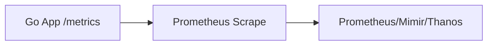

Kelebihan:

- matang,
- sederhana,
- cocok untuk Kubernetes,
- PromQL native,
- banyak library mendukung,
- mental model pull jelas.

Kekurangan:

- kurang vendor-neutral pada instrumentation API,
- multi-signal correlation harus dirancang manual,
- push/OTLP topology tidak native,
- semantic convention OTel tidak otomatis.

### Opsi B — OTel Metrics

Aplikasi memakai OTel MeterProvider dan mengirim metrics via OTLP ke Collector/backend.

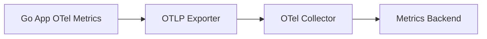

Kelebihan:

- satu API telemetry,
- vendor-neutral,
- cocok untuk centralized pipeline,
- resource attributes konsisten,
- integrasi multi-signal lebih kuat.

Kekurangan:

- perlu memahami temporality/aggregation,
- collector pipeline lebih kompleks,
- backend compatibility bervariasi,
- tim yang sangat Prometheus-native bisa merasa lebih rumit.

### Opsi C — Hybrid

Umum di production:

- Metrics tetap Prometheus-native untuk service/runtime/SLO.
- Traces memakai OTel.
- Logs memakai `slog` JSON + trace correlation.
- Collector dipakai untuk traces dan enrichment, atau menerima Prometheus scrape juga.

```mermaid
flowchart TD
    A[Go Service]
    A --> B[/metrics Prometheus]
    A --> C[OTLP Traces]
    A --> D[stdout JSON Logs]

    B --> E[Prometheus]
    C --> F[OTel Collector]
    F --> G[Trace Backend]
    D --> H[Log Agent]
    H --> I[Log Backend]
```

Ini sering menjadi pilihan pragmatis.

Rule:

> Jangan memaksakan “semua harus OTel” jika sistem Prometheus Anda sudah matang dan kebutuhan utama OTel adalah tracing. Tetapi desain correlation tetap harus konsisten.

---

## 19. Logs in OpenTelemetry Go

Logs adalah sinyal yang paling harus dibahas dengan hati-hati.

Dalam banyak Go service, logging utama tetap:

- `log/slog`,
- zap,
- zerolog,
- logrus legacy.

OTel dapat masuk dalam beberapa pola:

1. Logger tetap native, trace/span ID disisipkan ke log fields.
2. Logger native memakai bridge/handler untuk mengirim log ke OTel pipeline.
3. Log agent membaca stdout JSON, lalu collector/backend melakukan parsing/correlation.
4. Semua log dikirim via OTLP logs.

### 19.1 Pattern Paling Aman untuk Banyak Organisasi

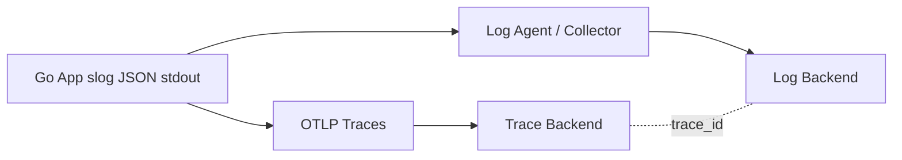

Aplikasi:

- log ke stdout dalam JSON,
- include `trace_id`, `span_id`, `request_id`, `service.name`, `environment`, `version`,
- traces dikirim via OTel,
- backend melakukan correlation.

Ini menjaga logging sederhana, kompatibel dengan Kubernetes, dan tidak terlalu bergantung pada maturity OTel logs.

### 19.2 Kapan OTLP Logs Masuk Akal

OTLP logs masuk akal jika:

1. Platform observability sudah memakai Collector sebagai unified pipeline.
2. Backend logs mendukung OTLP logs dengan baik.
3. Team memahami cost dan retry/backpressure behavior.
4. Ada policy redaction dan batching yang jelas.
5. Tidak ada requirement sederhana “stdout logs only” dari platform.

### 19.3 Risiko Mengirim Logs via SDK

Jika logs dikirim via SDK/exporter:

- aplikasi bisa menahan memory saat backend lambat,
- flush saat shutdown harus benar,
- backpressure harus dipahami,
- crash bisa kehilangan buffered logs,
- debugging early startup failure bisa sulit jika logger belum ready,
- log volume dapat mengganggu business process.

Rule:

> Logs harus tetap dapat menyelamatkan Anda saat telemetry pipeline lain gagal.

Karena itu stdout JSON masih sangat kuat di container environment.

---

## 20. Collector Topologies

Collector topology adalah keputusan production yang penting.

### 20.1 No Collector: Direct Export

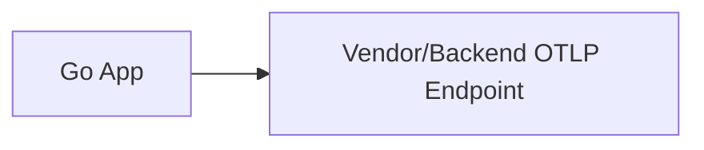

Kelebihan:

- sederhana,
- sedikit moving parts,
- cocok untuk dev/small system.

Kekurangan:

- aplikasi tahu endpoint vendor,
- policy tersebar,
- sampling sulit dikontrol sentral,
- migration lebih sulit,
- retry/batching terjadi di setiap app,
- credential exposure lebih luas.

Cocok untuk:

- development,
- small internal tools,
- temporary setup,
- managed backend dengan OTLP endpoint sederhana.

Tidak ideal untuk:

- regulated production,
- multi-team platform,
- large microservices,
- cost-sensitive environment.

### 20.2 Sidecar Collector

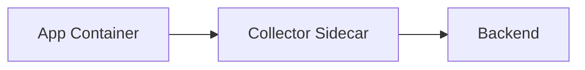

Kelebihan:

- isolation per pod,
- app kirim ke localhost,
- credential bisa dikelola di sidecar,
- local buffering/processing.

Kekurangan:

- resource overhead per pod,
- config management lebih berat,
- scaling jumlah collector sama dengan pod,
- operational complexity meningkat.

Cocok untuk:

- workload high-isolation,
- tenant-sensitive environment,
- service yang butuh local processing khusus.

### 20.3 DaemonSet Collector

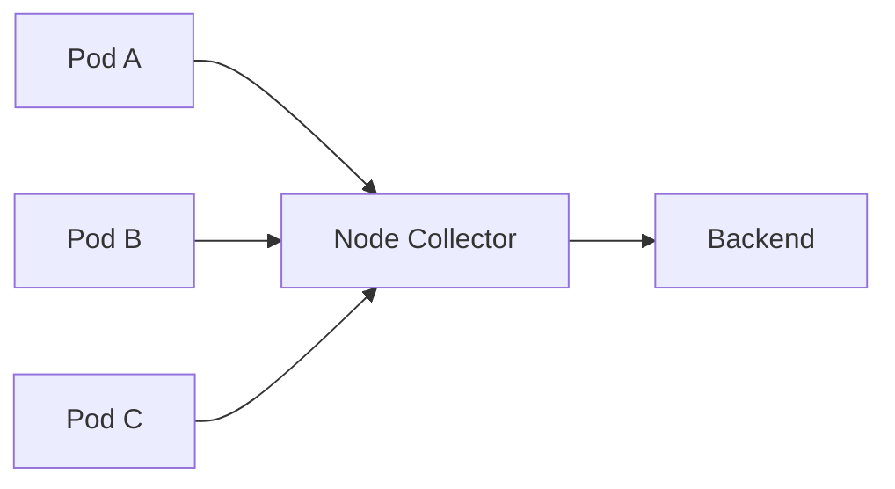

Kelebihan:

- satu collector per node,
- cocok untuk Kubernetes,
- local node-level collection,
- overhead lebih rendah daripada sidecar.

Kekurangan:

- node-level blast radius,
- multi-tenant isolation lebih lemah,
- config change berdampak banyak pod.

Cocok untuk:

- cluster observability standard,
- logs/metrics/traces node-local collection,
- platform-managed telemetry.

### 20.4 Gateway Collector

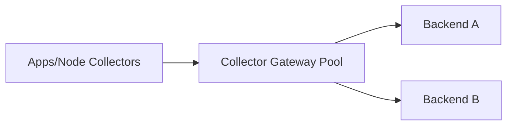

Kelebihan:

- centralized processing,
- tail sampling,
- backend routing,
- enrichment,
- cost control,
- credential centralization.

Kekurangan:

- additional network hop,
- gateway saturation risk,
- needs HA/scaling,
- queue/backpressure tuning.

Cocok untuk:

- production microservices platform,
- multi-backend export,
- regulated data handling,
- tail sampling,
- centralized governance.

### 20.5 Layered Topology

Production besar sering memakai kombinasi:

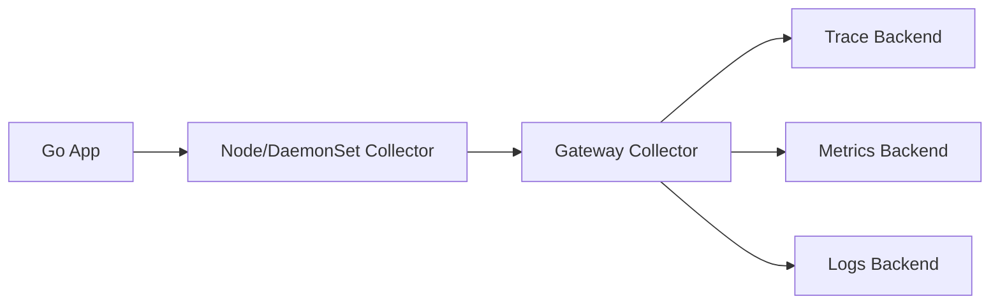

Node collector melakukan local receive/batch/retry ringan.
Gateway collector melakukan policy lebih berat.

---

## 21. Collector Pipeline Components

Collector pipeline berisi beberapa jenis component.

### 21.1 Receivers

Receiver menerima telemetry.

Contoh:

- OTLP receiver,
- Prometheus receiver,
- Jaeger receiver,
- Zipkin receiver,
- host metrics receiver,
- filelog receiver.

### 21.2 Processors

Processor memodifikasi/mengontrol telemetry.

Contoh:

- batch,
- memory limiter,
- resource,
- attributes,
- filter,
- tail sampling,
- probabilistic sampling,
- transform.

### 21.3 Exporters

Exporter mengirim telemetry ke backend.

Contoh:

- OTLP exporter,
- Prometheus remote write exporter,
- debug exporter,
- vendor exporter.

### 21.4 Connectors

Connector menghubungkan pipeline, bertindak sebagai exporter sekaligus receiver.

Contoh use case:

- membuat metrics dari spans,
- routing antar pipeline,
- service graph.

### 21.5 Extensions

Extension menyediakan kemampuan tambahan seperti:

- health check,
- pprof untuk collector,
- zpages,
- auth.

---

## 22. Example Collector Configuration: Conceptual

Contoh konfigurasi minimal konseptual:

```yaml
receivers:
  otlp:
    protocols:
      grpc:
        endpoint: 0.0.0.0:4317
      http:
        endpoint: 0.0.0.0:4318

processors:
  memory_limiter:
    check_interval: 1s
    limit_mib: 512
  batch:
    timeout: 5s
    send_batch_size: 8192
  resource:
    attributes:
      - key: deployment.environment.name
        value: prod
        action: upsert

exporters:
  otlp/traces:
    endpoint: trace-backend:4317
    tls:
      insecure: true
  debug:
    verbosity: basic

service:
  pipelines:
    traces:
      receivers: [otlp]
      processors: [memory_limiter, resource, batch]
      exporters: [otlp/traces]
```

Catatan:

- Ini bukan config final untuk production.
- Endpoint, TLS, auth, queue, retry, memory limit, dan processor policy harus disesuaikan.
- `debug` exporter jangan dipakai sembarangan di production volume tinggi.

---

## 23. Go Application Initialization Pattern

Struktur setup OTel di Go sebaiknya eksplisit.

Package layout contoh:

```text
internal/observability/
  otel.go
  logging.go
  metrics.go
  tracing.go
  resource.go
  shutdown.go
```

Konsep konfigurasi:

```go
type Config struct {
    ServiceName      string
    ServiceNamespace string
    ServiceVersion   string
    Environment      string

    OTLPEndpoint     string
    TracingEnabled   bool
    MetricsEnabled   bool
    LogsEnabled      bool

    SampleRatio      float64
}
```

Setup konseptual:

```go
func Setup(ctx context.Context, cfg Config) (func(context.Context) error, error) {
    // 1. Build resource.
    // 2. Setup propagator.
    // 3. Setup tracer provider.
    // 4. Setup meter provider.
    // 5. Optionally setup log bridge.
    // 6. Return shutdown function.
    return func(ctx context.Context) error {
        // flush/shutdown providers
        return nil
    }, nil
}
```

Di `main`:

```go
func main() {
    ctx := context.Background()

    shutdown, err := observability.Setup(ctx, cfg)
    if err != nil {
        // startup logging fallback harus tetap tersedia
        panic(err)
    }
    defer func() {
        ctx, cancel := context.WithTimeout(context.Background(), 5*time.Second)
        defer cancel()
        _ = shutdown(ctx)
    }()

    // start server
}
```

Important:

> Telemetry shutdown harus masuk graceful shutdown path. Jika tidak, spans/metrics/logs buffered bisa hilang saat process exit.

---

## 24. Startup Failure and Bootstrap Logging

Observability setup sendiri bisa gagal.

Contoh:

- invalid OTLP endpoint,
- TLS config salah,
- credential tidak ada,
- resource config invalid,
- exporter gagal connect,
- collector tidak reachable.

Jangan membuat service tidak bisa start hanya karena telemetry backend sementara down, kecuali policy Anda memang strict.

Ada dua mode:

### 24.1 Strict Mode

Service gagal start jika observability setup gagal.

Cocok untuk:

- regulated critical service,
- environment yang mensyaratkan audit/telemetry lengkap,
- pre-production validation.

Risiko:

- outage karena telemetry dependency.

### 24.2 Degraded Mode

Service tetap start, telemetry degrade.

Cocok untuk:

- high-availability runtime,
- telemetry backend tidak boleh jadi hard dependency,
- cloud-native service umum.

Risiko:

- blind spot saat incident.

Praktik yang sering aman:

- config invalid = fail fast,
- backend unavailable sementara = degrade/retry,
- production critical audit logs = tidak boleh hilang dan mungkin jalur terpisah.

---

## 25. Sampling Strategy

Tracing semua request bisa mahal.

Sampling adalah proses memilih trace mana yang direkam/dikirim.

### 25.1 Head Sampling

Keputusan sampling dibuat di awal trace.

Kelebihan:

- murah,
- sederhana,
- mengurangi overhead sejak awal.

Kekurangan:

- bisa kehilangan trace error/slow karena keputusan dibuat sebelum tahu hasil.

### 25.2 Parent-Based Sampling

Child mengikuti keputusan parent.

Penting agar trace tidak pecah.

Jika root sampled, child sampled.
Jika root tidak sampled, child biasanya tidak sampled.

### 25.3 Ratio-Based Sampling

Contoh: sample 1% request.

Kelebihan:

- kontrol volume sederhana.

Kekurangan:

- event langka bisa hilang.

### 25.4 Tail Sampling

Keputusan sampling dibuat setelah trace selesai atau cukup data terkumpul.

Bisa memilih:

- error traces,
- slow traces,
- specific route,
- high-value tenant,
- rare status code,
- random baseline.

Kelebihan:

- jauh lebih powerful untuk troubleshooting.

Kekurangan:

- butuh Collector/backend support,
- memory/buffering lebih besar,
- latency telemetry lebih tinggi,
- topology lebih kompleks.

### 25.5 Practical Sampling Policy

Untuk production:

```text
Always keep:
- errors
- high latency traces
- rare status codes
- selected critical operations

Sample probabilistically:
- normal high-volume successful requests

Drop or reduce:
- health checks
- static assets
- noisy low-value routes
```

Rule:

> Sampling adalah product/operations decision, bukan sekadar library config.

---

## 26. Cost Model

Telemetry cost berasal dari:

1. CPU aplikasi untuk membuat telemetry.
2. Allocation/memory aplikasi.
3. Network egress.
4. Collector CPU/memory.
5. Backend ingest.
6. Storage.
7. Indexing.
8. Query cost.
9. Human time membaca noise.

OTel bisa menurunkan cost jika pipeline governance baik.

OTel juga bisa menaikkan cost jika semua service menambahkan span/attribute/event tanpa disiplin.

Cost explosion biasanya berasal dari:

- high-cardinality attributes,
- too many spans,
- verbose span events,
- logging via OTel tanpa sampling/retention,
- no filtering health checks,
- raw URL/path sebagai attribute,
- user/order/request ID sebagai metric labels,
- excessive resource variants,
- debug exporter aktif.

---

## 27. Cardinality in OTel

Cardinality bukan hanya masalah metrics.

Trace dan logs juga bisa terkena.

### 27.1 Metrics Cardinality

Paling berbahaya karena time series storage meledak.

Jangan:

```text
http_requests_total{user_id="123"}
http_requests_total{request_id="abc"}
http_requests_total{order_id="ord-999"}
```

### 27.2 Trace Attribute Cardinality

Trace backend biasanya lebih toleran, tetapi cost query/index bisa tetap naik.

Hati-hati dengan:

- raw URL,
- SQL statement raw,
- customer ID,
- email,
- token hash,
- long error message sebagai indexed attribute.

### 27.3 Logs Cardinality

Logs memang event-level, tetapi indexed fields high-cardinality juga mahal.

Prinsip:

> High-cardinality value boleh ada jika benar-benar perlu sebagai evidence, tetapi jangan semua dijadikan indexed dimension/label.

---

## 28. Security and Privacy

Telemetry sering mengandung data sensitif tanpa disadari.

Risiko:

1. Authorization header masuk span attribute.
2. Query string mengandung token.
3. Payload error masuk log.
4. SQL statement mengandung literal PII.
5. User email masuk trace attribute.
6. Baggage membawa sensitive identity.
7. Debug exporter mencetak data ke stdout production.
8. Collector config mengirim data ke backend salah.

Defense-in-depth:

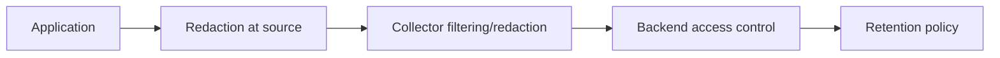

Rule:

1. Redact at source jika memungkinkan.
2. Collector redaction adalah safety net, bukan satu-satunya kontrol.
3. Jangan masukkan secret ke telemetry dengan alasan “nanti difilter”.
4. Baggage harus dianggap externalized metadata.
5. Debug pipeline harus dimatikan di production.
6. Telemetry access harus mengikuti least privilege.

---

## 29. Reliability of Telemetry Pipeline

Observability pipeline adalah sistem distributed juga.

Ia bisa gagal karena:

- collector down,
- backend slow,
- network partition,
- exporter queue penuh,
- memory limiter drop data,
- retry storm,
- TLS/auth failure,
- config rollout salah,
- schema change incompatible.

Aplikasi tidak boleh collapse hanya karena tracing backend lambat.

Tetapi pipeline tidak boleh diam-diam membuang semua telemetry tanpa alert.

Telemetry pipeline sendiri perlu observability:

- collector received spans/metrics/logs,
- exporter send failures,
- dropped data count,
- queue length,
- retry count,
- memory limiter trigger,
- processor latency,
- backend response errors.

Meta-observability:

> Anda harus mengobservasi sistem observability Anda.

---

## 30. OTel and Prometheus Together

Di banyak organisasi, strategi matang adalah:

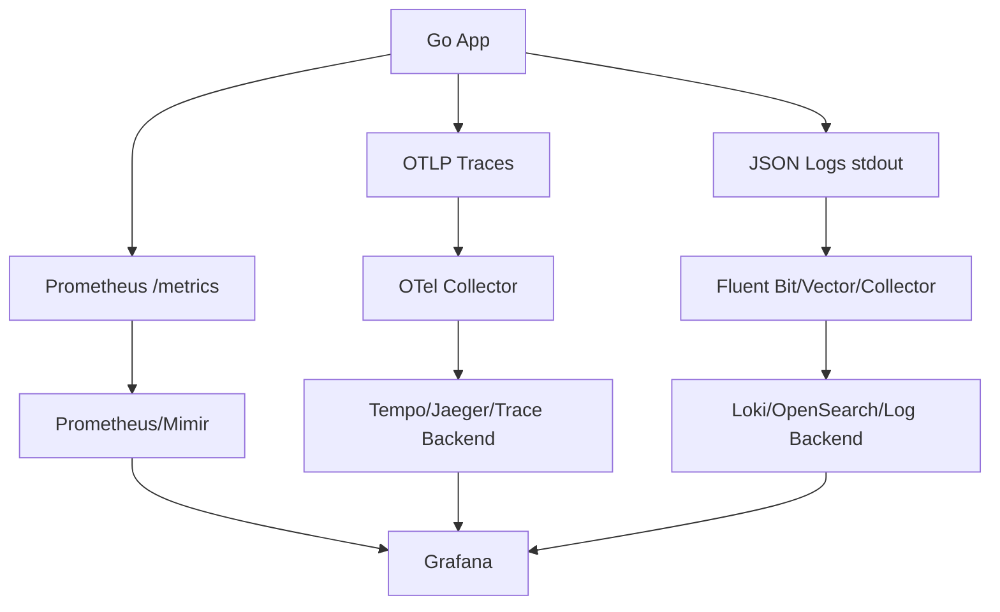

Ini bukan “kurang modern”. Ini sering lebih robust.

Pertanyaan desain:

1. Apakah metrics SLO sudah matang di Prometheus?
2. Apakah backend OTel metrics mendukung query yang dibutuhkan?
3. Apakah team sudah menguasai PromQL?
4. Apakah Collector akan menjadi gateway semua telemetry?
5. Apakah logs tetap stdout?
6. Bagaimana trace ID masuk log?
7. Bagaimana exemplars menghubungkan metrics ke traces?

Tidak ada satu jawaban universal.

---

## 31. OTel in Kubernetes

Dalam Kubernetes, OTel biasanya muncul dalam pola:

1. App container mengirim OTLP ke collector service.
2. DaemonSet collector menerima telemetry node-local.
3. Gateway collector melakukan central processing.
4. Logs tetap stdout lalu dikumpulkan agent.
5. Metrics di-scrape Prometheus atau dikirim OTLP.

Hal yang harus distandardisasi:

- endpoint collector,
- TLS/mTLS,
- namespace/service metadata,
- pod metadata enrichment,
- resource requests/limits collector,
- retry/queue settings,
- per-environment sampling,
- debug pipeline disabled in prod,
- health check collector,
- rollout strategy config collector.

Kubernetes metadata sangat penting untuk incident:

- pod name,
- namespace,
- deployment,
- replica set,
- node,
- cluster,
- container image,
- version.

Tanpa metadata ini, trace/log dari Kubernetes sulit dikorelasikan dengan rollout dan pod lifecycle.

---

## 32. OTel and Go Runtime Metrics

OTel tidak menggantikan `runtime/metrics`.

Go runtime metrics tetap sumber truth untuk:

- goroutine count,
- scheduler behavior,
- heap classes,
- GC cycles,
- memory pressure,
- CPU classes,
- threads,
- stack usage.

Anda bisa export runtime metrics melalui:

1. Prometheus Go collector.
2. OTel runtime instrumentation/conventions.
3. Custom mapping dari `runtime/metrics`.

Yang penting bukan hanya export, tetapi interpretasi.

Contoh correlation:

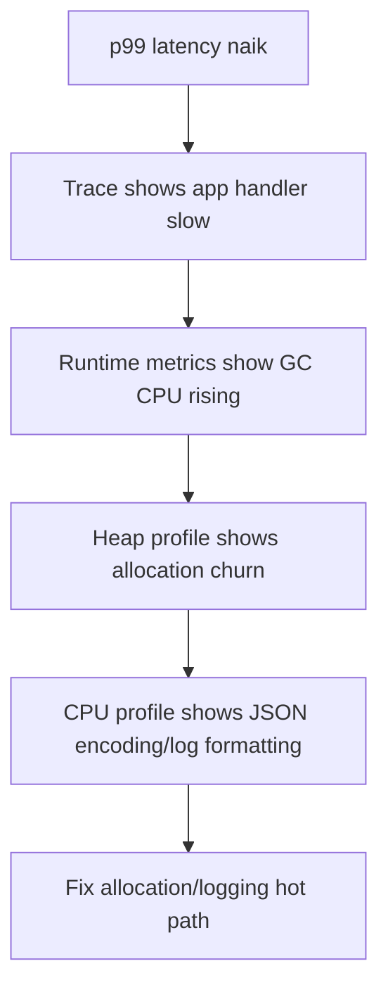

OTel membantu correlation, tetapi diagnosis tetap butuh pemahaman Go runtime.

---

## 33. OTel and `slog` Correlation Pattern

Pattern praktis:

1. Request masuk.
2. Middleware extract/creates trace context.
3. Logger from context menambahkan trace/span ID.
4. Logs keluar sebagai JSON.
5. Trace dikirim via OTel.
6. Backend bisa lompat dari trace ke logs atau sebaliknya.

Konseptual helper:

```go
func LoggerFromContext(ctx context.Context, base *slog.Logger) *slog.Logger {
    sc := trace.SpanContextFromContext(ctx)
    if !sc.IsValid() {
        return base
    }

    return base.With(
        slog.String("trace_id", sc.TraceID().String()),
        slog.String("span_id", sc.SpanID().String()),
    )
}
```

Catatan:

- Jangan membuat logger baru berlebihan di hot path jika mahal.
- Bisa cache/request-scoped logger di context dengan hati-hati.
- Jangan membuat context sebagai dependency container.
- Pastikan field naming sesuai backend convention.

---

## 34. Manual vs Auto Instrumentation

### 34.1 Manual Instrumentation

Developer menulis span/metrics sendiri.

Kelebihan:

- domain-aware,
- precise,
- bisa memilih boundary penting,
- attribute bermakna.

Kekurangan:

- butuh disiplin,
- bisa inconsistent,
- maintenance cost.

### 34.2 Library Instrumentation

Memakai instrumentation package untuk HTTP/gRPC/SQL/etc.

Kelebihan:

- cepat,
- standar,
- mengurangi boilerplate.

Kekurangan:

- span name/attributes mungkin tidak sesuai domain,
- butuh konfigurasi route naming,
- bisa noisy.

### 34.3 Zero-code / Auto Instrumentation

Untuk Go, auto-instrumentation ada, tetapi karakteristiknya berbeda dari Java agent. Java lebih kuat dalam agent-based instrumentation karena JVM instrumentation ecosystem matang. Go binary static/compiled membuat strategi auto-instrumentation berbeda.

Rule praktis:

> Di Go production, anggap manual + library instrumentation sebagai baseline. Auto-instrumentation bisa membantu, tetapi jangan jadikan satu-satunya strategi desain.

---

## 35. Avoiding Observability Vendor Lock-in

OTel sering dipromosikan sebagai vendor-neutral. Itu benar secara tujuan, tetapi tidak otomatis.

Anda masih bisa lock-in lewat:

1. Vendor-specific attributes.
2. Vendor-specific SDK extensions.
3. Vendor-only dashboard query language.
4. Vendor-specific sampling policy.
5. Backend-specific metric temporality assumptions.
6. Vendor-specific log parser.
7. Proprietary collector components.
8. Naming conventions yang hanya cocok satu backend.

Untuk menjaga portability:

- gunakan semantic conventions standar,
- pisahkan vendor exporter di collector,
- hindari vendor SDK di business code,
- simpan dashboard-as-code jika memungkinkan,
- dokumentasikan telemetry contract,
- test dengan debug/stdout exporter di CI/dev,
- pertahankan raw evidence yang bisa dibaca tanpa vendor UI.

---

## 36. OTel Adoption Strategy

Jangan mulai dengan “instrument semua service”.

Mulai dengan use case.

### 36.1 Tahap 1 — Foundation

- Standarkan `service.name`, environment, version.
- Standarkan trace propagation.
- Buat observability package internal.
- Setup collector dev/staging.
- Setup trace backend.
- Setup JSON logging dengan trace ID.

### 36.2 Tahap 2 — Critical Path

Instrumentasi:

- inbound HTTP/gRPC,
- outbound HTTP/gRPC,
- DB call,
- queue publish/consume,
- critical domain operation.

### 36.3 Tahap 3 — Correlation

- Logs include trace ID/span ID.
- Metrics include exemplars jika backend support.
- Dashboard link ke trace/logs.
- Error events visible di trace.

### 36.4 Tahap 4 — Policy

- Sampling policy.
- Redaction policy.
- Attribute schema.
- Cardinality review.
- Collector processor rules.
- Retention rules.

### 36.5 Tahap 5 — Operationalization

- Alerts untuk telemetry pipeline.
- Runbook trace investigation.
- SLO dashboard.
- Incident evidence capture.
- Regression gates.

---

## 37. Reference Architecture for Go Service

```mermaid
flowchart TD
    subgraph GoService[Go Service]
        A[HTTP Server]
        B[Middleware: request id, trace, metrics, logs]
        C[Business Handler]
        D[HTTP Client Wrapper]
        E[DB Wrapper]
        F[Queue Producer/Consumer]
        G[slog JSON Logger]
        H[Prometheus Metrics]
        I[OTel TracerProvider]
        J[pprof Debug Server]
        K[runtime metrics]
    end

    subgraph Telemetry[Telemetry Outputs]
        L[stdout JSON logs]
        M[/metrics]
        N[OTLP traces]
        O[/debug/pprof]
    end

    subgraph Platform[Platform]
        P[Log Agent]
        Q[Prometheus]
        R[OTel Collector]
        S[Secure Port Forward/Admin Network]
    end

    A --> B --> C
    C --> D
    C --> E
    C --> F
    B --> G
    B --> H
    B --> I
    K --> H
    G --> L
    H --> M
    I --> N
    J --> O

    L --> P
    M --> Q
    N --> R
    O --> S
```

Ini akan menjadi pola yang nanti kita bangun lebih konkret di part capstone.

---

## 38. Common Anti-Patterns

### 38.1 “OTel Installed, Therefore Observable”

Library terpasang bukan berarti sistem observable.

Yang penting:

- span boundary benar,
- attributes benar,
- logs correlated,
- metrics actionable,
- sampling masuk akal,
- dashboards menjawab pertanyaan,
- alerts symptom-based,
- runbook tersedia.

### 38.2 One Span Per Function

Ini membuat trace mahal dan noisy.

Span harus merepresentasikan operation boundary yang berguna.

### 38.3 Raw URL as Span Name

Membuat cardinality tinggi.

Gunakan route template.

### 38.4 User ID as Metric Label

Ini menghancurkan metrics backend.

### 38.5 Secret in Attribute

Telemetry sering disebarkan ke banyak sistem. Jangan pernah masukkan token/password/header sensitif.

### 38.6 Direct Export from Every Service to Vendor Without Governance

Cepat di awal, mahal saat scale.

### 38.7 Collector as Magic Garbage Filter

Collector tidak bisa memperbaiki semua data buruk. Redact dan design di source tetap penting.

### 38.8 Sampling Everything Randomly

Random-only sampling bisa kehilangan error langka.

### 38.9 No Telemetry Pipeline Monitoring

Jika collector drop spans selama 3 hari dan tidak ada yang tahu, observability Anda ilusi.

### 38.10 Logs Replaced Entirely by Traces

Trace dan logs punya fungsi berbeda. Trace yang sampled tidak boleh menjadi satu-satunya evidence.

---

## 39. Decision Matrix

### 39.1 Apakah Service Perlu OTel?

| Kondisi | Jawaban |
|---|---|
| Single binary internal kecil, tidak distributed | Mungkin belum perlu OTel penuh |
| Banyak service saling call | OTel tracing sangat berguna |
| Sudah Prometheus kuat untuk metrics | Pertahankan Prometheus, tambah OTel tracing |
| Butuh vendor neutrality | OTel + Collector kuat |
| Backend observability tunggal vendor managed | OTel tetap berguna untuk portability |
| Strict regulatory log evidence | Jangan hanya bergantung pada sampled traces |
| High traffic, cost sensitive | Sampling/collector governance wajib |

### 39.2 Direct Export atau Collector?

| Kondisi | Lebih Cocok |
|---|---|
| Dev/local | Direct/stdout exporter |
| Small production | Direct atau simple collector |
| Multi-service Kubernetes | Collector DaemonSet/Gateway |
| Tail sampling | Collector/Gateway |
| Multi-backend export | Collector |
| Central redaction/policy | Collector |
| Minimal ops overhead | Direct managed endpoint |

### 39.3 OTel Metrics atau Prometheus Native?

| Kondisi | Lebih Cocok |
|---|---|
| Team kuat Prometheus/PromQL | Prometheus native |
| Need unified telemetry pipeline | OTel metrics |
| Kubernetes scrape sudah matang | Prometheus native |
| Vendor-neutral push metrics | OTel metrics |
| SLO existing di Prometheus | Jangan migrasi tanpa alasan kuat |
| Greenfield platform | Evaluasi hybrid |

---

## 40. Production Checklist

Sebelum menganggap OTel setup production-ready, cek:

### 40.1 Identity

- [ ] `service.name` stabil.
- [ ] `service.namespace` jelas.
- [ ] `service.version` terisi.
- [ ] Environment terisi.
- [ ] Instance/pod metadata tersedia.

### 40.2 Propagation

- [ ] Inbound HTTP/gRPC extract trace context.
- [ ] Outbound HTTP/gRPC inject trace context.
- [ ] Queue messages membawa trace context jika relevan.
- [ ] Background jobs punya correlation strategy.

### 40.3 Tracing

- [ ] Span names stabil.
- [ ] Route template, bukan raw path.
- [ ] Critical dependencies punya spans.
- [ ] Error recording konsisten.
- [ ] Sampling policy jelas.

### 40.4 Metrics

- [ ] RED metrics tersedia.
- [ ] Runtime metrics tersedia.
- [ ] Dependency metrics tersedia.
- [ ] Cardinality review dilakukan.
- [ ] SLO metrics dapat dihitung.

### 40.5 Logs

- [ ] Logs structured JSON.
- [ ] Logs include trace ID/span ID saat ada.
- [ ] PII/secret redaction.
- [ ] Error log boundary jelas.
- [ ] Startup/shutdown logs tersedia.

### 40.6 Collector

- [ ] Memory limiter.
- [ ] Batch processor.
- [ ] Retry/queue policy.
- [ ] TLS/auth.
- [ ] Health check.
- [ ] Own metrics scraped.
- [ ] Drop/error telemetry alert.

### 40.7 Operations

- [ ] Dashboard exists.
- [ ] Alert exists.
- [ ] Runbook exists.
- [ ] Debug exporter disabled in prod.
- [ ] Cost/cardinality review recurring.

---

## 41. Exercises

### Exercise 1 — Trace Boundary Design

Ambil satu service Go yang memiliki flow:

```text
HTTP request -> validate -> DB read -> call external API -> DB write -> publish message
```

Tentukan:

1. Span apa saja yang perlu dibuat.
2. Span name masing-masing.
3. Attributes yang aman.
4. Events yang berguna.
5. Error status policy.
6. Mana yang tidak perlu jadi span.

### Exercise 2 — Resource Standardization

Buat standar resource attributes untuk organisasi:

- service namespace,
- service name,
- version,
- environment,
- region,
- cluster,
- namespace,
- pod,
- container,
- owner team.

Tentukan mana yang diisi aplikasi dan mana yang di-enrich collector/platform.

### Exercise 3 — Collector Topology

Untuk sistem Kubernetes berisi 40 service, pilih topology:

1. direct export,
2. sidecar,
3. daemonset,
4. gateway,
5. layered.

Jelaskan trade-off:

- cost,
- reliability,
- security,
- operability,
- latency,
- sampling.

### Exercise 4 — Sampling Policy

Buat sampling policy untuk API dengan:

- 10.000 RPS,
- 0.2% error rate,
- p99 latency target 500ms,
- beberapa endpoint critical,
- health check 100 RPS.

Tentukan:

1. Apa yang selalu disimpan.
2. Apa yang sampled.
3. Apa yang didrop.
4. Bagaimana policy dijalankan di SDK vs Collector.

### Exercise 5 — Logging Correlation

Desain field log standar agar bisa dikorelasikan dengan trace:

- trace ID,
- span ID,
- request ID,
- operation,
- route,
- status,
- error class,
- service identity.

Tentukan field mana wajib, optional, dan prohibited.

---

## 42. Key Takeaways

1. OpenTelemetry adalah standard instrumentation dan telemetry pipeline layer, bukan observability backend.
2. Di Go, OTel sangat penting untuk tracing dan semakin penting untuk metrics/logs, tetapi adoption harus pragmatis.
3. API, SDK, exporter, dan collector adalah konsep berbeda; mencampurnya membuat desain buruk.
4. Library sebaiknya bergantung pada API, aplikasi menginisialisasi SDK.
5. Resource attributes adalah fondasi service identity.
6. Context propagation adalah syarat distributed tracing yang benar.
7. Span design harus stabil, rendah cardinality, dan operation-oriented.
8. Prometheus-native metrics dan OTel metrics bisa berdampingan.
9. `slog` JSON + trace correlation adalah pattern logging Go yang kuat.
10. Collector memberi governance, enrichment, sampling, dan backend decoupling, tetapi menambah operational complexity.
11. Sampling harus dirancang sebagai policy operasional, bukan sekadar ratio random.
12. Telemetry pipeline sendiri perlu dimonitor.
13. OTel tidak menggantikan pemahaman Go runtime, pprof, atau troubleshooting methodology.
14. Observability yang baik adalah gabungan signal, schema, policy, tooling, dan runbook.

---

## 43. Referensi Utama

Referensi berikut adalah basis konseptual dan faktual untuk bagian ini:

1. OpenTelemetry Go documentation — https://opentelemetry.io/docs/languages/go/
2. OpenTelemetry official overview — https://opentelemetry.io/
3. OpenTelemetry Collector architecture — https://opentelemetry.io/docs/collector/architecture/
4. OpenTelemetry Collector documentation — https://opentelemetry.io/docs/collector/
5. OpenTelemetry Go exporters — https://opentelemetry.io/docs/languages/go/exporters/
6. OpenTelemetry Go getting started — https://opentelemetry.io/docs/languages/go/getting-started/
7. OpenTelemetry semantic conventions — https://opentelemetry.io/docs/specs/semconv/
8. OpenTelemetry specification — https://opentelemetry.io/docs/specs/otel/
9. Go `log/slog` package — https://pkg.go.dev/log/slog
10. Go `runtime/metrics` package — https://pkg.go.dev/runtime/metrics
11. Prometheus Go application instrumentation — https://prometheus.io/docs/guides/go-application/

---

## 44. Status Seri

Part ini adalah:

```text
learn-go-logging-observability-profiling-troubleshooting-part-008.md
```

Status:

```text
Part 008 selesai.
Seri belum selesai.
Lanjut berikutnya: Part 009 — Distributed Tracing in Go.
```

<!-- NAVIGATION_FOOTER -->
<div class="page-nav">
<a href="./learn-go-logging-observability-profiling-troubleshooting-part-007.md">⬅️ Part 007 — Runtime Metrics with `runtime/metrics`</a>
<a href="./index.md">📚 Kategori</a>
<a href="../../index.md">🏠 Home</a>
<a href="./learn-go-logging-observability-profiling-troubleshooting-part-009.md">Part 009 — Distributed Tracing in Go ➡️</a>
</div>
