# learn-go-logging-observability-profiling-troubleshooting-part-009.md

# Part 009 — Distributed Tracing in Go

> Seri: `learn-go-logging-observability-profiling-troubleshooting`  
> Bagian: `009 / 032`  
> Fokus: distributed tracing, span modeling, context propagation, OpenTelemetry Go, W3C Trace Context, async boundaries, fan-out/fan-in, sampling, dan korelasi log/metric/trace.  
> Target pembaca: Java software engineer yang ingin memahami tracing Go sampai level production/internal engineering handbook.

---

## 0. Tujuan Pembelajaran

Setelah menyelesaikan bagian ini, kamu diharapkan mampu:

1. Menjelaskan perbedaan **trace**, **span**, **metric**, dan **log** dalam investigasi distributed system.
2. Mendesain span model yang stabil, murah, dan berguna untuk troubleshooting.
3. Memahami bagaimana trace context berjalan melalui `context.Context`, HTTP headers, gRPC metadata, queue messages, batch jobs, dan worker goroutine.
4. Menghindari anti-pattern tracing seperti span explosion, attribute cardinality tinggi, trace tanpa root cause, dan duplicate instrumentation.
5. Menghubungkan trace dengan log, metric, runtime signal, dan incident timeline.
6. Membuat strategi sampling yang tidak membutakan incident analysis.
7. Menerapkan tracing Go dengan OpenTelemetry secara sadar, bukan sekadar memasang middleware.

---

## 1. Distributed Tracing: Masalah Apa yang Diselesaikan?

Dalam monolith, satu request biasanya bisa dibaca dari satu log stream dan satu process runtime. Dalam distributed system, satu request bisnis bisa melewati:

- API gateway.
- Authentication service.
- Application service.
- Database.
- Cache.
- Message broker.
- Worker asynchronous.
- External API.
- Notification service.
- Audit service.

Ketika user berkata “fitur submit lambat”, sistem mungkin terlihat seperti ini:

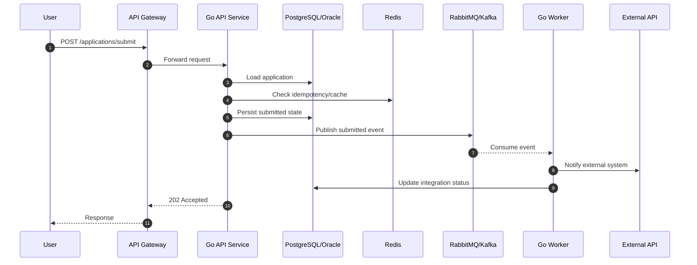

Tanpa tracing, kamu akan bertanya:

- Request ini lewat service mana saja?
- Latency terbesar terjadi di mana?
- Apakah error terjadi sebelum atau sesudah publish event?
- Apakah worker memproses event yang sama?
- Apakah dependency external lambat?
- Apakah retry menyebabkan beban tambahan?
- Apakah semua service melihat request ID yang sama?

Distributed tracing menjawab pertanyaan itu dengan membangun **causal graph** dari operasi lintas proses.

---

## 2. Core Mental Model

Distributed trace adalah **cerita kausal** dari satu unit kerja logical.

Span adalah **bab kecil** dalam cerita tersebut.

Trace context adalah **benang merah** yang membuat bab-bab itu bisa disusun ulang.

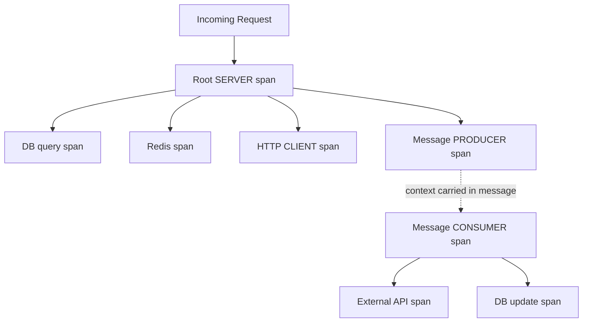

Yang penting: tracing bukan hanya “timeline cantik”. Tracing adalah **model sebab-akibat**.

Jika span hanya menunjukkan waktu tetapi tidak menunjukkan operasi, status, dependency, dan attribute yang benar, trace menjadi mahal tetapi miskin informasi.

---

## 3. Trace vs Span vs Event vs Attribute vs Link

### 3.1 Trace

Trace adalah kumpulan span yang membentuk satu operasi end-to-end.

Contoh trace:

```text
Trace: submit-application request
├── API Gateway SERVER span
├── Go Application Service SERVER span
│   ├── validate payload INTERNAL span
│   ├── database SELECT CLIENT span
│   ├── database UPDATE CLIENT span
│   └── RabbitMQ publish PRODUCER span
└── Worker CONSUMER span
    ├── external notification CLIENT span
    └── database update CLIENT span
```

Trace memiliki `trace_id`. Semua span dalam trace yang sama membawa `trace_id` yang sama.

### 3.2 Span

Span adalah unit kerja dengan:

- `span_id`.
- optional `parent_span_id`.
- name.
- start time.
- end time.
- duration.
- kind.
- status.
- attributes.
- events.
- links.

Span harus mewakili operasi yang bisa ditanya:

> “Apa pekerjaan ini? Berapa lama? Berhasil atau gagal? Dependency apa? Input kategori apa? Output status apa?”

### 3.3 Attribute

Attribute adalah metadata key-value untuk menjelaskan span.

Contoh attribute baik:

```text
http.request.method=POST
url.path=/applications/{id}/submit
http.response.status_code=202
db.system=postgresql
db.operation.name=SELECT
messaging.system=rabbitmq
messaging.destination.name=application.submitted
```

Contoh attribute buruk:

```text
user.email=fajar@example.com
full_payload={...}
sql.full_query=SELECT * FROM app WHERE id = 'abc123' AND nric = '...'
url.full=https://host/applications/123456789/submit?token=secret
```

Attribute buruk biasanya karena:

- PII leakage.
- secret leakage.
- high cardinality.
- terlalu besar.
- tidak stabil.
- sulit diagregasi.

### 3.4 Event

Event adalah titik waktu di dalam span.

Gunakan event untuk hal yang terjadi **di dalam operasi**, bukan operasi berdurasi sendiri.

Contoh:

```text
span: process application submission
events:
  - validation.started
  - validation.completed
  - idempotency.hit
  - publish.retry
```

Jika event punya durasi signifikan, mungkin harus menjadi child span.

### 3.5 Link

Link menghubungkan span yang tidak punya parent-child relationship langsung.

Contoh:

- Batch consumer memproses 100 pesan dari 100 trace berbeda.
- Fan-in aggregator menggabungkan hasil dari banyak request.
- Retry job berasal dari trace lama, tetapi bukan child synchronous langsung.

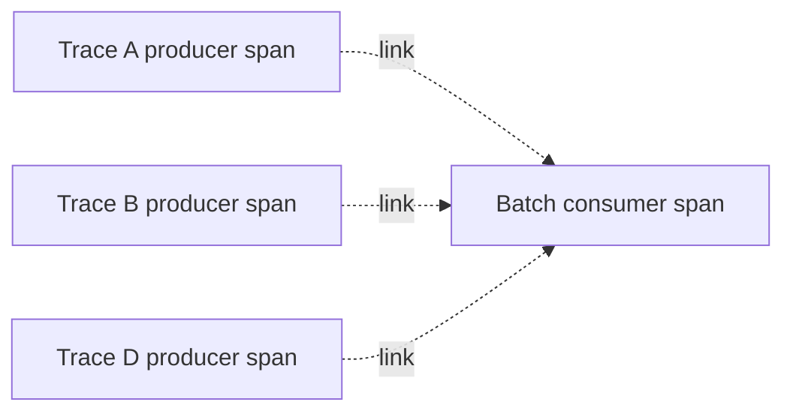

Parent-child cocok untuk causal execution langsung. Link cocok untuk hubungan kausal yang lebih longgar.

---

## 4. Span Kind

OpenTelemetry memiliki konsep span kind untuk menjelaskan posisi span dalam distributed operation.

| Span Kind | Makna | Contoh |
|---|---|---|
| `SERVER` | menerima request dari remote caller | HTTP handler, gRPC server |
| `CLIENT` | memanggil remote dependency | HTTP client, DB client, Redis client |
| `PRODUCER` | menerbitkan message | publish Kafka/RabbitMQ/SQS |
| `CONSUMER` | menerima/memproses message | worker consume event |
| `INTERNAL` | operasi internal process | validate, render, compute, local cache operation |

Mental model:

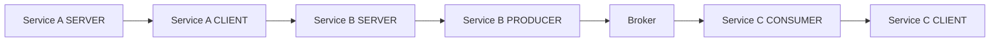

Span kind membantu backend tracing memahami boundary service dan dependency graph.

---

## 5. Context Propagation di Go

Di Go, `context.Context` adalah carrier utama untuk tracing state dalam satu process.

Secara konseptual:

```go
ctx, span := tracer.Start(ctx, "operation.name")
defer span.End()

// ctx now carries current span context
callDependency(ctx)
```

Hal penting:

1. Jangan simpan `context.Context` di struct long-lived.
2. Jangan membuat span tanpa memakai parent context yang benar.
3. Jangan memakai `context.Background()` di tengah request path kecuali memang memutus causal chain secara sadar.
4. Saat membuat goroutine, pass context yang relevan.
5. Saat crossing network boundary, inject/extract trace context.

### 5.1 Correct Context Flow

```go
func (h *Handler) ServeHTTP(w http.ResponseWriter, r *http.Request) {
    ctx := r.Context()

    ctx, span := h.tracer.Start(ctx, "application.submit")
    defer span.End()

    if err := h.service.Submit(ctx, appID); err != nil {
        span.RecordError(err)
        span.SetStatus(codes.Error, err.Error())
        http.Error(w, "submit failed", http.StatusInternalServerError)
        return
    }

    w.WriteHeader(http.StatusAccepted)
}
```

### 5.2 Broken Context Flow

```go
func (s *Service) Submit(ctx context.Context, appID string) error {
    // BAD: breaks trace parent-child relationship
    ctx = context.Background()

    ctx, span := s.tracer.Start(ctx, "service.submit")
    defer span.End()

    return s.repo.Save(ctx, appID)
}
```

Efeknya:

- Span `service.submit` mungkin muncul sebagai root trace baru.
- Trace end-to-end terpecah.
- Latency critical path tidak lengkap.
- Correlation log/metric/trace menjadi lemah.

---

## 6. W3C Trace Context

Untuk HTTP boundary, trace context umumnya dipropagasikan melalui W3C Trace Context headers:

```text
traceparent: 00-<trace-id>-<parent-id>-<trace-flags>
tracestate: vendor-specific-key=value
```

`traceparent` membawa identitas trace portable. `tracestate` membawa informasi vendor-specific tambahan.

Contoh:

```text
traceparent: 00-0af7651916cd43dd8448eb211c80319c-b7ad6b7169203331-01
```

Bagian-bagiannya:

| Bagian | Makna |
|---|---|
| `00` | version |
| `0af7651916cd43dd8448eb211c80319c` | trace ID |
| `b7ad6b7169203331` | parent span ID |
| `01` | trace flags, misalnya sampled |

Dalam Go/OpenTelemetry, kamu biasanya tidak parse header ini manual. Instrumentation atau propagator yang melakukannya.

Tetapi sebagai engineer production, kamu harus tahu header ini karena saat incident kamu mungkin perlu mengecek:

- Apakah gateway meneruskan `traceparent`?
- Apakah service menghapus header?
- Apakah reverse proxy whitelist header terlalu ketat?
- Apakah message publisher menyimpan trace context dalam message headers?
- Apakah service non-Go memakai format yang kompatibel?

---

## 7. Root Span: Titik Awal Cerita

Root span adalah span tanpa parent dalam satu trace.

Pada HTTP service, root span biasanya dibuat oleh inbound middleware atau server instrumentation.

Contoh root span:

```text
SERVER POST /applications/{id}/submit
```

Root span harus menjawab:

- Request apa?
- Endpoint logical apa?
- Method apa?
- Status response apa?
- Duration total berapa?
- Service instance/version mana?
- Trace ID apa?

Root span tidak boleh dinamai dengan raw URL high-cardinality:

```text
BAD: POST /applications/883920201/submissions/998121
GOOD: POST /applications/{application_id}/submissions/{submission_id}
```

Nama span harus stabil agar backend tracing bisa aggregate.

---

## 8. Span Naming Discipline

Span name bukan tempat menaruh semua detail. Span name adalah **operation name**.

### 8.1 Naming yang Baik

```text
HTTP SERVER: POST /applications/{id}/submit
HTTP CLIENT: GET /identity/users/{id}
DB: SELECT application
CACHE: redis GET application_cache
QUEUE PRODUCER: publish application.submitted
QUEUE CONSUMER: process application.submitted
INTERNAL: validate submission
INTERNAL: compute eligibility
```

### 8.2 Naming yang Buruk

```text
submit application 12345 for user fajar
select * from application where application_id = 'abc'
call https://api.vendor.com/users/123456?token=abc
retry attempt 3 because timeout
```

Kenapa buruk?

- High cardinality.
- Bocor data sensitif.
- Sulit aggregate.
- Span list jadi tidak stabil.

Rule of thumb:

> Span name harus bisa dipakai sebagai group-by key.

Detail dinamis masuk attribute yang aman, bukan span name.

---

## 9. Span Attributes: Kaya Informasi, Rendah Cardinality

Attribute baik biasanya:

- finite atau low-cardinality.
- tidak mengandung PII/secrets.
- stabil lintas versi.
- sesuai semantic convention.
- berguna untuk filter/debug.

### 9.1 HTTP Attributes

Gunakan semantic convention. Contoh attribute yang umum:

```text
http.request.method=POST
url.scheme=https
server.address=api.example.com
url.path=/applications/{id}/submit
http.route=/applications/{id}/submit
http.response.status_code=202
network.protocol.version=1.1
```

Hindari:

```text
url.full=https://api.example.com/applications/123?token=secret
http.request.body={...}
user.email=...
```

### 9.2 Domain Attributes

Domain attribute boleh digunakan jika aman dan low-cardinality.

Contoh:

```text
application.type=renewal
submission.channel=internet
case.priority=normal
decision.outcome=accepted
```

Hindari:

```text
applicant.nric=S1234567A
customer.email=...
application.id=883920201  // biasanya terlalu high-cardinality untuk attribute indexed
```

Catatan: beberapa backend tracing mengizinkan high-cardinality attribute tetapi biayanya tinggi. Untuk internal handbook, default rule harus konservatif: jangan masukkan identifier unik sebagai indexed attribute kecuali ada alasan operasional kuat.

---

## 10. Span Events: Kapan Digunakan?

Event cocok untuk kejadian instantaneous dalam span.

Contoh:

```go
span.AddEvent("validation.started")
span.AddEvent("validation.completed")
span.AddEvent("idempotency.hit")
span.AddEvent("retry.scheduled", trace.WithAttributes(
    attribute.Int("retry.attempt", attempt),
))
```

Gunakan event untuk:

- retry attempt.
- cache hit/miss jika tidak ingin span terpisah.
- business milestone.
- fallback activated.
- circuit breaker open.
- partial failure.

Jangan gunakan event untuk:

- operasi berdurasi panjang.
- mengganti log audit.
- menyimpan payload.
- high-volume loop event.

Jika event terjadi ribuan kali per request, trace akan menjadi mahal dan sulit dibaca.

---

## 11. Span Status and Error Recording

Span status harus mencerminkan apakah operasi span gagal menurut definisi operasi tersebut.

Contoh:

```go
if err != nil {
    span.RecordError(err)
    span.SetStatus(codes.Error, "repository save failed")
    return err
}
```

Namun jangan semua HTTP 4xx dianggap error backend.

Contoh:

| HTTP status | Span status? | Alasan |
|---|---|---|
| 200 | OK | sukses |
| 202 | OK | accepted |
| 400 | bisa OK atau Error tergantung definisi | invalid client input, bukan service failure |
| 401 | bisa OK pada auth boundary | expected unauthorized |
| 404 | bisa OK jika resource not found normal | domain-dependent |
| 409 | bisa OK jika conflict expected | domain-dependent |
| 500 | Error | service failure |
| 502/503/504 | Error | dependency/service failure |

Mental model:

> Span status bukan hanya HTTP status. Span status adalah penilaian apakah operasi span gagal dari sudut sistem yang sedang diamati.

---

## 12. Manual Instrumentation di Go

Contoh minimal:

```go
package application

import (
    "context"

    "go.opentelemetry.io/otel"
    "go.opentelemetry.io/otel/attribute"
    "go.opentelemetry.io/otel/codes"
)

var tracer = otel.Tracer("example.com/aceas/application")

type Service struct {
    repo Repository
}

func (s *Service) Submit(ctx context.Context, appID string, channel string) error {
    ctx, span := tracer.Start(ctx, "application.submit")
    defer span.End()

    span.SetAttributes(
        attribute.String("application.channel", channel),
        attribute.String("application.operation", "submit"),
    )

    if err := s.repo.MarkSubmitted(ctx, appID); err != nil {
        span.RecordError(err)
        span.SetStatus(codes.Error, "mark submitted failed")
        return err
    }

    return nil
}
```

Catatan:

- `appID` tidak dimasukkan ke span attribute secara default karena biasanya high-cardinality dan bisa sensitif.
- Jika perlu investigasi spesifik, pakai log correlated by trace ID atau controlled attribute dengan governance.
- Tracer name sebaiknya stabil dan mengacu ke instrumentation scope/package/module.

---

## 13. HTTP Server Tracing

Untuk HTTP server, gunakan instrumentation middleware seperti `otelhttp`.

Konsepnya:

```go
handler := otelhttp.NewHandler(appHandler, "http.server")
http.ListenAndServe(":8080", handler)
```

Dalam service production, biasanya kamu tidak hanya membungkus satu handler. Kamu perlu pipeline:

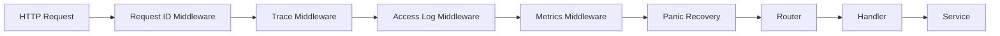

Urutan bisa berbeda tergantung framework, tetapi prinsipnya:

1. Trace context harus diextract sedini mungkin.
2. Request ID harus tersedia untuk logs.
3. Panic recovery harus record error ke span.
4. Metrics harus mencatat status/duration.
5. Access log harus menyertakan trace ID.

### 13.1 Middleware Correlation Example

```go
func TraceIDFromContext(ctx context.Context) string {
    sc := trace.SpanContextFromContext(ctx)
    if !sc.IsValid() {
        return ""
    }
    return sc.TraceID().String()
}

func AccessLog(next http.Handler, logger *slog.Logger) http.Handler {
    return http.HandlerFunc(func(w http.ResponseWriter, r *http.Request) {
        start := time.Now()
        rw := newResponseWriter(w)

        next.ServeHTTP(rw, r)

        logger.InfoContext(r.Context(), "http_request_completed",
            slog.String("method", r.Method),
            slog.String("path", routePattern(r)),
            slog.Int("status", rw.status),
            slog.Duration("duration", time.Since(start)),
            slog.String("trace_id", TraceIDFromContext(r.Context())),
        )
    })
}
```

Trace ID di log membuat investigator bisa lompat dari log ke trace.

---

## 14. HTTP Client Tracing

Outbound call harus menjadi `CLIENT` span.

Dengan instrumentation HTTP client:

```go
client := http.Client{
    Transport: otelhttp.NewTransport(http.DefaultTransport),
}

req, err := http.NewRequestWithContext(ctx, http.MethodGet, url, nil)
if err != nil {
    return err
}

resp, err := client.Do(req)
```

Hal yang harus terlihat di trace:

- Service A menerima request.
- Service A memanggil Service B.
- Service B menerima request sebagai child trace yang sama.

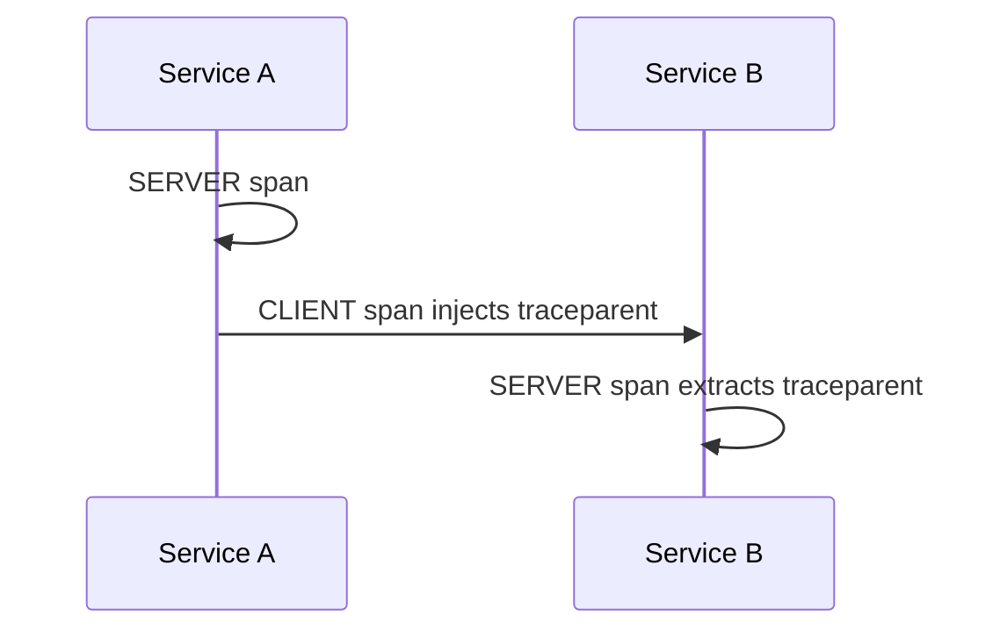

Jika trace terputus, cek:

1. Apakah `NewRequestWithContext` memakai context yang benar?
2. Apakah transport sudah wrapped?
3. Apakah proxy/gateway drop `traceparent`?
4. Apakah Service B menggunakan propagator compatible?
5. Apakah Service B membuat root span baru dari `context.Background()`?

---

## 15. gRPC Tracing

Pada gRPC, propagation biasanya lewat metadata. Gunakan interceptor.

Konsep:

- Unary server interceptor membuat `SERVER` span.
- Unary client interceptor membuat `CLIENT` span.
- Stream interceptor menangani stream lifetime.
- Metadata membawa trace context.

Span naming untuk gRPC:

```text
/agency.ApplicationService/SubmitApplication
```

Hal yang perlu diperhatikan:

1. Long-lived streams bisa menghasilkan span sangat panjang.
2. Event per message dalam stream bisa mahal.
3. Untuk streaming, kadang perlu metric terpisah: messages sent/received, active streams, stream duration.
4. Jangan menyimpan payload message sebagai span attribute/event.

---

## 16. Queue and Messaging Tracing

Messaging lebih sulit daripada HTTP karena hubungan waktunya tidak selalu synchronous.

Ada dua model utama:

### 16.1 Parent-Child Across Message

Producer span menjadi parent dari consumer span.

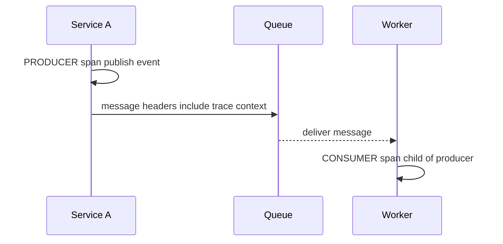

Cocok jika message adalah kelanjutan langsung dari satu operation.

### 16.2 Link-Based Model

Consumer span menggunakan link ke producer span, bukan parent langsung.

Cocok untuk:

- batch consume.
- delayed job.
- retry queue.
- DLQ replay.
- event processing yang tidak berada di critical path request.

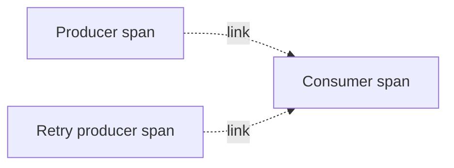

### 16.3 Message Header Propagation

Saat publish message, trace context perlu disimpan di header/properties message.

Pseudo-code:

```go
carrier := propagation.MapCarrier{}
otel.GetTextMapPropagator().Inject(ctx, carrier)

headers := map[string]string{}
for k, v := range carrier {
    headers[k] = v
}

publish(Message{
    Headers: headers,
    Body: body,
})
```

Saat consume:

```go
carrier := propagation.MapCarrier(msg.Headers)
ctx := otel.GetTextMapPropagator().Extract(context.Background(), carrier)

ctx, span := tracer.Start(ctx, "process application.submitted",
    trace.WithSpanKind(trace.SpanKindConsumer),
)
defer span.End()
```

Catatan penting: consumer biasanya mulai dari `context.Background()` lalu extract context dari message headers. Ini berbeda dari memutus trace sembarangan; di sini context memang dipulihkan dari carrier eksternal.

---

## 17. Fan-Out and Fan-In

### 17.1 Fan-Out

Satu request memanggil banyak dependency paralel.

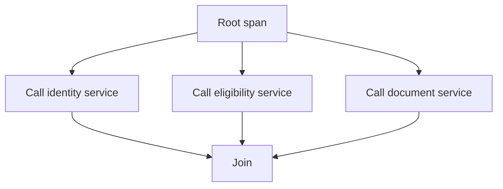

Dalam Go:

```go
ctx, span := tracer.Start(ctx, "load submission dependencies")
defer span.End()

g, ctx := errgroup.WithContext(ctx)

g.Go(func() error { return identity.Load(ctx, userID) })
g.Go(func() error { return eligibility.Check(ctx, appID) })
g.Go(func() error { return document.Load(ctx, appID) })

if err := g.Wait(); err != nil {
    span.RecordError(err)
    span.SetStatus(codes.Error, "dependency load failed")
    return err
}
```

Semua goroutine menerima context yang sama sehingga child spans tetap berada dalam trace yang benar.

### 17.2 Fan-In

Banyak operation masuk ke satu aggregator.

Contoh:

- worker batch flush.
- scheduler menggabungkan banyak pending case.
- report generator mengambil banyak source.

Fan-in sering lebih cocok memakai links daripada parent tunggal.

---

## 18. Tracing Background Jobs

Background job tidak punya inbound HTTP request. Maka root span dibuat oleh scheduler/job runner.

Contoh span name:

```text
job.data-retention.cleanup
job.reconcile-payment-status
job.send-daily-digest
```

Attribute aman:

```text
job.name=data-retention.cleanup
job.trigger=scheduler
job.partition=3
job.mode=dry-run
```

Hindari:

```text
job.item_id=<unique id>
job.sql=<full SQL>
job.payload=<full payload>
```

Pattern:

```go
func (j *Job) Run(ctx context.Context) error {
    ctx, span := j.tracer.Start(ctx, "job.data-retention.cleanup")
    defer span.End()

    span.SetAttributes(
        attribute.String("job.name", "data-retention.cleanup"),
        attribute.String("job.trigger", "scheduler"),
    )

    if err := j.cleanup(ctx); err != nil {
        span.RecordError(err)
        span.SetStatus(codes.Error, "cleanup failed")
        return err
    }

    return nil
}
```

---

## 19. Trace and Log Correlation

Trace menjawab “di mana waktu/error terjadi”. Log menjawab “apa detail event pentingnya”.

Log harus membawa:

- `trace_id`.
- `span_id` jika tersedia.
- request ID jika digunakan.
- operation/module.
- stable event name.

Contoh log:

```json
{
  "time": "2026-06-23T09:15:01Z",
  "level": "ERROR",
  "event": "application_submit_failed",
  "trace_id": "0af7651916cd43dd8448eb211c80319c",
  "span_id": "b7ad6b7169203331",
  "operation": "application.submit",
  "error.kind": "dependency_timeout",
  "dependency": "eligibility-service"
}
```

Trace tanpa log sering kurang detail. Log tanpa trace sering sulit ditelusuri lintas service.

---

## 20. Trace and Metrics Correlation

Metrics menjawab:

- Apakah ini masalah luas atau satu trace saja?
- Apakah rate error naik?
- Apakah p99 naik?
- Apakah dependency tertentu lambat?
- Apakah saturation naik?

Trace menjawab:

- Request contoh mana yang lambat?
- Step mana yang paling lama?
- Dependency mana yang retry?
- Apakah fan-out/fan-in membentuk critical path?

Workflow investigasi:

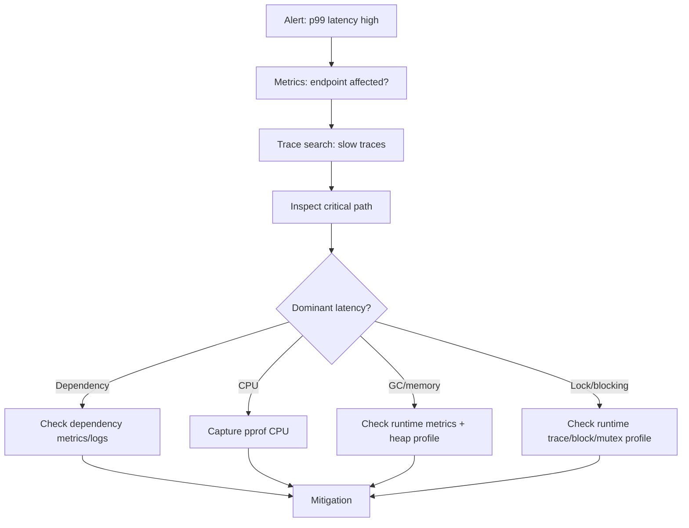

---

## 21. Sampling Strategy

Tracing every request can be expensive. Sampling decides which traces are kept/exported.

### 21.1 Head Sampling

Decision dibuat di awal trace.

Kelebihan:

- Murah.
- Simple.
- Mengurangi overhead downstream.

Kekurangan:

- Bisa melewatkan rare error.
- Tidak tahu request akan lambat/gagal saat keputusan dibuat.

### 21.2 Tail Sampling

Decision dibuat setelah trace selesai atau setelah data cukup.

Kelebihan:

- Bisa keep slow/error traces.
- Lebih baik untuk incident analysis.

Kekurangan:

- Butuh collector/backend memproses lebih banyak data.
- Lebih mahal.
- Lebih kompleks.

### 21.3 Parent-Based Sampling

Child mengikuti keputusan parent.

Ini penting agar trace tidak bolong.

### 21.4 Practical Sampling Policy

Contoh production policy:

| Traffic | Policy |
|---|---|
| Normal successful request | sample 1-5% |
| Error 5xx | keep 100% |
| Slow request > threshold | keep 100% via tail sampling |
| High-value endpoint | higher sample |
| Health check | drop or very low sample |
| Static asset/noisy endpoint | drop |
| Admin/debug operation | sample carefully with privacy review |

Rule penting:

> Sampling harus menjaga kemampuan menjelaskan incident, bukan sekadar menurunkan cost.

---

## 22. Span Volume and Cost Control

Trace cost dipengaruhi:

- jumlah span per request.
- jumlah attribute per span.
- ukuran event.
- sampling rate.
- cardinality attribute.
- retention.
- indexing policy.

### 22.1 Span Explosion

Contoh span explosion:

```text
request
├── loop item 1 span
├── loop item 2 span
├── loop item 3 span
├── ...
└── loop item 10,000 span
```

Lebih baik:

```text
request
└── process batch span
    attributes:
      batch.size=10000
      batch.failed_count=12
      batch.mode=parallel
    events:
      batch.partial_failure
```

### 22.2 Rule of Thumb

Buat span untuk:

- network boundary.
- storage boundary.
- queue boundary.
- expensive internal operation.
- operation yang sering menjadi root cause.
- operation yang punya meaningful duration.

Jangan buat span untuk:

- tiap function kecil.
- tiap loop iteration.
- tiap getter/mapper.
- tiap log event.
- tiap domain object.

---

## 23. Privacy and Security in Tracing

Trace sering berisi:

- URLs.
- query parameters.
- headers.
- DB statements.
- message attributes.
- error messages.
- user/session context.

Risiko:

1. PII leakage.
2. token leakage.
3. business-sensitive data leakage.
4. over-retention.
5. cross-tenant visibility.
6. debug data masuk production backend.

### 23.1 Redaction Principles

- Jangan simpan raw payload.
- Jangan simpan token/header auth.
- Jangan simpan NRIC/email/phone/name sebagai attribute.
- Jangan simpan full URL dengan query string sensitif.
- Gunakan route template, bukan raw path jika mengandung ID.
- Gunakan domain category, bukan domain identifier.

### 23.2 Safer Domain Attribute

```text
BAD: user.id=1029384756
BAD: applicant.email=fajar@example.com
BAD: case.id=CASE-2026-000001
GOOD: user.type=external
GOOD: applicant.type=individual
GOOD: case.priority=high
GOOD: case.stage=assessment
```

Untuk investigasi spesifik, gunakan controlled log access atau audit trail dengan access control, bukan membuka semua identifier di telemetry backend umum.

---

## 24. Instrumentation Layering

Observability harus dilayer dengan jelas:

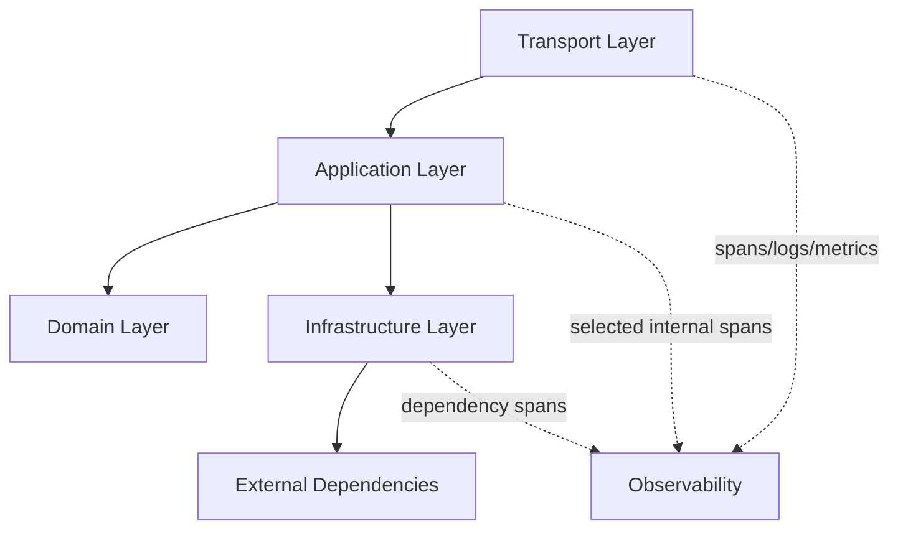

### 24.1 Transport Layer

Instrument:

- inbound HTTP/gRPC.
- response status.
- route.
- duration.
- request size/response size if safe.
- panic.

### 24.2 Application Layer

Instrument:

- use-case operation.
- domain transition.
- orchestration fan-out/fan-in.
- major validation/decision operation.

### 24.3 Domain Layer

Default: jangan terlalu banyak tracing.

Trace domain layer jika:

- computation mahal.
- decision complex.
- rule evaluation sering jadi root cause.
- debugging membutuhkan milestone decision.

### 24.4 Infrastructure Layer

Instrument:

- DB.
- HTTP client.
- Redis.
- queue publish/consume.
- file/storage.
- external API.

---

## 25. Duplicate Instrumentation Problem

Masalah umum: library auto-instrumentation dan manual instrumentation menghasilkan span duplikat.

Contoh:

```text
SERVER POST /submit
└── application.submit
    └── db.query
        └── db.query  // duplicate
```

Penyebab:

- DB wrapper manual + driver instrumentation.
- HTTP middleware dua kali.
- reverse proxy + app instrumentation dengan naming kacau.
- custom middleware dipasang sebelum dan sesudah router tanpa sengaja.

Cara mencegah:

1. Tetapkan ownership instrumentation per boundary.
2. Dokumentasikan package mana yang membuat span apa.
3. Gunakan naming convention.
4. Audit trace secara berkala.
5. Tambahkan test untuk trace structure pada critical flow jika memungkinkan.

---

## 26. Trace Topology untuk Microservices

Dalam organisasi besar, tracing harus konsisten lintas service.

Minimal contract:

1. Semua inbound HTTP/gRPC extract trace context.
2. Semua outbound HTTP/gRPC inject trace context.
3. Semua message publish inject trace context ke header.
4. Semua consumer extract trace context dari header.
5. Semua logs menyertakan trace ID jika valid.
6. Semua service memakai semantic convention yang sama.
7. Semua service menamai route secara templated.
8. Semua service tidak memasukkan PII/secrets.

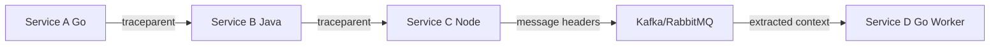

Trace yang baik harus tetap terbaca walaupun stack berbeda bahasa.

---

## 27. Trace Propagation Through API Gateway and Proxy

Gateway/proxy bisa menjadi sumber trace break.

Checklist:

1. Apakah gateway menerima `traceparent` dari caller?
2. Apakah gateway membuat trace baru jika tidak ada incoming trace?
3. Apakah gateway meneruskan `traceparent` dan `tracestate`?
4. Apakah header whitelist menghapus trace headers?
5. Apakah CORS/proxy policy memengaruhi headers?
6. Apakah service mesh membuat span tambahan?
7. Apakah load balancer access logs menyimpan trace ID?
8. Apakah gateway dan app memakai propagator yang sama?

Jika trace putus di boundary gateway, downstream service bisa terlihat seperti trace baru padahal user request sama.

---

## 28. Trace Semantics for Retries

Retry harus terlihat tanpa membuat trace berisik.

Pattern:

```text
CLIENT span: call eligibility service
events:
  - retry.attempt attempt=1 reason=timeout
  - retry.attempt attempt=2 reason=timeout
attributes:
  retry.count=2
  retry.final_outcome=success
```

Atau child span per attempt jika attempt adalah operasi network nyata yang berdurasi dan perlu dianalisis:

```text
call eligibility service
├── attempt 1 HTTP GET /eligibility
├── attempt 2 HTTP GET /eligibility
└── attempt 3 HTTP GET /eligibility
```

Rule:

- Retry event cukup jika detail attempt tidak terlalu penting.
- Span per attempt berguna jika latency/error per attempt harus dilihat.
- Jangan membuat infinite trace noise pada retry storm.
- Selalu expose retry count sebagai metric juga.

---

## 29. Trace Semantics for Timeouts and Cancellations

Go menggunakan `context.Context` untuk deadline/cancellation.

Dalam trace, bedakan:

| Kondisi | Makna |
|---|---|
| `context.Canceled` | caller membatalkan operasi |
| `context.DeadlineExceeded` | deadline terlampaui |
| dependency timeout | remote dependency tidak merespons tepat waktu |
| server timeout | server memutus request karena limit |

Span harus mencatat error kind yang spesifik.

Contoh attribute:

```text
error.kind=context_deadline_exceeded
timeout.budget_ms=2000
dependency=identity-service
```

Jangan hanya mencatat:

```text
error=true
message=failed
```

Trace harus membantu membedakan:

- client cancelled karena user close browser.
- upstream timeout terlalu agresif.
- downstream lambat.
- service sendiri stuck.

---

## 30. Critical Path Analysis

Trace latency tidak hanya jumlah semua span. Jika operasi paralel, critical path adalah jalur yang menentukan durasi total.

```mermaid
gantt
    title Request Trace Critical Path
    dateFormat X
    axisFormat %Lms
    section Root
    request total :0, 500
    section Parallel Dependencies
    identity call :50, 100
    eligibility call :50, 430
    document call :50, 150
    section DB
    save result :450, 40
```

Walaupun total child span duration bisa lebih dari root duration karena paralelisme, critical path di atas adalah:

```text
request total -> eligibility call -> save result
```

Incident investigator harus bertanya:

1. Span mana yang berada di critical path?
2. Span mana yang mahal tetapi paralel dan tidak menentukan latency total?
3. Apakah ada gap tanpa span?
4. Apakah gap menunjukkan CPU compute, queue wait, scheduler delay, lock wait, atau missing instrumentation?

---

## 31. Gaps in Trace

Gap adalah waktu dalam root span yang tidak dijelaskan child span.

Contoh:

```text
SERVER span duration: 1000ms
child spans:
  DB: 50ms
  Redis: 10ms
  HTTP external: 100ms
unexplained gap: ~840ms
```

Kemungkinan:

- CPU computation internal.
- lock contention.
- goroutine scheduling delay.
- GC pause/assist.
- missing instrumentation.
- logging blocking.
- serialization/deserialization.
- request body read/write.

Tindak lanjut:

| Dugaan | Tool berikutnya |
|---|---|
| CPU compute | CPU pprof |
| allocation/GC | runtime metrics + heap profile |
| lock/channel blocking | block/mutex profile + runtime trace |
| scheduler delay | runtime trace |
| missing dependency span | instrumentation audit |
| logging blocking | CPU/block profile + log pipeline metrics |

Trace bukan akhir investigasi. Trace memberi arah untuk tool berikutnya.

---

## 32. Trace-Based Troubleshooting Workflow

Saat ada alert latency/error:

1. Mulai dari metrics untuk scope.
2. Pilih endpoint/service/version yang terdampak.
3. Cari trace lambat/error dari window waktu incident.
4. Bandingkan trace normal vs trace buruk.
5. Cari critical path.
6. Cari dependency span yang dominan.
7. Cari span error/status.
8. Cari gap besar.
9. Lompat ke log via trace ID.
10. Jika issue runtime internal, ambil pprof/trace/runtime metrics.
11. Buat hypothesis dan validasi dengan evidence.

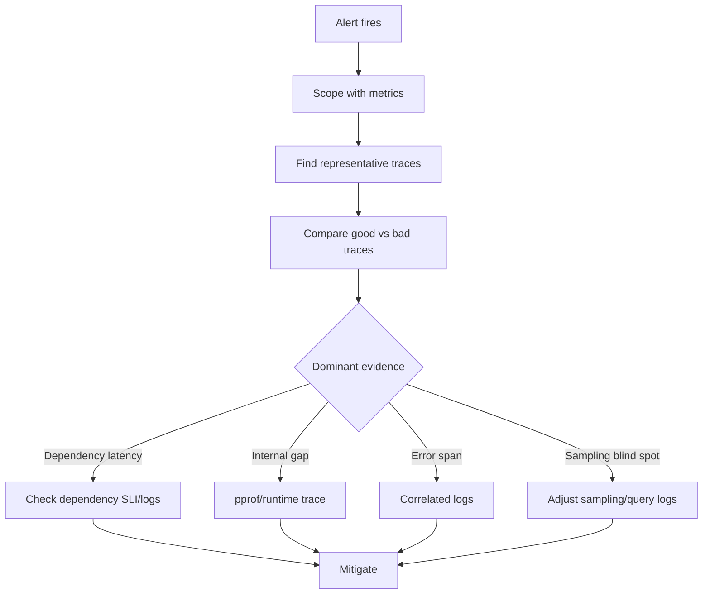

---

## 33. Trace Search Patterns

Pertanyaan production yang sering:

### 33.1 Slow Endpoint

Filter:

```text
service.name=application-api
span.kind=SERVER
http.route=/applications/{id}/submit
duration > 2s
```

Cari:

- Apakah semua slow trace punya dependency sama?
- Apakah slow trace hanya version baru?
- Apakah only external channel?
- Apakah only specific region/zone?

### 33.2 Error Rate Spike

Filter:

```text
service.name=application-api
span.status=ERROR
http.response.status_code>=500
```

Cari:

- Error berasal dari handler atau dependency?
- Error konsisten pada route tertentu?
- Error muncul setelah deployment?
- Error berkorelasi dengan timeout?

### 33.3 Queue Backlog

Filter:

```text
messaging.system=rabbitmq
messaging.destination.name=application.submitted
span.kind=CONSUMER
```

Cari:

- Consumer duration naik?
- External call lambat?
- DB update lambat?
- Retry meningkat?
- Processing gap besar?

### 33.4 Retry Storm

Filter:

```text
retry.count > 0
dependency=identity-service
```

Cari:

- Retry sukses atau tetap gagal?
- Backoff bekerja?
- Semua service retry dependency yang sama?
- Retry membuat downstream makin overload?

---

## 34. Go-Specific Tracing Pitfalls

### 34.1 Context Lost in Goroutine

```go
// BAD
func (s *Service) Submit(ctx context.Context) error {
    go func() {
        s.publisher.Publish(context.Background(), event)
    }()
    return nil
}
```

Lebih baik:

```go
func (s *Service) Submit(ctx context.Context) error {
    go func(ctx context.Context) {
        // Consider context lifecycle carefully.
        // If async work must outlive request, create explicit detached trace/link model.
        _ = s.publisher.Publish(ctx, event)
    }(ctx)
    return nil
}
```

Namun hati-hati: memakai request context untuk pekerjaan async yang harus tetap berjalan setelah response bisa menyebabkan cancellation. Untuk outbox/queue, lebih baik persist event lalu worker membuat consumer trace dari message context/link.

### 34.2 Defer Span End Too Late or Too Early

```go
ctx, span := tracer.Start(ctx, "operation")
defer span.End()
```

Baik untuk fungsi sederhana. Tetapi jika fungsi memulai background goroutine dan return cepat, span tidak boleh dianggap mencakup pekerjaan async yang belum selesai.

### 34.3 Span Not Ended

Jika span tidak diakhiri, trace bisa incomplete.

```go
ctx, span := tracer.Start(ctx, "operation")
if err != nil {
    return err // BAD: span.End not called
}
span.End()
```

Gunakan `defer span.End()` kecuali perlu kontrol eksplisit.

### 34.4 High Cardinality Span Name

```go
tracer.Start(ctx, fmt.Sprintf("submit application %s", appID)) // BAD
```

Gunakan:

```go
tracer.Start(ctx, "application.submit")
```

### 34.5 Attribute From Raw Error Message

```go
span.SetAttributes(attribute.String("error.message", err.Error())) // risky if indexed/high-cardinality
```

Lebih baik record error dan tambahkan classification yang stabil:

```go
span.RecordError(err)
span.SetAttributes(attribute.String("error.kind", classifyError(err)))
```

---

## 35. Tracing and Domain State Machines

Untuk sistem regulatory/case management, tracing sangat berguna untuk melihat transisi state dan escalation flow.

Contoh operasi:

```text
case.transition
```

Attribute aman:

```text
case.module=appeal
case.from_state=draft
case.to_state=submitted
case.trigger=user_action
case.decision=accepted
```

Hindari:

```text
case.id=CASE-2026-000001
applicant.name=...
officer.email=...
```

Trace flow:

```mermaid
flowchart TD
    A[HTTP POST /cases/{id}/submit] --> B[case.transition]
    B --> C[validate transition]
    B --> D[persist state change]
    B --> E[publish case.submitted]
    E --> F[consumer: create audit record]
    E --> G[consumer: notify officer]
```

Tracing di sini membantu menjawab:

- Apakah state transition berhasil dipersist sebelum event publish?
- Apakah audit worker memproses event?
- Apakah notification gagal tetapi state tetap berubah?
- Apakah idempotency bekerja saat retry?

---

## 36. Tracing in Transactional Boundaries

Jangan membuat trace terlihat sukses jika transaction rollback.

Pattern:

```go
ctx, span := tracer.Start(ctx, "case.submit.transaction")
defer span.End()

err := txManager.WithTx(ctx, func(ctx context.Context, tx Tx) error {
    if err := repo.UpdateState(ctx, tx, caseID, Submitted); err != nil {
        return err
    }
    if err := outbox.Insert(ctx, tx, event); err != nil {
        return err
    }
    return nil
})

if err != nil {
    span.RecordError(err)
    span.SetStatus(codes.Error, "transaction rolled back")
    span.SetAttributes(attribute.String("transaction.outcome", "rollback"))
    return err
}

span.SetAttributes(attribute.String("transaction.outcome", "commit"))
```

Span attribute seperti `transaction.outcome=commit|rollback` sangat membantu incident analysis.

---

## 37. Tracing Outbox Pattern

Outbox memisahkan transaction commit dari message publish.

Trace model:

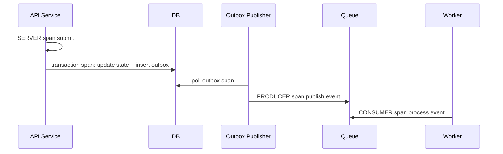

Pertanyaan penting:

- Apakah outbox insert berada dalam trace request asli?
- Apakah publisher trace punya link ke original trace?
- Apakah consumer trace child/link dari producer?
- Apakah event metadata menyimpan original trace ID?

Untuk async outbox, link sering lebih akurat daripada parent-child langsung.

---

## 38. Trace Quality Review Checklist

Ambil 10 trace production random dari endpoint penting. Tanyakan:

1. Apakah root span jelas?
2. Apakah route templated?
3. Apakah dependency spans terlihat?
4. Apakah DB/cache/message spans muncul?
5. Apakah trace context melewati service boundary?
6. Apakah worker consumer tersambung atau linked?
7. Apakah error span punya status dan error event?
8. Apakah logs bisa dicari dengan trace ID?
9. Apakah metrics bisa menunjukkan scope masalah?
10. Apakah ada span duplikat?
11. Apakah ada attribute high-cardinality?
12. Apakah ada PII/secrets?
13. Apakah sampling membuat trace incomplete?
14. Apakah trace menjelaskan critical path?
15. Apakah gap besar bisa dijelaskan?

Jika lebih dari 3 jawaban buruk, tracing belum production-grade.

---

## 39. Minimal Production Trace Contract

Untuk setiap Go service:

```text
[ ] Inbound HTTP/gRPC creates/extracts SERVER span.
[ ] Outbound HTTP/gRPC injects context and creates CLIENT span.
[ ] Queue producer injects trace context into message headers.
[ ] Queue consumer extracts context or creates span links.
[ ] Logs include trace_id and span_id when valid.
[ ] Errors are recorded on relevant spans.
[ ] Span names are stable and low-cardinality.
[ ] Route names use templates.
[ ] Domain attributes are safe and low-cardinality.
[ ] Sampling policy preserves errors and slow requests.
[ ] Health checks/noisy endpoints are filtered or low sampled.
[ ] PII/secrets are not emitted.
[ ] Trace export shutdown is graceful.
[ ] Collector/backend failure does not break business request.
```

---

## 40. Reference OpenTelemetry Setup Skeleton

Catatan: setup detail bisa berbeda tergantung exporter/collector. Ini skeleton mental model.

```go
package observability

import (
    "context"
    "time"

    "go.opentelemetry.io/otel"
    "go.opentelemetry.io/otel/propagation"
    "go.opentelemetry.io/otel/sdk/resource"
    sdktrace "go.opentelemetry.io/otel/sdk/trace"
    semconv "go.opentelemetry.io/otel/semconv/v1.26.0"
)

type TracingShutdown func(context.Context) error

func SetupTracing(ctx context.Context, serviceName, serviceVersion, environment string) (TracingShutdown, error) {
    res, err := resource.New(ctx,
        resource.WithAttributes(
            semconv.ServiceName(serviceName),
            semconv.ServiceVersion(serviceVersion),
            semconv.DeploymentEnvironment(environment),
        ),
    )
    if err != nil {
        return nil, err
    }

    // Exporter intentionally omitted here.
    // In production, usually OTLP exporter to OTel Collector.
    exporter, err := newOTLPTraceExporter(ctx)
    if err != nil {
        return nil, err
    }

    provider := sdktrace.NewTracerProvider(
        sdktrace.WithResource(res),
        sdktrace.WithBatcher(exporter),
        sdktrace.WithSampler(sdktrace.ParentBased(
            sdktrace.TraceIDRatioBased(0.05),
        )),
    )

    otel.SetTracerProvider(provider)
    otel.SetTextMapPropagator(propagation.NewCompositeTextMapPropagator(
        propagation.TraceContext{},
        propagation.Baggage{},
    ))

    return func(ctx context.Context) error {
        shutdownCtx, cancel := context.WithTimeout(ctx, 5*time.Second)
        defer cancel()
        return provider.Shutdown(shutdownCtx)
    }, nil
}
```

Prinsip:

- Resource attributes konsisten.
- Batch exporter, bukan sync per span.
- Parent-based sampler.
- W3C Trace Context propagator.
- Graceful shutdown untuk flush span.
- Exporter failure tidak boleh membuat request bisnis gagal.

---

## 41. Testing Tracing Behavior

Tracing bisa dites dengan in-memory exporter atau test span recorder.

Yang dites:

1. Span dibuat untuk operasi penting.
2. Span status error saat dependency gagal.
3. Attribute domain aman terisi.
4. Trace context diteruskan ke outbound call.
5. Tidak ada PII di attribute.
6. Span name stabil.

Pseudo-test:

```go
func TestSubmitRecordsErrorSpan(t *testing.T) {
    recorder := newTestSpanRecorder()
    svc := newServiceWithTracer(recorder.Tracer())

    err := svc.Submit(context.Background(), "app-1")
    require.Error(t, err)

    spans := recorder.Ended()
    span := findSpan(spans, "application.submit")

    require.Equal(t, codes.Error, span.Status().Code)
    requireAttr(t, span, "application.operation", "submit")
    requireNoAttr(t, span, "application.id")
}
```

Testing tracing bukan berarti assert semua span internal. Fokus pada contract yang penting.

---

## 42. Migration Strategy from No Tracing to Good Tracing

Jangan mulai dengan instrumentasi semua function.

### Phase 1 — Boundary Tracing

- inbound HTTP/gRPC.
- outbound HTTP/gRPC.
- DB/cache.
- queue publish/consume.

### Phase 2 — Correlation

- logs include trace ID.
- metrics include exemplars if supported.
- dashboards link to traces.

### Phase 3 — Domain Milestones

- use-case span.
- state transition span.
- rule evaluation span untuk proses mahal/critical.

### Phase 4 — Sampling and Governance

- sampling policy.
- PII review.
- cost review.
- cardinality review.

### Phase 5 — Incident-Driven Refinement

- tambahkan span berdasarkan blind spot incident.
- hapus span yang tidak pernah dipakai.
- perbaiki naming.
- perbaiki context propagation.

---

## 43. Anti-Pattern Ringkas

| Anti-pattern | Dampak |
|---|---|
| span per function | trace noise, cost tinggi |
| span name berisi ID | cardinality explosion |
| payload di attribute/event | PII/secrets/cost risk |
| context.Background di tengah request | trace terputus |
| tidak end span | incomplete trace |
| duplicate instrumentation | trace membingungkan |
| semua 4xx dianggap error | false error signal |
| tidak sample error/slow traces | incident blind spot |
| tidak correlate log dengan trace | investigator pindah tool secara manual |
| queue tanpa context headers | async flow hilang |
| trace dianggap pengganti metric | tidak tahu scope masalah |
| trace dianggap pengganti pprof | tidak tahu internal CPU/memory/blocking |

---

## 44. Practical Exercises

### Exercise 1 — Trace Contract Review

Ambil satu service Go yang punya HTTP endpoint dan dependency DB/external API. Tulis expected trace tree untuk satu request sukses dan satu request gagal.

Output:

```text
Trace: POST /x/{id}/submit
├── SERVER ...
├── INTERNAL ...
├── CLIENT DB ...
└── CLIENT external ...
```

### Exercise 2 — Context Break Hunt

Cari di codebase:

```text
context.Background()
context.TODO()
go func()
http.NewRequest(
```

Untuk setiap occurrence, jawab:

- Apakah ini boundary root yang valid?
- Apakah ini memutus trace?
- Apakah context harus dipropagasikan?
- Apakah pekerjaan async butuh link model?

### Exercise 3 — Attribute Safety Review

Buat daftar semua proposed span attributes. Klasifikasikan:

| Attribute | Low cardinality? | PII? | Secret risk? | Keep? |
|---|---:|---:|---:|---:|

### Exercise 4 — Slow Trace Analysis

Ambil 5 slow traces. Untuk masing-masing:

1. Identifikasi critical path.
2. Cari dominant span.
3. Cari gap.
4. Cari error/retry event.
5. Tentukan tool lanjutan: logs, metrics, pprof, runtime trace, dependency dashboard.

### Exercise 5 — Queue Propagation

Untuk satu producer-consumer flow:

1. Tambahkan trace context ke message headers.
2. Extract di consumer.
3. Putuskan parent-child atau link.
4. Tambahkan log trace ID di worker.
5. Buat trace contoh sukses dan gagal.

---

## 45. Ringkasan Mental Model

Distributed tracing di Go bukan sekadar memasang OpenTelemetry middleware.

Tracing production-grade membutuhkan:

1. Causal graph yang benar.
2. Context propagation yang disiplin.
3. Span name stabil.
4. Attribute aman dan low-cardinality.
5. Boundary instrumentation yang lengkap.
6. Async propagation/link modeling.
7. Error/status semantics yang benar.
8. Sampling yang mempertahankan evidence penting.
9. Korelasi dengan log, metrics, runtime metrics, pprof, dan runtime trace.
10. Governance agar telemetry tidak menjadi risiko biaya dan keamanan.

Trace yang baik memungkinkan engineer menjawab:

> “Request ini melewati apa saja, bagian mana yang lambat/gagal, apakah ini masalah lokal atau sistemik, dan tool apa yang harus dipakai berikutnya?”

---

## 46. Sumber Utama

Sumber yang relevan untuk bagian ini:

1. OpenTelemetry Traces — https://opentelemetry.io/docs/concepts/signals/traces/
2. OpenTelemetry Context Propagation — https://opentelemetry.io/docs/concepts/context-propagation/
3. OpenTelemetry Go — https://opentelemetry.io/docs/languages/go/
4. OpenTelemetry HTTP Semantic Conventions — https://opentelemetry.io/docs/specs/semconv/http/http-spans/
5. OpenTelemetry Messaging Semantic Conventions — https://opentelemetry.io/docs/specs/semconv/messaging/
6. W3C Trace Context — https://www.w3.org/TR/trace-context/
7. W3C Trace Context Level 2 — https://www.w3.org/TR/trace-context-2/
8. `otelhttp` package — https://pkg.go.dev/go.opentelemetry.io/contrib/instrumentation/net/http/otelhttp
9. Go `context` package — https://pkg.go.dev/context

---

## 47. Koneksi ke Part Berikutnya

Part ini menjelaskan tracing sebagai signal end-to-end. Part berikutnya akan masuk ke:

```text
learn-go-logging-observability-profiling-troubleshooting-part-010.md
```

Topik:

```text
Observability Middleware Design
```

Kita akan membangun desain middleware konkret untuk HTTP/gRPC/worker yang menggabungkan:

- request ID.
- tracing.
- structured access log.
- metrics.
- panic recovery.
- context propagation.
- timeout/cancellation evidence.
- reusable internal observability package.

<!-- NAVIGATION_FOOTER -->
<div class="page-nav">
<a href="./learn-go-logging-observability-profiling-troubleshooting-part-008.md">⬅️ Part 008 — OpenTelemetry Go: Architecture and Trade-offs</a>
<a href="./index.md">📚 Kategori</a>
<a href="../../index.md">🏠 Home</a>
<a href="./learn-go-logging-observability-profiling-troubleshooting-part-010.md">Part 010 — Observability Middleware Design ➡️</a>
</div>
