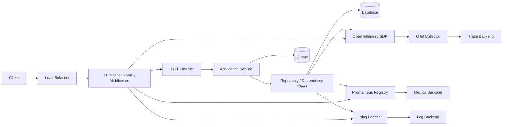
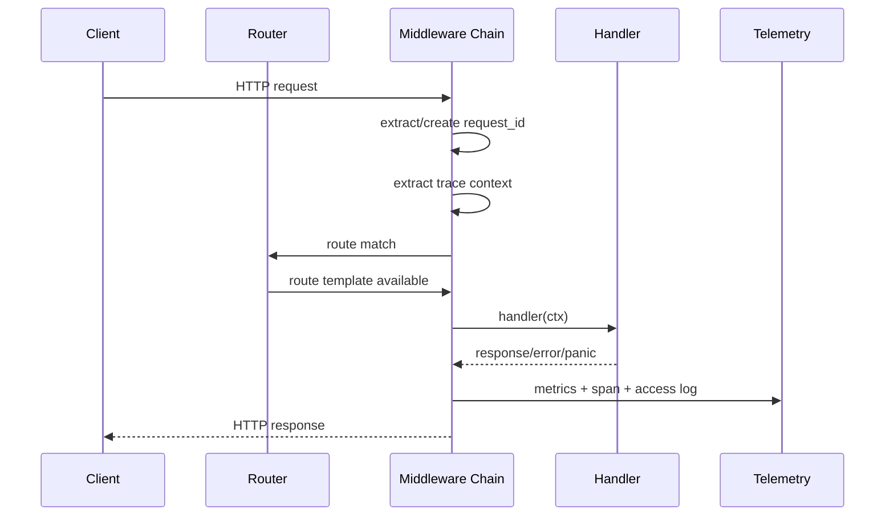
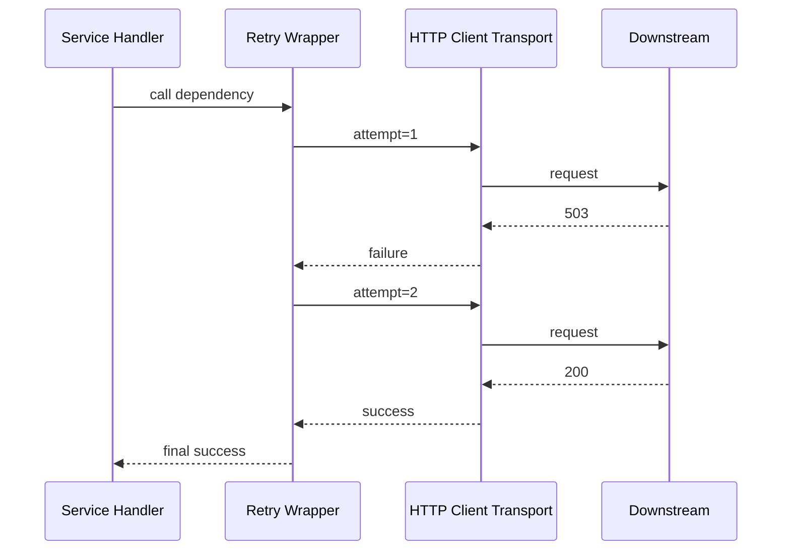
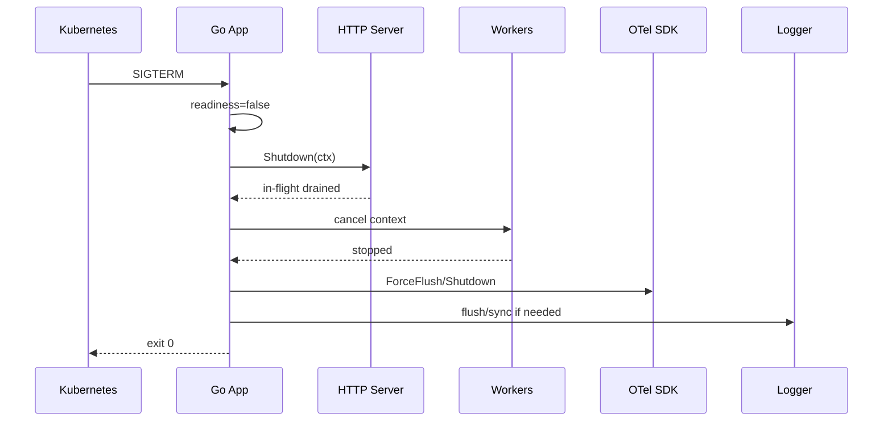

# learn-go-logging-observability-profiling-troubleshooting-part-010.md

# Part 010 — Observability Middleware Design

> Seri: `learn-go-logging-observability-profiling-troubleshooting`  
> Bagian: `010 / 032`  
> Fokus: desain middleware observability production untuk Go service: HTTP inbound, outbound client, gRPC, worker, queue consumer, batch job, context propagation, log/metric/trace correlation, failure evidence, dan shutdown/flush discipline.

---

## 0. Posisi Part Ini dalam Seri

Pada bagian sebelumnya kita sudah membangun fondasi:

- Part 000: observability sebagai runtime truth.
- Part 001: filosofi logging production.
- Part 002: `log/slog` deep dive.
- Part 003: arsitektur logging service.
- Part 004: error logging dan failure evidence.
- Part 005: metrics mental model.
- Part 006: Prometheus instrumentation.
- Part 007: `runtime/metrics`.
- Part 008: OpenTelemetry architecture.
- Part 009: distributed tracing.

Part ini menjawab pertanyaan praktis:

> “Bagaimana semua itu dipasang ke service Go secara konsisten tanpa setiap handler, repository, worker, dan client menulis telemetry sendiri-sendiri?”

Jawabannya: **observability middleware**.

Middleware adalah boundary layer yang menangkap event teknis secara sistematis: request masuk, response keluar, panic, timeout, dependency call, queue message, job execution, dan goroutine lifecycle.

Di Java/Spring, banyak hal ini sering muncul sebagai:

- servlet filter,
- Spring interceptor,
- AOP,
- Micrometer filter,
- Sleuth/Brave/OpenTelemetry instrumentation,
- Logback MDC,
- actuator endpoint,
- WebClient/RestTemplate interceptor.

Di Go, tidak ada framework runtime besar yang secara otomatis “menguasai” lifecycle aplikasi. Ini memberi fleksibilitas besar, tetapi juga memaksa engineer mendesain boundary observability dengan sengaja.

---

## 1. Core Mental Model: Middleware Is an Observability Boundary

Middleware bukan sekadar wrapper function.

Middleware adalah **tempat terbaik untuk mencatat fakta lintas-cutting** yang berlaku untuk semua operasi pada boundary tertentu.

Contoh boundary:

| Boundary | Middleware/Wrapper | Fakta yang bisa ditangkap |
|---|---|---|
| HTTP inbound | `func(http.Handler) http.Handler` | method, route, status, latency, bytes, panic, request ID, trace ID |
| HTTP outbound | custom `RoundTripper` | target host, method, status, duration, retry, timeout |
| gRPC inbound | unary/stream interceptor | method, status code, deadline, latency, peer |
| gRPC outbound | client interceptor | dependency latency, code, retry, deadline |
| Queue consumer | message handler wrapper | topic/queue, attempt, ack/nack, processing latency |
| Worker/job | function wrapper | job type, success/failure, duration, cancellation |
| Background goroutine | lifecycle wrapper | start, stop, panic, restart, leak hints |
| Transaction boundary | wrapper around unit of work | commit/rollback, duration, error class |

Middleware harus menjawab minimal empat pertanyaan:

1. **Apa operasi yang sedang terjadi?**  
   Misalnya `http.request`, `queue.consume`, `job.run`, `db.transaction`.

2. **Siapa/apa konteksnya?**  
   Request ID, trace ID, tenant, actor type, service, version, environment.

3. **Bagaimana hasilnya?**  
   Success/failure, status code, error class, retryable/non-retryable.

4. **Berapa biayanya?**  
   Duration, queue delay, bytes, attempt count, dependency latency.

Kalau middleware hanya menulis log “request completed”, itu belum cukup. Middleware harus menjadi **evidence generator**.

---

## 2. Mengapa Middleware Observability Penting di Go

Go service biasanya dibangun dengan library kecil dan explicit composition.

Kelebihan:

- mudah membuat wrapper,
- tidak banyak magic,
- overhead lebih mudah dipahami,
- telemetry bisa sangat presisi.

Risiko:

- setiap service membuat format log sendiri,
- setiap handler lupa menambah metrics,
- trace putus di goroutine,
- context cancellation tidak terlihat,
- panic recovery tidak konsisten,
- endpoint `/metrics` dan `/debug/pprof` terekspos sembarangan,
- outbound dependency call tidak bisa dikorelasikan dengan inbound request.

Middleware observability menyelesaikan masalah itu dengan prinsip:

> Instrument once at the boundary, enrich inside the operation, finalize once at exit.

Artinya:

- boundary menciptakan context observability,
- business logic memakai context itu,
- exit boundary mencatat outcome final,
- metrics dan trace selalu konsisten,
- log tidak terduplikasi.

---

## 3. Invariant Desain Middleware Observability

Middleware yang baik harus mematuhi invariant berikut.

### 3.1 Invariant 1 — Exactly One Final Outcome per Operation

Satu request HTTP harus menghasilkan satu final access event:

```text
operation = http.server.request
outcome   = success | error | panic | cancelled | timeout
```

Bukan:

- handler log error,
- service log error,
- middleware log error,
- recovery log error,
- tracing log error lagi,
- metrics menghitung error dua kali.

Layer internal boleh menambah event detail, tetapi final outcome hanya dicatat sekali di boundary.

### 3.2 Invariant 2 — Context Must Carry Correlation, Not Business State

`context.Context` cocok membawa:

- deadline,
- cancellation,
- trace context,
- logger enriched,
- request ID,
- auth principal minimal,
- observability-scoped metadata.

Context tidak cocok membawa:

- database transaction besar tanpa discipline,
- mutable business object,
- global config,
- cache object,
- optional parameter arbitrer.

Observability context harus kecil, immutable secara konseptual, dan aman dipropagasikan.

### 3.3 Invariant 3 — Metrics Labels Must Be Bounded

Middleware HTTP boleh label:

- `method`,
- `route`,
- `status_class`,
- `status_code` jika cardinality terkendali,
- `service`,
- `dependency`,
- `operation`.

Jangan label:

- raw path `/users/123456/orders/987`,
- user ID,
- request ID,
- trace ID,
- email,
- token,
- arbitrary error message,
- arbitrary query string.

Metrics adalah agregasi. Kalau label tidak bounded, backend metrics akan rusak.

### 3.4 Invariant 4 — Logs Can Be Detailed, Metrics Must Be Aggregatable, Traces Must Preserve Causality

Setiap signal punya tugas berbeda.

| Signal | Tugas utama |
|---|---|
| Log | evidence detail per event |
| Metric | aggregate numeric signal |
| Trace | causality path lintas boundary |
| Profile | runtime cost distribution |

Jangan memaksa satu signal mengerjakan semuanya.

### 3.5 Invariant 5 — Middleware Must Not Hide Failure Semantics

Middleware buruk sering mengubah semua error menjadi `500` dan log `internal error`.

Middleware baik membedakan:

- client cancellation,
- context deadline exceeded,
- validation error,
- dependency timeout,
- panic,
- auth failure,
- rate limited,
- conflict,
- idempotency duplicate,
- circuit open,
- queue nack.

Failure class adalah kunci troubleshooting.

---

## 4. Reference Architecture



Arsitektur ini menunjukkan pola penting:

- middleware inbound membuat root context untuk operasi,
- handler/service/repository memakai context yang sama,
- outbound dependency wrapper membuat child span dan dependency metrics,
- logger mengambil trace/request fields dari context,
- metrics tidak memakai request ID/trace ID sebagai label,
- exporter/collector menangani pengiriman telemetry keluar process.

---

## 5. HTTP Inbound Middleware: Boundary Utama Service

HTTP inbound adalah boundary paling umum.

Tanggung jawab middleware inbound:

1. Membuat/menormalisasi request ID.
2. Melakukan trace propagation.
3. Membuat server span.
4. Meng-enrich logger dengan request fields.
5. Mengukur duration.
6. Menangkap status code.
7. Menangkap response bytes bila perlu.
8. Menghitung request counter.
9. Mengisi latency histogram.
10. Menangkap panic.
11. Mengklasifikasi outcome.
12. Mencatat final access log.
13. Tidak membocorkan PII.

### 5.1 Masalah Besar: `http.ResponseWriter` Tidak Menyimpan Status

Di Go, handler menulis status via `w.WriteHeader(status)` atau implicit `200` saat `Write` pertama.

Middleware harus membungkus `ResponseWriter` untuk menangkap status.

```go
package obshttp

import (
    "bufio"
    "errors"
    "fmt"
    "net"
    "net/http"
)

type statusRecorder struct {
    http.ResponseWriter
    status      int
    bytes       int64
    wroteHeader bool
}

func newStatusRecorder(w http.ResponseWriter) *statusRecorder {
    return &statusRecorder{ResponseWriter: w, status: http.StatusOK}
}

func (r *statusRecorder) WriteHeader(code int) {
    if r.wroteHeader {
        return
    }
    r.status = code
    r.wroteHeader = true
    r.ResponseWriter.WriteHeader(code)
}

func (r *statusRecorder) Write(p []byte) (int, error) {
    if !r.wroteHeader {
        r.WriteHeader(http.StatusOK)
    }
    n, err := r.ResponseWriter.Write(p)
    r.bytes += int64(n)
    return n, err
}

// Optional interfaces matter because some frameworks/clients rely on them.
func (r *statusRecorder) Flush() {
    if f, ok := r.ResponseWriter.(http.Flusher); ok {
        f.Flush()
    }
}

func (r *statusRecorder) Hijack() (net.Conn, *bufio.ReadWriter, error) {
    h, ok := r.ResponseWriter.(http.Hijacker)
    if !ok {
        return nil, nil, errors.New("underlying ResponseWriter does not support Hijacker")
    }
    return h.Hijack()
}

func (r *statusRecorder) Push(target string, opts *http.PushOptions) error {
    p, ok := r.ResponseWriter.(http.Pusher)
    if !ok {
        return http.ErrNotSupported
    }
    return p.Push(target, opts)
}

func (r *statusRecorder) Unwrap() http.ResponseWriter {
    return r.ResponseWriter
}

func (r *statusRecorder) String() string {
    return fmt.Sprintf("status=%d bytes=%d", r.status, r.bytes)
}
```

Production caveat:

- preserve optional interfaces jika perlu,
- jangan double write header,
- support streaming/flush,
- hati-hati dengan hijack/websocket,
- jangan menghitung bytes sebagai truth absolut untuk compressed/chunked response.

### 5.2 Request ID Middleware

Request ID sering datang dari upstream load balancer/API gateway.

Common headers:

- `X-Request-Id`,
- `X-Correlation-Id`,
- vendor-specific request ID,
- trace ID dari W3C `traceparent`.

Prinsip:

- jika incoming request ID valid, preserve,
- jika tidak ada, generate,
- jangan percaya format bebas tanpa validasi panjang/karakter,
- response header sebaiknya mengembalikan request ID,
- request ID bukan trace ID, walau bisa dikorelasikan.

```go
package obsctx

import "context"

type requestIDKey struct{}

func WithRequestID(ctx context.Context, id string) context.Context {
    return context.WithValue(ctx, requestIDKey{}, id)
}

func RequestID(ctx context.Context) string {
    v, _ := ctx.Value(requestIDKey{}).(string)
    return v
}
```

```go
package obshttp

import (
    "crypto/rand"
    "encoding/hex"
    "net/http"
    "regexp"

    "example/internal/obsctx"
)

var safeRequestID = regexp.MustCompile(`^[a-zA-Z0-9._:-]{1,128}$`)

func RequestID(next http.Handler) http.Handler {
    return http.HandlerFunc(func(w http.ResponseWriter, r *http.Request) {
        id := r.Header.Get("X-Request-Id")
        if !safeRequestID.MatchString(id) {
            id = newRequestID()
        }

        w.Header().Set("X-Request-Id", id)
        ctx := obsctx.WithRequestID(r.Context(), id)
        next.ServeHTTP(w, r.WithContext(ctx))
    })
}

func newRequestID() string {
    var b [16]byte
    if _, err := rand.Read(b[:]); err != nil {
        // crypto/rand failure is extremely rare. In real production code,
        // decide whether to panic, fallback, or return deterministic marker.
        return "request-id-generation-failed"
    }
    return hex.EncodeToString(b[:])
}
```

Catatan:

- `math/rand` tidak ideal untuk ID correlation.
- Jangan menyimpan request body dalam log.
- Jangan menggunakan user ID sebagai request ID.

---

## 6. Access Log Middleware

Access log adalah log final per request.

Fields minimal:

```text
service
version
environment
request_id
trace_id
span_id
http.method
http.route
http.status_code
http.status_class
http.response_bytes
http.duration_ms
client.ip_class / remote_addr_policy
user_agent_class optional
outcome
error.class optional
```

Jangan log:

- full Authorization header,
- cookie,
- raw query dengan token,
- full request body,
- full response body,
- password/secret,
- email tanpa kebutuhan audit/legal.

Contoh middleware:

```go
package obshttp

import (
    "log/slog"
    "net/http"
    "strconv"
    "time"

    "example/internal/obsctx"
)

type RouteNamer interface {
    RouteName(*http.Request) string
}

type AccessLogConfig struct {
    Logger    *slog.Logger
    RouteName func(*http.Request) string
}

func AccessLog(cfg AccessLogConfig) func(http.Handler) http.Handler {
    logger := cfg.Logger
    if logger == nil {
        logger = slog.Default()
    }

    routeName := cfg.RouteName
    if routeName == nil {
        routeName = func(r *http.Request) string { return "unknown" }
    }

    return func(next http.Handler) http.Handler {
        return http.HandlerFunc(func(w http.ResponseWriter, r *http.Request) {
            start := time.Now()
            rec := newStatusRecorder(w)

            defer func() {
                duration := time.Since(start)
                route := routeName(r)
                statusClass := strconv.Itoa(rec.status/100) + "xx"

                level := slog.LevelInfo
                if rec.status >= 500 {
                    level = slog.LevelError
                } else if rec.status >= 400 {
                    level = slog.LevelWarn
                }

                logger.LogAttrs(r.Context(), level, "http request completed",
                    slog.String("event", "http.server.request.completed"),
                    slog.String("request_id", obsctx.RequestID(r.Context())),
                    slog.String("http.method", r.Method),
                    slog.String("http.route", route),
                    slog.Int("http.status_code", rec.status),
                    slog.String("http.status_class", statusClass),
                    slog.Int64("http.response_bytes", rec.bytes),
                    slog.Duration("duration", duration),
                )
            }()

            next.ServeHTTP(rec, r)
        })
    }
}
```

### 6.1 Raw Path vs Route Template

Metrics/log field untuk route sebaiknya route template:

```text
/users/{id}/orders/{order_id}
```

bukan raw path:

```text
/users/481729/orders/991028
```

Untuk log, raw path kadang berguna, tetapi harus hati-hati karena:

- bisa mengandung PII,
- cardinality tinggi,
- query string sering berisi token.

Untuk metrics, raw path hampir selalu salah.

---

## 7. Panic Recovery Middleware

Panic di request handler adalah bug atau invariant violation. Middleware harus:

1. Recover.
2. Log event dengan severity error.
3. Increment panic counter.
4. Record span exception.
5. Return 500 jika response belum committed.
6. Jangan mengekspos detail panic ke client.
7. Jangan menelan panic untuk background goroutine tanpa policy.

```go
package obshttp

import (
    "log/slog"
    "net/http"
    "runtime/debug"

    "go.opentelemetry.io/otel/trace"
)

func Recover(logger *slog.Logger) func(http.Handler) http.Handler {
    if logger == nil {
        logger = slog.Default()
    }

    return func(next http.Handler) http.Handler {
        return http.HandlerFunc(func(w http.ResponseWriter, r *http.Request) {
            rec, ok := w.(*statusRecorder)
            if !ok {
                rec = newStatusRecorder(w)
            }

            defer func() {
                if x := recover(); x != nil {
                    ctx := r.Context()
                    span := trace.SpanFromContext(ctx)
                    span.RecordError(asError(x))

                    logger.ErrorContext(ctx, "panic recovered",
                        slog.String("event", "http.server.panic"),
                        slog.Any("panic", x),
                        slog.String("stack", string(debug.Stack())),
                    )

                    if !rec.wroteHeader {
                        http.Error(rec, http.StatusText(http.StatusInternalServerError), http.StatusInternalServerError)
                    }
                }
            }()

            next.ServeHTTP(rec, r)
        })
    }
}

func asError(v any) error {
    if err, ok := v.(error); ok {
        return err
    }
    return panicError{v: v}
}

type panicError struct{ v any }

func (e panicError) Error() string { return "panic" }
```

Catatan penting:

- logging stack setiap panic bisa mahal, tetapi panic harus jarang.
- jika panic sering, masalahnya bukan logging cost, melainkan bug.
- jangan teruskan request setelah recover.
- jika response sudah partially written, status tidak bisa diubah; log harus mencatat `response_committed=true`.

---

## 8. Metrics Middleware HTTP

Metric minimal untuk HTTP server:

1. `http_server_requests_total`
2. `http_server_request_duration_seconds`
3. `http_server_request_size_bytes` optional
4. `http_server_response_size_bytes` optional
5. `http_server_in_flight_requests`
6. `http_server_panics_total`

Labels bounded:

```text
method
route
status_class
status_code optional
```

Contoh Prometheus middleware:

```go
package obshttp

import (
    "net/http"
    "strconv"
    "time"

    "github.com/prometheus/client_golang/prometheus"
)

type Metrics struct {
    RequestsTotal *prometheus.CounterVec
    Duration      *prometheus.HistogramVec
    InFlight      prometheus.Gauge
}

func NewMetrics(reg prometheus.Registerer) *Metrics {
    m := &Metrics{
        RequestsTotal: prometheus.NewCounterVec(prometheus.CounterOpts{
            Name: "http_server_requests_total",
            Help: "Total HTTP server requests.",
        }, []string{"method", "route", "status_class"}),
        Duration: prometheus.NewHistogramVec(prometheus.HistogramOpts{
            Name:    "http_server_request_duration_seconds",
            Help:    "HTTP server request duration.",
            Buckets: []float64{0.005, 0.01, 0.025, 0.05, 0.1, 0.25, 0.5, 1, 2.5, 5, 10},
        }, []string{"method", "route", "status_class"}),
        InFlight: prometheus.NewGauge(prometheus.GaugeOpts{
            Name: "http_server_in_flight_requests",
            Help: "Current in-flight HTTP server requests.",
        }),
    }

    reg.MustRegister(m.RequestsTotal, m.Duration, m.InFlight)
    return m
}

func PrometheusMetrics(m *Metrics, routeName func(*http.Request) string) func(http.Handler) http.Handler {
    if routeName == nil {
        routeName = func(r *http.Request) string { return "unknown" }
    }

    return func(next http.Handler) http.Handler {
        return http.HandlerFunc(func(w http.ResponseWriter, r *http.Request) {
            start := time.Now()
            rec := newStatusRecorder(w)
            m.InFlight.Inc()
            defer m.InFlight.Dec()

            defer func() {
                route := routeName(r)
                statusClass := strconv.Itoa(rec.status/100) + "xx"
                labels := prometheus.Labels{
                    "method":       r.Method,
                    "route":        route,
                    "status_class": statusClass,
                }
                m.RequestsTotal.With(labels).Inc()
                m.Duration.With(labels).Observe(time.Since(start).Seconds())
            }()

            next.ServeHTTP(rec, r)
        })
    }
}
```

### 8.1 Middleware Ordering Problem

Order matters.

A good ordering:

```text
RequestID
Trace extraction / otelhttp
Recover
Metrics
AccessLog
Auth
Routing
Handler
```

But depending on framework, route name may be available only after router matches. Therefore the actual composition often becomes:

```text
outer: request id, panic recovery, tracing context
router: route matching
inner route middleware: metrics/access log with route template
handler
```

Mermaid view:



Practical rule:

- request ID must happen very early,
- panic recovery must wrap almost everything,
- route-aware metrics need route template,
- access log should see final status,
- tracing should wrap the logical request.

---

## 9. OpenTelemetry HTTP Middleware

OpenTelemetry contrib package `otelhttp` provides an HTTP handler wrapper to add tracing to existing handlers. In practice, you can use it instead of writing all tracing boilerplate manually.

Conceptual usage:

```go
wrapped := otelhttp.NewHandler(handler, "http.server")
```

However, production design still requires decisions:

- span name source,
- route attribute source,
- public endpoint filtering,
- health check exclusion,
- sampling,
- trace/log correlation,
- request ID relationship,
- error status mapping,
- cardinality limits.

### 9.1 Manual Span Enrichment

Even with auto middleware, domain-specific attributes may need manual enrichment.

```go
span := trace.SpanFromContext(ctx)
span.SetAttributes(
    attribute.String("app.module", "application_management"),
    attribute.String("app.operation", "submit_application"),
)
```

Avoid:

```go
span.SetAttributes(attribute.String("user.email", email))
span.SetAttributes(attribute.String("request.body", string(body)))
span.SetAttributes(attribute.String("sql.full_query", queryWithValues))
```

### 9.2 Trace ID in Logs

`slog` does not automatically add trace IDs. A common pattern is a handler wrapper that reads span context from `context.Context`.

```go
package obslog

import (
    "context"
    "log/slog"

    "go.opentelemetry.io/otel/trace"
)

type TraceHandler struct {
    next slog.Handler
}

func NewTraceHandler(next slog.Handler) *TraceHandler {
    return &TraceHandler{next: next}
}

func (h *TraceHandler) Enabled(ctx context.Context, level slog.Level) bool {
    return h.next.Enabled(ctx, level)
}

func (h *TraceHandler) Handle(ctx context.Context, r slog.Record) error {
    sc := trace.SpanContextFromContext(ctx)
    if sc.IsValid() {
        r.AddAttrs(
            slog.String("trace_id", sc.TraceID().String()),
            slog.String("span_id", sc.SpanID().String()),
        )
    }
    return h.next.Handle(ctx, r)
}

func (h *TraceHandler) WithAttrs(attrs []slog.Attr) slog.Handler {
    return &TraceHandler{next: h.next.WithAttrs(attrs)}
}

func (h *TraceHandler) WithGroup(name string) slog.Handler {
    return &TraceHandler{next: h.next.WithGroup(name)}
}
```

This makes logs correlate with traces without putting trace ID in metrics labels.

---

## 10. Outbound HTTP Client Instrumentation

Inbound middleware only tells you request latency inside your service. It does not automatically explain downstream time.

Outbound instrumentation must capture:

- dependency name,
- method,
- target route/template if known,
- status code,
- duration,
- timeout/cancellation,
- retry attempt,
- error class,
- trace child span.

In Go, outbound HTTP instrumentation is often implemented using custom `http.RoundTripper`.

```go
package obshttpclient

import (
    "context"
    "errors"
    "log/slog"
    "net/http"
    "strconv"
    "time"

    "github.com/prometheus/client_golang/prometheus"
    "go.opentelemetry.io/otel"
    "go.opentelemetry.io/otel/attribute"
    "go.opentelemetry.io/otel/codes"
)

type Transport struct {
    Base       http.RoundTripper
    Dependency string
    Logger     *slog.Logger
    Duration   *prometheus.HistogramVec
    Requests   *prometheus.CounterVec
}

func (t *Transport) RoundTrip(req *http.Request) (*http.Response, error) {
    base := t.Base
    if base == nil {
        base = http.DefaultTransport
    }

    tracer := otel.Tracer("example/internal/obshttpclient")
    ctx, span := tracer.Start(req.Context(), "http.client "+t.Dependency)
    defer span.End()

    req = req.WithContext(ctx)

    start := time.Now()
    resp, err := base.RoundTrip(req)
    dur := time.Since(start)

    statusCode := 0
    statusClass := "error"
    if resp != nil {
        statusCode = resp.StatusCode
        statusClass = strconv.Itoa(resp.StatusCode/100) + "xx"
    }

    span.SetAttributes(
        attribute.String("dependency", t.Dependency),
        attribute.String("http.request.method", req.Method),
        attribute.String("server.address", req.URL.Hostname()),
        attribute.Int("http.response.status_code", statusCode),
    )

    outcome := "success"
    if err != nil {
        outcome = classifyHTTPClientError(ctx, err)
        span.RecordError(err)
        span.SetStatus(codes.Error, outcome)
    } else if statusCode >= 500 {
        outcome = "server_error"
        span.SetStatus(codes.Error, "5xx")
    } else if statusCode >= 400 {
        outcome = "client_error"
    }

    if t.Requests != nil {
        t.Requests.WithLabelValues(t.Dependency, req.Method, statusClass, outcome).Inc()
    }
    if t.Duration != nil {
        t.Duration.WithLabelValues(t.Dependency, req.Method, statusClass, outcome).Observe(dur.Seconds())
    }

    if t.Logger != nil && (err != nil || statusCode >= 500) {
        t.Logger.WarnContext(ctx, "outbound http request completed with failure",
            slog.String("event", "http.client.request.failed"),
            slog.String("dependency", t.Dependency),
            slog.String("http.method", req.Method),
            slog.String("host", req.URL.Host),
            slog.Int("http.status_code", statusCode),
            slog.String("outcome", outcome),
            slog.Duration("duration", dur),
            slog.Any("error", err),
        )
    }

    return resp, err
}

func classifyHTTPClientError(ctx context.Context, err error) string {
    switch {
    case errors.Is(err, context.Canceled):
        return "cancelled"
    case errors.Is(err, context.DeadlineExceeded):
        return "timeout"
    case ctx.Err() != nil:
        return "context_done"
    default:
        return "transport_error"
    }
}
```

### 10.1 Do Not Consume Response Body in Middleware

Outbound middleware must not read body just for logging.

Bad:

```go
body, _ := io.ReadAll(resp.Body)
logger.Info("response", "body", string(body))
```

Why bad:

- consumes body before caller,
- leaks PII,
- huge memory risk,
- expensive,
- changes behavior.

If body logging is required for controlled debug, make it opt-in, sampled, size-limited, redacted, and environment-gated.

### 10.2 Retry Instrumentation

Retry is not just one request.

You need to distinguish:

- logical operation duration,
- per-attempt duration,
- retry count,
- final outcome.



Metrics:

- `http_client_attempts_total{dependency,outcome}` increments twice.
- `http_client_requests_total{dependency,final_outcome}` increments once.
- Trace may have parent span `dependency.call` and child span per attempt.

---

## 11. gRPC Interceptors

gRPC uses interceptors rather than `net/http` middleware.

Types:

- unary server interceptor,
- stream server interceptor,
- unary client interceptor,
- stream client interceptor.

Observability responsibilities are similar:

- method name,
- status code,
- deadline,
- duration,
- peer,
- trace context,
- metadata propagation,
- panic recovery,
- metrics.

Conceptual unary server interceptor:

```go
func UnaryServerInterceptor(logger *slog.Logger) grpc.UnaryServerInterceptor {
    return func(
        ctx context.Context,
        req any,
        info *grpc.UnaryServerInfo,
        handler grpc.UnaryHandler,
    ) (resp any, err error) {
        start := time.Now()

        defer func() {
            if x := recover(); x != nil {
                logger.ErrorContext(ctx, "grpc panic recovered",
                    slog.String("event", "grpc.server.panic"),
                    slog.String("grpc.method", info.FullMethod),
                    slog.Any("panic", x),
                )
                err = status.Error(codes.Internal, "internal error")
            }

            code := status.Code(err)
            level := slog.LevelInfo
            if code != codes.OK {
                level = slog.LevelWarn
            }
            if code == codes.Internal || code == codes.Unknown || code == codes.DeadlineExceeded {
                level = slog.LevelError
            }

            logger.LogAttrs(ctx, level, "grpc request completed",
                slog.String("event", "grpc.server.request.completed"),
                slog.String("grpc.method", info.FullMethod),
                slog.String("grpc.code", code.String()),
                slog.Duration("duration", time.Since(start)),
                slog.Any("error", err),
            )
        }()

        return handler(ctx, req)
    }
}
```

Production note:

- do not log full proto request by default,
- do not put full method if it explodes? Usually bounded by API surface, so okay,
- map gRPC codes to failure classes,
- streaming calls need per-message and stream-duration thinking.

---

## 12. Worker and Background Job Instrumentation

Not all production work starts from HTTP.

Common Go services have:

- cron jobs,
- queue consumers,
- event processors,
- reconciliation loops,
- cache refreshers,
- outbox publishers,
- scheduled cleanup,
- long-running background watchers.

These must be observable too.

### 12.1 Job Wrapper

```go
package obsjob

import (
    "context"
    "log/slog"
    "time"

    "github.com/prometheus/client_golang/prometheus"
    "go.opentelemetry.io/otel"
    "go.opentelemetry.io/otel/codes"
)

type Job struct {
    Name string
    Run  func(context.Context) error
}

type Runner struct {
    Logger   *slog.Logger
    Duration *prometheus.HistogramVec
    Runs     *prometheus.CounterVec
}

func (r *Runner) Run(ctx context.Context, job Job) error {
    logger := r.Logger
    if logger == nil {
        logger = slog.Default()
    }

    tracer := otel.Tracer("example/internal/obsjob")
    ctx, span := tracer.Start(ctx, "job "+job.Name)
    defer span.End()

    start := time.Now()
    logger.InfoContext(ctx, "job started",
        slog.String("event", "job.started"),
        slog.String("job", job.Name),
    )

    err := job.Run(ctx)
    duration := time.Since(start)

    outcome := "success"
    level := slog.LevelInfo
    if err != nil {
        outcome = classifyJobError(ctx, err)
        level = slog.LevelError
        span.RecordError(err)
        span.SetStatus(codes.Error, outcome)
    }

    if r.Runs != nil {
        r.Runs.WithLabelValues(job.Name, outcome).Inc()
    }
    if r.Duration != nil {
        r.Duration.WithLabelValues(job.Name, outcome).Observe(duration.Seconds())
    }

    logger.LogAttrs(ctx, level, "job completed",
        slog.String("event", "job.completed"),
        slog.String("job", job.Name),
        slog.String("outcome", outcome),
        slog.Duration("duration", duration),
        slog.Any("error", err),
    )

    return err
}
```

### 12.2 Background Goroutine Lifecycle

A production goroutine should usually have:

- name,
- owner,
- start log,
- stop log,
- panic recovery policy,
- context cancellation,
- metrics for restarts/failures,
- clear shutdown behavior.

```go
func Go(ctx context.Context, logger *slog.Logger, name string, fn func(context.Context) error) {
    go func() {
        start := time.Now()
        logger.InfoContext(ctx, "background task started",
            slog.String("event", "background.started"),
            slog.String("task", name),
        )

        defer func() {
            if x := recover(); x != nil {
                logger.ErrorContext(ctx, "background task panic",
                    slog.String("event", "background.panic"),
                    slog.String("task", name),
                    slog.Any("panic", x),
                )
            }

            logger.InfoContext(ctx, "background task stopped",
                slog.String("event", "background.stopped"),
                slog.String("task", name),
                slog.Duration("uptime", time.Since(start)),
                slog.Any("context_error", ctx.Err()),
            )
        }()

        if err := fn(ctx); err != nil {
            logger.ErrorContext(ctx, "background task failed",
                slog.String("event", "background.failed"),
                slog.String("task", name),
                slog.Any("error", err),
            )
        }
    }()
}
```

Caveat:

- recovering panic and continuing may hide serious corruption.
- for critical background task, panic may need process restart.
- for supervisor pattern, track restart count and rate.

---

## 13. Queue Consumer Middleware

Queue consumer observability differs from HTTP:

- message may be delayed before processing,
- there may be multiple attempts,
- ack/nack matters,
- poison messages matter,
- trace context may be in message headers,
- idempotency matters,
- ordering/partition can matter.

Fields:

```text
messaging.system
messaging.destination
messaging.operation = receive/process/ack/nack
message.id
message.key optional
attempt
queue.delay_ms
processing.duration_ms
outcome
error.class
trace_id
```

But metrics labels should be bounded:

```text
system
destination
consumer_group
outcome
error_class bounded
```

### 13.1 Consumer Wrapper Pattern

```go
type Message struct {
    ID        string
    Key       string
    Headers   map[string]string
    Body      []byte
    Timestamp time.Time
    Attempts  int
}

type Handler func(context.Context, Message) error

func ObserveConsumer(logger *slog.Logger, next Handler) Handler {
    return func(ctx context.Context, msg Message) error {
        start := time.Now()
        queueDelay := time.Since(msg.Timestamp)

        logger.InfoContext(ctx, "message processing started",
            slog.String("event", "message.processing.started"),
            slog.String("message_id", msg.ID),
            slog.Int("attempt", msg.Attempts),
            slog.Duration("queue_delay", queueDelay),
        )

        err := next(ctx, msg)
        outcome := "success"
        level := slog.LevelInfo
        if err != nil {
            outcome = "failed"
            level = slog.LevelError
        }

        logger.LogAttrs(ctx, level, "message processing completed",
            slog.String("event", "message.processing.completed"),
            slog.String("message_id", msg.ID),
            slog.Int("attempt", msg.Attempts),
            slog.String("outcome", outcome),
            slog.Duration("processing_duration", time.Since(start)),
            slog.Any("error", err),
        )

        return err
    }
}
```

### 13.2 Ack/Nack Must Be Observable

Processing success is not complete until ack succeeds.

Important distinctions:

| Stage | Failure example |
|---|---|
| receive | broker unavailable |
| decode | invalid payload |
| process | domain dependency failed |
| commit transaction | DB failed |
| ack | broker ack failed |
| publish follow-up | outbox publish failed |

A queue middleware should avoid saying `success=true` before ack/commit semantics are done.

---

## 14. Context Propagation Rules

Context is the spine of observability in Go.

### 14.1 Always Pass Context Downward

```go
func (s *Service) Submit(ctx context.Context, cmd SubmitCommand) error {
    return s.repo.Save(ctx, cmd)
}
```

Not:

```go
func (s *Service) Submit(cmd SubmitCommand) error {
    return s.repo.Save(context.Background(), cmd)
}
```

Using `context.Background()` inside request path breaks:

- cancellation,
- deadline,
- trace propagation,
- logger correlation,
- dependency timeout.

### 14.2 Do Not Store Context in Structs for Long-Lived Objects

Bad:

```go
type Repository struct {
    ctx context.Context
}
```

Good:

```go
type Repository struct{}

func (r *Repository) Find(ctx context.Context, id string) (Entity, error) {
    // use ctx per call
}
```

### 14.3 Goroutine Context Capture

When spawning goroutine from request:

```go
ctx := r.Context()
go func() {
    _ = doWork(ctx)
}()
```

This may be correct if work must stop when request is cancelled.

But it is wrong if work must continue after response. Then you need a new lifecycle context and explicit trace/linking decision.

```go
backgroundCtx := context.Background()
// Attach only safe metadata, not request cancellation.
```

Better: use queue/outbox for durable post-response work.

---

## 15. Deadline and Cancellation Visibility

Cancellation is not always error in the same severity.

Examples:

| Case | Meaning | Severity |
|---|---|---|
| client closed browser | normal client cancel | info/warn depending frequency |
| upstream gateway timeout | latency issue | warn/error |
| internal dependency deadline | dependency or budget issue | error |
| graceful shutdown cancellation | expected | info |
| job manually cancelled | expected if operator action | info |

Middleware should classify:

```go
func outcomeFromContext(ctx context.Context, err error) string {
    if err == nil {
        return "success"
    }
    if errors.Is(err, context.Canceled) {
        return "cancelled"
    }
    if errors.Is(err, context.DeadlineExceeded) {
        return "timeout"
    }
    if ctx.Err() != nil {
        return "context_done"
    }
    return "error"
}
```

But be careful:

- `ctx.Err()` may be set after the operation returns for other reason.
- dependency libraries may wrap context errors.
- HTTP server behavior after client disconnect may differ by transport.

---

## 16. Avoiding Duplicate Instrumentation

Duplicate instrumentation is common when using:

- framework middleware,
- OpenTelemetry auto/manual instrumentation,
- custom Prometheus middleware,
- service mesh telemetry,
- ingress metrics,
- application metrics.

Duplicates cause:

- double spans,
- inflated request counts,
- confusing latency metrics,
- inconsistent route names,
- higher telemetry cost.

### 16.1 Ownership Matrix

Define signal ownership explicitly.

| Signal | Owner |
|---|---|
| HTTP server duration | application middleware |
| HTTP ingress latency | ingress controller/service mesh |
| downstream client latency | application outbound wrapper |
| DB query latency | DB wrapper/instrumentation |
| business operation duration | application service span/metric |
| runtime metrics | runtime exporter |
| container CPU/memory | Kubernetes/cAdvisor |

If both ingress and app expose HTTP latency, name them differently:

- `ingress_request_duration_seconds`,
- `http_server_request_duration_seconds`.

Do not merge semantics silently.

---

## 17. Middleware Chain Composition

A clean Go middleware shape:

```go
type Middleware func(http.Handler) http.Handler

func Chain(h http.Handler, mws ...Middleware) http.Handler {
    for i := len(mws) - 1; i >= 0; i-- {
        h = mws[i](h)
    }
    return h
}
```

Usage:

```go
handler := Chain(
    mux,
    RequestID,
    Recover(logger),
    PrometheusMetrics(metrics, routeName),
    AccessLog(AccessLogConfig{Logger: logger, RouteName: routeName}),
)
```

But remember: routers often need to be inside/outside certain middleware depending on when route template becomes available.

---

## 18. Health, Readiness, Metrics, and Debug Endpoints

Observability endpoint design matters.

Typical endpoints:

```text
/healthz
/readyz
/metrics
/debug/pprof/
/debug/vars optional
/buildinfo optional
```

### 18.1 Health vs Readiness

Health answers:

> “Is process alive?”

Readiness answers:

> “Should this process receive traffic?”

Do not make liveness depend on every downstream dependency, or Kubernetes may restart healthy processes during dependency outage.

Readiness may depend on:

- config loaded,
- DB connection possible,
- required cache initialized,
- migration state,
- warmup complete,
- shutdown not in progress.

### 18.2 `/metrics`

Prometheus docs describe exposing metrics through HTTP using `promhttp.Handler` or `HandlerFor` for custom registries.

Guidelines:

- expose only on internal/admin interface,
- avoid auth burden if scrape network is already isolated, but do not expose publicly,
- keep handler reliable,
- avoid expensive custom collectors,
- never compute huge data on scrape.

### 18.3 `/debug/pprof`

`net/http/pprof` is powerful and dangerous.

Recommended production pattern:

- separate debug server,
- bind to localhost or admin-only interface,
- protected by network policy/mTLS/VPN/port-forward,
- never public internet,
- capture profiles during incident with naming convention,
- restrict retention.

Middleware should not put pprof under the same public chain by accident.

---

## 19. Graceful Shutdown and Telemetry Flush

Observability middleware is incomplete without shutdown.

At shutdown:

1. Stop accepting traffic.
2. Mark readiness false.
3. Allow in-flight requests to finish.
4. Cancel background workers.
5. Flush logs if async.
6. Flush OpenTelemetry spans/metrics.
7. Shutdown exporter.
8. Exit before orchestrator kill deadline.

Mermaid:



Example skeleton:

```go
func shutdown(ctx context.Context, srv *http.Server, tp interface{ Shutdown(context.Context) error }, logger *slog.Logger) error {
    logger.InfoContext(ctx, "shutdown started", slog.String("event", "app.shutdown.started"))

    if err := srv.Shutdown(ctx); err != nil {
        logger.ErrorContext(ctx, "http server shutdown failed", slog.Any("error", err))
        return err
    }

    if tp != nil {
        if err := tp.Shutdown(ctx); err != nil {
            logger.ErrorContext(ctx, "telemetry shutdown failed", slog.Any("error", err))
            return err
        }
    }

    logger.InfoContext(ctx, "shutdown completed", slog.String("event", "app.shutdown.completed"))
    return nil
}
```

---

## 20. Testing Observability Middleware

Middleware must be tested like business logic.

### 20.1 Test Access Log Fields

Use custom `slog.Handler` capturing records.

```go
type memoryHandler struct {
    records []slog.Record
}

func (h *memoryHandler) Enabled(context.Context, slog.Level) bool { return true }
func (h *memoryHandler) Handle(ctx context.Context, r slog.Record) error {
    h.records = append(h.records, r.Clone())
    return nil
}
func (h *memoryHandler) WithAttrs(attrs []slog.Attr) slog.Handler { return h }
func (h *memoryHandler) WithGroup(name string) slog.Handler { return h }
```

Test:

- status code captured,
- duration exists,
- request ID exists,
- no secret fields,
- error level for 5xx,
- warn for 4xx if policy says so.

### 20.2 Test Metrics Labels

Prometheus client has testing helpers through `testutil` package.

Test:

- counter increments once,
- histogram observes,
- route label uses template,
- raw ID not used,
- panic increments panic metric.

### 20.3 Test Trace Propagation

Use in-memory exporter or test span recorder.

Test:

- inbound request creates span,
- outbound call creates child span,
- error recorded,
- attributes bounded,
- no body payload attribute.

### 20.4 Test Panic Recovery

```go
handler := http.HandlerFunc(func(w http.ResponseWriter, r *http.Request) {
    panic("boom")
})

req := httptest.NewRequest(http.MethodGet, "/panic", nil)
rr := httptest.NewRecorder()

wrapped := Recover(logger)(handler)
wrapped.ServeHTTP(rr, req)

if rr.Code != http.StatusInternalServerError {
    t.Fatalf("expected 500, got %d", rr.Code)
}
```

---

## 21. Common Anti-Patterns

### 21.1 Middleware Logs Too Much

Bad:

- log request started,
- log every header,
- log body,
- log response body,
- log completed,
- log metrics scrape,
- log health checks.

Better:

- one access log per request,
- sample/debug extra details,
- exclude noisy health checks from normal logs or log at debug,
- log errors with classification.

### 21.2 Middleware Swallows Errors

If middleware catches panic/error and returns success metrics, observability lies.

### 21.3 Metrics Use Raw URL

This creates cardinality explosion.

### 21.4 Trace Every Internal Function

Tracing every tiny function creates noise and cost.

Trace boundaries and meaningful operations:

- request,
- dependency call,
- queue processing,
- expensive domain operation,
- transaction,
- fan-out task.

### 21.5 Context Lost in Goroutine

Using `context.Background()` inside request path breaks correlation.

### 21.6 Middleware Does Business Logic

Observability middleware should not decide domain behavior except generic technical concerns:

- recover,
- timeout,
- correlation,
- metrics,
- auth in separate auth middleware.

### 21.7 Duplicate Spans from Stacked Instrumentation

Example:

- `otelhttp.NewHandler` wraps handler,
- framework OTel middleware wraps same handler,
- custom middleware manually starts server span.

Result: nested duplicate spans with confusing names.

### 21.8 Debug Endpoint Exposed Publicly

`/debug/pprof` can expose sensitive runtime information and consume resources. Treat as admin-only.

---

## 22. Production Design Checklist

### 22.1 HTTP Inbound

- [ ] Request ID generated/preserved.
- [ ] Trace context extracted.
- [ ] Route template available for metrics.
- [ ] Status code captured.
- [ ] Duration measured.
- [ ] Panic recovered and logged.
- [ ] Final access log emitted once.
- [ ] Metrics emitted once.
- [ ] 4xx/5xx severity policy defined.
- [ ] Health check noise controlled.
- [ ] Raw query/body not logged.

### 22.2 Outbound HTTP

- [ ] Child span created.
- [ ] Trace context injected.
- [ ] Dependency name bounded.
- [ ] Duration measured.
- [ ] Status/outcome classified.
- [ ] Timeout/cancellation distinguished.
- [ ] Retry attempts visible.
- [ ] Response body not consumed.
- [ ] Metrics labels bounded.

### 22.3 Worker/Queue

- [ ] Message/job type bounded.
- [ ] Queue delay measured.
- [ ] Processing duration measured.
- [ ] Attempt count visible.
- [ ] Ack/nack/commit semantics visible.
- [ ] Poison message path visible.
- [ ] Trace context extracted from message headers if available.
- [ ] Idempotency conflict classified.

### 22.4 Logs

- [ ] JSON structured logs.
- [ ] Stable event names.
- [ ] Trace ID/span ID correlation.
- [ ] Request ID correlation.
- [ ] Secrets redacted.
- [ ] Error class included.
- [ ] No duplicate final error log.

### 22.5 Metrics

- [ ] Counter/gauge/histogram semantics correct.
- [ ] No unbounded labels.
- [ ] Runtime metrics available.
- [ ] HTTP/dependency/worker metrics available.
- [ ] SLO-compatible histograms.
- [ ] Alertable metrics documented.

### 22.6 Tracing

- [ ] Server span per inbound request.
- [ ] Client span per outbound dependency call.
- [ ] Queue producer/consumer propagation policy.
- [ ] Span names bounded.
- [ ] Attributes bounded.
- [ ] Error recorded once.
- [ ] Sampling strategy defined.

### 22.7 Operations

- [ ] `/metrics` protected internally.
- [ ] `/debug/pprof` protected/admin-only.
- [ ] Readiness flips false during shutdown.
- [ ] Telemetry flushed on shutdown.
- [ ] Runbook explains profile capture.

---

## 23. Exercises

### Exercise 1 — Build HTTP Middleware Chain

Implement:

- request ID middleware,
- panic recovery,
- access log,
- Prometheus request counter,
- Prometheus duration histogram.

Test:

- success request,
- 404 request,
- 500 request,
- panic request,
- raw path does not appear as metric label.

### Exercise 2 — Outbound HTTP Client Wrapper

Implement custom `RoundTripper` that records:

- dependency name,
- method,
- status class,
- duration,
- outcome.

Then simulate:

- 200,
- 500,
- timeout,
- context cancelled.

### Exercise 3 — Trace/Log Correlation Handler

Build `slog.Handler` wrapper that injects:

- `trace_id`,
- `span_id`,
- `request_id`.

Test that logs inside handler include these fields.

### Exercise 4 — Queue Consumer Wrapper

Create fake queue message handler with:

- message timestamp,
- attempt,
- processing error,
- ack/nack simulation.

Emit:

- queue delay,
- processing duration,
- outcome,
- error class.

### Exercise 5 — Middleware Ordering Failure

Intentionally place route-aware metrics before route matching. Observe route label becomes `unknown`. Fix by moving middleware after route matching or by using router-specific route template extraction.

---

## 24. Key Takeaways

1. Middleware is the main place to enforce observability consistency in Go services.
2. Good middleware emits one final outcome per operation.
3. Context is the spine of trace/log/deadline/cancellation propagation.
4. Metrics labels must be bounded; request ID and trace ID belong in logs/traces, not metric labels.
5. Inbound instrumentation must be paired with outbound instrumentation, otherwise dependency latency remains invisible.
6. Queue/job/background work needs observability as much as HTTP request paths.
7. Panic recovery is not just error handling; it is failure evidence generation.
8. Middleware ordering determines whether route/status/trace information is correct.
9. Observability endpoints must be separated from public traffic and protected.
10. Shutdown must flush telemetry; otherwise the most important incident spans/logs may disappear.

---

## 25. Sumber Utama

- Go `log/slog` package documentation: `https://pkg.go.dev/log/slog`
- Go blog, structured logging with `slog`: `https://go.dev/blog/slog`
- Prometheus Go application instrumentation guide: `https://prometheus.io/docs/guides/go-application/`
- Prometheus `promhttp` package documentation: `https://pkg.go.dev/github.com/prometheus/client_golang/prometheus/promhttp`
- OpenTelemetry Go documentation: `https://opentelemetry.io/docs/languages/go/`
- OpenTelemetry `otelhttp` package documentation: `https://pkg.go.dev/go.opentelemetry.io/contrib/instrumentation/net/http/otelhttp`
- Go `net/http/pprof` documentation: `https://pkg.go.dev/net/http/pprof`
- Go diagnostics documentation: `https://go.dev/doc/diagnostics`

---

## 26. Status Seri

Part ini adalah **Part 010 dari 032**.

Seri **belum selesai**.

Part berikutnya:

```text
learn-go-logging-observability-profiling-troubleshooting-part-011.md
```

Topik berikutnya:

```text
pprof Fundamentals
```

Kita akan masuk ke profiling runtime Go: CPU, heap, goroutine, block, mutex, threadcreate, trace profile, overhead, flame graph, call graph, dan cara membaca profile tanpa salah diagnosis.

<!-- NAVIGATION_FOOTER -->
<div class="page-nav">
<a href="./learn-go-logging-observability-profiling-troubleshooting-part-009.md">⬅️ Part 009 — Distributed Tracing in Go</a>
<a href="./index.md">📚 Kategori</a>
<a href="../../index.md">🏠 Home</a>
<a href="./learn-go-logging-observability-profiling-troubleshooting-part-011.md">Part 011 — `pprof` Fundamentals ➡️</a>
</div>
