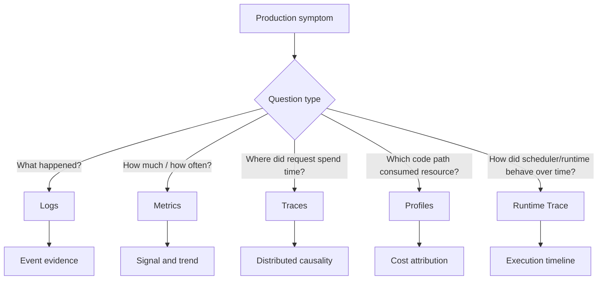
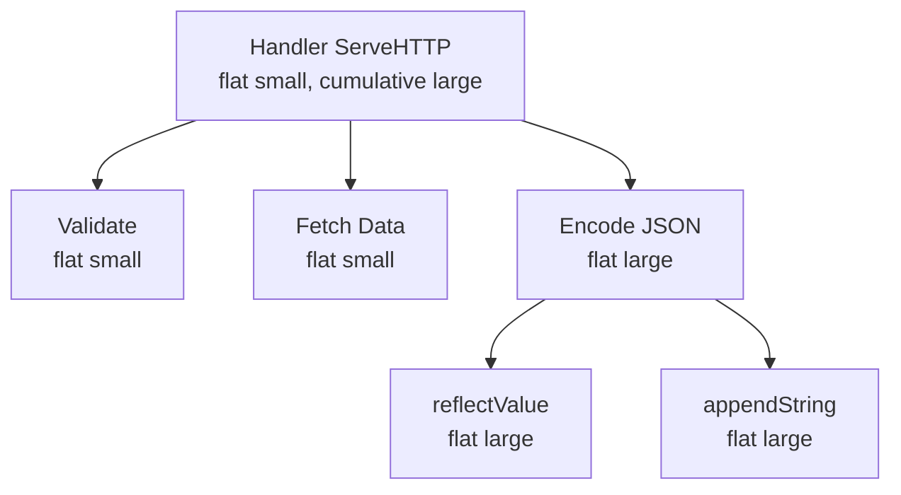
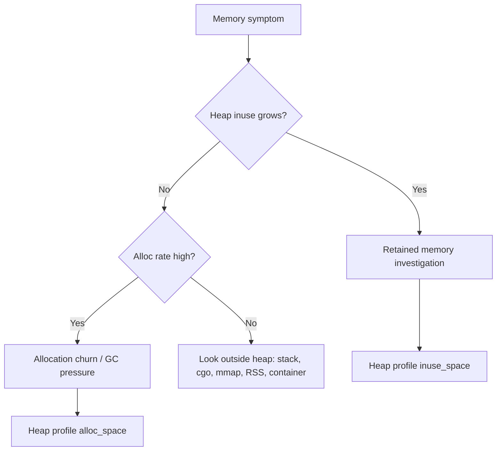
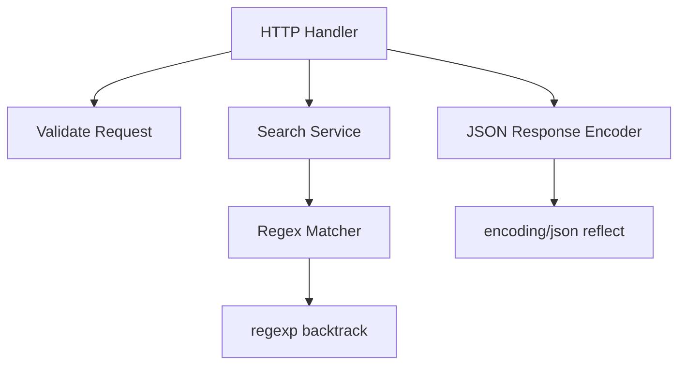
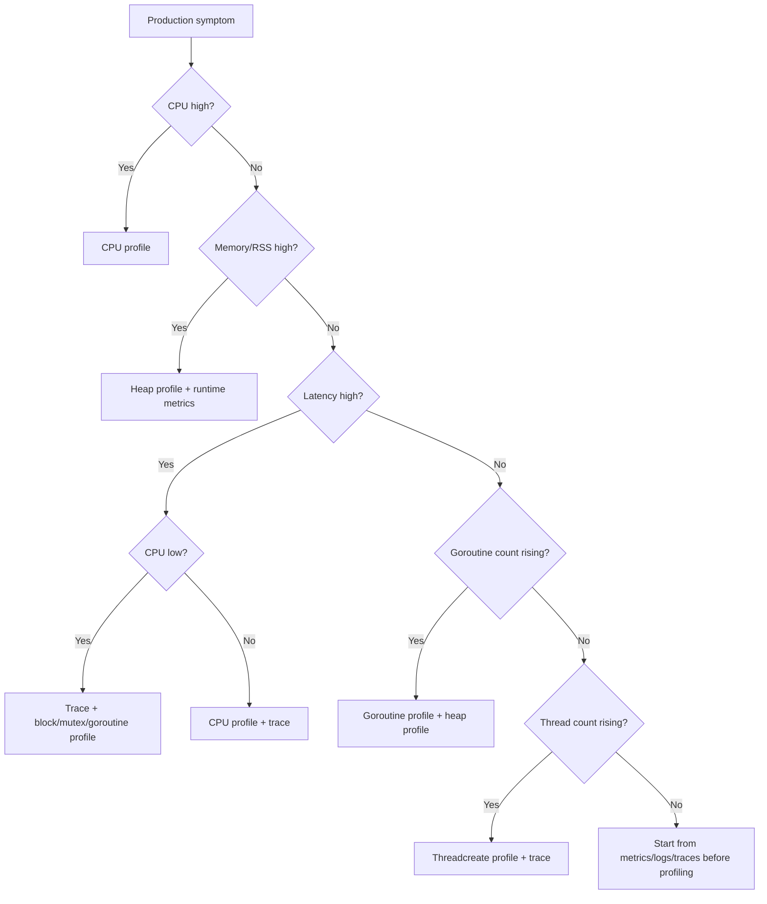

# learn-go-logging-observability-profiling-troubleshooting-part-011.md

# Part 011 — `pprof` Fundamentals

> Seri: `learn-go-logging-observability-profiling-troubleshooting`  
> Bagian: `011 / 032`  
> Fokus: Go profiling fundamentals, `pprof`, profile taxonomy, interpretation, overhead, production-safe thinking  
> Target pembaca: Java software engineer yang ingin memahami Go diagnostics secara production-grade

---

## 0. Posisi Bagian Ini dalam Seri

Bagian sebelumnya membahas:

- logging sebagai evidence,
- metrics sebagai numeric signal,
- runtime metrics sebagai vital signs,
- OpenTelemetry sebagai telemetry architecture,
- distributed tracing,
- middleware observability.

Bagian ini masuk ke area berbeda: **profiling**.

Profiling menjawab pertanyaan yang tidak bisa dijawab cukup baik oleh log, metric, atau trace.

Contoh:

- fungsi mana yang paling banyak memakai CPU?
- allocation path mana yang membuat GC bekerja berat?
- goroutine sedang berhenti di mana?
- lock mana yang menyebabkan contention?
- apakah latency berasal dari CPU work, blocking, syscall, GC, atau scheduler delay?
- apakah memory growth adalah leak, churn, cache, stack, atau native memory?
- apakah optimisasi yang dilakukan benar-benar mengubah hot path?

Di Java, Anda mungkin terbiasa dengan:

- Java Flight Recorder,
- async-profiler,
- JMC,
- thread dump,
- heap dump,
- GC log,
- Micrometer metrics,
- APM flame graph.

Di Go, set alat dan mental modelnya berbeda:

- `pprof` untuk sampled profile,
- `runtime/trace` untuk execution timeline,
- `runtime/metrics` untuk runtime vital signs,
- `go test -bench` + profile untuk benchmark-guided diagnosis,
- `net/http/pprof` untuk runtime debug endpoint,
- `go tool pprof` untuk analisis profile,
- `go tool trace` untuk execution trace.

Bagian ini fokus pada fondasi `pprof`.

---

## 1. Core Thesis

**`pprof` bukan alat untuk "melihat semua yang terjadi". `pprof` adalah alat untuk melihat distribusi cost berdasarkan sampel atau event tertentu.**

Kalimat ini penting.

Profile tidak memberi Anda kebenaran absolut tentang semua operasi. Profile memberi Anda **statistical view** atau **event-based view** dari jenis cost tertentu.

Karena itu, engineer yang kuat tidak bertanya:

> "Apa fungsi paling atas di pprof?"

Tetapi bertanya:

> "Profile type apa yang saya ambil, pada workload apa, selama berapa lama, dengan overhead apa, dan pertanyaan diagnosis apa yang sedang saya validasi?"

---

## 2. Profiling vs Logging vs Metrics vs Tracing

### 2.1 Logging

Logging menjawab:

- event apa yang terjadi?
- kapan terjadi?
- pada request/job/tenant/module apa?
- apa decision yang diambil sistem?
- error apa yang terlihat di boundary?

Logging kuat untuk **forensics** dan **narrative evidence**.

Logging lemah untuk:

- CPU hot path,
- allocation hot path,
- lock contention detail,
- scheduler behavior,
- statistical cost distribution.

### 2.2 Metrics

Metrics menjawab:

- berapa rate?
- berapa latency distribution?
- berapa error ratio?
- apakah heap naik?
- apakah goroutine naik?
- apakah GC CPU naik?
- apakah queue saturated?

Metrics kuat untuk **alerting**, **trend**, dan **SLO**.

Metrics lemah untuk:

- fungsi mana penyebabnya,
- call stack detail,
- exact allocation site,
- precise blocking site.

### 2.3 Tracing

Tracing menjawab:

- request melewati service mana?
- span mana yang lambat?
- dependency mana yang dominan?
- apakah ada fan-out/fan-in?
- apakah retry membuat latency naik?

Tracing kuat untuk **request path** dan **distributed causality**.

Tracing lemah untuk:

- CPU internal function cost,
- heap allocation detail,
- lock contention,
- goroutine stack group,
- scheduler timeline detail.

### 2.4 Profiling

Profiling menjawab:

- CPU time terdistribusi ke function mana?
- heap retained oleh allocation path mana?
- allocation churn dari path mana?
- goroutine blocked di stack mana?
- mutex contention terjadi di mana?
- channel/blocking wait muncul di mana?
- thread creation berasal dari mana?

Profiling kuat untuk **runtime cost attribution**.

Profiling lemah untuk:

- business event narrative,
- request identity,
- per-user causality,
- distributed service path,
- alerting jangka panjang.

### 2.5 Mental Model Gabungan



---

## 3. Apa Itu `pprof`

`pprof` adalah format dan tool untuk menganalisis profile.

Di Go, profile dapat berasal dari beberapa sumber:

1. benchmark/test:
   - `go test -cpuprofile`
   - `go test -memprofile`
   - `go test -blockprofile`
   - `go test -mutexprofile`

2. aplikasi yang sedang berjalan:
   - `net/http/pprof`
   - `runtime/pprof`
   - manual programmatic capture

3. binary/profile pair:
   - profile lebih bernilai bila bisa dikaitkan dengan binary yang tepat.

Tool utama:

```bash
go tool pprof
```

`pprof` dapat menampilkan:

- top table,
- call graph,
- source listing,
- disassembly,
- web UI,
- flame graph,
- diff profile,
- cumulative vs flat cost,
- focus/ignore/prune filtering.

---

## 4. Peta Besar Profile Go

Go punya beberapa jenis profile yang sering dipakai.

| Profile | Pertanyaan Utama | Cocok Saat |
|---|---|---|
| CPU | CPU time habis di mana? | high CPU, slow CPU-bound endpoint |
| Heap | memory retained oleh apa? | memory growth, high heap, OOM risk |
| Allocations | allocation churn dari mana? | GC pressure, high allocation rate |
| Goroutine | goroutine sedang berada di stack mana? | goroutine leak, deadlock-like wait |
| Mutex | waktu tunggu lock di mana? | lock contention |
| Block | blocking synchronization di mana? | latency dengan low CPU |
| Threadcreate | OS thread dibuat dari mana? | thread explosion, cgo/syscall behavior |
| Trace | event runtime timeline | scheduler/GC/network/syscall latency |

Catatan penting:

`trace` sering disebut bersama profiling, tetapi dianalisis dengan `go tool trace`, bukan murni `go tool pprof`.

---

## 5. Sampling vs Event-Based Profiling

Tidak semua profile dikumpulkan dengan cara yang sama.

### 5.1 Sampling Profile

CPU profile biasanya sampling.

Artinya runtime mengambil sampel stack secara periodik saat program berjalan.

Implikasi:

- hasilnya statistik,
- butuh durasi cukup,
- short-lived hot function bisa tidak terlihat,
- semakin representatif workload, semakin berguna profile,
- angka kecil harus dibaca hati-hati.

### 5.2 Event-Based Profile

Beberapa profile berbasis event atau sample dari event tertentu:

- heap allocation sampling,
- mutex contention sampling,
- block profile berdasarkan blocking event,
- goroutine profile berdasarkan stack snapshot.

Implikasi:

- Anda harus paham event yang direkam,
- angka bukan selalu "waktu total real-world",
- setting rate/fraction memengaruhi hasil,
- overhead bisa naik bila sampling terlalu agresif.

---

## 6. Profile Bukan Telemetry Harian

Salah satu kesalahan umum adalah memperlakukan profile seperti metric.

Metric:

- dikumpulkan terus-menerus,
- murah,
- cocok untuk alerting,
- time-series friendly.

Profile:

- lebih mahal,
- lebih detail,
- biasanya on-demand atau sampling periodik terbatas,
- cocok untuk diagnosis mendalam,
- bisa mengandung informasi sensitif.

Jangan desain sistem yang membutuhkan profile setiap detik untuk memahami kondisi normal.

Gunakan:

- metrics untuk mendeteksi symptom,
- logs/traces untuk mengikat konteks,
- profiles untuk membedah cost.

---

## 7. Workload Representativeness

Profile hanya menjelaskan program saat profile diambil.

Jika Anda mengambil CPU profile saat sistem idle, Anda akan melihat idle behavior.

Jika Anda mengambil heap profile setelah warmup belum selesai, Anda bisa salah menyimpulkan memory growth.

Jika Anda mengambil profile dari synthetic benchmark yang tidak menyerupai production, Anda mengoptimalkan hal yang salah.

### 7.1 Pertanyaan Sebelum Mengambil Profile

Sebelum capture profile, jawab:

1. Symptom apa yang sedang diselidiki?
2. Service instance mana yang terdampak?
3. Apakah instance tersebut menerima traffic representatif?
4. Apakah workload sedang dalam steady state?
5. Apakah ada deployment/config change baru?
6. Apakah resource sedang saturated?
7. Apakah profile perlu diambil sebelum mitigasi?
8. Apakah endpoint debug aman diakses?
9. Apakah profile bisa mengandung data sensitif?
10. Berapa durasi capture yang masuk akal?

### 7.2 Good vs Bad Profile

| Profile | Nilai Diagnosis |
|---|---|
| CPU profile 30s saat high CPU aktual | tinggi |
| CPU profile 5s saat idle | rendah |
| heap profile sebelum dan sesudah traffic spike | tinggi |
| heap profile sekali tanpa konteks waktu | sedang/rendah |
| goroutine profile saat goroutine count naik drastis | tinggi |
| mutex profile tanpa mengaktifkan mutex profiling | tidak berguna |
| block profile dengan rate tidak sesuai | bisa misleading |
| profile dari local laptop untuk incident production | hanya indikatif |

---

## 8. CPU Profile

CPU profile menjawab:

> Saat program menggunakan CPU, stack mana yang paling sering terlihat?

CPU profile cocok untuk:

- high CPU,
- throughput rendah padahal CPU tinggi,
- endpoint CPU-bound,
- encode/decode berat,
- compression/encryption hotspot,
- regex-heavy workload,
- excessive logging formatting,
- inefficient loop,
- map/hash hotspot,
- sorting/searching cost,
- GC CPU terlihat signifikan.

CPU profile tidak langsung menjawab:

- kenapa request menunggu DB,
- kenapa goroutine blocked di channel,
- kenapa lock contention tinggi,
- kenapa memory naik,
- kenapa pod CPU-throttled oleh Kubernetes.

### 8.1 Mengambil CPU Profile dari Test

```bash
go test ./... -run '^$' -bench BenchmarkTarget -cpuprofile cpu.out
go tool pprof cpu.out
```

Untuk binary/package tertentu:

```bash
go test ./internal/service -run '^$' -bench BenchmarkEncode -cpuprofile cpu.out
go tool pprof ./service.test cpu.out
```

### 8.2 Mengambil CPU Profile dari HTTP pprof

Jika aplikasi mengekspos `net/http/pprof`:

```bash
go tool pprof http://localhost:6060/debug/pprof/profile?seconds=30
```

Atau simpan sebagai file:

```bash
curl -o cpu.pb.gz "http://localhost:6060/debug/pprof/profile?seconds=30"
go tool pprof ./app cpu.pb.gz
```

### 8.3 Membaca CPU Top

Di interactive pprof:

```text
(pprof) top
```

Contoh bentuk output:

```text
Showing nodes accounting for 820ms, 82% of 1000ms total
      flat  flat%   sum%        cum   cum%
     300ms 30.00% 30.00%      300ms 30.00%  encoding/json.(*encodeState).reflectValue
     180ms 18.00% 48.00%      220ms 22.00%  regexp.(*machine).backtrack
     120ms 12.00% 60.00%      400ms 40.00%  myapp/internal/search.(*Matcher).Match
```

Field penting:

| Field | Makna |
|---|---|
| flat | cost di function itu sendiri |
| flat% | persentase flat terhadap total sample |
| cum | cost function + callees |
| cum% | persentase cumulative |
| sum% | running sum flat percentage |

### 8.4 Flat vs Cumulative

Flat besar berarti function itu sendiri mahal.

Cumulative besar berarti function itu memanggil banyak kerja mahal.

Contoh:

```text
flat tinggi:
encoding/json.appendString
```

Interpretasi:

- function internal string escaping benar-benar mengonsumsi CPU.

```text
cum tinggi, flat rendah:
myapp.(*Handler).ServeHTTP
```

Interpretasi:

- handler bukan hot path spesifik,
- handler adalah parent dari banyak work,
- perlu turun ke children.

### 8.5 Diagram Mental Flat vs Cumulative



Jika hanya melihat cumulative, Anda mungkin menyalahkan `ServeHTTP`.

Jika melihat flat/call graph, Anda menemukan encode path.

---

## 9. Heap Profile

Heap profile menjawab:

> Memory yang masih hidup atau allocation yang terjadi berasal dari path mana?

Namun heap profile punya beberapa mode penting:

- `inuse_space`
- `inuse_objects`
- `alloc_space`
- `alloc_objects`

### 9.1 Retained Memory vs Allocation Churn

`inuse_space`:

- memory yang masih hidup,
- berguna untuk memory growth/leak.

`alloc_space`:

- total allocation sepanjang waktu pengamatan,
- berguna untuk allocation churn dan GC pressure.

Perbedaan ini sangat penting.

Kasus A:

```text
inuse_space tinggi
alloc_space sedang
```

Mungkin retained memory/cache/leak.

Kasus B:

```text
inuse_space rendah
alloc_space sangat tinggi
```

Mungkin allocation churn yang membuat GC sibuk.

### 9.2 Mengambil Heap Profile

Dari test:

```bash
go test ./internal/service -run '^$' -bench BenchmarkTarget -memprofile mem.out
go tool pprof mem.out
```

Dari HTTP endpoint:

```bash
curl -o heap.pb.gz "http://localhost:6060/debug/pprof/heap"
go tool pprof ./app heap.pb.gz
```

Untuk meminta GC sebelum heap profile melalui endpoint pprof biasanya tersedia parameter:

```bash
curl -o heap-after-gc.pb.gz "http://localhost:6060/debug/pprof/heap?gc=1"
```

### 9.3 Membaca Heap Profile dengan Mode Berbeda

Di pprof:

```text
(pprof) sample_index=inuse_space
(pprof) top
```

atau dari CLI:

```bash
go tool pprof -sample_index=inuse_space ./app heap.pb.gz
go tool pprof -sample_index=alloc_space ./app heap.pb.gz
```

### 9.4 Memory Leak vs High Allocation Rate



### 9.5 Common Heap Profile Traps

1. Satu heap profile jarang cukup.
2. Heap profile setelah GC berbeda dari sebelum GC.
3. RSS tidak sama dengan Go heap.
4. `alloc_space` tinggi bukan otomatis leak.
5. `inuse_space` tinggi bukan otomatis bug; bisa cache yang disengaja.
6. Object kecil banyak bisa lebih bermasalah bagi GC daripada object besar sedikit.
7. Retained slice backing array sering tersembunyi.
8. Goroutine leak bisa tampak sebagai memory leak karena stack/reference tertahan.

---

## 10. Goroutine Profile

Goroutine profile adalah snapshot stack goroutine.

Ia menjawab:

> Goroutine saat ini sedang berada di stack mana?

Cocok untuk:

- goroutine leak,
- stuck shutdown,
- deadlock-like behavior,
- high goroutine count,
- worker tidak berhenti,
- HTTP requests menggantung,
- channel send/receive blocking,
- timer leak,
- context cancellation tidak dipatuhi.

### 10.1 Mengambil Goroutine Profile

```bash
curl -o goroutine.pb.gz "http://localhost:6060/debug/pprof/goroutine"
go tool pprof ./app goroutine.pb.gz
```

Untuk debug text:

```bash
curl "http://localhost:6060/debug/pprof/goroutine?debug=2"
```

Mode text sering sangat berguna untuk membaca stack langsung.

### 10.2 Contoh Interpretasi

Stack:

```text
goroutine 12345 [chan send]:
myapp/internal/worker.(*Pool).Submit(...)
myapp/internal/handler.(*Handler).ServeHTTP(...)
```

Interpretasi awal:

- handler mencoba submit job,
- channel worker penuh atau tidak ada receiver,
- request goroutine blocked,
- cari queue saturation, worker health, cancellation path.

Stack:

```text
goroutine 9876 [IO wait]:
net/http.(*persistConn).readLoop(...)
```

Interpretasi awal:

- belum tentu leak,
- HTTP client persistent connections punya read loop,
- perlu lihat jumlah, pattern, apakah terus naik.

### 10.3 Goroutine Profile Pitfall

Goroutine banyak tidak selalu buruk.

Contoh normal:

- HTTP server idle connections,
- database driver background goroutine,
- telemetry exporter,
- runtime goroutine,
- worker pool tetap.

Yang buruk:

- jumlah naik terus tanpa turun,
- stack didominasi satu path leak,
- goroutine menahan memory besar,
- shutdown tidak bisa selesai,
- goroutine blocked karena sender/receiver hilang.

---

## 11. Mutex Profile

Mutex profile menjawab:

> Waktu tunggu lock terkumpul di mana?

Cocok untuk:

- latency tinggi tapi CPU tidak penuh,
- throughput tidak naik saat concurrency naik,
- p99 spike karena shared lock,
- global map dengan mutex,
- logger lock contention,
- metrics lock contention,
- cache lock contention.

### 11.1 Mengaktifkan Mutex Profiling

Mutex profiling perlu rate/fraction.

Programmatic:

```go
runtime.SetMutexProfileFraction(5)
```

Makna praktis:

- semakin kecil/sering sampling, semakin besar overhead,
- nilai harus dipilih hati-hati,
- biasanya diaktifkan saat diagnosis atau dengan config debug.

### 11.2 Mengambil Mutex Profile

```bash
curl -o mutex.pb.gz "http://localhost:6060/debug/pprof/mutex"
go tool pprof ./app mutex.pb.gz
```

### 11.3 Interpretasi

Jika sebuah function muncul besar di mutex profile, pertanyaannya bukan hanya:

> "lock mana?"

Tetapi:

1. siapa pemilik lock?
2. berapa lama lock dipegang?
3. berapa banyak goroutine menunggu?
4. apakah critical section terlalu besar?
5. apakah lock melindungi data terlalu luas?
6. apakah bisa sharding?
7. apakah bisa copy-on-write?
8. apakah bisa immutable snapshot?
9. apakah lock terjadi di hot request path?
10. apakah lock berasal dari logging/metrics instrumentation?

---

## 12. Block Profile

Block profile menjawab:

> Goroutine blocked pada operasi synchronization mana?

Mencakup blocking pada operasi seperti:

- channel send,
- channel receive,
- select,
- mutex,
- condition variable,
- wait group style wait,
- blocking synchronization lain yang direkam runtime.

### 12.1 Mengaktifkan Block Profiling

```go
runtime.SetBlockProfileRate(1)
```

Nilai lebih agresif meningkatkan detail sekaligus overhead.

### 12.2 Mengambil Block Profile

```bash
curl -o block.pb.gz "http://localhost:6060/debug/pprof/block"
go tool pprof ./app block.pb.gz
```

### 12.3 Kapan Block Profile Lebih Baik dari CPU Profile

Gunakan block profile ketika:

- latency naik,
- CPU rendah,
- goroutine count naik,
- throughput turun,
- queue terlihat penuh,
- request menunggu,
- trace menunjukkan gap tetapi CPU tidak tinggi.

CPU profile pada kasus ini bisa tampak "tidak ada apa-apa" karena program bukan sibuk memakai CPU; program sedang menunggu.

---

## 13. Threadcreate Profile

Threadcreate profile menjawab:

> OS thread dibuat dari stack mana?

Di Go, goroutine bukan OS thread. Namun runtime tetap memakai OS thread untuk mengeksekusi goroutine dan menangani syscall/cgo.

Threadcreate profile berguna saat:

- OS thread count naik tidak biasa,
- cgo banyak,
- syscall blocking banyak,
- `runtime.LockOSThread` dipakai,
- container punya thread/process limit,
- scheduler behavior mencurigakan.

Namun untuk kebanyakan service Go biasa, threadcreate profile lebih jarang menjadi tool pertama.

---

## 14. Trace Profile dan `runtime/trace`

Endpoint pprof memiliki trace endpoint, tetapi analisis trace dilakukan dengan:

```bash
go tool trace trace.out
```

Trace berbeda dari profile tabel.

Trace memberi timeline event seperti:

- goroutine creation,
- goroutine blocking/unblocking,
- network blocking,
- syscall,
- GC,
- processor utilization,
- scheduler behavior,
- user task/region/log annotations.

Trace cocok saat:

- pprof CPU tidak menjelaskan latency,
- scheduler latency dicurigai,
- goroutine banyak berpindah state,
- GC/scheduler interaction penting,
- ingin melihat timeline, bukan aggregate cost.

`runtime/trace` akan dibahas detail di Part 018.

---

## 15. `go tool pprof` Workflow Dasar

### 15.1 Interactive Mode

```bash
go tool pprof ./app cpu.pb.gz
```

Command umum:

```text
top
top10
top -cum
list FunctionName
web
peek FunctionName
tree
traces
sample_index
focus
ignore
```

### 15.2 Web UI

```bash
go tool pprof -http=:0 ./app cpu.pb.gz
```

Ini membuka UI lokal. Pada Go modern, flame graph menjadi tampilan penting untuk membaca hot path.

### 15.3 Top

```text
(pprof) top
```

Gunakan untuk mencari flat cost.

### 15.4 Top Cumulative

```text
(pprof) top -cum
```

Gunakan untuk mencari parent path besar.

### 15.5 List Source

```text
(pprof) list MyFunction
```

Berguna jika binary/source tersedia.

### 15.6 Focus

```text
(pprof) focus=myapp/internal/handler
```

Membatasi analisis ke package/path tertentu.

### 15.7 Ignore

```text
(pprof) ignore=runtime
```

Hati-hati. Jangan sembunyikan runtime hanya karena terlihat "berisik"; runtime cost sering merupakan symptom.

---

## 16. Reading `top`: Cara Berpikir yang Benar

Saat membaca `top`, jangan berhenti di function pertama.

Gunakan urutan:

1. Lihat total duration/sample.
2. Lihat apakah profile cukup besar.
3. Lihat flat top.
4. Lihat cumulative top.
5. Kelompokkan berdasarkan package:
   - application code,
   - standard library,
   - runtime,
   - third-party library.
6. Cari boundary:
   - handler,
   - worker,
   - encoder,
   - DB adapter,
   - cache,
   - logger.
7. Masuk ke call graph/flame graph.
8. Validasi dengan metrics/traces/logs.
9. Ulangi dengan profile lain bila hypothesis berubah.

### 16.1 Example Reasoning

Output:

```text
flat% high:
runtime.mallocgc
runtime.scanobject
encoding/json
```

Kemungkinan:

- workload allocation-heavy,
- JSON encode/decode membuat banyak object,
- GC scanning meningkat,
- CPU high bukan karena business logic murni, tetapi allocation/GC overhead.

Langkah berikut:

- ambil heap `alloc_space`,
- cek runtime metrics allocation rate,
- cek GC CPU/pause,
- benchmark encode/decode path,
- evaluasi buffer reuse/streaming/alternative encoding.

---

## 17. Flame Graph Mental Model

Flame graph menunjukkan stack.

Biasanya:

- lebar frame menunjukkan jumlah sample/cost,
- bawah adalah caller/root,
- atas adalah callee/deeper stack,
- frame lebar adalah tempat cost dominan,
- tower tinggi bukan selalu masalah,
- frame sempit tapi banyak tersebar bisa menunjukkan distributed cost.

### 17.1 Cara Membaca

Tanyakan:

1. frame mana paling lebar?
2. apakah frame itu application, stdlib, runtime, atau dependency?
3. siapa caller-nya?
4. apakah cost terkonsentrasi atau tersebar?
5. apakah ada beberapa hot path atau satu hot path?
6. apakah runtime/GC frame dominan?
7. apakah instrumentation/logging muncul sebagai cost?
8. apakah call stack cocok dengan symptom?

### 17.2 Diagram Sederhana

```text
                    encodeState.reflectValue
                    ────────────────────────
        json.Marshal
        ────────────────────────────────────
Handler.ServeHTTP
────────────────────────────────────────────

        regexp.(*machine).backtrack
        ──────────────────────────
Matcher.Match
──────────────────────────────────
Handler.ServeHTTP
────────────────────────────────────────────
```

Interpretasi:

- dua hot path:
  - JSON encoding,
  - regex matching.
- Optimisasi hanya JSON mungkin tidak cukup jika regex juga besar.
- Perlu prioritas berdasarkan cost dan effort.

---

## 18. Call Graph Mental Model

Call graph membantu memahami hubungan caller-callee.

Namun call graph bisa sulit dibaca pada program besar.

Gunakan call graph untuk:

- melihat parent dari hot function,
- mengetahui path mana memanggil function mahal,
- membedakan library cost yang dipakai oleh banyak caller,
- menemukan boundary application yang memicu runtime/stdlib cost.

Contoh:



Jika `regexp backtrack` mahal, solusi bukan "optimalkan regexp package", tetapi:

- ubah pattern,
- precompile,
- kurangi input,
- hindari regex di hot path,
- gunakan parser sederhana,
- cache hasil bila valid.

---

## 19. Profile Diffing

Profile diff membantu menjawab:

> Apakah perubahan saya memperbaiki atau memperburuk cost?

Contoh:

```bash
go tool pprof -base before.pb.gz ./app after.pb.gz
```

Atau via UI:

```bash
go tool pprof -http=:0 -base before.pb.gz ./app after.pb.gz
```

Diff profile sangat berguna untuk:

- performance regression,
- optimisasi,
- canary analysis,
- PGO validation,
- dependency upgrade,
- logging/middleware overhead check.

### 19.1 Diff Pitfall

Diff hanya valid bila:

- workload sebanding,
- duration sebanding,
- traffic mix sebanding,
- binary/source sesuai,
- instance condition mirip,
- GC/container/resource pressure mirip.

Jika tidak, diff bisa menipu.

---

## 20. Binary, Symbol, dan Source

Profile lebih berguna bila pprof bisa menemukan symbol dan source.

Best practice:

1. Simpan binary build yang sesuai dengan profile.
2. Simpan build metadata:
   - commit SHA,
   - build time,
   - Go version,
   - GOOS/GOARCH,
   - flags,
   - PGO profile version jika ada.
3. Jangan strip symbol sembarangan untuk investigasi internal.
4. Pastikan source path bisa dipetakan.
5. Simpan profile artifact dengan nama terstruktur.

Contoh naming:

```text
profiles/
  prod-payment-api/
    2026-06-23T10-15-00Z_pod-payment-api-7d9f_cpu-30s_go1.26.0_commit-a1b2c3.pb.gz
    2026-06-23T10-16-00Z_pod-payment-api-7d9f_heap_gc1_go1.26.0_commit-a1b2c3.pb.gz
    2026-06-23T10-17-00Z_pod-payment-api-7d9f_goroutine_debug2_go1.26.0_commit-a1b2c3.txt
```

---

## 21. Production Profiling Safety

Production profiling sangat berguna, tetapi harus diperlakukan sebagai privileged diagnostic capability.

Risiko:

1. endpoint debug terekspos publik,
2. CPU profile menambah overhead,
3. trace bisa besar,
4. heap/goroutine profile bisa mengandung data sensitif melalui symbol/path,
5. profile capture bisa memperburuk instance yang sudah overload,
6. terlalu banyak orang mengambil profile saat incident,
7. profile disimpan tanpa kontrol akses.

### 21.1 Safety Rules

Gunakan prinsip berikut:

1. Jangan expose `/debug/pprof` di public internet.
2. Jalankan debug server terpisah dari public API bila memungkinkan.
3. Bind ke localhost/admin network.
4. Proteksi dengan network policy, mTLS, VPN, IAM, atau port-forward terbatas.
5. Capture dalam durasi wajar.
6. Jangan capture trace terlalu lama.
7. Simpan artifact di tempat akses terbatas.
8. Catat waktu capture dalam incident timeline.
9. Jangan semua engineer capture bersamaan.
10. Gunakan canary/replica spesifik bila mungkin.

### 21.2 Dedicated Debug Server Pattern

```go
package main

import (
	"log/slog"
	"net/http"
	_ "net/http/pprof"
)

func startDebugServer(addr string, logger *slog.Logger) *http.Server {
	srv := &http.Server{
		Addr:    addr,
		Handler: http.DefaultServeMux,
	}

	go func() {
		logger.Info("debug server starting", "addr", addr)
		if err := srv.ListenAndServe(); err != nil && err != http.ErrServerClosed {
			logger.Error("debug server failed", "error", err)
		}
	}()

	return srv
}
```

Catatan:

- Contoh ini memakai default mux karena `net/http/pprof` register ke default mux.
- Untuk production, Anda bisa mendaftarkan handler pprof ke mux sendiri agar tidak mencampur dengan default mux global.
- Detail production hardening akan dibahas Part 012.

---

## 22. Manual CPU Profiling dengan `runtime/pprof`

Untuk CLI atau batch job, Anda bisa capture profile secara programmatic.

```go
package main

import (
	"log"
	"os"
	"runtime/pprof"
)

func main() {
	f, err := os.Create("cpu.pb.gz")
	if err != nil {
		log.Fatal(err)
	}
	defer f.Close()

	if err := pprof.StartCPUProfile(f); err != nil {
		log.Fatal(err)
	}
	defer pprof.StopCPUProfile()

	runWorkload()
}

func runWorkload() {
	// representative workload here
}
```

Kapan berguna:

- CLI tool,
- batch process,
- benchmark-like local investigation,
- reproduce workload,
- tidak ada HTTP server.

Pitfall:

- jangan lupa `StopCPUProfile`,
- pastikan workload representatif,
- jangan memasukkan setup/teardown yang tidak relevan kecuali memang ingin diukur.

---

## 23. Manual Heap Profile

```go
package main

import (
	"log"
	"os"
	"runtime"
	"runtime/pprof"
)

func writeHeapProfile(path string) {
	runtime.GC()

	f, err := os.Create(path)
	if err != nil {
		log.Fatal(err)
	}
	defer f.Close()

	if err := pprof.WriteHeapProfile(f); err != nil {
		log.Fatal(err)
	}
}
```

Catatan:

- `runtime.GC()` sering dipakai agar profile lebih fokus ke live heap setelah GC.
- Namun untuk beberapa diagnosis, profile sebelum GC juga bisa bernilai.
- Jangan menyimpulkan dari satu heap profile saja.

---

## 24. Profile Duration

CPU profile 1 detik biasanya terlalu pendek untuk service production.

Praktik umum:

- 10 detik: quick signal.
- 30 detik: sering cukup untuk incident diagnosis.
- 60 detik: lebih stabil, overhead dan risiko lebih besar.
- lebih panjang: hanya jika aman dan memang perlu.

Trace berbeda:

- trace 5-10 detik saja bisa besar.
- trace terlalu panjang sulit dibaca dan mahal.
- gunakan trace pendek saat symptom terjadi.

Heap/goroutine:

- bukan duration-based dengan cara yang sama.
- ambil snapshot pada waktu penting.
- untuk leak, ambil beberapa snapshot dengan interval.

---

## 25. Combining Profiles

Satu symptom sering butuh beberapa profile.

### 25.1 High CPU

Ambil:

1. CPU profile.
2. heap alloc profile bila runtime/GC terlihat besar.
3. runtime metrics.
4. trace bila scheduler/syscall dicurigai.

### 25.2 High Memory

Ambil:

1. heap profile `inuse_space`.
2. heap profile `alloc_space`.
3. goroutine profile.
4. runtime metrics.
5. container memory/RSS evidence.

### 25.3 Latency Tinggi, CPU Rendah

Ambil:

1. traces,
2. block profile,
3. mutex profile,
4. goroutine profile,
5. runtime trace,
6. dependency metrics.

### 25.4 Goroutine Count Naik

Ambil:

1. goroutine profile debug text,
2. goroutine pprof,
3. heap profile,
4. runtime metrics over time,
5. logs around worker/request lifecycle.

---

## 26. Decision Tree: Profile Mana yang Dipilih?



---

## 27. Anti-Patterns

### 27.1 Profiling Tanpa Pertanyaan

Buruk:

> "Ambil semua profile, lihat ada apa."

Lebih baik:

> "CPU pod X naik dari 40% ke 180% setelah release Y. Ambil CPU profile 30 detik saat traffic normal untuk membandingkan hot path dengan release sebelumnya."

### 27.2 Mengoptimalkan Function Teratas Tanpa Konteks

Function teratas bisa:

- runtime,
- stdlib,
- dependency,
- symptom dari input buruk,
- efek allocation,
- efek instrumentation,
- efek lock,
- efek GC.

Jangan langsung rewrite code.

### 27.3 Mengabaikan Workload

Profile dari staging dengan data kecil bisa tidak relevan untuk production.

### 27.4 Mengambil Profile Setelah Mitigasi

Jika restart/rollback dilakukan sebelum capture evidence, root cause bisa hilang.

Kadang mitigasi harus prioritas. Tetapi jika aman, capture minimal evidence dulu:

- metrics snapshot,
- logs window,
- CPU profile,
- heap/goroutine profile.

### 27.5 Membuka pprof ke Publik

Ini critical security anti-pattern.

Debug endpoint adalah privileged operation.

### 27.6 Menyembunyikan Runtime Frame Terlalu Cepat

Runtime frame seperti:

- `runtime.mallocgc`,
- `runtime.scanobject`,
- `runtime.gcBgMarkWorker`,
- `runtime.mapaccess`,
- `runtime.memmove`,

bukan noise otomatis. Mereka sering menunjukkan karakter cost program.

### 27.7 Percaya Satu Profile

Diagnosis kuat biasanya triangulasi:

- metric menunjukkan symptom,
- profile menunjukkan cost attribution,
- trace/log menunjukkan boundary/context,
- code review menunjukkan mekanisme,
- experiment membuktikan fix.

---

## 28. Java Engineer Mapping

| Java World | Go World | Catatan |
|---|---|---|
| Thread dump | Goroutine profile | Goroutine jauh lebih banyak dan murah daripada Java thread |
| JFR CPU allocation events | pprof CPU/heap + runtime/trace | Go toolchain lebih minimalis tetapi kuat |
| async-profiler flame graph | `go tool pprof -http` flame graph | Symbol/source alignment penting |
| Heap dump object graph | Heap profile | Go heap profile bukan object graph penuh seperti heap dump |
| GC logs | `gctrace` + runtime metrics + heap profile | Go GC observability lebih runtime-metric oriented |
| Micrometer JVM metrics | `runtime/metrics` + Prometheus | Go expose runtime metrics langsung |
| APM traces | OpenTelemetry traces | Context propagation via `context.Context` sangat penting |

Perbedaan penting:

Di Java, heap dump bisa membuat Anda melihat object graph secara detail.

Di Go, heap profile lebih mengarah ke **allocation site** dan **retained allocation attribution**, bukan eksplorasi object graph penuh seperti tool JVM tertentu.

Karena itu, Go memory debugging lebih sering menggabungkan:

- heap profile,
- allocation profile,
- goroutine profile,
- runtime metrics,
- code review ownership/reference path,
- reproducible benchmark/test.

---

## 29. Production Incident Example: High CPU

### 29.1 Symptom

- p99 latency naik dari 250ms ke 1.8s.
- CPU pod naik 4x.
- error rate belum naik.
- deployment baru 30 menit lalu.
- metrics menunjukkan allocation rate juga naik.

### 29.2 Evidence Collection

1. CPU profile 30 detik dari pod terdampak.
2. heap profile.
3. runtime metrics:
   - allocation bytes/sec,
   - GC CPU,
   - heap live,
   - goroutine count.
4. trace sample dari slow request.
5. logs sekitar deploy.

### 29.3 CPU Profile Finding

```text
flat/cum high:
encoding/json
reflect
runtime.mallocgc
runtime.scanobject
```

### 29.4 Interpretation

Kemungkinan:

- response payload berubah lebih besar,
- JSON encoding path lebih mahal,
- banyak allocation,
- GC ikut naik karena churn.

### 29.5 Validation

- trace menunjukkan endpoint `GET /reports` dominan.
- access log menunjukkan response size naik.
- diff deploy menunjukkan field nested baru masuk response.
- heap alloc profile menunjukkan allocation dari response DTO construction.

### 29.6 Fix Options

1. pagination lebih kecil,
2. streaming encode,
3. hindari membangun intermediate object besar,
4. precompute/caching,
5. remove unnecessary field,
6. optimize JSON path,
7. add response size metric/alert.

### 29.7 Lesson

CPU profile sendiri menemukan hot path.

Tetapi root cause operasional ditemukan melalui korelasi:

- deployment,
- trace endpoint,
- response size,
- allocation profile,
- code diff.

---

## 30. Production Incident Example: Latency Tinggi CPU Rendah

### 30.1 Symptom

- p99 latency naik.
- CPU normal/rendah.
- goroutine count naik.
- DB latency normal.
- external API normal.

### 30.2 CPU Profile

CPU profile tidak menunjukkan hot path signifikan.

Ini bukan berarti tidak ada masalah.

### 30.3 Next Profiles

Ambil:

- goroutine profile,
- block profile,
- mutex profile,
- runtime trace.

### 30.4 Finding

Goroutine profile:

```text
many goroutines blocked on:
myapp/internal/limiter.(*Limiter).Acquire
```

Block profile:

```text
channel receive wait in limiter
```

### 30.5 Interpretation

- request menunggu limiter token,
- CPU rendah karena goroutine blocked,
- latency naik akibat saturation/backpressure.

### 30.6 Validation

- metrics menunjukkan queue depth/token wait naik,
- config deploy menurunkan worker count,
- logs menunjukkan no error.

### 30.7 Lesson

CPU profile tidak cocok untuk masalah blocking.

Gunakan profile sesuai pertanyaan.

---

## 31. Production Incident Example: Memory Growth

### 31.1 Symptom

- RSS naik perlahan.
- heap live naik.
- OOMKilled setiap beberapa jam.
- traffic stabil.

### 31.2 Profiles

Ambil:

- heap profile T1,
- heap profile T2 setelah 20 menit,
- heap profile T3 sebelum restart bila aman,
- goroutine profile,
- runtime metrics.

### 31.3 Finding

Heap `inuse_space` meningkat di:

```text
myapp/internal/cache.(*Store).Set
```

Goroutine profile juga menunjukkan worker retry loop.

### 31.4 Interpretation

- cache tidak bounded,
- retry loop menambah entries untuk failed dependency,
- key cardinality tinggi.

### 31.5 Validation

- log menunjukkan repeated downstream timeout,
- cache key mengandung request timestamp,
- metrics cache size tidak ada.

### 31.6 Fix

1. bounded cache,
2. TTL,
3. cache key normalization,
4. dependency failure path tidak boleh cache unbounded negative result,
5. add cache size metric,
6. add memory growth alert.

---

## 32. How to Practice Locally

### 32.1 CPU Hotspot Lab

Buat benchmark untuk:

- JSON encode besar,
- regex matching,
- hashing map,
- sorting,
- compression.

Capture:

```bash
go test ./lab/cpu -bench . -cpuprofile cpu.out
go tool pprof -http=:0 cpu.out
```

Pertanyaan:

1. function mana flat terbesar?
2. parent path mana cumulative terbesar?
3. apakah runtime terlihat dominan?
4. apakah hasil berubah setelah input size naik?
5. apakah hasil berubah setelah optimisasi?

### 32.2 Allocation Lab

Capture:

```bash
go test ./lab/alloc -bench . -benchmem -memprofile mem.out
go tool pprof -sample_index=alloc_space mem.out
go tool pprof -sample_index=inuse_space mem.out
```

Pertanyaan:

1. apakah allocation tinggi tetapi retained rendah?
2. apakah object count lebih bermasalah daripada space?
3. apakah optimization mengurangi allocation/op?
4. apakah GC CPU ikut turun?

### 32.3 Goroutine Leak Lab

Buat code yang lupa cancel context atau lupa close channel.

Capture:

```bash
curl "http://localhost:6060/debug/pprof/goroutine?debug=2"
```

Pertanyaan:

1. stack mana berulang?
2. siapa membuat goroutine?
3. apa condition exit?
4. apakah context dipatuhi?
5. apakah memory ikut tertahan?

---

## 33. Checklist: Before Capturing a Profile

Gunakan checklist ini saat incident atau performance investigation.

```text
[ ] Symptom jelas.
[ ] Target instance/pod jelas.
[ ] Waktu kejadian dicatat.
[ ] Workload sedang representatif.
[ ] Debug endpoint aman.
[ ] Durasi capture dipilih.
[ ] Binary/build metadata tersedia.
[ ] Profile type sesuai pertanyaan.
[ ] Risiko overhead diterima.
[ ] Artifact naming disiapkan.
[ ] Incident timeline mencatat capture.
```

---

## 34. Checklist: When Reading a Profile

```text
[ ] Profile type dipahami.
[ ] Sample index benar.
[ ] Total sample cukup.
[ ] Workload representatif.
[ ] Flat dan cumulative dibaca.
[ ] Runtime/stdlib/application frame dibedakan.
[ ] Flame graph/call graph dicek.
[ ] Alternative hypothesis dibuat.
[ ] Divalidasi dengan metrics/logs/traces.
[ ] Fix diuji dengan before/after profile.
```

---

## 35. What Good Looks Like

Engineer yang kuat dalam Go profiling tidak sekadar bisa menjalankan:

```bash
go tool pprof
```

Ia mampu:

1. memilih profile sesuai symptom,
2. memahami sampling dan overhead,
3. mengambil profile dari workload representatif,
4. membaca flat vs cumulative dengan benar,
5. tidak tertipu runtime frame,
6. membedakan CPU-bound vs blocking,
7. membedakan retained heap vs allocation churn,
8. menemukan goroutine leak dari stack pattern,
9. mengorelasikan profile dengan metrics/logs/traces,
10. membuat fix yang dibuktikan dengan profile diff,
11. menjaga keamanan endpoint debug,
12. mendokumentasikan evidence dalam incident timeline.

---

## 36. Common Command Reference

### CPU Profile from Test

```bash
go test ./... -run '^$' -bench BenchmarkTarget -cpuprofile cpu.out
go tool pprof cpu.out
```

### Memory Profile from Test

```bash
go test ./... -run '^$' -bench BenchmarkTarget -benchmem -memprofile mem.out
go tool pprof -sample_index=alloc_space mem.out
go tool pprof -sample_index=inuse_space mem.out
```

### CPU Profile from Running Service

```bash
go tool pprof "http://localhost:6060/debug/pprof/profile?seconds=30"
```

### Heap Profile from Running Service

```bash
curl -o heap.pb.gz "http://localhost:6060/debug/pprof/heap?gc=1"
go tool pprof ./app heap.pb.gz
```

### Goroutine Debug Stack

```bash
curl "http://localhost:6060/debug/pprof/goroutine?debug=2"
```

### Mutex Profile

```bash
curl -o mutex.pb.gz "http://localhost:6060/debug/pprof/mutex"
go tool pprof ./app mutex.pb.gz
```

### Block Profile

```bash
curl -o block.pb.gz "http://localhost:6060/debug/pprof/block"
go tool pprof ./app block.pb.gz
```

### Web UI

```bash
go tool pprof -http=:0 ./app cpu.pb.gz
```

### Diff

```bash
go tool pprof -base before.pb.gz ./app after.pb.gz
```

---

## 37. Exercises

### Exercise 1 — CPU Profile Reading

Buat program Go yang:

1. menerima request HTTP,
2. menghasilkan response JSON besar,
3. melakukan regex validation pada banyak field,
4. expose pprof pada port debug.

Ambil CPU profile 30 detik dengan load test ringan.

Tugas:

- identifikasi top flat cost,
- identifikasi top cumulative path,
- bedakan application vs stdlib vs runtime,
- buat satu perubahan optimisasi,
- bandingkan profile before/after.

### Exercise 2 — Allocation Churn

Buat benchmark yang membangun banyak string temporary.

Tugas:

- lihat `benchmem`,
- ambil memprofile,
- baca `alloc_space`,
- optimalkan dengan buffer/reuse yang aman,
- bandingkan allocation/op dan profile.

### Exercise 3 — Goroutine Leak

Buat worker yang membaca dari channel tetapi producer bisa exit tanpa close/cancel benar.

Tugas:

- ukur goroutine count,
- ambil goroutine profile,
- temukan stack leak,
- perbaiki dengan context cancellation,
- verifikasi goroutine count stabil.

### Exercise 4 — Blocking Investigation

Buat endpoint yang submit ke bounded worker queue.

Tugas:

- buat queue penuh,
- lihat latency naik dan CPU rendah,
- ambil goroutine/block profile,
- identifikasi blocking site,
- tambahkan metric queue depth dan wait duration.

### Exercise 5 — Incident Write-Up

Ambil salah satu exercise dan tulis mini incident report:

```text
Symptom:
Timeline:
Evidence:
Profile captured:
Finding:
Root cause:
Mitigation:
Prevention:
Follow-up metrics/alerts:
```

---

## 38. Source Notes

Materi ini disusun berdasarkan perilaku dan dokumentasi resmi Go profiling/diagnostics yang relevan untuk Go modern, termasuk:

- Go Diagnostics documentation.
- `runtime/pprof` package documentation.
- `net/http/pprof` package documentation.
- `runtime/trace` package documentation.
- `runtime/metrics` package documentation.
- Go 1.26 release notes, terutama perubahan terkait profiling/runtime diagnostics.
- Praktik umum penggunaan `go tool pprof`, benchmark profiling, dan production debugging.

---

## 39. Ringkasan

`pprof` adalah alat utama Go untuk runtime cost attribution.

Tetapi `pprof` hanya berguna bila Anda memahami:

- profile type,
- sample semantics,
- workload representativeness,
- overhead,
- flat vs cumulative,
- retained vs allocated memory,
- CPU-bound vs blocking,
- relationship dengan logs/metrics/traces,
- production safety.

Jangan gunakan `pprof` sebagai ritual.

Gunakan `pprof` sebagai instrumen ilmiah:

1. mulai dari symptom,
2. bentuk hypothesis,
3. pilih profile yang sesuai,
4. capture evidence,
5. baca dengan benar,
6. validasi silang,
7. ubah sistem,
8. buktikan dengan before/after.

---

## 40. Status Seri

Bagian ini adalah:

```text
learn-go-logging-observability-profiling-troubleshooting-part-011.md
```

Status:

```text
Part 011 dari 032
Seri belum selesai
```

Bagian berikutnya:

```text
learn-go-logging-observability-profiling-troubleshooting-part-012.md
```

Topik berikutnya:

```text
net/http/pprof in Production
```

<!-- NAVIGATION_FOOTER -->
<div class="page-nav">
<a href="./learn-go-logging-observability-profiling-troubleshooting-part-010.md">⬅️ Part 010 — Observability Middleware Design</a>
<a href="./index.md">📚 Kategori</a>
<a href="../../index.md">🏠 Home</a>
<a href="./learn-go-logging-observability-profiling-troubleshooting-part-012.md">Part 012 — `net/http/pprof` in Production ➡️</a>
</div>
