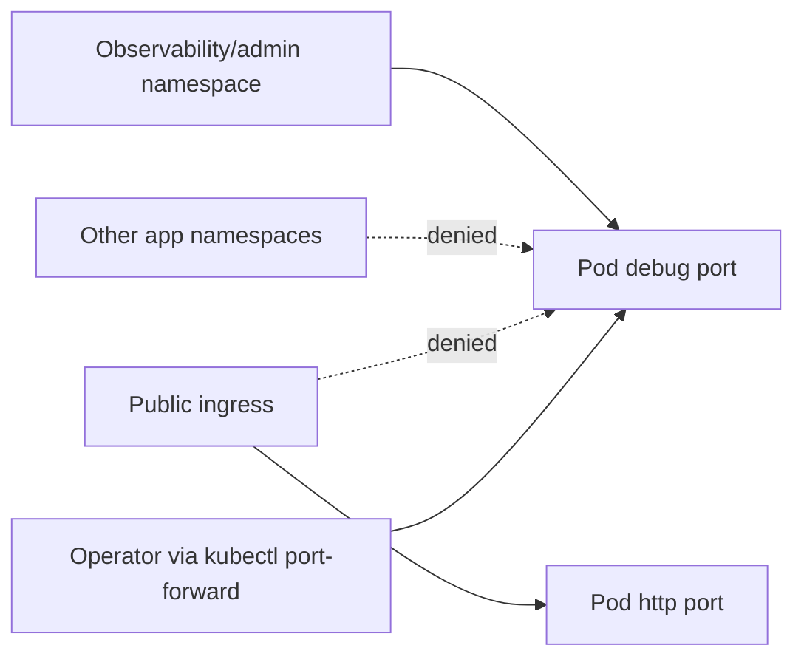

# learn-go-logging-observability-profiling-troubleshooting-part-012.md

# Part 012 — `net/http/pprof` in Production

> Seri: `learn-go-logging-observability-profiling-troubleshooting`  
> Bagian: `012 / 032`  
> Fokus: exposing Go pprof safely in production, debug endpoint architecture, security hardening, Kubernetes access, capture protocol  
> Target pembaca: Java software engineer yang ingin mengoperasikan Go service dengan diagnostics yang aman dan berguna

---

## 0. Posisi Bagian Ini dalam Seri

Part 011 membahas fondasi `pprof`:

- profile taxonomy,
- CPU/heap/goroutine/mutex/block/threadcreate,
- sampling vs event-based profiling,
- `go tool pprof`,
- flat vs cumulative,
- flame graph,
- profile diffing,
- production profiling safety.

Bagian ini lebih spesifik:

> Bagaimana menyediakan `pprof` dalam service Go production tanpa membuat risiko security, availability, dan operational chaos?

Ini bukan sekadar:

```go
import _ "net/http/pprof"
```

Itu hanya awal.

Production-grade `pprof` berarti:

- endpoint tidak terbuka publik,
- debug server dipisahkan dari public API,
- handler tidak tercampur sembarangan dengan default mux,
- akses dikendalikan,
- capture dilakukan dengan protocol,
- artifact diberi metadata,
- overhead dipahami,
- incident timeline mencatat profile,
- Kubernetes access path aman,
- privacy dan retention diperhatikan.

---

## 1. Core Thesis

**`pprof` adalah privileged diagnostic interface, bukan public API.**

Ia harus diperlakukan seperti:

- admin endpoint,
- production shell access,
- database read-only diagnostic access,
- heap/CPU evidence collection mechanism,
- operational capability yang bisa berdampak ke availability.

Kesalahan terbesar adalah memperlakukan `/debug/pprof` sebagai endpoint biasa.

```text
Wrong mental model:
"pprof cuma endpoint debug."

Correct mental model:
"pprof adalah runtime introspection surface yang dapat mengungkap struktur program, workload, stack, memory behavior, dan menambah overhead saat capture."
```

---

## 2. Apa yang Dilakukan `net/http/pprof`

Package `net/http/pprof` menyediakan HTTP handlers untuk membaca profiling data dari runtime Go.

Jika di-import dengan blank import:

```go
import _ "net/http/pprof"
```

maka handler pprof akan diregister ke `http.DefaultServeMux`.

Endpoint umum:

```text
/debug/pprof/
/debug/pprof/cmdline
/debug/pprof/profile
/debug/pprof/symbol
/debug/pprof/trace
/debug/pprof/allocs
/debug/pprof/block
/debug/pprof/goroutine
/debug/pprof/heap
/debug/pprof/mutex
/debug/pprof/threadcreate
```

Sejak Go 1.22, endpoint pprof HTTP harus diakses dengan method `GET`.

---

## 3. Endpoint Map

| Endpoint | Fungsi | Bentuk |
|---|---|---|
| `/debug/pprof/` | index profile | HTML/text listing |
| `/debug/pprof/profile?seconds=N` | CPU profile | profile binary |
| `/debug/pprof/heap` | heap profile | profile binary |
| `/debug/pprof/allocs` | allocation profile | profile binary |
| `/debug/pprof/goroutine` | goroutine profile | binary/text |
| `/debug/pprof/block` | block profile | profile binary |
| `/debug/pprof/mutex` | mutex profile | profile binary |
| `/debug/pprof/threadcreate` | thread creation profile | profile binary |
| `/debug/pprof/trace?seconds=N` | execution trace | trace binary |
| `/debug/pprof/cmdline` | command line | text |
| `/debug/pprof/symbol` | symbol lookup | text |

Beberapa endpoint menerima parameter:

| Parameter | Endpoint | Kegunaan |
|---|---|---|
| `seconds=N` | `profile`, `trace`, beberapa delta profile | capture durasi tertentu |
| `debug=1/2` | profile tertentu seperti goroutine | output text/debug |
| `gc=1` | heap | trigger GC sebelum heap snapshot |

---

## 4. Default Import: Berguna tetapi Berbahaya Bila Naif

Contoh paling sering ditemukan:

```go
package main

import (
	"net/http"
	_ "net/http/pprof"
)

func main() {
	http.ListenAndServe(":8080", nil)
}
```

Masalah:

1. `nil` berarti memakai `http.DefaultServeMux`.
2. `net/http/pprof` mendaftarkan handler ke default mux.
3. Jika port `:8080` adalah public service port, endpoint pprof ikut terbuka.
4. Semua route default mux bisa tercampur.
5. Library lain juga dapat mendaftarkan handler ke default mux.
6. Sulit mengaudit semua debug surface.

Untuk local experiment ini tidak masalah.

Untuk production, ini anti-pattern.

---

## 5. Production Design Goals

Production `pprof` harus memenuhi beberapa goal.

### 5.1 Availability Safety

- profiling tidak boleh membuat service makin jatuh,
- capture duration dikontrol,
- concurrent capture dibatasi,
- trace tidak diambil terlalu lama,
- debug server punya timeout,
- capture protocol jelas.

### 5.2 Security Safety

- tidak public internet,
- tidak accessible oleh user biasa,
- hanya admin/operator,
- bisa via VPN/private network/port-forward,
- audit akses bila perlu,
- artifact disimpan aman.

### 5.3 Operational Usability

- mudah diakses saat incident,
- tidak butuh rebuild,
- profile bisa dikaitkan dengan binary/commit/pod,
- artifact naming standar,
- command cookbook tersedia,
- runbook jelas.

### 5.4 Isolation

- public API dan debug API dipisah,
- mux dipisah,
- port dipisah,
- network path dipisah,
- timeout dipisah,
- optional: container port tidak diekspos via ingress.

---

## 6. Arsitektur Recommended

```mermaid
flowchart TD
    U[External user traffic] --> LB[Public Load Balancer / Ingress]
    LB --> APP[App HTTP Server :8080]

    OP[Operator] --> VPN[VPN / Private Network / kubectl port-forward]
    VPN --> DBG[Debug HTTP Server :6060]

    APP --> SVC[Business handlers]
    DBG --> PPROF[/debug/pprof handlers]
    DBG --> HEALTH[/debug/buildinfo, optional]
    DBG --> METRICS[optional admin metrics]

    subgraph Pod
        APP
        DBG
        SVC
        PPROF
    end
```

Prinsip:

- public traffic hanya masuk ke app server,
- pprof hanya di debug server,
- debug server tidak dipublish ke public ingress,
- operator mengakses lewat admin path.

---

## 7. Dedicated Debug Server Pattern

### 7.1 Minimal Pattern

```go
package main

import (
	"context"
	"log/slog"
	"net/http"
	"net/http/pprof"
	"time"
)

func newDebugMux() *http.ServeMux {
	mux := http.NewServeMux()

	mux.HandleFunc("/debug/pprof/", pprof.Index)
	mux.HandleFunc("/debug/pprof/cmdline", pprof.Cmdline)
	mux.HandleFunc("/debug/pprof/profile", pprof.Profile)
	mux.HandleFunc("/debug/pprof/symbol", pprof.Symbol)
	mux.HandleFunc("/debug/pprof/trace", pprof.Trace)

	mux.Handle("/debug/pprof/allocs", pprof.Handler("allocs"))
	mux.Handle("/debug/pprof/block", pprof.Handler("block"))
	mux.Handle("/debug/pprof/goroutine", pprof.Handler("goroutine"))
	mux.Handle("/debug/pprof/heap", pprof.Handler("heap"))
	mux.Handle("/debug/pprof/mutex", pprof.Handler("mutex"))
	mux.Handle("/debug/pprof/threadcreate", pprof.Handler("threadcreate"))

	return mux
}

func startDebugServer(logger *slog.Logger, addr string) *http.Server {
	srv := &http.Server{
		Addr:              addr,
		Handler:           newDebugMux(),
		ReadHeaderTimeout: 5 * time.Second,
	}

	go func() {
		logger.Info("debug server starting", "addr", addr)
		if err := srv.ListenAndServe(); err != nil && err != http.ErrServerClosed {
			logger.Error("debug server failed", "error", err)
		}
	}()

	return srv
}

func stopDebugServer(ctx context.Context, logger *slog.Logger, srv *http.Server) {
	if srv == nil {
		return
	}
	if err := srv.Shutdown(ctx); err != nil {
		logger.Error("debug server shutdown failed", "error", err)
	}
}
```

Mengapa lebih baik dari blank import?

- mux eksplisit,
- route eksplisit,
- public mux tidak tercampur,
- audit lebih mudah,
- handler bisa dibungkus auth/middleware,
- debug server bisa punya config berbeda.

---

## 8. Bind Address Strategy

### 8.1 Bind ke Localhost

```text
127.0.0.1:6060
```

Cocok untuk:

- VM/bare metal dengan SSH tunnel,
- local development,
- sidecar access,
- Kubernetes bila hanya diakses dari container/pod namespace tertentu.

Kelemahan di Kubernetes:

- `kubectl port-forward` ke pod biasanya dapat mengakses port container yang bind ke `0.0.0.0`; bind ke localhost dalam container bisa punya perilaku akses yang perlu diuji sesuai setup.
- Debugging multi-container pod bisa lebih kompleks.

### 8.2 Bind ke All Interfaces tetapi Tidak Dipublish

```text
:6060
```

Cocok bila:

- port tidak di-expose oleh Service/Ingress,
- NetworkPolicy membatasi akses,
- hanya `kubectl port-forward` digunakan,
- cluster private.

Risiko:

- jika Service/Ingress salah konfigurasi, endpoint bisa terbuka.
- perlu policy dan review manifest.

### 8.3 Bind ke Private Admin Interface

Cocok untuk:

- VM dengan private network,
- ECS/EKS internal admin network,
- sidecar mesh admin path.

---

## 9. Configuration Pattern

Production service sebaiknya membuat pprof configurable.

Contoh config:

```go
type DebugConfig struct {
	Enabled bool
	Addr    string
}
```

Rule:

1. local/dev: enabled by default boleh.
2. staging: enabled, private only.
3. production: enabled bila access path aman; atau disabled by default dengan toggle yang butuh restart/rollout.
4. Jangan enable public debug via same ingress.

Contoh:

```go
if cfg.Debug.Enabled {
	debugServer = startDebugServer(logger, cfg.Debug.Addr)
}
```

Namun hati-hati:

- Jika disabled total, Anda kehilangan kemampuan diagnosis saat incident.
- Jika enabled sembarangan, Anda membuat security risk.

Pilihan matang biasanya:

```text
production pprof enabled on private admin port, not public ingress, protected by network policy and operational access control.
```

---

## 10. Kubernetes Deployment Pattern

### 10.1 Container Ports

```yaml
ports:
  - name: http
    containerPort: 8080
  - name: debug
    containerPort: 6060
```

Ini hanya mendeklarasikan port container. Belum berarti public.

### 10.2 Service Publik Jangan Publish Debug

Buruk:

```yaml
apiVersion: v1
kind: Service
metadata:
  name: payment-api
spec:
  ports:
    - name: http
      port: 80
      targetPort: http
    - name: debug
      port: 6060
      targetPort: debug
```

Jika service ini dipakai ingress atau dapat diakses luas, debug port terbuka.

Lebih aman:

```yaml
apiVersion: v1
kind: Service
metadata:
  name: payment-api
spec:
  ports:
    - name: http
      port: 80
      targetPort: http
```

Debug port tidak dimasukkan ke service public.

### 10.3 Access via Port Forward

```bash
kubectl -n prod port-forward pod/payment-api-7d9f8c 6060:6060
```

Lalu:

```bash
go tool pprof "http://localhost:6060/debug/pprof/profile?seconds=30"
```

Atau:

```bash
curl -o heap.pb.gz "http://localhost:6060/debug/pprof/heap?gc=1"
```

### 10.4 Debug Service Private

Kadang dibuat service internal khusus:

```yaml
apiVersion: v1
kind: Service
metadata:
  name: payment-api-debug
spec:
  type: ClusterIP
  ports:
    - name: debug
      port: 6060
      targetPort: debug
  selector:
    app: payment-api
```

Tetapi ini harus dilengkapi:

- NetworkPolicy,
- RBAC,
- tidak diingress-kan,
- observability namespace access control,
- audit akses jika memungkinkan.

### 10.5 NetworkPolicy Concept



Policy target:

- public ingress tidak bisa ke debug,
- service lain tidak bisa ke debug,
- hanya admin/observability namespace atau port-forward authorized path.

---

## 11. Sidecar or Admin Proxy Pattern

Dalam organisasi besar, akses debug dapat diarahkan lewat:

- admin sidecar,
- service mesh admin route,
- bastion,
- authenticated reverse proxy,
- short-lived port-forward workflow.

Contoh konseptual:

```mermaid
flowchart TD
    ENG[Engineer] --> AUTH[SSO / IAM / VPN]
    AUTH --> BASTION[Bastion / Admin Proxy]
    BASTION --> DBG[Pod Debug Port :6060]
    DBG --> PPROF[/debug/pprof]
```

Keuntungan:

- akses bisa diaudit,
- tidak semua engineer punya cluster direct access,
- bisa enforce time-bound access,
- bisa centralize policy.

Kelemahan:

- lebih kompleks,
- saat incident proxy bisa menjadi dependency tambahan,
- harus dipastikan tidak menambah public exposure.

---

## 12. Auth Middleware untuk pprof

Jika debug endpoint harus reachable via internal network, tambahkan auth.

Contoh sederhana token middleware:

```go
func requireToken(next http.Handler, token string) http.Handler {
	return http.HandlerFunc(func(w http.ResponseWriter, r *http.Request) {
		if token == "" {
			http.Error(w, "debug token not configured", http.StatusForbidden)
			return
		}

		got := r.Header.Get("X-Debug-Token")
		if got != token {
			http.Error(w, "forbidden", http.StatusForbidden)
			return
		}

		next.ServeHTTP(w, r)
	})
}
```

Pemakaian:

```go
debugMux := newDebugMux()
handler := requireToken(debugMux, cfg.Debug.Token)

srv := &http.Server{
	Addr:              cfg.Debug.Addr,
	Handler:           handler,
	ReadHeaderTimeout: 5 * time.Second,
}
```

Catatan:

- Token header sederhana bukan solusi ideal untuk semua organisasi.
- Jangan hardcode token.
- Simpan token di secret manager.
- Rotasi token.
- Prefer network isolation + identity-aware access.
- Jangan menganggap token menggantikan private network.

---

## 13. Method, Timeout, dan Server Hardening

Debug server tetap HTTP server. Ia perlu hardening.

Contoh:

```go
srv := &http.Server{
	Addr:              ":6060",
	Handler:           handler,
	ReadHeaderTimeout: 5 * time.Second,
	ReadTimeout:       10 * time.Second,
	WriteTimeout:      2 * time.Minute,
	IdleTimeout:       30 * time.Second,
	MaxHeaderBytes:    8 << 10,
}
```

Namun hati-hati dengan `WriteTimeout`.

CPU profile 30 detik atau trace beberapa detik perlu waktu menulis response. Jika timeout terlalu pendek, capture gagal.

Prinsip:

- `ReadHeaderTimeout` pendek,
- `MaxHeaderBytes` kecil,
- `WriteTimeout` cukup untuk profile duration maksimal yang diizinkan,
- batasi durasi capture melalui policy/middleware jika perlu.

---

## 14. Limiting Concurrent Profile Capture

Jika beberapa engineer mengambil CPU profile/trace bersamaan, service bisa makin terganggu.

Buat middleware pembatas sederhana:

```go
type singleFlightHTTP struct {
	sem chan struct{}
	next http.Handler
}

func newSingleFlightHTTP(next http.Handler) http.Handler {
	return &singleFlightHTTP{
		sem:  make(chan struct{}, 1),
		next: next,
	}
}

func (h *singleFlightHTTP) ServeHTTP(w http.ResponseWriter, r *http.Request) {
	select {
	case h.sem <- struct{}{}:
		defer func() { <-h.sem }()
		h.next.ServeHTTP(w, r)
	default:
		http.Error(w, "another debug capture is already running", http.StatusTooManyRequests)
	}
}
```

Namun jangan block semua debug endpoint jika Anda masih ingin goroutine text saat CPU profile berjalan.

Lebih matang:

- limit hanya endpoint mahal:
  - `/debug/pprof/profile`
  - `/debug/pprof/trace`
- biarkan index/cmdline mungkin tetap ringan,
- atau buat per-endpoint limiter.

---

## 15. Validating `seconds` Parameter

Trace terlalu lama bisa besar dan mahal.

CPU profile terlalu lama juga bisa menambah overhead.

Middleware bisa membatasi `seconds`.

```go
func limitSeconds(next http.Handler, max int) http.Handler {
	return http.HandlerFunc(func(w http.ResponseWriter, r *http.Request) {
		raw := r.URL.Query().Get("seconds")
		if raw == "" {
			next.ServeHTTP(w, r)
			return
		}

		seconds, err := strconv.Atoi(raw)
		if err != nil || seconds < 1 || seconds > max {
			http.Error(w, "invalid seconds", http.StatusBadRequest)
			return
		}

		next.ServeHTTP(w, r)
	})
}
```

Policy umum:

| Endpoint | Suggested max |
|---|---:|
| CPU profile | 30–60s |
| Trace | 5–15s |
| Delta block/mutex | 30–60s |
| Goroutine text | snapshot |

Nilai final tergantung service, traffic, dan risk appetite.

---

## 16. pprof Capture Protocol

Saat incident, jangan capture profile secara ad-hoc tanpa catatan.

Gunakan protocol.

### 16.1 Before Capture

Catat:

```text
service:
namespace:
pod/instance:
timestamp:
symptom:
profile type:
duration:
traffic condition:
deployment version:
operator:
reason:
```

### 16.2 During Capture

Pastikan:

```text
[ ] Hanya satu engineer melakukan capture.
[ ] Durasi sesuai protocol.
[ ] Pod target benar.
[ ] Metrics window dicatat.
[ ] Tidak capture trace terlalu lama.
[ ] Tidak capture semua pod kecuali perlu.
```

### 16.3 After Capture

Simpan:

```text
[ ] profile file
[ ] binary/build version
[ ] command used
[ ] timestamp
[ ] incident id
[ ] related metrics screenshot/query
[ ] initial interpretation
```

---

## 17. Artifact Naming Convention

Contoh:

```text
<timestamp>_<env>_<namespace>_<service>_<pod>_<profile>_<duration>_<go-version>_<commit>.pb.gz
```

Contoh nyata:

```text
2026-06-23T10-15-00Z_prod_payments_payment-api_payment-api-7d9f_cpu_30s_go1.26.0_a1b2c3d.pb.gz
```

Untuk goroutine debug text:

```text
2026-06-23T10-16-00Z_prod_payments_payment-api_payment-api-7d9f_goroutine_debug2_go1.26.0_a1b2c3d.txt
```

Untuk trace:

```text
2026-06-23T10-17-00Z_prod_payments_payment-api_payment-api-7d9f_trace_10s_go1.26.0_a1b2c3d.out
```

---

## 18. Command Cookbook

### 18.1 Port Forward ke Pod

```bash
kubectl -n prod port-forward pod/payment-api-7d9f8c 6060:6060
```

### 18.2 CPU Profile 30 Detik

```bash
go tool pprof -http=:0 "http://localhost:6060/debug/pprof/profile?seconds=30"
```

Simpan file:

```bash
curl -o cpu.pb.gz "http://localhost:6060/debug/pprof/profile?seconds=30"
```

Analisis:

```bash
go tool pprof -http=:0 ./app cpu.pb.gz
```

### 18.3 Heap Profile Setelah GC

```bash
curl -o heap-gc1.pb.gz "http://localhost:6060/debug/pprof/heap?gc=1"
go tool pprof -http=:0 ./app heap-gc1.pb.gz
```

Mode retained space:

```bash
go tool pprof -sample_index=inuse_space ./app heap-gc1.pb.gz
```

Mode allocation churn:

```bash
go tool pprof -sample_index=alloc_space ./app heap-gc1.pb.gz
```

### 18.4 Goroutine Profile Binary

```bash
curl -o goroutine.pb.gz "http://localhost:6060/debug/pprof/goroutine"
go tool pprof ./app goroutine.pb.gz
```

### 18.5 Goroutine Debug Text

```bash
curl -o goroutine-debug2.txt "http://localhost:6060/debug/pprof/goroutine?debug=2"
```

### 18.6 Execution Trace

```bash
curl -o trace.out "http://localhost:6060/debug/pprof/trace?seconds=10"
go tool trace trace.out
```

### 18.7 Mutex Profile

Pastikan aplikasi mengaktifkan mutex profiling.

```bash
curl -o mutex.pb.gz "http://localhost:6060/debug/pprof/mutex"
go tool pprof -http=:0 ./app mutex.pb.gz
```

### 18.8 Block Profile

Pastikan aplikasi mengaktifkan block profiling.

```bash
curl -o block.pb.gz "http://localhost:6060/debug/pprof/block"
go tool pprof -http=:0 ./app block.pb.gz
```

---

## 19. Enabling Mutex and Block Profiling Safely

### 19.1 Config

```go
type ProfilingConfig struct {
	MutexProfileFraction int
	BlockProfileRate     int
}
```

### 19.2 Startup

```go
func configureProfiling(cfg ProfilingConfig, logger *slog.Logger) {
	if cfg.MutexProfileFraction > 0 {
		runtime.SetMutexProfileFraction(cfg.MutexProfileFraction)
		logger.Info("mutex profiling enabled", "fraction", cfg.MutexProfileFraction)
	}

	if cfg.BlockProfileRate > 0 {
		runtime.SetBlockProfileRate(cfg.BlockProfileRate)
		logger.Info("block profiling enabled", "rate", cfg.BlockProfileRate)
	}
}
```

### 19.3 Policy

| Profile | Default Production |
|---|---|
| CPU | available on-demand |
| Heap | available on-demand |
| Goroutine | available on-demand |
| Trace | available on-demand but short |
| Mutex | disabled unless needed or low-rate |
| Block | disabled unless needed or low-rate |

Mengapa?

- CPU/heap/goroutine umumnya tersedia tanpa setup khusus.
- Mutex/block profiling bisa menambah overhead bila terlalu agresif.
- Aktifkan saat perlu atau dengan config rendah yang sudah diuji.

---

## 20. Delta Profiles

Beberapa profile bisa memakai parameter `seconds` untuk melihat delta selama interval, bukan snapshot total.

Contoh:

```bash
curl -o mutex-30s.pb.gz "http://localhost:6060/debug/pprof/mutex?seconds=30"
curl -o block-30s.pb.gz "http://localhost:6060/debug/pprof/block?seconds=30"
```

Manfaat:

- lebih fokus pada window incident,
- tidak tercampur total historical sejak process start,
- lebih cocok untuk perubahan workload baru.

Namun:

- tidak semua profile semantik sama,
- pahami endpoint dan sample type,
- catat interval capture.

---

## 21. Build Info Endpoint

Agar profile bisa dikaitkan dengan build, expose build info di debug server.

Contoh:

```go
type BuildInfo struct {
	Service   string `json:"service"`
	Version   string `json:"version"`
	Commit    string `json:"commit"`
	BuildTime string `json:"build_time"`
	GoVersion string `json:"go_version"`
}

func buildInfoHandler(info BuildInfo) http.Handler {
	return http.HandlerFunc(func(w http.ResponseWriter, r *http.Request) {
		w.Header().Set("Content-Type", "application/json")
		_ = json.NewEncoder(w).Encode(info)
	})
}
```

Tambahkan ke debug mux:

```go
mux.Handle("/debug/buildinfo", buildInfoHandler(info))
```

Gunakan sebelum/bersama profile capture:

```bash
curl "http://localhost:6060/debug/buildinfo"
```

Data ini penting untuk:

- symbol matching,
- comparing profiles,
- regression analysis,
- PGO validation,
- incident timeline.

---

## 22. Health vs Debug vs Metrics Endpoint

Jangan campur semua konsep.

| Endpoint Type | Audience | Access | Purpose |
|---|---|---|---|
| `/healthz` | platform/load balancer | limited but not secret | process alive |
| `/readyz` | orchestrator | cluster | ready menerima traffic |
| `/metrics` | Prometheus | monitoring path | scrape metrics |
| `/debug/pprof` | operator | privileged | runtime profiling |
| `/debug/buildinfo` | operator | privileged/internal | build metadata |

`/metrics` tidak otomatis harus satu port dengan pprof.

Beberapa pattern:

### Pattern A — App + Metrics Same Port, Debug Separate

```text
:8080 /api, /healthz, /readyz, /metrics
:6060 /debug/pprof
```

### Pattern B — App Public, Metrics Internal, Debug Internal

```text
:8080 /api, /healthz, /readyz
:9090 /metrics
:6060 /debug/pprof
```

Pattern B lebih rapi untuk organisasi besar, tetapi lebih banyak konfigurasi.

---

## 23. Privacy and Sensitive Data Considerations

Profile biasanya tidak berisi raw request body seperti log payload, tetapi tetap sensitif.

Ia bisa mengungkap:

- package/module names,
- function names,
- business flow,
- dependency names,
- command line arguments,
- environment-related paths,
- memory allocation pattern,
- endpoint names,
- internal architecture,
- stack traces,
- mungkin string tertentu dalam debug output tertentu,
- build path/source path.

Risiko khusus:

- `/debug/pprof/cmdline` bisa memperlihatkan argumen process.
- Goroutine `debug=2` bisa mengungkap stack dan nilai tertentu dalam beberapa kondisi output runtime.
- Trace/profile artifact dapat memperlihatkan internal topology.

Policy:

1. Jangan upload profile production ke tool publik tanpa review.
2. Jangan attach profile ke ticket publik.
3. Simpan di secure artifact store.
4. Terapkan retention.
5. Redact command line/config jika perlu.
6. Batasi akses berdasarkan incident/team.

---

## 24. pprof and Incident Timeline

Profile harus masuk incident timeline.

Contoh:

```text
10:03 Alert: p99 latency > 2s for payment-api.
10:05 Confirmed CPU high on pods payment-api-7d9f, payment-api-8a21.
10:07 Captured CPU profile 30s from payment-api-7d9f.
10:08 Captured goroutine debug2 from payment-api-7d9f.
10:10 CPU profile shows 42% cumulative in JSON report encoding path.
10:12 Trace confirms slow endpoint /v1/reports/export.
10:15 Mitigation: disabled export field X via feature flag.
10:20 p99 back to baseline.
```

Mengapa ini penting?

- membantu root cause analysis,
- membedakan evidence sebelum/sesudah mitigasi,
- memudahkan review,
- menghindari memory-based storytelling.

---

## 25. pprof During High CPU Incident

### 25.1 Situation

- CPU high,
- latency high,
- traffic still flowing.

### 25.2 Protocol

1. Pilih satu pod terdampak.
2. Ambil CPU profile 30s.
3. Jangan langsung ambil trace panjang.
4. Ambil heap profile jika runtime/GC muncul tinggi.
5. Ambil goroutine debug bila goroutine count abnormal.
6. Catat waktu dan pod.

Command:

```bash
kubectl -n prod port-forward pod/payment-api-7d9f 6060:6060
curl -o cpu-30s.pb.gz "http://localhost:6060/debug/pprof/profile?seconds=30"
```

### 25.3 What Not To Do

- Jangan capture CPU 5 menit saat pod sudah overloaded.
- Jangan capture dari semua pod sekaligus.
- Jangan membuka debug service ke ingress agar "lebih mudah".
- Jangan menyimpulkan dari profile idle pod.

---

## 26. pprof During Memory Incident

### 26.1 Situation

- memory naik,
- pod mendekati OOM,
- restart akan menghilangkan evidence.

### 26.2 Protocol

Jika aman:

1. capture heap tanpa GC,
2. capture heap dengan `gc=1`,
3. capture goroutine debug2,
4. capture runtime metrics snapshot,
5. simpan memory graph window.

Commands:

```bash
curl -o heap-before-gc.pb.gz "http://localhost:6060/debug/pprof/heap"
curl -o heap-after-gc.pb.gz "http://localhost:6060/debug/pprof/heap?gc=1"
curl -o goroutine-debug2.txt "http://localhost:6060/debug/pprof/goroutine?debug=2"
```

### 26.3 Why Both Heap Profiles?

- sebelum GC dapat menunjukkan current heap condition,
- setelah GC lebih fokus ke retained live heap,
- perbandingan membantu membedakan churn vs retention.

---

## 27. pprof During Latency with Low CPU

### 27.1 Situation

- p99 tinggi,
- CPU rendah,
- throughput turun,
- goroutine count mungkin naik.

### 27.2 Protocol

1. Ambil goroutine debug2.
2. Ambil block profile jika enabled.
3. Ambil mutex profile jika enabled.
4. Ambil trace pendek 5–10s.
5. Korelasikan dengan request traces.

Commands:

```bash
curl -o goroutine-debug2.txt "http://localhost:6060/debug/pprof/goroutine?debug=2"
curl -o trace-10s.out "http://localhost:6060/debug/pprof/trace?seconds=10"
go tool trace trace-10s.out
```

Jika block/mutex belum enabled, mungkin butuh config rollout. Jangan menyalakan agresif tanpa memahami overhead.

---

## 28. pprof and Autoscaling

Autoscaling bisa membuat profiling lebih sulit.

Masalah:

1. pod terdampak bisa hilang,
2. traffic berpindah,
3. profile dari pod baru tidak merepresentasikan symptom,
4. restart menghapus evidence,
5. canary pod punya traffic mix berbeda.

Mitigasi:

- capture pod spesifik dari alert label,
- catat pod UID,
- gunakan deployment marker,
- simpan profile sebelum rollout/rollback jika aman,
- jangan hanya profile pod sehat setelah autoscaling berhasil.

---

## 29. pprof and Canary Deployment

Canary bagus untuk profile diff.

Workflow:

1. capture baseline from stable pod,
2. capture canary pod under similar load,
3. compare CPU/heap profile,
4. inspect new hot path,
5. correlate with metrics:
   - latency,
   - error,
   - allocation rate,
   - GC CPU,
   - goroutine count.

Diff:

```bash
go tool pprof -base stable-cpu.pb.gz ./app canary-cpu.pb.gz
```

Namun pastikan:

- traffic mix sama,
- duration sama,
- binary symbols tersedia,
- canary tidak hanya menerima subset endpoint tertentu.

---

## 30. pprof and PGO

Profile yang dikumpulkan dari production-like workload dapat dipakai untuk Profile-Guided Optimization.

Namun jangan asal memakai incident profile untuk PGO.

Incident profile bisa bias:

- error path,
- dependency failure path,
- retry storm,
- degraded mode,
- traffic abnormal,
- emergency feature flag.

PGO profile sebaiknya:

- representatif untuk steady-state workload,
- bukan hanya incident,
- divalidasi benchmark/regression,
- diperbarui dengan lifecycle jelas,
- disimpan bersama build metadata.

---

## 31. pprof in Multi-Tenant Systems

Jika service multi-tenant, profile bisa menggambarkan workload tenant tertentu.

Risiko:

- tenant besar mendominasi profile,
- optimisasi bias ke tenant tertentu,
- profile artifact dianggap sensitive,
- endpoint name/flow bisa mengungkap proses tenant.

Praktik:

1. Jangan pakai tenant ID sebagai label profile.
2. Catat traffic mix secara agregat.
3. Korelasikan dengan metrics/logs yang sudah redacted.
4. Jangan membagikan profile lintas tenant/support tanpa kontrol.
5. Gunakan synthetic representative load untuk tuning umum.

---

## 32. Should pprof Always Be Enabled?

Jawabannya bukan universal.

### 32.1 Disabled in Production

Keuntungan:

- attack surface lebih kecil.
- tidak ada risiko accidental exposure.

Kerugian:

- saat incident perlu rollout baru,
- evidence bisa hilang,
- diagnosis lambat,
- engineer menebak dari metrics/logs saja.

### 32.2 Enabled on Private Debug Port

Keuntungan:

- siap saat incident,
- capture cepat,
- tidak butuh redeploy,
- operasi lebih matang.

Kerugian:

- perlu network/security governance,
- perlu runbook,
- perlu audit manifest,
- perlu skill.

### 32.3 Recommendation

Untuk service penting:

```text
Enable pprof on a private, non-public, explicitly controlled debug port with clear access policy and capture runbook.
```

Untuk service sangat sensitif:

```text
Enable via controlled diagnostic build/config or short-lived admin access, but accept slower incident diagnosis.
```

---

## 33. Implementation Reference: Production Debug Server

Contoh lebih lengkap.

```go
package observability

import (
	"encoding/json"
	"log/slog"
	"net/http"
	"net/http/pprof"
	"runtime"
	"strconv"
	"time"
)

type DebugConfig struct {
	Enabled      bool
	Addr         string
	Token        string
	MaxSeconds   int
	SingleFlight bool
}

type BuildInfo struct {
	Service   string `json:"service"`
	Version   string `json:"version"`
	Commit    string `json:"commit"`
	BuildTime string `json:"build_time"`
	GoVersion string `json:"go_version"`
}

func StartDebugServer(cfg DebugConfig, info BuildInfo, logger *slog.Logger) *http.Server {
	if !cfg.Enabled {
		logger.Info("debug server disabled")
		return nil
	}

	if info.GoVersion == "" {
		info.GoVersion = runtime.Version()
	}

	mux := http.NewServeMux()
	registerPprof(mux)
	mux.Handle("/debug/buildinfo", buildInfoHandler(info))

	var handler http.Handler = mux

	if cfg.MaxSeconds > 0 {
		handler = limitSeconds(handler, cfg.MaxSeconds)
	}

	if cfg.SingleFlight {
		handler = newSingleFlightHTTP(handler)
	}

	if cfg.Token != "" {
		handler = requireToken(handler, cfg.Token)
	}

	srv := &http.Server{
		Addr:              cfg.Addr,
		Handler:           handler,
		ReadHeaderTimeout: 5 * time.Second,
		ReadTimeout:       10 * time.Second,
		WriteTimeout:      time.Duration(max(cfg.MaxSeconds+10, 30)) * time.Second,
		IdleTimeout:       30 * time.Second,
		MaxHeaderBytes:    8 << 10,
	}

	go func() {
		logger.Info("debug server starting", "addr", cfg.Addr)
		if err := srv.ListenAndServe(); err != nil && err != http.ErrServerClosed {
			logger.Error("debug server failed", "error", err)
		}
	}()

	return srv
}

func registerPprof(mux *http.ServeMux) {
	mux.HandleFunc("/debug/pprof/", pprof.Index)
	mux.HandleFunc("/debug/pprof/cmdline", pprof.Cmdline)
	mux.HandleFunc("/debug/pprof/profile", pprof.Profile)
	mux.HandleFunc("/debug/pprof/symbol", pprof.Symbol)
	mux.HandleFunc("/debug/pprof/trace", pprof.Trace)

	mux.Handle("/debug/pprof/allocs", pprof.Handler("allocs"))
	mux.Handle("/debug/pprof/block", pprof.Handler("block"))
	mux.Handle("/debug/pprof/goroutine", pprof.Handler("goroutine"))
	mux.Handle("/debug/pprof/heap", pprof.Handler("heap"))
	mux.Handle("/debug/pprof/mutex", pprof.Handler("mutex"))
	mux.Handle("/debug/pprof/threadcreate", pprof.Handler("threadcreate"))
}

func buildInfoHandler(info BuildInfo) http.Handler {
	return http.HandlerFunc(func(w http.ResponseWriter, r *http.Request) {
		w.Header().Set("Content-Type", "application/json")
		_ = json.NewEncoder(w).Encode(info)
	})
}

func requireToken(next http.Handler, token string) http.Handler {
	return http.HandlerFunc(func(w http.ResponseWriter, r *http.Request) {
		if r.Header.Get("X-Debug-Token") != token {
			http.Error(w, "forbidden", http.StatusForbidden)
			return
		}
		next.ServeHTTP(w, r)
	})
}

func limitSeconds(next http.Handler, maxSeconds int) http.Handler {
	return http.HandlerFunc(func(w http.ResponseWriter, r *http.Request) {
		raw := r.URL.Query().Get("seconds")
		if raw != "" {
			n, err := strconv.Atoi(raw)
			if err != nil || n < 1 || n > maxSeconds {
				http.Error(w, "invalid seconds", http.StatusBadRequest)
				return
			}
		}
		next.ServeHTTP(w, r)
	})
}

type singleFlightHTTP struct {
	sem  chan struct{}
	next http.Handler
}

func newSingleFlightHTTP(next http.Handler) http.Handler {
	return &singleFlightHTTP{
		sem:  make(chan struct{}, 1),
		next: next,
	}
}

func (h *singleFlightHTTP) ServeHTTP(w http.ResponseWriter, r *http.Request) {
	select {
	case h.sem <- struct{}{}:
		defer func() { <-h.sem }()
		h.next.ServeHTTP(w, r)
	default:
		http.Error(w, "debug request already running", http.StatusTooManyRequests)
	}
}
```

Catatan desain:

- Ini contoh pedagogis, bukan library final.
- `max` perlu tersedia di Go version target; jika tidak, buat helper sendiri.
- SingleFlight global bisa terlalu ketat; bisa dibuat per endpoint.
- Token middleware sebaiknya dikombinasikan dengan network isolation.
- Build info jangan mengandung secret.

---

## 34. Testing pprof Setup

### 34.1 Route Test

Pastikan route tersedia.

```go
func TestDebugMuxRoutes(t *testing.T) {
	mux := newDebugMux()

	req := httptest.NewRequest(http.MethodGet, "/debug/pprof/", nil)
	rec := httptest.NewRecorder()

	mux.ServeHTTP(rec, req)

	if rec.Code != http.StatusOK {
		t.Fatalf("expected status 200, got %d", rec.Code)
	}
}
```

### 34.2 Public Mux Separation Test

Jika app mux dibuat terpisah, pastikan public mux tidak punya pprof.

```go
func TestPublicMuxDoesNotExposePprof(t *testing.T) {
	publicMux := newPublicMux()

	req := httptest.NewRequest(http.MethodGet, "/debug/pprof/", nil)
	rec := httptest.NewRecorder()

	publicMux.ServeHTTP(rec, req)

	if rec.Code == http.StatusOK {
		t.Fatal("public mux must not expose pprof")
	}
}
```

### 34.3 Auth Test

```go
func TestDebugRequiresToken(t *testing.T) {
	handler := requireToken(http.HandlerFunc(func(w http.ResponseWriter, r *http.Request) {
		w.WriteHeader(http.StatusOK)
	}), "secret")

	req := httptest.NewRequest(http.MethodGet, "/debug/pprof/", nil)
	rec := httptest.NewRecorder()

	handler.ServeHTTP(rec, req)

	if rec.Code != http.StatusForbidden {
		t.Fatalf("expected forbidden, got %d", rec.Code)
	}
}
```

---

## 35. CI/CD and Manifest Checks

Tambahkan review untuk mencegah debug endpoint bocor.

Checklist manifest:

```text
[ ] debug containerPort boleh ada.
[ ] public Service tidak expose debug port.
[ ] Ingress tidak route /debug/pprof.
[ ] NetworkPolicy membatasi debug.
[ ] Helm/Kustomize values production tidak publish debug.
[ ] debug token/secret tidak hardcoded.
[ ] readiness/liveness tidak memakai pprof.
[ ] service mesh route tidak expose debug.
```

Automated checks bisa mencari:

- `targetPort: debug` di public service,
- ingress path `/debug`,
- container env `DEBUG_ADDR=:6060` tanpa network policy,
- wildcard ingress path ke app port yang juga membawa default mux.

---

## 36. Anti-Patterns

### 36.1 Blank Import + Public Default Mux

```go
import _ "net/http/pprof"

http.ListenAndServe(":8080", nil)
```

Jika `:8080` public, ini berbahaya.

### 36.2 pprof Behind Same Public Ingress

Buruk:

```text
https://api.company.com/debug/pprof/
```

Walau diberi basic auth, ini tetap memperbesar attack surface.

### 36.3 Debug Endpoint Tanpa Runbook

Endpoint ada, tetapi saat incident:

- tidak tahu pod mana,
- tidak tahu command,
- tidak tahu durasi,
- semua orang capture,
- artifact tidak disimpan benar.

### 36.4 Trace Terlalu Lama

Trace 60 detik di service sibuk bisa sangat besar dan sulit dianalisis.

### 36.5 Capture Setelah Restart

Restart bisa perlu untuk mitigasi, tetapi evidence hilang. Jika aman, capture minimal evidence sebelum restart.

### 36.6 Menyimpan Profile Sembarangan

Profile production bukan file biasa. Jangan simpan di laptop tanpa kebijakan, chat group, atau ticket publik.

### 36.7 Mengaktifkan Block/Mutex Profiling Agresif Permanen

Bisa menambah overhead. Gunakan config dan ukur.

---

## 37. Production Checklist

### 37.1 Design Checklist

```text
[ ] Debug server terpisah dari public API server.
[ ] Debug mux eksplisit.
[ ] Tidak memakai default mux untuk public API.
[ ] Debug port tidak masuk public ingress.
[ ] Debug access path private/controlled.
[ ] Timeout server dikonfigurasi.
[ ] Capture duration dibatasi.
[ ] Concurrent expensive capture dibatasi.
[ ] Build info tersedia.
[ ] Profiling config terdokumentasi.
```

### 37.2 Security Checklist

```text
[ ] Tidak public internet.
[ ] NetworkPolicy/security group membatasi akses.
[ ] Auth diterapkan bila reachable secara network.
[ ] Secret/token tidak hardcoded.
[ ] Artifact disimpan aman.
[ ] Retention policy ada.
[ ] Akses operator diaudit bila perlu.
[ ] `/debug/pprof/cmdline` tidak membocorkan secret arg.
```

### 37.3 Incident Checklist

```text
[ ] Symptom dan hypothesis jelas.
[ ] Pod target dipilih.
[ ] Timestamp dicatat.
[ ] Profile type sesuai symptom.
[ ] Duration sesuai policy.
[ ] Artifact naming sesuai.
[ ] Build info dicapture.
[ ] Metrics/logs/traces dikorelasikan.
[ ] Interpretation dicatat.
[ ] Follow-up dibuat.
```

---

## 38. Practical Runbook Template

```text
Runbook: Capture Go pprof profile

1. Identify target
   - service:
   - namespace:
   - pod:
   - symptom:
   - incident id:

2. Establish access
   kubectl -n <namespace> port-forward pod/<pod> 6060:6060

3. Capture build info
   curl -o buildinfo.json http://localhost:6060/debug/buildinfo

4. Capture relevant profile

   High CPU:
   curl -o cpu-30s.pb.gz "http://localhost:6060/debug/pprof/profile?seconds=30"

   Memory:
   curl -o heap.pb.gz "http://localhost:6060/debug/pprof/heap"
   curl -o heap-gc1.pb.gz "http://localhost:6060/debug/pprof/heap?gc=1"

   Goroutine leak:
   curl -o goroutine-debug2.txt "http://localhost:6060/debug/pprof/goroutine?debug=2"

   Latency low CPU:
   curl -o trace-10s.out "http://localhost:6060/debug/pprof/trace?seconds=10"

5. Analyze
   go tool pprof -http=:0 ./app cpu-30s.pb.gz
   go tool trace trace-10s.out

6. Store artifact
   - secure location:
   - incident link:
   - timestamp:
   - operator:

7. Record initial finding
   - top functions:
   - suspicious stack:
   - next evidence:
```

---

## 39. Summary

`net/http/pprof` membuat Go service bisa diobservasi secara mendalam saat runtime.

Tetapi production usage harus matang.

Prinsip utama:

1. Jangan expose pprof sebagai public API.
2. Pisahkan debug server dari app server.
3. Gunakan mux eksplisit.
4. Batasi network path.
5. Tambahkan auth jika perlu.
6. Batasi durasi dan concurrency capture.
7. Simpan artifact dengan metadata.
8. Masukkan capture ke incident timeline.
9. Gunakan profile sesuai symptom.
10. Validasi dengan logs, metrics, dan traces.

`pprof` yang aman memberi engineer kemampuan besar:

- menemukan CPU hotspot,
- melihat heap retention,
- membaca goroutine leak,
- mendiagnosis contention,
- memahami runtime behavior,
- membuktikan regression/fix.

`pprof` yang salah expose memberi attacker dan incident chaos kemampuan yang sama.

---

## 40. Status Seri

Bagian ini adalah:

```text
learn-go-logging-observability-profiling-troubleshooting-part-012.md
```

Status:

```text
Part 012 dari 032
Seri belum selesai
```

Bagian berikutnya:

```text
learn-go-logging-observability-profiling-troubleshooting-part-013.md
```

Topik berikutnya:

```text
CPU Profiling and Hot Path Analysis
```


<!-- NAVIGATION_FOOTER -->
<div class="page-nav">
<a href="./learn-go-logging-observability-profiling-troubleshooting-part-011.md">⬅️ Part 011 — `pprof` Fundamentals</a>
<a href="./index.md">📚 Kategori</a>
<a href="../../index.md">🏠 Home</a>
<a href="./learn-go-logging-observability-profiling-troubleshooting-part-013.md">Part 013 — CPU Profiling and Hot Path Analysis ➡️</a>
</div>
