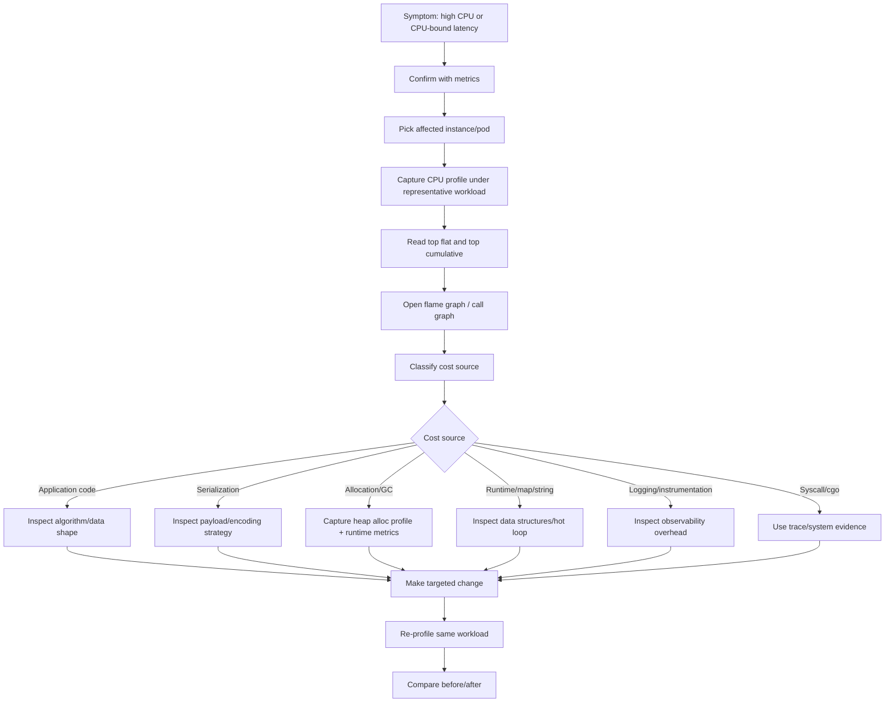
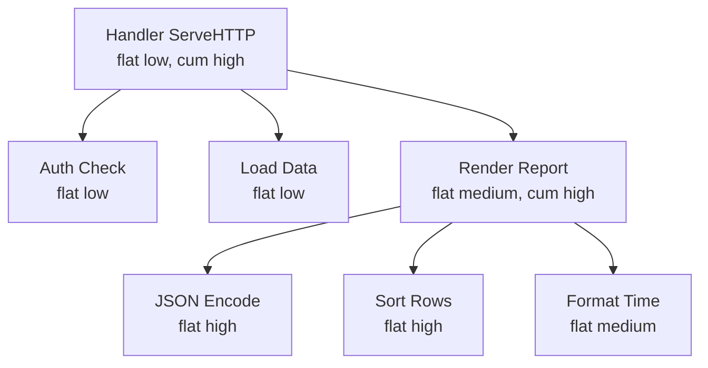
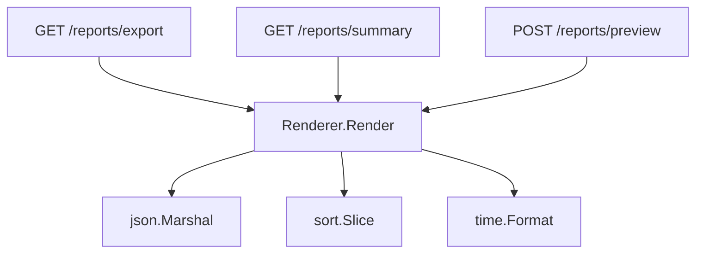
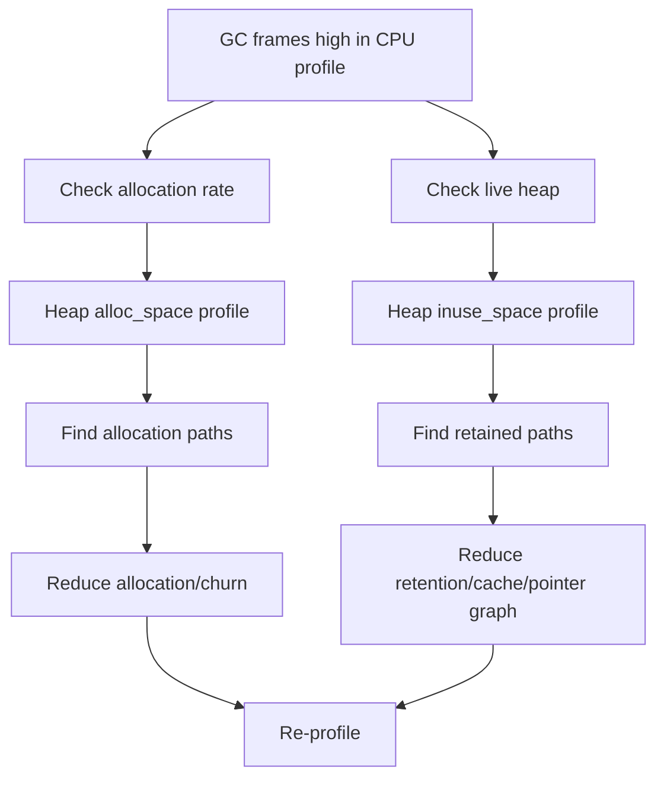

# learn-go-logging-observability-profiling-troubleshooting-part-013.md

# Part 013 — CPU Profiling and Hot Path Analysis

> Seri: `learn-go-logging-observability-profiling-troubleshooting`  
> Bagian: `013 / 032`  
> Fokus: CPU profiling, hot path analysis, flame graph reasoning, optimization workflow, production diagnosis  
> Target pembaca: Java software engineer yang ingin membaca CPU profile Go seperti production performance engineer

---

## 0. Posisi Bagian Ini dalam Seri

Part 011 membahas fondasi `pprof`.

Part 012 membahas cara mengekspos `net/http/pprof` dengan aman di production.

Bagian ini masuk lebih dalam ke satu profile type paling sering dipakai:

```text
CPU profile
```

CPU profile menjawab:

> Saat program benar-benar memakai CPU, stack mana yang paling sering aktif?

Ini penting untuk:

- high CPU incident,
- throughput collapse,
- latency naik karena CPU-bound work,
- regression setelah release,
- dependency upgrade yang membuat cost naik,
- logging/instrumentation overhead,
- JSON/XML/protobuf encode/decode hotspot,
- compression/encryption hotspot,
- inefficient algorithm,
- excessive allocation yang mendorong GC CPU,
- runtime overhead seperti map hashing, allocation, reflection, interface dispatch, sorting, regex.

Namun CPU profile juga sering disalahgunakan.

CPU profile **tidak cocok** untuk semua latency problem. Jika request lambat karena menunggu DB, lock, channel, network, atau queue, CPU profile bisa terlihat “normal” atau “kosong”. Untuk itu dibutuhkan trace, block profile, mutex profile, goroutine profile, dependency metrics, dan logs.

---

## 1. Core Thesis

**CPU profile bukan daftar fungsi yang harus dioptimalkan. CPU profile adalah evidence distribusi CPU sample pada workload tertentu.**

Engineer yang matang tidak membaca CPU profile seperti ini:

```text
Function A paling atas, berarti Function A harus diubah.
```

Engineer yang matang membaca seperti ini:

```text
Pada workload X, selama window Y, CPU sample terkonsentrasi di call path A -> B -> C.
Apakah ini sesuai ekspektasi?
Apakah cost ini berasal dari business work, serialization, allocation, GC, runtime, syscall, logging, instrumentation, atau dependency code?
Apakah perubahan yang mungkin dilakukan mengurangi cost total tanpa merusak correctness?
```

---

## 2. Apa yang Diukur CPU Profile

CPU profile Go adalah sampled profile.

Runtime mengambil sample stack saat program berjalan dan memakai CPU.

Konsekuensi:

1. CPU profile menunjukkan **where CPU time is spent**.
2. CPU profile tidak menunjukkan waktu menunggu.
3. CPU profile adalah statistik, bukan exact trace.
4. Short profile bisa noisy.
5. Workload tidak representatif menghasilkan kesimpulan salah.
6. Hot path kecil tetapi sering bisa terlihat besar.
7. Function yang lambat karena blocking bisa tidak terlihat besar.
8. Runtime/stdlib frame bukan noise otomatis.

---

## 3. Pertanyaan yang Cocok untuk CPU Profile

Gunakan CPU profile untuk pertanyaan seperti:

1. Kenapa CPU naik setelah release?
2. Endpoint mana melakukan CPU work berat?
3. Apakah JSON encode/decode menjadi bottleneck?
4. Apakah regex terlalu mahal?
5. Apakah compression/encryption dominan?
6. Apakah GC menggunakan banyak CPU?
7. Apakah allocation churn memicu CPU tinggi?
8. Apakah logging structured field construction mahal?
9. Apakah algorithm O(n²) muncul di production input besar?
10. Apakah performance fix benar-benar mengurangi hot path?
11. Apakah dependency upgrade menambah CPU cost?
12. Apakah PGO profile merepresentasikan hot code?
13. Apakah CPU cost tersebar atau terkonsentrasi?
14. Apakah runtime map/slice/string operation mendominasi?
15. Apakah contention terlihat sebagai CPU spin atau justru perlu mutex/block profile?

---

## 4. Pertanyaan yang Tidak Cocok untuk CPU Profile

CPU profile bukan tool utama untuk:

| Symptom | Tool Lebih Tepat |
|---|---|
| Latency tinggi, CPU rendah | tracing, block profile, mutex profile, goroutine profile |
| Request menunggu DB | tracing, DB metrics, slow query logs |
| Goroutine leak | goroutine profile, runtime metrics |
| Memory leak | heap profile `inuse_space` |
| GC pressure karena allocation | heap `alloc_space` + runtime metrics + CPU profile |
| Deadlock-like stuck | goroutine profile, runtime trace |
| Queue saturation | metrics, traces, goroutine/block profile |
| Network timeout | HTTP client traces/metrics, logs, packet/network tools |
| Kubernetes CPU throttling | cgroup/Kubernetes metrics, not only CPU profile |

---

## 5. CPU Profiling Workflow



---

## 6. Capturing CPU Profile

### 6.1 From Running Service

Via `net/http/pprof`:

```bash
go tool pprof "http://localhost:6060/debug/pprof/profile?seconds=30"
```

Simpan file:

```bash
curl -o cpu-30s.pb.gz "http://localhost:6060/debug/pprof/profile?seconds=30"
go tool pprof ./app cpu-30s.pb.gz
```

Web UI:

```bash
go tool pprof -http=:0 ./app cpu-30s.pb.gz
```

### 6.2 From Kubernetes Pod

```bash
kubectl -n prod port-forward pod/payment-api-7d9f8c 6060:6060
curl -o cpu-30s.pb.gz "http://localhost:6060/debug/pprof/profile?seconds=30"
go tool pprof -http=:0 ./app cpu-30s.pb.gz
```

Pastikan:

- pod target benar,
- profile diambil saat symptom berlangsung,
- traffic representatif,
- durasi cukup,
- build/binary sesuai.

### 6.3 From Test or Benchmark

```bash
go test ./internal/report -run '^$' -bench BenchmarkRenderReport -cpuprofile cpu.out
go tool pprof -http=:0 cpu.out
```

Dengan binary test eksplisit:

```bash
go test -c ./internal/report -o report.test
./report.test -test.run '^$' -test.bench BenchmarkRenderReport -test.cpuprofile cpu.out
go tool pprof -http=:0 ./report.test cpu.out
```

### 6.4 Programmatic CPU Profile

```go
package main

import (
	"log"
	"os"
	"runtime/pprof"
)

func main() {
	f, err := os.Create("cpu.pb.gz")
	if err != nil {
		log.Fatal(err)
	}
	defer f.Close()

	if err := pprof.StartCPUProfile(f); err != nil {
		log.Fatal(err)
	}

	runWorkload()

	pprof.StopCPUProfile()
}

func runWorkload() {
	// representative workload
}
```

Programmatic profiling berguna untuk:

- CLI,
- batch job,
- local reproduction,
- controlled workload,
- benchmark harness custom.

---

## 7. Duration Selection

Durasi terlalu pendek membuat profile noisy.

Durasi terlalu panjang bisa menambah overhead dan mencampur workload yang berbeda.

| Durasi | Kegunaan |
|---:|---|
| 5s | quick glance, sering noisy |
| 10s | quick incident check |
| 30s | default production diagnosis yang sering masuk akal |
| 60s | lebih stabil, lebih berisiko |
| >60s | perlu alasan kuat |

Untuk service dengan traffic rendah, durasi lebih panjang mungkin perlu.

Untuk service overload, durasi lebih pendek mungkin lebih aman.

Yang penting:

```text
Profile duration harus mencakup cukup event CPU dari workload yang ingin dijelaskan.
```

---

## 8. Reading `top`

Command:

```text
(pprof) top
```

Contoh:

```text
Showing nodes accounting for 8.20s, 82.00% of 10s total
      flat  flat%   sum%        cum   cum%
     2.10s 21.00% 21.00%      2.10s 21.00%  encoding/json.appendString
     1.40s 14.00% 35.00%      4.80s 48.00%  encoding/json.(*encodeState).reflectValue
     0.90s  9.00% 44.00%      0.90s  9.00%  runtime.memmove
     0.70s  7.00% 51.00%      1.80s 18.00%  runtime.mallocgc
     0.60s  6.00% 57.00%      3.20s 32.00%  myapp/internal/report.(*Renderer).Render
```

Interpretasi field:

| Field | Arti |
|---|---|
| flat | sample CPU di function itu sendiri |
| flat% | persentase flat dari total sample |
| sum% | akumulasi flat% sejauh baris itu |
| cum | sample CPU di function dan semua callee |
| cum% | persentase cumulative |

---

## 9. Flat vs Cumulative: Kesalahan Paling Umum

### 9.1 Flat Tinggi

Jika flat tinggi:

```text
encoding/json.appendString flat 21%
```

Berarti CPU banyak benar-benar habis di function tersebut.

Tindakan:

- lihat caller,
- lihat data shape,
- lihat payload size,
- lihat apakah encode dilakukan berulang,
- lihat apakah bisa streaming/caching/precompute.

### 9.2 Cumulative Tinggi, Flat Rendah

Jika cumulative tinggi tetapi flat rendah:

```text
myapp.(*Handler).ServeHTTP flat 0.2%, cum 65%
```

Artinya handler adalah parent dari banyak kerja mahal.

Jangan optimalkan handler wrapper-nya. Turun ke callee.

### 9.3 Diagram



Kesimpulan:

- `ServeHTTP` bukan masalah.
- Cost nyata ada di encode/sort/format.

---

## 10. Reading `top -cum`

Command:

```text
(pprof) top -cum
```

Berguna untuk menemukan parent path.

Contoh:

```text
      flat  flat%   sum%        cum   cum%
     0.10s  1.00%  1.00%      8.20s 82.00%  net/http.(*conn).serve
     0.20s  2.00%  3.00%      7.90s 79.00%  myapp.(*Server).ServeHTTP
     0.30s  3.00%  6.00%      6.80s 68.00%  myapp/report.(*Handler).Export
     0.60s  6.00% 12.00%      4.80s 48.00%  myapp/report.(*Renderer).Render
```

Ini menunjukkan request path yang memicu cost.

Setelah itu gunakan:

```text
(pprof) list myapp/report.(*Renderer).Render
(pprof) peek Render
```

---

## 11. Flame Graph Reading

Flame graph memvisualisasikan stack sample.

Aturan praktis:

- lebar = cost,
- tinggi = kedalaman stack,
- bawah = caller,
- atas = callee,
- frame lebar = investigasi,
- frame tinggi tapi sempit tidak selalu masalah,
- banyak frame kecil tersebar bisa menunjukkan cost fragmented.

### 11.1 Flame Graph Pattern: Single Dominant Hot Path

```text
          json.appendString
          ────────────────
       json.reflectValue
       ──────────────────
    Renderer.Render
    ─────────────────────
Handler.Export
─────────────────────────
```

Interpretasi:

- satu path dominan,
- optimisasi terarah mungkin berdampak besar.

### 11.2 Flame Graph Pattern: Many Small Fires

```text
 A1 A2 A3 A4 A5 A6 A7 A8
 ─  ─  ─  ─  ─  ─  ─  ─
    Utility/formatting scattered
──────────────────────────────
Handler
```

Interpretasi:

- cost tersebar,
- mungkin overhead per item,
- perlu lihat loop/payload size,
- micro-optimization tunggal mungkin kecil,
- redesign data flow bisa lebih besar.

### 11.3 Flame Graph Pattern: Runtime Dominant

```text
      runtime.mallocgc
      ────────────────
   make objects / append / map assign
   ────────────────────────────────
Application loop
──────────────────────────────────
```

Interpretasi:

- allocation path dominan,
- CPU tinggi bisa disebabkan allocation/GC,
- ambil heap `alloc_space`,
- lihat `benchmem`,
- perbaiki allocation.

---

## 12. Source Listing with `list`

Command:

```text
(pprof) list Render
```

Contoh output konseptual:

```text
ROUTINE ======================== myapp/report.(*Renderer).Render
     600ms      4.80s (flat, cum) 48.00% of Total
         .          .    120:
      50ms       50ms    121: rows := make([]RowDTO, 0, len(input.Rows))
     120ms      900ms    122: for _, row := range input.Rows {
     300ms      2.10s    123:     rows = append(rows, convert(row))
      80ms      1.40s    124: }
      50ms      350ms    125: return json.Marshal(rows)
```

Gunakan `list` untuk:

- mencari line-level hotspot,
- melihat loop,
- melihat conversion/formatting,
- membuktikan asumsi,
- menilai apakah optimisasi localized mungkin.

Caveat:

- inlining bisa mengubah attribution,
- generated code bisa sulit dibaca,
- source path harus cocok,
- line-level sample bisa noisy.

---

## 13. Call Graph Reasoning

Call graph membantu menjawab:

```text
Siapa memanggil fungsi mahal ini?
```

Misalnya `encoding/json.Marshal` mahal. Pertanyaannya:

- marshal dipanggil dari endpoint mana?
- apakah dipanggil berkali-kali?
- apakah request membangun response besar?
- apakah marshal dilakukan sebelum filtering/pagination?
- apakah marshal terjadi di log field?
- apakah marshal dilakukan untuk audit/debug log?

Diagram:



Jika banyak endpoint memakai `Renderer.Render`, optimisasi di sana berdampak luas.

Jika hanya satu endpoint, mungkin lebih baik memperbaiki endpoint-specific data shape.

---

## 14. Classification of CPU Cost

Saat membaca CPU profile, klasifikasikan cost.

| Category | Example Frame | Meaning |
|---|---|---|
| Application algorithm | `myapp/rules.Evaluate` | logic sendiri mahal |
| Serialization | `encoding/json`, `encoding/xml`, proto marshal | payload/encoding cost |
| Allocation | `runtime.mallocgc`, `newobject` | allocation churn |
| GC | `runtime.gcBgMarkWorker`, `scanobject` | GC CPU |
| Map/string | `runtime.mapaccess`, `memhash`, `strings.*` | data structure/text cost |
| Reflection | `reflect.*` | generic/dynamic behavior |
| Regex | `regexp.*` | pattern/input expensive |
| Compression | `compress/gzip`, `flate` | CPU-heavy compression |
| Crypto | `crypto/*` | CPU-heavy encryption/hash/signature |
| Logging | `log/slog`, JSON handler, encoder | observability overhead |
| Metrics/tracing | OTel/prometheus code | instrumentation overhead |
| Syscall/cgo | `syscall`, `runtime.cgocall` | boundary to OS/native |
| Runtime scheduler | `runtime.findRunnable`, etc. | scheduler pressure |

Klasifikasi mencegah optimisasi membabi buta.

---

## 15. Runtime Frames: Noise atau Signal?

Runtime frame tidak boleh langsung di-ignore.

### 15.1 `runtime.mallocgc`

Makna:

- allocation banyak,
- allocation besar,
- object creation hot,
- escape ke heap,
- temporary objects,
- interface/boxing-like pattern,
- string/byte conversion.

Langkah berikut:

- heap profile `alloc_space`,
- benchmark `-benchmem`,
- escape analysis,
- inspect loop allocation,
- reduce temporary object.

### 15.2 `runtime.scanobject`

Makna:

- GC scanning object graph,
- live heap besar,
- pointer-rich structures,
- many objects,
- map/slice of pointers,
- retained memory tinggi.

Langkah berikut:

- runtime metrics GC CPU,
- heap `inuse_space`,
- reduce pointer graph,
- compact data,
- avoid unnecessary pointers,
- bounded cache.

### 15.3 `runtime.mapaccess` / `runtime.mapassign`

Makna:

- map hot path,
- key hashing expensive,
- high-frequency lookup,
- string key cost,
- map size/collision behavior,
- repeated lookup.

Langkah berikut:

- reduce lookup count,
- cache result in local variable,
- precompute key,
- use integer IDs,
- consider slice/table for dense key,
- avoid map in inner loop.

### 15.4 `runtime.memmove`

Makna:

- copying data,
- append growth,
- slice copy,
- string/byte conversion,
- serialization copy,
- buffer resize.

Langkah berikut:

- preallocate,
- streaming,
- avoid unnecessary conversion,
- inspect append patterns.

### 15.5 `runtime.findRunnable` / scheduler frames

Makna bisa beragam:

- many goroutines,
- scheduling overhead,
- CPU saturated,
- goroutine churn,
- blocking/unblocking storm.

Langkah berikut:

- runtime metrics goroutine count,
- runtime trace,
- goroutine profile,
- worker/concurrency design review.

---

## 16. CPU vs Allocation/GC Coupling

CPU high sering bukan karena algorithm murni, tetapi allocation churn.

Contoh profile:

```text
runtime.mallocgc       18%
runtime.scanobject     12%
runtime.gcBgMarkWorker 10%
encoding/json          20%
myapp.convertRows      15%
```

Interpretasi:

- application conversion + JSON encode membuat banyak allocation,
- GC ikut memakai CPU,
- optimisasi CPU murni tanpa mengurangi allocation mungkin tidak cukup.

### 16.1 Evidence Triangulation

Ambil:

```bash
go tool pprof -sample_index=alloc_space ./app heap.pb.gz
go test -bench BenchmarkRender -benchmem
```

Cek runtime metrics:

- allocation bytes/sec,
- heap live,
- GC cycles/sec,
- GC CPU fraction,
- pause distribution.

### 16.2 Optimization Direction

- preallocate slices,
- avoid per-item temporary allocation,
- avoid `fmt.Sprintf` in loops,
- avoid `[]byte(string)` ping-pong,
- stream encoding,
- reduce pointer-rich DTO,
- reuse buffers carefully,
- remove unnecessary conversion layers.

---

## 17. Common Hot Path: JSON Encoding

### 17.1 Symptoms

CPU profile shows:

```text
encoding/json.Marshal
encoding/json.(*encodeState).reflectValue
encoding/json.appendString
reflect.Value.Field
runtime.mallocgc
```

### 17.2 Possible Causes

1. Payload too large.
2. Response not paginated.
3. Repeated marshal inside loop.
4. DTO conversion creates many temporary objects.
5. Struct tags/reflection overhead.
6. Escaping string-heavy fields.
7. Logging/audit also marshals payload.
8. Map-based dynamic JSON.
9. `interface{}`/`any` heavy structure.
10. Pretty printing in hot path.

### 17.3 Investigation

Ask:

- endpoint mana?
- response size?
- number of elements?
- marshal sekali atau berkali-kali?
- apakah data sudah difilter sebelum marshal?
- apakah log ikut marshal object?
- apakah ada compression after JSON?
- apakah JSON sebenarnya bottleneck atau symptom dari huge payload?

### 17.4 Fix Options

| Fix | Trade-off |
|---|---|
| Pagination | API contract impact |
| Field reduction | product/domain approval |
| Streaming encoder | changes error handling semantics |
| Avoid map[string]any | less dynamic, faster |
| Precompute/caching | staleness/invalidation |
| Alternative JSON lib | dependency/risk/compatibility |
| Avoid double marshal | usually safe if design improved |
| Use protobuf for internal | protocol/client impact |

Do not start with alternative JSON library before understanding payload shape and call frequency.

---

## 18. Common Hot Path: Regex

### 18.1 Symptoms

```text
regexp.(*machine).backtrack
regexp.(*Regexp).doExecute
regexp.(*Regexp).MatchString
```

### 18.2 Causes

1. Regex in inner loop.
2. Regex compiled repeatedly.
3. Pattern too general.
4. Input too large.
5. Regex used for simple prefix/suffix/contains.
6. Multiple regex passes.
7. Validation repeated at many layers.
8. Backtracking-like expensive behavior depending on engine/pattern.

### 18.3 Fix Options

- compile regex once,
- use `strings.HasPrefix/Contains/Index` for simple cases,
- reduce input before regex,
- combine validations carefully,
- cache validation result,
- move validation boundary,
- use parser for structured format,
- benchmark with representative worst-case input.

### 18.4 Example

Bad:

```go
func valid(s string) bool {
	return regexp.MustCompile(`^[A-Z]{3}-[0-9]{6}$`).MatchString(s)
}
```

Better:

```go
var codeRe = regexp.MustCompile(`^[A-Z]{3}-[0-9]{6}$`)

func valid(s string) bool {
	return codeRe.MatchString(s)
}
```

For very simple fixed format, manual validation may be faster and clearer:

```go
func validCode(s string) bool {
	if len(s) != 10 || s[3] != '-' {
		return false
	}
	for i := 0; i < 3; i++ {
		if s[i] < 'A' || s[i] > 'Z' {
			return false
		}
	}
	for i := 4; i < 10; i++ {
		if s[i] < '0' || s[i] > '9' {
			return false
		}
	}
	return true
}
```

Trade-off:

- manual code faster,
- regex more declarative,
- correctness tests mandatory.

---

## 19. Common Hot Path: `fmt.Sprintf`

### 19.1 Symptoms

```text
fmt.Sprintf
fmt.(*pp).doPrintf
reflect.*
runtime.mallocgc
```

### 19.2 Causes

- formatting in hot loop,
- building keys repeatedly,
- log message formatting before level check,
- string conversions,
- generic formatting of known types.

### 19.3 Fix Options

- use `strconv.AppendInt`,
- use `strings.Builder`,
- use byte buffer,
- precompute stable strings,
- avoid formatting if log level disabled,
- use structured logging attrs instead of formatted message,
- avoid `fmt` in inner loop.

Example:

Bad:

```go
key := fmt.Sprintf("%s:%d:%s", tenant, id, status)
```

Alternative:

```go
var b strings.Builder
b.Grow(len(tenant) + len(status) + 32)
b.WriteString(tenant)
b.WriteByte(':')
b.WriteString(strconv.Itoa(id))
b.WriteByte(':')
b.WriteString(status)
key := b.String()
```

But do not do this everywhere. Use CPU/profile evidence.

---

## 20. Common Hot Path: Sorting

### 20.1 Symptoms

```text
sort.Slice
slices.SortFunc
myapp.compareRows
time.Time.Before
strings.Compare
```

### 20.2 Causes

- sorting too much data,
- sorting repeatedly,
- expensive comparator,
- comparator allocates,
- parsing time inside comparator,
- strings normalization inside comparator,
- sorting before filtering/pagination.

### 20.3 Fix Options

- filter before sort,
- paginate at DB/storage layer,
- precompute sort keys,
- avoid parsing in comparator,
- use stable sort only if needed,
- cache sorted result,
- use index/data structure.

Bad comparator:

```go
sort.Slice(rows, func(i, j int) bool {
	ti, _ := time.Parse(time.RFC3339, rows[i].CreatedAt)
	tj, _ := time.Parse(time.RFC3339, rows[j].CreatedAt)
	return ti.Before(tj)
})
```

Better:

```go
type rowWithKey struct {
	row Row
	ts  time.Time
}
```

Precompute once, sort on key.

---

## 21. Common Hot Path: Logging Overhead

### 21.1 Symptoms

```text
log/slog
encoding/json
time.Format
runtime.mallocgc
myapp.buildLogAttrs
```

### 21.2 Causes

1. Debug attrs built even when debug disabled.
2. Logging huge object.
3. `fmt.Sprintf` log message in hot path.
4. JSON handler lock/contention.
5. Sync writer slow.
6. Too many logs per request.
7. Error logged repeatedly.
8. Stack trace captured too often.
9. Redaction handler expensive.
10. `LogValuer` doing heavy work.

### 21.3 Fix Options

- check level before expensive attr construction,
- log identifiers not full payload,
- sample repeated logs,
- reduce per-request log count,
- avoid formatting disabled debug logs,
- use stable fields,
- move heavy diagnostics behind debug endpoint,
- avoid logging in inner loops,
- use async carefully only if loss/backpressure semantics understood.

Example:

Bad:

```go
logger.Debug("candidate evaluated",
	"payload", expensiveMarshal(candidate),
)
```

Better:

```go
if logger.Enabled(ctx, slog.LevelDebug) {
	logger.DebugContext(ctx, "candidate evaluated",
		"candidate_id", candidate.ID,
		"score", candidate.Score,
	)
}
```

---

## 22. Common Hot Path: Metrics/Tracing Overhead

Observability instrumentation itself can become hot path.

Symptoms:

```text
go.opentelemetry.io/otel
github.com/prometheus/client_golang
attribute construction
label value generation
runtime.mallocgc
```

Causes:

- high-cardinality label generation,
- dynamic label maps,
- span attributes too many,
- creating spans in inner loop,
- recording histogram too frequently at too fine granularity,
- expensive baggage propagation,
- duplicate instrumentation,
- exporter backpressure.

Fix:

- instrument boundaries, not every tiny function,
- predefine labels/attrs,
- avoid user/input IDs as labels,
- sample traces,
- reduce span events in hot path,
- avoid per-item spans in large batch,
- use metrics at aggregate level,
- benchmark instrumentation overhead.

---

## 23. Common Hot Path: Map Lookup

### 23.1 Symptoms

```text
runtime.mapaccess1_faststr
runtime.mapaccess2_faststr
runtime.mapassign_faststr
runtime.memhash
```

### 23.2 Causes

- map lookup inside inner loop,
- string key construction,
- repeated lookup for same key,
- large maps,
- dynamic `map[string]any`,
- many temporary maps,
- map used as object model.

### 23.3 Fix Options

- move lookup outside loop,
- use typed struct,
- use integer key,
- precompute map,
- use slice if key is dense integer,
- avoid temporary maps,
- normalize once,
- reduce key construction.

Example:

Bad:

```go
for _, item := range items {
	v := rules[item.Type+":"+item.Region]
	process(v)
}
```

Better:

```go
for _, item := range items {
	key := ruleKey{typ: item.Type, region: item.Region}
	v := rules[key]
	process(v)
}
```

Or if possible, encode keys as small integer IDs.

---

## 24. Common Hot Path: String/Byte Conversion

Symptoms:

```text
runtime.slicebytetostring
runtime.stringtoslicebyte
runtime.memmove
bytes.(*Buffer).String
```

Causes:

- repeated `string(b)` conversion,
- repeated `[]byte(s)` conversion,
- building strings then writing bytes,
- parsing by converting whole payload,
- log/metrics key conversion,
- JSON/XML intermediate conversion.

Fix:

- keep data as `[]byte` if byte processing,
- keep data as string if text processing,
- avoid ping-pong conversion,
- use `io.Writer`,
- stream instead of materialize,
- use `strconv.Append*`,
- use `bytes.Buffer`/`strings.Builder` appropriately.

---

## 25. Common Hot Path: Compression

Symptoms:

```text
compress/flate
compress/gzip
hash/crc32
runtime.mallocgc
```

Causes:

- compression level too high,
- compressing small payloads,
- compressing already-compressed data,
- no threshold,
- compression in request hot path,
- repeated writer allocation,
- not pooling writers carefully,
- high traffic export endpoint.

Fix:

- set compression threshold,
- tune compression level,
- pool gzip writers carefully,
- skip compression for small/already-compressed payloads,
- move heavy compression async,
- precompress static content,
- use faster codec where acceptable.

Trade-off:

- lower CPU may increase network bytes,
- better compression may reduce network but increase latency/CPU.

Use metrics:

- response size,
- compression ratio,
- CPU,
- latency.

---

## 26. Common Hot Path: Crypto/Hashing

Symptoms:

```text
crypto/sha256
crypto/hmac
crypto/rsa
crypto/ecdsa
crypto/tls
```

Causes:

- signing/verifying per request,
- repeated certificate parsing,
- token validation too frequent,
- hashing large payload,
- TLS handshake spike,
- no connection reuse,
- mTLS client config recreation.

Fix:

- cache parsed public keys/certs,
- reuse HTTP transports,
- avoid repeated expensive validation when safe,
- use connection pooling,
- tune TLS session reuse,
- batch where appropriate,
- benchmark key algorithm choices if under your control.

Security warning:

Do not weaken crypto just to reduce CPU. Optimize architecture and reuse first.

---

## 27. Common Hot Path: Reflection

Symptoms:

```text
reflect.Value.Field
reflect.Value.Interface
reflect.Type.Field
encoding/json
validation library
mapper library
```

Causes:

- generic mapper,
- dynamic validation,
- JSON/XML reflection,
- mapstructure-like conversion,
- copying DTO through reflection,
- repeated tag parsing,
- runtime schema inspection.

Fix:

- avoid mapper in hot path,
- generate code,
- cache metadata,
- use typed conversion,
- reduce reflection layers,
- move validation to boundary,
- avoid `map[string]any` as internal model.

---

## 28. CPU Profile and Inlining

Inlining affects attribution.

A small function may not appear because compiler inlined it into caller.

This is normal.

Implications:

- source line attribution can look surprising,
- function boundaries in profile may not match source exactly,
- micro functions may disappear,
- disabling inlining for investigation is possible but changes program behavior/performance.

Advanced local investigation sometimes uses:

```bash
go test -gcflags=all=-l ...
```

But do not treat no-inlining profile as production-equivalent.

---

## 29. CPU Profile and GOMAXPROCS

CPU profile total sample is related to CPU time, not wall-clock only.

If service runs with multiple OS threads/procs, total CPU sample over 30 seconds can exceed 30 seconds of CPU-time accounting depending on parallelism and tool output semantics.

Mental model:

```text
Wall time = elapsed clock time.
CPU time = sum of time CPUs spent executing the process.
```

If 4 cores are busy for 30 seconds, CPU time can be roughly 120 CPU-seconds.

When comparing profiles:

- compare same GOMAXPROCS/resource limits,
- consider CPU throttling,
- consider autoscaling,
- consider traffic volume,
- normalize by throughput when needed.

---

## 30. CPU Throttling Caveat

In Kubernetes, high latency with "not huge app CPU" may be CPU throttling.

CPU profile shows where CPU is spent when running, but not necessarily how much time the process was throttled by cgroups.

Symptoms:

- p99 latency high,
- container CPU throttling metrics high,
- app CPU profile not surprising,
- goroutines waiting to run,
- runtime trace may show scheduling delays,
- increasing CPU limit reduces latency.

Use:

- container CPU usage,
- throttling metrics,
- runtime metrics,
- runtime trace,
- Kubernetes resource config.

Do not blame application hot path if container cannot get CPU.

---

## 31. CPU Profile During GC

If CPU profile shows GC frames:

```text
runtime.gcBgMarkWorker
runtime.scanobject
runtime.greyobject
runtime.mallocgc
```

Do not immediately tune `GOGC`.

First ask:

1. Why allocation rate high?
2. Why live heap large?
3. Are objects pointer-heavy?
4. Is cache bounded?
5. Did payload size grow?
6. Did new code allocate per item/request?
7. Is `GOMEMLIMIT` too tight?
8. Is container memory pressure forcing frequent GC?

Workflow:



Tuning GC without reducing allocation may only move cost around.

---

## 32. CPU Profile for Algorithmic Complexity

CPU profile can expose algorithmic complexity.

Example symptoms:

- CPU grows superlinearly with input size,
- p99 worsens for large tenants,
- report/export endpoint worse over time,
- canary with larger data spikes CPU.

Profile may show:

```text
myapp/rules.EvaluatePairwise
sort.Slice
strings.Contains
regexp.MatchString
```

Ask:

1. Is there nested loop?
2. Is work repeated?
3. Is data filtered late?
4. Is there indexing?
5. Is sort done before pagination?
6. Is expensive comparison in inner loop?
7. Does input cardinality affect cost?
8. Can precomputation change complexity?

Optimization priority:

```text
O(n²) -> O(n log n) or O(n)
```

often beats micro-optimizing `fmt` or allocation.

---

## 33. CPU Profile for Report/Batch Jobs

Batch jobs differ from HTTP services.

Questions:

- throughput per item?
- CPU per record?
- allocation per record?
- stage-level cost?
- skew by input type?
- does logging per item dominate?
- does serialization dominate output?

Instrument batch stage:

```text
load -> validate -> transform -> enrich -> write
```

Profile under representative input.

Diagram:


If CPU profile shows `Serialize` 60%, optimizing `Validate` will not move total job much.

---

## 34. Optimization Economics

Do not optimize by aesthetic preference.

Prioritize by:

1. cost percentage,
2. request volume,
3. user impact,
4. SLO impact,
5. operational risk,
6. complexity of fix,
7. correctness risk,
8. maintainability impact.

Example:

| Candidate | CPU Impact | Effort | Risk | Priority |
|---|---:|---:|---:|---|
| Remove double JSON marshal | high | low | low | high |
| Replace entire JSON library | medium/high | medium | medium/high | maybe |
| Rewrite core algorithm | high | high | high | depends |
| Replace `fmt.Sprintf` in non-hot path | tiny | low | low | low |
| Add pagination | high | medium | API/product impact | high but coordinated |

---

## 35. The "Amdahl" Reality

If a function consumes 5% CPU, eliminating it completely gives at most 5% improvement.

If a path consumes 50%, a 30% improvement there gives 15% total improvement.

Mental model:

```text
Total improvement is limited by fraction of total time affected.
```

CPU profile helps avoid spending days optimizing 1% cost.

---

## 36. Before/After Profiling Protocol

### 36.1 Baseline

Capture:

```text
baseline CPU profile
baseline latency/throughput metrics
baseline allocation/op if benchmark
baseline runtime metrics
commit SHA
input/workload description
```

### 36.2 Change

Make one targeted change.

### 36.3 Re-profile

Same workload.

```bash
go tool pprof -base before.pb.gz ./app after.pb.gz
```

### 36.4 Validate

Check:

- CPU total,
- hot path reduced,
- latency improved,
- throughput improved,
- allocation did not worsen unexpectedly,
- correctness tests pass,
- code complexity acceptable.

---

## 37. Profile Diff Interpretation

Diff output may show positive and negative values.

Conceptually:

```text
negative = less cost after change
positive = more cost after change
```

But interpretation depends command/UI.

Always confirm by reading tool legend.

Diff pitfalls:

1. workload changed,
2. traffic mix changed,
3. profile duration differs,
4. binary mismatch,
5. canary received different endpoints,
6. GC state differs,
7. CPU throttling differs.

Profile diff is powerful only under controlled comparison.

---

## 38. Case Study 1: JSON Regression After Release

### 38.1 Symptom

- CPU doubled after release.
- p99 latency increased.
- Error rate stable.
- A report endpoint changed response schema.

### 38.2 Evidence

CPU profile:

```text
encoding/json.(*encodeState).reflectValue 34% cum
encoding/json.appendString                 19% flat
myapp/report.convert                       22% cum
runtime.mallocgc                           12% flat/cum mixed
```

Metrics:

- response size p95 increased 3x,
- allocation rate increased,
- GC CPU increased.

Trace:

- slow span in `GET /reports/export`.

### 38.3 Root Cause

New nested `details` field included full history per row. For large reports, response payload and DTO construction grew dramatically.

### 38.4 Mitigation

- feature flag disabled `details` field.
- p99 returned to baseline.

### 38.5 Long-Term Fix

- separate detail endpoint,
- pagination,
- response size metric,
- contract test for payload growth,
- benchmark large report rendering,
- CPU profile gate for report renderer.

---

## 39. Case Study 2: Logging Overhead

### 39.1 Symptom

- CPU increased after adding debug logs.
- Debug level disabled in production.
- Engineer assumed disabled logs have zero cost.

### 39.2 Profile

```text
myapp.buildDebugAttrs       18%
encoding/json.Marshal       14%
runtime.mallocgc            10%
log/slog.(*Logger).Debug     2%
```

### 39.3 Root Cause

Expensive attributes were built before calling `Debug`.

```go
logger.Debug("candidate",
	"payload", toJSON(candidate),
)
```

Even with debug disabled, `toJSON(candidate)` ran.

### 39.4 Fix

```go
if logger.Enabled(ctx, slog.LevelDebug) {
	logger.DebugContext(ctx, "candidate",
		"candidate_id", candidate.ID,
		"score", candidate.Score,
	)
}
```

### 39.5 Lesson

Disabled logging avoids handler emission, not necessarily caller-side argument construction.

---

## 40. Case Study 3: Map Key Construction

### 40.1 Symptom

- CPU high in rule evaluation.
- Profile shows runtime map/hash/string work.

```text
runtime.mapaccess2_faststr
runtime.memhash
runtime.concatstrings
myapp/rules.Evaluate
```

### 40.2 Root Cause

Inside nested loop:

```go
key := item.Type + ":" + item.Region + ":" + item.Channel
rule := rules[key]
```

Millions of temporary string keys per request.

### 40.3 Fix

- pre-normalize IDs,
- use struct key,
- reduce nested loop,
- build index by type/region/channel.

```go
type ruleKey struct {
	typ     uint16
	region  uint16
	channel uint16
}
```

### 40.4 Result

- CPU reduced,
- allocations reduced,
- GC CPU reduced.

Lesson:

CPU profile showed map/hash/string; heap profile confirmed temporary allocation.

---

## 41. Case Study 4: CPU Profile Misleading Due to Blocking

### 41.1 Symptom

- p99 latency high.
- CPU profile shows no obvious hotspot.
- CPU usage normal.

### 41.2 Wrong Conclusion

> "No CPU hotspot, maybe Go runtime issue."

### 41.3 Better Evidence

Goroutine profile:

```text
many goroutines waiting on channel send
```

Block profile:

```text
myapp/queue.(*BoundedQueue).Submit
```

Trace:

- requests wait before worker execution.

### 41.4 Root Cause

Worker pool saturated after downstream dependency slowed.

### 41.5 Lesson

CPU profile only shows CPU execution. Waiting requires different evidence.

---

## 42. CPU Profile Interpretation Checklist

```text
[ ] Was symptom CPU-related?
[ ] Was profile captured during symptom?
[ ] Is workload representative?
[ ] Is duration sufficient?
[ ] Is binary/source matched?
[ ] Did I inspect flat and cumulative?
[ ] Did I inspect flame graph?
[ ] Did I classify cost source?
[ ] Did runtime frames indicate allocation/GC/map/scheduler?
[ ] Did I validate with metrics/logs/traces?
[ ] Did I avoid optimizing non-hot code?
[ ] Did I re-profile after change?
```

---

## 43. Hot Path Analysis Checklist

```text
[ ] Identify dominant call path.
[ ] Locate application boundary causing it.
[ ] Determine data shape/input cardinality.
[ ] Determine whether cost is algorithmic or per-item overhead.
[ ] Check allocation coupling.
[ ] Check serialization/logging/instrumentation overhead.
[ ] Check repeated work.
[ ] Check cache/precompute opportunity.
[ ] Check correctness constraints.
[ ] Estimate max possible gain.
[ ] Choose least risky high-impact fix.
```

---

## 44. Production CPU Incident Runbook

```text
Runbook: High CPU in Go service

1. Confirm symptom
   - CPU usage
   - CPU throttling
   - latency
   - throughput
   - error rate
   - deployment change

2. Pick target pod
   - affected pod
   - representative traffic
   - not already terminating

3. Capture CPU profile
   kubectl -n <ns> port-forward pod/<pod> 6060:6060
   curl -o cpu-30s.pb.gz "http://localhost:6060/debug/pprof/profile?seconds=30"

4. Capture support evidence if needed
   - heap alloc profile if malloc/GC appears
   - goroutine profile if goroutine count abnormal
   - trace if scheduler/syscall suspected
   - logs around deployment
   - endpoint latency breakdown

5. Analyze
   go tool pprof -http=:0 ./app cpu-30s.pb.gz

6. Classify hot path
   - application algorithm
   - serialization
   - allocation/GC
   - map/string
   - logging/instrumentation
   - crypto/compression
   - runtime/scheduler/syscall

7. Mitigate
   - rollback
   - feature flag
   - reduce payload
   - reduce concurrency
   - disable expensive path
   - scale out only if CPU-bound and scalable

8. Verify
   - CPU down
   - latency down
   - error stable
   - new profile if needed

9. Post-incident
   - profile diff
   - benchmark
   - regression test
   - dashboard/alert addition
```

---

## 45. Exercises

### Exercise 1 — CPU Hotspot by JSON

Buat endpoint:

```text
GET /reports
```

Yang menghasilkan 50.000 row DTO dan marshal ke JSON.

Tugas:

1. expose pprof.
2. load endpoint dengan `hey`, `wrk`, atau tool sejenis.
3. capture CPU profile 30s.
4. identifikasi JSON frames.
5. kurangi payload atau ubah encode strategy.
6. profile before/after.

Pertanyaan:

- berapa persen CPU di JSON?
- apakah `runtime.mallocgc` muncul?
- apakah response size metric menjelaskan cost?

---

### Exercise 2 — Regex in Inner Loop

Buat benchmark yang memvalidasi 1 juta kode dengan regex.

Versi A:

- compile regex di function.

Versi B:

- precompile regex global.

Versi C:

- manual validation.

Tugas:

```bash
go test -bench . -benchmem -cpuprofile cpu.out
```

Bandingkan:

- ns/op,
- alloc/op,
- CPU profile,
- readability/correctness risk.

---

### Exercise 3 — Logging Disabled but Expensive

Buat fungsi:

```go
logger.Debug("state", "payload", expensive())
```

Debug level disabled.

Tugas:

1. benchmark.
2. CPU profile.
3. ubah dengan `logger.Enabled`.
4. bandingkan.

Lesson:

- disabled log call tidak otomatis membuat argument construction gratis.

---

### Exercise 4 — Map Key Hot Path

Buat loop besar yang melakukan lookup dengan key string hasil concatenation.

Versi alternatif:

- struct key,
- integer key,
- precomputed key.

Tugas:

- benchmark,
- CPU profile,
- memprofile,
- jelaskan trade-off.

---

### Exercise 5 — CPU vs Blocking

Buat endpoint yang menunggu channel/worker queue penuh.

Tugas:

1. capture CPU profile.
2. amati CPU profile tidak membantu banyak.
3. capture goroutine/block profile.
4. jelaskan mengapa CPU profile bukan tool tepat.

---

## 46. What Good Looks Like

Anda berada di level production performance engineer jika mampu:

1. mengambil CPU profile dari pod production dengan aman,
2. membaca flat/cumulative/flame graph,
3. membedakan hot function dan hot call path,
4. mengenali runtime frame sebagai signal,
5. menghubungkan CPU profile dengan heap allocation/GC,
6. mengenali serialization/logging/instrumentation overhead,
7. tidak memakai CPU profile untuk blocking problem,
8. membuat optimisasi berbasis cost, bukan opini,
9. membuktikan fix dengan profile diff,
10. menulis incident explanation berbasis evidence.

---

## 47. Summary

CPU profiling adalah salah satu kemampuan paling penting dalam Go production engineering.

Namun nilainya bukan pada command:

```bash
go tool pprof
```

Nilainya ada pada reasoning:

1. symptom CPU-related,
2. workload representatif,
3. profile type tepat,
4. flat/cumulative dibaca benar,
5. flame graph dipahami,
6. cost diklasifikasikan,
7. runtime frames tidak diabaikan,
8. allocation/GC coupling dicek,
9. fix dipilih berdasarkan dampak,
10. before/after dibuktikan.

CPU profile tidak menjawab semua masalah.

Tetapi untuk high CPU dan CPU-bound latency, CPU profile adalah salah satu sumber evidence paling langsung untuk menjawab:

```text
"CPU kita habis di mana, dan kenapa?"
```

---

## 48. Status Seri

Bagian ini adalah:

```text
learn-go-logging-observability-profiling-troubleshooting-part-013.md
```

Status:

```text
Part 013 dari 032
Seri belum selesai
```

Bagian berikutnya:

```text
learn-go-logging-observability-profiling-troubleshooting-part-014.md
```

Topik berikutnya:

```text
Memory Profiling, Heap Growth, and Allocation Forensics
```


<!-- NAVIGATION_FOOTER -->
<div class="page-nav">
<a href="./learn-go-logging-observability-profiling-troubleshooting-part-012.md">⬅️ Part 012 — `net/http/pprof` in Production</a>
<a href="./index.md">📚 Kategori</a>
<a href="../../index.md">🏠 Home</a>
<a href="./learn-go-logging-observability-profiling-troubleshooting-part-014.md">Part 014 — Memory Profiling, Heap Growth, and Allocation Forensics ➡️</a>
</div>
