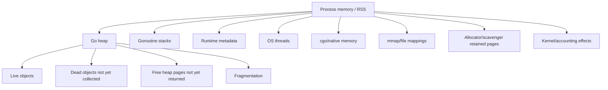
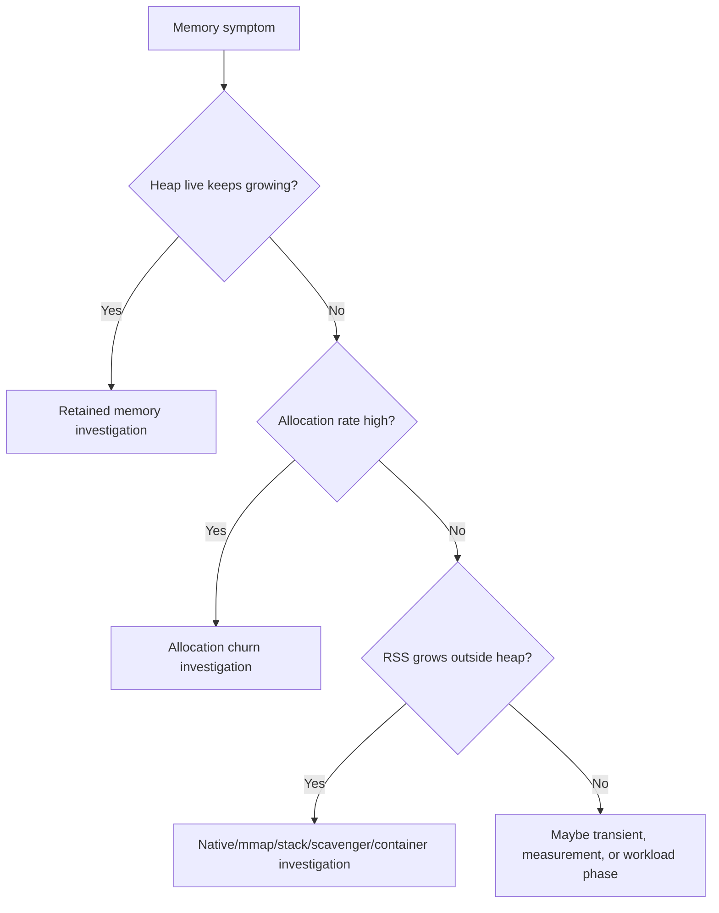
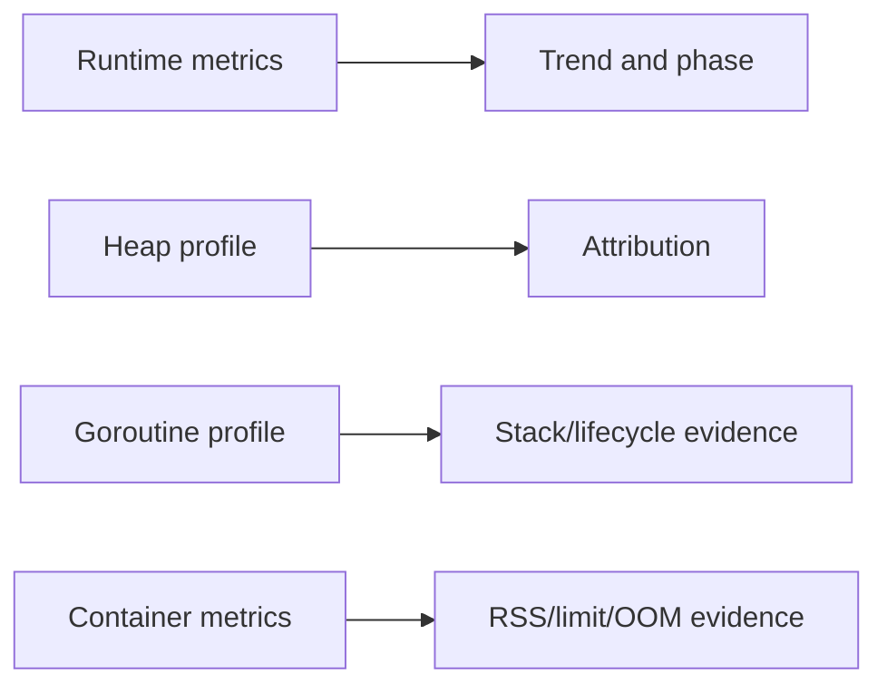
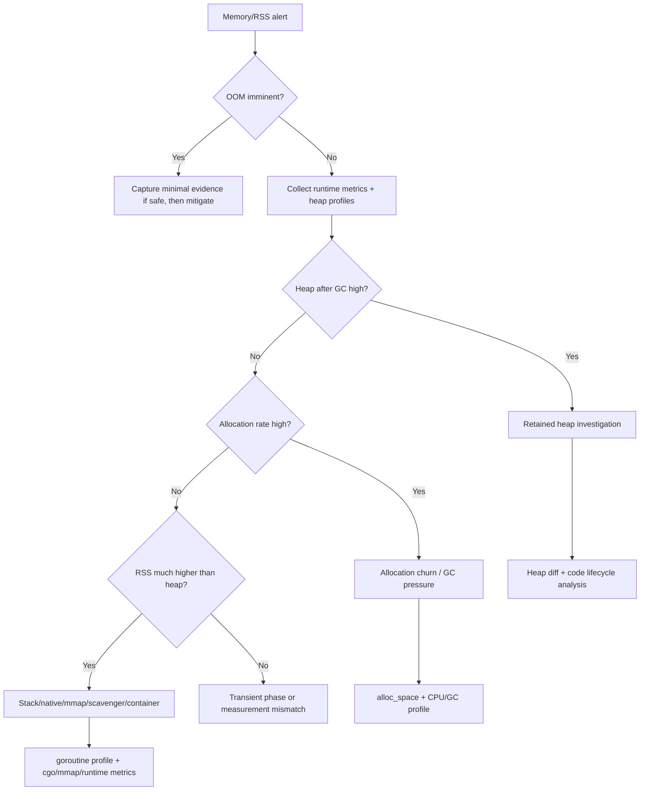

# learn-go-logging-observability-profiling-troubleshooting-part-014.md

# Part 014 — Memory Profiling, Heap Growth, and Allocation Forensics

> Seri: `learn-go-logging-observability-profiling-troubleshooting`  
> Bagian: `014 / 032`  
> Fokus: heap profile, retained memory, allocation churn, RSS vs heap, OOM diagnosis, memory leak forensics  
> Target pembaca: Java software engineer yang ingin memahami memory incident Go secara production-grade

---

## 0. Posisi Bagian Ini dalam Seri

Part 013 membahas CPU profiling dan hot path analysis.

Bagian ini membahas sisi lain yang sangat sering menjadi sumber incident production:

```text
memory growth
heap pressure
allocation churn
GC pressure
OOMKilled
RSS naik
goroutine leak retaining memory
cache tak terkendali
slice backing array tertahan
buffer reuse yang salah
```

Di Java, Anda mungkin terbiasa dengan:

- heap dump,
- object graph dominator tree,
- retained size,
- allocation profiler,
- GC logs,
- JFR allocation events,
- JVM native memory tracking.

Di Go, cara berpikirnya berbeda.

Go tidak biasanya memberi Anda "heap dump object graph" seperti tooling JVM klasik. Go heap profile lebih berorientasi pada:

- allocation site,
- retained allocation attribution,
- object count/space,
- allocation churn,
- live heap setelah GC,
- sample-based memory attribution.

Karena itu, memory forensics Go membutuhkan kombinasi:

- heap profile,
- alloc profile,
- runtime metrics,
- goroutine profile,
- GC metrics,
- container RSS/cgroup metrics,
- code ownership/reference reasoning,
- before/after snapshots,
- representative workload.

---

## 1. Core Thesis

**Memory problem di Go bukan satu kategori. Anda harus membedakan retained heap, allocation churn, RSS growth, goroutine stack growth, native/cgo memory, mmap/file buffers, dan container pressure.**

Kalimat paling berbahaya saat memory incident:

```text
"Memory naik, berarti memory leak."
```

Belum tentu.

Memory naik bisa karena:

1. live heap benar-benar tumbuh,
2. allocation churn tinggi tetapi GC belum reclaim,
3. cache memang menyimpan data,
4. goroutine leak menahan reference,
5. slice kecil menahan backing array besar,
6. map tidak shrink seperti yang diharapkan,
7. stack goroutine bertambah,
8. native/cgo allocation,
9. memory mapped file,
10. OS page cache,
11. fragmentation/scavenging behavior,
12. container limit terlalu kecil,
13. `GOMEMLIMIT`/`GOGC` tidak sesuai workload,
14. traffic/data shape berubah,
15. profiling dilakukan di timing yang salah.

---

## 2. Memory Taxonomy in Go



Important distinction:

```text
Go heap != RSS
Heap live != heap allocated
Allocated total != retained memory
Memory growth != leak automatically
```

---

## 3. The Four Key Heap Profile Views

Heap profile memiliki beberapa sample index yang sangat penting.

| Sample Index | Pertanyaan | Cocok Untuk |
|---|---|---|
| `inuse_space` | bytes yang masih hidup berasal dari mana? | retained heap, leak, cache |
| `inuse_objects` | object hidup terbanyak dibuat di mana? | object count pressure, pointer-heavy heap |
| `alloc_space` | total bytes dialokasikan dari mana? | allocation churn, GC pressure |
| `alloc_objects` | total object dialokasikan dari mana? | small object churn |

Jangan hanya membuka heap profile dengan default lalu menyimpulkan.

Anda harus eksplisit memilih sample index sesuai pertanyaan.

---

## 4. Retained Memory vs Allocation Churn

### 4.1 Retained Memory

Retained memory berarti object masih reachable/live.

Indikasi:

- `inuse_space` tinggi,
- heap live naik,
- memory tidak turun setelah GC,
- cache/map/slice/goroutine reference menahan object.

Pertanyaan:

```text
Apa yang masih hidup?
Siapa yang menahannya?
Apakah seharusnya masih hidup?
Apa lifecycle-nya?
```

### 4.2 Allocation Churn

Allocation churn berarti program membuat banyak object sementara.

Indikasi:

- `alloc_space` tinggi,
- allocation rate tinggi,
- GC CPU tinggi,
- heap live mungkin tidak besar,
- latency bisa naik karena GC/allocator.

Pertanyaan:

```text
Kenapa object sementara dibuat sebanyak ini?
Apakah bisa dihindari, reuse, stream, preallocate, atau ubah data layout?
```

### 4.3 Diagram



---

## 5. Capturing Heap Profile

### 5.1 From Running Service

```bash
curl -o heap.pb.gz "http://localhost:6060/debug/pprof/heap"
go tool pprof ./app heap.pb.gz
```

### 5.2 Heap After GC

```bash
curl -o heap-gc1.pb.gz "http://localhost:6060/debug/pprof/heap?gc=1"
go tool pprof ./app heap-gc1.pb.gz
```

`gc=1` meminta runtime menjalankan GC sebelum mengambil heap profile.

Ini membantu melihat live heap yang benar-benar masih reachable setelah GC.

### 5.3 Allocation Profile

Endpoint `allocs`:

```bash
curl -o allocs.pb.gz "http://localhost:6060/debug/pprof/allocs"
go tool pprof ./app allocs.pb.gz
```

Atau heap profile dengan sample index:

```bash
go tool pprof -sample_index=alloc_space ./app heap.pb.gz
```

### 5.4 From Benchmark

```bash
go test ./internal/report -run '^$' -bench BenchmarkRender -benchmem -memprofile mem.out
go tool pprof -sample_index=alloc_space mem.out
go tool pprof -sample_index=inuse_space mem.out
```

---

## 6. Reading Heap Profile

### 6.1 Retained Bytes

```bash
go tool pprof -sample_index=inuse_space ./app heap-gc1.pb.gz
```

Inside pprof:

```text
(pprof) top
(pprof) top -cum
(pprof) list FunctionName
(pprof) web
```

Sample interpretation:

```text
Showing nodes accounting for 850MB, 85% of 1000MB total
      flat  flat%   sum%        cum   cum%
     420MB 42.00% 42.00%      420MB 42.00%  myapp/cache.(*Store).Set
     180MB 18.00% 60.00%      260MB 26.00%  myapp/report.buildRows
      90MB  9.00% 69.00%       90MB  9.00%  bytes.makeSlice
```

This means retained live heap is attributed to those allocation sites.

It does not automatically prove `Store.Set` is bug. Maybe cache is expected. You need lifecycle reasoning.

### 6.2 Allocation Bytes

```bash
go tool pprof -sample_index=alloc_space ./app heap.pb.gz
```

Example:

```text
Showing nodes accounting for 12GB, 80% of 15GB total
      flat  flat%   sum%        cum   cum%
      4GB  26.67% 26.67%       4GB  26.67%  fmt.Sprintf
      3GB  20.00% 46.67%       5GB  33.33%  myapp/report.convert
      2GB  13.33% 60.00%       2GB  13.33%  encoding/json.Marshal
```

This means many bytes have been allocated over time.

If `inuse_space` is low, this is churn, not retained leak.

---

## 7. Heap Profile Timing

One heap profile is often insufficient.

For memory growth, collect multiple profiles:

```text
T0 baseline after warmup
T1 when memory starts growing
T2 after 15-30 minutes
T3 near threshold/OOM risk if safe
```

Example artifact set:

```text
2026-06-23T10-00_heap-gc1.pb.gz
2026-06-23T10-15_heap-gc1.pb.gz
2026-06-23T10-30_heap-gc1.pb.gz
2026-06-23T10-45_goroutine-debug2.txt
```

Use diff:

```bash
go tool pprof -base heap-t0.pb.gz ./app heap-t2.pb.gz
```

Diff helps reveal growth path.

---

## 8. Heap Before GC vs After GC

### 8.1 Before GC

```bash
curl -o heap-before.pb.gz "http://localhost:6060/debug/pprof/heap"
```

Shows current heap profile without forced GC.

May include dead objects not collected yet.

Useful for:

- understanding pressure during current phase,
- seeing allocation state before forced cleanup.

### 8.2 After GC

```bash
curl -o heap-after-gc.pb.gz "http://localhost:6060/debug/pprof/heap?gc=1"
```

More focused on live retained heap.

Useful for:

- leak/caching investigation,
- retained memory attribution.

### 8.3 Interpretation Matrix

| Before GC | After GC | Interpretation |
|---|---|---|
| high | low | many dead objects, churn/transient |
| high | high | retained memory/live heap |
| low | low | heap not main issue |
| increasing both over time | likely retention or workload growth |

---

## 9. Heap Profile vs RSS

RSS adalah Resident Set Size: memory process yang resident di RAM menurut OS/container accounting.

Go heap adalah bagian dari RSS, tetapi bukan seluruhnya.

RSS dapat mencakup:

- Go heap,
- goroutine stacks,
- runtime metadata,
- OS thread stacks,
- cgo/native memory,
- mmap,
- page cache/mapped pages,
- allocator retained memory,
- fragmentation/scavenger behavior.

### 9.1 Common Incident Confusion

Symptom:

```text
RSS 2GB, heap inuse 800MB
```

Possible explanations:

- stack memory,
- native/cgo allocation,
- mmap,
- heap pages not returned yet,
- fragmentation,
- memory just freed but not scavenged,
- profile not captured at same time,
- wrong sample index.

### 9.2 What to Check

1. Go runtime metrics:
   - heap live,
   - heap objects,
   - memory classes,
   - stack memory,
   - metadata,
   - released memory.
2. Container metrics:
   - RSS/working set,
   - memory limit,
   - OOM events.
3. pprof heap:
   - inuse_space,
   - alloc_space.
4. Goroutine profile:
   - goroutine count and stacks.
5. cgo usage:
   - native library allocations.
6. mmap/file usage:
   - large files, memory mapping, drivers.

---

## 10. Runtime Metrics for Memory

Heap profile gives attribution. Runtime metrics gives time-series state.

Important categories:

```text
/memory/classes/...
/gc/heap/...
/gc/cycles/...
/sched/goroutines:goroutines
```

Useful signals:

| Signal | Meaning |
|---|---|
| heap live | memory reachable after GC |
| heap objects | number of live heap objects |
| allocation bytes/sec | allocation churn |
| GC cycles/sec | collection frequency |
| GC CPU | CPU used for GC |
| stack memory | goroutine stack footprint |
| metadata memory | runtime overhead |
| released memory | memory returned to OS |
| goroutine count | possible leak or concurrency spike |

Mental model:



You usually need all four in serious memory incidents.

---

## 11. Memory Leak Patterns in Go

### 11.1 Unbounded Map/Cache

Pattern:

```go
var cache = map[string]*Result{}

func Get(key string) *Result {
	if v := cache[key]; v != nil {
		return v
	}
	v := compute(key)
	cache[key] = v
	return v
}
```

Problem:

- no TTL,
- no max size,
- key cardinality unbounded,
- negative/error result cached,
- key includes timestamp/request ID/user input.

Evidence:

- `inuse_space` points to cache set path,
- map grows,
- heap after GC remains high,
- metrics missing cache size,
- key cardinality huge.

Fix:

- bounded cache,
- TTL,
- eviction,
- normalized key,
- no request-id/timestamp in key,
- cache size metric,
- admission control.

### 11.2 Slice Backing Array Retention

Pattern:

```go
func firstKB(b []byte) []byte {
	return b[:1024]
}
```

If `b` was 100MB, returned 1KB slice still references 100MB backing array.

Fix:

```go
func firstKBCopy(b []byte) []byte {
	n := min(len(b), 1024)
	out := make([]byte, n)
	copy(out, b[:n])
	return out
}
```

Evidence:

- large byte allocations retained,
- allocation site may be parser/reader,
- retained path not obvious from object graph,
- code review finds subslice.

### 11.3 Goroutine Leak Retaining Memory

Pattern:

```go
func start(ctx context.Context, payload []byte) {
	go func() {
		<-ctx.Done()
		use(payload)
	}()
}
```

If context never cancelled or goroutine blocked forever, payload retained.

Evidence:

- goroutine count grows,
- heap retained grows,
- goroutine profile repeated stack,
- heap shows payload allocation site,
- memory drops after restart only.

Fix:

- correct cancellation,
- bounded goroutines,
- no large captures,
- copy only needed metadata,
- worker lifecycle tests.

### 11.4 Timer/Ticker Leak

Pattern:

```go
func start() {
	t := time.NewTicker(time.Second)
	go func() {
		for range t.C {
			doWork()
		}
	}()
}
```

No `Stop`, no cancellation.

Fix:

```go
func start(ctx context.Context) {
	t := time.NewTicker(time.Second)
	go func() {
		defer t.Stop()
		for {
			select {
			case <-ctx.Done():
				return
			case <-t.C:
				doWork()
			}
		}
	}()
}
```

### 11.5 Response Body Not Closed

Pattern:

```go
resp, err := http.Get(url)
if err != nil {
	return err
}
data, err := io.ReadAll(resp.Body)
```

Missing:

```go
defer resp.Body.Close()
```

Effects:

- connection leak,
- goroutine leak in transport,
- memory/file descriptor pressure,
- not always heap-only.

### 11.6 Map Does Not Shrink as Expected

Deleting entries from a map does not necessarily return all memory immediately in the way engineers expect.

Pattern:

```go
for k := range m {
	delete(m, k)
}
```

If map had grown huge, internal buckets may remain.

Fix options:

- replace map with new map,
- shard and rotate,
- bounded lifecycle,
- rebuild periodically,
- avoid huge temporary maps.

### 11.7 Accidental Retention via Closures

Pattern:

```go
func handler(big *BigRequest) func() {
	return func() {
		log.Println(big.ID)
	}
}
```

Closure captures whole `big`, not just ID.

Fix:

```go
func handler(big *BigRequest) func() {
	id := big.ID
	return func() {
		log.Println(id)
	}
}
```

### 11.8 Channel Queue Retains Items

Buffered channel or queue holds references.

```go
jobs := make(chan *LargeJob, 100000)
```

If consumers slow, queue retains memory.

Evidence:

- heap inuse points to job allocation,
- queue depth metric high,
- goroutine profile workers blocked/downstream,
- latency grows.

Fix:

- bounded smaller queue,
- backpressure,
- drop/load shed,
- worker health,
- queue depth metric.

---

## 12. Allocation Churn Patterns

### 12.1 `fmt.Sprintf` in Hot Loop

```go
for _, item := range items {
	key := fmt.Sprintf("%s:%d", item.Type, item.ID)
	process(key)
}
```

Evidence:

- `alloc_space` high,
- CPU profile shows `fmt`,
- `benchmem` alloc/op high.

Fix:

- `strconv`,
- `strings.Builder`,
- precompute,
- typed key.

### 12.2 String/Byte Ping-Pong

```go
s := string(body)
b := []byte(s)
```

Fix:

- keep as bytes,
- parse bytes directly,
- avoid unnecessary conversion.

### 12.3 Repeated JSON Marshal/Unmarshal

```go
b, _ := json.Marshal(x)
_ = json.Unmarshal(b, &y)
```

Often appears in generic mappers, audit builders, logging, tests copied into production.

Fix:

- typed conversion,
- avoid serialization as mapping layer,
- code generation if necessary.

### 12.4 Per-Item Temporary DTO

```go
for _, row := range rows {
	dto := map[string]any{
		"id": row.ID,
		"name": row.Name,
	}
	out = append(out, dto)
}
```

Fix:

- typed struct,
- preallocated slice,
- stream if possible.

### 12.5 Reflection-Based Mapper

Evidence:

- `reflect.*`,
- allocation churn,
- CPU overhead.

Fix:

- typed mapping,
- generated mapper,
- cache metadata,
- avoid mapper in hot path.

---

## 13. `sync.Pool`: Useful but Dangerous

`sync.Pool` can reduce allocation churn for temporary objects.

Good use cases:

- reusable buffers,
- encoder scratch state,
- high-frequency temporary objects,
- objects safe to reset.

Bad use cases:

- long-lived object cache,
- resource pool requiring strict lifecycle,
- objects containing sensitive data without zeroing,
- large unbounded buffers,
- objects with hidden references,
- trying to fix design leak.

Example:

```go
var bufPool = sync.Pool{
	New: func() any {
		return new(bytes.Buffer)
	},
}

func render(w io.Writer, data Data) error {
	buf := bufPool.Get().(*bytes.Buffer)
	defer func() {
		buf.Reset()
		bufPool.Put(buf)
	}()

	if err := encode(buf, data); err != nil {
		return err
	}

	_, err := w.Write(buf.Bytes())
	return err
}
```

Pitfalls:

1. Buffer capacity may grow huge and be retained.
2. Pool can hide memory in profiles.
3. Objects in pool may be dropped at GC.
4. Pool does not guarantee reuse.
5. Must reset references to avoid retention.
6. Can harm latency if misuse causes contention/complexity.

Safer large buffer policy:

```go
const maxRetainedBuffer = 1 << 20 // 1 MiB

defer func() {
	if buf.Cap() <= maxRetainedBuffer {
		buf.Reset()
		bufPool.Put(buf)
	}
}()
```

---

## 14. Preallocation

Preallocation can reduce allocation churn.

Bad:

```go
var out []RowDTO
for _, row := range rows {
	out = append(out, convert(row))
}
```

Better:

```go
out := make([]RowDTO, 0, len(rows))
for _, row := range rows {
	out = append(out, convert(row))
}
```

But preallocation is not always free.

If `len(rows)` can be huge and many rows filtered out, full preallocation may waste memory.

Alternative:

```go
out := make([]RowDTO, 0, min(len(rows), expectedMax))
```

Use profile and data shape.

---

## 15. Escape Analysis Connection

Heap allocation often occurs because values escape.

Command:

```bash
go test -gcflags='-m=2' ./internal/report
```

Output may say:

```text
moved to heap: dto
parameter x leaks to result
```

Use escape analysis to understand why allocation occurs.

But do not blindly fight every escape.

Some heap allocation is acceptable.

Prioritize:

- high allocation paths in profile,
- hot loops,
- per-request allocations,
- large objects,
- pointer-heavy structures,
- frequently called conversion/serialization.

---

## 16. Object Count vs Object Size

Memory issue can be caused by:

1. few large objects,
2. many small objects,
3. many pointer-rich objects,
4. large object graph,
5. large slices/maps,
6. huge buffers.

Use:

```bash
go tool pprof -sample_index=inuse_objects ./app heap.pb.gz
go tool pprof -sample_index=alloc_objects ./app heap.pb.gz
```

Example:

```text
inuse_space high:
bytes.makeSlice
```

Few big buffers.

Example:

```text
inuse_objects high:
myapp/parser.newToken
```

Many small objects.

Small object explosion may hurt GC even if total bytes seem moderate.

---

## 17. Pointer-Rich Heap and GC

GC must scan pointers.

A structure with many pointers can be more expensive than compact pointer-free data.

Example pointer-rich:

```go
type Node struct {
	Next *Node
	Key  *string
	Val  *Value
}
```

More compact:

```go
type Entry struct {
	KeyID uint32
	Val  int64
}
```

This does not mean always avoid pointers. It means:

- in hot memory-heavy structures,
- pointer density matters,
- GC scan cost matters,
- data layout affects runtime behavior.

Evidence:

- CPU profile shows `runtime.scanobject`,
- runtime metrics show GC CPU high,
- heap object count high,
- live heap pointer-rich.

---

## 18. Memory and Goroutine Stacks

Each goroutine has a stack that grows/shrinks.

Goroutine leak can become memory leak.

Signals:

- goroutine count rising,
- stack memory rising,
- heap retained by goroutine captures,
- goroutine profile repeated stack.

Command:

```bash
curl -o goroutine-debug2.txt "http://localhost:6060/debug/pprof/goroutine?debug=2"
```

Look for repeated patterns:

- blocked channel send,
- blocked receive,
- `time.Sleep` loops,
- HTTP client read loops unexpectedly many,
- context never done,
- worker waiting forever,
- select without cancellation.

---

## 19. Memory and HTTP Client Leaks

HTTP mistakes often look like memory/goroutine/file descriptor problems.

### 19.1 Missing Body Close

```go
resp, err := client.Do(req)
if err != nil {
	return err
}
defer resp.Body.Close()
```

Even if you do not read body, close it.

### 19.2 Not Draining Body

Connection reuse may require reading body to EOF or discarding remaining body depending on behavior and response size.

Pattern:

```go
defer resp.Body.Close()
_, _ = io.Copy(io.Discard, resp.Body)
```

Use carefully; do not read infinite/huge body blindly.

### 19.3 Creating New Transport Per Request

Bad:

```go
client := &http.Client{Transport: &http.Transport{}}
```

inside hot path.

Effects:

- connection pools not reused,
- goroutines/connections grow,
- memory and CPU overhead.

---

## 20. Memory and JSON/XML Decoding

Common memory-heavy patterns:

1. `io.ReadAll` entire body before decode.
2. decoding to `map[string]any`.
3. building intermediate DTO.
4. validating after full materialization.
5. storing raw payload plus parsed object.
6. double marshal/unmarshal.
7. no size limit.

Better patterns:

- limit body size,
- stream decode when possible,
- typed struct,
- validate early,
- avoid retaining raw payload unless needed,
- store digest/metadata rather than full body in logs,
- cap nested arrays.

Example limit:

```go
r.Body = http.MaxBytesReader(w, r.Body, 10<<20) // 10 MiB
```

---

## 21. Memory and Logging

Logging can cause memory pressure.

Patterns:

```go
logger.Info("request", "payload", payload)
logger.Error("failed", "body", string(body))
logger.Debug("state", "object", hugeObject)
```

Problems:

- converting `[]byte` to string copies,
- log handler allocates,
- JSON encoding log attrs,
- buffering logs,
- async logger queue retains entries,
- error path logs huge payload repeatedly.

Rules:

1. log IDs and sizes, not payload.
2. redact and truncate.
3. avoid body logging in production.
4. include payload hash if needed.
5. sample repeated errors.
6. monitor logger queue if async.
7. never log secrets.

---

## 22. Memory and Metrics Cardinality

Metrics can create memory leak-like behavior.

Bad:

```go
requestsTotal.WithLabelValues(userID, requestID, path).Inc()
```

Each unique label value combination creates a time series.

Effects:

- process memory grows,
- Prometheus memory grows,
- scrape payload grows,
- CPU grows,
- cardinality explosion.

Fix:

- never use user/request IDs as labels,
- use route template, not raw path,
- bound label values,
- pre-register known labels,
- review label cardinality.

---

## 23. Memory and Tracing

Tracing can retain memory when:

- spans not ended,
- huge attributes/events,
- exporter queue backs up,
- batch processor queue too large,
- sampling too high,
- context retained,
- baggage overused.

Rules:

1. always `defer span.End()`,
2. do not attach huge payloads,
3. tune batch exporter queue,
4. monitor exporter dropped spans,
5. sample appropriately,
6. avoid context retention in background closures.

---

## 24. OOMKilled Investigation

Kubernetes OOMKilled means container exceeded memory limit.

But root cause may be:

- Go heap,
- stack,
- native memory,
- mmap,
- sudden payload spike,
- cache,
- leak,
- memory limit too low,
- `GOMEMLIMIT` absent/misaligned,
- batch job input skew.

### 24.1 Evidence to Capture

Before restart if possible:

```bash
curl -o heap.pb.gz "http://localhost:6060/debug/pprof/heap"
curl -o heap-gc1.pb.gz "http://localhost:6060/debug/pprof/heap?gc=1"
curl -o goroutine-debug2.txt "http://localhost:6060/debug/pprof/goroutine?debug=2"
```

Also collect:

- container memory graph,
- OOM event,
- restart count,
- heap live runtime metrics,
- allocation rate,
- goroutine count,
- recent deployment/config change,
- traffic/request size changes,
- logs around memory pressure.

### 24.2 If Pod Already Restarted

Evidence lost partly.

Use:

- metrics history,
- previous logs,
- Kubernetes events,
- core dump if configured,
- profile from surviving pod with same symptom,
- reproduce load,
- canary profile,
- code diff.

---

## 25. `GOMEMLIMIT` and Memory Pressure

`GOMEMLIMIT` lets Go runtime target a memory limit for runtime-managed memory.

It can help in containers, but it is not magic.

If set too close to container limit:

- GC may run very often,
- CPU increases,
- latency increases,
- application may thrash.

If not set and heap grows:

- process may approach container limit,
- OOM risk increases.

Guideline concept:

```text
container memory limit
minus non-Go-heap overhead
minus safety headroom
= reasonable Go memory limit
```

Example:

```text
Container limit: 1024 MiB
Reserve for stacks/native/runtime/OS/headroom: 200-300 MiB
GOMEMLIMIT: around 700-800 MiB
```

But actual value must be validated under workload.

---

## 26. `GOGC` and Heap Growth

`GOGC` controls GC target percentage relative to live heap.

Default historically often 100.

Lower `GOGC`:

- more frequent GC,
- lower heap growth,
- more CPU overhead.

Higher `GOGC`:

- less frequent GC,
- more heap growth,
- lower GC CPU until memory pressure.

Do not tune `GOGC` as first response to memory leak.

First identify:

- retained heap path,
- allocation churn path,
- live heap size,
- memory limit,
- workload change.

---

## 27. Memory Incident Decision Tree



---

## 28. Case Study 1: Unbounded Cache

### Symptom

- RSS grows over hours.
- heap after GC grows steadily.
- OOM every 6 hours.
- traffic stable.

### Evidence

Heap `inuse_space`:

```text
myapp/cache.(*Store).Set 58%
```

Logs:

- downstream API errors increase.
- fallback path caches negative result.

Code:

```go
key := fmt.Sprintf("%s:%s:%d", userID, query, time.Now().UnixNano())
cache.Set(key, result)
```

### Root Cause

Cache key includes timestamp, making every request unique. Cache has no TTL/max size.

### Fix

- remove timestamp from key,
- bounded cache,
- TTL,
- cache size metric,
- no caching error result unless bounded,
- memory alert.

---

## 29. Case Study 2: Allocation Churn from DTO Mapping

### Symptom

- CPU high.
- GC CPU high.
- heap live moderate.
- p99 latency high.

### Evidence

Heap `alloc_space`:

```text
myapp/mapper.MapToDTO 40%
reflect.Value.Interface 18%
encoding/json.Marshal 15%
```

CPU profile:

```text
runtime.mallocgc
reflect.*
encoding/json
```

### Root Cause

Reflection-based mapper creates many temporary objects per request.

### Fix

- typed mapping,
- preallocate slices,
- avoid map[string]any,
- benchmark DTO path,
- add allocation regression benchmark.

Lesson:

This was not retained leak. It was allocation churn causing GC and CPU overhead.

---

## 30. Case Study 3: Slice Retention

### Symptom

- memory grows after file upload processing.
- each request should keep only small preview.
- heap profile shows large byte slices retained.

Code:

```go
preview := fileBytes[:4096]
storePreview(preview)
```

Root cause:

- preview slice retains full file backing array.

Fix:

```go
preview := make([]byte, min(len(fileBytes), 4096))
copy(preview, fileBytes[:len(preview)])
storePreview(preview)
```

Lesson:

Small slice can hold huge memory.

---

## 31. Case Study 4: Goroutine Leak Retaining Request

### Symptom

- goroutine count grows linearly.
- heap grows.
- OOM after traffic spike.

Goroutine profile:

```text
goroutine 12345 [chan send]:
myapp/audit.(*AsyncWriter).Write(...)
myapp/handler.(*Handler).ServeHTTP(...)
```

Code:

```go
auditCh <- event
```

No select on context, no bounded handling.

Root cause:

- audit consumer stuck,
- request goroutines blocked sending,
- events retain request metadata.

Fix:

- bounded queue with timeout/drop policy,
- select on context,
- audit failure metric,
- backpressure policy,
- no huge payload in audit event.

---

## 32. Case Study 5: RSS High, Heap Not High

### Symptom

- container RSS 1.8GB.
- heap inuse after GC 600MB.
- OOM risk.
- goroutine count high.

Evidence:

- stack memory runtime metric high,
- goroutine profile shows 300k goroutines waiting on channel.

Root cause:

- goroutine leak, stack memory and captured refs.
- not purely heap object leak.

Fix:

- worker lifecycle,
- context cancellation,
- bounded fan-out,
- goroutine count alert.

---

## 33. Memory Optimization Strategy

Do not optimize memory randomly.

Priority:

1. remove unbounded retention,
2. bound queues/caches,
3. fix goroutine leaks,
4. reduce allocation in hot paths,
5. reduce pointer-heavy structures,
6. stream large data,
7. preallocate where correct,
8. avoid unnecessary conversions,
9. use pooling carefully,
10. tune GC/memory limit after code/data lifecycle is correct.

---

## 34. Performance Regression Gates

For critical packages, add benchmark gates.

Example:

```bash
go test ./internal/report -bench BenchmarkRender -benchmem
```

Track:

- ns/op,
- B/op,
- allocs/op.

Example benchmark assertion is not built into Go directly, but CI can compare benchstat results.

Use profiles when regression occurs:

```bash
go test ./internal/report -bench BenchmarkRender -memprofile mem.out -cpuprofile cpu.out
```

---

## 35. Memory Dashboard Panels

A production Go service memory dashboard should include:

1. container RSS/working set,
2. memory limit,
3. Go heap live,
4. Go heap goal,
5. allocation rate,
6. heap objects,
7. GC cycles/sec,
8. GC CPU,
9. GC pause distribution,
10. stack memory,
11. goroutine count,
12. OOMKilled/restart count,
13. cache size if any,
14. queue depth,
15. request/response size,
16. deployment markers.

Dashboard goal:

```text
Distinguish live heap growth, allocation churn, stack/goroutine growth, and container pressure quickly.
```

---

## 36. Alerting Ideas

Avoid noisy alerts.

Useful alerts:

### 36.1 Memory Near Limit

```text
container_memory_working_set_bytes / container_memory_limit_bytes > 0.85
```

for sustained window.

### 36.2 Heap Live Growth

```text
heap live grows continuously over N windows without returning near baseline
```

### 36.3 Allocation Rate Spike

```text
allocation bytes/sec increases 3x after deployment
```

### 36.4 Goroutine Growth

```text
goroutine count grows monotonically for 15-30m
```

### 36.5 GC CPU High

```text
GC CPU or GC cycles/sec high with latency degradation
```

### 36.6 Cache Size

```text
cache entries/bytes above expected bound
```

---

## 37. Memory Forensics Checklist

### 37.1 Capture Checklist

```text
[ ] Container RSS/working set graph captured.
[ ] Memory limit known.
[ ] Heap profile before GC captured if safe.
[ ] Heap profile after GC captured.
[ ] alloc profile or alloc_space view captured.
[ ] Goroutine profile captured.
[ ] Runtime metrics snapshot captured.
[ ] Deployment/config changes noted.
[ ] Traffic/request size changes checked.
[ ] Build info captured.
[ ] Artifact names include timestamp/pod/commit.
```

### 37.2 Analysis Checklist

```text
[ ] Is heap after GC high?
[ ] Is allocation rate high?
[ ] Is RSS much higher than heap?
[ ] Is goroutine count high?
[ ] Is stack memory high?
[ ] Are cache/queue sizes bounded?
[ ] Are large slices retained?
[ ] Are maps growing/shrinking?
[ ] Are response/request bodies retained?
[ ] Are logs/traces/metrics retaining data?
[ ] Is cgo/mmap involved?
[ ] Is GOMEMLIMIT appropriate?
[ ] Is GOGC tuning masking a code issue?
```

---

## 38. Exercises

### Exercise 1 — Retained Cache Leak

Build a small HTTP service with unbounded map cache.

Tasks:

1. expose pprof,
2. generate requests with high-cardinality keys,
3. capture heap before/after GC,
4. read `inuse_space`,
5. add TTL/max size,
6. compare profiles.

### Exercise 2 — Allocation Churn

Write benchmark that maps `[]Input` to `[]map[string]any`.

Then rewrite with typed DTO.

Tasks:

1. run `-benchmem`,
2. capture `memprofile`,
3. compare `alloc_space`,
4. compare CPU profile,
5. explain GC impact.

### Exercise 3 — Slice Retention

Read a large byte slice and store small subslice.

Tasks:

1. observe memory retention,
2. capture heap profile,
3. fix with copy,
4. profile again.

### Exercise 4 — Goroutine Memory Leak

Create goroutines that block forever while capturing large data.

Tasks:

1. watch goroutine count,
2. capture goroutine profile,
3. capture heap profile,
4. fix cancellation,
5. verify memory stabilizes.

### Exercise 5 — RSS vs Heap

Create a service that uses many goroutines and large stacks, or simulate native memory if appropriate.

Tasks:

1. compare RSS and heap profile,
2. read runtime memory class metrics,
3. explain why heap profile alone is insufficient.

---

## 39. What Good Looks Like

Anda berada di level production engineer kuat jika mampu:

1. membedakan retained heap dan allocation churn,
2. memilih sample index heap profile dengan benar,
3. membaca `inuse_space`, `alloc_space`, object count,
4. tidak menyebut semua memory growth sebagai leak,
5. mengaitkan heap profile dengan runtime metrics,
6. memahami RSS vs Go heap,
7. menemukan slice backing array retention,
8. menemukan cache/map/queue unbounded,
9. menemukan goroutine leak yang menahan memory,
10. memakai profile diff untuk growth analysis,
11. membuat fix yang dibuktikan dengan before/after,
12. membuat dashboard/alert yang membedakan symptom.

---

## 40. Summary

Memory profiling di Go membutuhkan disiplin semantik.

Pertanyaan pertama bukan:

```text
"Kenapa memory leak?"
```

Tetapi:

```text
"Memory mana yang naik?"
```

Kemudian:

```text
Apakah heap live naik?
Apakah allocation churn tinggi?
Apakah RSS lebih tinggi dari heap?
Apakah goroutine/stack naik?
Apakah native/mmap terlibat?
Apakah cache/queue/map bounded?
Apakah GC sedang tertekan?
```

Gunakan:

- `inuse_space` untuk retained heap,
- `alloc_space` untuk churn,
- `inuse_objects` untuk object count,
- runtime metrics untuk trend,
- goroutine profile untuk lifecycle,
- container metrics untuk RSS/limit,
- profile diff untuk growth,
- code review untuk ownership/reference path.

Memory incident yang ditangani matang selalu berakhir dengan:

1. root cause lifecycle yang jelas,
2. bound yang eksplisit,
3. metric yang mencegah blind spot,
4. test/benchmark yang mencegah regression,
5. runbook yang bisa diulang.

---

## 41. Status Seri

Bagian ini adalah:

```text
learn-go-logging-observability-profiling-troubleshooting-part-014.md
```

Status:

```text
Part 014 dari 032
Seri belum selesai
```

Bagian berikutnya:

```text
learn-go-logging-observability-profiling-troubleshooting-part-015.md
```

Topik berikutnya:

```text
GC Observability in Go 1.26
```

<!-- NAVIGATION_FOOTER -->
<div class="page-nav">
<a href="./learn-go-logging-observability-profiling-troubleshooting-part-013.md">⬅️ Part 013 — CPU Profiling and Hot Path Analysis</a>
<a href="./index.md">📚 Kategori</a>
<a href="../../index.md">🏠 Home</a>
<a href="./learn-go-logging-observability-profiling-troubleshooting-part-015.md">Part 015 — GC Observability in Go 1.26 ➡️</a>
</div>
