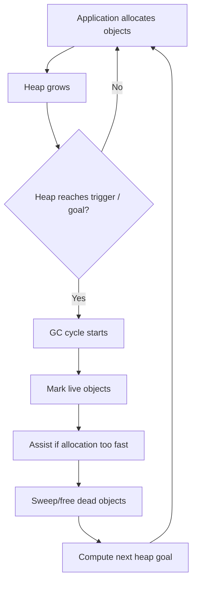
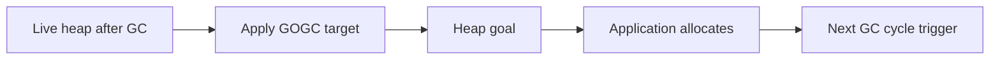
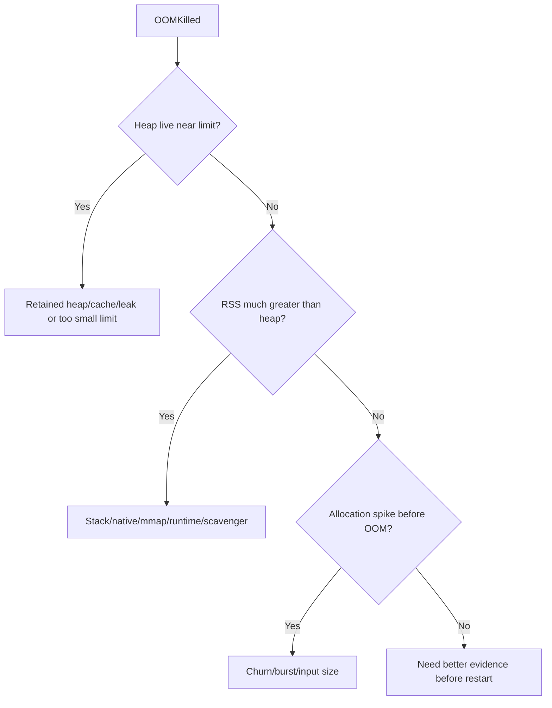
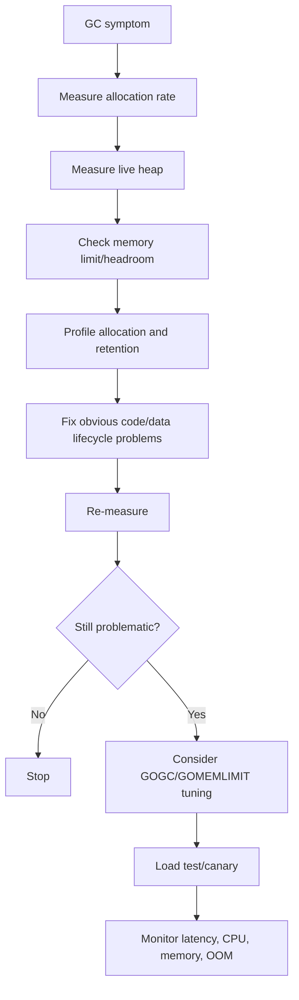

# learn-go-logging-observability-profiling-troubleshooting-part-015.md

# Part 015 — GC Observability in Go 1.26

> Seri: `learn-go-logging-observability-profiling-troubleshooting`  
> Bagian: `015 / 032`  
> Fokus: Go garbage collector observability, GC metrics, `GOGC`, `GOMEMLIMIT`, Green Tea GC, GC pressure troubleshooting  
> Target pembaca: Java software engineer yang ingin memahami GC Go dari sudut pandang production operations dan performance engineering

---

## 0. Posisi Bagian Ini dalam Seri

Part 014 membahas memory profiling:

- retained heap,
- allocation churn,
- heap `inuse_space`,
- heap `alloc_space`,
- RSS vs Go heap,
- OOMKilled,
- memory leak patterns,
- allocation forensics.

Bagian ini fokus pada mekanisme runtime yang sangat terkait:

```text
Garbage Collector
```

Di Go, GC bukan sekadar "background cleanup". GC adalah bagian dari sistem kontrol runtime yang terus menyeimbangkan:

- throughput,
- latency,
- memory footprint,
- CPU overhead,
- heap growth,
- allocation rate,
- container limit,
- live object graph.

Go 1.26 relevan karena Green Tea GC menjadi default. Ini memengaruhi cara kita membaca dan mengharapkan perilaku GC modern, terutama pada workload dengan banyak small objects dan kebutuhan CPU scalability.

---

## 1. Core Thesis

**GC problem hampir selalu adalah symptom dari allocation behavior, live heap behavior, memory limit behavior, atau workload shape. Jangan tuning GC sebelum memahami apa yang membuat GC bekerja.**

Kalimat yang sering salah:

```text
"GC tinggi, turunkan/naikkan GOGC."
```

Kalimat yang lebih benar:

```text
"GC tinggi. Apakah karena allocation rate naik, live heap naik, heap goal terlalu kecil, memory limit terlalu ketat, pointer graph terlalu besar, atau workload berubah?"
```

GC tuning bisa membantu, tetapi biasanya bukan root cause pertama.

---

## 2. Go GC Mental Model

Go memakai garbage collector concurrent, non-generational historically, low-latency oriented, dengan desain yang berusaha menjaga pause time kecil sambil membatasi heap growth.

Mental model sederhana:



GC tidak berjalan dalam vacuum.

GC work dipicu oleh:

- seberapa cepat aplikasi allocate,
- seberapa besar live heap,
- seberapa banyak pointer harus discan,
- target heap growth (`GOGC`),
- memory limit (`GOMEMLIMIT`),
- available CPU,
- runtime pacing.

---

## 3. Key Terms

| Term | Meaning |
|---|---|
| Allocation rate | Bytes/objects allocated per second |
| Live heap | Heap objects reachable after GC |
| Heap goal | Target heap size for next cycle |
| GC cycle | One complete collect process |
| Mark | Identify live objects |
| Sweep | Reclaim dead object memory |
| Pause | Stop-the-world phase, usually short |
| Mark assist | Application goroutine helps GC marking when allocating fast |
| GC CPU | CPU consumed by GC work |
| Scavenger | Runtime returns unused memory pages to OS |
| `GOGC` | GC target percentage based on live heap |
| `GOMEMLIMIT` | Runtime memory limit target |
| Pointer graph | Object graph GC must traverse |

---

## 4. Java Engineer Mapping

| Java/JVM Concept | Go Concept | Difference |
|---|---|---|
| Young generation | No traditional generational GC in old Go mental model; Go 1.26 Green Tea changes locality/scanning internals but not Java-like tuning surface | Fewer knobs |
| Old generation | Live heap/object graph | No explicit old gen tuning |
| GC logs | `gctrace`, runtime metrics | Go emphasizes runtime metrics and profiles |
| Heap dump dominator tree | Heap profile allocation attribution | Not full object graph |
| Stop-the-world pause | STW phases exist but designed short | Most marking concurrent |
| `-Xmx` | container limit + `GOMEMLIMIT` | Not exactly equivalent |
| GC tuning flags | `GOGC`, `GOMEMLIMIT`, runtime behavior | Much smaller tuning surface |
| Allocation profiler | heap `alloc_space`, CPU `mallocgc`, benchmarks | Go profiler integrated with toolchain |

Important mindset shift:

```text
In Java, GC tuning may involve collector choice, generations, heap regions, pause targets.
In Go, most production GC work starts from reducing allocation rate, controlling live heap, and setting memory limits sensibly.
```

---

## 5. Why GC Uses CPU

GC uses CPU mainly to:

1. scan object graph,
2. mark reachable objects,
3. coordinate with mutator,
4. perform assists when allocation is too fast,
5. sweep/reclaim memory,
6. maintain allocator metadata,
7. manage heap goals and pacing.

If CPU profile shows:

```text
runtime.gcBgMarkWorker
runtime.scanobject
runtime.mallocgc
```

You must ask:

- Are we allocating too much?
- Is live heap too large?
- Are objects pointer-rich?
- Did response size or batch size grow?
- Is a cache retaining too many objects?
- Is `GOMEMLIMIT` forcing more frequent GC?
- Is `GOGC` too low?
- Is container CPU throttled?

---

## 6. Allocation Rate: The Primary GC Driver

Allocation rate means how fast application creates heap objects.

High allocation rate causes:

- more GC cycles,
- more allocator work,
- more GC CPU,
- potential mark assist,
- higher latency under pressure.

Example high-churn code:

```go
for _, row := range rows {
	dto := map[string]any{
		"id": row.ID,
		"name": row.Name,
	}
	out = append(out, dto)
}
```

This may create:

- map object per row,
- boxed values,
- strings/conversions,
- interface allocations,
- JSON reflection work.

Better:

```go
type RowDTO struct {
	ID   int64  `json:"id"`
	Name string `json:"name"`
}

out := make([]RowDTO, 0, len(rows))
for _, row := range rows {
	out = append(out, RowDTO{
		ID:   row.ID,
		Name: row.Name,
	})
}
```

Not because "struct is always faster", but because this reduces dynamic allocation/object churn in a hot path.

---

## 7. Live Heap: What GC Must Preserve

Live heap is memory still reachable after GC.

High live heap means:

- GC has more object graph to traverse,
- memory footprint larger,
- heap goal larger unless constrained,
- pointer scanning can cost CPU,
- OOM risk in containers.

Common causes:

- unbounded cache,
- large map,
- buffered queue,
- retained slices,
- long-lived request data,
- goroutine leak,
- telemetry exporter backlog,
- huge batch in memory,
- pointer-rich object graph.

Live heap is investigated with:

```bash
go tool pprof -sample_index=inuse_space ./app heap-gc1.pb.gz
```

and runtime metrics over time.

---

## 8. Heap Goal

GC does not run only when heap is "full".

It uses pacing and heap goal.

Simplified model:

```text
Next heap goal ≈ live heap + allowed growth
```

`GOGC` influences allowed growth.

If live heap after GC is 500 MiB and `GOGC=100`, rough target may allow heap to grow toward about 1000 MiB before next cycle, subject to runtime behavior and memory limit.

If `GOGC=50`, rough target may be around 750 MiB.

If `GOGC=200`, rough target may be around 1500 MiB.

This is simplified, but useful.



---

## 9. `GOGC`

`GOGC` controls target heap growth relative to live heap.

### 9.1 Lower `GOGC`

Effects:

- lower memory footprint,
- more frequent GC,
- more GC CPU,
- possible lower latency if memory pressure was problem,
- possible higher latency if GC CPU/assist becomes problem.

### 9.2 Higher `GOGC`

Effects:

- higher memory footprint,
- less frequent GC,
- lower GC CPU up to a point,
- possible better throughput,
- higher OOM risk in container,
- longer object lifetime before collection.

### 9.3 `GOGC=off`

Disables GC target mechanism, but not usually appropriate for server production except special controlled cases.

### 9.4 Bad Tuning Pattern

```text
Memory high -> set GOGC lower -> GC CPU high -> set GOGC higher -> OOM
```

This happens when root cause is unbounded retention or allocation churn.

Fix code/data lifecycle first.

---

## 10. `GOMEMLIMIT`

`GOMEMLIMIT` tells Go runtime to target a memory limit for runtime-managed memory.

It is especially relevant in containers.

But it is not identical to Kubernetes memory limit.

Container memory includes more than Go heap:

- stacks,
- runtime metadata,
- cgo/native memory,
- mmap,
- OS overhead,
- page cache/accounting,
- telemetry buffers,
- TLS buffers,
- etc.

### 10.1 Rule of Thumb

```text
GOMEMLIMIT should be lower than container memory limit.
```

Example:

```text
Container memory limit: 1024 MiB
Reasonable initial GOMEMLIMIT: 700-850 MiB depending on workload
```

You need headroom for non-heap memory.

### 10.2 Too High

If `GOMEMLIMIT` too close to container limit:

- OOM risk remains,
- non-heap memory can push RSS over limit,
- GC may not prevent OOM.

### 10.3 Too Low

If `GOMEMLIMIT` too low:

- GC cycles too frequent,
- mark assists increase,
- CPU overhead rises,
- latency worsens,
- throughput drops,
- application may thrash.

### 10.4 Diagnostic Question

When GC CPU is high and memory limit exists:

```text
Is the runtime being forced to stay below a limit that is too tight for the live heap + allocation rate?
```

If yes, reducing allocation or increasing container memory may be better than GC knob tweaking.

---

## 11. Green Tea GC in Go 1.26

Go 1.26 makes Green Tea GC the default.

At a high level, Green Tea GC is an evolution in Go GC implementation intended to improve locality and CPU scalability, especially around marking/scanning small objects.

Operationally, this means:

1. Some workloads may see lower GC CPU.
2. Some allocation-heavy workloads may behave better.
3. Existing `runtime/metrics`, heap profiles, and CPU profiles remain important.
4. You should not assume GC problems disappear.
5. You should re-baseline dashboards and performance tests after upgrading.

### 11.1 What Changes for Observability?

You still monitor:

- allocation rate,
- live heap,
- heap goal,
- GC cycles,
- GC CPU,
- pause time,
- heap objects,
- memory classes,
- goroutines,
- RSS.

But expected baselines may shift.

### 11.2 Upgrade Advice

After moving to Go 1.26:

1. compare CPU profiles before/after,
2. compare GC CPU,
3. compare allocation-heavy benchmarks,
4. compare p99 latency,
5. compare memory footprint,
6. compare OOM frequency,
7. compare runtime metrics dashboard.

Do not assume all improvements are due to GC. Compiler/runtime/library changes may also affect behavior.

---

## 12. GC Metrics to Watch

Important runtime metrics categories:

```text
/gc/heap/...
/gc/cycles/...
/memory/classes/...
/cpu/classes/gc/...
```

Common operational signals:

| Signal | Why It Matters |
|---|---|
| allocation bytes/sec | primary pressure input |
| heap live | retained memory |
| heap goal | next target/pressure |
| heap objects | object count and GC work |
| GC cycles/sec | frequency |
| GC CPU | cost of collection |
| pause duration | latency impact |
| stack memory | goroutine footprint |
| memory released | scavenger behavior |
| total RSS/working set | container OOM risk |

---

## 13. GC Dashboard Mental Model

A useful GC dashboard answers:

1. Is memory growing?
2. Is live heap growing or only RSS?
3. Is allocation rate growing?
4. Is GC running more often?
5. Is GC CPU rising?
6. Are pauses relevant to latency?
7. Is heap goal close to memory limit?
8. Is container memory near OOM?
9. Did this begin after deployment?
10. Which endpoint/job changed allocation behavior?

Recommended panels:

```text
- Container memory working set / limit
- Go heap live
- Go heap goal
- Allocation bytes/sec
- Heap objects
- GC cycles/sec
- GC CPU
- GC pause p50/p95/p99
- Goroutine count
- Stack memory
- Runtime memory classes
- CPU usage and throttling
- Request rate/latency/error
- Deployment markers
```

---

## 14. `gctrace`

Go can emit GC trace logs:

```bash
GODEBUG=gctrace=1
```

This prints GC events to stderr.

Use cases:

- local investigation,
- controlled staging debugging,
- understanding GC cycle behavior,
- correlating GC events with latency.

Production caution:

- can add log noise,
- not structured by default,
- may increase logging volume,
- should be used intentionally.

Modern production usually relies more on runtime metrics and profiles, but `gctrace` is still useful for low-level investigation.

---

## 15. Mark Assist

Mark assist occurs when application goroutines help GC marking because allocation is happening fast relative to GC progress.

Operationally, mark assist can appear as:

- latency increase,
- CPU time in GC-related runtime frames,
- throughput drop under allocation pressure,
- application goroutines spending time helping GC.

CPU profile may show:

```text
runtime.gcAssistAlloc
runtime.scanobject
runtime.greyobject
runtime.mallocgc
```

Interpretation:

```text
Application allocation rate is high enough that mutator is paying GC debt.
```

Fix direction:

- reduce allocation rate,
- reduce live heap,
- reduce pointer graph,
- adjust memory limit/GC target only after understanding allocation behavior.

---

## 16. Pause Time vs GC CPU

Many engineers over-focus on pause time.

Go GC aims for low pauses, so in many services:

- pause time is small,
- GC CPU is more important,
- mark assist latency can matter,
- allocation churn hurts throughput even without long STW pauses.

Distinguish:

| Metric | Meaning |
|---|---|
| Pause duration | stop-the-world phase latency |
| GC CPU | total CPU spent by GC work |
| Mark assist | app goroutine participates in GC |
| Allocation latency | cost of allocation/allocator/assist |
| Heap growth | memory footprint |

A service can have low pause but still suffer from high GC CPU.

---

## 17. GC and Tail Latency

GC can affect tail latency through:

1. STW pause,
2. mark assist,
3. CPU contention with app work,
4. cache locality effects,
5. memory pressure,
6. container CPU throttling,
7. allocation latency,
8. heap growth causing OOM/restart.

Tail latency investigation should correlate:

- request p99,
- GC cycles,
- GC CPU,
- allocation rate,
- CPU throttling,
- runtime trace,
- endpoint traces,
- CPU profile.

If p99 spike aligns with allocation burst and GC CPU increase, GC is part of the story.

If p99 spike occurs with CPU low and GC normal, look elsewhere.

---

## 18. GC and CPU Profile

CPU profile can reveal GC contribution.

Common frames:

```text
runtime.mallocgc
runtime.gcBgMarkWorker
runtime.scanobject
runtime.gcAssistAlloc
runtime.findObject
runtime.greyobject
```

Interpretation patterns:

### 18.1 `mallocgc` High

Allocation itself is expensive.

Next:

- heap `alloc_space`,
- benchmark `-benchmem`,
- find allocation path.

### 18.2 `gcBgMarkWorker` High

GC background marking consumes CPU.

Next:

- live heap,
- allocation rate,
- pointer-rich object graph.

### 18.3 `gcAssistAlloc` High

Application goroutines are helping GC.

Next:

- allocation burst,
- memory limit too tight,
- GOGC too low,
- live heap too large.

### 18.4 `scanobject` High

GC scanning object graph.

Next:

- pointer-rich data structures,
- object count,
- retained heap,
- cache/map/queue.

---

## 19. GC and Heap Profile

Heap profile explains what GC must deal with.

Use:

```bash
go tool pprof -sample_index=inuse_space ./app heap-gc1.pb.gz
go tool pprof -sample_index=inuse_objects ./app heap-gc1.pb.gz
go tool pprof -sample_index=alloc_space ./app heap.pb.gz
go tool pprof -sample_index=alloc_objects ./app heap.pb.gz
```

Mapping:

| GC Symptom | Heap View |
|---|---|
| GC CPU high, live heap high | `inuse_space`, `inuse_objects` |
| GC CPU high, live heap moderate | `alloc_space`, `alloc_objects` |
| `scanobject` high | `inuse_objects`, pointer-heavy structures |
| `mallocgc` high | `alloc_space`, `alloc_objects` |
| OOM risk | `inuse_space` + RSS/container metrics |

---

## 20. GC and Runtime Trace

`runtime/trace` can show GC events in execution timeline.

Useful when:

- latency spike needs timeline,
- scheduler/GC interaction suspected,
- mark assist suspected,
- CPU profile aggregate is insufficient,
- you need to see when GC happened relative to goroutine execution.

Use:

```bash
curl -o trace-10s.out "http://localhost:6060/debug/pprof/trace?seconds=10"
go tool trace trace-10s.out
```

Trace duration should be short and targeted.

---

## 21. GC and Container Memory

In Kubernetes, GC cannot save you from all OOMs if memory limit is too tight or non-heap memory is large.

OOM can happen even when Go heap seems under control.

Check:

- container working set,
- Go heap live,
- memory classes,
- stack memory,
- goroutine count,
- cgo/native,
- mmap,
- telemetry buffers,
- kernel OOM events,
- memory limit.

Decision:



---

## 22. Tuning Workflow

Do not start with knobs.

Use this order:



---

## 23. When to Tune `GOGC`

Consider tuning `GOGC` when:

1. live heap is understood,
2. allocation patterns are acceptable,
3. memory footprint vs CPU trade-off is explicit,
4. container memory has headroom constraints,
5. latency/throughput target requires trade-off,
6. load test validates behavior.

### 23.1 Lower `GOGC` Scenario

Problem:

- memory footprint too high,
- OOM risk,
- GC CPU still acceptable,
- live heap stable.

Action:

- lower `GOGC` moderately,
- monitor GC CPU and p99 latency.

### 23.2 Higher `GOGC` Scenario

Problem:

- GC CPU high,
- memory headroom available,
- live heap stable,
- allocation rate acceptable but GC too frequent.

Action:

- raise `GOGC`,
- monitor memory footprint and OOM risk.

---

## 24. When to Tune `GOMEMLIMIT`

Tune `GOMEMLIMIT` when:

1. running in memory-limited environment,
2. Go runtime memory should stay below safe threshold,
3. non-heap headroom is understood,
4. OOM risk needs runtime cooperation,
5. you can validate under production-like load.

Bad:

```text
Container limit 1GiB, GOMEMLIMIT 1GiB
```

Better:

```text
Container limit 1GiB, GOMEMLIMIT 750-850MiB depending on non-heap memory and workload.
```

But exact value must be measured.

---

## 25. GC Thrashing

GC thrashing means runtime spends too much effort collecting with too little progress.

Symptoms:

- GC cycles very frequent,
- GC CPU high,
- throughput drops,
- p99 latency worsens,
- heap goal constrained,
- allocation continues fast,
- memory limit tight,
- live heap close to limit.

Causes:

1. `GOMEMLIMIT` too low,
2. container memory too small,
3. live heap too large,
4. allocation rate too high,
5. cache/queue unbounded,
6. batch size too big,
7. pointer-rich heap,
8. leak.

Mitigations:

- reduce live heap,
- reduce allocation rate,
- bound caches/queues,
- reduce batch size,
- increase memory limit,
- adjust `GOMEMLIMIT`,
- adjust `GOGC`,
- shed load,
- rollback allocation-heavy release.

---

## 26. Allocation Burst

Allocation burst can trigger GC pressure even if steady-state is normal.

Examples:

- report export,
- large JSON decode,
- batch import,
- cache warmup,
- startup config load,
- full-table scan,
- queue replay,
- trace/log burst.

Signals:

- allocation rate spike,
- heap goal reached quickly,
- GC cycles cluster,
- p99 spike,
- CPU spike.

Mitigation:

- streaming,
- chunking,
- pagination,
- batch size limit,
- backpressure,
- warmup control,
- concurrency limit,
- request size limit.

---

## 27. GC and Startup

Startup can have unusual GC behavior:

- config loading,
- dependency initialization,
- cache warmup,
- template parsing,
- route registration,
- metadata loading,
- telemetry setup.

Do not confuse startup allocation with steady-state leak.

Dashboard should separate:

- startup phase,
- warmup phase,
- steady-state phase.

Readiness should not be true before warmup if service would receive traffic and allocate heavily while not ready.

---

## 28. GC and Batch Jobs

Batch jobs may intentionally use memory differently from request/response servers.

Questions:

1. Is memory bounded per batch?
2. Are records streamed or fully materialized?
3. Is output buffered entirely?
4. Is concurrency bounded?
5. Is per-record allocation high?
6. Is checkpointing retaining old data?
7. Are failed records stored unbounded?
8. Is logging per record excessive?

For batch jobs, tune:

- chunk size,
- worker count,
- buffering,
- streaming,
- output flush,
- retry storage,
- GC/memory limit after profiling.

---

## 29. GC and Caches

Caches intentionally increase live heap.

A cache is safe only if:

- bounded by size/count,
- has TTL/eviction,
- key cardinality controlled,
- value size known,
- metrics exposed,
- memory budget defined,
- behavior under dependency failure known.

Cache metrics:

```text
cache_entries
cache_bytes_estimated
cache_evictions_total
cache_hits_total
cache_misses_total
cache_load_errors_total
cache_admission_rejections_total
```

If heap profile shows cache, ask:

```text
Is this expected retained memory or leak-like unbounded retention?
```

---

## 30. GC and Queues

Buffered queues hold references.

A large queue may look like heap growth.

Questions:

1. queue depth?
2. item size?
3. consumer rate?
4. producer rate?
5. downstream slow?
6. retry loop?
7. queue bounded?
8. drop/backpressure policy?

If queue item holds full request payload, memory can explode.

Better:

- store IDs/metadata,
- externalize payload,
- limit queue,
- backpressure,
- reject early,
- observe queue depth and wait time.

---

## 31. GC and Telemetry

Observability can create GC pressure:

- many log attrs,
- high-cardinality metrics,
- spans per inner loop,
- large span events,
- exporter queue backlog,
- JSON log encoding,
- string formatting,
- redaction allocation.

Check CPU/heap profile for:

```text
log/slog
encoding/json
go.opentelemetry.io
prometheus
attribute construction
fmt
strings
```

If telemetry becomes hot path:

- reduce cardinality,
- reduce span events,
- sample logs/traces,
- avoid expensive attr construction,
- move detailed diagnostics to on-demand profile/debug,
- benchmark instrumentation.

---

## 32. Case Study 1: GC CPU High After DTO Mapper Change

### Symptom

- CPU +70% after release.
- p99 +40%.
- Heap live stable.
- GC CPU increased.
- OOM not occurring.

### Evidence

CPU profile:

```text
runtime.mallocgc
runtime.gcBgMarkWorker
reflect.Value.Interface
myapp/mapper.Map
```

Heap `alloc_space`:

```text
myapp/mapper.Map 48%
reflect.*         20%
```

Heap `inuse_space`:

```text
No significant growth
```

### Diagnosis

Not leak. Allocation churn.

New reflection mapper creates many temporary objects per request. GC works harder to collect short-lived objects.

### Fix

- typed mapping for hot DTO path,
- preallocate output slices,
- avoid `map[string]any`,
- add benchmark with `-benchmem`.

### Lesson

GC CPU high does not mean retained memory leak.

---

## 33. Case Study 2: GOMEMLIMIT Too Tight

### Symptom

- service memory below container limit,
- CPU high,
- latency high,
- GC cycles very frequent after setting `GOMEMLIMIT`.

### Evidence

- heap live 700MiB,
- `GOMEMLIMIT` 768MiB,
- container limit 1GiB,
- allocation rate high,
- GC CPU high,
- mark assist visible.

### Diagnosis

Runtime has too little room between live heap and memory limit. It collects aggressively.

### Fix

Options:

1. reduce live heap,
2. reduce allocation rate,
3. increase container memory,
4. raise `GOMEMLIMIT` while preserving headroom,
5. reduce batch/concurrency.

### Lesson

Memory limit must account for live heap and allocation behavior, not just container size.

---

## 34. Case Study 3: Cache Causes Live Heap Growth

### Symptom

- heap live grows steadily.
- GC CPU gradually increases.
- RSS near OOM.
- GC cannot reclaim.

Heap `inuse_space`:

```text
myapp/cache.(*Store).Set 65%
```

Metrics:

- cache entries increasing,
- no eviction.

### Diagnosis

Unbounded cache.

### Fix

- max entries/bytes,
- TTL,
- eviction,
- cache metrics,
- reject high-cardinality keys,
- avoid caching error responses.

### Lesson

GC cannot collect objects you still reference.

---

## 35. Case Study 4: Batch Import Allocation Burst

### Symptom

- nightly batch causes latency spike in same pod.
- CPU and GC CPU spike.
- memory rises then falls.
- no leak.

Evidence:

- allocation rate huge during import,
- heap after GC returns near baseline,
- CPU profile shows JSON/XML decode and allocation,
- trace shows batch and HTTP sharing CPU.

Fix:

- isolate batch worker,
- limit concurrency,
- stream decode,
- smaller chunks,
- separate node pool or schedule,
- reduce temporary allocations.

Lesson:

Transient allocation burst can hurt co-located latency-sensitive traffic.

---

## 36. Practical GC Investigation Commands

### 36.1 CPU Profile

```bash
curl -o cpu-30s.pb.gz "http://localhost:6060/debug/pprof/profile?seconds=30"
go tool pprof -http=:0 ./app cpu-30s.pb.gz
```

Look for:

```text
runtime.mallocgc
runtime.gcBgMarkWorker
runtime.gcAssistAlloc
runtime.scanobject
```

### 36.2 Heap Retention

```bash
curl -o heap-gc1.pb.gz "http://localhost:6060/debug/pprof/heap?gc=1"
go tool pprof -sample_index=inuse_space -http=:0 ./app heap-gc1.pb.gz
```

### 36.3 Allocation Churn

```bash
curl -o allocs.pb.gz "http://localhost:6060/debug/pprof/allocs"
go tool pprof -sample_index=alloc_space -http=:0 ./app allocs.pb.gz
```

### 36.4 Goroutine Profile

```bash
curl -o goroutine-debug2.txt "http://localhost:6060/debug/pprof/goroutine?debug=2"
```

### 36.5 Runtime Trace

```bash
curl -o trace-10s.out "http://localhost:6060/debug/pprof/trace?seconds=10"
go tool trace trace-10s.out
```

### 36.6 Local GC Trace

```bash
GODEBUG=gctrace=1 ./app
```

---

## 37. GC Optimization Checklist

```text
[ ] Is allocation rate measured?
[ ] Is live heap measured?
[ ] Is heap goal observed?
[ ] Is GC CPU measured?
[ ] Are pauses actually significant?
[ ] Is mark assist visible?
[ ] Is container CPU throttling present?
[ ] Is container memory near limit?
[ ] Is GOMEMLIMIT set appropriately?
[ ] Is GOGC default or customized?
[ ] Is heap inuse profile captured?
[ ] Is alloc_space profile captured?
[ ] Are caches/queues bounded?
[ ] Are goroutines leaking?
[ ] Are payloads/request sizes bounded?
[ ] Is telemetry causing allocation?
[ ] Was there a deployment/config/data-shape change?
```

---

## 38. Tuning Checklist

Before changing `GOGC` or `GOMEMLIMIT`:

```text
[ ] Root cause category known: retention/churn/limit/burst.
[ ] Workload representative.
[ ] Before metrics captured.
[ ] Before CPU/heap profile captured.
[ ] Candidate value selected with hypothesis.
[ ] Load test or canary plan exists.
[ ] p99 latency monitored.
[ ] GC CPU monitored.
[ ] RSS and OOM monitored.
[ ] Rollback plan exists.
[ ] Result documented.
```

---

## 39. Exercises

### Exercise 1 — Allocation Churn and GC CPU

Create benchmark with heavy `map[string]any` DTO creation.

Tasks:

1. run `-benchmem`,
2. capture CPU profile,
3. capture `alloc_space`,
4. rewrite with typed DTO,
5. compare:
   - ns/op,
   - B/op,
   - allocs/op,
   - GC-related CPU frames.

### Exercise 2 — Live Heap Cache

Create unbounded cache service.

Tasks:

1. generate high-cardinality traffic,
2. watch heap live,
3. capture `heap?gc=1`,
4. add TTL/max size,
5. verify live heap stabilizes.

### Exercise 3 — `GOGC` Trade-off

Run workload with different `GOGC` values:

```bash
GOGC=50
GOGC=100
GOGC=200
```

Measure:

- memory footprint,
- GC CPU,
- latency,
- throughput.

Explain trade-off.

### Exercise 4 — `GOMEMLIMIT` in Container

Run service with container memory limit.

Set different `GOMEMLIMIT` values.

Measure:

- RSS,
- heap live,
- GC cycles,
- CPU,
- latency,
- OOM risk.

Explain why setting it equal to container limit is unsafe.

### Exercise 5 — Runtime Trace Around GC

Capture `runtime/trace` during allocation-heavy workload.

Tasks:

1. find GC events,
2. correlate with latency,
3. inspect goroutine scheduling,
4. compare with CPU profile.

---

## 40. What Good Looks Like

Anda memahami GC Go secara production-grade jika mampu:

1. membedakan allocation rate, live heap, heap goal, RSS,
2. membaca GC CPU vs pause vs mark assist,
3. memakai heap profile untuk menjelaskan GC pressure,
4. tidak tuning `GOGC` sebelum memahami allocation/retention,
5. mengatur `GOMEMLIMIT` dengan container headroom,
6. mengenali GC thrashing,
7. mengaitkan CPU profile GC frames dengan heap alloc/inuse profiles,
8. membedakan leak dari churn,
9. membuat dashboard GC yang menjawab pertanyaan operasional,
10. memvalidasi tuning dengan before/after metrics dan profiles.

---

## 41. Summary

Go GC adalah sistem kontrol antara:

```text
allocation rate
live heap
heap goal
CPU
latency
memory footprint
container limit
```

Jika GC terlihat sebagai masalah, jangan langsung ubah knob.

Langkah benar:

1. ukur allocation rate,
2. ukur live heap,
3. cek RSS/container limit,
4. cek GC CPU/pause/assist,
5. ambil CPU profile,
6. ambil heap `alloc_space`,
7. ambil heap `inuse_space`,
8. cek goroutine/stack,
9. identifikasi retention/churn/burst/limit,
10. perbaiki lifecycle/data shape,
11. baru pertimbangkan `GOGC`/`GOMEMLIMIT`.

GC yang sehat bukan berarti GC tidak bekerja.

GC yang sehat berarti runtime menjaga memory dan latency dalam batas yang dapat diterima untuk workload Anda.

---

## 42. Status Seri

Bagian ini adalah:

```text
learn-go-logging-observability-profiling-troubleshooting-part-015.md
```

Status:

```text
Part 015 dari 032
Seri belum selesai
```

Bagian berikutnya:

```text
learn-go-logging-observability-profiling-troubleshooting-part-016.md
```

Topik berikutnya:

```text
Goroutine Profiling and Leak Detection
```

<!-- NAVIGATION_FOOTER -->
<div class="page-nav">
<a href="./learn-go-logging-observability-profiling-troubleshooting-part-014.md">⬅️ Part 014 — Memory Profiling, Heap Growth, and Allocation Forensics</a>
<a href="./index.md">📚 Kategori</a>
<a href="../../index.md">🏠 Home</a>
<a href="./learn-go-logging-observability-profiling-troubleshooting-part-016.md">Part 016 — Goroutine Profiling and Leak Detection ➡️</a>
</div>
