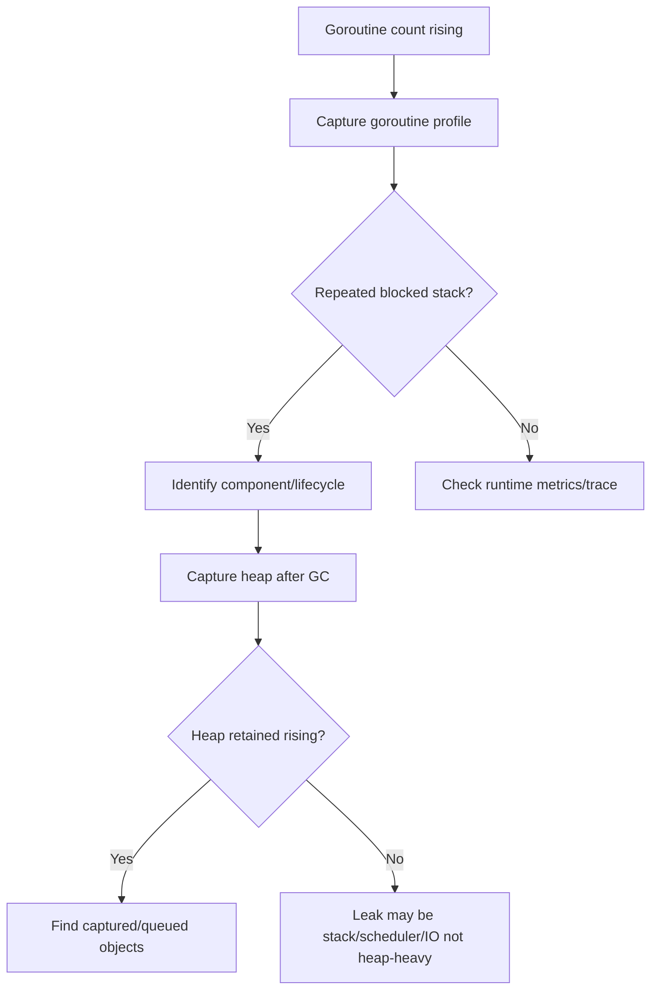
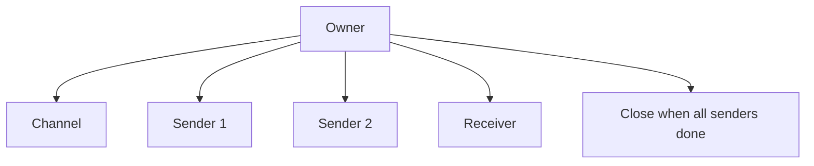

# learn-go-logging-observability-profiling-troubleshooting-part-016.md

# Part 016 — Goroutine Profiling and Leak Detection

> Seri: `learn-go-logging-observability-profiling-troubleshooting`  
> Bagian: `016 / 032`  
> Fokus: goroutine profile, goroutine leak, stack forensics, blocked goroutine diagnosis, lifecycle observability  
> Target pembaca: Java software engineer yang ingin memahami goroutine runtime failures secara production-grade

---

## 0. Posisi Bagian Ini dalam Seri

Bagian sebelumnya membahas:

- `pprof` fundamentals,
- `net/http/pprof` in production,
- CPU profiling,
- memory profiling,
- GC observability.

Bagian ini fokus pada salah satu diagnostic artifact paling penting di Go:

```text
goroutine profile
```

Goroutine profile sering menjadi "thread dump"-nya Go, tetapi analogi itu tidak sempurna.

Di Java, thread dump biasanya memperlihatkan puluhan sampai ratusan thread OS/JVM.

Di Go, goroutine profile bisa memperlihatkan:

- puluhan goroutine normal,
- ribuan goroutine saat load tinggi,
- ratusan ribu goroutine saat leak,
- goroutine internal runtime,
- goroutine HTTP transport,
- worker goroutine,
- blocked channel operations,
- timers,
- context cancellation path,
- queue saturation,
- shutdown failure.

Goroutine lebih murah daripada OS thread, tetapi bukan gratis. Goroutine leak bisa menjadi:

- memory leak,
- latency problem,
- shutdown problem,
- queue/backpressure problem,
- file descriptor/connection leak,
- GC pressure,
- incident root cause.

---

## 1. Core Thesis

**Goroutine profile bukan hanya daftar stack. Goroutine profile adalah snapshot lifecycle state dari concurrent system Anda.**

Engineer yang lemah membaca goroutine profile seperti ini:

```text
Jumlah goroutine banyak. Berarti leak.
```

Engineer yang kuat membaca seperti ini:

```text
Jumlah goroutine naik dari baseline 800 ke 48.000.
Sebagian besar stack berada di channel send ke audit queue.
Queue depth juga penuh.
Downstream audit writer stuck.
Request goroutine tertahan dan menahan request metadata.
Ini bukan sekadar banyak goroutine; ini backpressure failure dan lifecycle leak.
```

---

## 2. Goroutine Profile vs Java Thread Dump

| Java Thread Dump | Go Goroutine Profile |
|---|---|
| OS/JVM thread oriented | goroutine oriented |
| biasanya jumlah thread lebih kecil | goroutine bisa sangat banyak |
| thread state: RUNNABLE/BLOCKED/WAITING | goroutine state: running/runnable/waiting/IO wait/chan send/chan receive/select/etc |
| lock monitor sering terlihat | channel/select/context/worker patterns sering dominan |
| thread stack sering langsung map ke request thread | goroutine bisa spawned/fan-out/worker/background |
| deadlock detection sering thread-centric | Go deadlock/leak sering lifecycle/cancellation-centric |
| thread pool saturation common | goroutine fan-out/queue/channel saturation common |

Analogi "goroutine profile = thread dump" membantu sebagai awal, tetapi berbahaya bila terlalu literal.

Goroutine bukan request thread.

Satu request bisa membuat beberapa goroutine.

Satu goroutine bisa hidup lebih lama dari request.

Background goroutine bisa menahan memory tanpa terlihat dari request trace.

---

## 3. Apa yang Diberikan Goroutine Profile

Goroutine profile memberi snapshot stack goroutine pada saat capture.

Ia menjawab:

1. goroutine sedang berada di stack mana?
2. state goroutine apa?
3. apakah banyak goroutine punya stack yang sama?
4. apakah goroutine blocked pada channel send/receive?
5. apakah goroutine blocked pada IO?
6. apakah worker sedang menunggu job atau stuck processing?
7. apakah shutdown menunggu goroutine yang tidak keluar?
8. apakah goroutine count naik karena leak atau load?
9. apakah goroutine menahan reference besar?
10. apakah pola stack cocok dengan symptom?

Ia tidak langsung menjawab:

- siapa membuat goroutine jika stack creation tidak direkam,
- berapa lama goroutine sudah hidup,
- request ID mana yang membuat goroutine,
- object graph lengkap yang ditahan,
- causal chain lintas service.

Untuk itu perlu:

- metrics,
- logs,
- traces,
- runtime trace,
- heap profile,
- code instrumentation,
- lifecycle logging,
- tests.

---

## 4. Capturing Goroutine Profile

### 4.1 Binary Profile

```bash
curl -o goroutine.pb.gz "http://localhost:6060/debug/pprof/goroutine"
go tool pprof ./app goroutine.pb.gz
```

Binary profile berguna untuk:

- grouped analysis di pprof,
- integration dengan pprof UI,
- count/cumulative stack analysis.

### 4.2 Debug Text

```bash
curl -o goroutine-debug2.txt "http://localhost:6060/debug/pprof/goroutine?debug=2"
```

Debug text sering paling cepat dibaca saat incident.

Output akan berisi stack per goroutine.

Contoh state:

```text
goroutine 12345 [chan send]:
myapp/internal/audit.(*Writer).Write(...)
myapp/internal/handler.(*Handler).ServeHTTP(...)
```

### 4.3 Debug 1 vs Debug 2

Umumnya:

- `debug=1` memberi ringkasan.
- `debug=2` memberi stack lebih detail.

Saat incident, `debug=2` sering lebih berguna, tetapi file bisa sangat besar jika goroutine sangat banyak.

---

## 5. Baseline Goroutine Count

Sebelum menyebut leak, Anda perlu baseline.

Service bisa punya baseline berbeda.

Contoh:

| Service Type | Baseline Goroutine |
|---|---:|
| simple HTTP service | 20–200 |
| HTTP + DB + telemetry | 100–1000 |
| high-concurrency gateway | 1000–20000 |
| worker/consumer service | tergantung worker count |
| long-poll/websocket service | bisa sangat tinggi by design |

Yang penting bukan angka absolut saja.

Yang penting:

1. apakah naik terus?
2. apakah turun setelah traffic turun?
3. apakah proporsional terhadap active request/connection?
4. apakah stuck saat shutdown?
5. apakah stack dominan abnormal?
6. apakah memory ikut naik?
7. apakah latency ikut naik?
8. apakah queue/dependency saturated?

---

## 6. Goroutine Count Metrics

Expose goroutine count dari runtime metrics atau Prometheus Go collector.

Sinyal penting:

```text
goroutines_total_current
```

Konsep alert:

```text
goroutine count grows monotonically for 15-30 minutes
```

Lebih baik daripada alert statis:

```text
goroutine_count > 1000
```

Karena 1000 bisa normal untuk gateway, tetapi abnormal untuk CLI worker kecil.

Dashboard harus menunjukkan:

- goroutine count,
- request rate,
- active connections,
- queue depth,
- worker count,
- memory/stack memory,
- latency,
- deployment markers.

---

## 7. Reading Goroutine States

Common states in stack dump:

| State | Meaning |
|---|---|
| `running` | currently executing |
| `runnable` | ready to run |
| `IO wait` | waiting for network/file IO |
| `chan send` | blocked sending to channel |
| `chan receive` | blocked receiving from channel |
| `select` | waiting in select |
| `semacquire` | waiting on mutex/semaphore/WaitGroup-like primitive |
| `sleep` | sleeping/timer |
| `syscall` | in syscall |
| `GC assist wait` | related to GC assist |
| `finalizer wait` | runtime finalizer goroutine |

State is symptom, not root cause.

Example:

```text
[chan send]
```

Could mean:

- receiver is gone,
- buffered channel full,
- consumer slow,
- downstream stuck,
- shutdown order wrong,
- no select on context,
- producer rate exceeds consumer rate.

---

## 8. Grouping Stack Patterns

In large dumps, do not read goroutine one by one.

Group by stack signature.

Manual approach:

1. find repeated top frames,
2. count similar stack groups,
3. identify dominant group,
4. map group to component,
5. compare with expected baseline.

Example groups:

```text
30,000 goroutines:
  myapp/audit.(*AsyncWriter).Write
  myapp/handler.(*Handler).ServeHTTP
  state: chan send

4,000 goroutines:
  net/http.(*persistConn).readLoop
  state: IO wait

200 goroutines:
  database/sql.(*DB).connectionOpener
  state: select

50 goroutines:
  myapp/worker.(*Pool).run
  state: chan receive
```

Interpretation:

- 4,000 HTTP read loops may be high but maybe caused by outbound connection growth.
- 30,000 blocked audit writes is likely incident root.
- 50 workers waiting is normal if idle.

---

## 9. Common Pattern: Channel Send Leak

### 9.1 Bad Pattern

```go
func (w *Writer) Write(ctx context.Context, event Event) error {
	w.ch <- event
	return nil
}
```

If channel is full or consumer stopped, sender blocks forever.

### 9.2 Evidence

Goroutine profile:

```text
goroutine 12345 [chan send]:
myapp/audit.(*Writer).Write(...)
myapp/http.(*Handler).ServeHTTP(...)
```

Metrics:

- audit queue depth full,
- request latency high,
- goroutine count rising,
- memory rising.

### 9.3 Fix

```go
func (w *Writer) Write(ctx context.Context, event Event) error {
	select {
	case w.ch <- event:
		return nil
	case <-ctx.Done():
		return ctx.Err()
	case <-time.After(w.timeout):
		return ErrAuditQueueFull
	}
}
```

But this creates a timer per call. Better in hot path:

```go
timer := time.NewTimer(w.timeout)
defer timer.Stop()

select {
case w.ch <- event:
	return nil
case <-ctx.Done():
	return ctx.Err()
case <-timer.C:
	return ErrAuditQueueFull
}
```

Operational decision:

- block?
- timeout?
- drop?
- fail request?
- spill to disk?
- backpressure upstream?

This is not only code. It is product/operational semantics.

---

## 10. Common Pattern: Channel Receive Leak

### 10.1 Bad Pattern

```go
func startWorker(ch <-chan Job) {
	go func() {
		for {
			job := <-ch
			process(job)
		}
	}()
}
```

If channel is never closed and no context exists, worker may live forever.

For permanent service workers, this can be fine. For per-request/per-job goroutines, this is leak risk.

### 10.2 Better Pattern

```go
func startWorker(ctx context.Context, ch <-chan Job) {
	go func() {
		for {
			select {
			case <-ctx.Done():
				return
			case job, ok := <-ch:
				if !ok {
					return
				}
				process(job)
			}
		}
	}()
}
```

### 10.3 Evidence

```text
goroutine 999 [chan receive]:
myapp/startWorker.func1()
```

If thousands exist and should have ended, leak.

---

## 11. Common Pattern: Select Without Cancellation

### 11.1 Bad Pattern

```go
select {
case result := <-resultCh:
	return result
case err := <-errCh:
	return err
}
```

If neither channel receives, goroutine waits forever.

### 11.2 Better Pattern

```go
select {
case result := <-resultCh:
	return result, nil
case err := <-errCh:
	return Result{}, err
case <-ctx.Done():
	return Result{}, ctx.Err()
}
```

Rule:

```text
Any goroutine whose lifetime is bounded by a request/job must observe cancellation.
```

---

## 12. Common Pattern: Fan-Out Early Return Leak

### 12.1 Bad Pattern

```go
func query(ctx context.Context, backends []Backend) (Result, error) {
	results := make(chan Result)

	for _, b := range backends {
		go func(b Backend) {
			results <- b.Query(ctx)
		}(b)
	}

	return <-results, nil
}
```

Problem:

- first result returned,
- other goroutines may still try to send,
- unbuffered channel blocks,
- goroutines leak.

### 12.2 Better Pattern

Use cancellation and buffered channel sized to fan-out, or errgroup-like pattern.

```go
func query(ctx context.Context, backends []Backend) (Result, error) {
	ctx, cancel := context.WithCancel(ctx)
	defer cancel()

	results := make(chan Result, len(backends))

	for _, b := range backends {
		go func(b Backend) {
			select {
			case results <- b.Query(ctx):
			case <-ctx.Done():
			}
		}(b)
	}

	res := <-results
	cancel()
	return res, nil
}
```

This is simplified. Production version must handle errors, panic, wait, and bounded fan-out.

---

## 13. Common Pattern: Unbounded Goroutine Per Item

### 13.1 Bad Pattern

```go
for _, item := range items {
	go process(item)
}
```

If `items` can be large, this can create:

- goroutine explosion,
- memory spike,
- scheduler overhead,
- downstream overload,
- queue/connection exhaustion.

### 13.2 Better Pattern: Bounded Worker Pool

```go
func processAll(ctx context.Context, items []Item, workers int) error {
	jobs := make(chan Item)

	var wg sync.WaitGroup
	wg.Add(workers)

	for i := 0; i < workers; i++ {
		go func() {
			defer wg.Done()
			for {
				select {
				case <-ctx.Done():
					return
				case item, ok := <-jobs:
					if !ok {
						return
					}
					process(item)
				}
			}
		}()
	}

	for _, item := range items {
		select {
		case <-ctx.Done():
			close(jobs)
			wg.Wait()
			return ctx.Err()
		case jobs <- item:
		}
	}

	close(jobs)
	wg.Wait()
	return nil
}
```

Even this has edge cases. Production code should be carefully reviewed for cancellation and close semantics.

---

## 14. Common Pattern: Timer/Ticker Leak

### 14.1 `time.Tick` Pitfall

```go
for range time.Tick(time.Second) {
	doWork()
}
```

`time.Tick` cannot be stopped directly. For long-lived process global ticker it may be okay, but for dynamic lifecycle it can leak.

### 14.2 Better

```go
ticker := time.NewTicker(time.Second)
defer ticker.Stop()

for {
	select {
	case <-ctx.Done():
		return
	case <-ticker.C:
		doWork()
	}
}
```

### 14.3 Evidence

Goroutine profile:

```text
goroutine ... [select]:
myapp/scheduler.start.func1()
```

Metrics:

- goroutine count grows after repeated start/stop,
- memory grows,
- tickers continue running.

---

## 15. Common Pattern: HTTP Client Leak

### 15.1 Missing Body Close

Bad:

```go
resp, err := client.Do(req)
if err != nil {
	return err
}
body, err := io.ReadAll(resp.Body)
```

Better:

```go
resp, err := client.Do(req)
if err != nil {
	return err
}
defer resp.Body.Close()

body, err := io.ReadAll(resp.Body)
```

### 15.2 Evidence

Goroutine profile may show many:

```text
net/http.(*persistConn).readLoop
net/http.(*persistConn).writeLoop
```

Some are normal. Too many or steadily increasing may indicate connection leak or no reuse.

### 15.3 Root Causes

- body not closed,
- new `http.Transport` per request,
- no timeouts,
- stuck response body,
- downstream slow,
- connection pool limits wrong,
- not draining body when reuse desired.

---

## 16. Common Pattern: Context Not Propagated

### 16.1 Bad Pattern

```go
go func() {
	doWork(context.Background(), payload)
}()
```

This detaches work from request cancellation.

Maybe intended for background job. Often accidental.

### 16.2 Better

If request-bounded:

```go
go func() {
	doWork(ctx, payload)
}()
```

If background but controlled:

```go
go func() {
	doWork(serviceCtx, payloadID)
}()
```

Rules:

1. Request work uses request context.
2. Service lifetime work uses service/root context.
3. Detached work must have explicit lifecycle.
4. Never use `context.Background()` to avoid thinking about cancellation.

---

## 17. Common Pattern: WaitGroup Misuse

### 17.1 Missing Done

```go
wg.Add(1)
go func() {
	process()
	// wg.Done missing on panic/error path
}()
wg.Wait()
```

Better:

```go
wg.Add(1)
go func() {
	defer wg.Done()
	process()
}()
```

### 17.2 Add Inside Goroutine

Bad:

```go
go func() {
	wg.Add(1)
	defer wg.Done()
	process()
}()
wg.Wait()
```

Race between `Wait` and `Add`.

### 17.3 Evidence

Goroutine profile:

```text
sync.(*WaitGroup).Wait
```

Many goroutines stuck waiting on a WaitGroup may indicate missing `Done`, blocked worker, or lifecycle bug.

---

## 18. Common Pattern: Mutex/Semaphore Blocking

Goroutine profile may show:

```text
sync.runtime_SemacquireMutex
sync.(*Mutex).Lock
```

or:

```text
golang.org/x/sync/semaphore.(*Weighted).Acquire
```

This indicates waiting.

Next tools:

- mutex profile,
- block profile,
- runtime trace,
- metrics for queue/active workers,
- code review critical section.

Goroutine profile tells you **where wait happens**, not how much aggregate wait time. Mutex/block profiles quantify contention better.

---

## 19. Common Pattern: Goroutine Captures Large Object

Bad:

```go
func handle(req *Request) {
	go func() {
		// only needs req.ID but captures whole req
		audit(req)
	}()
}
```

This can retain:

- request body,
- user data,
- parsed DTO,
- buffers,
- database rows,
- trace context.

Better:

```go
func handle(req *Request) {
	auditEvent := AuditEvent{
		RequestID: req.ID,
		UserID:    req.UserID,
		Action:    req.Action,
	}
	go func() {
		audit(auditEvent)
	}()
}
```

Rule:

```text
Do not capture more than the goroutine lifecycle needs.
```

Evidence:

- heap inuse grows,
- goroutine count grows,
- goroutine stack shows closure,
- code review finds captured object.

---

## 20. Goroutine Leak vs Legitimate High Concurrency

High goroutine count is not automatically leak.

### Legitimate

- WebSocket server with many clients.
- Long polling.
- Many active HTTP connections.
- Worker pool sized intentionally.
- Stream processing with partition workers.
- Telemetry/exporter goroutines.
- Runtime/internal goroutines.

### Suspicious

- monotonic growth without drop,
- growth unrelated to traffic,
- growth after each request/job,
- growth after start/stop cycles,
- same stack repeated thousands of times,
- blocked send/receive/select without cancellation,
- shutdown hangs,
- memory grows with goroutine count,
- latency grows with goroutine count.

---

## 21. Shutdown as Leak Detector

Graceful shutdown often reveals goroutine lifecycle bugs.

Bad shutdown symptoms:

- process does not exit,
- shutdown timeout reached,
- requests hang,
- workers continue after server stop,
- telemetry flush never returns,
- queue consumer blocked,
- WaitGroup wait forever.

Shutdown test:

```go
func TestServiceShutdownDoesNotLeak(t *testing.T) {
	ctx, cancel := context.WithCancel(context.Background())

	svc := NewService()
	if err := svc.Start(ctx); err != nil {
		t.Fatal(err)
	}

	cancel()

	done := make(chan struct{})
	go func() {
		_ = svc.Wait()
		close(done)
	}()

	select {
	case <-done:
	case <-time.After(5 * time.Second):
		t.Fatal("service did not shut down")
	}
}
```

Better tests may use goroutine leak detection libraries/tools, but be careful with runtime/telemetry goroutines.

---

## 22. Goroutine Profile During Shutdown

Capture profile when shutdown hangs:

```bash
curl -o goroutine-shutdown.txt "http://localhost:6060/debug/pprof/goroutine?debug=2"
```

Look for:

- `WaitGroup.Wait`,
- worker receive loops,
- stuck HTTP server shutdown,
- blocked telemetry flush,
- DB close wait,
- channel send to closed/stopped consumer,
- context not observed.

Shutdown failures are often deterministic lifecycle bugs.

---

## 23. Runtime Scheduler Metrics in Go 1.26

Go 1.26 adds more scheduler/goroutine-related runtime metrics, improving visibility into goroutine states and runtime-managed threads.

Operationally, this helps answer:

- are goroutines runnable or waiting?
- are OS threads increasing?
- is scheduler pressure rising?
- is goroutine creation rate unusual?
- is high goroutine count mostly idle or active?

Use these metrics to decide whether goroutine count is:

- benign idle concurrency,
- runnable pressure,
- blocking pileup,
- scheduler overhead,
- thread/syscall problem.

Metrics alone are not enough. Pair with goroutine profile.

---

## 24. Experimental Goroutine Leak Profile in Go 1.26

Go 1.26 introduces an experimental goroutine leak profile behind:

```text
GOEXPERIMENT=goroutineleakprofile
```

When enabled with `net/http/pprof`, it can expose:

```text
/debug/pprof/goroutineleak
```

This is experimental, so treat it as diagnostic aid, not primary production dependency.

Use it for:

- staging investigation,
- CI experiments,
- leak hypothesis validation,
- advanced debugging.

Do not design your only leak detection workflow around experimental behavior.

Baseline workflow remains:

- goroutine count metrics,
- goroutine profile,
- lifecycle logs,
- runtime trace,
- heap profile,
- tests.

---

## 25. Runtime Trace for Goroutine Lifecycle

Goroutine profile is a snapshot.

Runtime trace shows timeline.

Use trace when you need:

- goroutine creation timing,
- blocking/unblocking events,
- scheduler delay,
- network wait,
- syscall wait,
- GC interaction,
- fan-out/fan-in timeline,
- task/region annotations.

Capture:

```bash
curl -o trace-10s.out "http://localhost:6060/debug/pprof/trace?seconds=10"
go tool trace trace-10s.out
```

Trace is especially useful when goroutine profile shows many waiting goroutines but you need to understand **when** and **why** they pile up.

---

## 26. Logging for Goroutine Lifecycle

Goroutine leak detection is easier if important lifecycle events are observable.

Good lifecycle logs:

```text
worker_pool_started
worker_started
worker_stopped
queue_consumer_started
queue_consumer_stopped
background_task_started
background_task_failed
background_task_stopped
shutdown_started
shutdown_timeout
```

Avoid logging per goroutine in hot paths at high volume.

Use metrics for counts:

```text
workers_active
jobs_inflight
queue_depth
goroutines_current
background_tasks_active
```

---

## 27. Metrics for Goroutine Systems

For worker/queue systems, goroutine count alone is insufficient.

Add:

| Metric | Meaning |
|---|---|
| worker_active | active workers |
| worker_idle | idle workers |
| jobs_inflight | jobs currently processing |
| queue_depth | buffered jobs |
| queue_capacity | max jobs |
| submit_wait_duration | backpressure wait |
| job_duration | processing duration |
| job_errors_total | failures |
| job_cancelled_total | cancellation |
| worker_restarts_total | unexpected restart |
| dropped_jobs_total | load shedding |

This makes goroutine profile interpretable.

---

## 28. Tracing for Goroutine Fan-Out

When request fans out to goroutines, use span/task modeling carefully.

Bad:

- create span for every tiny item in huge loop,
- no parent context,
- no cancellation,
- no span end.

Better:

- trace main operation,
- add bounded child spans for meaningful dependency calls,
- use span events for aggregate milestones,
- use metrics for item counts,
- propagate context.

Example conceptual:

```text
request span
  ├── validate
  ├── fanout query backend A
  ├── fanout query backend B
  └── aggregate results
```

For 10,000 items, do not create 10,000 spans unless there is strong reason and sampling/cost are controlled.

---

## 29. Heap Correlation

Goroutine leaks often retain heap.

Workflow:



If goroutine stack captures large data, heap profile may point to allocation site, not goroutine directly. Code review connects them.

---

## 30. Case Study 1: Audit Queue Blocks Request Goroutines

### Symptom

- p99 latency rises.
- goroutine count from 900 to 40,000.
- memory rises.
- CPU not high.
- audit downstream slow.

### Goroutine Profile

```text
goroutine 38192 [chan send]:
myapp/audit.(*AsyncWriter).Write(...)
myapp/http.(*OrderHandler).Create(...)
```

### Metrics

- audit queue depth full,
- audit publish duration high,
- request active count high,
- downstream timeout count high.

### Root Cause

Audit writer channel send blocks request goroutines. Consumer is stuck retrying downstream without timeout.

### Fix

- bounded queue policy,
- write timeout,
- context-aware send,
- downstream timeout,
- metric for dropped/degraded audit,
- decide whether audit failure blocks request.

### Lesson

Goroutine leak was caused by backpressure design, not by goroutine creation alone.

---

## 31. Case Study 2: Fan-Out Early Return Leak

### Symptom

- search endpoint returns fast sometimes,
- goroutine count grows after traffic,
- memory grows slowly.

### Code

```go
for _, backend := range backends {
	go func() {
		results <- backend.Search(ctx, q)
	}()
}
return <-results
```

### Profile

```text
goroutine ... [chan send]:
myapp/search.queryAll.func1()
```

### Root Cause

After first result, other goroutines block sending to unbuffered channel.

### Fix

- context cancellation,
- buffered channel,
- wait for goroutines,
- bounded fan-out,
- error handling.

---

## 32. Case Study 3: HTTP Client Body Leak

### Symptom

- goroutine count grows.
- outbound dependency call rate stable.
- file descriptors grow.
- memory grows.

Profile:

```text
net/http.(*persistConn).readLoop
net/http.(*persistConn).writeLoop
```

Investigation:

- response body not always closed on non-2xx path.

Fix:

```go
resp, err := client.Do(req)
if err != nil {
	return err
}
defer resp.Body.Close()
```

Also review transport reuse and timeout.

---

## 33. Case Study 4: Shutdown Hangs

### Symptom

- deployment rollout slow.
- pods hit termination grace period.
- shutdown logs stop at "waiting for workers".

Profile during shutdown:

```text
sync.(*WaitGroup).Wait
myapp/worker.(*Pool).Shutdown

goroutine ... [chan receive]:
myapp/worker.(*Pool).run
```

Root cause:

- worker channel not closed,
- context not cancelled,
- WaitGroup waits forever.

Fix:

- close jobs channel,
- cancel worker context,
- worker select on ctx,
- shutdown test,
- timeout log with goroutine dump capture.

---

## 34. Case Study 5: Telemetry Exporter Backlog

### Symptom

- goroutine count and memory rise during network outage.
- traces/logs exporter slow.
- application latency affected.

Profile:

```text
go.opentelemetry.io/otel/sdk/trace...
exporter retry/backoff
channel send / select
```

Root cause:

- telemetry exporter queue too large,
- backpressure not configured,
- retry under outage retains spans.

Fix:

- bounded exporter queue,
- drop policy,
- sampling,
- exporter timeout,
- metric for dropped telemetry,
- isolate telemetry failure from request path.

Lesson:

Observability system can create goroutine/memory pressure.

---

## 35. Goroutine Leak Detection in Tests

### 35.1 Simple Baseline Test

```go
func TestNoGoroutineGrowth(t *testing.T) {
	before := runtime.NumGoroutine()

	runScenario()

	time.Sleep(100 * time.Millisecond)
	runtime.GC()

	after := runtime.NumGoroutine()
	if after > before+5 {
		t.Fatalf("goroutine count grew: before=%d after=%d", before, after)
	}
}
```

This is crude.

Problems:

- runtime goroutines fluctuate,
- testing package creates goroutines,
- telemetry may run background goroutines,
- time-based waiting is flaky.

### 35.2 Better Approach

- test component lifecycle explicitly,
- expose `Start/Stop/Wait`,
- use contexts,
- use deterministic channels,
- assert shutdown completes,
- use goroutine leak helper library where allowed,
- ignore known runtime goroutines carefully.

---

## 36. Designing Leak-Resistant Goroutine APIs

Good goroutine-owning components should have explicit lifecycle.

Example interface:

```go
type Component interface {
	Start(ctx context.Context) error
	Stop(ctx context.Context) error
}
```

Or:

```go
type WorkerPool struct {
	ctx    context.Context
	cancel context.CancelFunc
	wg     sync.WaitGroup
}
```

Rules:

1. owner creates context,
2. owner cancels context,
3. goroutines observe context,
4. `Stop` waits with timeout,
5. channels have clear close owner,
6. senders do not close channels they do not own,
7. lifecycle tested.

---

## 37. Channel Ownership Rules

Many leaks come from unclear channel ownership.

Rules:

1. The sender usually closes the channel.
2. Receivers should handle closed channel.
3. Multiple senders require coordinator to close.
4. Do not close channel from receiver unless receiver owns entire lifecycle.
5. Do not send without cancellation if receiver may disappear.
6. Buffered channel is not a lifecycle solution.
7. Channel capacity is memory/backpressure policy.

Diagram:



---

## 38. Production Goroutine Runbook

```text
Runbook: Goroutine growth / suspected leak

1. Confirm symptom
   - goroutine count current vs baseline
   - trend over time
   - traffic relation
   - latency/memory relation
   - deployment change

2. Capture evidence
   curl -o goroutine-debug2.txt "http://localhost:6060/debug/pprof/goroutine?debug=2"
   curl -o goroutine.pb.gz "http://localhost:6060/debug/pprof/goroutine"

3. Capture supporting data
   - heap profile after GC
   - runtime metrics
   - queue metrics
   - dependency metrics
   - logs around lifecycle/shutdown
   - trace if timing needed

4. Group stacks
   - top repeated stack
   - component owner
   - state: chan send/receive/select/IO wait/semacquire

5. Classify
   - expected idle workers
   - load-related concurrency
   - blocked producer
   - stopped consumer
   - missing cancellation
   - HTTP connection leak
   - timer/ticker leak
   - shutdown leak
   - telemetry backlog

6. Mitigate
   - restart if memory/latency critical
   - disable feature path
   - reduce concurrency
   - shed load
   - unblock dependency
   - rollback

7. Fix
   - context-aware send/receive
   - bounded queue
   - close channel correctly
   - worker lifecycle
   - HTTP body close
   - timeout/retry policy
   - shutdown test
```

---

## 39. Anti-Patterns

### 39.1 Goroutine Per Request Without Bound

```go
go doSomething(req)
```

No ownership, no cancellation, no limit.

### 39.2 Context Ignored

```go
select {
case x := <-ch:
	return x
}
```

No `<-ctx.Done()`.

### 39.3 Buffered Channel as Infinite Queue

```go
jobs := make(chan Job, 1_000_000)
```

This hides backpressure until memory explodes.

### 39.4 Fire-and-Forget with Request Data

```go
go audit(fullRequest)
```

Retains too much and ignores lifecycle.

### 39.5 `time.Tick` in Dynamic Lifecycle

Cannot stop it directly.

### 39.6 New HTTP Client/Transport Per Request

Creates connection/goroutine churn.

### 39.7 No Shutdown Test

If component starts goroutines but has no tested stop path, leak risk is high.

### 39.8 Treating All `IO wait` as Leak

HTTP servers and clients normally have goroutines in IO wait. Look at trend and count.

---

## 40. Checklist: Goroutine Profile Analysis

```text
[ ] What is baseline goroutine count?
[ ] Is current count abnormal for traffic?
[ ] Is count monotonic?
[ ] Does count drop when traffic stops?
[ ] What stack group dominates?
[ ] What state dominates?
[ ] Which component owns that goroutine?
[ ] Is it request-bound or service-bound?
[ ] Does it observe context cancellation?
[ ] Is channel close ownership clear?
[ ] Is queue bounded?
[ ] Is downstream dependency slow/stuck?
[ ] Is memory growing with goroutines?
[ ] Is stack memory growing?
[ ] Are HTTP bodies closed?
[ ] Are timers/tickers stopped?
[ ] Does shutdown complete?
```

---

## 41. Exercises

### Exercise 1 — Channel Send Leak

Create service:

- HTTP handler sends job to bounded channel.
- Stop consumer or make it slow.
- Generate load.

Tasks:

1. watch goroutine count rise,
2. capture goroutine profile,
3. identify `[chan send]`,
4. add context-aware timeout,
5. verify goroutine count stabilizes.

### Exercise 2 — Fan-Out Leak

Implement fan-out to 10 backends and return first result.

Tasks:

1. intentionally leak remaining goroutines,
2. capture goroutine profile,
3. fix with cancellation/buffer/wait,
4. verify shutdown.

### Exercise 3 — HTTP Body Leak

Make outbound HTTP calls and forget body close on error path.

Tasks:

1. monitor goroutine count,
2. capture profile,
3. identify `persistConn` growth,
4. fix close/drain,
5. verify connection reuse.

### Exercise 4 — Timer Leak

Start/stop component with ticker repeatedly.

Tasks:

1. leak tickers,
2. observe goroutine/memory growth,
3. fix with `NewTicker` and `Stop`,
4. add shutdown test.

### Exercise 5 — Shutdown Hang

Create worker pool with missing channel close.

Tasks:

1. shutdown hangs,
2. capture goroutine profile during shutdown,
3. identify WaitGroup/channel wait,
4. fix lifecycle,
5. add test.

---

## 42. What Good Looks Like

Anda memahami goroutine profiling secara production-grade jika mampu:

1. membaca goroutine profile sebagai lifecycle evidence,
2. membedakan high concurrency dan leak,
3. mengelompokkan stack dominan,
4. mengenali blocked send/receive/select/IO wait/semacquire,
5. mengaitkan goroutine growth dengan queue/dependency/memory metrics,
6. menemukan missing cancellation,
7. menemukan HTTP body/transport leak,
8. memahami channel ownership,
9. membuat shutdown test,
10. memperbaiki leak dengan explicit lifecycle, not panic restart.

---

## 43. Summary

Goroutine leak adalah salah satu failure mode paling khas di Go.

Ia sering muncul bukan karena "goroutine mahal", tetapi karena lifecycle tidak jelas:

- siapa pemilik goroutine?
- kapan goroutine berhenti?
- context apa yang membatalkan?
- siapa menutup channel?
- apa yang terjadi jika consumer berhenti?
- apa yang terjadi saat downstream lambat?
- apakah queue bounded?
- apakah request data ditahan terlalu lama?
- apakah shutdown diuji?

Goroutine profile memberi snapshot.

Untuk diagnosis kuat, kombinasikan:

- goroutine count metrics,
- goroutine profile,
- heap profile,
- runtime metrics,
- queue/dependency metrics,
- logs lifecycle,
- runtime trace,
- shutdown tests.

---

## 44. Status Seri

Bagian ini adalah:

```text
learn-go-logging-observability-profiling-troubleshooting-part-016.md
```

Status:

```text
Part 016 dari 032
Seri belum selesai
```

Bagian berikutnya:

```text
learn-go-logging-observability-profiling-troubleshooting-part-017.md
```

Topik berikutnya:

```text
Block, Mutex, and Contention Profiling
```


<!-- NAVIGATION_FOOTER -->
<div class="page-nav">
<a href="./learn-go-logging-observability-profiling-troubleshooting-part-015.md">⬅️ Part 015 — GC Observability in Go 1.26</a>
<a href="./index.md">📚 Kategori</a>
<a href="../../index.md">🏠 Home</a>
<a href="./learn-go-logging-observability-profiling-troubleshooting-part-017.md">Part 017 — Block, Mutex, and Contention Profiling ➡️</a>
</div>
