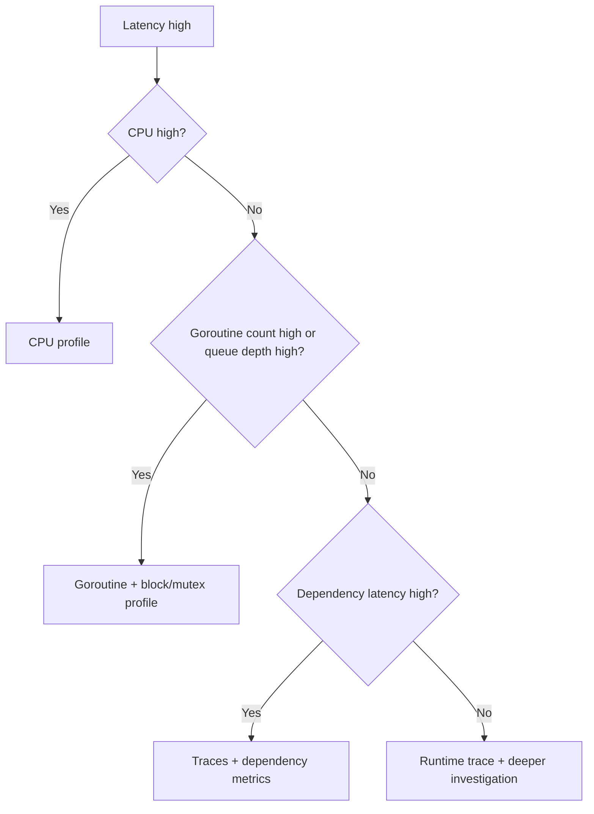

# learn-go-logging-observability-profiling-troubleshooting-part-017.md

# Part 017 — Block, Mutex, and Contention Profiling

> Seri: `learn-go-logging-observability-profiling-troubleshooting`  
> Bagian: `017 / 032`  
> Fokus: block profiling, mutex profiling, synchronization contention, channel blocking, lock wait, latency with low CPU  
> Target pembaca: Java software engineer yang ingin memahami contention dan blocking diagnostics di Go production

---

## 0. Posisi Bagian Ini dalam Seri

Part 013 membahas CPU profiling.

Part 014 membahas memory profiling.

Part 015 membahas GC observability.

Part 016 membahas goroutine profiling dan leak detection.

Bagian ini membahas masalah yang sering tidak terlihat jelas di CPU profile:

```text
contention
blocking
lock wait
channel wait
semaphore wait
queue saturation
worker starvation
backpressure failure
```

Ini adalah kelas masalah yang sangat umum pada service Go production:

- latency naik,
- throughput turun,
- CPU rendah atau sedang,
- goroutine count naik,
- request menggantung,
- worker terlihat idle tetapi queue penuh,
- lock kecil menjadi bottleneck besar,
- channel send/receive menumpuk,
- `sync.Mutex`/`sync.RWMutex` menjadi hot contention point,
- instrumentation/logging/metrics menciptakan global lock,
- database pool atau outbound concurrency limiter menjadi bottleneck.

---

## 1. Core Thesis

**Jika CPU profile menjawab "CPU habis di mana?", block/mutex profile menjawab "waktu tunggu sinkronisasi habis di mana?"**

Masalah production sering bukan karena program terlalu banyak menghitung, tetapi karena program terlalu banyak **menunggu**.

CPU profile tidak kuat untuk wait time.

Jika goroutine sedang blocked:

- menunggu channel,
- menunggu mutex,
- menunggu semaphore,
- menunggu condition,
- menunggu WaitGroup,
- menunggu queue slot,
- menunggu worker,

maka CPU profile bisa terlihat tidak dramatis karena goroutine tidak sedang memakai CPU.

Untuk itu, Anda perlu:

- goroutine profile untuk melihat stack snapshot,
- block profile untuk melihat blocking synchronization events,
- mutex profile untuk melihat lock contention,
- runtime trace untuk timeline,
- metrics untuk queue/wait/saturation,
- logs/traces untuk boundary context.

---

## 2. CPU-Bound vs Wait-Bound



CPU-bound symptom:

```text
CPU high
CPU profile has clear hot path
latency correlates with CPU saturation
```

Wait-bound symptom:

```text
CPU low/normal
latency high
goroutines blocked
queue depth high
throughput collapses
block/mutex profile shows wait site
```

---

## 3. Java Engineer Mapping

| Java World | Go World |
|---|---|
| Thread blocked on monitor | Goroutine blocked on mutex/semaphore/channel |
| Thread dump shows BLOCKED/WAITING | Goroutine profile shows `semacquire`, `chan send`, `chan receive`, `select` |
| Lock profiling/JFR events | Go mutex/block profile |
| Thread pool saturation | Worker pool/channel/queue saturation |
| `synchronized` hotspot | `sync.Mutex`/`sync.RWMutex` contention |
| Blocking queue full | buffered channel send blocked |
| Semaphore permit exhaustion | `x/sync/semaphore` or channel-as-semaphore wait |
| Async-profiler lock events | `runtime.SetMutexProfileFraction`, `runtime.SetBlockProfileRate` |

Important difference:

Go concurrency often uses channels and goroutines, so contention can appear as channel blocking rather than explicit lock blocking.

---

## 4. What Mutex Profile Measures

Mutex profile records contention on mutexes.

It helps answer:

```text
Where are goroutines spending time waiting for contended mutexes?
```

It is useful when:

- latency high but CPU not high,
- high contention suspected,
- `sync.Mutex`/`sync.RWMutex` used in hot path,
- cache/shared map has lock,
- logger/metrics/exporter has shared lock,
- throughput does not scale with concurrency,
- p99 worsens under load.

### 4.1 Enable Mutex Profiling

```go
runtime.SetMutexProfileFraction(5)
```

Meaning conceptually:

- sample a fraction of mutex contention events,
- lower/higher values affect detail and overhead,
- exact behavior should be read from runtime docs for target Go version,
- do not enable aggressive profiling blindly in production.

Common pattern:

```go
func configureMutexProfiling(fraction int, logger *slog.Logger) {
	if fraction <= 0 {
		return
	}
	runtime.SetMutexProfileFraction(fraction)
	logger.Info("mutex profiling enabled", "fraction", fraction)
}
```

### 4.2 Capture Mutex Profile

```bash
curl -o mutex.pb.gz "http://localhost:6060/debug/pprof/mutex"
go tool pprof -http=:0 ./app mutex.pb.gz
```

For delta window:

```bash
curl -o mutex-30s.pb.gz "http://localhost:6060/debug/pprof/mutex?seconds=30"
go tool pprof -http=:0 ./app mutex-30s.pb.gz
```

---

## 5. What Block Profile Measures

Block profile records blocking events on synchronization primitives.

It helps answer:

```text
Where are goroutines blocking on synchronization?
```

Common blocking sources:

- channel send,
- channel receive,
- select,
- mutex wait,
- condition variable,
- semaphores,
- WaitGroup-like waits,
- other runtime-supported blocking operations.

### 5.1 Enable Block Profiling

```go
runtime.SetBlockProfileRate(1)
```

Production caution:

- can have overhead,
- rate must be selected carefully,
- use on-demand or controlled config,
- validate impact under load.

### 5.2 Capture Block Profile

```bash
curl -o block.pb.gz "http://localhost:6060/debug/pprof/block"
go tool pprof -http=:0 ./app block.pb.gz
```

Delta:

```bash
curl -o block-30s.pb.gz "http://localhost:6060/debug/pprof/block?seconds=30"
```

---

## 6. Mutex vs Block vs Goroutine Profile

| Tool | Gives | Best For |
|---|---|---|
| Goroutine profile | snapshot of current stacks | "where are goroutines right now?" |
| Mutex profile | aggregate mutex contention | "which locks cause waiting?" |
| Block profile | aggregate synchronization blocking | "where do goroutines block?" |
| Runtime trace | timeline of blocking/unblocking | "when and how did wait happen?" |
| Metrics | trend and saturation | "how much and how often?" |

Example:

- Goroutine profile: 20k goroutines blocked on `queue.Submit`.
- Block profile: most block time in channel send inside `Submit`.
- Metrics: queue depth 100% full.
- Trace: dependency slowdown causes workers to stop draining queue.
- Logs: downstream timeout spike.

Together, they form a causal explanation.

---

## 7. Why Contention Creates Tail Latency

Contention is often invisible at average latency.

One lock can be fine at p50 but catastrophic at p99.

Example:

```text
One global mutex protects cache.
Each request holds it for 2ms.
At 10 RPS, fine.
At 500 RPS, queueing begins.
At 1000 RPS, p99 explodes.
```

This is queueing theory in disguise.

Contention increases:

- wait time,
- variance,
- tail latency,
- goroutine count,
- memory retained by waiting goroutines,
- timeout/cancellation rate,
- retry storm risk.

---

## 8. Lock Hold Time vs Lock Wait Time

Two concepts:

```text
lock hold time = how long goroutine owns lock
lock wait time = how long other goroutines wait to acquire lock
```

A lock with short hold time can still cause high wait if:

- very high contention,
- critical section called frequently,
- lock convoy occurs,
- goroutine holding lock blocks on IO,
- lock protects too much state.

A lock with long hold time is dangerous if in hot path.

Never do blocking IO while holding a shared lock unless absolutely justified.

---

## 9. Common Pattern: Global Map Lock

### 9.1 Bad Pattern

```go
type Store struct {
	mu sync.Mutex
	m  map[string]Value
}

func (s *Store) Get(key string) (Value, bool) {
	s.mu.Lock()
	defer s.mu.Unlock()

	v, ok := s.m[key]
	return v, ok
}

func (s *Store) Set(key string, v Value) {
	s.mu.Lock()
	defer s.mu.Unlock()

	s.m[key] = v
}
```

This may be fine at small scale.

It becomes problematic when:

- access frequency high,
- value construction happens under lock,
- map grows large,
- read-heavy workload uses exclusive mutex,
- downstream call happens while holding lock,
- logging/metrics occurs under lock.

### 9.2 Better: Reduce Critical Section

```go
func (s *Store) Set(key string, v Value) {
	s.mu.Lock()
	s.m[key] = v
	s.mu.Unlock()
}
```

Avoid expensive work inside:

```go
func (s *Store) LoadOrCompute(key string) (Value, error) {
	s.mu.Lock()
	v, ok := s.m[key]
	s.mu.Unlock()
	if ok {
		return v, nil
	}

	v, err := compute(key)
	if err != nil {
		return Value{}, err
	}

	s.mu.Lock()
	s.m[key] = v
	s.mu.Unlock()

	return v, nil
}
```

But this has duplicate compute race. May need singleflight pattern.

### 9.3 Alternative: Sharding

```go
type shard struct {
	mu sync.RWMutex
	m  map[string]Value
}

type ShardedStore struct {
	shards []shard
}
```

Benefit:

- reduces contention by distributing keys.

Trade-off:

- complexity,
- hash cost,
- uneven key distribution,
- harder global operations.

---

## 10. Common Pattern: RWMutex Misuse

`sync.RWMutex` is not always faster than `Mutex`.

It helps when:

- many readers,
- few writers,
- read critical section is significant enough,
- writer starvation behavior acceptable for workload,
- state truly read-only during read lock.

It hurts when:

- writes frequent,
- read section tiny,
- lock overhead matters,
- readers hold lock too long,
- code upgrades read lock to write lock incorrectly,
- writer waits behind many readers.

Bad:

```go
s.mu.RLock()
v := s.m[key]
doExpensiveWork(v)
s.mu.RUnlock()
```

If `doExpensiveWork` does not need lock, move it outside.

Better:

```go
s.mu.RLock()
v := s.m[key]
s.mu.RUnlock()

doExpensiveWork(v)
```

Only safe if `v` ownership/immutability is correct.

---

## 11. Common Pattern: Logging Under Lock

Bad:

```go
s.mu.Lock()
defer s.mu.Unlock()

s.state[key] = value
logger.Info("state updated", "key", key, "state", s.state)
```

Problems:

- logging can allocate,
- JSON encoding can be expensive,
- writer can block,
- log handler may have its own lock,
- state serialization under lock grows with map size.

Better:

```go
s.mu.Lock()
s.state[key] = value
size := len(s.state)
s.mu.Unlock()

logger.Info("state updated", "key", key, "state_size", size)
```

Rule:

```text
Never log large dynamic state while holding a hot lock.
```

---

## 12. Common Pattern: Metrics Under Lock

Metrics update can be cheap, but not always.

Bad:

```go
s.mu.Lock()
defer s.mu.Unlock()

s.m[key] = value
cacheSizeGauge.Set(float64(len(s.m)))
```

This may be okay, but if metric label generation or custom collector is expensive, it can cause lock hold.

Better:

```go
s.mu.Lock()
s.m[key] = value
size := len(s.m)
s.mu.Unlock()

cacheSizeGauge.Set(float64(size))
```

For custom collectors, never hold application lock while doing slow collection if scrape can block request path.

---

## 13. Common Pattern: Channel as Queue

Buffered channel used as queue:

```go
jobs := make(chan Job, 1000)
```

This is simple and often fine.

But under saturation:

- send blocks,
- request goroutines pile up,
- memory retained,
- p99 latency spikes,
- cancellation may not be honored.

Bad submit:

```go
func Submit(job Job) {
	jobs <- job
}
```

Better:

```go
func Submit(ctx context.Context, job Job) error {
	select {
	case jobs <- job:
		return nil
	case <-ctx.Done():
		return ctx.Err()
	default:
		return ErrQueueFull
	}
}
```

This uses non-blocking fail-fast. You may instead use bounded wait.

Operational question:

```text
When queue is full, should the system block, reject, drop, degrade, or spill?
```

This is domain design, not just Go syntax.

---

## 14. Common Pattern: Channel Receive Starvation

Workers wait on receive:

```go
for job := range jobs {
	process(job)
}
```

If workers idle, that is normal.

If producers are also blocked or jobs not flowing, issue may be:

- wrong channel,
- channel not closed,
- dispatcher stuck,
- select priority issue,
- context cancelled too early,
- worker consuming but process stuck.

Goroutine profile alone may show workers waiting. That can be healthy.

Use metrics:

- queue depth,
- producer rate,
- consumer rate,
- job duration,
- worker active/idle.

---

## 15. Common Pattern: Semaphore Saturation

Semaphores limit concurrency.

Channel-as-semaphore:

```go
sem := make(chan struct{}, 10)

func Do(ctx context.Context) error {
	select {
	case sem <- struct{}{}:
		defer func() { <-sem }()
	case <-ctx.Done():
		return ctx.Err()
	}

	return work(ctx)
}
```

If concurrency limit too low or work slow, callers wait.

Evidence:

- goroutine profile blocked on channel send,
- block profile points to semaphore acquire,
- metric `inflight` at max,
- wait duration high,
- dependency slow.

Fix options:

- increase limit if downstream can handle,
- reduce work duration,
- add timeout,
- shed load,
- separate pools by endpoint/tenant/priority,
- avoid one global limiter for unrelated work.

---

## 16. Common Pattern: DB Pool Contention

Go `database/sql` pool can become a bottleneck.

Symptoms:

- latency high,
- CPU normal,
- goroutines waiting,
- DB itself maybe not saturated,
- `sql.DB` wait metrics high.

Signals from `DB.Stats()`:

- `OpenConnections`,
- `InUse`,
- `Idle`,
- `WaitCount`,
- `WaitDuration`,
- `MaxOpenConnections`.

If `WaitCount/WaitDuration` increases:

```text
application is waiting for DB connections
```

Root causes:

- max open too low,
- queries too slow,
- transactions hold connection too long,
- rows not closed,
- connection leak,
- pool shared by unrelated workloads,
- DB is saturated and increasing pool makes worse.

Block profile may show waiting inside database/sql.

Fix requires DB + app evidence.

---

## 17. Common Pattern: HTTP Transport Pool Contention

Outbound HTTP client can bottleneck on:

- `MaxConnsPerHost`,
- idle connection settings,
- TLS handshakes,
- DNS,
- response bodies not closed,
- downstream slow,
- per-host concurrency.

Symptoms:

- goroutine waiting in HTTP transport,
- traces show outbound call queueing,
- low CPU,
- high latency.

Fix:

- reuse `http.Client` and `Transport`,
- tune transport limits,
- set timeouts,
- close/drain bodies,
- separate clients for different dependencies,
- add outbound metrics.

---

## 18. Common Pattern: Singleflight Contention

`singleflight` prevents duplicate work for same key.

Good:

- avoids thundering herd.

Risk:

- many callers wait for one slow computation,
- slow dependency stalls all same-key requests,
- one key becomes hotspot,
- cancellation behavior must be considered.

Evidence:

- goroutines waiting in singleflight,
- block profile on channel receive/wait,
- key-specific traffic skew,
- p99 high for hotspot key.

Fix:

- timeout,
- stale cache fallback,
- per-key metrics carefully sampled,
- request coalescing with bounded wait,
- avoid global singleflight for unrelated keys.

---

## 19. Common Pattern: Atomic Spin / CAS Hotspot

Not all contention appears as mutex wait.

Atomic loops can burn CPU.

Example:

```go
for !atomic.CompareAndSwapInt64(&state, old, new) {
	old = atomic.LoadInt64(&state)
}
```

Symptoms:

- CPU high,
- CPU profile shows atomic/runtime/internal loops,
- mutex profile not helpful,
- throughput poor under contention.

Fix:

- reduce shared atomic hotspot,
- shard counters,
- batch updates,
- use mutex if contention high and critical section simple,
- redesign state ownership.

Important:

```text
Lock-free is not automatically faster under high contention.
```

---

## 20. Common Pattern: Lock Convoy

Lock convoy occurs when many goroutines queue behind a lock and wake in a pattern that reduces throughput.

Causes:

- long critical section,
- blocking while holding lock,
- high contention,
- scheduling delays,
- CPU throttling,
- GC assist while holding lock,
- logging/IO under lock.

Evidence:

- mutex profile points to same lock,
- runtime trace shows wakeups/waits,
- p99 spikes under load,
- CPU not necessarily high.

Fix:

- shorten critical section,
- shard lock,
- move IO outside,
- reduce lock frequency,
- immutable snapshots,
- actor/owner goroutine model,
- batch updates.

---

## 21. Common Pattern: Condition Variable Wait

`sync.Cond` is less common but appears in some queues/pools.

Symptoms:

```text
sync.(*Cond).Wait
```

Possible causes:

- signal missed due to wrong locking protocol,
- producer stopped,
- queue empty/full,
- shutdown not broadcasting,
- condition predicate wrong.

Rule:

Always wait in loop:

```go
mu.Lock()
for !condition() {
	cond.Wait()
}
doWork()
mu.Unlock()
```

On shutdown, broadcast:

```go
cond.Broadcast()
```

---

## 22. Block Profile Interpretation

Example block profile top:

```text
Showing nodes accounting for 120s, 80% of 150s total
      flat  flat%   sum%        cum   cum%
       60s 40.00% 40.00%       60s 40.00%  runtime.chanrecv1
       30s 20.00% 60.00%       70s 46.67%  myapp/queue.(*Queue).Submit
       20s 13.33% 73.33%       20s 13.33%  sync.(*WaitGroup).Wait
```

Do not stop at `runtime.chanrecv1`.

Find application caller:

```text
myapp/queue.(*Queue).Submit
myapp/worker.(*Pool).Wait
```

Questions:

1. which channel?
2. producer or consumer?
3. expected wait or abnormal?
4. is queue full/empty?
5. does context cancel?
6. does shutdown close?
7. is wait proportional to load?
8. what downstream caused it?

---

## 23. Mutex Profile Interpretation

Example:

```text
Showing nodes accounting for 80s, 90% of 90s total
      flat  flat%   sum%        cum   cum%
       50s 55.56% 55.56%       50s 55.56%  sync.(*Mutex).Unlock
       20s 22.22% 77.78%       70s 77.78%  myapp/cache.(*Store).Set
```

Mutex profile attribution can feel unintuitive because contention may be attributed around unlock path or where waiting is observed depending on profile semantics.

Key is to identify application lock owner/path.

Ask:

1. which mutex?
2. what data does it protect?
3. how often is it acquired?
4. how long is it held?
5. does critical section do allocation/logging/IO?
6. read/write ratio?
7. can lock scope shrink?
8. can state be sharded or made immutable?
9. can work be moved outside lock?

---

## 24. Runtime Trace for Contention

Block/mutex profile aggregates.

Runtime trace shows timeline.

Use trace when:

- you need sequence of blocking/unblocking,
- scheduler latency matters,
- lock convoy suspected,
- goroutine wakeup behavior matters,
- GC/CPU throttling interaction suspected,
- aggregate profile lacks causality.

Capture:

```bash
curl -o trace-10s.out "http://localhost:6060/debug/pprof/trace?seconds=10"
go tool trace trace-10s.out
```

Trace can show:

- goroutine state transitions,
- blocking events,
- network wait,
- syscalls,
- GC,
- processor utilization.

---

## 25. Metrics Required for Contention Diagnosis

Profiles show code site. Metrics show magnitude/trend.

For locks:

```text
lock_wait_duration_seconds
lock_hold_duration_seconds
lock_contention_total
```

Do not instrument every lock manually unless needed. It can add overhead.

For queues:

```text
queue_depth
queue_capacity
queue_submit_total
queue_submit_blocked_total
queue_submit_wait_duration
queue_dropped_total
job_duration
worker_active
worker_idle
```

For pools:

```text
pool_in_use
pool_idle
pool_wait_count
pool_wait_duration
pool_max
```

For semaphores:

```text
semaphore_in_use
semaphore_capacity
semaphore_wait_duration
semaphore_rejected_total
```

---

## 26. Instrumenting Queue Wait

Example:

```go
func (q *Queue) Submit(ctx context.Context, job Job) error {
	start := time.Now()

	select {
	case q.jobs <- job:
		q.submitWait.Observe(time.Since(start).Seconds())
		return nil
	case <-ctx.Done():
		q.submitWait.Observe(time.Since(start).Seconds())
		q.cancelled.Inc()
		return ctx.Err()
	}
}
```

But be careful:

- observing metric itself has overhead,
- labels must be bounded,
- histogram buckets should match expected wait,
- do not use job ID/user ID as labels.

---

## 27. Lock Instrumentation Wrapper

Sometimes you need explicit lock wait/hold measurement.

Example concept:

```go
type InstrumentedMutex struct {
	mu sync.Mutex

	wait prometheus.Observer
	hold prometheus.Observer
}

func (m *InstrumentedMutex) Lock() func() {
	waitStart := time.Now()
	m.mu.Lock()
	m.wait.Observe(time.Since(waitStart).Seconds())

	holdStart := time.Now()
	return func() {
		m.hold.Observe(time.Since(holdStart).Seconds())
		m.mu.Unlock()
	}
}
```

Usage:

```go
unlock := s.mu.Lock()
defer unlock()
```

Caution:

- this wrapper changes lock API,
- metrics observation can allocate/lock,
- do not instrument all locks,
- use for specific suspected locks only,
- profile first if possible.

---

## 28. Reducing Contention: Strategy Catalog

### 28.1 Shrink Critical Section

Move expensive work outside lock.

### 28.2 Shard State

Multiple locks by key/hash/tenant/partition.

### 28.3 Use Immutable Snapshots

Readers read immutable copy without lock or with atomic pointer.

```go
type ConfigStore struct {
	v atomic.Value // stores *Config
}
```

Writers replace full config.

### 28.4 Actor/Owner Goroutine

One goroutine owns state; others send messages.

Good for:

- serialized state machine,
- low/moderate throughput,
- clear ownership.

Risk:

- actor becomes bottleneck,
- channel backpressure,
- harder synchronous reads.

### 28.5 Batch Updates

Reduce lock frequency.

### 28.6 Reduce Shared State

Pass data by ownership instead of shared mutation.

### 28.7 Per-Request Local State

Avoid global cache/counter if not needed.

### 28.8 Use Atomics Carefully

Good for simple counters/flags.

Bad for complex state under high contention.

### 28.9 Backpressure Instead of Blocking Forever

Bounded wait, reject, drop, degrade.

### 28.10 Separate Pools by Work Type

Avoid one global limiter blocking unrelated operations.

---

## 29. Contention Design Trade-Offs

| Strategy | Benefit | Risk |
|---|---|---|
| Mutex | simple, clear | contention |
| RWMutex | read concurrency | writer wait, misuse |
| Sharding | reduces contention | complexity, skew |
| Atomic | low overhead for simple state | hard correctness, spin contention |
| Channel actor | clear ownership | actor bottleneck |
| Immutable snapshot | fast reads | copy cost, stale reads |
| Bounded queue | backpressure | rejection/drop semantics |
| Semaphore | protects dependency | wait latency |
| sync.Map | optimized for specific patterns | not general map replacement |

Do not choose based on ideology.

Choose based on:

- access pattern,
- contention evidence,
- correctness invariants,
- latency target,
- throughput target,
- maintainability.

---

## 30. Case Study 1: Cache Lock Contention

### Symptom

- p99 latency high under load.
- CPU moderate.
- throughput does not scale beyond 4 replicas.
- goroutine count rises.

### Evidence

Mutex profile:

```text
myapp/cache.(*Store).Get
myapp/cache.(*Store).Set
```

Code:

```go
s.mu.Lock()
defer s.mu.Unlock()

v, ok := s.m[key]
if !ok {
	v = computeSlow(key)
	s.m[key] = v
}
return v
```

Root cause:

- slow compute under global lock.

Fix:

- move compute outside lock,
- use singleflight per key,
- shard cache,
- add cache hit/miss/load metrics.

Lesson:

Lock protected map, but accidentally protected slow computation too.

---

## 31. Case Study 2: Logger Lock Contention

### Symptom

- latency spikes during error storm.
- CPU moderate/high.
- block/mutex profile points to logging writer.
- logs volume huge.

Root cause:

- synchronous JSON logger writes to slow stdout sink,
- many goroutines contend on logger/writer lock,
- error logged repeatedly in retry loop.

Fix:

- reduce duplicate logging,
- sample repeated errors,
- log once at boundary,
- avoid huge fields,
- ensure log sink can keep up,
- consider async logger with bounded queue and drop policy.

Lesson:

Observability can create contention.

---

## 32. Case Study 3: Worker Queue Saturation

### Symptom

- API latency high.
- CPU low.
- goroutine count high.

Goroutine profile:

```text
[chan send]
myapp/worker.(*Pool).Submit
```

Block profile:

```text
runtime.chansend1
myapp/worker.(*Pool).Submit
```

Metrics:

- queue depth = capacity,
- worker active = max,
- job duration increased,
- downstream dependency slow.

Root cause:

- downstream slowdown saturated workers;
- request goroutines blocked submitting jobs.

Fix:

- bounded submit wait,
- return 503/degraded response,
- circuit breaker,
- dependency timeout,
- queue depth alert,
- separate worker pool per priority.

---

## 33. Case Study 4: DB Pool Wait

### Symptom

- p99 API latency high.
- DB CPU moderate.
- app CPU low.
- many goroutines waiting.

Evidence:

- `DB.Stats().WaitCount` and `WaitDuration` rising,
- traces show delay before query starts,
- block profile inside database/sql.

Root cause:

- transactions hold connection while doing external HTTP call.

Bad:

```go
tx, _ := db.BeginTx(ctx, nil)
defer tx.Rollback()

data := callExternalAPI(ctx)
_, _ = tx.ExecContext(ctx, "update ...", data)
return tx.Commit()
```

Fix:

- external call before transaction if correctness allows,
- keep transaction short,
- timeout external call,
- review isolation/consistency,
- add transaction duration metrics.

Lesson:

Pool contention can be caused by holding resources across unrelated waits.

---

## 34. Case Study 5: RWMutex Makes Tail Worse

### Symptom

- read-heavy config store changed from Mutex to RWMutex.
- p50 improved slightly.
- p99 worsened during config updates.

Root cause:

- many long readers hold `RLock`,
- writer waits,
- requests needing fresh config pile up.

Fix:

- immutable config snapshot with `atomic.Value`,
- readers lock-free,
- writer builds new config then swaps pointer.

Lesson:

RWMutex is not always better. Access semantics matter.

---

## 35. Production Runbook: Latency High, CPU Low

```text
Runbook: Suspected blocking/contention

1. Confirm symptom
   - p95/p99 latency high
   - CPU low/normal
   - throughput lower than expected
   - goroutine count rising?
   - queue/pool metrics?

2. Capture profiles
   - goroutine debug2
   - block profile if enabled
   - mutex profile if enabled
   - runtime trace 5-10s if needed

3. Check metrics
   - queue depth/capacity
   - worker active/idle
   - DB pool wait
   - HTTP outbound pool/dependency latency
   - semaphore in-use/wait
   - CPU throttling
   - GC CPU/assist

4. Group stacks
   - chan send
   - chan receive
   - semacquire
   - select
   - IO wait
   - WaitGroup.Wait

5. Classify
   - lock contention
   - queue saturation
   - worker starvation
   - pool exhaustion
   - dependency slowdown
   - shutdown/lifecycle bug
   - telemetry contention

6. Mitigate
   - reduce traffic
   - shed load
   - increase workers if safe
   - increase pool only if downstream can handle
   - rollback
   - disable expensive feature
   - fail fast instead of blocking

7. Fix
   - shorten critical section
   - add context-aware send/acquire
   - bound queue
   - add timeout
   - shard state
   - separate pools
   - add metrics/alerts
```

---

## 36. How to Avoid Contention in Design

Design rules:

1. Make ownership explicit.
2. Do not share mutable state unless necessary.
3. Do not hold lock across IO.
4. Do not hold lock across logging/metrics-heavy work.
5. Keep critical sections small.
6. Bound queues.
7. Make backpressure policy explicit.
8. Add cancellation to blocking operations.
9. Separate unrelated workloads.
10. Use metrics for wait time, not only queue size.
11. Test under concurrency.
12. Profile under representative load.

---

## 37. Testing for Contention

### 37.1 Load Test

Contention often appears only under concurrency.

Use:

```bash
go test -run '^$' -bench BenchmarkConcurrent -benchtime=10s -cpu=1,2,4,8
```

Benchmark can vary concurrency.

### 37.2 Block/Mutex Profile in Test

```bash
go test ./internal/cache -run '^$' -bench BenchmarkStoreParallel -mutexprofile mutex.out
go tool pprof -http=:0 mutex.out
```

Block:

```bash
go test ./internal/queue -run '^$' -bench BenchmarkSubmit -blockprofile block.out
go tool pprof -http=:0 block.out
```

### 37.3 Parallel Benchmark

```go
func BenchmarkStoreGetParallel(b *testing.B) {
	store := NewStore()
	b.RunParallel(func(pb *testing.PB) {
		for pb.Next() {
			_, _ = store.Get("key")
		}
	})
}
```

But benchmark contention must match real access patterns.

---

## 38. Contention Checklist

```text
[ ] Is CPU low while latency high?
[ ] Is goroutine count rising?
[ ] Are goroutines blocked on same stack?
[ ] Are queue/pool/semaphore metrics saturated?
[ ] Is block profiling enabled?
[ ] Is mutex profiling enabled?
[ ] Which lock/channel/semaphore is dominant?
[ ] Is wait expected or abnormal?
[ ] Is critical section too large?
[ ] Is IO/logging/metrics under lock?
[ ] Is context cancellation honored?
[ ] Is backpressure policy explicit?
[ ] Does downstream slowdown explain queue buildup?
[ ] Are unrelated workloads sharing same limiter/pool?
[ ] Did a recent change add shared state or instrumentation?
```

---

## 39. Anti-Patterns

### 39.1 Holding Lock While Calling External Service

```go
mu.Lock()
defer mu.Unlock()

resp := callHTTP()
state.Update(resp)
```

Dangerous.

### 39.2 Holding Lock While Logging Large State

```go
mu.Lock()
logger.Info("state", "all", state)
mu.Unlock()
```

Dangerous.

### 39.3 Unbounded Wait on Full Queue

```go
jobs <- job
```

without context/timeout/backpressure policy.

### 39.4 One Global Limiter for Everything

A slow low-priority operation blocks high-priority path.

### 39.5 Assuming RWMutex Is Faster

It depends.

### 39.6 Replacing Mutex with Atomics Without Invariants

Can create subtle bugs and CPU spin.

### 39.7 No Queue Metrics

If queue exists but depth/wait are invisible, incidents become guesswork.

### 39.8 Treating Block Profile as Root Cause Alone

Block profile shows wait site. Root cause may be downstream, worker failure, pool config, or business logic.

---

## 40. Exercises

### Exercise 1 — Global Lock Contention

Build a map store with global mutex and expensive computation under lock.

Tasks:

1. run parallel benchmark,
2. capture mutex profile,
3. move computation outside lock,
4. compare before/after,
5. try sharding.

### Exercise 2 — Queue Saturation

Build HTTP endpoint that submits to bounded worker queue.

Tasks:

1. make workers slow,
2. observe p99 latency with CPU low,
3. capture goroutine + block profile,
4. add submit timeout,
5. expose queue metrics.

### Exercise 3 — DB Pool Wait Simulation

Use a fake pool/semaphore with max concurrency.

Tasks:

1. hold permit too long,
2. capture block profile,
3. add wait duration metric,
4. separate slow and fast work pools.

### Exercise 4 — Logging Under Lock

Create shared state update that logs full state under lock.

Tasks:

1. load test,
2. capture mutex profile,
3. move logging outside lock,
4. reduce log fields,
5. compare.

### Exercise 5 — Runtime Trace

Create contention scenario.

Tasks:

1. capture block/mutex profile,
2. capture runtime trace,
3. compare aggregate vs timeline insight.

---

## 41. What Good Looks Like

Anda memahami contention profiling secara production-grade jika mampu:

1. mengenali latency high CPU low sebagai possible wait-bound problem,
2. memilih goroutine/block/mutex/trace sesuai kebutuhan,
3. mengaktifkan block/mutex profiling dengan sadar overhead,
4. membaca application caller di balik runtime channel/mutex frames,
5. membedakan lock hold time dan wait time,
6. menghubungkan contention dengan queue/pool/dependency metrics,
7. menemukan lock scope terlalu luas,
8. menemukan channel send/receive blocking,
9. memperbaiki dengan lifecycle/backpressure policy,
10. membuktikan improvement dengan before/after profile.

---

## 42. Summary

Contention adalah salah satu sumber tail latency paling penting di Go.

CPU profile tidak cukup karena goroutine yang menunggu tidak memakai CPU.

Gunakan:

- goroutine profile untuk snapshot,
- block profile untuk aggregate blocking,
- mutex profile untuk lock contention,
- runtime trace untuk timeline,
- metrics untuk saturation,
- logs/traces untuk boundary context.

Pertanyaan utama:

```text
Siapa menunggu?
Menunggu apa?
Berapa banyak?
Berapa lama?
Apakah expected?
Apa pemilik resource?
Apa backpressure policy?
Apa lifecycle-nya?
```

Solusi contention jarang hanya "tambah goroutine".

Solusi matang biasanya:

- kecilkan critical section,
- hindari IO/logging under lock,
- shard state,
- bound queue,
- context-aware blocking,
- timeout,
- load shedding,
- separate pools,
- better metrics,
- explicit ownership.

---

## 43. Status Seri

Bagian ini adalah:

```text
learn-go-logging-observability-profiling-troubleshooting-part-017.md
```

Status:

```text
Part 017 dari 032
Seri belum selesai
```

Bagian berikutnya:

```text
learn-go-logging-observability-profiling-troubleshooting-part-018.md
```

Topik berikutnya:

```text
Execution Tracing with runtime/trace
```


<!-- NAVIGATION_FOOTER -->
<div class="page-nav">
<a href="./learn-go-logging-observability-profiling-troubleshooting-part-016.md">⬅️ Part 016 — Goroutine Profiling and Leak Detection</a>
<a href="./index.md">📚 Kategori</a>
<a href="../../index.md">🏠 Home</a>
<a href="./learn-go-logging-observability-profiling-troubleshooting-part-018.md">Part 018 — Execution Tracing with `runtime/trace` ➡️</a>
</div>
