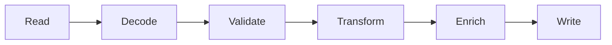

# learn-go-logging-observability-profiling-troubleshooting-part-018.md

# Part 018 — Execution Tracing with `runtime/trace`

> Seri: `learn-go-logging-observability-profiling-troubleshooting`  
> Bagian: `018 / 032`  
> Fokus: Go execution trace, scheduler timeline, goroutine lifecycle, blocking, syscall/network wait, GC correlation, user annotations  
> Target pembaca: Java software engineer yang ingin memahami runtime timeline Go secara production-grade

---

## 0. Posisi Bagian Ini dalam Seri

Bagian sebelumnya membahas:

- CPU profiling,
- memory profiling,
- GC observability,
- goroutine profiling,
- block/mutex contention profiling.

Semua itu mayoritas bersifat **aggregate** atau **snapshot**.

CPU profile menjawab:

```text
CPU time terakumulasi di function mana?
```

Heap profile menjawab:

```text
Allocation/retained memory berasal dari site mana?
```

Goroutine profile menjawab:

```text
Saat ini goroutine berada di stack mana?
```

Block/mutex profile menjawab:

```text
Waktu tunggu sinkronisasi terakumulasi di mana?
```

`runtime/trace` menjawab pertanyaan yang berbeda:

```text
Apa yang terjadi sepanjang waktu pada runtime Go?
```

Ia memberi timeline:

- goroutine created,
- goroutine runnable,
- goroutine running,
- goroutine blocked,
- goroutine unblocked,
- network wait,
- syscall,
- GC event,
- processor utilization,
- scheduler behavior,
- user task/region/log annotation.

---

## 1. Core Thesis

**Profile memberi aggregate cost. Runtime trace memberi temporal causality.**

Jika Anda bertanya:

```text
"Fungsi mana paling mahal?"
```

pakai pprof.

Jika Anda bertanya:

```text
"Kenapa request ini sempat berhenti 800ms padahal CPU profile tidak menunjukkan hotspot?"
```

runtime trace sering lebih berguna.

Jika Anda bertanya:

```text
"Apakah goroutine menunggu scheduler, network, syscall, GC, channel, atau dependency?"
```

runtime trace memberi timeline untuk melihat transisi state.

---

## 2. Execution Trace vs Distributed Trace

Keduanya sama-sama disebut trace, tetapi berbeda.

| Aspect | `runtime/trace` | Distributed Trace / OpenTelemetry |
|---|---|---|
| Scope | satu process Go | lintas service/process |
| Fokus | scheduler, goroutine, GC, syscall, network wait | request path, dependency, spans |
| Granularity | runtime-level event | application/distributed operation |
| Tool | `go tool trace` | Jaeger/Tempo/Datadog/Honeycomb/etc |
| Context | goroutine/runtime timeline | trace/span context |
| Cost | bisa besar, capture pendek | sampled continuous |
| Best for | scheduler/blocking/GC timeline | service dependency causality |
| Production usage | on-demand short capture | continuous/sampled telemetry |

Distributed trace menjawab:

```text
Request melewati service mana dan span mana lambat?
```

Runtime trace menjawab:

```text
Di dalam process Go, goroutine berjalan/menunggu kapan dan kenapa?
```

Mereka saling melengkapi.

---

## 3. Execution Trace vs pprof

| Question | Better Tool |
|---|---|
| CPU hotspot function? | CPU profile |
| Allocation hot path? | heap alloc profile |
| Retained memory? | heap inuse profile |
| Goroutine currently blocked where? | goroutine profile |
| Lock/channel wait aggregate? | block/mutex profile |
| Timeline of goroutine scheduling? | runtime trace |
| Network/syscall wait over time? | runtime trace |
| GC event correlation with latency? | runtime trace |
| Why p99 spike happened during a short window? | runtime trace + distributed trace |
| Was CPU underutilized due to blocking? | runtime trace |

A powerful workflow is:

```text
metrics alert -> distributed trace -> pprof/goroutine/block profile -> runtime trace when timing matters
```

---

## 4. What `runtime/trace` Captures

Execution trace can include events such as:

1. goroutine creation,
2. goroutine start/stop,
3. goroutine runnable/running/blocked,
4. scheduler events,
5. processor utilization,
6. network blocking/unblocking,
7. syscall enter/exit,
8. GC start/end,
9. heap/GC related events,
10. user tasks,
11. user regions,
12. user logs,
13. blocking and unblocking relationships.

This makes it particularly useful for:

- latency spikes,
- scheduler delay,
- goroutine pileups,
- blocking mystery,
- syscall/network wait,
- GC correlation,
- fan-out/fan-in complexity,
- worker pool diagnosis.

---

## 5. Capturing Runtime Trace

### 5.1 From `net/http/pprof`

If debug endpoint is enabled:

```bash
curl -o trace-10s.out "http://localhost:6060/debug/pprof/trace?seconds=10"
go tool trace trace-10s.out
```

For production, keep duration short:

```text
5-10 seconds is often enough.
30 seconds can be large.
60 seconds can be painful.
```

### 5.2 From `go test`

```bash
go test ./internal/service -run TestScenario -trace trace.out
go tool trace trace.out
```

### 5.3 Programmatic Capture

```go
package main

import (
	"log"
	"os"
	"runtime/trace"
)

func main() {
	f, err := os.Create("trace.out")
	if err != nil {
		log.Fatal(err)
	}
	defer f.Close()

	if err := trace.Start(f); err != nil {
		log.Fatal(err)
	}
	defer trace.Stop()

	runWorkload()
}
```

Use programmatic trace for:

- CLI,
- batch job,
- local reproducer,
- controlled scenario.

---

## 6. Trace Duration and Overhead

Execution trace is detailed.

Therefore:

- files can be large,
- capture can add overhead,
- long traces are hard to analyze,
- trace can contain sensitive operational details,
- capture should be targeted.

Recommended production approach:

| Situation | Trace Duration |
|---|---:|
| quick scheduler/blocking check | 5s |
| p99 spike during steady issue | 10s |
| low traffic issue | 15–30s with caution |
| local reproduction | longer if needed |
| high traffic production | keep short |

Do not run trace continuously as normal telemetry.

Use runtime trace as surgical diagnostic.

---

## 7. `go tool trace` Views

`go tool trace trace.out` opens web UI.

Common useful views:

1. timeline view,
2. goroutine analysis,
3. network blocking profile,
4. synchronization blocking profile,
5. syscall blocking profile,
6. scheduler latency profile,
7. user tasks/regions/logs,
8. GC event timeline.

Exact UI evolves by Go version, but mental model remains:

```text
Find where time went:
running, runnable, blocked, syscall, network, GC, synchronization.
```

---

## 8. Goroutine States in Trace

Runtime trace lets you see transitions:

```text
created -> runnable -> running -> blocked -> runnable -> running -> done
```

State meanings:

| State | Meaning |
|---|---|
| runnable | ready but not currently running |
| running | executing on processor |
| blocked | waiting on sync/network/syscall/etc |
| syscall | in syscall |
| waiting | asleep/parked |
| dead/done | completed |

A goroutine can be slow because:

1. it runs CPU-heavy code,
2. it is runnable but not scheduled quickly,
3. it blocks on channel/lock,
4. it waits on network,
5. it waits on syscall,
6. it participates in GC assist,
7. it is delayed by CPU throttling or saturation.

CPU profile only explains case 1 well.

---

## 9. Scheduler Latency

Scheduler latency means goroutine is runnable but not running.

Possible causes:

- CPU saturated,
- GOMAXPROCS too low,
- too many runnable goroutines,
- CPU throttling by container,
- long-running goroutines not yielding enough,
- GC/scheduler pressure,
- cgo/syscall behavior,
- OS scheduling.

Runtime trace can show runnable queues and delays.

If goroutine is runnable for long time before running:

```text
It wants CPU but cannot get it.
```

This is different from blocked on channel or network.

---

## 10. Processor Utilization

Go scheduler uses logical processors called P.

Trace can show processor utilization over time.

Interpretation:

| Pattern | Meaning |
|---|---|
| Ps mostly busy | CPU-bound or saturated |
| Ps mostly idle but latency high | likely blocking/dependency/wait |
| runnable goroutines high, Ps busy | CPU saturation/scheduler pressure |
| runnable goroutines high, container throttled | Kubernetes CPU limit issue |
| Ps idle, goroutines blocked | waiting on IO/sync/dependency |

This view helps prevent wrong diagnosis.

---

## 11. Network Blocking

Runtime trace can show network poller wait/unblock behavior.

Useful for:

- slow outbound HTTP dependency,
- DNS/network issues,
- connection wait,
- server read/write stalls,
- long-poll connections,
- clients not reading response,
- network backpressure.

But runtime trace alone will not tell business dependency name unless you add application context via logs/traces/annotations.

Pair with:

- OTel spans,
- HTTP client metrics,
- access logs,
- dependency latency metrics,
- DNS/TLS/connect timing.

---

## 12. Syscall Blocking

Syscall blocking can matter when:

- file IO,
- disk operations,
- cgo,
- OS calls,
- DNS via cgo resolver,
- TLS/randomness/file reads,
- subprocess execution,
- slow stdout/stderr writes,
- logging sink blocking.

Trace can show goroutines entering syscall and returning.

If many goroutines are in syscall:

- CPU profile may not show hotspot,
- OS/system-level evidence may be needed,
- thread count may increase,
- scheduler behavior may shift.

---

## 13. GC Events in Trace

Trace shows GC events over time.

Use it to answer:

- did GC happen during latency spike?
- did goroutines pause around GC?
- is mark assist visible?
- is GC frequent during allocation burst?
- did GC coincide with CPU saturation?
- did heap pressure affect scheduler?

Do not blame GC just because a GC event exists.

Correlate:

- request latency,
- GC event timing,
- allocation rate,
- CPU profile,
- heap profile,
- runtime metrics.

---

## 14. User Annotations

`runtime/trace` supports user annotations:

- tasks,
- regions,
- logs.

These make trace much easier to read.

Without annotations, trace shows runtime events but not your domain operation.

With annotations, you can label logical work:

```text
request handling
validation
database fetch
render report
fan-out query
aggregation
serialize response
```

---

## 15. `trace.WithRegion`

Use region to mark a block of work.

```go
import "runtime/trace"

func renderReport(ctx context.Context, report Report) ([]byte, error) {
	var out []byte
	var err error

	trace.WithRegion(ctx, "render_report", func() {
		out, err = render(report)
	})

	return out, err
}
```

Region should represent meaningful work, not every tiny function.

Good region names:

```text
validate_request
load_accounts
evaluate_rules
render_report
serialize_response
publish_event
flush_batch
```

Bad region names:

```text
function1
loop
doStuff
debug
```

---

## 16. `trace.NewTask`

A task represents a higher-level logical operation that may involve multiple goroutines.

Example:

```go
func handleRequest(ctx context.Context, req Request) error {
	ctx, task := trace.NewTask(ctx, "handle_request")
	defer task.End()

	trace.Log(ctx, "request_id", req.ID)

	return process(ctx, req)
}
```

If child goroutines receive the derived context, their regions/logs can be associated with the same task.

This is very useful for fan-out/fan-in.

---

## 17. `trace.Log`

Use trace logs sparingly for important values.

```go
trace.Log(ctx, "tenant", tenantID)
trace.Log(ctx, "operation", "export_report")
```

Avoid:

- secrets,
- PII,
- request body,
- high-volume per-item logs,
- huge values.

Trace logs are diagnostic metadata, not application logging replacement.

---

## 18. Annotating Fan-Out

Example:

```go
func queryBackends(ctx context.Context, backends []Backend, q Query) ([]Result, error) {
	ctx, task := trace.NewTask(ctx, "query_backends")
	defer task.End()

	results := make(chan Result, len(backends))

	for _, backend := range backends {
		backend := backend
		go func() {
			trace.WithRegion(ctx, "backend_query", func() {
				res, err := backend.Query(ctx, q)
				if err == nil {
					results <- res
				}
			})
		}()
	}

	return collect(ctx, results, len(backends))
}
```

Production code must handle:

- errors,
- cancellation,
- channel close,
- goroutine wait,
- panic,
- bounded fan-out.

The point here is annotation.

---

## 19. Trace Annotation Guidelines

Use annotations when:

- analyzing complex concurrent workflow,
- batch stages need timing,
- fan-out/fan-in needs visibility,
- scheduler/GC correlation needs domain labels,
- local/staging performance investigation,
- targeted production debugging.

Avoid over-annotation:

- inner loops,
- per item in huge batch,
- high-cardinality values,
- sensitive data,
- stable simple functions.

Good rule:

```text
Annotate logical stages, not implementation trivia.
```

---

## 20. Runtime Trace and Context

`runtime/trace` annotations use `context.Context` to associate tasks/regions/logs.

This reinforces a broader Go rule:

```text
Context is not just cancellation; it is also propagation of request-scoped execution metadata.
```

But do not abuse context for arbitrary values.

For trace:

- pass context through call chains,
- use derived context from `trace.NewTask`,
- ensure child goroutines receive correct context,
- cancel when operation ends.

---

## 21. Runtime Trace for Latency Spike

### 21.1 Symptom

- p99 jumps from 200ms to 2s.
- CPU not high.
- dependency metrics look normal.
- goroutine count rises temporarily.

### 21.2 CPU Profile

No clear hotspot.

### 21.3 Goroutine Profile

Shows many goroutines in select/channel wait, but snapshot unclear.

### 21.4 Runtime Trace

Trace shows:

- request goroutines become runnable,
- wait on worker queue,
- workers blocked on semaphore,
- semaphore held by slow downstream calls,
- downstream calls not visible in CPU,
- burst clears after 8 seconds.

### 21.5 Conclusion

Runtime trace connects timing:

```text
burst -> queue saturation -> semaphore wait -> p99 spike -> recovery
```

Block profile gives aggregate wait site. Trace gives timeline.

---

## 22. Runtime Trace for Scheduler Delay

### 22.1 Symptom

- CPU near limit.
- p99 latency high.
- goroutine count high.
- CPU profile shows mixed application/runtime.

### 22.2 Trace Finding

- many goroutines runnable,
- processors busy,
- long runnable-to-running delay.

### 22.3 Possible Causes

- CPU saturation,
- too much fan-out,
- GOMAXPROCS/resource limit mismatch,
- CPU throttling,
- too many runnable goroutines,
- expensive per-request goroutines,
- GC assist.

### 22.4 Fix Options

- reduce concurrency,
- bound fan-out,
- increase CPU request/limit,
- reduce CPU hot path,
- reduce allocation/GC pressure,
- load shed,
- separate workloads.

---

## 23. Runtime Trace for Network Wait

### 23.1 Symptom

- request latency high.
- CPU low.
- trace spans show dependency call slow.
- need process-level evidence.

### 23.2 Trace Finding

- goroutines blocked in network wait,
- unblocked after response,
- no CPU saturation.

### 23.3 Conclusion

Application is mostly waiting on network/dependency.

Next evidence:

- dependency SLO,
- outbound HTTP metrics,
- DNS/TLS/connect timing,
- retry logs,
- circuit breaker state.

Trace confirms "not CPU/GC".

---

## 24. Runtime Trace for GC Correlation

### 24.1 Symptom

- latency spikes every few seconds.
- allocation rate high.
- CPU profile shows GC frames.

### 24.2 Trace Finding

- GC events align with latency spikes,
- goroutines experience assist/scheduling delays around allocation bursts.

### 24.3 Next

- heap `alloc_space`,
- heap `inuse_space`,
- reduce allocation,
- tune batch size,
- review `GOMEMLIMIT`,
- consider `GOGC` after code/data fixes.

---

## 25. Runtime Trace for Worker Pool

Worker pool problems often need timeline.

Questions:

1. are workers running or blocked?
2. are producers blocked submitting?
3. when did queue become full?
4. did cancellation occur?
5. did workers stop after shutdown?
6. are jobs long-running?
7. is one job blocking worker forever?

Runtime trace plus metrics can answer.

Add regions:

```go
trace.WithRegion(ctx, "queue_submit", func() {
	err = pool.Submit(ctx, job)
})

trace.WithRegion(ctx, "job_process", func() {
	err = process(ctx, job)
})
```

---

## 26. Runtime Trace for Batch Pipeline

Batch pipeline:



Use regions:

```text
read_batch
decode_batch
validate_batch
transform_batch
enrich_batch
write_batch
```

Trace can show:

- stage imbalance,
- blocked writer,
- worker starvation,
- fan-out too large,
- GC burst,
- syscall/file IO wait,
- network wait.

---

## 27. Runtime Trace vs Block Profile Example

Suppose block profile shows:

```text
myapp/queue.(*Queue).Submit 80s block time
```

This tells aggregate wait site.

Runtime trace can reveal:

```text
10:00:01 downstream latency spike
10:00:02 workers blocked on HTTP calls
10:00:03 queue fills
10:00:04 request goroutines block on Submit
10:00:08 circuit breaker opens
10:00:09 queue drains
```

This is temporal causality.

---

## 28. Runtime Trace and pprof Together

Often you need both.

Example high latency:

1. distributed trace finds slow endpoint.
2. CPU profile shows JSON encode not dominant.
3. goroutine profile shows channel wait.
4. block profile shows queue submit blocking.
5. runtime trace shows workers stuck in network wait after dependency spike.

Each tool contributes:

| Tool | Contribution |
|---|---|
| distributed trace | request/dependency context |
| CPU profile | not CPU-bound |
| goroutine profile | stack snapshot |
| block profile | aggregate wait site |
| runtime trace | timeline |
| metrics | trend and magnitude |
| logs | operational events |

---

## 29. Production Safety

Runtime trace is powerful but heavier than many profiles.

Rules:

1. capture short duration,
2. use only when needed,
3. avoid repeated captures during overload,
4. capture from one affected pod first,
5. store artifact securely,
6. include timestamp/build/pod metadata,
7. do not share externally without review,
8. avoid user annotations with sensitive values,
9. record in incident timeline.

Artifact naming:

```text
2026-06-23T10-17-00Z_prod_payment-api_pod-abc_trace-10s_go1.26_commit-a1b2c3.out
```

---

## 30. Trace Capture Runbook

```text
Runbook: Capture Go runtime trace

1. Confirm need
   - CPU profile insufficient?
   - blocking/timing/scheduler/GC correlation needed?
   - symptom occurring now?

2. Pick pod
   - affected pod
   - representative traffic
   - not terminating

3. Capture short trace
   kubectl -n <ns> port-forward pod/<pod> 6060:6060
   curl -o trace-10s.out "http://localhost:6060/debug/pprof/trace?seconds=10"

4. Capture supporting evidence
   - goroutine debug2
   - block/mutex profile if relevant
   - CPU profile if CPU-related
   - runtime metrics window
   - distributed trace IDs
   - deployment marker

5. Analyze
   go tool trace trace-10s.out

6. Record finding
   - scheduler delay?
   - network wait?
   - syscall wait?
   - GC overlap?
   - synchronization blocking?
   - processor utilization?

7. Decide next action
   - code fix
   - limit concurrency
   - dependency mitigation
   - memory/GC fix
   - resource limit adjustment
```

---

## 31. Trace Analysis Checklist

```text
[ ] Was trace captured during symptom?
[ ] Is duration short but representative?
[ ] Are processors busy or idle?
[ ] Are goroutines runnable but not running?
[ ] Are goroutines blocked on sync?
[ ] Are goroutines blocked on network?
[ ] Are syscalls dominant?
[ ] Did GC align with latency?
[ ] Are user regions/tasks present?
[ ] Does trace support or reject CPU hypothesis?
[ ] Does trace align with distributed trace?
[ ] Does trace align with metrics?
```

---

## 32. Common Mistakes

### 32.1 Using Runtime Trace First

Runtime trace can be overwhelming.

Start with:

- metrics,
- logs,
- distributed trace,
- pprof/goroutine profile.

Use runtime trace when timing/state transition matters.

### 32.2 Capturing Too Long

Long traces:

- large files,
- hard to analyze,
- higher overhead,
- more sensitive data,
- mixed workload phases.

### 32.3 No User Annotation

Without task/region, trace may show runtime events but not domain stage.

For complex workflows, add annotations.

### 32.4 Over-Annotation

Too many regions/logs create noise and overhead.

### 32.5 Confusing Runtime Trace with OTel Trace

Runtime trace is process-level. OTel trace is distributed operation-level.

Use both.

### 32.6 Blaming GC Because It Appears in Trace

GC always exists. Blame GC only if timing/metrics/profiles support it.

---

## 33. Case Study 1: Latency Spike from Queue Saturation

### Symptom

- p99 latency 2s.
- CPU 35%.
- goroutine count spikes.
- error rate low.

### Evidence

Goroutine profile:

```text
[chan send] myapp/worker.(*Pool).Submit
```

Block profile:

```text
Submit dominates block time
```

Runtime trace:

- workers blocked on outbound HTTP,
- queue fills,
- request goroutines block on submit,
- after dependency recovers queue drains.

### Fix

- submit timeout,
- circuit breaker,
- separate worker pools,
- queue depth alert,
- degraded response.

---

## 34. Case Study 2: Scheduler Delay from Fan-Out

### Symptom

- CPU high.
- p99 latency high.
- request creates thousands of goroutines.

Runtime trace:

- many runnable goroutines,
- processors saturated,
- scheduling delay high.

CPU profile:

- per-item work small but total overhead high,
- runtime scheduler frames visible.

Fix:

- bounded fan-out,
- worker pool,
- batch processing,
- reduce goroutine creation,
- add request size limit.

---

## 35. Case Study 3: GC Burst During Batch Job

### Symptom

- regular latency spike every batch import.
- heap rises then falls.
- no leak.

Runtime trace:

- batch decode creates allocation burst,
- GC events overlap latency spike,
- HTTP request goroutines delayed.

Heap alloc profile:

- XML/JSON decode allocates heavily.

Fix:

- isolate batch workload,
- stream decode,
- reduce batch size,
- schedule off-peak,
- separate pod/worker.

---

## 36. Case Study 4: Slow Logging Sink

### Symptom

- p99 spikes during error storm.
- CPU moderate.
- logs volume huge.

Runtime trace:

- goroutines block in syscall/write path,
- logger writer becomes bottleneck.

Mutex/block profile:

- logging handler/writer contention.

Fix:

- sample repeated logs,
- reduce error duplication,
- async bounded logging,
- improve log sink,
- avoid logging under lock.

---

## 37. Designing Code for Traceability

Traceability does not happen accidentally.

Design for it:

1. pass context through operations,
2. create logical tasks for complex workflows,
3. add regions around stages,
4. add meaningful trace logs,
5. avoid sensitive data,
6. annotate fan-out/fan-in,
7. expose metrics for counts/durations,
8. keep logs correlated with request/trace IDs,
9. design worker lifecycle observably,
10. document stage names.

---

## 38. Example: Annotated Worker Pool

```go
func (p *Pool) Submit(ctx context.Context, job Job) error {
	var err error

	trace.WithRegion(ctx, "worker_queue_submit", func() {
		select {
		case p.jobs <- job:
			err = nil
		case <-ctx.Done():
			err = ctx.Err()
		}
	})

	return err
}

func (p *Pool) worker(ctx context.Context, id int) {
	for {
		select {
		case <-ctx.Done():
			return
		case job, ok := <-p.jobs:
			if !ok {
				return
			}

			jobCtx, task := trace.NewTask(ctx, "worker_job")
			trace.Log(jobCtx, "worker_id", strconv.Itoa(id))

			trace.WithRegion(jobCtx, "worker_job_process", func() {
				_ = p.process(jobCtx, job)
			})

			task.End()
		}
	}
}
```

Notes:

- do not log job payload,
- avoid high-cardinality sensitive values,
- make annotation optional if overhead matters,
- ensure context lifecycle correct.

---

## 39. Combining Runtime Trace with OTel Trace

A mature system may correlate:

- OTel trace ID in logs,
- runtime trace capture time window,
- pod/build version,
- request span around incident,
- runtime trace stage annotations.

Runtime trace does not automatically become OTel trace.

Operational correlation is often by:

- timestamp,
- pod,
- endpoint,
- request rate,
- trace IDs in logs,
- deployment version,
- synthetic incident marker.

---

## 40. Exercises

### Exercise 1 — Queue Saturation Trace

Build HTTP endpoint that submits to bounded worker queue.

Tasks:

1. make workers slow,
2. capture goroutine profile,
3. capture block profile,
4. capture runtime trace,
5. compare what each tool reveals.

### Exercise 2 — Scheduler Delay

Create workload with massive goroutine fan-out and CPU work.

Tasks:

1. capture CPU profile,
2. capture runtime trace,
3. inspect runnable/running behavior,
4. bound fan-out,
5. compare.

### Exercise 3 — GC Correlation

Create allocation-heavy batch.

Tasks:

1. capture runtime trace,
2. capture CPU profile,
3. capture heap alloc profile,
4. correlate GC events with latency.

### Exercise 4 — Trace Annotations

Add `trace.NewTask`, `trace.WithRegion`, and `trace.Log` to a multi-stage pipeline.

Tasks:

1. capture trace before annotation,
2. capture after annotation,
3. compare readability,
4. remove noisy annotations.

### Exercise 5 — Runtime Trace vs Distributed Trace

Instrument service with OTel spans and capture runtime trace during same load.

Tasks:

1. identify slow distributed span,
2. use runtime trace to explain process-level wait,
3. write combined diagnosis.

---

## 41. What Good Looks Like

Anda memahami `runtime/trace` secara production-grade jika mampu:

1. membedakan runtime trace dari distributed trace,
2. tahu kapan trace lebih tepat daripada pprof,
3. capture trace pendek dengan aman,
4. membaca runnable/running/blocked/network/syscall/GC state,
5. mengenali scheduler delay,
6. mengorelasikan trace dengan pprof, metrics, logs, OTel traces,
7. menambahkan user task/region/log annotation yang berguna,
8. tidak over-annotate,
9. memakai trace untuk temporal causality,
10. menghasilkan remediation berbasis evidence.

---

## 42. Summary

`runtime/trace` adalah alat untuk melihat timeline internal runtime Go.

Ia bukan pengganti:

- CPU profile,
- heap profile,
- goroutine profile,
- block/mutex profile,
- distributed tracing,
- metrics,
- logs.

Ia menjawab pertanyaan yang berbeda:

```text
Apa yang terjadi kapan?
Goroutine berjalan atau menunggu?
Menunggu scheduler, channel, network, syscall, atau GC?
Apakah processor idle atau saturated?
Apakah GC selaras dengan latency spike?
Apakah fan-out membuat scheduler pressure?
```

Gunakan runtime trace ketika aggregate profile tidak cukup menjelaskan waktu.

---

## 43. Status Seri

Bagian ini adalah:

```text
learn-go-logging-observability-profiling-troubleshooting-part-018.md
```

Status:

```text
Part 018 dari 032
Seri belum selesai
```

Bagian berikutnya:

```text
learn-go-logging-observability-profiling-troubleshooting-part-019.md
```

Topik berikutnya:

```text
Benchmark Artifacts, Profiles, and PGO Workflow
```


<!-- NAVIGATION_FOOTER -->
<div class="page-nav">
<a href="./learn-go-logging-observability-profiling-troubleshooting-part-017.md">⬅️ Part 017 — Block, Mutex, and Contention Profiling</a>
<a href="./index.md">📚 Kategori</a>
<a href="../../index.md">🏠 Home</a>
<a href="./learn-go-logging-observability-profiling-troubleshooting-part-019.md">Part 019 — Benchmark Artifacts, Profiles, and PGO Workflow ➡️</a>
</div>
