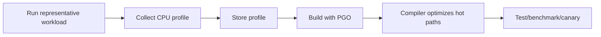
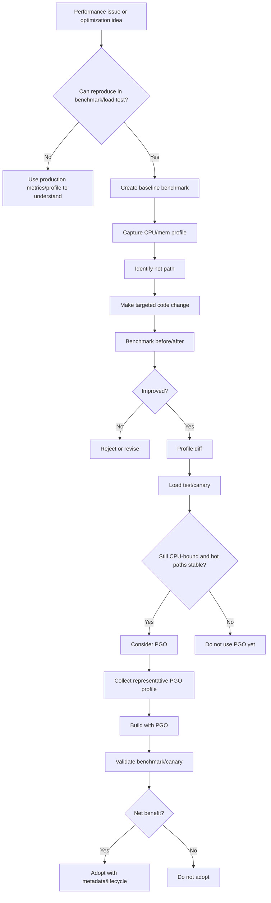

# learn-go-logging-observability-profiling-troubleshooting-part-019.md

# Part 019 — Benchmark Artifacts, Profiles, and PGO Workflow

> Seri: `learn-go-logging-observability-profiling-troubleshooting`  
> Bagian: `019 / 032`  
> Fokus: benchmark artifact discipline, pprof from benchmarks, before/after profile comparison, performance regression, Profile-Guided Optimization  
> Target pembaca: Java software engineer yang ingin membangun workflow performance engineering Go yang reproducible dan evidence-based

---

## 0. Posisi Bagian Ini dalam Seri

Bagian sebelumnya membahas:

- CPU profile,
- heap profile,
- GC observability,
- goroutine profile,
- block/mutex profile,
- runtime trace.

Bagian ini mengikat semua itu ke workflow engineering yang lebih disiplin:

```text
benchmark -> profile -> artifact -> compare -> optimize -> validate -> prevent regression
```

Ini penting karena banyak optimisasi gagal bukan karena engineer tidak tahu teknik, tetapi karena:

- benchmark tidak representatif,
- workload berubah,
- tidak ada baseline,
- profile tidak disimpan,
- artifact tidak bisa direproduksi,
- before/after tidak apple-to-apple,
- optimisasi hanya memindahkan cost,
- improvement tidak signifikan secara total,
- regression masuk lagi karena tidak ada gate,
- PGO dipakai dengan profile yang salah.

---

## 1. Core Thesis

**Performance engineering tanpa artifact discipline adalah opini.**

Kalimat yang perlu dihindari:

```text
"Sepertinya lebih cepat."
"CPU turun di laptop saya."
"Benchmark saya membaik."
"Profile-nya terlihat lebih bagus."
```

Kalimat yang lebih kuat:

```text
"Pada workload X, Go version Y, commit A vs B, dengan input dataset Z, median benchmark membaik 18%, B/op turun 42%, allocs/op turun 65%, CPU profile menunjukkan hot path JSON encode turun dari 38% ke 19%, dan p95 production canary turun dari 420ms ke 310ms."
```

Itu bedanya performance guess dengan performance evidence.

---

## 2. Benchmark vs Profile vs Production Metrics

Ketiganya menjawab pertanyaan berbeda.

| Tool | Pertanyaan | Kelebihan | Keterbatasan |
|---|---|---|---|
| Benchmark | seberapa cepat operasi tertentu dalam kondisi terkontrol? | reproducible, cepat, cocok untuk regression | bisa tidak representatif |
| Profile | cost code path mana yang dominan? | attribution detail | perlu workload representatif |
| Production metrics | apa dampak nyata di traffic production? | real workload, SLO relevant | noise, sulit isolasi |
| Runtime trace | bagaimana timeline runtime berlangsung? | temporal causality | mahal, short capture |
| Logs/traces | request context/failure narrative | causality domain | tidak memberi low-level cost detail |

Workflow matang menggabungkan semuanya.

---

## 3. Why Benchmarks Lie

Benchmark bisa menipu jika:

1. input terlalu kecil,
2. input terlalu bersih,
3. data distribution tidak realistis,
4. compiler mengeliminasi kerja,
5. setup cost masuk measurement,
6. benchmark mengukur allocation setup, bukan operation,
7. concurrency tidak sesuai production,
8. cache warmup tidak diperhitungkan,
9. CPU scaling/turbo/noise tidak dikontrol,
10. dependency eksternal tidak dimodelkan,
11. benchmark hanya micro tetapi bottleneck macro,
12. workload production berubah.

Benchmark yang buruk menghasilkan optimisasi yang buruk.

---

## 4. Benchmark Taxonomy

### 4.1 Microbenchmark

Mengukur fungsi kecil.

Contoh:

```go
func BenchmarkValidateCode(b *testing.B) {
	for b.Loop() {
		_ = ValidateCode("ABC-123456")
	}
}
```

Cocok untuk:

- parser kecil,
- formatter,
- validation,
- encoding utility,
- allocation reduction,
- data structure operation.

Risiko:

- tidak mewakili request end-to-end,
- compiler optimization,
- overfitting.

### 4.2 Component Benchmark

Mengukur komponen domain/infrastructure.

Contoh:

- report renderer,
- rule evaluator,
- JSON mapper,
- cache lookup,
- batch transform stage,
- HTTP middleware chain.

Cocok untuk regression gate.

### 4.3 End-to-End Benchmark

Mengukur service path lebih lengkap.

Contoh:

- HTTP handler with fake dependencies,
- worker job processing,
- batch pipeline,
- repository with local test DB.

Cocok untuk system behavior, tetapi lebih noisy.

### 4.4 Production Canary Measurement

Mengukur traffic nyata terbatas.

Cocok untuk final validation.

Risiko:

- traffic mix berbeda,
- noise deployment,
- autoscaling,
- external dependency variation.

---

## 5. Go Benchmark Basics

### 5.1 Basic Benchmark

```go
func BenchmarkRenderReport(b *testing.B) {
	report := loadFixtureReport(b)

	b.ResetTimer()

	for b.Loop() {
		_, err := RenderReport(report)
		if err != nil {
			b.Fatal(err)
		}
	}
}
```

`b.Loop()` adalah pattern modern untuk benchmark loop.

Jika memakai style lama:

```go
for i := 0; i < b.N; i++ {
	_, _ = RenderReport(report)
}
```

Tetap banyak ditemukan.

### 5.2 `b.ResetTimer`

Gunakan untuk mengeluarkan setup cost dari measurement.

```go
fixture := loadFixture(b)
b.ResetTimer()
for b.Loop() {
	process(fixture)
}
```

### 5.3 `b.StopTimer` / `b.StartTimer`

Gunakan bila perlu setup per iteration yang tidak ingin diukur.

```go
for b.Loop() {
	b.StopTimer()
	input := cloneInput(base)
	b.StartTimer()

	_ = process(input)
}
```

Hati-hati: terlalu banyak timer control bisa membuat benchmark kompleks/noisy.

### 5.4 `b.ReportAllocs`

```go
func BenchmarkX(b *testing.B) {
	b.ReportAllocs()
	for b.Loop() {
		_ = X()
	}
}
```

Atau CLI:

```bash
go test -bench . -benchmem
```

---

## 6. Avoiding Dead Code Elimination

Compiler bisa menghilangkan kerja jika result tidak digunakan.

Bad:

```go
func BenchmarkHash(b *testing.B) {
	for b.Loop() {
		sha256.Sum256(payload)
	}
}
```

Better:

```go
var sink [32]byte

func BenchmarkHash(b *testing.B) {
	for b.Loop() {
		sink = sha256.Sum256(payload)
	}
}
```

For object result:

```go
var resultSink Result

func BenchmarkProcess(b *testing.B) {
	for b.Loop() {
		resultSink = Process(input)
	}
}
```

Rule:

```text
Make benchmark result observable enough to prevent elimination, but not so much that sink dominates cost.
```

---

## 7. Benchmarking Allocations

Command:

```bash
go test ./internal/report -bench BenchmarkRender -benchmem
```

Example output:

```text
BenchmarkRenderReport-8    1200    980000 ns/op    450000 B/op    8200 allocs/op
```

Fields:

| Field | Meaning |
|---|---|
| ns/op | time per operation |
| B/op | bytes allocated per operation |
| allocs/op | allocation count per operation |

Interpretation:

- `ns/op` shows speed,
- `B/op` shows allocation volume,
- `allocs/op` shows object churn.

Sometimes reducing `allocs/op` matters more than small `ns/op` improvement because it reduces GC pressure in production.

---

## 8. Benchmark Noise

Benchmark results vary.

Sources:

- CPU frequency scaling,
- background processes,
- thermal throttling,
- OS scheduling,
- GC state,
- memory allocator state,
- test order,
- cache effects,
- laptop battery mode,
- virtualization,
- container CPU throttling,
- cloud noisy neighbor.

Mitigation:

1. run multiple counts,
2. compare with statistical tool,
3. isolate machine,
4. avoid running many apps,
5. pin environment if possible,
6. use representative input,
7. do not over-interpret tiny changes.

Command:

```bash
go test ./internal/report -bench BenchmarkRender -benchmem -count=10
```

---

## 9. Comparing Benchmarks

Use a comparison tool such as `benchstat` for repeated benchmark output.

Workflow:

```bash
go test ./internal/report -bench BenchmarkRender -benchmem -count=10 > before.txt
# make change
go test ./internal/report -bench BenchmarkRender -benchmem -count=10 > after.txt
benchstat before.txt after.txt
```

Interpret:

- percent change,
- statistical confidence,
- time/op,
- bytes/op,
- allocs/op.

Do not celebrate 1-2% change unless benchmark is stable and statistically meaningful.

---

## 10. Benchmark Artifact Directory

Performance artifacts should be stored with metadata.

Suggested structure:

```text
artifacts/perf/
  2026-06-23-report-renderer-json-optimization/
    README.md
    env.txt
    before/
      commit.txt
      bench.txt
      cpu.pb.gz
      mem.pb.gz
      trace.out
    after/
      commit.txt
      bench.txt
      cpu.pb.gz
      mem.pb.gz
      trace.out
    benchstat.txt
    conclusion.md
```

This allows future engineers to understand:

- what was measured,
- why,
- how,
- under what environment,
- what changed,
- what evidence supports the conclusion.

---

## 11. Environment Metadata

Capture:

```text
date/time
machine type
OS
CPU model
core count
memory
Go version
GOOS/GOARCH
GOMAXPROCS
GOGC
GOMEMLIMIT
commit SHA
branch
build tags
test command
input dataset
dependency versions
container limits if any
```

Command examples:

```bash
go version
go env
git rev-parse HEAD
git status --short
```

For Linux:

```bash
uname -a
lscpu
free -h
```

For Windows PowerShell:

```powershell
go version
go env
git rev-parse HEAD
Get-ComputerInfo | Select-Object OsName, OsVersion, CsProcessors, CsTotalPhysicalMemory
```

---

## 12. Profiles from Benchmarks

### 12.1 CPU Profile

```bash
go test ./internal/report \
  -run '^$' \
  -bench BenchmarkRenderReport \
  -benchmem \
  -cpuprofile cpu.out
```

Analyze:

```bash
go tool pprof -http=:0 cpu.out
```

With test binary:

```bash
go test -c ./internal/report -o report.test
./report.test -test.run '^$' -test.bench BenchmarkRenderReport -test.cpuprofile cpu.out
go tool pprof -http=:0 ./report.test cpu.out
```

### 12.2 Memory Profile

```bash
go test ./internal/report \
  -run '^$' \
  -bench BenchmarkRenderReport \
  -benchmem \
  -memprofile mem.out
```

Analyze allocation churn:

```bash
go tool pprof -sample_index=alloc_space -http=:0 mem.out
```

Analyze retained:

```bash
go tool pprof -sample_index=inuse_space -http=:0 mem.out
```

For benchmarks, `alloc_space` is often more useful.

### 12.3 Block and Mutex Profiles

```bash
go test ./internal/queue \
  -run '^$' \
  -bench BenchmarkSubmitParallel \
  -blockprofile block.out
```

```bash
go test ./internal/cache \
  -run '^$' \
  -bench BenchmarkStoreParallel \
  -mutexprofile mutex.out
```

### 12.4 Trace

```bash
go test ./internal/pipeline \
  -run TestPipelineLarge \
  -trace trace.out
go tool trace trace.out
```

---

## 13. Benchmarking HTTP Handlers

Avoid full network when testing handler logic unless you intentionally want network overhead.

Use `httptest`.

```go
func BenchmarkReportHandler(b *testing.B) {
	handler := newReportHandler(fakeRepo)

	req := httptest.NewRequest(http.MethodGet, "/reports?id=123", nil)

	b.ReportAllocs()
	b.ResetTimer()

	for b.Loop() {
		rr := httptest.NewRecorder()
		handler.ServeHTTP(rr, req)

		if rr.Code != http.StatusOK {
			b.Fatalf("unexpected status: %d", rr.Code)
		}
	}
}
```

Caveat:

- `httptest.ResponseRecorder` has its own allocation,
- request reuse must be safe,
- handler may mutate request context/body,
- dependency fakes must be realistic enough.

---

## 14. Benchmarking Middleware

Middleware can add hidden overhead:

- request ID generation,
- `slog` attr construction,
- metrics labels,
- tracing spans,
- panic recovery defers,
- response writer wrapper,
- route template lookup.

Benchmark middleware chain:

```go
func BenchmarkMiddlewareChain(b *testing.B) {
	final := http.HandlerFunc(func(w http.ResponseWriter, r *http.Request) {
		w.WriteHeader(http.StatusOK)
	})

	handler := RequestID(
		AccessLog(
			Metrics(
				Tracing(final),
			),
		),
	)

	req := httptest.NewRequest(http.MethodGet, "/v1/orders/123", nil)

	b.ReportAllocs()
	for b.Loop() {
		rr := httptest.NewRecorder()
		handler.ServeHTTP(rr, req)
	}
}
```

Compare:

- no middleware,
- logging only,
- metrics only,
- tracing only,
- full chain.

This reveals observability tax.

---

## 15. Benchmarking Concurrent Code

Use `b.RunParallel`.

```go
func BenchmarkCacheGetParallel(b *testing.B) {
	cache := NewCache()
	cache.Set("key", Value{})

	b.ReportAllocs()
	b.RunParallel(func(pb *testing.PB) {
		for pb.Next() {
			_, _ = cache.Get("key")
		}
	})
}
```

Vary CPU:

```bash
go test ./internal/cache -bench BenchmarkCacheGetParallel -benchmem -cpu=1,2,4,8
```

Interpret:

- does throughput scale?
- does allocation change?
- does contention appear?
- does mutex profile show lock wait?
- does performance collapse at higher concurrency?

---

## 16. Benchmarking Worker Pools

Worker pools require measuring:

- submit latency,
- job processing throughput,
- queue depth,
- cancellation,
- saturation behavior,
- memory retained by queue.

Benchmark:

```go
func BenchmarkWorkerPoolSubmit(b *testing.B) {
	pool := NewPool(16, 1024)
	ctx := context.Background()
	defer pool.Stop(ctx)

	job := Job{ID: "x"}

	b.ReportAllocs()
	b.RunParallel(func(pb *testing.PB) {
		for pb.Next() {
			if err := pool.Submit(ctx, job); err != nil {
				b.Fatal(err)
			}
		}
	})
}
```

This may benchmark submit only, not processing. Be explicit.

---

## 17. Benchmarking Serialization

Serialization often dominates Go services.

Benchmark:

```go
func BenchmarkMarshalReportJSON(b *testing.B) {
	report := loadLargeReportFixture(b)

	b.ReportAllocs()
	for b.Loop() {
		out, err := json.Marshal(report)
		if err != nil {
			b.Fatal(err)
		}
		if len(out) == 0 {
			b.Fatal("empty")
		}
	}
}
```

Variants:

- small/medium/large payload,
- typical/worst-case string data,
- typed struct vs map,
- streaming encoder,
- compression on/off,
- with/without HTML escaping if relevant,
- alternative schema design.

Do not only benchmark tiny payload.

---

## 18. Benchmarking Allocation Optimizations

Example before:

```go
func BuildKeys(items []Item) []string {
	out := make([]string, 0, len(items))
	for _, item := range items {
		out = append(out, fmt.Sprintf("%s:%d", item.Type, item.ID))
	}
	return out
}
```

After:

```go
func BuildKeys(items []Item) []string {
	out := make([]string, 0, len(items))
	for _, item := range items {
		out = append(out, item.Type+":"+strconv.FormatInt(item.ID, 10))
	}
	return out
}
```

Benchmark both.

But do not assume string concatenation always wins. Measure.

---

## 19. Representative Inputs

Input design matters.

For report renderer:

```text
small: 10 rows
medium: 1,000 rows
large: 100,000 rows
wide: many fields
string-heavy: long escaped strings
tenant-skewed: repeated keys
worst-case: missing cache, large nested fields
```

For validation:

```text
valid input
invalid short
invalid long
invalid unicode
worst-case pattern
random mix
```

For cache:

```text
high hit rate
low hit rate
hot key
uniform random
tenant skew
key cardinality explosion
```

Performance changes can differ by input shape.

---

## 20. Avoiding Benchmark Overfitting

A fix can improve microbenchmark but hurt system.

Example:

- pooling reduces allocations in benchmark,
- but increases retained memory in production,
- pool keeps huge buffers,
- p99 worsens under memory pressure.

Therefore validate:

1. microbenchmark,
2. component benchmark,
3. profile,
4. integration/load test,
5. canary metrics,
6. production runtime metrics.

---

## 21. Profile Diffing

Profile diff answers:

```text
What got cheaper or more expensive after change?
```

Command:

```bash
go tool pprof -base before/cpu.pb.gz ./app after/cpu.pb.gz
```

Web:

```bash
go tool pprof -http=:0 -base before/cpu.pb.gz ./app after/cpu.pb.gz
```

Memory diff:

```bash
go tool pprof -sample_index=alloc_space -base before/mem.pb.gz ./app after/mem.pb.gz
```

Use diff for:

- optimization validation,
- regression analysis,
- dependency upgrade,
- Go version upgrade,
- PGO validation,
- middleware overhead change.

---

## 22. Interpreting Profile Diff

If after profile has less cost in old hot path but more in new path, ask:

1. did total time improve?
2. did cost move elsewhere?
3. did allocation drop?
4. did latency improve?
5. did CPU improve under production load?
6. did memory footprint increase?
7. did correctness remain?
8. did code complexity increase too much?

Example:

```text
JSON encode -200ms
compression +150ms
total -50ms
```

Maybe improvement small.

Example:

```text
fmt.Sprintf -80%
strconv +20%
runtime.mallocgc -50%
total -30%
```

Likely useful.

---

## 23. Artifact Conclusion Template

Every performance change should have conclusion.

```markdown
# Performance Result: Report Renderer JSON Optimization

## Hypothesis

Double marshal and map-based DTO construction are causing allocation churn and CPU overhead.

## Workload

- fixture: large-report-100k.json
- Go: go1.26.0
- machine: ...
- command: ...

## Before

- ns/op:
- B/op:
- allocs/op:
- CPU profile top:
- mem alloc_space top:

## After

- ns/op:
- B/op:
- allocs/op:
- CPU profile top:
- mem alloc_space top:

## Result

- time/op improved:
- B/op improved:
- allocs/op improved:
- p95 load test improved:

## Trade-offs

- code complexity:
- API behavior:
- memory footprint:
- maintainability:

## Decision

Accept/reject.
```

---

## 24. Performance Regression Gates

For critical code paths, add benchmarks to CI.

But be careful:

- CI machines are noisy,
- hard fail on small ns/op changes can be flaky,
- allocation count gates are more stable,
- B/op and allocs/op can be useful,
- benchmark trend dashboards are better than brittle thresholds.

Good gate examples:

```text
allocs/op must not increase by >10% for report renderer
B/op must not exceed known budget
benchmark must exist for new serializer
CPU profile required for large performance PR
```

---

## 25. Benchmark Budgets

Define budgets for important paths.

Example:

```text
Report renderer large fixture:
- <= 1.2s/op
- <= 450MB/op
- <= 500k allocs/op

Auth middleware:
- <= 5 allocs/request
- <= 10µs overhead without tracing
```

Budgets are not universal. They are engineering contracts for your service.

---

## 26. Profile-Guided Optimization: Mental Model

Profile-Guided Optimization (PGO) uses runtime profile data to inform compiler optimization.

Instead of compiler guessing which paths are hot, PGO provides evidence from representative execution.

Simplified:



PGO is not magic.

It helps most when:

- profile is representative,
- hot paths are stable,
- CPU-bound code exists,
- compiler can exploit profile data,
- build pipeline uses correct profile,
- regression validation exists.

---

## 27. PGO in Go: Basic Workflow

Typical workflow:

1. collect CPU profile from representative workload,
2. name/store it as PGO profile,
3. build/test with PGO enabled,
4. compare performance,
5. commit/update profile intentionally if adopted.

Go convention often uses:

```text
default.pgo
```

in package/module context where build can discover it, or build flags depending on workflow.

Conceptual commands:

```bash
# collect CPU profile
curl -o cpu.pb.gz "http://localhost:6060/debug/pprof/profile?seconds=60"

# use profile in build/test
go build -pgo=cpu.pb.gz ./cmd/service
```

Or use auto/default behavior where applicable.

Always verify exact behavior for your Go version and build layout.

---

## 28. Good PGO Profile

A good PGO profile is:

1. representative,
2. stable,
3. collected from production-like workload,
4. not from incident/degraded mode,
5. not dominated by startup,
6. not dominated by one rare endpoint unless intentionally optimized,
7. tied to source version,
8. documented,
9. refreshed intentionally,
10. validated by benchmark/canary.

Bad PGO profile:

```text
CPU profile collected during retry storm
CPU profile from startup only
CPU profile from one synthetic tiny benchmark
CPU profile from old code version
CPU profile from debug build
CPU profile from error path
```

---

## 29. PGO Profile Source Options

| Source | Pros | Cons |
|---|---|---|
| Production steady-state | realistic | noisy, sensitive, access controlled |
| Staging load test | controlled | may not match production |
| Benchmark harness | reproducible | can overfit |
| Canary traffic | realistic and bounded | traffic mix may differ |
| Incident profile | captures real pain | biased/degraded, usually bad for general PGO |

Recommended:

```text
Use steady-state production-like profile, not incident profile, unless the binary is specifically optimized for that degraded workload and validated.
```

---

## 30. PGO Artifact Discipline

Store PGO profile with metadata:

```text
pgo/
  README.md
  default.pgo
  metadata.json
  source-profile.pb.gz
  collection-notes.md
```

Metadata:

```json
{
  "service": "payment-api",
  "go_version": "go1.26.0",
  "commit": "a1b2c3d",
  "collected_at": "2026-06-23T10:00:00Z",
  "duration_seconds": 60,
  "environment": "staging-loadtest",
  "workload": "checkout steady-state 70%, refund 10%, report 20%",
  "excluded": "startup, incident traffic",
  "owner": "platform-performance"
}
```

---

## 31. PGO Validation

Before accepting PGO:

1. run benchmark without PGO,
2. run benchmark with PGO,
3. compare CPU profiles,
4. run integration/load test,
5. canary deploy,
6. monitor:
   - CPU,
   - latency,
   - throughput,
   - memory,
   - GC,
   - binary size,
   - error rate.

Possible outcomes:

| Outcome | Interpretation |
|---|---|
| CPU improves, latency improves | good candidate |
| CPU improves, memory worsens | evaluate trade-off |
| benchmark improves, production unchanged | profile/workload mismatch |
| one endpoint improves, another worsens | profile bias |
| no change | PGO not useful for this code/workload |

---

## 32. PGO Lifecycle

PGO profile should not be eternal.

Refresh when:

- hot path changes,
- major feature added,
- traffic mix changes,
- Go version upgraded,
- major dependency changed,
- profile becomes stale,
- performance regression appears,
- module layout changes.

Do not update PGO profile casually in unrelated PR.

PGO update should be a deliberate performance change with artifact evidence.

---

## 33. PGO Risks

1. profile bias,
2. stale profile,
3. build reproducibility issues,
4. hidden performance regression in cold paths,
5. operational complexity,
6. larger binary or compile impact,
7. false confidence,
8. poor artifact tracking,
9. using sensitive production profile carelessly.

Mitigation:

- metadata,
- benchmark suite,
- canary,
- review,
- rollback,
- refresh policy.

---

## 34. Benchmark + Profile + PGO Decision Tree



---

## 35. Practical Workflow Example: JSON Report Optimization

### 35.1 Symptom

Production:

- report endpoint CPU high,
- p99 high for large reports,
- CPU profile shows JSON/allocations.

### 35.2 Benchmark

```go
func BenchmarkRenderLargeReport(b *testing.B) {
	report := loadFixture(b, "large-report-100k.json")

	b.ReportAllocs()
	for b.Loop() {
		out, err := Render(report)
		if err != nil {
			b.Fatal(err)
		}
		if len(out) == 0 {
			b.Fatal("empty")
		}
	}
}
```

### 35.3 Baseline

```bash
go test ./internal/report -bench BenchmarkRenderLargeReport -benchmem -count=10 > before.txt
go test ./internal/report -bench BenchmarkRenderLargeReport -cpuprofile before-cpu.pb.gz -memprofile before-mem.pb.gz
```

### 35.4 Change

- remove double marshal,
- typed DTO instead of `map[string]any`,
- preallocate rows,
- stream response where possible.

### 35.5 Compare

```bash
go test ./internal/report -bench BenchmarkRenderLargeReport -benchmem -count=10 > after.txt
benchstat before.txt after.txt

go test ./internal/report -bench BenchmarkRenderLargeReport -cpuprofile after-cpu.pb.gz -memprofile after-mem.pb.gz
go tool pprof -base before-cpu.pb.gz ./report.test after-cpu.pb.gz
```

### 35.6 Validate

- load test endpoint,
- canary deploy,
- monitor response size, CPU, p95/p99, allocation rate, GC CPU.

---

## 36. Practical Workflow Example: Middleware Observability Tax

### 36.1 Hypothesis

New logging/tracing middleware adds too much per-request overhead.

### 36.2 Benchmark Matrix

| Variant | Logging | Metrics | Tracing |
|---|---|---|---|
| baseline | off | off | off |
| logs | on | off | off |
| metrics | off | on | off |
| tracing | off | off | on |
| full | on | on | on |

### 36.3 Measure

```bash
go test ./internal/httpobs -bench BenchmarkMiddleware -benchmem -count=10
```

### 36.4 Profile

CPU/mem profile for full variant.

Look for:

- `slog`,
- JSON encoding,
- attribute allocation,
- Prometheus labels,
- OTel span creation,
- context values,
- response writer wrapper.

### 36.5 Decision

Optimize only if overhead is material relative to request budget.

---

## 37. Practical Workflow Example: Lock Contention

### 37.1 Symptom

High p99 with CPU normal.

### 37.2 Benchmark

```go
func BenchmarkCacheParallel(b *testing.B) {
	cache := NewCache()
	b.RunParallel(func(pb *testing.PB) {
		for pb.Next() {
			cache.Get("hot-key")
		}
	})
}
```

### 37.3 Capture Mutex Profile

```bash
go test ./internal/cache -bench BenchmarkCacheParallel -mutexprofile mutex.out
go tool pprof -http=:0 mutex.out
```

### 37.4 Change

- shard cache,
- immutable snapshot,
- reduce critical section.

### 37.5 Validate

- benchmark with `-cpu=1,2,4,8,16`,
- mutex profile diff,
- load test.

---

## 38. Windows PowerShell Artifact Script Example

Since many engineers work on Windows, keep workflow scriptable.

Example `run-bench.ps1`:

```powershell
param(
    [string]$Package = "./internal/report",
    [string]$Bench = "BenchmarkRenderLargeReport",
    [string]$OutDir = "artifacts/perf/latest"
)

New-Item -ItemType Directory -Force -Path $OutDir | Out-Null

go version | Out-File "$OutDir/go-version.txt"
go env | Out-File "$OutDir/go-env.txt"
git rev-parse HEAD | Out-File "$OutDir/commit.txt"
git status --short | Out-File "$OutDir/git-status.txt"

go test $Package `
    -run '^$' `
    -bench $Bench `
    -benchmem `
    -count=10 | Tee-Object "$OutDir/bench.txt"

go test $Package `
    -run '^$' `
    -bench $Bench `
    -benchmem `
    -cpuprofile "$OutDir/cpu.pb.gz" `
    -memprofile "$OutDir/mem.pb.gz" | Tee-Object "$OutDir/profile-run.txt"
```

Analyze:

```powershell
go tool pprof -http=:0 "$OutDir/cpu.pb.gz"
go tool pprof -sample_index=alloc_space -http=:0 "$OutDir/mem.pb.gz"
```

---

## 39. Common Mistakes

### 39.1 Benchmark Without `-benchmem`

You miss allocation regression.

### 39.2 Profile Without Benchmark Metadata

Future engineers cannot reproduce.

### 39.3 Benchmark Tiny Input Only

Large production input behaves differently.

### 39.4 Optimizing Non-Hot Code

Profile first.

### 39.5 Trusting One Run

Use repeated counts.

### 39.6 Ignoring Tail Latency

Benchmark average may improve while p99 worsens due to memory/lock behavior.

### 39.7 PGO from Incident Profile

Optimizes degraded/error path, not steady-state.

### 39.8 No Canary

Benchmark improvement does not guarantee production improvement.

### 39.9 Ignoring Correctness

Fast wrong code is worse than slow correct code.

### 39.10 Hiding Complexity Cost

A 3% speedup may not justify unreadable code.

---

## 40. Performance Review Checklist

For performance-related PR:

```text
[ ] What symptom or goal?
[ ] What workload?
[ ] What benchmark?
[ ] What input data?
[ ] What baseline?
[ ] What Go version?
[ ] What machine/env?
[ ] What changed?
[ ] What benchmark result?
[ ] What profile result?
[ ] What allocation result?
[ ] Any p99/load test result?
[ ] Any memory/GC trade-off?
[ ] Any correctness risk?
[ ] Any maintainability cost?
[ ] Any production validation plan?
```

---

## 41. PGO Review Checklist

```text
[ ] Is PGO profile representative?
[ ] Where was it collected?
[ ] What workload mix?
[ ] What commit/version?
[ ] Is profile steady-state, not incident?
[ ] Is metadata committed?
[ ] Is benchmark improvement shown?
[ ] Is production/canary improvement shown?
[ ] Any endpoint worsened?
[ ] Any memory/binary-size concern?
[ ] Refresh policy defined?
[ ] Rollback plan exists?
```

---

## 42. Exercises

### Exercise 1 — Benchmark Artifact Discipline

Pick one hot function from previous parts, such as JSON report rendering.

Tasks:

1. create benchmark,
2. run `-count=10`,
3. capture CPU profile,
4. capture memory profile,
5. store artifacts in directory,
6. write conclusion.md.

### Exercise 2 — Allocation Regression

Create before/after mapper:

- before: typed struct,
- after: `map[string]any`.

Tasks:

1. run benchmark,
2. compare `B/op` and `allocs/op`,
3. capture `alloc_space`,
4. explain why regression matters for GC.

### Exercise 3 — Profile Diff

Create optimization.

Tasks:

1. capture before CPU profile,
2. capture after CPU profile,
3. run `go tool pprof -base`,
4. explain what decreased and what increased.

### Exercise 4 — Middleware Tax

Benchmark middleware variants:

- no middleware,
- logging,
- metrics,
- tracing,
- full.

Tasks:

1. compare overhead,
2. capture profile,
3. identify allocation source,
4. optimize only if material.

### Exercise 5 — PGO Experiment

Use a CPU-bound representative benchmark/service.

Tasks:

1. collect CPU profile,
2. build/test with PGO,
3. compare benchmark,
4. inspect profile,
5. decide whether PGO is worth adopting.

---

## 43. What Good Looks Like

Anda memahami benchmark/profile/PGO workflow secara production-grade jika mampu:

1. membuat benchmark representatif,
2. menghindari dead code elimination,
3. mengukur time and allocation,
4. menjalankan repeated benchmark,
5. menyimpan artifact dengan metadata,
6. mengambil CPU/memory/block/mutex/trace dari benchmark,
7. membandingkan profile before/after,
8. menilai trade-off performance vs complexity,
9. membuat regression gate yang tidak flaky,
10. memakai PGO hanya dengan profile representatif,
11. memvalidasi improvement di load test/canary,
12. mendokumentasikan keputusan performance.

---

## 44. Summary

Performance engineering Go yang matang bukan sekadar menulis kode cepat.

Ia adalah workflow:

```text
observe -> hypothesize -> benchmark -> profile -> change -> compare -> validate -> guard
```

Benchmark memberi kontrol.

Profile memberi attribution.

Metrics memberi real-world impact.

Runtime trace memberi temporal causality.

PGO memberi compiler evidence, tetapi hanya jika profile-nya benar.

Jika artifact tidak disimpan, performance knowledge hilang.

Jika benchmark tidak representatif, optimisasi bisa salah arah.

Jika profile tidak dibandingkan, improvement bisa ilusi.

Jika PGO memakai profile buruk, compiler bisa mengoptimalkan workload yang salah.

---

## 45. Status Seri

Bagian ini adalah:

```text
learn-go-logging-observability-profiling-troubleshooting-part-019.md
```

Status:

```text
Part 019 dari 032
Seri belum selesai
```

Bagian berikutnya:

```text
learn-go-logging-observability-profiling-troubleshooting-part-020.md
```

Topik berikutnya:

```text
Troubleshooting Methodology for Go Services
```

<!-- NAVIGATION_FOOTER -->
<div class="page-nav">
<a href="./learn-go-logging-observability-profiling-troubleshooting-part-018.md">⬅️ Part 018 — Execution Tracing with `runtime/trace`</a>
<a href="./index.md">📚 Kategori</a>
<a href="../../index.md">🏠 Home</a>
<a href="./learn-go-logging-observability-profiling-troubleshooting-part-020.md">Part 020 — Troubleshooting Methodology for Go Services ➡️</a>
</div>
