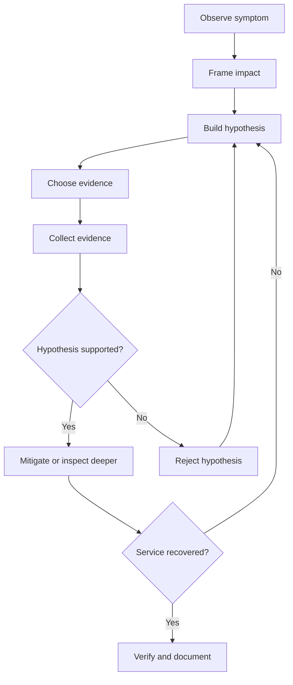
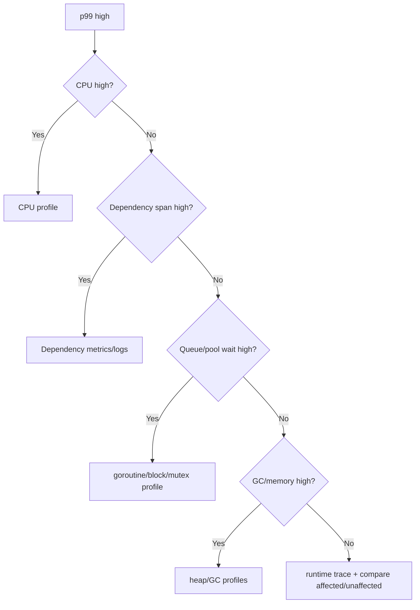

# learn-go-logging-observability-profiling-troubleshooting-part-020.md

# Part 020 — Troubleshooting Methodology for Go Services

> Seri: `learn-go-logging-observability-profiling-troubleshooting`  
> Bagian: `020 / 032`  
> Fokus: methodology, incident reasoning, hypothesis tree, evidence discipline, Go service troubleshooting workflow  
> Target pembaca: Java software engineer / tech lead yang ingin mendiagnosis Go service production secara sistematis, bukan reaktif

---

## 0. Posisi Bagian Ini dalam Seri

Part 011–019 sudah membahas alat diagnosis teknis:

- `pprof`,
- CPU profile,
- heap profile,
- GC observability,
- goroutine profile,
- block/mutex profile,
- runtime trace,
- benchmark/profile/PGO workflow.

Bagian ini mengikat semua alat itu dalam metode investigasi.

Karena dalam incident nyata, masalahnya bukan hanya:

```text
"Tool apa yang dipakai?"
```

Tetapi:

```text
"Bagaimana berpikir agar tidak salah arah?"
```

Production troubleshooting adalah kombinasi:

- observability,
- runtime knowledge,
- system thinking,
- hypothesis discipline,
- incident command,
- operational trade-off,
- evidence preservation,
- mitigation strategy,
- post-incident learning.

---

## 1. Core Thesis

**Troubleshooting yang matang bukan mencari dashboard sampai menemukan sesuatu yang terlihat aneh. Troubleshooting yang matang adalah proses membangun, menguji, dan membuang hypothesis berdasarkan evidence.**

Anti-pattern umum:

```text
1. Alert bunyi.
2. Buka banyak dashboard.
3. Cari grafik yang naik.
4. Tebak root cause.
5. Restart service.
6. Masalah hilang.
7. Root cause dianggap selesai.
```

Metode yang lebih kuat:

```text
1. Definisikan symptom.
2. Tentukan impact dan blast radius.
3. Bangun timeline.
4. Buat hypothesis tree.
5. Kumpulkan evidence paling murah dan relevan.
6. Validasi atau gugurkan hypothesis.
7. Mitigasi dengan risiko terkecil.
8. Simpan evidence sebelum hilang.
9. Konfirmasi recovery.
10. Tulis root cause dan prevention.
```

---

## 2. Symptom vs Cause

Symptom adalah apa yang terlihat.

Cause adalah mekanisme yang membuat symptom terjadi.

Contoh:

| Symptom | Possible Cause |
|---|---|
| CPU high | JSON payload growth, allocation churn, infinite loop, compression, GC, crypto |
| p99 latency high | CPU saturation, DB wait, queue saturation, lock contention, GC assist, downstream slow |
| memory high | retained heap, allocation burst, goroutine leak, native memory, cache, queue |
| goroutine count high | load, leak, blocked send, HTTP connection leak, worker saturation |
| error rate high | dependency failure, timeout budget too short, validation bug, DB deadlock, deployment regression |
| OOMKilled | heap growth, stack growth, native memory, too low limit, allocation burst |
| 5xx spike | panic, timeout, circuit breaker, DB pool exhaustion, bad release |
| throughput drop | lock contention, pool saturation, CPU throttling, backpressure, downstream slow |

Mistake:

```text
"CPU high" is not root cause.
"DB slow" is not root cause unless you know why or whether app caused it.
"Restart fixed it" is not root cause.
```

---

## 3. The First Question: What Exactly Is Broken?

Saat incident, pertanyaan pertama bukan "kenapa".

Pertanyaan pertama:

```text
Apa yang broken, untuk siapa, sejak kapan, dan seberapa parah?
```

Checklist:

```text
[ ] Service apa?
[ ] Endpoint/job/consumer apa?
[ ] Environment apa?
[ ] Region/cluster/node/pod apa?
[ ] Tenant/user segment apa?
[ ] Error atau latency atau throughput atau data correctness?
[ ] Mulai jam berapa?
[ ] Masih berlangsung?
[ ] Impact meningkat atau stabil?
[ ] Ada deployment/config/traffic change?
```

Tanpa framing ini, Anda bisa menganalisis pod sehat atau dashboard yang tidak relevan.

---

## 4. Impact and Blast Radius

Blast radius menjawab:

```text
Seberapa luas masalah?
```

Dimensi blast radius:

1. service,
2. endpoint,
3. tenant,
4. region,
5. dependency,
6. version,
7. pod/node,
8. request type,
9. data size,
10. user role,
11. background job,
12. queue partition,
13. DB shard/schema,
14. external provider.

Example:

```text
Bad framing:
"payment-api slow."

Better framing:
"payment-api POST /checkout p99 increased from 350ms to 4s for version v2026.06.23.2, only on pods in zone-a, starting 10:04 UTC after rollout. GET endpoints unaffected. Error rate still below 1%."
```

This narrows the hypothesis space dramatically.

---

## 5. Timeline Reconstruction

Timeline is the backbone of incident reasoning.

Build it early.

Example:

```text
10:00 deployment v2 started
10:03 first pod v2 ready
10:04 p99 checkout latency increased
10:05 CPU on v2 pods increased
10:06 goroutine count stable
10:07 allocation rate increased 4x
10:09 CPU profile captured
10:12 rollback started
10:16 p99 recovered
```

Timeline helps answer:

- did symptom start before or after deployment?
- did mitigation precede recovery?
- did dependency fail first?
- did app overload cause dependency failure?
- did autoscaling hide the symptom?
- did restart destroy evidence?

---

## 6. Evidence Hierarchy

Not all evidence has equal quality.

### 6.1 Strong Evidence

- time-aligned metrics,
- profile captured during symptom,
- logs with correlation ID,
- distributed trace of slow request,
- heap profile before restart,
- code diff matching symptom,
- reproducible benchmark,
- canary comparison,
- database wait metrics,
- queue depth/wait metrics.

### 6.2 Weak Evidence

- memory from one point in time,
- one log line without context,
- profile from idle pod,
- dashboard screenshot after recovery,
- anecdotal user report,
- "it worked before",
- "restart fixed it",
- CPU profile from local toy input,
- assumptions about dependency.

### 6.3 Dangerous Evidence

- stale dashboard,
- wrong pod/version,
- averaged metrics hiding tail,
- raw path labels with cardinality issue,
- sampled trace not representing incident,
- missing deployment markers,
- clock skew,
- profile captured after mitigation.

---

## 7. Hypothesis Tree

Instead of one guess, build a tree.

Example: p99 latency high.

```mermaid
flowchart TD
    A[p99 latency high] --> B[CPU-bound]
    A --> C[Wait-bound]
    A --> D[Dependency-bound]
    A --> E[GC/memory-bound]
    A --> F[Network/platform-bound]
    A --> G[Traffic/data-shape change]

    B --> B1[algorithm hot path]
    B --> B2[serialization]
    B --> B3[compression/crypto]
    B --> B4[logging/telemetry overhead]

    C --> C1[lock contention]
    C --> C2[channel queue full]
    C --> C3[DB pool wait]
    C --> C4[semaphore saturation]

    D --> D1[DB slow]
    D --> D2[external HTTP slow]
    D --> D3[message broker slow]
    D --> D4[cache slow]

    E --> E1[allocation churn]
    E --> E2[live heap growth]
    E --> E3[GC assist]
    E --> E4[memory limit thrashing]

    F --> F1[CPU throttling]
    F --> F2[DNS]
    F --> F3[TLS/connect]
    F --> F4[node pressure]

    G --> G1[larger payload]
    G --> G2[tenant skew]
    G --> G3[batch overlap]
    G --> G4[traffic spike]
```



Each branch needs evidence to confirm or reject.

---

## 8. Hypothesis Testing

A good hypothesis is testable.

Bad:

```text
"Maybe Go runtime is slow."
```

Better:

```text
"Latency is CPU-bound because CPU usage on affected pods is >90%, CPU throttling is low, and CPU profile during symptom shows 45% cumulative in report JSON encoding."
```

Bad:

```text
"Maybe DB issue."
```

Better:

```text
"Requests are waiting for DB connections because DB pool WaitDuration increased exactly when p99 increased, traces show delay before query start, and database server query latency is normal."
```

Each hypothesis should specify:

1. expected evidence if true,
2. evidence that would falsify it,
3. cheapest next check.

---

## 9. Cheap Evidence First

During incident, choose evidence with high information value and low risk.

Example order for latency:

1. metrics:
   - request rate/error/latency,
   - CPU/memory,
   - goroutines,
   - queue/pool,
   - dependency latency.
2. logs:
   - error boundary,
   - deployment,
   - timeout/cancellation.
3. traces:
   - slow request path.
4. profiles:
   - CPU if CPU high,
   - goroutine/block/mutex if wait-bound,
   - heap if memory/GC.
5. runtime trace:
   - if timeline/scheduler/blocking unclear.

Do not immediately capture heavy trace if simple metrics show DB pool wait.

---

## 10. Tool Selection Matrix

| Symptom | First Evidence | Next Tool |
|---|---|---|
| CPU high | CPU metrics, throttling | CPU profile |
| Memory high | RSS, heap live, limit | heap profile, goroutine profile |
| Latency high + CPU high | RED + CPU | CPU profile, trace |
| Latency high + CPU low | RED + queue/pool | goroutine/block/mutex, OTel trace |
| Goroutine count rising | runtime metrics | goroutine profile |
| OOMKilled | k8s event + memory graph | heap/goroutine if before restart |
| GC CPU high | runtime metrics | CPU + heap alloc/inuse |
| Queue backlog | queue metrics | goroutine/block profile |
| DB wait | DB pool stats | traces, DB metrics |
| External timeout | client metrics | OTel traces, logs |
| Shutdown hang | shutdown logs | goroutine profile |
| Regression after release | deployment diff | canary compare, profile diff |

---

## 11. Go-Specific Troubleshooting Lens

Go services have common runtime-specific failure categories.

### 11.1 Goroutine Lifecycle

Questions:

- did goroutine count rise?
- are goroutines blocked?
- is cancellation propagated?
- does shutdown complete?
- are goroutines capturing large objects?

### 11.2 Allocation and GC

Questions:

- did allocation rate change?
- did live heap change?
- is GC CPU high?
- are profiles showing `mallocgc`, `scanobject`, `gcAssistAlloc`?

### 11.3 Context and Timeout

Questions:

- are timeouts consistent?
- is context propagated?
- is cancellation logged correctly?
- are retries respecting deadline?

### 11.4 Channel and Backpressure

Questions:

- are queues bounded?
- what happens when full?
- do sends/selects honor context?
- is queue depth visible?

### 11.5 HTTP Client Behavior

Questions:

- are clients/transports reused?
- are response bodies closed?
- are timeouts set?
- is connection pooling visible?
- are retries causing storms?

### 11.6 Container Runtime

Questions:

- is CPU throttled?
- is memory limit appropriate?
- is pod restarted?
- is node under pressure?
- is DNS/CoreDNS slow?

---

## 12. The Incident Reasoning Loop



Important:

- Do not cling to first hypothesis.
- Evidence can partially support multiple branches.
- Mitigation can happen before full root cause if impact is severe.
- Capture evidence before destructive mitigation if safe.

---

## 13. Mitigation vs Root Cause

Mitigation restores service.

Root cause explains mechanism.

Examples:

| Mitigation | Possible Root Cause |
|---|---|
| restart pod | goroutine leak, memory leak, stuck connection |
| rollback | release introduced allocation/bug/config |
| scale out | CPU-bound or queue-bound load |
| reduce concurrency | downstream saturation/retry storm |
| disable feature flag | endpoint hot path/regression |
| increase DB pool | pool underprovisioned or query too slow |
| increase memory | real workload growth or leak hidden |
| open circuit breaker | dependency failure |

Mitigation is allowed before full root cause when user impact is high.

But do not confuse mitigation with explanation.

---

## 14. Evidence Preservation Before Mitigation

Some evidence disappears after:

- restart,
- rollback,
- autoscaling,
- cache clear,
- queue drain,
- failover,
- DB session kill.

If safe, capture minimal evidence first:

```text
High CPU:
- CPU profile 30s
- metrics window
- build info

Memory/OOM:
- heap before/after GC
- goroutine profile
- memory graph

Goroutine leak:
- goroutine debug2
- heap profile
- queue metrics

Latency wait-bound:
- goroutine profile
- block/mutex profile if enabled
- traces
```

If system is on fire, mitigation wins. But capture when low-risk.

---

## 15. Avoiding Dashboard Archaeology

Dashboard archaeology:

```text
Opening dashboard after dashboard until one chart looks weird.
```

Problems:

- confirmation bias,
- wrong timescale,
- averages hide tails,
- unrelated correlation,
- stale panels,
- high-cardinality distortion,
- no hypothesis.

Better:

1. define question,
2. choose panel,
3. set exact time window,
4. compare affected vs unaffected,
5. compare before vs after,
6. correlate with deployment/traffic,
7. decide next evidence.

Example:

```text
Question:
Is latency CPU-bound?

Panels:
- CPU usage
- CPU throttling
- p99 latency
- request rate
- CPU profile during window

Not:
- random JVM-like dashboards
- unrelated node disk panels
```

---

## 16. Compare Affected vs Unaffected

One of the strongest techniques:

```text
affected pod/version/tenant/endpoint
vs
unaffected pod/version/tenant/endpoint
```

Examples:

- v2 pods high CPU, v1 pods normal.
- zone-a slow, zone-b normal.
- tenant with huge payload slow, others normal.
- endpoint `/export` slow, `/summary` normal.
- batch worker pod affected, API pod normal.
- pod on one node OOMs, others fine.

Comparison reduces guesswork.

---

## 17. Deployment Correlation

Deployment is not always cause, but it is high-signal.

Check:

```text
[ ] image version
[ ] config map/secret changes
[ ] feature flags
[ ] dependency version
[ ] Go version
[ ] resource requests/limits
[ ] HPA config
[ ] environment variables
[ ] database migration
[ ] schema change
[ ] traffic routing
```

Ask:

- did symptom start after rollout?
- only new version affected?
- canary showed issue?
- rollback fixed?
- did profile diff show new hot path?

Strong deployment-root evidence requires more than timing.

---

## 18. Traffic and Data Shape Correlation

Performance often changes because input changed.

Check:

- request rate,
- payload size,
- response size,
- tenant mix,
- endpoint mix,
- batch size,
- queue replay,
- cache hit rate,
- cardinality,
- query parameter distribution,
- file size,
- number of rows/entities.

Example:

```text
No code change, CPU doubled.
Root cause: one tenant uploaded 10x larger files, triggering XML decode allocation burst.
```

Without data-shape metrics, this looks mysterious.

---

## 19. Latency Troubleshooting First Pass

When p99 latency spikes:

1. Is request rate higher?
2. Is error rate higher?
3. Is CPU high?
4. Is CPU throttling high?
5. Is memory/GC high?
6. Is goroutine count high?
7. Is queue depth high?
8. Is DB pool wait high?
9. Is dependency latency high?
10. Is only one endpoint affected?
11. Is only one version affected?
12. Is payload/response size higher?

Then choose tool.



---

## 20. Error Rate Troubleshooting First Pass

When errors spike:

1. Which status/error code?
2. Which endpoint/job?
3. New errors or existing errors?
4. Dependency timeout?
5. Panic?
6. Context deadline?
7. Validation rejects?
8. DB errors?
9. Auth errors?
10. Queue publish errors?
11. Deployment correlated?
12. Retries increasing?
13. Circuit breaker open?
14. Are errors logged once at boundary?

Use error classification from earlier parts.

Important:

```text
An error spike can be downstream symptom of latency. Do not treat errors separately from saturation.
```

---

## 21. Memory Troubleshooting First Pass

When memory rises:

1. RSS or heap live?
2. Heap after GC high?
3. Allocation rate high?
4. GC CPU high?
5. Goroutine count high?
6. Stack memory high?
7. Cache/queue size high?
8. Payload/file size high?
9. cgo/mmap/native memory?
10. OOMKilled?
11. `GOMEMLIMIT` configured?
12. Deployment/data change?

Tool:

- heap `inuse_space`,
- heap `alloc_space`,
- goroutine profile,
- runtime metrics,
- container metrics.

---

## 22. Throughput Troubleshooting First Pass

When throughput drops:

1. traffic dropped or service cannot process?
2. CPU saturated?
3. CPU throttled?
4. queue saturated?
5. dependency slow?
6. lock contention?
7. DB pool wait?
8. worker count reduced?
9. autoscaling issue?
10. rate limiter active?
11. load shedding active?
12. retry storm consuming capacity?

Throughput collapse often has hidden bottleneck:

```text
one constrained shared resource forces all requests to queue
```

---

## 23. The Invariant Method

An invariant is a property that should remain true.

Examples for Go services:

```text
Every request context should be cancelled or complete.
Every goroutine started by a component should stop when component stops.
Every HTTP response body should be closed.
Every queue should be bounded.
Every retry loop should have max attempts/deadline.
Every transaction should be short-lived.
Every DB Rows should be closed.
Every cache should have size/TTL policy.
Every log should avoid secrets.
Every outbound call should have timeout.
Every channel send in request path should respect context.
```

Troubleshooting becomes easier when you ask:

```text
Which invariant was violated?
```

---

## 24. Causal Chain

Root cause is usually a chain, not one event.

Example:

```text
New release adds audit event payload.
Payload size increases.
Audit queue item size increases.
Downstream audit service slows.
Worker queue fills.
Request goroutines block on audit send.
Goroutine count and memory rise.
p99 latency spikes.
Users see timeouts.
```

Bad RCA:

```text
Audit service was slow.
```

Better RCA:

```text
The application had a blocking audit submission path with no timeout/backpressure policy. When audit downstream slowed, request goroutines blocked on a full channel while retaining request payloads, causing p99 latency and memory growth.
```

---

## 25. Root Cause Categories

For Go services, classify RCA into categories:

1. code defect,
2. lifecycle/cancellation defect,
3. resource leak,
4. unbounded resource,
5. bad timeout/retry policy,
6. dependency failure,
7. capacity misconfiguration,
8. deployment/config regression,
9. data-shape change,
10. observability overhead,
11. platform issue,
12. database issue,
13. external provider issue,
14. operational procedure gap,
15. missing alert/dashboard/runbook.

A good postmortem often includes more than one category.

---

## 26. Decision to Rollback

Rollback is appropriate when:

- symptom correlates strongly with release,
- impact high,
- rollback risk lower than continued impact,
- no quick safe fix,
- canary/new version only affected,
- data migration not irreversible or rollback plan exists.

Rollback may not help when:

- dependency outage,
- traffic spike,
- data growth,
- platform issue,
- old version also affected,
- database migration changed shared state,
- queue backlog persists.

Before rollback if safe:

- capture profile,
- capture logs/traces,
- capture metrics window,
- note version.

---

## 27. Decision to Scale

Scaling out helps when:

- bottleneck is horizontally scalable,
- CPU-bound app work,
- no shared downstream saturation,
- stateless service,
- load balancer distributes well.

Scaling out may hurt when:

- DB already saturated,
- external dependency rate-limited,
- lock/global resource shared,
- queue consumer downstream slow,
- retry storm,
- cache stampede,
- per-pod memory leak persists,
- autoscaling hides root cause.

Rule:

```text
Scale only after identifying whether bottleneck is local or shared.
```

---

## 28. Decision to Restart

Restart helps temporarily when:

- memory leak,
- goroutine leak,
- stuck connection,
- corrupted in-memory state,
- deadlocked component,
- runaway cache,
- exporter stuck.

But restart destroys evidence.

If safe, capture:

- goroutine profile,
- heap profile,
- CPU profile if relevant,
- build info,
- logs window.

Restart as mitigation should create follow-up root cause work.

---

## 29. Decision to Increase Limits

Increasing CPU/memory/pool limits can be valid.

But ask:

### CPU

- is app CPU-bound?
- is throttling high?
- will more CPU reduce p99?
- is hot path expected?

### Memory

- is workload legitimately larger?
- is heap bounded?
- is OOM due to leak?
- is `GOMEMLIMIT` set?

### DB Pool

- is DB underutilized?
- are queries slow?
- are transactions too long?
- will more connections overload DB?

### Worker Count

- can downstream handle more?
- will it increase contention?
- is queue full because workers too few or jobs too slow?

Limit increase without root cause can turn local failure into shared failure.

---

## 30. Incident Notes Template

Use during investigation.

```markdown
# Incident Notes

## Summary

## Impact

- users:
- endpoints/jobs:
- error/latency:
- start time:
- current status:

## Timeline

- HH:MM event
- HH:MM evidence
- HH:MM mitigation

## Current Hypotheses

1. Hypothesis:
   - evidence for:
   - evidence against:
   - next check:

2. Hypothesis:
   - evidence for:
   - evidence against:
   - next check:

## Evidence Collected

- metrics:
- logs:
- traces:
- profiles:
- runtime trace:
- deployment/config:

## Mitigations

- action:
- expected effect:
- actual effect:

## Root Cause Draft

## Follow-ups
```

---

## 31. Strong Incident Communication

During incident, communicate:

1. what is known,
2. what is unknown,
3. impact,
4. next action,
5. ETA only if justified,
6. risk,
7. mitigation status.

Bad:

```text
We think it is fixed.
```

Better:

```text
Rollback completed at 10:16. p99 latency returned to baseline by 10:20 and error rate is below alert threshold. We are keeping monitoring for 30 minutes. Root cause appears related to allocation increase in report rendering; CPU profile captured before rollback supports this, but final RCA pending profile review.
```

---

## 32. Troubleshooting with Limited Observability

Sometimes telemetry is missing.

Fallback:

- compare pods,
- use runtime profiles,
- inspect logs around boundary,
- add temporary safe metrics,
- reproduce in staging,
- use load test,
- enable debug endpoint in controlled way,
- inspect dependency dashboards,
- check deployment diff,
- check Kubernetes events.

But make prevention item:

```text
Missing metric/profile/runbook delayed diagnosis.
```

---

## 33. Common Troubleshooting Anti-Patterns

### 33.1 First Hypothesis Lock-In

You guess DB and ignore evidence pointing to app pool wait.

### 33.2 Restart Reflex

Restart fixes symptom but destroys root cause.

### 33.3 Average-Based Reasoning

Average latency normal; p99 broken.

### 33.4 Dashboard Archaeology

Random panels, no hypothesis.

### 33.5 Blaming Dependency Too Early

App may be overloading dependency.

### 33.6 Ignoring Data Shape

No code change, but input changed.

### 33.7 Ignoring Resource Limits

CPU throttling or memory limit can dominate.

### 33.8 No Comparison

Affected vs unaffected not checked.

### 33.9 Profile After Recovery

Profile no longer represents issue.

### 33.10 Treating Alert as RCA

Alert says symptom, not cause.

---

## 34. Case Study 1: High CPU After Release

### Symptom

- p99 latency high.
- CPU high on new version only.
- error rate normal.

### Hypothesis Tree

1. CPU-bound regression.
2. GC/allocation churn.
3. traffic shift.
4. dependency wait.

### Evidence

- v2 pods CPU 3x v1 pods.
- CPU profile shows `encoding/json` and `runtime.mallocgc`.
- allocation rate 4x.
- response size metric increased.
- deployment diff added nested details field.

### Mitigation

- rollback.
- p99 recovered.

### Root Cause

New response field caused payload size explosion and allocation-heavy JSON rendering on hot endpoint.

### Prevention

- response size metric alert,
- benchmark large report,
- contract review for payload size,
- canary CPU profile,
- pagination.

---

## 35. Case Study 2: Latency High CPU Low

### Symptom

- p99 high.
- CPU 30%.
- goroutine count rising.
- queue depth full.

### Evidence

Goroutine profile:

```text
[chan send] myapp/worker.Submit
```

Block profile:

```text
worker.Submit dominates block time
```

Traces:

- wait before processing.

Root cause:

- downstream worker dependency slow;
- request path blocks on bounded queue without timeout.

Mitigation:

- fail fast when queue full,
- reduce traffic,
- open circuit breaker.

Prevention:

- queue wait metric,
- backpressure policy,
- dependency timeout,
- load shedding.

---

## 36. Case Study 3: OOMKilled

### Symptom

- pod OOM every 4 hours.
- heap live grows.
- goroutine count stable.

Evidence:

- heap `inuse_space` points to cache set.
- cache entries monotonic.
- key cardinality high.
- key includes request timestamp.

Mitigation:

- restart pods,
- disable cache feature.

Root cause:

- unbounded cache with timestamp key prevented reuse/eviction.

Prevention:

- bounded cache,
- TTL,
- cache size metrics,
- memory alert,
- key review.

---

## 37. Case Study 4: Retry Storm

### Symptom

- external dependency degraded.
- app CPU and outbound traffic spike.
- error rate high.
- queue backlog grows.

Evidence:

- logs show repeated retries.
- traces show multiple attempts per request.
- dependency returns 429.
- retry policy ignores global deadline.
- goroutine count rises.

Root cause:

- retry policy amplified dependency failure and consumed app capacity.

Fix:

- exponential backoff with jitter,
- max attempts,
- respect context deadline,
- circuit breaker,
- rate limiting,
- retry budget metric.

---

## 38. Case Study 5: Observability Caused Incident

### Symptom

- after enabling debug logs, CPU rises.
- log volume 20x.
- p99 high.
- log sink throttled.

Evidence:

- CPU profile shows log attr construction and JSON encoding.
- mutex profile shows logger writer contention.
- log pipeline backpressure.
- debug log builds payload even when not needed in some paths.

Root cause:

- observability added unbounded logging cost in hot path.

Prevention:

- log level guard,
- sampling,
- no payload logging,
- log volume budget,
- benchmark middleware/logging,
- observability change canary.

---

## 39. Post-Incident Learning

Every incident should improve at least one:

1. code invariant,
2. test coverage,
3. benchmark,
4. metric,
5. alert,
6. dashboard,
7. runbook,
8. deployment safety,
9. capacity model,
10. operational ownership.

Bad follow-up:

```text
Monitor more.
```

Better:

```text
Add queue_submit_wait_duration histogram and alert when p95 > 100ms for 10m; update worker submit to respect request context with max wait 50ms; add load test for downstream slowdown.
```

---

## 40. Troubleshooting Checklist

```text
[ ] Symptom precisely defined.
[ ] Impact and blast radius known.
[ ] Timeline started.
[ ] Affected vs unaffected compared.
[ ] Deployment/config changes checked.
[ ] Traffic/data-shape changes checked.
[ ] Hypothesis tree created.
[ ] Evidence chosen intentionally.
[ ] Profiles captured before destructive mitigation if safe.
[ ] Metrics/logs/traces correlated by time.
[ ] Mitigation separated from root cause.
[ ] Recovery verified.
[ ] RCA explains mechanism, not just symptom.
[ ] Prevention item is concrete and testable.
```

---

## 41. Exercises

### Exercise 1 — Build Hypothesis Tree

Given symptom:

```text
p99 latency high, CPU low, goroutine count rising
```

Write a hypothesis tree with at least:

- queue saturation,
- DB pool wait,
- downstream slow,
- lock contention,
- goroutine leak,
- CPU throttling false positive.

For each, define evidence that confirms/rejects it.

### Exercise 2 — Incident Timeline

Take any previous lab from profiling parts.

Write timeline:

- first symptom,
- evidence captured,
- mitigation,
- recovery,
- root cause.

### Exercise 3 — Affected vs Unaffected

Simulate two versions:

- v1 normal,
- v2 adds expensive JSON field.

Compare:

- CPU,
- p99,
- response size,
- CPU profile,
- allocation profile.

### Exercise 4 — Mitigation Decision

Given:

```text
DB pool wait high, DB CPU already 95%
```

Should you increase app DB pool size? Explain.

### Exercise 5 — Write RCA

Use one case study and write:

```text
Root cause:
Contributing factors:
What detected it:
What delayed diagnosis:
What prevented worse impact:
Action items:
```

---

## 42. What Good Looks Like

Anda mampu troubleshooting Go service secara top-tier jika:

1. tidak loncat ke root cause tanpa evidence,
2. membedakan symptom, cause, contributing factor, mitigation,
3. membangun hypothesis tree,
4. memilih tool berdasarkan pertanyaan,
5. membandingkan affected vs unaffected,
6. mengamankan evidence sebelum hilang,
7. memahami Go runtime failure modes,
8. melakukan mitigation dengan risk reasoning,
9. menulis causal chain yang jelas,
10. mengubah incident menjadi invariant, metric, test, runbook, atau design improvement.

---

## 43. Summary

Troubleshooting bukan aktivitas acak membuka dashboard.

Troubleshooting adalah proses berpikir:

```text
frame -> hypothesize -> test -> mitigate -> verify -> learn
```

Go memberi banyak alat kuat:

- logs,
- metrics,
- traces,
- pprof,
- runtime metrics,
- runtime trace,
- benchmarks.

Tetapi alat yang kuat tanpa metode bisa mempercepat kesimpulan salah.

Metode yang benar membuat Anda:

- lebih cepat menemukan root cause,
- lebih aman memitigasi,
- lebih sedikit merusak evidence,
- lebih jelas berkomunikasi,
- lebih kuat mencegah incident berulang.

---

## 44. Status Seri

Bagian ini adalah:

```text
learn-go-logging-observability-profiling-troubleshooting-part-020.md
```

Status:

```text
Part 020 dari 032
Seri belum selesai
```

Bagian berikutnya:

```text
learn-go-logging-observability-profiling-troubleshooting-part-021.md
```

Topik berikutnya:

```text
Latency Troubleshooting
```

<!-- NAVIGATION_FOOTER -->
<div class="page-nav">
<a href="./learn-go-logging-observability-profiling-troubleshooting-part-019.md">⬅️ Part 019 — Benchmark Artifacts, Profiles, and PGO Workflow</a>
<a href="./index.md">📚 Kategori</a>
<a href="../../index.md">🏠 Home</a>
<a href="./learn-go-logging-observability-profiling-troubleshooting-part-021.md">Part 021 — Latency Troubleshooting ➡️</a>
</div>
