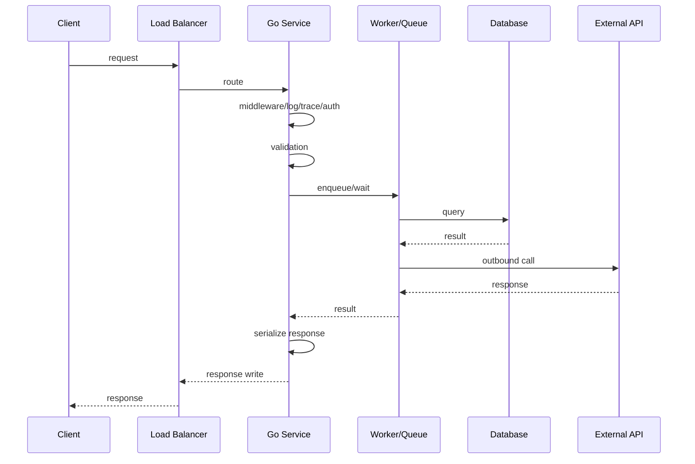
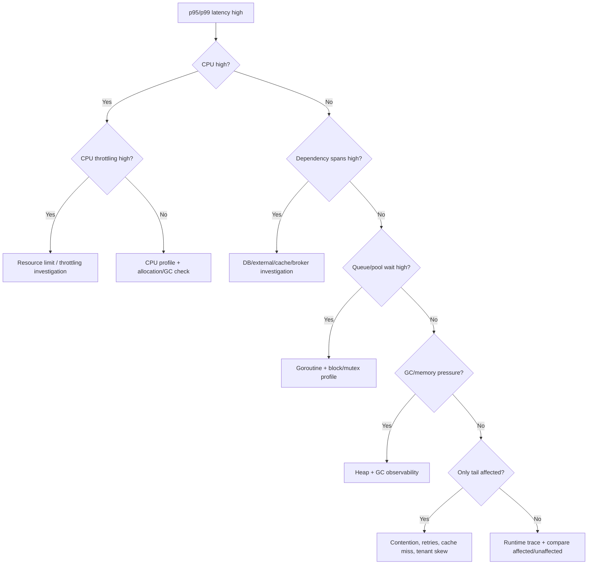
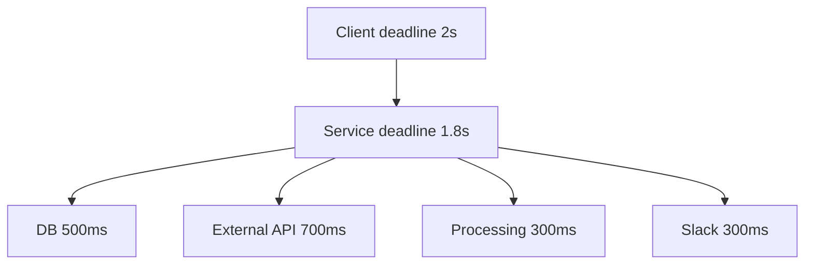

# learn-go-logging-observability-profiling-troubleshooting-part-021.md

# Part 021 — Latency Troubleshooting

> Seri: `learn-go-logging-observability-profiling-troubleshooting`  
> Bagian: `021 / 032`  
> Fokus: latency diagnosis, p95/p99, critical path, timeout budget, CPU-bound vs wait-bound latency, Go service latency workflow  
> Target pembaca: Java software engineer / tech lead yang ingin mendiagnosis latency Go service secara production-grade

---

## 0. Posisi Bagian Ini dalam Seri

Part 020 membahas metodologi troubleshooting umum:

- symptom vs cause,
- blast radius,
- timeline,
- hypothesis tree,
- evidence hierarchy,
- tool selection,
- mitigation vs root cause.

Bagian ini mempersempit fokus ke salah satu symptom production paling umum dan paling sulit:

```text
latency
```

Latency sulit karena ia bisa berasal dari hampir semua layer:

- CPU hot path,
- allocation/GC,
- scheduler delay,
- lock contention,
- channel/queue blocking,
- DB pool wait,
- DB query slow,
- external HTTP slow,
- DNS/TLS/connect,
- retry/backoff,
- timeout budget salah,
- payload size,
- response streaming,
- CPU throttling,
- memory pressure,
- noisy neighbor,
- logging/telemetry overhead,
- client-side behavior.

Latency juga sulit karena angka seperti "average latency" sering menipu.

Production engineer yang matang membaca latency sebagai distribusi, bukan angka tunggal.

---

## 1. Core Thesis

**Latency troubleshooting adalah critical path investigation, bukan sekadar mencari fungsi yang lambat.**

Request latency adalah total waktu dari banyak segmen:

```text
queueing + scheduling + CPU work + blocking + dependency wait + serialization + network + retries + response write
```

Jika Anda hanya melihat CPU profile, Anda mungkin melewatkan DB wait.

Jika hanya melihat distributed trace, Anda mungkin melewatkan scheduler delay.

Jika hanya melihat average latency, Anda mungkin melewatkan p99.

Jika hanya melihat service latency, Anda mungkin melewatkan client timeout.

Tujuan latency troubleshooting:

```text
Temukan segmen critical path yang paling menjelaskan latency distribution yang memburuk.
```

---

## 2. Latency Vocabulary

| Term | Meaning |
|---|---|
| latency | waktu menyelesaikan satu operasi |
| throughput | operasi per waktu |
| p50 | median latency |
| p95 | 95% request lebih cepat dari nilai ini |
| p99 | 99% request lebih cepat dari nilai ini |
| tail latency | latency di percentile tinggi |
| critical path | rangkaian operasi yang menentukan total latency |
| queueing delay | waktu menunggu sebelum diproses |
| service time | waktu benar-benar diproses |
| response time | queueing + service time |
| timeout budget | total waktu yang boleh dipakai request |
| coordinated omission | measurement bias yang menyembunyikan latency saat sistem tidak memberi respons |
| saturation | resource penuh sehingga request menunggu |

---

## 3. Mean Latency Is Dangerous

Average latency bisa normal saat p99 rusak.

Example:

```text
99 request selesai 100ms
1 request selesai 10s

Average = (99*100ms + 1*10000ms) / 100
        = 199ms
```

Average terlihat "tidak terlalu buruk", tetapi satu user mengalami 10s.

Gunakan:

- p50,
- p90,
- p95,
- p99,
- max cautiously,
- histogram,
- heatmap,
- SLO threshold ratio.

---

## 4. Percentiles Need Context

p99 harus dibaca bersama:

1. request rate,
2. sample count,
3. endpoint,
4. status code,
5. version,
6. tenant,
7. payload size,
8. time window,
9. histogram buckets,
10. sampling behavior.

Low traffic endpoint:

```text
p99 from 20 requests is not robust.
```

High traffic endpoint:

```text
p99 from 1 million requests is meaningful.
```

Do not compare p99 across different sample sizes without caution.

---

## 5. Latency Distribution Shapes

### 5.1 Uniform Shift

p50, p95, p99 all increase.

Possible causes:

- every request does more CPU work,
- dependency baseline slower,
- network path slower,
- payload size globally larger,
- CPU throttling,
- new middleware overhead.

### 5.2 Tail-Only Spike

p50 stable, p99 high.

Possible causes:

- contention,
- queueing,
- GC assist,
- retry for subset,
- tenant skew,
- cache miss,
- cold path,
- downstream intermittent latency,
- lock convoy,
- large payload subset.

### 5.3 Bimodal Latency

Two clusters:

- cache hit vs miss,
- old version vs new version,
- zone A vs zone B,
- small vs large payload,
- healthy dependency vs retry path,
- warm vs cold path.

### 5.4 Periodic Spike

Possible causes:

- batch job,
- GC/allocation burst,
- cron,
- cache refresh,
- compaction,
- log rotation,
- certificate refresh,
- autoscaling,
- downstream scheduled task.

---

## 6. Latency Critical Path Model



Total latency includes all segments.

Critical path is the longest required chain.

Parallel work changes the equation:

```text
Total time = max(parallel branch durations) + aggregation
```

Fan-out latency often equals slowest dependency plus coordination overhead.

---

## 7. First-Pass Latency Triage

When p99 latency spikes, ask:

```text
[ ] Which endpoint/job?
[ ] Which status codes?
[ ] Which version?
[ ] Which pods/nodes/zones?
[ ] Which tenants/users?
[ ] Since when?
[ ] Is request rate higher?
[ ] Is payload/response size higher?
[ ] Is CPU high?
[ ] Is CPU throttling high?
[ ] Is memory/GC high?
[ ] Is goroutine count high?
[ ] Is queue depth high?
[ ] Is DB pool wait high?
[ ] Is DB query latency high?
[ ] Is external dependency latency high?
[ ] Are retries increasing?
[ ] Did deployment/config change?
```

Do not start with pprof until you know whether the latency looks CPU-bound or wait-bound.

---

## 8. Latency Decision Tree



---

## 9. CPU-Bound Latency

Symptoms:

- CPU high,
- p50/p95/p99 may all rise,
- throughput near CPU limit,
- CPU profile has clear hot path,
- increasing replicas may help if stateless and dependencies can handle,
- CPU throttling may be present.

Evidence:

```bash
curl -o cpu-30s.pb.gz "http://localhost:6060/debug/pprof/profile?seconds=30"
go tool pprof -http=:0 ./app cpu-30s.pb.gz
```

Look for:

- application algorithm,
- serialization,
- compression,
- crypto,
- regex,
- logging overhead,
- metrics/tracing overhead,
- `runtime.mallocgc`,
- GC frames.

Mitigation:

- rollback,
- disable expensive feature,
- reduce payload,
- scale out if safe,
- reduce concurrency if causing thrash,
- optimize hot path,
- cache/precompute,
- pagination/streaming.

---

## 10. Wait-Bound Latency

Symptoms:

- CPU low/normal,
- p99 high,
- goroutine count rises,
- queues/pools saturated,
- traces show gaps/wait,
- CPU profile not helpful.

Evidence:

```bash
curl -o goroutine-debug2.txt "http://localhost:6060/debug/pprof/goroutine?debug=2"
curl -o block.pb.gz "http://localhost:6060/debug/pprof/block"
curl -o mutex.pb.gz "http://localhost:6060/debug/pprof/mutex"
```

Potential causes:

- channel send blocked,
- worker queue full,
- semaphore saturated,
- DB pool wait,
- HTTP transport pool wait,
- mutex contention,
- WaitGroup/shutdown bug,
- dependency slow.

Mitigation:

- fail fast,
- bounded wait,
- load shedding,
- circuit breaker,
- increase worker/pool only if safe,
- separate pools,
- fix lock/queue design,
- unblock downstream.

---

## 11. Dependency-Bound Latency

Dependencies:

- database,
- Redis/cache,
- external HTTP API,
- message broker,
- filesystem/object storage,
- authentication/identity provider,
- DNS/TLS/network.

Evidence:

- distributed traces,
- outbound metrics,
- DB pool stats,
- dependency dashboard,
- timeout logs,
- retry counters,
- circuit breaker metrics.

Important distinction:

```text
Dependency span slow
```

could mean:

1. dependency server is slow,
2. app waited for connection pool before sending,
3. app retried multiple times,
4. network/DNS/TLS connect slow,
5. request payload too large,
6. response body reading slow,
7. client timeout too high.

Distributed trace must show whether wait is before request start, during dependency call, or after response.

---

## 12. DB Latency

DB-related latency categories:

1. waiting for app DB connection pool,
2. connection acquisition,
3. query execution,
4. lock wait in DB,
5. network latency,
6. result streaming/reading,
7. transaction duration,
8. connection leak,
9. pool exhaustion.

Go `database/sql` stats matter:

```go
stats := db.Stats()
```

Watch:

- `OpenConnections`,
- `InUse`,
- `Idle`,
- `WaitCount`,
- `WaitDuration`,
- `MaxOpenConnections`.

Interpretation:

| Signal | Meaning |
|---|---|
| WaitCount rising | app waits for pool |
| WaitDuration rising | pool wait contributes latency |
| InUse = MaxOpen | pool saturated |
| DB CPU high | DB may be bottleneck |
| query latency high, pool wait low | DB/query issue |
| pool wait high, DB low | app pool too small or connections held too long |

Do not blindly increase pool. If DB is already saturated, more connections may worsen everything.

---

## 13. External HTTP Latency

Break down outbound HTTP:

```text
queue for client/transport
DNS
TCP connect
TLS handshake
request write
server processing
response header wait
response body read
retry/backoff
```

Go tools:

- `httptrace` for client phase timing,
- OpenTelemetry spans,
- custom metrics,
- logs for timeout class,
- runtime trace for network wait.

Timeouts to understand:

- context deadline,
- `http.Client.Timeout`,
- dial timeout,
- TLS handshake timeout,
- response header timeout,
- idle connection timeout,
- expect continue timeout.

Latency anti-pattern:

```go
client := &http.Client{}
```

without timeouts.

Another anti-pattern:

```go
http.Get(url)
```

in production hot path without configured client/transport.

---

## 14. Retry and Latency Amplification

Retries improve reliability only when bounded.

Bad retry:

```text
attempt 1: 2s timeout
attempt 2: 2s timeout
attempt 3: 2s timeout
total: 6s + backoff
```

If caller timeout is 3s, this is nonsense.

Rules:

1. retries must respect context deadline,
2. max attempts bounded,
3. exponential backoff with jitter,
4. retry only retriable errors,
5. retry budget metric,
6. circuit breaker for degraded dependency,
7. avoid retry storm.

Latency evidence:

- trace shows repeated dependency spans,
- logs show attempts,
- retry counter spike,
- p99 high during dependency degradation.

---

## 15. Timeout Budget

Request timeout should be distributed across work.

Example total budget:

```text
client timeout: 2s
load balancer timeout: 3s
service handler budget: 1.8s
DB budget: 500ms
external API budget: 700ms
serialization/write: 100ms
slack: 500ms
```

Bad:

```text
service has 2s total deadline
DB call timeout 2s
external call timeout 2s
retry 3 times
```

Timeouts must nest.



In Go:

- pass `context.Context`,
- derive shorter deadlines where needed,
- do not use `context.Background()` in request path,
- log timeout class,
- classify `context.DeadlineExceeded`.

---

## 16. Context Deadline Troubleshooting

Symptoms:

- `context deadline exceeded`,
- client sees timeout,
- server still working after client gone,
- goroutine leak,
- retry continues after deadline.

Check:

1. where context created?
2. deadline value?
3. is it passed to DB/HTTP/queue?
4. are goroutines using it?
5. are blocking sends selecting on `ctx.Done()`?
6. do retries check deadline?
7. does handler stop when client disconnects?
8. are timeout logs classified?

Bad:

```go
req, _ := http.NewRequest(http.MethodGet, url, nil)
```

Better:

```go
req, _ := http.NewRequestWithContext(ctx, http.MethodGet, url, nil)
```

---

## 17. Queueing Theory for Engineers

Latency rises sharply as utilization approaches capacity.

Rough intuition:

```text
At low utilization, little waiting.
Near saturation, small traffic increase causes huge wait.
```

If worker pool can process 100 jobs/s and input reaches 95 jobs/s, p99 may already be bad.

If input reaches 110 jobs/s, queue grows unbounded unless you shed load.

Watch:

- arrival rate,
- service rate,
- queue depth,
- queue wait,
- worker utilization,
- job duration.

Do not only watch queue depth. Queue wait is often more directly tied to latency.

---

## 18. Fan-Out Latency

If request calls 10 dependencies in parallel:

```text
request latency ≈ slowest branch + aggregation
```

If each dependency has p99 200ms, the p99 of the max of 10 calls can be much worse than 200ms.

Fan-out increases tail latency.

Mitigation:

- reduce fan-out,
- cache,
- hedge carefully,
- timeout per branch,
- degrade partial results,
- parallelism limit,
- batch dependency calls,
- avoid per-item spans/logs overhead.

---

## 19. Hedging and Tail Latency

Hedging sends duplicate request after delay to reduce tail.

Danger:

- doubles load under slowness,
- can worsen dependency overload,
- must be bounded,
- needs idempotency,
- should have budget.

Use only with strong operational control.

For most systems, first implement:

- timeouts,
- circuit breakers,
- backpressure,
- dependency SLOs,
- queue limits,
- cache/fallback.

---

## 20. Coordinated Omission

Coordinated omission occurs when load generator waits for response before sending next request, hiding latency under saturation.

Example:

- system pauses 5s,
- load generator sends no requests during pause,
- measured latency underreports impact.

For load testing, use tools/configs that maintain request rate independently where appropriate.

Production metrics can also hide it if you only observe completed requests and ignore timeouts/cancellations.

Track:

- in-flight requests,
- timeouts,
- dropped requests,
- queue wait,
- client-side timeout,
- load balancer 499/504,
- saturation.

---

## 21. Request Size and Response Size

Latency often correlates with size.

Add metrics:

```text
request_body_bytes
response_body_bytes
rows_returned
items_processed
batch_size
file_size
```

Without size metrics, CPU/memory latency regressions look mysterious.

Example:

```text
p99 high only for payload > 5MB
```

Better than:

```text
endpoint sometimes slow
```

Use buckets, not raw user-specific labels.

---

## 22. Serialization Latency

Go service latency often includes:

- JSON marshal/unmarshal,
- XML processing,
- protobuf encode/decode,
- validation,
- compression.

Evidence:

- CPU profile,
- response size metrics,
- allocation profile,
- trace region around serialization.

Fix:

- reduce payload,
- pagination,
- streaming,
- typed structs,
- avoid double marshal,
- avoid `map[string]any`,
- precompute,
- compression threshold.

---

## 23. Logging/Telemetry Latency

Observability can add latency:

- synchronous logging to slow sink,
- JSON log encoding,
- large attrs,
- span creation in inner loops,
- high-cardinality metrics,
- exporter backpressure,
- mutex contention in logger,
- sampling disabled during high volume.

Evidence:

- CPU profile shows logging/OTel/Prometheus,
- block/mutex profile shows log writer,
- log volume spikes,
- exporter queue metrics,
- p99 aligns with error storm.

Fix:

- log once at boundary,
- sampling,
- reduce attrs,
- avoid payload logs,
- bounded exporter queues,
- trace sampling,
- benchmark middleware.

---

## 24. GC Latency

GC can contribute to latency via:

- pause,
- mark assist,
- CPU contention,
- allocation latency,
- memory limit thrashing.

Evidence:

- runtime metrics,
- CPU profile GC frames,
- heap alloc profile,
- runtime trace,
- p99 correlation with GC events.

Do not blame GC solely because GC exists.

Blame GC only when evidence shows alignment and material impact.

---

## 25. CPU Throttling Latency

In Kubernetes, CPU throttling can cause latency spikes even if app code is fine.

Evidence:

- container CPU throttling metrics,
- CPU usage near limit,
- p99 latency aligns with throttling,
- runtime trace shows runnable goroutines delayed,
- increasing CPU limit improves latency.

Fix:

- adjust CPU limits/requests,
- optimize CPU hot path,
- reduce concurrency,
- scale out,
- avoid overcommitted nodes.

---

## 26. Cold Start and Warmup Latency

Go has faster startup than many JVM apps, but warmup still exists:

- cache fill,
- connection pool establishment,
- TLS handshake,
- template parsing,
- config loading,
- DNS,
- first request path,
- PGO/code layout effects,
- lazy initialization.

Symptoms:

- first requests slow after deploy,
- readiness too early,
- only new pods affected.

Fix:

- warmup before readiness,
- pre-open pools where appropriate,
- lazy init with singleflight and timeout,
- avoid request path heavy initialization,
- deployment canary.

---

## 27. Latency and Load Shedding

When saturated, serving every request slowly can be worse than rejecting some quickly.

Load shedding options:

- reject queue full,
- max in-flight requests,
- circuit breaker,
- rate limit,
- priority queues,
- degraded response,
- timeout early,
- drop non-critical work.

Observability:

- rejected_total,
- shed_reason,
- queue_wait,
- in_flight,
- downstream_state.

A good system preserves latency for accepted high-priority traffic.

---

## 28. Latency Debugging with OTel Spans

Span design should reveal critical path.

Good span structure:

```text
HTTP GET /orders/{id}
  auth.validate
  db.orders.select
  external.payment_profile
  rules.evaluate
  response.serialize
```

Bad:

```text
handle
do
process
misc
```

Attributes:

- route template,
- status code,
- dependency name,
- retry attempt,
- timeout class,
- cache hit/miss,
- item count bucket,
- payload size bucket.

Avoid:

- user ID,
- request ID as metric label,
- full payload,
- secret,
- high-cardinality raw path.

---

## 29. Latency Debugging with Logs

Logs should capture unusual boundary events:

- timeout,
- cancellation,
- retry exhausted,
- queue full,
- circuit opened,
- degraded response,
- payload too large,
- dependency unavailable,
- panic recovered,
- slow operation sampled.

Do not log every normal request with huge details if metrics/traces already cover it.

Log event should answer:

```text
What happened that changes interpretation of latency?
```

---

## 30. Latency Debugging with Runtime Trace

Use runtime trace when:

- CPU profile not enough,
- goroutine/block profile not enough,
- scheduler delay suspected,
- GC timing suspected,
- syscall/network wait timeline needed,
- fan-out/fan-in timing unclear.

Capture:

```bash
curl -o trace-10s.out "http://localhost:6060/debug/pprof/trace?seconds=10"
go tool trace trace-10s.out
```

Do not capture long trace casually.

---

## 31. Latency Incident Runbook

```text
Runbook: p99 latency spike

1. Frame
   - service:
   - endpoint/job:
   - start time:
   - affected version/pod/tenant:
   - p50/p95/p99:
   - error rate:

2. Check distribution
   - uniform shift or tail-only?
   - bimodal?
   - periodic?
   - low sample issue?

3. Check saturation
   - CPU usage/throttling
   - memory/GC
   - goroutines
   - queue depth/wait
   - DB pool wait
   - outbound dependency latency

4. Choose evidence
   - CPU high -> CPU profile
   - CPU low + goroutines high -> goroutine/block/mutex
   - dependency span high -> dependency metrics/logs
   - GC high -> heap/GC profiles
   - unclear timing -> runtime trace

5. Mitigate
   - rollback
   - load shed
   - circuit breaker
   - reduce concurrency
   - scale if safe
   - disable feature
   - increase resource only if justified

6. Verify
   - p95/p99 back to baseline
   - error rate stable
   - saturation cleared
   - no new bottleneck

7. Follow up
   - root cause
   - missing metric
   - benchmark/regression test
   - runbook update
```

---

## 32. Case Study 1: p99 Spike from DB Pool Wait

### Symptom

- p99 3s.
- p50 normal.
- CPU low.
- DB query latency normal.

Evidence:

- DB pool `WaitDuration` increased.
- `InUse = MaxOpenConnections`.
- traces show delay before query span starts.
- goroutine profile shows database/sql wait.

Root cause:

- transactions held connection while doing external API call.

Fix:

- move external API call outside transaction,
- shorten transaction,
- add transaction duration metric,
- add DB pool wait alert.

Lesson:

DB latency was normal. App DB pool wait caused request latency.

---

## 33. Case Study 2: p99 Spike from JSON Payload Growth

### Symptom

- p50 and p99 both increased.
- CPU high.
- response size p95 increased.

Evidence:

- CPU profile shows `encoding/json`.
- allocation profile shows DTO construction.
- deployment added nested field.
- large tenant most affected.

Fix:

- remove field behind flag,
- paginate details,
- add response size alert,
- benchmark large response.

---

## 34. Case Study 3: Tail Latency from Lock Contention

### Symptom

- p50 stable,
- p99 high under traffic,
- CPU moderate,
- error low.

Evidence:

- mutex profile points to cache lock.
- critical section includes logging and map rebuild.
- runtime trace shows wait pileup.

Fix:

- move logging outside lock,
- immutable snapshot,
- shard map,
- reduce rebuild frequency.

---

## 35. Case Study 4: External Dependency Retry Storm

### Symptom

- external API starts returning 503.
- p99 increases.
- app outbound calls triple.
- CPU and goroutine count rise.

Evidence:

- traces show 3 attempts per request.
- retry ignores overall deadline.
- no circuit breaker.
- dependency worsened under retry load.

Fix:

- retry budget,
- exponential backoff with jitter,
- circuit breaker,
- fail fast,
- degrade non-critical feature.

---

## 36. Case Study 5: CPU Throttling

### Symptom

- p99 high only in Kubernetes.
- local benchmark fine.
- CPU profile not extreme.
- container throttling high.

Root cause:

- CPU limit too low for burst traffic.
- goroutines runnable but delayed.

Fix:

- increase CPU limit/request,
- adjust HPA,
- reduce burst concurrency,
- optimize hot path later.

---

## 37. Latency Checklist

```text
[ ] p50/p95/p99 checked separately.
[ ] Sample count checked.
[ ] Endpoint/job isolated.
[ ] Status code separated.
[ ] Affected vs unaffected compared.
[ ] Deployment/config checked.
[ ] Request/response size checked.
[ ] CPU and throttling checked.
[ ] Memory/GC checked.
[ ] Goroutine count checked.
[ ] Queue/pool wait checked.
[ ] DB and external latency checked.
[ ] Retry count checked.
[ ] Timeout budget checked.
[ ] Correct profile/tool chosen.
[ ] Mitigation verified by latency distribution, not average.
```

---

## 38. Exercises

### Exercise 1 — CPU-Bound Latency

Create endpoint that serializes large JSON.

Tasks:

1. measure p50/p99,
2. capture CPU profile,
3. reduce payload or stream,
4. compare distribution.

### Exercise 2 — Queue-Bound Latency

Create worker queue with slow consumer.

Tasks:

1. observe CPU low p99 high,
2. capture goroutine/block profile,
3. add queue wait metric,
4. implement fail-fast.

### Exercise 3 — DB Pool Wait Simulation

Use semaphore as fake DB pool.

Tasks:

1. hold permit during external sleep,
2. observe p99,
3. fix resource lifetime,
4. compare.

### Exercise 4 — Retry Latency

Create fake dependency that fails intermittently.

Tasks:

1. implement bad retry,
2. observe p99/retry storm,
3. add context deadline and backoff,
4. compare.

### Exercise 5 — Runtime Trace

Create mixed CPU + blocking workload.

Tasks:

1. capture CPU profile,
2. capture goroutine profile,
3. capture runtime trace,
4. explain which tool answered which question.

---

## 39. What Good Looks Like

Anda memahami latency troubleshooting Go secara production-grade jika mampu:

1. membaca latency sebagai distribusi,
2. membedakan p50/p95/p99 behavior,
3. mengidentifikasi critical path,
4. membedakan CPU-bound, wait-bound, dependency-bound, GC-bound latency,
5. memakai profile/tool yang tepat,
6. memahami timeout budget dan retry amplification,
7. mengenali queueing/saturation,
8. mengaitkan latency dengan request/data shape,
9. memitigasi tanpa memperburuk dependency,
10. menambahkan metric/test/runbook untuk mencegah blind spot.

---

## 40. Summary

Latency adalah symptom lintas layer.

Jangan mulai dari tool. Mulai dari bentuk distribusi dan critical path.

Pertanyaan utama:

```text
Apakah semua request lambat atau hanya tail?
Apakah CPU tinggi atau rendah?
Apakah request menunggu dependency?
Apakah queue/pool/lock penuh?
Apakah GC/memory menekan runtime?
Apakah payload berubah?
Apakah retry memperbesar latency?
Apakah timeout budget masuk akal?
```

Tool dipilih setelah hypothesis:

- CPU profile untuk CPU-bound,
- heap/GC metrics untuk allocation/GC,
- goroutine/block/mutex untuk wait-bound,
- OTel traces untuk dependency critical path,
- runtime trace untuk timeline/scheduler,
- logs untuk boundary events.

Latency troubleshooting yang matang menghasilkan bukan hanya fix, tetapi juga:

- better timeout budget,
- better queue policy,
- better metrics,
- better benchmarks,
- better runbook,
- better system boundaries.

---

## 41. Status Seri

Bagian ini adalah:

```text
learn-go-logging-observability-profiling-troubleshooting-part-021.md
```

Status:

```text
Part 021 dari 032
Seri belum selesai
```

Bagian berikutnya:

```text
learn-go-logging-observability-profiling-troubleshooting-part-022.md
```

Topik berikutnya:

```text
Throughput and Saturation Troubleshooting
```

<!-- NAVIGATION_FOOTER -->
<div class="page-nav">
<a href="./learn-go-logging-observability-profiling-troubleshooting-part-020.md">⬅️ Part 020 — Troubleshooting Methodology for Go Services</a>
<a href="./index.md">📚 Kategori</a>
<a href="../../index.md">🏠 Home</a>
<a href="./learn-go-logging-observability-profiling-troubleshooting-part-022.md">Part 022 — Throughput and Saturation Troubleshooting ➡️</a>
</div>
