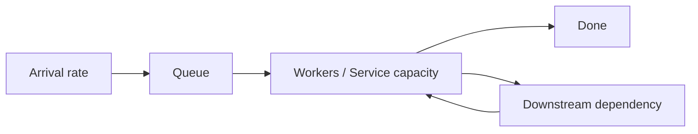
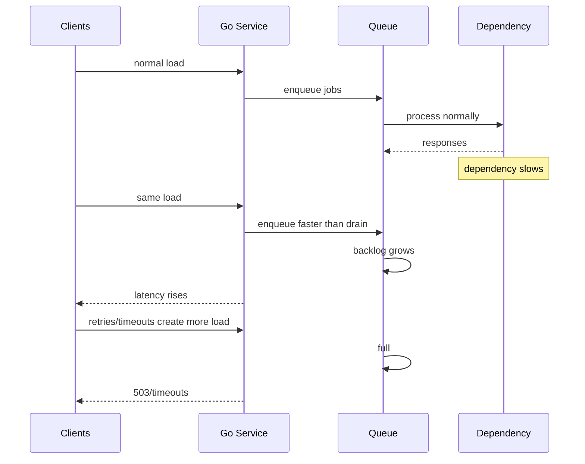
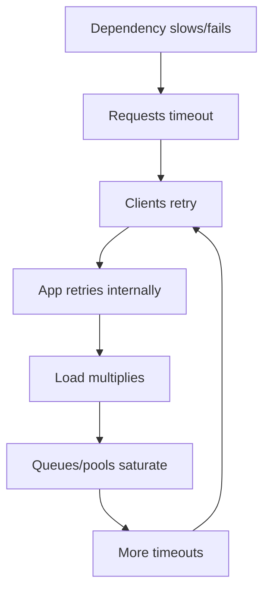

# learn-go-logging-observability-profiling-troubleshooting-part-022.md

# Part 022 — Throughput and Saturation Troubleshooting

> Seri: `learn-go-logging-observability-profiling-troubleshooting`  
> Bagian: `022 / 032`  
> Fokus: throughput collapse, saturation, capacity, queueing, resource bottleneck, load shedding, autoscaling, Go service operational diagnosis  
> Target pembaca: Java software engineer / tech lead yang ingin memahami failure mode throughput dan saturation pada Go service production

---

## 0. Posisi Bagian Ini dalam Seri

Part 021 membahas latency troubleshooting.

Bagian ini membahas symptom yang sangat berkaitan tetapi berbeda:

```text
throughput
saturation
capacity
backpressure
```

Latency menjawab:

```text
Berapa lama satu request/job selesai?
```

Throughput menjawab:

```text
Berapa banyak request/job yang bisa diselesaikan per unit waktu?
```

Saturation menjawab:

```text
Resource mana yang mendekati atau sudah mencapai kapasitas?
```

Throughput incident sering terlihat seperti:

- request rate masuk tinggi, completion rate turun,
- queue backlog naik,
- worker semua busy,
- DB pool penuh,
- CPU 100%,
- CPU throttling,
- goroutine count naik,
- memory naik,
- timeout meningkat,
- retry memperparah load,
- autoscaling tidak membantu,
- scaling malah memperburuk DB/external dependency.

---

## 1. Core Thesis

**Throughput collapse hampir selalu terjadi karena satu atau lebih resource mencapai saturation, lalu queueing dan retry memperbesar masalah.**

Resource bisa berupa:

- CPU,
- memory,
- goroutine scheduler,
- worker pool,
- channel queue,
- DB connection pool,
- DB server capacity,
- outbound HTTP connection pool,
- external provider quota,
- message broker partition,
- file descriptor,
- network bandwidth,
- ephemeral port,
- lock/semaphore,
- logging pipeline,
- telemetry exporter,
- Kubernetes node/pod limit.

Tugas engineer bukan hanya bertanya:

```text
"Kenapa lambat?"
```

Tetapi:

```text
"Resource mana yang saturated, siapa yang menunggu resource itu, apakah saturation lokal atau shared, dan bagaimana kita mengendalikan load?"
```

---

## 2. Throughput vs Latency vs Saturation

| Concept | Question |
|---|---|
| Throughput | berapa operasi selesai per detik? |
| Latency | berapa lama satu operasi selesai? |
| Saturation | seberapa penuh resource/queue/pool? |
| Utilization | seberapa banyak resource dipakai? |
| Backpressure | bagaimana sistem menahan load ketika downstream/resource penuh? |
| Load shedding | bagaimana sistem menolak/mengurangi load agar tetap sehat? |

Hubungan:

```text
Saat utilization mendekati capacity, queueing naik.
Saat queueing naik, latency naik.
Saat latency naik, retries/timeouts bisa menaikkan load.
Saat load naik lagi, throughput bisa collapse.
```

---

## 3. Capacity Model Sederhana

Jika satu worker memproses 10 job/s dan ada 20 worker:

```text
nominal capacity = 200 job/s
```

Jika input 150 job/s:

```text
stable, queue kecil
```

Jika input 200 job/s:

```text
near saturation, p99 bisa naik
```

Jika input 250 job/s:

```text
queue tumbuh terus, timeout/retry muncul, throughput mungkin collapse
```

Simple model:



Jika downstream melambat, effective service capacity turun walaupun worker count sama.

---

## 4. Little's Law Mental Model

Little's Law:

```text
L = λ * W
```

Where:

- `L` = average number of items in system,
- `λ` = arrival/completion rate,
- `W` = average time in system.

Operational intuition:

```text
Jika latency naik sementara arrival rate sama, jumlah in-flight/queued work naik.
```

Example:

```text
100 req/s * 100ms = ~10 in-flight
100 req/s * 2s = ~200 in-flight
```

That means latency spike can create massive concurrency/goroutine/memory increase even without traffic increase.

---

## 5. Saturation Signals

Common saturation indicators:

| Resource | Saturation Signal |
|---|---|
| CPU | CPU usage high, run queue/runnable goroutines, pprof hot path |
| Container CPU | throttling high |
| Memory | RSS near limit, OOMKilled, heap live near limit |
| GC | GC CPU high, cycles frequent, mark assist |
| Goroutines | count rising, runnable/waiting pileup |
| Worker pool | active=max, queue depth high |
| Channel queue | buffer full, send blocked |
| DB pool | InUse=MaxOpen, WaitCount/WaitDuration rising |
| DB server | CPU/IO/locks high, query latency high |
| HTTP client pool | connection wait, MaxConnsPerHost hit |
| External API | 429/503/timeouts, quota hit |
| File descriptor | too many open files |
| Ephemeral ports | connect failures, TIME_WAIT exhaustion |
| Logger | log queue full, writer blocked |
| Telemetry exporter | queue backlog, dropped spans/logs |
| Kubernetes node | CPU/memory/disk/network pressure |

---

## 6. First-Pass Throughput Triage

When throughput drops:

```text
[ ] Did arrival rate increase?
[ ] Did completion rate drop?
[ ] Did latency rise?
[ ] Did error/timeout rate rise?
[ ] Is CPU saturated?
[ ] Is CPU throttled?
[ ] Is memory/GC saturated?
[ ] Is goroutine count rising?
[ ] Are queues full?
[ ] Are worker pools maxed?
[ ] Are DB connections maxed?
[ ] Is DB itself saturated?
[ ] Is external dependency slower/rate-limited?
[ ] Are retries increasing load?
[ ] Did deployment/config change capacity?
[ ] Did data size/batch size increase?
```

Key distinction:

```text
Is throughput low because less work arrived, or because system cannot complete work?
```

---

## 7. Throughput Collapse Pattern



A small downstream slowdown can become service-wide failure if backpressure is missing.

---

## 8. CPU Saturation

Symptoms:

- CPU near 100% of allocated cores,
- throughput plateaus,
- latency rises,
- CPU profile shows hot path,
- goroutines runnable,
- scaling out may help if stateless and downstream OK.

Evidence:

```bash
curl -o cpu-30s.pb.gz "http://localhost:6060/debug/pprof/profile?seconds=30"
go tool pprof -http=:0 ./app cpu-30s.pb.gz
```

Check:

- CPU usage,
- CPU throttling,
- GOMAXPROCS,
- request rate,
- endpoint mix,
- response size,
- allocation rate,
- GC CPU,
- compression/crypto/serialization,
- logging/telemetry overhead.

Mitigation:

- scale out if local CPU bottleneck,
- reduce expensive feature,
- load shed,
- reduce payload,
- disable compression for tiny payloads,
- reduce logging,
- optimize hot path,
- increase CPU request/limit if throttled.

---

## 9. CPU Throttling

In Kubernetes, service may be throttled even if node has capacity.

Symptoms:

- container CPU throttling high,
- p99 latency high,
- CPU usage near limit,
- runtime trace shows runnable delay,
- CPU profile may not show surprising hot path.

Fix options:

- raise CPU limit,
- remove limit if org policy allows,
- increase request,
- tune HPA,
- reduce concurrency,
- optimize CPU,
- isolate noisy workloads.

Do not only look at CPU usage. Look at throttling.

---

## 10. Memory Saturation

Symptoms:

- RSS near limit,
- heap live near goal/limit,
- OOMKilled,
- GC CPU high,
- allocation stalls/assist,
- throughput drops due to GC/memory pressure.

Evidence:

- container memory working set,
- heap live,
- heap goal,
- allocation rate,
- GC CPU,
- heap profiles,
- goroutine profile.

Mitigation:

- reduce batch size,
- reduce cache/queue,
- shed load,
- restart if leak and critical,
- increase memory if legitimate workload,
- set/tune `GOMEMLIMIT`,
- reduce allocation,
- fix retention.

Memory saturation often reduces throughput through GC CPU and OOM restarts.

---

## 11. Goroutine Saturation

Goroutine count high can be:

- legitimate concurrency,
- blocked request pileup,
- leak,
- queue saturation,
- slow dependency,
- fan-out explosion.

Symptoms:

- goroutine count rises,
- stack memory rises,
- memory rises,
- latency rises,
- CPU maybe low or high.

Evidence:

```bash
curl -o goroutine-debug2.txt "http://localhost:6060/debug/pprof/goroutine?debug=2"
```

Classify stack groups:

- `chan send`: producer blocked.
- `chan receive`: worker idle or waiting.
- `IO wait`: dependency/network.
- `semacquire`: lock/pool/semaphore.
- `select`: cancellation/wait.
- `runnable`: scheduler/CPU pressure.

Mitigation depends on stack.

Do not "increase goroutine limit". There is no useful goroutine limit knob for root cause.

---

## 12. Queue Saturation

Queue saturation symptoms:

- queue depth near capacity,
- submit wait high,
- worker active=max,
- request latency high,
- goroutine blocked on send,
- timeouts/rejections.

Important metrics:

```text
queue_depth
queue_capacity
queue_submit_wait_duration
queue_full_total
queue_dropped_total
worker_active
worker_idle
job_duration
job_error_total
```

Questions:

1. arrival rate increased?
2. job duration increased?
3. worker count reduced?
4. downstream slow?
5. queue capacity too high/low?
6. submit blocks forever?
7. cancellation honored?
8. what is drop/reject policy?

Bad queue:

```go
jobs <- job
```

Better queue has explicit policy:

```go
select {
case jobs <- job:
	return nil
case <-ctx.Done():
	return ctx.Err()
default:
	return ErrQueueFull
}
```

---

## 13. Worker Pool Saturation

Worker pool saturated when:

```text
active workers == max workers
queue depth grows
job duration grows
```

Potential causes:

- workers too few,
- jobs too slow,
- downstream slow,
- job input bigger,
- lock contention inside worker,
- worker stuck,
- panic/restart loop,
- retry inside worker,
- batch size changed.

Fix options:

| Fix | When It Helps | When It Hurts |
|---|---|---|
| increase workers | CPU/downstream capacity available | downstream already saturated |
| reduce job duration | code optimization possible | requires deeper fix |
| fail fast | protect latency | drops work |
| priority queues | important work protected | complexity |
| separate pools | workload isolation | more config |
| backpressure upstream | prevents overload | may reject users |
| autoscale workers | load scalable | lag/oscillation |

---

## 14. DB Pool Saturation

Symptoms:

- `InUse == MaxOpenConnections`,
- `WaitCount` and `WaitDuration` rising,
- latency before query starts,
- goroutines waiting in database/sql,
- throughput plateaus.

Questions:

1. are queries slow?
2. are transactions too long?
3. are rows closed?
4. are connections leaked?
5. is MaxOpen too low?
6. is DB server saturated?
7. are many pods multiplying connections?
8. did HPA scale pods and overload DB?

Danger:

```text
Increasing DB pool per pod during incident can overload DB globally.
```

Capacity calculation:

```text
total possible DB connections = pod_count * max_open_per_pod
```

This must fit DB capacity.

---

## 15. DB Server Saturation

If DB itself saturated:

- DB CPU high,
- IO high,
- lock waits,
- slow query,
- connection count high,
- replication lag,
- deadlocks/timeouts.

App-side fixes:

- reduce concurrency,
- query optimization,
- cache,
- pagination,
- batch size limit,
- circuit breaker,
- load shed,
- avoid retries,
- shorter transactions.

Increasing app throughput can worsen DB saturation.

---

## 16. Outbound HTTP Pool Saturation

Symptoms:

- external calls slow,
- goroutines waiting,
- `MaxConnsPerHost` reached,
- connection creation high,
- TLS handshake spike,
- response bodies not closed,
- retry storm.

Key practices:

- reuse `http.Client`,
- reuse `Transport`,
- set timeouts,
- close response body,
- tune `MaxIdleConns`, `MaxIdleConnsPerHost`, `MaxConnsPerHost`,
- separate client per dependency,
- add outbound metrics.

Throughput depends on dependency and transport capacity.

---

## 17. External Rate Limit Saturation

External provider returns:

- 429,
- quota exceeded,
- throttling,
- slow responses,
- retry-after.

If app retries aggressively, throughput collapses.

Fix:

- respect `Retry-After`,
- global rate limiter,
- per-tenant limiter,
- circuit breaker,
- retry budget,
- backoff with jitter,
- queue with bounded delay,
- degrade optional feature.

Metric:

```text
external_requests_total{status_class}
external_rate_limited_total
external_retry_total
external_circuit_open
```

---

## 18. File Descriptor Saturation

Symptoms:

- `too many open files`,
- connection failures,
- accept failures,
- outbound failures,
- goroutine pileups,
- throughput drops.

Causes:

- response body not closed,
- file not closed,
- connection leak,
- too many concurrent sockets,
- low ulimit,
- logging/file sink issue.

Evidence:

- OS metrics,
- lsof/FD count,
- app logs,
- goroutine profile,
- HTTP client behavior.

Fix:

- close resources,
- connection pooling,
- limit concurrency,
- adjust ulimit only after leak excluded.

---

## 19. Ephemeral Port Exhaustion

Symptoms:

- outbound connection errors,
- cannot assign requested address,
- connection timeout,
- many TIME_WAIT,
- high outbound connection churn.

Causes:

- new connection per request,
- transport not reused,
- idle conn disabled,
- short-lived high-rate connections,
- NAT gateway limits.

Fix:

- reuse transport,
- keep-alive,
- tune connection pool,
- limit concurrency,
- reduce retries,
- check NAT capacity.

This can look like external dependency latency but root is local/network resource exhaustion.

---

## 20. Lock/Semaphore Saturation

Symptoms:

- CPU not necessarily high,
- p99 high,
- goroutines waiting on semacquire,
- mutex/block profile points to lock/semaphore,
- throughput flat despite more load.

Causes:

- global lock,
- long critical section,
- semaphore limit too low,
- shared limiter across unrelated paths,
- lock held during IO/logging,
- RWMutex misuse.

Fix:

- shrink critical section,
- shard,
- immutable snapshot,
- separate limiters,
- context-aware acquire,
- timeout/fail fast,
- actor model if appropriate.

---

## 21. Logging Pipeline Saturation

Symptoms:

- log volume spike,
- request latency rises,
- CPU/log encoding high,
- goroutines blocked writing logs,
- stdout/stderr backpressure,
- disk/network log shipper slow.

Causes:

- error storm logs every retry,
- debug logs enabled,
- payload logging,
- synchronous logger,
- slow sink,
- logging under lock.

Fix:

- sample,
- log once at boundary,
- reduce payload,
- bounded async queue with drop policy,
- improve sink,
- reduce level,
- add log volume budgets.

Observability must not take down service.

---

## 22. Telemetry Exporter Saturation

Symptoms:

- spans/logs/metrics exporter queue grows,
- dropped telemetry,
- memory grows,
- goroutines grow,
- request path slows if export synchronous or backpressure propagates.

Fix:

- batch processor tuning,
- sampling,
- queue size limit,
- exporter timeout,
- drop policy,
- isolate telemetry failures,
- observe exporter health.

---

## 23. Retry Storm and Throughput Collapse

Retry storm pattern:



Fix:

- retry budget,
- exponential backoff with jitter,
- circuit breaker,
- rate limiting,
- timeout budget,
- idempotency,
- load shedding,
- respect downstream signals.

Metric:

```text
attempts_per_request
retry_total
retry_exhausted_total
circuit_open
dependency_429_total
```

---

## 24. Backpressure

Backpressure means upstream is told or forced to slow down when downstream cannot keep up.

Forms:

- bounded queue,
- blocking submit with timeout,
- 429/503 response,
- rate limit,
- circuit breaker,
- TCP backpressure,
- message broker consumer lag,
- semaphore limit,
- max in-flight.

Good backpressure:

- bounded,
- observable,
- respects context,
- fails predictably,
- protects critical resources.

Bad backpressure:

- unbounded queue,
- goroutine pileup,
- memory growth,
- no timeout,
- silent drop,
- hidden latency.

---

## 25. Load Shedding

Load shedding rejects some work to preserve service health.

Examples:

- reject when queue full,
- reject low priority tenant when overloaded,
- skip optional enrichment,
- return stale cache,
- disable expensive feature,
- fail fast on dependency outage,
- drop telemetry/log details.

A system without load shedding often fails everyone slowly.

Load shedding metrics:

```text
load_shed_total{reason}
requests_rejected_total{reason}
degraded_responses_total{feature}
queue_full_total
```

---

## 26. Autoscaling

Autoscaling helps only for scalable bottlenecks.

HPA based on CPU helps when:

- bottleneck is per-pod CPU,
- service stateless,
- downstream capacity sufficient,
- scaling delay acceptable.

HPA fails when:

- bottleneck is DB,
- bottleneck is external rate limit,
- queue grows faster than scale-up,
- per-pod memory leak,
- cold start slow,
- wrong metric,
- CPU low because blocked,
- scaling increases shared dependency load.

Autoscale on more relevant metrics when needed:

- queue depth per worker,
- request concurrency,
- custom workload metric,
- CPU + latency combo,
- consumer lag.

But custom autoscaling must avoid oscillation.

---

## 27. Capacity Planning

Capacity model should answer:

```text
At expected peak, what resource saturates first?
```

For service:

```text
max safe RPS per pod
CPU per request
memory per request/in-flight
DB connections per pod
outbound calls per request
queue capacity
worker service rate
dependency quotas
```

Example:

```text
Each request makes 2 DB queries.
Pod MaxOpenConns = 30.
At 10 pods, max potential DB conns = 300.
DB safe connection budget = 200.
Therefore config can overload DB under scale-out.
```

Capacity is cross-system, not just pod CPU.

---

## 28. Headroom

Headroom protects against bursts, failover, and variance.

If service runs at 85% CPU during normal peak, small burst causes saturation.

Common target:

```text
Keep enough headroom for expected burst and failover.
```

Headroom should account for:

- traffic burst,
- pod loss,
- node loss,
- dependency slowdown,
- GC/allocation bursts,
- batch overlap,
- logging/error storms,
- deployment rollout capacity reduction.

---

## 29. Saturation Dashboard

A throughput/saturation dashboard should include:

### Service

- request rate,
- completion rate,
- error rate,
- p95/p99 latency,
- in-flight requests,
- rejected/load shed.

### Runtime

- CPU,
- CPU throttling,
- memory/RSS/limit,
- heap live,
- GC CPU,
- goroutines,
- scheduler/runnable if available.

### Queues/workers

- queue depth/capacity,
- submit wait,
- worker active/idle,
- job duration,
- drop/reject count.

### Dependencies

- DB pool in-use/wait,
- DB query latency,
- outbound HTTP latency,
- external status/429/5xx,
- retry count,
- circuit breaker state.

### Platform

- pod restarts,
- node pressure,
- HPA replicas,
- deployment version.

---

## 30. Saturation Alerting

Good alerts are symptom- and saturation-aware.

Examples:

```text
p99 latency high AND queue wait high
DB pool wait p95 > threshold
container memory > 90% limit
CPU throttling sustained AND p99 high
goroutine count monotonic growth
queue depth > 90% for 10m
retry rate > normal AND dependency errors high
load shed > 0 for critical endpoint
```

Avoid alerts that only say:

```text
CPU > 80%
```

unless CPU usage itself requires action.

---

## 31. Throughput Incident Runbook

```text
Runbook: Throughput drop / saturation

1. Frame
   - arrival rate:
   - completion rate:
   - latency:
   - error/timeout:
   - affected endpoint/job:
   - start time:
   - version/pod/tenant:

2. Identify saturated resource
   - CPU/throttling
   - memory/GC
   - goroutine/scheduler
   - queue/worker
   - DB pool/DB server
   - outbound HTTP pool/dependency
   - external quota
   - locks/semaphores
   - logging/telemetry
   - platform/node

3. Collect evidence
   - metrics
   - goroutine profile
   - CPU profile if CPU high
   - block/mutex profile if wait-bound
   - heap profile if memory/GC
   - traces for dependency critical path
   - runtime trace if scheduler/timeline unclear

4. Decide mitigation
   - load shed
   - fail fast
   - rollback
   - scale out only if local bottleneck
   - reduce concurrency if shared dependency saturated
   - open circuit breaker
   - disable expensive feature
   - restart if leak/stuck and evidence captured

5. Verify
   - completion rate recovers
   - latency recovers
   - queue drains
   - saturation clears
   - errors stable
   - no new bottleneck

6. Follow-up
   - capacity model
   - alert
   - benchmark/load test
   - backpressure policy
   - runbook update
```

---

## 32. Case Study 1: CPU-Bound Throughput Ceiling

### Symptom

- RPS plateaus at 800 per pod.
- CPU 100%.
- p99 rises after 700 RPS.
- DB latency normal.

Evidence:

- CPU profile shows compression and JSON.
- response size high.
- GC CPU moderate.

Fix:

- compression threshold,
- response pagination,
- optimize JSON path,
- scale out,
- benchmark payload.

Lesson:

Local CPU bottleneck. Scaling helps if downstream capacity exists.

---

## 33. Case Study 2: DB Pool Saturation After HPA Scale-Out

### Symptom

- HPA scales from 5 to 20 pods.
- DB errors and latency increase.
- throughput drops globally.

Evidence:

- each pod MaxOpenConns = 50.
- total possible DB connections = 1000.
- DB safe max = 300.
- DB CPU and connection wait high.

Root cause:

- scaling app overloaded shared DB.

Fix:

- reduce per-pod MaxOpenConns,
- cap HPA,
- query optimization,
- caching,
- DB capacity review,
- global concurrency limit.

Lesson:

Scale-out can amplify shared bottleneck.

---

## 34. Case Study 3: Queue Saturation from Downstream Slowdown

### Symptom

- incoming rate unchanged.
- job completion rate drops.
- queue depth grows.
- request latency rises.

Evidence:

- workers active=max.
- downstream latency 5x.
- block profile shows submit wait.
- goroutines blocked on channel send.

Fix:

- fail fast when queue full,
- circuit breaker,
- reduce downstream concurrency,
- retry budget,
- queue wait alert.

Lesson:

Throughput dropped because effective service rate fell, not because arrival rate rose.

---

## 35. Case Study 4: Retry Storm

### Symptom

- dependency returns 503.
- app outbound RPS triples.
- CPU and queue depth rise.
- user error rate worsens.

Evidence:

- traces show 3 attempts per request.
- retries ignore deadline.
- no jitter.

Fix:

- bounded retry,
- jitter,
- circuit breaker,
- respect deadline,
- fallback/degrade.

Lesson:

Retries consumed capacity needed for recovery.

---

## 36. Case Study 5: Logging Saturation

### Symptom

- error storm starts.
- log volume 30x.
- stdout writer blocks.
- request throughput drops.

Evidence:

- block profile points to logger/writer.
- CPU profile shows JSON log encoding.
- log shipper CPU high.

Fix:

- sample errors,
- reduce duplicate logs,
- remove payload logging,
- async bounded logging,
- log budget.

Lesson:

Observability path became saturated dependency.

---

## 37. Design Checklist: Saturation-Resistant Go Service

```text
[ ] Every queue is bounded.
[ ] Every blocking submit/acquire respects context.
[ ] Every dependency has timeout.
[ ] Retry policy has max attempts and jitter.
[ ] Circuit breaker exists for critical downstream.
[ ] DB pool size fits total pod count.
[ ] Worker pool has metrics.
[ ] Queue wait duration is measured.
[ ] Load shedding policy is explicit.
[ ] CPU/memory requests and limits are justified.
[ ] HPA metric matches bottleneck.
[ ] Logging/telemetry queues are bounded.
[ ] High-cardinality metrics are avoided.
[ ] Cache has size/TTL.
[ ] Batch size is bounded.
[ ] Large fan-out is bounded.
```

---

## 38. Exercises

### Exercise 1 — CPU Throughput Ceiling

Build endpoint with CPU-heavy JSON/compression.

Tasks:

1. load test increasing RPS,
2. find throughput plateau,
3. capture CPU profile,
4. optimize or scale,
5. explain capacity.

### Exercise 2 — Queue Saturation

Build worker queue with fixed workers.

Tasks:

1. slow workers,
2. increase arrival rate,
3. observe queue depth and latency,
4. add fail-fast,
5. compare throughput and p99.

### Exercise 3 — DB Pool Model

Simulate DB pool with semaphore.

Tasks:

1. vary pool size,
2. vary worker count,
3. measure wait duration,
4. show why too large can overload fake DB.

### Exercise 4 — Retry Storm

Build fake dependency returning intermittent 503.

Tasks:

1. implement naive retry,
2. observe amplified load,
3. add retry budget and circuit breaker,
4. compare.

### Exercise 5 — Autoscaling Thought Experiment

Given:

```text
10 pods
MaxOpenConns 40
DB safe max 250
HPA max 30 pods
```

Tasks:

1. compute maximum possible DB connections,
2. identify risk,
3. propose safer config.

---

## 39. What Good Looks Like

Anda memahami throughput dan saturation secara production-grade jika mampu:

1. membedakan latency dan throughput,
2. menemukan saturated resource,
3. membedakan local vs shared bottleneck,
4. tidak scale out secara membabi buta,
5. membaca queue/pool metrics,
6. mengenali retry storm,
7. merancang backpressure/load shedding,
8. menghubungkan goroutine/block profile dengan saturation,
9. membuat capacity model sederhana,
10. membuat alert/dashboard yang menunjukkan resource bottleneck.

---

## 40. Summary

Throughput collapse biasanya bukan misteri.

Ia biasanya mengikuti pola:

```text
resource saturates
queue grows
latency rises
timeouts/retries increase
load amplifies
throughput collapses
```

Kunci troubleshooting:

1. ukur arrival vs completion,
2. cari saturated resource,
3. tentukan local vs shared bottleneck,
4. gunakan profile sesuai symptom,
5. mitigasi dengan backpressure/load shedding,
6. hindari scaling yang memperburuk dependency,
7. perbaiki capacity model dan observability.

Go-specific signals seperti goroutine count, block profile, mutex profile, runtime metrics, heap/GC metrics, dan CPU profile sangat membantu melihat di mana capacity hilang.

---

## 41. Status Seri

Bagian ini adalah:

```text
learn-go-logging-observability-profiling-troubleshooting-part-022.md
```

Status:

```text
Part 022 dari 032
Seri belum selesai
```

Bagian berikutnya:

```text
learn-go-logging-observability-profiling-troubleshooting-part-023.md
```

Topik berikutnya:

```text
Memory, OOM, and Container Troubleshooting
```


<!-- NAVIGATION_FOOTER -->
<div class="page-nav">
<a href="./learn-go-logging-observability-profiling-troubleshooting-part-021.md">⬅️ Part 021 — Latency Troubleshooting</a>
<a href="./index.md">📚 Kategori</a>
<a href="../../index.md">🏠 Home</a>
<a href="./learn-go-logging-observability-profiling-troubleshooting-part-023.md">Part 023 — Memory, OOM, and Container Troubleshooting ➡️</a>
</div>
