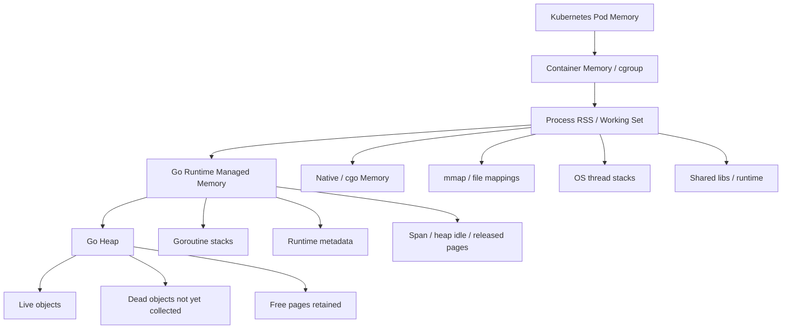
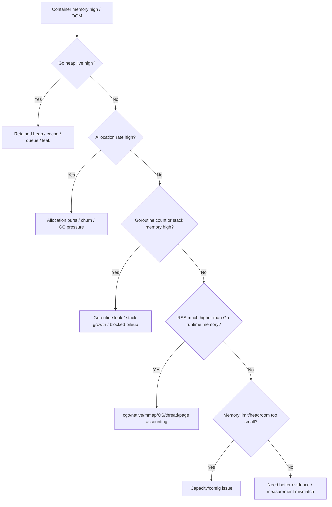

# learn-go-logging-observability-profiling-troubleshooting-part-023.md

# Part 023 — Memory, OOM, and Container Troubleshooting

> Seri: `learn-go-logging-observability-profiling-troubleshooting`  
> Bagian: `023 / 032`  
> Fokus: Kubernetes/container memory, OOMKilled, RSS vs Go heap, `GOMEMLIMIT`, heap/stack/native memory, memory incident runbook  
> Target pembaca: Java software engineer / tech lead yang ingin mendiagnosis memory incident Go service di containerized production environment

---

## 0. Posisi Bagian Ini dalam Seri

Part 014 membahas memory profiling:

- retained heap,
- allocation churn,
- heap `inuse_space`,
- heap `alloc_space`,
- RSS vs Go heap,
- leak patterns.

Part 015 membahas GC observability:

- allocation rate,
- live heap,
- heap goal,
- `GOGC`,
- `GOMEMLIMIT`,
- GC CPU,
- mark assist,
- GC thrashing.

Part 022 membahas throughput dan saturation.

Bagian ini fokus pada memory incident di environment modern:

```text
container
Kubernetes
cgroup memory limit
OOMKilled
RSS/working set
Go heap vs process memory
node pressure
pod restart
memory evidence preservation
```

Tujuan bagian ini:

> Membuat Anda bisa menjawab: "Pod Go saya OOMKilled. Apakah karena heap leak, allocation burst, goroutine stack, native memory, mmap, container limit terlalu kecil, atau observability/pool/cache yang tidak bounded?"

---

## 1. Core Thesis

**OOMKilled bukan diagnosis. OOMKilled hanya berarti container melewati memory limit. Root cause-nya harus dicari dari hubungan antara container memory, Go runtime memory, workload, dan lifecycle resource.**

Kalimat yang salah:

```text
"Pod OOM, berarti memory leak."
```

Kalimat yang benar:

```text
"Pod OOM karena container working set melewati limit. Kita perlu tahu apakah yang tumbuh adalah Go heap live, allocation burst, goroutine stacks, native/mmap memory, queue/cache retention, atau memory limit/headroom yang salah."
```

OOM adalah symptom.

Root cause adalah mekanisme.

---

## 2. Memory Layers in Containerized Go Service



Important:

```text
Kubernetes memory metric != Go heap.
Container working set != heap live.
Heap profile != full RSS.
OOMKilled != heap leak proof.
```

---

## 3. Key Memory Terms

| Term | Meaning |
|---|---|
| RSS | resident memory pages held by process |
| Working set | memory considered actively used by container metrics |
| cgroup limit | container memory limit enforced by kernel |
| OOMKilled | container killed because memory exceeded limit |
| Go heap | memory for Go heap objects |
| Heap live | reachable heap after GC |
| Heap goal | runtime target heap size |
| Allocation rate | bytes allocated per second |
| Stack memory | memory used by goroutine stacks |
| Native memory | cgo/library memory outside Go heap |
| mmap | memory mapped file/region |
| Scavenger | runtime returns unused pages to OS |
| Page cache | kernel file cache, may appear in some memory accounting contexts |

---

## 4. OOMKilled Timeline

OOM usually has a timeline.

Example:

```text
10:00 deployment v2
10:05 allocation rate increases
10:15 heap live grows from 400MiB to 900MiB
10:20 container memory reaches 95% of 1GiB
10:22 GC CPU increases
10:23 pod OOMKilled
10:24 pod restarts, evidence lost
```

Or:

```text
10:00 traffic spike
10:01 queue depth grows
10:02 goroutine count rises from 1k to 80k
10:05 stack memory and heap retained by queued jobs grow
10:08 OOMKilled
```

Or:

```text
10:00 cgo image processor starts large native allocations
10:03 RSS grows, Go heap stable
10:07 OOMKilled
```

The timeline determines root cause category.

---

## 5. First-Pass OOM Triage

When pod is OOMKilled:

```text
[ ] Which pod/container was killed?
[ ] What was memory limit?
[ ] What was working set before kill?
[ ] Did heap live grow?
[ ] Did allocation rate spike?
[ ] Did goroutine count grow?
[ ] Did stack memory grow?
[ ] Did queue/cache size grow?
[ ] Did request/response/file size change?
[ ] Was there cgo/native/mmap usage?
[ ] Was this after deployment/config change?
[ ] Did node have memory pressure?
[ ] Did multiple pods OOM or one pod?
[ ] Did restart recover temporarily?
```

Key question:

```text
Was Go heap responsible for most memory, or was RSS much larger than heap?
```

---

## 6. Evidence to Capture Before OOM

If memory is rising and pod still alive, capture evidence before restart.

### 6.1 Build Info

```bash
curl -o buildinfo.json "http://localhost:6060/debug/buildinfo"
```

### 6.2 Heap Before GC

```bash
curl -o heap-before.pb.gz "http://localhost:6060/debug/pprof/heap"
```

### 6.3 Heap After GC

```bash
curl -o heap-after-gc.pb.gz "http://localhost:6060/debug/pprof/heap?gc=1"
```

### 6.4 Allocation Profile

```bash
curl -o allocs.pb.gz "http://localhost:6060/debug/pprof/allocs"
```

### 6.5 Goroutine Dump

```bash
curl -o goroutine-debug2.txt "http://localhost:6060/debug/pprof/goroutine?debug=2"
```

### 6.6 Optional CPU Profile

If GC/CPU high:

```bash
curl -o cpu-30s.pb.gz "http://localhost:6060/debug/pprof/profile?seconds=30"
```

### 6.7 Runtime Metrics Snapshot

Scrape metrics around:

- heap live,
- heap goal,
- memory classes,
- goroutines,
- GC cycles,
- GC CPU,
- stack memory,
- container working set.

---

## 7. If Pod Already OOMKilled

If pod already restarted, some evidence is gone.

Still collect:

```text
[ ] Kubernetes event reason/message.
[ ] Previous container logs.
[ ] Restart count.
[ ] Memory graph before OOM.
[ ] Runtime metrics history if scraped.
[ ] Deployment/config change.
[ ] Traffic/request size history.
[ ] Queue/cache metrics.
[ ] Profiles from another pod with same symptom.
[ ] Reproduce in staging if possible.
```

Commands:

```bash
kubectl describe pod <pod> -n <namespace>
kubectl logs <pod> -n <namespace> --previous
kubectl get events -n <namespace> --sort-by=.lastTimestamp
```

OOM event is not enough. You need pre-OOM trend.

---

## 8. Go Heap vs Container Memory Decision Tree



---

## 9. Scenario: Heap Live Growth

Symptoms:

- heap live rises over time,
- heap after GC remains high,
- RSS follows heap,
- GC cannot bring memory down,
- OOM after enough time.

Likely causes:

- unbounded cache,
- unbounded map,
- queue retaining items,
- goroutine capturing data,
- slice backing array retention,
- response/request data retained,
- telemetry exporter backlog,
- missed cleanup,
- map not rebuilt,
- long-lived references.

Evidence:

```bash
go tool pprof -sample_index=inuse_space ./app heap-after-gc.pb.gz
go tool pprof -sample_index=inuse_objects ./app heap-after-gc.pb.gz
```

Ask:

```text
What is still reachable?
Who owns it?
What should release it?
Is there a bound?
```

---

## 10. Scenario: Allocation Burst

Symptoms:

- allocation rate spikes,
- heap grows temporarily,
- after GC heap may fall,
- GC CPU high,
- latency/throughput affected,
- OOM possible if burst exceeds limit.

Causes:

- large request/file,
- batch import,
- queue replay,
- JSON/XML decode,
- compression,
- report export,
- cache warmup,
- response building,
- huge slice/map temporary.

Evidence:

```bash
go tool pprof -sample_index=alloc_space ./app allocs.pb.gz
go tool pprof -sample_index=alloc_objects ./app allocs.pb.gz
```

Mitigation:

- request size limit,
- streaming,
- chunking,
- batch size cap,
- concurrency limit,
- backpressure,
- increase memory if legitimate,
- reduce allocation.

---

## 11. Scenario: Goroutine Stack Growth

Symptoms:

- goroutine count grows,
- stack memory grows,
- heap may or may not grow,
- RSS grows,
- goroutine profile shows repeated stack.

Causes:

- blocked channel send,
- missing cancellation,
- HTTP client leak,
- worker leak,
- timer/ticker leak,
- fan-out leak,
- request pileup due to downstream slow.

Evidence:

```bash
curl -o goroutine-debug2.txt "http://localhost:6060/debug/pprof/goroutine?debug=2"
```

Runtime metrics:

```text
/sched/goroutines:goroutines
/memory/classes/heap/stacks:bytes
```

Fix:

- context-aware blocking,
- close resources,
- bounded fan-out,
- worker lifecycle,
- body close,
- queue backpressure.

---

## 12. Scenario: RSS High, Heap Stable

Symptoms:

- container memory high,
- heap live stable/low,
- heap profile does not explain RSS,
- OOM still occurs.

Possible causes:

1. goroutine stacks,
2. native/cgo memory,
3. mmap,
4. OS thread stacks,
5. runtime metadata,
6. heap idle not released yet,
7. fragmentation,
8. page cache/accounting,
9. memory measurement mismatch,
10. logging/telemetry native buffers.

Evidence:

- runtime memory classes,
- goroutine count,
- stack memory,
- cgo/native usage review,
- mmap/file usage,
- OS process memory maps if available,
- container metrics.

Go heap profile alone will not solve this.

---

## 13. Scenario: Native/cgo Memory

If service uses cgo or native libraries:

- image processing,
- compression library,
- database driver using native code,
- ML/inference,
- crypto/HSM client,
- custom C library,
- memory mapped storage,

memory may be outside Go heap.

Symptoms:

- RSS grows,
- Go heap stable,
- GC tuning ineffective,
- OOM still happens.

Actions:

- check native library lifecycle,
- explicit free/close,
- native memory profiling/tools,
- process memory maps,
- library-specific metrics,
- limit concurrency,
- isolate workload,
- container limit headroom.

---

## 14. Scenario: mmap / File Mapping

mmap can increase process virtual/resident memory depending access pattern.

Use cases:

- large files,
- embedded DB,
- search index,
- custom storage,
- memory-mapped cache.

Symptoms:

- RSS/working set high,
- heap profile low,
- memory grows with file access,
- OOM under file-heavy workload.

Actions:

- understand library mmap behavior,
- unmap/close files,
- limit mapped region,
- chunk access,
- separate process,
- adjust memory limit/headroom,
- OS-level evidence.

---

## 15. Scenario: Heap Idle / Released / Scavenger

Go runtime may keep memory for reuse and release memory to OS over time.

A service can show:

```text
heap allocated lower than RSS
```

because memory was allocated earlier, freed, but not immediately returned or still accounted.

Use runtime memory class metrics:

- heap objects,
- heap free,
- heap released,
- heap idle,
- total runtime memory.

Questions:

1. is heap live stable?
2. is RSS stable or still growing?
3. is memory reused under load?
4. does RSS eventually fall?
5. is container limit too tight for peak bursts?

Do not panic over RSS not instantly dropping after GC, but do not ignore OOM risk.

---

## 16. `GOMEMLIMIT` in Containers

`GOMEMLIMIT` helps Go runtime keep runtime-managed memory under a target.

But it does not include all container memory.

### 16.1 Bad Config

```text
container limit = 1024MiB
GOMEMLIMIT = 1024MiB
```

Risk:

- no headroom for stacks/native/runtime/OS,
- OOM still likely.

### 16.2 Better Starting Point

```text
container limit = 1024MiB
GOMEMLIMIT = 750MiB
```

Then validate.

### 16.3 Formula

```text
GOMEMLIMIT ≈ container_limit - non_heap_headroom - safety_margin
```

Headroom includes:

- goroutine stacks,
- native/cgo,
- mmap,
- runtime metadata,
- log/telemetry buffers,
- peak transient memory,
- OS/accounting.

---

## 17. `GOGC` in Containers

`GOGC` controls heap growth target relative to live heap.

In memory-limited containers:

- high `GOGC` may allow memory to grow too much,
- low `GOGC` may increase GC CPU,
- `GOMEMLIMIT` can dominate behavior,
- tuning without profiling can cause thrashing.

Rule:

```text
Use GOGC/GOMEMLIMIT tuning after understanding live heap and allocation behavior.
```

Tuning cannot fix unbounded cache.

---

## 18. Container Memory Requests and Limits

Kubernetes memory request:

```text
used for scheduling
```

Memory limit:

```text
enforced; exceeding can cause OOMKilled
```

Problems:

- request too low -> scheduled on crowded node,
- limit too low -> OOM under legitimate peak,
- limit absent -> node pressure/eviction risk,
- request/limit mismatch -> QoS implications,
- many pods each with high burst -> node pressure.

A Go service memory budget should include:

```text
steady heap
peak heap
stacks
native/mmap
telemetry/log buffers
GC headroom
traffic burst
rollout overlap
batch overlap
safety margin
```

---

## 19. Node Pressure vs Container OOM

Container OOM:

- container exceeds its memory limit,
- reason OOMKilled.

Node pressure eviction:

- node under memory pressure,
- kubelet may evict pods,
- reason may be Evicted,
- not necessarily container exceeded its own limit.

Different root causes.

Check:

```bash
kubectl describe pod <pod>
kubectl describe node <node>
kubectl get events
```

If many pods evicted, investigate node capacity/pressure.

If one container OOMKilled repeatedly, investigate app/container memory.

---

## 20. QoS Classes

Kubernetes QoS can affect eviction priority:

- Guaranteed,
- Burstable,
- BestEffort.

Memory request/limit configuration affects QoS.

Operational implication:

- under node pressure, lower QoS pods may be evicted earlier.
- OOMKilled due to container limit is different from eviction.

For critical Go service, resource requests/limits should be intentional, not default.

---

## 21. Memory and Autoscaling

HPA often scales on CPU, not memory.

Memory leaks do not scale away cleanly.

Scaling out can:

- reduce per-pod load,
- reduce per-pod memory if memory proportional to traffic,
- increase total memory footprint,
- increase DB/external connections,
- hide leak temporarily,
- create more OOMing pods.

For memory-heavy queues/caches, scaling may not help if:

- each pod warms same cache,
- queue partition stuck,
- leak per pod independent of traffic,
- batch job per pod duplicates data.

---

## 22. Memory and Rollouts

During rolling deployment:

- old and new pods overlap,
- caches warm,
- connection pools warm,
- traffic shifts,
- memory temporarily increases cluster-wide,
- new pods may cold-start allocate.

If readiness is too early, new pod receives traffic while warming.

Mitigation:

- conservative rollout surge,
- readiness after warmup,
- memory headroom,
- canary,
- watch memory during rollout,
- avoid all pods warming huge cache simultaneously.

---

## 23. Memory and Queues

Queue memory budget:

```text
queue_capacity * average_item_size
```

If item includes full payload:

```text
10000 items * 1MiB = 10GiB
```

This is obvious in math but often hidden in code.

Queue item should usually hold:

- ID,
- metadata,
- pointer to external storage,
- small immutable job info.

Not:

- full request body,
- large parsed object,
- huge file bytes,
- entire response.

---

## 24. Memory and Caches

Cache budget must be explicit.

Questions:

```text
[ ] max entries?
[ ] max bytes?
[ ] TTL?
[ ] eviction policy?
[ ] negative cache policy?
[ ] key cardinality?
[ ] value size?
[ ] per-tenant isolation?
[ ] metrics?
[ ] behavior during dependency failure?
```

A cache without a bound is a memory leak with better branding.

---

## 25. Memory and Request Bodies

Common mistake:

```go
body, _ := io.ReadAll(r.Body)
```

without limit.

Use:

```go
r.Body = http.MaxBytesReader(w, r.Body, 10<<20)
```

Then decode.

Also:

- do not log full body,
- do not store full body unless required,
- stream large uploads,
- validate content length,
- reject oversized payloads early.

---

## 26. Memory and Response Building

Bad:

```go
var rows []RowDTO
for _, row := range allRows {
	rows = append(rows, convert(row))
}
json.NewEncoder(w).Encode(rows)
```

For huge results:

- memory holds all rows,
- JSON output buffer may grow,
- latency high,
- GC pressure.

Options:

- pagination,
- streaming,
- cursor,
- export async,
- limit max rows,
- compress carefully,
- write incremental response with error semantics considered.

---

## 27. Memory and Message Consumers

Message consumers can OOM due to:

- prefetch too high,
- batch size too large,
- processing concurrency too high,
- retaining messages during retry,
- dead-letter backlog in memory,
- deserializing huge payload,
- unbounded worker queue.

Metrics:

- consumer lag,
- in-flight messages,
- batch size,
- processing duration,
- retry count,
- queue memory estimate,
- payload size bucket.

---

## 28. Memory and Observability

Logs/traces/metrics can consume memory.

### Logs

- async queue retains log entries,
- large fields,
- payload logs,
- error storms.

### Traces

- spans not ended,
- huge attributes/events,
- exporter queue backlog,
- sampling too high.

### Metrics

- high-cardinality labels create time series,
- custom collectors retain state.

Memory incident can be caused by observability changes.

---

## 29. Memory Dashboard

A good Go container memory dashboard includes:

### Container

```text
container working set
container RSS
memory limit
restart count
OOMKilled events
node memory pressure
```

### Go Runtime

```text
heap live
heap goal
heap objects
allocation rate
GC cycles/sec
GC CPU
stack memory
goroutine count
memory classes
```

### Application

```text
queue depth
cache entries/bytes
in-flight requests
request/response size
batch size
worker active
telemetry queue
log volume
```

### Deployment

```text
version
rollout markers
config changes
traffic split
```

---

## 30. Memory Alerting

Useful alerts:

```text
container memory > 90% limit for 5m
OOMKilled count > 0
heap live increasing monotonically for 30m
goroutine count increasing monotonically
stack memory high
allocation rate 3x baseline after deploy
GC CPU high and latency high
cache bytes above budget
queue memory estimate above budget
telemetry exporter queue near full
```

Avoid only alerting on heap.

Container OOM can happen outside heap.

---

## 31. Memory Incident Runbook

```text
Runbook: Go service memory high / OOM risk

1. Frame
   - pod/container:
   - memory limit:
   - current working set:
   - start time:
   - version:
   - traffic/data change:

2. Determine category
   - heap live high?
   - allocation rate high?
   - goroutine/stack high?
   - RSS >> Go heap?
   - cache/queue high?
   - native/mmap possible?
   - limit/headroom too low?

3. Capture evidence if pod alive
   - buildinfo
   - heap before GC
   - heap after GC
   - allocs profile
   - goroutine debug2
   - CPU profile if GC/CPU high
   - runtime metrics snapshot

4. If already OOMKilled
   - describe pod
   - previous logs
   - events
   - metrics history
   - profile another affected pod

5. Mitigate
   - restart if imminent and evidence captured
   - rollback
   - disable feature/cache
   - reduce batch/concurrency
   - load shed
   - increase memory only if justified
   - tune GOMEMLIMIT after analysis

6. Verify
   - working set stabilizes
   - heap live stabilizes
   - goroutines stable
   - GC CPU stable
   - no OOM
   - latency/error normal

7. Follow-up
   - bound resource
   - add metric/alert
   - benchmark/profile
   - update runbook
```

---

## 32. Case Study 1: Heap Leak Cache Key

### Symptom

- OOM every 5 hours.
- heap live grows steadily.
- restart resets memory.

Evidence:

- heap after GC points to cache set.
- cache entry count grows.
- key includes timestamp and request ID.

Root cause:

- unbounded cache with high-cardinality key.

Fix:

- key normalization,
- TTL,
- max bytes,
- cache metrics,
- reject pathological cardinality.

---

## 33. Case Study 2: Allocation Burst Export

### Symptom

- OOM only during report export.
- heap live returns after restart.
- large tenant affected.

Evidence:

- `alloc_space` points to report DTO and JSON.
- response size huge.
- heap before GC high, after GC lower but peak exceeds limit.

Root cause:

- full report materialized in memory before response.

Fix:

- async export,
- pagination,
- streaming,
- max rows,
- memory budget,
- separate worker with larger memory.

---

## 34. Case Study 3: Goroutine Pileup Retains Memory

### Symptom

- memory rises during downstream outage.
- goroutine count from 2k to 120k.
- heap grows too.

Goroutine profile:

```text
[chan send] myapp/audit.(*Writer).Write
```

Root cause:

- blocking audit queue send retains request metadata while downstream stuck.

Fix:

- context-aware send,
- bounded wait,
- degrade/drop policy,
- audit queue metrics,
- downstream circuit breaker.

---

## 35. Case Study 4: RSS High Heap Stable

### Symptom

- container memory 1.8GiB.
- heap live 600MiB.
- OOM at 2GiB.
- cgo image processing enabled.

Evidence:

- heap profile does not explain RSS.
- memory grows during image processing.
- native library buffers not freed promptly.

Root cause:

- native memory outside Go heap.

Fix:

- explicit close/free,
- limit image concurrency,
- separate worker,
- increase headroom,
- native profiling.

---

## 36. Case Study 5: GOMEMLIMIT Too Tight

### Symptom

- memory under limit but CPU high.
- GC cycles very frequent.
- p99 latency high.
- no OOM yet.

Evidence:

- live heap close to `GOMEMLIMIT`.
- GC CPU high.
- mark assist visible.

Root cause:

- `GOMEMLIMIT` too close to live heap and container limit.

Fix:

- reduce live heap,
- reduce allocation,
- increase container memory,
- set more realistic `GOMEMLIMIT`,
- validate with load test.

---

## 37. Design Checklist: Container Memory Safe Go Service

```text
[ ] Memory limit set intentionally.
[ ] GOMEMLIMIT lower than container limit with headroom.
[ ] Heap live dashboard exists.
[ ] Container working set dashboard exists.
[ ] Allocation rate visible.
[ ] Goroutine count visible.
[ ] Stack memory visible.
[ ] Queue capacity has memory budget.
[ ] Cache has max size/TTL.
[ ] Request body size limited.
[ ] Response size bounded/paginated/streamed.
[ ] Batch size bounded.
[ ] Retry/telemetry queues bounded.
[ ] cgo/native/mmap memory understood.
[ ] OOM runbook exists.
[ ] pprof debug access available safely.
```

---

## 38. Exercises

### Exercise 1 — Heap Retention OOM

Build unbounded map cache.

Tasks:

1. run with memory limit,
2. generate high-cardinality keys,
3. capture heap after GC,
4. identify `inuse_space`,
5. add TTL/max size,
6. verify stability.

### Exercise 2 — Allocation Burst

Build endpoint that creates huge slice and JSON response.

Tasks:

1. observe memory peak,
2. capture heap before/after GC,
3. implement streaming/pagination,
4. compare.

### Exercise 3 — Goroutine Stack Growth

Create blocked goroutine per request.

Tasks:

1. watch goroutine count and stack memory,
2. capture goroutine profile,
3. fix cancellation,
4. verify.

### Exercise 4 — RSS vs Heap

Use a workload with large mmap or simulated native memory if available.

Tasks:

1. compare RSS and heap,
2. explain why heap profile is insufficient,
3. propose evidence.

### Exercise 5 — GOMEMLIMIT Experiment

Run service with different `GOMEMLIMIT`.

Tasks:

1. measure RSS,
2. heap live,
3. GC CPU,
4. latency,
5. identify too-low and too-high values.

---

## 39. What Good Looks Like

Anda memahami memory/container troubleshooting secara production-grade jika mampu:

1. membedakan OOMKilled, eviction, RSS, heap live, allocation burst,
2. capture evidence sebelum restart,
3. membaca heap before/after GC,
4. membedakan retained heap dan churn,
5. mengenali goroutine stack memory,
6. mengenali RSS high heap stable,
7. mengatur `GOMEMLIMIT` dengan headroom,
8. membuat memory budget untuk queue/cache/batch,
9. tidak mengandalkan restart sebagai root cause,
10. menambahkan dashboard/alert/runbook yang mencegah blind spot.

---

## 40. Summary

Memory incident di Go container tidak bisa diselesaikan hanya dengan melihat heap profile.

Anda harus membaca layered memory:

```text
container memory
process RSS
Go runtime memory
heap live
allocation rate
goroutine stacks
native/mmap
queues/caches
GC behavior
memory limit/headroom
```

OOMKilled hanya memberi tahu bahwa container melewati batas.

Diagnosis yang benar menentukan:

```text
Apa yang tumbuh?
Siapa yang menahannya?
Apakah bounded?
Apakah workload legitimate?
Apakah limit terlalu kecil?
Apakah memory di luar Go heap?
Apa evidence sebelum restart?
```

Production-grade memory troubleshooting selalu menghasilkan:

- bound,
- metric,
- alert,
- runbook,
- benchmark/profile,
- lifecycle fix,
- capacity model.

---

## 41. Status Seri

Bagian ini adalah:

```text
learn-go-logging-observability-profiling-troubleshooting-part-023.md
```

Status:

```text
Part 023 dari 032
Seri belum selesai
```

Bagian berikutnya:

```text
learn-go-logging-observability-profiling-troubleshooting-part-024.md
```

Topik berikutnya:

```text
Network, HTTP, and Dependency Troubleshooting
```

<!-- NAVIGATION_FOOTER -->
<div class="page-nav">
<a href="./learn-go-logging-observability-profiling-troubleshooting-part-022.md">⬅️ Part 022 — Throughput and Saturation Troubleshooting</a>
<a href="./index.md">📚 Kategori</a>
<a href="../../index.md">🏠 Home</a>
<a href="./learn-go-logging-observability-profiling-troubleshooting-part-024.md">Part 024 — Network, HTTP, and Dependency Troubleshooting ➡️</a>
</div>
