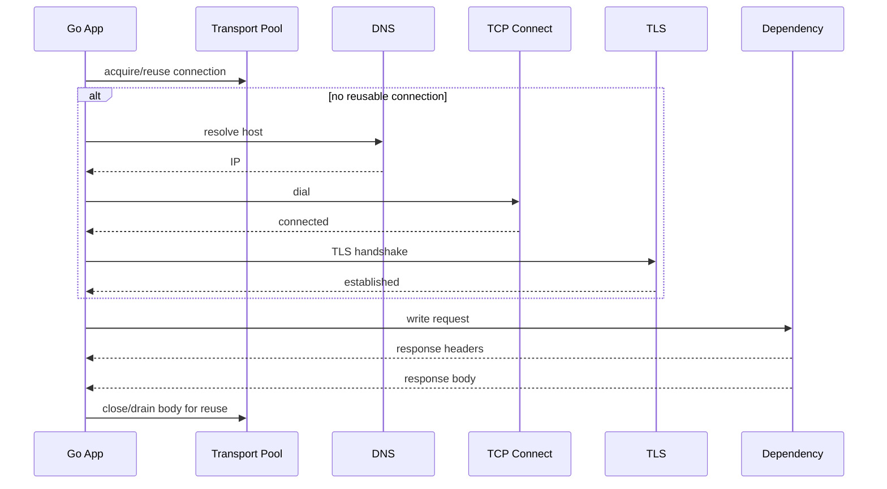
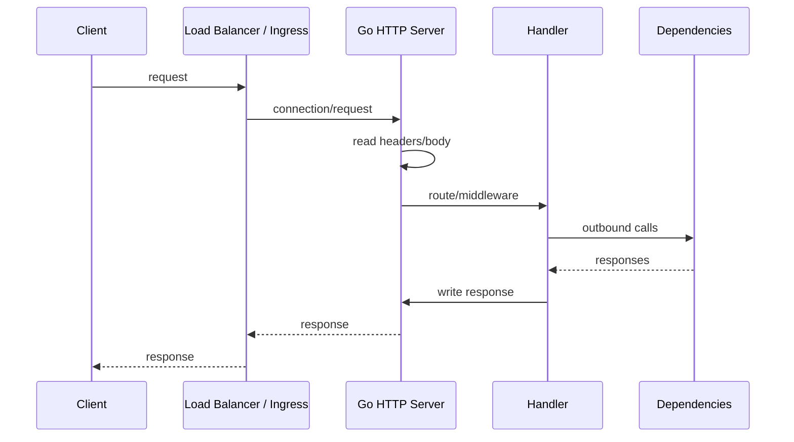
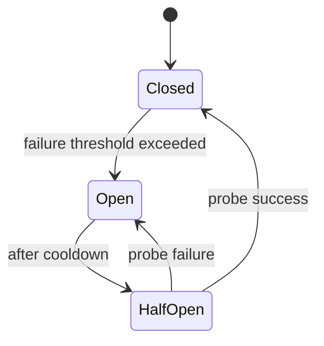

# learn-go-logging-observability-profiling-troubleshooting-part-024.md

# Part 024 — Network, HTTP, and Dependency Troubleshooting

> Seri: `learn-go-logging-observability-profiling-troubleshooting`  
> Bagian: `024 / 032`  
> Fokus: HTTP server/client troubleshooting, DNS/TLS/connect latency, dependency failure, connection pooling, retries, timeouts, status-code taxonomy  
> Target pembaca: Java software engineer / tech lead yang ingin mendiagnosis network dan dependency failure pada Go service production

---

## 0. Posisi Bagian Ini dalam Seri

Bagian sebelumnya membahas:

- latency troubleshooting,
- throughput/saturation troubleshooting,
- memory/OOM/container troubleshooting.

Bagian ini fokus ke kelas incident yang sangat sering terjadi pada microservice:

```text
network
HTTP
dependency
outbound call
inbound traffic
DNS
TLS
connection pool
timeout
retry
rate limit
circuit breaker
```

Dalam Go, network troubleshooting sangat penting karena `net/http` adalah package inti yang sangat banyak dipakai, tetapi mudah disalahgunakan:

- `http.Get` tanpa timeout,
- membuat `http.Client` baru per request,
- tidak menutup response body,
- timeout tidak konsisten,
- transport pool tidak ditune,
- retry tidak menghormati context,
- DNS/TLS/connect time tidak terlihat,
- status code tidak diklasifikasikan,
- dependency failure menyebabkan retry storm,
- app menganggap dependency lambat padahal app menunggu pool,
- load balancer/proxy timeout lebih pendek dari app timeout.

---

## 1. Core Thesis

**Network/dependency troubleshooting harus memisahkan waktu: sebelum request dikirim, selama dependency memproses, saat response dibaca, dan saat retry/backoff terjadi.**

Kalimat yang terlalu kabur:

```text
"External API lambat."
```

Kalimat yang lebih akurat:

```text
"Request lambat karena outbound call ke payment-provider menghabiskan 1.8s. Dari 1.8s itu, 1.2s terjadi sebelum response header, 300ms retry backoff, dan 250ms response body read. Connection pool wait rendah, DNS/connect/TLS normal. Provider latency memang meningkat sejak 10:05."
```

Atau:

```text
"Dependency terlihat lambat di handler, tetapi trace menunjukkan delay 700ms sebelum HTTP request keluar karena app menunggu semaphore outbound limiter. Provider latency normal."
```

---

## 2. HTTP Request Lifecycle

Outbound HTTP call bukan satu operasi tunggal.



A timeout can occur in any phase.

Without instrumentation, all appear as:

```text
context deadline exceeded
```

---

## 3. Inbound HTTP Server Lifecycle

Inbound request path:



Latency can come from:

- client slow upload,
- load balancer queue,
- ingress/proxy timeout,
- server read timeout,
- middleware,
- handler CPU,
- dependency wait,
- response serialization,
- client slow read,
- connection close/reuse behavior.

---

## 4. Dependency Failure Taxonomy

Not all dependency failures are equal.

| Category | Examples | Typical Action |
|---|---|---|
| timeout | context deadline, response header timeout | classify phase, adjust budget |
| connection failure | refused, reset, no route | dependency/network/endpoint |
| DNS failure | lookup timeout, NXDOMAIN | DNS/CoreDNS/config |
| TLS failure | handshake timeout, cert error | cert/config/network |
| 4xx | bad request, auth, rate limit | caller bug/quota |
| 429 | rate limited | backoff, respect retry-after |
| 5xx | provider/server error | retry/circuit breaker |
| slow response body | large payload, streaming issue | body metrics/timeouts |
| pool wait | app-side connection/semaphore | tune app resource |
| retry exhausted | repeated failures | retry budget/circuit |
| protocol mismatch | HTTP/1.1 vs HTTP/2, proxy behavior | config/debug |

Error classification must be explicit in logs/metrics.

---

## 5. Go `http.Client` Basics

A production `http.Client` should be reused.

Bad:

```go
func call(ctx context.Context, url string) (*http.Response, error) {
	return http.Get(url)
}
```

Problems:

- default client has no overall timeout,
- harder to tune transport,
- harder to instrument,
- may hide behavior.

Better:

```go
type DependencyClient struct {
	baseURL string
	client  *http.Client
}

func NewDependencyClient(baseURL string) *DependencyClient {
	transport := &http.Transport{
		MaxIdleConns:        200,
		MaxIdleConnsPerHost: 50,
		MaxConnsPerHost:     100,
		IdleConnTimeout:     90 * time.Second,
		TLSHandshakeTimeout:  10 * time.Second,
	}

	return &DependencyClient{
		baseURL: baseURL,
		client: &http.Client{
			Transport: transport,
			Timeout:   5 * time.Second,
		},
	}
}
```

But `Client.Timeout` is blunt. Often better to use context deadlines per operation plus transport phase timeouts.

---

## 6. Reuse `Transport`

`http.Transport` owns connection pooling.

Bad:

```go
func call(ctx context.Context, url string) error {
	client := &http.Client{
		Transport: &http.Transport{},
	}
	req, _ := http.NewRequestWithContext(ctx, http.MethodGet, url, nil)
	resp, err := client.Do(req)
	if err != nil {
		return err
	}
	defer resp.Body.Close()
	return nil
}
```

This creates new transport/pool per call.

Effects:

- no connection reuse,
- more TCP/TLS handshakes,
- more goroutines,
- more file descriptors,
- more ephemeral ports,
- worse latency/throughput.

Correct:

- construct client/transport once,
- reuse for service lifetime,
- separate clients per dependency if settings differ.

---

## 7. Always Close Response Body

Bad:

```go
resp, err := client.Do(req)
if err != nil {
	return err
}
if resp.StatusCode >= 500 {
	return fmt.Errorf("bad status: %d", resp.StatusCode)
}
```

Missing body close.

Better:

```go
resp, err := client.Do(req)
if err != nil {
	return err
}
defer resp.Body.Close()

if resp.StatusCode >= 500 {
	_, _ = io.Copy(io.Discard, io.LimitReader(resp.Body, 64<<10))
	return fmt.Errorf("bad status: %d", resp.StatusCode)
}
```

Why drain?

- closing is mandatory,
- draining small response body can help reuse connection,
- but do not blindly drain huge/infinite body.

A safe pattern uses a limited discard.

---

## 8. Timeout Layers

Timeouts exist at multiple layers:

### Client-side

- context deadline,
- `http.Client.Timeout`,
- dial timeout,
- TLS handshake timeout,
- response header timeout,
- idle connection timeout,
- expect continue timeout.

### Server-side

- read header timeout,
- read timeout,
- write timeout,
- idle timeout,
- handler context,
- proxy/load balancer timeout.

### Infrastructure

- ingress timeout,
- load balancer idle timeout,
- API gateway timeout,
- service mesh timeout,
- NAT timeout.

Timeouts must be consistent.

Bad:

```text
Client timeout: 30s
Ingress timeout: 10s
Service dependency timeout: 25s
DB timeout: none
```

This causes:

- wasted work after caller gone,
- misleading 499/504,
- goroutine/resource retention.

---

## 9. Recommended Server Timeouts

Never run public HTTP server with no timeouts.

Example:

```go
srv := &http.Server{
	Addr:              ":8080",
	Handler:           handler,
	ReadHeaderTimeout: 5 * time.Second,
	ReadTimeout:       30 * time.Second,
	WriteTimeout:      60 * time.Second,
	IdleTimeout:       90 * time.Second,
	MaxHeaderBytes:    1 << 20,
}
```

Interpretation:

- `ReadHeaderTimeout`: protects from slowloris header attack.
- `ReadTimeout`: total time reading request, including body.
- `WriteTimeout`: response write deadline.
- `IdleTimeout`: keep-alive idle.
- `MaxHeaderBytes`: header size bound.

But tune carefully for:

- large uploads,
- streaming responses,
- long-poll,
- server-sent events,
- websocket upgrade,
- file downloads.

---

## 10. Timeout Budget Design

Given request budget 2 seconds:

```text
handler total: 1800ms
auth: 100ms
DB: 400ms
external A: 600ms
external B: 300ms
serialization: 100ms
slack: 300ms
```

Code should reflect budget.

```go
func (h *Handler) ServeHTTP(w http.ResponseWriter, r *http.Request) {
	ctx := r.Context()

	dbCtx, cancel := context.WithTimeout(ctx, 400*time.Millisecond)
	defer cancel()

	order, err := h.repo.GetOrder(dbCtx, orderID)
	if err != nil {
		// classify timeout/cancel/dependency
		return
	}

	// ...
}
```

Do not set every dependency timeout equal to total request timeout.

---

## 11. Context Propagation

Always attach context to outbound request.

Bad:

```go
req, _ := http.NewRequest(http.MethodGet, url, nil)
```

Better:

```go
req, _ := http.NewRequestWithContext(ctx, http.MethodGet, url, nil)
```

Why?

- caller cancellation,
- deadline propagation,
- shutdown,
- trace propagation,
- retry budget.

If you use `context.Background()` in request path, you detach from lifecycle.

---

## 12. Classifying Timeout Errors

Timeout errors can come from:

- context deadline,
- client timeout,
- dial timeout,
- TLS handshake timeout,
- response header timeout,
- server timeout,
- proxy timeout,
- dependency timeout.

Do not log only:

```text
error="context deadline exceeded"
```

Add classification:

```text
dependency=payment_provider
operation=charge
phase=response_header
timeout_ms=700
attempt=2
remaining_budget_ms=120
```

This requires instrumentation/wrapping.

---

## 13. HTTP Status Code Taxonomy

For service dependency calls:

| Code | Meaning | Retry? |
|---|---|---|
| 200-299 | success | no |
| 400 | caller/data bug | usually no |
| 401/403 | auth/config/permission | no until fixed |
| 404 | depends on domain | usually no |
| 408 | timeout | maybe |
| 409 | conflict | domain-specific |
| 422 | validation | no |
| 429 | rate limited | yes with retry-after/backoff |
| 500 | provider error | maybe |
| 502/503/504 | gateway/unavailable/timeout | maybe |
| network timeout | unknown outcome | maybe if idempotent |

Retry must consider idempotency.

---

## 14. Idempotency and Retries

Retries can duplicate side effects.

Safe-ish to retry:

- GET,
- idempotent PUT,
- idempotency-key protected POST,
- read-only query,
- explicitly retry-safe operation.

Dangerous:

- payment charge,
- create order,
- send email,
- transfer money,
- consume one-time token.

For non-idempotent operations:

- use idempotency key,
- design server-side deduplication,
- retry only when safe,
- treat unknown outcome carefully.

---

## 15. Retry Budget

Retry policy should be bounded by:

- max attempts,
- max elapsed time,
- context deadline,
- retryable status/error,
- backoff with jitter,
- circuit breaker,
- rate limiter.

Bad:

```go
for {
	resp, err := call()
	if err == nil {
		return resp
	}
	time.Sleep(time.Second)
}
```

Better concept:

```go
func retry(ctx context.Context, maxAttempts int, op func(context.Context) error) error {
	var last error
	for attempt := 1; attempt <= maxAttempts; attempt++ {
		if err := ctx.Err(); err != nil {
			return err
		}

		err := op(ctx)
		if err == nil {
			return nil
		}
		last = err

		if !isRetryable(err) {
			return err
		}

		delay := jitteredBackoff(attempt)
		timer := time.NewTimer(delay)
		select {
		case <-ctx.Done():
			timer.Stop()
			return ctx.Err()
		case <-timer.C:
		}
	}
	return last
}
```

---

## 16. Circuit Breaker

Circuit breaker prevents repeatedly calling a failing dependency.

States:



Use when:

- dependency degradation can cascade,
- retries amplify load,
- fallback/degraded mode exists,
- fail-fast is better than waiting.

Metrics:

```text
circuit_state
circuit_open_total
circuit_rejected_total
probe_success_total
probe_failure_total
```

---

## 17. Rate Limiting

Rate limiting protects:

- your service,
- dependency,
- tenant fairness,
- quota,
- expensive endpoint.

Types:

- global,
- per tenant,
- per endpoint,
- per dependency,
- token bucket,
- leaky bucket,
- concurrency limiter.

Rate limiting should be observable:

```text
rate_limited_total{reason,dependency,route}
```

Avoid high-cardinality tenant labels unless controlled.

---

## 18. Connection Pooling Metrics

Go `net/http` does not expose all pool metrics automatically.

You may need:

- custom transport wrapper,
- `httptrace`,
- dependency client metrics,
- connection state hooks for server,
- runtime/goroutine evidence.

Important signals:

- connection reuse ratio,
- new connections/sec,
- TLS handshakes/sec,
- request duration by phase,
- in-flight outbound requests,
- max concurrency usage,
- response body close errors,
- idle connections if available.

---

## 19. `httptrace`

`net/http/httptrace` can instrument phases.

Conceptual example:

```go
trace := &httptrace.ClientTrace{
	DNSStart: func(info httptrace.DNSStartInfo) {
		// record dns start
	},
	DNSDone: func(info httptrace.DNSDoneInfo) {
		// record dns done
	},
	ConnectStart: func(network, addr string) {
		// record connect start
	},
	ConnectDone: func(network, addr string, err error) {
		// record connect done
	},
	TLSHandshakeStart: func() {
		// record tls start
	},
	TLSHandshakeDone: func(state tls.ConnectionState, err error) {
		// record tls done
	},
	GotConn: func(info httptrace.GotConnInfo) {
		// reused? was idle?
	},
	GotFirstResponseByte: func() {
		// response header wait complete
	},
}

req = req.WithContext(httptrace.WithClientTrace(req.Context(), trace))
```

This helps distinguish:

- DNS slow,
- connect slow,
- TLS slow,
- waiting for response,
- no connection reuse.

Use carefully; per-request detailed metrics can be expensive.

---

## 20. DNS Troubleshooting

Symptoms:

- intermittent lookup timeout,
- high latency before connect,
- errors mention resolver,
- only some pods/nodes affected,
- CoreDNS CPU high,
- DNS query rate high.

Causes:

- CoreDNS overloaded,
- bad search domain/ndots behavior,
- high-cardinality DNS lookups,
- no caching,
- network policy,
- resolver config,
- external DNS issue.

Evidence:

- DNS metrics,
- `httptrace` DNS phase,
- pod/node comparison,
- CoreDNS logs/metrics,
- query volume,
- hostnames generated dynamically.

Mitigation:

- cache resolved endpoints where appropriate,
- reduce DNS lookup rate,
- tune CoreDNS,
- use stable service names,
- avoid per-request new transports that cause more DNS/connect.

---

## 21. TLS Troubleshooting

Symptoms:

- handshake timeout,
- cert validation error,
- CPU high in crypto/tls,
- new connections/sec high,
- latency high on connect path.

Causes:

- no connection reuse,
- certificate chain issue,
- mTLS config,
- expired cert,
- SNI mismatch,
- time skew,
- TLS inspection/proxy,
- high handshake rate.

Evidence:

- `httptrace` TLS phase,
- TLS error logs,
- new connection metrics,
- CPU profile crypto/tls,
- cert expiry monitoring.

Fix:

- reuse transport,
- keep-alive,
- cert rotation process,
- mTLS config validation,
- reduce connection churn,
- tune client/server TLS.

---

## 22. TCP Connect Troubleshooting

Symptoms:

- connect timeout,
- connection refused,
- no route,
- reset by peer,
- high connect latency.

Causes:

- dependency down,
- wrong host/port,
- network policy/security group,
- service endpoint missing,
- load balancer issue,
- SYN backlog,
- ephemeral port exhaustion,
- NAT gateway saturation.

Evidence:

- connect phase timing,
- error classification,
- Kubernetes endpoints,
- network policy,
- dependency health,
- OS/socket metrics.

---

## 23. HTTP/2 Considerations

Go may use HTTP/2 automatically for TLS depending configuration.

HTTP/2 benefits:

- multiplexing,
- fewer TCP connections,
- header compression.

Potential issues:

- one connection shared heavily,
- flow control,
- server/proxy bugs,
- max concurrent streams,
- different behavior through load balancers.

When diagnosing:

- know whether HTTP/1.1 or HTTP/2 is used,
- check connection reuse,
- check proxy support,
- compare behavior if protocol changes,
- avoid blind toggling in production.

---

## 24. Proxy / Load Balancer / Ingress Issues

Symptoms:

- 502/503/504 from gateway,
- app logs no request,
- client timeout before app timeout,
- large upload/download fails,
- idle connection reset,
- websocket/SSE broken,
- only external traffic affected.

Check:

- ingress timeout,
- LB idle timeout,
- max body size,
- header size,
- upstream keepalive,
- health checks,
- route config,
- TLS termination,
- path rewriting,
- client IP headers,
- HTTP version.

Important:

```text
If app does not log request, request may not reach app.
```

---

## 25. Server-Side Slow Client

Slow clients can consume server resources.

Protection:

- `ReadHeaderTimeout`,
- body size limit,
- read timeout,
- write timeout,
- streaming policy,
- max in-flight,
- load balancer protection.

For streaming endpoints, timeouts must be designed carefully.

A single set of server timeouts may not fit:

- JSON API,
- file upload,
- file download,
- websocket,
- server-sent events,
- long polling.

---

## 26. Request Body Troubleshooting

Large or slow request bodies cause:

- memory pressure,
- read timeout,
- handler delay,
- goroutine retention,
- upstream proxy buffering,
- 413 errors,
- partial reads.

Best practices:

- limit body size,
- stream large uploads,
- validate content type,
- avoid `io.ReadAll` unbounded,
- close body,
- expose request size buckets,
- align proxy/app max body size.

---

## 27. Response Body Troubleshooting

Large responses cause:

- serialization CPU,
- memory allocation,
- slow client write,
- compression CPU,
- proxy timeout,
- partial response,
- connection reset.

Best practices:

- response size metrics,
- pagination,
- streaming,
- compression threshold,
- client timeout alignment,
- avoid building full response in memory when huge.

---

## 28. Dependency Observability Contract

For every important dependency, expose:

```text
dependency_requests_total
dependency_request_duration_seconds
dependency_errors_total
dependency_timeouts_total
dependency_retries_total
dependency_retry_exhausted_total
dependency_rate_limited_total
dependency_circuit_state
dependency_inflight
dependency_request_size_bytes
dependency_response_size_bytes
```

Labels:

```text
dependency
operation
status_class
error_class
```

Avoid:

- full URL,
- user ID,
- raw query,
- request ID,
- high-cardinality error message.

---

## 29. Dependency Logging Contract

Log dependency boundary failures with:

```text
event=dependency_call_failed
dependency=payment_provider
operation=charge
attempt=2
max_attempts=3
status_code=503
error_class=response_5xx
timeout_phase=response_header
duration_ms=701
remaining_budget_ms=220
retryable=true
trace_id=...
```

Do not log:

- full token,
- full request/response body,
- PII,
- secret headers.

---

## 30. Dependency Tracing Contract

Span design:

```text
HTTP POST /checkout
  payment_provider.charge
  inventory.reserve
  db.order.insert
```

Attributes:

- dependency name,
- operation,
- HTTP method,
- route/template if internal,
- status code,
- retry attempt,
- timeout class,
- request/response size bucket,
- error class.

Span events:

- retry scheduled,
- circuit open,
- fallback used,
- queue wait.

Avoid span per tiny internal loop.

---

## 31. Dependency Runbook

```text
Runbook: Dependency latency/error incident

1. Frame
   - dependency:
   - operation:
   - status/error:
   - start time:
   - affected endpoints:
   - impact:

2. Classify phase
   - DNS?
   - connect?
   - TLS?
   - pool wait?
   - request write?
   - response header wait?
   - body read?
   - retry/backoff?
   - app-side queue/semaphore?

3. Check evidence
   - dependency metrics
   - distributed traces
   - logs with error class
   - httptrace if available
   - goroutine profile
   - block profile
   - transport/pool config
   - dependency provider status

4. Mitigate
   - fail fast
   - open circuit
   - reduce concurrency
   - respect retry-after
   - disable optional feature
   - fallback/stale cache
   - rollback if app regression
   - scale only if local bottleneck

5. Verify
   - error rate
   - p99 latency
   - retry rate
   - dependency load
   - queue depth
   - circuit state

6. Follow up
   - timeout budget
   - retry policy
   - dependency SLO
   - metrics/logging gaps
   - load test degraded dependency
```

---

## 32. Case Study 1: Dependency Slow or App Pool Wait?

### Symptom

- checkout p99 high.
- traces show payment call segment high.

Initial assumption:

```text
Payment provider slow.
```

Evidence:

- `httptrace` shows `GotConn` delayed.
- response header wait normal after connection acquired.
- app outbound semaphore at max.
- goroutine profile blocked on semaphore acquire.

Root cause:

- app-side outbound limiter too low after traffic growth.

Fix:

- increase per-dependency concurrency moderately,
- add wait duration metric,
- isolate high-priority operation,
- keep provider quota in mind.

Lesson:

Dependency span duration can include app-side waiting unless instrumented carefully.

---

## 33. Case Study 2: Missing Body Close

### Symptom

- outbound failures increase over hours.
- goroutine count grows.
- file descriptors grow.
- latency rises.

Evidence:

- goroutine profile many `net/http.(*persistConn).readLoop`.
- non-2xx path returns without closing body.
- new connections/sec high.

Fix:

- close body on all paths,
- drain limited error body,
- test error path,
- add linter/review checklist.

---

## 34. Case Study 3: DNS Overload

### Symptom

- intermittent outbound timeout.
- only pods on some nodes affected.
- CPU low.

Evidence:

- DNS phase slow in `httptrace`.
- CoreDNS CPU high.
- app creates new transport per request.
- DNS query rate spikes.

Fix:

- reuse transport/client,
- reduce DNS churn,
- tune CoreDNS,
- add DNS latency metric,
- avoid dynamic hostnames.

---

## 35. Case Study 4: Retry Storm on 429

### Symptom

- provider returns 429.
- app retries immediately.
- provider rate limit worsens.
- user latency high.

Evidence:

- retry count high,
- no backoff/jitter,
- `Retry-After` ignored,
- outbound RPS > intended.

Fix:

- respect retry-after,
- global rate limiter,
- jittered backoff,
- circuit breaker,
- expose rate_limited metric.

---

## 36. Case Study 5: Proxy Timeout Mismatch

### Symptom

- clients see 504 at 30s.
- app continues processing for 2 minutes.
- DB load remains high after client timeout.

Evidence:

- ingress timeout 30s.
- handler context not cancelling DB job.
- DB query timeout 120s.
- app logs completion after client gone.

Fix:

- align timeout budgets,
- propagate request context to DB,
- cancel work when client gone,
- async job for long-running operation.

---

## 37. Checklist: HTTP Client Review

```text
[ ] Client reused.
[ ] Transport reused.
[ ] Timeouts set.
[ ] Context propagated.
[ ] Response body closed on all paths.
[ ] Error body drained with limit if reuse needed.
[ ] Retries bounded and context-aware.
[ ] Idempotency considered.
[ ] Circuit breaker/rate limiter if critical dependency.
[ ] Dependency metrics exist.
[ ] Dependency logs classify error/status/phase.
[ ] Traces include dependency spans.
[ ] No full URL/user ID as metric label.
[ ] Transport pool settings intentional.
```

---

## 38. Checklist: HTTP Server Review

```text
[ ] ReadHeaderTimeout set.
[ ] ReadTimeout/WriteTimeout intentional.
[ ] IdleTimeout set.
[ ] MaxHeaderBytes set.
[ ] Request body size limited.
[ ] Large upload/download handled explicitly.
[ ] Context used for downstream calls.
[ ] Panic recovery exists.
[ ] Access logs classify status/duration/route.
[ ] Metrics use route template, not raw path.
[ ] Graceful shutdown configured.
[ ] Ingress/LB timeouts aligned.
```

---

## 39. Exercises

### Exercise 1 — Missing Body Close

Build a fake dependency returning 500 with body.

Tasks:

1. call it repeatedly without closing body,
2. observe goroutine/FD growth,
3. capture goroutine profile,
4. fix close/drain,
5. verify.

### Exercise 2 — DNS/Connect/TLS Timing

Use `httptrace` to instrument outbound call.

Tasks:

1. record DNS/connect/TLS/first-byte times,
2. compare first request vs reused connection,
3. explain connection reuse.

### Exercise 3 — Timeout Budget

Design a 2-second checkout timeout budget with:

- DB,
- payment provider,
- inventory,
- serialization.

Write context deadline strategy.

### Exercise 4 — Retry Storm

Create dependency returning 429.

Tasks:

1. implement immediate retry,
2. observe throughput/latency,
3. implement retry-after/backoff,
4. compare.

### Exercise 5 — Proxy Timeout Mismatch

Simulate server handler longer than proxy/client timeout.

Tasks:

1. observe client timeout,
2. observe server continuing,
3. propagate context cancellation,
4. verify stop.

---

## 40. What Good Looks Like

Anda memahami network/HTTP/dependency troubleshooting secara production-grade jika mampu:

1. memecah HTTP call menjadi DNS/connect/TLS/pool/server/body/retry phases,
2. membedakan dependency slow dan app-side wait,
3. mengatur timeout budget berlapis,
4. menulis retry yang bounded, jittered, idempotency-aware,
5. menghindari body leak dan transport churn,
6. membaca goroutine profile untuk HTTP connection issues,
7. menginstrument dependency metrics/logs/traces dengan cardinality aman,
8. mendeteksi retry storm dan rate limit,
9. menyelaraskan app/proxy/LB timeout,
10. memitigasi dependency failure dengan circuit breaker/backpressure/fallback.

---

## 41. Summary

HTTP dependency failure jarang hanya "network lambat".

Anda harus mengurai fase:

```text
pool wait
DNS
connect
TLS
request write
response header wait
body read
retry/backoff
```

Dan menghubungkannya dengan:

- context deadline,
- timeout budget,
- connection pooling,
- response body lifecycle,
- retry/idempotency,
- circuit breaker,
- rate limit,
- dependency SLO,
- proxy/load balancer config.

Go memberi kontrol besar melalui `net/http`, tetapi kontrol itu harus dipakai dengan disiplin.

---

## 42. Status Seri

Bagian ini adalah:

```text
learn-go-logging-observability-profiling-troubleshooting-part-024.md
```

Status:

```text
Part 024 dari 032
Seri belum selesai
```

Bagian berikutnya:

```text
learn-go-logging-observability-profiling-troubleshooting-part-025.md
```

Topik berikutnya:

```text
Kubernetes Observability for Go Services
```

<!-- NAVIGATION_FOOTER -->
<div class="page-nav">
<a href="./learn-go-logging-observability-profiling-troubleshooting-part-023.md">⬅️ Part 023 — Memory, OOM, and Container Troubleshooting</a>
<a href="./index.md">📚 Kategori</a>
<a href="../../index.md">🏠 Home</a>
<a href="./learn-go-logging-observability-profiling-troubleshooting-part-025.md">Part 025 — Kubernetes Observability for Go Services ➡️</a>
</div>
