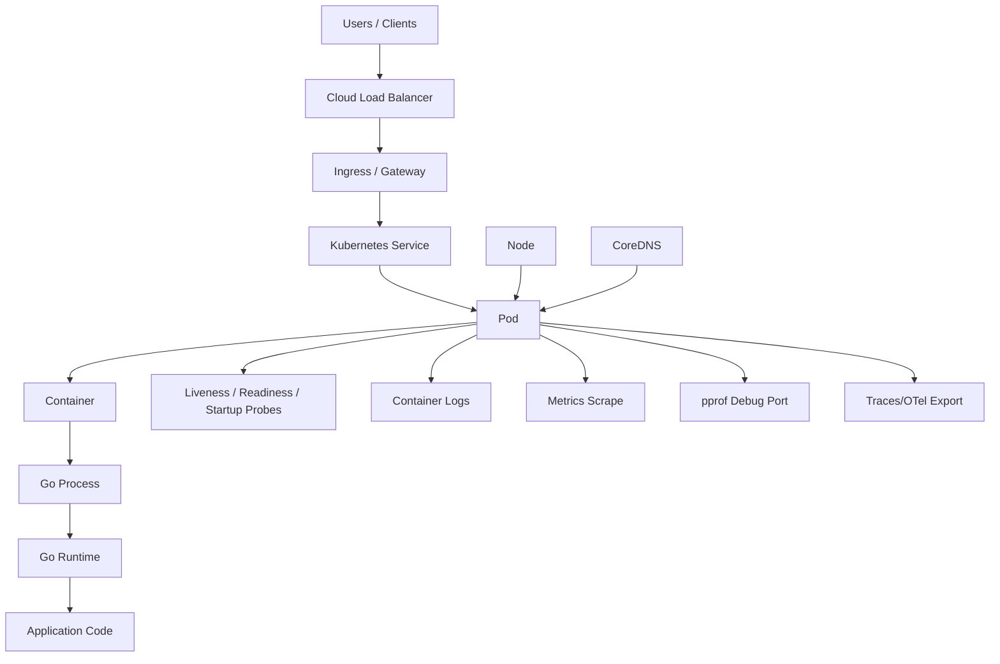
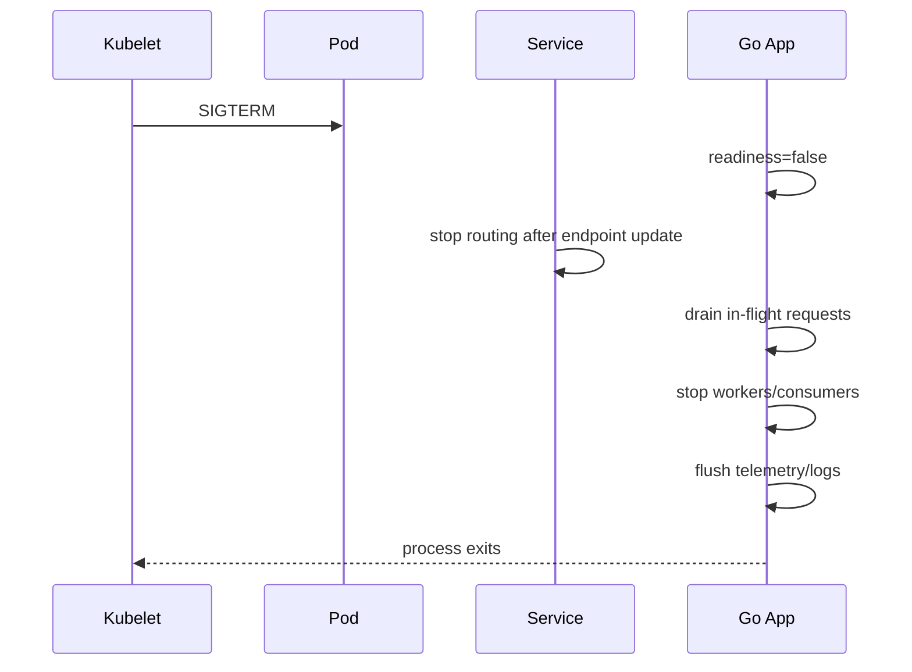
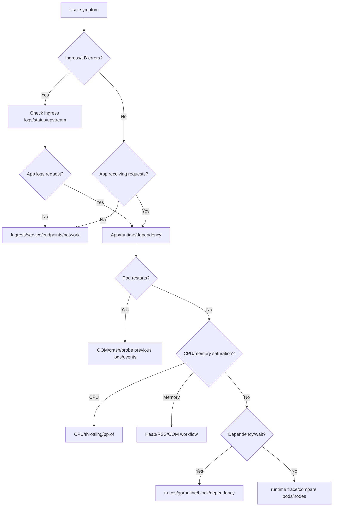

# learn-go-logging-observability-profiling-troubleshooting-part-025.md

# Part 025 — Kubernetes Observability for Go Services

> Seri: `learn-go-logging-observability-profiling-troubleshooting`  
> Bagian: `025 / 032`  
> Fokus: Kubernetes observability, pod/node signals, Go runtime correlation, probes, HPA, ingress, service discovery, pprof access, operational debugging  
> Target pembaca: Java software engineer / tech lead yang menjalankan Go service di Kubernetes production

---

## 0. Posisi Bagian Ini dalam Seri

Part 021 membahas latency troubleshooting.

Part 022 membahas throughput dan saturation.

Part 023 membahas memory/OOM/container troubleshooting.

Part 024 membahas network/HTTP/dependency troubleshooting.

Bagian ini menggabungkan semuanya dalam konteks runtime platform yang paling umum:

```text
Kubernetes
```

Go service di Kubernetes bukan hanya program Go.

Ia adalah:

```text
Go runtime
inside Linux process
inside container
inside pod
scheduled on node
behind service/ingress/load balancer
scraped by monitoring
controlled by deployment/HPA/probes
communicating through DNS/network policies
limited by cgroups
```

Observability harus menghubungkan semua layer itu.

---

## 1. Core Thesis

**Production issue pada Go service di Kubernetes jarang bisa dipahami dari Go metrics saja atau Kubernetes metrics saja. Anda harus mengorelasikan keduanya.**

Contoh:

```text
Go CPU profile menunjukkan app melakukan JSON encode mahal.
Kubernetes metrics menunjukkan CPU throttling tinggi.
Latency p99 naik.
```

Root cause bisa gabungan:

- code path CPU-heavy,
- CPU limit terlalu rendah,
- traffic/payload meningkat,
- HPA terlambat,
- pod menerima traffic sebelum warm,
- node overcommitted.

Contoh lain:

```text
Go heap live 600MiB stabil.
Container working set 1.8GiB.
Pod OOMKilled at 2GiB.
```

Go heap profile saja tidak cukup.

Anda perlu:

- runtime memory classes,
- container RSS/working set,
- goroutine stacks,
- native/mmap,
- cgroup limit,
- node pressure.

---

## 2. Kubernetes Layer Model



Troubleshooting harus bisa turun-naik layer:

```text
User symptom -> ingress -> service -> pod -> container -> Go runtime -> application code -> dependency
```

---

## 3. Kubernetes Signals vs Go Signals

| Kubernetes Signal | Go Signal | Interpretation |
|---|---|---|
| CPU usage | CPU profile/runtime CPU | app CPU cost |
| CPU throttling | runnable goroutines/runtime trace | cgroup limit causing latency |
| memory working set | heap live/memory classes | container memory vs Go heap |
| OOMKilled | heap/goroutine/native evidence | memory root cause |
| restarts | logs/profiles before death | crash/OOM/probe failure |
| liveness failures | goroutine/CPU/GC/deadlock evidence | unhealthy process or probe too strict |
| readiness false | dependency/startup/warmup | traffic routing control |
| HPA replicas | throughput/saturation | scaling response |
| pod pending | node/resource scheduling | capacity issue |
| node pressure | pod eviction/performance | platform pressure |
| service endpoints | app readiness | routing correctness |
| ingress 5xx | app logs/status | proxy vs app failure |

---

## 4. Pod Lifecycle Observability

Pod lifecycle states matter.

```text
Pending -> Running -> Ready -> Terminating -> Succeeded/Failed
```

For service pods:

- `Pending` may indicate scheduling/resource issue.
- `Running` does not mean ready.
- `Ready` means receives traffic through Service.
- `Terminating` should trigger graceful shutdown.
- Restart count indicates crash/OOM/probe failure.

Observe:

```bash
kubectl get pods -n <ns> -o wide
kubectl describe pod <pod> -n <ns>
kubectl logs <pod> -n <ns>
kubectl logs <pod> -n <ns> --previous
```

For production, prefer dashboards and alerts, but CLI is essential during incident.

---

## 5. Container Restart Reasons

Common restart causes:

| Reason | Meaning |
|---|---|
| OOMKilled | container exceeded memory limit |
| Error | process exited non-zero |
| Completed | process exited zero |
| CrashLoopBackOff | repeated crash |
| DeadlineExceeded | job deadline exceeded |
| Evicted | pod evicted due to node pressure/resource |
| liveness probe failure | kubelet restarted container |
| startup probe failure | startup did not complete in time |

Important:

```text
CrashLoopBackOff is not root cause. It is restart pattern.
```

Check previous logs:

```bash
kubectl logs <pod> -n <ns> --previous
```

---

## 6. Probes: Liveness, Readiness, Startup

### 6.1 Liveness Probe

Answers:

```text
Should Kubernetes restart this container?
```

Use for:

- process stuck beyond recovery,
- deadlock-like condition,
- fatal internal state.

Do not use liveness for dependency health.

If DB is down, restarting every pod often worsens incident.

### 6.2 Readiness Probe

Answers:

```text
Should this pod receive traffic?
```

Use for:

- app initialized,
- dependencies required for serving,
- graceful shutdown draining,
- warmup complete,
- overload/load shedding readiness if intentionally designed.

### 6.3 Startup Probe

Answers:

```text
Has slow-starting app finished startup?
```

Use when startup may take longer than liveness threshold.

---

## 7. Probe Anti-Patterns

### 7.1 Liveness Checks DB

Bad:

```text
/livez checks DB connectivity
```

If DB has transient issue, Kubernetes restarts all app pods, causing extra load and connection churn.

Better:

- liveness checks internal process health only,
- readiness can reflect critical dependency if no useful traffic can be served,
- dependency status exposed separately.

### 7.2 Probe Too Expensive

Probe endpoint performs:

- DB query,
- external HTTP call,
- heavy allocation,
- lock contention,
- auth flow.

Bad.

Probes are frequent and must be cheap.

### 7.3 Same Endpoint for All Probes

`/health` used for liveness/readiness/startup with same semantics.

Better:

```text
/livez
/readyz
/startupz
```

### 7.4 Readiness True Before Warmup

Pod receives traffic before caches/pools/config loaded.

Result:

- cold-start latency,
- error spike,
- autoscaling instability.

---

## 8. Go HTTP Server for Probes

Example:

```go
func livez(w http.ResponseWriter, r *http.Request) {
	w.WriteHeader(http.StatusOK)
	_, _ = w.Write([]byte("ok"))
}

type Readiness struct {
	ready atomic.Bool
}

func (rd *Readiness) readyz(w http.ResponseWriter, r *http.Request) {
	if !rd.ready.Load() {
		http.Error(w, "not ready", http.StatusServiceUnavailable)
		return
	}
	w.WriteHeader(http.StatusOK)
}
```

During startup:

```go
rd.ready.Store(false)
// initialize config, pools, warmup
rd.ready.Store(true)
```

During shutdown:

```go
rd.ready.Store(false)
// sleep/drain if needed, then shutdown server
```

---

## 9. Graceful Shutdown in Kubernetes

Kubernetes sends SIGTERM.

Typical flow:



Go app should:

1. handle SIGTERM,
2. mark not ready,
3. stop accepting new requests,
4. allow in-flight requests within timeout,
5. stop background workers,
6. close resources,
7. flush logs/traces,
8. exit before termination grace period.

---

## 10. Graceful Shutdown Go Pattern

```go
ctx, stop := signal.NotifyContext(context.Background(), syscall.SIGINT, syscall.SIGTERM)
defer stop()

srv := &http.Server{
	Addr:    ":8080",
	Handler: handler,
}

go func() {
	if err := srv.ListenAndServe(); err != nil && err != http.ErrServerClosed {
		logger.Error("http server failed", "error", err)
	}
}()

<-ctx.Done()

readiness.Store(false)

shutdownCtx, cancel := context.WithTimeout(context.Background(), 25*time.Second)
defer cancel()

if err := srv.Shutdown(shutdownCtx); err != nil {
	logger.Error("http shutdown failed", "error", err)
}
```

Kubernetes config:

```yaml
terminationGracePeriodSeconds: 30
```

App shutdown timeout must be less than grace period.

---

## 11. CPU Observability in Kubernetes

Key metrics:

```text
container_cpu_usage_seconds_total
container_cpu_cfs_throttled_seconds_total
container_cpu_cfs_periods_total
container_cpu_cfs_throttled_periods_total
```

Watch:

- CPU usage vs request/limit,
- throttled seconds,
- throttled periods,
- p99 latency correlation,
- Go CPU profile,
- runtime trace runnable delay.

CPU throttling can cause latency even when average CPU looks moderate.

---

## 12. GOMAXPROCS and CPU Limits

Go runtime uses `GOMAXPROCS` to decide how many OS threads execute Go code simultaneously.

In containers, `GOMAXPROCS` should match effective CPU quota/cpuset behavior.

Modern Go has improved container awareness over time, but production teams should still verify:

- Go version behavior,
- CPU limit/request,
- runtime logs/metrics,
- actual throughput,
- throttling,
- `GOMAXPROCS` value if explicitly set.

If `GOMAXPROCS` too high relative to CPU quota:

- more runnable goroutines,
- more scheduling contention,
- throttling impact,
- worse tail latency.

If too low:

- underutilization.

---

## 13. Memory Observability in Kubernetes

Key metrics:

```text
container_memory_working_set_bytes
container_memory_rss
container_memory_usage_bytes
container_spec_memory_limit_bytes
kube_pod_container_status_restarts_total
OOMKilled events
```

Correlate with Go:

```text
heap live
heap goal
allocation rate
stack memory
goroutine count
GC CPU
memory classes
```

Question:

```text
Is container memory growth explained by Go heap?
```

If no:

- stacks,
- native/cgo,
- mmap,
- runtime metadata,
- page cache/accounting,
- measurement mismatch.

---

## 14. Kubernetes OOM Workflow

When OOMKilled:

```bash
kubectl describe pod <pod> -n <ns>
kubectl logs <pod> -n <ns> --previous
kubectl get events -n <ns> --sort-by=.lastTimestamp
```

Dashboard:

- memory before kill,
- heap live before kill,
- goroutines,
- allocation rate,
- GC CPU,
- deployment markers.

If pod still alive and near OOM:

- heap before/after GC,
- allocs,
- goroutine dump,
- runtime metrics snapshot.

As covered in Part 023, evidence disappears after kill.

---

## 15. HPA Observability

Horizontal Pod Autoscaler may scale based on:

- CPU,
- memory,
- custom metrics,
- external metrics.

Observe:

```bash
kubectl describe hpa <name> -n <ns>
kubectl get hpa -n <ns>
```

Questions:

1. What metric drives scaling?
2. Is metric relevant to bottleneck?
3. Is scale-up too slow?
4. Is max replica too low?
5. Is min replica too low?
6. Does scaling overload dependencies?
7. Does cold start affect readiness?
8. Are pods pending due to node capacity?
9. Are old/new pods both serving during rollout?

---

## 16. HPA Anti-Patterns

### 16.1 CPU HPA for Wait-Bound Service

If latency high because DB pool wait, CPU low.

CPU-based HPA will not scale.

Even if it scales, it may overload DB.

### 16.2 Scaling App Over Shared Dependency

More pods:

```text
more DB connections
more outbound calls
more cache warmup
more retries
```

Can worsen shared bottleneck.

### 16.3 Missing Max Replica Capacity Model

HPA max replicas times per-pod DB pool must fit DB capacity.

### 16.4 Cold Start Unobserved

Scaling adds pods, but readiness too early, causing cold-start latency.

---

## 17. Kubernetes Service and Endpoints

A Service routes to ready endpoints.

Check:

```bash
kubectl get svc -n <ns>
kubectl get endpoints -n <ns>
kubectl get endpointslices -n <ns>
```

Symptoms:

- no endpoints,
- wrong selector,
- not-ready pods excluded,
- stale endpoints,
- traffic to old version,
- readiness flapping.

If ingress returns 503 and app logs no request, check service/endpoints/ingress first.

---

## 18. Ingress / Gateway Observability

Observe:

- ingress request rate,
- status codes,
- upstream status,
- upstream response time,
- connection errors,
- timeout,
- request/response size,
- TLS errors,
- route/path,
- backend service.

Common issues:

- 502 bad gateway,
- 503 no upstream,
- 504 upstream timeout,
- body size limit,
- header size limit,
- idle timeout,
- websocket/SSE timeout,
- wrong path rewrite,
- TLS/cert issue.

Correlate ingress logs with app access logs.

If ingress saw request but app did not, issue is between ingress and pod.

---

## 19. DNS and CoreDNS

Kubernetes service discovery relies heavily on DNS.

Symptoms:

- intermittent dependency resolution failure,
- lookup timeout,
- latency spikes before connect,
- only inside cluster,
- CoreDNS high CPU,
- high DNS query rate.

Observe:

- CoreDNS metrics/logs,
- DNS latency,
- pod `/etc/resolv.conf`,
- app connection reuse,
- dynamic hostnames,
- new transport per request.

Go app can amplify DNS load if it does not reuse transports/connections.

---

## 20. NetworkPolicy and Security Groups

Network failures can be caused by policy.

Symptoms:

- connection timeout,
- no route,
- works from one namespace but not another,
- service endpoint healthy but unreachable,
- only new deployment affected.

Check:

- NetworkPolicy,
- security group,
- service mesh policy,
- namespace labels,
- pod labels,
- egress restrictions,
- DNS allow rules.

Observability:

- connection error classification,
- network policy logs if available,
- flow logs.

---

## 21. Node-Level Observability

Node problems affect pods.

Signals:

- node CPU pressure,
- memory pressure,
- disk pressure,
- network errors,
- kubelet issues,
- container runtime issues,
- noisy neighbor,
- pod evictions,
- image pull failures.

Check:

```bash
kubectl describe node <node>
kubectl get pods -A -o wide --field-selector spec.nodeName=<node>
```

If only pods on one node fail, suspect node/platform.

---

## 22. Pod Placement and Zonal Issues

Symptoms:

- only one AZ/zone affected,
- only pods on certain node pool,
- only intranet/internet zone,
- dependency endpoint local to zone slow,
- cross-zone latency.

Observe:

- node labels,
- zone labels,
- pod distribution,
- topology spread,
- affinity/anti-affinity,
- service endpoints by zone,
- load balancer target health.

For Go service, compare metrics by:

```text
pod
node
zone
version
```

---

## 23. Logs in Kubernetes

Container logs are stdout/stderr.

Good log design:

- structured JSON,
- timestamp,
- level,
- service,
- version,
- pod/node if injected,
- trace ID,
- request ID,
- route,
- error class.

Kubernetes context should be attached by log pipeline or environment:

```text
namespace
pod
container
node
deployment
replicaSet
image
```

Avoid:

- multiline unstructured stack chaos,
- huge payload logs,
- secrets,
- high-volume debug logs,
- logs as only metric source.

---

## 24. Metrics Scraping in Kubernetes

Prometheus scrape considerations:

- scrape path,
- scrape port,
- scrape interval,
- service/pod monitor labels,
- target labels,
- relabeling,
- high cardinality,
- histogram bucket design.

Important Kubernetes labels for correlation:

```text
namespace
pod
container
node
deployment
version
zone
```

But avoid exploding metrics by adding too many labels at app level.

Application metrics should use:

- route template,
- method,
- status class,
- dependency name,
- operation,
- error class.

Not:

- raw path,
- user ID,
- request ID,
- pod UID as app label if platform already adds it.

---

## 25. Tracing in Kubernetes

Trace resource attributes should include:

```text
service.name
service.version
deployment.environment
k8s.namespace.name
k8s.pod.name
k8s.container.name
k8s.node.name
```

This allows:

- compare version,
- find slow pod,
- correlate pod restart,
- correlate node issue,
- connect logs/traces/metrics.

Do not rely on trace alone. Use it with metrics/profiles.

---

## 26. pprof Access in Kubernetes

Recommended pattern:

- debug server on separate port,
- not exposed via public ingress,
- access via `kubectl port-forward`,
- private debug service only if needed,
- NetworkPolicy/RBAC controlled,
- short captures.

Example:

```bash
kubectl -n prod port-forward pod/payment-api-7d9f8c 6060:6060

curl -o cpu.pb.gz "http://localhost:6060/debug/pprof/profile?seconds=30"
curl -o heap.pb.gz "http://localhost:6060/debug/pprof/heap?gc=1"
curl -o goroutine.txt "http://localhost:6060/debug/pprof/goroutine?debug=2"
```

Never expose `/debug/pprof` publicly.

---

## 27. Ephemeral Containers for Debugging

Kubernetes supports adding debug containers in some clusters.

Use cases:

- inspect network from pod namespace,
- run tools not in app image,
- debug distroless/minimal images,
- check DNS/connectivity.

Caution:

- requires RBAC,
- may not be enabled,
- do not mutate production state casually,
- record actions in incident notes.

Even with ephemeral container, prefer application-level evidence first.

---

## 28. Minimal Container Images and Debuggability

Distroless/scratch images improve security but reduce shell/debug tools.

Mitigation:

- expose safe diagnostics (`/metrics`, pprof private),
- structured logs,
- build info endpoint,
- ephemeral debug container process,
- separate debug images,
- runbooks with `kubectl` commands,
- avoid needing shell inside app container.

Do not add curl/bash to production image just because observability is weak.

---

## 29. Build and Version Metadata

Every pod should expose or label:

```text
service name
version
commit SHA
build time
Go version
config version
deployment environment
```

Kubernetes labels:

```yaml
app.kubernetes.io/name: payment-api
app.kubernetes.io/version: "2026.06.23.1"
app.kubernetes.io/component: api
```

App endpoint:

```text
/debug/buildinfo
```

This supports:

- profile artifact naming,
- canary comparison,
- incident timeline,
- rollback decision,
- profile/source matching.

---

## 30. Canary and Rollout Observability

During rollout compare:

- old vs new version latency,
- CPU per request,
- memory,
- allocation rate,
- error class,
- dependency calls,
- response size,
- goroutine count,
- pprof if needed.

Canary labels must allow query:

```text
version="v1" vs version="v2"
```

Bad canary:

```text
no version label; only aggregate metrics
```

You cannot see regression until full rollout.

---

## 31. Deployment Failure Modes

Common Kubernetes rollout issues:

1. readiness too early,
2. readiness flapping,
3. liveness killing slow startup,
4. resource limits changed,
5. env/config missing,
6. secret mount issue,
7. DNS/service account/RBAC issue,
8. image pull problem,
9. HPA scale instability,
10. PDB blocking eviction,
11. new version only failing one zone,
12. old/new config incompatible.

Observe deployment:

```bash
kubectl rollout status deployment/<name> -n <ns>
kubectl describe deployment <name> -n <ns>
kubectl describe replicaset <rs> -n <ns>
```

---

## 32. Kubernetes Event Stream

Events are useful but not complete.

Check:

```bash
kubectl get events -n <ns> --sort-by=.lastTimestamp
```

Events can show:

- OOMKilled,
- probe failures,
- image pull backoff,
- failed scheduling,
- node pressure,
- killing container,
- unhealthy probes.

But events expire and may be noisy.

Include event capture in incident evidence.

---

## 33. Service Mesh Considerations

If using service mesh:

Additional observability layer:

- sidecar CPU/memory,
- sidecar latency,
- mTLS handshake,
- retries/timeouts at mesh layer,
- circuit breaking,
- outlier detection,
- request routing,
- header mutation,
- telemetry duplication.

Potential issue:

```text
App retries + mesh retries = retry amplification
```

Timeout budgets must include mesh config.

If app logs no retry but dependency receives multiple attempts, check mesh.

---

## 34. Kubernetes Troubleshooting Decision Tree



---

## 35. Kubernetes Incident Runbook for Go Service

```text
Runbook: Go service incident in Kubernetes

1. Frame
   - service:
   - namespace:
   - endpoint/job:
   - start time:
   - version:
   - pods affected:
   - nodes/zones:
   - user impact:

2. Check routing
   - ingress status/errors
   - service endpoints
   - readiness
   - app access logs

3. Check pod health
   - pod phase
   - restarts
   - previous logs
   - events
   - probe failures

4. Check resources
   - CPU usage/throttling
   - memory/limit/OOM
   - goroutines
   - GC
   - queue/pool

5. Check dependencies
   - DB pool/DB server
   - outbound HTTP
   - DNS/CoreDNS
   - external provider
   - message broker

6. Capture Go evidence
   - CPU profile if CPU high
   - heap/goroutine if memory
   - goroutine/block/mutex if wait-bound
   - runtime trace if timeline unclear

7. Compare
   - affected vs unaffected pods
   - old vs new version
   - node/zone
   - tenant/endpoint

8. Mitigate
   - rollback
   - scale if safe
   - mark not ready/drain
   - load shed
   - circuit breaker
   - resource adjustment
   - restart only after evidence if possible

9. Verify
   - SLO metrics
   - errors
   - latency
   - saturation cleared
   - restarts stopped

10. Follow-up
   - missing metrics
   - probe config
   - resource sizing
   - runbook update
   - benchmark/profile regression
```

---

## 36. Case Study 1: CPU Throttling Misdiagnosed as Go Slowness

### Symptom

- p99 high only in Kubernetes.
- local benchmark fine.
- CPU profile not showing huge hotspot.

Evidence:

- container CPU throttling sustained.
- CPU limit = 500m.
- runtime trace shows runnable goroutines delayed.
- increasing CPU limit resolves p99.

Root cause:

- cgroup throttling, not Go algorithm regression.

Prevention:

- CPU throttling dashboard/alert,
- realistic load test under same limits,
- review CPU requests/limits.

---

## 37. Case Study 2: Liveness Probe Restart Storm

### Symptom

- pods restart during DB incident.
- app availability worsens.
- DB connection storm.

Evidence:

- liveness probe calls `/health` that checks DB.
- DB latency > probe timeout.
- kubelet restarts all pods.

Root cause:

- liveness incorrectly depended on external DB.

Fix:

- split `/livez` and `/readyz`,
- liveness internal only,
- readiness can reflect DB if required,
- startup probe for slow startup.

---

## 38. Case Study 3: No Service Endpoints

### Symptom

- ingress returns 503.
- app logs no requests.
- pods running.

Evidence:

- readiness failing.
- Service endpoints empty.
- readiness endpoint requires optional dependency that is down.

Root cause:

- readiness too strict; optional dependency removed pod from service.

Fix:

- readiness checks only required serving capability,
- optional dependency handled degraded,
- readiness reason metric/log.

---

## 39. Case Study 4: OOM During Rollout

### Symptom

- OOM only during deployment.
- steady state memory normally okay.

Evidence:

- old and new pods overlap.
- new pods warm large cache simultaneously.
- memory headroom low.
- node memory pressure.

Fix:

- reduce max surge,
- stagger warmup,
- lower cache warmup concurrency,
- increase memory headroom,
- readiness after warmup,
- cache size limit.

---

## 40. Case Study 5: DNS Incident Amplified by Transport Misuse

### Symptom

- outbound latency intermittent.
- CoreDNS CPU high.
- app dependency calls time out.

Evidence:

- new `http.Transport` per request.
- no connection reuse.
- DNS query rate huge.
- httptrace shows DNS latency.

Fix:

- reuse client/transport,
- tune transport,
- add DNS latency metric,
- CoreDNS capacity review.

---

## 41. Checklist: Kubernetes Observability Readiness

```text
[ ] App exposes /metrics.
[ ] App exposes private pprof/debug port safely.
[ ] App exposes build info.
[ ] Logs are structured.
[ ] Metrics include version/pod via platform labels.
[ ] Traces include k8s resource attributes.
[ ] CPU throttling dashboard exists.
[ ] Memory RSS vs Go heap dashboard exists.
[ ] Goroutine and GC metrics visible.
[ ] Probe endpoints separated.
[ ] Graceful shutdown tested.
[ ] HPA metric matches bottleneck.
[ ] Service endpoints monitored.
[ ] Ingress errors correlated with app logs.
[ ] CoreDNS/network dependency observable.
[ ] OOM runbook exists.
```

---

## 42. Exercises

### Exercise 1 — Probe Semantics

Design `/livez`, `/readyz`, `/startupz` for a Go API with DB and optional recommendation service.

Explain:

- what each checks,
- what each must not check,
- failure behavior.

### Exercise 2 — CPU Throttling Lab

Run Go CPU-bound service with low CPU limit.

Tasks:

1. load test,
2. observe p99,
3. observe throttling,
4. capture CPU profile,
5. raise limit and compare.

### Exercise 3 — OOM Evidence

Run service with bounded memory limit and unbounded cache.

Tasks:

1. capture heap before OOM,
2. collect Kubernetes events,
3. inspect previous logs,
4. write RCA.

### Exercise 4 — Readiness Flap

Make readiness depend on slow optional dependency.

Tasks:

1. observe endpoints disappear,
2. ingress 503,
3. fix readiness design.

### Exercise 5 — pprof via Port Forward

Deploy Go service with private debug port.

Tasks:

1. port-forward,
2. capture CPU profile,
3. capture heap profile,
4. capture goroutine dump,
5. name artifacts properly.

---

## 43. What Good Looks Like

Anda memahami Kubernetes observability for Go services secara production-grade jika mampu:

1. menghubungkan Go runtime metrics dengan container/pod/node metrics,
2. membedakan app failure, ingress failure, service endpoint failure, dan node failure,
3. mendesain probe yang benar,
4. membaca CPU throttling dan memory limit secara akurat,
5. melakukan pprof capture aman via Kubernetes,
6. menghubungkan HPA dengan capacity model,
7. melakukan affected vs unaffected analysis by pod/node/version/zone,
8. menjaga debugability tanpa melemahkan image security,
9. menjalankan graceful shutdown yang benar,
10. menulis runbook Kubernetes incident yang actionable.

---

## 44. Summary

Go service di Kubernetes harus diobservasi sebagai sistem berlapis.

Layer Go menjawab:

```text
CPU hot path
heap live
allocation rate
goroutines
GC
pprof
runtime trace
```

Layer Kubernetes menjawab:

```text
pod health
container limit
CPU throttling
OOMKilled
probes
service endpoints
ingress status
node pressure
HPA
rollout
DNS
```

Incident production biasanya membutuhkan korelasi keduanya.

Jika hanya melihat Go, Anda bisa melewatkan cgroup throttling.

Jika hanya melihat Kubernetes, Anda bisa melewatkan allocation churn atau goroutine leak.

Production-grade observability menghubungkan:

```text
service -> pod -> container -> Go runtime -> code path -> dependency
```

---

## 45. Status Seri

Bagian ini adalah:

```text
learn-go-logging-observability-profiling-troubleshooting-part-025.md
```

Status:

```text
Part 025 dari 032
Seri belum selesai
```

Bagian berikutnya:

```text
learn-go-logging-observability-profiling-troubleshooting-part-026.md
```

Topik berikutnya:

```text
Alerting, SLO, and Error Budget Engineering
```

<!-- NAVIGATION_FOOTER -->
<div class="page-nav">
<a href="./learn-go-logging-observability-profiling-troubleshooting-part-024.md">⬅️ Part 024 — Network, HTTP, and Dependency Troubleshooting</a>
<a href="./index.md">📚 Kategori</a>
<a href="../../index.md">🏠 Home</a>
<a href="./learn-go-logging-observability-profiling-troubleshooting-part-026.md">Part 026 — Alerting, SLO, and Error Budget Engineering ➡️</a>
</div>
