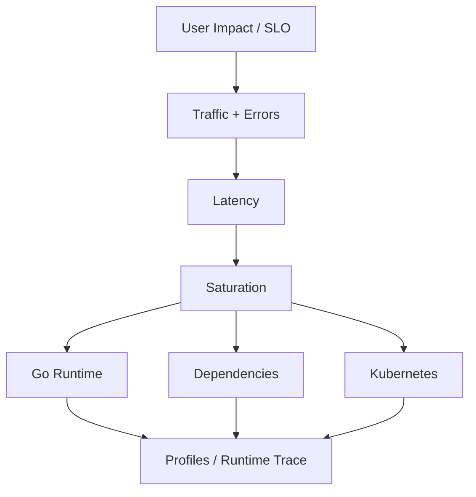

# learn-go-logging-observability-profiling-troubleshooting-part-027.md

# Part 027 — Dashboard Design for Go Services

> Seri: `learn-go-logging-observability-profiling-troubleshooting`  
> Bagian: `027 / 032`  
> Fokus: dashboard design, Go service golden signals, runtime panels, Kubernetes correlation, dependency dashboards, incident drill-down  
> Target pembaca: Java software engineer / tech lead yang ingin membangun dashboard production-grade yang benar-benar membantu troubleshooting

---

## 0. Posisi Bagian Ini dalam Seri

Part 026 membahas:

- SLI,
- SLO,
- SLA,
- error budget,
- burn-rate alerting,
- page vs ticket,
- alert fatigue,
- alert actionability.

Bagian ini membahas pasangan alami dari alert:

```text
dashboard
```

Alert menjawab:

```text
Apakah manusia perlu bertindak?
```

Dashboard menjawab:

```text
Apa yang sedang terjadi, seberapa luas, dan arah investigasi berikutnya apa?
```

Dashboard yang buruk membuat incident lebih lambat.

Dashboard yang baik membuat engineer dapat melihat:

- user impact,
- error/latency/traffic trend,
- saturation,
- deployment correlation,
- affected version/pod/node/zone,
- Go runtime behavior,
- dependency health,
- Kubernetes platform signals,
- next diagnostic action.

---

## 1. Core Thesis

**Dashboard production-grade bukan kumpulan semua metric. Dashboard production-grade adalah decision interface untuk menjawab pertanyaan operasional dengan cepat.**

Bad dashboard:

```text
100 panel
semua metric dipasang
tidak ada urutan
tidak ada SLO
tidak ada deployment marker
tidak ada drill-down
label terlalu ramai
p99 tanpa sample count
CPU tanpa throttling
memory tanpa heap/RSS split
dependency latency tanpa error class
```

Good dashboard:

```text
1. Apakah user terdampak?
2. Endpoint mana?
3. Versi/pod/zone mana?
4. Apakah CPU/memory/GC/goroutine/queue/dependency saturated?
5. Apakah ada deploy/config/traffic change?
6. Tool berikutnya apa: CPU profile, heap, goroutine, trace, logs?
```

---

## 2. Dashboard Types

Tidak semua dashboard punya tujuan yang sama.

| Dashboard Type | Purpose |
|---|---|
| Executive / SLO overview | user impact and reliability target |
| Service overview | health of one service |
| Incident triage | quick root direction |
| Runtime deep dive | Go runtime CPU/memory/GC/goroutine |
| Dependency dashboard | DB/cache/external/broker health |
| Kubernetes dashboard | pod/node/ingress/HPA/probe/resource |
| Capacity dashboard | trend/headroom/planning |
| Release/canary dashboard | old vs new version |
| Debug dashboard | temporary investigation panels |

Masalah umum:

```text
Satu dashboard dipaksa menjadi semuanya.
```

Lebih baik punya layered dashboards.

---

## 3. Dashboard Design Principles

### 3.1 Start with Questions

Setiap panel harus menjawab pertanyaan.

Bad:

```text
Panel: goroutines
```

Better:

```text
Question: Is goroutine count growing abnormally and correlating with latency/memory?
Panel: goroutines by pod with deployment markers and baseline band
```

### 3.2 Put User Impact First

Panel atas harus menunjukkan:

- availability,
- latency,
- traffic,
- error budget / SLO burn,
- affected route/job.

### 3.3 Then Saturation

Setelah user impact:

- CPU/throttling,
- memory,
- goroutines,
- queues,
- DB pool,
- dependencies.

### 3.4 Then Runtime/Debug

Runtime panels membantu diagnosis:

- heap live,
- allocation rate,
- GC CPU,
- goroutines,
- stack memory,
- pprof link guidance.

### 3.5 Keep Drill-Down Path

Dashboard harus memberi jalan:

```text
overview -> route -> version -> pod -> runtime -> profile/log/trace
```

---

## 4. Golden Signals for Go Services

Classical golden signals:

1. latency,
2. traffic,
3. errors,
4. saturation.

For Go service, extend with runtime signals:

5. goroutines,
6. heap live/allocation rate,
7. GC CPU/pause/assist,
8. CPU throttling,
9. queue/pool wait,
10. dependency health.

Top-level service panel should include:

```text
request rate
error rate
latency p50/p95/p99 or threshold ratio
SLO burn
CPU usage/throttling
memory working set / limit
heap live
goroutine count
dependency error/latency
queue depth/wait
deployment markers
```

---

## 5. Dashboard Layout: Service Overview

Recommended top-down layout:

```text
Row 1: User impact / SLO
Row 2: Traffic and errors
Row 3: Latency distribution
Row 4: Saturation summary
Row 5: Go runtime
Row 6: Dependencies
Row 7: Kubernetes/platform
Row 8: Logs/traces/profile links
```

Mermaid mental layout:



---

## 6. Row 1: User Impact and SLO

Panels:

1. Availability SLO good/bad ratio.
2. Latency SLO good/bad ratio.
3. Error budget remaining.
4. Burn rate short/long window.
5. Current active alerts.
6. Current deployment version mix.

Purpose:

```text
Is this service violating user expectations right now?
```

Do not start dashboard with CPU.

CPU is cause signal, not user impact.

---

## 7. Row 2: Traffic and Errors

Panels:

- request rate by route group,
- request rate by status class,
- error rate by status class,
- top error classes,
- timeout/cancellation count,
- panic recovered count,
- load shed/rejected count.

Good labels:

```text
route template
method
status_class
error_class
version
```

Bad labels:

```text
raw_path
user_id
request_id
full_error_message
```

Traffic panel answers:

```text
Did load increase?
Did route mix change?
Did only one route break?
Did errors increase with traffic or independent of traffic?
```

---

## 8. Row 3: Latency

Use both percentile and threshold-ratio views.

Panels:

1. p50/p95/p99 by route group,
2. SLO threshold success ratio,
3. histogram heatmap,
4. latency by version,
5. latency by dependency if correlated,
6. sample count.

Why sample count?

```text
p99 without sample count can mislead.
```

Latency row questions:

- all requests slower or tail only?
- one endpoint or all endpoints?
- old version vs new version?
- latency correlated with traffic?
- latency correlated with dependency?

---

## 9. Row 4: Saturation Summary

Panels:

- CPU usage vs request/limit,
- CPU throttling,
- memory working set vs limit,
- in-flight requests,
- queue depth and wait,
- DB pool in-use/wait,
- outbound in-flight/dependency limiter,
- worker active/idle.

This row answers:

```text
Which resource looks saturated?
```

Saturation should be near top because it often explains latency/throughput.

---

## 10. Row 5: Go Runtime

Panels:

### 10.1 Goroutines

```text
goroutine count by pod
```

With baseline.

Interpretation:

- rising with traffic may be normal,
- monotonic growth suspicious,
- high count with memory/latency suggests leak/pileup.

### 10.2 Heap Live

```text
heap live by pod
heap goal
container memory limit
```

Interpretation:

- live heap growth means retention,
- heap goal near limit means memory pressure.

### 10.3 Allocation Rate

```text
allocated bytes/sec
allocated objects/sec
```

Interpretation:

- allocation churn,
- GC pressure,
- release regression.

### 10.4 GC

```text
GC CPU
GC cycles/sec
pause p95/p99
heap goal/live
```

Interpretation:

- GC CPU high can reduce throughput,
- pauses usually less important than GC CPU/assist,
- correlate with latency.

### 10.5 Stack Memory

```text
goroutine stack memory
```

Interpretation:

- goroutine pileup,
- blocked/leaked goroutines.

---

## 11. Row 6: Dependencies

For each critical dependency:

- request rate,
- latency p95/p99,
- error rate,
- timeout rate,
- retry rate,
- retry exhausted,
- circuit breaker state,
- rate limited count,
- in-flight calls,
- pool/limiter wait.

Group dependencies:

```text
database
cache
message broker
external HTTP
identity provider
object storage
```

Dependency row answers:

```text
Is service slow because dependency is slow, failing, or app-side waiting before calling dependency?
```

Include operation label but keep cardinality bounded.

---

## 12. Row 7: Kubernetes / Platform

Panels:

- pod restarts,
- OOMKilled events,
- liveness/readiness failures,
- CPU throttling by pod,
- memory working set by pod,
- HPA desired/current replicas,
- pod readiness count,
- service endpoints count,
- ingress status codes,
- node pressure,
- CoreDNS latency/error if relevant.

Platform row answers:

```text
Is this actually Kubernetes/platform/routing/resource/probe issue?
```

---

## 13. Row 8: Diagnostic Links and Commands

Dashboard should link to:

- logs filtered by service/version,
- trace explorer for service,
- runbook,
- deployment history,
- pprof capture instructions,
- Kubernetes workload,
- dependency dashboard,
- SLO detail dashboard.

Example text panel:

```text
If CPU high:
  capture /debug/pprof/profile?seconds=30

If memory high:
  capture heap?gc=1, allocs, goroutine?debug=2

If latency high CPU low:
  capture goroutine, block/mutex if enabled, check dependencies

If timeline unclear:
  capture runtime trace 10s
```

This turns dashboard into operational interface.

---

## 14. Dashboard Variables

Common variables:

```text
environment
service
namespace
route
method
version
pod
node
zone
dependency
time range
```

Avoid variable explosion.

Variables should support common investigations:

- prod vs staging,
- old vs new version,
- affected route,
- affected pod/node/zone.

---

## 15. Time Window Discipline

Dashboard must support:

- last 5 minutes,
- last 1 hour,
- last 6 hours,
- last 24 hours,
- custom incident window.

For incident:

```text
Set window to before, during, after symptom.
```

For capacity:

```text
Use days/weeks.
```

For runtime profile correlation:

```text
Use exact capture window.
```

Bad practice:

```text
Looking at 24h graph for 5m incident and missing spike.
```

---

## 16. Deployment Markers

Every service dashboard should show deployment/config markers.

Markers:

- deploy started/completed,
- rollback,
- feature flag change,
- config map change,
- HPA scaling,
- incident mitigation,
- dependency outage.

Without deployment marker, release correlation is harder.

At minimum, graph by version.

Panels:

```text
request rate by version
error rate by version
latency by version
CPU by version
memory by version
allocation rate by version
```

---

## 17. Canary Dashboard

Canary must compare:

```text
new version vs stable version
```

Panels:

- request share,
- error rate,
- latency SLO ratio,
- CPU per request,
- memory/heap,
- allocation rate,
- dependency calls,
- response size,
- panic count.

Bad canary dashboard aggregates all versions.

Good canary dashboard makes regression obvious.

---

## 18. CPU Dashboard Details

CPU row should show:

1. container CPU usage,
2. CPU request,
3. CPU limit,
4. throttling seconds/periods,
5. Go CPU profile link/instruction,
6. CPU per request if derivable,
7. GC CPU.

Why CPU per request?

```text
CPU can rise because traffic rises.
CPU per request rises when cost per request changes.
```

Approximation:

```text
CPU seconds per second / requests per second
```

This is rough but useful for regression detection.

---

## 19. Memory Dashboard Details

Memory row should show:

1. container working set,
2. memory limit,
3. heap live,
4. heap goal,
5. allocation rate,
6. stack memory,
7. goroutines,
8. GC CPU,
9. OOM/restart markers,
10. cache/queue memory estimate if available.

Important panel:

```text
container memory vs Go heap live
```

If container memory grows but heap live does not, investigate non-heap.

---

## 20. GC Dashboard Details

GC panels:

- allocation bytes/sec,
- heap live,
- heap goal,
- GC CPU,
- GC cycles/sec,
- pause quantiles,
- heap objects,
- GOGC/GOMEMLIMIT config if exposed.

Questions:

```text
Did allocation rate spike?
Is live heap growing?
Is GC CPU high?
Is memory limit forcing frequent GC?
Does latency correlate with GC?
```

Do not over-focus on pause only.

---

## 21. Goroutine Dashboard Details

Panels:

- goroutine count by pod,
- goroutine growth rate,
- stack memory,
- in-flight requests,
- queue depth,
- dependency latency,
- blocked profile link/instruction.

Interpretation:

- goroutines proportional to in-flight traffic can be normal,
- monotonic growth after traffic normalizes is suspicious,
- high goroutines + `chan send` in profile = queue/backpressure issue,
- high goroutines + HTTP persistConn = HTTP body/transport issue.

---

## 22. Queue/Worker Dashboard

Panels:

- queue depth,
- queue capacity,
- queue oldest age,
- queue submit wait p95/p99,
- worker active,
- worker idle,
- job duration,
- job success/error,
- job retry,
- dead letter count.

Queue depth alone is insufficient.

Queue age and wait are often more actionable.

For async SLO, freshness is more important than depth.

---

## 23. DB Dashboard for Go Service

App-side DB panels:

- `InUse`,
- `Idle`,
- `OpenConnections`,
- `WaitCount`,
- `WaitDuration`,
- query latency by operation,
- transaction duration,
- rows returned/affected if safe,
- errors by class,
- timeout count.

DB server-side panels:

- CPU,
- IO,
- locks,
- slow queries,
- connection count,
- deadlocks,
- replication lag.

App dashboard should link to DB dashboard.

Important question:

```text
Is app waiting for pool, or DB query is slow?
```

---

## 24. External Dependency Dashboard

Panels:

- request rate by operation,
- success/error by status class,
- latency,
- timeout by phase,
- retry count,
- retry exhausted,
- circuit breaker state,
- rate limited,
- in-flight,
- request/response size buckets.

If using `httptrace`, include:

- DNS duration,
- connect duration,
- TLS duration,
- time to first byte,
- body read duration.

Only for important dependencies; too much detail can be expensive.

---

## 25. Logs Dashboard

Logs should not be primary numeric dashboard, but useful panels:

- error logs count by error class,
- panic count,
- timeout logs,
- dependency failed logs,
- top structured error class,
- log volume by level,
- dropped/sampled logs.

Log volume itself is operational signal.

Spike in logs can cause cost/performance problems.

---

## 26. Trace Dashboard

Tracing system should answer:

- slowest endpoints,
- dependency critical path,
- error traces,
- retry spans,
- waterfall,
- route by version,
- representative trace samples.

Dashboard should link from metrics to traces using:

- service,
- route,
- time window,
- status/error,
- version.

Do not rely on trace sampling alone for SLO math.

Metrics are source of SLO truth.

---

## 27. Cardinality Dashboard

Observability cost/cardinality should be visible.

Panels:

- active time series by service,
- top label cardinality,
- metric ingestion rate,
- log volume,
- trace span volume,
- dropped metrics/logs/spans,
- exporter queue size,
- high-cardinality route/raw path detection.

This helps prevent observability system incidents.

---

## 28. Dashboard Anti-Patterns

### 28.1 Wall of Graphs

Too many panels, no hierarchy.

### 28.2 No User Impact

Dashboard starts with CPU/memory, not SLO.

### 28.3 No Deployment Marker

Cannot correlate release.

### 28.4 Average Latency Only

Hides tail.

### 28.5 p99 Without Traffic

Low-volume noise.

### 28.6 Raw Path Label

Cardinality explosion.

### 28.7 Pod-Level First

Service-level issue hidden by pod noise.

### 28.8 No Drill-Down

Dashboard shows symptom but no next step.

### 28.9 Mixed Environments

Prod/staging/dev mixed accidentally.

### 28.10 No Owner

Nobody maintains dashboard.

---

## 29. Dashboard Review Checklist

```text
[ ] Does top row show user impact?
[ ] Does it show SLO/burn/error budget?
[ ] Does it show traffic and sample count?
[ ] Does it show latency distribution, not only average?
[ ] Does it separate status classes?
[ ] Does it show version/deploy markers?
[ ] Does it show CPU and throttling?
[ ] Does it show memory RSS vs Go heap?
[ ] Does it show goroutines and stack memory?
[ ] Does it show GC CPU/allocation/live heap?
[ ] Does it show queue/pool/dependency saturation?
[ ] Does it support affected vs unaffected comparison?
[ ] Does it link to logs/traces/runbooks/profiles?
[ ] Are labels cardinality-safe?
[ ] Is dashboard owned and reviewed?
```

---

## 30. Incident Dashboard Flow

During incident, use dashboard flow:

```text
1. SLO/user impact
2. route/job affected
3. version/pod/zone affected
4. latency/error distribution
5. saturation resource
6. dependency health
7. runtime signals
8. platform signals
9. choose profile/log/trace
10. mitigation verification
```

This prevents dashboard archaeology.

---

## 31. Case Study 1: Dashboard Finds Version Regression

Symptom:

- checkout latency alert fires.

Dashboard:

- SLO row shows latency burn.
- version panel shows only v2 bad.
- CPU per request v2 3x v1.
- allocation rate v2 5x v1.
- deployment marker aligns.

Next:

- CPU/heap profile v2.
- rollback.

Root cause:

- new mapper allocation regression.

Dashboard value:

```text
Reduced search space from whole system to new version CPU/allocation regression.
```

---

## 32. Case Study 2: Dashboard Prevents Wrong DB Blame

Symptom:

- API p99 high.

Dashboard:

- DB query latency normal.
- DB pool wait high.
- app in-use connections maxed.
- transaction duration high.
- external API latency high.

Root cause:

- app held DB transaction during external API call.

Dashboard value:

```text
Showed app-side pool wait, not DB server slowness.
```

---

## 33. Case Study 3: Dashboard Shows Platform Cause

Symptom:

- p99 high only on some pods.

Dashboard:

- affected pods on same node.
- CPU throttling high on that node pool.
- Go CPU profile normal.
- node pressure visible.

Root cause:

- node resource pressure / CPU throttling.

Dashboard value:

```text
Prevented unnecessary app rollback.
```

---

## 34. Case Study 4: Missing Dashboard Panel Delays RCA

Symptom:

- OOMKilled every few hours.

Dashboard had:

- container memory,
- restarts.

Missing:

- heap live,
- goroutines,
- cache entries,
- queue depth.

Result:

- team guessed memory leak but no owner.

After adding panels:

- heap live correlated with cache entries.
- cache key cardinality explosion found.

Lesson:

Dashboard must include application resource owners, not only container memory.

---

## 35. Dashboard as Runbook

A mature dashboard includes embedded guidance:

```text
If CPU high:
  capture CPU profile.
If heap live rising:
  capture heap?gc=1.
If goroutines rising:
  capture goroutine?debug=2.
If CPU low latency high:
  check queue/pool/dependency rows.
If only new version affected:
  rollback/canary investigate.
```

This makes on-call faster.

---

## 36. Suggested Service Overview Dashboard Template

```text
Dashboard: <service> Overview

Variables:
- environment
- namespace
- service
- route
- version
- pod
- dependency

Rows:
1. SLO / User Impact
   - availability good ratio
   - latency good ratio
   - burn rate
   - error budget remaining
   - active alerts

2. Traffic / Errors
   - RPS by route/status
   - error rate by class
   - timeout/cancel/panic/load shed

3. Latency
   - p50/p95/p99 by route
   - histogram heatmap
   - threshold success ratio
   - sample count

4. Saturation
   - CPU usage/request/limit
   - CPU throttling
   - memory working set/limit
   - in-flight
   - queue/pool summary

5. Go Runtime
   - goroutines
   - heap live/goal
   - allocation rate
   - GC CPU/cycles/pause
   - stack memory

6. Dependencies
   - DB pool wait/in-use
   - external latency/error/retry
   - cache/broker

7. Kubernetes
   - restarts/OOM
   - probes/readiness
   - HPA replicas
   - service endpoints
   - ingress status
   - node/zone

8. Diagnostics
   - links to logs/traces/runbook
   - pprof commands
   - build/version info
```

---

## 37. Exercises

### Exercise 1 — Design Service Dashboard

For `orders-api`, design dashboard rows and panels.

Include:

- SLO,
- traffic,
- latency,
- saturation,
- Go runtime,
- DB,
- external payment provider,
- Kubernetes.

### Exercise 2 — Fix Bad Dashboard

Given a dashboard with:

```text
CPU
memory
goroutines
average latency
logs count
```

Rewrite it into production-grade dashboard.

### Exercise 3 — Canary Dashboard

Design old-vs-new version comparison for a Go service rollout.

Include CPU per request, allocation rate, p99 latency, error rate, dependency call rate.

### Exercise 4 — Memory Dashboard

Design panels to distinguish:

- heap leak,
- allocation burst,
- goroutine stack growth,
- native memory.

### Exercise 5 — Incident Drill-Down

Given alert:

```text
checkout latency SLO burn
```

Write dashboard drill-down sequence and expected panels.

---

## 38. What Good Looks Like

Anda memahami dashboard design untuk Go services secara production-grade jika mampu:

1. menaruh user impact di atas,
2. menghubungkan SLO ke runtime/dependency/platform,
3. mendesain drill-down dari service ke pod/profile,
4. membedakan dashboard overview vs deep dive,
5. menghindari cardinality explosion,
6. menampilkan deployment markers,
7. membandingkan old/new version,
8. menunjukkan RSS vs heap live,
9. menunjukkan CPU throttling,
10. membuat dashboard sebagai operational decision interface.

---

## 39. Summary

Dashboard bukan dekorasi observability.

Dashboard adalah alat berpikir saat tekanan tinggi.

Dashboard yang baik:

```text
mengurangi search space
mengurangi tebakan
mempercepat mitigasi
mengarahkan profile/log/trace berikutnya
memverifikasi recovery
mencegah alert fatigue
```

Untuk Go service, dashboard harus menggabungkan:

- SLO/user impact,
- traffic/errors/latency,
- CPU/throttling,
- memory/RSS/heap,
- goroutines/stacks,
- GC/allocation,
- queue/pool saturation,
- dependency health,
- Kubernetes pod/node/ingress/HPA,
- deployment/version markers.

Jika dashboard tidak menjawab pertanyaan operasional, ia hanya wallpaper.

---

## 40. Status Seri

Bagian ini adalah:

```text
learn-go-logging-observability-profiling-troubleshooting-part-027.md
```

Status:

```text
Part 027 dari 032
Seri belum selesai
```

Bagian berikutnya:

```text
learn-go-logging-observability-profiling-troubleshooting-part-028.md
```

Topik berikutnya:

```text
Observability Cost, Cardinality, and Data Governance
```

<!-- NAVIGATION_FOOTER -->
<div class="page-nav">
<a href="./learn-go-logging-observability-profiling-troubleshooting-part-026.md">⬅️ Part 026 — Alerting, SLO, and Error Budget Engineering</a>
<a href="./index.md">📚 Kategori</a>
<a href="../../index.md">🏠 Home</a>
<a href="./learn-go-logging-observability-profiling-troubleshooting-part-028.md">Part 028 — Observability Cost, Cardinality, and Data Governance ➡️</a>
</div>
