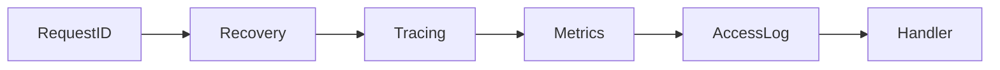

# learn-go-logging-observability-profiling-troubleshooting-part-029.md

# Part 029 — Building an Internal Observability Toolkit in Go

> Seri: `learn-go-logging-observability-profiling-troubleshooting`  
> Bagian: `029 / 032`  
> Fokus: internal observability toolkit, reusable Go packages, logging/metrics/tracing/profiling integration, middleware, governance, standardization  
> Target pembaca: Java software engineer / tech lead yang ingin membuat observability konsisten dan production-grade lintas Go services

---

## 0. Posisi Bagian Ini dalam Seri

Bagian sebelumnya membahas:

- logging philosophy,
- `log/slog`,
- metrics,
- Prometheus,
- runtime metrics,
- OpenTelemetry,
- tracing,
- middleware,
- profiling,
- troubleshooting,
- Kubernetes observability,
- SLO/alert/dashboard,
- cost/cardinality/governance.

Sekarang kita naik ke level engineering enablement:

```text
Bagaimana membangun toolkit internal agar semua service punya observability yang konsisten?
```

Karena dalam organisasi nyata, masalahnya bukan hanya satu service.

Masalah umum:

- setiap service punya schema log berbeda,
- metric label tidak konsisten,
- satu service pakai raw path, service lain route template,
- dependency metric tidak seragam,
- trace propagation hilang di service tertentu,
- pprof endpoint tidak standar,
- redaction berbeda-beda,
- error classification tidak konsisten,
- dashboard dan alert sulit reusable,
- onboarding engineer lambat,
- incident lintas service sulit karena telemetry tidak seragam.

Internal observability toolkit menyelesaikan masalah ini.

---

## 1. Core Thesis

**Observability toolkit yang baik bukan "library wrapper besar". Ia adalah standard operational contract yang diwujudkan dalam package kecil, opinionated, testable, dan sulit disalahgunakan.**

Tujuan toolkit:

```text
make the right thing easy
make the dangerous thing hard
make telemetry consistent
make incident response faster
make governance enforceable
```

Toolkit buruk:

- terlalu abstrak,
- menyembunyikan konsep penting,
- sulit di-debug,
- memaksa semua service sama persis,
- punya global state berlebihan,
- dependency berat,
- membuat local development sulit,
- tidak punya escape hatch,
- tidak punya test,
- tidak punya dokumentasi operasional.

Toolkit baik:

- modular,
- minimal,
- explicit,
- typed,
- context-aware,
- cardinality-safe,
- redaction-by-default,
- observable itself,
- compatible dengan standard ecosystem,
- mudah diadopsi bertahap.

---

## 2. Toolkit Scope

Internal toolkit bisa mencakup:

1. logger construction,
2. log field schema,
3. redaction helpers,
4. error classification,
5. HTTP server middleware,
6. HTTP client instrumentation,
7. Prometheus registry helpers,
8. standard metric names/labels,
9. OpenTelemetry setup,
10. trace propagation,
11. dependency client wrappers,
12. runtime metrics collector setup,
13. pprof/debug server,
14. health/readiness utilities,
15. build info endpoint,
16. Kubernetes metadata injection,
17. panic recovery,
18. graceful shutdown helpers,
19. benchmark/profile artifact helpers,
20. testing utilities for logs/metrics/traces.

Do not build everything at once.

Start with the highest leverage inconsistencies.

---

## 3. Non-Goals

A good toolkit also defines non-goals.

Examples:

```text
This toolkit does not replace Prometheus/OpenTelemetry.
This toolkit does not hide context.Context.
This toolkit does not decide business error semantics.
This toolkit does not create high-cardinality metrics.
This toolkit does not expose pprof publicly.
This toolkit does not log request/response bodies by default.
This toolkit does not implement a custom tracing backend.
```

Non-goals prevent toolkit from becoming a framework monster.

---

## 4. Package Layout

Possible module layout:

```text
observability/
  obslog/
    logger.go
    redaction.go
    attrs.go
  obsmetrics/
    registry.go
    http.go
    runtime.go
    labels.go
  obstrace/
    provider.go
    http.go
    attrs.go
  obshttp/
    middleware.go
    response_writer.go
    client.go
  obsdebug/
    pprof.go
    buildinfo.go
  obserror/
    classify.go
  obshealth/
    livez.go
    readyz.go
  obstest/
    logs.go
    metrics.go
    traces.go
```

Avoid a single package named `observability` containing everything.

Small packages make dependencies clearer.

---

## 5. API Design Principles

### 5.1 Explicit Config

Bad:

```go
observability.Init()
```

Better:

```go
obs, err := observability.New(observability.Config{
	ServiceName:    "orders-api",
	ServiceVersion: version,
	Environment:   "prod",
	LogLevel:       slog.LevelInfo,
	Metrics: observability.MetricsConfig{
		Namespace: "orders",
	},
	Tracing: observability.TracingConfig{
		Enabled: true,
		Endpoint: otlpEndpoint,
	},
})
```

### 5.2 Avoid Hidden Global State

Globals are convenient but dangerous.

Use explicit dependencies:

```go
type Server struct {
	logger *slog.Logger
	meter  *obsmetrics.HTTPMetrics
	tracer trace.Tracer
}
```

A small process-level singleton may be acceptable for setup, but keep injection possible.

### 5.3 Stable Schema

Fields and labels are contracts.

Changing them breaks dashboards and alerts.

### 5.4 Context-Aware

All request-scoped operations should accept context.

### 5.5 Escape Hatch

Allow advanced services to customize:

- extra log attrs,
- custom histogram buckets,
- custom dependency operation name,
- sampler config,
- debug port.

---

## 6. Logger Toolkit

Goals:

- JSON logs by default,
- consistent fields,
- redaction by default,
- source optional,
- level config,
- service metadata,
- trace correlation,
- safe attrs.

Example constructor:

```go
package obslog

type Config struct {
	ServiceName    string
	ServiceVersion string
	Environment   string
	Level         slog.Leveler
	Output        io.Writer
	AddSource     bool
}

func New(cfg Config) *slog.Logger {
	if cfg.Output == nil {
		cfg.Output = os.Stdout
	}

	handler := slog.NewJSONHandler(cfg.Output, &slog.HandlerOptions{
		Level:       cfg.Level,
		AddSource:   cfg.AddSource,
		ReplaceAttr: RedactAttr,
	})

	return slog.New(handler).With(
		"service", cfg.ServiceName,
		"version", cfg.ServiceVersion,
		"environment", cfg.Environment,
	)
}
```

---

## 7. Redaction Toolkit

Central redaction:

```go
func RedactAttr(groups []string, a slog.Attr) slog.Attr {
	key := strings.ToLower(a.Key)

	switch key {
	case "authorization", "cookie", "set-cookie", "password", "token", "secret", "api_key":
		return slog.String(a.Key, "[REDACTED]")
	default:
		return a
	}
}
```

Sensitive types:

```go
type Secret string

func (s Secret) LogValue() slog.Value {
	return slog.StringValue("[REDACTED]")
}
```

Safer API:

```go
logger.Info("dependency configured",
	"dependency", "payment_provider",
	"api_key", obslog.Secret(apiKey),
)
```

But best is not logging secret at all.

---

## 8. Standard Log Events

Define event names:

```text
http_request_completed
http_request_failed
dependency_call_failed
dependency_retry
queue_submit_failed
worker_job_failed
panic_recovered
startup_started
startup_completed
shutdown_started
shutdown_completed
readiness_changed
```

Consistent event names make querying easier.

Bad:

```text
"failed"
"oops"
"error occurred"
"dependency issue"
```

Good:

```text
event=dependency_call_failed
dependency=payment_provider
operation=charge
error_class=dependency_timeout
duration_ms=701
```

---

## 9. Error Classification Toolkit

Central classifier avoids metric/log chaos.

```go
package obserror

const (
	ClassInternal            = "internal"
	ClassValidationFailed    = "validation_failed"
	ClassContextCancelled    = "context_cancelled"
	ClassContextDeadline     = "context_deadline"
	ClassDependencyTimeout   = "dependency_timeout"
	ClassDependency5xx       = "dependency_5xx"
	ClassDependencyRateLimit = "dependency_rate_limited"
	ClassQueueFull           = "queue_full"
	ClassPanicRecovered      = "panic_recovered"
)

func Classify(err error) string {
	switch {
	case err == nil:
		return ""
	case errors.Is(err, context.Canceled):
		return ClassContextCancelled
	case errors.Is(err, context.DeadlineExceeded):
		return ClassContextDeadline
	default:
		return ClassInternal
	}
}
```

Allow service-specific extension:

```go
type Classifier interface {
	Classify(error) string
}
```

---

## 10. Metrics Toolkit

Goals:

- standard names,
- safe labels,
- route template usage,
- dependency metrics,
- runtime metrics,
- registry control,
- no default global registry surprise unless intentionally chosen.

Example labels:

```go
const (
	LabelRoute      = "route"
	LabelMethod     = "method"
	LabelStatus     = "status_class"
	LabelDependency = "dependency"
	LabelOperation  = "operation"
	LabelErrorClass = "error_class"
)
```

HTTP metrics:

```text
http_server_requests_total{route,method,status_class}
http_server_request_duration_seconds_bucket{route,method,status_class}
http_server_inflight_requests{route,method}
```

Dependency metrics:

```text
dependency_requests_total{dependency,operation,status_class,error_class}
dependency_request_duration_seconds_bucket{dependency,operation,status_class}
dependency_retries_total{dependency,operation,error_class}
```

Queue metrics:

```text
queue_depth{queue}
queue_submit_wait_duration_seconds_bucket{queue}
queue_jobs_total{queue,status}
queue_oldest_age_seconds{queue}
```

---

## 11. Histogram Bucket Defaults

Toolkit can provide sane defaults.

HTTP latency buckets:

```go
var HTTPDurationBuckets = []float64{
	0.005, 0.01, 0.025, 0.05,
	0.1, 0.25, 0.5, 1,
	2.5, 5, 10,
}
```

Dependency buckets may differ:

```go
var DependencyDurationBuckets = []float64{
	0.01, 0.025, 0.05, 0.1,
	0.25, 0.5, 1, 2.5, 5,
}
```

Do not blindly use one bucket set for all.

Allow override.

---

## 12. HTTP Server Middleware

Toolkit middleware should do:

1. route template extraction,
2. request duration metric,
3. request count metric,
4. in-flight metric,
5. panic recovery,
6. request ID/correlation,
7. access log,
8. trace span integration,
9. response status capture,
10. body size if safe/available.

Middleware order matters.

Concept:



Exact order depends on semantics, but recovery should capture panics and metrics/logs should record final status.

---

## 13. ResponseWriter Wrapper

Need to capture status and bytes.

```go
type ResponseRecorder struct {
	http.ResponseWriter
	status int
	bytes  int64
}

func (r *ResponseRecorder) WriteHeader(code int) {
	if r.status == 0 {
		r.status = code
		r.ResponseWriter.WriteHeader(code)
	}
}

func (r *ResponseRecorder) Write(p []byte) (int, error) {
	if r.status == 0 {
		r.WriteHeader(http.StatusOK)
	}
	n, err := r.ResponseWriter.Write(p)
	r.bytes += int64(n)
	return n, err
}

func (r *ResponseRecorder) Status() int {
	if r.status == 0 {
		return http.StatusOK
	}
	return r.status
}
```

Production wrapper must preserve optional interfaces if needed:

- `http.Flusher`,
- `http.Hijacker`,
- `http.Pusher`,
- `io.ReaderFrom`.

Be careful; response writer wrapping can break streaming/websocket if done poorly.

---

## 14. Route Template Extraction

Toolkit should not use raw path.

Approaches:

1. integration with router,
2. middleware sets route in context,
3. handler registration wrapper,
4. fallback `"unknown"`.

Example:

```go
type routeKey struct{}

func WithRoute(ctx context.Context, route string) context.Context {
	return context.WithValue(ctx, routeKey{}, route)
}

func RouteFromContext(ctx context.Context) string {
	v, _ := ctx.Value(routeKey{}).(string)
	if v == "" {
		return "unknown"
	}
	return v
}
```

Avoid overusing context for arbitrary values, but route template for instrumentation is acceptable when controlled.

---

## 15. Panic Recovery Middleware

```go
func Recovery(logger *slog.Logger, classifier obserror.Classifier) func(http.Handler) http.Handler {
	return func(next http.Handler) http.Handler {
		return http.HandlerFunc(func(w http.ResponseWriter, r *http.Request) {
			defer func() {
				if rec := recover(); rec != nil {
					logger.ErrorContext(r.Context(), "panic recovered",
						"event", "panic_recovered",
						"panic", fmt.Sprint(rec),
						"route", RouteFromContext(r.Context()),
					)
					http.Error(w, "internal server error", http.StatusInternalServerError)
				}
			}()
			next.ServeHTTP(w, r)
		})
	}
}
```

Do not dump secrets/request body in panic logs.

Consider stack traces carefully.

---

## 16. HTTP Client Toolkit

Dependency client instrumentation should standardize:

- dependency name,
- operation,
- duration,
- status class,
- error class,
- retries,
- timeout classification,
- trace propagation,
- request/response size buckets if feasible,
- body close discipline.

Design:

```go
type DependencyRoundTripper struct {
	base       http.RoundTripper
	dependency string
	metrics    *DependencyMetrics
	logger     *slog.Logger
}
```

Implement `RoundTrip`.

But be careful:

- `RoundTrip` should not consume body unexpectedly,
- response body read duration is not fully captured unless wrapping body,
- retry happens outside RoundTripper usually,
- context cancellation must propagate.

---

## 17. Dependency Operation Naming

Avoid raw URL as operation.

Bad:

```text
operation="GET https://api.example.com/users/123/orders?x=y"
```

Good:

```text
dependency="payment_provider"
operation="charge"
method="POST"
```

For internal HTTP dependency:

```text
operation="POST /payments/{id}/capture"
```

Use route template.

---

## 18. Tracing Toolkit

OpenTelemetry setup:

- resource attributes,
- tracer provider,
- exporter,
- sampler,
- propagators,
- batch processor,
- span limits,
- shutdown.

Example config concept:

```go
type TracingConfig struct {
	Enabled     bool
	ServiceName string
	Version     string
	Environment string
	OTLPEndpoint string
	SampleRatio  float64
}
```

Resource attributes:

```text
service.name
service.version
deployment.environment
```

In Kubernetes, include k8s resource attributes via collector when possible.

---

## 19. Context Propagation Toolkit

HTTP server should extract trace context.

HTTP client should inject trace context.

Use standard OTel propagation.

Do not invent custom trace headers unless required.

Also propagate:

- request ID if organization uses it,
- correlation ID carefully,
- baggage only for low-cardinality, non-sensitive metadata.

Baggage is dangerous if abused.

---

## 20. Runtime Metrics Toolkit

Expose Go runtime metrics consistently.

Options:

- Prometheus Go collector,
- runtime/metrics custom collector,
- OTel runtime instrumentation.

Toolkit should standardize:

- enabled by default,
- metric naming,
- dashboard compatibility,
- no duplicate collectors,
- process metrics.

Avoid registering collectors multiple times.

---

## 21. pprof Debug Server Toolkit

Provide safe debug server pattern.

```go
func StartDebugServer(ctx context.Context, addr string, logger *slog.Logger) error {
	mux := http.NewServeMux()
	mux.HandleFunc("/debug/pprof/", pprof.Index)
	mux.HandleFunc("/debug/pprof/cmdline", pprof.Cmdline)
	mux.HandleFunc("/debug/pprof/profile", pprof.Profile)
	mux.HandleFunc("/debug/pprof/symbol", pprof.Symbol)
	mux.HandleFunc("/debug/pprof/trace", pprof.Trace)

	srv := &http.Server{
		Addr:              addr,
		Handler:           mux,
		ReadHeaderTimeout: 5 * time.Second,
	}

	go func() {
		<-ctx.Done()
		shutdownCtx, cancel := context.WithTimeout(context.Background(), 5*time.Second)
		defer cancel()
		_ = srv.Shutdown(shutdownCtx)
	}()

	logger.Info("debug server starting", "addr", addr)
	return srv.ListenAndServe()
}
```

Operational policy:

- bind to localhost or private interface,
- not public ingress,
- port-forward only,
- NetworkPolicy/RBAC,
- documented runbook.

---

## 22. Build Info Endpoint

Expose safe build info:

```json
{
  "service": "orders-api",
  "version": "2026.06.23.1",
  "commit": "a1b2c3d",
  "go_version": "go1.26.0",
  "build_time": "2026-06-23T10:00:00Z"
}
```

Use for:

- profile artifact matching,
- canary comparison,
- incident timeline,
- rollback decision.

Do not expose secrets/config values.

---

## 23. Health Toolkit

Provide separate handlers:

```text
/livez
/readyz
/startupz
```

Readiness object:

```go
type Readiness struct {
	ready atomic.Bool
	reason atomic.Value
}
```

Expose reason carefully:

- useful internally,
- avoid sensitive dependency info publicly.

Health checks should be cheap.

Toolkit can provide standard behavior but service decides readiness semantics.

---

## 24. Graceful Shutdown Toolkit

Common pattern:

- signal handling,
- readiness false,
- drain delay,
- HTTP shutdown,
- worker stop,
- telemetry flush,
- timeout.

Toolkit can coordinate hooks:

```go
type ShutdownManager struct {
	hooks []Hook
}

type Hook struct {
	Name string
	Stop func(context.Context) error
}
```

Log each hook duration.

Metrics:

```text
shutdown_hook_duration_seconds{name}
shutdown_errors_total{name}
```

This helps diagnose stuck shutdown.

---

## 25. Testing Toolkit

### 25.1 Log Testing

Capture logs and assert:

- event name,
- error class,
- no secrets,
- route template,
- trace ID if expected.

### 25.2 Metrics Testing

Assert metric labels:

- no raw path,
- expected route template,
- status class,
- histogram emitted.

### 25.3 Trace Testing

Harder, but can use in-memory exporter.

Assert:

- span name,
- status,
- attributes,
- error event.

### 25.4 Middleware Test

Test panic recovery, status recording, request duration, route labels.

---

## 26. Adoption Strategy

Do not require all services to migrate at once.

Phases:

### Phase 1

- logger schema,
- redaction,
- HTTP middleware,
- Prometheus metrics,
- pprof private server.

### Phase 2

- OTel tracing,
- dependency instrumentation,
- runtime dashboards,
- SLO metrics.

### Phase 3

- alert/dashboard templates,
- governance checks,
- test helpers,
- benchmark/profile workflow.

### Phase 4

- organization-wide standards,
- CI lint,
- cost dashboards,
- service scorecards.

---

## 27. Backward Compatibility

Internal toolkit is a dependency.

Breaking changes can affect many services.

Practices:

- semantic versioning,
- changelog,
- migration guide,
- deprecation period,
- dual metric emission for migration,
- feature flags/config toggles,
- compatibility tests.

Telemetry schema breaking change can be worse than code API breaking change because it breaks dashboards/alerts.

---

## 28. Configuration

Configuration sources:

- environment variables,
- config file,
- flags,
- Kubernetes env/configmap,
- service defaults.

Example env:

```text
SERVICE_NAME
SERVICE_VERSION
ENVIRONMENT
LOG_LEVEL
METRICS_ADDR
DEBUG_ADDR
OTEL_EXPORTER_OTLP_ENDPOINT
OTEL_TRACES_SAMPLER_ARG
GOMEMLIMIT
GOGC
```

Toolkit should validate config and log startup summary without secrets.

---

## 29. Startup Log

Standard startup log:

```text
event=startup_completed
service=orders-api
version=2026.06.23.1
environment=prod
go_version=go1.26.0
gomaxprocs=4
gogc=100
gomemlimit=768MiB
metrics_addr=:9090
debug_addr=127.0.0.1:6060
tracing_enabled=true
```

Do not log secret endpoints with credentials.

Startup log is useful during incident.

---

## 30. Observability Self-Metrics

Toolkit should expose its own health:

```text
otel_exporter_queue_size
otel_exporter_dropped_spans_total
log_dropped_total
metrics_registry_errors_total
debug_profile_requests_total
dependency_instrumentation_errors_total
```

If observability pipeline fails, service should remain healthy where possible.

Telemetry failure should not usually take down business path.

---

## 31. Governance Built into Toolkit

Make unsafe patterns hard.

Examples:

- no raw path helper,
- route labels require template,
- sensitive types redact,
- metric label constructors validate values,
- error classifier returns bounded classes,
- dependency names from config enum/allowlist,
- histogram bucket defaults reviewed,
- pprof server separate/private.

Possible runtime guard:

```go
func ValidateLabelValue(label, value string) error {
	if label == "route" && strings.Contains(value, "?") {
		return errors.New("route label must be template, not raw URL")
	}
	return nil
}
```

Do not make runtime validation too expensive in hot path; use tests/static checks too.

---

## 32. Example: Minimal Service Wiring

```go
func main() {
	cfg := LoadConfig()

	logger := obslog.New(obslog.Config{
		ServiceName:    cfg.ServiceName,
		ServiceVersion: cfg.Version,
		Environment:   cfg.Environment,
		Level:         cfg.LogLevel,
	})

	reg := prometheus.NewRegistry()
	httpMetrics := obsmetrics.NewHTTPMetrics(reg, obsmetrics.HTTPConfig{
		DurationBuckets: obsmetrics.DefaultHTTPDurationBuckets,
	})

	tracingShutdown, err := obstrace.Configure(context.Background(), obstrace.Config{
		Enabled:      cfg.TracingEnabled,
		ServiceName:  cfg.ServiceName,
		Version:      cfg.Version,
		Environment: cfg.Environment,
		Endpoint:     cfg.OTLPEndpoint,
	})
	if err != nil {
		logger.Error("tracing setup failed", "error", err)
		os.Exit(1)
	}
	defer tracingShutdown(context.Background())

	mux := http.NewServeMux()
	mux.Handle("/orders", obshttp.WithRoute("/orders", ordersHandler))

	handler := obshttp.Chain(
		obshttp.RequestID(),
		obshttp.Recovery(logger),
		obshttp.Metrics(httpMetrics),
		obshttp.AccessLog(logger),
	)(mux)

	server := &http.Server{
		Addr:              ":8080",
		Handler:           handler,
		ReadHeaderTimeout: 5 * time.Second,
	}

	// start metrics/debug servers, graceful shutdown...
	_ = server.ListenAndServe()
}
```

This is conceptual; exact implementation depends on router and OTel setup.

---

## 33. Example: Dependency Client Wrapper

```go
type PaymentClient struct {
	baseURL string
	client  *http.Client
	logger  *slog.Logger
	metrics *obsmetrics.DependencyMetrics
}

func (c *PaymentClient) Charge(ctx context.Context, req ChargeRequest) (ChargeResponse, error) {
	const operation = "charge"

	start := time.Now()
	statusClass := "none"
	errClass := ""

	httpReq, err := buildChargeRequest(ctx, c.baseURL, req)
	if err != nil {
		return ChargeResponse{}, err
	}

	resp, err := c.client.Do(httpReq)
	if err != nil {
		errClass = obserror.Classify(err)
		c.metrics.Observe("payment_provider", operation, statusClass, errClass, time.Since(start))
		c.logger.WarnContext(ctx, "dependency call failed",
			"event", "dependency_call_failed",
			"dependency", "payment_provider",
			"operation", operation,
			"error_class", errClass,
			"duration_ms", time.Since(start).Milliseconds(),
		)
		return ChargeResponse{}, err
	}
	defer resp.Body.Close()

	statusClass = obshttp.StatusClass(resp.StatusCode)
	// parse limited body, classify domain errors...

	c.metrics.Observe("payment_provider", operation, statusClass, errClass, time.Since(start))
	return parseChargeResponse(resp.Body)
}
```

Production version should include retries, idempotency, body limits, and trace spans.

---

## 34. Case Study 1: Raw Path Metric Prevented by Toolkit

Before toolkit:

```go
requests.WithLabelValues(r.URL.Path).Inc()
```

Incident:

- millions of time series.

Toolkit fix:

- middleware only accepts route template,
- unknown route grouped,
- tests fail if raw path includes numeric ID,
- dashboard uses route template.

Outcome:

- cardinality stable,
- dashboards reusable.

---

## 35. Case Study 2: Inconsistent Error Logs

Before:

```text
"db failed"
"database error"
"repository failed"
"timeout"
```

After toolkit:

```text
event=dependency_call_failed
dependency=postgres
operation=order_select
error_class=db_timeout
duration_ms=401
trace_id=...
```

Outcome:

- error dashboard works,
- alert grouping improved,
- incident search faster.

---

## 36. Case Study 3: pprof Standardization

Before:

- some services no pprof,
- some exposed publicly,
- some same port as public API,
- no runbook.

After toolkit:

- debug server separate,
- private only,
- port-forward runbook,
- artifact naming standard,
- profile capture safe.

Outcome:

- high CPU incident diagnosed in minutes,
- security risk reduced.

---

## 37. Case Study 4: Observability Tax Controlled

Before:

- every service created spans differently,
- some span per item,
- trace backend overloaded.

Toolkit:

- span naming guidelines,
- sampler config,
- span limits,
- helper for batch stage region,
- metrics for item count instead of per-item span.

Outcome:

- trace volume reduced,
- critical traces retained.

---

## 38. Toolkit Review Checklist

```text
[ ] Does API hide too much?
[ ] Are defaults safe?
[ ] Are labels cardinality-safe?
[ ] Is redaction default?
[ ] Does it use standards?
[ ] Is context propagated?
[ ] Are logs/metrics/traces schema documented?
[ ] Does it support testing?
[ ] Does it avoid global state where possible?
[ ] Does it support graceful shutdown?
[ ] Does it expose debug safely?
[ ] Does it have migration guide?
```

---

## 39. Service Adoption Checklist

```text
[ ] service.name/version/environment configured
[ ] structured logger initialized
[ ] redaction enabled
[ ] HTTP middleware installed
[ ] route templates emitted
[ ] Prometheus metrics exposed
[ ] Go runtime metrics exposed
[ ] OTel tracing configured
[ ] dependency clients instrumented
[ ] pprof/debug server private
[ ] build info endpoint exposed
[ ] health probes separated
[ ] graceful shutdown implemented
[ ] dashboards linked
[ ] SLO alerts configured
[ ] tests verify labels/redaction
```

---

## 40. Exercises

### Exercise 1 — Design Toolkit API

Design package APIs for:

- logger,
- HTTP middleware,
- dependency metrics,
- pprof server.

Write intended usage from `main.go`.

### Exercise 2 — Implement Route-Safe Middleware

Build HTTP middleware that records route template, not raw path.

Test with:

```text
/orders/1
/orders/2
/orders/3
```

Expected metric label:

```text
/orders/{id}
```

### Exercise 3 — Redaction Test

Implement `obslog.Secret` and `ReplaceAttr`.

Verify token/password never appear in captured logs.

### Exercise 4 — Dependency Client Metrics

Wrap an HTTP client dependency call.

Emit:

- request total,
- duration,
- error class,
- retry count.

Ensure operation label is bounded.

### Exercise 5 — Toolkit Adoption Plan

For organization with 20 Go services, write phased migration plan and backward compatibility strategy.

---

## 41. What Good Looks Like

Anda memahami internal observability toolkit secara production-grade jika mampu:

1. membedakan standardization dan over-abstraction,
2. membuat logging schema konsisten,
3. menjaga metric labels aman,
4. mengintegrasikan OTel tanpa menyembunyikan konsep,
5. menyediakan pprof/debug yang aman,
6. membuat middleware yang tidak merusak streaming,
7. menyediakan test helpers,
8. membuat adoption plan bertahap,
9. menjaga backward compatibility telemetry schema,
10. menjadikan observability konsisten lintas service.

---

## 42. Summary

Internal observability toolkit adalah leverage besar.

Ia mengubah observability dari:

```text
setiap service improvisasi sendiri
```

menjadi:

```text
operational contract yang konsisten
```

Toolkit yang baik:

- kecil,
- modular,
- explicit,
- aman,
- cardinality-aware,
- redaction-by-default,
- compatible dengan ecosystem,
- mudah dites,
- mudah diadopsi,
- mendukung incident response.

Tujuannya bukan membuat framework baru.

Tujuannya membuat service Go lebih mudah dioperasikan, didiagnosis, dan dijaga reliability-nya.

---

## 43. Status Seri

Bagian ini adalah:

```text
learn-go-logging-observability-profiling-troubleshooting-part-029.md
```

Status:

```text
Part 029 dari 032
Seri belum selesai
```

Bagian berikutnya:

```text
learn-go-logging-observability-profiling-troubleshooting-part-030.md
```

Topik berikutnya:

```text
Incident Case Studies: Go Production Failures
```

<!-- NAVIGATION_FOOTER -->
<div class="page-nav">
<a href="./learn-go-logging-observability-profiling-troubleshooting-part-028.md">⬅️ Part 028 — Observability Cost, Cardinality, and Data Governance</a>
<a href="./index.md">📚 Kategori</a>
<a href="../../index.md">🏠 Home</a>
<a href="./learn-go-logging-observability-profiling-troubleshooting-part-030.md">Part 030 — Incident Case Studies: Go Production Failures ➡️</a>
</div>
