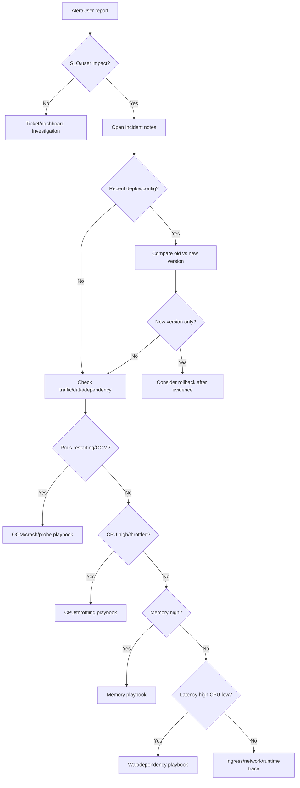

# learn-go-logging-observability-profiling-troubleshooting-part-031.md

# Part 031 — Production Runbooks and Troubleshooting Playbooks

> Seri: `learn-go-logging-observability-profiling-troubleshooting`  
> Bagian: `031 / 032`  
> Fokus: production runbooks, troubleshooting playbooks, incident command, evidence capture, mitigation decision, escalation, post-incident follow-up  
> Target pembaca: Java software engineer / tech lead yang ingin mengoperasikan Go services dengan runbook yang actionable dan repeatable

---

## 0. Posisi Bagian Ini dalam Seri

Part 030 sudah membahas banyak case study production.

Bagian ini membuatnya menjadi bentuk yang bisa dipakai saat incident:

```text
runbook
playbook
checklist
decision tree
incident note template
evidence capture protocol
```

Perbedaan utama:

- **konsep** membantu memahami,
- **tools** membantu mengobservasi,
- **runbook** membantu bertindak saat tekanan tinggi.

Saat incident, otak manusia mudah:

- panik,
- tunnel vision,
- salah memilih dashboard,
- langsung restart,
- lupa capture evidence,
- lupa komunikasi,
- lupa verify recovery,
- menganggap mitigation sebagai root cause.

Runbook mengurangi cognitive load.

---

## 1. Core Thesis

**Runbook yang baik bukan dokumen panjang yang dibaca saat incident. Runbook yang baik adalah operational path singkat, jelas, dan executable yang membantu on-call mengambil keputusan aman.**

Runbook buruk:

```text
If service is down, check logs.
If still down, contact team.
```

Runbook baik:

```text
1. Confirm SLO impact.
2. Identify affected route/version/pod/zone.
3. Check CPU/throttling/memory/restarts.
4. If CPU high, capture 30s CPU profile before restart.
5. If memory near limit, capture heap?gc=1 and goroutine?debug=2.
6. If latency high CPU low, check DB pool wait and goroutine dump.
7. Choose mitigation: rollback / load shed / circuit / scale / restart.
8. Verify p95/p99/error budget recovery.
9. Attach evidence to incident notes.
```

---

## 2. Runbook vs Playbook

### 2.1 Runbook

A runbook is usually specific and procedural.

Example:

```text
Runbook: Capture CPU profile from orders-api pod in Kubernetes
```

### 2.2 Playbook

A playbook is broader and decision-oriented.

Example:

```text
Playbook: p99 latency spike in Go HTTP service
```

A mature operation needs both.

---

## 3. Runbook Design Principles

### 3.1 Action-Oriented

Every step should be executable.

Bad:

```text
Investigate memory.
```

Good:

```text
Check container memory vs limit and Go heap live. If pod alive and memory > 90%, capture heap?gc=1 and goroutine?debug=2.
```

### 3.2 Evidence-Preserving

Warn before destructive action:

```text
Before restart, capture heap/goroutine if safe.
```

### 3.3 Time-Boxed

Separate:

- first 5 minutes,
- first 15 minutes,
- first hour.

### 3.4 Decision-Based

Use branches:

```text
If CPU high -> CPU profile.
If CPU low and goroutines high -> goroutine/block profile.
```

### 3.5 Owned and Maintained

Every runbook needs:

- owner,
- last reviewed date,
- applicable services,
- escalation path.

### 3.6 Copy-Paste Safe

Commands should include placeholders clearly:

```bash
kubectl -n <namespace> port-forward pod/<pod> 6060:6060
```

### 3.7 Safe by Default

Avoid:

- public pprof,
- deleting data,
- scaling shared dependencies blindly,
- increasing DB pool without capacity check,
- restart as first action.

---

## 4. Incident Roles

For serious incidents, define roles.

| Role | Responsibility |
|---|---|
| Incident Commander | coordinates, prioritizes, keeps timeline |
| Investigator | analyzes evidence, tests hypotheses |
| Operator | executes mitigation/change |
| Communicator | updates stakeholders |
| Scribe | records timeline/evidence/actions |
| Subject Matter Expert | provides domain/dependency expertise |

Small teams may combine roles, but responsibilities still exist.

A TL often naturally becomes incident commander unless delegated.

---

## 5. Incident Severity

Example severity model:

| Severity | Meaning | Response |
|---|---|---|
| SEV1 | major user-facing outage/data loss/security | immediate page, incident command |
| SEV2 | significant degradation or partial outage | page owning team |
| SEV3 | limited impact, workaround exists | urgent ticket/channel |
| SEV4 | minor issue/no user impact | normal backlog |

Severity should account for:

- user impact,
- revenue/business impact,
- data correctness,
- security/privacy,
- duration,
- affected percentage,
- error budget burn,
- escalation sensitivity.

---

## 6. First 5 Minutes Playbook

Goal:

```text
Confirm impact, stabilize thinking, avoid destructive mistakes.
```

Checklist:

```text
[ ] Acknowledge alert.
[ ] Open incident notes.
[ ] Identify service/environment.
[ ] Confirm user impact/SLO burn.
[ ] Determine start time.
[ ] Identify affected route/job/dependency.
[ ] Check recent deploy/config change.
[ ] Check if pods restarting/OOMKilled.
[ ] Check if issue is global or subset.
[ ] Assign roles if serious.
[ ] Communicate initial status.
```

Do not immediately restart unless:

- service is completely down,
- no safer mitigation,
- evidence not needed or already collected,
- impact demands immediate restore.

---

## 7. First 15 Minutes Playbook

Goal:

```text
Find likely failure class and choose mitigation.
```

Checklist:

```text
[ ] Compare affected vs unaffected pods/versions/zones.
[ ] Check traffic/error/latency distribution.
[ ] Check CPU usage and throttling.
[ ] Check memory/RSS/heap/restarts.
[ ] Check goroutine count.
[ ] Check queue depth/wait.
[ ] Check DB pool wait and dependency latency.
[ ] Check ingress/service endpoints if app logs no request.
[ ] Capture relevant profile if safe.
[ ] Build hypothesis table.
[ ] Decide mitigation: rollback, scale, shed, circuit, restart, disable feature.
```

---

## 8. First Hour Playbook

Goal:

```text
Restore service and preserve enough evidence for RCA.
```

Checklist:

```text
[ ] Mitigation executed and recorded.
[ ] Recovery verified using SLO/user impact metrics.
[ ] Evidence artifacts saved.
[ ] Timeline updated.
[ ] Stakeholders updated.
[ ] Remaining risk assessed.
[ ] Follow-up owner assigned.
[ ] Temporary mitigations documented.
[ ] Post-incident review scheduled if needed.
```

---

## 9. Incident Notes Template

```markdown
# Incident: <title>

## Metadata

- Severity:
- Service:
- Environment:
- Start time:
- Detection:
- Incident commander:
- Scribe:
- Slack/War room:
- Customer/user impact:

## Current Status

- Ongoing / Mitigated / Resolved:
- Last update:
- Next update:

## Impact

- Affected endpoints/jobs:
- Affected users/tenants:
- Error rate:
- Latency:
- Data correctness:
- SLO/error budget impact:

## Timeline

- HH:MM Alert fired
- HH:MM First acknowledgement
- HH:MM Evidence captured
- HH:MM Mitigation started
- HH:MM Recovery confirmed

## Hypotheses

| Hypothesis | Evidence For | Evidence Against | Next Check | Status |
|---|---|---|---|---|

## Evidence

- Dashboards:
- Logs:
- Traces:
- Profiles:
- Kubernetes events:
- Deployment/config changes:

## Actions Taken

| Time | Action | Owner | Result |
|---|---|---|---|

## Root Cause Draft

## Follow-Up Items

| Item | Owner | Due | Verification |
|---|---|---|---|
```

---

## 10. Evidence Artifact Naming

Use consistent names.

```text
<timestamp>_<env>_<service>_<pod>_<version>_<artifact>.<ext>
```

Examples:

```text
20260623T101500Z_prod_orders-api_pod-7d9f_v2_cpu-30s.pb.gz
20260623T101700Z_prod_orders-api_pod-7d9f_v2_heap-after-gc.pb.gz
20260623T101800Z_prod_orders-api_pod-7d9f_v2_goroutine-debug2.txt
20260623T101900Z_prod_orders-api_pod-7d9f_v2_trace-10s.out
```

Why:

- profile must match binary/source/version,
- incident review easier,
- artifacts searchable,
- avoids overwriting.

---

## 11. Universal Go Service Triage Playbook



---

## 12. Playbook: High CPU

### Trigger

- CPU high,
- latency/throughput impact,
- CPU throttling,
- CPU per request regression.

### First Checks

```text
[ ] Is CPU high on all pods or subset?
[ ] Is CPU throttling high?
[ ] Did traffic increase?
[ ] Did route mix change?
[ ] Did deployment happen?
[ ] Is GC CPU high?
[ ] Is allocation rate high?
```

### Evidence

```bash
curl -o cpu-30s.pb.gz "http://localhost:6060/debug/pprof/profile?seconds=30"
```

Also capture:

```text
version
route latency/error
CPU throttling
allocation rate
GC CPU
request/response size
```

### Diagnosis Branches

| Evidence | Likely Cause |
|---|---|
| app function dominates CPU | hot path/regression |
| `encoding/json`, reflection | serialization/data shape |
| `runtime.mallocgc` high | allocation churn |
| crypto/compress | expensive CPU feature |
| GC frames high | allocation/live heap pressure |
| throttling high | CPU limit issue |
| v2 only | release regression |

### Mitigation

- rollback,
- scale out if local CPU bottleneck,
- reduce feature,
- disable expensive path,
- raise CPU limit if throttled,
- reduce traffic/concurrency,
- cache/precompute.

### Avoid

- blaming Go runtime without profile,
- increasing DB pool,
- restarting repeatedly.

---

## 13. Playbook: Memory High / OOM Risk

### Trigger

- container memory > 90% limit,
- OOMKilled,
- heap live rising,
- GC CPU high,
- pod restarts.

### First Checks

```text
[ ] Container memory vs limit?
[ ] Heap live vs container memory?
[ ] Allocation rate?
[ ] Goroutine count/stack memory?
[ ] Cache/queue size?
[ ] Native/cgo/mmap?
[ ] Recent deploy/data/batch?
```

### Evidence if Pod Alive

```bash
curl -o heap-before.pb.gz "http://localhost:6060/debug/pprof/heap"
curl -o heap-after-gc.pb.gz "http://localhost:6060/debug/pprof/heap?gc=1"
curl -o allocs.pb.gz "http://localhost:6060/debug/pprof/allocs"
curl -o goroutine-debug2.txt "http://localhost:6060/debug/pprof/goroutine?debug=2"
```

### Evidence if Already OOM

```bash
kubectl describe pod <pod> -n <namespace>
kubectl logs <pod> -n <namespace> --previous
kubectl get events -n <namespace> --sort-by=.lastTimestamp
```

### Diagnosis Branches

| Evidence | Likely Cause |
|---|---|
| heap after GC high | retained heap/leak/cache |
| alloc_space high, inuse lower | allocation burst |
| goroutines high | goroutine pileup/leak |
| RSS >> heap | native/mmap/stacks |
| OOM after rollout | regression/config |
| OOM during batch | batch size/concurrency |

### Mitigation

- disable feature/cache,
- reduce batch/concurrency,
- load shed,
- rollback,
- restart after evidence,
- increase memory only if workload legitimate,
- tune `GOMEMLIMIT` after analysis.

---

## 14. Playbook: Latency High, CPU Low

### Trigger

- p99 high,
- CPU normal/low,
- error/timeouts rising,
- throughput may drop.

### First Checks

```text
[ ] Which endpoint/job?
[ ] Is p50 normal and p99 high?
[ ] Goroutine count rising?
[ ] Queue depth/wait high?
[ ] DB pool wait high?
[ ] External dependency latency high?
[ ] Lock/mutex contention?
[ ] Recent dependency issue?
```

### Evidence

```bash
curl -o goroutine-debug2.txt "http://localhost:6060/debug/pprof/goroutine?debug=2"
curl -o block.pb.gz "http://localhost:6060/debug/pprof/block"
curl -o mutex.pb.gz "http://localhost:6060/debug/pprof/mutex"
```

Also:

- traces for slow requests,
- DB pool stats,
- queue metrics,
- dependency metrics.

### Diagnosis Branches

| Evidence | Likely Cause |
|---|---|
| goroutines in chan send | queue/backpressure |
| semacquire | mutex/semaphore/pool |
| DB WaitDuration high | DB pool wait |
| dependency spans high | downstream slow |
| retry count high | retry storm |
| block profile channel | wait-bound queue |
| mutex profile hot | lock contention |

### Mitigation

- fail fast,
- circuit breaker,
- reduce concurrency,
- load shed,
- rollback if release caused,
- increase pool only if shared dependency can handle,
- disable optional dependency.

---

## 15. Playbook: Dependency Failure

### Trigger

- dependency errors/timeouts,
- external 429/5xx,
- DB/cache/broker failure,
- trace critical path dependency slow.

### First Checks

```text
[ ] Which dependency/operation?
[ ] Error class/status?
[ ] Timeout phase?
[ ] Retry rate?
[ ] Circuit breaker state?
[ ] App-side pool wait?
[ ] Provider-side incident?
[ ] Quota/rate limit?
```

### Evidence

- dependency metrics,
- logs with `error_class`,
- traces,
- retry counters,
- `httptrace` if phase unknown,
- goroutine profile for pool/semaphore waits.

### Diagnosis Branches

| Evidence | Likely Cause |
|---|---|
| DNS phase slow | DNS/CoreDNS |
| connect timeout | network/policy/provider |
| TLS timeout | cert/handshake/churn |
| response header slow | provider processing |
| body read slow | large response/slow stream |
| retry high | retry storm |
| 429 | rate limit |
| pool wait | app-side pool/limiter |

### Mitigation

- respect retry-after,
- reduce concurrency,
- open circuit,
- fallback/degrade,
- fail fast,
- pause batch,
- contact dependency owner,
- rollback app if app caused load.

---

## 16. Playbook: Pod Restart / CrashLoop

### Trigger

- pod restart count increasing,
- CrashLoopBackOff,
- liveness failures,
- process exits.

### First Checks

```text
[ ] Reason: OOMKilled, Error, probe failure, Evicted?
[ ] Previous logs?
[ ] Kubernetes events?
[ ] Recent deploy/config/secret?
[ ] Startup or runtime crash?
[ ] All pods or one pod?
```

### Commands

```bash
kubectl describe pod <pod> -n <namespace>
kubectl logs <pod> -n <namespace> --previous
kubectl get events -n <namespace> --sort-by=.lastTimestamp
kubectl describe deployment <deployment> -n <namespace>
```

### Diagnosis Branches

| Evidence | Likely Cause |
|---|---|
| OOMKilled | memory |
| liveness failed | probe or deadlock |
| startup error | config/secret/dependency |
| image pull | registry/image |
| one node only | node issue |
| after deploy | release/config |

### Mitigation

- rollback,
- fix config/secret,
- adjust probe,
- restart after evidence,
- increase memory if justified,
- remove bad pod/node if node issue.

---

## 17. Playbook: Kubernetes Routing / Ingress Issue

### Trigger

- users see 502/503/504,
- app logs no request,
- ingress error spike,
- service unavailable.

### First Checks

```text
[ ] Does ingress see request?
[ ] Does app access log see request?
[ ] Service endpoints exist?
[ ] Pods ready?
[ ] Readiness flapping?
[ ] Ingress route/path correct?
[ ] LB target health?
[ ] NetworkPolicy changed?
```

### Commands

```bash
kubectl get ingress -n <namespace>
kubectl describe ingress <ingress> -n <namespace>
kubectl get svc -n <namespace>
kubectl get endpoints -n <namespace>
kubectl get endpointslices -n <namespace>
kubectl get pods -n <namespace> -o wide
```

### Diagnosis

| Evidence | Likely Cause |
|---|---|
| no endpoints | readiness/service selector |
| app logs no request | ingress/service/network |
| app logs 5xx | app issue |
| ingress 504 | app/dependency timeout |
| only one path | route rewrite/config |
| readiness flapping | probe/dependency |

---

## 18. Playbook: Prometheus Cardinality Incident

### Trigger

- Prometheus memory high,
- scrape slow,
- active series spike,
- remote write backlog,
- dashboard query timeout.

### First Checks

```text
[ ] Which metric increased series?
[ ] Which label has high cardinality?
[ ] Which service/deploy introduced it?
[ ] Is raw path/user/request ID involved?
[ ] Can scrape/drop rule mitigate?
```

### Mitigation

- rollback offending release,
- drop metric/label at scrape if possible,
- reduce remote write pressure,
- disable bad endpoint/metric,
- clean up stale series where needed.

### Prevention

- label allowlist,
- PR review,
- cardinality dashboard,
- unit test route template,
- metric lifecycle governance.

---

## 19. Playbook: Log Storm / Telemetry Overload

### Trigger

- log volume spike,
- log pipeline lag,
- app CPU high due to logging,
- telemetry exporter queue high,
- cost alert.

### First Checks

```text
[ ] Which service/version?
[ ] Which log event/level?
[ ] Debug enabled?
[ ] Error storm?
[ ] Payload logging?
[ ] Retry logs duplicated?
[ ] PII/secret risk?
```

### Mitigation

- lower log level,
- disable debug config,
- sample repeated logs,
- remove payload logs,
- rollback,
- restrict access if sensitive leak,
- rotate secrets if leaked.

---

## 20. Mitigation Decision Matrix

| Mitigation | Helps When | Risk |
|---|---|---|
| Rollback | release regression | schema/data incompatibility |
| Scale out | local CPU bottleneck | overload shared dependency |
| Reduce concurrency | dependency saturated | throughput lower |
| Circuit breaker | dependency failing | degraded feature |
| Load shedding | overload | rejected requests |
| Restart | leak/stuck state | evidence loss, recurrence |
| Increase memory | legitimate peak | hides leak/cost |
| Increase CPU | throttling/CPU-bound | cost, node capacity |
| Increase DB pool | app pool too low and DB healthy | DB overload |
| Disable feature | optional expensive path | product impact |
| Pause batch | batch causing contention | delayed processing |

Always record:

```text
why this mitigation
expected effect
actual effect
rollback plan
```

---

## 21. Escalation Playbook

Escalate when:

- user impact severe,
- no clear owner,
- dependency owned by another team,
- security/privacy involved,
- data correctness risk,
- mitigation needs approval,
- incident exceeds expected time,
- SLO budget burn high,
- repeated incident.

Escalation message should include:

```text
service
impact
start time
current evidence
hypotheses
actions taken
ask from escalation target
urgency
```

Bad escalation:

```text
DB is broken, please check.
```

Good escalation:

```text
checkout-api p99 is >4s since 14:04. App DB pool WaitDuration p95 is 800ms, DB query latency appears normal, but InUse=MaxOpen. We found transactions holding connections during fraud API calls. Need DBA to confirm DB has capacity before we temporarily raise MaxOpen from 40 to 60 across 8 pods.
```

---

## 22. Communication Cadence

During incident:

- acknowledge quickly,
- update at fixed cadence,
- communicate facts vs hypotheses,
- avoid overpromising,
- state next action,
- state mitigation result.

Template:

```text
Update HH:MM:
Impact: checkout-api POST /checkout p99 elevated, ~12% requests timing out.
What we know: issue started after v2 rollout; v2 pods show CPU/request 4x v1.
Action: capturing CPU profile and preparing rollback.
Next update: HH:MM or after rollback verification.
```

---

## 23. Recovery Verification

Do not declare resolved because one graph improved.

Verify:

```text
[ ] SLO burn stopped.
[ ] Error rate back to baseline.
[ ] p95/p99 back to baseline.
[ ] Throughput/completion rate normal.
[ ] Queue/backlog draining.
[ ] CPU/memory/goroutine stable.
[ ] Dependency retry rate normal.
[ ] No restart loop.
[ ] No new alert.
[ ] Users/customer reports resolved.
```

Also monitor after mitigation for recurrence.

---

## 24. Post-Incident Review Template

```markdown
# Post-Incident Review

## Summary

## Impact

## Timeline

## Detection

- How detected?
- Was alert timely?
- Was user report first?

## Root Cause

## Trigger

## Contributing Factors

## What Went Well

## What Went Poorly

## Where We Got Lucky

## Evidence

## Action Items

| Action | Type | Owner | Due | Verification |
|---|---|---|---|---|

## Follow-Up SLO/Error Budget Impact

## Runbook Updates
```

---

## 25. Blameless but Accountable

Blameless means:

```text
Do not blame individuals for operating within system conditions.
```

It does not mean:

```text
No accountability.
```

Accountability means:

- improve system,
- fix gaps,
- own action items,
- review decisions,
- improve process,
- document learning.

Bad:

```text
Engineer forgot to close response body.
```

Better:

```text
The code path returned before closing response body. Review checklist and tests did not cover non-2xx response body lifecycle.
```

---

## 26. Action Item Quality

Bad action items:

```text
Be more careful.
Monitor better.
Investigate later.
Improve logging.
```

Good action items:

```text
Add test ensuring response body is closed on all non-2xx paths.
Add dependency_client_response_body_unclosed_total if feasible.
Add HTTP client checklist to PR template.
Update dependency runbook with body leak symptoms.
```

Action item should have:

- owner,
- deadline,
- verification,
- category.

Categories:

- code fix,
- test,
- metric,
- alert,
- dashboard,
- runbook,
- capacity,
- process,
- training,
- architecture.

---

## 27. Runbook Maintenance

Runbooks rot.

Review when:

- after incident,
- after architecture change,
- after dependency change,
- after dashboard/alert change,
- after Kubernetes/platform change,
- quarterly for critical services.

Runbook metadata:

```text
Owner:
Last reviewed:
Applies to:
Prerequisites:
Escalation:
```

If a runbook step failed during incident, update it.

---

## 28. Game Days

A game day tests runbooks under controlled conditions.

Examples:

- dependency returns 503,
- DB pool saturated,
- CPU throttling,
- memory leak,
- pod OOM,
- queue backlog,
- bad deploy rollback,
- pprof capture drill,
- CoreDNS latency,
- log storm.

Measure:

- time to detect,
- time to identify,
- time to mitigate,
- evidence captured,
- runbook gaps,
- alert quality,
- communication quality.

---

## 29. Pre-Production Readiness Checklist

Before service goes production:

```text
[ ] SLO defined.
[ ] Alerts configured.
[ ] Dashboard exists.
[ ] Runbook exists.
[ ] Structured logs.
[ ] Metrics route template safe.
[ ] Tracing configured.
[ ] Runtime metrics exposed.
[ ] pprof debug access safe.
[ ] Health probes separated.
[ ] Graceful shutdown tested.
[ ] Dependency timeouts set.
[ ] Retry policy bounded.
[ ] DB pool sized.
[ ] Memory/CPU limits tested.
[ ] Load test done.
[ ] OOM/runaway profile playbook tested.
```

---

## 30. Service Operational Maturity Scorecard

Score each 0-2.

| Area | 0 | 1 | 2 |
|---|---|---|---|
| SLO | none | defined | used in decisions |
| Alerts | noisy | partial | SLO/actionable |
| Dashboard | basic | service overview | drill-down mature |
| Logs | unstructured | structured | schema/redacted |
| Metrics | basic | useful | governed/cardinality-safe |
| Traces | none | partial | critical path coverage |
| Profiles | unavailable | manual | safe runbook |
| Kubernetes | basic | probes/resources | graceful/canary/HPA mature |
| Dependencies | ad-hoc | metrics | timeout/retry/circuit/runbook |
| Runbooks | none | partial | tested/game day |
| Incident review | ad-hoc | done | action quality tracked |

Use scorecard to prioritize improvement.

---

## 31. Runbook Pack: Minimal Set for Go Service

Every production Go service should have:

```text
1. High latency playbook
2. High CPU playbook
3. Memory high/OOM playbook
4. Goroutine leak/playbook
5. Dependency failure playbook
6. DB pool wait playbook
7. Queue saturation playbook
8. Kubernetes restart/probe playbook
9. pprof capture runbook
10. Rollback runbook
11. Alert response runbook
12. Post-incident review template
```

---

## 32. Copy-Paste: pprof Capture Runbook

```markdown
# Runbook: Capture pprof from Go Pod

## Preconditions

- Debug port is private.
- Access via kubectl port-forward.
- Capture during symptom if possible.

## Steps

1. Identify affected pod:

```bash
kubectl get pods -n <namespace> -l app=<service> -o wide
```

2. Port-forward:

```bash
kubectl -n <namespace> port-forward pod/<pod> 6060:6060
```

3. Capture CPU profile:

```bash
curl -o <timestamp>_<service>_<pod>_cpu-30s.pb.gz \
  "http://localhost:6060/debug/pprof/profile?seconds=30"
```

4. Capture heap after GC:

```bash
curl -o <timestamp>_<service>_<pod>_heap-after-gc.pb.gz \
  "http://localhost:6060/debug/pprof/heap?gc=1"
```

5. Capture goroutine dump:

```bash
curl -o <timestamp>_<service>_<pod>_goroutine-debug2.txt \
  "http://localhost:6060/debug/pprof/goroutine?debug=2"
```

6. Analyze:

```bash
go tool pprof -http=:0 ./app cpu-30s.pb.gz
go tool pprof -http=:0 ./app heap-after-gc.pb.gz
```

7. Attach artifacts to incident notes.
```

---

## 33. Copy-Paste: Rollback Runbook

```markdown
# Runbook: Rollback Kubernetes Deployment

## Use When

- New version strongly correlated with incident.
- Rollback risk lower than continued impact.
- Data/schema compatibility checked.

## Steps

1. Confirm current rollout:

```bash
kubectl rollout history deployment/<deployment> -n <namespace>
kubectl rollout status deployment/<deployment> -n <namespace>
```

2. Confirm affected version:

- dashboard: error/latency by version
- logs: version field
- traces: service.version

3. Capture evidence if safe:

- relevant profiles
- logs/traces
- deployment diff

4. Rollback:

```bash
kubectl rollout undo deployment/<deployment> -n <namespace>
```

5. Watch rollout:

```bash
kubectl rollout status deployment/<deployment> -n <namespace>
kubectl get pods -n <namespace> -l app=<service> -w
```

6. Verify recovery:

- SLO burn stopped
- p99/error rate normal
- no restarts
- new/old version traffic expected

7. Record action in incident notes.
```

---

## 34. Copy-Paste: Dependency Failure Runbook

```markdown
# Runbook: Dependency Failure

## First Questions

- dependency:
- operation:
- error/status:
- timeout phase:
- retry rate:
- user impact:

## Checks

1. Dependency metrics:
   - latency
   - errors
   - timeouts
   - retries
   - rate limits

2. App-side wait:
   - pool wait
   - semaphore wait
   - queue wait
   - goroutine profile

3. Trace:
   - critical path
   - retry attempts
   - response header vs app wait

4. Provider:
   - status page
   - owner escalation
   - quota/rate limit

## Mitigation

- reduce concurrency
- open circuit
- fail fast
- respect retry-after
- disable optional feature
- fallback/stale cache
- pause batch
- rollback if app caused excessive load
```

---

## 35. What Good Looks Like

Anda memiliki runbook/playbook production-grade jika:

1. on-call tahu langkah pertama,
2. evidence penting tidak hilang,
3. restart bukan refleks default,
4. decision tree jelas,
5. mitigation risk dipertimbangkan,
6. communication cadence jelas,
7. recovery diverifikasi dengan SLO,
8. post-incident menghasilkan action item konkret,
9. runbook diuji dengan game day,
10. runbook diperbarui setelah incident.

---

## 36. Summary

Runbook adalah operational memory organisasi.

Tanpa runbook, setiap incident bergantung pada heroics dan ingatan orang tertentu.

Dengan runbook:

```text
diagnosis lebih cepat
mitigation lebih aman
evidence lebih lengkap
komunikasi lebih jelas
RCA lebih kuat
learning lebih repeatable
```

Untuk Go services, runbook harus menggabungkan:

- logs,
- metrics,
- traces,
- pprof,
- runtime metrics,
- Kubernetes evidence,
- dependency evidence,
- SLO verification,
- mitigation decision.

Bagian berikutnya adalah capstone: kita akan menyusun service Go production-grade yang observable end-to-end.

---

## 37. Status Seri

Bagian ini adalah:

```text
learn-go-logging-observability-profiling-troubleshooting-part-031.md
```

Status:

```text
Part 031 dari 032
Seri belum selesai
```

Bagian berikutnya:

```text
learn-go-logging-observability-profiling-troubleshooting-part-032.md
```

Topik berikutnya:

```text
Capstone: Production-Grade Observable Go Service
```


<!-- NAVIGATION_FOOTER -->
<div class="page-nav">
<a href="./learn-go-logging-observability-profiling-troubleshooting-part-030.md">⬅️ Part 030 — Incident Case Studies: Go Production Failures</a>
<a href="./index.md">📚 Kategori</a>
<a href="../../index.md">🏠 Home</a>
<a href="./learn-go-logging-observability-profiling-troubleshooting-part-032.md">Part 032 — Capstone: Production-Grade Observable Go Service ➡️</a>
</div>
