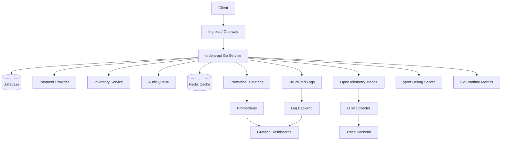
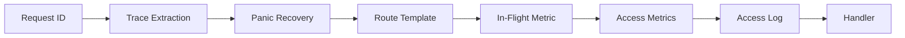
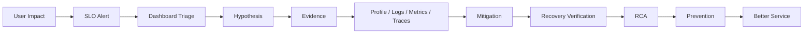

# learn-go-logging-observability-profiling-troubleshooting-part-032.md

# Part 032 — Capstone: Production-Grade Observable Go Service

> Seri: `learn-go-logging-observability-profiling-troubleshooting`  
> Bagian: `032 / 032`  
> Fokus: capstone end-to-end observable Go service, blueprint architecture, implementation contracts, operational readiness, SLO/dashboard/alert/runbook integration  
> Target pembaca: Java software engineer / tech lead yang ingin menyatukan seluruh materi menjadi desain service Go production-grade

---

## 0. Posisi Bagian Ini dalam Seri

Ini adalah bagian terakhir dari seri:

```text
learn-go-logging-observability-profiling-troubleshooting
```

Sebelumnya kita sudah membahas:

1. observability mental model,
2. structured logging,
3. `log/slog`,
4. logging architecture,
5. error logging,
6. metrics,
7. Prometheus,
8. Go runtime metrics,
9. OpenTelemetry,
10. distributed tracing,
11. observability middleware,
12. `pprof`,
13. production pprof,
14. CPU profiling,
15. memory profiling,
16. GC observability,
17. goroutine profiling,
18. block/mutex profiling,
19. runtime trace,
20. benchmark/profile/PGO workflow,
21. troubleshooting methodology,
22. latency,
23. throughput/saturation,
24. memory/OOM/container,
25. network/HTTP/dependency,
26. Kubernetes observability,
27. alerting/SLO/error budget,
28. dashboard design,
29. cost/cardinality/governance,
30. internal observability toolkit,
31. incident case studies,
32. production runbooks/playbooks.

Bagian capstone ini menyatukan semuanya ke blueprint praktis.

---

## 1. Core Thesis

**Production-grade observable Go service bukan service yang hanya punya `/metrics`. Ia adalah service yang sejak desain awal bisa menjawab: apa yang terjadi, siapa terdampak, kenapa terjadi, bagaimana memitigasi, dan bagaimana mencegah berulang.**

Observable service harus punya:

```text
logs for events
metrics for signals
traces for causality
profiles for cost attribution
runtime metrics for Go internals
Kubernetes signals for platform context
SLO for user impact
alerts for action
dashboards for decision
runbooks for repeatability
governance for safety/cost
```

Jika salah satu hilang, incident masih bisa ditangani, tetapi dengan blind spot.

---

## 2. Target Service: `orders-api`

Kita gunakan contoh service:

```text
orders-api
```

Responsibilities:

- create order,
- get order,
- list orders,
- reserve inventory through dependency,
- charge payment through dependency,
- write audit event asynchronously,
- persist to database.

Endpoints:

```text
POST /orders
GET /orders/{id}
GET /orders
```

Dependencies:

```text
PostgreSQL / database
payment-provider HTTP API
inventory-service HTTP API
audit queue
Redis cache optional
```

Runtime:

```text
Go 1.26+
Kubernetes
Prometheus
OpenTelemetry Collector
Grafana
central logs
private pprof via port-forward
```

---

## 3. High-Level Architecture



---

## 4. Operational Contract

The service must answer these questions quickly:

### User impact

```text
Are users failing to create/get orders?
Are requests slower than SLO?
Which route/status/version/tenant group is affected?
```

### Saturation

```text
Is CPU high?
Is CPU throttled?
Is memory near limit?
Is heap live growing?
Are goroutines rising?
Is DB pool saturated?
Is audit queue full?
```

### Dependency

```text
Is payment slow?
Is inventory failing?
Are retries increasing?
Is circuit breaker open?
```

### Runtime

```text
What is the CPU hot path?
What retains heap?
Where are goroutines blocked?
Is there mutex/channel contention?
```

### Kubernetes

```text
Are pods restarting?
Are probes failing?
Are service endpoints healthy?
Is HPA scaling?
Is one node/zone affected?
```

---

## 5. Service SLO

Example SLOs:

### Availability SLO

```text
99.9% of valid orders-api public HTTP requests return non-5xx over 30 days.
```

Exclusions:

- `/livez`,
- `/readyz`,
- `/metrics`,
- `/debug`,
- invalid client requests 4xx,
- explicitly documented client cancellations before server processing.

### Latency SLO

```text
99% of valid POST /orders requests complete within 1s over 30 days.
99% of valid GET /orders/{id} requests complete within 300ms over 30 days.
```

### Async Audit Freshness SLO

```text
99.5% of audit events are accepted or explicitly degraded within 100ms of request processing.
```

Or if audit must be durable:

```text
99.5% of audit events are persisted within 5 minutes.
```

The SLO depends on product/compliance semantics.

---

## 6. Project Layout

Example layout:

```text
orders-api/
  cmd/orders-api/
    main.go
  internal/
    app/
      server.go
      config.go
      shutdown.go
    httpapi/
      routes.go
      handlers.go
      middleware.go
    order/
      service.go
      repository.go
      model.go
    payment/
      client.go
      errors.go
    inventory/
      client.go
    audit/
      writer.go
      worker.go
    observability/
      logger.go
      metrics.go
      tracing.go
      debug.go
      health.go
      errors.go
  deploy/
    kubernetes/
      deployment.yaml
      service.yaml
      servicemonitor.yaml
      networkpolicy.yaml
  docs/
    runbooks/
      high-latency.md
      high-cpu.md
      memory-oom.md
      dependency-failure.md
```

Internal observability can be in separate shared module if multiple services use it.

---

## 7. Configuration Contract

Required config:

```text
SERVICE_NAME=orders-api
SERVICE_VERSION=2026.06.23.1
ENVIRONMENT=prod
HTTP_ADDR=:8080
METRICS_ADDR=:9090
DEBUG_ADDR=127.0.0.1:6060
LOG_LEVEL=INFO
OTEL_EXPORTER_OTLP_ENDPOINT=http://otel-collector:4317
TRACING_ENABLED=true
PAYMENT_BASE_URL=...
INVENTORY_BASE_URL=...
DB_MAX_OPEN_CONNS=...
DB_MAX_IDLE_CONNS=...
GOMEMLIMIT=...
GOGC=...
```

Startup log must include non-secret config summary:

```text
event=startup_completed
service=orders-api
version=2026.06.23.1
environment=prod
go_version=go1.26.x
gomaxprocs=...
gomemlimit=...
gogc=...
metrics_addr=:9090
debug_addr=127.0.0.1:6060
tracing_enabled=true
```

Never log secrets.

---

## 8. Logger Contract

Every log should be structured.

Required common fields:

```text
timestamp
level
service
version
environment
event
trace_id
request_id
route
method
status
status_class
error_class
duration_ms
dependency
operation
```

Not every event has every field, but schema should be consistent.

Example access log:

```json
{
  "time": "2026-06-23T10:00:00Z",
  "level": "INFO",
  "service": "orders-api",
  "version": "2026.06.23.1",
  "environment": "prod",
  "event": "http_request_completed",
  "trace_id": "abc",
  "request_id": "req-123",
  "method": "POST",
  "route": "/orders",
  "status": 201,
  "status_class": "2xx",
  "duration_ms": 183
}
```

Example dependency failure log:

```json
{
  "level": "WARN",
  "event": "dependency_call_failed",
  "dependency": "payment_provider",
  "operation": "charge",
  "status_class": "5xx",
  "error_class": "dependency_5xx",
  "attempt": 2,
  "max_attempts": 3,
  "duration_ms": 701,
  "retryable": true
}
```

---

## 9. Metrics Contract

### HTTP Server

```text
http_server_requests_total{route,method,status_class}
http_server_request_duration_seconds_bucket{route,method,status_class}
http_server_inflight_requests{route,method}
http_server_request_size_bytes_bucket{route,method}
http_server_response_size_bytes_bucket{route,method,status_class}
```

### Dependencies

```text
dependency_requests_total{dependency,operation,status_class,error_class}
dependency_request_duration_seconds_bucket{dependency,operation,status_class}
dependency_retries_total{dependency,operation,error_class}
dependency_timeouts_total{dependency,operation,phase}
dependency_inflight_requests{dependency,operation}
dependency_circuit_state{dependency}
```

### DB

```text
db_pool_open_connections
db_pool_in_use_connections
db_pool_idle_connections
db_pool_wait_count_total
db_pool_wait_duration_seconds_total
db_query_duration_seconds_bucket{operation,status}
db_transaction_duration_seconds_bucket{operation,status}
```

### Queue/Audit

```text
audit_queue_depth
audit_queue_capacity
audit_queue_submit_wait_duration_seconds_bucket
audit_events_total{status}
audit_worker_active
audit_worker_job_duration_seconds_bucket{status}
```

### Runtime

```text
go runtime metrics
process metrics
container metrics from Kubernetes/cAdvisor
```

All labels must be bounded.

---

## 10. Trace Contract

Trace shape for `POST /orders`:

```text
HTTP POST /orders
  validate_request
  db.order.insert
  inventory.reserve
  payment.charge
  audit.enqueue
  response.serialize
```

Span attributes:

```text
http.route=/orders
http.method=POST
http.response.status_code=201
service.version=...
dependency.name=payment_provider
operation.name=charge
error.type=dependency_timeout
retry.attempt=1
payload.size_bucket=small|medium|large
```

Do not include:

- raw body,
- token,
- cookie,
- email,
- full card/payment data,
- raw user identifier unless governed.

---

## 11. Middleware Stack

Recommended HTTP middleware order concept:



Practical details depend on router.

Middleware responsibilities:

- request ID,
- trace context,
- route template,
- panic recovery,
- status/bytes capture,
- metrics,
- structured access log,
- timeout/cancellation classification.

---

## 12. Handler Design

Handler should be thin.

```go
func (h *OrderHandler) CreateOrder(w http.ResponseWriter, r *http.Request) {
	ctx := r.Context()

	var req CreateOrderRequest
	if err := decodeJSONLimited(w, r, &req); err != nil {
		h.writeError(w, r, err)
		return
	}

	order, err := h.service.CreateOrder(ctx, req)
	if err != nil {
		h.writeError(w, r, err)
		return
	}

	writeJSON(w, http.StatusCreated, order)
}
```

Important:

- request body size limited,
- context propagated,
- errors classified at boundary,
- no business logic hidden in middleware,
- no full payload logs.

---

## 13. Service Design with Timeout Budget

`POST /orders` total budget:

```text
handler budget: 1000ms
validation: 50ms
DB insert: 200ms
inventory reserve: 300ms
payment charge: 500ms
audit enqueue: 50ms
slack: remaining
```

Example:

```go
func (s *OrderService) CreateOrder(ctx context.Context, req CreateOrderRequest) (*Order, error) {
	ctx, span := s.tracer.Start(ctx, "order.create")
	defer span.End()

	invCtx, cancelInv := context.WithTimeout(ctx, 300*time.Millisecond)
	defer cancelInv()

	if err := s.inventory.Reserve(invCtx, req.Items); err != nil {
		return nil, fmt.Errorf("reserve inventory: %w", err)
	}

	payCtx, cancelPay := context.WithTimeout(ctx, 500*time.Millisecond)
	defer cancelPay()

	if err := s.payment.Charge(payCtx, req.Payment); err != nil {
		return nil, fmt.Errorf("charge payment: %w", err)
	}

	// DB transaction should be short.
	dbCtx, cancelDB := context.WithTimeout(ctx, 200*time.Millisecond)
	defer cancelDB()

	order, err := s.repo.InsertOrder(dbCtx, req)
	if err != nil {
		return nil, fmt.Errorf("insert order: %w", err)
	}

	if err := s.audit.TryEnqueue(ctx, AuditEventFrom(order)); err != nil {
		// depends on business/compliance semantics
		s.logger.WarnContext(ctx, "audit enqueue failed",
			"event", "audit_enqueue_failed",
			"error_class", Classify(err),
		)
	}

	return order, nil
}
```

Real payment/order consistency may require more robust transaction/outbox design; this example focuses on observability boundaries.

---

## 14. Dependency Client Design

Payment client should have:

- reused `http.Client`,
- reused `Transport`,
- operation name,
- timeout,
- retry budget,
- idempotency key,
- metrics,
- trace span,
- structured logs,
- circuit breaker/rate limiter if needed,
- response body close on all paths.

Required evidence on failure:

```text
dependency
operation
status_class
error_class
duration
attempt
timeout phase if known
remaining budget
trace_id
```

---

## 15. Audit Queue Design

Audit queue must have explicit policy.

Questions:

```text
Is audit critical path?
Can audit be dropped/degraded?
Must it be durable?
Is outbox required?
```

If non-critical:

```go
func (w *AuditWriter) TryEnqueue(ctx context.Context, ev Event) error {
	timer := time.NewTimer(50 * time.Millisecond)
	defer timer.Stop()

	start := time.Now()
	defer func() {
		w.metrics.ObserveSubmitWait(time.Since(start))
	}()

	select {
	case w.ch <- ev:
		w.metrics.EventsAccepted.Inc()
		return nil
	case <-ctx.Done():
		w.metrics.EventsRejected.WithLabelValues("context_done").Inc()
		return ctx.Err()
	case <-timer.C:
		w.metrics.EventsRejected.WithLabelValues("queue_full").Inc()
		return ErrAuditQueueFull
	}
}
```

If critical, use durable outbox, not memory channel only.

---

## 16. Database Contract

Database usage should expose:

- query operation name,
- duration,
- error class,
- transaction duration,
- pool wait,
- rows returned if safe,
- context deadline.

Rules:

```text
[ ] Use context-aware DB calls.
[ ] Close Rows.
[ ] Keep transactions short.
[ ] Do not call external HTTP while holding transaction unless explicitly justified.
[ ] Size pool with total pod count.
[ ] Expose db.Stats.
```

DB pool capacity:

```text
total connections = pod_count * MaxOpenConns
```

This must fit DB safe capacity.

---

## 17. pprof and Debug

Debug server:

```text
127.0.0.1:6060 or private pod port
not exposed publicly
port-forward only
```

Endpoints:

```text
/debug/pprof/profile
/debug/pprof/heap
/debug/pprof/goroutine
/debug/pprof/block
/debug/pprof/mutex
/debug/pprof/trace
/debug/buildinfo
```

Production policy:

```text
Capture short profiles.
Name artifacts consistently.
Attach to incident notes.
Do not expose publicly.
```

---

## 18. Kubernetes Deployment Blueprint

Important settings:

```yaml
apiVersion: apps/v1
kind: Deployment
metadata:
  name: orders-api
spec:
  replicas: 4
  selector:
    matchLabels:
      app: orders-api
  template:
    metadata:
      labels:
        app: orders-api
        app.kubernetes.io/name: orders-api
        app.kubernetes.io/version: "2026.06.23.1"
    spec:
      terminationGracePeriodSeconds: 30
      containers:
      - name: orders-api
        image: registry.example.com/orders-api:2026.06.23.1
        ports:
        - name: http
          containerPort: 8080
        - name: metrics
          containerPort: 9090
        - name: debug
          containerPort: 6060
        env:
        - name: SERVICE_NAME
          value: orders-api
        - name: SERVICE_VERSION
          value: "2026.06.23.1"
        - name: GOMEMLIMIT
          value: "768MiB"
        resources:
          requests:
            cpu: "500m"
            memory: "512Mi"
          limits:
            cpu: "1"
            memory: "1Gi"
        startupProbe:
          httpGet:
            path: /startupz
            port: http
          failureThreshold: 30
          periodSeconds: 2
        readinessProbe:
          httpGet:
            path: /readyz
            port: http
          periodSeconds: 5
          timeoutSeconds: 1
        livenessProbe:
          httpGet:
            path: /livez
            port: http
          periodSeconds: 10
          timeoutSeconds: 1
```

Adjust numbers for real workload.

---

## 19. Service and Metrics Exposure

Service:

```yaml
apiVersion: v1
kind: Service
metadata:
  name: orders-api
spec:
  selector:
    app: orders-api
  ports:
  - name: http
    port: 80
    targetPort: http
  - name: metrics
    port: 9090
    targetPort: metrics
```

Do not expose debug port through public service.

Metrics can be scraped via ServiceMonitor/PodMonitor depending platform.

---

## 20. NetworkPolicy for Debug Safety

Debug port should be restricted.

Concept:

```yaml
apiVersion: networking.k8s.io/v1
kind: NetworkPolicy
metadata:
  name: orders-api-debug-deny
spec:
  podSelector:
    matchLabels:
      app: orders-api
  policyTypes:
  - Ingress
```

Exact policy depends on cluster. The point:

```text
Only trusted admin/debug path should reach pprof.
```

Often easiest operational model:

```text
do not expose debug service; use kubectl port-forward with RBAC.
```

---

## 21. Dashboard Blueprint

Rows:

```text
1. SLO / Error Budget
2. Traffic / Errors
3. Latency
4. Saturation
5. Go Runtime
6. Dependencies
7. Database
8. Audit Queue
9. Kubernetes
10. Diagnostics Links
```

Top panels:

```text
availability SLO burn
POST /orders latency SLO burn
RPS by route
5xx by route/version
p99 by route/version
CPU usage/throttling
container memory vs heap live
goroutines
DB pool wait
payment latency/error/retry
inventory latency/error/retry
audit queue depth/wait
pod restarts/OOM
```

---

## 22. Alert Blueprint

### Page Alerts

```text
orders-api availability SLO fast burn
POST /orders latency SLO fast burn
audit freshness SLO breach if audit is critical
```

### Ticket Alerts

```text
CPU throttling sustained with no SLO impact
memory > 85% and growing
DB pool wait elevated
payment retry rate elevated
audit queue submit wait elevated
goroutine count 5x baseline
log volume 5x baseline
```

### Dashboard Only

```text
CPU 60%
heap live normal fluctuation
goroutines proportional to RPS
single pod restart with no impact
```

---

## 23. Runbook Pack

Required runbooks:

```text
orders-api high latency
orders-api high error rate
orders-api high CPU
orders-api memory/OOM
payment dependency failure
inventory dependency failure
DB pool wait
audit queue saturation
Kubernetes pod restart/probe
pprof capture
rollback
post-incident review
```

Each runbook should link from alert and dashboard.

---

## 24. Release Readiness Gate

Before production release:

```text
[ ] Unit tests pass.
[ ] Integration tests pass.
[ ] Benchmarks for hot paths run if changed.
[ ] No new high-cardinality labels.
[ ] No new PII logs.
[ ] Dashboard can compare old vs new version.
[ ] Canary SLO panels ready.
[ ] Rollback plan safe.
[ ] DB migrations compatible.
[ ] Config/secrets validated.
[ ] Resource requests/limits reviewed.
[ ] pprof/build info available.
```

---

## 25. Canary Verification

During canary, compare v1 vs v2:

```text
request rate share
error rate
latency p95/p99
availability/latency SLO ratio
CPU per request
allocation rate
heap live
goroutines
DB pool wait
payment dependency calls
inventory dependency calls
response size
panic count
```

If v2 worse:

- capture profile,
- rollback or pause rollout,
- attach evidence.

---

## 26. Failure Injection Tests

Pre-production game days:

1. payment returns 503,
2. payment returns 429,
3. inventory latency 2s,
4. DB pool saturated,
5. audit queue full,
6. CPU load spike,
7. memory leak simulation,
8. pod OOM,
9. liveness/readiness failure,
10. DNS failure,
11. log storm,
12. high-cardinality metric injection blocked.

Each should validate:

- alert,
- dashboard,
- runbook,
- mitigation,
- evidence capture.

---

## 27. Capstone Incident Walkthrough

Scenario:

```text
POST /orders p99 latency SLO burns at 20x.
```

### 27.1 First 5 Minutes

- acknowledge page,
- open incident notes,
- confirm SLO impact,
- route: `POST /orders`,
- start time,
- check deploy marker.

Dashboard shows:

```text
Only v2 affected.
CPU per request v2 4x.
allocation rate v2 6x.
payment latency normal.
DB pool normal.
```

### 27.2 Evidence

Before rollback:

```bash
kubectl -n prod port-forward pod/orders-api-v2-abc 6060:6060

curl -o 20260623T100500Z_prod_orders-api_v2_cpu-30s.pb.gz \
  "http://localhost:6060/debug/pprof/profile?seconds=30"

curl -o 20260623T100540Z_prod_orders-api_v2_heap-after-gc.pb.gz \
  "http://localhost:6060/debug/pprof/heap?gc=1"
```

### 27.3 Diagnosis

CPU profile:

```text
encoding/json
mapper.BuildOrderResponse
runtime.mallocgc
```

Trace:

```text
handler CPU segment high
dependencies normal
```

### 27.4 Mitigation

- rollback v2,
- verify p99/error budget,
- keep profile artifacts.

### 27.5 RCA

New response mapper materialized full nested order details for `POST /orders`, increasing CPU/allocation and p99 latency. Canary did not have representative large order fixture.

### 27.6 Prevention

```text
[ ] Add benchmark large order response.
[ ] Add response size metric.
[ ] Add canary CPU/request and alloc rate gate.
[ ] Add field-level feature flag.
[ ] Add DTO review checklist.
```

This walkthrough uses all layers:

- alert,
- dashboard,
- metrics,
- pprof,
- traces,
- rollback,
- RCA,
- prevention.

---

## 28. Production Readiness Checklist

```text
Observability
[ ] Structured logs with schema.
[ ] Redaction enabled.
[ ] Metrics with safe labels.
[ ] Runtime metrics exposed.
[ ] Tracing configured.
[ ] pprof private.
[ ] Build info endpoint.

HTTP
[ ] Server timeouts set.
[ ] Request body size limit.
[ ] Response writer wrapper tested.
[ ] Panic recovery.
[ ] Context propagated.
[ ] Graceful shutdown.

Dependencies
[ ] Reused HTTP clients/transports.
[ ] Timeouts per dependency.
[ ] Retry bounded/jittered/idempotent.
[ ] Circuit breaker/rate limit where needed.
[ ] Dependency metrics/logs/traces.
[ ] Response body closed.

Database
[ ] Context-aware queries.
[ ] DB pool metrics.
[ ] Transactions short.
[ ] Rows closed.
[ ] Pool sized with pod count.

Runtime/Resources
[ ] CPU request/limit tested.
[ ] Memory limit and GOMEMLIMIT reviewed.
[ ] Heap/goroutine/GC dashboard.
[ ] Load test under resource limits.

Kubernetes
[ ] /livez /readyz /startupz separated.
[ ] Readiness false during shutdown.
[ ] HPA policy reviewed.
[ ] Service endpoints monitored.
[ ] Debug port not public.
[ ] Rollback tested.

SLO/Ops
[ ] SLO defined.
[ ] Burn alerts configured.
[ ] Dashboard exists.
[ ] Runbooks linked.
[ ] Incident note template.
[ ] Game day run.
```

---

## 29. Anti-Pattern Checklist

Avoid:

```text
[ ] raw path as metric label
[ ] user ID/request ID as metric label
[ ] full payload logs
[ ] logging secrets/headers
[ ] no HTTP client timeout
[ ] new http.Client/Transport per request
[ ] response body not closed
[ ] retry without deadline/jitter/idempotency
[ ] liveness checks dependency
[ ] unbounded queue
[ ] unbounded cache
[ ] DB transaction around external call
[ ] public pprof
[ ] no deployment markers
[ ] p99 without traffic/sample context
[ ] alerting on CPU only
[ ] dashboard without SLO row
[ ] restart before evidence when avoidable
```

---

## 30. Mental Model Final

A production-grade Go service is observable when it supports this chain:



The point of observability is not data.

The point is:

```text
better decisions under uncertainty
```

---

## 31. Final Learning Roadmap After This Series

After completing this series, recommended next advanced topics:

### 31.1 Go Performance Engineering

- benchmark methodology,
- allocation optimization,
- CPU cache locality,
- PGO,
- lock-free/low-lock design,
- memory layout.

### 31.2 Go Distributed Systems

- idempotency,
- outbox/inbox,
- sagas,
- retries/circuit breakers,
- distributed tracing at scale,
- consistency and failure semantics.

### 31.3 Go Security and Resilience

- secure logging,
- secret management,
- authN/authZ observability,
- abuse detection,
- rate limiting,
- incident security forensics.

### 31.4 Platform Engineering

- Kubernetes autoscaling,
- service mesh,
- OpenTelemetry Collector pipelines,
- Prometheus scaling,
- logging/tracing backends,
- multi-cluster observability.

### 31.5 Reliability Engineering

- SLO lifecycle,
- error budget policy,
- chaos/game days,
- incident command,
- postmortem quality,
- capacity planning.

---

## 32. Final Summary

Seri ini dimulai dari pertanyaan sederhana:

```text
Bagaimana logging, observability, profiling, dan troubleshooting di Go?
```

Jawaban akhirnya jauh lebih luas:

```text
Bagaimana membangun dan mengoperasikan Go service yang bisa dipahami saat production gagal?
```

Anda sekarang memiliki mental model untuk:

- log sebagai evidence,
- metrics sebagai signal,
- traces sebagai causality,
- profiles sebagai cost attribution,
- runtime metrics sebagai Go internals,
- Kubernetes metrics sebagai platform context,
- SLO sebagai user impact contract,
- alerts sebagai action trigger,
- dashboards sebagai decision interface,
- runbooks sebagai operational memory,
- governance sebagai cost/security control.

Jika diterapkan konsisten, ini bukan hanya membuat service lebih observable.

Ini membuat engineering team lebih tenang, lebih cepat, lebih rasional, dan lebih dipercaya saat incident.

---

## 33. Status Seri

Bagian ini adalah:

```text
learn-go-logging-observability-profiling-troubleshooting-part-032.md
```

Status:

```text
Part 032 dari 032
Seri selesai
```

Ini adalah bagian terakhir dari seri:

```text
learn-go-logging-observability-profiling-troubleshooting
```


<!-- NAVIGATION_FOOTER -->
<div class="page-nav">
<a href="./learn-go-logging-observability-profiling-troubleshooting-part-031.md">⬅️ Part 031 — Production Runbooks and Troubleshooting Playbooks</a>
<a href="./index.md">📚 Kategori</a>
<a href="../../index.md">🏠 Home</a>
<span></span>
</div>
