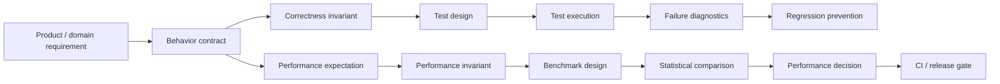
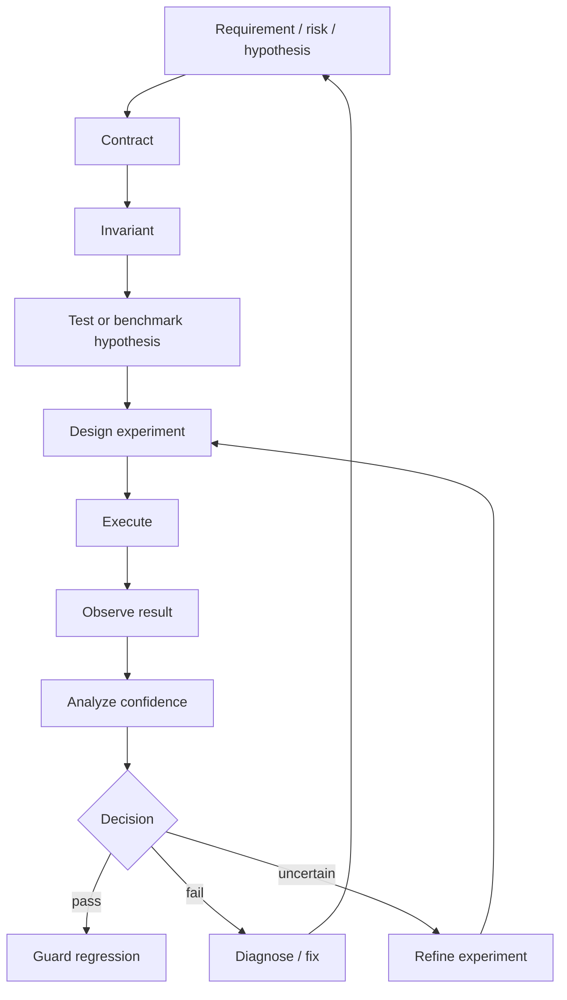
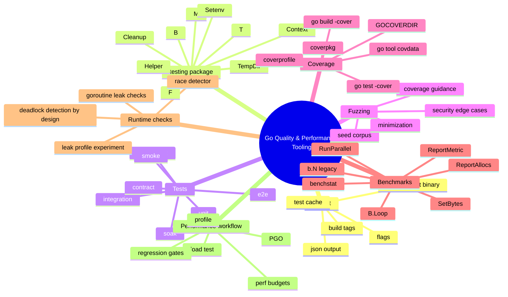
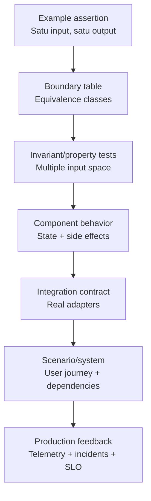
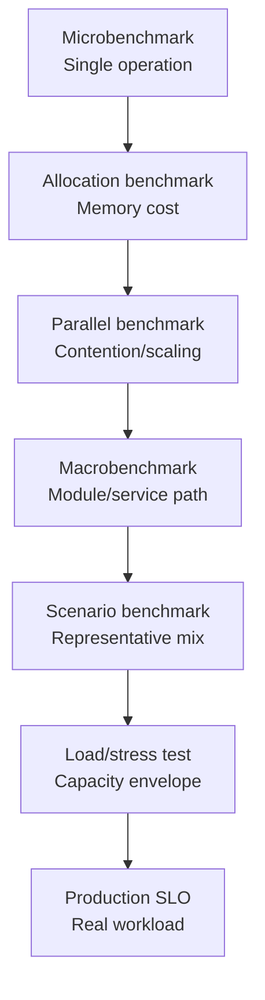
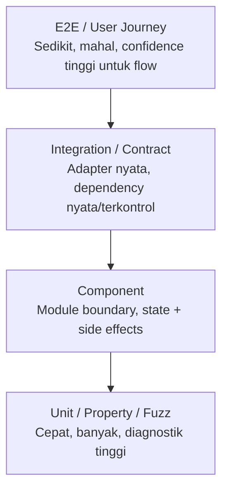
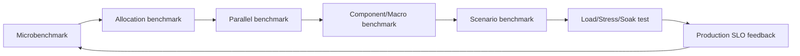
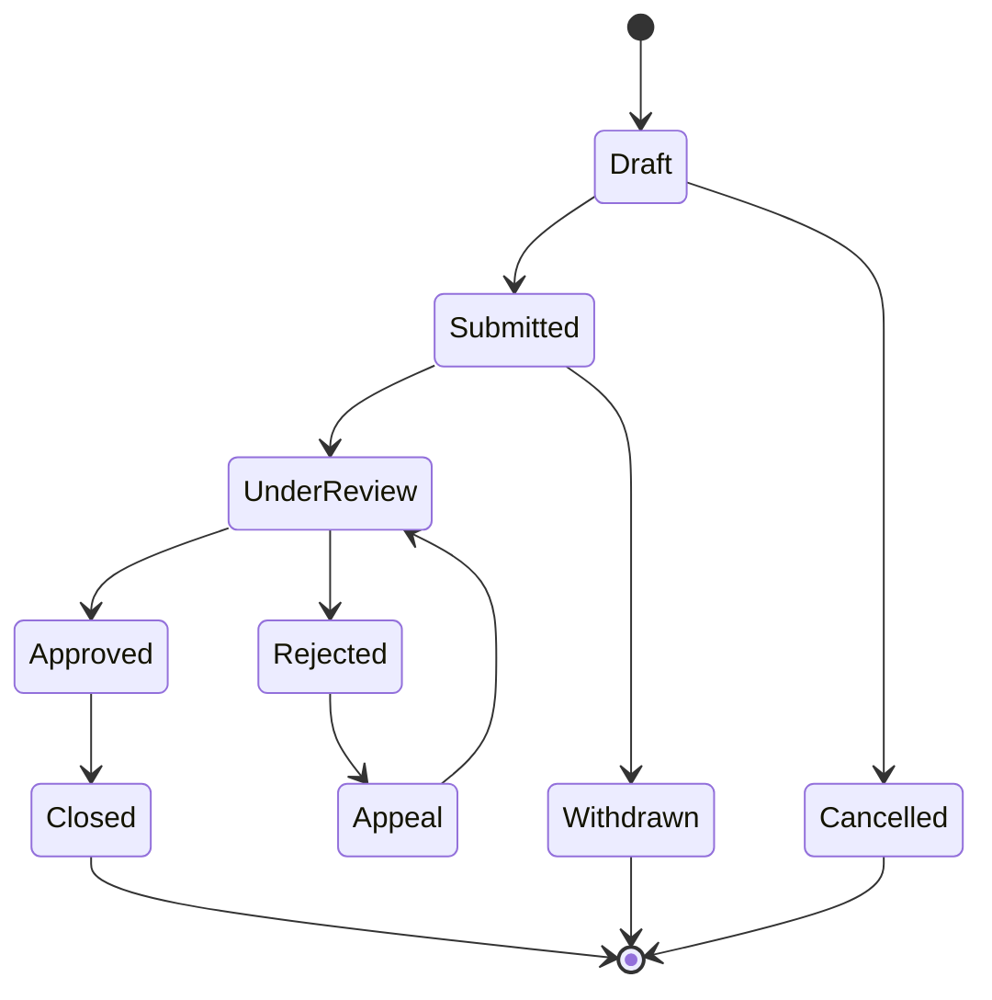

# learn-go-testing-benchmarking-performance-engineering-part-000.md

# Go Testing, Benchmarking, Performance Engineering — Part 000

## Orientation, Scope, Mental Model & Engineering Contract

> Target pembaca: Java software engineer / tech lead yang ingin naik dari level “bisa menulis test dan benchmark” menjadi engineer yang mampu membangun **quality & performance engineering program** yang defensible untuk sistem Go production-grade.
>
> Target Go: **Go 1.26.x**. Materi ini memakai model dan tooling Go modern, termasuk `testing`, `go test`, fuzzing, coverage, benchmark modern dengan `B.Loop`, `benchstat`, race detector, PGO, serta perubahan runtime terbaru yang memengaruhi interpretasi performance.
>
> Status seri: **Part 000 dari 034**. Seri **belum selesai**.

---

## Daftar Isi

1. [Tujuan Part 000](#1-tujuan-part-000)
2. [Kontrak Seri Ini](#2-kontrak-seri-ini)
3. [Apa yang Tidak Akan Diulang](#3-apa-yang-tidak-akan-diulang)
4. [Masalah Sebenarnya: Bukan “Menulis Test”, tapi “Membangun Bukti”](#4-masalah-sebenarnya-bukan-menulis-test-tapi-membangun-bukti)
5. [Definisi Kerja: Testing, Benchmarking, dan Performance Engineering](#5-definisi-kerja-testing-benchmarking-dan-performance-engineering)
6. [Mental Model Utama: Evidence Pipeline](#6-mental-model-utama-evidence-pipeline)
7. [Perbedaan Mindset Java dan Go](#7-perbedaan-mindset-java-dan-go)
8. [Go Testing Surface Area: Peta Besar Tooling](#8-go-testing-surface-area-peta-besar-tooling)
9. [Quality Confidence Model](#9-quality-confidence-model)
10. [Performance Confidence Model](#10-performance-confidence-model)
11. [Test Portfolio: Bukan Pyramid Buta](#11-test-portfolio-bukan-pyramid-buta)
12. [Benchmark Portfolio: Micro, Macro, Scenario, Load](#12-benchmark-portfolio-micro-macro-scenario-load)
13. [Correctness Invariants](#13-correctness-invariants)
14. [Performance Invariants](#14-performance-invariants)
15. [Failure Model untuk Test dan Benchmark](#15-failure-model-untuk-test-dan-benchmark)
16. [Engineering Contract Seri Ini](#16-engineering-contract-seri-ini)
17. [Baseline Command yang Akan Dipakai Sepanjang Seri](#17-baseline-command-yang-akan-dipakai-sepanjang-seri)
18. [Standar Dokumentasi Evidence](#18-standar-dokumentasi-evidence)
19. [Checklist Kesiapan Sebelum Masuk Part 001](#19-checklist-kesiapan-sebelum-masuk-part-001)
20. [Latihan Part 000](#20-latihan-part-000)
21. [Kesalahan Umum yang Harus Dihindari Sejak Awal](#21-kesalahan-umum-yang-harus-dihindari-sejak-awal)
22. [Peta Seri Lengkap](#22-peta-seri-lengkap)
23. [Referensi Resmi dan Teknis](#23-referensi-resmi-dan-teknis)

---

## 1. Tujuan Part 000

Part ini bukan tutorial `go test` paling dasar. Itu akan masuk Part 001 dan seterusnya. Part ini adalah **kontrak konseptual** untuk seluruh seri.

Setelah menyelesaikan part ini, kamu harus punya mental model untuk menjawab pertanyaan berikut:

1. **Apa sebenarnya yang dibuktikan oleh sebuah test?**
2. **Apa yang tidak bisa dibuktikan oleh test?**
3. **Kapan benchmark valid, kapan hanya noise?**
4. **Apa beda benchmark, profiling, load test, dan performance engineering?**
5. **Bagaimana membuat quality gate yang tidak menjadi ritual palsu?**
6. **Bagaimana mencegah test suite besar berubah menjadi liability?**
7. **Bagaimana membuat performance evidence yang bisa dipakai untuk keputusan teknis?**
8. **Bagaimana seorang Java engineer harus menyesuaikan cara berpikir saat masuk Go?**

Tujuan akhirnya bukan sekadar bisa menulis:

```go
func TestSomething(t *testing.T) {}
func BenchmarkSomething(b *testing.B) {}
```

Tujuan akhirnya adalah mampu membangun sistem evidence seperti ini:



Part ini akan sering memakai kata **evidence**. Di konteks engineering, evidence berarti bukti yang cukup kuat untuk mengambil keputusan: merge atau tidak, release atau tidak, rollback atau tidak, optimasi atau tidak, tambah kapasitas atau tidak, refactor atau tidak.

---

## 2. Kontrak Seri Ini

Seri ini punya beberapa prinsip keras.

### 2.1 Fokus pada engineering judgment, bukan hafalan API

API `testing` penting, tetapi API bukan pusatnya. Engineer kuat bukan hanya tahu `t.Run`, `t.Parallel`, `b.Loop`, `f.Fuzz`, atau `go test -cover`. Engineer kuat tahu:

- kapan API tersebut memberi sinyal yang valid;
- kapan sinyalnya misleading;
- bagaimana mengisolasi variabel;
- bagaimana membuat test maintainable;
- bagaimana mendesain benchmark agar tidak berbohong;
- bagaimana membaca hasil dengan ketidakpastian;
- bagaimana memasukkan semua itu ke workflow tim.

### 2.2 Tidak semua hal harus dites dengan cara yang sama

Satu bug bisa dicegah oleh unit test. Bug lain lebih cocok dicegah oleh property test. Bug lain baru muncul di integration test. Bug lain hanya muncul di soak test. Bug lain baru terlihat sebagai p99 latency regression.

Kesalahan senior yang sering terjadi adalah memaksa semua masalah masuk ke satu bentuk test.

Contoh:

| Masalah | Test yang mungkin cocok | Test yang sering salah dipakai |
|---|---:|---:|
| Pure function salah untuk boundary input | table-driven unit test | E2E test berat |
| Parser crash pada input aneh | fuzz/property test | 100 manual examples |
| Repository salah mapping kolom | integration test DB | mock-only unit test |
| Retry menciptakan duplicate write | component/integration test dengan failure injection | happy-path unit test |
| Latency naik karena alokasi | microbenchmark + allocation benchmark | load test penuh tanpa isolasi |
| Throughput turun karena lock contention | parallel benchmark + profile | single-thread benchmark |
| Leak goroutine setelah cancellation | concurrency/leak test + soak | unit test synchronous |
| Regression karena traffic mix berubah | scenario benchmark/load test | microbenchmark sempit |

### 2.3 Test adalah desain, bukan aktivitas setelah coding

Di sistem besar, test yang baik bukan hasil dari “menambahkan test setelah implementasi”. Test yang baik lahir dari desain yang jelas:

- boundary jelas;
- dependency direction jelas;
- side effect dibatasi;
- time/randomness/config bisa dikontrol;
- state transition dapat diobservasi;
- error contract eksplisit;
- concurrency coordination eksplisit;
- resource lifecycle eksplisit.

Kalau desain buruk, test akan terasa sulit. Banyak engineer lalu menyalahkan testing framework, padahal akar masalahnya adalah coupling dan boundary yang kabur.

### 2.4 Benchmark adalah eksperimen, bukan angka dekorasi

Benchmark tidak otomatis benar hanya karena keluar angka `ns/op`.

Benchmark yang valid harus punya:

- pertanyaan eksperimen yang jelas;
- workload yang representatif;
- setup yang tidak ikut terukur secara salah;
- kontrol noise;
- repeated samples;
- statistical comparison;
- interpretasi trade-off;
- keputusan yang bisa ditindaklanjuti.

Benchmark tanpa pertanyaan adalah ritual. Benchmark tanpa kontrol noise adalah kebetulan. Benchmark tanpa baseline adalah angka yatim.

### 2.5 Performance engineering bukan “optimasi kode”

Optimasi kode hanyalah salah satu aktivitas kecil. Performance engineering mencakup:

- memilih metrik yang benar;
- menentukan budget latency/throughput/memory;
- memahami workload;
- mengukur baseline;
- menemukan bottleneck;
- mendesain eksperimen;
- membandingkan hasil;
- mengontrol regression;
- membuat capacity model;
- mengelola trade-off cost vs performance;
- menjaga sistem tetap predictable saat failure.

---

## 3. Apa yang Tidak Akan Diulang

Kamu sudah menyelesaikan beberapa seri lain. Agar belajar efisien, seri ini tidak akan mengulang isi utama dari seri berikut.

### 3.1 Tidak mengulang Go basic

Tidak akan menjelaskan ulang:

- syntax dasar Go;
- package/import;
- slice/map/string basic;
- pointer basic;
- interface basic;
- goroutine/channel basic.

Yang akan dibahas adalah cara semua itu memengaruhi test dan benchmark.

### 3.2 Tidak mengulang concurrency secara penuh

Seri concurrency sebelumnya membahas goroutine, channel, scheduler, race, synchronization, memory model, dan parallelism secara konsep. Di sini kita hanya mengambil bagian yang relevan untuk:

- mendesain test concurrency;
- mendeteksi race;
- menghindari flaky test;
- membuat parallel benchmark;
- mengukur contention;
- membaca efek `GOMAXPROCS`.

### 3.3 Tidak mengulang memory system secara penuh

Seri memory sebelumnya membahas stack/heap, pointer, escape, GC, allocation, byte/buffer, dan memory layout. Di sini kita hanya fokus pada:

- allocation budget;
- allocs/op;
- B/op;
- escape-aware benchmark interpretation;
- GC overhead sebagai variabel eksperimen;
- efek runtime Go versi terbaru pada benchmark.

### 3.4 Tidak mengulang observability/profiling/troubleshooting secara penuh

Seri observability/profiling/troubleshooting sudah membahas logging, metrics, tracing, pprof, runtime metrics, dan debugging. Di sini profiling hanya dibahas sebagai bagian dari performance engineering workflow:

- kapan benchmark perlu profile;
- kapan profile tidak cukup;
- bagaimana PGO memakai profile;
- bagaimana hasil profile menjadi evidence untuk perubahan;
- bagaimana regression gate membaca sinyal benchmark/profile.

### 3.5 Tidak mengulang SQL/database integration secara penuh

Part integration testing akan membahas DB hanya dari sisi test harness:

- lifecycle test database;
- schema setup;
- fixture strategy;
- transaction rollback;
- isolation;
- container strategy;
- contract boundary.

Tidak akan mengulang detail `database/sql`, connection pool, transaction isolation, driver behavior, atau query optimization kecuali diperlukan untuk test/performance evidence.

---

## 4. Masalah Sebenarnya: Bukan “Menulis Test”, tapi “Membangun Bukti”

Banyak tim punya test suite tetapi tetap sering regression. Banyak tim punya benchmark tetapi tetap salah mengambil keputusan performance. Akar masalahnya biasanya bukan kurang tooling, tetapi salah memahami fungsi test dan benchmark.

### 4.1 Test bukan bukti absolut

Test tidak membuktikan program benar untuk semua kondisi. Test hanya membuktikan bahwa program memenuhi expectation tertentu pada kondisi yang dijalankan.

Artinya, kualitas test bergantung pada kualitas pertanyaan:

- expectation apa yang sedang diuji?
- input space mana yang tercakup?
- state awalnya apa?
- side effect apa yang harus terjadi?
- side effect apa yang tidak boleh terjadi?
- error apa yang acceptable?
- invariant apa yang harus tetap benar?
- kondisi failure apa yang disimulasikan?

Test yang buruk biasanya terlalu fokus pada “expected output”, tetapi mengabaikan invariant dan side effect.

Contoh sederhana:

```go
func ApplyDiscount(price int, pct int) int {
    return price - (price * pct / 100)
}
```

Test dangkal:

```go
func TestApplyDiscount(t *testing.T) {
    got := ApplyDiscount(1000, 10)
    if got != 900 {
        t.Fatalf("got %d, want %d", got, 900)
    }
}
```

Test ini hanya membuktikan satu contoh. Engineer lebih kuat akan bertanya:

- Apakah `pct < 0` valid?
- Apakah `pct > 100` valid?
- Apakah `price < 0` valid?
- Apakah overflow mungkin?
- Apakah rounding harus floor, ceil, nearest, atau bankers rounding?
- Apakah currency seharusnya integer minor unit?
- Apakah discount boleh membuat price negatif?
- Apakah behavior harus sama lintas arsitektur?

Dari pertanyaan itu lahir invariant:

```text
For all valid inputs:
- output must be <= original price
- output must be >= 0
- pct=0 preserves price
- pct=100 returns 0
- larger pct must not produce larger final price
```

Itu bukan lagi “menulis test”. Itu adalah **mendesain bukti perilaku**.

### 4.2 Benchmark bukan bukti “kode ini cepat”

Benchmark hanya menjawab pertanyaan spesifik di bawah kondisi spesifik.

Contoh benchmark:

```go
func BenchmarkEncodeSmall(b *testing.B) {
    input := SmallPayload{ID: 1, Name: "alice"}
    for b.Loop() {
        _, _ = json.Marshal(input)
    }
}
```

Benchmark ini tidak membuktikan “encoding kita cepat”. Ia hanya menunjukkan performa `json.Marshal` untuk payload kecil tertentu pada environment tertentu.

Pertanyaan yang belum dijawab:

- Bagaimana untuk payload besar?
- Bagaimana untuk nested payload?
- Bagaimana untuk invalid payload?
- Bagaimana untuk pooled encoder?
- Bagaimana di concurrency tinggi?
- Bagaimana allocation behavior?
- Bagaimana latency distribution di service?
- Bagaimana saat GC pressure tinggi?
- Bagaimana saat CPU quota container terbatas?

Jadi benchmark harus ditempatkan dalam eksperimen yang jelas.

### 4.3 Coverage bukan confidence

Coverage hanya menunjukkan bagian kode yang dieksekusi oleh test. Coverage tidak menjamin assertion bermakna, tidak menjamin branch penting tercakup, dan tidak menjamin behavior benar.

Coverage bisa tinggi tapi test lemah:

```go
func TestHandler(t *testing.T) {
    req := httptest.NewRequest(http.MethodGet, "/items", nil)
    rr := httptest.NewRecorder()

    handler.ServeHTTP(rr, req)

    // Assertion terlalu lemah.
    if rr.Code == 0 {
        t.Fatal("no response")
    }
}
```

Kode mungkin coverage tinggi, tetapi test hampir tidak membuktikan apa-apa.

Coverage berguna sebagai:

- sinyal area yang tidak pernah disentuh;
- guardrail untuk PR;
- input review;
- indikator risiko;
- alat menemukan dead zone.

Coverage berbahaya jika dipakai sebagai ukuran tunggal kualitas.

---

## 5. Definisi Kerja: Testing, Benchmarking, dan Performance Engineering

Seri ini akan memakai definisi kerja berikut.

### 5.1 Testing

**Testing** adalah proses mengeksekusi sistem atau bagian sistem di bawah kondisi tertentu untuk mencari bukti bahwa behavior aktual sesuai dengan behavior yang diharapkan.

Testing menjawab:

```text
Apakah sistem melakukan hal yang benar untuk kondisi ini?
```

Testing berfokus pada:

- correctness;
- error behavior;
- lifecycle;
- state transition;
- compatibility;
- contract;
- regression prevention.

Testing bisa kecil dan cepat seperti unit test, atau besar dan mahal seperti E2E.

### 5.2 Verification

**Verification** menjawab:

```text
Apakah implementasi sesuai dengan spesifikasi teknis yang kita nyatakan?
```

Contoh:

- parser menerima grammar tertentu;
- token validator menolak expired token;
- state machine tidak lompat dari `Draft` langsung ke `Closed`;
- queue consumer idempotent terhadap redelivery;
- config loader precedence sesuai aturan.

### 5.3 Validation

**Validation** menjawab:

```text
Apakah sistem yang dibangun menyelesaikan kebutuhan nyata pengguna/bisnis?
```

Ini lebih luas dari test kode. Misalnya API secara teknis benar tetapi user journey tetap buruk. Dalam seri ini, validation muncul ketika membahas scenario test dan performance SLO.

### 5.4 Benchmarking

**Benchmarking** adalah eksperimen terkontrol untuk mengukur performa suatu operasi atau skenario dengan workload tertentu.

Benchmark menjawab:

```text
Berapa biaya operasi ini di kondisi ini, dan apakah perubahan A lebih baik dari B?
```

Benchmark bisa mengukur:

- `ns/op`;
- `B/op`;
- `allocs/op`;
- MB/s;
- ops/s;
- custom metric seperti comparisons/op, bytes/op, rows/s;
- scaling behavior terhadap CPU/concurrency/input size.

### 5.5 Profiling

**Profiling** adalah pengambilan sampel atau instrumentasi untuk mengetahui di mana waktu, CPU, memory, blocking, atau resource lain digunakan.

Profiling menjawab:

```text
Di mana biaya terjadi?
```

Benchmark menjawab “berapa”. Profiling membantu menjawab “di mana” dan “kenapa”.

### 5.6 Performance Engineering

**Performance engineering** adalah disiplin end-to-end untuk memastikan sistem memenuhi target performa di bawah workload dan constraint nyata.

Performance engineering menjawab:

```text
Apakah sistem memenuhi performance objective secara berkelanjutan, ekonomis, dan defensible?
```

Ini mencakup:

- performance requirements;
- workload modeling;
- benchmark design;
- profiling;
- optimization;
- regression testing;
- capacity planning;
- load/stress/soak testing;
- CI gates;
- release decision;
- incident feedback loop.

---

## 6. Mental Model Utama: Evidence Pipeline

Testing dan benchmarking akan konsisten jika kamu melihatnya sebagai pipeline evidence.



### 6.1 Requirement / risk / hypothesis

Semua evidence harus dimulai dari pertanyaan.

Contoh requirement:

```text
API CreateCase harus idempotent untuk request dengan idempotency key yang sama.
```

Contoh risk:

```text
Jika worker menerima redelivery message, sistem bisa membuat duplicate case.
```

Contoh hypothesis:

```text
Mengganti map+mutex dengan sync.Map akan mengurangi contention pada read-heavy cache.
```

Test dan benchmark tanpa requirement/risk/hypothesis cenderung menjadi test dekoratif.

### 6.2 Contract

Contract adalah pernyataan behavior yang bisa diuji.

Contoh contract:

```text
Given idempotency key K sudah berhasil dipakai untuk payload P,
when request yang sama dikirim ulang,
then service mengembalikan response equivalent tanpa membuat entity baru.
```

Contract harus membatasi:

- input;
- precondition;
- operation;
- expected output;
- expected side effect;
- forbidden side effect;
- error behavior;
- timing expectation jika relevan.

### 6.3 Invariant

Invariant adalah hal yang harus selalu benar.

Contoh invariant correctness:

```text
Jumlah case yang dibuat untuk idempotency key yang sama tidak boleh lebih dari satu.
```

Contoh invariant performance:

```text
p95 latency CreateCase pada workload normal tidak boleh melewati 200 ms selama 10 menit steady-state.
```

Invariant lebih kuat dari expected example karena mendorong kamu berpikir lintas input dan lintas state.

### 6.4 Experiment design

Test dan benchmark adalah eksperimen. Maka harus punya desain:

- apa yang dikontrol;
- apa yang divariasikan;
- apa yang diukur;
- apa yang dianggap pass/fail;
- bagaimana mengurangi false positive/false negative;
- bagaimana hasilnya direproduksi.

### 6.5 Observe and analyze

Hasil test biasanya binary: pass/fail. Tetapi root cause tetap butuh analisis.

Hasil benchmark tidak binary. Benchmark menghasilkan distribusi angka. Maka perlu:

- repeated runs;
- median;
- confidence interval;
- effect size;
- noise analysis;
- comparison against baseline.

### 6.6 Decision

Evidence harus berujung keputusan:

- merge;
- block PR;
- rollback;
- accept risk;
- add test;
- redesign API;
- optimize;
- add capacity;
- reject optimization karena trade-off buruk;
- quarantine flaky test;
- split benchmark;
- update budget.

Evidence yang tidak mengubah keputusan hanyalah laporan.

---

## 7. Perbedaan Mindset Java dan Go

Sebagai Java engineer, banyak konsep testing/performance sudah familiar: JUnit, AssertJ, Mockito, JMH, Jacoco, Maven/Gradle lifecycle, Spring Test, Testcontainers, JFR, async profiler, Gatling/JMeter/k6, CI quality gates.

Namun Go punya filosofi berbeda.

### 7.1 Go cenderung standard-tool-first

Di Java, tooling ecosystem sering framework-heavy:

- JUnit/TestNG;
- Mockito/EasyMock;
- AssertJ/Hamcrest;
- JMH;
- Jacoco;
- Spring Boot Test;
- Maven Surefire/Failsafe.

Di Go, standard toolchain sudah memberi banyak hal:

- `go test`;
- `testing.T`;
- `testing.B`;
- `testing.F`;
- subtests;
- benchmarks;
- fuzzing;
- coverage;
- examples;
- race detector;
- JSON test output;
- profile output dari test binary;
- package-level test binaries;
- integration coverage via coverage-instrumented binaries.

Framework pihak ketiga tetap ada, tetapi gaya Go yang kuat biasanya mulai dari standard library dan hanya menambah dependency jika manfaatnya jelas.

### 7.2 Go test package-oriented, bukan class-oriented

Java test sering mengikuti class:

```text
UserService.java
UserServiceTest.java
```

Go test mengikuti package dan exported/unexported boundary:

```text
user/service.go
user/service_test.go
```

Dalam Go, package adalah unit desain penting. Ini memengaruhi:

- apakah test berada di package yang sama (`package user`) atau external package (`package user_test`);
- apakah test boleh mengakses unexported identifiers;
- apakah test menguji implementation detail atau public contract;
- bagaimana dependency cycle dihindari;
- bagaimana test binary dibangun.

### 7.3 Go tidak mendorong mock-heavy architecture

Java enterprise sering terbiasa dengan interface besar dan mock framework. Di Go, interface biasanya kecil dan didefinisikan di sisi consumer.

Mock-heavy test di Go sering menghasilkan desain buruk:

- terlalu banyak interface buatan;
- test mengikat ke urutan call internal;
- refactor kecil memecahkan banyak test;
- test tidak membuktikan behavior nyata;
- fake lebih cocok tetapi tidak dibuat.

Go lebih cocok dengan:

- small interfaces;
- handwritten fake;
- real implementation untuk dependency murah;
- package boundary test;
- integration test untuk behavior lintas adapter;
- mock hanya untuk interaction yang benar-benar kontraktual.

### 7.4 Go benchmark built into `testing`, bukan JMH

Java JMH sangat kuat karena JVM butuh menangani JIT warmup, dead-code elimination, forks, measurement iterations, dan runtime adaptation.

Go berbeda karena compiled ahead-of-time, tetapi benchmark tetap bisa salah karena:

- compiler optimization;
- dead-code elimination;
- constant folding;
- cache effects;
- branch predictor;
- GC;
- scheduler;
- CPU scaling;
- OS noise;
- input tidak representatif;
- benchmark body salah.

Go modern memperkenalkan `B.Loop` untuk membuat benchmark lebih robust dibanding pola lama `b.N` dalam banyak kasus, tetapi bukan berarti benchmark otomatis valid.

### 7.5 Go CI sering lebih sederhana, tetapi bukan berarti quality lebih sederhana

Karena `go test ./...` mudah dijalankan, banyak tim merasa testing di Go sederhana. Betul untuk small codebase. Tetapi di large production codebase, tantangannya sama kompleks:

- flaky tests;
- test runtime membengkak;
- integration dependency mahal;
- cache salah dipahami;
- race detector lambat;
- fuzzing tidak masuk workflow;
- benchmark tidak stabil;
- coverage gate menjadi angka kosong;
- performance regression tidak tertangkap;
- test data tidak dikelola;
- CI sharding tidak konsisten.

---

## 8. Go Testing Surface Area: Peta Besar Tooling

Berikut peta besar tooling yang akan kita gunakan sepanjang seri.



### 8.1 `go test`

`go test` bukan sekadar command untuk menjalankan test. Ia:

- menemukan file `*_test.go`;
- mengompilasi package plus test files;
- membangun test binary per package;
- menjalankan tests, benchmarks, fuzz tests, dan examples sesuai flag;
- menjalankan subset `go vet` saat membangun test;
- menangani package list mode vs local directory mode;
- menerapkan test cache pada kondisi tertentu;
- menyediakan JSON output untuk automation;
- dapat membangun test binary tanpa menjalankan;
- dapat menghasilkan profile dan coverage.

### 8.2 `testing.T`

`testing.T` adalah handle untuk test. Ia mengatur:

- failure;
- logging;
- cleanup;
- temporary directory;
- environment variable;
- subtest;
- parallel execution;
- helper frame;
- context;
- skip.

### 8.3 `testing.B`

`testing.B` adalah handle untuk benchmark. Ia mengatur:

- iteration control;
- timer;
- allocation reporting;
- byte throughput;
- custom metrics;
- sub-benchmark;
- parallel benchmark;
- benchmark output.

### 8.4 `testing.F`

`testing.F` adalah handle untuk fuzz test. Ia mengatur:

- seed corpus;
- fuzz target;
- coverage-guided input exploration;
- failure reproduction;
- corpus persistence.

### 8.5 Race detector

Race detector membantu menemukan data race saat test dijalankan dengan instrumentasi khusus.

Ia bukan proof bahwa tidak ada race. Ia hanya dapat menemukan race yang tereksekusi oleh run tersebut. Maka kualitas test concurrency menentukan kualitas sinyal race detector.

### 8.6 Coverage tooling

Coverage di Go tidak hanya `go test -cover`. Untuk integration/system binary, Go juga mendukung build dengan coverage instrumentation dan data collection lewat `GOCOVERDIR`, lalu diproses dengan `go tool covdata`.

### 8.7 Benchmark comparison tooling

Output benchmark mentah perlu dibandingkan. `benchstat` dari `golang.org/x/perf/cmd/benchstat` menghitung ringkasan statistik dan perbandingan A/B untuk output benchmark Go. Ini penting karena satu angka benchmark hampir tidak pernah cukup.

### 8.8 PGO

Profile-guided optimization menggunakan CPU profile dari run representatif untuk memberi informasi pada compiler agar build berikutnya dapat dioptimalkan berdasarkan behavior nyata. Dalam seri ini, PGO tidak diperlakukan sebagai magic flag, tetapi sebagai workflow yang harus punya profile source, representativeness check, benchmark validation, rollout, dan stale-profile policy.

---

## 9. Quality Confidence Model

Tidak semua test memberi confidence yang sama. Confidence bergantung pada seberapa dekat test dengan risiko nyata dan seberapa baik test mengobservasi behavior penting.

### 9.1 Confidence bukan hanya jumlah test

1000 test lemah bisa kalah berguna dari 50 test kuat.

Test kuat memiliki:

- purpose jelas;
- assertion bermakna;
- failure message diagnostik;
- setup minimal tetapi realistic;
- boundary cases;
- negative cases;
- side-effect verification;
- determinism;
- low flakiness;
- ownership jelas;
- runtime cost sesuai value.

Test lemah biasanya:

- hanya mengejar coverage;
- menguji implementation detail;
- terlalu banyak mock;
- assertion terlalu umum;
- sulit dibaca;
- bergantung order;
- lambat tanpa alasan;
- flaky;
- tidak ada hubungan jelas dengan risiko.

### 9.2 Dimensi confidence

Gunakan dimensi berikut untuk menilai test:

| Dimensi | Pertanyaan |
|---|---|
| Relevance | Risiko apa yang dicegah test ini? |
| Specificity | Kalau gagal, apakah root cause area jelas? |
| Sensitivity | Apakah test akan gagal saat behavior penting rusak? |
| Stability | Apakah test jarang gagal karena noise? |
| Maintainability | Apakah test mudah diubah saat contract berubah? |
| Speed | Apakah biaya runtime sepadan dengan value? |
| Isolation | Apakah failure satu test tidak mencemari test lain? |
| Reproducibility | Apakah failure bisa direproduksi lokal/CI? |
| Observability | Apakah failure output cukup diagnostik? |

### 9.3 Confidence ladder



Semakin tinggi, semakin dekat dengan real behavior, tetapi biasanya semakin mahal dan lambat. Tujuan bukan selalu naik ke level tertinggi, tetapi memilih kombinasi yang memberi confidence paling efisien.

---

## 10. Performance Confidence Model

Performance evidence juga punya level confidence.



### 10.1 Microbenchmark confidence

Microbenchmark bagus untuk:

- membandingkan implementasi kecil;
- mengukur allocation regression;
- mengisolasi hot path;
- validasi low-level change;
- membuat perf guard untuk library.

Microbenchmark buruk untuk:

- memprediksi p99 service latency secara langsung;
- membuktikan scalability;
- mengukur dependency eksternal;
- membuat keputusan kapasitas penuh.

### 10.2 Parallel benchmark confidence

Parallel benchmark bagus untuk:

- lock contention;
- atomic contention;
- pool contention;
- cache read/write behavior;
- throughput CPU-bound;
- goroutine-local vs shared-state comparison.

Namun parallel benchmark tetap bukan load test. Ia berjalan dalam benchmark harness, bukan environment service nyata.

### 10.3 Scenario benchmark confidence

Scenario benchmark mencoba merepresentasikan workload lebih besar:

- request mix;
- payload mix;
- hot/cold path;
- dependency fake/simulator;
- concurrency pattern;
- state growth.

Ini lebih mahal tetapi lebih dekat dengan decision-making.

### 10.4 Load/stress/soak confidence

Load test memberi evidence untuk:

- capacity;
- saturation point;
- tail latency;
- resource ceiling;
- autoscaling behavior;
- backpressure;
- leak over time;
- degradation under failure.

Namun load test mahal, lambat, dan sulit di-debug jika tidak didukung benchmark/profiling yang lebih kecil.

---

## 11. Test Portfolio: Bukan Pyramid Buta

Testing pyramid klasik berguna, tetapi sering dipakai terlalu dogmatis.



Pyramid memberi ide bahwa test kecil harus lebih banyak. Tetapi keputusan nyata harus risk-based.

### 11.1 Gunakan risk-based test allocation

Tanyakan:

1. Risiko apa yang paling mahal jika lolos ke production?
2. Pada layer mana risiko itu paling murah dibuktikan?
3. Apakah fake/mocking cukup atau perlu real dependency?
4. Apakah behavior deterministic?
5. Apakah failure bisa direproduksi?
6. Apakah assertion bisa dibuat kuat?
7. Berapa biaya runtime di CI?

### 11.2 Test portfolio untuk Go service umum

Contoh portfolio sehat:

| Layer | Tujuan | Jumlah | Runtime | Notes |
|---|---|---:|---:|---|
| Unit | pure logic, validation, transformation | banyak | ms-s | cepat dan diagnostik |
| Property/fuzz | parser, codec, normalization, security-sensitive input | selektif | s-menit | nightly/targeted fuzz |
| Component | service behavior + fake adapters | medium | s | state/side effects |
| Integration | DB/cache/queue/http adapter nyata | selektif | s-menit | contract real boundary |
| E2E | critical journey | sedikit | menit | smoke/release confidence |
| Soak | leak/stability | sangat sedikit | jam | scheduled, bukan PR gate umum |

### 11.3 Anti-pattern: E2E sebagai kompensasi desain buruk

Jika unit/component sulit dibuat karena kode terlalu coupled, tim sering menambah E2E. Ini menghasilkan:

- feedback lambat;
- failure sulit didiagnosis;
- flakiness tinggi;
- dependency environment;
- test data rumit;
- CI mahal;
- developer malas menjalankan lokal.

E2E penting, tetapi tidak boleh menjadi tempat sampah semua behavior.

### 11.4 Anti-pattern: unit test semua hal dengan mock

Kebalikan dari E2E-heavy adalah mock-heavy unit test. Ini menghasilkan:

- test menguji urutan method call, bukan behavior;
- refactor aman menjadi berisiko;
- integration bug lolos;
- confidence palsu;
- interface pollution.

Balance yang sehat adalah test behavior di boundary yang tepat.

---

## 12. Benchmark Portfolio: Micro, Macro, Scenario, Load

Benchmark juga harus berbentuk portfolio.



### 12.1 Microbenchmark

Contoh pertanyaan:

```text
Apakah custom parser lebih cepat dari strings.Split untuk format ini?
```

Cocok untuk:

- fungsi kecil;
- algorithmic comparison;
- allocation budget;
- CPU hot path;
- library API.

Tidak cocok untuk:

- service-level SLO;
- dependency eksternal;
- queueing behavior;
- multi-tenant resource contention.

### 12.2 Allocation benchmark

Contoh pertanyaan:

```text
Apakah perubahan serializer menaikkan allocs/op dari 2 menjadi 12?
```

Allocation benchmark sering lebih stabil dan actionable daripada ns/op karena allocation regression biasanya berdampak ke GC dan tail latency.

### 12.3 Parallel benchmark

Contoh pertanyaan:

```text
Apakah cache implementation tetap scale saat 16 goroutine membaca dan 1 goroutine menulis?
```

Parallel benchmark harus memperhatikan:

- `GOMAXPROCS`;
- shared vs goroutine-local state;
- `RunParallel` semantics;
- operation mix;
- contention metric;
- CPU-bound vs IO-bound behavior.

### 12.4 Macrobenchmark

Macrobenchmark mengukur path lebih besar, misalnya:

- validate + authorize + transform;
- parse + enrich + route;
- encode + compress + write;
- repository method end-to-end dengan fake/real DB.

Macrobenchmark membantu menghindari overfitting microbenchmark.

### 12.5 Scenario benchmark

Scenario benchmark mengukur workload mix:

```text
70% read case detail
20% search case
5% create case
5% update case status
payload distribution: small 80%, medium 15%, large 5%
concurrency: 64 clients
state: 1M records equivalent
```

Ini lebih dekat ke production question.

### 12.6 Load/stress/soak test

Load test menjawab:

- berapa throughput stabil;
- kapan p95/p99 naik tajam;
- resource mana saturate dulu;
- apakah retry/backpressure sehat;
- apakah memory/goroutine/file descriptor leak;
- apakah autoscaling signal benar.

Stress test mencari breaking point. Soak test mencari degradasi waktu panjang.

---

## 13. Correctness Invariants

Part berikutnya akan sering kembali ke konsep invariant. Invariant membuat test lebih kuat karena tidak hanya menguji contoh, tetapi aturan.

### 13.1 Jenis invariant

| Jenis | Contoh |
|---|---|
| Value invariant | total tidak boleh negatif |
| Ordering invariant | createdAt <= updatedAt |
| State invariant | closed case tidak boleh diedit |
| Idempotency invariant | retry request tidak membuat duplicate side effect |
| Authorization invariant | user tidak boleh melihat resource di luar scope |
| Serialization invariant | decode(encode(x)) equivalent dengan x |
| Resource invariant | setiap acquired resource harus released |
| Concurrency invariant | tidak ada lost update di concurrent write |
| Time invariant | deadline harus dihormati |
| Error invariant | invalid input harus error tanpa side effect |

### 13.2 Example-based vs invariant-based

Example-based:

```text
Input A menghasilkan output B.
```

Invariant-based:

```text
Untuk semua input valid, property P harus benar.
```

Keduanya diperlukan. Example-based test mudah dibaca dan bagus untuk regression spesifik. Invariant-based test lebih luas dan bagus untuk menemukan edge case.

### 13.3 Invariant untuk state machine

Dalam domain regulatory/case management, state machine sangat penting.

Contoh state:

```text
Draft -> Submitted -> UnderReview -> Approved -> Closed
Draft -> Cancelled
Submitted -> Withdrawn
UnderReview -> Rejected -> Appeal
```

Invariant:

```text
- Closed adalah terminal state.
- Cancelled adalah terminal state.
- Approved tidak boleh kembali ke Draft.
- Appeal hanya boleh dibuat dari Rejected.
- Setiap transition harus punya actor, timestamp, reason, dan audit event.
```

Test yang kuat tidak hanya menguji satu transition, tetapi membuktikan transition matrix.



### 13.4 Invariant untuk idempotency

Idempotency adalah contoh bagus karena tidak cukup diuji dengan satu request.

Invariant:

```text
For the same idempotency key and equivalent payload:
- at most one durable entity is created;
- repeated requests return equivalent response;
- audit trail should not duplicate business action incorrectly;
- conflicting payload with same key must be rejected or handled by explicit policy;
- partial failure after side effect must be recoverable.
```

Ini akan memerlukan kombinasi:

- unit test untuk key normalization;
- component test untuk idempotency service;
- integration test untuk unique constraint/storage behavior;
- concurrency test untuk simultaneous duplicate requests;
- failure injection untuk partial commit;
- performance test untuk idempotency store under load.

---

## 14. Performance Invariants

Performance invariant adalah batas yang ingin dijaga.

### 14.1 Contoh performance invariant

```text
- Encode small payload must stay below 1 allocation/op.
- Cache Get under read-heavy workload must scale up to GOMAXPROCS=16 without throughput collapse.
- CreateCase p95 latency under normal workload must stay below 200 ms.
- Worker must process at least 500 messages/sec at 8 vCPU with p99 below 1s.
- Memory RSS must not grow unbounded during 6-hour soak test.
- Retry behavior must not increase outbound dependency QPS more than 2x during partial outage.
```

### 14.2 Hard budget vs soft budget

Hard budget:

```text
allocs/op must be 0 for this hot path.
```

Soft budget:

```text
p95 should not regress by more than 5% unless justified.
```

Hard budget cocok untuk invariant teknis yang stabil. Soft budget cocok untuk performance yang noisy.

### 14.3 Relative vs absolute threshold

Absolute threshold:

```text
BenchmarkFoo <= 50 ns/op
```

Relative threshold:

```text
BenchmarkFoo must not regress more than 5% from baseline.
```

Absolute threshold mudah dipahami tetapi rentan environment. Relative threshold lebih cocok untuk dedicated perf runner, tetapi butuh baseline yang dikelola.

### 14.4 Latency distribution

Performance tidak cukup dilihat dari average. Untuk service, tail latency sering lebih penting:

- p50: normal user median;
- p95: kebanyakan user;
- p99: tail behavior;
- max: sering noisy, tapi berguna untuk outlier investigation.

Benchmark Go standard biasanya melaporkan average per operation (`ns/op`). Untuk tail latency, perlu scenario/load harness yang mengumpulkan distribusi.

---

## 15. Failure Model untuk Test dan Benchmark

Test dan benchmark sendiri bisa gagal dengan cara yang misleading. Engineer top perlu memahami failure mode dari alat evidence.

### 15.1 False positive

False positive berarti test gagal padahal behavior production tidak rusak.

Penyebab umum:

- test flaky karena timing;
- dependency eksternal tidak stabil;
- assertion terlalu ketat pada detail non-contract;
- order map iteration diasumsikan stabil;
- time zone/env berbeda;
- file path OS-specific;
- test data bentrok;
- parallel test shared state;
- benchmark noise dianggap regression.

Dampak false positive:

- developer kehilangan trust;
- CI diabaikan;
- test di-skip permanen;
- release tertunda tanpa value;
- tim terbiasa rerun sampai hijau.

### 15.2 False negative

False negative berarti test pass padahal behavior rusak.

Penyebab umum:

- assertion lemah;
- mock tidak merepresentasikan dependency nyata;
- hanya happy path;
- boundary tidak dites;
- error ignored;
- concurrency interleaving tidak muncul;
- benchmark tidak mengukur path yang berubah;
- coverage tinggi tapi behavior penting tidak tercakup.

Dampak false negative:

- regression lolos;
- production incident;
- confidence palsu;
- technical debt tersembunyi.

### 15.3 Flakiness

Flaky test adalah test yang hasilnya berubah tanpa perubahan kode relevan.

Flakiness biasanya berasal dari:

- time;
- randomness;
- concurrency;
- network;
- filesystem;
- external dependency;
- global state;
- shared resource;
- test order;
- CPU/memory pressure;
- eventual consistency.

Flaky test harus diperlakukan sebagai bug di test suite atau desain sistem. Jangan dianggap normal.

### 15.4 Benchmark noise

Benchmark noise berasal dari:

- CPU frequency scaling;
- thermal throttling;
- OS scheduling;
- background process;
- GC variance;
- memory allocator state;
- cache effects;
- branch predictor;
- NUMA;
- container CPU quota;
- VM noisy neighbor;
- test input terlalu kecil;
- repeated run terlalu sedikit.

Karena itu benchmark perlu repeated samples dan statistical comparison.

---

## 16. Engineering Contract Seri Ini

Seri ini akan memakai aturan berikut sebagai standar.

### 16.1 Setiap test harus punya alasan

Sebelum menulis test, jawab:

```text
Bug atau regression apa yang akan dicegah test ini?
```

Kalau tidak bisa menjawab, kemungkinan test itu dekoratif.

### 16.2 Assertion harus diagnostik

Failure message buruk:

```go
t.Fatalf("failed")
```

Failure message lebih baik:

```go
t.Fatalf("discounted price mismatch: got=%d want=%d input=%+v", got, want, tc)
```

Assertion harus membantu menemukan root cause tanpa debugger dulu.

### 16.3 Test harus deterministic secara default

Determinism berarti hasil test tidak bergantung pada:

- jam real jika tidak perlu;
- random seed tersembunyi;
- order map;
- network eksternal;
- scheduling race;
- data global yang bocor;
- environment machine.

Jika nondeterminism diperlukan, harus dikontrol dan dicatat.

### 16.4 Integration test harus punya lifecycle jelas

Integration dependency harus punya:

- setup;
- readiness;
- migration/schema;
- seed data;
- isolation;
- cleanup;
- timeout;
- failure diagnostics;
- local/CI parity.

### 16.5 Benchmark harus punya hypothesis

Sebelum benchmark, tulis:

```text
Hypothesis: implementation B reduces allocations from 3 allocs/op to 1 alloc/op for payload size <= 1KB without regressing ns/op more than 5%.
```

Ini membuat benchmark bisa dievaluasi.

### 16.6 Benchmark harus punya baseline

Benchmark tanpa baseline hanya angka. Minimal:

```bash
go test -run='^$' -bench=. -benchmem -count=10 ./pkg/foo > before.txt
go test -run='^$' -bench=. -benchmem -count=10 ./pkg/foo > after.txt
benchstat before.txt after.txt
```

### 16.7 Performance improvement harus menyebut trade-off

Contoh keputusan yang buruk:

```text
Versi baru 20% lebih cepat.
```

Keputusan yang lebih lengkap:

```text
Versi baru menurunkan median ns/op 20% dan allocs/op dari 4 ke 1 pada payload kecil.
Namun kode lebih kompleks, memory peak naik 8% pada payload besar, dan readability turun.
Kita pakai hanya untuk hot path encoder internal, bukan public API umum.
```

### 16.8 Quality gate harus punya owner

Gate tanpa owner akan membusuk.

Setiap gate harus jelas:

- siapa owner;
- apa threshold;
- bagaimana update threshold;
- kapan fail-open/fail-closed;
- bagaimana menangani flaky;
- bagaimana override dilakukan;
- bukti apa yang harus disertakan saat override.

---

## 17. Baseline Command yang Akan Dipakai Sepanjang Seri

Bagian ini hanya preview. Detail akan dibahas di part masing-masing.

### 17.1 Menjalankan semua test

```bash
go test ./...
```

### 17.2 Menjalankan test dengan verbose

```bash
go test -v ./...
```

### 17.3 Menjalankan test tertentu

```bash
go test -run '^TestCreateCase$' ./internal/case
```

### 17.4 Menjalankan subtest tertentu

```bash
go test -run '^TestCreateCase/idempotent_retry$' ./internal/case
```

### 17.5 Disable test cache secara eksplisit

```bash
go test -count=1 ./...
```

### 17.6 Menjalankan race detector

```bash
go test -race ./...
```

### 17.7 Menjalankan short test saja

```bash
go test -short ./...
```

### 17.8 Shuffle test order

```bash
go test -shuffle=on ./...
```

Jika menemukan failure karena shuffle, catat seed yang dicetak agar bisa reproduce.

### 17.9 Coverage package

```bash
go test -cover ./...
```

### 17.10 Coverage profile

```bash
go test -coverprofile=coverage.out ./...
go tool cover -func=coverage.out
go tool cover -html=coverage.out
```

### 17.11 Coverage lintas package

```bash
go test -coverpkg=./... -coverprofile=coverage.out ./...
```

### 17.12 Benchmark semua benchmark

```bash
go test -run='^$' -bench=. ./...
```

### 17.13 Benchmark dengan allocation metrics

```bash
go test -run='^$' -bench=. -benchmem ./...
```

### 17.14 Benchmark repeated samples

```bash
go test -run='^$' -bench=. -benchmem -count=10 ./pkg/foo > bench.txt
```

### 17.15 A/B benchmark dengan benchstat

```bash
go test -run='^$' -bench=. -benchmem -count=10 ./pkg/foo > before.txt
# apply change
go test -run='^$' -bench=. -benchmem -count=10 ./pkg/foo > after.txt
benchstat before.txt after.txt
```

### 17.16 CPU profile dari benchmark

```bash
go test -run='^$' -bench='BenchmarkFoo$' -cpuprofile=cpu.out ./pkg/foo
go tool pprof cpu.out
```

### 17.17 Memory profile dari benchmark

```bash
go test -run='^$' -bench='BenchmarkFoo$' -memprofile=mem.out ./pkg/foo
go tool pprof mem.out
```

### 17.18 Fuzzing target tertentu

```bash
go test -run='^$' -fuzz=FuzzParseToken ./internal/token
```

### 17.19 Fuzzing dengan durasi

```bash
go test -run='^$' -fuzz=FuzzParseToken -fuzztime=30s ./internal/token
```

### 17.20 Integration coverage dengan binary instrumented

Nanti dibahas detail di part coverage. Secara konsep:

```bash
go build -cover -o app.testcover ./cmd/app
GOCOVERDIR=./coverage-data ./app.testcover

go tool covdata percent -i=./coverage-data
go tool covdata textfmt -i=./coverage-data -o coverage.out
```

---

## 18. Standar Dokumentasi Evidence

Untuk engineering handbook level tinggi, setiap test/performance effort harus terdokumentasi ringkas tetapi jelas.

### 18.1 Test evidence template

```markdown
## Test Evidence

### Risk
Apa risiko yang dicegah?

### Contract
Behavior apa yang dijanjikan?

### Invariant
Hal apa yang harus selalu benar?

### Test level
Unit / component / integration / contract / E2E / fuzz / soak.

### Setup
Dependency, fixture, clock, random seed, env.

### Assertion
Apa yang diverifikasi?

### Failure diagnostics
Jika gagal, output apa yang membantu root cause?

### Runtime cost
Berapa lama, cocok untuk PR gate atau scheduled?

### Owner
Tim/paket yang bertanggung jawab.
```

### 18.2 Benchmark evidence template

```markdown
## Benchmark Evidence

### Question
Pertanyaan performance yang dijawab.

### Hypothesis
Prediksi perubahan dan alasannya.

### Workload
Input size, data distribution, concurrency, CPU, memory, dependency.

### Environment
OS, arch, Go version, CPU, container/VM/bare metal, GOMAXPROCS, GOGC, GOMEMLIMIT.

### Command
Command persis yang dipakai.

### Baseline
Commit/version before.

### Candidate
Commit/version after.

### Samples
Jumlah run, benchtime, count.

### Result
benchstat/result table.

### Interpretation
Apakah signifikan, noisy, trade-off.

### Decision
Accept/reject/needs more experiment.
```

### 18.3 Performance budget template

```markdown
## Performance Budget

### Scope
Package/service/endpoint/job.

### Metric
ns/op, B/op, allocs/op, ops/s, p95, p99, RSS, CPU, GC pause, queue lag.

### Budget
Absolute/relative threshold.

### Measurement method
Benchmark/load test/prod telemetry.

### Gate
PR/nightly/release/manual review.

### Owner
Responsible team.

### Override policy
Siapa boleh override dan evidence apa yang dibutuhkan.

### Review cadence
Kapan budget ditinjau ulang.
```

---

## 19. Checklist Kesiapan Sebelum Masuk Part 001

Sebelum lanjut ke Part 001, pastikan kamu bisa menjelaskan hal berikut.

### 19.1 Concept checklist

- [ ] Test adalah evidence, bukan proof absolut.
- [ ] Coverage bukan confidence.
- [ ] Benchmark adalah eksperimen, bukan angka dekorasi.
- [ ] Performance engineering lebih luas dari optimasi kode.
- [ ] Invariant lebih kuat dari example tunggal.
- [ ] Test portfolio harus risk-based.
- [ ] Benchmark portfolio harus disusun dari micro sampai load/production feedback.
- [ ] Flaky test adalah bug yang harus ditangani.
- [ ] Benchmark result perlu baseline dan repeated samples.
- [ ] CI quality gate harus punya owner dan override policy.

### 19.2 Tooling checklist

- [ ] Tahu command `go test ./...`.
- [ ] Tahu fungsi `-run`.
- [ ] Tahu fungsi `-count=1` untuk disable test cache.
- [ ] Tahu `-race` untuk race detector.
- [ ] Tahu `-cover` dan `-coverprofile`.
- [ ] Tahu `-bench` dan `-benchmem`.
- [ ] Tahu `benchstat` untuk A/B benchmark comparison.
- [ ] Tahu fuzzing memakai `-fuzz`.
- [ ] Tahu PGO memakai CPU pprof profile sebagai input compiler.

### 19.3 Engineering checklist

- [ ] Bisa menulis risk statement untuk sebuah test.
- [ ] Bisa membedakan unit, component, integration, dan E2E dari sisi purpose.
- [ ] Bisa membedakan microbenchmark, parallel benchmark, scenario benchmark, dan load test.
- [ ] Bisa menyebut minimal lima sumber benchmark noise.
- [ ] Bisa menyebut minimal lima penyebab flaky test.
- [ ] Bisa membuat invariant untuk satu domain flow.

---

## 20. Latihan Part 000

Latihan ini tidak membutuhkan coding banyak. Tujuannya membentuk cara berpikir.

### Latihan 1 — Ubah requirement menjadi invariant

Requirement:

```text
User hanya boleh mengakses case yang berada dalam agency scope-nya.
```

Tulis minimal 8 invariant.

Contoh awal:

```text
- User dari agency A tidak boleh membaca case agency B.
- User dari agency A tidak boleh mengubah status case agency B.
```

Lanjutkan dengan:

- list/search;
- export;
- audit;
- cache;
- background job;
- admin override;
- deleted/archived case;
- cross-agency assignment.

### Latihan 2 — Pilih test layer

Untuk setiap risiko, pilih test layer yang paling tepat dan jelaskan kenapa.

| Risiko | Layer yang kamu pilih | Alasan |
|---|---|---|
| Discount rounding salah |  |  |
| Parser panic pada input random |  |  |
| DB unique constraint tidak sesuai idempotency policy |  |  |
| Retry membuat duplicate email |  |  |
| Handler tidak propagate request timeout |  |  |
| Cache contention saat 100 goroutine |  |  |
| API p99 latency naik setelah release |  |  |
| Memory leak setelah 8 jam worker berjalan |  |  |

### Latihan 3 — Tulis benchmark hypothesis

Ambil satu fungsi hot path dari proyekmu. Tulis:

```markdown
### Benchmark Question

### Hypothesis

### Workload

### Baseline

### Metrics

### Expected decision
```

Jangan mulai dengan command. Mulai dari pertanyaan.

### Latihan 4 — Audit test suite existing

Ambil 10 test dari codebase manapun. Klasifikasikan:

- purpose jelas/tidak;
- assertion kuat/lemah;
- deterministic/tidak;
- failure message bagus/buruk;
- layer tepat/tidak;
- runtime cost wajar/tidak.

### Latihan 5 — Buat quality gate policy mini

Tulis policy singkat:

```markdown
## PR Gate
- Unit tests:
- Race tests:
- Integration tests:
- Coverage threshold:
- Benchmark gate:
- Flaky policy:
- Override policy:
```

---

## 21. Kesalahan Umum yang Harus Dihindari Sejak Awal

### 21.1 Mengejar 100% coverage tanpa makna

Coverage tinggi bisa berguna untuk library kecil dan critical. Tetapi secara umum, 100% coverage sering menghasilkan test yang menguji trivial getter, implementation detail, atau branch tidak penting.

Lebih baik target:

- critical path coverage tinggi;
- behavior penting diuji;
- edge/error/concurrency path tidak kosong;
- coverage diff untuk PR;
- coverage dipakai sebagai review input, bukan agama.

### 21.2 Menganggap mock sama dengan test isolation

Mock bisa mengisolasi, tetapi juga bisa memalsukan realitas. Isolation yang baik bukan berarti semua dependency di-mock. Isolation berarti test punya scope jelas dan dependency behavior terkendali.

Fake sering lebih baik daripada mock untuk behavior stateful.

### 21.3 Menulis test setelah bug tanpa memahami invariant

Regression test setelah bug penting. Tetapi jangan hanya meng-copy input bug. Tanyakan invariant apa yang dilanggar, lalu perluas test.

Bug input:

```text
payload kosong menyebabkan panic
```

Invariant yang lebih kuat:

```text
invalid payload apapun harus menghasilkan error terstruktur, tidak panic, dan tidak ada side effect.
```

### 21.4 Menjalankan benchmark sekali lalu mengambil keputusan

Satu run benchmark hampir tidak pernah cukup. Gunakan repeated samples dan compare dengan benchstat.

### 21.5 Membandingkan benchmark di environment berbeda

Contoh buruk:

```text
before di laptop baterai mode
ater di CI VM
```

Environment harus dikontrol. Jika tidak bisa, interpretasi harus jujur.

### 21.6 Mengoptimasi tanpa workload nyata

Optimasi tanpa workload sering menghasilkan perubahan yang menang di microbenchmark tetapi kalah di production.

### 21.7 Menggunakan E2E untuk semua regression

E2E yang terlalu banyak akan lambat dan flaky. Gunakan E2E untuk flow kritikal. Turunkan bug spesifik ke test layer yang lebih kecil jika memungkinkan.

### 21.8 Mengabaikan test runtime sebagai biaya engineering

Test lambat punya biaya nyata:

- PR feedback lambat;
- developer context switching;
- CI cost;
- rerun cost;
- release delay;
- flaky fatigue.

Test suite juga harus di-engineer.

### 21.9 Tidak punya policy untuk flaky test

Flaky test yang dibiarkan akan menghancurkan trust. Policy minimal:

- flaky diberi owner;
- failure dicatat;
- quarantine hanya sementara;
- root cause harus dicari;
- test tidak boleh di-skip diam-diam;
- threshold pemulihan jelas.

### 21.10 Menganggap performance regression hanya urusan production monitoring

Production monitoring penting, tetapi terlambat jika regression sudah sampai user. Perlu guard sebelum release:

- microbenchmark untuk hot path;
- scenario benchmark untuk flow penting;
- load test untuk release besar;
- perf budget;
- regression dashboard;
- review evidence.

---

## 22. Peta Seri Lengkap

Seri ini terdiri dari 35 part.

```text
learn-go-testing-benchmarking-performance-engineering-part-000.md
learn-go-testing-benchmarking-performance-engineering-part-001.md
learn-go-testing-benchmarking-performance-engineering-part-002.md
learn-go-testing-benchmarking-performance-engineering-part-003.md
learn-go-testing-benchmarking-performance-engineering-part-004.md
learn-go-testing-benchmarking-performance-engineering-part-005.md
learn-go-testing-benchmarking-performance-engineering-part-006.md
learn-go-testing-benchmarking-performance-engineering-part-007.md
learn-go-testing-benchmarking-performance-engineering-part-008.md
learn-go-testing-benchmarking-performance-engineering-part-009.md
learn-go-testing-benchmarking-performance-engineering-part-010.md
learn-go-testing-benchmarking-performance-engineering-part-011.md
learn-go-testing-benchmarking-performance-engineering-part-012.md
learn-go-testing-benchmarking-performance-engineering-part-013.md
learn-go-testing-benchmarking-performance-engineering-part-014.md
learn-go-testing-benchmarking-performance-engineering-part-015.md
learn-go-testing-benchmarking-performance-engineering-part-016.md
learn-go-testing-benchmarking-performance-engineering-part-017.md
learn-go-testing-benchmarking-performance-engineering-part-018.md
learn-go-testing-benchmarking-performance-engineering-part-019.md
learn-go-testing-benchmarking-performance-engineering-part-020.md
learn-go-testing-benchmarking-performance-engineering-part-021.md
learn-go-testing-benchmarking-performance-engineering-part-022.md
learn-go-testing-benchmarking-performance-engineering-part-023.md
learn-go-testing-benchmarking-performance-engineering-part-024.md
learn-go-testing-benchmarking-performance-engineering-part-025.md
learn-go-testing-benchmarking-performance-engineering-part-026.md
learn-go-testing-benchmarking-performance-engineering-part-027.md
learn-go-testing-benchmarking-performance-engineering-part-028.md
learn-go-testing-benchmarking-performance-engineering-part-029.md
learn-go-testing-benchmarking-performance-engineering-part-030.md
learn-go-testing-benchmarking-performance-engineering-part-031.md
learn-go-testing-benchmarking-performance-engineering-part-032.md
learn-go-testing-benchmarking-performance-engineering-part-033.md
learn-go-testing-benchmarking-performance-engineering-part-034.md
```

### Part 001 preview

Part 001 akan masuk ke:

```text
Go Test Execution Model: Dari Source File ke Test Binary
```

Topik:

- bagaimana `go test` menemukan `*_test.go`;
- bagaimana test binary dibuat;
- package internal vs external test;
- package list mode vs local directory mode;
- test cache;
- `testdata`;
- working directory;
- environment;
- subset `go vet`;
- konsekuensi desain untuk large codebase.

---

## 23. Referensi Resmi dan Teknis

Referensi ini dipakai sebagai baseline factual untuk seri.

1. Go 1.26 Release Notes — `https://go.dev/doc/go1.26`
2. `testing` package documentation — `https://pkg.go.dev/testing`
3. `cmd/go/internal/test` documentation for `go test` behavior — `https://pkg.go.dev/cmd/go/internal/test`
4. Go Fuzzing documentation — `https://go.dev/doc/security/fuzz/`
5. Fuzzing tutorial — `https://go.dev/doc/tutorial/fuzz`
6. Coverage profiling support for integration tests — `https://go.dev/doc/build-cover`
7. Profile-guided optimization — `https://go.dev/doc/pgo`
8. `benchstat` command documentation — `https://pkg.go.dev/golang.org/x/perf/cmd/benchstat`
9. Go Wiki: TableDrivenTests — `https://go.dev/wiki/TableDrivenTests`

---

# Penutup Part 000

Part 000 membangun fondasi berpikir:

```text
Testing = evidence untuk correctness.
Benchmarking = eksperimen terkontrol untuk biaya operasi.
Performance engineering = sistem keputusan end-to-end untuk menjaga latency, throughput, resource, capacity, dan cost.
```

Mulai Part 001, kita masuk ke mekanisme detail `go test`: bagaimana source file berubah menjadi test binary, bagaimana package boundary memengaruhi test design, bagaimana cache bekerja, dan kenapa pemahaman execution model sangat penting sebelum menulis test suite besar.

Status seri: **belum selesai**. Part terakhir adalah `part-034`.

<!-- NAVIGATION_FOOTER -->
<div class="page-nav">
<span></span>
<a href="./index.md">📚 Kategori</a>
<a href="../../index.md">🏠 Home</a>
<a href="./learn-go-testing-benchmarking-performance-engineering-part-001.md">Part 001 — Go Test Execution Model: Dari Source File ke Test Binary ➡️</a>
</div>
