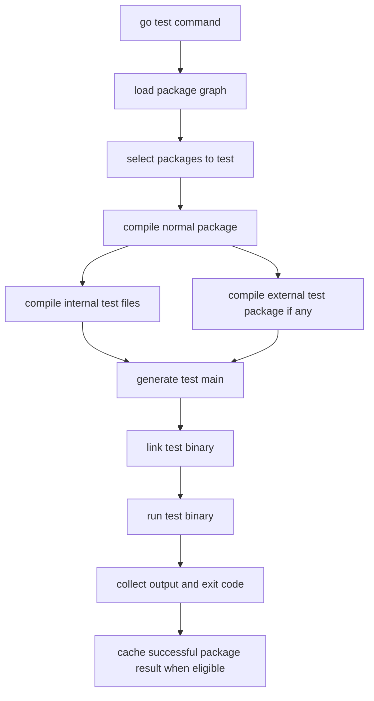
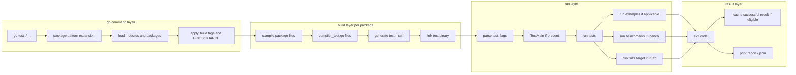
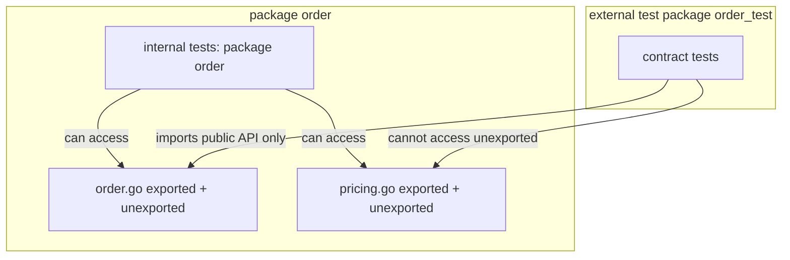

# learn-go-testing-benchmarking-performance-engineering-part-001.md

# Part 001 — Go Test Execution Model: Dari Source File ke Test Binary

> Seri: **Go Testing, Benchmarking, Performance Engineering**  
> Target pembaca: **Java software engineer yang ingin memahami Go testing secara production-grade**  
> Target Go: **Go 1.26.x**  
> Status seri: **Part 001 dari 034** — seri belum selesai.

---

## 0. Tujuan Part Ini

Part ini menjawab satu pertanyaan fundamental:

> Ketika kita menjalankan `go test`, sebenarnya apa yang terjadi?

Banyak engineer memakai `go test` sebagai command rutin:

```bash
go test ./...
```

Tetapi di codebase besar, pemahaman dangkal terhadap `go test` cepat menjadi masalah:

- test terasa “kadang jalan, kadang cached”;
- test integration diam-diam tidak jalan karena build tags;
- test butuh file tetapi gagal di CI karena asumsi working directory salah;
- test suite lambat karena salah memahami package boundary;
- test tidak mendeteksi bug karena cache test reuse;
- test helper mengubah global environment dan merusak package lain;
- `TestMain` dipakai seperti global lifecycle JUnit/Spring dan akhirnya menciptakan hidden coupling;
- external test package gagal mengakses internal details lalu engineer membuat exported API palsu hanya untuk test;
- benchmark/perf test tercampur dengan unit test sehingga PR feedback menjadi lambat.

Part ini membangun mental model bahwa `go test` bukan sekadar “runner”. Ia adalah kombinasi dari:

1. **package loader**,
2. **compiler orchestration**,
3. **generated test main**,
4. **test binary execution**,
5. **cache system**,
6. **flag router**,
7. **coverage/fuzz/race integration point**,
8. **package-level isolation boundary**.

Kalau mental model ini kuat, part berikutnya tentang test design, benchmark, fuzzing, coverage, race detector, dan CI/CD akan jauh lebih masuk akal.

---

## 1. Core Mental Model

Di Java, kita sering berpikir test sebagai:

```text
source code -> build tool -> JUnit runner -> test classes -> assertions
```

Di Go, modelnya lebih dekat ke:

```text
package source + test source -> generated test main -> compiled test binary -> execute binary -> report result
```

Artinya, untuk setiap package yang dites, Go biasanya membangun sebuah **test binary** khusus. Binary itu berisi:

- kode package under test;
- file test internal dalam package yang sama;
- file test external dalam package `_test` terpisah;
- generated test harness;
- daftar `TestXxx`, `BenchmarkXxx`, `FuzzXxx`, dan `ExampleXxx` yang valid;
- logic untuk menjalankan test sesuai flag.

Secara konseptual:



Hal penting: Go test boundary adalah **package**, bukan class, bukan module, bukan service.

Ini berbeda dari Java/JUnit yang biasa mengelompokkan test per class atau per suite. Di Go, test discovery dan execution sangat terikat pada package.

---

## 2. Unit Eksekusi: Package, Bukan File

Ketika menjalankan:

```bash
go test ./internal/order
```

Go tidak menjalankan satu file. Go menjalankan test untuk **satu package**:

```text
./internal/order
```

Semua file `.go` non-test dalam package itu akan ikut dikompilasi, kecuali dikecualikan oleh build constraint. Semua file `_test.go` yang match package itu juga dipertimbangkan.

Contoh layout:

```text
internal/order/
  order.go
  pricing.go
  repository.go
  order_test.go
  pricing_test.go
```

Command:

```bash
go test ./internal/order
```

Akan membangun package `order` dari:

```text
order.go
pricing.go
repository.go
```

lalu menambahkan test dari:

```text
order_test.go
pricing_test.go
```

Jadi test di `pricing_test.go` bisa memanggil function di `order.go` dan `repository.go` kalau berada di package yang sama.

### Implikasi desain

Kalau sebuah package terlalu besar, test binary-nya juga menjadi terlalu luas. Gejala yang muncul:

- test package lambat walaupun hanya satu area berubah;
- fixture global makin banyak;
- setup test menjadi shared dan rapuh;
- test internal terlalu mudah mengakses detail yang seharusnya tidak diketahui;
- package boundary tidak lagi membantu reasoning.

Di Go, package kecil dan cohesive bukan hanya soal compile-time design. Itu juga menentukan kualitas test execution.

---

## 3. Bentuk File Test: `_test.go`

Go hanya mengenali file test jika namanya berakhir dengan:

```text
_test.go
```

Contoh valid:

```text
order_test.go
pricing_engine_test.go
integration_test.go
```

Contoh tidak valid sebagai test file:

```text
order_tests.go
order.test.go
OrderTest.go
```

File `_test.go` hanya ikut saat `go test`, tidak ikut `go build` normal.

Contoh:

```go
// order.go
package order

type Order struct {
    ID string
}

func IsValid(o Order) bool {
    return o.ID != ""
}
```

```go
// order_test.go
package order

import "testing"

func TestIsValid(t *testing.T) {
    got := IsValid(Order{ID: "A-001"})
    if !got {
        t.Fatalf("expected valid order")
    }
}
```

Command:

```bash
go test
```

akan mengompilasi `order.go` dan `order_test.go` ke test binary.

Command:

```bash
go build
```

tidak mengikutsertakan `order_test.go`.

---

## 4. Test Function Discovery

Go tidak memakai annotation seperti JUnit. Discovery test berbasis nama dan signature.

Bentuk utama:

```go
func TestXxx(t *testing.T)
func BenchmarkXxx(b *testing.B)
func FuzzXxx(f *testing.F)
func ExampleXxx()
```

Contoh:

```go
func TestNormalizeEmail(t *testing.T) {}
func BenchmarkNormalizeEmail(b *testing.B) {}
func FuzzNormalizeEmail(f *testing.F) {}
func ExampleNormalizeEmail() {}
```

Nama setelah prefix harus mengikuti aturan exported-like identifier pattern. Dalam praktik, pakai nama yang jelas dan stabil:

```go
func TestPriceCalculator_AppliesTieredDiscount(t *testing.T) {}
func TestPriceCalculator_RejectsNegativeQuantity(t *testing.T) {}
```

### Tidak ada magic annotation

Tidak ada:

```java
@Test
@ParameterizedTest
@BeforeEach
@AfterEach
```

Go lebih explicit:

- setup lokal ditulis langsung dalam test;
- setup reusable dibuat helper function;
- teardown memakai `t.Cleanup`;
- table-driven test memakai loop + `t.Run`;
- package lifecycle memakai `TestMain` jika benar-benar perlu.

---

## 5. Internal Test Package vs External Test Package

Ini salah satu konsep paling penting.

Dalam Go, file test bisa menggunakan salah satu dari dua package name:

### 5.1 Internal test package

```go
package order
```

Artinya test berada di package yang sama dengan code under test.

Ia bisa mengakses:

- exported identifier;
- unexported identifier;
- package-level variable;
- helper private;
- type private.

Contoh:

```go
// calculator.go
package order

func normalizeSKU(s string) string {
    // unexported helper
    return strings.ToUpper(strings.TrimSpace(s))
}
```

```go
// calculator_test.go
package order

import "testing"

func TestNormalizeSKU(t *testing.T) {
    got := normalizeSKU(" abc ")
    if got != "ABC" {
        t.Fatalf("got %q", got)
    }
}
```

Kelebihan:

- cocok untuk testing internal invariant;
- tidak memaksa API diexport hanya untuk test;
- bagus untuk complex algorithm, parser, state machine, codec internal.

Kekurangan:

- test bisa terlalu tahu implementation detail;
- refactor internal mudah memecahkan test meski behavior publik tetap benar;
- risiko test menjadi white-box berlebihan.

### 5.2 External test package

```go
package order_test
```

Artinya test berada di package berbeda. Ia harus mengimpor package under test seperti consumer biasa.

Contoh:

```go
// order_test.go
package order_test

import (
    "testing"

    "example.com/shop/internal/order"
)

func TestOrderValidation(t *testing.T) {
    got := order.IsValid(order.Order{ID: "A-001"})
    if !got {
        t.Fatalf("expected valid order")
    }
}
```

Kelebihan:

- menguji API dari perspektif pengguna package;
- mencegah coupling ke internal details;
- membantu mendesain exported API yang bersih;
- cocok untuk public library, adapter boundary, dan package contract.

Kekurangan:

- tidak bisa mengakses private helper;
- kadang butuh test seam yang lebih eksplisit;
- bisa terasa verbose untuk package internal kecil.

### 5.3 Decision rule

Gunakan external test package ketika tujuan utamanya adalah:

```text
memverifikasi kontrak package dari perspektif pemakai
```

Gunakan internal test package ketika tujuan utamanya adalah:

```text
memverifikasi invariant internal yang memang penting dan tidak praktis diuji dari API publik
```

Tabel ringkas:

| Situasi | Pilihan Umum |
|---|---|
| Public library API | external test package |
| Domain package dengan API stabil | external atau kombinasi |
| Algorithm internal kompleks | internal test package |
| Parser/tokenizer internal | internal test package |
| Adapter ke external system | external untuk contract, internal untuk edge helper |
| Package kecil dengan unexported behavior penting | internal |
| Test memaksa export hanya demi test | internal lebih sehat |
| Test terlalu rapuh karena mengintip private details | external lebih sehat |

### 5.4 Kombinasi internal dan external

Satu directory bisa punya dua jenis test package:

```text
internal/order/
  order.go
  pricing.go
  pricing_internal_test.go   package order
  order_contract_test.go     package order_test
```

Ini valid. Go akan membangun test binary dengan komposisi yang sesuai.

Pola enterprise yang sehat:

- internal tests untuk invariant detail yang sulit diamati dari luar;
- external tests untuk API behavior dan package contract.

---

## 6. Generated Test Main

Ketika `go test` berjalan, Go membuat test harness. Secara konseptual, Go menghasilkan main package yang kira-kira seperti ini:

```go
package main

import (
    "os"
    "testing"
)

var tests = []testing.InternalTest{
    {"TestIsValid", TestIsValid},
}

var benchmarks = []testing.InternalBenchmark{
    {"BenchmarkIsValid", BenchmarkIsValid},
}

var fuzzTargets = []testing.InternalFuzzTarget{
    {"FuzzIsValid", FuzzIsValid},
}

func main() {
    os.Exit(testing.MainStart(testDeps{}, tests, benchmarks, fuzzTargets, examples).Run())
}
```

Kode asli generated test main adalah detail implementasi, tetapi mental model ini cukup penting:

- test adalah program executable;
- test punya `main`;
- test punya exit code;
- test flags diparse oleh test binary;
- `TestMain` bisa mengambil alih lifecycle package test;
- output test berasal dari process yang benar-benar dijalankan.

---

## 7. `TestMain`: Package-Level Lifecycle, Bukan Mini Spring Context

Signature:

```go
func TestMain(m *testing.M)
```

Contoh:

```go
package order

import (
    "os"
    "testing"
)

func TestMain(m *testing.M) {
    // global setup untuk package ini
    code := m.Run()
    // global teardown untuk package ini
    os.Exit(code)
}
```

`TestMain` berjalan sekali untuk test package tersebut. Ia berguna untuk lifecycle yang benar-benar package-wide, misalnya:

- start fake server mahal yang dipakai banyak test;
- prepare shared read-only fixture;
- initialize test-only global config;
- setup resource integration package-level.

Tetapi `TestMain` sering disalahgunakan.

### Anti-pattern `TestMain`

```go
func TestMain(m *testing.M) {
    globalDB = mustConnectSharedDatabase()
    globalRedis = mustConnectSharedRedis()
    globalClock = NewMutableClock()
    globalConfig = LoadFromEnvironment()

    os.Exit(m.Run())
}
```

Masalah:

- hidden dependency;
- test tidak self-contained;
- package test sulit dijalankan sebagian;
- parallel test rentan shared state;
- CI failure sulit didiagnosis;
- test cache bisa menjadi membingungkan;
- mutation global dari satu test bisa memengaruhi test lain.

### Rule sehat

Gunakan `TestMain` hanya jika:

1. setup benar-benar dibutuhkan oleh mayoritas test dalam package;
2. resource bisa dibuat deterministic;
3. tidak ada mutation global yang bergantung urutan test;
4. failure setup memberi pesan jelas;
5. resource cleanup reliable;
6. tidak ada alternatif lebih lokal dengan helper + `t.Cleanup`.

Sering kali lebih baik:

```go
func newTestStore(t *testing.T) *Store {
    t.Helper()

    dir := t.TempDir()
    store, err := OpenStore(dir)
    if err != nil {
        t.Fatalf("open store: %v", err)
    }

    t.Cleanup(func() {
        if err := store.Close(); err != nil {
            t.Errorf("close store: %v", err)
        }
    })

    return store
}
```

Daripada global setup di `TestMain`.

---

## 8. Local Directory Mode vs Package List Mode

`go test` punya perilaku yang berbeda tergantung cara dipanggil.

### 8.1 Local directory mode

```bash
go test
```

atau:

```bash
go test -run TestFoo
```

Ini menjalankan package di current directory.

### 8.2 Package list mode

```bash
go test ./...
go test ./internal/order ./internal/payment
go test example.com/shop/internal/order
```

Ini menjalankan daftar package eksplisit atau pattern.

Perbedaan penting: **test caching successful package result terutama relevan pada package list mode**. Dokumentasi `cmd/go` menjelaskan bahwa saat `go test` berjalan dalam package list mode, Go dapat cache successful package test results untuk menghindari repeated running yang tidak perlu. Cara idiomatik menonaktifkan test cache adalah `-count=1`.

Contoh:

```bash
go test ./...
```

Run pertama:

```text
ok   example.com/shop/internal/order    0.214s
ok   example.com/shop/internal/payment  0.381s
```

Run kedua tanpa perubahan:

```text
ok   example.com/shop/internal/order    (cached)
ok   example.com/shop/internal/payment  (cached)
```

Untuk memaksa run ulang:

```bash
go test -count=1 ./...
```

### 8.3 Kenapa ini penting?

Di Java, test runner sering diasumsikan “selalu run”. Di Go, successful test bisa diambil dari cache ketika eligible.

Ini sangat menguntungkan untuk feedback cepat, tetapi bisa menipu jika test memiliki hidden dependency yang tidak dilacak dengan benar.

Contoh test buruk:

```go
func TestReadsExternalFile(t *testing.T) {
    b, err := os.ReadFile("/tmp/order-config.json")
    if err != nil {
        t.Fatal(err)
    }
    // assert something
    _ = b
}
```

Perubahan `/tmp/order-config.json` belum tentu menjadi cache key yang diharapkan untuk test package. Lebih sehat gunakan file di package/module yang dilacak oleh Go atau resource temporary yang dibuat dalam test.

---

## 9. Test Cache: Apa yang Dicache dan Apa Risiko Mental Modelnya

Go punya build cache dan test cache.

Test cache menyimpan hasil successful package test run yang eligible. Hasil test yang gagal tidak dianggap successful reusable result.

Hal-hal yang memengaruhi cache antara lain:

- source code package;
- source code dependencies;
- relevant build flags;
- test flags yang cacheable;
- file yang dibuka test dalam package/module tertentu;
- environment variables yang dikonsultasikan test.

Dokumentasi `cmd/go` menyebut bahwa test yang membuka file dalam module package atau membaca environment variable hanya match future runs ketika file dan env tersebut tidak berubah. `go clean -testcache` dapat membersihkan cached test results, sedangkan `go clean -cache` membersihkan build cache lebih luas.

### 9.1 Command penting

```bash
# Run normal dengan cache aktif jika eligible
go test ./...

# Paksa semua test run ulang
go test -count=1 ./...

# Hapus test cache saja
go clean -testcache

# Hapus build cache juga, lebih mahal
go clean -cache

# Hapus fuzz cache
go clean -fuzzcache
```

### 9.2 Test cache bukan bug

Banyak engineer baru Go merasa `(cached)` adalah bug. Sebenarnya ini fitur besar.

Masalahnya bukan cache. Masalahnya adalah test yang tidak deterministic atau bergantung pada state eksternal tidak eksplisit.

### 9.3 Production-grade rule

Test yang aman dicache biasanya punya sifat:

- input deterministic;
- dependency explicit;
- environment dikontrol test;
- file fixture berada di `testdata` atau dibuat via `t.TempDir`;
- tidak bergantung pada waktu real kecuali dibekukan/dikontrol;
- tidak bergantung pada service eksternal yang berubah;
- tidak memakai global mutable state lintas test.

Jika sebuah test memang harus selalu jalan ulang, misalnya smoke integration ke dependency live, jangan campur dengan unit test default. Pakai build tag atau pipeline terpisah.

---

## 10. Working Directory Saat Test

Saat menjalankan test untuk sebuah package, working directory test biasanya adalah directory package tersebut.

Contoh:

```text
example.com/shop/
  internal/order/
    order.go
    order_test.go
    testdata/
      valid_order.json
```

Di `order_test.go`:

```go
func TestLoadGoldenOrder(t *testing.T) {
    b, err := os.ReadFile("testdata/valid_order.json")
    if err != nil {
        t.Fatal(err)
    }
    _ = b
}
```

Ini aman karena path relatif terhadap package directory.

### Anti-pattern

```go
os.ReadFile("../../config/test.json")
```

Masalah:

- fragile terhadap layout repo;
- bisa gagal saat package dipindahkan;
- ambiguous saat test dijalankan dari tool berbeda;
- membuat package test bergantung pada resource di luar boundary.

### Rule

- fixture package-local: simpan di `testdata` package itu;
- fixture shared: pertimbangkan helper package internal test atau generate fixture saat runtime;
- file temporary: pakai `t.TempDir`;
- jangan mengandalkan current working directory global repo root kecuali memang sedang mengetes CLI/repo-level tool.

---

## 11. `testdata`: Konvensi Penting

Directory bernama `testdata` punya makna konvensional dalam ekosistem Go.

Contoh:

```text
internal/parser/
  parser.go
  parser_test.go
  testdata/
    valid/
      invoice_001.json
    invalid/
      malformed_amount.json
```

Go tools biasanya mengabaikan directory `testdata` sebagai package source. Ia tidak dianggap package biasa untuk build/test traversal.

Kegunaan:

- golden files;
- fixture input/output;
- sample certificates;
- sample payload;
- invalid/corrupt inputs;
- fuzz seed corpus;
- CLI test scripts;
- binary fixture kecil.

### Struktur sehat

```text
testdata/
  input/
    case_001.json
  expected/
    case_001.normalized.json
  corrupt/
    truncated_header.bin
  README.md
```

Untuk fixture kompleks, tambahkan README:

```markdown
# testdata

- input/: valid payload from stable domain examples.
- expected/: normalized output generated manually, not copied from implementation.
- corrupt/: intentionally malformed files for parser error paths.
```

### Anti-pattern golden file

- expected file dibuat dari output implementasi yang sama tanpa review;
- fixture terlalu besar tanpa dokumentasi;
- fixture mengandung PII/secret;
- fixture berubah tanpa alasan domain;
- test hanya membandingkan blob besar tanpa memberi diff bermakna.

---

## 12. Environment Variables dalam Test

Go menyediakan helper:

```go
func (t *T) Setenv(key, value string)
```

Gunakan `t.Setenv`, bukan manual `os.Setenv` + `defer os.Unsetenv`, karena `t.Setenv` otomatis restore environment setelah test selesai.

Contoh:

```go
func TestLoadConfigFromEnv(t *testing.T) {
    t.Setenv("ORDER_TIMEOUT_MS", "250")

    cfg, err := LoadConfigFromEnv()
    if err != nil {
        t.Fatal(err)
    }

    if cfg.TimeoutMS != 250 {
        t.Fatalf("TimeoutMS = %d, want 250", cfg.TimeoutMS)
    }
}
```

### Hati-hati dengan parallel test

Environment adalah process-global. Karena itu, test yang mengubah environment tidak cocok dengan `t.Parallel` jika ada kemungkinan overlap dengan test lain yang membaca/mengubah env.

Anti-pattern:

```go
func TestA(t *testing.T) {
    t.Parallel()
    t.Setenv("MODE", "A")
    // ...
}

func TestB(t *testing.T) {
    t.Parallel()
    t.Setenv("MODE", "B")
    // ...
}
```

Ini berbahaya karena environment adalah shared process state.

Rule:

- test config function sebaiknya menerima explicit source;
- environment parsing dibatasi di boundary;
- unit test untuk env parser jangan parallel;
- business logic jangan membaca env langsung.

Desain lebih baik:

```go
type EnvLookup func(string) (string, bool)

func LoadConfig(lookup EnvLookup) (Config, error) {
    raw, ok := lookup("ORDER_TIMEOUT_MS")
    if !ok {
        return DefaultConfig(), nil
    }
    // parse raw
}
```

Test:

```go
func TestLoadConfig(t *testing.T) {
    env := map[string]string{
        "ORDER_TIMEOUT_MS": "250",
    }

    cfg, err := LoadConfig(func(k string) (string, bool) {
        v, ok := env[k]
        return v, ok
    })
    if err != nil {
        t.Fatal(err)
    }

    if cfg.TimeoutMS != 250 {
        t.Fatalf("TimeoutMS = %d, want 250", cfg.TimeoutMS)
    }
}
```

---

## 13. Build Tags dan Test Selection

Go build constraints bisa mengontrol apakah file ikut build/test.

Contoh:

```go
//go:build integration

package order_test

import "testing"

func TestOrderRepository_Postgres(t *testing.T) {
    // integration test
}
```

File ini hanya ikut jika command memakai tag:

```bash
go test -tags=integration ./...
```

Tanpa tag:

```bash
go test ./...
```

file tersebut tidak masuk test binary.

### Production-grade layout

```text
internal/order/
  service.go
  service_test.go                  # fast unit/component tests
  repository_postgres_test.go       #go:build integration
  repository_contract_test.go       # fast fake-based contract tests
```

### Jangan sembunyikan test penting

Build tag bagus untuk test mahal atau butuh dependency eksternal. Namun jangan memakai build tag untuk menyembunyikan test yang seharusnya selalu menjaga correctness.

Rule umum:

| Test Type | Default PR `go test ./...`? | Tag? |
|---|---:|---:|
| Unit deterministic | Ya | Tidak |
| Component fake/in-memory | Ya | Tidak |
| Race suite | Bisa schedule khusus | Tidak selalu |
| Integration DB real | Tidak selalu | `integration` |
| E2E service stack | Tidak | `e2e` atau pipeline terpisah |
| Load/perf | Tidak | pipeline khusus |
| Fuzz long-running | Tidak | fuzz job khusus |

---

## 14. `go test` Flag Routing: Go Flags vs Test Binary Flags

`go test` memiliki dua lapisan flag:

1. flag untuk `go` command;
2. flag untuk test binary.

Contoh umum:

```bash
go test -run TestPrice ./internal/order
```

`-run` diteruskan untuk mengatur test selection.

Contoh benchmark:

```bash
go test -bench=BenchmarkPrice -benchmem ./internal/order
```

Contoh meneruskan argument custom ke test binary:

```bash
go test ./internal/order -args -fixture-dir=/tmp/fixtures
```

Tetapi custom args sebaiknya jarang dipakai. Untuk test production-grade, lebih baik dependency test dibuat eksplisit melalui fixture lokal, env controlled, atau helper.

### Flag penting untuk part ini

```bash
# Jalankan semua test di current package
go test

# Jalankan semua package di module subtree
go test ./...

# Jalankan test tertentu
go test -run '^TestOrderValidation$' ./internal/order

# Jalankan subtest tertentu
go test -run 'TestPriceCalculator/discount' ./internal/order

# Paksa run ulang, bypass test cache
go test -count=1 ./...

# Verbose output
go test -v ./internal/order

# Stop setelah failure pertama di package test binary
go test -failfast ./internal/order

# Jalankan race detector
go test -race ./...

# Jalankan short mode
go test -short ./...

# Timeout package test binary
go test -timeout=30s ./...

# Shuffle order test
go test -shuffle=on ./...

# Build tags
go test -tags=integration ./...
```

---

## 15. Test Cache dan Flags: Kenapa `-count=1` Penting

Untuk debugging, biasakan:

```bash
go test -count=1 ./...
```

Untuk CI PR fast path, cache bisa membantu, tetapi CI clean environment sering membuat cache tidak seefektif local developer machine kecuali build cache dipertahankan antar job.

Untuk flaky test investigation:

```bash
go test -count=100 -run '^TestSuspicious$' ./internal/order
```

Untuk parallel interaction:

```bash
go test -count=100 -shuffle=on ./internal/order
```

Untuk race-sensitive:

```bash
go test -race -count=50 -run '^TestConcurrentUpdate$' ./internal/order
```

Hati-hati: `-count=100` menjalankan test berulang dalam package test process sesuai semantics testing. Test yang punya global state bisa gagal karena tidak reset antar run.

Itu justru sinyal bagus: test tidak isolated.

---

## 16. Package Pattern `./...`

Command paling umum:

```bash
go test ./...
```

Artinya: test semua package di bawah current module/directory tree yang match pattern.

Tetapi `./...` bukan berarti “semua hal yang mungkin dites”. Ia tidak otomatis menjalankan:

- file dengan build tag yang tidak aktif;
- fuzzing long-running;
- benchmark;
- external system test yang dikecualikan;
- package di module lain jika workspace/multi-module tidak disusun seperti itu;
- script-level E2E di luar Go package.

### Di monorepo/multi-module

Misal:

```text
repo/
  go.work
  services/order/go.mod
  services/payment/go.mod
  libs/auth/go.mod
```

`go test ./...` dari root bisa berbeda efeknya tergantung workspace dan directory. Untuk CI besar, lebih sehat eksplisit:

```bash
(cd services/order && go test ./...)
(cd services/payment && go test ./...)
(cd libs/auth && go test ./...)
```

atau pakai orchestrator script yang sadar module boundary.

---

## 17. Import Cycle dan Test Package

Go melarang import cycle.

External test package bisa membantu mendeteksi desain package yang cyclic atau terlalu tightly coupled.

Contoh buruk:

```text
internal/order imports internal/payment
internal/payment imports internal/order
```

Ini tidak compile.

Dalam test, kadang engineer membuat helper package yang malah menciptakan cycle.

Anti-pattern:

```text
internal/order
internal/order/testhelper imports internal/order
internal/payment tests import internal/order/testhelper
```

Kalau tidak hati-hati, helper test bisa menjadi coupling hub.

Pola lebih sehat:

```text
internal/testsupport/orderfixture
internal/testsupport/paymentfixture
```

Tetapi jangan membuat `testsupport` menjadi “god package”. Ia harus berisi fixture stable, bukan shortcut ke semua internal state.

---

## 18. Test Helper Placement

Pilihan lokasi helper:

### 18.1 Helper lokal di file test

Bagus untuk helper yang hanya dipakai satu file.

```go
func mustParseOrder(t *testing.T, raw string) Order {
    t.Helper()

    o, err := ParseOrder([]byte(raw))
    if err != nil {
        t.Fatalf("parse order: %v", err)
    }
    return o
}
```

### 18.2 Helper package test internal

Bagus untuk helper yang dipakai satu package.

```text
internal/order/
  order_test.go
  test_helpers_test.go
```

File helper tetap `_test.go`, sehingga tidak ikut production build.

### 18.3 Shared helper package

Bagus untuk fixture lintas package, tetapi harus dijaga ketat.

```text
internal/testsupport/
  clock/
  fixtures/
  httptestx/
```

Rule:

- helper harus memperjelas test, bukan menyembunyikan assertion penting;
- helper harus menerima `testing.TB`, bukan hanya `*testing.T`, jika dipakai test dan benchmark;
- helper harus memanggil `t.Helper()`;
- helper tidak boleh mutate global state tanpa cleanup.

Contoh:

```go
func NewTestClock(t testing.TB, start time.Time) *Clock {
    t.Helper()
    return &Clock{now: start}
}
```

---

## 19. `testing.TB`: Abstraksi untuk Test dan Benchmark Helper

`testing.TB` adalah interface yang diimplementasikan oleh `*testing.T` dan `*testing.B`.

Gunakan saat helper bisa dipakai baik oleh test maupun benchmark.

Contoh:

```go
func mustLoadFixture(tb testing.TB, name string) []byte {
    tb.Helper()

    b, err := os.ReadFile(filepath.Join("testdata", name))
    if err != nil {
        tb.Fatalf("load fixture %s: %v", name, err)
    }
    return b
}
```

Dipakai di test:

```go
func TestParseOrder(t *testing.T) {
    raw := mustLoadFixture(t, "order.json")
    // ...
}
```

Dipakai di benchmark:

```go
func BenchmarkParseOrder(b *testing.B) {
    raw := mustLoadFixture(b, "order.json")
    // ...
}
```

---

## 20. Exit Code dan Failure Semantics

`go test` mengembalikan exit code non-zero jika test gagal, build gagal, panic tidak tertangani, timeout, race detector menemukan race, atau masalah fatal lain.

Dalam test:

```go
t.Error("message")   // mark failed, lanjut
t.Fatal("message")   // mark failed, stop goroutine test saat itu
```

Dalam helper goroutine, hati-hati:

```go
func TestAsync(t *testing.T) {
    go func() {
        t.Fatal("bad") // berbahaya secara desain; Fatal hanya menghentikan goroutine ini
    }()
}
```

Lebih sehat kirim error ke channel dan assert di goroutine utama test.

```go
func TestAsync(t *testing.T) {
    errCh := make(chan error, 1)

    go func() {
        errCh <- doWork()
    }()

    if err := <-errCh; err != nil {
        t.Fatalf("do work: %v", err)
    }
}
```

---

## 21. Output, Logging, dan Verbose Mode

`t.Log` hanya terlihat untuk test gagal atau saat `-v`.

```go
func TestSomething(t *testing.T) {
    t.Log("diagnostic detail")
}
```

Run:

```bash
go test ./internal/order
```

Mungkin tidak menampilkan log jika test pass.

Run:

```bash
go test -v ./internal/order
```

akan menampilkan log.

### Rule logging test

- pakai `t.Logf` untuk diagnostic tambahan;
- failure message harus tetap cukup tanpa harus melihat log panjang;
- jangan spam log di test yang sering jalan;
- untuk flaky investigation, tambahkan structured diagnostic sementara, lalu rapikan.

Failure message buruk:

```go
t.Fatalf("wrong result")
```

Lebih baik:

```go
t.Fatalf("CalculateTotal(%+v) = %d, want %d", input, got, want)
```

---

## 22. Timeout Model

Default `go test` memiliki timeout package-level. Bisa diset:

```bash
go test -timeout=30s ./...
```

Jika timeout terjadi, test binary akan panic dengan diagnostic goroutine dump.

Timeout penting untuk mencegah CI menggantung, tetapi jangan menjadikan timeout sebagai control flow normal.

Anti-pattern:

```go
func TestEventually(t *testing.T) {
    time.Sleep(5 * time.Second)
    // assert
}
```

Lebih baik gunakan polling dengan deadline pendek dan diagnostic jelas:

```go
func eventually(t *testing.T, timeout time.Duration, check func() bool) {
    t.Helper()

    deadline := time.Now().Add(timeout)
    for time.Now().Before(deadline) {
        if check() {
            return
        }
        time.Sleep(10 * time.Millisecond)
    }
    t.Fatalf("condition not met within %s", timeout)
}
```

Namun untuk concurrency deterministic, part lain akan membahas `testing/synctest` dan coordination pattern agar tidak bergantung pada real sleep.

---

## 23. `go test -c`: Build Test Binary Tanpa Menjalankan

Command:

```bash
go test -c ./internal/order
```

akan membangun test binary.

Kegunaan:

- debug test binary;
- menjalankan test binary manual;
- inspect behavior;
- performance investigation tertentu;
- reproduce issue di environment terkontrol.

Contoh:

```bash
go test -c -o order.test ./internal/order
./order.test -test.v -test.run '^TestOrderValidation$'
```

Flag test binary biasanya memakai prefix `-test.` ketika binary dijalankan langsung.

---

## 24. Compile-Time Failure Adalah Test Failure

Karena `go test` mengompilasi package dan test, banyak failure terjadi sebelum test run:

- syntax error;
- type error;
- import cycle;
- missing dependency;
- build constraint mismatch;
- unused import;
- unused variable;
- generated code outdated;
- incompatible Go version.

Ini bagus. Go test suite punya compile-time gate kuat.

Contoh:

```bash
go test ./...
```

bisa gagal karena package tanpa test pun tidak compile.

Karena itu, dalam Go, `go test ./...` sering berfungsi sebagai:

```text
compile all packages + run tests
```

Bukan hanya run tests.

---

## 25. Test Cache vs Non-Determinism: Contoh Kasus

Misal test:

```go
func TestPromotionActive(t *testing.T) {
    promo := Promotion{
        StartsAt: time.Now().Add(-time.Hour),
        EndsAt:   time.Now().Add(time.Hour),
    }

    if !promo.Active(time.Now()) {
        t.Fatalf("expected promotion active")
    }
}
```

Test ini tampak pass, tetapi:

- memakai real time;
- input berubah tiap run;
- tidak memberi invariant jelas;
- sulit direproduksi jika failure edge terjadi.

Lebih baik:

```go
func TestPromotionActive(t *testing.T) {
    now := time.Date(2026, 6, 23, 10, 0, 0, 0, time.UTC)

    promo := Promotion{
        StartsAt: now.Add(-time.Hour),
        EndsAt:   now.Add(time.Hour),
    }

    if !promo.Active(now) {
        t.Fatalf("expected promotion active at %s", now)
    }
}
```

Lebih baik lagi, test boundary:

```go
func TestPromotionActive_Boundaries(t *testing.T) {
    base := time.Date(2026, 6, 23, 10, 0, 0, 0, time.UTC)

    tests := []struct {
        name string
        now  time.Time
        want bool
    }{
        {"before start", base.Add(-time.Nanosecond), false},
        {"at start", base, true},
        {"during window", base.Add(time.Minute), true},
        {"at end", base.Add(time.Hour), false},
    }

    promo := Promotion{StartsAt: base, EndsAt: base.Add(time.Hour)}

    for _, tt := range tests {
        t.Run(tt.name, func(t *testing.T) {
            got := promo.Active(tt.now)
            if got != tt.want {
                t.Fatalf("Active(%s) = %v, want %v", tt.now, got, tt.want)
            }
        })
    }
}
```

---

## 26. Package-Level State: Musuh Test Isolation

Go package bisa punya global variable:

```go
var defaultTimeout = 5 * time.Second
```

Test bisa mengubahnya:

```go
func TestWithShortTimeout(t *testing.T) {
    defaultTimeout = 10 * time.Millisecond
    // ...
}
```

Ini buruk jika tidak restore.

Lebih baik:

```go
func TestWithShortTimeout(t *testing.T) {
    old := defaultTimeout
    defaultTimeout = 10 * time.Millisecond
    t.Cleanup(func() { defaultTimeout = old })

    // ...
}
```

Lebih baik lagi: hindari global mutable config.

```go
type Client struct {
    timeout time.Duration
}
```

Test:

```go
client := NewClient(ClientConfig{Timeout: 10 * time.Millisecond})
```

### Rule

Global state membuat test:

- susah parallel;
- susah dicache dengan confidence;
- order-dependent;
- rentan flaky;
- sulit di-shard;
- sulit dibenchmark secara benar.

---

## 27. Test Execution Order

Jangan bergantung pada urutan test.

Walaupun output sering terlihat berurutan secara nama/source, Go tidak memberi kontrak yang seharusnya dipakai untuk dependency antar test.

Buruk:

```go
func TestCreateUser(t *testing.T) {
    // create user in shared DB
}

func TestUpdateUser(t *testing.T) {
    // assumes user from TestCreateUser exists
}
```

Lebih baik:

```go
func TestUpdateUser(t *testing.T) {
    db := newTestDB(t)
    user := createUserFixture(t, db)

    // update user
}
```

Untuk mendeteksi hidden order dependency:

```bash
go test -shuffle=on -count=50 ./...
```

---

## 28. Subtest Execution Model Singkat

Subtest dibuat dengan:

```go
t.Run("case name", func(t *testing.T) {
    // subtest body
})
```

Contoh:

```go
func TestNormalizeSKU(t *testing.T) {
    tests := []struct {
        name string
        in   string
        want string
    }{
        {"trim spaces", " abc ", "ABC"},
        {"already upper", "ABC", "ABC"},
    }

    for _, tt := range tests {
        t.Run(tt.name, func(t *testing.T) {
            got := NormalizeSKU(tt.in)
            if got != tt.want {
                t.Fatalf("got %q, want %q", got, tt.want)
            }
        })
    }
}
```

Subtest penting karena:

- bisa dipilih via `-run`;
- memberi report granular;
- bisa parallel per case jika aman;
- membantu matrix test.

Part khusus table-driven/subtests akan membahas lebih dalam.

---

## 29. Relationship dengan Benchmarks, Fuzz, dan Examples

`go test` bukan hanya unit test runner. Ia juga entrypoint untuk:

### Benchmark

```bash
go test -bench=. ./internal/order
```

Benchmark function tidak berjalan dalam normal `go test` kecuali diminta dengan `-bench`.

### Fuzz

```bash
go test -fuzz=FuzzParseOrder ./internal/parser
```

Fuzz target bisa punya seed corpus dan fuzz cache.

### Example

```go
func ExampleNormalizeSKU() {
    fmt.Println(NormalizeSKU(" abc "))
    // Output: ABC
}
```

Example bisa menjadi test jika ada output comment.

Mental modelnya tetap sama: semua dimasukkan ke test binary package.

---

## 30. Race Detector sebagai Mode Test Berbeda

Command:

```bash
go test -race ./...
```

`-race` mengubah build dan runtime instrumentation. Ini bukan sekadar flag ringan.

Konsekuensi:

- lebih lambat;
- memory lebih besar;
- timing berubah;
- beberapa race lebih mudah muncul, beberapa interleaving bisa berubah;
- hasil race adalah failure serius.

Jangan selalu wajibkan `-race` di setiap local fast loop, tetapi jadikan bagian dari CI gate atau scheduled gate untuk package concurrency-sensitive.

---

## 31. Coverage sebagai Mode Test Berbeda

Command:

```bash
go test -cover ./...
```

Coverage menambahkan instrumentation. Ini bisa memengaruhi performance dan timing.

Jangan mengambil kesimpulan benchmark dari binary yang diinstrument coverage.

Rule:

- coverage untuk quality signal;
- benchmark tanpa coverage instrumentation;
- race dan coverage bisa dipakai untuk confidence, tetapi bukan measurement performance final.

---

## 32. Mapping Mental Model dari Java ke Go

| Java/JUnit/Maven/Gradle | Go |
|---|---|
| Test class | Test function |
| Test suite | Package test binary / command pattern |
| Annotation discovery | Naming + signature discovery |
| `@BeforeEach` | helper function per test |
| `@AfterEach` | `t.Cleanup` |
| `@BeforeAll` | `TestMain`, rarely needed |
| Parameterized test | table-driven test + subtests |
| Mockito-heavy tests | small interfaces + fakes/stubs/spies |
| Maven module | Go module, but test execution usually package-based |
| JUnit runner | generated test main + `testing` package |
| Surefire report | `go test` output / `-json` output |
| Test profile | build tags / flags / CI jobs |

Yang paling penting: jangan membawa mental model Spring test context ke Go. Go test yang sehat cenderung:

- explicit;
- local;
- package-scoped;
- deterministic;
- small fixture;
- minimal global lifecycle;
- fast by default.

---

## 33. Engineering Decision Matrix

### 33.1 Ketika membuat test baru

Tanya:

```text
Apakah behavior ini bisa diuji dari API package?
```

Jika ya, mulai dari external/package-level behavior test.

```text
Apakah invariant internal penting dan sulit diamati dari luar?
```

Jika ya, tambahkan internal test package.

```text
Apakah test butuh dependency nyata?
```

Jika tidak, gunakan fake/in-memory.

Jika ya, masukkan ke integration test dengan tag/pipeline jelas.

```text
Apakah test butuh waktu nyata, env global, atau filesystem global?
```

Jika ya, redesign agar deterministic.

### 33.2 Ketika test lambat

Cari:

- package terlalu besar;
- shared `TestMain` mahal;
- integration test masuk default path;
- sleep real time;
- fixture besar;
- network dependency;
- no test cache due to flags/script;
- parallelism tidak dimanfaatkan;
- global lock/shared resource.

### 33.3 Ketika test flaky

Cari:

- order dependency;
- real time dependency;
- goroutine leak;
- global state;
- parallel test unsafe;
- env mutation;
- port collision;
- filesystem shared path;
- eventual consistency tanpa deterministic wait;
- external service dependency.

---

## 34. Recommended Command Baseline

### Local fast loop

```bash
go test ./...
```

### Local no-cache verification

```bash
go test -count=1 ./...
```

### Specific test

```bash
go test -run '^TestOrderValidation$' ./internal/order
```

### Specific subtest

```bash
go test -run 'TestPriceCalculator/discount' ./internal/order
```

### Flaky investigation

```bash
go test -count=100 -shuffle=on ./internal/order
```

### Race check

```bash
go test -race ./...
```

### Integration tagged

```bash
go test -tags=integration -count=1 ./...
```

### Coverage

```bash
go test -coverprofile=coverage.out ./...
go tool cover -html=coverage.out
```

### Build test binary

```bash
go test -c -o order.test ./internal/order
```

### JSON output for CI tooling

```bash
go test -json ./...
```

---

## 35. Mermaid Diagram: `go test` Execution Layers



---

## 36. Mermaid Diagram: Internal vs External Test Package



---

## 37. Checklist: Test Execution Model Mastery

Sebelum lanjut ke part berikutnya, pastikan Anda bisa menjawab:

- Apa unit utama eksekusi `go test`?
- Apa perbedaan local directory mode dan package list mode?
- Kapan test result bisa muncul `(cached)`?
- Bagaimana cara memaksa test run ulang?
- Apa perbedaan `package foo` dan `package foo_test` di file test?
- Apa risiko memakai `TestMain`?
- Kenapa `testdata` penting?
- Kenapa test yang mutate env tidak aman untuk parallel?
- Kenapa `go test ./...` tidak otomatis menjalankan benchmark?
- Kenapa benchmark tidak boleh diukur dengan coverage/race instrumentation?
- Kapan memakai build tag untuk test?
- Bagaimana cara menjalankan satu subtest saja?
- Bagaimana cara membangun test binary tanpa menjalankannya?

---

## 38. Latihan Praktis

Buat module kecil:

```bash
mkdir go-test-model-lab
cd go-test-model-lab
go mod init example.com/go-test-model-lab
mkdir -p internal/order
```

Buat file:

```go
// internal/order/order.go
package order

import "strings"

type Order struct {
    ID  string
    SKU string
}

func IsValid(o Order) bool {
    return strings.TrimSpace(o.ID) != "" && normalizeSKU(o.SKU) != ""
}

func normalizeSKU(s string) string {
    return strings.ToUpper(strings.TrimSpace(s))
}
```

Buat internal test:

```go
// internal/order/order_internal_test.go
package order

import "testing"

func TestNormalizeSKU(t *testing.T) {
    got := normalizeSKU(" abc ")
    if got != "ABC" {
        t.Fatalf("normalizeSKU() = %q, want %q", got, "ABC")
    }
}
```

Buat external test:

```go
// internal/order/order_contract_test.go
package order_test

import (
    "testing"

    "example.com/go-test-model-lab/internal/order"
)

func TestIsValid(t *testing.T) {
    got := order.IsValid(order.Order{ID: "O-001", SKU: "abc"})
    if !got {
        t.Fatalf("expected order valid")
    }
}
```

Jalankan:

```bash
go test ./...
go test ./...
go test -count=1 ./...
go test -v ./internal/order
go test -run '^TestNormalizeSKU$' ./internal/order
go test -run '^TestIsValid$' ./internal/order
go test -c -o order.test ./internal/order
```

Amati:

- kapan muncul `(cached)`;
- bagaimana nama package test terlihat;
- apakah external test bisa memanggil `normalizeSKU`;
- bagaimana output berubah dengan `-v`;
- bagaimana test binary bisa dibuat manual.

---

## 39. Failure-Mode Lab

Tambahkan test buruk:

```go
func TestBadGlobalTime(t *testing.T) {
    if time.Now().Year() < 2020 {
        t.Fatalf("unexpected year")
    }
}
```

Lalu pikirkan:

- Apakah test ini deterministic?
- Apa invariant sebenarnya?
- Apakah test ini membuktikan behavior domain?
- Apakah test ini aman dicache?

Tambahkan env test:

```go
func TestEnv(t *testing.T) {
    t.Setenv("ORDER_MODE", "strict")
    // assert config parser here
}
```

Lalu coba jadikan parallel dan pahami kenapa itu buruk jika ada test lain membaca env.

---

## 40. Production Policy Template

Untuk engineering handbook, Anda bisa memakai policy awal berikut:

```markdown
# Go Test Execution Policy

1. Default PR command is `go test ./...`.
2. Unit and component tests must be deterministic and cache-friendly.
3. Tests must not depend on wall-clock time unless time is explicitly injected or controlled.
4. Tests must not depend on external services in the default test path.
5. Integration tests requiring real dependencies must use build tags or dedicated CI jobs.
6. Test fixtures must live in package-local `testdata` or be generated via `t.TempDir`.
7. Shared environment mutation must use `t.Setenv` and must not be combined with parallel tests.
8. `TestMain` requires justification and must not become a hidden application container.
9. External package tests should be preferred for public package contracts.
10. Internal package tests are allowed for important implementation invariants.
11. `-count=1` is required for no-cache verification and flaky investigations.
12. Race, coverage, fuzz, benchmark, and load tests are separate confidence layers, not replacements for fast default tests.
```

---

## 41. Common Misconceptions

### Misconception 1: “`go test ./...` selalu menjalankan semua test.”

Tidak. Ia hanya menjalankan test yang masuk package selection dan build constraints aktif. Benchmark, fuzz long-running, tagged integration, dan external E2E tidak otomatis berjalan.

### Misconception 2: “`(cached)` berarti test tidak valid.”

Tidak. Cache adalah fitur. Yang tidak valid adalah test yang hidden dependency-nya tidak eksplisit.

### Misconception 3: “Semua setup harus masuk `TestMain`.”

Tidak. Setup terbaik biasanya lokal per test/helper dengan `t.Cleanup`.

### Misconception 4: “External test package selalu lebih baik.”

Tidak. External test bagus untuk contract. Internal test tetap penting untuk invariant private yang meaningful.

### Misconception 5: “Test file bisa dipakai production code.”

Tidak. `_test.go` hanya untuk `go test`.

### Misconception 6: “Kalau test pass dengan `-race`, berarti tidak ada concurrency bug.”

Tidak. Race detector mendeteksi data race yang terjadi pada eksekusi tersebut; ia bukan proof lengkap semua interleaving aman.

### Misconception 7: “Coverage tinggi berarti test bagus.”

Tidak. Coverage menunjukkan statement yang tersentuh, bukan kualitas assertion atau correctness invariant.

---

## 42. Ringkasan

`go test` adalah sistem eksekusi berbasis package yang membangun test binary khusus, menjalankan generated test harness, dan dapat melakukan cache successful package results. File `_test.go` tidak ikut production build. Test discovery berbasis naming/signature, bukan annotation. Package name di test menentukan apakah test bersifat internal white-box atau external contract-style.

Pemahaman execution model ini penting karena banyak keputusan engineering di Go bergantung padanya:

- ukuran package memengaruhi test binary dan feedback loop;
- `testdata` dan working directory menentukan fixture strategy;
- cache mendorong deterministic tests;
- `TestMain` harus dipakai hemat;
- build tags memisahkan fast default tests dari expensive dependency tests;
- external test package membantu menjaga API contract;
- internal test package menjaga invariant penting tanpa export palsu;
- race/coverage/benchmark/fuzz adalah mode berbeda dengan konsekuensi berbeda.

Jika part 000 adalah kontrak seri, part 001 adalah fondasi mekanik: Anda sekarang tahu apa yang sebenarnya terjadi saat `go test` dijalankan.

---

## 43. Referensi Resmi

- Go command documentation, terutama bagian `go test`, package list mode, test flags, dan test caching: `https://pkg.go.dev/cmd/go`
- Go `testing` package documentation: `https://pkg.go.dev/testing`
- Go release notes 1.26: `https://go.dev/doc/go1.26`
- Go release history: `https://go.dev/doc/devel/release`
- Go command cache cleaning help, termasuk `go clean -testcache` dan `go clean -fuzzcache`: `https://pkg.go.dev/cmd/go/internal/help`

---

## 44. Status Seri

- Part saat ini: **001**
- Total rencana: **034**
- Status: **belum selesai**

Part berikutnya:

```text
learn-go-testing-benchmarking-performance-engineering-part-002.md
```

Topik berikutnya: **Testing Taxonomy: Unit, Component, Integration, Contract, E2E, Smoke, Soak**.

<!-- NAVIGATION_FOOTER -->
<div class="page-nav">
<a href="./learn-go-testing-benchmarking-performance-engineering-part-000.md">⬅️ Go Testing, Benchmarking, Performance Engineering — Part 000</a>
<a href="./index.md">📚 Kategori</a>
<a href="../../index.md">🏠 Home</a>
<a href="./learn-go-testing-benchmarking-performance-engineering-part-002.md">Part 002 — Testing Taxonomy: Unit, Component, Integration, Contract, E2E, Smoke, Soak ➡️</a>
</div>
