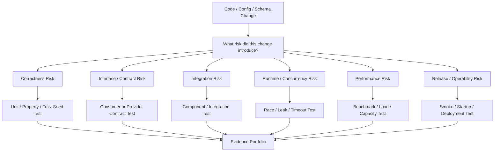
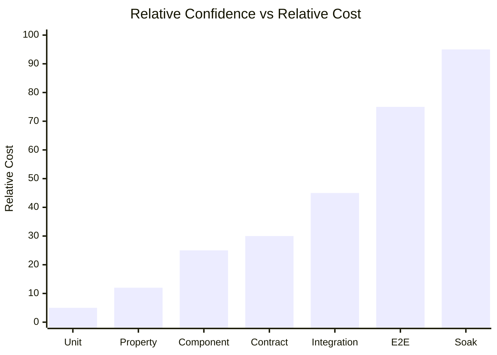
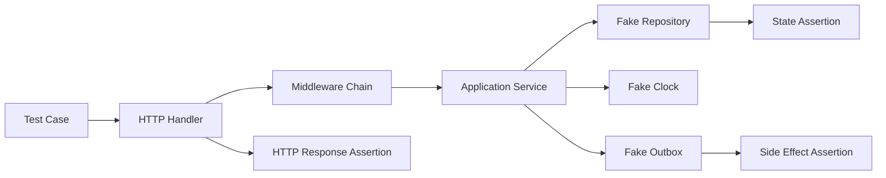
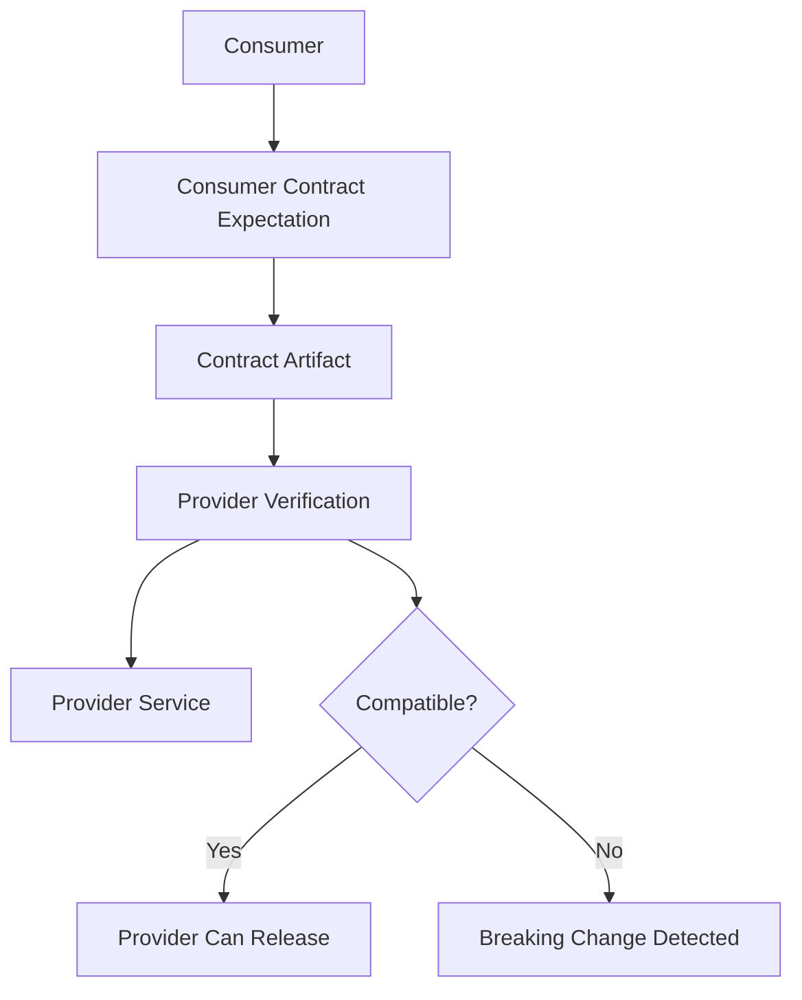
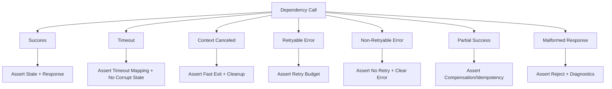
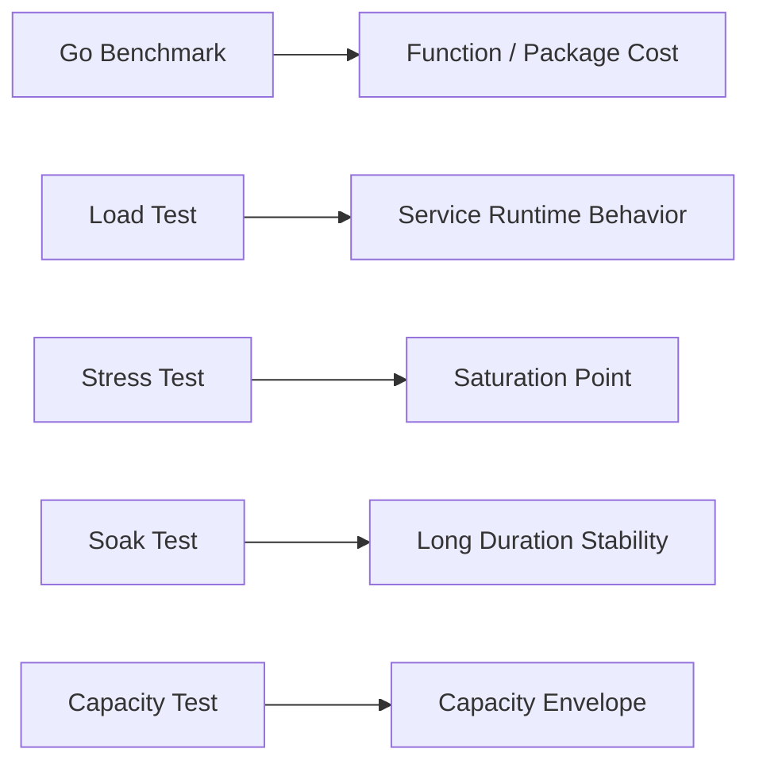
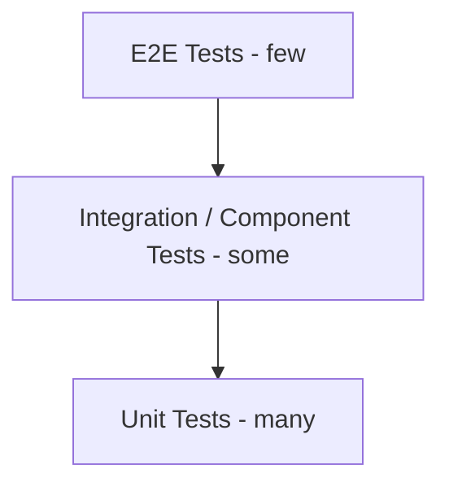
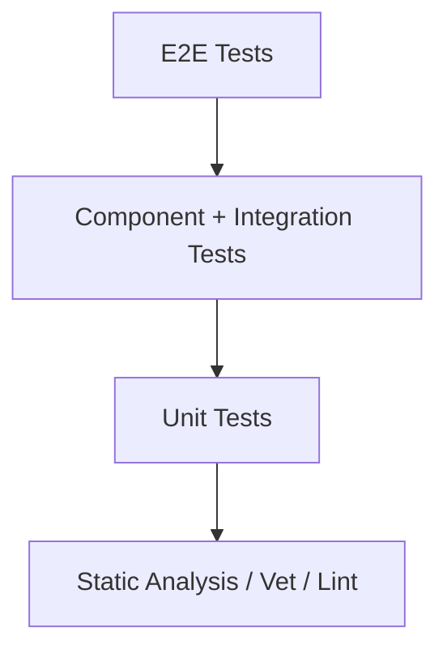
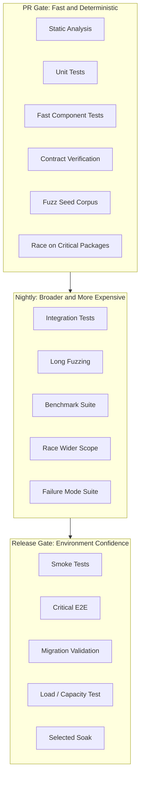

# learn-go-testing-benchmarking-performance-engineering-part-002.md

# Part 002 — Testing Taxonomy: Unit, Component, Integration, Contract, E2E, Smoke, Soak

> Seri: **Go Testing, Benchmarking, Performance Engineering**  
> Target pembaca: **Java software engineer / tech lead yang ingin membangun test strategy Go level production-grade**  
> Target Go: **Go 1.26.x**  
> Status seri: **Part 002 dari 034**  
> Prasyarat: Part 000–001

---

## 0. Tujuan Part Ini

Di banyak tim, kata **unit test**, **integration test**, atau **E2E test** sering dipakai seperti label administratif. Akibatnya test strategy menjadi kabur:

- test lambat dianggap “integration” walaupun sebenarnya unit test yang buruk;
- test yang menyentuh database dianggap otomatis “integration”, padahal bisa jadi component test;
- E2E dianggap paling penting karena “paling mirip user”, padahal paling mahal, paling flaky, dan paling lambat;
- coverage tinggi dianggap kualitas tinggi, padahal coverage tidak menjamin invariant bisnis benar;
- benchmark dianggap performance test, padahal benchmark Go hanya mengukur fungsi tertentu dalam test binary.

Part ini membangun **taxonomy test yang operasional**. Tujuannya bukan hafal definisi, tetapi mampu menjawab pertanyaan engineering seperti:

1. Test apa yang harus dibuat untuk perubahan ini?
2. Test mana yang harus masuk PR gate?
3. Test mana yang cukup nightly?
4. Test mana yang harus blocking release?
5. Test mana yang terlalu mahal untuk confidence yang diberikan?
6. Test mana yang duplicate signal?
7. Test mana yang seharusnya diganti dengan contract, fake, fuzz, atau benchmark?
8. Test mana yang perlu dihapus karena noise lebih besar daripada value?

Taxonomy yang baik harus membantu keputusan, bukan menambah istilah.

---

## 1. Mental Model Utama: Test Adalah Evidence Pipeline

Testing bukan aktivitas “membuktikan tidak ada bug”. Testing adalah proses membangun **evidence** bahwa sistem memiliki properti tertentu.

Properti yang diuji bisa berupa:

- fungsi mengembalikan output yang benar;
- error path tidak corrupt state;
- operasi idempotent;
- handler HTTP mengembalikan status dan body sesuai contract;
- repository menjaga transaction boundary;
- worker tidak kehilangan pesan;
- service tetap degrade gracefully saat dependency lambat;
- latency tetap dalam budget pada workload tertentu;
- API tidak berubah secara breaking terhadap consumer;
- binary tetap start dengan konfigurasi minimal;
- migration tidak merusak schema expectation;
- package tetap bebas data race untuk workload tertentu.

Setiap jenis test menghasilkan evidence berbeda.



Kualitas test strategy dilihat dari **risk coverage**, bukan hanya code coverage.

---

## 2. Empat Dimensi yang Lebih Penting daripada Nama Test

Sebelum memberi label “unit” atau “integration”, evaluasi test dari empat dimensi.

### 2.1 Scope

Scope menjawab: **berapa banyak sistem yang ikut dijalankan?**

Contoh scope:

| Scope | Contoh |
|---|---|
| Function | parser, validator, encoder |
| Type | cache, rate limiter, policy evaluator |
| Package | satu package dengan internal helper |
| Component | handler + service + repository fake |
| Process | satu binary service |
| Service + dependency | service + PostgreSQL/Redis/Kafka |
| Multi-service | API gateway + service A + service B |
| Full system | FE + BE + DB + external dependency simulation |

Semakin luas scope:

- confidence terhadap wiring meningkat;
- root cause saat gagal makin sulit;
- eksekusi makin mahal;
- flakiness cenderung naik;
- debug time naik;
- test lebih sulit diparalelkan.

### 2.2 Fidelity

Fidelity menjawab: **seberapa mirip test environment dengan real runtime?**

Contoh:

| Fidelity rendah | Fidelity tinggi |
|---|---|
| Fake repository in-memory | Real PostgreSQL |
| Fake HTTP client | Real HTTP server |
| Stub queue | Real RabbitMQ/Kafka |
| Fake clock | Real wall-clock |
| Local test process | Deployed Kubernetes service |
| Static payload | Production-like payload distribution |

Fidelity tinggi bukan selalu lebih baik. Ia mahal. Gunakan fidelity tinggi hanya untuk risiko yang memang tidak bisa dibuktikan di fidelity rendah.

### 2.3 Determinism

Determinism menjawab: **apakah hasil test stabil untuk input dan code yang sama?**

Test deterministik:

- tidak bergantung order execution;
- tidak bergantung waktu nyata secara rapuh;
- tidak bergantung random seed tersembunyi;
- tidak bergantung network publik;
- tidak bergantung state global yang bocor;
- tidak bergantung data shared antar test;
- tidak bergantung scheduling goroutine secara kebetulan.

Semakin tidak deterministik, semakin kecil nilai test sebagai gate. Test flaky bukan hanya mengganggu; test flaky merusak kepercayaan tim terhadap seluruh pipeline.

### 2.4 Cost

Cost bukan hanya waktu eksekusi. Cost meliputi:

- waktu jalan di lokal;
- waktu jalan di CI;
- CPU/memory/network cost;
- setup/teardown complexity;
- maintenance cost;
- debugging cost;
- false positive cost;
- false negative cost;
- opportunity cost karena developer menunggu gate.

Test strategy yang matang mengelola cost seperti mengelola budget produksi.

---

## 3. Confidence-Cost Curve

Test paling murah biasanya paling sempit. Test paling luas biasanya paling mahal. Tujuan engineering bukan “buat semua test sebanyak mungkin”, tetapi **mendapat confidence maksimum dengan cost minimum**.



Catatan penting:

- Unit test murah tetapi tidak membuktikan wiring.
- Component test memberi confidence besar dengan cost masih terkendali.
- Contract test mencegah breaking change lintas service tanpa harus menjalankan semua service.
- Integration test membuktikan adapter dan dependency behavior.
- E2E membuktikan critical journey, bukan semua kombinasi.
- Soak test membuktikan stability over time, bukan correctness detail.

---

## 4. Taxonomy Ringkas

Di seri ini kita pakai taxonomy berikut.

| Jenis Test | Pertanyaan Utama | Scope | Fidelity | Cocok untuk Gate |
|---|---|---:|---:|---|
| Unit Test | Apakah logic kecil benar? | Kecil | Rendah–Sedang | PR |
| Property Test | Apakah invariant selalu berlaku? | Kecil–Sedang | Rendah–Sedang | PR/Nightly |
| Fuzz Test | Apakah input ekstrem merusak code? | Kecil–Sedang | Rendah–Sedang | Seed: PR, Fuzzing: Nightly |
| Component Test | Apakah satu komponen bekerja sebagai unit runtime? | Sedang | Sedang | PR/Nightly |
| Contract Test | Apakah boundary producer-consumer kompatibel? | Sedang | Sedang | PR/Release |
| Integration Test | Apakah adapter dengan dependency nyata benar? | Sedang–Besar | Tinggi | PR terbatas/Nightly |
| E2E Test | Apakah journey utama bekerja end-to-end? | Besar | Tinggi | Release/Nightly |
| Smoke Test | Apakah sistem deployable dan basic path hidup? | Besar | Tinggi | Deploy/Release |
| Regression Test | Apakah bug yang pernah terjadi tidak muncul lagi? | Variatif | Variatif | PR/Release |
| Chaos/Failure Test | Apakah failure mode terkendali? | Sedang–Besar | Sedang–Tinggi | Nightly/Pre-prod |
| Soak Test | Apakah sistem stabil dalam durasi panjang? | Besar | Tinggi | Scheduled |
| Benchmark | Berapa cost operasi lokal? | Kecil–Sedang | Terkontrol | PR/Nightly Perf |
| Load Test | Bagaimana service di bawah traffic? | Besar | Tinggi | Pre-release |
| Capacity Test | Di mana batas saturasi? | Besar | Tinggi | Scheduled/Release |

---

## 5. Unit Test

### 5.1 Definisi Operasional

Unit test menguji **unit behavior kecil** dengan dependency dikontrol.

Dalam Go, unit bukan selalu “class” seperti Java. Unit bisa berupa:

- function;
- method;
- type;
- package-level behavior;
- pure policy evaluator;
- parser;
- mapper;
- validator;
- state transition function;
- retry decision function;
- authorization decision core;
- pricing/calculation rule;
- deterministic service method dengan fake dependency.

Unit test yang baik menjawab:

> Untuk input dan state tertentu, apakah behavior lokal benar?

### 5.2 Karakteristik Unit Test yang Baik

- Cepat.
- Deterministik.
- Tidak menyentuh network publik.
- Tidak bergantung database nyata.
- Failure message jelas.
- Tidak over-mock implementation detail.
- Fokus pada observable behavior.
- Mudah dijalankan dengan `go test ./...`.

### 5.3 Contoh Target Unit Test

Misalnya ada function policy:

```go
func CanApprove(actor Role, caseStatus Status, amount int64) bool {
    if actor != RoleSupervisor {
        return false
    }
    if caseStatus != StatusPendingApproval {
        return false
    }
    return amount <= 10_000_000
}
```

Unit test-nya tidak perlu database, HTTP server, logger, atau config loader. Yang diuji adalah rule.

### 5.4 Kapan Unit Test Tidak Cukup

Unit test tidak membuktikan:

- SQL query valid terhadap schema nyata;
- handler wiring benar;
- JSON tag sesuai API contract;
- middleware order benar;
- transaction benar-benar rollback;
- Redis TTL behavior sesuai expectation;
- Kafka consumer commit behavior benar;
- Kubernetes deployment bisa start;
- timeout antar service sesuai budget.

Jangan memaksa unit test membuktikan hal yang bukan domainnya.

### 5.5 Anti-Pattern Unit Test

#### Anti-pattern 1: Mock Everything

Jika setiap dependency internal dimock, test menjadi replika implementasi.

Gejala:

- test gagal setiap refactor kecil;
- test tidak gagal saat behavior external salah;
- banyak expectation urutan call;
- test lebih panjang dari code;
- confidence rendah walau coverage tinggi.

#### Anti-pattern 2: Testing Private Implementation

Go tidak punya private method seperti Java, tetapi unexported function bisa dites dari package yang sama. Itu boleh, tetapi hati-hati.

Test unexported helper layak jika:

- helper memuat algorithm kompleks;
- failure diagnosis penting;
- behavior helper relatif stabil.

Test unexported helper tidak layak jika:

- hanya detail implementasi;
- behavior sudah tercakup lewat exported API;
- sering berubah karena refactor.

#### Anti-pattern 3: Unit Test yang Diam-Diam Integration

Contoh:

```go
func TestCalculate(t *testing.T) {
    db := connectRealDatabase()
    // ...
}
```

Ini bukan masalah jika memang sengaja integration test. Masalahnya jika test ini berjalan di PR gate sebagai “unit” lalu membuat suite lambat/flaky.

---

## 6. Property-Based Test

### 6.1 Definisi Operasional

Property-based test menguji **invariant umum** pada banyak variasi input.

Alih-alih menulis:

> input A menghasilkan output B

Kita menulis:

> untuk semua input yang valid, properti X harus selalu benar

Contoh invariant:

- encode lalu decode menghasilkan value semula;
- normalize bersifat idempotent;
- sort menghasilkan urutan non-decreasing;
- merge tidak menghilangkan key;
- pagination tidak menduplikasi item;
- authorization deny by default;
- total debit-credit tetap balance;
- state transition tidak bisa mundur dari terminal state.

### 6.2 Hubungan dengan Fuzzing

Go fuzzing bisa dipakai untuk property-like testing karena fuzz target menerima input yang dimutasi secara coverage-guided. Saat `-fuzz` aktif, Go menjalankan fuzz target dengan instrumentation untuk mencari input yang memperluas coverage. Saat fuzzing tidak aktif, seed corpus tetap dijalankan sebagai test biasa.

Namun property-based thinking lebih luas daripada tool. Bahkan table-driven test bisa mengandung property.

### 6.3 Contoh Property

```go
func TestNormalizeEmailIdempotent(t *testing.T) {
    cases := []string{
        " USER@example.com ",
        "user@example.com",
        "\tUSER@EXAMPLE.COM\n",
    }

    for _, input := range cases {
        once := NormalizeEmail(input)
        twice := NormalizeEmail(once)

        if once != twice {
            t.Fatalf("NormalizeEmail not idempotent: once=%q twice=%q", once, twice)
        }
    }
}
```

Property:

```text
Normalize(Normalize(x)) == Normalize(x)
```

### 6.4 Kapan Property Test Sangat Bernilai

Property test sangat cocok untuk:

- parser;
- serializer/deserializer;
- compression/decompression;
- normalization;
- validation;
- crypto wrapper;
- permission evaluator;
- state machine;
- financial calculation;
- conflict resolution;
- caching invariant;
- set/map/list algorithm;
- custom data structure.

### 6.5 Risiko Property Test

Property test buruk jika invariant salah atau terlalu lemah.

Contoh property lemah:

```text
Function does not panic.
```

Itu berguna untuk robustness, tetapi tidak membuktikan correctness.

Property yang lebih kuat:

```text
For any valid order, total payable must equal sum(line items) - discounts + tax, and must never be negative.
```

---

## 7. Fuzz Test

### 7.1 Definisi Operasional

Fuzz test mencari bug dengan mengubah input secara otomatis. Dalam Go, fuzzing terintegrasi dengan `go test`.

Fuzz test cocok untuk boundary yang menerima input tidak dipercaya:

- JSON/XML/protobuf parser;
- custom decoder;
- URL parser;
- expression parser;
- SQL filter builder;
- CSV import;
- template renderer;
- auth token parser;
- file format reader;
- compression wrapper;
- encryption/decryption wrapper;
- API payload validation.

### 7.2 Dua Mode Fuzz Test

#### Seed Execution Mode

Saat menjalankan:

```bash
go test ./...
```

Fuzz target menjalankan seed corpus seperti test biasa. Ini cocok untuk PR gate.

#### Fuzzing Mode

Saat menjalankan:

```bash
go test -fuzz=FuzzParse -run=^$ ./internal/parser
```

Go melakukan input mutation untuk menemukan failure. Ini cocok untuk scheduled/nightly/security job, bukan setiap PR untuk seluruh repo.

### 7.3 Kapan Fuzz Test Masuk PR Gate

Masukkan seed corpus fuzz ke PR gate. Jangan menjalankan fuzzing panjang di setiap PR kecuali package sangat kecil dan risikonya tinggi.

Strategi:

| Mode | Gate |
|---|---|
| Seed corpus | PR |
| Short fuzz smoke, misalnya 10–30 detik package kritis | Optional PR |
| Long fuzzing | Nightly |
| Security fuzz campaign | Scheduled |
| Crash reproducer | PR regression |

### 7.4 Anti-Pattern Fuzz Test

- fuzz target menyentuh network;
- fuzz target menulis file global;
- fuzz target terlalu lambat;
- fuzz target panic untuk input invalid yang sebenarnya acceptable;
- fuzz target tidak punya invariant selain “tidak crash”;
- seed corpus tidak direview;
- crash input tidak dipromosikan menjadi regression seed.

---

## 8. Component Test

### 8.1 Definisi Operasional

Component test menguji satu komponen sebagai unit runtime yang lebih besar daripada unit test, tetapi belum full system.

Contoh:

- HTTP handler + middleware + service + fake repository;
- worker + fake queue + fake clock;
- application service + in-memory fake dependencies;
- repository adapter dengan database test container;
- package boundary dengan beberapa collaborator nyata.

Component test bertanya:

> Apakah komponen ini bekerja benar ketika bagian-bagian internalnya dirakit?

### 8.2 Component Test vs Unit Test

Unit test:

```text
Policy function returns DENY for inactive user.
```

Component test:

```text
POST /cases/{id}/approve returns 403 when user inactive, records audit attempt, and does not update case status.
```

Di component test, kita mulai peduli terhadap:

- handler wiring;
- request decoding;
- validation flow;
- service orchestration;
- repository call outcome;
- response mapping;
- audit side effect;
- error translation.

### 8.3 Component Test vs Integration Test

Component test boleh memakai fake dependency. Integration test memakai dependency nyata atau realistic.

Contoh:

| Test | Dependency |
|---|---|
| Component test handler | fake repository |
| Integration test repository | real PostgreSQL |
| Integration test cache adapter | real Redis |
| Integration test queue consumer | real Kafka/RabbitMQ |

### 8.4 Kenapa Component Test Penting di Go

Go sering mendorong package kecil dan dependency eksplisit. Ini membuat component test sangat efektif karena kita bisa menguji boundary yang meaningful tanpa menyalakan seluruh sistem.

Component test sering memberi **confidence/cost ratio terbaik**.

### 8.5 Component Test Pattern



---

## 9. Integration Test

### 9.1 Definisi Operasional

Integration test menguji interaksi dengan boundary nyata atau realistic.

Boundary bisa berupa:

- database;
- cache;
- message broker;
- filesystem;
- OS process;
- HTTP service;
- cloud SDK local emulator;
- third-party API sandbox;
- TLS stack;
- migration tool.

Integration test bertanya:

> Apakah adapter kita benar saat berinteraksi dengan dependency sesuai behavior nyatanya?

### 9.2 Apa yang Harus Dibuktikan Integration Test

Contoh untuk database repository:

- query valid terhadap schema;
- transaction commit/rollback benar;
- isolation expectation benar;
- unique constraint ditangani;
- null/time/decimal mapping benar;
- migration menghasilkan schema yang diharapkan;
- index-dependent query tidak timeout pada data skala tertentu;
- connection error diterjemahkan dengan benar.

Contoh untuk queue consumer:

- message decoding benar;
- ack/nack semantics benar;
- retryable vs non-retryable error benar;
- poison message tidak block seluruh partition/queue;
- idempotency key bekerja;
- duplicate message tidak double-apply side effect.

### 9.3 Kapan Integration Test Harus Ada

Integration test wajib jika:

- adapter mengandung SQL/custom protocol;
- behavior dependency tidak bisa difake dengan aman;
- ada transaction/locking/constraint;
- ada serialization format lintas bahasa;
- ada retry/timeout/backoff;
- ada cloud SDK behavior yang sering berubah;
- external contract mahal jika rusak;
- bug sebelumnya terjadi di boundary itu.

### 9.4 Integration Test yang Buruk

Integration test buruk biasanya:

- menjalankan seluruh app padahal hanya mau menguji repository;
- bergantung data shared antar test;
- tidak membersihkan state;
- butuh urutan test tertentu;
- menyentuh service publik;
- tidak bisa dijalankan lokal;
- failure message hanya “timeout”;
- terlalu lambat masuk PR tanpa seleksi.

### 9.5 Strategi Gate

| Integration Type | PR Gate | Nightly | Release |
|---|---:|---:|---:|
| Repository critical path | Ya, package terbatas | Ya | Ya |
| External API sandbox | Tidak selalu | Ya | Ya |
| Full broker flow | Terbatas | Ya | Ya |
| Cloud emulator | Terbatas | Ya | Ya |
| Slow migration large dataset | Tidak | Ya | Ya sebelum release besar |

---

## 10. Contract Test

### 10.1 Definisi Operasional

Contract test menguji kompatibilitas antara provider dan consumer tanpa harus menjalankan seluruh dependency graph.

Contract bisa berupa:

- HTTP request/response schema;
- gRPC/protobuf schema;
- event schema;
- database view contract;
- file format;
- CLI output;
- authorization decision contract;
- error code contract;
- pagination semantics;
- idempotency semantics.

Contract test bertanya:

> Apakah producer masih memenuhi ekspektasi consumer?

### 10.2 Kenapa Contract Test Lebih Baik daripada Banyak E2E

Dalam microservice architecture, full E2E semua kombinasi consumer-provider akan mahal dan flaky.

Contract test memecah masalah:



Keuntungan:

- lebih cepat dari E2E;
- root cause lebih jelas;
- bisa dijalankan per service;
- cocok untuk CI;
- mengurangi kebutuhan shared staging environment;
- mencegah breaking change sebelum deploy.

### 10.3 Consumer-Driven Contract

Consumer-driven contract berarti consumer mendefinisikan ekspektasi yang provider harus penuhi.

Contoh:

Consumer `Case UI` butuh:

```json
{
  "caseId": "CASE-001",
  "status": "PENDING_APPROVAL",
  "allowedActions": ["APPROVE", "REJECT"]
}
```

Provider tidak boleh tiba-tiba mengubah `allowedActions` menjadi object tanpa versioning.

### 10.4 Provider Contract

Provider juga bisa mendefinisikan OpenAPI/protobuf schema lalu consumer memverifikasi compatibility.

Risiko provider-only contract:

- schema bisa valid tetapi semantics tidak sesuai consumer;
- optional/required field bisa salah dipahami;
- error behavior tidak terdokumentasi cukup;
- pagination/idempotency behavior sering tidak tertangkap schema.

### 10.5 Contract Test untuk Event

Event contract harus mencakup:

- schema;
- key;
- partitioning expectation;
- event type;
- version;
- required field;
- compatibility rule;
- semantic meaning;
- duplicate/reorder tolerance;
- idempotency key;
- tombstone/delete semantics jika ada.

---

## 11. End-to-End Test

### 11.1 Definisi Operasional

E2E test menguji journey lintas banyak layer, biasanya dari entrypoint user/system sampai dependency utama.

Contoh:

```text
User login -> create case -> upload document -> submit -> officer approves -> notification sent.
```

E2E test bertanya:

> Apakah critical journey bekerja ketika sistem dirakit seperti production?

### 11.2 Nilai E2E

E2E bagus untuk membuktikan:

- deployment wiring;
- routing;
- authentication integration;
- major workflow;
- UI/API compatibility;
- data propagation lintas service;
- infrastructure config;
- basic production-like behavior.

### 11.3 E2E Tidak Cocok untuk Semua Logic

Jangan gunakan E2E untuk menguji:

- semua validation rule;
- semua role permission;
- semua edge case parser;
- semua error path;
- semua retry branch;
- semua table combination;
- semua localization;
- semua SQL repository method.

Itu harus turun ke unit/component/contract/integration.

### 11.4 E2E Portfolio yang Sehat

E2E harus sedikit tetapi bernilai tinggi.

Contoh kategori:

| E2E Journey | Alasan |
|---|---|
| Login + basic authenticated API | membuktikan auth wiring |
| Create + submit entity | membuktikan happy path utama |
| Approval/rejection journey | membuktikan state transition utama |
| Upload/download document | membuktikan storage integration |
| Notification dispatch | membuktikan side effect critical |
| Read-only search/listing | membuktikan query path utama |

### 11.5 Anti-Pattern E2E

- E2E sebagai pengganti unit test.
- E2E terlalu banyak sehingga pipeline lambat.
- E2E bergantung urutan.
- E2E memakai shared user/data tanpa reset.
- E2E tidak punya observability cukup untuk debug.
- E2E gagal karena environment, bukan code.
- E2E tidak jelas owner-nya.
- E2E flaky tetapi tetap blocking tanpa triage policy.

---

## 12. Smoke Test

### 12.1 Definisi Operasional

Smoke test adalah test cepat untuk memastikan build/deployment tidak rusak secara fundamental.

Smoke test bertanya:

> Apakah sistem cukup hidup untuk menerima traffic dasar?

Smoke test bukan correctness suite lengkap.

### 12.2 Contoh Smoke Test

- binary start;
- config minimal valid;
- health endpoint OK;
- readiness endpoint OK;
- migration status OK;
- can connect DB/cache/broker;
- one basic authenticated call works;
- one public endpoint works;
- background worker starts;
- version endpoint returns expected commit.

### 12.3 Smoke Test Gate

Smoke test cocok untuk:

- after deploy;
- canary verification;
- blue/green switch;
- rollback validation;
- release gate;
- environment readiness check.

### 12.4 Smoke Test yang Salah

Smoke test salah jika:

- menjalankan workflow panjang;
- membuat data besar;
- memerlukan approval manusia;
- mengecek semua business rule;
- terlalu lambat untuk post-deploy;
- failure-nya ambigu.

Smoke test harus kecil, cepat, dan diagnostik.

---

## 13. Regression Test

### 13.1 Definisi Operasional

Regression test dibuat karena bug nyata pernah terjadi atau hampir terjadi.

Regression test bertanya:

> Apakah bug yang pernah kita temukan tetap tertutup?

### 13.2 Aturan Membuat Regression Test

Setiap bug fix serius harus menjawab:

1. Di layer mana bug paling murah dibuktikan?
2. Test apa yang gagal sebelum fix?
3. Apakah test tersebut akan gagal jika bug yang sama muncul lagi?
4. Apakah test deterministic?
5. Apakah test masuk gate yang tepat?
6. Apakah test terlalu spesifik terhadap implementasi?

### 13.3 Jangan Selalu E2E

Bug yang ditemukan lewat E2E tidak harus dicegah dengan E2E.

Contoh:

Bug:
```text
Case approved twice when duplicate request arrives.
```

Test yang tepat mungkin:

- unit/property test untuk idempotency decision;
- component test untuk handler duplicate request;
- integration test untuk DB unique constraint;
- E2E hanya jika bug terjadi karena full-system race.

---

## 14. Failure-Mode Test

### 14.1 Definisi Operasional

Failure-mode test menguji behavior saat ada kesalahan, bukan happy path.

Contoh:

- DB timeout;
- cache unavailable;
- queue publish gagal;
- duplicate message;
- context canceled;
- malformed payload;
- permission denied;
- downstream returns 500;
- partial write;
- disk full;
- config missing;
- invalid certificate;
- clock skew.

### 14.2 Kenapa Failure-Mode Test Penting

Production failure jarang terjadi pada happy path. Banyak incident terjadi karena:

- retry storm;
- timeout terlalu panjang;
- partial success tidak ditangani;
- error ditelan;
- cleanup tidak jalan;
- transaction tidak rollback;
- worker poison message loop;
- context cancellation diabaikan;
- goroutine leak pada error path;
- resource tidak ditutup.

### 14.3 Failure-Mode Matrix



### 14.4 Gate Strategy

Failure-mode tests yang murah harus masuk PR.

Failure-mode tests yang butuh environment atau chaos injection bisa masuk nightly/pre-release.

---

## 15. Chaos Test

### 15.1 Definisi Operasional

Chaos test adalah controlled experiment untuk melihat behavior sistem saat dependency atau infrastructure mengalami gangguan.

Contoh:

- kill instance;
- delay downstream;
- drop network packets;
- inject broker disconnect;
- restart database replica;
- throttle CPU;
- fill disk;
- reject DNS lookup;
- force TLS error.

### 15.2 Chaos Test Bukan Random Destruction

Chaos engineering yang baik punya hypothesis:

```text
Given Redis is unavailable for 60 seconds,
the API should continue serving non-cache-dependent endpoints,
return degraded response for cache-dependent endpoints,
avoid retry storm,
and recover without manual restart after Redis returns.
```

### 15.3 Hubungan dengan Testing Taxonomy

Chaos test biasanya bukan PR gate. Ia lebih dekat ke:

- staging/pre-prod validation;
- resilience campaign;
- incident readiness;
- capacity planning;
- operational maturity.

---

## 16. Soak Test

### 16.1 Definisi Operasional

Soak test menjalankan sistem cukup lama untuk menemukan masalah yang tidak muncul dalam test pendek.

Soak test bertanya:

> Apakah sistem stabil setelah durasi panjang?

### 16.2 Masalah yang Dicari Soak Test

- memory leak;
- goroutine leak;
- connection leak;
- file descriptor leak;
- cache unbounded growth;
- queue backlog creeping;
- timer leak;
- log volume explosion;
- performance degradation;
- GC pressure meningkat;
- retry accumulation;
- slow resource exhaustion.

### 16.3 Soak Test vs Load Test

Load test bisa pendek untuk mengukur response under traffic.

Soak test fokus pada waktu.

| Test | Fokus |
|---|---|
| Load test | behavior under expected traffic |
| Stress test | behavior past capacity |
| Spike test | sudden traffic change |
| Soak test | stability over long duration |

### 16.4 Kapan Soak Test Layak

Soak test layak untuk:

- worker long-running;
- service dengan connection pool;
- stream processor;
- cache-heavy system;
- service dengan goroutine background;
- system dengan large object processing;
- release besar runtime/library;
- perubahan GC/memory-sensitive code;
- perubahan retry/backoff.

---

## 17. Benchmark

### 17.1 Definisi Operasional

Benchmark Go mengukur cost operasi tertentu di test binary.

Benchmark bertanya:

> Berapa waktu/alokasi/throughput relatif operasi ini dalam kondisi terkontrol?

Benchmark bukan load test, bukan capacity test, dan bukan bukti user journey production.

### 17.2 Benchmark Cocok untuk

- parser performance;
- encoder/decoder performance;
- allocation regression;
- algorithm comparison;
- lock vs atomic trade-off;
- cache implementation;
- buffer strategy;
- batch size tuning;
- serialization format;
- hot-path function;
- memory layout experiment;
- PGO before/after comparison.

### 17.3 Benchmark Tidak Cocok untuk

- membuktikan correctness;
- menggantikan unit test;
- mengukur full production latency;
- menguji autoscaling;
- menguji database capacity dengan fake data kecil;
- membuat keputusan besar dari satu run;
- membandingkan hasil laptop vs CI tanpa kontrol.

### 17.4 Benchmark Gate

| Benchmark Type | Gate |
|---|---|
| Small deterministic microbenchmark | PR optional |
| Allocation regression benchmark | PR untuk hot path |
| Noisy benchmark | Nightly |
| Service scenario benchmark | Perf runner |
| Before/after optimization | Manual/PR evidence |
| Release capacity benchmark | Pre-release |

---

## 18. Load, Stress, Spike, and Capacity Test

### 18.1 Load Test

Load test menguji expected workload.

Pertanyaan:

```text
Apakah service memenuhi latency/error budget pada traffic normal?
```

### 18.2 Stress Test

Stress test mendorong sistem melewati batas.

Pertanyaan:

```text
Di titik mana sistem saturate, dan apakah failure-nya terkendali?
```

### 18.3 Spike Test

Spike test menguji perubahan traffic mendadak.

Pertanyaan:

```text
Apakah sistem bertahan saat traffic naik cepat?
```

### 18.4 Capacity Test

Capacity test mencari envelope.

Pertanyaan:

```text
Berapa throughput maksimum sebelum p95/p99/error rate melanggar budget?
```

### 18.5 Perbedaan dengan Benchmark Go



Benchmark bisa memberi insight mikro. Load/capacity test memberi insight sistem.

---

## 19. Test Pyramid, Test Trophy, dan Reality untuk Go

### 19.1 Classic Test Pyramid



Pesan utama pyramid:

- banyak test murah di bawah;
- sedikit test mahal di atas.

Masih berguna, tetapi terlalu sederhana untuk sistem modern.

### 19.2 Test Trophy

Test trophy sering menekankan integration/component test sebagai sweet spot.



Untuk Go backend, bentuk sehat sering seperti:

```text
Static + unit + component kuat
Integration selektif
Contract kuat untuk boundary
E2E sedikit tapi critical
Fuzz/property untuk input/invariant berisiko
Benchmark/load untuk performance-sensitive path
```

### 19.3 Portfolio Lebih Baik daripada Pyramid

Pyramid tidak cukup karena tidak menunjukkan:

- contract test;
- fuzz test;
- benchmark;
- smoke test;
- chaos test;
- soak test;
- release gates;
- ownership;
- flakiness policy.

Gunakan **test portfolio**.

---

## 20. Test Portfolio Model



---

## 21. Gate Placement Decision

### 21.1 PR Gate

PR gate harus:

- cepat;
- deterministic;
- diagnostik;
- relevan terhadap change;
- runnable lokal;
- tidak bergantung environment shared rapuh.

Masukkan:

- unit tests;
- component tests cepat;
- contract verification;
- fuzz seed tests;
- selected race tests;
- coverage threshold jika matang;
- small benchmark only untuk hot path tertentu;
- smoke compile/build.

Jangan masukkan secara default:

- full E2E panjang;
- soak test;
- long fuzzing;
- full load test;
- external public API test;
- migration large dataset.

### 21.2 Nightly Gate

Nightly gate boleh lebih mahal.

Masukkan:

- integration tests luas;
- long fuzzing;
- full race suite;
- benchmark trend;
- failure-mode suite;
- external sandbox tests;
- slow migration tests;
- compatibility tests lintas versi.

### 21.3 Release Gate

Release gate fokus pada deployability dan business-critical journey.

Masukkan:

- smoke tests;
- critical E2E;
- migration validation;
- rollback test;
- contract compatibility;
- capacity/load test untuk release besar;
- canary validation.

---

## 22. Decision Framework: Test Apa yang Harus Dibuat?

Gunakan pertanyaan berikut.

### 22.1 Pertanyaan Risiko

1. Apa behavior yang berubah?
2. Apa invariant yang bisa rusak?
3. Boundary apa yang disentuh?
4. Dependency nyata apa yang terlibat?
5. Apakah ada concurrency?
6. Apakah ada persistence?
7. Apakah ada network?
8. Apakah ada schema/API/event contract?
9. Apakah ada performance-sensitive path?
10. Apakah bug ini pernah terjadi sebelumnya?

### 22.2 Mapping Risiko ke Test

| Risiko | Test utama | Test tambahan |
|---|---|---|
| Pure logic salah | Unit | Property |
| Banyak variasi input | Table/property | Fuzz |
| Parser crash | Fuzz | Regression seed |
| DB query salah | Integration repository | Component |
| Handler response salah | Component | Contract |
| API breaking change | Contract | E2E critical |
| Worker duplicate side effect | Component | Integration queue |
| Race condition | Race test | Deterministic concurrency test |
| Timeout tidak dihormati | Failure-mode component | Integration |
| Deployment config rusak | Smoke | E2E |
| Latency regression hot path | Benchmark | Load |
| Capacity berubah | Load/capacity | Benchmark root cause |
| Memory leak | Soak | Benchmark allocation/profile handoff |

---

## 23. Worked Example: Authorization API Change

Misal perubahan:

```text
Add new permission rule:
Supervisor can approve case only if case is pending approval,
case amount <= threshold,
and actor is assigned to the same branch.
```

### 23.1 Risiko

- rule salah;
- branch comparison salah;
- threshold boundary off-by-one;
- inactive supervisor tetap bisa approve;
- API response salah;
- audit tidak tercatat saat deny;
- frontend contract `allowedActions` berubah;
- DB assignment query salah.

### 23.2 Test Portfolio

| Risiko | Test |
|---|---|
| rule salah | Unit test policy |
| threshold boundary | Table-driven unit |
| invariant deny by default | Property-style test |
| handler response | Component test |
| audit deny side effect | Component test |
| API response compatibility | Contract test |
| DB assignment lookup | Integration repository |
| full approve journey | E2E critical, satu happy path |

### 23.3 Yang Tidak Perlu

Tidak perlu membuat E2E untuk semua role/status/amount/branch combination. Itu mahal dan duplicate dengan unit/component.

---

## 24. Worked Example: JSON Import Parser

Perubahan:

```text
Add support for importing customer records from JSON file.
```

### 24.1 Risiko

- malformed JSON panic;
- unknown field behavior salah;
- missing field handling salah;
- duplicate record;
- large file memory blowup;
- invalid encoding;
- date parsing beda timezone;
- partial import state corrupt;
- error message tidak actionable.

### 24.2 Test Portfolio

| Risiko | Test |
|---|---|
| valid record parse | Unit/table |
| required field | Unit/table |
| date/time edge | Unit/table |
| malformed input | Fuzz |
| parser invariant | Property |
| partial import rollback | Component |
| DB persistence | Integration |
| large file behavior | Benchmark/scenario |
| old bug reproducer | Regression seed |

---

## 25. Worked Example: Queue Worker

Perubahan:

```text
Worker consumes CaseSubmitted events and creates notification.
```

### 25.1 Risiko

- event decode salah;
- duplicate event double notification;
- retryable error acked;
- poison message blocks queue;
- context cancellation tidak stop worker;
- notification API timeout menyebabkan leak;
- event schema incompatible;
- throughput kurang;
- worker memory naik perlahan.

### 25.2 Test Portfolio

| Risiko | Test |
|---|---|
| decode event | Unit/table |
| schema compatibility | Contract |
| duplicate event | Component |
| retry behavior | Failure-mode component |
| ack/nack semantics | Integration broker |
| cancellation | Concurrency test |
| throughput | Benchmark/scenario |
| long-running leak | Soak |

---

## 26. Test Ownership Model

Test tanpa ownership akan membusuk.

### 26.1 Ownership per Layer

| Test Type | Owner Utama |
|---|---|
| Unit | Developer package |
| Component | Feature/module owner |
| Contract | Provider + consumer |
| Integration | Adapter owner |
| E2E | Product/service owner |
| Smoke | Platform/service owner |
| Load/capacity | Service owner + platform/perf |
| Soak | Service owner |
| Chaos | Service owner + SRE/platform |
| Benchmark | Package/hot-path owner |

### 26.2 Ownership Berarti

Owner bertanggung jawab untuk:

- menjaga test tetap relevan;
- memperbaiki flaky test;
- menghapus test yang obsolete;
- update fixture/golden;
- review failure signal;
- menjaga runtime budget;
- memastikan test bisa dijalankan lokal;
- mendokumentasikan gate placement.

---

## 27. Flakiness Policy

### 27.1 Definisi Flaky

Test flaky adalah test yang hasilnya bisa berbeda tanpa perubahan code yang relevan.

Penyebab umum:

- real time sleep;
- race;
- order dependency;
- shared global state;
- shared database state;
- network dependency;
- random input tanpa seed;
- goroutine leak;
- timeout terlalu ketat;
- CI resource contention;
- external service instability;
- test cleanup tidak lengkap.

### 27.2 Policy yang Sehat

Flaky test harus diperlakukan seperti production bug di pipeline.

Policy minimum:

1. Flaky test blocking harus langsung ditriage.
2. Jika tidak bisa diperbaiki cepat, quarantine dengan issue owner.
3. Jangan membiarkan rerun menjadi normal.
4. Catat failure mode dan frequency.
5. Perbaiki root cause, bukan menaikkan timeout sembarangan.
6. Jika test tidak memberi value cukup, hapus atau pindah gate.

### 27.3 Quarantine Bukan Kuburan

Quarantine harus punya:

- owner;
- due date;
- link issue;
- alasan;
- plan perbaikan;
- gate alternatif jika risk masih perlu ditutup.

---

## 28. Test Data Strategy

### 28.1 Test Data Principles

Test data harus:

- minimal tetapi representatif;
- explicit;
- deterministic;
- mudah dibaca;
- tidak bergantung production data;
- tidak mengandung PII;
- bisa direset;
- bisa diparalelkan;
- merepresentasikan boundary condition.

### 28.2 Fixture vs Builder

Fixture cocok untuk:

- payload besar;
- golden output;
- contract example;
- file format;
- schema example.

Builder cocok untuk:

- entity variasi kecil;
- default valid object;
- test readability;
- reducing repetition.

Contoh builder sederhana:

```go
type CaseBuilder struct {
    c Case
}

func NewCaseBuilder() CaseBuilder {
    return CaseBuilder{
        c: Case{
            ID:     "CASE-001",
            Status: StatusDraft,
            Amount: 1000,
        },
    }
}

func (b CaseBuilder) PendingApproval() CaseBuilder {
    b.c.Status = StatusPendingApproval
    return b
}

func (b CaseBuilder) Amount(v int64) CaseBuilder {
    b.c.Amount = v
    return b
}

func (b CaseBuilder) Build() Case {
    return b.c
}
```

### 28.3 Test Data Anti-Pattern

- one giant fixture reused everywhere;
- hidden defaults;
- production dump;
- random data tanpa seed;
- test bergantung tanggal hari ini;
- fixture berubah memecahkan banyak test tanpa jelas;
- builder terlalu pintar sampai menyembunyikan behavior.

---

## 29. Quality Gate Matrix

Contoh matrix untuk service Go production.

| Gate | Command / Activity | Target |
|---|---|---|
| Local fast | `go test ./...` | semua unit/component cepat |
| Local race critical | `go test -race ./internal/critical/...` | race-sensitive package |
| PR static | `go test`, `go vet`, lint jika ada | correctness dasar |
| PR contract | provider/consumer contract | API/event compatibility |
| PR fuzz seed | `go test ./...` menjalankan seed | reproducer tetap tertutup |
| PR integration selected | repository/adapter kritis | boundary penting |
| Nightly race | `go test -race ./...` | wider race detection |
| Nightly fuzz | `go test -fuzz=...` selected | input robustness |
| Nightly benchmark | benchmark suite + benchstat | regression trend |
| Release smoke | deployed env smoke | deployability |
| Release E2E | critical journey | system confidence |
| Release load | workload representative | SLO/capacity |
| Scheduled soak | long-running service | leak/stability |

---

## 30. Mermaid: End-to-End Taxonomy Map

```mermaid
flowchart TB
    Risk[Risk Introduced by Change]

    Risk --> Logic[Local Logic]
    Risk --> Input[Untrusted / Large Input]
    Risk --> Boundary[External Boundary]
    Risk --> Contract[Consumer/Provider Contract]
    Risk --> Workflow[User/System Workflow]
    Risk --> Deploy[Deployment Readiness]
    Risk --> Runtime[Runtime Failure Mode]
    Risk --> Perf[Performance / Capacity]

    Logic --> Unit[Unit Test]
    Logic --> Property[Property Test]

    Input --> Fuzz[Fuzz Test]
    Input --> Regression[Regression Seed]

    Boundary --> Integration[Integration Test]
    Boundary --> Component[Component Test]

    Contract --> ContractTest[Contract Test]

    Workflow --> E2E[E2E Test]

    Deploy --> Smoke[Smoke Test]

    Runtime --> Failure[Failure-Mode Test]
    Runtime --> Chaos[Chaos Test]
    Runtime --> Soak[Soak Test]

    Perf --> Benchmark[Go Benchmark]
    Perf --> Load[Load Test]
    Perf --> Capacity[Capacity Test]
```



---

## 31. Practical Heuristics

### 31.1 Jika Test Butuh Banyak Mock

Mungkin boundary desain salah atau test terlalu implementation-driven.

Pertanyaan:

- Bisakah logic dipisah menjadi pure function?
- Bisakah dependency diganti fake yang stateful?
- Apakah yang diuji behavior atau call sequence?
- Apakah component test lebih cocok?

### 31.2 Jika E2E Terlalu Banyak

Turunkan test ke layer lebih murah.

Pertanyaan:

- Business rule bisa diuji unit?
- API compatibility bisa diuji contract?
- Adapter bisa diuji integration?
- Journey bisa disederhanakan menjadi satu critical path?

### 31.3 Jika Integration Test Flaky

Cari sumber nondeterminism.

Pertanyaan:

- State cleanup benar?
- Test parallel aman?
- Timeout realistis?
- Dependency shared?
- Ada background job?
- Ada eventual consistency?
- Ada clock dependence?

### 31.4 Jika Coverage Tinggi tapi Bug Banyak

Kemungkinan:

- test hanya happy path;
- invariant tidak diuji;
- failure mode tidak diuji;
- contract tidak diuji;
- integration boundary tidak diuji;
- assertion terlalu lemah;
- test terlalu implementation-driven;
- review test tidak serius.

### 31.5 Jika Benchmark Tidak Dipercaya

Kemungkinan:

- run count terlalu sedikit;
- environment noisy;
- benchmark tidak representatif;
- compiler mengoptimasi work;
- input terlalu kecil;
- setup masuk timer;
- allocation tidak diukur;
- tidak pakai comparison statistical tool;
- workload tidak sesuai production.

---

## 32. Testing Taxonomy untuk Java Engineer yang Pindah ke Go

### 32.1 Perbedaan Budaya

Di Java enterprise, test sering berpusat pada:

- class;
- DI container;
- mock framework;
- Spring test context;
- annotations;
- test suite framework;
- layered architecture.

Di Go, test lebih sering berpusat pada:

- package;
- function/type behavior;
- explicit dependency;
- small interface;
- standard library;
- simple helpers;
- test binary;
- table-driven cases;
- external test package for API behavior.

### 32.2 Jangan Membawa Semua Kebiasaan Java

Hindari:

- membuat interface untuk semua struct hanya agar bisa dimock;
- menggunakan mock framework untuk semua dependency;
- membuat test package hierarchy terlalu abstrak;
- menyalakan seluruh application context untuk test kecil;
- membuat fixture object graph besar;
- terlalu banyak inheritance-style test helper;
- meniru “unit means class method only”.

### 32.3 Adaptasi yang Lebih Go

Gunakan:

- small interfaces at consumer side;
- fake yang sederhana;
- table-driven tests;
- package-level behavior tests;
- `httptest`;
- `t.TempDir`;
- `t.Cleanup`;
- `t.Run`;
- `t.Parallel` dengan hati-hati;
- fuzz untuk parser/input boundary;
- benchmark untuk hot path;
- contract test untuk service boundary.

---

## 33. Review Checklist

Gunakan checklist ini saat review PR.

### 33.1 Risk Coverage

- [ ] Perubahan behavior utama punya test?
- [ ] Error path penting punya test?
- [ ] Boundary dependency punya test yang sesuai?
- [ ] Contract consumer/provider tetap aman?
- [ ] Ada regression test untuk bug fix?
- [ ] Ada test untuk boundary values?
- [ ] Ada test untuk unauthorized/forbidden path jika relevan?
- [ ] Ada test untuk cancellation/timeout jika relevan?
- [ ] Ada performance evidence jika hot path berubah?

### 33.2 Test Quality

- [ ] Test deterministic?
- [ ] Failure message diagnostik?
- [ ] Test tidak over-mock?
- [ ] Test tidak bergantung order?
- [ ] Test cleanup benar?
- [ ] Test bisa dijalankan lokal?
- [ ] Test runtime sesuai gate?
- [ ] Fixture readable?
- [ ] Assertion cukup kuat?
- [ ] Test tidak duplicate signal secara berlebihan?

### 33.3 Gate Placement

- [ ] Test cepat masuk PR?
- [ ] Test lambat dipindah nightly/release?
- [ ] Test flaky tidak dibiarkan blocking tanpa owner?
- [ ] Integration test yang mahal diberi build tag atau pipeline khusus?
- [ ] Benchmark noisy tidak dijadikan hard gate sembarangan?

---

## 34. Common Taxonomy Mistakes

### 34.1 “Unit Test Harus Tidak Pakai File”

Salah. Unit test boleh memakai `t.TempDir` untuk menguji function yang memang domainnya file behavior, selama tetap lokal dan deterministic.

### 34.2 “Integration Test Harus Full App”

Salah. Repository + real DB bisa integration test tanpa menjalankan HTTP server.

### 34.3 “E2E Paling Penting karena Mirip User”

Setengah benar. E2E memberi confidence wiring dan journey, tetapi buruk untuk edge cases dan root cause diagnosis.

### 34.4 “Coverage 90% Berarti Aman”

Salah. Coverage menunjukkan line dieksekusi, bukan invariant benar.

### 34.5 “Benchmark Cepat Berarti Production Cepat”

Salah. Benchmark mengukur operasi tertentu di environment tertentu. Production behavior dipengaruhi network, DB, GC, scheduler, payload distribution, contention, autoscaling, dan dependency.

### 34.6 “Flaky Test Bisa Di-rerun”

Berbahaya. Rerun boleh sebagai mitigasi sementara, bukan policy permanen.

---

## 35. Test Strategy Template per Feature

Gunakan template ini sebelum implementasi feature besar.

```markdown
# Test Strategy: <Feature Name>

## Change Summary
- What changes?
- Which package/service/API/event/schema is affected?

## Risk Inventory
- Correctness:
- Boundary:
- Contract:
- Runtime/concurrency:
- Failure mode:
- Performance:
- Deployment:

## Test Plan
| Risk | Test Type | Location | Gate | Owner |
|---|---|---|---|---|

## Non-Goals
- What will not be tested here and why?

## Test Data
- Fixture:
- Builder:
- Seed corpus:
- External dependency data:

## Gates
- PR:
- Nightly:
- Release:

## Regression Coverage
- Existing bugs covered:
- New regression tests added:

## Performance Evidence
- Benchmark:
- Load/capacity:
- Not applicable because:

## Flakiness Risk
- Shared state:
- Time:
- Randomness:
- External dependency:
- Parallelism:
```

---

## 36. Mini Case Study: Designing Test Portfolio for a Go Approval Service

### 36.1 System

```text
Approval API
- POST /cases/{id}/approve
- validates actor
- loads case
- checks permission
- updates status transactionally
- writes audit event
- publishes notification event
```

### 36.2 Risk Breakdown

| Area | Risk |
|---|---|
| Permission | unauthorized approval |
| State | approving non-pending case |
| Transaction | status updated but audit missing |
| Event | notification missing or duplicated |
| API | wrong status code |
| DB | optimistic lock conflict |
| Runtime | context cancellation mid-request |
| Performance | approval endpoint p95 regression |

### 36.3 Test Portfolio

| Test | Type | Gate |
|---|---|---|
| permission matrix | unit/table | PR |
| state transition invariant | property-ish unit | PR |
| handler unauthorized response | component | PR |
| transaction rollback on audit failure | integration DB | PR/nightly |
| event contract | contract | PR |
| duplicate request idempotency | component/integration | PR |
| context cancellation | failure-mode component | PR |
| happy path deployed | smoke/E2E | release |
| endpoint scenario load | load | release |
| approval hot path benchmark | benchmark | nightly/perf PR |

### 36.4 Why This Is Better than 30 E2E Tests

Karena setiap risk diuji pada layer termurah yang masih memberi evidence valid.

---

## 37. Commands Baseline

### 37.1 Fast Local

```bash
go test ./...
```

### 37.2 Run Specific Test

```bash
go test -run '^TestApprovePermission$' ./internal/approval
```

### 37.3 Run Subtest

```bash
go test -run '^TestApprovePermission/supervisor_pending_same_branch$' ./internal/approval
```

### 37.4 Disable Test Cache

```bash
go test -count=1 ./...
```

### 37.5 Race Detector for Critical Package

```bash
go test -race ./internal/worker ./internal/cache
```

### 37.6 Fuzz Seed Execution

```bash
go test ./internal/parser
```

### 37.7 Active Fuzzing

```bash
go test -run=^$ -fuzz=FuzzParse -fuzztime=1m ./internal/parser
```

### 37.8 Benchmark

```bash
go test -run=^$ -bench=. -benchmem ./internal/approval
```

### 37.9 Integration Test with Build Tag

```bash
go test -tags=integration ./internal/repository
```

### 37.10 Short Mode

```bash
go test -short ./...
```

---

## 38. Practical Rules of Thumb

1. Test behavior, not implementation.
2. Push edge cases down to unit/property/fuzz.
3. Use component test for orchestration.
4. Use integration test for real dependency semantics.
5. Use contract test for service/event/API compatibility.
6. Keep E2E few and critical.
7. Treat flaky test as pipeline defect.
8. Put fast deterministic tests in PR gate.
9. Put expensive exploratory tests in nightly/scheduled gate.
10. Benchmark only when performance evidence matters.
11. Load/capacity test only with representative workload.
12. Every production bug fix deserves a regression test at the cheapest valid layer.
13. Every test should have a clear risk it covers.
14. If a test cannot explain its risk, delete or rewrite it.
15. If a test is hard to write, inspect design boundary before forcing mocks.

---

## 39. Part 002 Summary

Taxonomy test yang matang bukan kumpulan istilah. Ia adalah decision system untuk menempatkan evidence di layer yang tepat.

Core model:

```text
Risk -> Evidence Type -> Test Layer -> Gate -> Owner
```

Mapping ringkas:

| Risk | Best First Test |
|---|---|
| Pure logic | Unit |
| Input space luas | Property/Fuzz |
| Orchestration | Component |
| External dependency semantics | Integration |
| Consumer/provider compatibility | Contract |
| Critical user journey | E2E |
| Deploy readiness | Smoke |
| Known bug | Regression |
| Failure behavior | Failure-mode/chaos |
| Long-running stability | Soak |
| Hot-path cost | Benchmark |
| Service SLO/capacity | Load/capacity |

Setelah part ini, kita punya bahasa yang presisi untuk menentukan test apa yang harus dibuat, di mana harus dijalankan, siapa owner-nya, dan seberapa besar confidence yang diberikannya.

---

## 40. Latihan

### Latihan 1 — Classify Existing Tests

Ambil satu Go project. Buat tabel:

| Test File | Current Label | Actual Type | Gate | Problem |
|---|---|---|---|---|

Cari minimal:

- 3 unit tests;
- 2 component tests;
- 2 integration tests;
- 1 test yang mislabeled;
- 1 test yang sebaiknya dihapus atau dipindah gate.

### Latihan 2 — Build Risk-to-Test Matrix

Pilih satu feature. Tulis:

| Risk | Test Type | Why |
|---|---|---|

Pastikan tidak semua risk dijawab dengan E2E.

### Latihan 3 — Convert E2E to Lower-Level Tests

Ambil satu E2E test panjang. Pecah menjadi:

- unit test;
- component test;
- contract test;
- satu E2E minimal.

### Latihan 4 — Flaky Test Diagnosis

Cari satu test yang kadang gagal. Identifikasi:

- sumber nondeterminism;
- apakah harus diperbaiki, quarantine, atau dipindah gate;
- owner;
- due date.

### Latihan 5 — Regression Test Placement

Ambil bug production lama. Jawab:

- test apa yang akan gagal sebelum fix?
- di layer mana paling murah?
- apakah perlu integration/E2E tambahan?

---

## 41. Referensi Resmi dan Bacaan Lanjutan

- Go `testing` package documentation: https://pkg.go.dev/testing
- Go command documentation: https://pkg.go.dev/cmd/go
- Go fuzzing overview: https://go.dev/doc/security/fuzz/
- Go fuzzing tutorial: https://go.dev/doc/tutorial/fuzz
- Go race detector article: https://go.dev/doc/articles/race_detector
- Go coverage integration documentation: https://go.dev/doc/build-cover
- Go profile-guided optimization documentation: https://go.dev/doc/pgo
- Go release notes: https://go.dev/doc/devel/release

---

## 42. Penutup

Kita belum masuk detail implementasi masing-masing primitive test. Itu akan dimulai dari part berikutnya.

Part berikutnya:

```text
learn-go-testing-benchmarking-performance-engineering-part-003.md
```

Topik:

```text
Testable Go Design: API Boundary, Dependency Direction, Seams, Ports & Adapters
```

Status seri: **belum selesai**. Ini adalah **part-002 dari part-034**.


<!-- NAVIGATION_FOOTER -->
<div class="page-nav">
<a href="./learn-go-testing-benchmarking-performance-engineering-part-001.md">⬅️ Part 001 — Go Test Execution Model: Dari Source File ke Test Binary</a>
<a href="./index.md">📚 Kategori</a>
<a href="../../index.md">🏠 Home</a>
<a href="./learn-go-testing-benchmarking-performance-engineering-part-003.md">Part 003 — Testable Go Design: API Boundary, Dependency Direction, Seams, Ports & Adapters ➡️</a>
</div>
