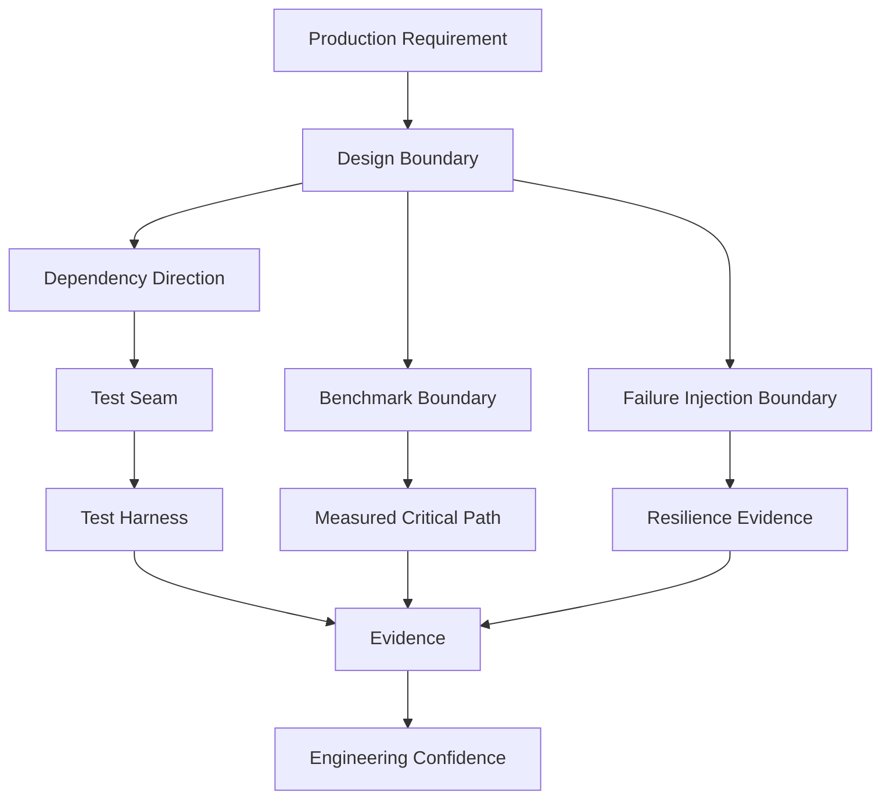
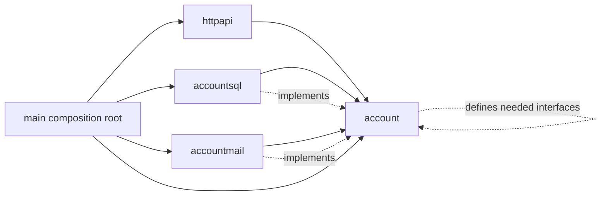
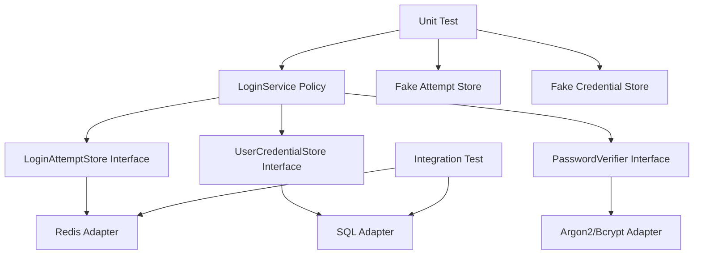
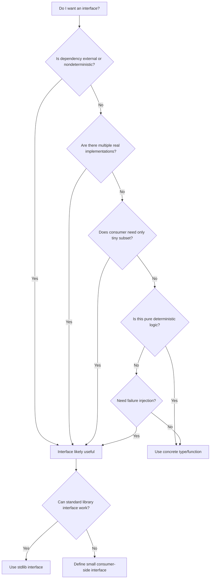
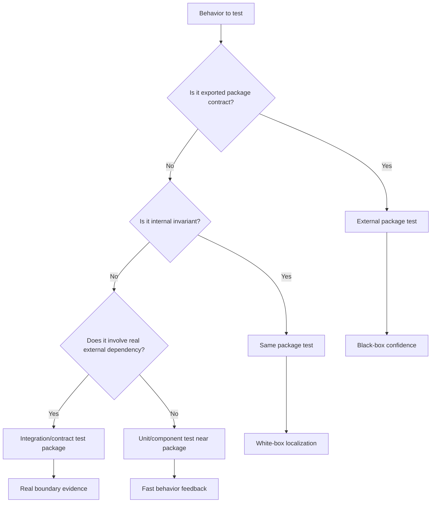
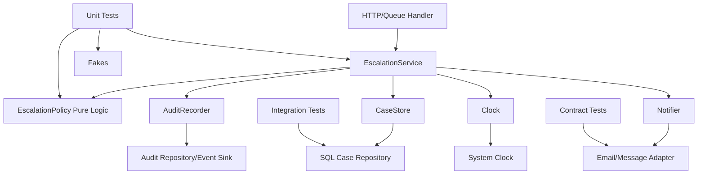
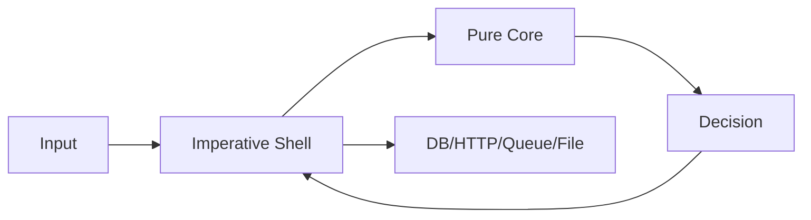

# learn-go-testing-benchmarking-performance-engineering-part-003.md

# Part 003 — Testable Go Design: API Boundary, Dependency Direction, Seams, Ports & Adapters

> Series: **Go Testing, Benchmarking, Performance Engineering**  
> Target: **Go 1.26.x**  
> Audience: **Java software engineer / tech lead moving toward top-tier Go engineering judgment**  
> Status: **Part 003 of 034**

---

## 0. Apa tujuan part ini?

Part sebelumnya membahas **taxonomy test**: unit, component, integration, contract, E2E, smoke, soak, benchmark, load, dan seterusnya. Tetapi taxonomy saja tidak cukup. Banyak codebase gagal dites bukan karena engineer tidak tahu `go test`, tetapi karena **desain kode tidak memberi seam yang tepat**.

Bagian ini menjawab pertanyaan inti:

> Bagaimana mendesain Go package, API boundary, dependency direction, dan seams agar kode mudah dites, mudah dibenchmark, dan tetap idiomatic — tanpa berubah menjadi over-engineered dependency-injection framework ala Java enterprise?

Di Java, testability sering dicapai melalui framework: Spring DI container, Mockito, interface-per-class, annotation, proxy, bean lifecycle, test slice, test context, dan sebagainya. Di Go, pendekatan seperti itu biasanya menjadi beban. Go lebih suka desain eksplisit: constructor sederhana, interface kecil, dependency sebagai value, package boundary jelas, dan fake yang mudah dibuat.

Part ini bukan tentang syntax test. Ini tentang **arsitektur testability**.

---

## 1. Sumber dan landasan resmi

Beberapa landasan yang dipakai di seri ini:

1. Package `testing` adalah package standard library resmi untuk automated testing Go dan dipakai bersama perintah `go test`. Dokumentasinya menjelaskan bentuk function test, benchmark, fuzz target, cleanup, temp dir, subtest, dan parallel test.  
   Source: <https://pkg.go.dev/testing>

2. Effective Go menekankan idiom Go seperti interface yang kecil, composition, naming, package organization, dan error handling. Meski bukan dokumen testing khusus, prinsip desainnya sangat memengaruhi testability.  
   Source: <https://go.dev/doc/effective_go>

3. Go Code Review Comments adalah kumpulan komentar review umum dari komunitas Go. Dokumen ini bukan style guide lengkap, tetapi sering dipakai sebagai referensi idiom, termasuk interface, package comment, receiver, error string, dan struktur kode.  
   Source: <https://go.dev/wiki/CodeReviewComments>

4. Dokumentasi Go test command dan `go help test` menjelaskan model eksekusi `go test`, test cache, package list mode, local directory mode, dan flag terkait.  
   Source: <https://pkg.go.dev/cmd/go#hdr-Test_packages>

5. Go 1.26 menambah dan memperbarui beberapa hal yang relevan ke workflow modern, tetapi prinsip desain testable Go tetap stabil: explicit dependency, small interface, deterministic boundary, dan package-oriented API.  
   Source: <https://go.dev/doc/go1.26>

---

## 2. Inti mental model: testability adalah properti desain, bukan properti test file

Banyak engineer berpikir:

> “Nanti kalau code selesai, kita tambahkan test.”

Itu mindset yang membuat test menjadi sulit, lambat, brittle, dan mahal.

Dalam sistem production-grade, testability harus dianggap sebagai salah satu properti desain, setara dengan:

- correctness,
- maintainability,
- performance,
- security,
- observability,
- operability,
- regulatory defensibility,
- dan evolvability.

Kode yang testable bukan berarti kode penuh interface dan mock. Kode yang testable berarti:

1. behavior bisa diamati secara deterministik,
2. dependency eksternal bisa dikontrol,
3. state bisa diisolasi,
4. failure path bisa dipicu tanpa hack,
5. time/randomness/environment bisa distabilkan,
6. concurrency bisa dikoordinasikan,
7. benchmark bisa memisahkan setup dari path yang diukur,
8. package boundary membantu test, bukan melawannya.

### Diagram mental model



Part ini fokus pada node tengah: **Design Boundary → Dependency Direction → Test Seam**.

---

## 3. Istilah penting

Sebelum masuk detail, samakan bahasa.

### 3.1 API boundary

API boundary adalah batas yang menentukan:

- siapa boleh memanggil siapa,
- data apa yang boleh masuk/keluar,
- invariant apa yang dijaga,
- error apa yang mungkin muncul,
- dependency apa yang tidak boleh bocor,
- dan behavior apa yang dijanjikan.

API boundary tidak selalu berarti public exported API. Dalam Go, boundary bisa berupa:

- package boundary,
- exported function/type,
- unexported type dengan exported constructor,
- interface kecil,
- handler boundary,
- repository boundary,
- clock/random boundary,
- filesystem boundary,
- network boundary,
- transaction boundary.

### 3.2 Dependency direction

Dependency direction menjawab:

> Modul mana yang mengetahui detail modul lain?

Dalam desain yang testable, domain/use-case layer sebaiknya tidak tahu detail DB, HTTP client, queue, filesystem, dan clock real. Detail itu disuntikkan dari luar melalui boundary yang eksplisit.

### 3.3 Seam

Seam adalah titik di mana behavior bisa diganti dalam test tanpa mengubah kode produksi secara invasif.

Contoh seam:

- interface kecil untuk `EmailSender`,
- function value untuk `Now`,
- `io.Reader` untuk input stream,
- `http.RoundTripper` untuk fake HTTP transport,
- `fs.FS` untuk filesystem abstraction,
- `context.Context` untuk cancellation,
- constructor parameter untuk repository,
- unexported variable only jika sangat terkendali,
- build tag only jika benar-benar perlu.

### 3.4 Harness

Harness adalah infrastruktur test di sekitar subject under test:

- fake dependency,
- fixture builder,
- temp dir,
- test server,
- seeded data,
- cleanup logic,
- golden file,
- benchmark setup,
- load scenario,
- failure injector.

Seam adalah desain di production code. Harness adalah desain di test code.

---

## 4. Perbedaan besar dari Java mindset

Sebagai Java engineer, beberapa kebiasaan perlu diterjemahkan ulang.

| Java/Spring habit | Risiko saat dibawa mentah ke Go | Cara berpikir Go |
|---|---|---|
| Interface untuk hampir setiap service | Banyak interface kosong nilai, noise tinggi | Interface muncul di sisi consumer saat ada variasi behavior nyata |
| Mockito-heavy tests | Test memverifikasi interaksi internal, bukan behavior | Fake sederhana + state assertion + boundary assertion |
| DI container sebagai default | Lifecycle implisit, wiring sulit dibaca | Constructor eksplisit, wiring di `main` atau composition root |
| Annotation/config magic | Sulit dilacak dan sulit dibenchmark | Plain values, functions, structs |
| Class hierarchy | Go tidak punya inheritance class | Composition + small interfaces |
| Test context besar | Test lambat dan brittle | Narrow subject + controlled dependency |
| Mock database repository untuk semua test | Bisa menipu contract persistence | Pisahkan unit/component/integration sesuai risiko |
| Global singleton | Test order dependency | Dependency explicit atau package-level immutable config |

Go bukan anti-abstraction. Go anti-abstraction yang tidak membayar cost-nya.

---

## 5. Prinsip utama desain testable Go

Ada 12 prinsip inti.

---

## 5.1 Prinsip 1 — Desain package sebagai unit responsibility, bukan folder kosmetik

Dalam Go, package adalah unit kompilasi, unit API, unit test, dan unit dependency. Ini jauh lebih penting daripada folder di Java.

Package yang baik punya:

- nama singkat dan bermakna,
- API kecil,
- responsibility jelas,
- dependency minimal,
- internal invariant yang tersembunyi,
- test yang dekat dengan behavior.

Package yang buruk sering punya gejala:

- `common`, `util`, `helper`, `manager`, `service` terlalu umum,
- circular dependency hampir terjadi,
- setiap package import banyak detail infra,
- test perlu setup separuh aplikasi,
- exported type terlalu banyak,
- invariant bocor ke caller.

### Contoh buruk

```text
internal/
  common/
    util.go
    db.go
    http.go
    validator.go
    mapper.go
  service/
    user_service.go
    notification_service.go
  repository/
    user_repository.go
  model/
    user.go
```

Masalahnya bukan nama folder semata. Masalahnya dependency direction sering kabur. `service` import `repository`, `repository` import `model`, `common` import semuanya, lalu test harus tahu semuanya.

### Contoh lebih baik

```text
internal/
  account/
    user.go
    password_policy.go
    registration.go
    registration_test.go
  accountsql/
    repository.go
    repository_integration_test.go
  accountmail/
    sender.go
  httpapi/
    account_handler.go
    account_handler_test.go
```

Di sini:

- `account` berisi domain/use-case,
- `accountsql` berisi adapter persistence,
- `accountmail` adapter email,
- `httpapi` adapter delivery.

Testability meningkat karena package boundary mencerminkan behavior boundary.

### Package boundary diagram



Catatan penting: panah compile-time aktual di Go harus dirancang hati-hati. Biasanya adapter import domain jika perlu type domain. Domain tidak import adapter.

---

## 5.2 Prinsip 2 — Let consumers define interfaces

Salah satu idiom Go paling penting:

> Interface sebaiknya didefinisikan oleh consumer, bukan producer, kecuali interface itu memang bagian dari public protocol yang luas.

### Producer-defined interface anti-pattern

```go
package email

type Sender interface {
    Send(ctx context.Context, to string, subject string, body string) error
}

type SMTPSender struct {
    // ...
}

func (s *SMTPSender) Send(ctx context.Context, to string, subject string, body string) error {
    // ...
    return nil
}
```

Ini tidak selalu salah, tetapi sering premature. Producer mendeklarasikan interface untuk dirinya sendiri, padahal belum tahu consumer butuh subset apa.

### Consumer-defined interface

```go
package account

type EmailSender interface {
    SendWelcomeEmail(ctx context.Context, user User) error
}

type RegistrationService struct {
    emails EmailSender
}

func NewRegistrationService(emails EmailSender) *RegistrationService {
    return &RegistrationService{emails: emails}
}
```

Adapter email kemudian cukup implement method yang dibutuhkan use case.

```go
package accountmail

type Sender struct {
    client SMTPClient
}

func (s *Sender) SendWelcomeEmail(ctx context.Context, user account.User) error {
    // translate domain intent to SMTP message
    return nil
}
```

Kenapa ini membantu test?

- test `account` bisa membuat fake kecil,
- interface hanya memuat behavior yang dipakai,
- perubahan SMTP tidak memengaruhi domain test,
- tidak perlu mock besar,
- domain menyatakan dependency semantic, bukan dependency teknis.

### Rule of thumb

Buat interface saat:

1. ada lebih dari satu implementasi nyata atau test fake bernilai tinggi,
2. caller hanya butuh subset kecil dari concrete type,
3. boundary melewati process/network/storage/time/randomness,
4. interface merepresentasikan capability, bukan class,
5. interface membantu dependency direction.

Jangan buat interface saat:

1. hanya untuk mengikuti kebiasaan Java,
2. semua method concrete type dimirror 1:1,
3. interface berada di package producer tanpa alasan kuat,
4. interface punya 10+ method dan tidak stabil,
5. test hanya ingin memeriksa internal call count.

---

## 5.3 Prinsip 3 — Prefer concrete types until abstraction earns its place

Go nyaman dengan concrete type. Tidak semua dependency perlu interface.

### Concrete type yang justru lebih testable

```go
type PasswordPolicy struct {
    MinLength      int
    RequireDigit   bool
    RequireSymbol  bool
}

func (p PasswordPolicy) Validate(password string) error {
    // pure deterministic logic
    return nil
}
```

Tidak perlu interface:

```go
type PasswordPolicy interface {
    Validate(password string) error
}
```

Jika policy hanya pure value object, concrete type lebih jelas dan lebih mudah dites.

### Kapan concrete type cukup?

- Pure computation.
- Stateless service.
- Value object.
- Parser deterministic.
- Validator deterministic.
- Mapper deterministic.
- Algorithm dengan input/output jelas.
- Struct kecil tanpa external effect.

### Kapan perlu interface?

- Network client.
- Database boundary.
- Queue boundary.
- Filesystem boundary.
- Clock/time.
- Randomness.
- External identity provider.
- Payment/notification provider.
- Expensive dependency.
- Non-deterministic dependency.
- Dependency yang perlu failure injection.

---

## 5.4 Prinsip 4 — Make side effects explicit

Kode sulit dites jika side effect tersembunyi.

Side effect termasuk:

- membaca waktu sekarang,
- generate UUID/random,
- membaca env var,
- membaca file,
- menulis file,
- membuka network connection,
- query database,
- publish message,
- spawn goroutine,
- memakai global cache,
- logging yang memengaruhi flow,
- sleep/retry.

### Buruk: side effect tersembunyi

```go
func RegisterUser(email string, password string) error {
    now := time.Now()
    id := uuid.NewString()
    dsn := os.Getenv("DB_DSN")

    db, err := sql.Open("postgres", dsn)
    if err != nil {
        return err
    }
    defer db.Close()

    _, err = db.Exec("INSERT ...", id, email, password, now)
    return err
}
```

Masalah:

- tidak bisa mengontrol time,
- tidak bisa mengontrol ID,
- env dependency tersembunyi,
- DB dibuka di dalam function,
- sulit memicu failure path tertentu,
- benchmark akan mengukur connection setup,
- test butuh real DB padahal behavior registration belum tentu butuh DB.

### Lebih baik: explicit dependencies

```go
type Clock interface {
    Now() time.Time
}

type IDGenerator interface {
    NewID() string
}

type UserStore interface {
    InsertUser(ctx context.Context, user UserRecord) error
}

type RegistrationService struct {
    clock Clock
    ids   IDGenerator
    users UserStore
}

func NewRegistrationService(clock Clock, ids IDGenerator, users UserStore) *RegistrationService {
    return &RegistrationService{
        clock: clock,
        ids:   ids,
        users: users,
    }
}

func (s *RegistrationService) Register(ctx context.Context, email string, password string) error {
    user := UserRecord{
        ID:        s.ids.NewID(),
        Email:     email,
        Password:  password,
        CreatedAt: s.clock.Now(),
    }
    return s.users.InsertUser(ctx, user)
}
```

Test bisa mengontrol seluruh side effect:

```go
type fakeClock struct{ now time.Time }

func (c fakeClock) Now() time.Time { return c.now }

type fixedID struct{ id string }

func (g fixedID) NewID() string { return g.id }

type recordingUserStore struct {
    inserted []UserRecord
    err      error
}

func (s *recordingUserStore) InsertUser(ctx context.Context, user UserRecord) error {
    if s.err != nil {
        return s.err
    }
    s.inserted = append(s.inserted, user)
    return nil
}
```

Ini bukan “terlalu banyak abstraction” jika boundary tersebut memang non-deterministic dan external.

---

## 5.5 Prinsip 5 — Keep constructors boring and explicit

Constructor di Go biasanya function biasa:

```go
func NewService(repo Repository, clock Clock, logger *slog.Logger) *Service {
    return &Service{repo: repo, clock: clock, logger: logger}
}
```

Constructor yang baik:

- menerima dependency sebagai parameter,
- melakukan validasi ringan,
- tidak membuka network connection kecuali namanya jelas,
- tidak spawn goroutine secara diam-diam,
- tidak membaca env var secara diam-diam,
- tidak melakukan heavy IO,
- mudah dipakai di test.

### Constructor buruk

```go
func NewService() *Service {
    db, err := sql.Open("postgres", os.Getenv("DB_DSN"))
    if err != nil {
        panic(err)
    }

    client := http.DefaultClient
    go startBackgroundSync(db, client)

    return &Service{db: db, client: client}
}
```

Masalah:

- test tidak bisa mengontrol DB,
- env dependency tersembunyi,
- goroutine lifecycle tidak jelas,
- panic di constructor,
- benchmark setup tercampur,
- cleanup sulit.

### Constructor lebih baik

```go
type ServiceConfig struct {
    MaxRetries int
}

type Service struct {
    repo   Repository
    client ExternalClient
    clock  Clock
    cfg    ServiceConfig
}

func NewService(repo Repository, client ExternalClient, clock Clock, cfg ServiceConfig) (*Service, error) {
    if repo == nil {
        return nil, errors.New("repo is required")
    }
    if client == nil {
        return nil, errors.New("client is required")
    }
    if clock == nil {
        return nil, errors.New("clock is required")
    }
    if cfg.MaxRetries < 0 {
        return nil, errors.New("max retries must be non-negative")
    }
    return &Service{repo: repo, client: client, clock: clock, cfg: cfg}, nil
}
```

### Composition root

Wiring dependency real sebaiknya terjadi di composition root:

```go
func main() {
    cfg := loadConfig()
    db := openDB(cfg.DatabaseDSN)
    httpClient := &http.Client{Timeout: cfg.HTTPTimeout}

    repo := accountsql.NewRepository(db)
    mailer := accountmail.NewSender(httpClient, cfg.MailEndpoint)
    clock := systemClock{}

    svc, err := account.NewRegistrationService(repo, mailer, clock, cfg.Account)
    if err != nil {
        log.Fatal(err)
    }

    server := httpapi.NewServer(svc)
    log.Fatal(server.ListenAndServe())
}
```

Test tidak perlu menjalankan `main`. Test membuat composition root kecil sesuai kebutuhan.

---

## 5.6 Prinsip 6 — Separate policy from mechanism

Ini sangat penting untuk testing dan performance engineering.

- **Policy**: keputusan bisnis/aturan/invariant.
- **Mechanism**: cara teknis menjalankan keputusan itu.

Contoh:

- Policy: user locked setelah 5 gagal login.
- Mechanism: counter disimpan di Redis.
- Policy: request timeout 2 detik.
- Mechanism: `context.WithTimeout` dan HTTP client timeout.
- Policy: retry maksimal 3 kali untuk 503.
- Mechanism: loop retry dengan backoff.
- Policy: only owner can update document.
- Mechanism: query DB dan check role.

### Buruk: policy bercampur mechanism

```go
func Login(ctx context.Context, db *sql.DB, redis *redis.Client, email, password string) error {
    count, err := redis.Get(ctx, "fail:"+email).Int()
    if err != nil && err != redis.Nil {
        return err
    }
    if count >= 5 {
        return ErrLocked
    }

    row := db.QueryRowContext(ctx, "SELECT password_hash FROM users WHERE email=$1", email)
    // ...

    if passwordWrong {
        redis.Incr(ctx, "fail:"+email)
        return ErrInvalidCredentials
    }

    redis.Del(ctx, "fail:"+email)
    return nil
}
```

Unit test policy login harus membawa DB dan Redis. Itu tanda desain terlalu melekat.

### Lebih baik: policy service + mechanism adapter

```go
type LoginAttemptStore interface {
    FailedCount(ctx context.Context, email string) (int, error)
    RecordFailure(ctx context.Context, email string) error
    ClearFailures(ctx context.Context, email string) error
}

type UserCredentialStore interface {
    PasswordHashByEmail(ctx context.Context, email string) ([]byte, error)
}

type PasswordVerifier interface {
    Verify(hash []byte, password string) bool
}

type LoginPolicy struct {
    MaxFailures int
}

type LoginService struct {
    attempts LoginAttemptStore
    users    UserCredentialStore
    verifier PasswordVerifier
    policy   LoginPolicy
}
```

Sekarang policy bisa dites dengan fake store. Redis behavior dites terpisah di adapter integration test.

### Diagram split



---

## 5.7 Prinsip 7 — Use standard library interfaces as seams

Go standard library sudah menyediakan banyak seam natural. Gunakan sebelum membuat interface sendiri.

### `io.Reader` / `io.Writer`

Jika function membaca byte stream:

```go
func DecodeUsers(r io.Reader) ([]User, error) {
    var users []User
    dec := json.NewDecoder(r)
    if err := dec.Decode(&users); err != nil {
        return nil, err
    }
    return users, nil
}
```

Test:

```go
func TestDecodeUsers(t *testing.T) {
    input := strings.NewReader(`[{"id":"u1","email":"a@example.com"}]`)

    users, err := DecodeUsers(input)
    if err != nil {
        t.Fatal(err)
    }
    if len(users) != 1 {
        t.Fatalf("len(users) = %d, want 1", len(users))
    }
}
```

Tidak perlu interface custom `UserFileReader`.

### `fs.FS`

Untuk filesystem read-only:

```go
func LoadTemplates(fsys fs.FS) (map[string]string, error) {
    entries, err := fs.ReadDir(fsys, ".")
    if err != nil {
        return nil, err
    }
    out := make(map[string]string)
    for _, entry := range entries {
        if entry.IsDir() {
            continue
        }
        data, err := fs.ReadFile(fsys, entry.Name())
        if err != nil {
            return nil, err
        }
        out[entry.Name()] = string(data)
    }
    return out, nil
}
```

Test bisa pakai `fstest.MapFS`.

### `http.RoundTripper`

Untuk HTTP client dependency, sering lebih baik fake transport daripada fake whole client.

```go
type roundTripFunc func(*http.Request) (*http.Response, error)

func (f roundTripFunc) RoundTrip(req *http.Request) (*http.Response, error) {
    return f(req)
}

func newTestClient(fn roundTripFunc) *http.Client {
    return &http.Client{Transport: fn}
}
```

Ini memungkinkan test assert request dan return response tanpa server real.

### `context.Context`

Context bukan tempat menyimpan dependency. Context adalah seam untuk:

- cancellation,
- deadline,
- request scoped values yang sangat terbatas,
- propagation boundary.

Jangan menyimpan repository, logger besar, config, atau service locator di context.

---

## 5.8 Prinsip 8 — Model time explicitly

Time adalah salah satu sumber flakiness terbesar.

### Buruk

```go
func IsExpired(expiresAt time.Time) bool {
    return time.Now().After(expiresAt)
}
```

Test harus bergantung ke waktu aktual.

### Lebih baik untuk pure function

```go
func IsExpired(now time.Time, expiresAt time.Time) bool {
    return now.After(expiresAt)
}
```

Jika function bagian dari service:

```go
type Clock interface {
    Now() time.Time
}

type SystemClock struct{}

func (SystemClock) Now() time.Time { return time.Now() }
```

### Timer dan sleep

Hindari `time.Sleep` di test kecuali benar-benar menguji real time. Untuk retry/backoff logic, pisahkan policy dari waiting mechanism.

```go
type Sleeper interface {
    Sleep(ctx context.Context, d time.Duration) error
}
```

Namun jangan langsung membuat interface `Sleeper` di semua tempat. Sering lebih baik membuat retry policy pure:

```go
type BackoffPolicy struct {
    Base time.Duration
    Max  time.Duration
}

func (p BackoffPolicy) Delay(attempt int) time.Duration {
    // deterministic calculation
}
```

Lalu mekanisme sleep dites di level lebih tinggi.

---

## 5.9 Prinsip 9 — Make randomness injectable or seedable

Randomness membuat test sulit direproduksi jika tidak dikontrol.

### Untuk logic deterministic

```go
type TokenGenerator struct {
    rand io.Reader
}

func NewTokenGenerator(rand io.Reader) *TokenGenerator {
    return &TokenGenerator{rand: rand}
}

func (g *TokenGenerator) Generate(n int) ([]byte, error) {
    b := make([]byte, n)
    if _, err := io.ReadFull(g.rand, b); err != nil {
        return nil, err
    }
    return b, nil
}
```

Production pakai `crypto/rand.Reader`. Test pakai reader deterministik.

```go
g := NewTokenGenerator(bytes.NewReader([]byte{1, 2, 3, 4}))
```

### Catatan keamanan

Untuk crypto/security boundary, jangan mengganti randomness sembarangan di production path. Injection dipakai untuk testability, tetapi default production harus aman.

---

## 5.10 Prinsip 10 — Avoid global mutable state

Global mutable state adalah musuh test isolation.

### Buruk

```go
var defaultClient = &http.Client{}
var currentTenant string
var cache = map[string]User{}

func FetchUser(ctx context.Context, id string) (User, error) {
    req, _ := http.NewRequestWithContext(ctx, http.MethodGet, "/users/"+id, nil)
    req.Header.Set("X-Tenant", currentTenant)
    // use defaultClient and cache
}
```

Masalah:

- test saling mengganggu,
- parallel test berbahaya,
- order dependency,
- benchmark state sulit direset,
- race risk.

### Lebih baik

```go
type Client struct {
    httpClient *http.Client
    tenant     string
    cache      Cache
}

func NewClient(httpClient *http.Client, tenant string, cache Cache) *Client {
    return &Client{httpClient: httpClient, tenant: tenant, cache: cache}
}
```

Jika butuh default, buat immutable default config atau constructor helper:

```go
func NewDefaultClient(tenant string) *Client {
    return NewClient(http.DefaultClient, tenant, NewNoopCache())
}
```

### Kapan global bisa diterima?

- constants,
- immutable lookup table,
- package-level var yang tidak berubah setelah init,
- `sync.Once` untuk expensive immutable data,
- truly process-wide resource yang lifecycle-nya jelas.

Tetap hati-hati: “process-wide” sering hanya alasan untuk menghindari desain boundary.

---

## 5.11 Prinsip 11 — Expose behavior, hide representation

Test sebaiknya memverifikasi behavior yang dijanjikan API, bukan detail internal.

### Buruk

```go
func TestCacheInternalMap(t *testing.T) {
    c := NewCache()
    c.Set("a", "1")

    if c.items["a"].value != "1" {
        t.Fatal("wrong internal value")
    }
}
```

Test seperti ini mengunci representasi internal. Kalau cache berubah dari map ke sharded map, test pecah padahal behavior benar.

### Lebih baik

```go
func TestCacheGetAfterSet(t *testing.T) {
    c := NewCache()
    c.Set("a", "1")

    got, ok := c.Get("a")
    if !ok {
        t.Fatal("Get returned ok=false, want true")
    }
    if got != "1" {
        t.Fatalf("Get = %q, want %q", got, "1")
    }
}
```

### Kapan internal boleh dites?

Go memungkinkan test di package yang sama untuk mengakses unexported member. Ini berguna, tetapi jangan berlebihan.

Internal test layak jika:

- invariant internal sangat kritis,
- exported API terlalu kasar untuk memicu edge case,
- algorithm kompleks butuh test granular,
- failure localization penting,
- representasi internal memang bagian dari correctness/performance contract package.

Namun exported behavior test tetap harus ada.

---

## 5.12 Prinsip 12 — Design for benchmark boundaries early

Testing dan benchmarking punya kebutuhan desain yang mirip:

- bisa membuat subject tanpa expensive setup,
- bisa mengontrol dependency,
- bisa reset state,
- bisa mengisolasi path yang diukur,
- bisa menghindari hidden IO,
- bisa menghindari global mutable state,
- bisa memisahkan cold path dan hot path.

### Buruk untuk benchmark

```go
func ProcessFile(path string) error {
    data, err := os.ReadFile(path)
    if err != nil {
        return err
    }
    records := parse(data)
    return save(records)
}
```

Benchmark `ProcessFile` akan mencampur:

- filesystem read,
- allocation data,
- parsing,
- validation,
- persistence.

### Lebih benchmarkable

```go
func ParseRecords(data []byte) ([]Record, error) {
    // hot pure-ish path
}

func LoadRecords(path string) ([]Record, error) {
    data, err := os.ReadFile(path)
    if err != nil {
        return nil, err
    }
    return ParseRecords(data)
}

func SaveRecords(ctx context.Context, store RecordStore, records []Record) error {
    // persistence boundary
}
```

Sekarang benchmark bisa memilih:

- benchmark parser only,
- benchmark loader with filesystem,
- benchmark save with fake store,
- benchmark full scenario.

---

# 6. Boundary design by dependency type

Bagian ini memberi pola konkret untuk dependency umum.

---

## 6.1 Clock boundary

### Interface minimal

```go
type Clock interface {
    Now() time.Time
}
```

### Fake

```go
type FakeClock struct {
    now time.Time
}

func NewFakeClock(now time.Time) *FakeClock {
    return &FakeClock{now: now}
}

func (c *FakeClock) Now() time.Time {
    return c.now
}

func (c *FakeClock) Advance(d time.Duration) {
    c.now = c.now.Add(d)
}
```

### Kapan cukup parameter `now time.Time`?

Jika function pure dan hanya butuh waktu sekali:

```go
func ShouldExpire(now, lastSeen time.Time, ttl time.Duration) bool {
    return now.Sub(lastSeen) > ttl
}
```

Jangan membuat `Clock` jika parameter `now` cukup.

---

## 6.2 Random/ID boundary

### Interface semantic

```go
type IDGenerator interface {
    NewUserID() string
}
```

Atau generic capability:

```go
type StringIDGenerator interface {
    NewID() string
}
```

Pilih berdasarkan domain. Jika ID punya semantic penting, `NewUserID` lebih jelas.

### Avoid hidden UUID

```go
func NewUser(email string) User {
    return User{ID: uuid.NewString(), Email: email}
}
```

Lebih testable:

```go
func NewUser(id string, email string) User {
    return User{ID: id, Email: email}
}
```

Atau service yang inject generator.

---

## 6.3 HTTP outbound boundary

Ada tiga level seam.

### Level 1 — fake `http.RoundTripper`

Cocok untuk client library test.

```go
type APIClient struct {
    baseURL string
    client  *http.Client
}

func NewAPIClient(baseURL string, client *http.Client) *APIClient {
    if client == nil {
        client = http.DefaultClient
    }
    return &APIClient{baseURL: baseURL, client: client}
}
```

Test inject `http.Client{Transport: fake}`.

### Level 2 — `httptest.Server`

Cocok jika ingin test HTTP behavior lebih real:

- path,
- header,
- serialization,
- timeout,
- redirect,
- status code,
- server behavior.

### Level 3 — domain interface

Cocok jika use-case tidak peduli HTTP detail.

```go
type IdentityProvider interface {
    LookupUser(ctx context.Context, token string) (ExternalUser, error)
}
```

Adapter HTTP dites sendiri. Use-case test pakai fake `IdentityProvider`.

### Decision

| Need | Seam |
|---|---|
| Test request construction | fake `RoundTripper` |
| Test real HTTP handler/client interaction | `httptest.Server` |
| Test domain behavior independent from HTTP | domain interface |
| Test production external contract | integration/contract test |

---

## 6.4 Database boundary

Database adalah area yang paling sering over-mocked.

### Anti-pattern: repository mock untuk semua hal

Jika semua test memakai mock repository, kita mungkin tidak pernah membuktikan:

- SQL benar,
- transaction benar,
- constraint benar,
- isolation behavior benar,
- nullable mapping benar,
- scan type benar,
- migration compatible,
- performance query acceptable.

### Pattern sehat

Pisahkan:

1. domain/use-case unit test dengan fake store,
2. repository integration test dengan real DB/test container/test schema,
3. transaction behavior test,
4. query performance benchmark jika query critical,
5. migration test.

### Repository interface di domain

```go
type AccountStore interface {
    FindByEmail(ctx context.Context, email string) (Account, error)
    Save(ctx context.Context, account Account) error
}
```

### SQL implementation di adapter

```go
type Repository struct {
    db *sql.DB
}

func NewRepository(db *sql.DB) *Repository {
    return &Repository{db: db}
}
```

### Transaction boundary

Transaction sering butuh desain khusus.

Buruk:

```go
func (s *Service) Transfer(ctx context.Context, from, to string, amount int64) error {
    tx, err := s.db.BeginTx(ctx, nil)
    // domain logic mixed with SQL tx
}
```

Lebih baik:

```go
type Transactor interface {
    WithinTx(ctx context.Context, fn func(ctx context.Context) error) error
}
```

Lalu store membaca transaction dari context? Hati-hati. Context bukan service locator. Alternatif yang lebih eksplisit:

```go
type UnitOfWork interface {
    Accounts() AccountStore
    Ledger() LedgerStore
}

type Transactor interface {
    WithinTx(ctx context.Context, fn func(ctx context.Context, uow UnitOfWork) error) error
}
```

Ini lebih verbose, tetapi untuk sistem finansial/regulasi sering lebih defensible.

---

## 6.5 Queue/message boundary

Message boundary perlu memisahkan:

- domain event,
- serialization,
- transport topic/queue,
- retry/dead-letter,
- idempotency,
- ack/nack behavior.

Use-case sebaiknya tidak tahu RabbitMQ/Kafka API.

```go
type EventPublisher interface {
    PublishUserRegistered(ctx context.Context, event UserRegistered) error
}
```

Adapter:

```go
type KafkaPublisher struct {
    writer *kafka.Writer
}
```

Test use-case:

```go
type recordingPublisher struct {
    events []UserRegistered
    err    error
}

func (p *recordingPublisher) PublishUserRegistered(ctx context.Context, event UserRegistered) error {
    if p.err != nil {
        return p.err
    }
    p.events = append(p.events, event)
    return nil
}
```

Integration test adapter membuktikan serialization dan broker behavior.

---

## 6.6 Filesystem boundary

Gunakan `fs.FS` untuk read-only. Untuk write operation, standard library belum punya satu interface universal yang cukup. Pilihan:

1. inject base directory + use `t.TempDir`,
2. buat interface kecil semantic,
3. pakai adapter kecil untuk file writer,
4. gunakan `io.Writer` jika output stream cukup.

### Example

```go
type ReportWriter interface {
    WriteReport(ctx context.Context, name string, data []byte) error
}
```

Atau:

```go
func WriteReport(w io.Writer, report Report) error {
    enc := json.NewEncoder(w)
    return enc.Encode(report)
}
```

Pisahkan encode dari filesystem write.

---

## 6.7 Environment/config boundary

Jangan membaca env var di business logic.

Buruk:

```go
func MaxUploadSize() int64 {
    v := os.Getenv("MAX_UPLOAD_SIZE")
    n, _ := strconv.ParseInt(v, 10, 64)
    return n
}
```

Lebih baik:

```go
type UploadConfig struct {
    MaxSizeBytes int64
}

func ValidateUpload(cfg UploadConfig, size int64) error {
    if size > cfg.MaxSizeBytes {
        return ErrUploadTooLarge
    }
    return nil
}
```

Env parsing dites terpisah:

```go
func LoadConfigFromEnv() (Config, error) {
    // parse os.Getenv once near application boundary
}
```

Go test menyediakan `t.Setenv` untuk test yang memang perlu env mutation, tetapi parallel test dengan env global harus hati-hati.

---

## 6.8 Logger boundary

Logging bukan behavior utama kebanyakan unit test. Jangan membuat test terlalu tergantung ke exact log string.

Pilihan:

1. accept `*slog.Logger`,
2. accept interface kecil jika butuh capture,
3. use `io.Discard` handler di test,
4. assert log hanya jika log adalah compliance/audit behavior.

### Example

```go
type Service struct {
    logger *slog.Logger
}
```

Test:

```go
logger := slog.New(slog.NewTextHandler(io.Discard, nil))
```

Jika audit event adalah business output, jangan treat sebagai log. Modelkan sebagai dependency semantic:

```go
type AuditRecorder interface {
    Record(ctx context.Context, event AuditEvent) error
}
```

Ini penting untuk regulatory systems: audit bukan “debug log”. Audit adalah domain evidence.

---

# 7. Ports & adapters dalam Go tanpa ceremonial architecture

Ports and adapters berguna, tetapi di Go harus ringan.

## 7.1 Struktur sederhana

```text
cmd/app/
  main.go
internal/account/
  registration.go
  user.go
  errors.go
  registration_test.go
internal/accountsql/
  repository.go
  repository_integration_test.go
internal/accountmail/
  sender.go
internal/httpapi/
  server.go
  account_handler.go
  account_handler_test.go
```

Tidak perlu folder `domain`, `application`, `infrastructure` jika hanya membuat noise. Nama package harus mencerminkan capability.

## 7.2 Domain/use-case package

```go
package account

type Store interface {
    Save(ctx context.Context, user User) error
    ExistsByEmail(ctx context.Context, email string) (bool, error)
}

type Mailer interface {
    SendWelcome(ctx context.Context, user User) error
}

type IDGenerator interface {
    NewID() string
}

type Clock interface {
    Now() time.Time
}

type RegistrationService struct {
    store  Store
    mailer Mailer
    ids    IDGenerator
    clock  Clock
}
```

## 7.3 Adapter package

```go
package accountsql

type Repository struct {
    db *sql.DB
}

func NewRepository(db *sql.DB) *Repository {
    return &Repository{db: db}
}

func (r *Repository) Save(ctx context.Context, user account.User) error {
    // SQL implementation
    return nil
}
```

## 7.4 Composition root

```go
package main

func main() {
    db := mustOpenDB()
    repo := accountsql.NewRepository(db)
    mailer := accountmail.NewSender(...)
    svc := account.NewRegistrationService(repo, mailer, realIDs{}, realClock{})
    server := httpapi.NewServer(svc)
    log.Fatal(server.ListenAndServe())
}
```

## 7.5 Test root

```go
func TestRegisterSendsWelcomeEmail(t *testing.T) {
    store := &fakeStore{}
    mailer := &recordingMailer{}
    ids := fixedIDs{"user-1"}
    clock := fixedClock{time.Date(2026, 1, 2, 3, 4, 5, 0, time.UTC)}

    svc := account.NewRegistrationService(store, mailer, ids, clock)

    err := svc.Register(context.Background(), "a@example.com")
    if err != nil {
        t.Fatal(err)
    }

    if len(mailer.sent) != 1 {
        t.Fatalf("sent emails = %d, want 1", len(mailer.sent))
    }
}
```

---

# 8. Internal vs external package tests

Go punya dua style test penting.

## 8.1 Same package test

File:

```text
account/registration_test.go
```

Dengan:

```go
package account
```

Kelebihan:

- bisa akses unexported identifiers,
- cocok untuk invariant internal,
- cocok untuk algorithm detail,
- tidak butuh API exported hanya demi test.

Risiko:

- test terlalu melekat ke implementation,
- refactor internal sering memecahkan test,
- confidence sebagai consumer lebih rendah.

## 8.2 External package test

File:

```go
package account_test
```

Kelebihan:

- test melihat package seperti consumer,
- mencegah API bocor,
- cocok untuk exported contract,
- dokumentasi usage lebih baik.

Risiko:

- sulit memicu internal edge case,
- kadang butuh helper exported,
- bisa mendorong API terlalu lebar jika tidak hati-hati.

## 8.3 Strategy

Gunakan kombinasi:

- external package test untuk public contract,
- same package test untuk internal invariant yang bernilai,
- jangan export hanya demi test kecuali API memang layak.

---

# 9. Designing test helpers without hiding evidence

Test helper yang buruk membuat failure sulit dimengerti.

## 9.1 Helper buruk

```go
func assertUserCreated(t *testing.T, svc *Service, email string) {
    t.Helper()
    err := svc.Register(context.Background(), email)
    if err != nil {
        t.Fatal(err)
    }
    // lots of hidden assertions
}
```

Masalah:

- nama helper tidak menjelaskan semua assert,
- failure message mungkin tidak mencantumkan input,
- terlalu banyak behavior tersembunyi.

## 9.2 Helper baik

```go
func requireNoError(t *testing.T, err error) {
    t.Helper()
    if err != nil {
        t.Fatalf("unexpected error: %v", err)
    }
}

func requireSentEmails(t *testing.T, mailer *recordingMailer, want int) {
    t.Helper()
    if got := len(mailer.sent); got != want {
        t.Fatalf("sent emails = %d, want %d; sent=%+v", got, want, mailer.sent)
    }
}
```

Helper baik:

- kecil,
- punya failure message jelas,
- memakai `t.Helper`,
- tidak menyembunyikan terlalu banyak behavior,
- tidak membuat control flow ajaib.

---

# 10. Fixture builders: powerful tapi mudah disalahgunakan

Fixture builder membantu mengurangi boilerplate, tetapi bisa menyembunyikan invariant.

## 10.1 Buruk: fixture terlalu magic

```go
user := NewTestUser()
```

Apa email-nya? Apa status-nya? Apa role-nya? CreatedAt kapan? Tenant apa?

## 10.2 Lebih baik: explicit defaults + override

```go
type UserBuilder struct {
    user User
}

func NewUserBuilder() UserBuilder {
    return UserBuilder{
        user: User{
            ID:        "user-1",
            Email:     "user@example.com",
            Status:    UserStatusActive,
            CreatedAt: time.Date(2026, 1, 1, 0, 0, 0, 0, time.UTC),
        },
    }
}

func (b UserBuilder) WithEmail(email string) UserBuilder {
    b.user.Email = email
    return b
}

func (b UserBuilder) Suspended() UserBuilder {
    b.user.Status = UserStatusSuspended
    return b
}

func (b UserBuilder) Build() User {
    return b.user
}
```

Test:

```go
user := NewUserBuilder().WithEmail("blocked@example.com").Suspended().Build()
```

Ini readable karena override terlihat.

## 10.3 Builder rule

- default harus valid,
- override harus eksplisit,
- jangan random by default,
- jangan membaca time.Now by default,
- jangan menyembunyikan external setup,
- jangan membuat builder lebih kompleks dari production model.

---

# 11. Fake design: stateful fake vs behavior fake

Fake adalah implementasi sederhana untuk test.

## 11.1 Recording fake

Cocok untuk outbound side effect.

```go
type recordingMailer struct {
    sent []Mail
    err  error
}

func (m *recordingMailer) Send(ctx context.Context, mail Mail) error {
    if m.err != nil {
        return m.err
    }
    m.sent = append(m.sent, mail)
    return nil
}
```

## 11.2 In-memory fake store

Cocok untuk repository-like dependency.

```go
type fakeUserStore struct {
    byEmail map[string]User
    saveErr error
}

func newFakeUserStore() *fakeUserStore {
    return &fakeUserStore{byEmail: make(map[string]User)}
}

func (s *fakeUserStore) ExistsByEmail(ctx context.Context, email string) (bool, error) {
    _, ok := s.byEmail[email]
    return ok, nil
}

func (s *fakeUserStore) Save(ctx context.Context, user User) error {
    if s.saveErr != nil {
        return s.saveErr
    }
    s.byEmail[user.Email] = user
    return nil
}
```

## 11.3 Failure fake

Cocok untuk failure injection.

```go
type failingStore struct {
    err error
}

func (s failingStore) Save(ctx context.Context, user User) error {
    return s.err
}
```

## 11.4 Fake hazard

Fake bisa menipu jika behavior terlalu berbeda dari real dependency.

Contoh fake DB map mungkin tidak mensimulasikan:

- uniqueness constraint,
- transaction isolation,
- null behavior,
- ordering,
- case sensitivity,
- timeout,
- deadlock,
- serialization error.

Solusinya bukan membuang fake, tetapi menempatkan fake di layer yang tepat dan melengkapi dengan integration/contract test.

---

# 12. Mocking: kapan perlu dan kapan merusak

Mock biasanya memverifikasi interaksi:

- method A dipanggil sekali,
- method B dipanggil dengan argumen tertentu,
- urutan call tertentu,
- call tidak terjadi.

Ini berguna untuk beberapa boundary, tetapi mudah membuat test brittle.

## 12.1 Mock layak jika

- external side effect tidak punya state observable lain,
- urutan call adalah bagian contract,
- idempotency/retry behavior perlu diverifikasi,
- expensive dependency tidak bisa difake sederhana,
- compliance/audit emission harus tepat,
- failure injection butuh urutan response.

## 12.2 Mock buruk jika

- hanya memverifikasi implementation detail,
- test pecah setiap refactor internal,
- mock setup lebih panjang dari behavior yang dites,
- mock meniru semua method concrete type,
- mock membuat false confidence terhadap real system.

## 12.3 Prefer spy/recording fake over mock framework

Go sering lebih readable dengan fake manual.

```go
type spyPublisher struct {
    published []Event
}

func (p *spyPublisher) Publish(ctx context.Context, e Event) error {
    p.published = append(p.published, e)
    return nil
}
```

Lalu assert state.

---

# 13. Build tags as seam: powerful but dangerous

Build tags bisa mengganti implementation saat test.

Contoh:

```go
//go:build !test
```

Namun Go tidak otomatis mendefinisikan tag `test` untuk semua `go test`. Mengandalkan build tag sebagai seam sering membuat sistem sulit dipahami.

Build tags layak untuk:

- platform-specific code,
- expensive integration tests,
- optional dependency,
- race-specific behavior,
- generated/system boundary yang memang berbeda.

Build tags tidak ideal untuk:

- mengganti dependency biasa,
- menyembunyikan global state,
- membuat production/test behavior berbeda jauh,
- menghindari constructor injection.

Rule:

> Jika dependency bisa diinjeksi dengan parameter biasa, jangan gunakan build tag sebagai seam.

---

# 14. `internal` package sebagai boundary enforcement

Go punya mekanisme `internal/` yang membatasi import dari luar parent tree.

```text
myapp/
  internal/
    account/
    accountsql/
  pkg/
    publicclient/
```

Package di luar tree tidak bisa import `myapp/internal/account`.

Manfaat testability:

- API internal bisa evolve lebih bebas,
- exported identifiers tidak otomatis public ke dunia luar,
- test bisa tetap berada dekat dengan package,
- boundary organisasi lebih jelas.

Namun `internal` bukan pengganti desain API. Kalau semua hal diexport di dalam `internal`, test masih bisa brittle dan dependency tetap kacau.

---

# 15. Designing for failure injection

Production system gagal dalam banyak cara. Desain testable harus bisa memicu failure tanpa chaos acak.

Failure yang perlu bisa diinjeksi:

- dependency returns error,
- dependency timeout,
- context canceled,
- partial write,
- duplicate key,
- stale version,
- message publish failure,
- retryable vs non-retryable error,
- malformed response,
- slow response,
- permission denied,
- disk full,
- corrupted input,
- clock moves,
- rate limit.

### Pattern

```go
type ExternalClient interface {
    Fetch(ctx context.Context, id string) (Payload, error)
}

type scriptedClient struct {
    responses []scriptedResponse
}

type scriptedResponse struct {
    payload Payload
    err     error
}

func (c *scriptedClient) Fetch(ctx context.Context, id string) (Payload, error) {
    if len(c.responses) == 0 {
        return Payload{}, errors.New("unexpected call")
    }
    r := c.responses[0]
    c.responses = c.responses[1:]
    return r.payload, r.err
}
```

Ini memungkinkan test retry:

```go
client := &scriptedClient{
    responses: []scriptedResponse{
        {err: ErrTemporary},
        {payload: Payload{ID: "x"}},
    },
}
```

---

# 16. Testability and concurrency

Concurrency membuat desain testable lebih menantang. Detail concurrency akan dibahas di part khusus, tetapi desain dasarnya dimulai di sini.

## 16.1 Jangan spawn goroutine tanpa lifecycle

Buruk:

```go
func NewProcessor(queue Queue) *Processor {
    p := &Processor{queue: queue}
    go p.loop()
    return p
}
```

Test tidak tahu kapan goroutine start/stop.

Lebih baik:

```go
type Processor struct {
    queue Queue
}

func NewProcessor(queue Queue) *Processor {
    return &Processor{queue: queue}
}

func (p *Processor) Run(ctx context.Context) error {
    for {
        select {
        case <-ctx.Done():
            return ctx.Err()
        default:
            // work
        }
    }
}
```

Test bisa mengontrol context.

## 16.2 Expose synchronous core

Jika ada async process, usahakan core logic sync dan deterministic.

```go
func (p *Processor) ProcessOne(ctx context.Context, msg Message) error {
    // deterministic unit of work
}

func (p *Processor) Run(ctx context.Context) error {
    for {
        msg, err := p.queue.Receive(ctx)
        if err != nil {
            return err
        }
        if err := p.ProcessOne(ctx, msg); err != nil {
            // handle
        }
    }
}
```

Test `ProcessOne` mudah. Test `Run` difokuskan ke lifecycle.

## 16.3 Use channels carefully as API

Channel sebagai exposed API bisa powerful, tetapi sering membuat contract sulit.

Pertanyaan sebelum expose channel:

- siapa menutup channel?
- apakah send blocking?
- apakah buffer size bagian dari contract?
- bagaimana backpressure?
- bagaimana cancellation?
- bagaimana error dikembalikan?
- apakah order dijamin?

Kadang interface method lebih jelas daripada channel exposed.

---

# 17. Testability and performance

Desain testable juga memengaruhi performance. Abstraction tidak gratis, tetapi tidak semua abstraction mahal secara bermakna.

## 17.1 Jangan mengorbankan desain untuk performa tanpa bukti

Misalnya takut interface call overhead lalu membuat global concrete dependency. Dalam banyak service-level path, overhead interface call tidak signifikan dibanding network/DB/serialization. Tetapi di hot loop algorithm, interface call bisa penting.

Prinsip:

> Di boundary IO/network/storage, desain untuk clarity dan testability. Di hot loop CPU/memory, desain untuk locality dan benchmarkability.

## 17.2 Hot path seam

Untuk hot path, hindari seam per item jika overhead penting.

Buruk untuk hot loop:

```go
for _, item := range items {
    validator.Validate(item) // interface call per item in very hot loop
}
```

Mungkin lebih baik:

```go
func ValidateBatch(policy Policy, items []Item) error {
    // concrete policy, optimized loop
}
```

Tetapi jangan asumsi. Buktikan dengan benchmark.

## 17.3 Benchmarkable design checklist

- subject bisa dibuat sekali sebelum timer,
- input bisa distabilkan,
- output tidak dihilangkan compiler,
- setup dan measured path terpisah,
- dependency external bisa diganti,
- state bisa direset per iteration jika perlu,
- allocation source bisa dilacak,
- parallel benchmark tidak berbagi state tidak sengaja.

---

# 18. API boundary examples: bad → better

## 18.1 Example: user registration

### Bad

```go
func Register(email, password string) error {
    if !strings.Contains(email, "@") {
        return errors.New("invalid email")
    }

    db, _ := sql.Open("postgres", os.Getenv("DSN"))
    defer db.Close()

    id := uuid.NewString()
    now := time.Now()

    _, err := db.Exec("INSERT INTO users ...", id, email, password, now)
    if err != nil {
        return err
    }

    http.Post(os.Getenv("MAIL_URL"), "application/json", strings.NewReader(`...`))
    return nil
}
```

Problems:

- validation, DB, ID, time, email HTTP, env, and error handling mixed,
- impossible to unit test without global hacks,
- benchmark meaningless,
- failure paths hard to trigger,
- no transaction policy,
- external side effect not explicit.

### Better

```go
type RegistrationService struct {
    users  UserStore
    mailer WelcomeMailer
    ids    IDGenerator
    clock  Clock
}

func (s *RegistrationService) Register(ctx context.Context, cmd RegisterCommand) (User, error) {
    email, err := ParseEmail(cmd.Email)
    if err != nil {
        return User{}, err
    }
    if err := ValidatePassword(cmd.Password); err != nil {
        return User{}, err
    }

    exists, err := s.users.ExistsByEmail(ctx, email.String())
    if err != nil {
        return User{}, err
    }
    if exists {
        return User{}, ErrEmailAlreadyRegistered
    }

    user := User{
        ID:        s.ids.NewID(),
        Email:     email,
        CreatedAt: s.clock.Now(),
    }

    if err := s.users.Save(ctx, user); err != nil {
        return User{}, err
    }
    if err := s.mailer.SendWelcome(ctx, user); err != nil {
        return User{}, err
    }

    return user, nil
}
```

Now test can cover:

- invalid email,
- weak password,
- duplicate email,
- store failure,
- mail failure,
- success path,
- deterministic ID/time,
- no real DB/HTTP needed for unit test.

---

## 18.2 Example: report generation

### Bad

```go
func GenerateMonthlyReport(month string) error {
    rows := queryDatabase(month)
    csv := buildCSV(rows)
    path := "/reports/" + month + ".csv"
    return os.WriteFile(path, []byte(csv), 0644)
}
```

### Better

```go
type ReportSource interface {
    MonthlyRows(ctx context.Context, month YearMonth) ([]ReportRow, error)
}

func BuildMonthlyReport(rows []ReportRow) ([]byte, error) {
    var buf bytes.Buffer
    w := csv.NewWriter(&buf)
    // write rows
    w.Flush()
    if err := w.Error(); err != nil {
        return nil, err
    }
    return buf.Bytes(), nil
}

func GenerateMonthlyReport(ctx context.Context, source ReportSource, month YearMonth, out io.Writer) error {
    rows, err := source.MonthlyRows(ctx, month)
    if err != nil {
        return err
    }
    data, err := BuildMonthlyReport(rows)
    if err != nil {
        return err
    }
    _, err = out.Write(data)
    return err
}
```

Benefits:

- report formatting can be tested pure,
- source can be fake,
- output can be `bytes.Buffer`,
- filesystem write tested separately,
- benchmark can measure `BuildMonthlyReport` only.

---

# 19. Anti-pattern catalog

## 19.1 Interface-per-struct

```go
type UserService interface {
    Create(...)
    Update(...)
    Delete(...)
    Find(...)
}

type UserServiceImpl struct{}
```

This is Java-style. In Go, avoid `Impl` naming and avoid producer-side interface unless necessary.

## 19.2 God service

```go
type Service struct {
    db         *sql.DB
    redis      *redis.Client
    kafka      *kafka.Writer
    mail       *http.Client
    logger     *slog.Logger
    everything Everything
}
```

If every test needs giant setup, service boundary is too wide.

## 19.3 Package `common`

`common` often becomes dependency magnet. Prefer domain-specific packages.

## 19.4 Global test hooks

```go
var now = time.Now
```

This can be acceptable in tiny packages, but dangerous in parallel tests. Prefer explicit dependency if behavior matters.

## 19.5 Test-only exported APIs

```go
func ResetGlobalCacheForTest() {}
```

This is a smell. Sometimes necessary, but should trigger design review.

## 19.6 Mocking private implementation

If test checks “method X called before method Y” but user-visible behavior does not require it, test may block refactor.

## 19.7 Constructor doing real work

Constructor that opens network, reads env, starts goroutine, or migrates DB makes tests and benchmarks expensive.

## 19.8 Context as dependency bag

```go
ctx = context.WithValue(ctx, "repo", repo)
```

Avoid. Pass dependencies explicitly.

## 19.9 Sleep-based tests

```go
time.Sleep(100 * time.Millisecond)
```

This creates flakiness. Use synchronization or fake clock where possible.

## 19.10 Over-abstracting pure functions

Do not create interfaces for deterministic functions that can be directly called.

---

# 20. Decision framework: do I need an interface?

Use this decision tree.



---

# 21. Decision framework: where should this test live?



---

# 22. Decision framework: fake, mock, or real dependency?

| Situation | Preferred dependency in test | Why |
|---|---|---|
| Pure business rule | No dependency / concrete value | Fast and deterministic |
| External side effect not central to test | Fake/spy | Observe behavior without real system |
| Retry sequence | Scripted fake/mock | Need ordered responses |
| SQL correctness | Real DB integration | Fake cannot prove SQL |
| HTTP client request format | Fake `RoundTripper` | Assert request construction |
| HTTP protocol behavior | `httptest.Server` | More realistic boundary |
| Filesystem read | `fstest.MapFS` or `t.TempDir` | Controlled filesystem |
| Time expiration | `now` parameter or fake clock | Deterministic |
| Random token | injected `io.Reader` | Deterministic bytes |
| Performance hot loop | Concrete dependency | Avoid artificial interface overhead |
| System-level confidence | Real dependency or contract env | Verify actual integration |

---

# 23. Testability review checklist

Gunakan checklist ini saat review design/PR.

## 23.1 Boundary checklist

- [ ] Apakah package punya responsibility jelas?
- [ ] Apakah dependency direction jelas?
- [ ] Apakah domain/use-case tidak import adapter teknis?
- [ ] Apakah exported API minimal?
- [ ] Apakah invariant dijaga di boundary yang tepat?
- [ ] Apakah error contract jelas?
- [ ] Apakah side effect terlihat dari signature/constructor?

## 23.2 Dependency checklist

- [ ] Apakah DB/network/queue/filesystem/time/randomness tidak tersembunyi?
- [ ] Apakah dependency bisa diganti di test?
- [ ] Apakah interface kecil dan consumer-side?
- [ ] Apakah standard library interface bisa dipakai?
- [ ] Apakah global mutable state dihindari?
- [ ] Apakah constructor tidak melakukan heavy side effect?

## 23.3 Test harness checklist

- [ ] Apakah fake cukup mirip untuk behavior yang diuji?
- [ ] Apakah integration test menutup gap fake?
- [ ] Apakah fixture deterministic?
- [ ] Apakah test bisa parallel?
- [ ] Apakah test tidak bergantung order?
- [ ] Apakah failure path bisa dipicu?
- [ ] Apakah cleanup jelas?

## 23.4 Benchmark checklist

- [ ] Apakah setup bisa dipisahkan dari measured path?
- [ ] Apakah input deterministic?
- [ ] Apakah output digunakan agar tidak dioptimasi hilang?
- [ ] Apakah dependency external bisa dihindari untuk microbenchmark?
- [ ] Apakah scenario benchmark tersedia untuk full path?
- [ ] Apakah global state bisa direset?

---

# 24. Worked design example: regulatory case escalation

Karena konteks engineering Anda dekat dengan lifecycle/case management, kita gunakan contoh regulatory case escalation.

## 24.1 Requirement

- Case bisa dieskalasi jika severity tinggi atau SLA hampir breach.
- Escalation harus mencatat audit event.
- Escalation harus mengirim notification.
- Case state harus berubah secara atomik.
- Jika notification gagal, policy harus jelas: rollback atau mark pending notification?
- SLA dihitung berdasarkan waktu sekarang.

## 24.2 Buruk: all-in-one function

```go
func EscalateCase(caseID string) error {
    db := openDBFromEnv()
    c := loadCase(db, caseID)

    if c.Severity != "HIGH" && time.Now().Before(c.Deadline.Add(-1*time.Hour)) {
        return errors.New("not eligible")
    }

    updateCaseState(db, caseID, "ESCALATED")
    insertAudit(db, caseID, "ESCALATED")
    sendEmail(c.OwnerEmail, "case escalated")
    return nil
}
```

Masalah regulatory:

- eligibility policy sulit dibuktikan,
- audit behavior tidak reliable,
- transaction boundary tidak jelas,
- failure notification tidak punya policy,
- time tidak deterministic,
- test perlu DB/email real atau hack.

## 24.3 Better design

```go
type CaseStore interface {
    Find(ctx context.Context, id CaseID) (Case, error)
    SaveEscalation(ctx context.Context, id CaseID, decision EscalationDecision) error
}

type AuditRecorder interface {
    Record(ctx context.Context, event AuditEvent) error
}

type Notifier interface {
    NotifyEscalation(ctx context.Context, notice EscalationNotice) error
}

type Clock interface {
    Now() time.Time
}

type EscalationPolicy struct {
    SLABreachWindow time.Duration
}

func (p EscalationPolicy) Decide(now time.Time, c Case) EscalationDecision {
    if c.State != CaseStateOpen {
        return EscalationDecision{Eligible: false, Reason: "case is not open"}
    }
    if c.Severity == SeverityHigh {
        return EscalationDecision{Eligible: true, Reason: "high severity"}
    }
    if now.After(c.SLADeadline.Add(-p.SLABreachWindow)) {
        return EscalationDecision{Eligible: true, Reason: "sla breach window"}
    }
    return EscalationDecision{Eligible: false, Reason: "not eligible"}
}
```

Use-case:

```go
type EscalationService struct {
    cases    CaseStore
    audit    AuditRecorder
    notify   Notifier
    clock    Clock
    policy   EscalationPolicy
}

func (s *EscalationService) Escalate(ctx context.Context, id CaseID) error {
    c, err := s.cases.Find(ctx, id)
    if err != nil {
        return err
    }

    decision := s.policy.Decide(s.clock.Now(), c)
    if !decision.Eligible {
        return ErrEscalationNotAllowed
    }

    if err := s.cases.SaveEscalation(ctx, id, decision); err != nil {
        return err
    }

    if err := s.audit.Record(ctx, AuditEvent{
        CaseID: id,
        Type:   AuditEscalated,
        Reason: decision.Reason,
    }); err != nil {
        return err
    }

    if err := s.notify.NotifyEscalation(ctx, EscalationNotice{CaseID: id}); err != nil {
        return err
    }

    return nil
}
```

## 24.4 Test portfolio

| Behavior | Test type | Dependency |
|---|---|---|
| High severity eligible | Unit | pure `EscalationPolicy` |
| SLA window eligible | Unit | fixed `now` |
| Closed case not eligible | Unit | pure policy |
| Case not found | Unit service | fake store returns not found |
| Save failure | Unit service | fake store failure |
| Audit failure | Unit service | fake audit failure |
| Notification failure policy | Unit service | fake notifier failure |
| SQL save escalation | Integration | real DB/test schema |
| Audit durability | Integration/contract | real audit adapter |
| Notification serialization | Contract | fake server or provider contract |
| Full escalation path | Component/E2E | composed service |
| Escalation throughput | Scenario benchmark/load | realistic workload |

## 24.5 Mermaid architecture



## 24.6 Critical policy question

Di contoh di atas, audit dan notification terjadi setelah save escalation. Tetapi apakah audit harus satu transaksi dengan state change? Apakah notification failure harus membatalkan escalation?

Ini bukan detail test. Ini domain policy.

Possible designs:

1. **Strong transaction**: state change + audit in one DB transaction; notification outbox after commit.
2. **Best effort notification**: escalation committed, notification failure recorded for retry.
3. **Rollback on notification failure**: rarely good if notification external and non-transactional.
4. **Outbox pattern**: state + audit + notification event persisted atomically; async dispatcher handles delivery.

Testability memaksa pertanyaan policy muncul lebih awal. Itu hal baik.

---

# 25. Common design recipes

## 25.1 Pure core + imperative shell

Pattern:

- pure core: deterministic logic,
- shell: IO, DB, HTTP, queue, clock.



Benefits:

- core unit tests fast,
- shell integration tests focused,
- benchmark can target core,
- failure injection easier.

## 25.2 Functional option? Be careful

Functional options are common:

```go
type Option func(*Service)

func WithClock(clock Clock) Option {
    return func(s *Service) { s.clock = clock }
}
```

Good for optional config, but can hide required dependency. For required dependencies, prefer constructor parameters.

Bad:

```go
svc := NewService(WithRepo(repo), WithClock(clock), WithMailer(mailer))
```

If repo is required, make it explicit:

```go
svc := NewService(repo, mailer, clock, opts...)
```

## 25.3 Config object

Useful when many scalar config values exist.

```go
type RetryConfig struct {
    MaxAttempts int
    BaseDelay   time.Duration
    MaxDelay    time.Duration
}
```

Avoid config object containing live dependencies unless it improves readability.

## 25.4 Adapter owns translation

Domain should not know HTTP JSON shape or SQL row shape.

```go
// adapter maps HTTP request to command
cmd := account.RegisterCommand{Email: req.Email}
```

```go
// adapter maps SQL row to domain type
user := account.User{ID: UserID(id), Email: email}
```

This makes tests cleaner:

- domain tests use domain types,
- adapter tests verify translation.

---

# 26. Naming conventions for testability

Names affect understanding.

## 26.1 Interface names

Good:

- `Clock`,
- `Store`,
- `UserStore`,
- `Notifier`,
- `AuditRecorder`,
- `IDGenerator`,
- `PasswordVerifier`,
- `Transactor`.

Less good:

- `IUserService`,
- `UserServiceInterface`,
- `UserServiceImpl`,
- `Manager`,
- `Processor` without domain context,
- `CommonUtil`.

## 26.2 Fake names

Good:

- `fakeUserStore`,
- `recordingMailer`,
- `failingStore`,
- `scriptedClient`,
- `fixedClock`,
- `spyPublisher`.

Name should reveal behavior.

## 26.3 Package names

Good package names are capability-oriented:

- `account`,
- `accountsql`,
- `accountmail`,
- `billing`,
- `caseflow`,
- `audit`,
- `policy` if truly policy-specific.

Avoid package names that only describe layer mechanically without domain:

- `service`,
- `repository`,
- `manager`,
- `helper`,
- `common`.

Layer names can be okay in small apps, but in large codebases they become dumping grounds.

---

# 27. How this part connects to later parts

This part sets design foundation for:

| Later part | Dependency on part 003 |
|---|---|
| Part 004 `testing` package | Test lifecycle assumes code can be constructed explicitly |
| Part 005 assertions | Behavior boundaries determine assertion style |
| Part 006 table-driven tests | Matrix design depends on pure/controlled inputs |
| Part 007 parallel/shuffle | Requires isolated state and no globals |
| Part 010 deterministic testing | Requires clock/random/env seams |
| Part 011 mocks/fakes | Requires interface and fake design discipline |
| Part 012 HTTP testing | Requires boundary choice: handler/client/domain |
| Part 014 DB integration | Requires separation of domain and adapter |
| Part 015 concurrency testing | Requires lifecycle-controlled goroutines |
| Part 020+ benchmarks | Requires measured path boundaries |
| Part 030 perf regression | Requires stable benchmarkable units |

---

# 28. Practical refactoring playbook

Jika codebase sudah sulit dites, jangan langsung rewrite. Gunakan incremental refactoring.

## Step 1 — Identify hidden side effects

Cari:

- `time.Now`,
- `os.Getenv`,
- `uuid.New`,
- `http.DefaultClient`,
- `sql.Open`,
- global var,
- goroutine spawn,
- file IO,
- sleep,
- random,
- direct external SDK call.

## Step 2 — Extract pure logic

Sebelum membuat interface, ambil logic yang bisa pure.

```go
func decideEscalation(now time.Time, c Case, policy Policy) Decision
```

## Step 3 — Move IO to boundary

Buat adapter kecil untuk DB/HTTP/queue.

## Step 4 — Introduce consumer-side interface only where useful

Jangan membuat interface massal.

## Step 5 — Add fast characterization tests

Sebelum refactor besar, buat tests yang menangkap behavior existing.

## Step 6 — Replace global with constructor dependency

Mulai dari dependency paling flakey: time, env, network, DB.

## Step 7 — Add integration tests for real adapters

Fake tidak cukup untuk adapter.

## Step 8 — Add benchmark for critical paths

Setelah boundary bersih, benchmark meaningful bisa dibuat.

---

# 29. Mini lab

## Lab 1 — Refactor hidden time

Given:

```go
func CanRenew(expiry time.Time) bool {
    return time.Until(expiry) < 30*24*time.Hour
}
```

Problem:

- uses current time implicitly through `time.Until`,
- tests depend on actual date.

Refactor:

```go
func CanRenew(now time.Time, expiry time.Time) bool {
    return expiry.Sub(now) < 30*24*time.Hour
}
```

Test cases:

- expiry 31 days away → false,
- expiry 30 days away minus 1 ns → true,
- expiry already past → true or false depending domain policy,
- timezone irrelevant if using `time.Time` correctly.

Important: decide boundary condition. Is exactly 30 days renewable? The code above uses `<`, not `<=`.

## Lab 2 — Replace global HTTP client

Given:

```go
func FetchProfile(ctx context.Context, id string) (Profile, error) {
    req, _ := http.NewRequestWithContext(ctx, http.MethodGet, "https://api.example.com/profiles/"+id, nil)
    resp, err := http.DefaultClient.Do(req)
    // ...
}
```

Refactor:

```go
type ProfileClient struct {
    baseURL string
    client  *http.Client
}

func NewProfileClient(baseURL string, client *http.Client) *ProfileClient {
    if client == nil {
        client = http.DefaultClient
    }
    return &ProfileClient{baseURL: baseURL, client: client}
}

func (c *ProfileClient) FetchProfile(ctx context.Context, id string) (Profile, error) {
    req, err := http.NewRequestWithContext(ctx, http.MethodGet, c.baseURL+"/profiles/"+id, nil)
    if err != nil {
        return Profile{}, err
    }
    resp, err := c.client.Do(req)
    // ...
    return Profile{}, err
}
```

Test with fake `RoundTripper`.

## Lab 3 — Split policy from DB

Given function that loads case from DB and decides escalation inline.

Extract:

```go
func DecideEscalation(now time.Time, c Case, cfg EscalationConfig) EscalationDecision
```

Then test policy without DB.

## Lab 4 — Benchmark boundary extraction

Given:

```go
func NormalizeAndSave(path string, db *sql.DB) error
```

Extract:

```go
func NormalizeRecords(input []byte) ([]Record, error)
```

Benchmark `NormalizeRecords` separately from filesystem and DB.

---

# 30. Engineering heuristics

Use these when designing Go code.

1. If test needs real DB to test a simple if/else, design boundary is wrong.
2. If unit test needs sleep, coordination seam is missing.
3. If benchmark measures network unintentionally, boundary is wrong.
4. If every test imports five adapters, package dependency is wrong.
5. If a fake has to implement 20 methods, interface is too large.
6. If a mock checks private choreography, test is probably brittle.
7. If constructor opens external connections silently, testability and operability suffer.
8. If env vars are read deep in domain code, configuration boundary is wrong.
9. If time is read inside policy logic, deterministic testing suffers.
10. If interface exists only because “we always make interfaces”, delete it.
11. If exported API exists only for tests, reconsider package/test placement.
12. If global mutable state exists, assume parallel tests will eventually expose it.
13. If failure path cannot be triggered, production failure will be discovered late.
14. If audit is tested as log text, regulatory evidence model is weak.
15. If no one can say what the boundary contract is, the test cannot prove it.

---

# 31. Summary

Testable Go design is not about adding more mocks. It is about making behavior boundaries explicit.

Core conclusions:

1. Go testability starts at package/API design.
2. Interface should usually be small and consumer-side.
3. Concrete types are fine until abstraction earns its place.
4. Side effects must be explicit: DB, HTTP, queue, file, time, randomness, env.
5. Constructor should be boring and not perform hidden work.
6. Separate policy from mechanism.
7. Use standard library interfaces like `io.Reader`, `io.Writer`, `fs.FS`, and `http.RoundTripper` when they fit.
8. Avoid global mutable state.
9. Expose behavior, hide representation.
10. Design benchmark boundaries early.
11. Fake, mock, and real dependency each have a place.
12. Regulatory-grade systems need explicit audit, transaction, failure, and evidence boundaries.

The goal is not “100% mockable code”. The goal is code where each layer can produce the right kind of evidence:

- pure policy tests for rules,
- component tests for orchestration,
- integration tests for real adapters,
- contract tests for external boundary,
- benchmark tests for hot paths,
- load/capacity tests for system behavior.

---

# 32. References

- Go package `testing`: <https://pkg.go.dev/testing>
- Go command test packages: <https://pkg.go.dev/cmd/go#hdr-Test_packages>
- Effective Go: <https://go.dev/doc/effective_go>
- Go Code Review Comments: <https://go.dev/wiki/CodeReviewComments>
- Go 1.26 Release Notes: <https://go.dev/doc/go1.26>

---

# 33. Next part

Next:

```text
learn-go-testing-benchmarking-performance-engineering-part-004.md
```

Topic:

```text
The testing Package Deep Dive: T, B, F, M, Cleanup, TempDir, Context, Helper
```

Part 004 akan masuk ke primitive resmi package `testing` secara detail: `*testing.T`, `*testing.B`, `*testing.F`, `*testing.M`, lifecycle, `TestMain`, `t.Helper`, `t.Cleanup`, `t.TempDir`, `t.Setenv`, `t.Context`, logging, failure semantics, dan cara menulis helper/harness yang reliable.

---

Status series: **belum selesai**. Ini adalah **part-003 dari part-034**.

<!-- NAVIGATION_FOOTER -->
<div class="page-nav">
<a href="./learn-go-testing-benchmarking-performance-engineering-part-002.md">⬅️ Part 002 — Testing Taxonomy: Unit, Component, Integration, Contract, E2E, Smoke, Soak</a>
<a href="./index.md">📚 Kategori</a>
<a href="../../index.md">🏠 Home</a>
<a href="./learn-go-testing-benchmarking-performance-engineering-part-004.md">Part 004 — The `testing` Package Deep Dive: `T`, `B`, `F`, `M`, Cleanup, TempDir, Context, Helper ➡️</a>
</div>
