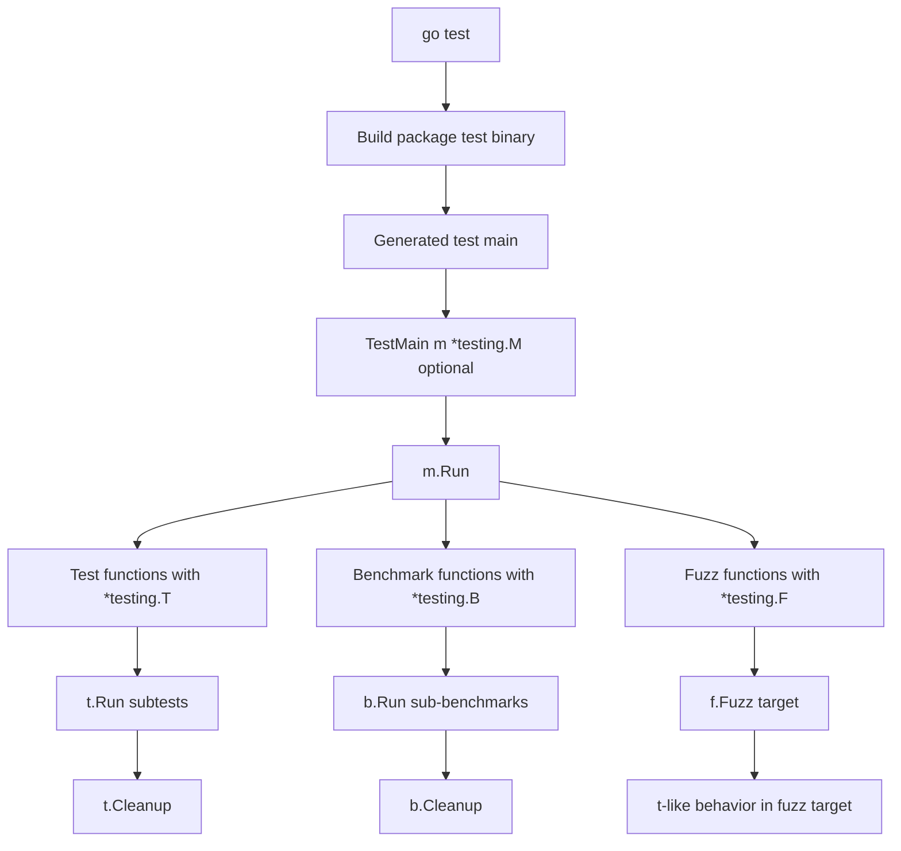
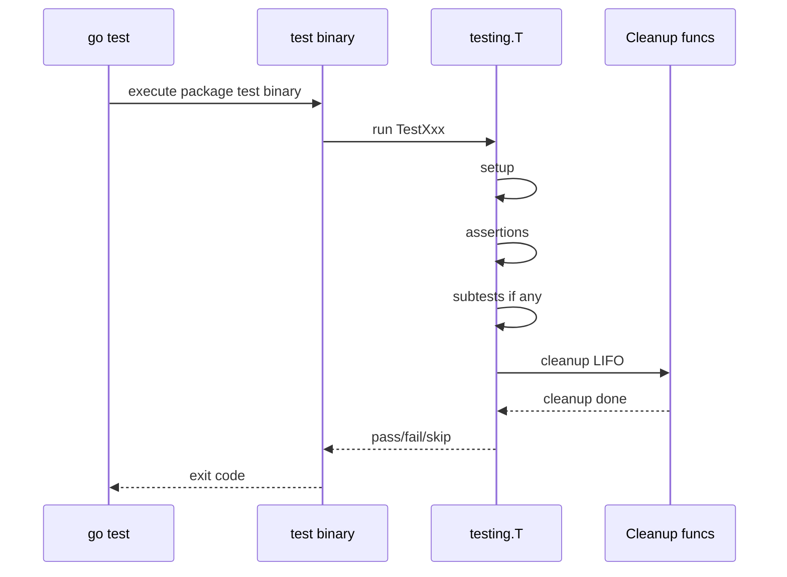
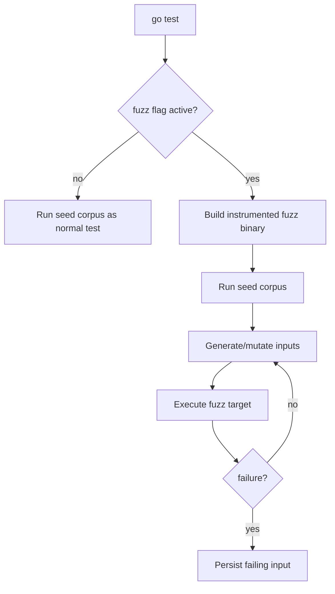
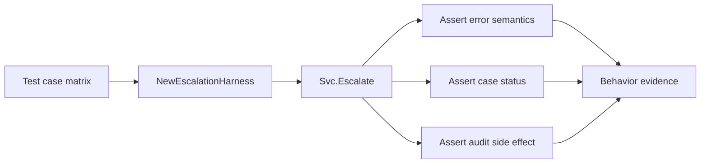

# learn-go-testing-benchmarking-performance-engineering-part-004.md

# Part 004 — The `testing` Package Deep Dive: `T`, `B`, `F`, `M`, Cleanup, TempDir, Context, Helper

> Seri: **Go Testing, Benchmarking, Performance Engineering**  
> Target pembaca: **Java software engineer / tech lead** yang ingin membangun test dan performance engineering discipline level internal engineering handbook.  
> Target Go: **Go 1.26.x**  
> Status seri: **Part 004 dari 034 — belum selesai**

---

## 0. Posisi Part Ini Dalam Seri

Di part sebelumnya kita sudah membahas:

- `part-000`: orientasi, scope, mental model, kontrak engineering.
- `part-001`: bagaimana `go test` membangun dan menjalankan test binary.
- `part-002`: taxonomy test sebagai decision model.
- `part-003`: desain Go yang mudah dites melalui boundary dan dependency direction.

Part ini masuk ke primitive inti dari ekosistem testing Go: package `testing`.

Materi ini bukan sekadar “cara menulis `func TestXxx(t *testing.T)`”. Fokusnya adalah memahami **semantic contract** dari objek test Go:

- `*testing.T` untuk test correctness.
- `*testing.B` untuk benchmark.
- `*testing.F` untuk fuzz target.
- `*testing.M` untuk package-level orchestration.
- `testing.TB` sebagai interface umum untuk helper.
- `Cleanup`, `TempDir`, `Context`, `Helper`, `Run`, `Parallel`, `Skip`, `Fatal`, `Error`, logging, dan lifecycle.

Tujuan akhirnya: Anda bisa membaca, menulis, dan mereview test Go dengan mental model yang presisi, bukan trial-and-error.

---

## 1. Kenapa Package `testing` Sangat Sentral di Go

Di Java, ekosistem testing biasanya terpecah menjadi beberapa layer tool:

- JUnit/TestNG untuk lifecycle.
- Mockito/MockK untuk mock.
- AssertJ/Hamcrest untuk assertion.
- Maven/Gradle Surefire/Failsafe untuk execution.
- JaCoCo untuk coverage.
- JMH untuk benchmark.
- PIT untuk mutation testing.
- Spring Test/Testcontainers untuk integration harness.

Di Go, standard library sengaja menyediakan satu pusat minimalis:

```go
package testing
```

Lalu `go test` menjadi orchestration command.

Ini membuat testing Go terasa lebih kecil, tetapi sebenarnya bukan berarti dangkal. Modelnya berbeda:

- lifecycle test relatif eksplisit;
- test discovery berbasis naming convention;
- test binary dibuat per package;
- benchmark dan fuzzing berada di package yang sama;
- helper bisa dibuat sebagai fungsi biasa;
- test suite biasanya dibangun dari komposisi fungsi, bukan inheritance/class framework.

Mental model penting:

> Go testing tidak mencoba memberi framework besar. Go memberi primitive yang cukup kecil untuk dikombinasikan menjadi framework internal Anda sendiri bila perlu.

---

## 2. Peta Primitive Utama

| Primitive | Peran | Dipakai untuk | Scope |
|---|---|---|---|
| `*testing.T` | Test handle | correctness test | satu test/subtest |
| `*testing.B` | Benchmark handle | microbenchmark/sub-benchmark | satu benchmark/sub-benchmark |
| `*testing.F` | Fuzz handle | seed corpus + fuzz target | satu fuzz test |
| `*testing.M` | Package test runner | `TestMain` | satu package test binary |
| `testing.TB` | Common interface | helper reusable untuk test/benchmark | interface |

Diagramnya:



---

## 3. `*testing.T`: Handle Untuk Satu Unit Eksekusi Test

Signature test biasa:

```go
func TestParseDecision(t *testing.T) {
    got, err := ParseDecision("APPROVED")
    if err != nil {
        t.Fatalf("ParseDecision returned error: %v", err)
    }
    if got != DecisionApproved {
        t.Fatalf("decision mismatch: got %v want %v", got, DecisionApproved)
    }
}
```

`*testing.T` bukan objek assertion. Ia adalah **control handle** untuk satu eksekusi test.

Ia mengizinkan test untuk:

- melaporkan kegagalan;
- menghentikan test saat failure fatal;
- membuat subtest;
- membuat cleanup;
- membuat temp directory;
- menandai helper;
- skip test;
- menjalankan test parallel;
- mengakses context test;
- mencatat log yang terikat ke test;
- membaca nama test;
- mengatur atribut/log output tertentu.

### 3.1. `Error` vs `Fatal`

Dua kelompok method paling penting:

```go
t.Error(args ...any)
t.Errorf(format string, args ...any)

t.Fatal(args ...any)
t.Fatalf(format string, args ...any)
```

Perbedaan konseptual:

| Method | Menandai gagal | Menghentikan test saat itu juga | Cocok untuk |
|---|---:|---:|---|
| `Error` / `Errorf` | ya | tidak | banyak assertion independen |
| `Fatal` / `Fatalf` | ya | ya | precondition gagal, state lanjut tidak aman |

Contoh yang benar:

```go
func TestLoadConfig(t *testing.T) {
    cfg, err := LoadConfig("testdata/config.yaml")
    if err != nil {
        t.Fatalf("LoadConfig failed: %v", err)
    }

    if cfg.Port != 8080 {
        t.Errorf("Port mismatch: got %d want %d", cfg.Port, 8080)
    }
    if cfg.Timeout <= 0 {
        t.Errorf("Timeout must be positive, got %s", cfg.Timeout)
    }
}
```

Kenapa error pertama fatal?

Karena jika `cfg` tidak valid, assertion berikutnya bisa panic atau misleading.

Kenapa field mismatch tidak fatal?

Karena beberapa field bisa diperiksa sekaligus agar satu run memberi informasi lebih kaya.

### 3.2. Rule of Thumb

Gunakan `Fatal` ketika:

- setup gagal;
- dependency test tidak tersedia;
- hasil `nil` akan menyebabkan panic;
- invariant awal rusak;
- tidak ada makna melanjutkan test.

Gunakan `Error` ketika:

- assertion independen;
- Anda ingin melihat beberapa mismatch sekaligus;
- state masih aman untuk diperiksa.

Anti-pattern:

```go
if got != want {
    t.Errorf("got %v want %v", got, want)
}
use(got) // got mungkin invalid untuk langkah berikutnya
```

Jika langkah berikut bergantung pada assertion sebelumnya, gunakan `Fatalf`.

---

## 4. `Fail`, `FailNow`, `Failed`

Method level bawah:

```go
t.Fail()
t.FailNow()
t.Failed()
```

Biasanya Anda jarang memanggil `Fail` langsung, karena `Error`/`Fatal` lebih informatif.

| Method | Efek |
|---|---|
| `Fail` | menandai test gagal, lanjut |
| `FailNow` | menandai test gagal, stop goroutine test saat ini |
| `Failed` | memeriksa apakah test sudah gagal |

Contoh penggunaan `Failed` yang masuk akal:

```go
func TestComplexValidation(t *testing.T) {
    got := ValidateCase(input)

    assertBasicShape(t, got)
    if t.Failed() {
        return
    }

    assertDeepSemantics(t, got)
}
```

Namun hati-hati. Terlalu sering memakai `t.Failed()` bisa membuat flow test sulit dibaca.

---

## 5. Fatal Harus Dipanggil Dari Goroutine Test Yang Tepat

Ini critical untuk concurrency test.

`Fatal`, `Fatalf`, `FailNow`, dan `SkipNow` menghentikan goroutine yang menjalankan test function. Jangan memanggil `t.Fatal` dari goroutine background lalu berharap seluruh test berhenti secara bersih.

Anti-pattern:

```go
func TestWorker(t *testing.T) {
    go func() {
        if err := doWork(); err != nil {
            t.Fatalf("worker failed: %v", err) // buruk: dipanggil dari goroutine lain
        }
    }()
}
```

Lebih baik:

```go
func TestWorker(t *testing.T) {
    errCh := make(chan error, 1)

    go func() {
        errCh <- doWork()
    }()

    select {
    case err := <-errCh:
        if err != nil {
            t.Fatalf("worker failed: %v", err)
        }
    case <-time.After(2 * time.Second):
        t.Fatal("worker timed out")
    }
}
```

Mental model:

> Background goroutine boleh mengirim evidence. Test goroutine utama yang memutuskan gagal/sukses.

---

## 6. `t.Helper`: Stack Trace Yang Jujur

Test helper sering dibuat agar test ringkas.

Tanpa `t.Helper`:

```go
func requireNoError(t *testing.T, err error) {
    if err != nil {
        t.Fatalf("unexpected error: %v", err)
    }
}
```

Jika gagal, line error menunjuk ke dalam helper, bukan call site.

Dengan `t.Helper`:

```go
func requireNoError(t *testing.T, err error) {
    t.Helper()
    if err != nil {
        t.Fatalf("unexpected error: %v", err)
    }
}
```

Sekarang failure diarahkan ke line pemanggil helper.

### 6.1. Helper Harus Menerima `testing.TB`

Jika helper bisa dipakai test dan benchmark:

```go
func requireNoError(tb testing.TB, err error) {
    tb.Helper()
    if err != nil {
        tb.Fatalf("unexpected error: %v", err)
    }
}
```

`testing.TB` adalah interface yang dimiliki `*testing.T` dan `*testing.B`.

Gunakan `testing.TB` untuk:

- helper assertion;
- helper setup;
- helper fixture;
- helper cleanup;
- helper temp resources;
- helper benchmark setup yang juga dipakai test.

### 6.2. Rule Untuk Helper Production-Grade

Helper yang bagus:

- memanggil `tb.Helper()` di awal;
- gagal dengan message yang diagnostik;
- tidak menyembunyikan input penting;
- tidak melakukan terlalu banyak hal;
- tidak membuat global state diam-diam;
- mendaftarkan cleanup sendiri jika membuat resource;
- tidak membuat test sulit dibaca.

Contoh buruk:

```go
func setupEverything(t *testing.T) *App {
    t.Helper()
    // create config, db, cache, queue, server, auth, users, policies,
    // start workers, seed data, set env, change logger...
    return app
}
```

Masalahnya bukan helper. Masalahnya helper menjadi black box.

Lebih baik pecah:

```go
func newTestConfig(t testing.TB) Config
func newFakeClock(t testing.TB, start time.Time) *FakeClock
func newPolicyStore(t testing.TB, policies ...Policy) *PolicyStore
func newCaseService(t testing.TB, opts ServiceOptions) *CaseService
```

---

## 7. `t.Cleanup`: Lifecycle Cleanup Yang Terikat Ke Test

`Cleanup` mendaftarkan fungsi yang dipanggil setelah test dan semua subtest-nya selesai. Cleanup dijalankan dalam urutan **last-in, first-out**.

Contoh:

```go
func TestUsesEnvironment(t *testing.T) {
    old := os.Getenv("APP_MODE")
    os.Setenv("APP_MODE", "test")
    t.Cleanup(func() {
        os.Setenv("APP_MODE", old)
    })

    // test body
}
```

Namun untuk environment variable, Go menyediakan helper khusus:

```go
func TestUsesEnvironment(t *testing.T) {
    t.Setenv("APP_MODE", "test")
    // automatically restored by cleanup
}
```

### 7.1. Kenapa `Cleanup` Lebih Baik Dari `defer` Dalam Helper

Dengan `defer`:

```go
func newServer(t *testing.T) *httptest.Server {
    srv := httptest.NewServer(handler())
    defer srv.Close() // salah: server langsung close saat helper return
    return srv
}
```

Dengan `Cleanup`:

```go
func newServer(t testing.TB) *httptest.Server {
    t.Helper()
    srv := httptest.NewServer(handler())
    t.Cleanup(srv.Close)
    return srv
}
```

Ini membuat helper bisa mengatur cleanup resource yang ia buat, tetapi lifetime-nya tetap sepanjang test.

### 7.2. Cleanup Order

```go
func TestCleanupOrder(t *testing.T) {
    t.Cleanup(func() { t.Log("cleanup A") })
    t.Cleanup(func() { t.Log("cleanup B") })
    t.Cleanup(func() { t.Log("cleanup C") })
}
```

Urutan eksekusi:

```text
cleanup C
cleanup B
cleanup A
```

Ini berguna untuk resource bertingkat:

```go
db := startDB(t)
app := startApp(t, db)
client := newClient(t, app)
```

Jika masing-masing mendaftarkan cleanup, resource paling akhir biasanya dibersihkan lebih dulu.

### 7.3. Cleanup dan Subtest

```go
func TestParent(t *testing.T) {
    t.Cleanup(func() { t.Log("parent cleanup") })

    t.Run("child", func(t *testing.T) {
        t.Cleanup(func() { t.Log("child cleanup") })
    })
}
```

Child cleanup selesai saat child selesai. Parent cleanup setelah parent dan semua subtest selesai.

Ini penting untuk shared fixture:

```go
func TestCaseWorkflow(t *testing.T) {
    store := newSharedStore(t)

    t.Run("draft to submitted", func(t *testing.T) {
        // uses store
    })

    t.Run("submitted to approved", func(t *testing.T) {
        // uses store
    })

    // store cleanup after both subtests
}
```

Tetapi shared fixture antar subtest sering membuat state coupling. Pakai hanya jika benar-benar intentional.

---

## 8. `t.TempDir`: Temporary Directory Yang Aman Untuk Test

`TempDir` membuat temporary directory unik dan otomatis menghapusnya saat test selesai.

```go
func TestWriteReport(t *testing.T) {
    dir := t.TempDir()
    path := filepath.Join(dir, "report.json")

    err := WriteReport(path, Report{ID: "R-001"})
    if err != nil {
        t.Fatalf("WriteReport failed: %v", err)
    }

    data, err := os.ReadFile(path)
    if err != nil {
        t.Fatalf("ReadFile failed: %v", err)
    }

    if !bytes.Contains(data, []byte(`"R-001"`)) {
        t.Fatalf("report does not contain ID: %s", data)
    }
}
```

Keuntungan:

- tidak perlu manual cleanup;
- isolasi antar test;
- aman untuk parallel test;
- cross-platform lebih baik;
- menghindari pollution di repo.

### 8.1. Jangan Pakai Hardcoded `/tmp`

Anti-pattern:

```go
path := "/tmp/report.json"
```

Masalah:

- Windows tidak punya path yang sama;
- parallel test bisa tabrakan;
- file sisa dari run sebelumnya bisa memengaruhi test;
- permission berbeda antar CI runner.

Gunakan:

```go
path := filepath.Join(t.TempDir(), "report.json")
```

### 8.2. `TempDir` Dalam Helper

```go
func newWorkspace(t testing.TB) string {
    t.Helper()
    dir := t.TempDir()

    mustWriteFile(t, filepath.Join(dir, "config.yaml"), []byte(`mode: test`))
    mustWriteFile(t, filepath.Join(dir, "input.txt"), []byte(`hello`))

    return dir
}
```

---

## 9. `t.Setenv`: Environment Variable Tanpa Bocor

Environment variable adalah global process state. Dalam test parallel, ini berbahaya.

```go
func TestConfigFromEnv(t *testing.T) {
    t.Setenv("APP_PORT", "8080")

    cfg, err := LoadConfigFromEnv()
    if err != nil {
        t.Fatalf("LoadConfigFromEnv failed: %v", err)
    }
    if cfg.Port != 8080 {
        t.Fatalf("port mismatch: got %d want 8080", cfg.Port)
    }
}
```

`t.Setenv` otomatis restore setelah test.

Tetapi tetap ingat: environment variable adalah process-wide. Hindari `t.Parallel` untuk test yang mengubah env global, kecuali Anda benar-benar menjamin tidak ada test lain membaca env yang sama secara paralel.

Rule:

> Test yang mengubah global process state sebaiknya tidak parallel.

---

## 10. `t.Context`: Cancellation Yang Terikat Lifecycle Test

Pada Go modern, `testing.T` menyediakan context yang terikat pada lifecycle test. Ini berguna untuk menghubungkan goroutine, worker, server, atau operasi async dengan pembatalan test.

Pattern umum:

```go
func TestWorkerStops(t *testing.T) {
    ctx := t.Context()

    worker := NewWorker()
    done := make(chan error, 1)

    go func() {
        done <- worker.Run(ctx)
    }()

    worker.RequestStop()

    select {
    case err := <-done:
        if err != nil {
            t.Fatalf("worker stopped with error: %v", err)
        }
    case <-time.After(2 * time.Second):
        t.Fatal("worker did not stop")
    }
}
```

Mental model:

> `t.Context()` membantu test memberi sinyal lifecycle kepada resource async yang dibuat oleh test.

Namun jangan salah kaprah. `t.Context()` bukan pengganti timeout assertion. Untuk memverifikasi worker berhenti dalam 2 detik, Anda tetap perlu select dengan timer atau deterministic test clock.

### 10.1. Context Untuk Cleanup Async

Contoh resource server:

```go
func startTestServer(t testing.TB, handler http.Handler) *http.Server {
    t.Helper()

    srv := &http.Server{
        Addr:    "127.0.0.1:0",
        Handler: handler,
    }

    ln, err := net.Listen("tcp", srv.Addr)
    if err != nil {
        t.Fatalf("listen: %v", err)
    }

    errCh := make(chan error, 1)
    go func() {
        errCh <- srv.Serve(ln)
    }()

    t.Cleanup(func() {
        ctx, cancel := context.WithTimeout(context.Background(), time.Second)
        defer cancel()
        _ = srv.Shutdown(ctx)
        err := <-errCh
        if err != nil && !errors.Is(err, http.ErrServerClosed) {
            t.Errorf("server stopped with error: %v", err)
        }
    })

    return srv
}
```

Catatan: helper ini menerima `testing.TB`, tetapi memakai `t.Errorf` di cleanup. Karena `testing.TB` punya method error/logging umum, ini valid secara konsep. Dalam implementasi nyata, pastikan method yang dipakai memang bagian dari interface yang tersedia untuk target Go Anda.

---

## 11. `t.Run`: Subtest Sebagai Struktur Evidence

Subtest bukan hanya kosmetik. Subtest adalah cara menyusun evidence.

```go
func TestEscalationPolicy(t *testing.T) {
    t.Run("draft case cannot be escalated", func(t *testing.T) {
        // ...
    })

    t.Run("submitted case can be escalated by supervisor", func(t *testing.T) {
        // ...
    })

    t.Run("approved case cannot be escalated", func(t *testing.T) {
        // ...
    })
}
```

Manfaat:

- nama failure lebih jelas;
- bisa dijalankan selective dengan `-run`;
- lifecycle cleanup per subtest;
- parallelization lebih granular;
- matrix test lebih rapi.

### 11.1. Nama Subtest Adalah API Untuk Operator

Nama subtest akan muncul di CI logs. Maka hindari nama terlalu generik:

Buruk:

```go
t.Run("case1", func(t *testing.T) {})
t.Run("case2", func(t *testing.T) {})
```

Baik:

```go
t.Run("rejects expired approval token", func(t *testing.T) {})
t.Run("accepts valid approval token before deadline", func(t *testing.T) {})
```

### 11.2. Selective Run

Contoh:

```bash
go test ./internal/policy -run 'TestEscalationPolicy/rejects_expired'
```

Karena nama test/subtest menjadi path-like, desain nama test membantu debugging.

---

## 12. `t.Parallel`: Power Tool, Bukan Default Buta

`t.Parallel()` menandai test/subtest bisa berjalan parallel dengan test lain yang juga parallel, dikontrol oleh flag `-parallel`.

```go
func TestParseDecision(t *testing.T) {
    t.Parallel()

    got, err := ParseDecision("APPROVED")
    if err != nil {
        t.Fatalf("ParseDecision failed: %v", err)
    }
    if got != DecisionApproved {
        t.Fatalf("got %v want %v", got, DecisionApproved)
    }
}
```

Cocok untuk:

- pure function;
- immutable input;
- tidak menyentuh env global;
- tidak memakai shared temp path;
- tidak memakai fixed network port;
- tidak bergantung urutan test;
- tidak memakai singleton mutable.

Tidak cocok untuk:

- test yang mengubah env variable;
- test yang mengubah working directory;
- test yang memakai global logger mutable;
- test yang memakai real DB schema shared tanpa isolation;
- test yang memakai static port;
- test yang bergantung pada test lain.

### 12.1. Classic Closure Trap Dalam Table Test

Go modern sudah memperbaiki banyak masalah loop variable capture, tetapi untuk readability dan compatibility, pattern eksplisit masih bagus:

```go
func TestParseDecision(t *testing.T) {
    tests := []struct {
        name string
        in   string
        want Decision
    }{
        {"approved", "APPROVED", DecisionApproved},
        {"rejected", "REJECTED", DecisionRejected},
    }

    for _, tt := range tests {
        tt := tt
        t.Run(tt.name, func(t *testing.T) {
            t.Parallel()
            got, err := ParseDecision(tt.in)
            if err != nil {
                t.Fatalf("ParseDecision(%q) error: %v", tt.in, err)
            }
            if got != tt.want {
                t.Fatalf("got %v want %v", got, tt.want)
            }
        })
    }
}
```

### 12.2. Parent Setup + Parallel Children

```go
func TestPolicyRules(t *testing.T) {
    rules := LoadStaticRulesForTest(t)

    for _, tt := range policyCases {
        tt := tt
        t.Run(tt.name, func(t *testing.T) {
            t.Parallel()
            got := rules.Evaluate(tt.input)
            if got != tt.want {
                t.Fatalf("got %v want %v", got, tt.want)
            }
        })
    }
}
```

Aman jika `rules` immutable. Tidak aman jika `rules.Evaluate` mutate internal cache tanpa synchronization.

---

## 13. `t.Skip`: Test Yang Sengaja Tidak Berjalan

Method:

```go
t.Skip(args ...any)
t.Skipf(format string, args ...any)
t.SkipNow()
t.Skipped()
```

Contoh:

```go
func TestExternalSandbox(t *testing.T) {
    if testing.Short() {
        t.Skip("skipping external sandbox test in short mode")
    }

    // call sandbox dependency
}
```

Gunakan skip untuk:

- test mahal saat `-short`;
- test butuh credential sandbox;
- test OS-specific;
- test hanya untuk environment tertentu;
- test yang tidak valid jika feature flag off.

Jangan gunakan skip untuk menyembunyikan test rusak.

Jika test flaky dan belum diperbaiki, lebih baik quarantine dengan label/build tag/pipeline policy yang jelas daripada silent skip tanpa alasan.

---

## 14. `testing.Short`: Mode Cepat

`testing.Short()` membaca apakah test dijalankan dengan `-short`.

```go
func TestLargeCorpus(t *testing.T) {
    if testing.Short() {
        t.Skip("large corpus test skipped in short mode")
    }

    // expensive test
}
```

Strategi:

- PR gate: `go test -short ./...`
- nightly: `go test ./...`
- release: `go test -race ./...` + integration/fuzz/long-running suite

Namun jangan jadikan `-short` sebagai tempat menyembunyikan mayoritas confidence. PR gate tetap harus punya test yang cukup untuk menangkap bug cepat.

---

## 15. Logging Dengan `t.Log` dan `t.Logf`

```go
t.Log(args ...any)
t.Logf(format string, args ...any)
```

Log test biasanya hanya muncul saat:

- test gagal; atau
- run dengan `-v`.

Gunakan log untuk evidence tambahan, bukan menggantikan assertion.

Contoh baik:

```go
func TestRetryPolicy(t *testing.T) {
    attempts := 0
    client := FakeClient{
        DoFunc: func() error {
            attempts++
            return errors.New("temporary failure")
        },
    }

    err := Retry(client.Do, RetryOptions{MaxAttempts: 3})
    if err == nil {
        t.Fatal("expected error after retries")
    }

    t.Logf("retry attempts: %d", attempts)

    if attempts != 3 {
        t.Fatalf("attempts mismatch: got %d want 3", attempts)
    }
}
```

Contoh buruk:

```go
t.Logf("got: %+v", got)
// no assertion
```

Test yang hanya log bukan test; ia hanya script observasi.

---

## 16. `TestMain(m *testing.M)`: Package-Level Orchestration

Signature:

```go
func TestMain(m *testing.M) {
    code := m.Run()
    os.Exit(code)
}
```

`TestMain` dipanggil sekali untuk package test binary, sebelum test/benchmark/fuzz dalam package tersebut dijalankan.

Gunakan untuk:

- setup global mahal per package;
- parse custom flags;
- start shared external dependency untuk package;
- initialize one-time resource;
- cleanup after all tests.

Contoh:

```go
var testServerURL string

func TestMain(m *testing.M) {
    srv := startPackageServer()
    testServerURL = srv.URL

    code := m.Run()

    srv.Close()
    os.Exit(code)
}
```

### 16.1. Hati-Hati Dengan `TestMain`

`TestMain` sering disalahgunakan menjadi global fixture besar.

Masalah:

- test menjadi order-dependent;
- parallel test sulit dikontrol;
- state antar test bocor;
- selective `go test -run` tetap bayar setup mahal;
- package test menjadi sulit dipahami.

Rule:

> Pakai `TestMain` untuk orchestration yang benar-benar package-wide. Untuk resource per test, gunakan helper + `t.Cleanup`.

### 16.2. `os.Exit` dan Deferred Cleanup

Jika Anda memanggil `os.Exit`, defer di fungsi yang sama tidak berjalan.

Buruk:

```go
func TestMain(m *testing.M) {
    srv := startPackageServer()
    defer srv.Close()

    os.Exit(m.Run()) // defer tidak berjalan
}
```

Benar:

```go
func TestMain(m *testing.M) {
    srv := startPackageServer()

    code := m.Run()

    srv.Close()
    os.Exit(code)
}
```

---

## 17. `*testing.B`: Benchmark Handle

Signature benchmark:

```go
func BenchmarkParseDecision(b *testing.B) {
    for b.Loop() {
        _, _ = ParseDecision("APPROVED")
    }
}
```

Pada Go modern, `B.Loop` adalah style benchmark yang lebih aman daripada manual `for i := 0; i < b.N; i++` untuk banyak kasus.

`*testing.B` menyediakan:

- lifecycle benchmark;
- sub-benchmark via `b.Run`;
- timer control;
- allocation reporting;
- byte throughput reporting;
- custom metrics;
- parallel benchmark;
- cleanup/temp dir/helper seperti test.

### 17.1. Benchmark Bukan Test

Benchmark boleh gagal jika setup salah, tetapi tujuan benchmark bukan membuktikan correctness lengkap.

Contoh:

```go
func BenchmarkPolicyEvaluate(b *testing.B) {
    policy := loadBenchmarkPolicy(b)
    input := benchmarkCase()

    b.ReportAllocs()

    for b.Loop() {
        _ = policy.Evaluate(input)
    }
}
```

Correctness minimal boleh dicek sebelum loop:

```go
func BenchmarkPolicyEvaluate(b *testing.B) {
    policy := loadBenchmarkPolicy(b)
    input := benchmarkCase()

    got := policy.Evaluate(input)
    if got.Decision != DecisionAllow {
        b.Fatalf("unexpected benchmark fixture result: %v", got.Decision)
    }

    b.ReportAllocs()

    for b.Loop() {
        _ = policy.Evaluate(input)
    }
}
```

Jangan melakukan assertion mahal di dalam loop kecuali memang bagian workload yang ingin diukur.

---

## 18. Timer Control Dalam Benchmark

Benchmark sering punya setup yang tidak ingin diukur.

Dengan `B.Loop`, timer dikelola lebih aman, tetapi Anda tetap perlu memahami pattern setup.

Contoh manual timer control:

```go
func BenchmarkEncodeLargePayload(b *testing.B) {
    payload := makeLargePayload()
    encoder := NewEncoder()

    b.ReportAllocs()
    b.ResetTimer()

    for b.Loop() {
        _, _ = encoder.Encode(payload)
    }
}
```

Method penting:

| Method | Tujuan |
|---|---|
| `b.ResetTimer()` | reset elapsed time dan allocation stats setelah setup |
| `b.StopTimer()` | stop timer untuk setup di tengah loop |
| `b.StartTimer()` | start lagi timer |
| `b.ReportAllocs()` | tampilkan allocations/op |
| `b.SetBytes(n)` | laporkan throughput bytes/sec |
| `b.ReportMetric(value, unit)` | custom metric |

Contoh setup per-iteration yang tidak ingin diukur:

```go
func BenchmarkProcessWithFreshInput(b *testing.B) {
    processor := NewProcessor()

    b.ReportAllocs()

    for b.Loop() {
        b.StopTimer()
        input := makeFreshInput()
        b.StartTimer()

        _ = processor.Process(input)
    }
}
```

Namun hati-hati: terlalu sering `StopTimer/StartTimer` dapat membuat benchmark kurang representatif. Jika production memang perlu membuat input baru, mungkin setup itu seharusnya ikut diukur.

---

## 19. Sub-Benchmark Dengan `b.Run`

```go
func BenchmarkPolicyEvaluate(b *testing.B) {
    cases := []struct {
        name  string
        input PolicyInput
    }{
        {"small_case", smallInput()},
        {"medium_case", mediumInput()},
        {"large_case", largeInput()},
    }

    for _, tc := range cases {
        tc := tc
        b.Run(tc.name, func(b *testing.B) {
            policy := loadBenchmarkPolicy(b)
            b.ReportAllocs()

            for b.Loop() {
                _ = policy.Evaluate(tc.input)
            }
        })
    }
}
```

Manfaat:

- membandingkan ukuran input;
- membandingkan algorithm variants;
- memisahkan cold/warm path;
- membuat output benchmark lebih terstruktur;
- memudahkan `benchstat`.

---

## 20. Parallel Benchmark Dengan `b.RunParallel`

```go
func BenchmarkCacheGetParallel(b *testing.B) {
    cache := NewCache()
    cache.Set("case:123", []byte("data"))

    b.ReportAllocs()

    b.RunParallel(func(pb *testing.PB) {
        for pb.Next() {
            _, _ = cache.Get("case:123")
        }
    })
}
```

Parallel benchmark mengukur behavior saat banyak goroutine menjalankan operasi.

Jangan langsung menyimpulkan “lebih cepat/slower” tanpa memahami:

- `GOMAXPROCS`;
- contention;
- false sharing;
- lock granularity;
- atomic overhead;
- cache locality;
- benchmark workload realism.

Ini akan dibahas lebih dalam di part parallel benchmark.

---

## 21. `*testing.F`: Fuzz Handle

Signature fuzz test:

```go
func FuzzParseDecision(f *testing.F) {
    f.Add("APPROVED")
    f.Add("REJECTED")
    f.Add("UNKNOWN")

    f.Fuzz(func(t *testing.T, input string) {
        decision, err := ParseDecision(input)
        if err == nil {
            encoded := decision.String()
            reparsed, err := ParseDecision(encoded)
            if err != nil {
                t.Fatalf("reparse failed: %v", err)
            }
            if reparsed != decision {
                t.Fatalf("roundtrip mismatch: got %v want %v", reparsed, decision)
            }
        }
    })
}
```

`*testing.F` digunakan untuk:

- menambahkan seed corpus (`f.Add`);
- mendefinisikan fuzz target (`f.Fuzz`);
- menjalankan fuzzing dengan `go test -fuzz`;
- menjalankan seed corpus seperti test biasa saat tidak fuzzing aktif.

Mental model:

> Fuzzing bukan random unit test. Fuzzing mencari input yang melanggar invariant.

Part fuzzing akan dibahas khusus nanti. Di part ini cukup pahami bahwa `F` adalah handle fase setup fuzz, sedangkan body `f.Fuzz` menerima `*testing.T`-like handle untuk setiap generated input.

---

## 22. Lifecycle Test, Benchmark, Fuzz

Diagram lifecycle test biasa:



Lifecycle benchmark:

```mermaid
sequenceDiagram
    participant Go as go test -bench
    participant B as testing.B
    participant Loop as measured loop

    Go->>B: run BenchmarkXxx
    B->>B: setup fixture
    B->>B: ResetTimer / ReportAllocs
    B->>Loop: repeat until stable benchtime
    Loop-->>B: measured ops/time/allocs
    B->>B: cleanup
    B-->>Go: benchmark result
```

Lifecycle fuzz:



---

## 23. Failure Message Engineering

A test failure is a diagnostic artifact.

Good failure message answers:

1. What operation failed?
2. What input caused it?
3. What was expected?
4. What was observed?
5. What context is needed to reproduce?

Buruk:

```go
if got != want {
    t.Fatal("wrong result")
}
```

Baik:

```go
if got != want {
    t.Fatalf("Evaluate(%s) decision mismatch: got %s want %s", input.CaseID, got, want)
}
```

Lebih baik untuk structured object:

```go
if diff := cmp.Diff(want, got); diff != "" {
    t.Fatalf("Evaluate(%s) mismatch (-want +got):\n%s", input.CaseID, diff)
}
```

Jika tidak memakai external package, minimal gunakan `%#v` atau custom formatting:

```go
t.Fatalf("result mismatch:\ngot:  %#v\nwant: %#v", got, want)
```

---

## 24. Test Helper Design: Require vs Check

Dalam banyak codebase, berguna membuat dua tipe helper:

- `requireX`: fatal jika gagal.
- `checkX`: error jika gagal dan lanjut.

Contoh:

```go
func requireNoError(t testing.TB, err error) {
    t.Helper()
    if err != nil {
        t.Fatalf("unexpected error: %v", err)
    }
}

func checkEqual[T comparable](t testing.TB, name string, got, want T) {
    t.Helper()
    if got != want {
        t.Errorf("%s mismatch: got %v want %v", name, got, want)
    }
}
```

Pemakaian:

```go
func TestLoadPolicy(t *testing.T) {
    policy, err := LoadPolicy("testdata/policy.yaml")
    requireNoError(t, err)

    checkEqual(t, "version", policy.Version, "2026-01")
    checkEqual(t, "rule count", len(policy.Rules), 12)
}
```

Naming ini membuat intent jelas.

---

## 25. Custom Test Harness Dengan `testing.TB`

Contoh harness kecil:

```go
type Harness struct {
    Clock *FakeClock
    Store *FakeCaseStore
    Svc   *CaseService
}

func NewHarness(t testing.TB) *Harness {
    t.Helper()

    clock := NewFakeClock(time.Date(2026, 1, 1, 9, 0, 0, 0, time.UTC))
    store := NewFakeCaseStore()
    svc := NewCaseService(CaseServiceOptions{
        Clock: clock,
        Store: store,
    })

    t.Cleanup(func() {
        store.Close()
    })

    return &Harness{
        Clock: clock,
        Store: store,
        Svc:   svc,
    }
}
```

Test:

```go
func TestCaseEscalation(t *testing.T) {
    h := NewHarness(t)

    id := h.Store.Insert(Case{Status: StatusSubmitted})

    err := h.Svc.Escalate(t.Context(), id)
    if err != nil {
        t.Fatalf("Escalate failed: %v", err)
    }

    got := h.Store.MustGet(id)
    if got.Status != StatusEscalated {
        t.Fatalf("status mismatch: got %s want %s", got.Status, StatusEscalated)
    }
}
```

Benchmark juga bisa memakai harness jika setup tidak test-specific:

```go
func BenchmarkCaseEscalation(b *testing.B) {
    h := NewHarness(b)

    b.ReportAllocs()

    for b.Loop() {
        id := h.Store.Insert(Case{Status: StatusSubmitted})
        _ = h.Svc.Escalate(context.Background(), id)
    }
}
```

Namun hati-hati: benchmark di atas ikut mengukur insert store. Apakah itu benar tergantung tujuan benchmark. Jika ingin hanya mengukur `Escalate`, setup ID harus diatur berbeda.

---

## 26. Package-Level Shared State: Bahaya Diam-Diam

Karena `go test` menjalankan test dalam satu process per package test binary, package-level variable bisa bocor antar test.

Anti-pattern:

```go
var currentUser = User{Role: "admin"}

func TestA(t *testing.T) {
    currentUser.Role = "supervisor"
}

func TestB(t *testing.T) {
    // assumes admin
}
```

Jika test order berubah, hasil berubah.

Solusi:

- hindari global mutable;
- buat fixture per test;
- gunakan `t.Cleanup` untuk restore;
- pakai `-shuffle` untuk menemukan order dependency;
- jangan parallel-kan test yang mutate global.

---

## 27. Build Tags dan Test Variants

Walaupun detail build tags dibahas di part test suite architecture, primitive testing sering dipakai bersama file variants:

```go
//go:build integration

package caseapp_test

func TestDatabaseIntegration(t *testing.T) {
    // requires database
}
```

Run:

```bash
go test -tags=integration ./...
```

Gunakan build tags untuk memisahkan test yang benar-benar butuh environment berbeda, bukan untuk menyembunyikan test biasa.

---

## 28. Examples Sebagai Testable Documentation

Package `testing` juga mendukung example test:

```go
func ExampleParseDecision() {
    decision, _ := ParseDecision("APPROVED")
    fmt.Println(decision)
    // Output:
    // approved
}
```

Example berguna untuk:

- dokumentasi API;
- memastikan contoh tetap compile dan benar;
- public package behavior;
- onboarding.

Jangan jadikan example sebagai pengganti test matrix. Example sebaiknya kecil dan representatif.

---

## 29. Common Anti-Patterns

### 29.1. Helper Tanpa `t.Helper`

Gejala:

- failure menunjuk ke helper;
- debugging lambat;
- CI log kurang useful.

Fix:

```go
func helper(t testing.TB) {
    t.Helper()
    // ...
}
```

### 29.2. `TestMain` Menjadi God Fixture

Gejala:

- semua test tergantung global setup;
- selective run lambat;
- test order-sensitive;
- sulit parallel.

Fix:

- pindahkan ke helper per test;
- gunakan package fixture hanya untuk resource immutable/mahal;
- cleanup eksplisit.

### 29.3. Test Mengandalkan Real Time Sleep

Buruk:

```go
time.Sleep(500 * time.Millisecond)
if !worker.Done() { ... }
```

Lebih baik:

```go
select {
case <-done:
case <-time.After(2 * time.Second):
    t.Fatal("timeout waiting for worker")
}
```

Lebih baik lagi untuk logic tertentu: fake clock atau `testing/synctest` jika cocok.

### 29.4. Temp File Global

Buruk:

```go
os.WriteFile("/tmp/app-test.json", data, 0644)
```

Fix:

```go
path := filepath.Join(t.TempDir(), "app-test.json")
```

### 29.5. Assertion Message Minim

Buruk:

```go
t.Fatal("failed")
```

Fix:

```go
t.Fatalf("CreateCase(%q) status mismatch: got %s want %s", caseID, got.Status, want.Status)
```

### 29.6. Benchmark Mengukur Setup, Bukan Operasi

Buruk:

```go
func BenchmarkParse(b *testing.B) {
    for b.Loop() {
        input := loadHugeFixtureFromDisk()
        Parse(input)
    }
}
```

Fix jika ingin mengukur parse saja:

```go
func BenchmarkParse(b *testing.B) {
    input := loadHugeFixtureFromDisk()
    b.ResetTimer()

    for b.Loop() {
        Parse(input)
    }
}
```

---

## 30. Engineering Checklist Untuk Review Test

Gunakan checklist ini saat review PR.

### 30.1. Correctness Test Checklist

- Apakah test name menjelaskan behavior?
- Apakah failure message cukup diagnostik?
- Apakah setup failure memakai `Fatal`?
- Apakah assertion independen bisa memakai `Error`?
- Apakah helper memanggil `t.Helper()`?
- Apakah resource cleanup memakai `t.Cleanup()`?
- Apakah file sementara memakai `t.TempDir()`?
- Apakah env variable memakai `t.Setenv()`?
- Apakah test parallel aman terhadap global state?
- Apakah background goroutine melapor lewat channel, bukan `t.Fatal` langsung?
- Apakah timeout test jelas dan bounded?
- Apakah test tidak bergantung urutan?
- Apakah subtest name bisa dipakai untuk selective run?

### 30.2. Benchmark Checklist

- Apakah benchmark punya tujuan jelas?
- Apakah setup yang tidak ingin diukur dikeluarkan dari measurement?
- Apakah `b.ReportAllocs()` dipakai jika allocation relevan?
- Apakah fixture correctness minimal diverifikasi?
- Apakah input benchmark realistis?
- Apakah output benchmark bisa dibandingkan dengan `benchstat`?
- Apakah benchmark tidak terjebak dead-code elimination?
- Apakah sub-benchmark naming stabil?

### 30.3. Fuzz Checklist

- Apakah fuzz target punya invariant jelas?
- Apakah seed corpus mencakup valid dan invalid examples?
- Apakah target deterministic?
- Apakah target tidak bergantung network/time/env?
- Apakah failing input akan reproducible?
- Apakah fuzzing tidak membuat resource bocor?

---

## 31. Practical Baseline Commands

Run semua test:

```bash
go test ./...
```

Verbose:

```bash
go test -v ./...
```

Run test tertentu:

```bash
go test ./internal/policy -run '^TestEscalationPolicy$'
```

Run subtest tertentu:

```bash
go test ./internal/policy -run 'TestEscalationPolicy/rejects_expired_token'
```

Short mode:

```bash
go test -short ./...
```

Shuffle order:

```bash
go test -shuffle=on ./...
```

Race detector:

```bash
go test -race ./...
```

Benchmark:

```bash
go test ./internal/policy -bench=. -run=^$
```

Benchmark repeated:

```bash
go test ./internal/policy -bench=. -run=^$ -count=10
```

Benchmark with allocs:

```bash
go test ./internal/policy -bench=. -benchmem -run=^$
```

Fuzz:

```bash
go test ./internal/parser -fuzz=FuzzParseDecision -fuzztime=30s
```

---

## 32. Regulatory Case Management Example

Misalkan kita punya rule:

- Case hanya bisa dieskalasi jika status `Submitted`.
- Actor harus punya role `Supervisor` atau `EnforcementLead`.
- Case expired tidak boleh dieskalasi.
- Escalation harus mencatat audit event.

Test harness:

```go
type EscalationHarness struct {
    Clock *FakeClock
    Store *FakeCaseStore
    Audit *FakeAuditSink
    Svc   *EscalationService
}

func NewEscalationHarness(t testing.TB) *EscalationHarness {
    t.Helper()

    clock := NewFakeClock(time.Date(2026, 6, 23, 10, 0, 0, 0, time.UTC))
    store := NewFakeCaseStore()
    audit := NewFakeAuditSink()

    svc := NewEscalationService(EscalationOptions{
        Clock: clock,
        Store: store,
        Audit: audit,
    })

    t.Cleanup(func() {
        store.Close()
        audit.Close()
    })

    return &EscalationHarness{
        Clock: clock,
        Store: store,
        Audit: audit,
        Svc:   svc,
    }
}
```

Test:

```go
func TestEscalationService_Escalate(t *testing.T) {
    tests := []struct {
        name      string
        status    CaseStatus
        role      Role
        expired   bool
        wantErr   error
        wantStatus CaseStatus
    }{
        {
            name:       "submitted case can be escalated by supervisor",
            status:     StatusSubmitted,
            role:       RoleSupervisor,
            expired:    false,
            wantErr:    nil,
            wantStatus: StatusEscalated,
        },
        {
            name:       "draft case cannot be escalated",
            status:     StatusDraft,
            role:       RoleSupervisor,
            expired:    false,
            wantErr:    ErrInvalidStatus,
            wantStatus: StatusDraft,
        },
        {
            name:       "expired case cannot be escalated",
            status:     StatusSubmitted,
            role:       RoleSupervisor,
            expired:    true,
            wantErr:    ErrCaseExpired,
            wantStatus: StatusSubmitted,
        },
        {
            name:       "officer cannot escalate submitted case",
            status:     StatusSubmitted,
            role:       RoleOfficer,
            expired:    false,
            wantErr:    ErrForbidden,
            wantStatus: StatusSubmitted,
        },
    }

    for _, tt := range tests {
        tt := tt
        t.Run(tt.name, func(t *testing.T) {
            h := NewEscalationHarness(t)

            c := Case{
                ID:     "CASE-001",
                Status: tt.status,
            }
            if tt.expired {
                c.Deadline = h.Clock.Now().Add(-time.Hour)
            } else {
                c.Deadline = h.Clock.Now().Add(time.Hour)
            }

            h.Store.Insert(c)

            err := h.Svc.Escalate(t.Context(), EscalateCommand{
                CaseID: "CASE-001",
                Actor:  Actor{Role: tt.role},
            })

            if !errors.Is(err, tt.wantErr) {
                t.Fatalf("Escalate error mismatch: got %v want %v", err, tt.wantErr)
            }

            got := h.Store.MustGet("CASE-001")
            if got.Status != tt.wantStatus {
                t.Fatalf("status mismatch: got %s want %s", got.Status, tt.wantStatus)
            }

            if tt.wantErr == nil && !h.Audit.Contains("CASE_ESCALATED") {
                t.Fatal("expected audit event CASE_ESCALATED")
            }
        })
    }
}
```

Diagram evidence:



---

## 33. Mental Model Ringkas

Package `testing` memberi Anda handles, bukan framework besar.

- `T` mengontrol test correctness.
- `B` mengontrol benchmark measurement.
- `F` mengontrol fuzz corpus dan target.
- `M` mengontrol package-level orchestration.
- `TB` membuat helper reusable.
- `Helper` menjaga stack trace jujur.
- `Cleanup` mengikat resource lifecycle ke test.
- `TempDir` menghindari filesystem pollution.
- `Setenv` menghindari env leak.
- `Context` mengikat async work ke lifecycle test.
- `Run` membuat evidence hierarchy.
- `Parallel` mempercepat test hanya jika isolation benar.
- `Fatal` menghentikan test saat state lanjut tidak aman.
- `Error` mengumpulkan mismatch independen.

---

## 34. Latihan

### Latihan 1 — Refactor Test Helper

Ambil satu test di project Anda yang memiliki setup panjang. Pecah menjadi helper kecil:

- `newTestConfig(t testing.TB)`
- `newFakeStore(t testing.TB)`
- `newService(t testing.TB, opts Options)`

Pastikan semua helper memanggil `t.Helper()`.

### Latihan 2 — Cleanup Audit

Cari test yang memakai `defer` untuk cleanup resource dari helper. Ubah menjadi `t.Cleanup`.

### Latihan 3 — TempDir Audit

Cari test yang menulis ke path fixed. Ubah ke `t.TempDir()` dan `filepath.Join`.

### Latihan 4 — Failure Message Upgrade

Ambil 10 assertion dengan message generic seperti `failed`, `invalid`, `wrong result`. Ubah agar menjawab:

- operation;
- input;
- got;
- want;
- context.

### Latihan 5 — Subtest Naming

Ambil table-driven test dan ubah nama case agar bisa dipakai untuk selective `go test -run`.

### Latihan 6 — Benchmark Sanity

Tulis benchmark kecil dengan `B.Loop`, `ReportAllocs`, dan correctness check sebelum loop.

---

## 35. Referensi Resmi dan Bacaan Lanjutan

- Go package `testing`: `https://pkg.go.dev/testing`
- Go command `go test`: `https://pkg.go.dev/cmd/go#hdr-Test_packages`
- Go fuzzing documentation: `https://go.dev/doc/security/fuzz/`
- Go race detector: `https://go.dev/doc/articles/race_detector`
- Go PGO documentation: `https://go.dev/doc/pgo`
- Go 1.26 release notes: `https://go.dev/doc/go1.26`

---

## 36. Penutup Part 004

Part ini memberi fondasi penggunaan package `testing` sebagai primitive engineering.

Setelah ini, kita akan masuk ke:

```text
learn-go-testing-benchmarking-performance-engineering-part-005.md
```

Topik berikutnya:

```text
Assertion Strategy Without Assertion Framework Addiction
```

Kita akan membahas bagaimana membuat assertion yang kuat, readable, diagnostik, tidak over-framework, tetapi tetap cukup ergonomis untuk codebase besar.

Status seri: **belum selesai**. Ini adalah **part-004 dari part-034**.

<!-- NAVIGATION_FOOTER -->
<div class="page-nav">
<a href="./learn-go-testing-benchmarking-performance-engineering-part-003.md">⬅️ Part 003 — Testable Go Design: API Boundary, Dependency Direction, Seams, Ports & Adapters</a>
<a href="./index.md">📚 Kategori</a>
<a href="../../index.md">🏠 Home</a>
<a href="./learn-go-testing-benchmarking-performance-engineering-part-005.md">Part 005 — Assertion Strategy Without Assertion Framework Addiction ➡️</a>
</div>
