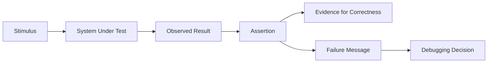
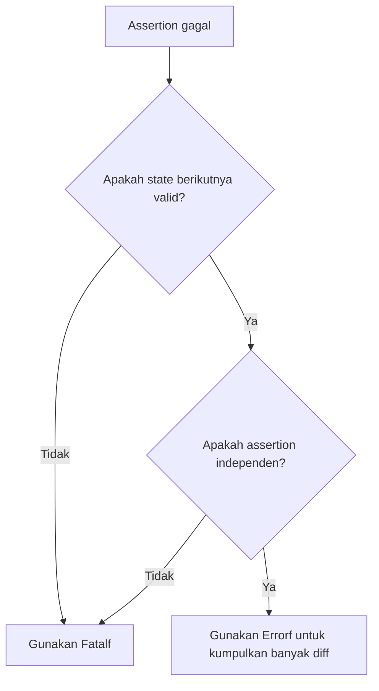
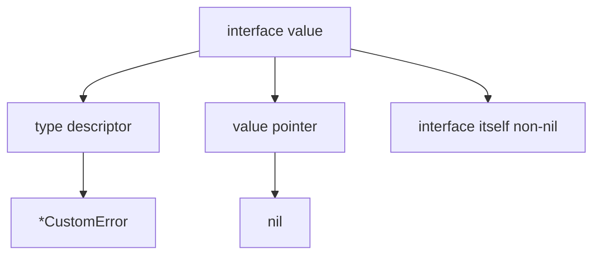
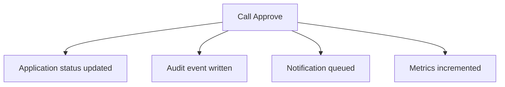

# learn-go-testing-benchmarking-performance-engineering-part-005.md

# Part 005 — Assertion Strategy Without Assertion Framework Addiction

> Seri: **Go Testing, Benchmarking, Performance Engineering**  
> Target pembaca: **Java software engineer / tech lead** yang ingin membangun kemampuan testing Go pada level production-grade.  
> Fokus part ini: **bagaimana membuat assertion yang diagnostik, stabil, murah dirawat, dan tidak mengikat test suite pada framework secara berlebihan.**

---

## 0. Posisi Part Ini Dalam Seri

Pada part sebelumnya kita sudah membahas:

- bagaimana `go test` mengeksekusi test package;
- taxonomy test dan kapan sebuah test layak dibuat;
- desain Go yang testable;
- primitive utama package `testing` seperti `*testing.T`, `t.Helper`, `t.Cleanup`, `t.TempDir`, `t.Context`, `TestMain`, `*testing.B`, dan `*testing.F`.

Part ini masuk ke pertanyaan yang terlihat kecil tetapi menentukan kualitas test suite dalam jangka panjang:

> **Ketika sebuah test gagal, apakah failure-nya langsung menjelaskan masalah sebenarnya, atau hanya mengatakan “expected != actual”?**

Banyak engineer yang datang dari Java terbiasa dengan ekosistem seperti JUnit, AssertJ, Hamcrest, Mockito, Truth, atau Spring test utilities. Di Go, budaya standard library lebih kuat. Itu bukan berarti kita anti-library. Artinya:

> **Assertion di Go sebaiknya dimulai dari failure semantics dan diagnostik, bukan dari memilih framework.**

Sebuah assertion yang baik bukan hanya mengecek benar/salah. Ia harus menjadi **alat investigasi**.

---

## 1. Tujuan Pembelajaran

Setelah menyelesaikan part ini, kamu harus mampu:

1. Mendesain assertion yang menjelaskan **apa invariant yang dilanggar**.
2. Memilih antara direct comparison, helper, semantic comparator, diff, dan third-party comparator.
3. Menghindari jebakan `reflect.DeepEqual`, `nil`, interface typed nil, map order, time comparison, floating point, slice empty vs nil, dan error string comparison.
4. Membuat helper assertion yang idiomatik dengan `testing.TB` dan `t.Helper()`.
5. Menulis failure message yang mempercepat debugging di local dan CI.
6. Membuat strategi assertion untuk:
   - scalar value;
   - struct/domain object;
   - collections;
   - errors;
   - panic;
   - HTTP response;
   - time;
   - floating point;
   - unordered result;
   - JSON/XML/text output;
   - concurrent effects;
   - security-sensitive value.
7. Mengerti kapan menggunakan library seperti `go-cmp`, dan kapan cukup dengan standard library.

---

## 2. Mental Model: Assertion Adalah Evidence Boundary

Dalam test, ada tiga layer utama:



Assertion adalah batas antara:

- **observed behavior**: apa yang benar-benar terjadi;
- **expected behavior**: apa yang seharusnya terjadi;
- **diagnostic evidence**: informasi untuk memahami perbedaannya.

Test yang buruk hanya memberi sinyal merah.

Test yang baik memberi sinyal merah **dan** peta investigasi.

Contoh failure buruk:

```text
expected true, got false
```

Masalahnya:

- invariant apa yang gagal?
- input apa yang dipakai?
- state sebelum dan sesudah apa?
- field mana yang berbeda?
- apakah ini error domain, bug serializer, race, atau setup salah?

Failure yang lebih baik:

```text
case "expired permit should be rejected":
validate application status:
  permitID: P-123
  now: 2026-06-23T10:00:00Z
  expiry: 2026-06-22T23:59:59Z
  got status: APPROVED
  want status: REJECTED
  reason: expired permit must not pass eligibility check
```

Ini bukan sekadar lebih panjang. Ini lebih **diagnostik**.

---

## 3. Prinsip Utama Assertion di Go

### 3.1 Assertion harus dekat dengan invariant

Jangan hanya assert implementasi internal jika requirement-nya behavioral.

Buruk:

```go
if len(service.cache.items) != 1 {
    t.Fatalf("expected one cache item")
}
```

Lebih baik, jika requirement-nya behavior:

```go
got, err := service.Lookup(ctx, "123456")
if err != nil {
    t.Fatalf("Lookup returned error: %v", err)
}
if got.Address != "10 Example Road" {
    t.Fatalf("Lookup address = %q, want %q", got.Address, "10 Example Road")
}
```

Internal assertion tetap valid untuk package-level unit test tertentu, tetapi jangan jadikan semua test bergantung pada struktur internal.

---

### 3.2 Assertion harus menjelaskan domain, bukan hanya operator

Buruk:

```go
if got != want {
    t.Fatalf("got %v, want %v", got, want)
}
```

Cukup untuk scalar kecil, tetapi lemah untuk domain behavior.

Lebih baik:

```go
if got.Status != want.Status {
    t.Fatalf("application status after eligibility check = %s, want %s; applicationID=%s",
        got.Status, want.Status, got.ID)
}
```

Failure message harus menjawab:

1. operasi apa yang diuji;
2. field apa yang berbeda;
3. value aktual dan expected;
4. context minimal untuk reproduksi;
5. kenapa expected itu penting jika tidak obvious.

---

### 3.3 Assertion harus stabil terhadap detail yang tidak relevan

Jangan assert timestamp, UUID, map order, generated ID, atau error message penuh jika bukan bagian dari kontrak.

Buruk:

```go
if got.CreatedAt != time.Now() {
    t.Fatalf("created time mismatch")
}
```

Masalah:

- `time.Now()` dipanggil dua kali;
- monotonic clock component bisa ikut berpengaruh;
- timezone/precision bisa berbeda;
- test menjadi flaky.

Lebih baik:

```go
clock := fixedClock{now: time.Date(2026, 6, 23, 10, 0, 0, 0, time.UTC)}
svc := NewApplicationService(repo, clock)

got, err := svc.Submit(ctx, req)
if err != nil {
    t.Fatalf("Submit returned error: %v", err)
}
if !got.CreatedAt.Equal(clock.now) {
    t.Fatalf("CreatedAt = %s, want %s", got.CreatedAt, clock.now)
}
```

---

### 3.4 Assertion harus menolak ambiguity

Ambiguity yang umum:

- expected dan actual tertukar;
- failure message tidak menyebut case name;
- helper menyembunyikan lokasi error;
- helper tidak memanggil `t.Helper()`;
- compare pakai string padahal kontrak memakai typed error;
- compare slice secara order-sensitive padahal requirement order-insensitive;
- compare map output dengan formatting yang nondeterministic.

Testing yang baik menutup ambiguity sejak awal.

---

## 4. Standard Library First, Tapi Bukan Dogma

Go tidak punya built-in assertion framework seperti JUnit AssertJ. Package `testing` menyediakan primitive failure, bukan DSL assertion. Fungsi seperti `Errorf`, `Fatalf`, `Fail`, `FailNow`, `Helper`, dan `Cleanup` adalah fondasi test idiomatik. Dokumentasi resmi package `testing` mendeskripsikan `T`, `B`, `F`, subtest, benchmark, fuzzing, cleanup, dan helper behavior sebagai API utama test.  
Reference: https://pkg.go.dev/testing

Artinya, pendekatan default:

```go
if got != want {
    t.Fatalf("Foo() = %v, want %v", got, want)
}
```

Ini sederhana, cepat dibaca, tidak membawa dependency, dan sering cukup.

Namun standard library bukan berarti selalu cukup. Untuk object kompleks, semantic comparison, unexported field handling, float tolerance, sorted collections, transform, atau diff besar, library comparator seperti `github.com/google/go-cmp/cmp` sering lebih tepat. Package `go-cmp` memang ditujukan sebagai alternatif yang lebih kuat dan aman dibanding `reflect.DeepEqual` untuk membandingkan nilai Go secara semantic.  
Reference: https://pkg.go.dev/github.com/google/go-cmp/cmp

Prinsipnya:

> **Gunakan standard library untuk assertion sederhana. Gunakan comparator/diff ketika failure perlu menjelaskan struktur kompleks. Hindari framework yang membuat test terlihat ringkas tetapi failure-nya miskin informasi.**

---

## 5. Assertion Primitive: `Errorf` vs `Fatalf`

### 5.1 `Fatalf` menghentikan test sekarang

Gunakan `Fatalf` jika test tidak bisa lanjut secara aman.

Contoh:

```go
got, err := repo.Find(ctx, id)
if err != nil {
    t.Fatalf("Find(%q) returned error: %v", id, err)
}

if got.Status != Active {
    t.Fatalf("Find(%q).Status = %s, want %s", id, got.Status, Active)
}
```

Kalau `Find` error, `got` mungkin nil atau invalid. Lanjut assertion bisa panic atau menyesatkan.

---

### 5.2 `Errorf` mencatat failure tetapi lanjut

Gunakan `Errorf` ketika beberapa independent assertion bisa memberi lebih banyak informasi.

```go
if got.ID != want.ID {
    t.Errorf("ID = %q, want %q", got.ID, want.ID)
}
if got.Status != want.Status {
    t.Errorf("Status = %s, want %s", got.Status, want.Status)
}
if got.UpdatedBy != want.UpdatedBy {
    t.Errorf("UpdatedBy = %q, want %q", got.UpdatedBy, want.UpdatedBy)
}
```

Ini berguna untuk struct kecil, tetapi jangan overuse sampai test lanjut setelah invariant utama rusak.

---

### 5.3 Decision rule



Rule praktis:

- setup gagal → `Fatalf`;
- dependency construction gagal → `Fatalf`;
- returned error unexpected → biasanya `Fatalf`;
- multiple field mismatch pada object valid → `Errorf` atau diff;
- assertion dalam helper yang harus menghentikan caller → helper bisa memanggil `Fatalf`.

---

## 6. Expected vs Actual: Konvensi Failure Message

Dalam Go, format umum:

```go
if got != want {
    t.Fatalf("Function() = %v, want %v", got, want)
}
```

Konvensi ini penting karena mudah discan:

- kiri: expression/observed result;
- kanan: expected result;
- kata `want` memberi anchor visual.

Contoh:

```go
if got := NormalizePostalCode(" 123456 "); got != "123456" {
    t.Fatalf("NormalizePostalCode(%q) = %q, want %q", " 123456 ", got, "123456")
}
```

Untuk boolean, hindari message generik:

Buruk:

```go
if !ok {
    t.Fatal("not ok")
}
```

Lebih baik:

```go
if !ok {
    t.Fatalf("Authorize(%s, %s) denied access, want allowed", actor.ID, action)
}
```

Untuk boolean helper:

```go
if got := policy.Allows(actor, action, resource); !got {
    t.Fatalf("policy.Allows(actor=%q, action=%q, resource=%q) = false, want true",
        actor.ID, action, resource.ID)
}
```

---

## 7. Scalar Assertions

Scalar assertion paling mudah, tetapi tetap bisa buruk jika context hilang.

### 7.1 String

```go
if got, want := user.DisplayName(), "Fajar Abdi Nugraha"; got != want {
    t.Fatalf("DisplayName() = %q, want %q", got, want)
}
```

Gunakan `%q` untuk string agar whitespace terlihat.

Contoh failure:

```text
DisplayName() = "Fajar\n", want "Fajar"
```

Tanpa `%q`, newline bisa tidak jelas.

---

### 7.2 Integer

```go
if got, want := queue.Len(), 3; got != want {
    t.Fatalf("queue length after enqueue = %d, want %d", got, want)
}
```

Untuk size/capacity, sebut stage:

```go
if got, want := len(batch.Items), maxBatchSize; got > want {
    t.Fatalf("batch size after grouping = %d, want <= %d", got, want)
}
```

---

### 7.3 Boolean

Boolean butuh domain context.

Buruk:

```go
if got != true {
    t.Fatalf("got false")
}
```

Lebih baik:

```go
if got := rule.IsEscalationRequired(caseFile); !got {
    t.Fatalf("IsEscalationRequired(caseID=%q, overdueDays=%d) = false, want true",
        caseFile.ID, caseFile.OverdueDays)
}
```

---

## 8. Struct Assertion: Field-by-Field vs Whole Object

Ada dua strategi utama:

1. field-by-field assertion;
2. whole-object semantic comparison.

### 8.1 Field-by-field cocok jika hanya beberapa field adalah kontrak

```go
got, err := svc.Submit(ctx, req)
if err != nil {
    t.Fatalf("Submit returned error: %v", err)
}

if got.Status != StatusPendingReview {
    t.Errorf("Status = %s, want %s", got.Status, StatusPendingReview)
}
if got.SubmittedBy != actor.ID {
    t.Errorf("SubmittedBy = %q, want %q", got.SubmittedBy, actor.ID)
}
if got.ReferenceNo == "" {
    t.Errorf("ReferenceNo is empty, want generated reference number")
}
```

Ini lebih resilient jika struct punya banyak field yang bukan bagian behavior test.

---

### 8.2 Whole-object comparison cocok jika object kecil dan semua field relevan

```go
want := ApplicationView{
    ID:     "APP-001",
    Status: "PENDING_REVIEW",
    Owner:  "U-001",
}

if got != want {
    t.Fatalf("ApplicationView mismatch\ngot:  %+v\nwant: %+v", got, want)
}
```

Tetapi ini hanya bekerja untuk comparable struct. Struct yang punya slice, map, function, atau field non-comparable tidak bisa pakai `!=`.

---

### 8.3 Untuk struct kompleks, gunakan diff

Dengan `go-cmp`:

```go
import "github.com/google/go-cmp/cmp"

func TestBuildApplicationView(t *testing.T) {
    got := BuildApplicationView(input)
    want := ApplicationView{
        ID:     "APP-001",
        Status: "PENDING_REVIEW",
        Tags:   []string{"new", "priority"},
    }

    if diff := cmp.Diff(want, got); diff != "" {
        t.Fatalf("BuildApplicationView() mismatch (-want +got):\n%s", diff)
    }
}
```

Perhatikan urutan `cmp.Diff(want, got)`, lalu message `(-want +got)`. Ini membuat diff mudah dibaca.

---

## 9. `reflect.DeepEqual`: Kapan Boleh, Kapan Bahaya

`reflect.DeepEqual` tersedia di standard library, tetapi punya semantics yang sering mengejutkan.

Contoh:

```go
var a []string = nil
b := []string{}

fmt.Println(reflect.DeepEqual(a, b)) // false
```

Secara teknis benar: nil slice dan empty non-nil slice berbeda. Tetapi secara domain, sering kali keduanya equivalent.

Jebakan lain:

- `time.Time` bisa punya monotonic component;
- unexported fields ikut dibandingkan;
- fungsi hanya equal jika keduanya nil;
- map order tidak masalah, tetapi diff-nya tidak ada;
- NaN tidak equal dengan dirinya sendiri;
- equality-nya structural, bukan semantic.

Gunakan `reflect.DeepEqual` jika:

- object kecil;
- semantics structural memang yang kamu mau;
- failure diff tidak terlalu penting;
- nil vs empty memang dibedakan.

Hindari jika:

- domain menyamakan nil dan empty;
- ada time, float, generated fields;
- butuh diff readable;
- object besar;
- ada unexported/internal fields yang tidak bagian kontrak.

---

## 10. Semantic Equality dengan `go-cmp`

`go-cmp` berguna karena comparison bisa dikonfigurasi.

Contoh menyamakan empty slice dan nil slice dengan `cmpopts.EquateEmpty`:

```go
import (
    "testing"

    "github.com/google/go-cmp/cmp"
    "github.com/google/go-cmp/cmp/cmpopts"
)

func TestListTags(t *testing.T) {
    got := ListTags(Application{ID: "APP-001"})
    want := []string{}

    if diff := cmp.Diff(want, got, cmpopts.EquateEmpty()); diff != "" {
        t.Fatalf("ListTags() mismatch (-want +got):\n%s", diff)
    }
}
```

`cmpopts.EquateEmpty` menyatakan map/slice dengan length zero dianggap equal meskipun satu nil dan satu non-nil. Dokumentasi `cmpopts` menyediakan option seperti `EquateEmpty`, sorting, ignoring, dan transformer untuk semantic comparison.  
Reference: https://pkg.go.dev/github.com/google/go-cmp/cmp/cmpopts

---

## 11. Ignoring Fields: Berguna, Tapi Berbahaya

Kadang ada field yang harus diabaikan:

- generated ID;
- timestamp;
- version;
- audit correlation ID;
- runtime metadata;
- cache hit count;
- unimportant internal fields.

Contoh:

```go
opts := []cmp.Option{
    cmpopts.IgnoreFields(Application{}, "ID", "CreatedAt"),
}

if diff := cmp.Diff(want, got, opts...); diff != "" {
    t.Fatalf("Application mismatch (-want +got):\n%s", diff)
}
```

Namun ignoring field bisa menyembunyikan bug.

Rule:

> **Abaikan field hanya jika field itu bukan bagian kontrak test tersebut. Jangan abaikan field karena test sulit dibuat deterministic.**

Jika timestamp penting, inject clock. Jangan ignore.

Jika ID penting, inject ID generator. Jangan ignore.

Jika order penting, assert order. Jangan sort.

---

## 12. Sorting Collections Dalam Assertion

Ada dua jenis result:

1. order-sensitive;
2. order-insensitive.

Untuk order-sensitive, compare langsung:

```go
want := []string{"draft", "submitted", "approved"}
if diff := cmp.Diff(want, got); diff != "" {
    t.Fatalf("workflow steps mismatch (-want +got):\n%s", diff)
}
```

Untuk order-insensitive, jangan membuat test flaky dengan asumsi order map/database.

Strategi:

```go
opts := cmpopts.SortSlices(func(a, b ApplicationSummary) bool {
    return a.ID < b.ID
})

if diff := cmp.Diff(want, got, opts); diff != "" {
    t.Fatalf("application summaries mismatch (-want +got):\n%s", diff)
}
```

Tetapi sorting dalam assertion harus eksplisit karena mengubah semantics.

Message harus menyatakan order tidak relevan:

```go
if diff := cmp.Diff(want, got, opts); diff != "" {
    t.Fatalf("application summaries mismatch ignoring order (-want +got):\n%s", diff)
}
```

---

## 13. Nil, Empty, Zero Value, dan Interface Typed Nil

Go punya beberapa jebakan yang sering membuat assertion salah.

### 13.1 Nil slice vs empty slice

```go
var a []int = nil
b := []int{}

fmt.Println(a == nil) // true
fmt.Println(b == nil) // false
```

Pertanyaan test:

> Apakah kontrak function membedakan nil dan empty?

Jika tidak, gunakan semantic comparison:

```go
if diff := cmp.Diff(want, got, cmpopts.EquateEmpty()); diff != "" {
    t.Fatalf("items mismatch (-want +got):\n%s", diff)
}
```

Jika iya, assert eksplisit:

```go
if got == nil {
    t.Fatalf("ListItems() returned nil slice, want empty non-nil slice")
}
if len(got) != 0 {
    t.Fatalf("ListItems() len = %d, want 0", len(got))
}
```

---

### 13.2 Nil map vs empty map

Sama seperti slice:

```go
var a map[string]string = nil
b := map[string]string{}
```

Nil map tidak bisa ditulis:

```go
a["x"] = "y" // panic
```

Jika function kontraknya mengembalikan mutable empty map, nil map adalah bug.

---

### 13.3 Interface typed nil

Ini jebakan klasik Go.

```go
type CustomError struct{}
func (*CustomError) Error() string { return "custom" }

func returnsTypedNil() error {
    var err *CustomError = nil
    return err
}

func TestTypedNil(t *testing.T) {
    err := returnsTypedNil()
    if err != nil {
        t.Fatalf("err != nil: %#v", err)
    }
}
```

Test di atas gagal karena interface `error` berisi type `*CustomError` walaupun value pointer-nya nil.

Mental model:



Rule:

- function yang return `error` harus return literal `nil`, bukan typed nil;
- test error nil harus tetap pakai `err != nil`, tetapi implementasi harus benar;
- hindari membuat custom error pointer nil sebagai return.

---

## 14. Error Assertion: Jangan Compare String Jika Kontraknya Type/Cause

Go error handling berbasis value. Package `errors` menyediakan `errors.Is` dan `errors.As` untuk memeriksa chain error yang dibungkus dengan `Unwrap`. Dokumentasi resmi package `errors` menjelaskan bahwa error dapat membungkus error lain melalui `Unwrap() error` atau `Unwrap() []error`, dan fungsi seperti `Is`/`As` menelusuri chain tersebut.  
Reference: https://pkg.go.dev/errors

### 14.1 Unexpected error

```go
got, err := svc.Submit(ctx, req)
if err != nil {
    t.Fatalf("Submit returned error: %v", err)
}
_ = got
```

### 14.2 Expected sentinel error

```go
_, err := svc.Submit(ctx, invalidReq)
if !errors.Is(err, ErrInvalidApplication) {
    t.Fatalf("Submit invalid request error = %v, want ErrInvalidApplication", err)
}
```

Jangan:

```go
if err.Error() != "invalid application" {
    t.Fatalf("wrong error")
}
```

String error biasanya untuk manusia, bukan stable API.

---

### 14.3 Expected typed error

```go
var validationErr *ValidationError
if !errors.As(err, &validationErr) {
    t.Fatalf("Submit error type = %T, want *ValidationError; err=%v", err, err)
}

if validationErr.Field != "postalCode" {
    t.Fatalf("ValidationError.Field = %q, want %q", validationErr.Field, "postalCode")
}
```

### 14.4 Expected no error and result

```go
got, err := parser.Parse(input)
if err != nil {
    t.Fatalf("Parse(%q) returned error: %v", input, err)
}
if got.Code != "ABC" {
    t.Fatalf("Parse(%q).Code = %q, want %q", input, got.Code, "ABC")
}
```

### 14.5 Expected error and no result

```go
got, err := parser.Parse("bad")
if !errors.Is(err, ErrInvalidFormat) {
    t.Fatalf("Parse invalid input error = %v, want ErrInvalidFormat", err)
}
if got != nil {
    t.Fatalf("Parse invalid input result = %#v, want nil", got)
}
```

---

## 15. Panic Assertion

Panic harus dianggap boundary yang explicit. Jangan test panic dengan pola yang menyembunyikan failure.

Helper:

```go
func requirePanic(t testing.TB, fn func()) any {
    t.Helper()

    defer func() {
        if recover() == nil {
            t.Fatalf("expected panic, got none")
        }
    }()

    fn()
    return nil // unreachable, but keeps signature simple if expanded later
}
```

Lebih baik dengan return value:

```go
func mustPanic(t testing.TB, fn func()) (recovered any) {
    t.Helper()

    defer func() {
        recovered = recover()
        if recovered == nil {
            t.Fatalf("expected panic, got none")
        }
    }()

    fn()
    return nil
}
```

Test:

```go
func TestMustParsePanicsOnInvalidRule(t *testing.T) {
    got := mustPanic(t, func() {
        MustParseRule("not valid")
    })

    if got == nil {
        t.Fatal("panic value is nil, want non-nil")
    }
}
```

Namun hati-hati:

> Panic testing valid untuk API yang memang mendokumentasikan panic. Untuk business logic, error biasanya lebih baik daripada panic.

---

## 16. Time Assertion

### 16.1 Gunakan `time.Equal`, bukan `==`, untuk instant comparison

```go
if !got.Equal(want) {
    t.Fatalf("timestamp = %s, want %s", got, want)
}
```

`time.Time` punya nuance seperti location dan monotonic clock reading. `Equal` membandingkan instant waktu, bukan semua representasi internal.

### 16.2 Normalize precision jika boundary external

Database/API kadang truncate ke millisecond atau second.

```go
want := fixedNow.Truncate(time.Millisecond)
if !got.Equal(want) {
    t.Fatalf("stored CreatedAt = %s, want %s", got, want)
}
```

### 16.3 Assert range hanya jika time memang nondeterministic

```go
before := time.Now()
got := GenerateToken()
after := time.Now()

if got.IssuedAt.Before(before) || got.IssuedAt.After(after) {
    t.Fatalf("IssuedAt = %s, want between %s and %s", got.IssuedAt, before, after)
}
```

Tetapi untuk service internal, lebih baik inject clock.

---

## 17. Floating Point Assertion

Floating point jarang exact.

Buruk:

```go
if got != want {
    t.Fatalf("got %f, want %f", got, want)
}
```

Lebih baik:

```go
func requireInDelta(t testing.TB, name string, got, want, delta float64) {
    t.Helper()
    if math.Abs(got-want) > delta {
        t.Fatalf("%s = %g, want %g ± %g", name, got, want, delta)
    }
}
```

Test:

```go
requireInDelta(t, "risk score", got.Score, 0.875, 0.0001)
```

Untuk special values:

```go
if math.IsNaN(got) != math.IsNaN(want) {
    t.Fatalf("score NaN state = %v, want %v", math.IsNaN(got), math.IsNaN(want))
}
```

---

## 18. JSON Assertion

Jangan compare JSON string mentah jika whitespace/order tidak relevan.

Buruk:

```go
if gotJSON != `{"status":"ok","id":"1"}` {
    t.Fatalf("json mismatch")
}
```

Lebih baik decode dulu:

```go
var got map[string]any
if err := json.Unmarshal([]byte(gotJSON), &got); err != nil {
    t.Fatalf("unmarshal got JSON: %v\njson: %s", err, gotJSON)
}

want := map[string]any{
    "id":     "1",
    "status": "ok",
}

if diff := cmp.Diff(want, got); diff != "" {
    t.Fatalf("JSON payload mismatch (-want +got):\n%s", diff)
}
```

Jika exact formatting adalah kontrak, baru compare string.

Contoh exact contract:

- canonical JSON signing;
- cryptographic payload;
- generated file format stable;
- golden API docs.

---

## 19. HTTP Response Assertion

Untuk HTTP handler test, jangan hanya assert status.

Minimum useful assertion:

```go
rr := httptest.NewRecorder()
req := httptest.NewRequest(http.MethodPost, "/applications", strings.NewReader(body))
handler.ServeHTTP(rr, req)

if rr.Code != http.StatusCreated {
    t.Fatalf("POST /applications status = %d, want %d; body=%s",
        rr.Code, http.StatusCreated, rr.Body.String())
}

if got := rr.Header().Get("Content-Type"); !strings.Contains(got, "application/json") {
    t.Fatalf("Content-Type = %q, want application/json", got)
}

var gotResp CreateApplicationResponse
if err := json.NewDecoder(rr.Body).Decode(&gotResp); err != nil {
    t.Fatalf("decode response JSON: %v; body=%s", err, rr.Body.String())
}

if gotResp.ID == "" {
    t.Fatalf("response ID is empty, want generated ID")
}
```

Catatan: jika body dibaca setelah decode, simpan string terlebih dahulu:

```go
bodyBytes := rr.Body.Bytes()
if err := json.Unmarshal(bodyBytes, &gotResp); err != nil {
    t.Fatalf("decode response JSON: %v; body=%s", err, string(bodyBytes))
}
```

---

## 20. Collection Assertion

### 20.1 Length dulu, lalu content

```go
if got, want := len(items), 3; got != want {
    t.Fatalf("items length = %d, want %d; items=%#v", got, want, items)
}
```

Setelah length benar, assertion index aman.

```go
if items[0].ID != "APP-001" {
    t.Fatalf("items[0].ID = %q, want APP-001", items[0].ID)
}
```

### 20.2 Untuk unordered collection, gunakan map by key

```go
byID := make(map[string]ApplicationSummary)
for _, item := range got {
    byID[item.ID] = item
}

wantIDs := []string{"APP-001", "APP-002"}
for _, id := range wantIDs {
    if _, ok := byID[id]; !ok {
        t.Fatalf("missing application ID %q in result: %#v", id, got)
    }
}
```

### 20.3 Untuk duplicate-sensitive unordered collection

Sorting lebih baik daripada map jika duplicate penting.

```go
got := append([]string(nil), gotTags...)
want := []string{"a", "a", "b"}

slices.Sort(got)
slices.Sort(want)

if !slices.Equal(got, want) {
    t.Fatalf("tags ignoring order = %#v, want %#v", got, want)
}
```

---

## 21. Helper Assertion Yang Idiomatik

Helper assertion bisa membuat test lebih readable, tetapi helper yang buruk menyembunyikan failure.

### 21.1 Gunakan `testing.TB`

```go
func requireNoError(t testing.TB, err error) {
    t.Helper()
    if err != nil {
        t.Fatalf("unexpected error: %v", err)
    }
}
```

`testing.TB` memungkinkan helper dipakai oleh `*testing.T`, `*testing.B`, dan kadang helper lain.

### 21.2 Selalu panggil `t.Helper()`

Tanpa `t.Helper()`, failure line menunjuk ke helper, bukan caller.

```go
func requireStatus(t testing.TB, got, want Status) {
    t.Helper()
    if got != want {
        t.Fatalf("status = %s, want %s", got, want)
    }
}
```

### 21.3 Helper harus membawa context

Buruk:

```go
func assertEqual(t testing.TB, got, want any) {
    t.Helper()
    if !reflect.DeepEqual(got, want) {
        t.Fatalf("not equal")
    }
}
```

Lebih baik:

```go
func requireApplicationStatus(t testing.TB, app Application, want Status) {
    t.Helper()
    if app.Status != want {
        t.Fatalf("application %q status = %s, want %s", app.ID, app.Status, want)
    }
}
```

Domain-specific helper lebih diagnostik daripada generic helper.

---

## 22. Jangan Membuat Mini Assertion Framework Tanpa Alasan

Godaan umum:

```go
testutil.AssertEqual(t, got, want)
testutil.AssertNil(t, err)
testutil.AssertTrue(t, ok)
testutil.AssertLen(t, items, 3)
```

Ini terlihat ringkas tetapi sering merusak clarity:

- failure message generik;
- actual/want tertukar;
- caller context hilang;
- helper tumbuh menjadi framework internal;
- engineer baru harus belajar DSL internal;
- assertion semantics tidak jelas.

Gunakan helper internal untuk:

- assertion domain berulang;
- setup complex;
- compare object complex;
- reduce boilerplate yang benar-benar mengganggu;
- enforce stable failure message.

Jangan gunakan helper hanya untuk menyembunyikan `if got != want`.

---

## 23. Assertion Library: Kapan Layak?

Library assertion seperti `testify/require` atau `testify/assert` populer. Namun dalam codebase high-rigor, keputusan memakai library perlu jelas.

### 23.1 Keuntungan

- boilerplate berkurang;
- familiar bagi banyak engineer;
- punya banyak helper;
- `require.NoError` cepat ditulis;
- diff kadang lebih readable daripada manual.

### 23.2 Risiko

- DSL bisa membuat test tidak idiomatik;
- failure message sering kurang domain-specific;
- dependency bertambah;
- generic equality bisa menyembunyikan semantic mismatch;
- overuse membuat engineer tidak memahami primitive `testing`;
- migration cost jika policy berubah.

### 23.3 Policy yang sehat

Boleh menggunakan assertion library jika:

1. failure message tetap diagnostik;
2. comparison semantics jelas;
3. tidak menggantikan domain-specific assertion;
4. tidak mengaburkan invariant;
5. dipakai konsisten;
6. tidak menjadi alasan untuk test yang malas.

Namun untuk seri ini, baseline kita adalah:

> **standard library + small domain helpers + go-cmp untuk structural diff kompleks.**

---

## 24. Failure Message Engineering

Failure message yang baik punya struktur:

```text
<operation/context> <observed-expression> = <got>, want <want>; <important context>
```

Atau untuk diff:

```text
<operation/context> mismatch (-want +got):
<diff>
```

### 24.1 Contoh buruk dan baik

Buruk:

```go
t.Fatal("wrong result")
```

Baik:

```go
t.Fatalf("EvaluateEligibility(caseID=%q, actor=%q) status = %s, want %s; reason=%s",
    tc.caseID, tc.actorID, got.Status, wantStatus, got.Reason)
```

Buruk:

```go
t.Fatalf("expected %v got %v", want, got)
```

Baik:

```go
t.Fatalf("CalculatePenalty(daysLate=%d, amount=%s) = %s, want %s",
    tc.daysLate, tc.amount, got, tc.want)
```

---

### 24.2 Include input selectively

Jangan dump semua object besar jika hanya satu field relevan.

Buruk:

```go
t.Fatalf("got %+v want %+v input %+v", got, want, hugeInput)
```

Lebih baik:

```go
t.Fatalf("risk category for caseID=%q, violationCount=%d = %s, want %s",
    input.CaseID, len(input.Violations), got.Category, want.Category)
```

Jika perlu full payload, gunakan golden/diff/log file artifact di CI, bukan selalu spam output.

---

## 25. Table-Driven Tests dan Assertion Context

Dalam table-driven tests, failure harus menyebut case name.

```go
func TestNormalizePostalCode(t *testing.T) {
    tests := []struct {
        name    string
        input   string
        want    string
        wantErr error
    }{
        {name: "trim spaces", input: " 123456 ", want: "123456"},
        {name: "reject letters", input: "12A456", wantErr: ErrInvalidPostalCode},
    }

    for _, tc := range tests {
        t.Run(tc.name, func(t *testing.T) {
            got, err := NormalizePostalCode(tc.input)
            if tc.wantErr != nil {
                if !errors.Is(err, tc.wantErr) {
                    t.Fatalf("NormalizePostalCode(%q) error = %v, want %v", tc.input, err, tc.wantErr)
                }
                return
            }
            if err != nil {
                t.Fatalf("NormalizePostalCode(%q) returned error: %v", tc.input, err)
            }
            if got != tc.want {
                t.Fatalf("NormalizePostalCode(%q) = %q, want %q", tc.input, got, tc.want)
            }
        })
    }
}
```

`t.Run(tc.name, ...)` membuat output seperti:

```text
--- FAIL: TestNormalizePostalCode/reject_letters
```

Ini jauh lebih baik daripada loop tanpa subtest.

---

## 26. Assertion Terhadap Side Effect

Side effect perlu dilihat sebagai state transition.

Contoh service:

```go
err := svc.Approve(ctx, "APP-001", approver)
if err != nil {
    t.Fatalf("Approve returned error: %v", err)
}

got, err := repo.Find(ctx, "APP-001")
if err != nil {
    t.Fatalf("Find approved application: %v", err)
}

if got.Status != StatusApproved {
    t.Fatalf("status after Approve = %s, want %s", got.Status, StatusApproved)
}
```

Untuk multiple side effects:



Jangan assert semua side effect di semua test. Pilih berdasarkan test purpose.

- unit/domain test: status transition;
- component test: status + audit event;
- integration test: DB persistence;
- contract test: notification payload;
- observability test: metric label correctness, jika metric adalah contract.

---

## 27. Assertion Untuk Event/Message

Event-driven system sering punya payload dengan metadata nondeterministic.

Contoh:

```go
events := fakeBus.Published()
if got, want := len(events), 1; got != want {
    t.Fatalf("published event count = %d, want %d; events=%#v", got, want, events)
}

got := events[0]
if got.Type != "ApplicationApproved" {
    t.Fatalf("event type = %q, want ApplicationApproved", got.Type)
}

var payload ApplicationApprovedPayload
if err := json.Unmarshal(got.Payload, &payload); err != nil {
    t.Fatalf("decode event payload: %v; payload=%s", err, string(got.Payload))
}

want := ApplicationApprovedPayload{
    ApplicationID: "APP-001",
    ApprovedBy:   "U-001",
}
if diff := cmp.Diff(want, payload); diff != "" {
    t.Fatalf("event payload mismatch (-want +got):\n%s", diff)
}
```

Jika metadata seperti correlation ID penting:

```go
if got.CorrelationID == "" {
    t.Fatalf("event correlation ID is empty, want propagated correlation ID")
}
```

Jika exact value penting, inject generator/context.

---

## 28. Security-Sensitive Assertion

Untuk security-sensitive value, jangan leak secret di failure output.

Buruk:

```go
t.Fatalf("token = %q, want %q", gotToken, wantToken)
```

Lebih aman:

```go
if subtle.ConstantTimeCompare([]byte(gotMAC), []byte(wantMAC)) != 1 {
    t.Fatalf("MAC mismatch: got length=%d, want length=%d", len(gotMAC), len(wantMAC))
}
```

Untuk password hash:

```go
if err := VerifyPassword(gotHash, password); err != nil {
    t.Fatalf("VerifyPassword failed for generated hash: %v", err)
}
```

Jangan print:

- password;
- API key;
- token;
- private key;
- full JWT jika berisi claim sensitif;
- secret config;
- production-like PII.

---

## 29. Assertion Dalam Benchmark

Benchmark juga bisa punya correctness assertion, tetapi jangan mencemari measurement.

Pattern:

```go
func BenchmarkEncodeApplication(b *testing.B) {
    app := testApplication()

    b.ReportAllocs()
    for b.Loop() {
        out, err := EncodeApplication(app)
        if err != nil {
            b.Fatalf("EncodeApplication returned error: %v", err)
        }
        if len(out) == 0 {
            b.Fatalf("EncodeApplication returned empty output")
        }
    }
}
```

Namun assertion berat seperti JSON decode penuh di setiap iteration bisa mengukur assertion, bukan function.

Solusi:

1. correctness test terpisah;
2. benchmark sanity check minimal;
3. setup/validation di luar measured loop jika memungkinkan;
4. jangan membuat benchmark salah hanya demi aman.

Contoh:

```go
func BenchmarkEncodeApplication(b *testing.B) {
    app := testApplication()

    out, err := EncodeApplication(app)
    if err != nil {
        b.Fatalf("precheck EncodeApplication returned error: %v", err)
    }
    if len(out) == 0 {
        b.Fatalf("precheck EncodeApplication returned empty output")
    }

    b.ReportAllocs()
    for b.Loop() {
        _, _ = EncodeApplication(app)
    }
}
```

Pada Go modern, `B.Loop` memberi benchmark loop yang lebih aman dan jelas dibanding manual `for i := 0; i < b.N; i++` untuk banyak kasus. Detailnya akan dibahas khusus pada part benchmarking.

---

## 30. Assertion Dalam Fuzz Test

Fuzz test berbeda dari example-based test. Assertion harus berupa invariant/properties.

Contoh round-trip property:

```go
func FuzzEncodeDecodeApplicationID(f *testing.F) {
    f.Add("APP-001")
    f.Add("A")
    f.Add("")

    f.Fuzz(func(t *testing.T, input string) {
        encoded, err := EncodeID(input)
        if err != nil {
            return // invalid input may be acceptable, depending on contract
        }

        decoded, err := DecodeID(encoded)
        if err != nil {
            t.Fatalf("DecodeID(EncodeID(%q)) returned error: %v", input, err)
        }
        if decoded != input {
            t.Fatalf("DecodeID(EncodeID(%q)) = %q, want original input", input, decoded)
        }
    })
}
```

Failure message harus memuat input fuzz yang minimal untuk reproduksi.

Jangan assert terlalu spesifik untuk input arbitrer jika property-nya tidak benar.

---

## 31. Assertion Untuk Concurrent Behavior

Concurrent assertion harus menghindari sleep-based guessing.

Buruk:

```go
go worker.Run()
time.Sleep(100 * time.Millisecond)
if got := queue.Len(); got != 0 {
    t.Fatalf("queue not drained")
}
```

Lebih baik pakai coordination:

```go
done := make(chan struct{})
worker := NewWorker(func() {
    close(done)
})

go worker.RunOnce()

select {
case <-done:
case <-time.After(time.Second):
    t.Fatal("worker did not complete within timeout")
}
```

Untuk concurrent assertion:

- assert observable state setelah synchronization;
- jangan membaca shared mutable state tanpa lock/atomic;
- gunakan race detector untuk memory safety;
- gunakan fake dependency yang thread-safe;
- gunakan timeout sebagai guard, bukan timing assumption.

---

## 32. Golden Assertion

Golden assertion membandingkan output dengan file expected.

Pattern ringkas:

```go
func TestRenderNotice(t *testing.T) {
    got := RenderNotice(testNotice())
    wantPath := filepath.Join("testdata", "notice.golden.txt")

    want, err := os.ReadFile(wantPath)
    if err != nil {
        t.Fatalf("read golden file %s: %v", wantPath, err)
    }

    if diff := cmp.Diff(string(want), got); diff != "" {
        t.Fatalf("rendered notice mismatch (-want +got):\n%s", diff)
    }
}
```

Golden test baik untuk:

- generated text;
- templates;
- structured output;
- CLI output;
- policy explanation output;
- serialized documents.

Tapi golden test buruk jika:

- output sering berubah karena unrelated fields;
- reviewer hanya auto-approve update;
- golden file terlalu besar;
- golden tidak menjelaskan invariant;
- update workflow tidak diawasi.

---

## 33. Assertion Decision Matrix

| Situation | Recommended strategy | Avoid |
|---|---|---|
| Scalar simple | direct `if got != want` | generic helper tanpa context |
| Struct kecil comparable | direct compare + context | dumping huge object |
| Struct kompleks | `cmp.Diff(want, got)` | `reflect.DeepEqual` tanpa diff |
| Error sentinel | `errors.Is` | compare `err.Error()` |
| Error typed | `errors.As` | type switch pada wrapped error langsung |
| Nil vs empty equivalent | `cmpopts.EquateEmpty` | accidentally strict DeepEqual |
| Unordered slice | sort in assertion or `cmpopts.SortSlices` | relying on map/db order |
| Time instant | `time.Equal` + injected clock | `time.Now()` direct compare |
| Floating point | tolerance/delta | exact equality |
| JSON semantic | decode then compare | raw string if order irrelevant |
| Security secret | compare safely, redact output | printing tokens/secrets |
| Concurrent effect | synchronize then assert | `time.Sleep` guess |
| Benchmark sanity | minimal precheck | heavy assertion in measured loop |
| Fuzz | invariant/property | over-specific examples |

---

## 34. Example: Regulatory Case Escalation Assertion Design

Misal ada domain:

```go
type Case struct {
    ID          string
    Status      Status
    RiskScore   float64
    OverdueDays int
    AssignedTo  string
    UpdatedAt   time.Time
}

type EscalationResult struct {
    CaseID       string
    FromStatus   Status
    ToStatus     Status
    Reason       string
    EscalatedAt  time.Time
    Notification bool
}
```

Requirement:

> Jika case overdue lebih dari 14 hari dan risk score >= 0.8, maka case harus dieskalasi ke senior reviewer, reason harus menyebut overdue dan high risk, dan notification harus dikirim.

Assertion buruk:

```go
if !reflect.DeepEqual(got, want) {
    t.Fatalf("wrong result")
}
```

Assertion lebih baik:

```go
func TestEscalateHighRiskOverdueCase(t *testing.T) {
    now := time.Date(2026, 6, 23, 10, 0, 0, 0, time.UTC)
    svc := NewEscalationService(fixedClock{now: now})

    input := Case{
        ID:          "CASE-001",
        Status:      StatusOpen,
        RiskScore:   0.91,
        OverdueDays: 15,
        AssignedTo:  "reviewer-1",
    }

    got, err := svc.Escalate(input)
    if err != nil {
        t.Fatalf("Escalate high-risk overdue case returned error: %v", err)
    }

    if got.CaseID != input.ID {
        t.Errorf("CaseID = %q, want %q", got.CaseID, input.ID)
    }
    if got.FromStatus != StatusOpen {
        t.Errorf("FromStatus = %s, want %s", got.FromStatus, StatusOpen)
    }
    if got.ToStatus != StatusSeniorReview {
        t.Errorf("ToStatus = %s, want %s", got.ToStatus, StatusSeniorReview)
    }
    if !strings.Contains(got.Reason, "overdue") || !strings.Contains(got.Reason, "high risk") {
        t.Errorf("Reason = %q, want mention overdue and high risk", got.Reason)
    }
    if !got.EscalatedAt.Equal(now) {
        t.Errorf("EscalatedAt = %s, want %s", got.EscalatedAt, now)
    }
    if !got.Notification {
        t.Errorf("Notification = false, want true")
    }
}
```

Kenapa ini bagus:

- setiap invariant terlihat;
- failure tidak bergantung pada full struct equality;
- timestamp deterministic;
- reason diuji secara semantic;
- multiple independent failure dikumpulkan dengan `Errorf`.

---

## 35. Example: Semantic Diff Untuk DTO Kompleks

```go
func TestBuildCaseSummary(t *testing.T) {
    got := BuildCaseSummary(Case{
        ID:          "CASE-001",
        Status:      StatusSeniorReview,
        RiskScore:   0.91,
        OverdueDays: 15,
        Tags:        nil,
    })

    want := CaseSummary{
        ID:        "CASE-001",
        Status:    "SENIOR_REVIEW",
        RiskBand:  "HIGH",
        Tags:      []string{},
        AlertText: "High risk overdue case requires senior review",
    }

    opts := []cmp.Option{
        cmpopts.EquateEmpty(),
    }

    if diff := cmp.Diff(want, got, opts...); diff != "" {
        t.Fatalf("BuildCaseSummary() mismatch (-want +got):\n%s", diff)
    }
}
```

Di sini `nil` dan empty tags dianggap sama karena contract summary adalah “no tags”, bukan “nil vs empty”.

---

## 36. Anti-Patterns

### 36.1 `assert.True(t, complexExpression)`

Buruk:

```go
assert.True(t, got.Status == StatusApproved && got.Reason != "" && got.Score > 0.8)
```

Failure tidak menjelaskan bagian mana yang gagal.

Lebih baik:

```go
if got.Status != StatusApproved {
    t.Fatalf("Status = %s, want %s", got.Status, StatusApproved)
}
if got.Reason == "" {
    t.Fatalf("Reason is empty, want approval reason")
}
if got.Score <= 0.8 {
    t.Fatalf("Score = %f, want > 0.8", got.Score)
}
```

---

### 36.2 Compare error string

Buruk:

```go
if err.Error() != "not found" {
    t.Fatal("wrong error")
}
```

Lebih baik:

```go
if !errors.Is(err, ErrNotFound) {
    t.Fatalf("error = %v, want ErrNotFound", err)
}
```

---

### 36.3 Generic helper yang menghilangkan meaning

Buruk:

```go
AssertEqual(t, got, want)
```

Lebih baik:

```go
if diff := cmp.Diff(want, got); diff != "" {
    t.Fatalf("case summary mismatch (-want +got):\n%s", diff)
}
```

---

### 36.4 Dump object besar tanpa diff

Buruk:

```go
t.Fatalf("got %+v want %+v", got, want)
```

Untuk object besar, ini sulit dibaca.

Lebih baik:

```go
if diff := cmp.Diff(want, got); diff != "" {
    t.Fatalf("response mismatch (-want +got):\n%s", diff)
}
```

---

### 36.5 Assertion terlalu strict terhadap internal detail

Buruk:

```go
if got.cacheKey != "case:CASE-001:v1" {
    t.Fatal("wrong cache key")
}
```

Jika cache key bukan kontrak external, test ini brittle.

Lebih baik assert observable behavior:

```go
first, err := svc.GetCase(ctx, "CASE-001")
if err != nil {
    t.Fatalf("first GetCase returned error: %v", err)
}
second, err := svc.GetCase(ctx, "CASE-001")
if err != nil {
    t.Fatalf("second GetCase returned error: %v", err)
}
if diff := cmp.Diff(first, second); diff != "" {
    t.Fatalf("cached GetCase result mismatch (-first +second):\n%s", diff)
}
```

---

## 37. Assertion Review Checklist

Gunakan checklist ini saat review PR:

```text
[ ] Assertion menyebut operation/context yang diuji.
[ ] Failure message membedakan got vs want secara jelas.
[ ] Error assertion memakai errors.Is/errors.As jika contract berbasis cause/type.
[ ] Tidak compare error string kecuali string adalah documented contract.
[ ] Tidak memakai reflect.DeepEqual untuk object kompleks tanpa alasan.
[ ] Diff tersedia untuk struct/map/slice kompleks.
[ ] Nil vs empty semantics disengaja, bukan accidental.
[ ] Order-sensitive vs order-insensitive jelas.
[ ] Time deterministic atau range assertion punya alasan.
[ ] Floating point memakai tolerance jika perlu.
[ ] Secret/token tidak dicetak di failure output.
[ ] Helper assertion memanggil t.Helper().
[ ] Helper assertion domain-specific, bukan mini framework generik tanpa value.
[ ] Assertion tidak terlalu bergantung pada internal implementation detail.
[ ] Failure di CI cukup untuk mulai investigasi tanpa rerun lokal berulang-ulang.
```

---

## 38. Command Baseline Untuk Part Ini

Jalankan test biasa:

```bash
go test ./...
```

Verbose untuk melihat subtest/log:

```bash
go test -v ./...
```

Run test tertentu:

```bash
go test ./internal/case -run 'TestEscalateHighRiskOverdueCase'
```

Run subtest tertentu:

```bash
go test ./internal/case -run 'TestNormalizePostalCode/reject_letters'
```

Run race detector saat assertion menyentuh concurrent behavior:

```bash
go test -race ./...
```

Run dengan shuffle untuk mendeteksi order dependency:

```bash
go test -shuffle=on ./...
```

---

## 39. Latihan Praktis

### Latihan 1 — Refactor assertion buruk

Ubah test ini menjadi diagnostik:

```go
func TestValidate(t *testing.T) {
    got := Validate(Application{})
    if got != false {
        t.Fatal("wrong")
    }
}
```

Target:

- sebut operation;
- sebut input penting;
- sebut got/want;
- jika ada error/reason, assert reason.

---

### Latihan 2 — Error assertion

Diberikan function:

```go
func FindApplication(ctx context.Context, id string) (*Application, error)
```

Kontrak:

- return `ErrNotFound` jika ID tidak ada;
- boleh membungkus error dengan context.

Tulis test yang benar memakai `errors.Is`.

---

### Latihan 3 — Semantic diff

Diberikan output:

```go
type UserView struct {
    ID        string
    Name      string
    Roles     []string
    CreatedAt time.Time
}
```

Requirement test:

- ID dan CreatedAt generated, bukan bagian test;
- Roles order tidak relevan;
- Name harus sama.

Tulis comparison dengan `go-cmp` yang ignore `ID`, `CreatedAt`, dan sort roles.

---

### Latihan 4 — HTTP assertion

Tulis test handler `POST /cases/{id}/approve` yang assert:

- status `200 OK`;
- response JSON valid;
- body punya `status=APPROVED`;
- body punya non-empty `approvedAt`;
- jika status bukan 200, failure mencetak body.

---

## 40. Ringkasan Part 005

Assertion strategy yang kuat bukan tentang membuat test pendek. Ia tentang membuat test:

- jelas invariant-nya;
- stabil terhadap detail yang tidak relevan;
- cukup strict terhadap contract penting;
- memberi failure message yang actionable;
- memakai semantic comparison saat perlu;
- menghindari string comparison untuk error;
- tidak leak secret;
- tidak membangun mini framework internal tanpa value;
- membantu debugging local maupun CI.

Formula paling penting:

```text
Good assertion = correct comparison semantics + useful diagnostic context + stable contract boundary
```

Atau lebih praktis:

```go
if diff := cmp.Diff(want, got, opts...); diff != "" {
    t.Fatalf("<operation> mismatch (-want +got):\n%s", diff)
}
```

Untuk scalar:

```go
if got != want {
    t.Fatalf("<operation> = %v, want %v", got, want)
}
```

Untuk error:

```go
if !errors.Is(err, wantErr) {
    t.Fatalf("<operation> error = %v, want %v", err, wantErr)
}
```

Untuk typed error:

```go
var target *ValidationError
if !errors.As(err, &target) {
    t.Fatalf("<operation> error type = %T, want *ValidationError; err=%v", err, err)
}
```

---

## 41. Referensi

- Go `testing` package: https://pkg.go.dev/testing
- Go `errors` package: https://pkg.go.dev/errors
- Google `go-cmp/cmp`: https://pkg.go.dev/github.com/google/go-cmp/cmp
- Google `go-cmp/cmp/cmpopts`: https://pkg.go.dev/github.com/google/go-cmp/cmp/cmpopts
- Go command `test`: https://pkg.go.dev/cmd/go#hdr-Test_packages
- Go fuzzing documentation: https://go.dev/doc/security/fuzz/

---

## 42. Status Seri

Part ini adalah:

```text
learn-go-testing-benchmarking-performance-engineering-part-005.md
```

Status:

```text
Part 005 dari 034 selesai.
Seri belum selesai.
```

Part berikutnya:

```text
learn-go-testing-benchmarking-performance-engineering-part-006.md
```

Topik berikutnya:

```text
Table-Driven Tests as Test Matrix Engineering
```


<!-- NAVIGATION_FOOTER -->
<div class="page-nav">
<a href="./learn-go-testing-benchmarking-performance-engineering-part-004.md">⬅️ Part 004 — The `testing` Package Deep Dive: `T`, `B`, `F`, `M`, Cleanup, TempDir, Context, Helper</a>
<a href="./index.md">📚 Kategori</a>
<a href="../../index.md">🏠 Home</a>
<a href="./learn-go-testing-benchmarking-performance-engineering-part-006.md">Part 006 — Table-Driven Tests as Test Matrix Engineering ➡️</a>
</div>
