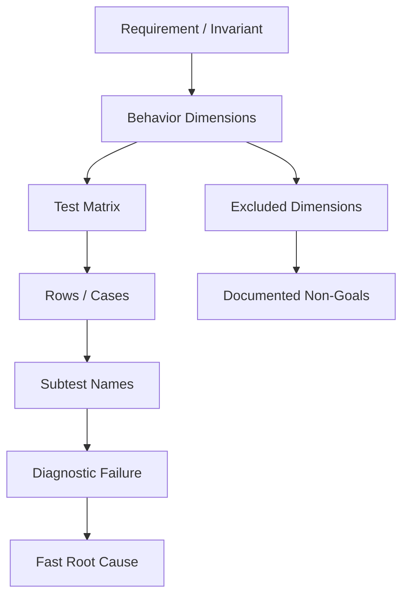
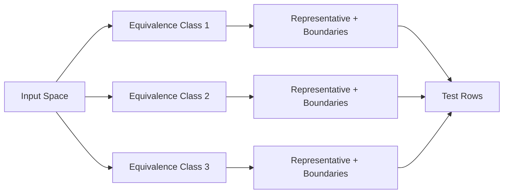
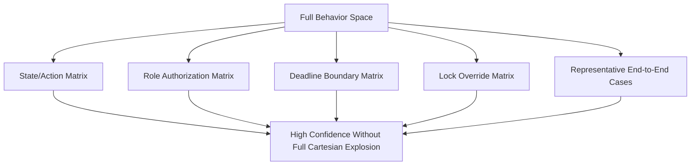
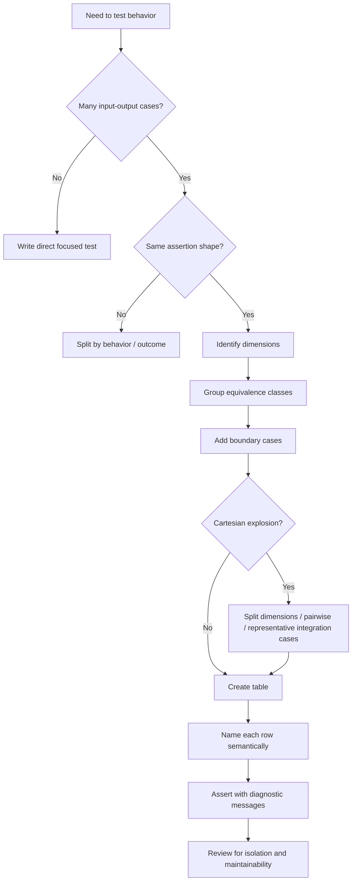

# learn-go-testing-benchmarking-performance-engineering-part-006.md

# Part 006 — Table-Driven Tests as Test Matrix Engineering

> Seri: **Go Testing, Benchmarking, Performance Engineering**  
> Target: **Go 1.26.x**  
> Audience: **Java software engineer / tech lead** yang ingin membangun test suite Go dengan standar engineering handbook internal, bukan sekadar menulis template test.

---

## 0. Posisi Part Ini Dalam Seri

Pada part sebelumnya kita sudah membahas:

- bagaimana `go test` mengeksekusi test package,
- taxonomy test,
- desain kode yang testable,
- primitive package `testing`,
- assertion strategy.

Part ini masuk ke salah satu idiom paling sering muncul di Go: **table-driven test**.

Namun tujuan kita bukan menghafal pola:

```go
for _, tc := range tests {
    t.Run(tc.name, func(t *testing.T) {
        got := fn(tc.in)
        if got != tc.want {
            t.Fatalf("got %v, want %v", got, tc.want)
        }
    })
}
```

Itu hanya bentuk permukaan.

Tujuan sebenarnya adalah memahami table-driven test sebagai **test matrix engineering**:

- bagaimana memilih dimensi test,
- bagaimana mengontrol kombinasi kasus,
- bagaimana menghindari table yang terlalu besar,
- bagaimana membuat nama subtest yang menjadi diagnostic index,
- bagaimana memisahkan valid/invalid/failure-mode tests,
- bagaimana menjaga table tetap readable saat sistem makin kompleks,
- bagaimana menghindari false confidence dari table yang terlihat lengkap tetapi sebenarnya tidak menguji invariant penting.

Dalam codebase besar, table-driven tests bukan sekadar idiom. Ia adalah cara membuat **behavioral coverage map** yang mudah dibaca, mudah direview, dan mudah dikembangkan.

---

## 1. Baseline Faktual Dari Go

Go tidak memiliki annotation framework seperti JUnit 5 `@ParameterizedTest`, `@CsvSource`, `@MethodSource`, atau test runner extension model seperti di Java. Go memakai pendekatan sederhana:

- test function adalah fungsi biasa dengan signature `func TestXxx(*testing.T)`,
- test case biasanya direpresentasikan sebagai slice struct,
- subtest dibuat dengan `t.Run(name, func(t *testing.T) { ... })`,
- test dapat dipilih dengan `go test -run` memakai regexp,
- subtest name membentuk path hierarkis,
- parent test selesai setelah seluruh subtest selesai.

Dokumentasi package `testing` menyebut `T.Run` dan `B.Run` sebagai mekanisme untuk membuat subtests dan sub-benchmarks, termasuk hierarchical tests dan shared setup/teardown. Go Blog “Using Subtests and Sub-benchmarks” juga menjelaskan bahwa subtests membantu failure handling, fine-grained command-line selection, parallelism control, dan maintainability.

Referensi resmi:

- `testing` package: <https://pkg.go.dev/testing>
- Go Blog — Using Subtests and Sub-benchmarks: <https://go.dev/blog/subtests>
- Go Wiki — TableDrivenTests: <https://go.dev/wiki/TableDrivenTests>
- Go Wiki — TestComments: <https://go.dev/wiki/TestComments>

---

## 2. Mental Model: Table-Driven Test Bukan “Loop Test Case”

Cara berpikir dangkal:

> “Saya punya banyak input-output, jadi saya taruh di slice.”

Cara berpikir engineer senior:

> “Saya sedang membuat representasi eksplisit dari ruang perilaku fungsi/sistem. Setiap row harus punya alasan keberadaan. Setiap kolom harus mewakili dimensi yang relevan. Setiap nama harus membantu diagnosis ketika failure terjadi.”

Table-driven test adalah cara mengubah **behavior space** menjadi **reviewable artifact**.



Table yang baik menjawab:

1. **Apa perilaku yang sedang dipetakan?**
2. **Dimensi apa yang sengaja divariasikan?**
3. **Dimensi apa yang sengaja tidak divariasikan?**
4. **Kasus mana yang normal, boundary, invalid, dan failure?**
5. **Ketika satu row gagal, apakah nama dan assertion cukup untuk diagnosis?**

---

## 3. Dari Java Parameterized Test ke Go Table-Driven Test

Sebagai Java engineer, Anda mungkin terbiasa dengan:

```java
@ParameterizedTest
@CsvSource({
    "PENDING, APPROVE, APPROVED",
    "PENDING, REJECT, REJECTED"
})
void transition(String from, String action, String expected) {
    ...
}
```

Atau:

```java
@ParameterizedTest
@MethodSource("cases")
void testCase(Case c) {
    ...
}
```

Di Go, pola mentalnya lebih eksplisit:

```go
func TestTransition(t *testing.T) {
    tests := []struct {
        name string
        from State
        action Action
        want State
    }{
        {
            name:   "pending approve becomes approved",
            from:   Pending,
            action: Approve,
            want:   Approved,
        },
        {
            name:   "pending reject becomes rejected",
            from:   Pending,
            action: Reject,
            want:   Rejected,
        },
    }

    for _, tc := range tests {
        tc := tc
        t.Run(tc.name, func(t *testing.T) {
            got := Transition(tc.from, tc.action)
            if got != tc.want {
                t.Fatalf("Transition(%q, %q) = %q, want %q", tc.from, tc.action, got, tc.want)
            }
        })
    }
}
```

Perbedaan penting:

| Area | Java Parameterized Test | Go Table-Driven Test |
|---|---|---|
| Test data | Annotation/source provider | Plain slice/map/function |
| Test runner magic | Banyak extension | Minimal runtime convention |
| Case type | CSV, arguments, custom object | Struct biasa |
| Naming | Annotation/display name | Explicit `name` field / subtest path |
| Assertion | Framework-heavy | Standard-library/helper-first |
| Setup | Extension lifecycle | Explicit code |
| Power | Framework capability | Language simplicity |

Go cenderung lebih eksplisit. Ini mengurangi magic, tetapi menuntut disiplin desain test matrix.

---

## 4. Anatomy of a Good Table-Driven Test

Struktur minimal:

```go
func TestNormalizeStatus(t *testing.T) {
    tests := []struct {
        name string
        in   string
        want string
    }{
        {name: "trim lowercase", in: " pending ", want: "pending"},
        {name: "collapse internal spaces", in: "under  review", want: "under review"},
        {name: "empty remains empty", in: "", want: ""},
    }

    for _, tc := range tests {
        tc := tc
        t.Run(tc.name, func(t *testing.T) {
            got := NormalizeStatus(tc.in)
            if got != tc.want {
                t.Fatalf("NormalizeStatus(%q) = %q, want %q", tc.in, got, tc.want)
            }
        })
    }
}
```

Komponen penting:

1. `name`  
   Bukan kosmetik. Ini diagnostic key.

2. Input columns  
   Kolom yang membentuk kondisi test.

3. Expected columns  
   Kolom yang membentuk oracle.

4. Execution block  
   Harus kecil, jelas, dan tidak menyembunyikan banyak branching.

5. Assertion message  
   Harus memberi cukup konteks tanpa membaca ulang row.

6. Optional setup/fixture  
   Harus dikontrol agar tidak membuat table sulit dibaca.

---

## 5. Rule Utama: Setiap Row Harus Punya Alasan

Anti-pattern paling umum:

```go
tests := []struct {
    name string
    in   int
    want bool
}{
    {"case 1", 1, true},
    {"case 2", 2, true},
    {"case 3", 3, true},
    {"case 4", 4, true},
}
```

Masalahnya bukan jumlah row. Masalahnya: **tidak jelas mengapa row itu ada**.

Versi lebih baik:

```go
tests := []struct {
    name string
    in   int
    want bool
}{
    {name: "minimum allowed", in: 1, want: true},
    {name: "typical allowed", in: 2, want: true},
    {name: "upper boundary allowed", in: 100, want: true},
    {name: "below minimum rejected", in: 0, want: false},
    {name: "above maximum rejected", in: 101, want: false},
}
```

Sekarang row punya semantic purpose:

- minimum,
- typical,
- upper boundary,
- below minimum,
- above maximum.

Checklist row:

- Apakah row ini menguji invariant berbeda?
- Apakah row ini boundary?
- Apakah row ini regression case?
- Apakah row ini failure-mode?
- Apakah row ini duplikat semantik dari row lain?
- Jika row ini dihapus, confidence apa yang hilang?

Jika tidak ada jawaban, row kemungkinan noise.

---

## 6. Nama Test Case Adalah Index Diagnostik

Subtest failure biasanya muncul seperti:

```text
a--- FAIL: TestValidateTransition (0.00s)
    --- FAIL: TestValidateTransition/pending_approve_allowed (0.00s)
```

Nama row menentukan seberapa cepat Anda memahami failure.

### 6.1 Nama Buruk

```go
{name: "case 1"}
{name: "valid"}
{name: "invalid"}
{name: "test pending"}
```

Masalah:

- terlalu generik,
- tidak menjelaskan dimensi,
- tidak membantu `go test -run`,
- tidak membantu reviewer.

### 6.2 Nama Baik

```go
{name: "pending approve allowed"}
{name: "approved approve rejected as terminal"}
{name: "appealed withdraw allowed before hearing"}
{name: "expired transition rejected after deadline"}
```

Nama baik biasanya memuat:

- kondisi awal,
- aksi/input utama,
- outcome penting,
- boundary jika relevan.

Pattern:

```text
<given> <when> <expected>
```

Contoh:

```text
pending approve returns approved
approved reject returns terminal error
empty applicant id rejected
deadline exactly at cutoff accepted
deadline after cutoff rejected
```

### 6.3 Gunakan Slash Untuk Hierarki Jika Membantu

Go subtest names membentuk path. Slash dapat dipakai sebagai hierarchy separator:

```go
name: "valid/pending/approve"
name: "invalid/approved/approve-terminal"
name: "deadline/exact-cutoff/accepted"
```

Ini membuat selective run lebih nyaman:

```bash
go test ./internal/caseflow -run 'TestTransition/invalid'
go test ./internal/caseflow -run 'TestTransition/deadline/exact-cutoff'
```

Jangan membuat hierarchy terlalu dalam jika tidak diperlukan.

---

## 7. Slice atau Map Untuk Test Table?

Ada dua bentuk umum.

### 7.1 Slice

```go
tests := []struct {
    name string
    in   string
    want string
}{
    {name: "empty", in: "", want: ""},
    {name: "trim", in: " x ", want: "x"},
}
```

Kelebihan:

- order eksplisit,
- mudah membaca progresi boundary,
- stabil untuk output,
- cocok untuk dokumentasi behavior.

Kekurangan:

- order dependency bisa tersembunyi jika test punya shared state.

### 7.2 Map

```go
tests := map[string]struct {
    in   string
    want string
}{
    "empty": {in: "", want: ""},
    "trim":  {in: " x ", want: "x"},
}

for name, tc := range tests {
    name, tc := name, tc
    t.Run(name, func(t *testing.T) {
        got := Normalize(tc.in)
        if got != tc.want {
            t.Fatalf("got %q, want %q", got, tc.want)
        }
    })
}
```

Kelebihan:

- map iteration order tidak dijamin,
- membantu mendeteksi hidden order dependency,
- nama menjadi key.

Kekurangan:

- kurang cocok untuk table yang butuh urutan pedagogis,
- output order bisa berubah,
- reviewer kadang lebih sulit melihat boundary progression.

### 7.3 Rekomendasi Praktis

Gunakan **slice by default**.

Gunakan **map** ketika:

- Anda sengaja ingin menghindari order dependency,
- cases independent sepenuhnya,
- tidak ada value pedagogis dari urutan row,
- nama unik adalah identitas utama.

Untuk order-randomization lebih eksplisit, gunakan `go test -shuffle=on` di suite yang cocok.

---

## 8. Range Variable Capture: Wajib Paham Meski Go Modern Sudah Lebih Aman

Pola historis Go:

```go
for _, tc := range tests {
    tc := tc
    t.Run(tc.name, func(t *testing.T) {
        ...
    })
}
```

`tc := tc` digunakan untuk menghindari closure menangkap loop variable yang berubah pada iterasi berikutnya, terutama saat subtest parallel.

Pada Go modern, semantics loop variable sudah diperbaiki untuk banyak kasus. Namun dalam engineering handbook, masih layak memahami pattern ini karena:

- banyak codebase masih memakai pattern lama,
- code review lint historis masih mengenal risiko ini,
- parallel subtests tetap harus dipikirkan dengan hati-hati,
- explicit copy sering membuat intent lebih jelas.

Pattern aman dan readable:

```go
for _, tc := range tests {
    tc := tc
    t.Run(tc.name, func(t *testing.T) {
        t.Parallel()
        ...
    })
}
```

Untuk pointer-heavy case, hati-hati juga dengan pointer ke field yang mutable.

---

## 9. Table Sebagai Matrix: Identifikasi Dimensi

Misalkan requirement:

> Case transition hanya boleh dilakukan jika user punya role yang sesuai, state case mendukung action, deadline belum lewat, dan case belum locked.

Dimensi behavior:

| Dimensi | Nilai contoh |
|---|---|
| Current state | `Draft`, `Submitted`, `UnderReview`, `Approved`, `Rejected` |
| Action | `Submit`, `Approve`, `Reject`, `Withdraw` |
| Role | `Applicant`, `Officer`, `Supervisor` |
| Deadline | before, exact, after |
| Lock state | unlocked, locked |
| Expected result | allowed / rejected |
| Error reason | invalid state, unauthorized, expired, locked |

Naifnya, kombinasi penuh:

```text
5 states × 4 actions × 3 roles × 3 deadlines × 2 lock states = 360 cases
```

Tidak semua kombinasi layak dibuat sebagai unit test table. Table-driven test yang baik bukan brute-force Cartesian product tanpa reasoning.

Kita perlu strategi.

---

## 10. Strategi Matrix: Equivalence Classes

Equivalence class adalah kelompok input yang secara semantik diperlakukan sama oleh sistem.

Contoh validasi amount:

```text
allowed: 1..1_000_000
rejected: <=0
rejected: >1_000_000
```

Tidak perlu test setiap angka. Cukup representative dan boundary:

```go
tests := []struct {
    name    string
    amount  int64
    wantErr bool
}{
    {name: "minimum allowed", amount: 1, wantErr: false},
    {name: "typical allowed", amount: 50_000, wantErr: false},
    {name: "maximum allowed", amount: 1_000_000, wantErr: false},
    {name: "zero rejected", amount: 0, wantErr: true},
    {name: "negative rejected", amount: -1, wantErr: true},
    {name: "above maximum rejected", amount: 1_000_001, wantErr: true},
}
```

Mental model:



Tujuan table bukan menutup semua input, melainkan menutup semua **behaviorally distinct classes**.

---

## 11. Strategi Matrix: Boundary Value Analysis

Banyak bug terjadi di batas:

- minimum,
- maximum,
- zero,
- empty,
- nil,
- one element,
- exact deadline,
- just before deadline,
- just after deadline,
- max length,
- max length + 1.

Contoh deadline:

```go
func TestDeadline(t *testing.T) {
    cutoff := time.Date(2026, 6, 23, 17, 0, 0, 0, time.UTC)

    tests := []struct {
        name string
        now  time.Time
        want bool
    }{
        {
            name: "before cutoff accepted",
            now:  cutoff.Add(-time.Nanosecond),
            want: true,
        },
        {
            name: "exact cutoff accepted",
            now:  cutoff,
            want: true,
        },
        {
            name: "after cutoff rejected",
            now:  cutoff.Add(time.Nanosecond),
            want: false,
        },
    }

    for _, tc := range tests {
        tc := tc
        t.Run(tc.name, func(t *testing.T) {
            got := BeforeOrAtDeadline(tc.now, cutoff)
            if got != tc.want {
                t.Fatalf("BeforeOrAtDeadline(%s, %s) = %v, want %v", tc.now, cutoff, got, tc.want)
            }
        })
    }
}
```

Boundary tests harus eksplisit, bukan tersembunyi dalam random value.

---

## 12. Strategi Matrix: Pairwise dan Selective Combination

Ketika banyak dimensi, full Cartesian product sering mahal dan tidak memberi confidence proporsional.

Misalnya:

```text
state × action × role × deadline × lock
```

Strategi yang lebih sehat:

1. Test core state/action matrix.
2. Test role authorization secara terpisah.
3. Test deadline boundary secara terpisah.
4. Test lock override behavior secara terpisah.
5. Tambahkan beberapa integration-style cases untuk kombinasi representative.



Jangan membuat satu mega table yang mencoba menguji semua hal sekaligus.

---

## 13. Pisahkan Test Normal Path, Invalid Path, dan Failure Mode

Anti-pattern:

```go
tests := []struct {
    name    string
    input   Input
    want    Output
    wantErr bool
}{
    // 80 rows mixed: valid, invalid, panic, IO failure, timeout, auth failure
}
```

Masalah:

- table menjadi sulit dibaca,
- assertion block penuh branching,
- reviewer tidak tahu behavior group,
- failure diagnosis lambat,
- expected zero value sering membingungkan.

Lebih baik:

```go
func TestParseApplication_Valid(t *testing.T) { ... }
func TestParseApplication_InvalidInput(t *testing.T) { ... }
func TestParseApplication_MissingRequiredField(t *testing.T) { ... }
func TestParseApplication_MalformedJSON(t *testing.T) { ... }
```

Go Wiki TestComments juga menyarankan memisahkan table-driven test ketika non-error output dan error output lebih jelas bila diuji dalam fungsi berbeda.

Prinsip:

> Satu table sebaiknya punya satu assertion shape.

Jika Anda melihat banyak `if tc.wantErr { ... } else { ... }` yang bercabang besar, kemungkinan table perlu dipisah.

---

## 14. Assertion Shape Harus Stabil

Table yang baik punya assertion block sederhana.

### 14.1 Bagus

```go
for _, tc := range tests {
    tc := tc
    t.Run(tc.name, func(t *testing.T) {
        got := Validate(tc.input)
        if got != tc.want {
            t.Fatalf("Validate() = %v, want %v", got, tc.want)
        }
    })
}
```

### 14.2 Mulai Bau

```go
for _, tc := range tests {
    tc := tc
    t.Run(tc.name, func(t *testing.T) {
        got, err := Do(tc.input)

        if tc.wantPanic { ... }
        if tc.wantTimeout { ... }
        if tc.wantErr { ... }
        if tc.wantRetry { ... }
        if tc.wantAudit { ... }
        if tc.wantNotification { ... }
        if tc.wantState != "" { ... }
    })
}
```

Bukan berarti tidak boleh banyak expected field. Tetapi jika expected behavior berbeda jenis, pisahkan.

Rule:

- Banyak kolom input masih bisa wajar.
- Banyak kolom expected yang unrelated sering tanda table over-broad.
- Banyak branching assertion adalah smell.

---

## 15. Designing Test Case Struct

### 15.1 Local Anonymous Struct

Gunakan saat table sederhana dan tidak dipakai ulang:

```go
tests := []struct {
    name string
    in   string
    want string
}{...}
```

Kelebihan:

- dekat dengan test,
- mudah dibaca,
- tidak menambah API test file.

### 15.2 Named Case Type

Gunakan saat case besar atau dipakai oleh helper:

```go
type transitionCase struct {
    name       string
    current    State
    action     Action
    actorRole  Role
    now        time.Time
    wantState  State
    wantErrIs  error
}
```

Kelebihan:

- bisa diberi method helper,
- reusable dalam helper,
- mengurangi noise jika banyak table.

Jangan export kecuali benar-benar diperlukan.

### 15.3 Builder Untuk Fixture Kompleks

Jika input object besar:

```go
type applicationBuilder struct {
    app Application
}

func newApplicationBuilder() applicationBuilder {
    return applicationBuilder{
        app: Application{
            ID:     "app-001",
            Status: StatusDraft,
        },
    }
}

func (b applicationBuilder) submitted() applicationBuilder {
    b.app.Status = StatusSubmitted
    return b
}

func (b applicationBuilder) withApplicantID(id string) applicationBuilder {
    b.app.ApplicantID = id
    return b
}

func (b applicationBuilder) build() Application {
    return b.app
}
```

Table:

```go
tests := []struct {
    name string
    app  Application
    want error
}{
    {
        name: "submitted application valid",
        app:  newApplicationBuilder().submitted().withApplicantID("applicant-001").build(),
        want: nil,
    },
}
```

Builder membantu jika default fixture besar, tetapi jangan sampai builder menyembunyikan behavior penting.

---

## 16. Table Column Design

Kolom harus dipilih berdasarkan behavior, bukan berdasarkan semua field object.

Misalnya fungsi:

```go
func CanTransition(c Case, actor Actor, action Action, now time.Time) error
```

Jangan langsung membuat table dengan seluruh `Case` dan `Actor` jika hanya beberapa field relevan.

Buruk:

```go
tests := []struct {
    name  string
    case_ Case
    actor Actor
    action Action
    now time.Time
    wantErr error
}{...}
```

Lebih fokus:

```go
tests := []struct {
    name       string
    status     Status
    locked     bool
    role       Role
    action     Action
    now        time.Time
    deadline   time.Time
    wantErrIs  error
}{...}
```

Lalu build object di dalam test:

```go
c := Case{
    Status:   tc.status,
    Locked:   tc.locked,
    Deadline: tc.deadline,
}
actor := Actor{Role: tc.role}
```

Manfaat:

- row lebih readable,
- dimensi eksplisit,
- fixture noise berkurang,
- reviewer melihat alasan variasi.

---

## 17. Expected Error: `wantErr`, `wantErrIs`, atau `wantErrAs`?

### 17.1 `wantErr bool`

Cocok jika hanya peduli error terjadi atau tidak:

```go
tests := []struct {
    name    string
    input   string
    wantErr bool
}{...}
```

Assertion:

```go
got, err := Parse(tc.input)
if (err != nil) != tc.wantErr {
    t.Fatalf("Parse() error = %v, wantErr %v", err, tc.wantErr)
}
_ = got
```

Kelemahan: confidence rendah untuk error semantics.

### 17.2 `wantErrIs error`

Cocok untuk domain error yang penting:

```go
tests := []struct {
    name      string
    input     Input
    wantErrIs error
}{
    {name: "missing applicant id", input: Input{}, wantErrIs: ErrMissingApplicantID},
}
```

Assertion:

```go
err := Validate(tc.input)
if tc.wantErrIs == nil {
    if err != nil {
        t.Fatalf("Validate() error = %v, want nil", err)
    }
    return
}
if !errors.Is(err, tc.wantErrIs) {
    t.Fatalf("Validate() error = %v, want errors.Is(..., %v)", err, tc.wantErrIs)
}
```

### 17.3 Typed Error / `errors.As`

Cocok jika error membawa metadata:

```go
type ValidationError struct {
    Field string
    Code  string
}
```

Expected columns:

```go
tests := []struct {
    name      string
    input     Input
    wantField string
    wantCode  string
}{...}
```

Assertion:

```go
var ve *ValidationError
if !errors.As(err, &ve) {
    t.Fatalf("Validate() error = %T %[1]v, want *ValidationError", err)
}
if ve.Field != tc.wantField || ve.Code != tc.wantCode {
    t.Fatalf("ValidationError = field %q code %q, want field %q code %q",
        ve.Field, ve.Code, tc.wantField, tc.wantCode)
}
```

### 17.4 Hindari Membandingkan Error String Kecuali Memang Contract

Buruk:

```go
if err.Error() != tc.wantErr {
    t.Fatalf("...")
}
```

Lebih baik:

- `errors.Is`,
- `errors.As`,
- domain code,
- field path,
- structured error.

Bandingkan string jika message memang public contract atau UX text yang harus stabil.

---

## 18. Table-Driven Test Untuk State Machine

Karena Anda banyak bekerja dengan lifecycle enforcement/regulatory system, state machine adalah contoh penting.

### 18.1 Domain

```go
type State string

const (
    Draft       State = "draft"
    Submitted   State = "submitted"
    UnderReview State = "under_review"
    Approved    State = "approved"
    Rejected    State = "rejected"
)

type Action string

const (
    Submit  Action = "submit"
    Assign  Action = "assign"
    Approve Action = "approve"
    Reject  Action = "reject"
)

var ErrInvalidTransition = errors.New("invalid transition")

func Transition(from State, action Action) (State, error) {
    switch from {
    case Draft:
        if action == Submit {
            return Submitted, nil
        }
    case Submitted:
        if action == Assign {
            return UnderReview, nil
        }
    case UnderReview:
        switch action {
        case Approve:
            return Approved, nil
        case Reject:
            return Rejected, nil
        }
    }
    return "", ErrInvalidTransition
}
```

### 18.2 Valid Transition Table

```go
func TestTransition_Valid(t *testing.T) {
    tests := []struct {
        name   string
        from   State
        action Action
        want   State
    }{
        {name: "draft submit becomes submitted", from: Draft, action: Submit, want: Submitted},
        {name: "submitted assign becomes under review", from: Submitted, action: Assign, want: UnderReview},
        {name: "under review approve becomes approved", from: UnderReview, action: Approve, want: Approved},
        {name: "under review reject becomes rejected", from: UnderReview, action: Reject, want: Rejected},
    }

    for _, tc := range tests {
        tc := tc
        t.Run(tc.name, func(t *testing.T) {
            got, err := Transition(tc.from, tc.action)
            if err != nil {
                t.Fatalf("Transition(%q, %q) error = %v, want nil", tc.from, tc.action, err)
            }
            if got != tc.want {
                t.Fatalf("Transition(%q, %q) = %q, want %q", tc.from, tc.action, got, tc.want)
            }
        })
    }
}
```

### 18.3 Invalid Transition Table

```go
func TestTransition_Invalid(t *testing.T) {
    tests := []struct {
        name   string
        from   State
        action Action
    }{
        {name: "draft approve rejected", from: Draft, action: Approve},
        {name: "submitted approve rejected before assignment", from: Submitted, action: Approve},
        {name: "approved reject rejected as terminal", from: Approved, action: Reject},
        {name: "rejected approve rejected as terminal", from: Rejected, action: Approve},
    }

    for _, tc := range tests {
        tc := tc
        t.Run(tc.name, func(t *testing.T) {
            got, err := Transition(tc.from, tc.action)
            if !errors.Is(err, ErrInvalidTransition) {
                t.Fatalf("Transition(%q, %q) error = %v, want %v", tc.from, tc.action, err, ErrInvalidTransition)
            }
            if got != "" {
                t.Fatalf("Transition(%q, %q) state = %q, want empty", tc.from, tc.action, got)
            }
        })
    }
}
```

Mengapa valid dan invalid dipisah?

Karena assertion shape berbeda:

- valid: expect state and nil error,
- invalid: expect domain error and empty state.

Ini membuat failure lebih jelas.

---

## 19. Full Matrix Untuk State Machine: Kapan Layak?

Untuk state machine kecil, full matrix bisa berguna.

```go
func TestTransition_Matrix(t *testing.T) {
    states := []State{Draft, Submitted, UnderReview, Approved, Rejected}
    actions := []Action{Submit, Assign, Approve, Reject}

    allowed := map[State]map[Action]State{
        Draft: {
            Submit: Submitted,
        },
        Submitted: {
            Assign: UnderReview,
        },
        UnderReview: {
            Approve: Approved,
            Reject:  Rejected,
        },
    }

    for _, from := range states {
        from := from
        t.Run(string(from), func(t *testing.T) {
            for _, action := range actions {
                action := action
                t.Run(string(action), func(t *testing.T) {
                    got, err := Transition(from, action)

                    want, ok := allowed[from][action]
                    if ok {
                        if err != nil {
                            t.Fatalf("error = %v, want nil", err)
                        }
                        if got != want {
                            t.Fatalf("state = %q, want %q", got, want)
                        }
                        return
                    }

                    if !errors.Is(err, ErrInvalidTransition) {
                        t.Fatalf("error = %v, want %v", err, ErrInvalidTransition)
                    }
                    if got != "" {
                        t.Fatalf("state = %q, want empty", got)
                    }
                })
            }
        })
    }
}
```

Kelebihan:

- menutup seluruh state/action combination,
- bagus untuk small finite state machine,
- mudah melihat missing transition.

Kekurangan:

- expected map bisa menjadi second implementation,
- kurang naratif untuk business behavior,
- sulit jika banyak dimensions.

Gunakan full matrix jika:

- dimensi kecil,
- behavior finite,
- invalid combinations sama pentingnya dengan valid,
- table masih mudah direview.

Hindari jika expected matrix menjadi replika kompleks dari production logic.

---

## 20. Avoid “Second Implementation” Problem

Test bisa menjadi buruk jika expected logic sama kompleksnya dengan implementation.

Buruk:

```go
want := computeExpectedUsingSimilarLogic(tc.input)
```

Jika `computeExpectedUsingSimilarLogic` punya bug yang sama dengan production function, test tetap hijau.

Lebih baik:

- expected literal untuk critical cases,
- small independent oracle,
- property/invariant untuk broad input,
- golden file untuk stable output,
- reference implementation jika benar-benar independen dan lebih sederhana.

Table-driven test harus membuat expected behavior eksplisit, bukan menyembunyikannya dalam logic baru yang sama rumitnya.

---

## 21. Table-Driven Test Untuk Authorization Rules

Misalnya rule:

- Applicant can submit draft.
- Officer can assign submitted.
- Supervisor can approve under review.
- No one can mutate terminal state.
- Locked case rejects all mutation.

### 21.1 Jangan Gabungkan Semua Dimensi Secara Brutal

Naif:

```text
role × state × action × locked
```

Jika role 4, state 5, action 4, locked 2 = 160 rows.

Lebih baik pisahkan:

1. role/action allowed matrix,
2. terminal state behavior,
3. lock override behavior,
4. representative integration cases.

### 21.2 Role Matrix

```go
func TestCanAct_RoleMatrix(t *testing.T) {
    tests := []struct {
        name    string
        role    Role
        action  Action
        allowed bool
    }{
        {name: "applicant submit allowed", role: Applicant, action: Submit, allowed: true},
        {name: "applicant approve rejected", role: Applicant, action: Approve, allowed: false},
        {name: "officer assign allowed", role: Officer, action: Assign, allowed: true},
        {name: "officer approve rejected", role: Officer, action: Approve, allowed: false},
        {name: "supervisor approve allowed", role: Supervisor, action: Approve, allowed: true},
    }

    for _, tc := range tests {
        tc := tc
        t.Run(tc.name, func(t *testing.T) {
            got := CanRolePerform(tc.role, tc.action)
            if got != tc.allowed {
                t.Fatalf("CanRolePerform(%q, %q) = %v, want %v", tc.role, tc.action, got, tc.allowed)
            }
        })
    }
}
```

### 21.3 Lock Override

```go
func TestCanTransition_LockedCaseRejectsMutation(t *testing.T) {
    tests := []struct {
        name   string
        state  State
        action Action
        role   Role
    }{
        {name: "draft submit rejected when locked", state: Draft, action: Submit, role: Applicant},
        {name: "submitted assign rejected when locked", state: Submitted, action: Assign, role: Officer},
        {name: "under review approve rejected when locked", state: UnderReview, action: Approve, role: Supervisor},
    }

    for _, tc := range tests {
        tc := tc
        t.Run(tc.name, func(t *testing.T) {
            c := Case{State: tc.state, Locked: true}
            actor := Actor{Role: tc.role}

            err := CanTransition(c, actor, tc.action)
            if !errors.Is(err, ErrCaseLocked) {
                t.Fatalf("CanTransition() error = %v, want %v", err, ErrCaseLocked)
            }
        })
    }
}
```

Ini jauh lebih jelas daripada satu table raksasa.

---

## 22. Table-Driven Tests Untuk Parser / Normalizer

Parser dan normalizer cocok untuk table-driven test karena banyak input-output mapping.

```go
func TestNormalizePostalCode(t *testing.T) {
    tests := []struct {
        name    string
        input   string
        want    string
        wantErr error
    }{
        {name: "six digits accepted", input: "123456", want: "123456"},
        {name: "surrounding spaces trimmed", input: " 123456 ", want: "123456"},
        {name: "empty rejected", input: "", wantErr: ErrInvalidPostalCode},
        {name: "five digits rejected", input: "12345", wantErr: ErrInvalidPostalCode},
        {name: "seven digits rejected", input: "1234567", wantErr: ErrInvalidPostalCode},
        {name: "letters rejected", input: "ABC123", wantErr: ErrInvalidPostalCode},
    }

    for _, tc := range tests {
        tc := tc
        t.Run(tc.name, func(t *testing.T) {
            got, err := NormalizePostalCode(tc.input)
            if tc.wantErr != nil {
                if !errors.Is(err, tc.wantErr) {
                    t.Fatalf("NormalizePostalCode(%q) error = %v, want %v", tc.input, err, tc.wantErr)
                }
                return
            }
            if err != nil {
                t.Fatalf("NormalizePostalCode(%q) error = %v, want nil", tc.input, err)
            }
            if got != tc.want {
                t.Fatalf("NormalizePostalCode(%q) = %q, want %q", tc.input, got, tc.want)
            }
        })
    }
}
```

Catatan: di sini valid dan invalid masih bisa digabung karena assertion branching kecil. Jika invalid cases makin banyak dan butuh detail error, pisahkan.

---

## 23. Table-Driven Tests Untuk Collection / Map Output

Ketika output berupa slice/map/struct besar, jangan asal `reflect.DeepEqual` tanpa memikirkan semantics.

### 23.1 Slice Order Matters

```go
if !slices.Equal(got, tc.want) {
    t.Fatalf("got %v, want %v", got, tc.want)
}
```

### 23.2 Slice Order Does Not Matter

Jika order tidak contract, jangan test order.

```go
got := append([]string(nil), got...)
want := append([]string(nil), tc.want...)
slices.Sort(got)
slices.Sort(want)
if !slices.Equal(got, want) {
    t.Fatalf("got elements %v, want %v", got, want)
}
```

### 23.3 Map

```go
if !maps.Equal(got, tc.want) {
    t.Fatalf("got %v, want %v", got, tc.want)
}
```

Untuk nested structure, pertimbangkan `cmp.Diff` dari `go-cmp` jika project mengizinkan dependency test.

---

## 24. Table-Driven Tests Untuk JSON

Anti-pattern:

```go
if gotJSON != tc.wantJSON { ... }
```

String JSON raw bisa gagal karena ordering atau whitespace.

Lebih baik decode dan bandingkan semantic structure:

```go
func assertJSONEqual(t *testing.T, got, want []byte) {
    t.Helper()

    var gotValue any
    if err := json.Unmarshal(got, &gotValue); err != nil {
        t.Fatalf("got invalid JSON: %v\n%s", err, got)
    }

    var wantValue any
    if err := json.Unmarshal(want, &wantValue); err != nil {
        t.Fatalf("want invalid JSON: %v\n%s", err, want)
    }

    if !reflect.DeepEqual(gotValue, wantValue) {
        t.Fatalf("JSON mismatch\ngot:  %s\nwant: %s", got, want)
    }
}
```

Table:

```go
func TestRenderDecisionJSON(t *testing.T) {
    tests := []struct {
        name string
        in   Decision
        want string
    }{
        {
            name: "approved decision includes status and reason",
            in: Decision{Status: "approved", Reason: "all checks passed"},
            want: `{"status":"approved","reason":"all checks passed"}`,
        },
    }

    for _, tc := range tests {
        tc := tc
        t.Run(tc.name, func(t *testing.T) {
            got, err := RenderDecisionJSON(tc.in)
            if err != nil {
                t.Fatalf("RenderDecisionJSON() error = %v", err)
            }
            assertJSONEqual(t, got, []byte(tc.want))
        })
    }
}
```

Jika field ordering adalah contract karena output manusia/golden, barulah bandingkan string.

---

## 25. Table-Driven Tests Untuk HTTP Handler

```go
func TestCreateCaseHandler(t *testing.T) {
    tests := []struct {
        name       string
        method     string
        body       string
        wantStatus int
        wantBody   string
    }{
        {
            name:       "valid request returns created",
            method:     http.MethodPost,
            body:       `{"applicant_id":"A-001"}`,
            wantStatus: http.StatusCreated,
            wantBody:   `{"status":"created"}`,
        },
        {
            name:       "missing applicant id returns bad request",
            method:     http.MethodPost,
            body:       `{"applicant_id":""}`,
            wantStatus: http.StatusBadRequest,
            wantBody:   `{"error":"missing_applicant_id"}`,
        },
        {
            name:       "wrong method returns method not allowed",
            method:     http.MethodGet,
            body:       ``,
            wantStatus: http.StatusMethodNotAllowed,
            wantBody:   `{"error":"method_not_allowed"}`,
        },
    }

    handler := NewCreateCaseHandler(fakeCaseService{})

    for _, tc := range tests {
        tc := tc
        t.Run(tc.name, func(t *testing.T) {
            req := httptest.NewRequest(tc.method, "/cases", strings.NewReader(tc.body))
            rec := httptest.NewRecorder()

            handler.ServeHTTP(rec, req)

            if rec.Code != tc.wantStatus {
                t.Fatalf("status = %d, want %d; body=%s", rec.Code, tc.wantStatus, rec.Body.String())
            }
            assertJSONEqual(t, rec.Body.Bytes(), []byte(tc.wantBody))
        })
    }
}
```

Prinsip:

- test handler contract, bukan internal implementation,
- fake service jika ingin isolate handler,
- gunakan semantic JSON assertion,
- response body di failure message sangat membantu,
- jangan real network untuk handler unit/component test.

---

## 26. Setup Per Row vs Shared Setup

### 26.1 Shared Setup Cocok Jika Immutable

```go
func TestSomething(t *testing.T) {
    parser := NewParser(Config{Strict: true})

    tests := []struct{ ... }{...}

    for _, tc := range tests {
        tc := tc
        t.Run(tc.name, func(t *testing.T) {
            got := parser.Parse(tc.input)
            ...
        })
    }
}
```

Aman jika `parser` immutable dan concurrency-safe.

### 26.2 Per Row Setup Cocok Jika Mutable

```go
for _, tc := range tests {
    tc := tc
    t.Run(tc.name, func(t *testing.T) {
        repo := newFakeRepo()
        svc := NewService(repo)
        ...
    })
}
```

Aman untuk isolation.

### 26.3 Jangan Shared Mutable State Antar Row

Buruk:

```go
repo := newFakeRepo()
for _, tc := range tests {
    t.Run(tc.name, func(t *testing.T) {
        svc := NewService(repo)
        ...
    })
}
```

Jika row pertama menulis ke repo, row kedua bisa terpengaruh.

Jika memang ingin test sequence, jangan pakai table independent. Tulis scenario test eksplisit.

---

## 27. Table-Driven Tests dan `t.Parallel`

Parallel subtests bagus untuk speed dan isolation pressure, tetapi harus dipakai hati-hati.

```go
func TestNormalize_Parallel(t *testing.T) {
    tests := []struct {
        name string
        in   string
        want string
    }{
        {name: "trim", in: " x ", want: "x"},
        {name: "lower", in: "ABC", want: "abc"},
    }

    for _, tc := range tests {
        tc := tc
        t.Run(tc.name, func(t *testing.T) {
            t.Parallel()

            got := Normalize(tc.in)
            if got != tc.want {
                t.Fatalf("got %q, want %q", got, tc.want)
            }
        })
    }
}
```

Gunakan parallel jika:

- test case independent,
- tidak memakai shared mutable state,
- tidak mengubah environment global,
- tidak memakai current working directory global,
- tidak memakai fixed port,
- tidak bergantung order log/output,
- dependency fake aman.

Jangan parallel jika:

- memakai `t.Setenv`,
- mengubah global variable,
- memakai singleton mutable,
- memakai database schema shared tanpa isolation,
- memakai filesystem path shared,
- test secara sengaja sequential.

`testing` package mendukung subtests untuk parallelism control, tetapi parent test baru selesai setelah subtests selesai. Ini penting untuk cleanup lifecycle.

---

## 28. `t.Cleanup` Dalam Table-Driven Tests

Gunakan `t.Cleanup` untuk resource per subtest:

```go
for _, tc := range tests {
    tc := tc
    t.Run(tc.name, func(t *testing.T) {
        dir := t.TempDir()
        srv := startTestServer(t, dir)
        t.Cleanup(func() {
            srv.Close()
        })

        ...
    })
}
```

Atau helper:

```go
func newTestServer(t *testing.T) *httptest.Server {
    t.Helper()
    srv := httptest.NewServer(http.HandlerFunc(func(w http.ResponseWriter, r *http.Request) {
        w.WriteHeader(http.StatusOK)
    }))
    t.Cleanup(srv.Close)
    return srv
}
```

Subtest cleanup membuat lifecycle lebih jelas daripada `defer` di parent yang bisa terlambat.

---

## 29. Test Helper Untuk Table Jangan Menjadi Framework Mini

Helper bagus:

```go
func assertTransition(t *testing.T, from State, action Action, want State) {
    t.Helper()

    got, err := Transition(from, action)
    if err != nil {
        t.Fatalf("Transition(%q, %q) error = %v, want nil", from, action, err)
    }
    if got != want {
        t.Fatalf("Transition(%q, %q) = %q, want %q", from, action, got, want)
    }
}
```

Helper berbahaya:

```go
func runCase(t *testing.T, tc any) {
    // reflection, dynamic dispatch, many hidden branches
}
```

Jika helper menyembunyikan apa yang dites, Anda sedang membangun framework mini yang lebih sulit direview daripada test biasa.

Rule:

- helper harus mengurangi noise,
- helper harus menjaga failure line akurat dengan `t.Helper`,
- helper tidak boleh menyembunyikan domain expectation,
- helper tidak boleh terlalu generic.

---

## 30. Table-Driven Tests dan Build Tags

Kadang table test punya variasi berdasarkan environment/platform.

Contoh file:

```text
path_windows_test.go
path_unix_test.go
```

Atau build tag:

```go
//go:build integration
```

Untuk table-driven test, jangan memasukkan terlalu banyak conditional platform di dalam table jika lebih jelas dipisahkan per file.

Buruk:

```go
if runtime.GOOS == "windows" {
    tc.want = ...
}
```

Lebih baik:

- `foo_windows_test.go`,
- `foo_unix_test.go`,
- atau explicit platform column jika memang behavior cross-platform sedang diuji.

---

## 31. Table-Driven Tests dan `go test -run`

Subtest name membuat selective execution powerful.

```bash
go test ./internal/caseflow -run 'TestTransition_Valid'
go test ./internal/caseflow -run 'TestTransition_Valid/under_review'
go test ./internal/caseflow -run 'TestTransition_Invalid/approved'
```

Karena itu nama subtest harus:

- stabil,
- meaningful,
- tidak terlalu panjang,
- tidak mengandung karakter yang menyulitkan regex jika tidak perlu,
- cukup hierarchical untuk selective run.

Go akan sanitize beberapa karakter dalam subtest names. Jangan bergantung pada nama yang terlalu aneh.

---

## 32. Test Data Generation: Jangan Semua Dibuat Manual, Jangan Semua Generated

Ada spektrum:

```text
literal cases -> builder -> generator -> fuzz/property
```

### 32.1 Literal Cases

Bagus untuk:

- boundary,
- regression,
- business rule,
- public contract.

### 32.2 Builder

Bagus untuk:

- object besar,
- default valid fixture,
- variasi kecil.

### 32.3 Generator

Bagus untuk:

- combinatorial matrix,
- state/action full matrix,
- repeated structural variation.

### 32.4 Fuzz/Property

Bagus untuk:

- broad input exploration,
- parser,
- codec,
- invariant.

Table-driven test tidak harus menanggung semua tugas. Fuzzing dan property-style tests akan dibahas lebih dalam di part khusus.

---

## 33. Generated Table Cases: Hati-Hati Dengan Readability

Kadang Anda ingin generate cases:

```go
func transitionCases() []transitionCase {
    var cases []transitionCase
    for _, state := range allStates {
        for _, action := range allActions {
            cases = append(cases, transitionCase{
                name:   string(state) + "/" + string(action),
                state:  state,
                action: action,
            })
        }
    }
    return cases
}
```

Ini boleh jika expected logic sederhana dan table eksplisit masih terlalu repetitive.

Namun hindari generator yang membuat reviewer tidak tahu:

- case apa saja yang ada,
- kenapa case itu penting,
- expected behavior dari mana,
- apakah ada blind spot.

Generated cases cocok untuk exhaustive finite combination. Untuk business behavior, literal table sering lebih reviewable.

---

## 34. Table-Driven Benchmark Preview

Sub-benchmark menggunakan pattern mirip:

```go
func BenchmarkNormalize(b *testing.B) {
    benchmarks := []struct {
        name string
        in   string
    }{
        {name: "small", in: " pending "},
        {name: "large", in: strings.Repeat(" A ", 1024)},
    }

    for _, bm := range benchmarks {
        bm := bm
        b.Run(bm.name, func(b *testing.B) {
            for b.Loop() {
                _ = Normalize(bm.in)
            }
        })
    }
}
```

Kita akan bahas detail benchmark di part 020+. Untuk sekarang, pahami bahwa table-driven thinking juga berlaku untuk benchmark:

- input size,
- payload shape,
- warm/cold path,
- allocation behavior,
- contention dimension,
- realistic workload.

Benchmark table yang buruk sama berbahayanya dengan test table buruk: terlihat ilmiah, tetapi mengukur hal yang salah.

---

## 35. Table-Driven Test Review Checklist

Gunakan checklist ini saat review PR.

### 35.1 Scope

- Apakah satu table menguji satu behavior group?
- Apakah normal/error/failure-mode perlu dipisah?
- Apakah table mencoba menguji terlalu banyak dimensi sekaligus?

### 35.2 Case Selection

- Apakah setiap row punya alasan?
- Apakah boundary values ada?
- Apakah equivalence classes tertutup?
- Apakah regression case diberi nama jelas?
- Apakah ada duplikasi semantik?

### 35.3 Naming

- Apakah `name` menjelaskan given/when/expected?
- Apakah subtest name membantu `go test -run`?
- Apakah nama stabil?

### 35.4 Data Shape

- Apakah kolom input merepresentasikan dimensi behavior, bukan noise object?
- Apakah expected columns minimal tapi cukup?
- Apakah error expectation memakai `errors.Is`/`errors.As` bila perlu?

### 35.5 Assertion

- Apakah assertion message diagnostik?
- Apakah assertion block terlalu banyak branching?
- Apakah comparison sesuai semantics?
- Apakah helper memakai `t.Helper()`?

### 35.6 Isolation

- Apakah tiap row independent?
- Apakah ada shared mutable fixture?
- Apakah aman untuk `t.Parallel` jika dipakai?
- Apakah environment/global state dibersihkan?

### 35.7 Maintainability

- Apakah table masih readable?
- Apakah builder/helper menyembunyikan expectation?
- Apakah generated cases tetap reviewable?
- Apakah test akan mudah diperluas saat rule berubah?

---

## 36. Anti-Patterns

### 36.1 Mega Table

Satu table berisi semua behavior sistem.

Gejala:

- 30+ columns,
- 100+ rows,
- assertion block besar,
- banyak `if tc.xxx`,
- sulit tahu failure berarti apa.

Solusi:

- split by behavior,
- split valid/invalid,
- split dimension,
- pakai integration tests untuk representative combinations.

### 36.2 `case 1`, `case 2`, `case 3`

Failure tidak diagnostik.

Solusi:

- nama semantic.

### 36.3 Table Menjadi Copy Requirement Mentah

Misalnya copy seluruh spreadsheet business rule ke test tanpa desain.

Solusi:

- kelompokkan equivalence classes,
- buat state/action matrix,
- pisahkan policy dimension.

### 36.4 Expected Logic Sama Dengan Production Logic

Test menjadi second implementation.

Solusi:

- literal expected,
- independent oracle,
- smaller reference model,
- property tests.

### 36.5 Overuse of Builders

Builder menyembunyikan field penting.

Solusi:

- expose behavior columns,
- gunakan builder hanya untuk default noise.

### 36.6 Shared Mutable Fixture

Rows saling memengaruhi.

Solusi:

- setup per row,
- `t.TempDir`,
- fresh fake,
- transaction rollback,
- unique namespace.

### 36.7 Assertion Framework Hides Context

```go
assert.Equal(t, tc.want, got)
```

tanpa konteks input kadang kurang diagnostik.

Solusi:

- failure message domain-aware,
- helper khusus behavior.

---

## 37. Decision Guide: Kapan Table-Driven Test Cocok?

Table-driven test cocok jika:

- banyak input-output cases,
- behavior bisa diparameterisasi,
- assertion shape sama,
- cases independent,
- boundary/equivalence penting,
- subtest selection berguna.

Kurang cocok jika:

- test adalah multi-step scenario,
- setiap case punya setup sangat berbeda,
- assertion shape berbeda-beda,
- behavior lebih cocok property/fuzz,
- test butuh narrative sequence.

Contoh bukan table-driven:

```go
func TestCaseLifecycle_EndToEnd(t *testing.T) {
    c := NewCase(...)

    if err := c.Submit(...); err != nil { ... }
    if err := c.Assign(...); err != nil { ... }
    if err := c.Approve(...); err != nil { ... }

    if c.State() != Approved { ... }
}
```

Ini scenario test, bukan matrix test.

---

## 38. Worked Example: Regulatory Case Escalation Rule

### 38.1 Requirement

Sebuah case bisa dieskalasi jika:

- status adalah `submitted` atau `under_review`,
- actor role adalah `officer` atau `supervisor`,
- case tidak locked,
- deadline escalation belum lewat,
- terminal state tidak bisa dieskalasi.

### 38.2 Domain Skeleton

```go
type CaseStatus string

const (
    CaseDraft       CaseStatus = "draft"
    CaseSubmitted   CaseStatus = "submitted"
    CaseUnderReview CaseStatus = "under_review"
    CaseApproved    CaseStatus = "approved"
    CaseRejected    CaseStatus = "rejected"
)

type Role string

const (
    RoleApplicant  Role = "applicant"
    RoleOfficer    Role = "officer"
    RoleSupervisor Role = "supervisor"
)

var (
    ErrInvalidState  = errors.New("invalid state")
    ErrUnauthorized  = errors.New("unauthorized")
    ErrCaseLocked    = errors.New("case locked")
    ErrDeadlineAfter = errors.New("deadline exceeded")
)

type Case struct {
    Status             CaseStatus
    Locked             bool
    EscalationDeadline time.Time
}

func CanEscalate(c Case, role Role, now time.Time) error {
    if c.Locked {
        return ErrCaseLocked
    }
    if now.After(c.EscalationDeadline) {
        return ErrDeadlineAfter
    }
    if role != RoleOfficer && role != RoleSupervisor {
        return ErrUnauthorized
    }
    switch c.Status {
    case CaseSubmitted, CaseUnderReview:
        return nil
    default:
        return ErrInvalidState
    }
}
```

### 38.3 Split Tables By Dominant Rule

#### Allowed Cases

```go
func TestCanEscalate_Allowed(t *testing.T) {
    deadline := time.Date(2026, 6, 23, 17, 0, 0, 0, time.UTC)

    tests := []struct {
        name   string
        status CaseStatus
        role   Role
        now    time.Time
    }{
        {
            name:   "submitted officer before deadline",
            status: CaseSubmitted,
            role:   RoleOfficer,
            now:    deadline.Add(-time.Minute),
        },
        {
            name:   "submitted supervisor before deadline",
            status: CaseSubmitted,
            role:   RoleSupervisor,
            now:    deadline.Add(-time.Minute),
        },
        {
            name:   "under review officer at exact deadline",
            status: CaseUnderReview,
            role:   RoleOfficer,
            now:    deadline,
        },
        {
            name:   "under review supervisor at exact deadline",
            status: CaseUnderReview,
            role:   RoleSupervisor,
            now:    deadline,
        },
    }

    for _, tc := range tests {
        tc := tc
        t.Run(tc.name, func(t *testing.T) {
            c := Case{Status: tc.status, EscalationDeadline: deadline}
            err := CanEscalate(c, tc.role, tc.now)
            if err != nil {
                t.Fatalf("CanEscalate(status=%q, role=%q, now=%s) error = %v, want nil",
                    tc.status, tc.role, tc.now, err)
            }
        })
    }
}
```

#### Invalid State Cases

```go
func TestCanEscalate_InvalidState(t *testing.T) {
    deadline := time.Date(2026, 6, 23, 17, 0, 0, 0, time.UTC)

    tests := []struct {
        name   string
        status CaseStatus
    }{
        {name: "draft cannot be escalated", status: CaseDraft},
        {name: "approved terminal cannot be escalated", status: CaseApproved},
        {name: "rejected terminal cannot be escalated", status: CaseRejected},
    }

    for _, tc := range tests {
        tc := tc
        t.Run(tc.name, func(t *testing.T) {
            c := Case{Status: tc.status, EscalationDeadline: deadline}
            err := CanEscalate(c, RoleOfficer, deadline.Add(-time.Minute))
            if !errors.Is(err, ErrInvalidState) {
                t.Fatalf("CanEscalate(status=%q) error = %v, want %v", tc.status, err, ErrInvalidState)
            }
        })
    }
}
```

#### Authorization Cases

```go
func TestCanEscalate_UnauthorizedRole(t *testing.T) {
    deadline := time.Date(2026, 6, 23, 17, 0, 0, 0, time.UTC)

    tests := []struct {
        name string
        role Role
    }{
        {name: "applicant cannot escalate submitted case", role: RoleApplicant},
    }

    for _, tc := range tests {
        tc := tc
        t.Run(tc.name, func(t *testing.T) {
            c := Case{Status: CaseSubmitted, EscalationDeadline: deadline}
            err := CanEscalate(c, tc.role, deadline.Add(-time.Minute))
            if !errors.Is(err, ErrUnauthorized) {
                t.Fatalf("CanEscalate(role=%q) error = %v, want %v", tc.role, err, ErrUnauthorized)
            }
        })
    }
}
```

#### Lock Override

```go
func TestCanEscalate_LockedCase(t *testing.T) {
    deadline := time.Date(2026, 6, 23, 17, 0, 0, 0, time.UTC)

    tests := []struct {
        name   string
        status CaseStatus
    }{
        {name: "locked submitted rejected", status: CaseSubmitted},
        {name: "locked under review rejected", status: CaseUnderReview},
    }

    for _, tc := range tests {
        tc := tc
        t.Run(tc.name, func(t *testing.T) {
            c := Case{Status: tc.status, Locked: true, EscalationDeadline: deadline}
            err := CanEscalate(c, RoleOfficer, deadline.Add(-time.Minute))
            if !errors.Is(err, ErrCaseLocked) {
                t.Fatalf("CanEscalate(locked status=%q) error = %v, want %v", tc.status, err, ErrCaseLocked)
            }
        })
    }
}
```

#### Deadline Boundary

```go
func TestCanEscalate_DeadlineBoundary(t *testing.T) {
    deadline := time.Date(2026, 6, 23, 17, 0, 0, 0, time.UTC)

    tests := []struct {
        name      string
        now       time.Time
        wantErrIs error
    }{
        {name: "before deadline allowed", now: deadline.Add(-time.Nanosecond)},
        {name: "exact deadline allowed", now: deadline},
        {name: "after deadline rejected", now: deadline.Add(time.Nanosecond), wantErrIs: ErrDeadlineAfter},
    }

    for _, tc := range tests {
        tc := tc
        t.Run(tc.name, func(t *testing.T) {
            c := Case{Status: CaseSubmitted, EscalationDeadline: deadline}
            err := CanEscalate(c, RoleOfficer, tc.now)

            if tc.wantErrIs == nil {
                if err != nil {
                    t.Fatalf("CanEscalate(now=%s) error = %v, want nil", tc.now, err)
                }
                return
            }

            if !errors.Is(err, tc.wantErrIs) {
                t.Fatalf("CanEscalate(now=%s) error = %v, want %v", tc.now, err, tc.wantErrIs)
            }
        })
    }
}
```

### 38.4 Why This Design Is Better Than One Big Table

Karena setiap test function punya dominant question:

| Test | Pertanyaan |
|---|---|
| `Allowed` | Kombinasi mana yang boleh? |
| `InvalidState` | State mana yang tidak boleh? |
| `UnauthorizedRole` | Role mana yang ditolak? |
| `LockedCase` | Apakah lock mengalahkan kondisi lain? |
| `DeadlineBoundary` | Bagaimana boundary deadline diperlakukan? |

Ini memudahkan:

- review,
- failure diagnosis,
- extension saat rule berubah,
- auditability untuk domain regulatory.

---

## 39. Mermaid: Decision Flow For Table Design



---

## 40. Baseline Commands

Run all tests:

```bash
go test ./...
```

Run one test:

```bash
go test ./internal/caseflow -run '^TestCanEscalate_Allowed$'
```

Run one subtest group:

```bash
go test ./internal/caseflow -run 'TestCanEscalate_DeadlineBoundary/exact'
```

Run with shuffle:

```bash
go test ./... -shuffle=on
```

Run with race detector:

```bash
go test ./... -race
```

Run verbose to see subtests:

```bash
go test ./internal/caseflow -v -run 'TestCanEscalate'
```

Run repeatedly to catch flakes:

```bash
go test ./internal/caseflow -run 'TestCanEscalate' -count=100
```

---

## 41. Practical Heuristics

### 41.1 Size Heuristic

If table has:

- 3–15 rows: usually fine,
- 15–40 rows: check grouping,
- 40+ rows: likely needs split or generator,
- 100+ rows: likely matrix/golden/property/fuzz alternative needed.

This is not a hard rule. Domain matrix can justify large tables, but readability must remain high.

### 41.2 Column Heuristic

If table has:

- 3–7 columns: usually readable,
- 8–12 columns: check if fixture/noise can be moved,
- 12+ columns: likely too broad.

### 41.3 Branching Heuristic

If assertion block has more than two major branches, split the test.

### 41.4 Naming Heuristic

If you cannot name a row clearly, you probably do not understand why it exists.

---

## 42. Exercises

### Exercise 1 — Refactor Bad Table

Refactor this:

```go
func TestValidate(t *testing.T) {
    tests := []struct {
        name string
        id string
        amount int
        status string
        role string
        locked bool
        err bool
    }{
        {"case 1", "A", 10, "draft", "applicant", false, false},
        {"case 2", "", 10, "draft", "applicant", false, true},
        {"case 3", "A", -1, "draft", "applicant", false, true},
        {"case 4", "A", 10, "approved", "applicant", false, true},
        {"case 5", "A", 10, "draft", "officer", false, true},
        {"case 6", "A", 10, "draft", "applicant", true, true},
    }
    ...
}
```

Target:

- split by validation dimension,
- rename cases semantically,
- replace `err bool` with meaningful expected error,
- reduce unrelated columns per table.

### Exercise 2 — Build State/Action Matrix

Untuk state:

```text
Draft -> Submit -> Submitted
Submitted -> Assign -> UnderReview
UnderReview -> Approve -> Approved
UnderReview -> Reject -> Rejected
```

Buat:

- valid transition table,
- invalid transition table,
- optional full state/action matrix.

### Exercise 3 — Deadline Boundary

Buat test untuk rule:

```text
now <= deadline accepted
now > deadline rejected
```

Pastikan ada:

- before by nanosecond,
- exact deadline,
- after by nanosecond.

### Exercise 4 — HTTP Table

Buat table-driven test untuk handler:

```text
POST /applications
```

Cases:

- valid request returns 201,
- missing applicant id returns 400,
- malformed JSON returns 400,
- wrong method returns 405.

Gunakan `httptest` dan semantic JSON assertion.

---

## 43. Internal Engineering Standard: Table-Driven Test Policy

Untuk codebase production Go, aturan internal yang disarankan:

1. Table-driven tests harus punya `name` field kecuali table sangat kecil dan tidak memakai `t.Run`.
2. Subtest name harus semantic, bukan numeric.
3. Normal path dan error path dipisah jika assertion shape berbeda.
4. Boundary cases harus eksplisit.
5. Error expectation harus memakai `errors.Is`/`errors.As` jika error adalah domain contract.
6. Shared mutable fixture antar row dilarang kecuali test memang scenario sequential dan diberi nama demikian.
7. Table besar harus punya komentar yang menjelaskan matrix dimensions.
8. Generated cases harus tetap reviewable.
9. Helper harus memakai `t.Helper()`.
10. Test failure harus cukup diagnostik tanpa perlu debugger.

---

## 44. What Top 1% Engineers Do Differently

Engineer biasa menulis table-driven test karena “itu idiomatic Go”.

Engineer kuat bertanya:

- Behavior space apa yang sedang saya petakan?
- Apa equivalence class-nya?
- Boundary mana yang paling risk-prone?
- Apakah table ini menguji invariant atau hanya contoh?
- Apakah row ini punya alasan?
- Apakah failure output mempercepat RCA?
- Apakah test ini akan tetap readable saat rule bertambah?
- Apakah ini unit matrix, integration representative, atau seharusnya property/fuzz?
- Apakah expected logic terlalu mirip dengan implementation?
- Apakah test ini memberi confidence yang sepadan dengan maintenance cost?

Itulah perbedaan antara template usage dan engineering judgment.

---

## 45. Summary

Table-driven test adalah salah satu idiom paling penting dalam Go, tetapi nilainya bukan pada loop dan slice struct. Nilainya ada pada kemampuan membuat behavior space menjadi eksplisit, reviewable, dan diagnostik.

Key takeaways:

- Table-driven test adalah **test matrix engineering**.
- Setiap row harus punya alasan.
- Nama row adalah diagnostic index.
- Pisahkan table berdasarkan assertion shape dan dominant behavior.
- Gunakan equivalence classes dan boundary values.
- Hindari Cartesian explosion tanpa reasoning.
- Jangan membuat expected logic menjadi second implementation.
- Jaga fixture tetap kecil dan semantic.
- Shared mutable state antar row adalah sumber flakiness.
- Table-driven thinking juga berlaku untuk benchmark dan performance experiment.

Pada part berikutnya kita akan membahas:

> **Part 007 — Subtests, Parallel Tests, Shuffle, Isolation & Flakiness Control**

Di sana kita akan masuk lebih dalam ke `t.Run`, `t.Parallel`, `-shuffle`, shared state hazards, global environment hazards, reproducibility, seed handling, dan bagaimana membuat test suite Go aman dijalankan paralel di CI.

---

## References

- Go package `testing`: <https://pkg.go.dev/testing>
- Go Blog — Using Subtests and Sub-benchmarks: <https://go.dev/blog/subtests>
- Go Wiki — TableDrivenTests: <https://go.dev/wiki/TableDrivenTests>
- Go Wiki — TestComments: <https://go.dev/wiki/TestComments>

<!-- NAVIGATION_FOOTER -->
<div class="page-nav">
<a href="./learn-go-testing-benchmarking-performance-engineering-part-005.md">⬅️ Part 005 — Assertion Strategy Without Assertion Framework Addiction</a>
<a href="./index.md">📚 Kategori</a>
<a href="../../index.md">🏠 Home</a>
<a href="./learn-go-testing-benchmarking-performance-engineering-part-007.md">Part 007 — Subtests, Parallel Tests, Shuffle, Isolation & Flakiness Control ➡️</a>
</div>
