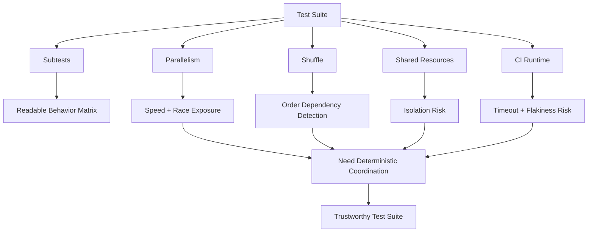
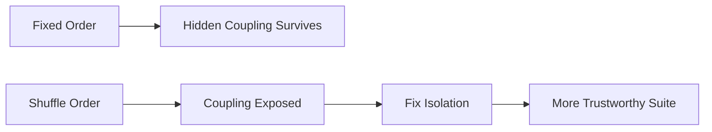
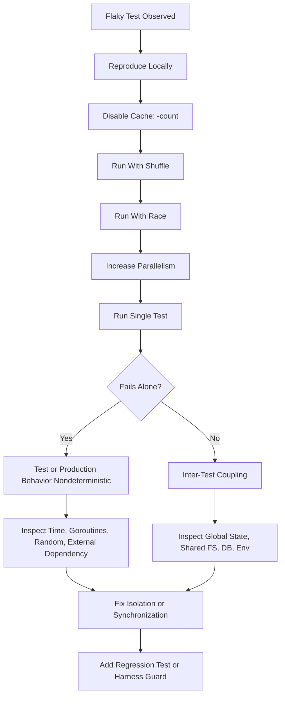
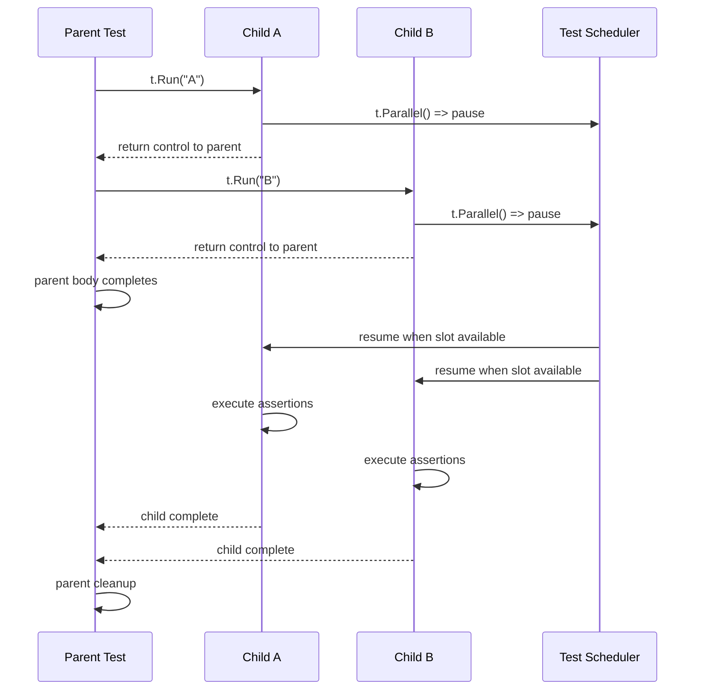

# learn-go-testing-benchmarking-performance-engineering-part-007.md

# Part 007 — Subtests, Parallel Tests, Shuffle, Isolation & Flakiness Control

> Seri: **Go Testing, Benchmarking, Performance Engineering**  
> Target pembaca: Java software engineer / tech lead yang ingin membangun test suite Go level production-grade.  
> Target Go: sampai keluarga **Go 1.26.x**.  
> Status seri: **Part 007 dari 034**. Seri belum selesai.

---

## 0. Tujuan Bagian Ini

Di bagian sebelumnya kita membahas table-driven tests sebagai **test matrix engineering**. Begitu test matrix mulai besar, masalah berikutnya muncul:

1. test menjadi lambat,
2. test saling bergantung secara tidak sengaja,
3. test hanya lolos karena urutan eksekusi tertentu,
4. test gagal sesekali di CI tetapi tidak lokal,
5. test parallel mempercepat suite tetapi membuka race, shared-state pollution, dan nondeterminism.

Bagian ini membahas cara mengendalikan itu semua dengan:

- `t.Run`,
- `t.Parallel`,
- flag `-parallel`,
- flag `-shuffle`,
- isolation boundary,
- cleanup discipline,
- seed-based reproduction,
- anti-flakiness engineering.

Kita tidak sedang belajar “cara membuat subtest” secara basic. Kita sedang membangun mental model agar test suite besar tetap:

- cepat,
- deterministik,
- dapat di-debug,
- aman untuk CI,
- tidak menyembunyikan bug concurrency,
- tidak membuat engineer kehilangan trust ke pipeline.

---

## 1. Core Mental Model

Subtests, parallel tests, dan shuffle bukan fitur kosmetik. Mereka adalah alat untuk menguji dua hal sekaligus:

1. **behavior correctness** — apakah kode memberi hasil yang benar,
2. **test isolation correctness** — apakah test tidak bergantung pada urutan, global state, environment, waktu, filesystem, random seed, database state, atau goroutine leftover.

Test yang hanya lolos dalam urutan tertentu bukan test yang benar. Itu adalah test yang kebetulan belum dibuktikan salah.

### 1.1 Testing Suite Sebagai Distributed System Kecil

Dalam codebase besar, test suite punya karakter seperti distributed system kecil:

- banyak unit independen,
- dijalankan parallel,
- memakai shared resources,
- punya lifecycle,
- punya timeout,
- punya cleanup,
- punya scheduling nondeterminism,
- punya hidden coupling,
- punya flaky failure.

Karena itu, engineering test suite tidak cukup dengan “assert expected equals actual”. Kita perlu desain isolation dan execution model.



---

## 2. Subtests: More Than Nested Names

Subtests dibuat dengan `t.Run(name, func(t *testing.T) { ... })`.

Secara teknis sederhana. Secara engineering, subtests memberi struktur untuk:

- mengelompokkan behavior,
- menjalankan subset test dengan regexp,
- memberi nama failure yang presisi,
- mengisolasi setup/cleanup per scenario,
- menjalankan sub-scenario secara parallel,
- membangun hierarchy test yang bisa dibaca di CI.

Contoh sederhana:

```go
func TestDecisionEngine(t *testing.T) {
    t.Run("draft case", func(t *testing.T) {
        t.Run("can submit when mandatory fields complete", func(t *testing.T) {
            // test body
        })

        t.Run("cannot submit when mandatory fields missing", func(t *testing.T) {
            // test body
        })
    })

    t.Run("submitted case", func(t *testing.T) {
        t.Run("can be assigned to officer", func(t *testing.T) {
            // test body
        })
    })
}
```

Nama lengkap test akan menjadi seperti:

```text
TestDecisionEngine/draft_case/can_submit_when_mandatory_fields_complete
```

Ini membuat failure jauh lebih diagnostik dibanding satu test besar bernama `TestDecisionEngine`.

---

## 3. Subtest Naming as Debugging Interface

Nama subtest adalah interface debugging untuk manusia, CI, dan tooling.

Nama yang baik menjawab:

- kondisi awal apa,
- input penting apa,
- behavior yang diharapkan apa,
- edge case apa yang sedang diuji.

Buruk:

```go
t.Run("case1", func(t *testing.T) {})
t.Run("invalid", func(t *testing.T) {})
t.Run("error", func(t *testing.T) {})
```

Lebih baik:

```go
t.Run("submitted case cannot transition back to draft", func(t *testing.T) {})
t.Run("missing applicant id returns validation error", func(t *testing.T) {})
t.Run("repository timeout returns retryable error", func(t *testing.T) {})
```

Untuk table-driven tests, hindari nama yang hanya menyalin field internal:

```go
name: "status=PENDING role=ADMIN flag=true"
```

Lebih baik jika nama menjelaskan behavior:

```go
name: "admin may approve pending case when review flag is enabled"
```

Jika matrix terlalu besar, format teknis masih boleh, tetapi tambahkan meaning:

```go
name: "allow:role=Supervisor,state=PendingReview,action=Approve"
```

---

## 4. Selective Execution with `-run`

Subtests berguna karena bisa dijalankan selektif:

```bash
go test ./internal/case -run '^TestDecisionEngine$'
```

Menjalankan subtest tertentu:

```bash
go test ./internal/case -run '^TestDecisionEngine/draft_case/cannot_submit'
```

Untuk nama yang mengandung spasi, Go mengubah spasi menjadi underscore dalam path output. Karena itu, saat debugging di CLI, sering lebih mudah memakai fragment regexp:

```bash
go test ./internal/case -run 'cannot_submit'
```

### 4.1 Design Implication

Jika subtest hierarchy dirancang baik, engineer bisa melakukan surgical debugging:

```bash
go test ./... -run 'Timeout'
go test ./... -run 'Authorization/.*/deny'
go test ./... -run 'StateTransition/.*/Submitted'
```

Kalau nama test buruk, debugging harus mengandalkan manual grep, membaca semua table row, atau menyalakan logging berlebihan.

---

## 5. Parent and Child Lifecycle

`t.Run` menjalankan child subtest sebagai bagian dari parent test.

Hal penting:

- parent dianggap selesai setelah semua child selesai,
- cleanup parent berjalan setelah semua child selesai,
- cleanup child berjalan setelah child selesai,
- failure child membuat parent gagal,
- `t.Fatal` di child menghentikan child, bukan seluruh parent secara langsung.

Contoh:

```go
func TestLifecycle(t *testing.T) {
    t.Cleanup(func() {
        t.Log("parent cleanup")
    })

    t.Run("child", func(t *testing.T) {
        t.Cleanup(func() {
            t.Log("child cleanup")
        })
    })
}
```

Urutan cleanup konseptual:

```text
child body
child cleanup
parent cleanup
```

Jika parent memiliki beberapa child, cleanup parent menunggu semua child selesai.

---

## 6. `t.Parallel`: Apa yang Sebenarnya Terjadi

`t.Parallel()` menandai test atau subtest agar dapat dijalankan secara parallel dengan test parallel lain.

Mental model penting:

1. Test mulai berjalan secara normal.
2. Saat memanggil `t.Parallel()`, test tersebut dipause.
3. Parent melanjutkan menjalankan sibling atau menyelesaikan body-nya.
4. Setelah parent mencapai titik tertentu, subtest parallel dilanjutkan oleh scheduler test.
5. Jumlah test parallel aktif dibatasi oleh flag `-parallel`.

Contoh:

```go
func TestParallelCases(t *testing.T) {
    cases := []struct {
        name string
        in   string
        want string
    }{
        {name: "trim spaces", in: "  A  ", want: "A"},
        {name: "empty", in: "", want: ""},
    }

    for _, tc := range cases {
        tc := tc // important before Go 1.22; still useful as explicit habit in mixed codebases
        t.Run(tc.name, func(t *testing.T) {
            t.Parallel()

            got := Normalize(tc.in)
            if got != tc.want {
                t.Fatalf("Normalize(%q) = %q, want %q", tc.in, got, tc.want)
            }
        })
    }
}
```

### 6.1 Why `tc := tc` Still Appears

Historically, range variable capture in Go caused a common bug where all closures captured the same loop variable. Go 1.22 changed loop variable semantics for modules declaring newer Go versions, but in real codebases with mixed module versions, examples, backports, and older packages, explicit rebinding remains a harmless clarity technique.

For production handbooks, we still show it because it communicates intent: each subtest owns its case value.

---

## 7. Parent Scope Trap with `t.Parallel`

This is one of the most important traps.

Bad:

```go
func TestUsers(t *testing.T) {
    db := newTestDB(t)
    defer db.Close()

    for _, tc := range cases {
        tc := tc
        t.Run(tc.name, func(t *testing.T) {
            t.Parallel()
            // uses db
        })
    }
}
```

Why risky?

- `defer db.Close()` belongs to parent function.
- Parallel child tests may continue after parent body returns.
- If cleanup is not coordinated with subtest lifecycle, child may observe closed resource or shared dirty state.

Better:

```go
func TestUsers(t *testing.T) {
    db := newTestDB(t)
    t.Cleanup(func() { db.Close() })

    for _, tc := range cases {
        tc := tc
        t.Run(tc.name, func(t *testing.T) {
            t.Parallel()
            // uses db only if db is concurrency-safe and data-isolated
        })
    }
}
```

But even this is only safe if:

- DB handle is safe for concurrent use,
- each test has isolated schema/transaction/data,
- cleanup does not erase shared state before siblings finish,
- parent cleanup semantics are understood.

For many integration tests, better strategy is **do not parallelize tests sharing mutable external dependencies** unless isolation is explicit.

---

## 8. `-parallel`: Test Scheduler Budget

`-parallel` controls the maximum number of parallel tests that can run simultaneously within a single test binary.

Example:

```bash
go test ./... -parallel=8
```

Important distinction:

- package-level concurrency is controlled by the `go test` package execution behavior and `-p` build/test package parallelism,
- `-parallel` controls parallel tests inside each test binary,
- `GOMAXPROCS` controls OS threads available to Go scheduler,
- benchmark parallelism has separate mechanics with `b.RunParallel`.

### 8.1 Practical CI Guidance

For CI:

```bash
go test ./... -count=1 -parallel=4
```

For local stress of isolation:

```bash
go test ./... -count=20 -shuffle=on -parallel=16
```

For debugging one flaky package:

```bash
go test ./internal/case -count=100 -shuffle=on -parallel=8 -run 'TestDecisionEngine'
```

---

## 9. Parallel Tests Are Not Free Performance

`t.Parallel` can make test suite faster, but it can also make it less trustworthy if used carelessly.

Parallelism is good for:

- pure functions,
- independent table rows,
- CPU-light tests with independent state,
- tests that wait on fake IO,
- isolated temporary directories,
- independent in-memory fakes.

Parallelism is risky for:

- tests modifying global variables,
- tests using `os.Setenv` manually,
- tests sharing a database schema,
- tests sharing static file paths,
- tests using fixed ports,
- tests mutating package-level registries,
- tests depending on wall clock timing,
- tests using singleton caches,
- tests that start goroutines without lifecycle control.

### 9.1 Rule of Thumb

A test may call `t.Parallel()` only when it can answer “yes” to all of these:

1. Does it own its data?
2. Does it own its filesystem paths?
3. Does it avoid global env mutation or use safe helper constraints?
4. Does it avoid fixed ports?
5. Does it avoid package-level mutable state?
6. Does every goroutine it starts terminate before test completion?
7. Does cleanup belong to the right test scope?
8. Can it run 100 times with `-shuffle` and still pass?

If not, do not parallelize yet.

---

## 10. `t.Setenv` and Parallel Tests

`t.Setenv` is convenient because it registers cleanup automatically. But environment variables are process-global.

That means environment mutation is inherently dangerous with parallel tests.

Bad pattern:

```go
func TestConfig(t *testing.T) {
    t.Parallel()
    t.Setenv("APP_MODE", "test")

    got := LoadConfig()
    // ...
}
```

Even if cleanup is automatic, while the test is running, the environment variable is shared with other tests in the same process.

Better:

- avoid reading process env directly in business logic,
- parse config from explicit map or struct,
- isolate env tests and keep them non-parallel,
- use `t.Setenv` only in tests that do not run parallel with other env-sensitive tests.

Better design:

```go
type Env interface {
    Lookup(key string) (string, bool)
}

type MapEnv map[string]string

func (m MapEnv) Lookup(key string) (string, bool) {
    v, ok := m[key]
    return v, ok
}

func LoadConfigFromEnv(env Env) (Config, error) {
    mode, _ := env.Lookup("APP_MODE")
    return Config{Mode: mode}, nil
}
```

Then test:

```go
func TestLoadConfigFromEnv(t *testing.T) {
    t.Parallel()

    got, err := LoadConfigFromEnv(MapEnv{"APP_MODE": "test"})
    if err != nil {
        t.Fatalf("LoadConfigFromEnv returned error: %v", err)
    }
    if got.Mode != "test" {
        t.Fatalf("Mode = %q, want %q", got.Mode, "test")
    }
}
```

This is testability through dependency boundary, not mocking ceremony.

---

## 11. Filesystem Isolation

Bad:

```go
func TestExport(t *testing.T) {
    path := "output.json"
    err := Export(path)
    if err != nil {
        t.Fatal(err)
    }
}
```

Problems:

- fixed path,
- collision across tests,
- leftover files,
- different working directory behavior,
- unsafe with `t.Parallel`,
- unsafe with `-shuffle`,
- unsafe with repeated runs.

Better:

```go
func TestExport(t *testing.T) {
    t.Parallel()

    dir := t.TempDir()
    path := filepath.Join(dir, "output.json")

    if err := Export(path); err != nil {
        t.Fatalf("Export returned error: %v", err)
    }

    data, err := os.ReadFile(path)
    if err != nil {
        t.Fatalf("ReadFile(%q): %v", path, err)
    }

    if !json.Valid(data) {
        t.Fatalf("exported file is not valid JSON: %q", data)
    }
}
```

`t.TempDir` gives per-test directory and automatic cleanup.

---

## 12. Port Isolation

Bad:

```go
func TestServer(t *testing.T) {
    srv := &http.Server{Addr: ":8080", Handler: handler}
    go srv.ListenAndServe()
    // ...
}
```

Problems:

- fixed port collision,
- leftover server,
- race between server startup and request,
- impossible parallel execution,
- failure depends on machine state.

Better for HTTP handler:

```go
func TestHandler(t *testing.T) {
    t.Parallel()

    req := httptest.NewRequest(http.MethodGet, "/cases/123", nil)
    rr := httptest.NewRecorder()

    handler.ServeHTTP(rr, req)

    if rr.Code != http.StatusOK {
        t.Fatalf("status = %d, want %d; body=%s", rr.Code, http.StatusOK, rr.Body.String())
    }
}
```

Better for real server lifecycle:

```go
func TestServerClient(t *testing.T) {
    t.Parallel()

    srv := httptest.NewServer(handler)
    t.Cleanup(srv.Close)

    resp, err := srv.Client().Get(srv.URL + "/cases/123")
    if err != nil {
        t.Fatalf("GET failed: %v", err)
    }
    defer resp.Body.Close()

    if resp.StatusCode != http.StatusOK {
        t.Fatalf("status = %d, want %d", resp.StatusCode, http.StatusOK)
    }
}
```

---

## 13. Global Mutable State Is the Enemy of Parallel Tests

Common global state:

- package-level config,
- singleton logger registry,
- default HTTP client mutation,
- default transport mutation,
- timezone global,
- random global source,
- metrics global registry,
- feature flag cache,
- authorization policy registry,
- template registry,
- plugin registry.

Bad:

```go
var currentPolicy Policy

func SetPolicy(p Policy) {
    currentPolicy = p
}

func CanApprove(user User, c Case) bool {
    return currentPolicy.Allows(user, c, "approve")
}
```

This design makes tests order-dependent.

Better:

```go
type Authorizer struct {
    policy Policy
}

func NewAuthorizer(policy Policy) *Authorizer {
    return &Authorizer{policy: policy}
}

func (a *Authorizer) CanApprove(user User, c Case) bool {
    return a.policy.Allows(user, c, "approve")
}
```

Test:

```go
func TestAuthorizerCanApprove(t *testing.T) {
    t.Parallel()

    authz := NewAuthorizer(testPolicy())
    got := authz.CanApprove(supervisorUser(), pendingCase())
    if !got {
        t.Fatalf("CanApprove = false, want true")
    }
}
```

The best flaky-test fix is often production design fix.

---

## 14. `-shuffle`: Detecting Order Dependency

`go test -shuffle=on` randomizes execution order of tests and benchmarks.

Example:

```bash
go test ./... -shuffle=on
```

Go prints the shuffle seed so the order can be reproduced.

Example output shape:

```text
-test.shuffle 1700000000000000000
```

Reproduce:

```bash
go test ./... -shuffle=1700000000000000000
```

### 14.1 Why Shuffle Matters

Without shuffle, tests run in deterministic source/name order. Hidden coupling can survive for years:

- Test A initializes global registry.
- Test B accidentally depends on registry already initialized.
- Test C cleans up shared filesystem path.
- Test D only passes after Test C runs.

Shuffle turns this hidden coupling into visible failure.



---

## 15. `-count`: Repetition as Flakiness Amplifier

A flaky test may pass once and fail once every 30 runs.

Use:

```bash
go test ./internal/case -count=100 -run 'TestDecisionEngine'
```

Combine with shuffle:

```bash
go test ./internal/case -count=100 -shuffle=on -run 'TestDecisionEngine'
```

Combine with race detector when relevant:

```bash
go test ./internal/case -race -count=50 -shuffle=on
```

### 15.1 Important: Test Cache

When using `-count=1`, you avoid cached test results:

```bash
go test ./... -count=1
```

For flakiness hunting, always disable cache with `-count` greater than 1 or `-count=1`.

---

## 16. Race Detector and Parallel Tests

Parallel tests can expose concurrency bugs. The race detector can detect data races at runtime.

Command:

```bash
go test ./... -race
```

For stress:

```bash
go test ./... -race -count=20 -shuffle=on -parallel=8
```

But understand the limitation:

- race detector detects races that happen during execution,
- it does not prove absence of all races,
- it adds overhead,
- timing changes may hide or reveal different interleavings,
- it is more suitable for CI scheduled/nightly if too slow for every PR.

### 16.1 Race Detector Is Not a Flakiness Excuse

Do not say “it only fails under race detector, so ignore it.”

If a test fails only under `-race`, investigate:

- missing synchronization,
- shared mutable fake,
- test helper global state,
- goroutine lifecycle leak,
- data structure not concurrency-safe,
- production code relying on accidental ordering.

---

## 17. Time-Based Flakiness

Bad:

```go
func TestWorker(t *testing.T) {
    worker.Start()
    time.Sleep(100 * time.Millisecond)

    if !worker.Done() {
        t.Fatal("worker not done")
    }
}
```

Problems:

- too short on slow CI,
- too long locally,
- hides missing synchronization,
- flaky under CPU pressure,
- test duration grows with sleeps.

Better: synchronize on event.

```go
func TestWorker(t *testing.T) {
    done := make(chan struct{})

    worker := NewWorker(func() {
        close(done)
    })

    worker.Start()

    select {
    case <-done:
        // ok
    case <-time.After(2 * time.Second):
        t.Fatal("worker did not complete")
    }
}
```

Even better: inject clock/timer/scheduler when testing time behavior.

---

## 18. Timeout Discipline

Timeouts in tests should detect broken behavior, not implement normal synchronization.

Use timeout as safety net:

```go
select {
case got := <-result:
    if got != want {
        t.Fatalf("got %v, want %v", got, want)
    }
case <-time.After(2 * time.Second):
    t.Fatal("timed out waiting for result")
}
```

Do not use sleep as proof:

```go
// Bad

time.Sleep(2 * time.Second)
if got := q.Len(); got != 0 {
    t.Fatalf("queue length = %d, want 0", got)
}
```

Instead, wait for condition with explicit polling and deadline when event hook is unavailable:

```go
func eventually(t *testing.T, timeout time.Duration, check func() bool) {
    t.Helper()

    deadline := time.Now().Add(timeout)
    for time.Now().Before(deadline) {
        if check() {
            return
        }
        time.Sleep(10 * time.Millisecond)
    }
    t.Fatalf("condition was not satisfied within %s", timeout)
}
```

But prefer event-based synchronization over polling.

---

## 19. Goroutine Lifecycle Isolation

A test that starts a goroutine owns its termination.

Bad:

```go
func TestConsumer(t *testing.T) {
    c := NewConsumer(queue)
    go c.Run(context.Background())

    // test asserts something
}
```

Problem:

- goroutine may survive after test,
- background consumer may affect later tests,
- panic may occur after test completes,
- leak accumulates under `-count`.

Better:

```go
func TestConsumer(t *testing.T) {
    ctx, cancel := context.WithCancel(context.Background())
    t.Cleanup(cancel)

    c := NewConsumer(queue)

    done := make(chan error, 1)
    go func() {
        done <- c.Run(ctx)
    }()

    t.Cleanup(func() {
        cancel()
        select {
        case err := <-done:
            if err != nil && !errors.Is(err, context.Canceled) {
                t.Errorf("consumer stopped with error: %v", err)
            }
        case <-time.After(2 * time.Second):
            t.Errorf("consumer did not stop")
        }
    })

    // test behavior
}
```

The cleanup verifies lifecycle. It does not just cancel and hope.

---

## 20. Shared Fake Must Be Concurrency-Safe

When tests run in parallel, fakes may be accessed concurrently.

Bad fake:

```go
type FakeRepo struct {
    data map[string]Case
}

func (r *FakeRepo) Save(c Case) {
    r.data[c.ID] = c
}

func (r *FakeRepo) Get(id string) (Case, bool) {
    c, ok := r.data[id]
    return c, ok
}
```

If shared across parallel tests, this can race.

Better options:

1. create one fake per test,
2. add mutex if fake must be shared,
3. avoid shared fake entirely.

Concurrency-safe fake:

```go
type FakeRepo struct {
    mu   sync.Mutex
    data map[string]Case
}

func NewFakeRepo() *FakeRepo {
    return &FakeRepo{data: make(map[string]Case)}
}

func (r *FakeRepo) Save(c Case) {
    r.mu.Lock()
    defer r.mu.Unlock()
    r.data[c.ID] = c
}

func (r *FakeRepo) Get(id string) (Case, bool) {
    r.mu.Lock()
    defer r.mu.Unlock()
    c, ok := r.data[id]
    return c, ok
}
```

But do not blindly make every fake concurrent. If production boundary is not concurrent, a concurrency-safe fake may hide misuse. Match fake semantics to the contract you need to test.

---

## 21. Database Isolation Patterns

For tests touching a database, parallelization requires explicit isolation.

Common patterns:

| Pattern | Parallel-Safe? | Notes |
|---|---:|---|
| Shared schema + fixed rows | No | High order-dependency risk |
| Shared schema + unique IDs | Sometimes | Works for simple inserts; cleanup still risky |
| Transaction per test + rollback | Often | Good for relational tests; not always works with async workers |
| Schema per test | Yes but expensive | Strong isolation; setup cost high |
| Database per test | Strong but expensive | Useful for high-risk integration tests |
| Test container per package | Moderate | Good compromise |

Bad:

```go
func TestApproveCase(t *testing.T) {
    insertCase(db, "CASE-001")
    approveCase(db, "CASE-001")
    // ...
}
```

Better:

```go
func TestApproveCase(t *testing.T) {
    t.Parallel()

    caseID := "CASE-" + uuidForTest(t)
    insertCase(db, caseID)
    t.Cleanup(func() { deleteCase(db, caseID) })

    approveCase(db, caseID)
    // ...
}
```

Even better for relational unit-of-work:

```go
func TestApproveCase(t *testing.T) {
    tx := beginTx(t, db)
    t.Cleanup(func() { _ = tx.Rollback() })

    repo := NewCaseRepo(tx)
    // test using tx-scoped repo
}
```

Do not parallelize database tests until you can explain the isolation model.

---

## 22. External Dependency Isolation

External dependencies include:

- Redis,
- Kafka,
- RabbitMQ,
- object storage,
- external HTTP API,
- identity provider,
- email server,
- scheduler,
- worker pool.

Parallel test hazard:

- shared topic/queue name,
- shared cache key,
- shared bucket prefix,
- shared test account,
- shared rate limit,
- shared token cache,
- shared consumer group.

Isolation strategy:

```text
resource name = stable prefix + test name hash + random suffix
```

Example:

```go
func testKey(t *testing.T, suffix string) string {
    t.Helper()
    h := sha1.Sum([]byte(t.Name()))
    return fmt.Sprintf("test:%x:%s", h[:6], suffix)
}
```

Then:

```go
key := testKey(t, "case:123")
```

This gives:

- traceability,
- low collision risk,
- safe parallel execution,
- easier cleanup.

---

## 23. `t.Cleanup` vs `defer`

Both are useful, but they differ in test lifecycle semantics.

Use `defer` for local cleanup inside the current function body.

Use `t.Cleanup` when cleanup belongs to the test lifecycle and should compose through helpers.

Helper example:

```go
func newTempConfig(t *testing.T, content string) string {
    t.Helper()

    dir := t.TempDir()
    path := filepath.Join(dir, "config.json")
    if err := os.WriteFile(path, []byte(content), 0o600); err != nil {
        t.Fatalf("write config: %v", err)
    }
    return path
}
```

Resource helper:

```go
func newTestServer(t *testing.T, h http.Handler) *httptest.Server {
    t.Helper()

    srv := httptest.NewServer(h)
    t.Cleanup(srv.Close)
    return srv
}
```

This is better than requiring every test caller to remember `defer srv.Close()`.

---

## 24. Cleanup Ordering

`t.Cleanup` functions run in last-in-first-out order for the associated test.

That matters when resources depend on each other.

Example:

```go
func TestResourceOrder(t *testing.T) {
    db := startDB(t)
    t.Cleanup(func() { db.Close() })

    worker := startWorker(t, db)
    t.Cleanup(func() { worker.Stop() })
}
```

Cleanup order:

```text
worker.Stop()
db.Close()
```

This is correct because worker depends on DB.

If registered in the opposite order, cleanup may close DB before worker stops.

---

## 25. Isolation Matrix

Use this matrix before adding `t.Parallel`.

| Resource | Isolation Required | Safe Technique |
|---|---|---|
| memory data | per-test instance | constructor/factory |
| filesystem | per-test dir | `t.TempDir` |
| env var | avoid or non-parallel | injected config / `t.Setenv` carefully |
| port | dynamic | `httptest.Server` / `net.Listen(":0")` |
| DB rows | unique ID / tx / schema | transaction rollback or unique namespace |
| cache key | unique prefix | hash of `t.Name()` |
| queue/topic | unique name/group | test-specific namespace |
| clock | injected | fake clock or explicit time source |
| random | seeded/local | local `rand.Rand` |
| goroutines | owned lifecycle | context + done channel + cleanup |
| global registry | avoid | instance-based design |

---

## 26. Flaky Test Taxonomy

A flaky test is not a random inconvenience. It is evidence that the suite has hidden nondeterminism.

Common categories:

### 26.1 Order-Dependent Flake

Symptom:

- passes alone,
- fails when run with other tests,
- fails under `-shuffle`.

Likely causes:

- global state,
- shared filesystem,
- shared DB rows,
- missing cleanup,
- test depends on another test setup.

### 26.2 Timing Flake

Symptom:

- fails on CI but not local,
- fails under CPU load,
- fixed by increasing sleep.

Likely causes:

- `time.Sleep` synchronization,
- async worker not observable,
- missing readiness signal,
- too aggressive timeout.

### 26.3 Concurrency Flake

Symptom:

- fails under `-race`,
- fails with `-parallel` high value,
- map concurrent read/write panic,
- inconsistent assertion.

Likely causes:

- shared fake not locked,
- production race,
- test helper race,
- goroutine leak.

### 26.4 External Dependency Flake

Symptom:

- network timeout,
- rate limit,
- shared test environment contention,
- dependency state not reset.

Likely causes:

- real external service in PR test,
- shared namespace,
- weak cleanup,
- no retry policy in test harness.

### 26.5 Data Flake

Symptom:

- date-sensitive failures,
- timezone-sensitive failures,
- locale/path separator differences,
- random values sometimes hit edge case.

Likely causes:

- wall-clock dependency,
- local timezone assumption,
- non-deterministic random,
- OS-specific path handling.

---

## 27. Flakiness Investigation Playbook

When a test is flaky, do not immediately add sleeps or retries.

Use this sequence:



Commands:

```bash
# run repeatedly, no cache
go test ./internal/case -count=100 -run 'TestFlakyName'

# expose order dependency
go test ./internal/case -count=50 -shuffle=on -run 'TestFlakyName|TestNearby'

# expose races
go test ./internal/case -race -count=20 -run 'TestFlakyName'

# stress parallel interactions
go test ./internal/case -count=50 -shuffle=on -parallel=16
```

---

## 28. Do Not Normalize Flakiness

Bad organizational response:

- “CI is flaky.”
- “Just rerun.”
- “This test always fails on Monday.”
- “Increase timeout.”
- “Mark skipped.”
- “Move to nightly and forget.”

Better response:

- classify flake,
- reproduce with seed/count,
- identify isolation violation,
- fix root cause,
- add harness guard if needed,
- quarantine only with owner and expiry date.

A flaky test is a production signal. The same nondeterminism pattern often exists in production code.

---

## 29. Test Quarantine Policy

In large teams, sometimes a flaky test must be quarantined temporarily to unblock delivery. But quarantine without governance rots the test suite.

Minimum quarantine metadata:

```text
Test: TestCaseAssignmentTimeout
Owner: Case Platform Team
Reason: order-dependent failure due to shared Redis prefix
First seen: 2026-06-23
Reproduction: go test ./internal/case -count=50 -shuffle=12345
Impact: PR gate disabled for this test only
Expiry: 2026-06-30
Tracking issue: ACEAS-12345
```

Policy:

- quarantine must have owner,
- quarantine must have reproduction command,
- quarantine must have expiry,
- quarantined tests still run in separate job,
- failure count is tracked,
- no silent skip without issue.

In Go, skipping can be explicit:

```go
func TestCaseAssignmentTimeout(t *testing.T) {
    if os.Getenv("ENABLE_QUARANTINED_TESTS") != "1" {
        t.Skip("quarantined: ACEAS-12345; expires 2026-06-30")
    }
    // test body
}
```

But use this sparingly. Prefer fixing the test.

---

## 30. Designing Parallel-Safe Test Helpers

A helper should not hide shared state.

Bad helper:

```go
var sharedRepo = NewFakeRepo()

func newServiceForTest(t *testing.T) *Service {
    t.Helper()
    return NewService(sharedRepo)
}
```

Better:

```go
func newServiceForTest(t *testing.T) *Service {
    t.Helper()

    repo := NewFakeRepo()
    clock := NewFakeClock(time.Date(2026, 1, 1, 0, 0, 0, 0, time.UTC))
    return NewService(repo, clock)
}
```

Helper contract should state:

- whether it returns fresh state,
- whether returned object is concurrency-safe,
- whether it starts goroutines,
- whether caller owns cleanup,
- whether it mutates env/global state.

Best helper uses `t.Cleanup` internally.

---

## 31. Parallelizing Table Tests Correctly

Template:

```go
func TestNormalizePostalCode(t *testing.T) {
    cases := []struct {
        name    string
        input   string
        want    string
        wantErr bool
    }{
        {name: "six digits unchanged", input: "123456", want: "123456"},
        {name: "spaces removed", input: " 123456 ", want: "123456"},
        {name: "letters rejected", input: "12A456", wantErr: true},
    }

    for _, tc := range cases {
        tc := tc
        t.Run(tc.name, func(t *testing.T) {
            t.Parallel()

            got, err := NormalizePostalCode(tc.input)
            if tc.wantErr {
                if err == nil {
                    t.Fatalf("NormalizePostalCode(%q) returned nil error, want error", tc.input)
                }
                return
            }
            if err != nil {
                t.Fatalf("NormalizePostalCode(%q) returned error: %v", tc.input, err)
            }
            if got != tc.want {
                t.Fatalf("NormalizePostalCode(%q) = %q, want %q", tc.input, got, tc.want)
            }
        })
    }
}
```

This is safe because:

- each row is immutable,
- no shared mutable state,
- no env mutation,
- no global registry,
- pure function,
- no goroutine lifecycle,
- no filesystem collision.

---

## 32. Nested Parallel Subtests

Nested parallel tests can be useful, but easy to misunderstand.

Example:

```go
func TestPolicy(t *testing.T) {
    for _, role := range roles {
        role := role
        t.Run(role.Name, func(t *testing.T) {
            t.Parallel()

            for _, action := range actions {
                action := action
                t.Run(action.Name, func(t *testing.T) {
                    t.Parallel()
                    // assert policy
                })
            }
        })
    }
}
```

This can create many scheduled subtests. Be careful:

- output can be noisy,
- setup may be duplicated,
- failure path can be hard to inspect,
- `-parallel` limits active execution but not conceptual complexity.

Often better:

```go
func TestPolicy(t *testing.T) {
    cases := buildPolicyCases()
    for _, tc := range cases {
        tc := tc
        t.Run(tc.name, func(t *testing.T) {
            t.Parallel()
            // assert one complete policy scenario
        })
    }
}
```

Flatten if nesting does not add diagnostic value.

---

## 33. Shared Expensive Setup with Parallel Children

Sometimes setup is expensive and can be shared read-only.

Pattern:

```go
func TestReadOnlyPolicyMatrix(t *testing.T) {
    policy := LoadPolicyFixture(t) // immutable after load

    for _, tc := range cases {
        tc := tc
        t.Run(tc.name, func(t *testing.T) {
            t.Parallel()

            got := policy.Allows(tc.subject, tc.resource, tc.action)
            if got != tc.want {
                t.Fatalf("Allows() = %v, want %v", got, tc.want)
            }
        })
    }
}
```

This is safe only if `policy` is immutable or concurrency-safe.

If not, clone per test:

```go
policy := LoadPolicyFixture(t)
for _, tc := range cases {
    tc := tc
    t.Run(tc.name, func(t *testing.T) {
        t.Parallel()

        localPolicy := policy.Clone()
        got := localPolicy.Allows(tc.subject, tc.resource, tc.action)
        // ...
    })
}
```

---

## 34. Build Tags for Slow/External/Flaky Categories

Build tags can separate test categories.

Example file:

```go
//go:build integration

package case_test

func TestPostgresCaseRepository(t *testing.T) {
    // integration test
}
```

Run:

```bash
go test ./... -tags=integration
```

But do not use build tags as a dumping ground for bad tests.

Healthy categories:

- `integration`,
- `e2e`,
- `soak`,
- `load`,
- `raceheavy`,
- `external`.

Unhealthy categories:

- `flaky`, unless temporary and governed,
- `slow` without owner or optimization plan,
- `manual` for tests that should be automated.

---

## 35. Short Mode

`testing.Short()` lets tests adapt to `go test -short`.

Example:

```go
func TestLargeCorpus(t *testing.T) {
    if testing.Short() {
        t.Skip("skipping large corpus test in short mode")
    }

    // expensive test
}
```

Run:

```bash
go test ./... -short
```

Guidance:

- PR gate may use `-short` for fast feedback,
- nightly should run full suite,
- do not hide important correctness only behind non-short tests,
- skipped tests must still run somewhere.

---

## 36. Test Timeout

`go test` has a timeout flag:

```bash
go test ./... -timeout=5m
```

This is a suite-level safety net. It is not a substitute for per-operation timeout.

Use explicit timeouts for operations expected to complete quickly, especially goroutine coordination.

Global timeout tells you:

- suite hung,
- deadlock likely,
- leaked goroutine blocked process,
- external dependency stuck.

Per-test timeout tells you:

- specific behavior failed to complete.

---

## 37. Logging in Parallel Tests

`t.Log` output is associated with the test and normally shown on failure or with `-v`.

For parallel tests, avoid logging from goroutines after test completes.

Bad:

```go
go func() {
    t.Log("background event")
}()
```

If goroutine logs after test completion, behavior can be invalid or misleading.

Better:

- collect events in channel,
- wait for goroutine,
- log from test goroutine before completion.

```go
events := make(chan string, 1)
go func() {
    events <- "background event"
}()

select {
case event := <-events:
    t.Log(event)
case <-time.After(time.Second):
    t.Fatal("timed out waiting for event")
}
```

---

## 38. Practical PR Gate Profiles

### 38.1 Fast PR Gate

```bash
go test ./... -short -count=1
```

Use for:

- compile correctness,
- fast unit/component tests,
- deterministic package tests.

### 38.2 Strong PR Gate

```bash
go test ./... -count=1 -shuffle=on -parallel=4
```

Use for:

- medium codebase,
- order dependency detection,
- moderate parallelism.

### 38.3 Scheduled Race Gate

```bash
go test ./... -race -count=1 -shuffle=on -parallel=4
```

Use for:

- nightly,
- pre-release,
- changed concurrency-sensitive packages.

### 38.4 Flakiness Hunt

```bash
go test ./... -count=50 -shuffle=on -parallel=16
```

Use temporarily, not always, because it can be expensive.

---

## 39. Case Study: Regulatory Case Transition Tests

Suppose we have regulatory case states:

```text
Draft -> Submitted -> UnderReview -> Approved/Rejected
```

Rules:

- Applicant may submit draft.
- Officer may assign submitted case.
- Supervisor may approve under-review case.
- Approved case cannot go back to draft.
- Rejected case can be appealed within allowed window.

Naive test:

```go
func TestTransitions(t *testing.T) {
    // huge test with many assertions
}
```

Better:

```go
func TestCaseTransitionPolicy(t *testing.T) {
    cases := []struct {
        name   string
        state  State
        role   Role
        action Action
        want   bool
    }{
        {
            name:   "applicant may submit draft case",
            state:  Draft,
            role:   Applicant,
            action: Submit,
            want:   true,
        },
        {
            name:   "applicant cannot approve under-review case",
            state:  UnderReview,
            role:   Applicant,
            action: Approve,
            want:   false,
        },
        {
            name:   "supervisor may approve under-review case",
            state:  UnderReview,
            role:   Supervisor,
            action: Approve,
            want:   true,
        },
        {
            name:   "approved case cannot transition to draft",
            state:  Approved,
            role:   Officer,
            action: ReturnToDraft,
            want:   false,
        },
    }

    for _, tc := range cases {
        tc := tc
        t.Run(tc.name, func(t *testing.T) {
            t.Parallel()

            policy := NewTransitionPolicy(defaultRules())
            got := policy.Allows(tc.role, tc.state, tc.action)
            if got != tc.want {
                t.Fatalf("Allows(%s, %s, %s) = %v, want %v",
                    tc.role, tc.state, tc.action, got, tc.want)
            }
        })
    }
}
```

Why this is good:

- each scenario independent,
- policy instance per subtest,
- parallel-safe,
- diagnostic test names,
- no global mutable state,
- easy selective execution.

---

## 40. Case Study: Hidden Order Dependency

Bad tests:

```go
var registry = NewRegistry()

func TestRegisterCaseModule(t *testing.T) {
    registry.Register("case", CaseModule{})
}

func TestResolveCaseModule(t *testing.T) {
    got, ok := registry.Resolve("case")
    if !ok {
        t.Fatal("case module not registered")
    }
    _ = got
}
```

This may pass in fixed order but fail under shuffle.

Fix:

```go
func TestResolveCaseModule(t *testing.T) {
    registry := NewRegistry()
    registry.Register("case", CaseModule{})

    got, ok := registry.Resolve("case")
    if !ok {
        t.Fatal("case module not registered")
    }
    _ = got
}
```

If production registry is intentionally global, provide reset helper with strict cleanup:

```go
func withCleanRegistry(t *testing.T) *Registry {
    t.Helper()

    old := globalRegistry
    reg := NewRegistry()
    globalRegistry = reg

    t.Cleanup(func() {
        globalRegistry = old
    })

    return reg
}
```

But this is not parallel-safe unless protected and isolated. Prefer instance-based design.

---

## 41. Checklist: Before Calling `t.Parallel`

Use this checklist in code review:

- [ ] Test does not mutate process-wide env, or is intentionally non-parallel.
- [ ] Test does not mutate package-level state.
- [ ] Test does not use fixed filesystem path.
- [ ] Test does not use fixed network port.
- [ ] Test data is per-test isolated.
- [ ] Fake/mock is not shared unsafely.
- [ ] Any shared dependency is immutable or concurrency-safe.
- [ ] Goroutines have context cancellation and completion verification.
- [ ] Cleanup is registered with the correct test scope.
- [ ] Test passes with `-count=20`.
- [ ] Test passes with `-shuffle=on`.
- [ ] Test passes under reasonable `-parallel` setting.

---

## 42. Checklist: Flaky Test Triage

- [ ] Capture exact failure output.
- [ ] Capture package, test name, seed, command, Go version, OS/arch.
- [ ] Re-run with `-count` and `-shuffle`.
- [ ] Re-run single test.
- [ ] Re-run neighboring tests.
- [ ] Run with `-race` if concurrency possible.
- [ ] Inspect global state mutation.
- [ ] Inspect env mutation.
- [ ] Inspect filesystem path collisions.
- [ ] Inspect DB/cache/queue namespace collisions.
- [ ] Inspect time sleeps.
- [ ] Inspect goroutine lifecycle.
- [ ] Fix root cause, not symptom.
- [ ] Add regression harness or guard.

---

## 43. Anti-Patterns

### 43.1 `t.Parallel` Everywhere

Parallelism is not a badge of quality. It is only safe if isolation is proven.

### 43.2 Fixed Resource Names

Examples:

```text
/tmp/test-output.json
localhost:8080
case_id = 1
redis key = test-case
queue = test-events
```

These create collisions.

### 43.3 Sleep-Based Synchronization

`time.Sleep` is almost always a sign of missing event synchronization.

### 43.4 Global Reset Without Locking

Resetting global state in cleanup is not enough if tests run parallel.

### 43.5 Ignoring Shuffle Seed

When shuffle exposes a failure, save the seed. Without seed, reproduction becomes guesswork.

### 43.6 Retrying Flaky Tests Blindly

Retries hide symptoms and weaken trust. Retry may be acceptable for external dependency tests only when the dependency contract itself includes transient failure.

### 43.7 Logging Instead of Diagnosing

Adding logs to flaky tests without isolating resource ownership often creates noise, not insight.

---

## 44. Commands Reference

```bash
# Run all tests, disable cache
go test ./... -count=1

# Run with verbose output
go test ./... -v

# Run selected test
go test ./internal/case -run 'TestCaseTransitionPolicy'

# Run selected subtest
go test ./internal/case -run 'TestCaseTransitionPolicy/supervisor'

# Run with shuffle
go test ./... -shuffle=on

# Reproduce shuffle seed
go test ./... -shuffle=1700000000000000000

# Repeat tests
go test ./internal/case -count=100

# Parallelism limit
go test ./... -parallel=8

# Race detector
go test ./... -race

# Flakiness hunt
go test ./internal/case -race -count=50 -shuffle=on -parallel=16

# Short mode
go test ./... -short

# Custom timeout
go test ./... -timeout=5m
```

---

## 45. Mermaid: Execution Shape of Parallel Subtests



---

## 46. Engineering Standard for This Series

Going forward, when we write tests in later parts, we will assume these standards:

1. Subtest names must be diagnostic.
2. Table rows must be isolated.
3. `t.Parallel` requires explicit isolation proof.
4. No fixed filesystem path.
5. No fixed network port.
6. No process-global env mutation in parallel tests.
7. No unowned goroutine.
8. No sleep-based synchronization unless explicitly justified.
9. `-shuffle` failures are real failures.
10. Flaky tests require root cause analysis, not blind retry.

---

## 47. Exercises

### Exercise 1 — Parallel-Safe Refactor

Take a table-driven test in your codebase and classify every resource it touches:

- memory,
- filesystem,
- env,
- DB,
- cache,
- network,
- goroutine,
- global state.

Then decide whether it can safely call `t.Parallel`.

### Exercise 2 — Shuffle Audit

Run:

```bash
go test ./... -count=10 -shuffle=on
```

For every failure, classify it as:

- order dependency,
- timing,
- concurrency,
- external dependency,
- data/environment.

### Exercise 3 — Remove One Sleep

Find one test using `time.Sleep`. Replace it with:

- channel signal,
- fake clock,
- polling with deadline,
- or explicit lifecycle hook.

### Exercise 4 — Resource Namespace Helper

Write a helper that creates unique names for:

- Redis keys,
- queue names,
- DB test records,
- object storage prefixes.

The name should include a stable hash of `t.Name()`.

---

## 48. Summary

Subtests give structure. Parallel tests give speed and expose hidden coupling. Shuffle exposes order dependency. Repeated execution amplifies flakiness. Race detector exposes runtime data races.

But these tools only help if test isolation is engineered deliberately.

A high-trust Go test suite is not merely a collection of assertions. It is a controlled execution environment where every test owns its state, lifecycle, cleanup, and resource namespace.

The next part will build on this by discussing **Golden Tests, Snapshot Tests, Approval Tests & Stable Outputs**.

---

## 49. References

- Go package documentation: `testing`
- Go command documentation: `go test`
- Go blog: subtests and sub-benchmarks
- Go race detector documentation
- Go fuzzing documentation
- Go release notes for current toolchain behavior

<!-- NAVIGATION_FOOTER -->
<div class="page-nav">
<a href="./learn-go-testing-benchmarking-performance-engineering-part-006.md">⬅️ Part 006 — Table-Driven Tests as Test Matrix Engineering</a>
<a href="./index.md">📚 Kategori</a>
<a href="../../index.md">🏠 Home</a>
<a href="./learn-go-testing-benchmarking-performance-engineering-part-008.md">Part 008 — Golden Tests, Snapshot Tests, Approval Tests & Stable Outputs ➡️</a>
</div>
