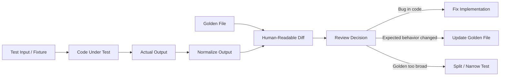
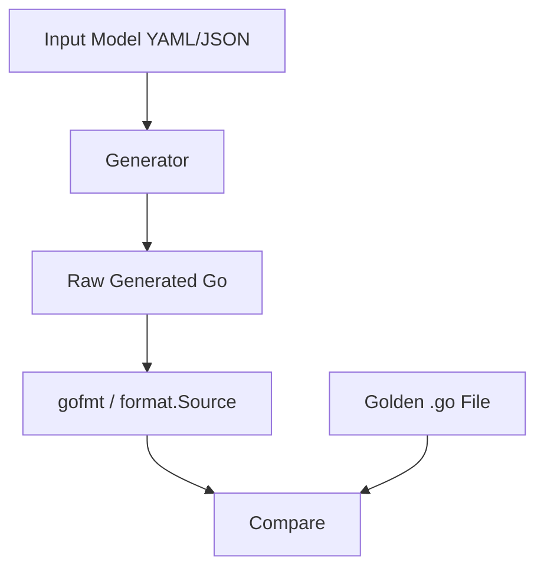
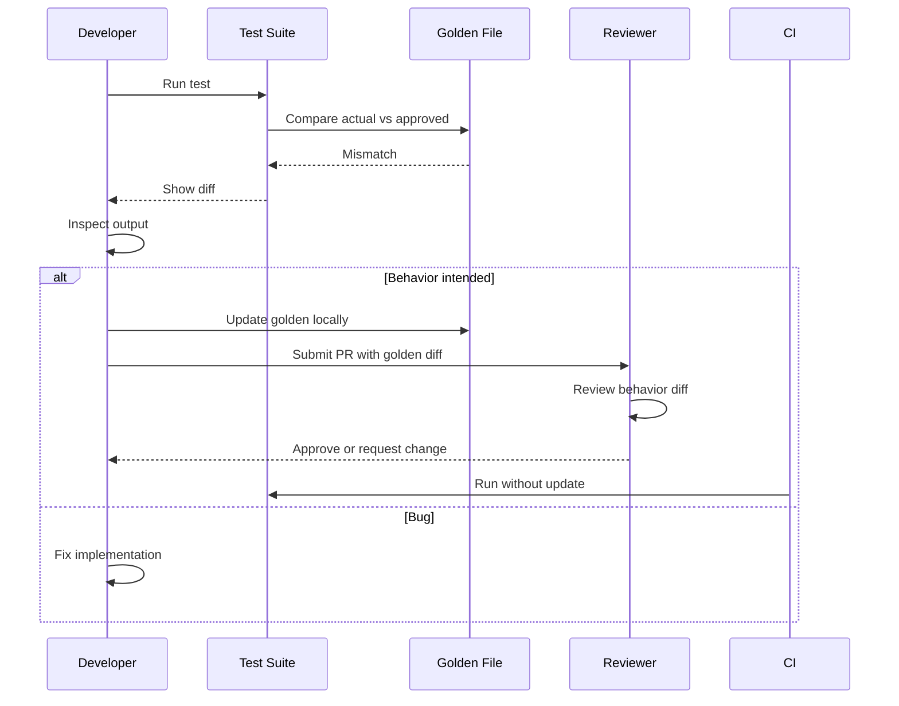
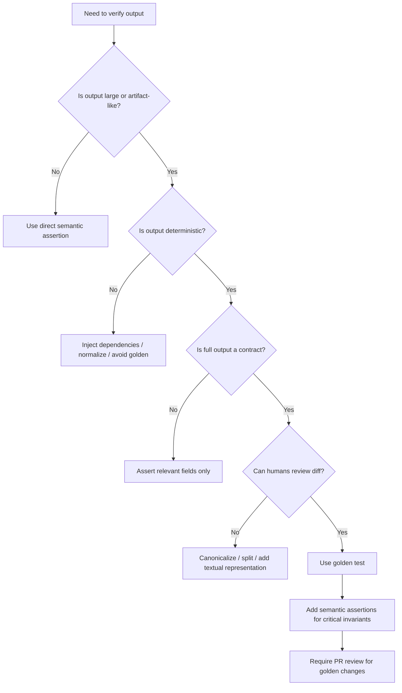
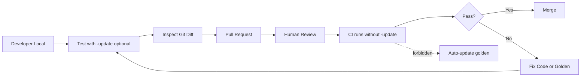

# learn-go-testing-benchmarking-performance-engineering-part-008.md

# Part 008 — Golden Tests, Snapshot Tests, Approval Tests & Stable Outputs

> Seri: **Go Testing, Benchmarking, Performance Engineering**  
> Target pembaca: **Java software engineer / tech lead** yang ingin menguasai Go testing dan performance engineering pada level internal engineering handbook.  
> Fokus part ini: bagaimana memakai **golden files**, **snapshot tests**, dan **approval tests** secara benar: bukan hanya membandingkan file, tetapi mengelola kontrak output, determinisme, reviewability, dan evolusi sistem.

---

## 0. Posisi Part Ini dalam Seri

Kita sudah membahas:

- eksekusi `go test`, test binary, cache, package modes;
- taxonomy test;
- testable design;
- package `testing`;
- assertion strategy;
- table-driven tests;
- subtests, parallelism, shuffle, isolation, flakiness.

Sekarang kita masuk ke pola test yang sering dipakai untuk output kompleks:

- generated JSON;
- generated XML;
- rendered HTML/template;
- CLI stdout/stderr;
- compiler/parser output;
- generated config;
- serialized domain document;
- API response fixture;
- report output;
- policy decision trace;
- migration script output;
- OpenAPI-like document;
- human-readable audit text;
- email body;
- file transformation result.

Pola ini sering disebut **golden test**, **snapshot test**, atau **approval test**.

Ketiganya mirip, tetapi tidak identik.

Part ini membahas bagaimana membangun pola tersebut agar:

1. failure mudah dibaca;
2. update tidak sembarangan;
3. output stabil dan deterministic;
4. review code benar-benar melihat perubahan behavior;
5. test tetap membantu desain, bukan sekadar menyimpan blob lama.

---

## 1. Problem yang Ingin Diselesaikan

Tidak semua assertion cocok ditulis sebagai:

```go
if got != want {
    t.Fatalf("got %q, want %q", got, want)
}
```

Untuk output besar, assertion inline menjadi buruk.

Contoh:

```go
want := `{
  "caseId": "CASE-2026-0001",
  "status": "ESCALATED",
  "actors": [
    {"role":"OFFICER","name":"Alice"},
    {"role":"SUPERVISOR","name":"Bob"}
  ],
  "timeline": [
    ...
  ]
}`
```

Masalah:

- test file menjadi panjang;
- sulit melihat logic test;
- perubahan output sulit direview;
- string literal raw mudah rusak formatting-nya;
- diffs di failure bisa tidak readable;
- expected output bercampur dengan orchestration test;
- format yang harus dibaca manusia lebih cocok disimpan sebagai file.

Golden test memindahkan expected output ke file.

Struktur umum:

```text
my_package/
  renderer.go
  renderer_test.go
  testdata/
    case_summary.golden.json
    appeal_notice.golden.txt
    enforcement_report.golden.html
```

Test membaca expected output dari file, menjalankan code, lalu compare.

---

## 2. Definisi: Golden vs Snapshot vs Approval

Istilah sering dipakai bergantian, tetapi untuk engineering discipline sebaiknya dibedakan.

| Istilah | Arti Praktis | Risiko Utama | Cocok Untuk |
|---|---|---|---|
| Golden test | Compare output aktual dengan expected file yang sudah disetujui | golden file stale / overbroad | formatter, serializer, renderer, generated artifact |
| Snapshot test | Simpan output besar sebagai snapshot lalu detect perubahan | snapshot update tanpa review | UI-ish output, AST dump, API payload shape |
| Approval test | Output baru harus disetujui manusia sebelum menjadi baseline | approval fatigue | document/report/policy trace yang perlu review domain |

Dalam Go, semuanya biasanya diimplementasikan dengan:

- `testdata/`;
- `os.ReadFile`;
- optional `-update` flag;
- diff helper;
- normalization;
- deterministic input.

Perbedaannya ada pada **governance**.

Golden test bukan hanya teknik file compare. Ia adalah kontrak:

> “Output ini sengaja dijadikan baseline behavior. Perubahan terhadapnya harus terlihat, dimengerti, dan disetujui.”

---

## 3. Mental Model: Golden Test sebagai Contract Boundary

Golden test paling berguna ketika output adalah **contract boundary**.



Golden file harus menjawab:

1. output apa yang menjadi kontrak;
2. input apa yang menyebabkan output itu;
3. bagian mana yang stabil;
4. bagian mana yang sengaja di-normalize;
5. siapa yang harus review perubahan;
6. apakah perubahan output berarti behavior change.

Tanpa jawaban ini, golden test berubah menjadi snapshot dump yang sulit dipercaya.

---

## 4. Kapan Golden Test Layak Dipakai

Golden test layak dipakai ketika output:

1. cukup besar sehingga inline assertion tidak readable;
2. punya bentuk yang penting sebagai artifact;
3. perlu direview manusia;
4. deterministic;
5. lebih mudah dipahami sebagai file utuh;
6. perubahan kecil harus terlihat jelas;
7. mewakili kontrak eksternal atau semi-eksternal.

Contoh bagus:

- JSON canonical output dari API response builder;
- generated XML untuk external agency;
- rendered email body;
- generated PDF source model sebelum rendering;
- CLI stdout untuk command penting;
- generated SQL migration preview;
- diagnostic report;
- audit log line format;
- policy evaluation trace;
- code generator output;
- parser AST dump;
- normalized error report.

Contoh buruk:

- output mengandung timestamp random;
- output mengandung map iteration order tidak stabil;
- output terlalu besar tanpa domain meaning;
- output berubah terus karena implementation detail;
- test hanya membandingkan seluruh response padahal hanya dua field penting;
- golden file tidak pernah direview manusia;
- update golden otomatis di CI;
- golden file dipakai untuk menutupi design yang sulit diuji.

---

## 5. Struktur File yang Direkomendasikan

Gunakan `testdata/` karena Go tooling secara konvensional mengabaikan directory ini saat package build normal.

Contoh:

```text
casegen/
  summary.go
  summary_test.go
  testdata/
    summary/
      simple_case.input.json
      simple_case.golden.txt
      escalated_case.input.json
      escalated_case.golden.txt
      missing_owner.golden.txt
```

Untuk banyak scenario, pakai folder per feature:

```text
policy/
  evaluator.go
  evaluator_test.go
  testdata/
    policy_trace/
      allow_basic.golden.txt
      deny_missing_role.golden.txt
      escalate_high_risk.golden.txt
    decisions/
      allow_basic.input.json
      deny_missing_role.input.json
      escalate_high_risk.input.json
```

Untuk code generator:

```text
internal/codegen/
  generator.go
  generator_test.go
  testdata/
    cases/
      repository_model.yaml
      repository_model.golden.go
      http_client_model.yaml
      http_client_model.golden.go
```

Prinsip naming:

- scenario name harus domain-specific;
- file extension harus mencerminkan format;
- gunakan `.golden.<ext>` atau `.want.<ext>` secara konsisten;
- jangan pakai nama generik seperti `expected.txt` untuk banyak case;
- input dan output harus mudah dipasangkan.

---

## 6. Golden Test Minimal yang Benar

Contoh sederhana untuk output text.

```go
package report_test

import (
    "os"
    "path/filepath"
    "testing"

    "example.com/app/report"
)

func TestRenderCaseSummary(t *testing.T) {
    input := report.CaseSummary{
        CaseID: "CASE-2026-0001",
        Status: "ESCALATED",
        Owner:  "Alice",
    }

    got := report.RenderCaseSummary(input)

    goldenPath := filepath.Join("testdata", "case_summary.golden.txt")
    wantBytes, err := os.ReadFile(goldenPath)
    if err != nil {
        t.Fatalf("read golden file %s: %v", goldenPath, err)
    }

    want := string(wantBytes)
    if got != want {
        t.Fatalf("rendered summary mismatch\n--- got ---\n%s\n--- want ---\n%s", got, want)
    }
}
```

Ini sudah bekerja, tetapi failure diff belum bagus.

Untuk file besar, lebih baik menghasilkan unified diff.

---

## 7. Diff yang Readable adalah Bagian dari Test Design

Golden test tanpa diff bagus akan membuat developer malas membaca perubahan.

Minimal helper:

```go
func assertGolden(t *testing.T, path string, got []byte) {
    t.Helper()

    want, err := os.ReadFile(path)
    if err != nil {
        t.Fatalf("read golden file %s: %v", path, err)
    }

    if !bytes.Equal(got, want) {
        t.Fatalf("golden mismatch for %s\n%s", path, simpleDiff(want, got))
    }
}
```

Untuk project nyata, gunakan diff library atau `go-cmp` untuk string line diff.

Contoh dengan `github.com/google/go-cmp/cmp`:

```go
import "github.com/google/go-cmp/cmp"

func assertGoldenString(t *testing.T, path string, got string) {
    t.Helper()

    wantBytes, err := os.ReadFile(path)
    if err != nil {
        t.Fatalf("read golden file %s: %v", path, err)
    }

    want := string(wantBytes)
    if diff := cmp.Diff(want, got); diff != "" {
        t.Fatalf("golden mismatch for %s (-want +got):\n%s", path, diff)
    }
}
```

Untuk JSON, jangan compare raw string jika ordering atau formatting tidak relevan. Canonicalize terlebih dahulu.

---

## 8. Normalization: Stabilkan Output, Jangan Sembunyikan Bug

Banyak output mengandung bagian yang tidak stabil:

- timestamp;
- UUID;
- random nonce;
- generated ID;
- absolute path;
- host-specific line ending;
- map iteration order;
- goroutine ID-like diagnostic;
- duration;
- memory address;
- port number;
- temporary directory name;
- stack trace line number;
- Go version string;
- OS-specific separator.

Golden test harus menormalisasi noise.

Contoh:

```go
func normalizeReport(s string) string {
    s = strings.ReplaceAll(s, "\r\n", "\n")
    s = regexp.MustCompile(`generated_at: .*`).ReplaceAllString(s, "generated_at: <timestamp>")
    s = regexp.MustCompile(`request_id: [a-f0-9-]+`).ReplaceAllString(s, "request_id: <request-id>")
    return s
}
```

Namun normalization berbahaya jika terlalu agresif.

Buruk:

```go
func normalize(s string) string {
    s = regexp.MustCompile(`\d+`).ReplaceAllString(s, "<number>")
    return s
}
```

Ini bisa menyembunyikan bug jumlah, status code, amount, version, atau policy score.

Prinsip:

> Normalize hanya bagian yang memang non-deterministic, bukan bagian yang malas kita assert.

---

## 9. Canonicalization vs Normalization

Keduanya berbeda.

**Normalization** mengganti noise menjadi placeholder.

Contoh:

```text
request_id: 01HX... -> request_id: <request-id>
```

**Canonicalization** mengubah bentuk output menjadi representasi stabil yang semantik sama.

Contoh:

- pretty-print JSON dengan indentasi konsisten;
- sort object keys;
- sort list jika order semantik tidak penting;
- normalize line ending;
- format Go source dengan `gofmt`;
- format XML;
- sort map-derived output;
- remove trailing whitespace.

Canonicalization lebih aman ketika dilakukan berdasarkan struktur format.

Contoh JSON canonicalization:

```go
func canonicalJSON(t *testing.T, in []byte) []byte {
    t.Helper()

    var v any
    if err := json.Unmarshal(in, &v); err != nil {
        t.Fatalf("unmarshal JSON: %v\n%s", err, in)
    }

    out, err := json.MarshalIndent(v, "", "  ")
    if err != nil {
        t.Fatalf("marshal canonical JSON: %v", err)
    }
    return append(out, '\n')
}
```

Catatan: `encoding/json` mengurutkan keys saat marshal map dengan string keys, sehingga output bisa stabil untuk banyak use case. Namun jangan bergantung pada map iteration order sebelum marshal.

---

## 10. Golden Test untuk JSON

Raw JSON string comparison sering rapuh.

Lebih baik:

1. parse actual JSON;
2. parse expected JSON;
3. compare semantic structure; atau
4. canonicalize keduanya lalu diff.

Contoh:

```go
func assertGoldenJSON(t *testing.T, path string, got []byte) {
    t.Helper()

    want, err := os.ReadFile(path)
    if err != nil {
        t.Fatalf("read golden JSON %s: %v", path, err)
    }

    gotCanonical := canonicalJSON(t, got)
    wantCanonical := canonicalJSON(t, want)

    if diff := cmp.Diff(string(wantCanonical), string(gotCanonical)); diff != "" {
        t.Fatalf("JSON golden mismatch for %s (-want +got):\n%s", path, diff)
    }
}
```

Jika order array penting, biarkan apa adanya.

Jika order array tidak penting, ubah data model sebelum compare, bukan dengan regex sembarangan.

Contoh domain:

- timeline events: order biasanya penting;
- set of permissions: order mungkin tidak penting;
- validation errors: order sebaiknya distabilkan oleh implementation jika ditampilkan ke user;
- map of attributes: order tidak penting.

---

## 11. Golden Test untuk XML

XML raw comparison lebih sulit karena:

- whitespace bisa semantik atau tidak;
- attribute order tidak semantik;
- namespace prefix bisa berbeda tetapi semantik sama;
- canonical XML bukan trivial;
- pretty-print bisa mengubah text node.

Untuk XML integration dengan external party, golden raw XML kadang tetap tepat karena partner mungkin sensitif terhadap bentuk wire output.

Strategi:

| Situasi | Strategi |
|---|---|
| External system expects exact output | raw golden comparison setelah deterministic generation |
| XML semantik penting, formatting tidak | parse dan compare tree/domain model |
| Attribute order tidak penting | canonicalize dengan XML-aware helper |
| Namespace behavior penting | assert namespace eksplisit |
| Large XML document | split into structural assertions + golden for representative output |

Minimal approach:

```go
func normalizeXMLForGolden(s string) string {
    s = strings.ReplaceAll(s, "\r\n", "\n")
    s = strings.TrimSpace(s) + "\n"
    return s
}
```

Namun jangan menganggap ini XML canonicalization penuh.

---

## 12. Golden Test untuk HTML dan Template

HTML golden test sering digunakan untuk:

- rendered email;
- report page;
- printable notice;
- template output;
- generated admin snippet.

Risiko:

- whitespace berubah karena template edit;
- attribute order;
- escaping;
- timezone;
- localized text;
- snapshot terlalu besar.

Strategi sehat:

1. Untuk template kecil: raw golden HTML boleh.
2. Untuk template besar: assert critical selectors/strings plus golden untuk representative snapshot.
3. Untuk email: test plain text dan HTML separately.
4. Untuk escaping: buat case khusus untuk dangerous input.
5. Untuk localization: golden per locale.

Contoh structure:

```text
testdata/
  email/
    case_assigned.en.golden.txt
    case_assigned.en.golden.html
    case_assigned.id.golden.txt
    case_assigned.id.golden.html
```

---

## 13. Golden Test untuk CLI Output

CLI output adalah kandidat golden test yang bagus karena:

- output dibaca manusia;
- formatting penting;
- backward compatibility sering penting;
- diff mudah direview.

Contoh:

```go
func TestListCasesCommand(t *testing.T) {
    var stdout bytes.Buffer
    var stderr bytes.Buffer

    cmd := NewListCasesCommand(CommandDeps{
        Stdout: &stdout,
        Stderr: &stderr,
        Store: fakeCaseStore{
            cases: []Case{
                {ID: "CASE-001", Status: "OPEN"},
                {ID: "CASE-002", Status: "ESCALATED"},
            },
        },
    })

    code := cmd.Run([]string{"--status", "all"})
    if code != 0 {
        t.Fatalf("exit code = %d, want 0; stderr=%s", code, stderr.String())
    }

    assertGoldenString(t, filepath.Join("testdata", "cli", "list_cases.golden.txt"), stdout.String())
}
```

Hindari command test yang benar-benar memanggil process jika cukup memanggil command object. Subprocess test dibahas lebih dalam di part OS boundary.

---

## 14. Golden Test untuk Generated Go Code

Code generator output sangat cocok memakai golden test.

Pipeline:



Contoh:

```go
func TestGenerateRepository(t *testing.T) {
    modelBytes, err := os.ReadFile(filepath.Join("testdata", "repository_model.yaml"))
    if err != nil {
        t.Fatalf("read model: %v", err)
    }

    got, err := GenerateRepository(modelBytes)
    if err != nil {
        t.Fatalf("generate repository: %v", err)
    }

    formatted, err := format.Source(got)
    if err != nil {
        t.Fatalf("generated invalid Go: %v\n%s", err, got)
    }

    assertGoldenBytes(t, filepath.Join("testdata", "repository_model.golden.go"), formatted)
}
```

Kunci:

- generated code harus diformat;
- invalid generated code harus gagal sebelum compare;
- test harus menunjukkan model input;
- golden output harus direview seperti source code biasa.

---

## 15. Update Workflow: `-update` Flag

Banyak Go project memakai custom flag `-update` untuk regenerate golden file.

Contoh:

```go
var update = flag.Bool("update", false, "update golden files")
```

Helper:

```go
var updateGolden = flag.Bool("update", false, "update golden files")

func assertGoldenBytes(t *testing.T, path string, got []byte) {
    t.Helper()

    if *updateGolden {
        if err := os.WriteFile(path, got, 0o644); err != nil {
            t.Fatalf("update golden file %s: %v", path, err)
        }
        return
    }

    want, err := os.ReadFile(path)
    if err != nil {
        t.Fatalf("read golden file %s: %v", path, err)
    }

    if !bytes.Equal(want, got) {
        t.Fatalf("golden mismatch for %s\n%s", path, diffBytes(want, got))
    }
}
```

Command:

```bash
go test ./internal/codegen -run TestGenerateRepository -update
```

Namun ada governance rules:

1. `-update` hanya boleh dijalankan lokal.
2. CI tidak boleh auto-update golden file.
3. Golden file changes harus muncul di PR diff.
4. Reviewer harus memeriksa apakah perubahan output memang intended.
5. Jika golden diff terlalu besar, test perlu dipecah atau output dinormalisasi.

---

## 16. Jangan Auto-Approve Golden Changes di CI

Anti-pattern:

```bash
go test ./... -update
```

Di CI, ini salah karena:

- CI menjadi mesin yang mengubah kontrak tanpa review;
- regression bisa berubah menjadi baseline baru;
- failure tidak pernah terlihat;
- artifact update tidak masuk human decision loop.

CI harus menjalankan:

```bash
go test ./...
```

Developer lokal boleh menjalankan:

```bash
go test ./... -run TestRenderCaseSummary -update
```

Lalu PR harus memperlihatkan diff golden file.

---

## 17. Menjaga Golden File Tetap Kecil dan Reviewable

Golden file yang terlalu besar sering tidak direview.

Tanda golden file terlalu besar:

- reviewer berkata “looks generated” lalu approve;
- diff ratusan line untuk perubahan kecil;
- perubahan random di banyak tempat;
- satu scenario mencakup terlalu banyak behavior;
- golden file mencampur unrelated concern;
- test gagal tetapi sulit tahu invariant mana yang rusak.

Strategi:

1. Split per scenario.
2. Split per artifact.
3. Assert core invariant secara eksplisit.
4. Golden hanya untuk human-readable full artifact.
5. Normalize volatile fields.
6. Gunakan canonical format.
7. Jangan dump seluruh internal object jika hanya subset penting.

Contoh buruk:

```text
all_cases_all_statuses_all_roles_all_locales.golden.json
```

Lebih baik:

```text
case_summary_open_officer.en.golden.json
case_summary_escalated_supervisor.en.golden.json
case_summary_rejected_external_user.en.golden.json
```

---

## 18. Golden File sebagai Documentation Artifact

Golden file bisa menjadi dokumentasi behavior.

Contoh:

```text
testdata/policy_trace/escalate_high_risk.golden.txt
```

Isi:

```text
Policy Evaluation Trace
=======================

Case: CASE-2026-0001
Actor: Officer
Action: Submit Escalation

Rules:
  [PASS] actor_has_submit_permission
  [PASS] case_is_open
  [PASS] risk_score_at_least_threshold
  [PASS] supervisor_assigned

Decision: ALLOW
Next State: PENDING_SUPERVISOR_REVIEW
```

Ini membantu:

- developer memahami expected behavior;
- BA/domain reviewer membaca output;
- regression terlihat jelas;
- onboarding lebih cepat.

Tetapi golden file sebagai documentation hanya berguna jika:

- scenario name jelas;
- output stabil;
- diff direview;
- ada input fixture yang bisa dipahami;
- format tidak terlalu noisy.

---

## 19. Approval Testing Workflow

Approval test cocok ketika output membutuhkan judgement manusia.

Workflow:



Approval testing harus memiliki friction yang cukup agar tidak semua perubahan di-approve otomatis.

Good friction:

- diff readable;
- file name domain-specific;
- update command manual;
- PR review required.

Bad friction:

- update tool sulit dipakai;
- output tidak canonical;
- diff terlalu besar;
- reviewer tidak tahu apa yang berubah.

---

## 20. Snapshot Testing: Kapan Boleh, Kapan Berbahaya

Snapshot test populer di frontend. Di backend Go, snapshot test harus lebih hati-hati.

Snapshot test berguna ketika:

- output structure penting;
- output terlalu kompleks untuk inline assertions;
- output deterministic;
- diff mudah direview;
- snapshot mewakili contract.

Snapshot test berbahaya ketika:

- snapshot hanya dump object internal;
- update snapshot menjadi refleks;
- snapshot terlalu luas;
- setiap refactor menghasilkan diff besar;
- snapshot menyembunyikan assertion penting;
- reviewer tidak tahu semantic meaning.

Prinsip:

> Snapshot file harus menjelaskan behavior, bukan hanya merekam implementation accident.

Jika snapshot gagal, pertanyaan reviewer:

1. Apa behavior yang berubah?
2. Apakah perubahan intended?
3. Apakah output baru lebih benar?
4. Apakah golden terlalu luas?
5. Apakah perlu assertion eksplisit untuk invariant penting?

---

## 21. Golden Tests dan Test Cache

`go test` memiliki caching behavior untuk package tests pada kondisi tertentu. Golden test yang membaca file dari `testdata` umumnya aman, karena perubahan file input test biasanya menjadi bagian dari package test inputs yang diperhitungkan tooling. Namun tetap perlu disiplin:

- jangan membaca file di luar package tree tanpa alasan kuat;
- jangan bergantung pada file di absolute path;
- jangan generate golden file saat normal test run;
- jangan membuat test outcome bergantung pada current time/env tanpa kontrol;
- gunakan `-count=1` saat investigasi jika curiga cache menyembunyikan eksekusi.

Command investigasi:

```bash
go test ./... -count=1
```

Golden update command:

```bash
go test ./path/to/pkg -run TestName -count=1 -update
```

---

## 22. Line Endings dan Cross-Platform Stability

Karena Go sering berjalan di Linux CI dan developer bisa memakai Windows, line ending harus diperhatikan.

Masalah:

- golden dibuat di Windows dengan CRLF;
- CI membandingkan dengan LF;
- output generated memakai OS-specific newline;
- path separator `\` vs `/` muncul di golden.

Strategi:

1. Normalize line endings ke LF.
2. Simpan golden file dengan LF.
3. Gunakan `.gitattributes` jika perlu.
4. Untuk path dalam output, convert ke slash jika output bukan OS contract.
5. Jika output memang OS-specific, buat golden per OS.

Contoh `.gitattributes`:

```text
*.golden.txt text eol=lf
*.golden.json text eol=lf
*.golden.html text eol=lf
```

Normalize path:

```go
func normalizePathOutput(s string) string {
    return strings.ReplaceAll(s, `\\`, `/`)
}
```

Namun jangan normalize path jika program memang harus menghasilkan native OS path.

---

## 23. Golden Tests untuk Map Output

Map iteration order di Go tidak boleh dianggap stabil. Jika output berasal dari map, sorting harus eksplisit.

Buruk:

```go
func RenderLabels(labels map[string]string) string {
    var b strings.Builder
    for k, v := range labels {
        fmt.Fprintf(&b, "%s=%s\n", k, v)
    }
    return b.String()
}
```

Test ini flaky jika dibandingkan dengan golden.

Lebih baik:

```go
func RenderLabels(labels map[string]string) string {
    keys := make([]string, 0, len(labels))
    for k := range labels {
        keys = append(keys, k)
    }
    sort.Strings(keys)

    var b strings.Builder
    for _, k := range keys {
        fmt.Fprintf(&b, "%s=%s\n", k, labels[k])
    }
    return b.String()
}
```

Golden test sering memaksa implementation menjadi lebih deterministic. Itu bagus jika output memang kontrak.

---

## 24. Golden Tests untuk Error Messages

Error message adalah area sensitif.

Kadang error message adalah kontrak:

- CLI user-facing error;
- validation report;
- API error body;
- audit explanation;
- compliance rejection reason.

Kadang error message bukan kontrak:

- internal error wrapping;
- low-level debug text;
- implementation detail;
- transient dependency message.

Jika error message adalah kontrak, golden test bisa tepat.

Contoh:

```go
func TestValidationReport(t *testing.T) {
    report := ValidateSubmission(Submission{
        ApplicantID: "",
        Documents:   nil,
    })

    got := RenderValidationReport(report)
    assertGoldenString(t, "testdata/validation/missing_required_fields.golden.txt", got)
}
```

Jika bukan kontrak, gunakan `errors.Is`, `errors.As`, atau field-specific assertion.

---

## 25. Golden Tests untuk Domain Decision Trace

Dalam regulatory / enforcement lifecycle system, decision trace sering lebih penting dari output API biasa.

Contoh decision trace:

```text
Decision Trace
==============

Entity: CASE-2026-0012
Current State: OPEN
Requested Action: ESCALATE
Actor Role: OFFICER

Guards:
  [PASS] case_is_open
  [PASS] actor_can_escalate
  [FAIL] supervisor_assigned

Decision: DENY
Reason: supervisor assignment required before escalation
```

Golden test untuk trace membantu memastikan:

- rules dievaluasi dalam urutan yang diharapkan;
- explanation tidak misleading;
- decision reason tetap human-readable;
- regulatory defensibility tidak berubah diam-diam.

Namun decision engine result tetap harus punya structured assertions:

```go
if got.Decision != Deny {
    t.Fatalf("decision = %v, want %v", got.Decision, Deny)
}
if !slices.Contains(got.FailedGuards, "supervisor_assigned") {
    t.Fatalf("failed guards = %v, want supervisor_assigned", got.FailedGuards)
}
assertGoldenString(t, "testdata/traces/escalate_without_supervisor.golden.txt", got.Trace)
```

Golden trace melengkapi assertion, bukan menggantikannya.

---

## 26. Jangan Membandingkan Output yang Tidak Seharusnya Stabil

Golden test menuntut stabilitas. Jika output secara desain tidak stabil, jangan dipaksa.

Contoh tidak cocok:

- live timestamp;
- randomized recommendation;
- scheduler interleaving;
- non-deterministic concurrent logs;
- duration measurement;
- memory addresses;
- map dump tanpa sorting;
- database-generated ID tanpa fixture control.

Solusi:

| Problem | Solusi |
|---|---|
| Timestamp berubah | Inject clock atau normalize timestamp |
| UUID berubah | Inject ID generator atau normalize ID |
| Map order berubah | Sort keys |
| DB ID berubah | Use deterministic fixture / assert relation not exact ID |
| Duration berubah | Assert range, bukan golden exact |
| Concurrent output interleaves | Collect structured events lalu sort/compare |
| Temp path berubah | Normalize temp dir prefix |

---

## 27. Combining Golden + Semantic Assertion

Golden test saja sering terlalu blunt.

Pattern terbaik:

1. semantic assertions untuk invariant penting;
2. golden comparison untuk full artifact readability.

Contoh:

```go
func TestRenderEscalationNotice(t *testing.T) {
    notice := BuildEscalationNotice(testEscalatedCase())

    if notice.Subject == "" {
        t.Fatal("subject must not be empty")
    }
    if !strings.Contains(notice.Subject, "CASE-2026-0001") {
        t.Fatalf("subject %q does not contain case id", notice.Subject)
    }
    if notice.Priority != PriorityHigh {
        t.Fatalf("priority = %v, want high", notice.Priority)
    }

    got := RenderNotice(notice)
    assertGoldenString(t, "testdata/notices/escalation_notice.golden.txt", normalizeNotice(got))
}
```

Keuntungan:

- jika golden diff besar, invariant penting tetap jelas;
- reviewer tahu apa yang critical;
- test failure lebih diagnostik;
- golden file tetap dokumentasi artifact.

---

## 28. Golden Test Helper Design

Buat helper yang:

- memakai `t.Helper()`;
- menerima path eksplisit;
- membaca file dengan error message jelas;
- support update mode jika project mengizinkan;
- normalize/canonicalize di caller atau helper khusus;
- menghasilkan diff readable;
- tidak menyembunyikan actual output.

Contoh helper reusable:

```go
package testutil

import (
    "bytes"
    "flag"
    "os"
    "path/filepath"
    "testing"

    "github.com/google/go-cmp/cmp"
)

var updateGolden = flag.Bool("update", false, "update golden files")

func AssertGoldenBytes(t *testing.T, path string, got []byte) {
    t.Helper()

    path = filepath.Clean(path)

    if *updateGolden {
        if err := os.WriteFile(path, got, 0o644); err != nil {
            t.Fatalf("update golden file %s: %v", path, err)
        }
        return
    }

    want, err := os.ReadFile(path)
    if err != nil {
        t.Fatalf("read golden file %s: %v", path, err)
    }

    if !bytes.Equal(want, got) {
        t.Fatalf("golden mismatch for %s (-want +got):\n%s", path, cmp.Diff(string(want), string(got)))
    }
}
```

Potential improvement:

- ensure parent directory exists on update;
- print command to update specific test;
- write actual output to temp file for inspection;
- support binary compare differently;
- support JSON canonicalization helper.

---

## 29. Writing Actual Output on Failure

For large outputs, failure message can be too big.

Alternative: write actual output to temp file.

```go
func assertGoldenLarge(t *testing.T, path string, got []byte) {
    t.Helper()

    want, err := os.ReadFile(path)
    if err != nil {
        t.Fatalf("read golden file %s: %v", path, err)
    }

    if bytes.Equal(want, got) {
        return
    }

    actualPath := filepath.Join(t.TempDir(), filepath.Base(path)+".actual")
    if err := os.WriteFile(actualPath, got, 0o644); err != nil {
        t.Fatalf("write actual output: %v", err)
    }

    t.Fatalf("golden mismatch for %s\nactual written to: %s\n%s", path, actualPath, cmp.Diff(string(want), string(got)))
}
```

Untuk CI, actual path di temp mungkin tidak tersimpan. Jika perlu, CI dapat menyimpan test artifacts, tetapi itu sudah masuk pipeline policy.

---

## 30. Binary Golden Files

Binary golden cocok untuk:

- encoded binary protocol;
- compressed fixture;
- image metadata output;
- protobuf wire bytes;
- custom storage block format;
- hash/signature deterministic output;
- archive format.

Namun binary golden sulit direview.

Strategi:

1. Jika mungkin, golden-kan decoded textual representation.
2. Untuk binary exact compatibility, simpan binary golden plus textual diagnostic.
3. Test length, magic header, version, checksum secara eksplisit.
4. Gunakan hex dump diff untuk failure.

Contoh:

```go
func assertGoldenBinary(t *testing.T, path string, got []byte) {
    t.Helper()

    want, err := os.ReadFile(path)
    if err != nil {
        t.Fatalf("read golden binary %s: %v", path, err)
    }

    if !bytes.Equal(want, got) {
        t.Fatalf("binary golden mismatch for %s\nwant sha256=%x\ngot  sha256=%x\nwant len=%d got len=%d",
            path,
            sha256.Sum256(want),
            sha256.Sum256(got),
            len(want), len(got),
        )
    }
}
```

Untuk binary compatibility, golden update harus lebih ketat karena reviewer tidak bisa membaca diff langsung.

---

## 31. Security-Sensitive Golden Tests

Golden files bisa tidak sengaja menyimpan secret.

Risiko:

- token;
- private key;
- password;
- session ID;
- API key;
- PII;
- production-like data;
- real agency/user identifier;
- internal hostname;
- stack trace dengan path sensitif.

Rules:

1. Golden file tidak boleh berisi secret nyata.
2. Gunakan synthetic data.
3. Redact sebelum compare jika output berasal dari error report.
4. Tambahkan secret scanning di repo.
5. Jangan update golden dari production logs.
6. Jangan memasukkan PII ke `testdata`.

Contoh redaction:

```go
func redactSensitive(s string) string {
    patterns := []*regexp.Regexp{
        regexp.MustCompile(`(?i)authorization: bearer [a-z0-9._-]+`),
        regexp.MustCompile(`(?i)password=[^&\s]+`),
        regexp.MustCompile(`(?i)api[_-]?key=[^&\s]+`),
    }
    for _, p := range patterns {
        s = p.ReplaceAllString(s, "<redacted>")
    }
    return s
}
```

Namun redaction di test bukan alasan untuk membiarkan production code leak secret. Test harus membantu mendeteksi leak.

---

## 32. Golden Tests untuk Backward Compatibility

Golden test berguna untuk menjaga backward compatibility.

Contoh:

- serialized payload v1;
- public CLI output;
- exported report format;
- audit log format;
- config generated untuk deployment;
- message schema output.

Gunakan fixture versi:

```text
testdata/wire/
  v1_create_case.golden.json
  v1_update_case.golden.json
  v2_create_case.golden.json
```

Test harus eksplisit:

```go
func TestWireFormatV1CreateCase(t *testing.T) {
    got := EncodeCreateCaseV1(testCase())
    assertGoldenJSON(t, "testdata/wire/v1_create_case.golden.json", got)
}
```

Jika perubahan breaking, jangan hanya update golden. Buat keputusan versi:

- keep v1 stable;
- add v2 golden;
- migration path;
- compatibility test;
- release note.

---

## 33. Golden Tests untuk API Responses

Untuk API response, golden test harus hati-hati.

Jangan golden-kan seluruh HTTP response jika hanya satu field penting. Tetapi untuk public contract, golden bisa membantu.

Pattern:

1. Build request with deterministic input.
2. Call handler with `httptest`.
3. Assert status/header penting.
4. Canonicalize JSON body.
5. Compare body to golden.

Contoh:

```go
func TestGetCaseResponse(t *testing.T) {
    srv := newTestServer(t, testDeps{
        Store: fakeStoreWithCase(testCase()),
        Clock: fixedClock("2026-01-02T03:04:05Z"),
    })

    req := httptest.NewRequest(http.MethodGet, "/cases/CASE-2026-0001", nil)
    rec := httptest.NewRecorder()

    srv.ServeHTTP(rec, req)

    if rec.Code != http.StatusOK {
        t.Fatalf("status = %d, want %d; body=%s", rec.Code, http.StatusOK, rec.Body.String())
    }
    if ct := rec.Header().Get("Content-Type"); !strings.HasPrefix(ct, "application/json") {
        t.Fatalf("content-type = %q, want application/json", ct)
    }

    assertGoldenJSON(t, "testdata/api/get_case.ok.golden.json", rec.Body.Bytes())
}
```

Caution:

- auth headers should be controlled;
- timestamp should be deterministic;
- generated IDs should be controlled;
- response order must be deterministic;
- do not rely on real DB data.

---

## 34. Golden Test Review Checklist

Saat review PR yang mengubah golden file, tanyakan:

1. Apa behavior yang berubah?
2. Apakah perubahan output intended?
3. Apakah golden file terlalu besar?
4. Apakah diff mudah dibaca?
5. Apakah ada field volatile yang seharusnya dinormalisasi?
6. Apakah data test synthetic dan aman?
7. Apakah invariant penting juga diassert secara eksplisit?
8. Apakah update hanya terjadi di golden terkait?
9. Apakah perubahan memerlukan versioning?
10. Apakah reviewer domain perlu dilibatkan?
11. Apakah output baru lebih benar atau hanya berbeda?
12. Apakah test menjadi lebih deterministic atau lebih rapuh?

Jika reviewer tidak bisa menjawab nomor 1, golden change tidak boleh diapprove.

---

## 35. Anti-Patterns

### 35.1 Snapshot Everything

Menyimpan seluruh object graph sebagai snapshot.

Masalah:

- diff noise tinggi;
- refactor internal merusak test;
- reviewer tidak paham meaning;
- test mengunci implementation detail.

Solusi:

- snapshot artifact boundary, bukan internal object;
- assert invariant penting;
- split scenario.

---

### 35.2 Blind Update

Menjalankan `-update` tanpa membaca diff.

Masalah:

- regression menjadi baseline;
- approval tidak bermakna.

Solusi:

- update lokal;
- review diff;
- reviewer harus memahami behavior.

---

### 35.3 Regex Normalize Everything

Mengganti semua angka/string dinamis dengan placeholder.

Masalah:

- bug amount/status/version tersembunyi;
- output tidak lagi punya value.

Solusi:

- inject deterministic dependency;
- normalize hanya field volatile;
- assert critical fields.

---

### 35.4 Golden File Without Scenario Input

Golden file ada, tetapi tidak jelas input-nya.

Masalah:

- sulit memahami output;
- update tidak bisa dinilai;
- onboarding buruk.

Solusi:

- fixture input disimpan dekat golden;
- scenario name jelas;
- test code readable.

---

### 35.5 Huge Golden Diff

Satu perubahan kecil menghasilkan diff besar.

Penyebab:

- unordered output;
- generated IDs berubah;
- formatting unstable;
- test terlalu luas;
- canonicalization buruk.

Solusi:

- sorting;
- deterministic dependency;
- split golden;
- canonical format.

---

### 35.6 Golden as Only Assertion

Test hanya compare file besar tanpa assertion lain.

Masalah:

- failure tidak menjelaskan invariant;
- reviewer harus membaca semua diff;
- critical behavior tidak ditandai.

Solusi:

- kombinasikan semantic assertions + golden.

---

### 35.7 Golden Files with Real Sensitive Data

Masalah:

- compliance risk;
- security incident;
- data leakage.

Solusi:

- synthetic data;
- redaction;
- secret scanning;
- data review policy.

---

## 36. Decision Framework: Should This Be a Golden Test?



---

## 37. Practical Template: Golden Test Package Helper

Example small helper you can adapt.

```go
package golden

import (
    "bytes"
    "encoding/json"
    "flag"
    "os"
    "path/filepath"
    "strings"
    "testing"

    "github.com/google/go-cmp/cmp"
)

var update = flag.Bool("update", false, "update golden files")

func AssertString(t *testing.T, path string, got string) {
    t.Helper()
    AssertBytes(t, path, []byte(normalizeText(got)))
}

func AssertBytes(t *testing.T, path string, got []byte) {
    t.Helper()

    path = filepath.Clean(path)

    if *update {
        if err := os.MkdirAll(filepath.Dir(path), 0o755); err != nil {
            t.Fatalf("create golden directory %s: %v", filepath.Dir(path), err)
        }
        if err := os.WriteFile(path, got, 0o644); err != nil {
            t.Fatalf("update golden file %s: %v", path, err)
        }
        return
    }

    want, err := os.ReadFile(path)
    if err != nil {
        t.Fatalf("read golden file %s: %v", path, err)
    }

    if !bytes.Equal(want, got) {
        t.Fatalf("golden mismatch for %s (-want +got):\n%s", path, cmp.Diff(string(want), string(got)))
    }
}

func AssertJSON(t *testing.T, path string, got []byte) {
    t.Helper()
    AssertBytes(t, path, canonicalJSON(t, got))
}

func normalizeText(s string) string {
    s = strings.ReplaceAll(s, "\r\n", "\n")
    s = strings.TrimRight(s, " \t\n")
    return s + "\n"
}

func canonicalJSON(t *testing.T, in []byte) []byte {
    t.Helper()

    var v any
    if err := json.Unmarshal(in, &v); err != nil {
        t.Fatalf("invalid JSON:\n%v\n%s", err, in)
    }

    out, err := json.MarshalIndent(v, "", "  ")
    if err != nil {
        t.Fatalf("canonicalize JSON: %v", err)
    }
    return append(out, '\n')
}
```

Usage:

```go
func TestRender(t *testing.T) {
    got := Render(testInput())
    golden.AssertString(t, "testdata/render/simple.golden.txt", got)
}
```

Command:

```bash
go test ./... 
go test ./internal/report -run TestRender -update
```

---

## 38. Mermaid Example: Golden Test Governance in CI



---

## 39. Exercises

### Exercise 1 — Basic Golden Text Test

Buat function:

```go
func RenderCaseHeader(caseID string, status string, owner string) string
```

Output:

```text
Case: CASE-2026-0001
Status: OPEN
Owner: Alice
```

Tulis golden test dengan file:

```text
testdata/case_header.golden.txt
```

Acceptance:

- output memakai LF;
- failure menunjukkan diff;
- helper memakai `t.Helper()`.

---

### Exercise 2 — JSON Canonical Golden

Buat function yang menghasilkan JSON dari map.

Acceptance:

- test tidak flaky;
- output canonical indent 2 spaces;
- golden file readable;
- map order tidak memengaruhi test.

---

### Exercise 3 — Deterministic Notice Rendering

Buat domain:

```go
type Notice struct {
    ID        string
    CaseID    string
    CreatedAt time.Time
    Body      string
}
```

Render notice ke text.

Acceptance:

- clock deterministic;
- golden output stabil;
- `CreatedAt` bukan `time.Now()` langsung di renderer;
- semantic assertion memastikan `CaseID` muncul.

---

### Exercise 4 — Approval Workflow

Tambahkan `-update` flag ke helper.

Acceptance:

- `go test ./...` tidak mengubah file;
- `go test ./pkg -run TestX -update` mengubah golden;
- update golden harus terlihat di git diff.

---

### Exercise 5 — Split Overlarge Golden

Ambil output besar, misalnya report 300 line.

Refactor test:

- split menjadi 3 scenario lebih kecil; atau
- assert invariant penting; dan
- golden-kan artifact representative.

Acceptance:

- diff lebih mudah direview;
- scenario name lebih spesifik;
- tidak ada loss of confidence.

---

## 40. Engineering Checklist

Sebelum menambahkan golden test:

- [ ] Output adalah artifact/contract yang layak direview sebagai file.
- [ ] Input scenario deterministic.
- [ ] Timestamp, UUID, random, temp path, env, dan ordering sudah dikontrol.
- [ ] Golden file berada di `testdata/`.
- [ ] Nama file menjelaskan scenario.
- [ ] Diff failure readable.
- [ ] Critical invariant tetap diassert secara eksplisit.
- [ ] Golden file tidak mengandung secret/PII.
- [ ] Update workflow manual dan tidak berjalan di CI.
- [ ] Reviewer dapat memahami semantic change.
- [ ] File tidak terlalu besar.
- [ ] Jika compatibility penting, versioning jelas.

---

## 41. Ringkasan

Golden test adalah alat kuat untuk menguji output kompleks, tetapi mudah disalahgunakan.

Gunakan golden test ketika:

- output adalah artifact bermakna;
- output deterministic;
- diff bisa direview manusia;
- perubahan output adalah perubahan behavior atau contract.

Jangan gunakan golden test untuk:

- mengunci internal implementation detail;
- menyembunyikan assertion penting;
- membandingkan output non-deterministic;
- mengganti review domain;
- auto-approve perubahan output.

Golden test yang baik menggabungkan:

1. deterministic input;
2. stable output;
3. normalization/canonicalization yang tepat;
4. semantic assertions;
5. readable diff;
6. human approval workflow.

Dalam engineering handbook level tinggi, golden file bukan “expected blob”. Ia adalah **behavior contract under version control**.

---

## 42. Apa yang Akan Dibahas Selanjutnya

Part berikutnya:

```text
learn-go-testing-benchmarking-performance-engineering-part-009.md
```

Topik:

```text
Error, Panic, Timeout & Cancellation Testing
```

Kita akan membahas cara menguji failure behavior secara serius:

- error chain;
- sentinel vs typed error;
- `errors.Is` / `errors.As`;
- panic boundary;
- context cancellation;
- timeout;
- retry behavior;
- partial failure;
- compensating action;
- failure-mode test untuk sistem production-grade.

---

## 43. Status Seri

Seri belum selesai.

Progress:

```text
part-000 selesai
part-001 selesai
part-002 selesai
part-003 selesai
part-004 selesai
part-005 selesai
part-006 selesai
part-007 selesai
part-008 selesai
part-009 sampai part-034 belum dibuat
```

<!-- NAVIGATION_FOOTER -->
<div class="page-nav">
<a href="./learn-go-testing-benchmarking-performance-engineering-part-007.md">⬅️ Part 007 — Subtests, Parallel Tests, Shuffle, Isolation & Flakiness Control</a>
<a href="./index.md">📚 Kategori</a>
<a href="../../index.md">🏠 Home</a>
<a href="./learn-go-testing-benchmarking-performance-engineering-part-009.md">Part 009 — Error, Panic, Timeout & Cancellation Testing ➡️</a>
</div>
