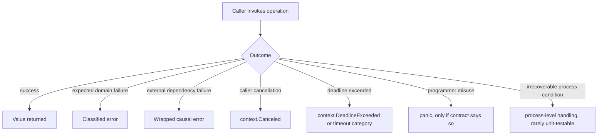
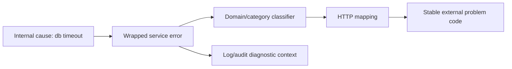
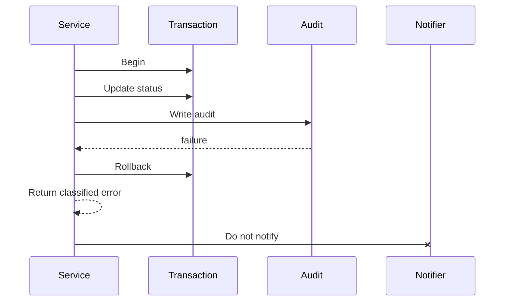
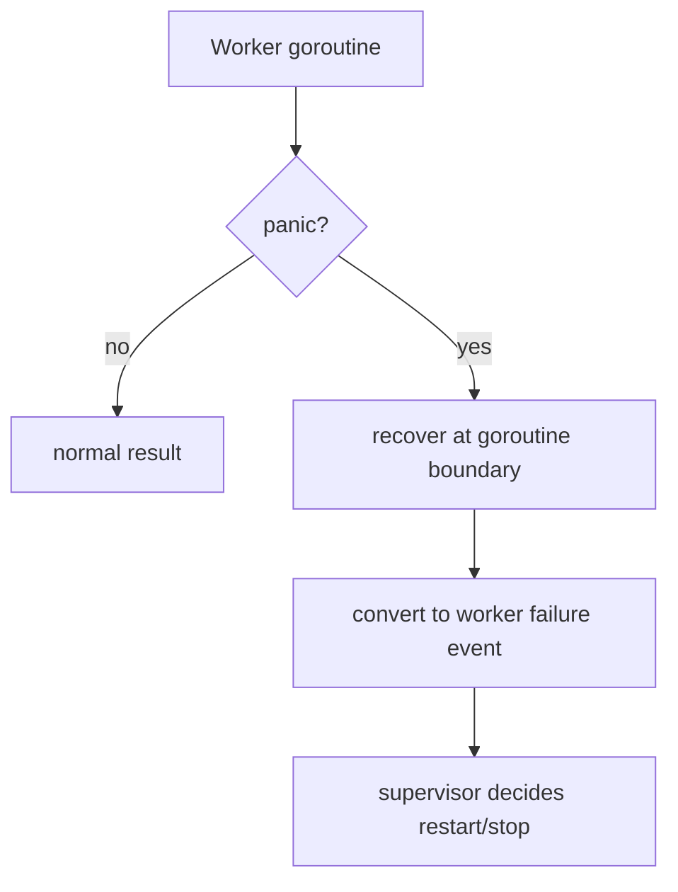
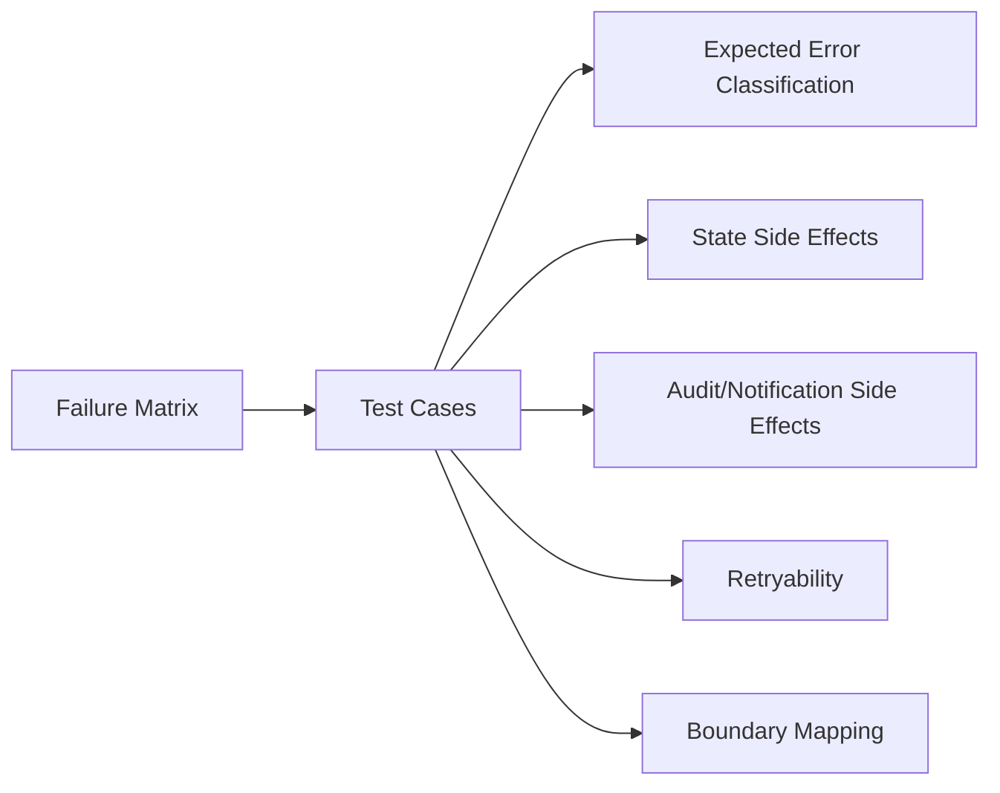

# learn-go-testing-benchmarking-performance-engineering-part-009.md

# Part 009 — Error, Panic, Timeout & Cancellation Testing

> Series: **Go Testing, Benchmarking, Performance Engineering**  
> Target: **Go 1.26.x**  
> Audience: Java software engineer / tech lead moving toward production-grade Go engineering  
> Position in series: after assertion strategy, table-driven tests, and isolation/flakiness control; before deterministic testing, test doubles, HTTP/client testing, and dependency integration testing.

---

## 0. Why this part matters

A large amount of production failure is not caused by the happy path being wrong. It is caused by failure paths being ambiguous, untested, over-broad, or accidentally coupled to infrastructure timing.

In Go, this is especially important because error handling is explicit. A function usually returns `(value, error)` rather than throwing exceptions. This gives engineers precise control, but it also means the correctness contract is distributed across many return checks.

This part is about testing failure semantics, not merely testing that "an error occurred".

A top-tier Go engineer should be able to prove questions such as:

- Does the function expose the right error category to callers?
- Does it preserve causal information using wrapping?
- Does it avoid leaking internal implementation details?
- Does it distinguish caller cancellation from internal timeout?
- Does it stop work promptly after cancellation?
- Does it rollback or compensate partial side effects?
- Does it avoid panic except at explicit programmer-error boundaries?
- Does a retry loop respect timeout budget?
- Does failure behavior remain deterministic under concurrency?
- Does the test encode the business invariant rather than incidental error text?

For a regulatory/case-management system, these questions are not academic. A failed escalation, duplicated notification, lost audit event, or incorrectly classified permission error can become an operational or defensibility issue.

---

## 1. Mental model: failure is part of the API

A Go API does not only return data. It returns a **semantic outcome**.



The key shift is this:

> In production-grade Go, an error is not just a string. It is a control-flow and observability object.

A good failure test should answer:

| Question | Weak test | Strong test |
|---|---|---|
| Did it fail? | `if err == nil` | `errors.Is(err, ErrInvalidTransition)` |
| Why did it fail? | `strings.Contains(err.Error(), "invalid")` | typed/sentinel/category assertion |
| Can caller react safely? | assert exact message | assert stable classification and payload |
| Was causal info preserved? | ignore wrapped cause | `errors.Is(err, sql.ErrNoRows)` or custom cause |
| Did cleanup happen? | only assert error | assert transaction rollback / no event emitted |
| Was cancellation honored? | sleep then hope | controlled context + fake dependency + deterministic synchronization |

---

## 2. Go error semantics recap, only the parts needed for testing

Go errors are values implementing:

```go
type error interface {
    Error() string
}
```

Since Go 1.13, the standard library supports error wrapping conventions through:

- `fmt.Errorf("...: %w", err)`
- `errors.Is(err, target)`
- `errors.As(err, &target)`
- `errors.Unwrap(err)`

Modern Go also supports joining multiple errors with `errors.Join`, and an error may unwrap to one error or multiple errors depending on its implementation.

In tests, this implies:

- Do not assert error strings unless the string itself is the public contract.
- Prefer `errors.Is` for error category/sentinel matching.
- Prefer `errors.As` for typed errors and payload inspection.
- Use `errors.Join` carefully because one operation may produce multiple valid causes.
- Test the stable semantic contract, not formatting.

Example:

```go
var ErrInvalidTransition = errors.New("invalid transition")

func Transition(from, to Status) error {
    if !allowed(from, to) {
        return fmt.Errorf("transition %s -> %s: %w", from, to, ErrInvalidTransition)
    }
    return nil
}
```

Test:

```go
func TestTransition_InvalidTransition(t *testing.T) {
    err := Transition(StatusClosed, StatusDraft)
    if !errors.Is(err, ErrInvalidTransition) {
        t.Fatalf("Transition() error = %v, want ErrInvalidTransition", err)
    }
}
```

The test does not care whether the full string is:

```text
transition CLOSED -> DRAFT: invalid transition
```

or later becomes:

```text
cannot transition case status CLOSED to DRAFT: invalid transition
```

As long as callers can still detect `ErrInvalidTransition`, the semantic contract holds.

---

## 3. Error contract levels

Not every error deserves the same level of API commitment. Before testing an error, decide what level of stability is promised.

| Level | Meaning | Test style |
|---|---|---|
| Private message | Only for developer diagnostics | Do not assert exact text |
| Public category | Caller can branch on error class | `errors.Is` |
| Public typed payload | Caller needs structured fields | `errors.As` + field assertions |
| Public transport mapping | HTTP/gRPC/CLI maps error to code | assert status/code/body contract |
| Public audit/legal reason | Error text/reason must be stable | assert canonical code and approved message |

For internal Go packages, the category may be enough. For API boundaries, you usually need a normalized error response:

```go
type Problem struct {
    Code    string `json:"code"`
    Message string `json:"message"`
    TraceID string `json:"traceId,omitempty"`
}
```

The internal error can be rich and wrapped, while the external response is stable and sanitized.



A strong test suite usually tests both:

1. Internal classification: `errors.Is` / `errors.As`.
2. Boundary mapping: stable HTTP status / code / audit reason.

---

## 4. Error assertion patterns

### 4.1 Nil vs non-nil error

Use this only for simple cases:

```go
if err == nil {
    t.Fatal("CreateCase() error = nil, want non-nil")
}
```

This proves only that something failed. It does not prove that the right thing failed.

Better:

```go
if !errors.Is(err, ErrDuplicateCase) {
    t.Fatalf("CreateCase() error = %v, want ErrDuplicateCase", err)
}
```

### 4.2 Sentinel errors

Sentinel errors are package-level variables representing stable categories.

```go
var ErrPermissionDenied = errors.New("permission denied")
```

Good test:

```go
if !errors.Is(err, ErrPermissionDenied) {
    t.Fatalf("Approve() error = %v, want ErrPermissionDenied", err)
}
```

Avoid:

```go
if err != ErrPermissionDenied { // too strict if wrapped
    t.Fatal(err)
}
```

Direct equality fails if the function wraps the error with context.

### 4.3 Typed errors

Typed errors are useful when callers need structured fields.

```go
type ValidationError struct {
    Field string
    Rule  string
}

func (e *ValidationError) Error() string {
    return "validation failed"
}
```

Test:

```go
func TestValidate_MissingNRIC(t *testing.T) {
    err := Validate(Applicant{})

    var ve *ValidationError
    if !errors.As(err, &ve) {
        t.Fatalf("Validate() error = %T %v, want *ValidationError", err, err)
    }
    if ve.Field != "nric" || ve.Rule != "required" {
        t.Fatalf("ValidationError = %+v, want field=nric rule=required", ve)
    }
}
```

### 4.4 Joined errors

Use `errors.Join` when multiple independent failures need to be preserved.

Example:

```go
func CloseAll(resources ...io.Closer) error {
    var errs []error
    for _, r := range resources {
        if err := r.Close(); err != nil {
            errs = append(errs, err)
        }
    }
    return errors.Join(errs...)
}
```

Test:

```go
func TestCloseAll_ReturnsAllFailures(t *testing.T) {
    errA := errors.New("close A")
    errB := errors.New("close B")

    err := CloseAll(closerFunc(func() error { return errA }), closerFunc(func() error { return errB }))

    if !errors.Is(err, errA) {
        t.Fatalf("CloseAll() error = %v, want to contain errA", err)
    }
    if !errors.Is(err, errB) {
        t.Fatalf("CloseAll() error = %v, want to contain errB", err)
    }
}

type closerFunc func() error

func (f closerFunc) Close() error { return f() }
```

Do not assert the exact joined string unless that string is explicitly part of a public CLI or API contract.

---

## 5. Error strings: when to assert and when not to

Most of the time, exact error strings are not stable API.

Avoid:

```go
if got, want := err.Error(), "invalid transition"; got != want {
    t.Fatalf("error = %q, want %q", got, want)
}
```

Use exact string assertions only when:

- Testing a CLI user-visible output.
- Testing a public protocol response.
- Testing a generated diagnostic format.
- Testing a regulatory/audit reason that must be stable.
- Testing a parser/compiler-style error message where location and wording are part of UX contract.

Even then, prefer structured fields when available:

```go
if problem.Code != "CASE_INVALID_TRANSITION" {
    t.Fatalf("problem code = %q, want CASE_INVALID_TRANSITION", problem.Code)
}
```

A stable code plus flexible message is usually better than a brittle exact text match.

---

## 6. Testing panic behavior

### 6.1 Panic is not Go's ordinary error mechanism

In Go, `panic` is normally reserved for:

- impossible internal invariant violation,
- programmer misuse,
- initialization failure that should prevent process startup,
- situations where continuing is unsafe.

Do not use panic for normal business/domain errors.

Bad:

```go
func Approve(caseID string) {
    if caseID == "" {
        panic("missing case ID")
    }
}
```

Better:

```go
func Approve(caseID string) error {
    if caseID == "" {
        return ErrMissingCaseID
    }
    return nil
}
```

### 6.2 When panic tests are valid

A panic test is valid when the API contract says misuse panics.

Examples:

- Calling a builder after `Build()` is illegal.
- Passing nil dependency to constructor is a programmer error.
- Internal state machine reaches impossible state.
- A must-style helper intentionally panics.

### 6.3 Panic assertion helper

```go
func requirePanic(t *testing.T, fn func()) any {
    t.Helper()

    defer func() {
        if r := recover(); r != nil {
            // returned through named result would be cleaner in real helper
        }
    }()

    fn()
    t.Fatal("function did not panic")
    return nil
}
```

Better helper with named return:

```go
func mustPanic(t *testing.T, fn func()) (value any) {
    t.Helper()

    defer func() {
        value = recover()
        if value == nil {
            t.Fatal("function did not panic")
        }
    }()

    fn()
    return nil
}
```

Usage:

```go
func TestNewProcessor_PanicsOnNilStore(t *testing.T) {
    got := mustPanic(t, func() {
        NewProcessor(nil)
    })

    if got == nil {
        t.Fatal("panic value = nil, want non-nil")
    }
}
```

### 6.4 Testing panic type instead of text

Prefer panic values that are typed when panic is part of contract.

```go
type InvariantViolation struct {
    Name string
}

func (e InvariantViolation) Error() string {
    return "invariant violated: " + e.Name
}
```

Test:

```go
func TestMachine_PanicsOnImpossibleState(t *testing.T) {
    got := mustPanic(t, func() {
        machine.forceImpossibleStateForTest()
        machine.Step()
    })

    inv, ok := got.(InvariantViolation)
    if !ok {
        t.Fatalf("panic value = %T %v, want InvariantViolation", got, got)
    }
    if inv.Name != "state transition totality" {
        t.Fatalf("panic invariant = %q, want state transition totality", inv.Name)
    }
}
```

### 6.5 Panic anti-patterns in tests

Avoid these:

- Panicking inside helpers instead of using `t.Helper()` + `t.Fatalf`.
- Recovering panics too broadly and hiding failures.
- Testing exact panic string when not public contract.
- Using panic for normal invalid input.
- Allowing goroutine panic to escape unpredictably.

Important: `recover` only catches panic in the same goroutine. If a spawned goroutine panics, a defer/recover in the parent test goroutine will not catch it.

---

## 7. Timeout testing

Timeout behavior is one of the easiest places to write flaky tests.

Bad timeout test:

```go
func TestSlowOperation_Timeout_Bad(t *testing.T) {
    start := time.Now()
    err := SlowOperation()
    if time.Since(start) > time.Second {
        t.Fatal("too slow")
    }
    if err == nil {
        t.Fatal("want timeout")
    }
}
```

Problems:

- depends on wall clock,
- may be slow in CI,
- does not prove cancellation propagation,
- does not control the dependency,
- confuses test timeout with application timeout.

### 7.1 Different timeout layers

| Layer | Meaning | Test approach |
|---|---|---|
| Test process timeout | `go test -timeout` kills hanging test binary | CI safety net, not behavior assertion |
| Per-test deadline | `t.Context()` / context from test | helps cleanup on test timeout |
| Application timeout | operation-specific budget | assert returned error/category |
| Dependency timeout | DB/HTTP/client timeout | fake dependency or controlled server |
| Retry timeout budget | total retry loop budget | fake clock or deterministic attempts |

Do not use `go test -timeout` to prove business timeout behavior. It is a guardrail for the test process.

### 7.2 Testing application timeout using context

Example function:

```go
func FetchCase(ctx context.Context, repo CaseRepo, id string) (*Case, error) {
    c, err := repo.Get(ctx, id)
    if err != nil {
        return nil, fmt.Errorf("fetch case %s: %w", id, err)
    }
    return c, nil
}
```

Fake repository:

```go
type blockingRepo struct {
    started chan struct{}
}

func (r *blockingRepo) Get(ctx context.Context, id string) (*Case, error) {
    close(r.started)
    <-ctx.Done()
    return nil, ctx.Err()
}
```

Test:

```go
func TestFetchCase_ReturnsDeadlineExceeded(t *testing.T) {
    repo := &blockingRepo{started: make(chan struct{})}

    ctx, cancel := context.WithTimeout(context.Background(), 10*time.Millisecond)
    defer cancel()

    errCh := make(chan error, 1)
    go func() {
        _, err := FetchCase(ctx, repo, "CASE-1")
        errCh <- err
    }()

    <-repo.started

    select {
    case err := <-errCh:
        if !errors.Is(err, context.DeadlineExceeded) {
            t.Fatalf("FetchCase() error = %v, want context.DeadlineExceeded", err)
        }
    case <-time.After(time.Second):
        t.Fatal("FetchCase() did not return after context deadline")
    }
}
```

The outer `time.After(time.Second)` is a test safety bound. The application behavior is still driven by context.

### 7.3 Prefer deterministic cancellation over real sleeps

Even better: cancel explicitly instead of waiting for timer expiration.

```go
func TestFetchCase_ReturnsCanceled(t *testing.T) {
    repo := &blockingRepo{started: make(chan struct{})}

    ctx, cancel := context.WithCancel(context.Background())

    errCh := make(chan error, 1)
    go func() {
        _, err := FetchCase(ctx, repo, "CASE-1")
        errCh <- err
    }()

    <-repo.started
    cancel()

    select {
    case err := <-errCh:
        if !errors.Is(err, context.Canceled) {
            t.Fatalf("FetchCase() error = %v, want context.Canceled", err)
        }
    case <-time.After(time.Second):
        t.Fatal("FetchCase() did not return after cancellation")
    }
}
```

This test is faster and less flaky.

---

## 8. Cancellation testing

Cancellation has two contracts:

1. The function returns promptly after cancellation.
2. The function returns the correct cancellation semantic.

There is also often a third operational contract:

3. The function does not continue side effects after cancellation.

### 8.1 Cancellation propagation

Function under test:

```go
func EscalateCase(ctx context.Context, repo Repo, notifier Notifier, id string) error {
    c, err := repo.LockCase(ctx, id)
    if err != nil {
        return fmt.Errorf("lock case: %w", err)
    }

    if err := ctx.Err(); err != nil {
        return err
    }

    if err := notifier.Notify(ctx, c.Owner, "case escalated"); err != nil {
        return fmt.Errorf("notify owner: %w", err)
    }

    return nil
}
```

Cancellation test:

```go
func TestEscalateCase_DoesNotNotifyAfterCancellation(t *testing.T) {
    ctx, cancel := context.WithCancel(context.Background())

    repo := fakeRepo{
        lockCase: func(context.Context, string) (*Case, error) {
            cancel()
            return &Case{Owner: "officer-1"}, nil
        },
    }

    notifier := &spyNotifier{}

    err := EscalateCase(ctx, repo, notifier, "CASE-1")
    if !errors.Is(err, context.Canceled) {
        t.Fatalf("EscalateCase() error = %v, want context.Canceled", err)
    }
    if notifier.calls != 0 {
        t.Fatalf("notifier calls = %d, want 0 after cancellation", notifier.calls)
    }
}
```

This test proves not just error output, but absence of unsafe side effect.

### 8.2 Do not convert cancellation into generic dependency failure

Bad:

```go
return fmt.Errorf("repository failed: %w", err)
```

This may still preserve `context.Canceled`, but the caller may map it incorrectly if classification checks are wrong.

A classifier should normally treat cancellation distinctly:

```go
func Classify(err error) Code {
    switch {
    case err == nil:
        return CodeOK
    case errors.Is(err, context.Canceled):
        return CodeCanceled
    case errors.Is(err, context.DeadlineExceeded):
        return CodeTimeout
    case errors.Is(err, ErrPermissionDenied):
        return CodeForbidden
    default:
        return CodeInternal
    }
}
```

Test:

```go
func TestClassify_CancellationBeforeGeneric(t *testing.T) {
    err := fmt.Errorf("repository failed: %w", context.Canceled)

    if got, want := Classify(err), CodeCanceled; got != want {
        t.Fatalf("Classify() = %v, want %v", got, want)
    }
}
```

Ordering matters.

---

## 9. Testing retry behavior

Retry logic is a common source of hidden production harm.

A retry test should prove:

- which errors are retryable,
- which errors are not retryable,
- max attempts,
- budget/deadline behavior,
- backoff behavior,
- cancellation during backoff,
- no duplicate side effects unless operation is idempotent,
- final error preserves useful causes.

### 9.1 Retry classifier

```go
var ErrTransient = errors.New("transient")
var ErrPermanent = errors.New("permanent")

func IsRetryable(err error) bool {
    return errors.Is(err, ErrTransient) || errors.Is(err, context.DeadlineExceeded)
}
```

Test:

```go
func TestIsRetryable(t *testing.T) {
    tests := []struct {
        name string
        err  error
        want bool
    }{
        {"nil", nil, false},
        {"transient", ErrTransient, true},
        {"wrapped transient", fmt.Errorf("call: %w", ErrTransient), true},
        {"permanent", ErrPermanent, false},
        {"canceled", context.Canceled, false},
        {"deadline", context.DeadlineExceeded, true},
    }

    for _, tc := range tests {
        t.Run(tc.name, func(t *testing.T) {
            got := IsRetryable(tc.err)
            if got != tc.want {
                t.Fatalf("IsRetryable(%v) = %v, want %v", tc.err, got, tc.want)
            }
        })
    }
}
```

Cancellation is usually not retryable because the caller explicitly asked the operation to stop.

### 9.2 Retry loop test without real sleep

Introduce a sleeper seam:

```go
type Sleeper interface {
    Sleep(ctx context.Context, d time.Duration) error
}
```

Fake sleeper:

```go
type recordingSleeper struct {
    durations []time.Duration
}

func (s *recordingSleeper) Sleep(ctx context.Context, d time.Duration) error {
    s.durations = append(s.durations, d)
    return ctx.Err()
}
```

Now the test can assert backoff without waiting.

```go
func TestRetry_StopsOnPermanentError(t *testing.T) {
    attempts := 0
    sleeper := &recordingSleeper{}

    err := Retry(context.Background(), sleeper, func(context.Context) error {
        attempts++
        return ErrPermanent
    })

    if !errors.Is(err, ErrPermanent) {
        t.Fatalf("Retry() error = %v, want ErrPermanent", err)
    }
    if attempts != 1 {
        t.Fatalf("attempts = %d, want 1", attempts)
    }
    if len(sleeper.durations) != 0 {
        t.Fatalf("sleep count = %d, want 0", len(sleeper.durations))
    }
}
```

### 9.3 Retry loop cancellation during backoff

```go
func TestRetry_StopsWhenCanceledDuringBackoff(t *testing.T) {
    ctx, cancel := context.WithCancel(context.Background())

    sleeper := sleeperFunc(func(ctx context.Context, d time.Duration) error {
        cancel()
        return ctx.Err()
    })

    attempts := 0
    err := Retry(ctx, sleeper, func(context.Context) error {
        attempts++
        return ErrTransient
    })

    if !errors.Is(err, context.Canceled) {
        t.Fatalf("Retry() error = %v, want context.Canceled", err)
    }
    if attempts != 1 {
        t.Fatalf("attempts = %d, want 1", attempts)
    }
}

type sleeperFunc func(context.Context, time.Duration) error

func (f sleeperFunc) Sleep(ctx context.Context, d time.Duration) error { return f(ctx, d) }
```

---

## 10. Testing rollback and side-effect semantics

Failure testing is incomplete if you only check returned error.

Example operation:

1. validate case,
2. write state transition,
3. write audit trail,
4. publish notification.

If step 3 fails, should step 2 rollback? If step 4 fails, should step 2 remain committed? The answer depends on the business semantics.

A test should encode the intended invariant.



Test pattern:

```go
func TestApproveCase_RollsBackWhenAuditFails(t *testing.T) {
    tx := &spyTx{}
    audit := fakeAudit{err: ErrAuditUnavailable}
    notifier := &spyNotifier{}

    err := ApproveCase(context.Background(), tx, audit, notifier, "CASE-1")

    if !errors.Is(err, ErrAuditUnavailable) {
        t.Fatalf("ApproveCase() error = %v, want ErrAuditUnavailable", err)
    }
    if !tx.rolledBack {
        t.Fatal("transaction was not rolled back")
    }
    if tx.committed {
        t.Fatal("transaction committed, want rollback")
    }
    if notifier.calls != 0 {
        t.Fatalf("notifier calls = %d, want 0", notifier.calls)
    }
}
```

This is more valuable than a generic `err != nil` assertion.

---

## 11. Timeout vs cancellation vs dependency failure

A mature system distinguishes these outcomes:

| Outcome | Typical source | Caller implication |
|---|---|---|
| `context.Canceled` | caller stopped request | usually do not retry; stop work |
| `context.DeadlineExceeded` | caller/request budget expired | maybe retry at higher level depending on idempotency |
| client timeout | dependency did not respond within client budget | dependency may be degraded |
| server timeout | remote server timed out | remote service overloaded/slow |
| queue timeout | capacity/backpressure issue | tune worker/queue/backpressure |
| DB lock timeout | contention/data hot spot | investigate transaction design |

Testing should preserve this distinction. If every timeout becomes `ErrInternal`, callers lose the ability to make safe decisions.

Classifier example:

```go
func ToHTTPStatus(err error) int {
    switch {
    case err == nil:
        return http.StatusOK
    case errors.Is(err, context.Canceled):
        // Often not sent because client may be gone; use internal mapping.
        return 499
    case errors.Is(err, context.DeadlineExceeded):
        return http.StatusGatewayTimeout
    case errors.Is(err, ErrPermissionDenied):
        return http.StatusForbidden
    case errors.Is(err, ErrInvalidTransition):
        return http.StatusConflict
    default:
        return http.StatusInternalServerError
    }
}
```

Test:

```go
func TestToHTTPStatus(t *testing.T) {
    tests := []struct {
        name string
        err  error
        want int
    }{
        {"nil", nil, http.StatusOK},
        {"canceled", context.Canceled, 499},
        {"deadline", context.DeadlineExceeded, http.StatusGatewayTimeout},
        {"wrapped deadline", fmt.Errorf("repo: %w", context.DeadlineExceeded), http.StatusGatewayTimeout},
        {"permission", ErrPermissionDenied, http.StatusForbidden},
        {"invalid transition", ErrInvalidTransition, http.StatusConflict},
        {"unknown", errors.New("boom"), http.StatusInternalServerError},
    }

    for _, tc := range tests {
        t.Run(tc.name, func(t *testing.T) {
            if got := ToHTTPStatus(tc.err); got != tc.want {
                t.Fatalf("ToHTTPStatus(%v) = %d, want %d", tc.err, got, tc.want)
            }
        })
    }
}
```

Note: HTTP 499 is not an official standard status code, but some systems use it internally to represent client-closed request. Whether to expose it depends on your gateway conventions.

---

## 12. Testing functions that should not panic

Sometimes you want to prove a function returns an error instead of panicking.

Helper:

```go
func mustNotPanic(t *testing.T, fn func()) {
    t.Helper()

    defer func() {
        if r := recover(); r != nil {
            t.Fatalf("function panicked: %v", r)
        }
    }()

    fn()
}
```

Usage:

```go
func TestDecode_InvalidInputReturnsError_NotPanic(t *testing.T) {
    mustNotPanic(t, func() {
        _, err := Decode([]byte("not-json"))
        if err == nil {
            t.Fatal("Decode() error = nil, want non-nil")
        }
    })
}
```

This pattern is useful for parsers, decoders, template processors, and external-input handlers.

---

## 13. Testing goroutine panic boundaries

A common mistake:

```go
func TestWorker_Panic_Bad(t *testing.T) {
    defer func() {
        if recover() == nil {
            t.Fatal("want panic")
        }
    }()

    go workerThatPanics()
}
```

This does not catch the panic, because the panic happens in another goroutine.

Correct pattern: make the goroutine report its panic.

```go
func runAndCapturePanic(fn func()) (panicValue any) {
    done := make(chan any, 1)

    go func() {
        defer func() {
            done <- recover()
        }()
        fn()
    }()

    return <-done
}
```

Test:

```go
func TestWorker_PanicCaptured(t *testing.T) {
    got := runAndCapturePanic(func() {
        workerThatPanics()
    })

    if got == nil {
        t.Fatal("panic value = nil, want non-nil")
    }
}
```

For production workers, a better contract is often: recover inside the worker boundary, emit error to supervisor, and allow the supervisor to decide restart/shutdown.



Test the supervisor contract, not just raw panic.

---

## 14. Testing cleanup under failure

Use `t.Cleanup` for test cleanup, but test production cleanup explicitly.

Example:

```go
func ProcessFile(path string, sink Sink) error {
    f, err := os.Open(path)
    if err != nil {
        return err
    }
    defer f.Close()

    if err := sink.WriteFrom(f); err != nil {
        return fmt.Errorf("write sink: %w", err)
    }
    return nil
}
```

Testing whether `Close` happened with `os.File` is awkward. Instead, design with a seam where cleanup matters.

```go
type ReadCloserFactory interface {
    Open(path string) (io.ReadCloser, error)
}
```

Fake read closer:

```go
type spyReadCloser struct {
    closed bool
    data   *strings.Reader
}

func (s *spyReadCloser) Read(p []byte) (int, error) { return s.data.Read(p) }
func (s *spyReadCloser) Close() error {
    s.closed = true
    return nil
}
```

Test:

```go
func TestProcessFile_ClosesReaderWhenSinkFails(t *testing.T) {
    rc := &spyReadCloser{data: strings.NewReader("hello")}
    factory := fakeFactory{rc: rc}
    sink := fakeSink{err: ErrSinkUnavailable}

    err := ProcessFileWithFactory("x", factory, sink)

    if !errors.Is(err, ErrSinkUnavailable) {
        t.Fatalf("ProcessFile() error = %v, want ErrSinkUnavailable", err)
    }
    if !rc.closed {
        t.Fatal("reader not closed")
    }
}
```

This is not about mocking everything. It is about exposing the side effect that must be proven.

---

## 15. Failure matrix for service operations

For a non-trivial use case, create a failure matrix.

Example: `SubmitApplication`.

| Step | Failure | Expected error | Rollback? | Audit? | Notify? | Retryable? |
|---|---|---|---|---|---|---|
| Validate input | missing field | `ErrValidation` | no write | no | no | no |
| Check permission | forbidden | `ErrPermissionDenied` | no write | optional denial audit | no | no |
| Load case | DB timeout | `context.DeadlineExceeded` / repo timeout | no write | maybe technical audit | no | maybe |
| Save submission | DB conflict | `ErrConflict` | no partial | yes | no | maybe no |
| Write audit | audit unavailable | `ErrAuditUnavailable` | yes/no per policy | failed audit marker? | no | maybe |
| Publish event | broker unavailable | `ErrPublishFailed` | usually commit remains | yes | maybe outbox | yes |

This table becomes test design input.



Top-tier testing means you can justify why each failure path is tested at unit/component/integration level.

---

## 16. Context-aware APIs: design rules for testability

A Go function that may block should generally accept `context.Context`.

Good:

```go
func (s *Service) Approve(ctx context.Context, id string) error
```

Less testable:

```go
func (s *Service) Approve(id string) error
```

Design rules:

1. Accept context as the first parameter.
2. Do not store context in structs for long-lived use.
3. Pass context to dependencies.
4. Check `ctx.Err()` before expensive work if cancellation should stop side effects.
5. Make retry/backoff sleeps context-aware.
6. Preserve `context.Canceled` and `context.DeadlineExceeded` through wrapping.
7. Do not convert cancellation into a generic internal error.

Testing rules:

1. Use explicit cancellation when possible.
2. Use short deadlines only when testing deadline behavior specifically.
3. Use outer safety timeouts in tests, but do not make them the primary assertion.
4. Assert side effects stopped.
5. Assert goroutines exit.

---

## 17. Table-driven failure tests

Failure behavior often benefits from table-driven design.

```go
func TestApproveCase_Failures(t *testing.T) {
    tests := []struct {
        name       string
        repoErr    error
        auditErr   error
        notifyErr  error
        wantErr    error
        wantCommit bool
        wantNotify bool
    }{
        {
            name:    "repo timeout",
            repoErr: context.DeadlineExceeded,
            wantErr: context.DeadlineExceeded,
        },
        {
            name:     "audit failure rolls back before notification",
            auditErr: ErrAuditUnavailable,
            wantErr:  ErrAuditUnavailable,
        },
        {
            name:       "notify failure after commit",
            notifyErr:  ErrPublishFailed,
            wantErr:    ErrPublishFailed,
            wantCommit: true,
            wantNotify: true,
        },
    }

    for _, tc := range tests {
        t.Run(tc.name, func(t *testing.T) {
            tx := &spyTx{}
            repo := fakeRepo{err: tc.repoErr}
            audit := fakeAudit{err: tc.auditErr}
            notifier := &spyNotifier{err: tc.notifyErr}

            err := approveCase(context.Background(), tx, repo, audit, notifier, "CASE-1")

            if !errors.Is(err, tc.wantErr) {
                t.Fatalf("approveCase() error = %v, want %v", err, tc.wantErr)
            }
            if tx.committed != tc.wantCommit {
                t.Fatalf("committed = %v, want %v", tx.committed, tc.wantCommit)
            }
            if (notifier.calls > 0) != tc.wantNotify {
                t.Fatalf("notifier called = %v, want %v", notifier.calls > 0, tc.wantNotify)
            }
        })
    }
}
```

Be careful: failure tables can become too dense. If the side-effect matrix becomes complex, split by failure phase.

---

## 18. Boundary mapping tests

Internal errors are often mapped to API responses.

Example:

```go
type ErrorResponse struct {
    Code    string `json:"code"`
    Message string `json:"message"`
}

func MapError(err error) (int, ErrorResponse) {
    switch {
    case errors.Is(err, ErrInvalidTransition):
        return http.StatusConflict, ErrorResponse{Code: "CASE_INVALID_TRANSITION", Message: "case transition is not allowed"}
    case errors.Is(err, ErrPermissionDenied):
        return http.StatusForbidden, ErrorResponse{Code: "FORBIDDEN", Message: "permission denied"}
    case errors.Is(err, context.DeadlineExceeded):
        return http.StatusGatewayTimeout, ErrorResponse{Code: "TIMEOUT", Message: "request timed out"}
    default:
        return http.StatusInternalServerError, ErrorResponse{Code: "INTERNAL", Message: "internal error"}
    }
}
```

Test:

```go
func TestMapError(t *testing.T) {
    tests := []struct {
        name       string
        err        error
        wantStatus int
        wantCode   string
    }{
        {"invalid transition", ErrInvalidTransition, http.StatusConflict, "CASE_INVALID_TRANSITION"},
        {"wrapped permission", fmt.Errorf("approve: %w", ErrPermissionDenied), http.StatusForbidden, "FORBIDDEN"},
        {"deadline", context.DeadlineExceeded, http.StatusGatewayTimeout, "TIMEOUT"},
        {"unknown", errors.New("db password leaked?"), http.StatusInternalServerError, "INTERNAL"},
    }

    for _, tc := range tests {
        t.Run(tc.name, func(t *testing.T) {
            gotStatus, gotBody := MapError(tc.err)
            if gotStatus != tc.wantStatus {
                t.Fatalf("status = %d, want %d", gotStatus, tc.wantStatus)
            }
            if gotBody.Code != tc.wantCode {
                t.Fatalf("code = %q, want %q", gotBody.Code, tc.wantCode)
            }
        })
    }
}
```

This is where exact response contract matters more than internal error string.

---

## 19. Security-sensitive failure testing

Failure paths often leak information.

Examples:

- Authentication error says whether username exists.
- Authorization error reveals hidden resource ID.
- Database error leaks table/column names.
- Crypto error leaks key state.
- Validation error returns raw untrusted input.

Test principle:

> Internal errors may be detailed. External errors must be controlled.

Example:

```go
func TestMapError_DoesNotLeakInternalDBError(t *testing.T) {
    err := fmt.Errorf("query users table: %w", errors.New("ORA-00942: table or view does not exist"))

    status, body := MapError(err)

    if status != http.StatusInternalServerError {
        t.Fatalf("status = %d, want 500", status)
    }
    if strings.Contains(body.Message, "ORA-") || strings.Contains(body.Message, "users table") {
        t.Fatalf("external message leaks internal detail: %q", body.Message)
    }
}
```

For public APIs, this test can be as important as the success path.

---

## 20. Performance-aware failure testing

Failure paths can be performance-sensitive.

Examples:

- retry loop creates many allocations,
- error wrapping in hot path allocates excessively,
- timeout path leaks goroutines,
- panic/recover used as control flow is expensive and unclear,
- logging every retry floods output,
- failed validation builds huge strings.

Do not benchmark every error path in this part. Benchmarking is covered later. But design tests now so benchmarkable failure paths are isolated.

Example design:

```go
func ValidateApplicant(a Applicant) error
```

This pure function can later be benchmarked for valid/invalid payloads.

Avoid embedding validation deeply inside HTTP handlers where it becomes hard to measure separately.

---

## 21. Common anti-patterns

### Anti-pattern 1: asserting only `err != nil`

This hides wrong failure mode.

```go
if err == nil {
    t.Fatal("want error")
}
```

Better:

```go
if !errors.Is(err, ErrInvalidTransition) {
    t.Fatalf("error = %v, want ErrInvalidTransition", err)
}
```

### Anti-pattern 2: asserting exact error string by default

Brittle and discourages useful context wrapping.

### Anti-pattern 3: losing wrapped cause

Bad production code:

```go
return fmt.Errorf("load case failed")
```

Better:

```go
return fmt.Errorf("load case %s: %w", id, err)
```

Test should catch cause loss:

```go
if !errors.Is(err, sql.ErrNoRows) {
    t.Fatalf("error = %v, want to wrap sql.ErrNoRows", err)
}
```

### Anti-pattern 4: context ignored by fake dependency

A fake that ignores context cannot prove cancellation propagation.

### Anti-pattern 5: real sleeps in retry tests

Real sleep makes tests slow and flaky. Use fake sleeper/clock.

### Anti-pattern 6: panic used for expected input error

External input should produce errors, not panics.

### Anti-pattern 7: cancellation classified as internal error

This pollutes error rates and triggers wrong retry/alert behavior.

### Anti-pattern 8: test helper calls `panic`

Use `t.Helper()` and `t.Fatalf` to preserve test location and diagnostics.

---

## 22. Review checklist

Use this checklist when reviewing failure-path tests.

### Error semantics

- [ ] Does the test assert specific error semantics, not just non-nil error?
- [ ] Does it use `errors.Is` for sentinel/category errors?
- [ ] Does it use `errors.As` for typed errors?
- [ ] Does it avoid brittle exact string checks unless text is public contract?
- [ ] Does it verify wrapped cause is preserved where required?
- [ ] Does it test multiple causes if `errors.Join` is used?

### Panic behavior

- [ ] Is panic reserved for programmer error/invariant violation?
- [ ] Does the test capture panic in the same goroutine?
- [ ] Does the test assert typed panic value if panic is public contract?
- [ ] Does external input return error instead of panic?

### Timeout/cancellation

- [ ] Does the function accept and propagate context?
- [ ] Does the test avoid unnecessary real sleeps?
- [ ] Does it distinguish `context.Canceled` from `context.DeadlineExceeded`?
- [ ] Does it prove the operation returns after cancellation?
- [ ] Does it prove unsafe side effects stop after cancellation?

### Side effects

- [ ] Does the test assert rollback/commit semantics?
- [ ] Does it assert audit/notification/outbox behavior under failure?
- [ ] Does it test no duplicate side effects after retry/cancellation?

### Boundary mapping

- [ ] Are internal errors mapped to stable external codes?
- [ ] Are sensitive internal details hidden from external responses?
- [ ] Are timeout/cancellation categories mapped correctly?

---

## 23. Exercises

### Exercise 1 — Error classification

Create a function:

```go
func CanTransition(from, to Status) error
```

Requirements:

- return `nil` for valid transitions,
- return `ErrInvalidTransition` for invalid transition,
- include from/to in diagnostic context,
- test with `errors.Is`, not string equality.

### Exercise 2 — Typed validation error

Create:

```go
type FieldError struct {
    Field string
    Code  string
}
```

Then test that invalid applicant data returns a `*FieldError` with expected field/code.

### Exercise 3 — Cancellation stops side effects

Create `SubmitCase(ctx, repo, notifier)` where repo returns success but cancels context before notifier. Prove notifier is not called.

### Exercise 4 — Retry without sleep

Create a retry loop with fake sleeper. Test:

- transient error retries,
- permanent error does not retry,
- cancellation during backoff stops retry,
- final error preserves cause.

### Exercise 5 — Panic boundary

Create a constructor that panics on nil dependency. Test the panic. Then create an external-input function that returns error instead of panicking.

---

## 24. Summary

Failure-path testing in Go is about making failure behavior explicit, stable, and safe.

The most important lessons:

1. Test error semantics, not merely error existence.
2. Use `errors.Is` for categories and `errors.As` for typed payloads.
3. Avoid exact error string assertions unless text is public contract.
4. Preserve causal errors through wrapping.
5. Treat cancellation and timeout as first-class outcomes.
6. Do not let cancellation become a generic internal error.
7. Test side effects under failure: rollback, commit, audit, notification, cleanup.
8. Avoid real sleeps in timeout/retry tests where deterministic seams are possible.
9. Panic is a contract for programmer error, not ordinary business failure.
10. Public boundaries should expose stable sanitized error codes, not internal diagnostics.

A mature Go test suite does not only prove that code works. It proves that code fails in controlled, diagnosable, and operationally safe ways.

---

## 25. References

- Go `testing` package: https://pkg.go.dev/testing
- Go `errors` package: https://pkg.go.dev/errors
- Go Blog, Working with Errors in Go 1.13: https://go.dev/blog/go1.13-errors
- Go Wiki, Error Values FAQ: https://go.dev/wiki/ErrorValueFAQ
- Go 1.26 Release Notes: https://go.dev/doc/go1.26

---

## 26. Series status

This is **part-009 of 034**.

The series is **not finished yet**.

Next: **part-010 — Deterministic Testing: Time, Randomness, UUID, Crypto, Scheduler & Environment**.

<!-- NAVIGATION_FOOTER -->
<div class="page-nav">
<a href="./learn-go-testing-benchmarking-performance-engineering-part-008.md">⬅️ Part 008 — Golden Tests, Snapshot Tests, Approval Tests & Stable Outputs</a>
<a href="./index.md">📚 Kategori</a>
<a href="../../index.md">🏠 Home</a>
<a href="./learn-go-testing-benchmarking-performance-engineering-part-010.md">Part 010 — Deterministic Testing: Time, Randomness, UUID, Crypto, Scheduler & Environment ➡️</a>
</div>
