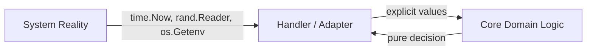
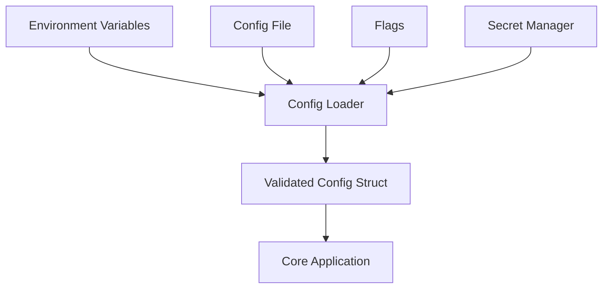
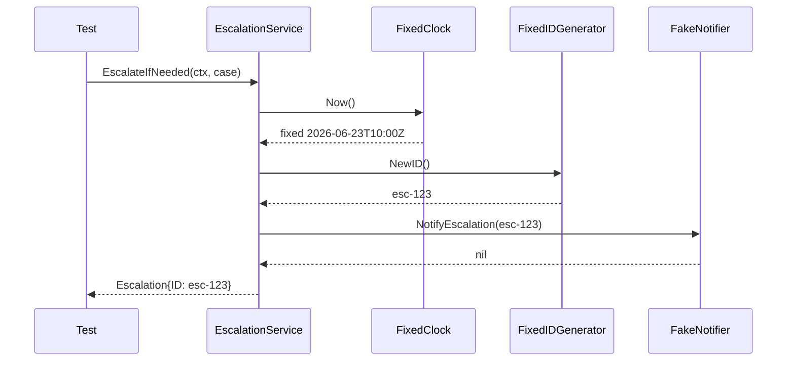

# learn-go-testing-benchmarking-performance-engineering-part-010.md

# Part 010 — Deterministic Testing: Time, Randomness, UUID, Crypto, Scheduler & Environment

> Seri: **Go Testing, Benchmarking, Performance Engineering**  
> Target pembaca: **Java software engineer / tech lead** yang ingin membangun test suite Go yang stabil, cepat, defensible, dan production-grade.  
> Fokus bagian ini: membuat test yang **repeatable**, **isolated**, dan **diagnostic** dengan mengendalikan sumber nondeterminism.

---

## 0. Posisi Part Ini dalam Seri

Part sebelumnya membahas:

- `part-000`: orientasi seri dan engineering contract.
- `part-001`: execution model `go test`.
- `part-002`: taxonomy test.
- `part-003`: desain Go yang testable.
- `part-004`: primitive package `testing`.
- `part-005`: assertion strategy.
- `part-006`: table-driven tests.
- `part-007`: subtests, parallelism, shuffle, isolation, flakiness.
- `part-008`: golden/snapshot/approval tests.
- `part-009`: error, panic, timeout, cancellation testing.

Part ini menjawab pertanyaan inti:

> “Bagaimana membuat test Go tetap benar dan stabil ketika sistem bergantung pada waktu, random number, UUID, crypto entropy, scheduler goroutine, filesystem, network, process environment, timezone, dan global runtime state?”

Di Go, banyak API standard library mudah dipakai langsung:

```go
now := time.Now()
id := uuid.New()
rand.Intn(100)
os.Getenv("FEATURE_FLAG")
time.Sleep(100 * time.Millisecond)
```

Untuk production code, ini terasa praktis. Untuk test suite besar, ini menjadi sumber nondeterminism.

---

## 1. Mental Model: Determinism Is an Engineering Boundary

Test deterministic berarti:

> Untuk input, state awal, konfigurasi, dan dependency behavior yang sama, test menghasilkan outcome yang sama tanpa bergantung pada waktu real, urutan scheduler, random entropy, environment mesin, timezone lokal, port bebas, urutan map, latency OS, atau service eksternal.

Determinism bukan berarti sistem tidak boleh memakai waktu/randomness/concurrency. Artinya semua hal itu harus masuk sebagai **dependency yang bisa dikendalikan**.

### 1.1 Deterministic test bukan test yang selalu pass

Test yang selalu pass bisa saja buruk jika:

- tidak memeriksa behavior penting,
- menyembunyikan race,
- menunggu terlalu lama,
- mengabaikan error,
- hanya memverifikasi happy path,
- terlalu longgar sehingga regression tidak terdeteksi.

Test deterministic yang baik harus:

1. fail ketika contract rusak,
2. pass ketika contract benar,
3. memberi diagnostic message yang jelas,
4. tidak bergantung pada kondisi eksternal tidak terkendali.

### 1.2 Determinism as dependency graph

```mermaid
flowchart TD
    Test[Test Case]
    Subject[Subject Under Test]

    Test --> Subject

    Subject --> Time[Clock / Timer]
    Subject --> Random[Randomness / UUID]
    Subject --> Env[Environment / Config]
    Subject --> FS[Filesystem]
    Subject --> Net[Network]
    Subject --> Sched[Goroutine Scheduler]
    Subject --> Crypto[Crypto Entropy]
    Subject --> Global[Global State]

    Time --> ControlledTime[Fake / Manual Clock]
    Random --> SeededRandom[Seeded PRNG / Fixed ID Generator]
    Env --> ScopedEnv[t.Setenv / Config Object]
    FS --> TempDir[t.TempDir / Test FS]
    Net --> FakeTransport[Fake Transport / httptest]
    Sched --> Coordination[Channels / Context / WaitGroup]
    Crypto --> Test Reader / cryptotest
    Global --> Cleanup[t.Cleanup]
```

Rule:

> Kalau dependency bisa berubah di luar kontrol test, dependency itu harus dimodelkan atau dibatasi.

---

## 2. Sumber Nondeterminism Umum di Go

| Sumber | Contoh | Risiko test |
|---|---|---|
| Wall-clock time | `time.Now()` | hasil berubah setiap run |
| Timer/sleep | `time.Sleep`, `time.After` | flaky, lambat, tergantung load mesin |
| Timezone | `time.Local`, parsing tanggal | beda hasil antar mesin/CI |
| Randomness | `math/rand`, `crypto/rand` | data berubah, reproducibility rendah |
| UUID | random UUID | golden/assertion sulit stabil |
| Map iteration | `range map` | order tidak stabil |
| Goroutine scheduling | channel/select/timer race | intermittent failure |
| Environment variable | `os.Getenv` | terpengaruh shell/CI |
| Filesystem | path, permission, temp files | state bocor antar test |
| Network | real latency, DNS, port conflict | flaky dan lambat |
| Process global | logger, flags, default client | cross-test contamination |
| CPU/runtime | `GOMAXPROCS`, race mode | timing berubah |
| External service | DB/cache/queue/API | unavailable atau data berubah |

---

## 3. Golden Rule: Production Code May Use Reality, Core Logic Should Accept Reality as Input

Desain buruk:

```go
func IsExpired(deadline time.Time) bool {
    return time.Now().After(deadline)
}
```

Masalah:

- test harus bergantung pada real current time,
- boundary cases sulit dites,
- clock drift atau timezone issue tersembunyi,
- sulit menguji “tepat sebelum deadline” dan “tepat setelah deadline”.

Desain lebih baik:

```go
func IsExpired(now time.Time, deadline time.Time) bool {
    return now.After(deadline)
}
```

Production wrapper:

```go
func IsExpiredNow(deadline time.Time) bool {
    return IsExpired(time.Now(), deadline)
}
```

Test:

```go
func TestIsExpired(t *testing.T) {
    now := time.Date(2026, 6, 23, 10, 0, 0, 0, time.UTC)

    tests := []struct {
        name     string
        deadline time.Time
        want     bool
    }{
        {"before deadline", now.Add(time.Second), false},
        {"equal deadline", now, false},
        {"after deadline", now.Add(-time.Second), true},
    }

    for _, tc := range tests {
        t.Run(tc.name, func(t *testing.T) {
            got := IsExpired(now, tc.deadline)
            if got != tc.want {
                t.Fatalf("IsExpired(%s, %s) = %v, want %v",
                    now, tc.deadline, got, tc.want)
            }
        })
    }
}
```

### 3.1 Boundary placement pattern



Prinsip:

- Adapter boleh membaca real time/env/network.
- Core logic sebaiknya menerima input eksplisit.
- Test core logic tidak perlu fake kompleks.
- Test adapter cukup tipis dan fokus boundary.

---

## 4. Time Testing: Wall Clock vs Monotonic Clock

Go `time.Time` dapat membawa monotonic clock reading ketika dibuat dari `time.Now()`. Ini berguna untuk durasi, tetapi bisa mengejutkan dalam test jika membandingkan representasi string/detail internal tertentu.

Hal yang perlu dipahami:

- `time.Now()` menghasilkan waktu dengan wall clock dan monotonic component.
- `time.Date(...)` menghasilkan waktu deterministik tanpa monotonic component.
- Operasi seperti `Sub` dapat memakai monotonic component jika tersedia.
- Serialization seperti JSON tidak menyimpan monotonic component.

Untuk test deterministic, biasanya pakai:

```go
fixed := time.Date(2026, 6, 23, 10, 0, 0, 0, time.UTC)
```

Bukan:

```go
fixed := time.Now()
```

### 4.1 Jangan assert `time.Now()` langsung

Buruk:

```go
func TestCreatedAt(t *testing.T) {
    entity := NewEntity()
    if entity.CreatedAt != time.Now() {
        t.Fatal("wrong createdAt")
    }
}
```

Masalah:

- dua pemanggilan `time.Now()` hampir pasti berbeda,
- test tidak stabil,
- failure message tidak membantu.

Lebih baik: inject clock.

```go
type Clock interface {
    Now() time.Time
}

type RealClock struct{}

func (RealClock) Now() time.Time { return time.Now() }

type FixedClock struct {
    T time.Time
}

func (c FixedClock) Now() time.Time { return c.T }

type Entity struct {
    ID        string
    CreatedAt time.Time
}

type Service struct {
    clock Clock
}

func NewService(clock Clock) *Service {
    return &Service{clock: clock}
}

func (s *Service) NewEntity(id string) Entity {
    return Entity{
        ID:        id,
        CreatedAt: s.clock.Now(),
    }
}
```

Test:

```go
func TestService_NewEntity_UsesClock(t *testing.T) {
    fixed := time.Date(2026, 6, 23, 10, 0, 0, 0, time.UTC)
    svc := NewService(FixedClock{T: fixed})

    got := svc.NewEntity("case-123")

    if got.CreatedAt != fixed {
        t.Fatalf("CreatedAt = %s, want %s", got.CreatedAt, fixed)
    }
}
```

### 4.2 Clock interface jangan terlalu besar

Buruk:

```go
type Clock interface {
    Now() time.Time
    Sleep(time.Duration)
    After(time.Duration) <-chan time.Time
    NewTimer(time.Duration) *time.Timer
    NewTicker(time.Duration) *time.Ticker
}
```

Ini sering terlalu berat untuk unit test sederhana.

Lebih baik mulai dari kebutuhan minimal:

```go
type Clock interface {
    Now() time.Time
}
```

Tambahkan timer abstraction hanya ketika logic memang bergantung pada timer.

---

## 5. Timer and Sleep Testing

### 5.1 Real sleep adalah smell dalam unit test

Buruk:

```go
func TestRetryEventuallySucceeds(t *testing.T) {
    svc := NewService()
    go svc.Start()

    time.Sleep(500 * time.Millisecond)

    if !svc.Ready() {
        t.Fatal("service not ready")
    }
}
```

Masalah:

- 500ms mungkin terlalu pendek di CI lambat,
- terlalu panjang di laptop cepat,
- memperlambat suite,
- tidak membuktikan event yang ditunggu benar terjadi.

Lebih baik gunakan synchronization point.

```go
func TestService_StartSignalsReady(t *testing.T) {
    ready := make(chan struct{})
    svc := NewService(WithReadySignal(ready))

    go svc.Start()

    select {
    case <-ready:
        // ok
    case <-time.After(time.Second):
        t.Fatal("service did not signal ready")
    }
}
```

Di sini timeout hanya sebagai **test guard**, bukan mekanisme utama.

### 5.2 Timeout guard berbeda dari behavior timeout

Ada dua jenis timeout dalam test:

1. **Behavior timeout**: system under test memang harus timeout setelah durasi tertentu.
2. **Test guard timeout**: test tidak boleh hang selamanya.

Jangan mencampur keduanya.

Contoh behavior timeout buruk:

```go
func TestCallTimeout(t *testing.T) {
    start := time.Now()
    err := CallWithTimeout(100 * time.Millisecond)
    if time.Since(start) < 100*time.Millisecond {
        t.Fatal("too fast")
    }
    if err == nil {
        t.Fatal("expected timeout")
    }
}
```

Lebih baik desain dependency blocking yang bisa dikontrol.

```go
type Remote interface {
    Call(ctx context.Context) error
}

type BlockingRemote struct {
    started chan struct{}
}

func (r BlockingRemote) Call(ctx context.Context) error {
    close(r.started)
    <-ctx.Done()
    return ctx.Err()
}
```

Test:

```go
func TestClient_PropagatesContextTimeout(t *testing.T) {
    remote := BlockingRemote{started: make(chan struct{})}
    client := Client{remote: remote}

    ctx, cancel := context.WithTimeout(context.Background(), time.Second)
    cancel() // deterministic immediate cancellation

    err := client.Do(ctx)
    if !errors.Is(err, context.Canceled) {
        t.Fatalf("err = %v, want context.Canceled", err)
    }
}
```

### 5.3 Manual clock pattern

Untuk retry/backoff/timer-heavy code, manual clock lebih baik daripada real sleep.

Minimal manual clock:

```go
type ManualClock struct {
    mu  sync.Mutex
    now time.Time
}

func NewManualClock(start time.Time) *ManualClock {
    return &ManualClock{now: start}
}

func (c *ManualClock) Now() time.Time {
    c.mu.Lock()
    defer c.mu.Unlock()
    return c.now
}

func (c *ManualClock) Advance(d time.Duration) {
    c.mu.Lock()
    c.now = c.now.Add(d)
    c.mu.Unlock()
}
```

Ini cukup untuk logic yang menghitung deadline secara eksplisit.

Untuk code yang memakai timer channel, manual clock lebih kompleks karena harus mengelola waiter. Biasanya pilihan terbaik:

- pisahkan pure backoff calculation dari waiting,
- test backoff calculation secara unit,
- test waiting adapter tipis saja.

```go
func NextBackoff(attempt int) time.Duration {
    switch {
    case attempt <= 0:
        return 0
    case attempt == 1:
        return 100 * time.Millisecond
    case attempt == 2:
        return 250 * time.Millisecond
    default:
        return time.Second
    }
}
```

Test:

```go
func TestNextBackoff(t *testing.T) {
    tests := []struct {
        attempt int
        want    time.Duration
    }{
        {0, 0},
        {1, 100 * time.Millisecond},
        {2, 250 * time.Millisecond},
        {3, time.Second},
        {99, time.Second},
    }

    for _, tc := range tests {
        got := NextBackoff(tc.attempt)
        if got != tc.want {
            t.Fatalf("NextBackoff(%d) = %s, want %s", tc.attempt, got, tc.want)
        }
    }
}
```

---

## 6. Timezone and Calendar Determinism

Timezone bug sering muncul di sistem regulatory, finance, scheduling, SLA, renewal, dan deadline.

### 6.1 Always specify location in tests

Buruk:

```go
createdAt, _ := time.Parse("2006-01-02 15:04", "2026-06-23 10:00")
```

Lebih baik:

```go
loc, err := time.LoadLocation("Asia/Jakarta")
if err != nil {
    t.Fatal(err)
}

createdAt, err := time.ParseInLocation(
    "2006-01-02 15:04",
    "2026-06-23 10:00",
    loc,
)
if err != nil {
    t.Fatal(err)
}
```

### 6.2 Jangan bergantung pada `time.Local`

`time.Local` bisa berbeda antara laptop, container, dan CI.

Lebih baik:

- simpan waktu internal sebagai UTC,
- konversi timezone hanya di boundary presentation/business rule yang memang membutuhkan local calendar,
- test dengan location eksplisit.

```go
func BusinessDate(t time.Time, loc *time.Location) string {
    return t.In(loc).Format("2006-01-02")
}
```

Test:

```go
func TestBusinessDate_UsesProvidedLocation(t *testing.T) {
    instant := time.Date(2026, 6, 22, 17, 30, 0, 0, time.UTC)

    jakarta, err := time.LoadLocation("Asia/Jakarta")
    if err != nil {
        t.Fatal(err)
    }

    got := BusinessDate(instant, jakarta)
    want := "2026-06-23"

    if got != want {
        t.Fatalf("BusinessDate() = %q, want %q", got, want)
    }
}
```

### 6.3 Calendar boundary cases

Test date logic dengan cases seperti:

- akhir bulan,
- leap year,
- daylight saving time untuk timezone yang punya DST,
- midnight boundary,
- inclusive/exclusive deadline,
- business day vs calendar day,
- timezone conversion sebelum/ sesudah truncation.

Contoh bug umum:

```go
// Dangerous: truncating in UTC may not equal local business date boundary.
start := t.UTC().Truncate(24 * time.Hour)
```

Untuk business calendar, gunakan location-aware construction:

```go
func StartOfBusinessDay(t time.Time, loc *time.Location) time.Time {
    local := t.In(loc)
    return time.Date(local.Year(), local.Month(), local.Day(), 0, 0, 0, 0, loc)
}
```

---

## 7. Randomness Testing

Go memiliki dua kategori random utama:

- `math/rand` atau `math/rand/v2`: pseudo-random untuk simulation, sampling, jitter, randomized algorithm.
- `crypto/rand`: cryptographically secure randomness untuk security-sensitive material.

Test harus membedakan dua kebutuhan:

1. ingin output random tapi reproducible,
2. ingin memverifikasi behavior saat entropy source gagal,
3. ingin memastikan crypto code tidak memakai randomness yang lemah.

### 7.1 Jangan pakai global random langsung di core logic

Buruk:

```go
func PickShard(n int) int {
    return rand.Intn(n)
}
```

Sulit dites karena output berubah.

Lebih baik inject generator:

```go
type IntnFunc func(n int) int

func PickShard(n int, intn IntnFunc) int {
    return intn(n)
}
```

Test deterministic:

```go
func TestPickShard_UsesGenerator(t *testing.T) {
    got := PickShard(10, func(n int) int {
        if n != 10 {
            t.Fatalf("n = %d, want 10", n)
        }
        return 3
    })

    if got != 3 {
        t.Fatalf("PickShard() = %d, want 3", got)
    }
}
```

### 7.2 Seeded randomness untuk property-like tests

Kadang random input berguna untuk memperluas coverage. Gunakan seed eksplisit dan log seed ketika fail.

```go
func TestNormalize_RandomInputs(t *testing.T) {
    seed := int64(12345)
    r := rand.New(rand.NewSource(seed))

    for i := 0; i < 1000; i++ {
        input := randomASCII(r, 32)
        got := Normalize(input)

        if strings.Contains(got, "\x00") {
            t.Fatalf("seed=%d iteration=%d input=%q got=%q contains NUL",
                seed, i, input, got)
        }
    }
}
```

Untuk fuzzing, gunakan Go fuzzing di part khusus. Di sini fokusnya deterministic random test, bukan coverage-guided fuzzing.

### 7.3 Randomized tests harus punya invariant

Buruk:

```go
func TestRandomThing(t *testing.T) {
    x := rand.Int()
    Process(x)
}
```

Tidak ada invariant.

Baik:

```go
func TestEncodeDecode_RandomRoundTrip(t *testing.T) {
    seed := int64(20260623)
    r := rand.New(rand.NewSource(seed))

    for i := 0; i < 1000; i++ {
        input := randomPayload(r)

        encoded := Encode(input)
        decoded, err := Decode(encoded)
        if err != nil {
            t.Fatalf("seed=%d i=%d Decode error: %v", seed, i, err)
        }
        if !bytes.Equal(decoded, input) {
            t.Fatalf("seed=%d i=%d roundtrip mismatch", seed, i)
        }
    }
}
```

---

## 8. UUID and ID Generation Testing

UUID/random ID sering membuat test golden dan assertion tidak stabil.

### 8.1 Inject ID generator

```go
type IDGenerator interface {
    NewID() string
}

type FixedIDGenerator struct {
    ID string
}

func (g FixedIDGenerator) NewID() string { return g.ID }
```

Service:

```go
type CaseService struct {
    ids   IDGenerator
    clock Clock
}

func (s CaseService) CreateCase(title string) Case {
    return Case{
        ID:        s.ids.NewID(),
        Title:     title,
        CreatedAt: s.clock.Now(),
    }
}
```

Test:

```go
func TestCaseService_CreateCase_DeterministicMetadata(t *testing.T) {
    fixedTime := time.Date(2026, 6, 23, 10, 0, 0, 0, time.UTC)
    svc := CaseService{
        ids:   FixedIDGenerator{ID: "case-123"},
        clock: FixedClock{T: fixedTime},
    }

    got := svc.CreateCase("Late filing")

    if got.ID != "case-123" {
        t.Fatalf("ID = %q, want %q", got.ID, "case-123")
    }
    if got.CreatedAt != fixedTime {
        t.Fatalf("CreatedAt = %s, want %s", got.CreatedAt, fixedTime)
    }
}
```

### 8.2 ID collision tests

Untuk ID generator, test bukan hanya “format valid”, tapi collision behavior di caller.

Contoh service retry ketika generated ID sudah exist:

```go
type SequenceIDGenerator struct {
    ids []string
    i   int
}

func (g *SequenceIDGenerator) NewID() string {
    id := g.ids[g.i]
    g.i++
    return id
}
```

Test:

```go
func TestCreateCase_RetriesOnIDCollision(t *testing.T) {
    ids := &SequenceIDGenerator{ids: []string{"dup", "case-2"}}
    repo := NewFakeCaseRepo()
    repo.InsertExisting(Case{ID: "dup"})

    svc := CaseService{ids: ids, repo: repo}

    got, err := svc.CreateCase("Late filing")
    if err != nil {
        t.Fatalf("CreateCase error: %v", err)
    }
    if got.ID != "case-2" {
        t.Fatalf("ID = %q, want case-2", got.ID)
    }
}
```

---

## 9. Crypto Entropy and Security-Sensitive Determinism

Security code berbeda dari ordinary randomness.

Rule:

> Jangan membuat production crypto deterministic demi test. Buat entropy source sebagai dependency, lalu test behavior dengan reader terkendali.

### 9.1 Inject `io.Reader` for entropy

```go
func GenerateToken(rand io.Reader, n int) (string, error) {
    if n <= 0 {
        return "", fmt.Errorf("token length must be positive: %d", n)
    }

    buf := make([]byte, n)
    if _, err := io.ReadFull(rand, buf); err != nil {
        return "", fmt.Errorf("generate token entropy: %w", err)
    }

    return base64.RawURLEncoding.EncodeToString(buf), nil
}
```

Production:

```go
token, err := GenerateToken(cryptoRand.Reader, 32)
```

Test success:

```go
func TestGenerateToken_DeterministicReader(t *testing.T) {
    reader := bytes.NewReader([]byte{0x01, 0x02, 0x03, 0x04})

    got, err := GenerateToken(reader, 4)
    if err != nil {
        t.Fatalf("GenerateToken error: %v", err)
    }

    want := "AQIDBA"
    if got != want {
        t.Fatalf("token = %q, want %q", got, want)
    }
}
```

Test entropy failure:

```go
type errReader struct{}

func (errReader) Read([]byte) (int, error) {
    return 0, errors.New("entropy unavailable")
}

func TestGenerateToken_EntropyFailure(t *testing.T) {
    _, err := GenerateToken(errReader{}, 32)
    if err == nil {
        t.Fatal("expected error")
    }
    if !strings.Contains(err.Error(), "generate token entropy") {
        t.Fatalf("err = %v, want entropy context", err)
    }
}
```

### 9.2 Do not use `math/rand` for secrets

Bad:

```go
func GenerateResetCode() string {
    return fmt.Sprintf("%06d", rand.Intn(1_000_000))
}
```

For security-sensitive reset code, use `crypto/rand` or a reviewed cryptographic construction.

Testing should not weaken production implementation.

### 9.3 Go 1.26 `testing/cryptotest`

Go 1.26 introduces `testing/cryptotest`, intended to support cryptographic testing scenarios. Treat it as a specialized testing package for crypto code. Use it where it fits crypto-specific deterministic verification rather than inventing ad hoc insecure crypto behavior in production code.

Practical rule:

- application token generation: often enough to inject `io.Reader`,
- cryptographic primitive/protocol code: prefer official crypto test utilities and known test vectors,
- never make production code switch to deterministic crypto based on `GO_ENV=test`.

---

## 10. Environment Variable Determinism

Environment variables are process-global. They are dangerous in parallel tests.

### 10.1 Use `t.Setenv`

```go
func TestLoadConfig_FromEnv(t *testing.T) {
    t.Setenv("APP_PORT", "8080")
    t.Setenv("APP_MODE", "test")

    cfg, err := LoadConfigFromEnv()
    if err != nil {
        t.Fatalf("LoadConfigFromEnv error: %v", err)
    }

    if cfg.Port != 8080 {
        t.Fatalf("Port = %d, want 8080", cfg.Port)
    }
}
```

`t.Setenv` automatically restores environment after test cleanup.

### 10.2 Do not combine `t.Setenv` with parallel tests

Because env is global to the process, this is unsafe:

```go
func TestConfig(t *testing.T) {
    t.Parallel()
    t.Setenv("APP_MODE", "test")
    // unsafe pattern
}
```

Even if tooling prevents or warns in some cases, the design issue remains: environment is global.

Better:

- parse env once at boundary,
- pass config struct into core logic,
- test config parsing serially,
- test core logic with explicit config object in parallel.

```go
type Config struct {
    Mode string
    Port int
}

func NewService(cfg Config) *Service {
    return &Service{cfg: cfg}
}
```

### 10.3 Avoid hidden env reads inside business logic

Buruk:

```go
func CanEscalate(case Case) bool {
    if os.Getenv("ENABLE_ESCALATION") != "true" {
        return false
    }
    return case.AgeDays > 14
}
```

Lebih baik:

```go
type EscalationPolicy struct {
    Enabled bool
    MinAgeDays int
}

func CanEscalate(caseAgeDays int, policy EscalationPolicy) bool {
    return policy.Enabled && caseAgeDays > policy.MinAgeDays
}
```

---

## 11. Filesystem Determinism

### 11.1 Use `t.TempDir`

```go
func TestWriteReport(t *testing.T) {
    dir := t.TempDir()
    path := filepath.Join(dir, "report.txt")

    if err := WriteReport(path, "hello"); err != nil {
        t.Fatalf("WriteReport error: %v", err)
    }

    got, err := os.ReadFile(path)
    if err != nil {
        t.Fatalf("ReadFile error: %v", err)
    }
    if string(got) != "hello" {
        t.Fatalf("file = %q, want %q", got, "hello")
    }
}
```

`t.TempDir` gives per-test directory and cleans up automatically.

### 11.2 Avoid hardcoded `/tmp` or relative output paths

Bad:

```go
os.WriteFile("/tmp/result.txt", data, 0644)
```

Problems:

- conflicts between tests,
- Windows incompatibility,
- stale file contamination,
- permission differences.

Better: pass path or filesystem abstraction.

### 11.3 Normalize path separators when comparing output

For cross-platform tests:

```go
got = filepath.ToSlash(got)
```

Use this when output includes paths and should be platform independent.

### 11.4 File order nondeterminism

Directory listing order may not be what your test assumes. Sort before comparing.

```go
entries, err := os.ReadDir(dir)
if err != nil {
    t.Fatal(err)
}

names := make([]string, 0, len(entries))
for _, e := range entries {
    names = append(names, e.Name())
}
sort.Strings(names)
```

---

## 12. Map Iteration Determinism

Go intentionally does not guarantee stable map iteration order.

Bad:

```go
func JoinLabels(labels map[string]string) string {
    var parts []string
    for k, v := range labels {
        parts = append(parts, k+"="+v)
    }
    return strings.Join(parts, ",")
}
```

Test may fail randomly if expecting exact string order.

Better:

```go
func JoinLabels(labels map[string]string) string {
    keys := make([]string, 0, len(labels))
    for k := range labels {
        keys = append(keys, k)
    }
    sort.Strings(keys)

    parts := make([]string, 0, len(keys))
    for _, k := range keys {
        parts = append(parts, k+"="+labels[k])
    }
    return strings.Join(parts, ",")
}
```

For JSON comparison, compare decoded semantic structure, not raw JSON string, unless output order is part of contract.

---

## 13. Scheduler and Goroutine Determinism

Concurrency nondeterminism should be controlled through explicit synchronization, not sleep.

### 13.1 Use channels to observe milestones

Bad:

```go
go worker.Run()
time.Sleep(100 * time.Millisecond)
if !worker.Started() { ... }
```

Better:

```go
type Worker struct {
    started chan struct{}
}

func (w *Worker) Run(ctx context.Context) {
    close(w.started)
    <-ctx.Done()
}
```

Test:

```go
func TestWorker_Starts(t *testing.T) {
    ctx, cancel := context.WithCancel(context.Background())
    defer cancel()

    w := &Worker{started: make(chan struct{})}
    go w.Run(ctx)

    select {
    case <-w.started:
        // ok
    case <-time.After(time.Second):
        t.Fatal("worker did not start")
    }
}
```

### 13.2 Select nondeterminism

If multiple `select` cases are ready, Go may choose any ready case. Do not write test assuming priority unless code implements explicit priority.

Bad:

```go
select {
case <-ch1:
    return "one"
case <-ch2:
    return "two"
}
```

If both ready, either can happen.

Test should either:

- make only one channel ready,
- or accept both outcomes if both valid,
- or change production code to enforce priority.

Priority implementation:

```go
func ReceivePriority(high, low <-chan string) string {
    select {
    case v := <-high:
        return v
    default:
    }

    select {
    case v := <-high:
        return v
    case v := <-low:
        return v
    }
}
```

### 13.3 Goroutine leak prevention in tests

Every goroutine started by a test should have a stop path.

Pattern:

```go
func TestBackgroundLoopStops(t *testing.T) {
    ctx, cancel := context.WithCancel(context.Background())
    done := make(chan struct{})

    go func() {
        defer close(done)
        RunLoop(ctx)
    }()

    cancel()

    select {
    case <-done:
        // ok
    case <-time.After(time.Second):
        t.Fatal("RunLoop did not stop")
    }
}
```

### 13.4 `runtime.Gosched` is not a correctness primitive

Avoid:

```go
runtime.Gosched()
```

as a way to “let goroutine run” in tests. It does not create a deterministic happens-before relationship.

Use:

- channel send/receive,
- `sync.WaitGroup`,
- mutex/condition,
- context cancellation,
- explicit readiness signal.

---

## 14. Network Determinism

Real network in unit test is a major flakiness source.

### 14.1 HTTP client: inject transport

```go
type RoundTripFunc func(*http.Request) (*http.Response, error)

func (f RoundTripFunc) RoundTrip(r *http.Request) (*http.Response, error) {
    return f(r)
}
```

Test:

```go
func TestClient_GetCase(t *testing.T) {
    client := &http.Client{
        Transport: RoundTripFunc(func(r *http.Request) (*http.Response, error) {
            if r.URL.Path != "/cases/123" {
                t.Fatalf("path = %s, want /cases/123", r.URL.Path)
            }

            body := io.NopCloser(strings.NewReader(`{"id":"123"}`))
            return &http.Response{
                StatusCode: http.StatusOK,
                Body:       body,
                Header:     make(http.Header),
            }, nil
        }),
    }

    api := APIClient{baseURL: "https://example.test", http: client}

    got, err := api.GetCase(context.Background(), "123")
    if err != nil {
        t.Fatalf("GetCase error: %v", err)
    }
    if got.ID != "123" {
        t.Fatalf("ID = %q, want 123", got.ID)
    }
}
```

### 14.2 Use `httptest.Server` for boundary integration

For testing actual HTTP server behavior:

```go
func TestHandler_GetCase(t *testing.T) {
    handler := NewHandler(NewFakeService())
    server := httptest.NewServer(handler)
    defer server.Close()

    resp, err := http.Get(server.URL + "/cases/123")
    if err != nil {
        t.Fatalf("GET error: %v", err)
    }
    defer resp.Body.Close()

    if resp.StatusCode != http.StatusOK {
        t.Fatalf("status = %d, want %d", resp.StatusCode, http.StatusOK)
    }
}
```

`httptest.Server` avoids real external services while exercising actual HTTP stack.

### 14.3 Avoid fixed ports

Bad:

```go
http.ListenAndServe(":8080", handler)
```

in tests.

Use `httptest.Server` or listen on `127.0.0.1:0` to ask OS for a free port.

---

## 15. Process and Global State Determinism

Global state includes:

- package-level variables,
- default logger,
- default HTTP client/transport,
- global config,
- command-line flags,
- current working directory,
- signal handlers,
- random seed,
- `time.Local`,
- process env.

### 15.1 Restore global state with cleanup

```go
func TestWithGlobal(t *testing.T) {
    old := defaultTimeout
    defaultTimeout = time.Second
    t.Cleanup(func() {
        defaultTimeout = old
    })

    // test logic
}
```

But better: avoid mutable global state.

### 15.2 Package-level var as seam: acceptable but risky

Sometimes standard library style uses package-level var for seam:

```go
var now = time.Now
```

Test:

```go
func TestSomething(t *testing.T) {
    old := now
    now = func() time.Time { return fixed }
    t.Cleanup(func() { now = old })
}
```

This can work, but has drawbacks:

- unsafe for parallel tests,
- hidden dependency,
- cross-test contamination if cleanup missing,
- harder to reason in large codebase.

Prefer explicit dependency injection for new code.

### 15.3 Working directory

If changing working directory:

```go
func Chdir(t *testing.T, dir string) {
    t.Helper()

    old, err := os.Getwd()
    if err != nil {
        t.Fatal(err)
    }
    if err := os.Chdir(dir); err != nil {
        t.Fatal(err)
    }
    t.Cleanup(func() {
        if err := os.Chdir(old); err != nil {
            t.Fatalf("restore cwd: %v", err)
        }
    })
}
```

Do not run such tests parallel.

---

## 16. Config Determinism

Production config often comes from env, file, flag, secret manager, command-line, service discovery.

For testable design:



Test strategy:

- test config loader with scoped env/temp files,
- test validation with explicit structs,
- test core with explicit config,
- avoid core reading env directly.

Example validation:

```go
func ValidateConfig(cfg Config) error {
    if cfg.Port <= 0 || cfg.Port > 65535 {
        return fmt.Errorf("invalid port: %d", cfg.Port)
    }
    if cfg.Timeout <= 0 {
        return fmt.Errorf("timeout must be positive")
    }
    return nil
}
```

Test:

```go
func TestValidateConfig(t *testing.T) {
    tests := []struct {
        name string
        cfg  Config
        wantErr string
    }{
        {"valid", Config{Port: 8080, Timeout: time.Second}, ""},
        {"zero port", Config{Port: 0, Timeout: time.Second}, "invalid port"},
        {"zero timeout", Config{Port: 8080}, "timeout must be positive"},
    }

    for _, tc := range tests {
        t.Run(tc.name, func(t *testing.T) {
            err := ValidateConfig(tc.cfg)
            if tc.wantErr == "" {
                if err != nil {
                    t.Fatalf("ValidateConfig error: %v", err)
                }
                return
            }
            if err == nil || !strings.Contains(err.Error(), tc.wantErr) {
                t.Fatalf("err = %v, want containing %q", err, tc.wantErr)
            }
        })
    }
}
```

---

## 17. Deterministic Serialization and Canonical Output

Serialization is common source of unstable tests.

### 17.1 JSON

`encoding/json` has stable behavior for map keys in many cases, but test should still prefer semantic comparison unless textual order is contract.

Semantic compare:

```go
func assertJSONEqual(t *testing.T, got, want string) {
    t.Helper()

    var gv any
    if err := json.Unmarshal([]byte(got), &gv); err != nil {
        t.Fatalf("invalid got JSON: %v", err)
    }

    var wv any
    if err := json.Unmarshal([]byte(want), &wv); err != nil {
        t.Fatalf("invalid want JSON: %v", err)
    }

    if !reflect.DeepEqual(gv, wv) {
        t.Fatalf("JSON mismatch\ngot:  %s\nwant: %s", got, want)
    }
}
```

### 17.2 Time in JSON

Control format explicitly:

```go
type Event struct {
    CreatedAt time.Time `json:"createdAt"`
}
```

Test with fixed UTC time:

```go
createdAt := time.Date(2026, 6, 23, 10, 0, 0, 0, time.UTC)
```

### 17.3 Sorting output

For generated lists, define stable ordering before output.

```go
sort.Slice(cases, func(i, j int) bool {
    return cases[i].ID < cases[j].ID
})
```

Test should not depend on accidental DB/map order.

---

## 18. Deterministic External Dependency Fakes

A fake should be deterministic by design.

### 18.1 Fake repository

```go
type FakeCaseRepo struct {
    mu    sync.Mutex
    cases map[string]Case
}

func NewFakeCaseRepo() *FakeCaseRepo {
    return &FakeCaseRepo{cases: make(map[string]Case)}
}

func (r *FakeCaseRepo) Insert(ctx context.Context, c Case) error {
    r.mu.Lock()
    defer r.mu.Unlock()

    if _, exists := r.cases[c.ID]; exists {
        return ErrDuplicate
    }
    r.cases[c.ID] = c
    return nil
}

func (r *FakeCaseRepo) Get(ctx context.Context, id string) (Case, error) {
    r.mu.Lock()
    defer r.mu.Unlock()

    c, ok := r.cases[id]
    if !ok {
        return Case{}, ErrNotFound
    }
    return c, nil
}
```

Good fake properties:

- no real network,
- no real time unless injected,
- safe for concurrent use if subject uses concurrency,
- deterministic errors,
- explicit failure injection if needed.

### 18.2 Failure injection

```go
type FailingRepo struct {
    Err error
}

func (r FailingRepo) Insert(ctx context.Context, c Case) error {
    return r.Err
}
```

Use to test error path deterministically.

---

## 19. Case Study: Regulatory SLA Escalation

Scenario:

- Case has `SubmittedAt`.
- SLA is 14 business days.
- Escalation enabled by config.
- Escalation ID generated.
- Notification sent.
- Retry should not wait real time in tests.

### 19.1 Bad design

```go
func EscalateIfNeeded(c Case) error {
    if os.Getenv("ENABLE_ESCALATION") != "true" {
        return nil
    }

    if time.Since(c.SubmittedAt) < 14*24*time.Hour {
        return nil
    }

    id := uuid.NewString()
    return http.Post(os.Getenv("NOTIFY_URL"), "application/json", buildBody(id, c))
}
```

Problems:

- reads env directly,
- uses real wall clock,
- generates random UUID,
- calls real HTTP,
- uses calendar approximation,
- hard to test failure modes,
- not safe for parallel tests.

### 19.2 Better design

```go
type EscalationConfig struct {
    Enabled bool
    SLA     time.Duration
}

type EscalationIDGenerator interface {
    NewID() string
}

type Notifier interface {
    NotifyEscalation(ctx context.Context, e Escalation) error
}

type EscalationService struct {
    cfg      EscalationConfig
    clock    Clock
    ids      EscalationIDGenerator
    notifier Notifier
}

func (s EscalationService) EscalateIfNeeded(ctx context.Context, c Case) (Escalation, error) {
    if !s.cfg.Enabled {
        return Escalation{}, nil
    }

    now := s.clock.Now()
    if now.Sub(c.SubmittedAt) < s.cfg.SLA {
        return Escalation{}, nil
    }

    e := Escalation{
        ID:        s.ids.NewID(),
        CaseID:    c.ID,
        CreatedAt: now,
    }

    if err := s.notifier.NotifyEscalation(ctx, e); err != nil {
        return Escalation{}, fmt.Errorf("notify escalation: %w", err)
    }

    return e, nil
}
```

### 19.3 Deterministic test

```go
type FakeNotifier struct {
    got []Escalation
    err error
}

func (n *FakeNotifier) NotifyEscalation(ctx context.Context, e Escalation) error {
    if n.err != nil {
        return n.err
    }
    n.got = append(n.got, e)
    return nil
}

func TestEscalationService_EscalatesAfterSLA(t *testing.T) {
    now := time.Date(2026, 6, 23, 10, 0, 0, 0, time.UTC)
    notifier := &FakeNotifier{}

    svc := EscalationService{
        cfg:   EscalationConfig{Enabled: true, SLA: 14 * 24 * time.Hour},
        clock: FixedClock{T: now},
        ids:   FixedIDGenerator{ID: "esc-123"},
        notifier: notifier,
    }

    c := Case{
        ID:          "case-123",
        SubmittedAt: now.Add(-15 * 24 * time.Hour),
    }

    got, err := svc.EscalateIfNeeded(context.Background(), c)
    if err != nil {
        t.Fatalf("EscalateIfNeeded error: %v", err)
    }

    if got.ID != "esc-123" {
        t.Fatalf("ID = %q, want esc-123", got.ID)
    }
    if got.CreatedAt != now {
        t.Fatalf("CreatedAt = %s, want %s", got.CreatedAt, now)
    }
    if len(notifier.got) != 1 {
        t.Fatalf("notifications = %d, want 1", len(notifier.got))
    }
}
```

### 19.4 Diagram



---

## 20. Determinism Checklist

Use this checklist during test review.

### 20.1 Time

- [ ] Does core logic call `time.Now()` directly?
- [ ] Are boundary times explicit?
- [ ] Are timezone assumptions explicit?
- [ ] Are sleeps avoided in unit tests?
- [ ] Are timeout guards separated from behavior timeouts?

### 20.2 Randomness and IDs

- [ ] Is random source injected where output matters?
- [ ] Are seeded random tests logging seed and iteration?
- [ ] Are UUIDs fixed in tests?
- [ ] Are collision paths tested deterministically?
- [ ] Is crypto randomness not weakened for tests?

### 20.3 Environment and config

- [ ] Does test use `t.Setenv` for env parsing tests?
- [ ] Are env-dependent tests non-parallel?
- [ ] Does core logic accept config object instead of reading env?
- [ ] Are global variables restored with cleanup?

### 20.4 Filesystem and paths

- [ ] Does test use `t.TempDir`?
- [ ] Are output paths passed explicitly?
- [ ] Are directory listings sorted before comparison?
- [ ] Are path separators normalized if output is cross-platform?

### 20.5 Concurrency

- [ ] Are goroutines stopped?
- [ ] Is readiness signaled explicitly?
- [ ] Is `time.Sleep` avoided as synchronization?
- [ ] Are select cases deterministic or intentionally nondeterministic?
- [ ] Is race detector part of relevant CI profile?

### 20.6 Network and external dependencies

- [ ] Does unit test avoid real network?
- [ ] Does HTTP client use fake transport or `httptest`?
- [ ] Are fixed ports avoided?
- [ ] Are external service failures injected deterministically?

---

## 21. Anti-Patterns

### 21.1 “Just sleep longer”

Increasing sleep from 100ms to 1s hides nondeterminism and slows CI.

Better:

- explicit readiness channel,
- fake clock,
- context cancellation,
- deterministic fake dependency.

### 21.2 `time.Now()` everywhere

If business logic calls `time.Now()` directly, boundary tests become fragile.

Better:

- pass `now` as parameter for pure functions,
- inject minimal `Clock` for service objects.

### 21.3 Environment-driven core logic

Core logic reading env directly prevents parallel deterministic tests.

Better:

- env loader at boundary,
- config struct in core.

### 21.4 Random test without seed

Random tests that fail without reproducible seed are expensive to debug.

Better:

- fixed seed,
- log seed and iteration,
- use fuzzing for broader random exploration.

### 21.5 Fake that is less correct than production dependency

Fake repository that ignores duplicate keys may hide real production bugs.

Better:

- encode essential semantics,
- keep fake small,
- document where fake differs from real dependency.

### 21.6 Global seam without cleanup

```go
now = func() time.Time { return fixed }
```

without cleanup contaminates other tests.

Better:

- explicit dependency injection,
- or `t.Cleanup` if package-level seam is unavoidable.

---

## 22. Practical Command Baseline

Run deterministic test suite repeatedly:

```bash
go test ./... -count=10
```

Shuffle test order:

```bash
go test ./... -shuffle=on -count=10
```

Race-sensitive run:

```bash
go test ./... -race -count=1
```

Short tests only:

```bash
go test ./... -short
```

Specific flaky test investigation:

```bash
go test ./internal/escalation -run 'TestEscalationService' -count=100 -shuffle=on -v
```

With timeout:

```bash
go test ./... -timeout=2m
```

---

## 23. Engineering Heuristics

### 23.1 Push reality outward

Reality includes:

- wall clock,
- entropy,
- network,
- filesystem,
- environment,
- process,
- OS scheduler.

Push it to adapters. Keep core deterministic.

### 23.2 Prefer values over hidden reads

Good:

```go
func Decide(now time.Time, cfg Config, input Input) Decision
```

Risky:

```go
func Decide(input Input) Decision {
    now := time.Now()
    cfg := LoadConfigFromEnv()
    ...
}
```

### 23.3 Make failure paths first-class

Deterministic tests should prove:

- entropy failure,
- clock boundary,
- config missing,
- invalid timezone,
- context cancellation,
- duplicate ID,
- notifier failure,
- filesystem permission failure,
- network timeout.

### 23.4 Test guards should be generous but not meaningful

A `time.After(time.Second)` in a test should usually mean:

> “Do not hang forever.”

It should not mean:

> “The business rule should take one second.”

### 23.5 Determinism is prerequisite for scale

A small codebase can tolerate occasional flaky tests. A large codebase cannot. Once CI has thousands of tests, 0.1% flakiness becomes daily noise.

---

## 24. Exercises

### Exercise 1 — Refactor real time

Given:

```go
func CanRenew(expiredAt time.Time) bool {
    return time.Now().Before(expiredAt.Add(30 * 24 * time.Hour))
}
```

Refactor into deterministic core function and write table-driven tests for:

- before grace period ends,
- exactly at grace period end,
- after grace period ends.

### Exercise 2 — Remove sleep from test

Given a test that waits with `time.Sleep(200 * time.Millisecond)` for a goroutine to start, replace it with explicit readiness signal.

### Exercise 3 — Deterministic ID generator

Design an `IDGenerator` interface and test a service that retries once on duplicate ID.

### Exercise 4 — Env boundary

Refactor a function that reads `os.Getenv("FEATURE_X")` inside business logic into:

- config loader,
- config struct,
- deterministic core test.

### Exercise 5 — Random invariant

Write a seeded random round-trip test for an encoder/decoder pair. Log seed and iteration on failure.

---

## 25. Part Summary

Deterministic testing is not about removing reality from production systems. It is about placing reality behind explicit, test-controlled boundaries.

Key takeaways:

1. `time.Now`, randomness, UUIDs, env, filesystem, network, and scheduler are dependencies.
2. Core logic should receive explicit values or small interfaces.
3. `time.Sleep` is almost never a correct synchronization primitive in unit tests.
4. Timezone and calendar rules must be explicit in tests.
5. Random tests need seed, invariant, and failure diagnostics.
6. Crypto tests should inject entropy, not weaken production crypto.
7. Environment variables and global state are process-wide and dangerous for parallel tests.
8. Filesystem and map output need stable ordering/canonicalization.
9. Goroutine tests need explicit lifecycle and stop paths.
10. Determinism is a scaling requirement for engineering organizations.

---

## 26. What Comes Next

Next part:

```text
learn-go-testing-benchmarking-performance-engineering-part-011.md
```

Topic:

```text
Mock, Fake, Stub, Spy, Simulator: Test Double Design in Go
```

Part berikutnya akan membahas test double secara mendalam: kapan menggunakan fake, mock, stub, spy, simulator; bagaimana mendesain fake yang faithful terhadap production semantics; bagaimana menghindari brittle mocks; dan bagaimana pattern ini berbeda dari kebiasaan Java enterprise testing.

---

## 27. Status Seri

Seri belum selesai.

Progress saat ini:

```text
part-000 selesai
part-001 selesai
part-002 selesai
part-003 selesai
part-004 selesai
part-005 selesai
part-006 selesai
part-007 selesai
part-008 selesai
part-009 selesai
part-010 selesai
part-011 berikutnya
...
part-034 final
```

<!-- NAVIGATION_FOOTER -->
<div class="page-nav">
<a href="./learn-go-testing-benchmarking-performance-engineering-part-009.md">⬅️ Part 009 — Error, Panic, Timeout & Cancellation Testing</a>
<a href="./index.md">📚 Kategori</a>
<a href="../../index.md">🏠 Home</a>
<a href="./learn-go-testing-benchmarking-performance-engineering-part-011.md">Part 011 — Mock, Fake, Stub, Spy, Simulator: Test Double Design in Go ➡️</a>
</div>
