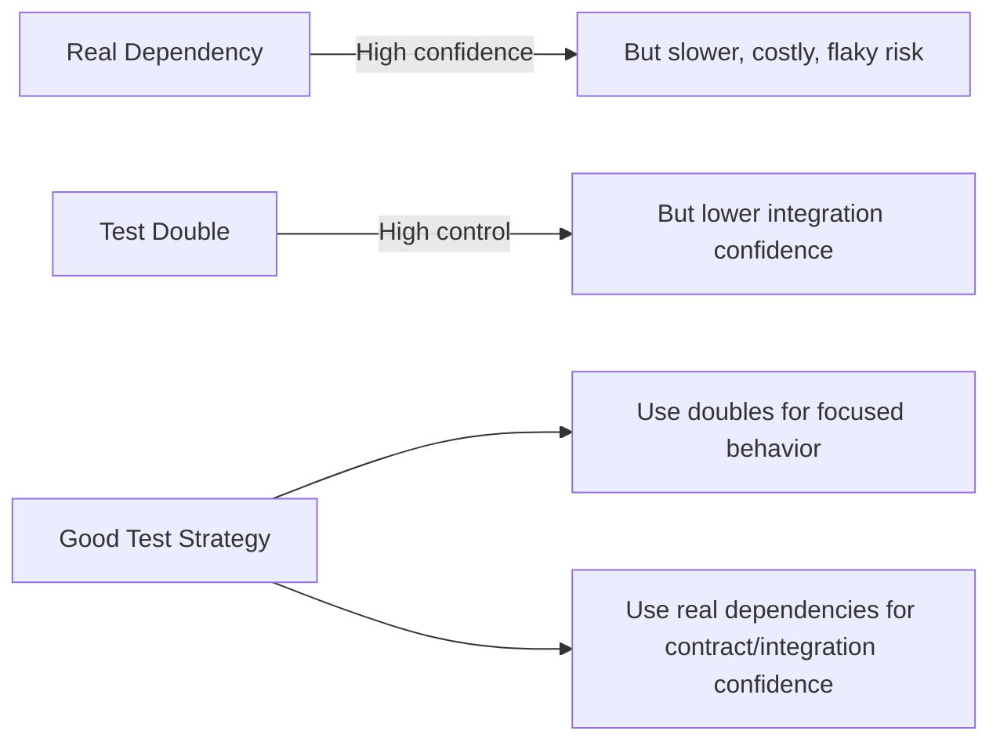
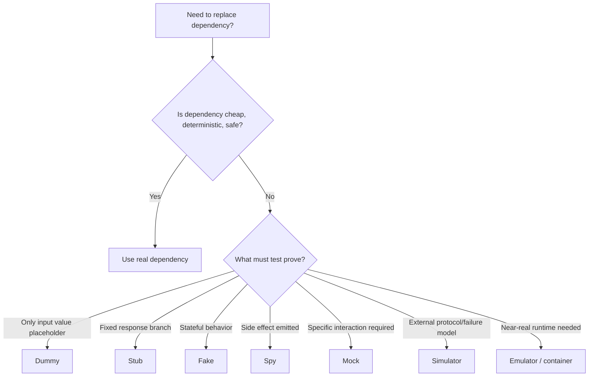
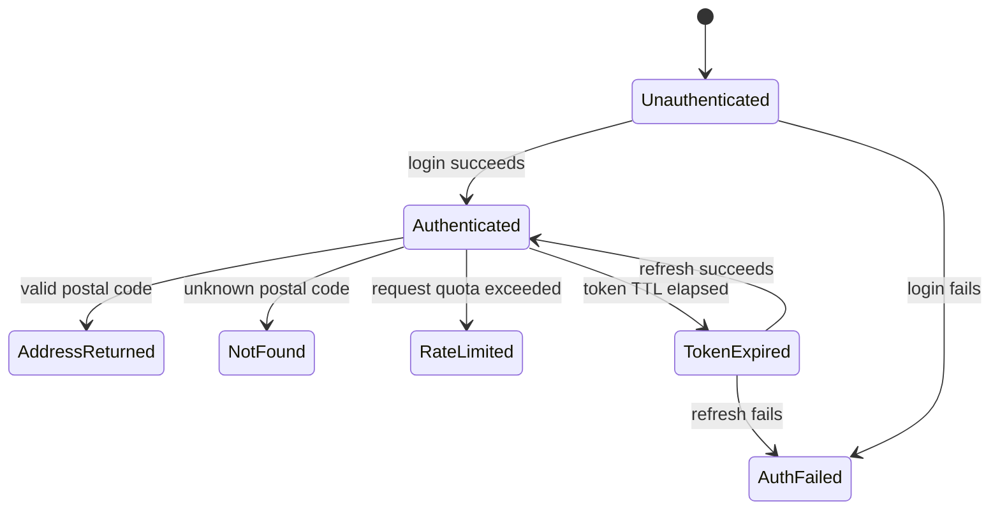
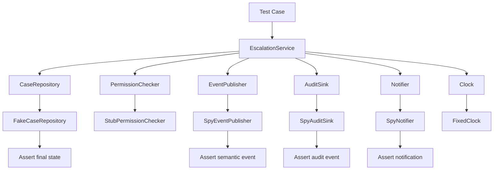

# learn-go-testing-benchmarking-performance-engineering-part-011.md

# Part 011 — Mock, Fake, Stub, Spy, Simulator: Test Double Design in Go

> Seri: **Go Testing, Benchmarking, Performance Engineering**  
> Target pembaca: **Java Software Engineer / Tech Lead** yang ingin membangun test suite Go yang production-grade  
> Fokus part ini: **test double design**, bukan sekadar library mocking  
> Status seri: **Part 011 dari 034** — seri belum selesai

---

## 0. Posisi Part Ini Dalam Seri

Pada part sebelumnya kita sudah membahas:

- model eksekusi `go test`,
- taxonomy test,
- desain Go yang testable,
- package `testing`,
- assertion strategy,
- table-driven tests,
- isolation dan flakiness,
- golden tests,
- error/panic/timeout/cancellation testing,
- deterministic testing.

Part ini menjawab pertanyaan yang sering muncul setelah semua fondasi itu:

> “Kalau dependency nyata terlalu mahal, lambat, nondeterministik, atau berbahaya dipakai saat test, bentuk penggantinya sebaiknya apa?”

Jawaban yang buruk biasanya langsung menuju:

> “Pakai mock framework.”

Jawaban yang matang:

> “Kita harus tahu dependency itu sedang dipakai sebagai apa, contract apa yang ingin dibuktikan, risk apa yang ingin dikurangi, dan apakah mock justru membuat test kehilangan nilai.”

Dalam Go, test double yang baik bukan terutama masalah library. Ia adalah masalah **boundary design** dan **contract design**.

---

## 1. Learning Objectives

Setelah menyelesaikan part ini, Anda harus mampu:

1. membedakan dummy, stub, fake, spy, mock, simulator, emulator, dan in-memory implementation;
2. memilih jenis test double berdasarkan risk, speed, determinism, dan confidence;
3. merancang interface Go yang kecil dan consumer-owned agar tidak memaksa over-mocking;
4. menulis handwritten fake yang maintainable;
5. memakai spy tanpa membuat test terlalu brittle;
6. memahami kapan generated mock layak dipakai;
7. menghindari interaction testing yang mengunci implementasi internal;
8. membuat simulator untuk external dependency yang stateful;
9. menulis test double yang aman untuk concurrency dan cancellation;
10. mereview test PR untuk mendeteksi over-mocking.

---

## 2. Core Principle

Test double hanya boleh ada untuk satu alasan utama:

> **Mengontrol boundary yang tidak cocok dipakai langsung dalam test tertentu.**

Boundary disebut “tidak cocok” jika salah satu dari ini benar:

| Boundary | Problem Saat Dipakai Langsung |
|---|---|
| Real database | lambat, stateful, perlu cleanup, bisa flake |
| External HTTP API | network nondeterministic, rate limit, cost, credentials |
| Queue/broker | async timing, ordering, delivery semantics kompleks |
| Clock | test tergantung waktu nyata |
| Random generator | output nondeterministic |
| Filesystem | path/env/permission bervariasi |
| Crypto entropy | nondeterministic, blocking risk di environment tertentu |
| Scheduler/goroutine | ordering nondeterministic |
| Payment/notification provider | side effect nyata berbahaya |

Namun mengganti dependency nyata dengan double juga punya biaya:

- test bisa membuktikan fake, bukan sistem nyata;
- mock expectation bisa mengunci implementasi internal;
- fake bisa drift dari dependency asli;
- simulator bisa lebih kompleks dari production code;
- generated mock bisa membuat interface membesar karena mudah dimock;
- test bisa lulus walau integration nyata rusak.

Jadi test double adalah trade-off, bukan default.

---

## 3. Mental Model: Confidence vs Control

Test double memberi **control**. Dependency nyata memberi **confidence**. Engineering test suite harus menyeimbangkan keduanya.



Jika semua test memakai real dependency, suite lambat dan sulit dikendalikan.
Jika semua test memakai mock, suite cepat tapi bisa menjadi self-referential fantasy.

Top-level rule:

> Gunakan double untuk mempersempit failure surface, bukan untuk menghindari desain yang buruk.

---

## 4. Vocabulary: Test Double Types

Istilah sering tercampur. Untuk engineering handbook, kita perlu definisi operasional.

### 4.1 Dummy

Dummy adalah value yang hanya dibutuhkan untuk memenuhi parameter, tapi tidak dipakai oleh behavior test.

Contoh:

```go
func TestPolicyName(t *testing.T) {
    user := User{ID: "u-1"} // dummy if only ID is required
    got := DisplayName(user)
    if got != "u-1" {
        t.Fatalf("DisplayName() = %q, want %q", got, "u-1")
    }
}
```

Dummy tidak punya behavior.

Gunakan dummy saat:

- field lain irrelevant;
- dependency tidak dipanggil;
- hanya perlu value object valid.

Anti-pattern:

- dummy terlalu lengkap sehingga menyamarkan field yang benar-benar penting;
- dummy dibuat dengan fixture raksasa.

---

### 4.2 Stub

Stub mengembalikan jawaban tetap untuk skenario tertentu.

```go
type StubUserRepo struct {
    User User
    Err  error
}

func (s StubUserRepo) FindByID(ctx context.Context, id string) (User, error) {
    return s.User, s.Err
}
```

Stub cocok untuk:

- dependency read-only sederhana;
- test happy path dan error path;
- deterministic branch coverage.

Stub buruk jika:

- perlu state transitions;
- perlu concurrency semantics;
- perlu memverifikasi call sequence kompleks;
- response harus tergantung input secara realistis.

---

### 4.3 Fake

Fake adalah implementasi ringan yang punya behavior nyata, tapi biasanya lebih sederhana dari dependency production.

Contoh fake repository in-memory:

```go
type FakeCaseRepo struct {
    mu    sync.Mutex
    cases map[string]Case
}

func NewFakeCaseRepo(seed ...Case) *FakeCaseRepo {
    f := &FakeCaseRepo{cases: make(map[string]Case)}
    for _, c := range seed {
        f.cases[c.ID] = c
    }
    return f
}

func (f *FakeCaseRepo) FindByID(ctx context.Context, id string) (Case, error) {
    f.mu.Lock()
    defer f.mu.Unlock()

    c, ok := f.cases[id]
    if !ok {
        return Case{}, ErrCaseNotFound
    }
    return c, nil
}

func (f *FakeCaseRepo) Save(ctx context.Context, c Case) error {
    f.mu.Lock()
    defer f.mu.Unlock()

    f.cases[c.ID] = c
    return nil
}
```

Fake cocok saat:

- dependency punya state;
- test perlu beberapa operasi berurutan;
- behavior domain penting;
- test sebaiknya memverifikasi outcome, bukan call detail;
- kita ingin reuse fake di banyak test.

Fake harus dijaga agar tidak drift dari real implementation.

---

### 4.4 Spy

Spy merekam interaksi agar test bisa memeriksa apa yang terjadi.

```go
type SpyNotifier struct {
    mu       sync.Mutex
    Messages []Notification
}

func (s *SpyNotifier) Send(ctx context.Context, n Notification) error {
    s.mu.Lock()
    defer s.mu.Unlock()

    s.Messages = append(s.Messages, n)
    return nil
}

func (s *SpyNotifier) Snapshot() []Notification {
    s.mu.Lock()
    defer s.mu.Unlock()

    out := make([]Notification, len(s.Messages))
    copy(out, s.Messages)
    return out
}
```

Spy cocok untuk side effect boundary:

- email sent;
- audit event emitted;
- queue message published;
- notification triggered;
- metric/log-like event captured.

Spy sebaiknya memeriksa **semantic side effect**, bukan implementation trivia.

Baik:

```go
if len(sent) != 1 || sent[0].Template != "case-escalated" {
    t.Fatalf("sent notification = %#v, want one case-escalated notification", sent)
}
```

Buruk:

```go
if spy.Calls[0].Method != "Send" || spy.Calls[0].Args[2] != "true" {
    t.Fatalf("unexpected internal call")
}
```

---

### 4.5 Mock

Mock adalah double yang biasanya memverifikasi expectation terhadap interaksi.

Contoh konseptual:

```go
notifier.EXPECT().Send(gomock.Any(), Notification{
    Template: "case-escalated",
    UserID:   "u-123",
}).Return(nil)
```

Mock cocok saat:

- contract memang interaction-based;
- output utama adalah call ke dependency;
- call sequence adalah bagian contract;
- dependency mahal dibuat fake;
- interface sudah kecil dan stabil;
- expectation tidak mengunci detail internal yang irrelevant.

Mock buruk saat:

- test seharusnya memeriksa state/output;
- expectation terlalu banyak;
- test berubah setiap refactor walau behavior sama;
- interface dibuat hanya karena mock framework butuh interface;
- mock menggantikan integration test yang seharusnya ada.

---

### 4.6 Simulator

Simulator meniru behavior dependency eksternal dengan state machine lebih realistis.

Contoh:

- payment provider simulator;
- identity provider simulator;
- queue delivery simulator;
- regulatory workflow engine simulator;
- API provider simulator dengan rate limit, 429, 401, retry-after, pagination.

Simulator lebih kuat daripada fake karena ia mencoba memodelkan protocol/failure behavior.

Simulator cocok untuk:

- external system stateful;
- failure-mode test;
- contract-like behavior;
- retry/backoff/circuit breaker validation;
- local development parity;
- E2E without real provider.

Simulator mahal. Jangan buat simulator untuk dependency sederhana.

---

### 4.7 Emulator

Emulator biasanya lebih dekat ke production dependency dan sering disediakan vendor/project.

Contoh konseptual:

- local cloud service emulator;
- database-compatible emulator;
- message broker test container;
- fake Kubernetes clientset;
- in-process API server.

Emulator memberi confidence lebih tinggi daripada handwritten fake, tapi tetap tidak sama dengan production.

---

## 5. Decision Matrix

| Need | Preferred Double | Why |
|---|---|---|
| Parameter tidak dipakai | Dummy | minimal |
| Return fixed result | Stub | sederhana |
| Stateful domain behavior | Fake | outcome-based |
| Capture side effect | Spy | verify semantic emission |
| Verify required interaction | Mock | interaction contract |
| External protocol/failure behavior | Simulator | stateful realism |
| Vendor-compatible local runtime | Emulator/container | higher integration confidence |



---

## 6. Go-Specific Bias: Prefer Small Interfaces at Consumer Boundary

Java engineers often place interfaces near implementations:

```text
UserRepository interface
JdbcUserRepository implements UserRepository
JpaUserRepository implements UserRepository
```

In Go, a healthier default is:

> The consumer defines the smallest interface it needs.

Example:

```go
type CaseReader interface {
    FindByID(ctx context.Context, id string) (Case, error)
}

type EscalationService struct {
    cases CaseReader
}
```

The real repository may have many methods:

```go
type OracleCaseRepository struct{}

func (r *OracleCaseRepository) FindByID(ctx context.Context, id string) (Case, error) { /* ... */ }
func (r *OracleCaseRepository) Save(ctx context.Context, c Case) error { /* ... */ }
func (r *OracleCaseRepository) ListByOfficer(ctx context.Context, officerID string) ([]Case, error) { /* ... */ }
func (r *OracleCaseRepository) Search(ctx context.Context, q SearchQuery) ([]Case, error) { /* ... */ }
```

But the service only depends on what it actually needs.

Benefit:

- test double is smaller;
- coupling is lower;
- implementation can evolve;
- tests do not need to implement irrelevant methods;
- interface reflects use case contract.

---

## 7. Anti-Pattern: Interface Created Only for Mocking

This is common:

```go
type Clock interface {
    Now() time.Time
}
```

This one is reasonable because time is nondeterministic.

But this may be unnecessary:

```go
type StringNormalizer interface {
    Normalize(s string) string
}
```

If `StringNormalizer` is pure, cheap, and deterministic, test the real implementation directly.

Bad reason:

> “We need interface so we can mock everything.”

Better reason:

> “This boundary is nondeterministic, expensive, stateful, external, or dangerous.”

---

## 8. Good Boundary Candidates for Doubles

### 8.1 Clock

```go
type Clock interface {
    Now() time.Time
}

type RealClock struct{}

func (RealClock) Now() time.Time { return time.Now() }

type FixedClock struct {
    t time.Time
}

func (c FixedClock) Now() time.Time { return c.t }
```

This is a good interface because time is nondeterministic.

---

### 8.2 ID Generator

```go
type IDGenerator interface {
    NewID() string
}

type SequenceIDGenerator struct {
    mu sync.Mutex
    n  int
}

func (g *SequenceIDGenerator) NewID() string {
    g.mu.Lock()
    defer g.mu.Unlock()
    g.n++
    return fmt.Sprintf("test-id-%03d", g.n)
}
```

Useful for deterministic tests.

---

### 8.3 External Client

```go
type AddressResolver interface {
    ResolvePostalCode(ctx context.Context, postalCode string) (Address, error)
}
```

Good boundary because real client has:

- network;
- auth token;
- rate limit;
- timeout;
- retry;
- provider-specific failure modes.

---

### 8.4 Publisher / Notifier

```go
type EventPublisher interface {
    Publish(ctx context.Context, event DomainEvent) error
}
```

Good boundary because publishing is a side effect.

---

### 8.5 Permission Checker

Be careful.

```go
type PermissionChecker interface {
    CanEscalate(ctx context.Context, actor Actor, c Case) (bool, error)
}
```

This can be good if permission is external or complex. But if authorization rule is central domain logic, mocking it everywhere can hide the most important behavior.

For critical rules, prefer:

- pure rule tests for policy itself;
- fake identity context;
- integration/contract tests for authorization data source.

---

## 9. Handwritten Fake: Production-Grade Pattern

A fake should have clear semantics.

Example: case repository fake.

```go
type FakeCaseRepository struct {
    mu sync.Mutex

    cases map[string]Case

    findErr error
    saveErr error
}

func NewFakeCaseRepository(seed ...Case) *FakeCaseRepository {
    r := &FakeCaseRepository{
        cases: make(map[string]Case, len(seed)),
    }
    for _, c := range seed {
        r.cases[c.ID] = c
    }
    return r
}

func (r *FakeCaseRepository) FindByID(ctx context.Context, id string) (Case, error) {
    if err := ctx.Err(); err != nil {
        return Case{}, err
    }

    r.mu.Lock()
    defer r.mu.Unlock()

    if r.findErr != nil {
        return Case{}, r.findErr
    }

    c, ok := r.cases[id]
    if !ok {
        return Case{}, ErrCaseNotFound
    }
    return c, nil
}

func (r *FakeCaseRepository) Save(ctx context.Context, c Case) error {
    if err := ctx.Err(); err != nil {
        return err
    }

    r.mu.Lock()
    defer r.mu.Unlock()

    if r.saveErr != nil {
        return r.saveErr
    }

    r.cases[c.ID] = c
    return nil
}

func (r *FakeCaseRepository) SetFindError(err error) {
    r.mu.Lock()
    defer r.mu.Unlock()
    r.findErr = err
}

func (r *FakeCaseRepository) SetSaveError(err error) {
    r.mu.Lock()
    defer r.mu.Unlock()
    r.saveErr = err
}

func (r *FakeCaseRepository) Snapshot() map[string]Case {
    r.mu.Lock()
    defer r.mu.Unlock()

    out := make(map[string]Case, len(r.cases))
    for k, v := range r.cases {
        out[k] = v
    }
    return out
}
```

Important properties:

- concurrency-safe;
- supports context cancellation;
- supports failure injection;
- supports state inspection via snapshot;
- does not expose internal mutable map;
- behavior is clear.

---

## 10. Fake Design Checklist

A production-grade fake should answer:

1. What real behavior does it simulate?
2. What real behavior does it intentionally not simulate?
3. Is it safe for parallel tests?
4. Does it support context cancellation?
5. Does it preserve important ordering?
6. Does it return copies where needed?
7. Can it inject errors deterministically?
8. Can tests inspect state without mutating internals?
9. Is it reused enough to justify maintenance?
10. Is there at least one contract/integration test against the real implementation?

Document fake limitations explicitly.

```go
// FakeCaseRepository is an in-memory test double for CaseRepository.
// It simulates basic FindByID and Save semantics.
// It does not simulate database transactions, unique constraints beyond ID map keys,
// SQL isolation levels, lock timeouts, or Oracle-specific errors.
```

This matters. Undocumented fake limitations become false confidence.

---

## 11. Stub Pattern: Keep It Boring

A stub should be small.

```go
type StubPermissionChecker struct {
    Allowed bool
    Err     error
}

func (s StubPermissionChecker) CanEscalate(ctx context.Context, actor Actor, c Case) (bool, error) {
    return s.Allowed, s.Err
}
```

Good test:

```go
func TestEscalateDeniesUnauthorizedActor(t *testing.T) {
    svc := EscalationService{
        permissions: StubPermissionChecker{Allowed: false},
    }

    err := svc.Escalate(context.Background(), Actor{ID: "u-1"}, Case{ID: "c-1"})
    if !errors.Is(err, ErrPermissionDenied) {
        t.Fatalf("Escalate() error = %v, want %v", err, ErrPermissionDenied)
    }
}
```

Stub is best when dependency behavior is irrelevant beyond branch selection.

If stub starts accumulating state, rename it to fake and design it properly.

---

## 12. Spy Pattern: Capture Semantic Side Effects

Example: audit event spy.

```go
type SpyAuditSink struct {
    mu     sync.Mutex
    events []AuditEvent
}

func (s *SpyAuditSink) Record(ctx context.Context, event AuditEvent) error {
    if err := ctx.Err(); err != nil {
        return err
    }

    s.mu.Lock()
    defer s.mu.Unlock()

    s.events = append(s.events, event)
    return nil
}

func (s *SpyAuditSink) Events() []AuditEvent {
    s.mu.Lock()
    defer s.mu.Unlock()

    out := make([]AuditEvent, len(s.events))
    copy(out, s.events)
    return out
}
```

Test:

```go
func TestEscalateRecordsAuditEvent(t *testing.T) {
    audit := &SpyAuditSink{}
    svc := EscalationService{
        audit: audit,
        clock: FixedClock{t: time.Date(2026, 6, 23, 10, 0, 0, 0, time.UTC)},
    }

    err := svc.Escalate(context.Background(), Actor{ID: "officer-1"}, Case{ID: "case-1"})
    if err != nil {
        t.Fatalf("Escalate() error = %v", err)
    }

    events := audit.Events()
    if len(events) != 1 {
        t.Fatalf("audit events len = %d, want 1: %#v", len(events), events)
    }
    if events[0].Type != "case.escalated" {
        t.Fatalf("audit event type = %q, want %q", events[0].Type, "case.escalated")
    }
    if events[0].ActorID != "officer-1" {
        t.Fatalf("audit actor = %q, want %q", events[0].ActorID, "officer-1")
    }
}
```

This verifies behavior without requiring a real audit DB.

---

## 13. Mock Pattern: Use Sparingly and Precisely

Mock is strongest when the behavior being tested is truly interaction-based.

Example suitable case:

> If SLA breach occurs, the service must call `Notifier.Send` exactly once with a specific semantic notification.

Even then, avoid asserting irrelevant call details.

### 13.1 Good Mock Expectation

Good expectation focuses on contract:

- notification type;
- case ID;
- recipient role;
- deadline.

Bad expectation focuses on incidental implementation:

- exact helper method sequence;
- exact internal DTO conversion order;
- exact number of repository reads unless contract requires it;
- exact context value unless contract requires it.

---

## 14. Generated Mock in Go

Generated mocks are useful for large, stable interfaces that are painful to implement manually.

Examples:

- generated client interfaces;
- large external SDK interfaces;
- stable adapter interfaces;
- complex interaction contract;
- legacy boundary where handwritten fake is too expensive.

But generated mocks have a hidden organizational cost:

- they make it easy to mock too much;
- they encourage interaction-heavy tests;
- generated files can become noisy in PRs;
- tests become tightly coupled to method signatures;
- interface design can be distorted by test convenience.

The maintained `go.uber.org/mock/gomock` project is a common GoMock implementation and integrates with the standard `testing` package. Its typical workflow is defining an interface, generating a mock with `mockgen`, then using a controller and expectations in tests.

### 14.1 When Generated Mock Is Acceptable

Use generated mock when all are true:

1. interface is already a real boundary, not invented only for the test;
2. interface is small or stable;
3. interaction is the behavior you need to prove;
4. fake would be harder or less precise;
5. there are integration/contract tests elsewhere;
6. expectation count is small;
7. test remains readable.

### 14.2 When Generated Mock Is a Smell

Avoid generated mock when:

- the real dependency is cheap and deterministic;
- the interface has one implementation and no external boundary;
- the test mocks every collaborator;
- expectation setup is longer than behavior under test;
- refactoring internals breaks many tests;
- test asserts implementation sequence more than outcome.

---

## 15. Interaction Testing vs State Testing

### 15.1 State/Output Testing

State testing asks:

> “After behavior runs, is the resulting state/output correct?”

Usually preferred.

```go
repo := NewFakeCaseRepository(Case{ID: "c-1", Status: StatusOpen})
svc := NewEscalationService(repo, FixedClock{t: now})

err := svc.Escalate(ctx, "c-1")
if err != nil { t.Fatal(err) }

got := repo.MustFind("c-1")
if got.Status != StatusEscalated {
    t.Fatalf("status = %v, want %v", got.Status, StatusEscalated)
}
```

### 15.2 Interaction Testing

Interaction testing asks:

> “Was collaborator called in the required way?”

Use only when interaction itself is externally observable behavior.

Examples:

- message published;
- email sent;
- audit event recorded;
- transaction committed/rolled back;
- circuit breaker notified;
- external API called with idempotency key.

Do not use interaction testing for internal computation.

---

## 16. Contract Drift: The Biggest Risk of Fakes

A fake can become wrong over time.

Example:

Real DB now enforces:

- unique `(agency_id, reference_no)`;
- optimistic version check;
- status transition constraint;
- soft delete filter.

Fake still uses:

```go
cases[id] = c
```

Result:

- unit tests pass;
- production fails;
- integration test would have caught it.

Mitigation:

1. write contract tests shared by fake and real implementation;
2. document fake limitations;
3. keep fake behavior minimal;
4. do not fake complex storage semantics unless needed;
5. run integration tests for important repository behavior.

---

## 17. Shared Contract Tests

A powerful pattern:

```go
type CaseRepositoryContract struct {
    NewRepo func(t *testing.T) CaseRepository
}

func (c CaseRepositoryContract) TestSaveThenFind(t *testing.T) {
    repo := c.NewRepo(t)

    want := Case{ID: "case-1", Status: StatusOpen}
    if err := repo.Save(context.Background(), want); err != nil {
        t.Fatalf("Save() error = %v", err)
    }

    got, err := repo.FindByID(context.Background(), "case-1")
    if err != nil {
        t.Fatalf("FindByID() error = %v", err)
    }
    if got != want {
        t.Fatalf("FindByID() = %#v, want %#v", got, want)
    }
}
```

Fake test:

```go
func TestFakeCaseRepositoryContract(t *testing.T) {
    contract := CaseRepositoryContract{
        NewRepo: func(t *testing.T) CaseRepository {
            return NewFakeCaseRepository()
        },
    }
    contract.TestSaveThenFind(t)
}
```

Real implementation test:

```go
func TestOracleCaseRepositoryContract(t *testing.T) {
    if testing.Short() {
        t.Skip("skipping database integration test in short mode")
    }

    contract := CaseRepositoryContract{
        NewRepo: func(t *testing.T) CaseRepository {
            return NewTestOracleCaseRepository(t)
        },
    }
    contract.TestSaveThenFind(t)
}
```

This pattern keeps fake honest.

---

## 18. Simulator Design

Simulator is appropriate when dependency behavior is protocol/state-machine heavy.

Example: external address resolver.

Real provider behavior:

- token required;
- token can expire;
- 401 means refresh token;
- 429 means rate limited;
- malformed postal code returns validation error;
- provider may return partial address;
- timeout may occur.

A stub is too weak.
A fake may be insufficient.
A simulator can model the important protocol.



A simulator should support scenario scripting:

```go
type AddressProviderSimulator struct {
    mu sync.Mutex

    tokenValid bool
    calls      int
    addresses  map[string]Address

    failNextWith error
    rateLimitAfter int
}
```

Use simulator to test:

- retry;
- token refresh;
- rate limit backoff;
- timeout;
- partial response handling;
- idempotency;
- error mapping.

---

## 19. HTTP Test Double: Prefer `httptest` Over Mocking `http.Client`

For HTTP dependencies, a good Go pattern is often:

- keep real HTTP client logic;
- point it to an `httptest.Server`;
- simulate HTTP behavior at protocol boundary.

```go
func TestAddressClientHandlesRateLimit(t *testing.T) {
    srv := httptest.NewServer(http.HandlerFunc(func(w http.ResponseWriter, r *http.Request) {
        if r.URL.Path != "/address" {
            http.NotFound(w, r)
            return
        }
        w.WriteHeader(http.StatusTooManyRequests)
        _, _ = w.Write([]byte(`{"error":"rate_limited"}`))
    }))
    defer srv.Close()

    client := NewAddressClient(srv.URL, srv.Client())

    _, err := client.ResolvePostalCode(context.Background(), "123456")
    if !errors.Is(err, ErrRateLimited) {
        t.Fatalf("ResolvePostalCode() error = %v, want %v", err, ErrRateLimited)
    }
}
```

Why this is better than mocking `Do(req)` in many cases:

- verifies URL/path/query/header/body handling;
- verifies status code mapping;
- verifies JSON decode;
- uses real `net/http` behavior;
- still deterministic and local.

Mocking `http.Client` can be useful, but it often tests less than people think.

---

## 20. Filesystem Double: Use `testing/fstest` Where Appropriate

Go has `testing/fstest`, which includes support for testing filesystem implementations. The `fstest.MapFS` type is useful as an in-memory filesystem for tests involving `io/fs`.

Example:

```go
func TestLoadTemplates(t *testing.T) {
    fsys := fstest.MapFS{
        "templates/case.txt": &fstest.MapFile{
            Data: []byte("Case {{.ID}}"),
        },
    }

    got, err := LoadTemplate(fsys, "templates/case.txt")
    if err != nil {
        t.Fatalf("LoadTemplate() error = %v", err)
    }
    if got != "Case {{.ID}}" {
        t.Fatalf("template = %q", got)
    }
}
```

Use `t.TempDir` when testing real filesystem behavior like:

- permissions;
- file creation;
- atomic rename;
- path behavior;
- symlinks;
- file locks.

Use `fstest.MapFS` when testing code that only needs `fs.FS` semantics.

---

## 21. Log Handler Double

Go has `testing/slogtest` to test implementations of `log/slog.Handler`.

This is a useful reminder:

> Some doubles and contract helpers are provided by the standard library itself.

Do not reinvent heavy test harnesses when package-specific test support exists.

---

## 22. Concurrency Safety in Doubles

A test double used by concurrent code must be concurrency-safe.

Bad spy:

```go
type BadSpy struct {
    Events []Event
}

func (s *BadSpy) Publish(ctx context.Context, e Event) error {
    s.Events = append(s.Events, e) // data race if called concurrently
    return nil
}
```

Good spy:

```go
type SafeSpy struct {
    mu     sync.Mutex
    events []Event
}

func (s *SafeSpy) Publish(ctx context.Context, e Event) error {
    s.mu.Lock()
    defer s.mu.Unlock()
    s.events = append(s.events, e)
    return nil
}

func (s *SafeSpy) Events() []Event {
    s.mu.Lock()
    defer s.mu.Unlock()
    out := make([]Event, len(s.events))
    copy(out, s.events)
    return out
}
```

Run concurrent tests with:

```bash
go test -race ./...
```

Race detector cannot prove absence of all concurrency bugs, but it catches many real data races when exercised.

---

## 23. Context-Aware Doubles

Production dependencies should respect `context.Context`. Test doubles should too.

Bad fake:

```go
func (f *FakeRepo) Save(ctx context.Context, c Case) error {
    f.cases[c.ID] = c
    return nil
}
```

Better:

```go
func (f *FakeRepo) Save(ctx context.Context, c Case) error {
    if err := ctx.Err(); err != nil {
        return err
    }
    // save...
    return nil
}
```

For dependency that blocks, support cancellation explicitly:

```go
type BlockingNotifier struct {
    unblock chan struct{}
}

func NewBlockingNotifier() *BlockingNotifier {
    return &BlockingNotifier{unblock: make(chan struct{})}
}

func (n *BlockingNotifier) Send(ctx context.Context, msg Notification) error {
    select {
    case <-ctx.Done():
        return ctx.Err()
    case <-n.unblock:
        return nil
    }
}

func (n *BlockingNotifier) Unblock() {
    close(n.unblock)
}
```

This enables deterministic cancellation tests without sleeping.

---

## 24. Failure Injection

Test doubles are excellent for failure injection.

Examples:

- repository returns timeout;
- notifier returns permanent error;
- publisher fails first two times then succeeds;
- identity provider returns expired token;
- queue blocks until context canceled.

Pattern:

```go
type ScriptedPublisher struct {
    mu      sync.Mutex
    results []error
    calls   int
}

func NewScriptedPublisher(results ...error) *ScriptedPublisher {
    return &ScriptedPublisher{results: results}
}

func (p *ScriptedPublisher) Publish(ctx context.Context, e Event) error {
    if err := ctx.Err(); err != nil {
        return err
    }

    p.mu.Lock()
    defer p.mu.Unlock()

    p.calls++
    if len(p.results) == 0 {
        return nil
    }

    err := p.results[0]
    p.results = p.results[1:]
    return err
}

func (p *ScriptedPublisher) Calls() int {
    p.mu.Lock()
    defer p.mu.Unlock()
    return p.calls
}
```

Test retry:

```go
func TestPublishRetriesTransientFailure(t *testing.T) {
    publisher := NewScriptedPublisher(ErrTransient, nil)
    svc := NewEventService(publisher)

    err := svc.PublishWithRetry(context.Background(), Event{ID: "e-1"})
    if err != nil {
        t.Fatalf("PublishWithRetry() error = %v", err)
    }
    if publisher.Calls() != 2 {
        t.Fatalf("calls = %d, want 2", publisher.Calls())
    }
}
```

This is better than sleeping and hoping retry happens.

---

## 25. Transaction Double

Transaction behavior is often interaction-sensitive.

You may need to prove:

- commit happens on success;
- rollback happens on failure;
- rollback happens when panic is recovered;
- context cancellation stops work;
- no commit after rollback.

A spy/fake transaction manager can help.

```go
type SpyTxManager struct {
    mu       sync.Mutex
    Began    int
    Commits  int
    Rollbacks int
}

func (m *SpyTxManager) WithinTx(ctx context.Context, fn func(context.Context) error) error {
    m.mu.Lock()
    m.Began++
    m.mu.Unlock()

    err := fn(ctx)

    m.mu.Lock()
    defer m.mu.Unlock()

    if err != nil {
        m.Rollbacks++
        return err
    }
    m.Commits++
    return nil
}
```

This verifies transaction semantic at service boundary without real DB.

But still write integration tests for actual DB transaction behavior.

---

## 26. Avoid Brittle Ordering Assertions

Ordering matters only if it is part of contract.

Valid ordering assertion:

- debit before credit in financial ledger;
- acquire lock before update;
- audit event after successful state transition;
- refresh token before retry request;
- rollback instead of commit.

Invalid ordering assertion:

- repository read before permission check if behavior does not require it;
- validation helper call before normalization if output unchanged;
- exact internal method sequence.

When order matters, make it explicit in domain language.

```go
want := []string{
    "begin-tx",
    "save-case",
    "record-audit",
    "commit-tx",
}
```

Do not assert 30 call events unless the external contract truly requires them.

---

## 27. Test Double Package Placement

Options:

```text
internal/case
internal/case/casetest
internal/testsupport
pkg/something/somethingtest
```

Guidelines:

### 27.1 Same Package Test Double

Use when:

- only one package needs it;
- it depends on unexported details;
- it should not become public API.

### 27.2 `xxx_test` Package Helper

Use when:

- testing public API as external consumer;
- fake should only rely on exported API.

### 27.3 `internal/testsupport`

Use cautiously.

Good for:

- shared fake clock;
- shared test server builder;
- shared ID generator;
- shared container harness.

Bad for:

- dumping every fixture and helper;
- cross-package coupling;
- accidental framework inside codebase.

### 27.4 `casetest` Package

A nice Go pattern:

```text
internal/case/casetest
```

It keeps test helpers near domain while avoiding global test utility sprawl.

---

## 28. Fixture Builders and Test Doubles

Test doubles often pair with builders.

Bad fixture:

```go
func NewCaseFixture() Case {
    return Case{
        ID: "case-1",
        AgencyID: "agency-1",
        Status: StatusOpen,
        CreatedAt: time.Now(),
        UpdatedAt: time.Now(),
        OfficerID: "officer-1",
        // 40 more fields...
    }
}
```

Better builder:

```go
type CaseBuilder struct {
    c Case
}

func NewCaseBuilder() CaseBuilder {
    return CaseBuilder{
        c: Case{
            ID:       "case-1",
            AgencyID: "agency-1",
            Status:   StatusOpen,
        },
    }
}

func (b CaseBuilder) WithStatus(status CaseStatus) CaseBuilder {
    b.c.Status = status
    return b
}

func (b CaseBuilder) WithOfficer(id string) CaseBuilder {
    b.c.OfficerID = id
    return b
}

func (b CaseBuilder) Build() Case {
    return b.c
}
```

Use builders to make test intent visible.

---

## 29. Example Case Study: Regulatory Case Escalation

### 29.1 Production Scenario

A case escalation service must:

1. load case;
2. check permission;
3. reject if already closed;
4. set status to escalated;
5. save case;
6. publish domain event;
7. record audit event;
8. notify supervisor.

Naive test approach:

- mock repo;
- mock permission;
- mock publisher;
- mock audit;
- mock notifier;
- assert every call.

This becomes brittle.

Better test suite:

| Behavior | Double Strategy |
|---|---|
| State transition | fake repository |
| Permission allowed/denied | stub permission checker |
| Event emitted | spy publisher |
| Audit recorded | spy audit sink |
| Notification sent | spy notifier |
| DB-specific constraints | integration test |
| External notification provider | contract/simulator test |

### 29.2 Test Setup

```go
func TestEscalateCaseHappyPath(t *testing.T) {
    now := time.Date(2026, 6, 23, 10, 0, 0, 0, time.UTC)

    repo := NewFakeCaseRepository(Case{
        ID:     "case-1",
        Status: StatusOpen,
    })
    publisher := &SpyEventPublisher{}
    audit := &SpyAuditSink{}
    notifier := &SpyNotifier{}

    svc := EscalationService{
        cases:       repo,
        permissions: StubPermissionChecker{Allowed: true},
        events:      publisher,
        audit:       audit,
        notifier:    notifier,
        clock:       FixedClock{t: now},
    }

    err := svc.Escalate(context.Background(), Actor{ID: "officer-1"}, "case-1")
    if err != nil {
        t.Fatalf("Escalate() error = %v", err)
    }

    saved := repo.Snapshot()["case-1"]
    if saved.Status != StatusEscalated {
        t.Fatalf("status = %v, want %v", saved.Status, StatusEscalated)
    }

    if got := publisher.Events(); len(got) != 1 || got[0].Type != "case.escalated" {
        t.Fatalf("published events = %#v, want one case.escalated", got)
    }

    if got := audit.Events(); len(got) != 1 || got[0].ActorID != "officer-1" {
        t.Fatalf("audit events = %#v, want one event by officer-1", got)
    }

    if got := notifier.Messages(); len(got) != 1 || got[0].Template != "case-escalated" {
        t.Fatalf("notifications = %#v, want one case-escalated notification", got)
    }
}
```

Notice:

- no generated mock needed;
- behavior is outcome-oriented;
- side effects are semantic;
- fixed clock makes time deterministic;
- fake repo captures state;
- stubs only branch permission.

---

## 30. Mermaid: Test Double Architecture



---

## 31. Over-Mocking Symptoms

A test suite is likely over-mocked if:

1. most tests verify call order rather than user-visible behavior;
2. refactors break many tests without behavior changes;
3. mocks duplicate implementation logic;
4. every concrete type has a matching interface;
5. interfaces live next to implementations but are only used in tests;
6. expectation setup is larger than test scenario;
7. tests do not catch integration bugs;
8. mocks return impossible states;
9. tests are hard to read without knowing internals;
10. generated mock files dominate PR diffs.

---

## 32. Under-Testing Symptoms

The opposite problem also exists.

A test suite may underuse doubles if:

1. tests call real network APIs;
2. tests require credentials;
3. tests rely on wall-clock sleeps;
4. tests mutate shared database state;
5. tests cannot inject failure modes;
6. cancellation paths are untested;
7. retry paths are untested;
8. rare provider errors are untested;
9. CI is flaky due to external services;
10. developers avoid running tests locally.

Good engineering is not “never mock”. It is using the smallest sufficient double for the risk.

---

## 33. Test Double Review Heuristics

When reviewing a PR, ask:

### 33.1 Boundary

- Is this dependency genuinely worth replacing?
- Is it external, nondeterministic, costly, stateful, or dangerous?
- Could the real dependency be used cheaply instead?

### 33.2 Interface

- Is the interface consumer-owned?
- Is it small?
- Does it represent a real boundary?
- Was it created only for mocking?

### 33.3 Double Type

- Is this a stub, fake, spy, mock, or simulator?
- Is the chosen type appropriate?
- Is it named accurately?

### 33.4 Semantics

- Does the fake preserve important behavior?
- Are limitations documented?
- Is there contract coverage against real implementation?

### 33.5 Maintainability

- Is setup readable?
- Are assertions semantic?
- Will refactor break the test unnecessarily?
- Can another engineer understand the scenario quickly?

---

## 34. Naming Conventions

Good names:

```go
StubPermissionChecker
FakeCaseRepository
SpyAuditSink
ScriptedPublisher
BlockingNotifier
FixedClock
SequenceIDGenerator
AddressProviderSimulator
```

Bad names:

```go
MockCaseRepository // but actually fake
FakeNotifier       // but only records calls, so spy
TestHelper         // vague
MockEverything     // alarming
```

Names should reveal behavior.

---

## 35. Handling Errors in Doubles

Avoid ad-hoc string errors:

```go
return errors.New("bad")
```

Prefer meaningful test errors:

```go
var ErrInjectedRepositoryFailure = errors.New("injected repository failure")
```

Or use existing domain errors:

```go
return ErrCaseNotFound
```

This makes assertions stable:

```go
if !errors.Is(err, ErrInjectedRepositoryFailure) {
    t.Fatalf("error = %v, want %v", err, ErrInjectedRepositoryFailure)
}
```

---

## 36. Avoid Test Double Logic That Reimplements SUT

Bad fake:

```go
func (f *FakeEscalationEngine) Escalate(c Case) Case {
    // duplicates production escalation rules
}
```

If fake duplicates the system under test, then both can be wrong in the same way.

A fake should simulate dependency behavior, not replicate the logic being tested.

---

## 37. Contract of Time and Randomness Doubles

From part 010, deterministic sources are core.

A fake clock should be explicit:

```go
type ManualClock struct {
    mu sync.Mutex
    now time.Time
}

func NewManualClock(t time.Time) *ManualClock {
    return &ManualClock{now: t}
}

func (c *ManualClock) Now() time.Time {
    c.mu.Lock()
    defer c.mu.Unlock()
    return c.now
}

func (c *ManualClock) Advance(d time.Duration) {
    c.mu.Lock()
    defer c.mu.Unlock()
    c.now = c.now.Add(d)
}
```

Use this when behavior depends on time progression.

For simple timestamp injection, `FixedClock` is enough.

---

## 38. Test Double and Benchmarking

Be careful using test doubles in benchmarks.

A fake dependency can distort performance results.

Examples:

- fake repository is map-based while real repository is network/database;
- fake HTTP client bypasses JSON encode/decode;
- fake publisher ignores serialization;
- fake clock is cheaper than `time.Now`;
- fake mutex behavior differs from real dependency.

Benchmark rule:

> Use doubles only if the benchmark explicitly scopes out that dependency cost.

Example benchmark names should be honest:

```go
BenchmarkEscalationService_InMemoryRepo
BenchmarkEscalationService_WithJSONEncoding
BenchmarkAddressClient_HTTPTestServer
```

Do not claim end-to-end performance from fake-only benchmarks.

---

## 39. Test Double and Fuzzing

Fuzz targets should avoid stateful mocks.

Good fuzz dependencies:

- pure function;
- deterministic fake;
- bounded in-memory parser;
- fake clock fixed;
- no real network;
- no global mutable state.

Bad fuzz dependency:

- mock expectation that assumes specific call sequence for arbitrary input;
- fake that grows unbounded;
- simulator with hidden global state;
- nondeterministic clock/randomness.

Fuzzing wants broad input exploration. Over-specific mocks fight that goal.

---

## 40. Test Double and Security-Sensitive Code

Be careful when testing security flows.

Do not mock away the actual security property.

Bad:

- mock password hasher and assert `Hash(password)` called;
- mock token verifier and assume claims valid;
- mock permission engine for all authorization tests;
- fake crypto randomness without explicit test-only boundary.

Better:

- unit test pure policy rules;
- use deterministic crypto test support only in tests;
- test token validation with real parser and test keys;
- use fake identity provider for login flow but contract-test claim mapping;
- include negative tests for tampered token/signature/claims.

In Go 1.26, `testing/cryptotest` provides deterministic crypto randomness support for tests, which can reduce ad-hoc unsafe crypto stubbing.

---

## 41. Advanced Pattern: Scenario Script Double

For complex workflows, scenario scripts are clearer than many booleans.

```go
type Step struct {
    Op  string
    Err error
}

type ScriptedCaseRepo struct {
    mu    sync.Mutex
    steps []Step
}

func (r *ScriptedCaseRepo) next(op string) error {
    r.mu.Lock()
    defer r.mu.Unlock()

    if len(r.steps) == 0 {
        return fmt.Errorf("unexpected operation %s", op)
    }

    step := r.steps[0]
    r.steps = r.steps[1:]

    if step.Op != op {
        return fmt.Errorf("operation = %s, want %s", op, step.Op)
    }
    return step.Err
}
```

Use carefully. This can become a brittle mock if overused.

Best for:

- transaction semantics;
- retry sequence;
- stateful protocol;
- failure choreography.

---

## 42. Practical Test Double Policy for Teams

A team-level policy can be:

1. Prefer real pure deterministic code.
2. Prefer fakes for stateful domain dependencies.
3. Prefer spies for semantic side effects.
4. Prefer `httptest.Server` for HTTP clients.
5. Prefer `fstest.MapFS` or `t.TempDir` for filesystem cases.
6. Use generated mocks only for stable interaction boundaries.
7. Require integration/contract tests for fake-backed critical dependencies.
8. Require race-safe doubles for concurrent code.
9. Require documented limitations for reusable fakes/simulators.
10. Reject tests that only verify implementation choreography without behavior value.

---

## 43. Java-to-Go Translation Notes

| Java Habit | Go Adjustment |
|---|---|
| Interface for every service | Interface only at meaningful boundary |
| Mockito everywhere | Handwritten fake/spy often clearer |
| Verify call sequence heavily | Prefer state/output/semantic side effects |
| Spring DI container test wiring | Explicit constructor wiring |
| Large repository interfaces | Consumer-owned small interfaces |
| Mock static time/randomness | Inject clock/randomness explicitly |
| Heavy test fixtures | Small builders with visible intent |
| Framework-driven test suite | Package-level simple tests |

The key shift:

> In Go, testability usually comes from simple dependency direction, not from a large mocking ecosystem.

---

## 44. Common Anti-Patterns

### 44.1 Mocking Pure Functions

If a function is deterministic and cheap, test it directly.

### 44.2 Mocking the System Under Test

If the test mocks the behavior it claims to validate, it has no value.

### 44.3 Over-Specified Expectations

Asserting every method call makes refactor expensive.

### 44.4 Fake With Production-Level Complexity

If fake becomes as complex as production dependency, use real dependency in integration tests or simplify scope.

### 44.5 Shared Mutable Fake Across Tests

This creates order dependency and flakes.

### 44.6 Global Mock Registry

Global mocks make parallel test unsafe.

### 44.7 Mocking External API Instead of Testing Protocol

For HTTP, prefer `httptest.Server` when protocol mapping matters.

### 44.8 Generated Mock for Unstable Interface

Every signature change breaks test noise.

### 44.9 Fake That Ignores Context

Cancellation tests become false.

### 44.10 Fake That Returns Impossible States

Tests may validate behavior production can never see, or miss behavior production often sees.

---

## 45. Review Checklist

Before approving test double code, verify:

```text
[ ] The dependency genuinely needs replacement in this test.
[ ] The double type is appropriate: dummy/stub/fake/spy/mock/simulator.
[ ] The interface is small and consumer-owned where possible.
[ ] The double is deterministic.
[ ] The double is concurrency-safe if used concurrently.
[ ] The double respects context cancellation if production dependency does.
[ ] Failure injection is explicit and readable.
[ ] Assertions check semantic behavior, not incidental implementation.
[ ] Reusable fake limitations are documented.
[ ] Critical fake-backed behavior has contract/integration coverage.
[ ] Generated mock is justified by boundary stability and interaction contract.
[ ] Test setup is shorter and clearer than the behavior being tested.
```

---

## 46. Exercises

### Exercise 1 — Replace Over-Mock With Fake

Given a service test that mocks repository `FindByID`, `Save`, `UpdateStatus`, and `InsertAudit`, rewrite it using:

- fake repository;
- spy audit sink;
- fixed clock.

Goal:

- reduce call expectations;
- assert final case state;
- assert semantic audit event.

---

### Exercise 2 — Build a Scripted Publisher

Create a publisher test double that:

1. fails first call with `ErrTransient`;
2. succeeds second call;
3. records number of calls;
4. is safe under concurrent calls.

Use it to test retry logic without `time.Sleep`.

---

### Exercise 3 — HTTP Provider Simulator

Build an `httptest.Server` for an address provider:

- `/login` returns token;
- `/address?postal_code=...` returns address;
- first address call returns 401;
- client must refresh token and retry;
- assert final result and number of requests.

---

### Exercise 4 — Contract Test Fake and Real Repo

Create shared contract tests for:

- save then find;
- find missing returns `ErrNotFound`;
- duplicate reference rejected;
- context cancellation respected.

Run same contract against fake and real repository.

---

## 47. Key Takeaways

1. Test double design is boundary design.
2. Mock is only one kind of test double, not the default solution.
3. Prefer real deterministic code when possible.
4. Prefer fake for stateful behavior and spy for semantic side effects.
5. Prefer `httptest.Server` for HTTP protocol behavior.
6. Keep interfaces small and consumer-owned.
7. Document fake limitations.
8. Add contract/integration tests to prevent fake drift.
9. Make doubles concurrency-safe when production code is concurrent.
10. A good test double increases control without destroying confidence.

---

## 48. References

- Go `testing` package documentation: `https://pkg.go.dev/testing`
- Go `testing/fstest` package documentation: `https://pkg.go.dev/testing/fstest`
- Go `testing/slogtest` package documentation: `https://pkg.go.dev/testing/slogtest`
- Go 1.26 release notes: `https://go.dev/doc/go1.26`
- Uber GoMock repository: `https://github.com/uber-go/mock`
- GoMock package documentation: `https://pkg.go.dev/go.uber.org/mock/gomock`

---

## 49. Status

Seri belum selesai.

- Part saat ini: **011**
- Part terakhir yang direncanakan: **034**
- Berikutnya: **Part 012 — HTTP, gRPC-Like, Handler, Middleware & Client Testing**

<!-- NAVIGATION_FOOTER -->
<div class="page-nav">
<a href="./learn-go-testing-benchmarking-performance-engineering-part-010.md">⬅️ Part 010 — Deterministic Testing: Time, Randomness, UUID, Crypto, Scheduler & Environment</a>
<a href="./index.md">📚 Kategori</a>
<a href="../../index.md">🏠 Home</a>
<a href="./learn-go-testing-benchmarking-performance-engineering-part-012.md">Part 012 — HTTP, Handler, Middleware & Client Testing ➡️</a>
</div>
