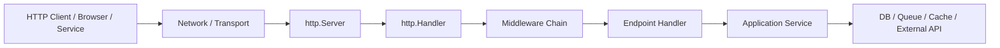
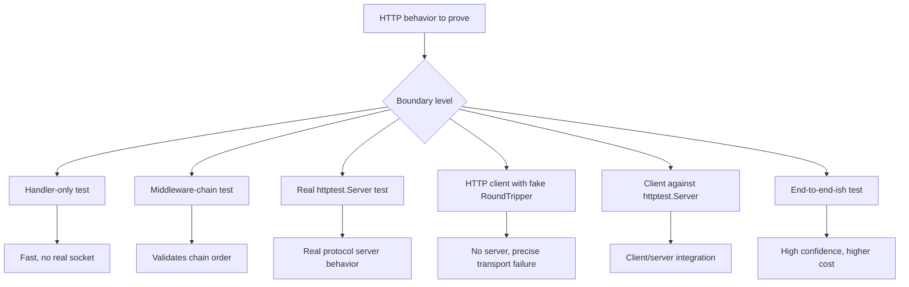
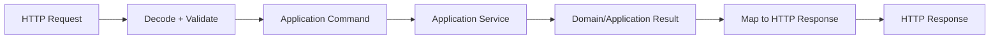
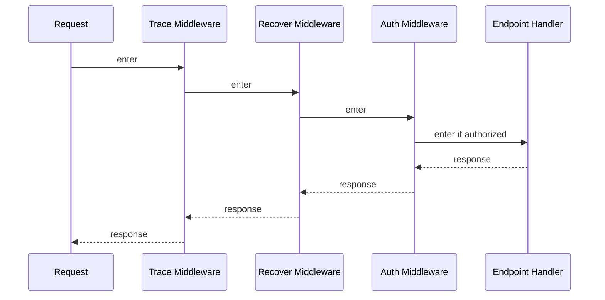
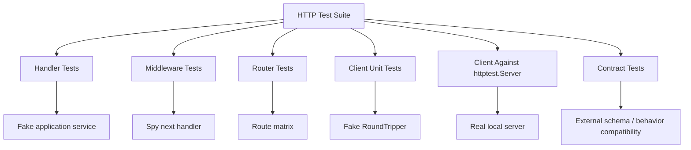

# learn-go-testing-benchmarking-performance-engineering-part-012.md

# Part 012 — HTTP, Handler, Middleware & Client Testing

> Seri: **Go Testing, Benchmarking, Performance Engineering**  
> Target pembaca: **Java software engineer / tech lead** yang ingin membangun mental model Go testing setara internal engineering handbook.  
> Target Go: **Go 1.26.x**  
> Fokus part ini: **menguji boundary HTTP secara benar, deterministik, cepat, dan representatif tanpa bergantung pada network eksternal.**

---

## 0. Posisi Part Ini Dalam Seri

Part sebelumnya membahas desain testable code, assertion strategy, table-driven test, isolation, deterministic testing, dan test double. Part ini menerapkan semua prinsip itu pada boundary yang paling sering muncul di production Go service: **HTTP**.

Di Go, HTTP testing biasanya terlihat sederhana karena standard library menyediakan `net/http`, `net/http/httptest`, dan `http.Handler`. Namun kesederhanaan ini sering menipu. Banyak test HTTP hanya mengecek status code dan body string, tetapi gagal membuktikan hal yang benar-benar penting:

- apakah request lifecycle benar;
- apakah context cancellation dipropagasi;
- apakah middleware order benar;
- apakah header/security/cache semantics benar;
- apakah error mapping stabil;
- apakah client timeout dan retry tidak menyebabkan retry storm;
- apakah streaming dan flushing benar;
- apakah behavior test setara dengan real server;
- apakah external API dependency bisa disimulasikan tanpa network nyata;
- apakah test tetap deterministik ketika dijalankan parallel di CI.

Part ini tidak mengulang detail observability/profiling/networking. Kita fokus pada **testing architecture** untuk HTTP boundary.

---

## 1. Core Mental Model: HTTP Test Bukan “Call Function Then Assert Body”

Dalam Go, HTTP boundary terdiri dari beberapa layer:



Dalam test, kita bisa memilih layer mana yang ingin diuji:



A strong HTTP test suite uses **multiple levels intentionally**, not one universal style.

### 1.1 Java Comparison

Jika Anda dari Java/Spring ecosystem, Anda mungkin terbiasa dengan:

- `MockMvc` untuk handler/controller layer;
- `WebTestClient` untuk reactive stack;
- `RestTemplate`/`WebClient` mocking;
- embedded server tests;
- WireMock/MockWebServer untuk external dependency;
- Spring context-heavy integration tests.

Go berbeda:

- `http.Handler` adalah interface kecil dan sangat testable;
- tidak perlu framework besar untuk test handler;
- `httptest.ResponseRecorder` mirip handler-level recorder;
- `httptest.Server` memberi real HTTP server lokal;
- client bisa diuji dengan custom `http.RoundTripper`;
- middleware hanyalah function composition;
- tidak ada “application context” besar kecuali Anda membuatnya sendiri.

Konsekuensinya: HTTP testing di Go bisa sangat cepat dan presisi, tetapi hanya jika desain boundary-nya bersih.

---

## 2. Standard Library Tools

Package utama:

```go
import (
    "net/http"
    "net/http/httptest"
    "testing"
)
```

`net/http/httptest` menyediakan utilities untuk HTTP testing seperti:

- `httptest.NewRequest`;
- `httptest.NewRecorder`;
- `httptest.ResponseRecorder`;
- `httptest.NewServer`;
- `httptest.NewTLSServer`;
- `httptest.Server.Client()`;
- `httptest.Server.URL`;
- `httptest.Server.Close()`.

`net/http` menyediakan primitive production-nya:

- `http.Handler`;
- `http.HandlerFunc`;
- `http.Request`;
- `http.ResponseWriter`;
- `http.Client`;
- `http.Transport`;
- `http.RoundTripper`;
- `http.Server`;
- `http.Cookie`;
- `http.Header`;
- `http.NewRequestWithContext`.

Mental model penting:

> `httptest` bukan framework eksternal. Ia adalah standard library shim untuk membuat test HTTP memiliki semantics sedekat mungkin dengan `net/http`.

---

## 3. Handler-Only Test Dengan `ResponseRecorder`

### 3.1 Kapan Dipakai

Gunakan handler-only test ketika ingin membuktikan:

- routing/handler behavior sederhana;
- status code;
- response header;
- JSON body;
- error mapping;
- request validation;
- auth context injection;
- middleware behavior tanpa real network;
- deterministic unit/component-level HTTP behavior.

### 3.2 Contoh Minimal

```go
func TestHealthHandler(t *testing.T) {
    handler := http.HandlerFunc(func(w http.ResponseWriter, r *http.Request) {
        w.Header().Set("Content-Type", "application/json")
        w.WriteHeader(http.StatusOK)
        _, _ = w.Write([]byte(`{"status":"ok"}`))
    })

    req := httptest.NewRequest(http.MethodGet, "/health", nil)
    rec := httptest.NewRecorder()

    handler.ServeHTTP(rec, req)

    res := rec.Result()
    defer res.Body.Close()

    if res.StatusCode != http.StatusOK {
        t.Fatalf("status code = %d, want %d", res.StatusCode, http.StatusOK)
    }

    if got := res.Header.Get("Content-Type"); got != "application/json" {
        t.Fatalf("Content-Type = %q, want %q", got, "application/json")
    }

    body, err := io.ReadAll(res.Body)
    if err != nil {
        t.Fatalf("read body: %v", err)
    }

    if string(body) != `{"status":"ok"}` {
        t.Fatalf("body = %s", body)
    }
}
```

### 3.3 Kenapa Memakai `rec.Result()`?

`ResponseRecorder` punya field seperti `Code`, `Body`, `HeaderMap`/header mutation state. Namun untuk behavior yang lebih dekat ke real response, gunakan:

```go
res := rec.Result()
```

Alasannya:

- `Result()` menghasilkan `*http.Response`;
- test menjadi mirip client-side assertion;
- default status behavior lebih mudah dipahami;
- body dibaca melalui `io.ReadAll` seperti real response;
- header final dilihat dari response object.

Pattern yang direkomendasikan:

```go
rec := httptest.NewRecorder()
handler.ServeHTTP(rec, req)
res := rec.Result()
defer res.Body.Close()
```

---

## 4. Request Construction: `httptest.NewRequest` vs `http.NewRequest`

### 4.1 Handler Test

Untuk handler test, gunakan:

```go
req := httptest.NewRequest(http.MethodPost, "/cases/123/escalate", body)
```

`httptest.NewRequest` dibuat untuk inbound server request dalam test. Ia mengisi field request dengan bentuk yang cocok untuk handler.

### 4.2 Client Test

Untuk client-side code, gunakan:

```go
req, err := http.NewRequestWithContext(ctx, http.MethodPost, url, body)
```

Kenapa? Karena client test menguji outgoing request. Semantics-nya berbeda dari inbound server request.

### 4.3 Rule of Thumb

| Skenario | Request constructor |
|---|---|
| Menguji `http.Handler` langsung | `httptest.NewRequest` |
| Menguji client yang membuat outbound call | `http.NewRequestWithContext` |
| Menguji handler dengan real local server | request dibuat oleh `http.Client` |
| Menguji raw protocol detail | real `httptest.Server` lebih cocok |

---

## 5. Table-Driven Handler Tests

HTTP handler sangat cocok untuk table-driven test karena request/response membentuk matrix jelas.

```go
type requestCase struct {
    name       string
    method     string
    path       string
    body       string
    headers    map[string]string
    wantStatus int
    wantBody   string
}

func TestCreateCaseHandler(t *testing.T) {
    handler := NewCreateCaseHandler(fakeService{})

    tests := []requestCase{
        {
            name:       "valid request returns 201",
            method:     http.MethodPost,
            path:       "/cases",
            body:       `{"title":"late filing","severity":"high"}`,
            headers:    map[string]string{"Content-Type": "application/json"},
            wantStatus: http.StatusCreated,
            wantBody:   `{"id":"case-001"}`,
        },
        {
            name:       "invalid json returns 400",
            method:     http.MethodPost,
            path:       "/cases",
            body:       `{invalid`,
            headers:    map[string]string{"Content-Type": "application/json"},
            wantStatus: http.StatusBadRequest,
            wantBody:   `{"error":"invalid_json"}`,
        },
        {
            name:       "wrong method returns 405",
            method:     http.MethodGet,
            path:       "/cases",
            wantStatus: http.StatusMethodNotAllowed,
            wantBody:   `{"error":"method_not_allowed"}`,
        },
    }

    for _, tc := range tests {
        tc := tc
        t.Run(tc.name, func(t *testing.T) {
            req := httptest.NewRequest(tc.method, tc.path, strings.NewReader(tc.body))
            for k, v := range tc.headers {
                req.Header.Set(k, v)
            }

            rec := httptest.NewRecorder()
            handler.ServeHTTP(rec, req)

            res := rec.Result()
            defer res.Body.Close()

            if res.StatusCode != tc.wantStatus {
                t.Fatalf("status = %d, want %d", res.StatusCode, tc.wantStatus)
            }

            gotBody, err := io.ReadAll(res.Body)
            if err != nil {
                t.Fatalf("read response body: %v", err)
            }

            assertJSONEqual(t, string(gotBody), tc.wantBody)
        })
    }
}
```

### 5.1 Jangan Assert JSON Sebagai Raw String Jika Tidak Perlu

Raw JSON string brittle terhadap:

- spacing;
- object key order;
- formatting;
- escaping;
- insignificant zero values.

Gunakan semantic comparison:

```go
func assertJSONEqual(t *testing.T, got string, want string) {
    t.Helper()

    var gotValue any
    if err := json.Unmarshal([]byte(got), &gotValue); err != nil {
        t.Fatalf("got invalid JSON: %v\nbody: %s", err, got)
    }

    var wantValue any
    if err := json.Unmarshal([]byte(want), &wantValue); err != nil {
        t.Fatalf("want invalid JSON: %v\nbody: %s", err, want)
    }

    if !reflect.DeepEqual(gotValue, wantValue) {
        gotPretty, _ := json.MarshalIndent(gotValue, "", "  ")
        wantPretty, _ := json.MarshalIndent(wantValue, "", "  ")
        t.Fatalf("JSON mismatch\ngot:\n%s\nwant:\n%s", gotPretty, wantPretty)
    }
}
```

Untuk project besar, gunakan helper dengan diff yang lebih bagus, misalnya `go-cmp`.

---

## 6. Handler Design Agar Mudah Dites

### 6.1 Pisahkan HTTP Boundary Dari Application Logic

Handler seharusnya menerjemahkan HTTP ke application command/query, bukan berisi seluruh business logic.



Contoh struktur:

```go
type CaseService interface {
    CreateCase(ctx context.Context, cmd CreateCaseCommand) (CreateCaseResult, error)
}

type CaseHandler struct {
    service CaseService
}

func NewCaseHandler(service CaseService) *CaseHandler {
    return &CaseHandler{service: service}
}
```

Handler test cukup fake `CaseService`. Business logic service punya test sendiri.

### 6.2 Handler Yang Sulit Dites

```go
func CreateCaseHandler(w http.ResponseWriter, r *http.Request) {
    db, _ := sql.Open("oracle", os.Getenv("DB_DSN"))
    defer db.Close()

    // parse request, validate, execute SQL, send email, publish message, write response
}
```

Masalah:

- dependency dibuat di dalam handler;
- env dibaca langsung;
- database real dibuka;
- side effect bercampur;
- timeout/cancel sulit dites;
- error mapping tidak reusable;
- test lambat dan rapuh.

### 6.3 Handler Yang Lebih Testable

```go
type CreateCaseHandler struct {
    svc    CaseService
    clock  Clock
    logger Logger
}

func (h *CreateCaseHandler) ServeHTTP(w http.ResponseWriter, r *http.Request) {
    ctx := r.Context()

    var req createCaseRequest
    if err := json.NewDecoder(r.Body).Decode(&req); err != nil {
        writeJSONError(w, http.StatusBadRequest, "invalid_json")
        return
    }

    cmd, err := req.toCommand(h.clock.Now())
    if err != nil {
        writeJSONError(w, http.StatusUnprocessableEntity, "invalid_case_request")
        return
    }

    result, err := h.svc.CreateCase(ctx, cmd)
    if err != nil {
        writeServiceError(w, err)
        return
    }

    writeJSON(w, http.StatusCreated, createCaseResponse{ID: result.ID})
}
```

Di test:

- fake service bisa assert command;
- fake clock membuat timestamp deterministik;
- response mapping dapat diuji tanpa database;
- cancellation pakai request context;
- error mapping bisa distabilkan.

---

## 7. Testing Status Code, Header, Body, Cookies

### 7.1 Status Code

```go
if got, want := res.StatusCode, http.StatusCreated; got != want {
    t.Fatalf("status = %d, want %d", got, want)
}
```

Jangan hanya assert body. HTTP contract biasanya status-first.

### 7.2 Header

```go
if got := res.Header.Get("Content-Type"); got != "application/json" {
    t.Fatalf("Content-Type = %q", got)
}
```

Namun hati-hati: real `net/http` bisa menambahkan charset tergantung cara response ditulis. Untuk API, lebih baik handler explicit:

```go
w.Header().Set("Content-Type", "application/json")
```

Jika ingin robust:

```go
mediaType, _, err := mime.ParseMediaType(res.Header.Get("Content-Type"))
if err != nil {
    t.Fatalf("parse Content-Type: %v", err)
}
if mediaType != "application/json" {
    t.Fatalf("media type = %q, want application/json", mediaType)
}
```

### 7.3 Body

Selalu handle read error:

```go
body, err := io.ReadAll(res.Body)
if err != nil {
    t.Fatalf("read body: %v", err)
}
```

Untuk body besar/streaming, jangan selalu `io.ReadAll`; gunakan streaming assertion.

### 7.4 Cookies

```go
cookies := res.Cookies()
var session *http.Cookie
for _, c := range cookies {
    if c.Name == "session" {
        session = c
        break
    }
}
if session == nil {
    t.Fatalf("missing session cookie")
}
if !session.HttpOnly {
    t.Fatalf("session cookie must be HttpOnly")
}
if session.SameSite != http.SameSiteLaxMode {
    t.Fatalf("SameSite = %v, want Lax", session.SameSite)
}
```

Security-sensitive cookie assertions penting untuk auth/session boundary.

---

## 8. Middleware Testing

Middleware di Go biasanya bentuknya:

```go
type Middleware func(http.Handler) http.Handler
```

Atau function:

```go
func AuthMiddleware(next http.Handler) http.Handler {
    return http.HandlerFunc(func(w http.ResponseWriter, r *http.Request) {
        token := r.Header.Get("Authorization")
        if token == "" {
            http.Error(w, "unauthorized", http.StatusUnauthorized)
            return
        }
        next.ServeHTTP(w, r)
    })
}
```

### 8.1 Test Middleware Secara Isolated

```go
func TestAuthMiddleware_MissingToken(t *testing.T) {
    calledNext := false
    next := http.HandlerFunc(func(w http.ResponseWriter, r *http.Request) {
        calledNext = true
    })

    handler := AuthMiddleware(next)

    req := httptest.NewRequest(http.MethodGet, "/secure", nil)
    rec := httptest.NewRecorder()

    handler.ServeHTTP(rec, req)

    res := rec.Result()
    defer res.Body.Close()

    if res.StatusCode != http.StatusUnauthorized {
        t.Fatalf("status = %d, want %d", res.StatusCode, http.StatusUnauthorized)
    }
    if calledNext {
        t.Fatalf("next handler was called for unauthorized request")
    }
}
```

### 8.2 Test Middleware Positive Path

```go
func TestAuthMiddleware_ValidTokenCallsNext(t *testing.T) {
    calledNext := false
    next := http.HandlerFunc(func(w http.ResponseWriter, r *http.Request) {
        calledNext = true
        w.WriteHeader(http.StatusNoContent)
    })

    handler := AuthMiddleware(next)

    req := httptest.NewRequest(http.MethodGet, "/secure", nil)
    req.Header.Set("Authorization", "Bearer valid-token")
    rec := httptest.NewRecorder()

    handler.ServeHTTP(rec, req)

    res := rec.Result()
    defer res.Body.Close()

    if !calledNext {
        t.Fatalf("next handler was not called")
    }
    if res.StatusCode != http.StatusNoContent {
        t.Fatalf("status = %d, want %d", res.StatusCode, http.StatusNoContent)
    }
}
```

### 8.3 Test Middleware Context Injection

```go
type principalKey struct{}

type Principal struct {
    Subject string
    Roles   []string
}

func PrincipalFromContext(ctx context.Context) (Principal, bool) {
    p, ok := ctx.Value(principalKey{}).(Principal)
    return p, ok
}
```

Test:

```go
func TestAuthMiddlewareInjectsPrincipal(t *testing.T) {
    next := http.HandlerFunc(func(w http.ResponseWriter, r *http.Request) {
        p, ok := PrincipalFromContext(r.Context())
        if !ok {
            t.Fatalf("principal missing from request context")
        }
        if p.Subject != "user-123" {
            t.Fatalf("subject = %q, want user-123", p.Subject)
        }
        w.WriteHeader(http.StatusNoContent)
    })

    handler := AuthMiddlewareWithVerifier(fakeVerifier{subject: "user-123"})(next)

    req := httptest.NewRequest(http.MethodGet, "/secure", nil)
    req.Header.Set("Authorization", "Bearer valid")
    rec := httptest.NewRecorder()

    handler.ServeHTTP(rec, req)
}
```

### 8.4 Middleware Ordering

Middleware order matters:



A practical chain:

```go
func Chain(h http.Handler, middlewares ...Middleware) http.Handler {
    for i := len(middlewares) - 1; i >= 0; i-- {
        h = middlewares[i](h)
    }
    return h
}
```

Test order with spy middleware:

```go
func record(name string, calls *[]string) Middleware {
    return func(next http.Handler) http.Handler {
        return http.HandlerFunc(func(w http.ResponseWriter, r *http.Request) {
            *calls = append(*calls, name+":before")
            next.ServeHTTP(w, r)
            *calls = append(*calls, name+":after")
        })
    }
}

func TestMiddlewareOrder(t *testing.T) {
    var calls []string

    endpoint := http.HandlerFunc(func(w http.ResponseWriter, r *http.Request) {
        calls = append(calls, "handler")
        w.WriteHeader(http.StatusNoContent)
    })

    h := Chain(endpoint, record("trace", &calls), record("auth", &calls))

    req := httptest.NewRequest(http.MethodGet, "/", nil)
    rec := httptest.NewRecorder()
    h.ServeHTTP(rec, req)

    want := []string{"trace:before", "auth:before", "handler", "auth:after", "trace:after"}
    if !slices.Equal(calls, want) {
        t.Fatalf("calls = %v, want %v", calls, want)
    }
}
```

---

## 9. Router Testing

Go 1.22 introduced enhanced `ServeMux` patterns; in modern Go, standard `http.ServeMux` can handle method/path patterns more expressively than older versions. In Go 1.26, you should still test routing behavior explicitly when route contract matters.

Example:

```go
func NewRouter(svc CaseService) http.Handler {
    mux := http.NewServeMux()
    mux.Handle("GET /health", healthHandler())
    mux.Handle("POST /cases", NewCreateCaseHandler(svc))
    mux.Handle("GET /cases/{id}", NewGetCaseHandler(svc))
    return mux
}
```

Route test:

```go
func TestRouterRoutesCreateCase(t *testing.T) {
    svc := &spyCaseService{}
    router := NewRouter(svc)

    req := httptest.NewRequest(http.MethodPost, "/cases", strings.NewReader(`{"title":"x"}`))
    req.Header.Set("Content-Type", "application/json")
    rec := httptest.NewRecorder()

    router.ServeHTTP(rec, req)

    res := rec.Result()
    defer res.Body.Close()

    if res.StatusCode != http.StatusCreated {
        t.Fatalf("status = %d", res.StatusCode)
    }
    if !svc.createCalled {
        t.Fatalf("CreateCase was not called")
    }
}
```

### 9.1 Route Test Checklist

Route tests should cover:

- method mismatch;
- unknown path;
- trailing slash behavior;
- path variable extraction;
- encoded path segment behavior;
- auth middleware applied to protected route;
- public route not requiring auth;
- CORS preflight if relevant;
- content type constraints if implemented.

---

## 10. Testing With `httptest.Server`

Handler-only tests do not use real TCP sockets. For many cases that is ideal. But sometimes you need real server behavior.

Use `httptest.NewServer` when testing:

- HTTP client integration;
- redirects;
- cookies across requests;
- TLS behavior with `NewTLSServer`;
- actual request URL and host;
- connection reuse;
- server-side timeout/cancellation behavior;
- streaming/flushing behavior;
- behavior requiring real `http.Client`.

Example:

```go
func TestClientAgainstLocalServer(t *testing.T) {
    server := httptest.NewServer(http.HandlerFunc(func(w http.ResponseWriter, r *http.Request) {
        if r.URL.Path != "/external/cases/123" {
            http.NotFound(w, r)
            return
        }
        w.Header().Set("Content-Type", "application/json")
        _, _ = w.Write([]byte(`{"status":"open"}`))
    }))
    defer server.Close()

    client := NewExternalCaseClient(server.Client(), server.URL)

    got, err := client.GetCaseStatus(context.Background(), "123")
    if err != nil {
        t.Fatalf("GetCaseStatus: %v", err)
    }
    if got != "open" {
        t.Fatalf("status = %q, want open", got)
    }
}
```

### 10.1 Why `server.Client()` Matters

`httptest.Server.Client()` returns a client configured for that server. For normal HTTP server this is convenient; for TLS server it is essential because it trusts the server’s test certificate.

```go
server := httptest.NewTLSServer(handler)
defer server.Close()

client := server.Client()
```

Do not disable TLS verification globally in tests. Use the test server’s client.

### 10.2 Server Cleanup

Always close:

```go
server := httptest.NewServer(handler)
t.Cleanup(server.Close)
```

or:

```go
defer server.Close()
```

For table tests, prefer `t.Cleanup` inside subtest when each subtest owns a server.

---

## 11. HTTP Client Testing With Fake `RoundTripper`

Many Go services contain outbound HTTP clients. Do not require a real server for every client test. A custom `RoundTripper` lets you inspect outgoing request and return controlled response.

### 11.1 Minimal Fake Transport

```go
type roundTripFunc func(*http.Request) (*http.Response, error)

func (f roundTripFunc) RoundTrip(r *http.Request) (*http.Response, error) {
    return f(r)
}
```

Client test:

```go
func TestExternalClientSendsAuthorizationHeader(t *testing.T) {
    transport := roundTripFunc(func(r *http.Request) (*http.Response, error) {
        if got := r.Header.Get("Authorization"); got != "Bearer token-123" {
            t.Fatalf("Authorization = %q", got)
        }
        if r.Method != http.MethodGet {
            t.Fatalf("method = %s", r.Method)
        }
        if r.URL.Path != "/v1/cases/CASE-001" {
            t.Fatalf("path = %s", r.URL.Path)
        }

        return &http.Response{
            StatusCode: http.StatusOK,
            Header:     make(http.Header),
            Body:       io.NopCloser(strings.NewReader(`{"status":"open"}`)),
            Request:    r,
        }, nil
    })

    httpClient := &http.Client{Transport: transport}
    client := NewExternalCaseClient(httpClient, "https://api.example.test")

    status, err := client.GetCaseStatus(context.Background(), "CASE-001", "token-123")
    if err != nil {
        t.Fatalf("GetCaseStatus: %v", err)
    }
    if status != "open" {
        t.Fatalf("status = %q, want open", status)
    }
}
```

### 11.2 Fake Transport vs `httptest.Server`

| Need | Better choice |
|---|---|
| Inspect exact outgoing request | Fake `RoundTripper` |
| Simulate transport error | Fake `RoundTripper` |
| Test retry on specific error | Fake `RoundTripper` |
| Test real redirects/cookies/TLS | `httptest.Server` |
| Test streaming response | `httptest.Server` often better |
| Test connection reuse | `httptest.Server` |
| Test server handler + client together | `httptest.Server` |

Use both in different layers.

---

## 12. Testing HTTP Client Error Mapping

A production client should convert low-level HTTP behavior into stable application errors.

Example error taxonomy:

```go
var (
    ErrExternalUnavailable = errors.New("external unavailable")
    ErrExternalRateLimited = errors.New("external rate limited")
    ErrExternalNotFound    = errors.New("external not found")
)
```

Client logic:

```go
func mapStatus(status int) error {
    switch status {
    case http.StatusTooManyRequests:
        return ErrExternalRateLimited
    case http.StatusNotFound:
        return ErrExternalNotFound
    case http.StatusBadGateway, http.StatusServiceUnavailable, http.StatusGatewayTimeout:
        return ErrExternalUnavailable
    default:
        if status >= 500 {
            return ErrExternalUnavailable
        }
        if status >= 400 {
            return fmt.Errorf("external rejected request: status=%d", status)
        }
        return nil
    }
}
```

Test matrix:

```go
func TestMapStatus(t *testing.T) {
    tests := []struct {
        name   string
        status int
        want   error
    }{
        {"429 maps to rate limited", http.StatusTooManyRequests, ErrExternalRateLimited},
        {"404 maps to not found", http.StatusNotFound, ErrExternalNotFound},
        {"503 maps to unavailable", http.StatusServiceUnavailable, ErrExternalUnavailable},
        {"504 maps to unavailable", http.StatusGatewayTimeout, ErrExternalUnavailable},
    }

    for _, tc := range tests {
        tc := tc
        t.Run(tc.name, func(t *testing.T) {
            err := mapStatus(tc.status)
            if !errors.Is(err, tc.want) {
                t.Fatalf("mapStatus(%d) = %v, want errors.Is(..., %v)", tc.status, err, tc.want)
            }
        })
    }
}
```

Testing error mapping separately reduces combinatorial explosion in end-to-end client tests.

---

## 13. Context, Cancellation, Timeout

HTTP boundary must respect request context.

### 13.1 Handler Receives `r.Context()`

Application services should receive request context:

```go
result, err := h.svc.CreateCase(r.Context(), cmd)
```

Test propagation:

```go
type contextCheckingService struct {
    sawDone bool
}

func (s *contextCheckingService) CreateCase(ctx context.Context, cmd CreateCaseCommand) (CreateCaseResult, error) {
    select {
    case <-ctx.Done():
        s.sawDone = true
        return CreateCaseResult{}, ctx.Err()
    default:
        return CreateCaseResult{ID: "case-001"}, nil
    }
}
```

More direct:

```go
func TestHandlerPassesRequestContext(t *testing.T) {
    key := struct{}{}

    svc := serviceFunc(func(ctx context.Context, cmd CreateCaseCommand) (CreateCaseResult, error) {
        if ctx.Value(key) != "value" {
            t.Fatalf("request context value not propagated")
        }
        return CreateCaseResult{ID: "case-001"}, nil
    })

    handler := NewCreateCaseHandler(svc)

    req := httptest.NewRequest(http.MethodPost, "/cases", strings.NewReader(`{"title":"x"}`))
    req = req.WithContext(context.WithValue(req.Context(), key, "value"))
    rec := httptest.NewRecorder()

    handler.ServeHTTP(rec, req)
}
```

### 13.2 Client Timeout

For client code, prefer context timeout or configured `http.Client.Timeout` based on policy.

Test transport seeing cancellation:

```go
func TestClientPropagatesContextCancellation(t *testing.T) {
    ctx, cancel := context.WithCancel(context.Background())
    cancel()

    transport := roundTripFunc(func(r *http.Request) (*http.Response, error) {
        select {
        case <-r.Context().Done():
            return nil, r.Context().Err()
        default:
            t.Fatalf("request context was not canceled")
            return nil, nil
        }
    })

    client := NewExternalCaseClient(&http.Client{Transport: transport}, "https://example.test")

    _, err := client.GetCaseStatus(ctx, "CASE-001", "token")
    if !errors.Is(err, context.Canceled) {
        t.Fatalf("error = %v, want context.Canceled", err)
    }
}
```

### 13.3 Avoid Real Sleeps

Bad:

```go
time.Sleep(2 * time.Second)
```

Better:

- fake transport returns timeout error;
- fake clock if retry/backoff is internal;
- context already canceled;
- controllable channel to block/unblock.

---

## 14. Testing Retry Without Time Cost

Retry code is dangerous: incorrect tests can hide retry storms.

### 14.1 Inject Sleeper/Backoff

```go
type Sleeper interface {
    Sleep(ctx context.Context, d time.Duration) error
}

type fakeSleeper struct {
    sleeps []time.Duration
}

func (s *fakeSleeper) Sleep(ctx context.Context, d time.Duration) error {
    s.sleeps = append(s.sleeps, d)
    return nil
}
```

Test retry count:

```go
func TestClientRetriesTemporaryFailure(t *testing.T) {
    attempts := 0
    transport := roundTripFunc(func(r *http.Request) (*http.Response, error) {
        attempts++
        if attempts < 3 {
            return &http.Response{
                StatusCode: http.StatusServiceUnavailable,
                Body:       io.NopCloser(strings.NewReader(`{"error":"temporarily_unavailable"}`)),
                Header:     make(http.Header),
                Request:    r,
            }, nil
        }
        return &http.Response{
            StatusCode: http.StatusOK,
            Body:       io.NopCloser(strings.NewReader(`{"status":"open"}`)),
            Header:     make(http.Header),
            Request:    r,
        }, nil
    })

    sleeper := &fakeSleeper{}
    client := NewExternalCaseClientWithRetry(
        &http.Client{Transport: transport},
        "https://example.test",
        RetryPolicy{MaxAttempts: 3, Backoffs: []time.Duration{100 * time.Millisecond, 500 * time.Millisecond}},
        sleeper,
    )

    status, err := client.GetCaseStatus(context.Background(), "CASE-001", "token")
    if err != nil {
        t.Fatalf("GetCaseStatus: %v", err)
    }
    if status != "open" {
        t.Fatalf("status = %q", status)
    }
    if attempts != 3 {
        t.Fatalf("attempts = %d, want 3", attempts)
    }
    if !slices.Equal(sleeper.sleeps, []time.Duration{100 * time.Millisecond, 500 * time.Millisecond}) {
        t.Fatalf("sleeps = %v", sleeper.sleeps)
    }
}
```

### 14.2 Retry Test Cases

Test at least:

- retry on 502/503/504;
- retry on temporary transport error if policy allows;
- no retry on 400/401/403/404 unless explicit;
- no retry after context cancellation;
- max attempts honored;
- response body closed on every failed attempt;
- idempotency policy honored;
- `Retry-After` handled if supported.

---

## 15. Response Body Lifecycle

HTTP client code must close response bodies. Leaking response body can leak connections and break connection reuse.

### 15.1 Test Body Is Closed

Create a body that records close:

```go
type closeTrackingBody struct {
    *strings.Reader
    closed bool
}

func (b *closeTrackingBody) Close() error {
    b.closed = true
    return nil
}
```

Test:

```go
func TestClientClosesResponseBodyOnErrorStatus(t *testing.T) {
    body := &closeTrackingBody{Reader: strings.NewReader(`{"error":"bad"}`)}

    transport := roundTripFunc(func(r *http.Request) (*http.Response, error) {
        return &http.Response{
            StatusCode: http.StatusServiceUnavailable,
            Body:       body,
            Header:     make(http.Header),
            Request:    r,
        }, nil
    })

    client := NewExternalCaseClient(&http.Client{Transport: transport}, "https://example.test")

    _, err := client.GetCaseStatus(context.Background(), "CASE-001", "token")
    if err == nil {
        t.Fatalf("expected error")
    }
    if !body.closed {
        t.Fatalf("response body was not closed")
    }
}
```

### 15.2 Close Even When Decode Fails

```go
func TestClientClosesBodyWhenJSONDecodeFails(t *testing.T) {
    body := &closeTrackingBody{Reader: strings.NewReader(`{invalid`)}
    // return 200 with invalid JSON, assert body.closed after call
}
```

---

## 16. Redirect Testing

Redirect behavior belongs more to `http.Client` than handler-only tests. Use `httptest.Server`.

```go
func TestClientDoesNotFollowRedirects(t *testing.T) {
    server := httptest.NewServer(http.HandlerFunc(func(w http.ResponseWriter, r *http.Request) {
        http.Redirect(w, r, "/new-location", http.StatusFound)
    }))
    defer server.Close()

    httpClient := server.Client()
    httpClient.CheckRedirect = func(req *http.Request, via []*http.Request) error {
        return http.ErrUseLastResponse
    }

    resp, err := httpClient.Get(server.URL + "/old")
    if err != nil {
        t.Fatalf("Get: %v", err)
    }
    defer resp.Body.Close()

    if resp.StatusCode != http.StatusFound {
        t.Fatalf("status = %d, want 302", resp.StatusCode)
    }
}
```

Use this when security behavior depends on redirect policy, such as preventing token leakage across hosts.

---

## 17. TLS Testing

Use `httptest.NewTLSServer`:

```go
func TestClientWithTLSServer(t *testing.T) {
    server := httptest.NewTLSServer(http.HandlerFunc(func(w http.ResponseWriter, r *http.Request) {
        _, _ = w.Write([]byte(`ok`))
    }))
    defer server.Close()

    client := server.Client()

    resp, err := client.Get(server.URL)
    if err != nil {
        t.Fatalf("Get TLS server: %v", err)
    }
    defer resp.Body.Close()

    if resp.StatusCode != http.StatusOK {
        t.Fatalf("status = %d", resp.StatusCode)
    }
}
```

### 17.1 What To Test With TLS

- client trusts intended CA/test cert;
- mTLS certificate selection if used;
- scheme is HTTPS;
- redirect from HTTP to HTTPS if implemented;
- secure cookies only over HTTPS if policy requires;
- header behavior over TLS boundary.

Do not make tests depend on public internet certificates.

---

## 18. Streaming, Flushing, SSE-Like Responses

Handler-only `ResponseRecorder` supports `Flush` tracking, but real streaming semantics are better tested with `httptest.Server`.

### 18.1 Handler With Flusher

```go
func streamHandler(w http.ResponseWriter, r *http.Request) {
    flusher, ok := w.(http.Flusher)
    if !ok {
        http.Error(w, "streaming unsupported", http.StatusInternalServerError)
        return
    }

    w.Header().Set("Content-Type", "text/plain")
    _, _ = w.Write([]byte("event: one\n\n"))
    flusher.Flush()
    _, _ = w.Write([]byte("event: two\n\n"))
    flusher.Flush()
}
```

### 18.2 Test With Server

```go
func TestStreamHandlerFlushesEvents(t *testing.T) {
    server := httptest.NewServer(http.HandlerFunc(streamHandler))
    defer server.Close()

    resp, err := server.Client().Get(server.URL)
    if err != nil {
        t.Fatalf("Get: %v", err)
    }
    defer resp.Body.Close()

    scanner := bufio.NewScanner(resp.Body)

    if !scanner.Scan() {
        t.Fatalf("expected first line")
    }
    if got := scanner.Text(); got != "event: one" {
        t.Fatalf("first line = %q", got)
    }
}
```

For deterministic streaming tests, avoid infinite loops. Inject event source and completion signal.

---

## 19. Testing Large Request Bodies and Limits

Security and reliability often depend on request size limits.

```go
func limitBodyMiddleware(maxBytes int64, next http.Handler) http.Handler {
    return http.HandlerFunc(func(w http.ResponseWriter, r *http.Request) {
        r.Body = http.MaxBytesReader(w, r.Body, maxBytes)
        next.ServeHTTP(w, r)
    })
}
```

Test:

```go
func TestRequestBodyTooLarge(t *testing.T) {
    next := http.HandlerFunc(func(w http.ResponseWriter, r *http.Request) {
        _, err := io.ReadAll(r.Body)
        if err != nil {
            http.Error(w, "too large", http.StatusRequestEntityTooLarge)
            return
        }
        w.WriteHeader(http.StatusNoContent)
    })

    handler := limitBodyMiddleware(10, next)

    req := httptest.NewRequest(http.MethodPost, "/upload", strings.NewReader(strings.Repeat("x", 100)))
    rec := httptest.NewRecorder()

    handler.ServeHTTP(rec, req)

    res := rec.Result()
    defer res.Body.Close()

    if res.StatusCode != http.StatusRequestEntityTooLarge {
        t.Fatalf("status = %d, want %d", res.StatusCode, http.StatusRequestEntityTooLarge)
    }
}
```

Test cases:

- exactly max bytes;
- max bytes + 1;
- missing body;
- invalid content type;
- compressed body if supported;
- multipart upload limit;
- body read error.

---

## 20. Testing Multipart Upload

```go
func newMultipartRequest(t *testing.T, fieldName, fileName, content string) (*http.Request, string) {
    t.Helper()

    var buf bytes.Buffer
    writer := multipart.NewWriter(&buf)

    part, err := writer.CreateFormFile(fieldName, fileName)
    if err != nil {
        t.Fatalf("CreateFormFile: %v", err)
    }
    if _, err := part.Write([]byte(content)); err != nil {
        t.Fatalf("write part: %v", err)
    }
    if err := writer.Close(); err != nil {
        t.Fatalf("close multipart writer: %v", err)
    }

    req := httptest.NewRequest(http.MethodPost, "/upload", &buf)
    req.Header.Set("Content-Type", writer.FormDataContentType())
    return req, writer.FormDataContentType()
}
```

Handler test:

```go
func TestUploadHandlerAcceptsFile(t *testing.T) {
    req, _ := newMultipartRequest(t, "file", "case.csv", "id,status\n1,open\n")
    rec := httptest.NewRecorder()

    uploadHandler().ServeHTTP(rec, req)

    res := rec.Result()
    defer res.Body.Close()

    if res.StatusCode != http.StatusAccepted {
        t.Fatalf("status = %d", res.StatusCode)
    }
}
```

Testing upload should cover:

- missing file part;
- invalid field name;
- too large file;
- unsupported content type;
- empty file;
- malformed multipart body;
- filename sanitization;
- storage failure mapping.

---

## 21. Testing CORS and Preflight

CORS bugs are common because they involve method/header combination.

```go
func TestCORSPreflight(t *testing.T) {
    handler := CORSMiddleware(http.HandlerFunc(func(w http.ResponseWriter, r *http.Request) {
        w.WriteHeader(http.StatusNoContent)
    }))

    req := httptest.NewRequest(http.MethodOptions, "/cases", nil)
    req.Header.Set("Origin", "https://app.example.test")
    req.Header.Set("Access-Control-Request-Method", http.MethodPost)
    req.Header.Set("Access-Control-Request-Headers", "Authorization, Content-Type")

    rec := httptest.NewRecorder()
    handler.ServeHTTP(rec, req)

    res := rec.Result()
    defer res.Body.Close()

    if res.StatusCode != http.StatusNoContent {
        t.Fatalf("status = %d", res.StatusCode)
    }
    if got := res.Header.Get("Access-Control-Allow-Origin"); got != "https://app.example.test" {
        t.Fatalf("Allow-Origin = %q", got)
    }
}
```

Test matrix:

- allowed origin;
- disallowed origin;
- allowed method;
- disallowed method;
- allowed request headers;
- credentials policy;
- wildcard policy if allowed;
- `Vary: Origin` if dynamic origin is used.

---

## 22. Testing Security Headers

Security headers are contract, not decoration.

Common headers:

- `Content-Security-Policy`;
- `X-Content-Type-Options: nosniff`;
- `X-Frame-Options` or CSP frame ancestors;
- `Referrer-Policy`;
- `Strict-Transport-Security` for HTTPS;
- `Cache-Control` for sensitive responses.

Test helper:

```go
func assertHeader(t *testing.T, h http.Header, key, want string) {
    t.Helper()
    if got := h.Get(key); got != want {
        t.Fatalf("header %s = %q, want %q", key, got, want)
    }
}
```

Example:

```go
func TestSecurityHeaders(t *testing.T) {
    handler := SecurityHeaders(http.HandlerFunc(func(w http.ResponseWriter, r *http.Request) {
        w.WriteHeader(http.StatusNoContent)
    }))

    req := httptest.NewRequest(http.MethodGet, "/secure", nil)
    rec := httptest.NewRecorder()
    handler.ServeHTTP(rec, req)

    res := rec.Result()
    defer res.Body.Close()

    assertHeader(t, res.Header, "X-Content-Type-Options", "nosniff")
    assertHeader(t, res.Header, "Cache-Control", "no-store")
}
```

---

## 23. Testing Authentication Boundary

Authentication itself may involve cryptography/OIDC/JWT, but HTTP auth boundary tests usually prove:

- missing token -> 401;
- malformed token -> 401;
- expired token -> 401;
- valid token -> principal in context;
- valid token but missing role -> 403;
- auth failure does not call handler;
- auth error response does not leak sensitive detail.

Use a fake verifier:

```go
type TokenVerifier interface {
    Verify(ctx context.Context, token string) (Principal, error)
}

type fakeVerifier struct {
    principal Principal
    err       error
}

func (v fakeVerifier) Verify(ctx context.Context, token string) (Principal, error) {
    if v.err != nil {
        return Principal{}, v.err
    }
    return v.principal, nil
}
```

Then test middleware contract. Do not require real IdP for unit/component tests.

---

## 24. Testing Authorization Boundary

Authorization tests should avoid testing every policy through HTTP if policy engine has its own tests. HTTP layer should prove mapping:

- policy deny -> 403;
- policy allow -> handler called;
- missing principal -> 401 or 403 depending contract;
- decision metadata not leaked;
- audit/correlation hook invoked if part of contract.

```go
func TestAuthorizationMiddlewareDeniesWithoutRole(t *testing.T) {
    nextCalled := false
    next := http.HandlerFunc(func(w http.ResponseWriter, r *http.Request) {
        nextCalled = true
    })

    h := RequireRole("case:approve")(next)

    req := httptest.NewRequest(http.MethodPost, "/cases/123/approve", nil)
    req = req.WithContext(WithPrincipal(req.Context(), Principal{
        Subject: "user-1",
        Roles:   []string{"case:view"},
    }))

    rec := httptest.NewRecorder()
    h.ServeHTTP(rec, req)

    res := rec.Result()
    defer res.Body.Close()

    if res.StatusCode != http.StatusForbidden {
        t.Fatalf("status = %d, want 403", res.StatusCode)
    }
    if nextCalled {
        t.Fatalf("next handler was called despite missing role")
    }
}
```

---

## 25. Testing Correlation IDs and Request Metadata

Correlation/request ID middleware usually has subtle rules:

- accept incoming valid ID;
- reject/sanitize invalid ID;
- generate if absent;
- include in response header;
- inject into context;
- propagate to outbound client;
- never trust malicious length/content.

Test:

```go
func TestRequestIDMiddlewareUsesIncomingID(t *testing.T) {
    next := http.HandlerFunc(func(w http.ResponseWriter, r *http.Request) {
        id, ok := RequestIDFromContext(r.Context())
        if !ok {
            t.Fatalf("request id missing from context")
        }
        if id != "req-123" {
            t.Fatalf("request id = %q", id)
        }
        w.WriteHeader(http.StatusNoContent)
    })

    handler := RequestIDMiddleware(next)

    req := httptest.NewRequest(http.MethodGet, "/", nil)
    req.Header.Set("X-Request-ID", "req-123")
    rec := httptest.NewRecorder()

    handler.ServeHTTP(rec, req)

    res := rec.Result()
    defer res.Body.Close()

    if got := res.Header.Get("X-Request-ID"); got != "req-123" {
        t.Fatalf("response X-Request-ID = %q", got)
    }
}
```

This is not observability material; it is HTTP contract testing.

---

## 26. Testing Compression

If your server supports gzip:

- request with `Accept-Encoding: gzip`;
- assert `Content-Encoding: gzip`;
- decompress response;
- compare semantic body;
- assert no gzip below threshold if policy;
- ensure error responses follow policy.

```go
func TestGzipResponse(t *testing.T) {
    handler := GzipMiddleware(http.HandlerFunc(func(w http.ResponseWriter, r *http.Request) {
        w.Header().Set("Content-Type", "application/json")
        _, _ = w.Write([]byte(`{"status":"ok"}`))
    }))

    req := httptest.NewRequest(http.MethodGet, "/", nil)
    req.Header.Set("Accept-Encoding", "gzip")
    rec := httptest.NewRecorder()

    handler.ServeHTTP(rec, req)

    res := rec.Result()
    defer res.Body.Close()

    if got := res.Header.Get("Content-Encoding"); got != "gzip" {
        t.Fatalf("Content-Encoding = %q, want gzip", got)
    }

    zr, err := gzip.NewReader(res.Body)
    if err != nil {
        t.Fatalf("gzip reader: %v", err)
    }
    defer zr.Close()

    body, err := io.ReadAll(zr)
    if err != nil {
        t.Fatalf("read gzip body: %v", err)
    }

    assertJSONEqual(t, string(body), `{"status":"ok"}`)
}
```

---

## 27. Testing Caching Semantics

Caching bugs are contract bugs.

For sensitive endpoints:

```go
Cache-Control: no-store
```

For immutable assets:

```go
Cache-Control: public, max-age=31536000, immutable
ETag: "..."
```

Test conditional request:

```go
func TestETagNotModified(t *testing.T) {
    handler := assetHandler()

    first := httptest.NewRecorder()
    handler.ServeHTTP(first, httptest.NewRequest(http.MethodGet, "/assets/app.js", nil))
    firstRes := first.Result()
    defer firstRes.Body.Close()

    etag := firstRes.Header.Get("ETag")
    if etag == "" {
        t.Fatalf("missing ETag")
    }

    secondReq := httptest.NewRequest(http.MethodGet, "/assets/app.js", nil)
    secondReq.Header.Set("If-None-Match", etag)
    second := httptest.NewRecorder()
    handler.ServeHTTP(second, secondReq)

    secondRes := second.Result()
    defer secondRes.Body.Close()

    if secondRes.StatusCode != http.StatusNotModified {
        t.Fatalf("status = %d, want 304", secondRes.StatusCode)
    }
}
```

---

## 28. Testing Rate Limit and Backpressure Middleware

Rate limit tests should not depend on wall clock. Inject a fake limiter or fake clock.

```go
type Limiter interface {
    Allow(key string) bool
}

type fakeLimiter struct {
    allow bool
}

func (l fakeLimiter) Allow(key string) bool { return l.allow }
```

Test:

```go
func TestRateLimitRejectsWhenLimiterDenies(t *testing.T) {
    nextCalled := false
    next := http.HandlerFunc(func(w http.ResponseWriter, r *http.Request) {
        nextCalled = true
    })

    handler := RateLimitMiddleware(fakeLimiter{allow: false})(next)

    req := httptest.NewRequest(http.MethodGet, "/cases", nil)
    rec := httptest.NewRecorder()

    handler.ServeHTTP(rec, req)

    res := rec.Result()
    defer res.Body.Close()

    if res.StatusCode != http.StatusTooManyRequests {
        t.Fatalf("status = %d, want 429", res.StatusCode)
    }
    if nextCalled {
        t.Fatalf("next handler called despite rate limit rejection")
    }
}
```

Contract cases:

- allowed request passes;
- denied request returns 429;
- `Retry-After` set if policy;
- keying uses principal/IP/tenant correctly;
- limiter failure policy fail-open/fail-closed explicit;
- context cancellation respected.

---

## 29. Failure Injection for Handler Dependencies

Fake service can inject errors:

```go
type fakeCaseService struct {
    createFunc func(context.Context, CreateCaseCommand) (CreateCaseResult, error)
}

func (s fakeCaseService) CreateCase(ctx context.Context, cmd CreateCaseCommand) (CreateCaseResult, error) {
    return s.createFunc(ctx, cmd)
}
```

Test error mapping:

```go
func TestCreateCaseHandlerMapsConflict(t *testing.T) {
    svc := fakeCaseService{
        createFunc: func(ctx context.Context, cmd CreateCaseCommand) (CreateCaseResult, error) {
            return CreateCaseResult{}, ErrDuplicateCase
        },
    }

    handler := NewCreateCaseHandler(svc)
    req := httptest.NewRequest(http.MethodPost, "/cases", strings.NewReader(`{"externalRef":"REF-1"}`))
    rec := httptest.NewRecorder()

    handler.ServeHTTP(rec, req)

    res := rec.Result()
    defer res.Body.Close()

    if res.StatusCode != http.StatusConflict {
        t.Fatalf("status = %d, want 409", res.StatusCode)
    }
}
```

This is better than causing a real DB unique constraint error in a handler test.

---

## 30. HTTP Test Architecture for Large Go Services

A scalable structure:

```text
internal/caseapi/
  handler.go
  handler_test.go
  router.go
  router_test.go
  middleware.go
  middleware_test.go
  request_response.go
  request_response_test.go

internal/external/onemap/
  client.go
  client_test.go
  fake_server_test.go
  contract_test.go
```

Pattern:

- handler tests use fake service;
- middleware tests use spy next handler;
- router tests use fake service and route matrix;
- client tests use fake `RoundTripper` for request construction and error mapping;
- client/server integration tests use `httptest.Server`;
- external contract tests are separately gated and not always in PR fast path.



---

## 31. Anti-Patterns

### 31.1 Only Testing Happy Path

Bad:

```go
func TestCreateCase(t *testing.T) {
    // only 201 created
}
```

Need failure matrix:

- invalid JSON;
- missing required field;
- invalid enum;
- service validation error;
- service conflict;
- service unavailable;
- unauthorized;
- forbidden;
- unsupported method;
- unsupported content type.

### 31.2 Real External Network In Unit Tests

Bad:

```go
resp, err := http.Get("https://real-api.example.com")
```

Problems:

- flaky;
- slow;
- rate-limited;
- nondeterministic;
- secrets risk;
- not safe for CI.

Use fake transport or `httptest.Server`.

### 31.3 Overusing `httptest.Server`

If a handler-only test is enough, do not start a server for every table row. It costs more and introduces more moving parts.

### 31.4 Asserting Raw JSON String Everywhere

Prefer semantic JSON assertion unless exact formatting is the contract.

### 31.5 Ignoring Response Body Close

Client code tests should prove body close on success and failure.

### 31.6 Testing Implementation Details Instead of Contract

Bad:

- assert internal helper call count when outcome is enough;
- assert private struct layout;
- assert middleware uses specific context key from another package if public accessor exists.

### 31.7 Sleeping in HTTP Tests

Real sleeps make tests slow/flaky. Use context cancellation, fake clock, channels, fake sleeper, or deterministic server behavior.

### 31.8 Global `http.DefaultClient` / `http.DefaultTransport` Mutation

Bad:

```go
http.DefaultTransport = fakeTransport
```

This leaks across tests. Inject `*http.Client` instead.

---

## 32. A Production-Grade Example: Case Escalation Endpoint

### 32.1 Contract

Endpoint:

```http
POST /cases/{id}/escalate
Authorization: Bearer <token>
Content-Type: application/json
X-Request-ID: optional
```

Request:

```json
{
  "reason": "sla_breach",
  "comment": "Case has exceeded SLA threshold"
}
```

Responses:

| Condition | Status | Body |
|---|---:|---|
| success | 202 | `{"escalationId":"..."}` |
| missing auth | 401 | `{"error":"unauthorized"}` |
| forbidden role | 403 | `{"error":"forbidden"}` |
| invalid JSON | 400 | `{"error":"invalid_json"}` |
| invalid reason | 422 | `{"error":"invalid_escalation_request"}` |
| case not found | 404 | `{"error":"case_not_found"}` |
| duplicate escalation | 409 | `{"error":"escalation_already_exists"}` |
| dependency unavailable | 503 | `{"error":"service_unavailable"}` |

### 32.2 Handler Dependency

```go
type EscalationService interface {
    Escalate(ctx context.Context, cmd EscalateCaseCommand) (EscalateCaseResult, error)
}

type EscalateCaseCommand struct {
    CaseID    string
    Reason    string
    Comment   string
    ActorID   string
    RequestID string
}

type EscalateCaseResult struct {
    EscalationID string
}
```

### 32.3 Test Matrix

```go
func TestEscalateCaseHandler(t *testing.T) {
    tests := []struct {
        name       string
        method     string
        path       string
        principal  Principal
        body       string
        svcErr     error
        wantStatus int
        wantJSON   string
    }{
        {
            name:       "success returns 202",
            method:     http.MethodPost,
            path:       "/cases/CASE-001/escalate",
            principal:  Principal{Subject: "user-1", Roles: []string{"case:escalate"}},
            body:       `{"reason":"sla_breach","comment":"late"}`,
            wantStatus: http.StatusAccepted,
            wantJSON:   `{"escalationId":"ESC-001"}`,
        },
        {
            name:       "invalid JSON returns 400",
            method:     http.MethodPost,
            path:       "/cases/CASE-001/escalate",
            principal:  Principal{Subject: "user-1", Roles: []string{"case:escalate"}},
            body:       `{invalid`,
            wantStatus: http.StatusBadRequest,
            wantJSON:   `{"error":"invalid_json"}`,
        },
        {
            name:       "service not found maps to 404",
            method:     http.MethodPost,
            path:       "/cases/CASE-404/escalate",
            principal:  Principal{Subject: "user-1", Roles: []string{"case:escalate"}},
            body:       `{"reason":"sla_breach","comment":"late"}`,
            svcErr:     ErrCaseNotFound,
            wantStatus: http.StatusNotFound,
            wantJSON:   `{"error":"case_not_found"}`,
        },
    }

    for _, tc := range tests {
        tc := tc
        t.Run(tc.name, func(t *testing.T) {
            svc := fakeEscalationService{
                escalateFunc: func(ctx context.Context, cmd EscalateCaseCommand) (EscalateCaseResult, error) {
                    if tc.svcErr != nil {
                        return EscalateCaseResult{}, tc.svcErr
                    }
                    return EscalateCaseResult{EscalationID: "ESC-001"}, nil
                },
            }

            handler := NewEscalateCaseHandler(svc)

            req := httptest.NewRequest(tc.method, tc.path, strings.NewReader(tc.body))
            req.Header.Set("Content-Type", "application/json")
            req.Header.Set("X-Request-ID", "req-001")
            req = req.WithContext(WithPrincipal(req.Context(), tc.principal))

            rec := httptest.NewRecorder()
            handler.ServeHTTP(rec, req)

            res := rec.Result()
            defer res.Body.Close()

            if res.StatusCode != tc.wantStatus {
                gotBody, _ := io.ReadAll(res.Body)
                t.Fatalf("status = %d, want %d; body=%s", res.StatusCode, tc.wantStatus, gotBody)
            }

            gotBody, err := io.ReadAll(res.Body)
            if err != nil {
                t.Fatalf("read body: %v", err)
            }
            assertJSONEqual(t, string(gotBody), tc.wantJSON)
        })
    }
}
```

### 32.4 What This Proves

- handler decodes request;
- handler maps service errors to HTTP status;
- response body follows contract;
- request ID can be supplied;
- actor/principal is taken from context;
- no DB/external dependency required.

What this does not prove:

- auth token verification;
- route path variable extraction if not using real router;
- database behavior;
- actual deployment ingress behavior;
- performance under load.

Those belong to other test layers.

---

## 33. Performance Considerations in HTTP Tests

HTTP tests can become slow if every table row starts a server or uses sleeps.

Guidelines:

- use handler-only tests for pure request/response behavior;
- use `httptest.Server` only when protocol behavior matters;
- avoid real network;
- avoid real sleeps;
- parallelize isolated table rows if safe;
- keep large fixture bodies in `testdata`;
- use semantic helpers to reduce repeated code;
- separate slow integration tests with build tags or naming conventions;
- do not run load test in `go test` PR fast path.

Example split:

```bash
go test ./... -short
```

For integration HTTP tests:

```bash
go test ./... -run 'Integration|HTTPServer'
```

For race:

```bash
go test -race ./...
```

---

## 34. Benchmarking HTTP Handlers Preview

Full benchmark methodology is in later parts. But basic handler benchmark looks like:

```go
func BenchmarkHealthHandler(b *testing.B) {
    handler := healthHandler()
    req := httptest.NewRequest(http.MethodGet, "/health", nil)

    b.ReportAllocs()
    for b.Loop() {
        rec := httptest.NewRecorder()
        handler.ServeHTTP(rec, req)
        if rec.Code != http.StatusOK {
            b.Fatalf("status = %d", rec.Code)
        }
    }
}
```

Important caveat:

- this measures handler execution plus recorder allocation;
- it does not measure real network;
- it does not measure router if handler is direct;
- it does not measure JSON client decode unless included;
- it may reuse request in unrealistic way if handler mutates request.

For realistic scenario benchmarks, create fresh request when needed, benchmark router chain, and compare with macrobenchmark/load testing later.

---

## 35. Review Checklist

### Handler Test Checklist

- [ ] Status code asserted.
- [ ] Response body asserted semantically.
- [ ] Important headers asserted.
- [ ] Error cases covered.
- [ ] Invalid input covered.
- [ ] Dependency failures injected through fake.
- [ ] No real DB/external network.
- [ ] Request context propagated.
- [ ] Body read errors considered if relevant.
- [ ] Security-sensitive response does not leak sensitive info.

### Middleware Test Checklist

- [ ] Positive path calls next handler.
- [ ] Negative path does not call next handler.
- [ ] Context injection tested through public accessor.
- [ ] Headers/cookies/status tested.
- [ ] Middleware ordering tested if chain behavior matters.
- [ ] No global state leakage.

### Client Test Checklist

- [ ] Outgoing method/path/query/header/body asserted.
- [ ] Context propagated to request.
- [ ] Status mapping tested.
- [ ] Transport error mapping tested.
- [ ] Response body closed on success and failure.
- [ ] Retry count and backoff tested without real sleep.
- [ ] Timeout/cancellation tested deterministically.
- [ ] Redirect/TLS tested with `httptest.Server` if relevant.

### CI Checklist

- [ ] Fast handler/client tests run in PR gate.
- [ ] Slow server/integration tests separated.
- [ ] Race detector schedule defined.
- [ ] No tests depend on public internet.
- [ ] No secrets required for unit/component tests.
- [ ] Flaky HTTP tests have owner and root cause process.

---

## 36. Exercises

### Exercise 1 — Handler Matrix

Create an endpoint:

```http
POST /applications/{id}/submit
```

Build table-driven handler tests for:

- success;
- missing auth principal;
- missing role;
- invalid JSON;
- invalid application state;
- application not found;
- duplicate submission;
- downstream unavailable.

### Exercise 2 — Fake Client Transport

Build an outbound client for:

```http
GET /v1/postal/{postalCode}
```

Test:

- correct path encoding;
- authorization header;
- 200 JSON decode;
- 401 maps to auth error;
- 429 maps to rate limit error;
- 503 retried up to max attempts;
- response body closed.

### Exercise 3 — Middleware Ordering

Create chain:

```text
request-id -> recovery -> auth -> authorization -> endpoint
```

Test:

- request ID exists even when auth fails;
- recovery catches panic from endpoint;
- authorization not called when authentication fails;
- endpoint not called when authorization denies.

### Exercise 4 — Streaming

Create a handler that streams three events. Test with `httptest.Server` that first event is readable before handler completes. Avoid `time.Sleep`; use channels.

### Exercise 5 — CORS Matrix

Build CORS middleware with allowlist. Test allowed/disallowed origin, allowed/disallowed method, and `Vary: Origin` behavior.

---

## 37. Part Summary

HTTP testing in Go is powerful because the core abstraction is small: `http.Handler`. But production-grade HTTP tests require deliberate boundary selection.

Key takeaways:

1. Use handler-only tests for fast request/response contract verification.
2. Use `httptest.Server` when real protocol behavior matters.
3. Use fake `RoundTripper` for precise outbound client tests.
4. Test middleware as function composition, including negative path and order.
5. Assert HTTP contract semantically: status, headers, body, cookies, context, and side effects.
6. Avoid real external network in fast tests.
7. Avoid sleeps; inject clocks/sleepers or use channels/context.
8. Close response bodies and test that clients do it.
9. Separate handler, router, client, contract, and integration tests.
10. Treat HTTP boundary as a reliability and security contract, not merely JSON plumbing.

---

## 38. References

- Go standard library: `net/http`
- Go standard library: `net/http/httptest`
- Go standard library: `testing`
- Go standard library: `context`
- Go standard library: `encoding/json`
- Go release notes for Go 1.26

---

## 39. Series Progress

- Completed: `part-000` through `part-012`
- Current part: `part-012`
- Remaining: `part-013` through `part-034`

Seri **belum selesai**. Part terakhir adalah `learn-go-testing-benchmarking-performance-engineering-part-034.md`.

<!-- NAVIGATION_FOOTER -->
<div class="page-nav">
<a href="./learn-go-testing-benchmarking-performance-engineering-part-011.md">⬅️ Part 011 — Mock, Fake, Stub, Spy, Simulator: Test Double Design in Go</a>
<a href="./index.md">📚 Kategori</a>
<a href="../../index.md">🏠 Home</a>
<a href="./learn-go-testing-benchmarking-performance-engineering-part-013.md">Part 013 — Filesystem, Process, CLI & OS Boundary Testing ➡️</a>
</div>
