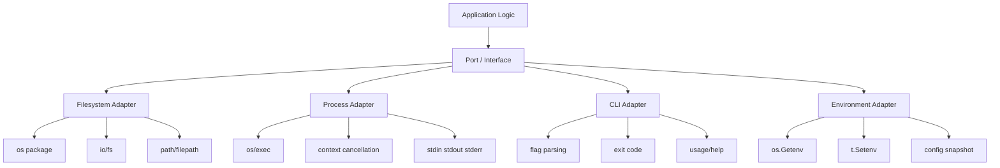
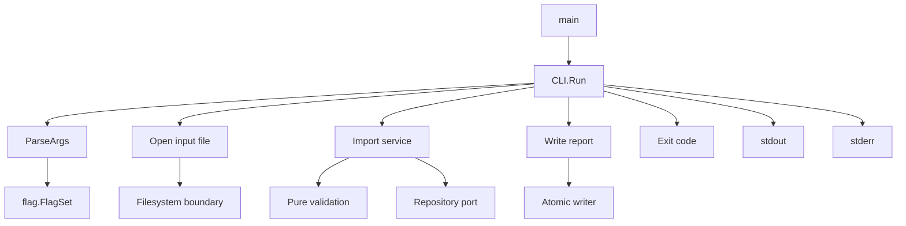
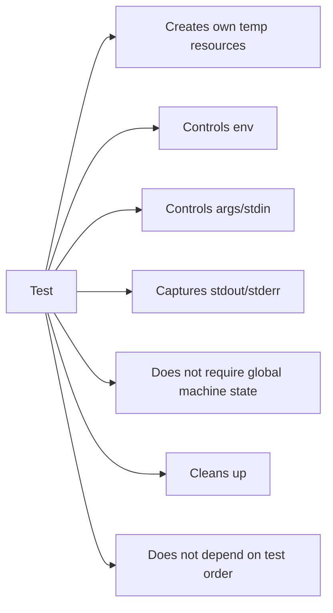

# learn-go-testing-benchmarking-performance-engineering-part-013.md

# Part 013 — Filesystem, Process, CLI & OS Boundary Testing

> Seri: **Go Testing, Benchmarking, Performance Engineering**  
> Target pembaca: **Java software engineer / tech lead** yang ingin naik ke level engineering handbook internal skala besar  
> Target Go: **Go 1.26.x**  
> Fokus part ini: bagaimana menguji boundary sistem operasi: filesystem, path, process, CLI, stdout/stderr, exit code, signal, file permission, dan portabilitas Windows/Linux.

---

## 0. Posisi Part Ini dalam Seri

Di part sebelumnya kita sudah membahas:

- test execution model,
- test taxonomy,
- testable design,
- `testing` package,
- assertion strategy,
- table-driven tests,
- subtests/parallel/shuffle,
- golden tests,
- error/panic/timeout/cancellation,
- deterministic testing,
- test doubles,
- HTTP/handler/client boundary testing.

Part ini melanjutkan pola yang sama, tetapi boundary-nya berpindah ke **OS-level interaction**.

Dalam sistem production, banyak bug tidak muncul di pure unit test karena kode diam-diam bergantung pada:

- current working directory,
- path separator,
- line ending,
- file permission,
- symlink behavior,
- executable lookup,
- environment variable,
- stdout/stderr,
- process exit,
- process cancellation,
- signal,
- temporary directory,
- filesystem case sensitivity,
- Windows vs Linux semantics.

Sebagai Java engineer, analoginya dekat dengan kombinasi:

- `java.nio.file.Files`,
- `Path`,
- `ProcessBuilder`,
- `System.getenv`,
- `System.out/System.err`,
- `System.exit`,
- JUnit temporary folder/temporary directory,
- test harness untuk CLI tools.

Tetapi di Go, praktik idiomatiknya lebih direct, lebih explicit, dan cenderung menghindari framework besar.

---

## 1. Core Thesis

Testing OS boundary bukan berarti semua test harus menyentuh OS nyata.

Mental model yang lebih tepat:

```text
Pure logic should be tested without OS.
OS adapter should be tested with controlled OS resources.
CLI/process behavior should be tested through a harness, not by killing the test runner.
Cross-platform behavior must be encoded as contract, not assumed from one developer machine.
```

Atau versi lebih pendek:

> Jangan membuat business logic tergantung filesystem/process. Buat boundary kecil, lalu uji boundary itu dengan resource yang deterministic.

---

## 2. Boundary Map



Boundary yang baik memiliki karakteristik:

1. kecil,
2. eksplisit,
3. bisa diganti fake,
4. punya error contract,
5. tidak menyebarkan global state,
6. tidak membuat test suite bergantung pada mesin tertentu.

---

## 3. Official Building Blocks yang Perlu Dikuasai

Part ini terutama memakai package Go berikut:

| Package | Fungsi utama untuk testing |
|---|---|
| `testing` | `t.TempDir`, `t.Cleanup`, `t.Setenv`, subtest, helper |
| `os` | file, directory, env, process args, exit, stat, permission |
| `io` | stream abstraction, reader/writer capture |
| `io/fs` | filesystem abstraction read-only |
| `testing/fstest` | in-memory filesystem test helper, `MapFS`, `TestFS` |
| `path/filepath` | OS-specific path handling |
| `path` | slash-separated path, biasanya untuk URL/embed/fs-style path |
| `os/exec` | menjalankan external command |
| `context` | process cancellation, timeout |
| `flag` | command-line flag parsing |
| `bytes` | stdout/stderr capture |
| `errors` | error classification |

Catatan penting:

- `os` menyediakan interface platform-independent untuk operasi OS, tetapi behavior detail tetap bisa berbeda antar platform.
- `io/fs` menyediakan abstraction filesystem berbasis slash-separated paths.
- `testing/fstest.MapFS` bagus untuk menguji kode yang menerima `fs.FS`.
- `os/exec` menjalankan command tanpa otomatis melalui shell; glob, pipe, redirect, dan shell expansion tidak terjadi kecuali kita sendiri menjalankan shell.

---

## 4. Design Rule: Separate Core Logic from OS Effects

### 4.1 Contoh buruk

```go
func LoadPolicy() (*Policy, error) {
    b, err := os.ReadFile("config/policy.json")
    if err != nil {
        return nil, err
    }
    return parsePolicy(b)
}
```

Masalah:

- path hardcoded,
- tergantung working directory,
- tidak bisa pakai `fstest.MapFS`,
- sulit menguji missing file, invalid content, permission error secara deterministic,
- business logic dan filesystem IO tercampur.

### 4.2 Contoh lebih baik

```go
func ParsePolicy(r io.Reader) (*Policy, error) {
    var p Policy
    dec := json.NewDecoder(r)
    dec.DisallowUnknownFields()
    if err := dec.Decode(&p); err != nil {
        return nil, fmt.Errorf("parse policy: %w", err)
    }
    return &p, nil
}

func LoadPolicyFS(fsys fs.FS, name string) (*Policy, error) {
    f, err := fsys.Open(name)
    if err != nil {
        return nil, fmt.Errorf("open policy %q: %w", name, err)
    }
    defer f.Close()
    return ParsePolicy(f)
}
```

Test core logic bisa memakai `strings.NewReader`. Test filesystem behavior bisa memakai `fstest.MapFS` atau `t.TempDir`.

---

## 5. Choosing the Right Filesystem Test Strategy

Tidak semua filesystem test harus memakai filesystem nyata.

| Tujuan test | Strategi disarankan |
|---|---|
| Parsing content | `strings.NewReader`, `bytes.Reader` |
| Membaca file dari abstraction | `fstest.MapFS` |
| Validasi implementation `fs.FS` | `fstest.TestFS` |
| Membuat/menulis/menghapus file nyata | `t.TempDir` |
| Permission, symlink, rename, lock | `t.TempDir` + platform guard |
| Path portability | table-driven test + `filepath` |
| Embedded file-like behavior | `embed.FS` atau `fstest.MapFS` |
| Directory traversal protection | `fs.ValidPath`, `filepath.Clean`, explicit validation |

---

## 6. `t.TempDir`: Default untuk File Test yang Menulis

`t.TempDir()` membuat temporary directory unik untuk test dan otomatis dibersihkan saat test selesai.

```go
func TestWriteReport(t *testing.T) {
    dir := t.TempDir()
    path := filepath.Join(dir, "report.txt")

    err := WriteReport(path, Report{ID: "R-001"})
    if err != nil {
        t.Fatalf("WriteReport() error = %v", err)
    }

    got, err := os.ReadFile(path)
    if err != nil {
        t.Fatalf("ReadFile(%q) error = %v", path, err)
    }

    if !bytes.Contains(got, []byte("R-001")) {
        t.Fatalf("report does not contain ID: %q", got)
    }
}
```

Kenapa ini lebih baik daripada `/tmp/my-test`?

- tidak collision antar test,
- aman untuk parallel tests,
- otomatis cleanup,
- tidak tergantung state developer machine,
- tidak meninggalkan artifact kalau test gagal normal.

### 6.1 Anti-pattern: shared temp path

```go
const tmp = "/tmp/myapp-test"
```

Ini buruk karena:

- Windows mungkin tidak punya `/tmp`,
- test parallel bisa tabrakan,
- leftover dari run sebelumnya bisa memalsukan hasil,
- CI agent shared bisa tercemar.

Gunakan `t.TempDir` hampir selalu.

---

## 7. `fstest.MapFS`: Untuk Kode yang Menerima `fs.FS`

Jika kode hanya perlu membaca file, `fs.FS` sering lebih baik daripada path string.

```go
func LoadTemplates(fsys fs.FS) (map[string]string, error) {
    entries, err := fs.ReadDir(fsys, "templates")
    if err != nil {
        return nil, fmt.Errorf("read templates dir: %w", err)
    }

    out := make(map[string]string, len(entries))
    for _, entry := range entries {
        if entry.IsDir() {
            continue
        }
        name := path.Join("templates", entry.Name())
        b, err := fs.ReadFile(fsys, name)
        if err != nil {
            return nil, fmt.Errorf("read template %q: %w", name, err)
        }
        out[entry.Name()] = string(b)
    }
    return out, nil
}
```

Test:

```go
func TestLoadTemplates(t *testing.T) {
    fsys := fstest.MapFS{
        "templates/open.txt":  {Data: []byte("open {{.ID}}")},
        "templates/close.txt": {Data: []byte("close {{.ID}}")},
    }

    got, err := LoadTemplates(fsys)
    if err != nil {
        t.Fatalf("LoadTemplates() error = %v", err)
    }

    if got["open.txt"] != "open {{.ID}}" {
        t.Fatalf("open template = %q", got["open.txt"])
    }
}
```

### 7.1 `io/fs` uses slash path, not OS path

`fs.FS` path convention menggunakan `/`, bukan `\` di Windows.

Untuk `fs.FS`, gunakan package `path`, bukan `path/filepath`.

```go
name := path.Join("templates", entry.Name()) // correct for fs.FS
```

Untuk OS path, gunakan `filepath`.

```go
name := filepath.Join(dir, "templates", entry.Name()) // correct for host OS
```

Ini salah satu sumber bug lintas platform yang sering muncul saat developer hanya test di Linux atau Mac.

---

## 8. `fstest.TestFS`: Contract Test untuk Filesystem Implementation

Kalau kita membuat custom implementation `fs.FS`, gunakan `fstest.TestFS`.

```go
func TestEmbeddedFSContract(t *testing.T) {
    fsys := fstest.MapFS{
        "a.txt":          {Data: []byte("A")},
        "dir/b.txt":      {Data: []byte("B")},
        "dir/nested/c.md": {Data: []byte("C")},
    }

    if err := fstest.TestFS(fsys, "a.txt", "dir/b.txt", "dir/nested/c.md"); err != nil {
        t.Fatalf("filesystem contract failed: %v", err)
    }
}
```

Contract test semacam ini bukan menguji business behavior. Ia menguji bahwa filesystem abstraction mematuhi ekspektasi `fs.FS`.

---

## 9. Testing File Write Behavior

Untuk write path, `fstest.MapFS` tidak cukup karena `fs.FS` pada standard library adalah read-oriented abstraction.

Gunakan `t.TempDir`.

```go
func SaveAtomic(path string, data []byte) error {
    dir := filepath.Dir(path)
    tmp, err := os.CreateTemp(dir, ".tmp-*")
    if err != nil {
        return fmt.Errorf("create temp file: %w", err)
    }
    tmpName := tmp.Name()

    cleanup := true
    defer func() {
        if cleanup {
            _ = os.Remove(tmpName)
        }
    }()

    if _, err := tmp.Write(data); err != nil {
        _ = tmp.Close()
        return fmt.Errorf("write temp file: %w", err)
    }
    if err := tmp.Close(); err != nil {
        return fmt.Errorf("close temp file: %w", err)
    }
    if err := os.Rename(tmpName, path); err != nil {
        return fmt.Errorf("rename temp file: %w", err)
    }
    cleanup = false
    return nil
}
```

Test success path:

```go
func TestSaveAtomicWritesFile(t *testing.T) {
    dir := t.TempDir()
    target := filepath.Join(dir, "out.txt")

    if err := SaveAtomic(target, []byte("hello")); err != nil {
        t.Fatalf("SaveAtomic() error = %v", err)
    }

    got, err := os.ReadFile(target)
    if err != nil {
        t.Fatalf("ReadFile() error = %v", err)
    }
    if string(got) != "hello" {
        t.Fatalf("file content = %q, want %q", got, "hello")
    }
}
```

Test overwrite behavior:

```go
func TestSaveAtomicOverwritesExistingFile(t *testing.T) {
    dir := t.TempDir()
    target := filepath.Join(dir, "out.txt")

    if err := os.WriteFile(target, []byte("old"), 0o644); err != nil {
        t.Fatalf("setup WriteFile() error = %v", err)
    }

    if err := SaveAtomic(target, []byte("new")); err != nil {
        t.Fatalf("SaveAtomic() error = %v", err)
    }

    got, err := os.ReadFile(target)
    if err != nil {
        t.Fatalf("ReadFile() error = %v", err)
    }
    if string(got) != "new" {
        t.Fatalf("file content = %q, want %q", got, "new")
    }
}
```

---

## 10. File Permission Testing

Permission test sulit dibuat portable.

Contoh:

- Unix permission bits punya semantics tertentu.
- Windows ACL berbeda.
- test yang berjalan sebagai admin/root bisa melewati beberapa restriction.
- CI container bisa punya behavior berbeda.

Rule:

> Test permission semantics hanya jika memang boundary itu penting, dan beri platform guard.

```go
func TestSaveAtomicPermissionDenied(t *testing.T) {
    if runtime.GOOS == "windows" {
        t.Skip("permission bit semantics differ on Windows")
    }

    dir := t.TempDir()
    readonly := filepath.Join(dir, "readonly")
    if err := os.Mkdir(readonly, 0o555); err != nil {
        t.Fatalf("Mkdir() error = %v", err)
    }

    t.Cleanup(func() {
        _ = os.Chmod(readonly, 0o755)
    })

    err := SaveAtomic(filepath.Join(readonly, "out.txt"), []byte("x"))
    if err == nil {
        t.Fatal("SaveAtomic() error = nil, want permission error")
    }
}
```

### 10.1 Jangan assert error string OS mentah

Buruk:

```go
if err.Error() != "permission denied" { ... }
```

Lebih baik:

```go
if !errors.Is(err, os.ErrPermission) {
    t.Fatalf("error = %v, want os.ErrPermission", err)
}
```

Tetapi bahkan `errors.Is(err, os.ErrPermission)` tidak selalu cukup jika error sudah dibungkus oleh operasi lain. Pastikan wrapping memakai `%w`.

---

## 11. Path Testing: `path` vs `filepath`

Salah satu perbedaan penting:

- `path`: slash-separated path, cocok untuk URL-like path dan `io/fs` path.
- `path/filepath`: OS-specific path, cocok untuk host filesystem.

### 11.1 Test path normalization

```go
func SafeJoin(base, rel string) (string, error) {
    if rel == "" {
        return "", errors.New("empty path")
    }
    if filepath.IsAbs(rel) {
        return "", fmt.Errorf("absolute path not allowed: %q", rel)
    }

    cleaned := filepath.Clean(rel)
    if cleaned == "." || strings.HasPrefix(cleaned, ".."+string(os.PathSeparator)) || cleaned == ".." {
        return "", fmt.Errorf("path escapes base: %q", rel)
    }
    return filepath.Join(base, cleaned), nil
}
```

Test:

```go
func TestSafeJoin(t *testing.T) {
    base := filepath.Join("root", "data")

    tests := []struct {
        name    string
        rel     string
        wantErr bool
    }{
        {name: "normal", rel: "case/a.txt"},
        {name: "empty", rel: "", wantErr: true},
        {name: "parent", rel: "../secret.txt", wantErr: true},
        {name: "nested parent", rel: "case/../../secret.txt", wantErr: true},
        {name: "current dir", rel: "./case/a.txt"},
    }

    for _, tc := range tests {
        t.Run(tc.name, func(t *testing.T) {
            got, err := SafeJoin(base, tc.rel)
            if tc.wantErr {
                if err == nil {
                    t.Fatalf("SafeJoin(%q) error = nil, want error", tc.rel)
                }
                return
            }
            if err != nil {
                t.Fatalf("SafeJoin(%q) error = %v", tc.rel, err)
            }
            if !strings.HasPrefix(got, base) {
                t.Fatalf("SafeJoin(%q) = %q, want under %q", tc.rel, got, base)
            }
        })
    }
}
```

### 11.2 Security note

Path traversal protection tidak cukup hanya dengan `Clean` dan prefix string check jika ada symlink, case-insensitive filesystem, mount boundary, atau Windows drive/UNC path. Untuk security-critical file access, desain boundary harus lebih ketat.

Part ini memberi dasar testing, bukan menggantikan threat modeling dari seri security.

---

## 12. Line Ending and Encoding Issues

Windows sering memakai CRLF, Unix memakai LF.

Golden test atau CLI test yang membandingkan output raw bisa gagal lintas platform.

Solusi:

```go
func normalizeNewlines(s string) string {
    return strings.ReplaceAll(s, "\r\n", "\n")
}
```

Test:

```go
if normalizeNewlines(got) != normalizeNewlines(want) {
    t.Fatalf("output mismatch\ngot:\n%s\nwant:\n%s", got, want)
}
```

Tetapi jangan normalisasi sembarangan jika CRLF adalah bagian dari contract, misalnya protocol tertentu.

---

## 13. Current Working Directory

`go test` menjalankan test dengan working directory package yang sedang diuji, bukan root repo universal yang selalu sama untuk semua package.

Masalah umum:

```go
os.ReadFile("../../config/dev.json")
```

Ini rapuh karena:

- tergantung lokasi package,
- berubah saat refactor,
- tidak cocok untuk test package berbeda,
- bisa gagal di CI.

### 13.1 Lebih baik: inject path or FS

```go
func NewConfigLoader(fsys fs.FS, base string) *ConfigLoader {
    return &ConfigLoader{fsys: fsys, base: base}
}
```

### 13.2 Kalau perlu chdir

Gunakan helper dengan cleanup.

```go
func chdir(t *testing.T, dir string) {
    t.Helper()

    old, err := os.Getwd()
    if err != nil {
        t.Fatalf("Getwd() error = %v", err)
    }
    if err := os.Chdir(dir); err != nil {
        t.Fatalf("Chdir(%q) error = %v", dir, err)
    }
    t.Cleanup(func() {
        if err := os.Chdir(old); err != nil {
            t.Fatalf("restore working dir %q: %v", old, err)
        }
    })
}
```

Jangan jalankan test yang mengubah working directory dengan `t.Parallel`, karena working directory adalah process-global state.

---

## 14. Environment Variables

Gunakan `t.Setenv`.

```go
func TestLoadConfigFromEnv(t *testing.T) {
    t.Setenv("APP_MODE", "test")
    t.Setenv("APP_TIMEOUT", "5s")

    cfg, err := LoadConfigFromEnv()
    if err != nil {
        t.Fatalf("LoadConfigFromEnv() error = %v", err)
    }
    if cfg.Mode != "test" {
        t.Fatalf("Mode = %q, want %q", cfg.Mode, "test")
    }
}
```

`t.Setenv` otomatis restore environment variable setelah test.

### 14.1 Jangan memakai env langsung di deep logic

Buruk:

```go
func CalculateDeadline() time.Duration {
    v := os.Getenv("APP_TIMEOUT")
    d, _ := time.ParseDuration(v)
    return d
}
```

Lebih baik:

```go
type Config struct {
    Timeout time.Duration
}

func CalculateDeadline(cfg Config) time.Duration {
    return cfg.Timeout
}
```

Env dibaca di boundary config loader, bukan di business logic.

---

## 15. CLI Testing: Design for Testability

CLI yang testable biasanya punya bentuk seperti ini:

```go
type CLI struct {
    Stdout io.Writer
    Stderr io.Writer
    Stdin  io.Reader
    Env    map[string]string
}

func (c CLI) Run(ctx context.Context, args []string) int {
    // return exit code, do not call os.Exit here
    return 0
}
```

`main` hanya adapter tipis:

```go
func main() {
    cli := CLI{
        Stdout: os.Stdout,
        Stderr: os.Stderr,
        Stdin:  os.Stdin,
        Env:    snapshotEnv(),
    }
    code := cli.Run(context.Background(), os.Args[1:])
    os.Exit(code)
}
```

Ini sangat penting:

> Jangan panggil `os.Exit` dari fungsi yang ingin dites langsung.

`os.Exit` akan menghentikan test process.

---

## 16. CLI Test Harness

```go
func TestCLI_Run(t *testing.T) {
    tests := []struct {
        name       string
        args       []string
        stdin      string
        wantCode   int
        wantStdout string
        wantStderr string
    }{
        {
            name:       "help",
            args:       []string{"--help"},
            wantCode:   0,
            wantStdout: "usage:",
        },
        {
            name:       "missing input",
            args:       nil,
            wantCode:   2,
            wantStderr: "missing input",
        },
    }

    for _, tc := range tests {
        t.Run(tc.name, func(t *testing.T) {
            var stdout bytes.Buffer
            var stderr bytes.Buffer

            cli := CLI{
                Stdout: &stdout,
                Stderr: &stderr,
                Stdin:  strings.NewReader(tc.stdin),
                Env:    map[string]string{"APP_MODE": "test"},
            }

            code := cli.Run(context.Background(), tc.args)

            if code != tc.wantCode {
                t.Fatalf("exit code = %d, want %d", code, tc.wantCode)
            }
            if !strings.Contains(stdout.String(), tc.wantStdout) {
                t.Fatalf("stdout = %q, want to contain %q", stdout.String(), tc.wantStdout)
            }
            if !strings.Contains(stderr.String(), tc.wantStderr) {
                t.Fatalf("stderr = %q, want to contain %q", stderr.String(), tc.wantStderr)
            }
        })
    }
}
```

### 16.1 Exit code convention

Go tidak memaksa exit code convention, tetapi internal standard biasanya:

| Code | Meaning |
|---:|---|
| 0 | success |
| 1 | runtime/application failure |
| 2 | usage/config/argument error |
| 124/125/etc | optional convention for timeout/infrastructure wrapper |

Yang penting bukan angkanya universal, tetapi contract-nya jelas dan diuji.

---

## 17. Testing `flag` Parsing

Jangan pakai global `flag.CommandLine` untuk logic yang dites.

Buruk:

```go
var input = flag.String("input", "", "input file")
```

Lebih baik buat `FlagSet` baru per run.

```go
type Options struct {
    Input string
    DryRun bool
}

func ParseArgs(args []string, stderr io.Writer) (Options, error) {
    fs := flag.NewFlagSet("case-tool", flag.ContinueOnError)
    fs.SetOutput(stderr)

    var opts Options
    fs.StringVar(&opts.Input, "input", "", "input file")
    fs.BoolVar(&opts.DryRun, "dry-run", false, "validate without writing")

    if err := fs.Parse(args); err != nil {
        return Options{}, err
    }
    if opts.Input == "" {
        return Options{}, errors.New("missing -input")
    }
    return opts, nil
}
```

Test:

```go
func TestParseArgs(t *testing.T) {
    tests := []struct {
        name    string
        args    []string
        want    Options
        wantErr bool
    }{
        {
            name: "valid",
            args: []string{"-input", "case.json", "-dry-run"},
            want: Options{Input: "case.json", DryRun: true},
        },
        {
            name:    "missing input",
            args:    []string{"-dry-run"},
            wantErr: true,
        },
        {
            name:    "unknown flag",
            args:    []string{"-unknown"},
            wantErr: true,
        },
    }

    for _, tc := range tests {
        t.Run(tc.name, func(t *testing.T) {
            var stderr bytes.Buffer
            got, err := ParseArgs(tc.args, &stderr)
            if tc.wantErr {
                if err == nil {
                    t.Fatal("ParseArgs() error = nil, want error")
                }
                return
            }
            if err != nil {
                t.Fatalf("ParseArgs() error = %v", err)
            }
            if got != tc.want {
                t.Fatalf("ParseArgs() = %+v, want %+v", got, tc.want)
            }
        })
    }
}
```

---

## 18. Testing `os.Exit`: Subprocess Pattern

Kadang kita perlu menguji `main` yang benar-benar memanggil `os.Exit`.

Karena `os.Exit` menghentikan process, test harus menjalankan subprocess.

Pattern:

```go
func TestMainExitCode(t *testing.T) {
    if os.Getenv("TEST_MAIN_EXIT") == "1" {
        os.Exit(runMain([]string{"--bad-flag"}))
    }

    cmd := exec.Command(os.Args[0], "-test.run=TestMainExitCode")
    cmd.Env = append(os.Environ(), "TEST_MAIN_EXIT=1")

    err := cmd.Run()
    if err == nil {
        t.Fatal("subprocess exit = 0, want non-zero")
    }

    var exitErr *exec.ExitError
    if !errors.As(err, &exitErr) {
        t.Fatalf("error = %T %[1]v, want *exec.ExitError", err)
    }

    if got := exitErr.ExitCode(); got != 2 {
        t.Fatalf("exit code = %d, want 2", got)
    }
}
```

### 18.1 Kapan subprocess pattern layak?

Gunakan hanya untuk:

- test `main` adapter,
- test fatal startup behavior,
- test exit code process nyata,
- test panic-to-exit wrapper.

Jangan gunakan subprocess untuk semua CLI test karena lebih lambat dan lebih rapuh.

---

## 19. Testing External Process Execution

`os/exec` package menjalankan executable eksternal.

Contoh production code yang kurang testable:

```go
func Convert(input string) error {
    cmd := exec.Command("convert", input, input+".png")
    return cmd.Run()
}
```

Masalah:

- test butuh binary `convert`,
- PATH tergantung mesin,
- output error sulit dikontrol,
- timeout tidak ada,
- stdout/stderr hilang.

### 19.1 Introduce command runner seam

```go
type CommandRunner interface {
    Run(ctx context.Context, name string, args ...string) (CommandResult, error)
}

type CommandResult struct {
    Stdout   []byte
    Stderr   []byte
    ExitCode int
}

type ExecRunner struct{}

func (ExecRunner) Run(ctx context.Context, name string, args ...string) (CommandResult, error) {
    cmd := exec.CommandContext(ctx, name, args...)

    var stdout bytes.Buffer
    var stderr bytes.Buffer
    cmd.Stdout = &stdout
    cmd.Stderr = &stderr

    err := cmd.Run()
    result := CommandResult{
        Stdout: stdout.Bytes(),
        Stderr: stderr.Bytes(),
    }

    if err != nil {
        var exitErr *exec.ExitError
        if errors.As(err, &exitErr) {
            result.ExitCode = exitErr.ExitCode()
        } else {
            result.ExitCode = -1
        }
        return result, err
    }

    result.ExitCode = 0
    return result, nil
}
```

Business logic test bisa memakai fake runner.

```go
type FakeRunner struct {
    Calls []FakeCall
    Result CommandResult
    Err error
}

type FakeCall struct {
    Name string
    Args []string
}

func (f *FakeRunner) Run(ctx context.Context, name string, args ...string) (CommandResult, error) {
    f.Calls = append(f.Calls, FakeCall{Name: name, Args: append([]string(nil), args...)})
    return f.Result, f.Err
}
```

---

## 20. Testing Process Timeout

Use `exec.CommandContext` in adapter, but test business behavior with fake runner.

```go
func Generate(ctx context.Context, runner CommandRunner, input string) error {
    result, err := runner.Run(ctx, "generator", "--input", input)
    if err != nil {
        return fmt.Errorf("run generator: %w; stderr=%q", err, result.Stderr)
    }
    return nil
}
```

Fake cancellation-aware runner:

```go
type BlockingRunner struct {
    Started chan struct{}
}

func (r BlockingRunner) Run(ctx context.Context, name string, args ...string) (CommandResult, error) {
    close(r.Started)
    <-ctx.Done()
    return CommandResult{ExitCode: -1}, ctx.Err()
}
```

Test:

```go
func TestGenerateContextCanceled(t *testing.T) {
    runner := BlockingRunner{Started: make(chan struct{})}
    ctx, cancel := context.WithCancel(context.Background())

    errCh := make(chan error, 1)
    go func() {
        errCh <- Generate(ctx, runner, "case.json")
    }()

    <-runner.Started
    cancel()

    err := <-errCh
    if !errors.Is(err, context.Canceled) {
        t.Fatalf("Generate() error = %v, want context.Canceled", err)
    }
}
```

Untuk adapter-level test `ExecRunner`, boleh gunakan helper subprocess ringan, tetapi jangan bergantung pada command eksternal non-standard.

---

## 21. Capturing Stdout/Stderr

Jangan capture `os.Stdout` global jika desain bisa menerima `io.Writer`.

Baik:

```go
func PrintSummary(w io.Writer, s Summary) error {
    _, err := fmt.Fprintf(w, "processed=%d failed=%d\n", s.Processed, s.Failed)
    return err
}
```

Test:

```go
func TestPrintSummary(t *testing.T) {
    var out bytes.Buffer

    err := PrintSummary(&out, Summary{Processed: 10, Failed: 2})
    if err != nil {
        t.Fatalf("PrintSummary() error = %v", err)
    }

    got := out.String()
    want := "processed=10 failed=2\n"
    if got != want {
        t.Fatalf("output = %q, want %q", got, want)
    }
}
```

### 21.1 Jika harus capture `os.Stdout`

Kadang legacy code menulis langsung ke `os.Stdout`. Capture dengan pipe, tetapi ini harus dihindari sebagai default.

```go
func captureStdout(t *testing.T, fn func()) string {
    t.Helper()

    old := os.Stdout
    r, w, err := os.Pipe()
    if err != nil {
        t.Fatalf("Pipe() error = %v", err)
    }
    os.Stdout = w

    t.Cleanup(func() {
        os.Stdout = old
    })

    fn()

    if err := w.Close(); err != nil {
        t.Fatalf("close pipe writer: %v", err)
    }
    var buf bytes.Buffer
    if _, err := io.Copy(&buf, r); err != nil {
        t.Fatalf("read captured stdout: %v", err)
    }
    return buf.String()
}
```

Jangan pakai helper ini di test parallel. `os.Stdout` adalah global process state.

---

## 22. Signal Testing

Signal testing lebih rapuh dan platform-dependent.

Jika aplikasi punya graceful shutdown, desain sebaiknya seperti ini:

```go
func Run(ctx context.Context, srv Server) error {
    return srv.Run(ctx)
}
```

Signal handling hanya di adapter:

```go
func main() {
    ctx, stop := signal.NotifyContext(context.Background(), os.Interrupt)
    defer stop()

    if err := Run(ctx, newServer()); err != nil {
        fmt.Fprintln(os.Stderr, err)
        os.Exit(1)
    }
}
```

Test `Run` dengan cancellation context, bukan dengan mengirim OS signal.

Jika tetap perlu test signal integration, gunakan subprocess pattern agar tidak mengganggu test runner.

---

## 23. File Locking and Concurrent File Tests

File locking berbeda antar OS dan library.

Untuk test concurrent write behavior:

- hindari shared global file,
- gunakan `t.TempDir`,
- gunakan unique filenames,
- gunakan explicit synchronization,
- jangan bergantung pada timing sleep.

Contoh test concurrency untuk writer yang harus serial:

```go
func TestAppendLogConcurrent(t *testing.T) {
    path := filepath.Join(t.TempDir(), "events.log")

    const n = 100
    var wg sync.WaitGroup
    errs := make(chan error, n)

    for i := 0; i < n; i++ {
        i := i
        wg.Add(1)
        go func() {
            defer wg.Done()
            errs <- AppendLog(path, fmt.Sprintf("event-%03d", i))
        }()
    }

    wg.Wait()
    close(errs)

    for err := range errs {
        if err != nil {
            t.Fatalf("AppendLog() error = %v", err)
        }
    }

    b, err := os.ReadFile(path)
    if err != nil {
        t.Fatalf("ReadFile() error = %v", err)
    }

    lines := strings.Split(strings.TrimSpace(string(b)), "\n")
    if len(lines) != n {
        t.Fatalf("line count = %d, want %d", len(lines), n)
    }
}
```

Ini menguji invariant jumlah output, bukan urutan, karena concurrency tidak menjamin ordering kecuali contract mengatakan demikian.

---

## 24. Symlink Testing

Symlink behavior bisa berbeda:

- Windows bisa butuh privilege/developer mode,
- CI security policy bisa melarang,
- path resolution semantics bisa tricky.

Jika symlink bukan behavior utama, hindari test symlink di PR gate.

Jika security-critical, buat explicit test dengan platform guard:

```go
func TestRejectSymlinkEscape(t *testing.T) {
    if runtime.GOOS == "windows" {
        t.Skip("symlink setup may require special privileges on Windows")
    }

    dir := t.TempDir()
    outside := filepath.Join(dir, "outside.txt")
    if err := os.WriteFile(outside, []byte("secret"), 0o644); err != nil {
        t.Fatalf("WriteFile() error = %v", err)
    }

    root := filepath.Join(dir, "root")
    if err := os.Mkdir(root, 0o755); err != nil {
        t.Fatalf("Mkdir() error = %v", err)
    }

    link := filepath.Join(root, "link.txt")
    if err := os.Symlink(outside, link); err != nil {
        t.Skipf("Symlink unsupported in this environment: %v", err)
    }

    err := ValidateNoSymlinkEscape(root, "link.txt")
    if err == nil {
        t.Fatal("ValidateNoSymlinkEscape() error = nil, want error")
    }
}
```

---

## 25. OS-Specific Tests with Build Tags

Untuk behavior yang benar-benar berbeda antar OS, gunakan file suffix atau build tags.

```text
file_unix_test.go
file_windows_test.go
```

Contoh:

```go
//go:build unix

package mypkg
```

Atau:

```go
//go:build windows

package mypkg
```

Gunakan build tags jika:

- behavior OS memang berbeda,
- test perlu syscall/permission khusus,
- expected output berbeda secara sah.

Jangan gunakan build tags untuk menyembunyikan test yang sebenarnya flaky.

---

## 26. Testing Binary Lookup and PATH

Jika kode mencari executable lewat `exec.LookPath`, test harus mengontrol PATH.

```go
func FindTool(name string) (string, error) {
    p, err := exec.LookPath(name)
    if err != nil {
        return "", fmt.Errorf("find tool %q: %w", name, err)
    }
    return p, nil
}
```

Test dengan temporary directory:

```go
func TestFindTool(t *testing.T) {
    dir := t.TempDir()
    exe := filepath.Join(dir, executableName("tool"))

    if err := os.WriteFile(exe, []byte("#!/bin/sh\nexit 0\n"), 0o755); err != nil {
        t.Fatalf("WriteFile() error = %v", err)
    }

    t.Setenv("PATH", dir)

    got, err := FindTool("tool")
    if err != nil {
        t.Fatalf("FindTool() error = %v", err)
    }
    if got == "" {
        t.Fatal("FindTool() returned empty path")
    }
}

func executableName(name string) string {
    if runtime.GOOS == "windows" {
        return name + ".bat"
    }
    return name
}
```

Namun menjalankan script lintas OS lebih tricky. Untuk lookup test, cukup pastikan file executable bisa ditemukan. Untuk running behavior, gunakan subprocess Go test binary atau fake runner.

---

## 27. Subprocess Test Helper Using Current Test Binary

Untuk membuat subprocess portable, kita bisa memanggil test binary yang sama dengan env khusus.

```go
func helperCommand(t *testing.T, name string, args ...string) *exec.Cmd {
    t.Helper()

    cs := []string{"-test.run=TestHelperProcess", "--", name}
    cs = append(cs, args...)
    cmd := exec.Command(os.Args[0], cs...)
    cmd.Env = append(os.Environ(), "GO_WANT_HELPER_PROCESS=1")
    return cmd
}

func TestHelperProcess(t *testing.T) {
    if os.Getenv("GO_WANT_HELPER_PROCESS") != "1" {
        return
    }

    args := os.Args
    for len(args) > 0 && args[0] != "--" {
        args = args[1:]
    }
    if len(args) == 0 {
        os.Exit(2)
    }
    args = args[1:]

    switch args[0] {
    case "success":
        fmt.Fprintln(os.Stdout, "ok")
        os.Exit(0)
    case "failure":
        fmt.Fprintln(os.Stderr, "failed")
        os.Exit(7)
    default:
        fmt.Fprintln(os.Stderr, "unknown helper command")
        os.Exit(2)
    }
}
```

Test:

```go
func TestExecRunnerCapturesExitCode(t *testing.T) {
    cmd := helperCommand(t, "failure")

    var stdout bytes.Buffer
    var stderr bytes.Buffer
    cmd.Stdout = &stdout
    cmd.Stderr = &stderr

    err := cmd.Run()
    if err == nil {
        t.Fatal("cmd.Run() error = nil, want exit error")
    }

    var exitErr *exec.ExitError
    if !errors.As(err, &exitErr) {
        t.Fatalf("error = %T %[1]v, want *exec.ExitError", err)
    }
    if exitErr.ExitCode() != 7 {
        t.Fatalf("exit code = %d, want 7", exitErr.ExitCode())
    }
    if !strings.Contains(stderr.String(), "failed") {
        t.Fatalf("stderr = %q, want failed", stderr.String())
    }
}
```

Pattern ini umum, tetapi harus dipakai secukupnya karena subprocess test lebih lambat.

---

## 28. Testing Working with Stdin

Untuk CLI atau processor yang membaca stdin, terima `io.Reader`.

```go
func ReadIDs(r io.Reader) ([]string, error) {
    scanner := bufio.NewScanner(r)
    var ids []string
    for scanner.Scan() {
        s := strings.TrimSpace(scanner.Text())
        if s == "" {
            continue
        }
        ids = append(ids, s)
    }
    if err := scanner.Err(); err != nil {
        return nil, fmt.Errorf("read IDs: %w", err)
    }
    return ids, nil
}
```

Test:

```go
func TestReadIDs(t *testing.T) {
    got, err := ReadIDs(strings.NewReader("A-1\n\nB-2\n"))
    if err != nil {
        t.Fatalf("ReadIDs() error = %v", err)
    }

    want := []string{"A-1", "B-2"}
    if !slices.Equal(got, want) {
        t.Fatalf("ReadIDs() = %#v, want %#v", got, want)
    }
}
```

Untuk scanner token limit, buat test eksplisit jika input bisa panjang. `bufio.Scanner` punya default token size limit, jadi untuk file besar mungkin `bufio.Reader` lebih sesuai.

---

## 29. Large File Testing Without Large Repository Files

Jangan commit file 2GB hanya untuk test.

Strategi:

1. generate file di `t.TempDir`,
2. gunakan sparse file bila relevan,
3. gunakan synthetic reader,
4. gunakan small fixture untuk format correctness,
5. gunakan benchmark/load test terpisah untuk volume.

Contoh synthetic reader:

```go
type repeatedReader struct {
    remaining int64
    b byte
}

func (r *repeatedReader) Read(p []byte) (int, error) {
    if r.remaining <= 0 {
        return 0, io.EOF
    }
    if int64(len(p)) > r.remaining {
        p = p[:r.remaining]
    }
    for i := range p {
        p[i] = r.b
    }
    r.remaining -= int64(len(p))
    return len(p), nil
}
```

Test logic bisa memakai reader ini tanpa membuat file besar.

---

## 30. Case Sensitivity

Filesystem case sensitivity berbeda:

- Linux biasanya case-sensitive,
- Windows biasanya case-insensitive,
- macOS sering case-insensitive by default tetapi bisa configured berbeda.

Jangan membuat test yang mengasumsikan `A.txt` dan `a.txt` selalu berbeda kecuali platform-specific.

Untuk domain yang butuh case-insensitive behavior, encode di logic sendiri:

```go
func NormalizeFileKey(name string) string {
    return strings.ToLower(filepath.ToSlash(filepath.Clean(name)))
}
```

Test behavior domain, bukan behavior filesystem lokal.

---

## 31. File Ordering

Directory listing order tidak boleh diasumsikan kecuali documented oleh fungsi tertentu.

Jika logic butuh deterministic order, sort sendiri.

```go
func ListNames(fsys fs.FS, dir string) ([]string, error) {
    entries, err := fs.ReadDir(fsys, dir)
    if err != nil {
        return nil, err
    }
    names := make([]string, 0, len(entries))
    for _, e := range entries {
        names = append(names, e.Name())
    }
    sort.Strings(names)
    return names, nil
}
```

Test jangan hanya kebetulan pass karena `MapFS` memberi order tertentu.

---

## 32. Testing Cleanup Semantics

Jika fungsi membuat temporary file dan harus cleanup saat error, test itu secara eksplisit.

```go
func TestSaveAtomicCleansTempFileOnError(t *testing.T) {
    if runtime.GOOS == "windows" {
        t.Skip("permission behavior differs on Windows")
    }

    dir := t.TempDir()
    target := filepath.Join(dir, "out.txt")

    // Example assumes SaveAtomic has injectable failure point in real code.
    err := saveAtomicWithInjectedFailure(target, []byte("x"), errors.New("boom"))
    if err == nil {
        t.Fatal("error = nil, want error")
    }

    entries, err := os.ReadDir(dir)
    if err != nil {
        t.Fatalf("ReadDir() error = %v", err)
    }
    for _, e := range entries {
        if strings.HasPrefix(e.Name(), ".tmp-") {
            t.Fatalf("temporary file was not cleaned up: %s", e.Name())
        }
    }
}
```

Jika production code tidak bisa diinjeksi failure, itu sinyal bahwa boundary terlalu tertutup untuk diuji.

---

## 33. Regulatory Case Example: CLI Importer

Bayangkan kita punya CLI untuk import enforcement case file:

```text
case-import \
  -input cases.jsonl \
  -mode validate-only \
  -report report.json
```

Expected behavior:

1. kalau input missing → exit 2, stderr jelas,
2. kalau file tidak ada → exit 1, stderr mengandung path aman,
3. kalau JSON invalid → exit 1, report berisi invalid row,
4. kalau validate-only → tidak menulis DB,
5. kalau report path tidak writable → exit 1,
6. stdout berisi summary singkat,
7. stderr berisi diagnostic,
8. output deterministic untuk golden review,
9. path traversal report ditolak,
10. behavior sama di Windows/Linux.

### 33.1 Architecture



### 33.2 Test portfolio

| Behavior | Test type | Tool |
|---|---|---|
| parse args | unit | `flag.NewFlagSet`, table test |
| validate JSON row | unit/property | `strings.Reader` |
| read input file | component | `t.TempDir` |
| report write | component | `t.TempDir` |
| invalid path | unit/component | `filepath`, table test |
| stdout/stderr | CLI harness | `bytes.Buffer` |
| exit code | CLI harness/subprocess only for `main` | `os/exec` |
| permission denied | platform-specific | `runtime.GOOS`, `os.Chmod` |
| large input | benchmark/scenario | generated reader/file |

---

## 34. Full Example: Testable CLI Skeleton

### 34.1 Production code skeleton

```go
type ImportCLI struct {
    Stdout io.Writer
    Stderr io.Writer
    Stdin  io.Reader
    FSRoot string
    Service ImportService
}

type ImportService interface {
    Import(ctx context.Context, r io.Reader, mode string) (ImportSummary, error)
}

type ImportSummary struct {
    Processed int
    Failed    int
}

func (c ImportCLI) Run(ctx context.Context, args []string) int {
    opts, err := ParseImportArgs(args, c.Stderr)
    if err != nil {
        fmt.Fprintf(c.Stderr, "argument error: %v\n", err)
        return 2
    }

    inputPath, err := SafeJoin(c.FSRoot, opts.Input)
    if err != nil {
        fmt.Fprintf(c.Stderr, "invalid input path: %v\n", err)
        return 2
    }

    f, err := os.Open(inputPath)
    if err != nil {
        fmt.Fprintf(c.Stderr, "open input: %v\n", err)
        return 1
    }
    defer f.Close()

    summary, err := c.Service.Import(ctx, f, opts.Mode)
    if err != nil {
        fmt.Fprintf(c.Stderr, "import failed: %v\n", err)
        return 1
    }

    fmt.Fprintf(c.Stdout, "processed=%d failed=%d\n", summary.Processed, summary.Failed)
    return 0
}
```

### 34.2 Fake service

```go
type FakeImportService struct {
    Summary ImportSummary
    Err     error
    Input   string
    Mode    string
}

func (f *FakeImportService) Import(ctx context.Context, r io.Reader, mode string) (ImportSummary, error) {
    b, err := io.ReadAll(r)
    if err != nil {
        return ImportSummary{}, err
    }
    f.Input = string(b)
    f.Mode = mode
    return f.Summary, f.Err
}
```

### 34.3 CLI test

```go
func TestImportCLI_RunSuccess(t *testing.T) {
    root := t.TempDir()
    if err := os.WriteFile(filepath.Join(root, "cases.jsonl"), []byte("{\"id\":\"C-1\"}\n"), 0o644); err != nil {
        t.Fatalf("WriteFile() error = %v", err)
    }

    svc := &FakeImportService{
        Summary: ImportSummary{Processed: 1, Failed: 0},
    }

    var stdout bytes.Buffer
    var stderr bytes.Buffer

    cli := ImportCLI{
        Stdout:  &stdout,
        Stderr:  &stderr,
        FSRoot:  root,
        Service: svc,
    }

    code := cli.Run(context.Background(), []string{"-input", "cases.jsonl", "-mode", "validate-only"})
    if code != 0 {
        t.Fatalf("exit code = %d, want 0; stderr=%q", code, stderr.String())
    }
    if got := stdout.String(); got != "processed=1 failed=0\n" {
        t.Fatalf("stdout = %q", got)
    }
    if svc.Mode != "validate-only" {
        t.Fatalf("service mode = %q", svc.Mode)
    }
    if !strings.Contains(svc.Input, "C-1") {
        t.Fatalf("service input = %q, want case id", svc.Input)
    }
}
```

---

## 35. Testing OS Errors Without Depending on OS

Kadang kita ingin menguji mapping error:

```go
func ToUserMessage(err error) string {
    switch {
    case errors.Is(err, os.ErrNotExist):
        return "file not found"
    case errors.Is(err, os.ErrPermission):
        return "permission denied"
    default:
        return "operation failed"
    }
}
```

Tidak perlu membuat file permission error nyata.

```go
func TestToUserMessage(t *testing.T) {
    tests := []struct {
        name string
        err  error
        want string
    }{
        {name: "not exist", err: fmt.Errorf("open: %w", os.ErrNotExist), want: "file not found"},
        {name: "permission", err: fmt.Errorf("open: %w", os.ErrPermission), want: "permission denied"},
        {name: "other", err: errors.New("boom"), want: "operation failed"},
    }

    for _, tc := range tests {
        t.Run(tc.name, func(t *testing.T) {
            got := ToUserMessage(tc.err)
            if got != tc.want {
                t.Fatalf("ToUserMessage() = %q, want %q", got, tc.want)
            }
        })
    }
}
```

Ini lebih deterministic daripada mencoba memaksa OS menghasilkan error tertentu.

---

## 36. Hermetic Test Principles

Test boundary OS yang baik mendekati hermetic:



Checklist hermetic:

- Tidak bergantung pada file di home directory.
- Tidak bergantung pada current user tertentu.
- Tidak bergantung pada PATH kecuali diset test.
- Tidak bergantung pada timezone kecuali diset test.
- Tidak bergantung pada locale.
- Tidak bergantung pada working directory global.
- Tidak memakai fixed port/file path.
- Tidak meninggalkan process berjalan.
- Tidak mengubah env tanpa restore.
- Tidak mengubah stdout/stderr global di parallel test.

---

## 37. Common Anti-Patterns

### 37.1 Calling `os.Exit` from deep logic

Buruk:

```go
func ValidateConfig(cfg Config) {
    if cfg.Input == "" {
        fmt.Fprintln(os.Stderr, "missing input")
        os.Exit(2)
    }
}
```

Lebih baik return error dan map ke exit code di CLI boundary.

### 37.2 Hardcoded absolute path

Buruk:

```go
os.ReadFile("/var/app/config.json")
```

Kecuali memang adapter production. Untuk testable design, path harus berasal dari config.

### 37.3 Shell command string

Buruk:

```go
exec.Command("sh", "-c", "cat " + filename)
```

Masalah:

- injection risk,
- Windows incompatibility,
- quoting/escaping sulit,
- test rapuh.

Lebih baik gunakan args explicit:

```go
exec.CommandContext(ctx, "cat", filename)
```

Atau lebih baik lagi, jangan shell out jika Go bisa melakukan langsung.

### 37.4 Testing external binary in unit test

Buruk:

```go
exec.Command("docker", "ps").Run()
```

Ini integration/system test, bukan unit test. Beri build tag atau masuk pipeline terpisah.

### 37.5 Comparing raw CLI output terlalu strict

Jika output human-facing, mungkin cukup assert semantic fragments. Jika output machine-facing, gunakan canonical JSON/structured output dan golden test.

---

## 38. Performance Considerations for OS Boundary Tests

OS boundary tests lebih lambat daripada pure unit tests.

Relative cost:

```text
pure function < fs.MapFS < t.TempDir file IO < subprocess < external service/container
```

Prinsip:

- Banyak pure tests.
- Cukup component OS tests untuk boundary behavior.
- Sedikit subprocess tests untuk `main`/exit code.
- External binary/container tests dipisah sebagai integration/system tests.

Jangan menjalankan ribuan subprocess tests di PR gate kecuali memang diperlukan.

---

## 39. CI Matrix Strategy

Untuk OS boundary code, Linux-only CI tidak cukup jika produk mendukung Windows atau developer banyak memakai Windows.

Minimum matrix untuk library/CLI cross-platform:

```text
linux-latest: go test ./...
windows-latest: go test ./...
```

Optional:

```text
macos-latest: go test ./...
```

Untuk test yang platform-specific:

- pisahkan dengan build tags,
- skip dengan alasan jelas,
- jangan membuat skip diam-diam menurunkan coverage behavior penting.

---

## 40. Review Checklist

Gunakan checklist ini saat review PR yang menyentuh filesystem/process/CLI.

### Filesystem

- [ ] Apakah write test memakai `t.TempDir`?
- [ ] Apakah read-only logic bisa memakai `fs.FS`?
- [ ] Apakah `path` vs `filepath` digunakan dengan benar?
- [ ] Apakah test tidak bergantung pada working directory?
- [ ] Apakah line ending dinormalisasi jika bukan bagian contract?
- [ ] Apakah permission/symlink test punya platform guard?
- [ ] Apakah cleanup behavior diuji untuk error path penting?

### Environment

- [ ] Apakah env variable memakai `t.Setenv`?
- [ ] Apakah env dibaca di boundary config, bukan deep logic?
- [ ] Apakah PATH dikontrol saat lookup executable?

### CLI

- [ ] Apakah `Run(args)` return exit code, bukan langsung `os.Exit`?
- [ ] Apakah stdout/stderr diinjeksi sebagai `io.Writer`?
- [ ] Apakah stdin diinjeksi sebagai `io.Reader`?
- [ ] Apakah flag parsing memakai `flag.NewFlagSet` per test?
- [ ] Apakah exit code contract jelas?

### Process

- [ ] Apakah external command dipanggil dengan args, bukan shell string?
- [ ] Apakah command punya context/timeout?
- [ ] Apakah stdout/stderr captured untuk diagnostics?
- [ ] Apakah business logic memakai runner interface/fake?
- [ ] Apakah subprocess test hanya dipakai untuk adapter yang memang butuh process nyata?

### Cross-platform

- [ ] Apakah test pass di Windows dan Linux?
- [ ] Apakah path separator tidak di-hardcode?
- [ ] Apakah case sensitivity assumption dihindari?
- [ ] Apakah permission semantics tidak diasumsikan universal?

---

## 41. Practice Exercises

### Exercise 1 — Refactor Hardcoded File Loader

Refactor fungsi berikut agar testable:

```go
func LoadRules() ([]Rule, error) {
    b, err := os.ReadFile("rules/rules.json")
    if err != nil {
        return nil, err
    }
    var rules []Rule
    return rules, json.Unmarshal(b, &rules)
}
```

Target:

- pure parser dari `io.Reader`,
- loader dari `fs.FS`,
- test dengan `fstest.MapFS`,
- error wrapping memakai `%w`,
- test invalid JSON,
- test missing file.

### Exercise 2 — Build CLI Harness

Buat CLI `case-validate`:

```text
case-validate -input cases.jsonl
```

Target test:

- missing input → exit 2,
- missing file → exit 1,
- valid file → exit 0,
- stdout contains summary,
- stderr contains diagnostic on failure,
- no direct `os.Exit` except in `main`.

### Exercise 3 — Test Process Runner

Buat `CommandRunner` interface dan `ExecRunner` implementation.

Target test:

- fake runner records command name/args,
- business logic maps non-zero exit to domain error,
- adapter test captures exit code using helper subprocess,
- cancellation is propagated.

### Exercise 4 — Path Traversal Defense

Buat `SafeJoin(base, rel)`.

Target test:

- normal relative path accepted,
- empty rejected,
- absolute rejected,
- `..` rejected,
- nested escape rejected,
- Windows path assumptions dipertimbangkan,
- symlink escape didokumentasikan sebagai separate concern.

---

## 42. Summary Mental Model

Part ini bisa diringkas menjadi beberapa invariant:

1. **Business logic should not know about `os.Args`, `os.Stdout`, `os.Exit`, or current working directory.**
2. **Filesystem write tests should own their directory via `t.TempDir`.**
3. **Read-only filesystem logic should consider `fs.FS` and `fstest.MapFS`.**
4. **CLI should expose `Run(ctx, args) int`; `main` should be thin.**
5. **External process execution should be behind a runner seam.**
6. **Subprocess tests are useful but expensive; reserve for true process semantics.**
7. **Cross-platform assumptions must be tested or explicitly guarded.**
8. **OS errors should be asserted semantically with `errors.Is`/`errors.As`, not raw strings.**
9. **Hermetic tests create, control, and clean up their own world.**

---

## 43. References

- Go `testing` package: https://pkg.go.dev/testing
- Go `os` package: https://pkg.go.dev/os
- Go `os/exec` package: https://pkg.go.dev/os/exec
- Go `io/fs` package: https://pkg.go.dev/io/fs
- Go `testing/fstest` package: https://pkg.go.dev/testing/fstest
- Go `flag` package: https://pkg.go.dev/flag
- Go command documentation: https://pkg.go.dev/cmd/go

---

## 44. What Comes Next

Part berikutnya:

```text
learn-go-testing-benchmarking-performance-engineering-part-014.md
```

Topik:

```text
Database, Queue, Cache & External Dependency Integration Testing
```

Kita akan membahas integration test harness untuk dependency eksternal seperti database, queue, dan cache dari perspektif testing strategy: lifecycle, isolation, fixtures, transaction rollback, eventual consistency, idempotency, contract boundary, container strategy, dan CI placement.

<!-- NAVIGATION_FOOTER -->
<div class="page-nav">
<a href="./learn-go-testing-benchmarking-performance-engineering-part-012.md">⬅️ Part 012 — HTTP, Handler, Middleware & Client Testing</a>
<a href="./index.md">📚 Kategori</a>
<a href="../../index.md">🏠 Home</a>
<a href="./learn-go-testing-benchmarking-performance-engineering-part-014.md">Part 014 — Database, Queue, Cache & External Dependency Integration Testing ➡️</a>
</div>
