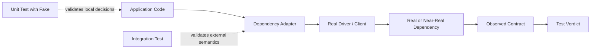
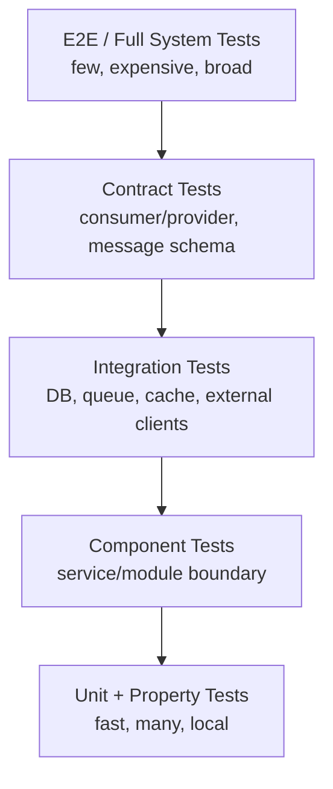
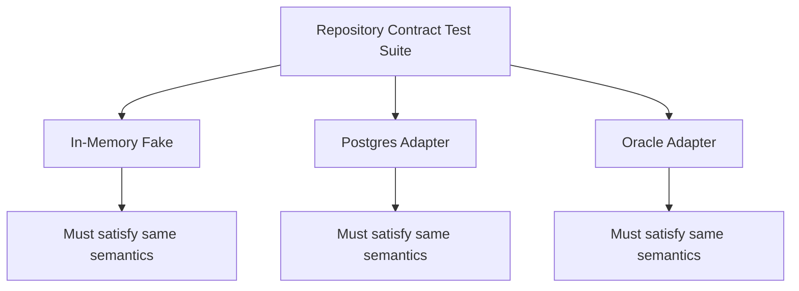
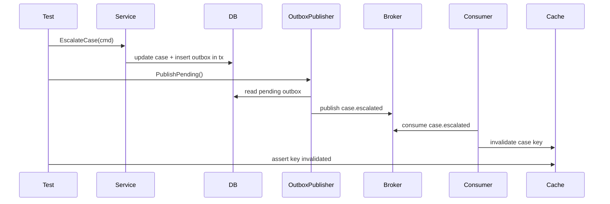

# learn-go-testing-benchmarking-performance-engineering-part-014.md

# Part 014 — Database, Queue, Cache & External Dependency Integration Testing

> Seri: **Go Testing, Benchmarking, Performance Engineering**  
> Target pembaca: **Java software engineer / tech lead** yang ingin membangun kualitas engineering level internal handbook.  
> Target Go: **Go 1.26.x**  
> Fokus part ini: **integration testing harness** untuk dependency nyata seperti database, queue, cache, object storage, external HTTP service, dan service dependency lain.  
> Bukan fokus part ini: detail `database/sql`, transaction theory, SQL optimization, Redis internals, Kafka/RabbitMQ internals, observability/profiling, atau concurrency internals karena sudah/akan dibahas di seri lain.

---

## 0. Posisi Part Ini Dalam Seri

Sampai part sebelumnya, kita sudah membangun fondasi:

1. bagaimana `go test` menjalankan test binary;
2. taxonomy test;
3. desain kode yang testable;
4. package `testing`;
5. assertion strategy;
6. table-driven matrix;
7. isolation/flakiness;
8. golden tests;
9. error/timeout/cancellation testing;
10. deterministic testing;
11. mock/fake/stub/spy/simulator;
12. HTTP testing;
13. filesystem/process/CLI testing.

Part ini bergerak ke boundary yang lebih mahal dan lebih realistis: **integration test dengan dependency eksternal**.

Dalam sistem nyata, banyak bug tidak muncul di unit test karena bug tersebut berada di kontrak antar-komponen:

- SQL query valid secara sintaks tapi salah terhadap real schema;
- transaction boundary tidak sesuai behavior DB;
- migration gagal saat applied ke DB kosong atau DB lama;
- cache TTL salah satuan;
- message queue ack/nack semantics salah;
- retry menyebabkan duplicate event;
- external service timeout tidak dipropagasi;
- serialization field berubah dan consumer lama gagal;
- connection pool leak hanya muncul saat test memakai real driver;
- test pass dengan fake, tetapi fail dengan dependency nyata.

Integration test menjawab pertanyaan:

> “Apakah kode kita berinteraksi dengan dependency nyata sesuai kontrak yang akan terjadi di production, dalam batas confidence dan cost yang masuk akal?”

---

## 1. Mental Model: Integration Test Bukan Unit Test yang Lebih Lambat

Kesalahan paling umum: memperlakukan integration test sebagai unit test yang kebetulan memakai database/container.

Itu keliru.

Unit test dan integration test punya pertanyaan berbeda.

| Jenis test | Pertanyaan utama | Dependency | Failure yang dicari |
|---|---|---:|---|
| Unit test | Apakah logic lokal benar? | Fake/mock/stub | branch logic, invariant lokal |
| Component test | Apakah satu komponen internal benar sebagai unit deployable/logical? | fake atau lightweight dependency | wiring internal, boundary internal |
| Integration test | Apakah kode benar terhadap real dependency contract? | dependency nyata atau near-real | schema, driver, protocol, lifecycle, semantics |
| Contract test | Apakah provider/consumer sepakat pada API/message contract? | contract artifact/provider verification | drift antar-service |
| E2E test | Apakah user journey lintas sistem berjalan? | sistem lengkap | wiring besar, deployment, auth, routing |

Integration test bukan “lebih bagus” dari unit test. Ia lebih mahal, lebih lambat, lebih noisy, tetapi menangkap jenis bug yang unit test memang tidak didesain untuk tangkap.

### 1.1 Prinsip desain integration test

Integration test yang baik harus:

1. **realistic enough**: dependency cukup nyata untuk menangkap bug kontrak;
2. **isolated enough**: tidak saling mencemari state;
3. **fast enough**: masih bisa dijalankan di developer machine atau CI layer tertentu;
4. **diagnostic enough**: failure message menjelaskan layer yang gagal;
5. **repeatable enough**: hasil tidak tergantung urutan, waktu, atau sisa data test sebelumnya;
6. **owned enough**: ada tim/pemilik yang bertanggung jawab memperbaiki saat gagal.

### 1.2 Integration test sebagai evidence boundary



Yang diuji bukan hanya function output. Yang diuji adalah **apakah interaksi dengan dependency benar**.

---

## 2. Apa yang Layak Menjadi Integration Test?

Tidak semua boundary perlu integration test. Buat integration test ketika bug di boundary tersebut:

- sering terjadi;
- mahal jika lolos ke production;
- tidak bisa dibuktikan dengan unit test;
- bergantung pada behavior nyata dependency;
- menjadi bagian kontrak bisnis/regulatory/security penting;
- rentan drift saat dependency, schema, migration, atau config berubah.

### 2.1 Kandidat kuat integration test

| Boundary | Contoh risiko | Layak integration test? |
|---|---|---:|
| DB migration | migration gagal di DB kosong/lama | Sangat layak |
| Repository SQL | query salah, scan type mismatch, null handling | Sangat layak |
| Transaction | rollback/commit/savepoint semantics salah | Sangat layak |
| Unique constraint/idempotency | duplicate handling salah | Sangat layak |
| Cache TTL | TTL unit salah, serialization salah | Layak |
| Queue publish/consume | ack/nack/retry/DLQ salah | Sangat layak |
| External HTTP client | timeout, status mapping, auth header | Layak, sering bisa pakai `httptest` |
| Object storage | key naming, metadata, content type | Layak untuk critical path |
| Search engine | mapping/query behavior | Layak jika query business-critical |
| SMTP/email provider | full real provider jarang; fake SMTP lebih aman | Pilih simulator/contract |

### 2.2 Kandidat lemah integration test

| Hal | Kenapa lemah |
|---|---|
| Getter/setter repository trivial | biaya lebih besar dari nilai |
| Menguji ORM/query builder generated behavior umum | biasanya menguji library, bukan kode kita |
| Test full journey hanya untuk assert satu field | terlalu mahal dan tidak diagnostik |
| Test dependency yang tidak deterministic tanpa kontrol state | flaky by design |
| Test semua kombinasi business rule di DB integration | pindahkan sebagian besar ke unit/table test |

---

## 3. Integration Test Pyramid yang Lebih Realistis

Untuk sistem Go production, pikirkan test portfolio seperti ini:



Integration test berada di tengah: cukup realistis untuk dependency contract, tetapi tidak seluas E2E.

Rule of thumb:

- **Unit test**: banyak, cepat, exhaustive untuk business logic.
- **Integration test**: lebih sedikit, fokus pada contract boundary.
- **E2E test**: sangat sedikit, fokus pada critical journey.

---

## 4. Strategi Dependency: Real, Containerized, Embedded, Fake, Simulator

Tidak semua dependency harus dijalankan dengan cara yang sama.

| Strategy | Contoh | Kelebihan | Risiko |
|---|---|---|---|
| Real shared dependency | shared DEV DB | realistis | flaky, state leak, lambat, konflik data |
| Ephemeral container | Postgres/Redis/RabbitMQ via container | realistic + isolated | butuh Docker/runtime, lebih lambat |
| Embedded/in-memory | SQLite, in-memory broker fake | cepat | semantic drift dari production dependency |
| Fake server | `httptest.Server` | cepat, controlled | belum tentu mewakili provider real |
| Simulator | fake dependency dengan fault model | bisa test failure mode | mahal dibuat, bisa drift |
| Contract test | Pact/schema/protobuf/openapi verification | mencegah drift | butuh governance provider/consumer |

### 4.1 Preferred default untuk DB/queue/cache critical path

Untuk database, queue, dan cache yang behavior-nya penting, default sehat adalah:

> **ephemeral real dependency**, ideally containerized, dengan state isolated per test suite atau per test case.

Kenapa?

Karena fake terlalu mudah membuat test pass untuk behavior yang salah.

Contoh:

- PostgreSQL `SERIALIZABLE` tidak sama dengan fake map lock;
- Redis TTL dan expiration bukan sekadar field `expiresAt`;
- RabbitMQ ack/nack/redelivery behavior bukan sekadar channel slice;
- Oracle/PostgreSQL null/time/decimal scan behavior tidak sama dengan struct literal.

---

## 5. Integration Test Harness: Struktur Minimal yang Sehat

Integration test perlu harness. Harness adalah layer test infrastructure yang menyediakan:

1. dependency lifecycle;
2. connection/config injection;
3. schema/migration setup;
4. fixture management;
5. cleanup/isolation;
6. helper assertion;
7. skip/guard untuk environment;
8. diagnostic dump saat gagal.

### 5.1 Struktur direktori yang direkomendasikan

```text
internal/
  caseengine/
    service.go
    repository.go
    repository_test.go              # unit/component tests
    repository_integration_test.go   # integration tests, build tag optional

test/
  integration/
    dbharness/
      postgres.go
      migration.go
      fixture.go
    queueharness/
      rabbitmq.go
    cacheharness/
      redis.go
    contract/
      provider.go
```

Atau kalau project lebih kecil:

```text
caseengine/
  repository.go
  repository_test.go
  repository_integration_test.go
  testdata/
    fixtures/
```

### 5.2 Build tag untuk integration test

Untuk menjaga PR gate tetap cepat, integration test sering diberi build tag.

```go
//go:build integration

package caseengine_test
```

Run:

```bash
go test ./... -tags=integration
```

Namun jangan otomatis memberi tag semua integration test. Ada integration test ringan yang layak masuk PR gate, misalnya `httptest` client boundary tanpa Docker.

### 5.3 Naming convention

Gunakan nama test yang menjelaskan dependency dan behavior.

```go
func TestPostgresCaseRepository_InsertAndFindByID(t *testing.T) {}
func TestRedisTokenCache_ExpireAfterTTL(t *testing.T) {}
func TestRabbitConsumer_RedeliversMessageWhenHandlerReturnsError(t *testing.T) {}
func TestExternalAddressClient_MapsProviderTimeoutToRetryableError(t *testing.T) {}
```

Jangan pakai nama generik:

```go
func TestRepository(t *testing.T) {}
func TestIntegration(t *testing.T) {}
func TestDB(t *testing.T) {}
```

Nama test adalah diagnostic index.

---

## 6. `TestMain` vs Per-Test Setup

Go menyediakan `TestMain(m *testing.M)` untuk setup/teardown package-level.

Gunakan `TestMain` jika dependency mahal dan bisa dipakai bersama dengan isolation per test.

Contoh cocok:

- start satu container PostgreSQL per package;
- apply migration sekali;
- tiap test memakai schema/database/transaction terisolasi;
- shutdown container setelah seluruh test package selesai.

Contoh kurang cocok:

- state global yang berubah per test tanpa cleanup;
- test yang harus parallel tapi memakai shared mutable fixture;
- setup yang membuat failure sulit dipahami.

### 6.1 Pattern package-level harness

```go
package caseengine_test

import (
    "context"
    "os"
    "testing"
)

var testDB *DBHarness

func TestMain(m *testing.M) {
    ctx := context.Background()

    h, err := StartDBHarness(ctx)
    if err != nil {
        // Tidak ada *testing.T di TestMain.
        // Gunakan stderr/log dan exit code.
        _, _ = os.Stderr.WriteString("start db harness: " + err.Error() + "\n")
        os.Exit(1)
    }
    testDB = h

    code := m.Run()

    if err := h.Close(ctx); err != nil && code == 0 {
        _, _ = os.Stderr.WriteString("close db harness: " + err.Error() + "\n")
        code = 1
    }

    os.Exit(code)
}
```

### 6.2 Prefer `t.Cleanup` untuk resource per test

```go
func TestSomething(t *testing.T) {
    resource := openResource(t)
    t.Cleanup(func() {
        resource.Close()
    })

    // test body
}
```

`TestMain` untuk lifecycle mahal. `t.Cleanup` untuk lifecycle test-local.

---

## 7. Database Integration Testing

Database integration test harus membuktikan kontrak berikut:

1. schema sesuai query;
2. migration valid;
3. insert/update/delete benar;
4. scan type benar;
5. null/default behavior benar;
6. constraint behavior benar;
7. transaction semantics benar;
8. isolation/idempotency behavior benar;
9. timeout/cancellation dipropagasi;
10. connection lifecycle tidak bocor.

### 7.1 Jangan hanya test happy path repository

Repository integration test yang hanya insert lalu select satu row sering terlalu dangkal.

Lebih bernilai jika test mencakup:

- not found;
- duplicate key;
- nullable field;
- enum/status invalid;
- optimistic lock conflict;
- transaction rollback;
- context timeout;
- migration from empty database;
- migration idempotency/safety;
- query ordering/pagination;
- audit trail write consistency.

### 7.2 Example domain

Misal domain regulatory case escalation.

```go
type CaseStatus string

const (
    CaseStatusOpen      CaseStatus = "OPEN"
    CaseStatusEscalated CaseStatus = "ESCALATED"
    CaseStatusClosed    CaseStatus = "CLOSED"
)

type Case struct {
    ID        string
    Reference string
    Status    CaseStatus
    Version   int64
}
```

Repository contract:

```go
type CaseRepository interface {
    Insert(ctx context.Context, c Case) error
    FindByID(ctx context.Context, id string) (Case, error)
    Escalate(ctx context.Context, id string, expectedVersion int64) error
}
```

### 7.3 Integration test matrix untuk repository

| Case | Given | Action | Expected |
|---|---|---|---|
| insert valid | no row | insert | row persisted |
| duplicate ref | existing reference | insert same ref | unique violation mapped |
| find missing | no row | find | domain not found error |
| optimistic lock ok | version matches | escalate | status changed, version incremented |
| optimistic lock conflict | version stale | escalate | conflict error |
| cancelled context | context cancelled | query | cancellation error mapped |
| tx rollback | insert inside failed tx | rollback | row absent |

### 7.4 Error mapping

Jangan assert driver error string mentah di service layer.

Integration test boleh memastikan driver-specific error dimapping ke domain error.

```go
func TestPostgresCaseRepository_InsertDuplicateReferenceMapsToConflict(t *testing.T) {
    ctx := t.Context()
    repo := newCaseRepository(t, testDB)

    existing := Case{ID: "case-1", Reference: "EA-2026-0001", Status: CaseStatusOpen, Version: 1}
    requireNoError(t, repo.Insert(ctx, existing))

    duplicate := Case{ID: "case-2", Reference: "EA-2026-0001", Status: CaseStatusOpen, Version: 1}
    err := repo.Insert(ctx, duplicate)

    if !errors.Is(err, ErrDuplicateReference) {
        t.Fatalf("Insert duplicate reference error = %v, want ErrDuplicateReference", err)
    }
}
```

### 7.5 Transaction rollback test

```go
func TestCaseRepository_RollbackDoesNotPersistCase(t *testing.T) {
    ctx := t.Context()
    db := openTestDB(t)
    repo := NewCaseRepository(db)

    tx, err := db.BeginTx(ctx, nil)
    if err != nil {
        t.Fatalf("BeginTx: %v", err)
    }

    txRepo := repo.WithTx(tx)

    c := Case{ID: "case-rollback", Reference: "EA-ROLLBACK", Status: CaseStatusOpen, Version: 1}
    if err := txRepo.Insert(ctx, c); err != nil {
        t.Fatalf("Insert in tx: %v", err)
    }

    if err := tx.Rollback(); err != nil {
        t.Fatalf("Rollback: %v", err)
    }

    _, err = repo.FindByID(ctx, c.ID)
    if !errors.Is(err, ErrCaseNotFound) {
        t.Fatalf("FindByID after rollback error = %v, want ErrCaseNotFound", err)
    }
}
```

Test ini membuktikan repository menghormati transaction handle.

### 7.6 Transaction-per-test isolation

Salah satu pattern populer:

1. buka transaction di awal test;
2. jalankan test memakai tx;
3. rollback di cleanup.

```go
func withRollbackTx(t *testing.T, db *sql.DB) *sql.Tx {
    t.Helper()

    tx, err := db.BeginTx(t.Context(), nil)
    if err != nil {
        t.Fatalf("BeginTx: %v", err)
    }

    t.Cleanup(func() {
        if err := tx.Rollback(); err != nil && !errors.Is(err, sql.ErrTxDone) {
            t.Errorf("rollback test tx: %v", err)
        }
    })

    return tx
}
```

Pattern ini cepat, tetapi tidak cocok untuk semua scenario.

Tidak cocok jika:

- kode yang diuji membuka connection/transaction sendiri;
- test butuh melihat commit behavior;
- dependency memakai background worker di connection lain;
- database feature tidak behave sama dalam nested tx;
- migration/DDL auto-commit behavior berbeda;
- queue/outbox consumer membaca dari committed rows.

### 7.7 Schema-per-test isolation

Untuk DB yang mendukung schema namespace seperti PostgreSQL:

1. buat schema unik per test;
2. set search path atau DSN;
3. apply migration;
4. drop schema saat cleanup.

Kelebihan:

- isolation kuat;
- bisa test commit behavior;
- bisa parallel;
- tidak mengandalkan rollback.

Kekurangan:

- lebih lambat;
- migration per test mahal;
- butuh helper matang.

### 7.8 Database-per-suite isolation

Buat satu database/container per suite, lalu truncate tables antar test.

Kelebihan:

- lebih cepat dari container per test;
- cukup realistis.

Risiko:

- truncate order harus benar;
- sequence reset harus jelas;
- parallel test bisa konflik;
- leftover data bisa menyamarkan bug.

### 7.9 Container-per-test isolation

Paling bersih, paling mahal.

Cocok untuk:

- migration destructive;
- test yang mengubah config dependency;
- test failure-mode yang bisa merusak state;
- reproducibility tinggi untuk critical dependency.

Tidak cocok untuk ribuan test PR gate.

---

## 8. Migration Testing

Migration adalah executable contract. Jika migration gagal, aplikasi bisa gagal deploy sebelum business logic berjalan.

Minimum migration tests:

1. migration applies to empty database;
2. migration is ordered correctly;
3. schema after migration matches repository expectation;
4. rollback/down migration jika project mendukungnya;
5. migration from previous production-like snapshot untuk critical release;
6. destructive migration memiliki explicit decision.

### 8.1 Empty database migration test

```go
func TestMigrations_ApplyToEmptyDatabase(t *testing.T) {
    ctx := t.Context()
    db := freshDatabase(t)

    if err := ApplyMigrations(ctx, db); err != nil {
        t.Fatalf("ApplyMigrations(empty db): %v", err)
    }

    assertTableExists(t, db, "cases")
    assertTableExists(t, db, "case_audit_events")
}
```

### 8.2 Migration plus repository smoke

Setelah migration, jalankan minimal repository operation.

```go
func TestMigrations_ResultSchemaSupportsCaseRepository(t *testing.T) {
    ctx := t.Context()
    db := freshMigratedDatabase(t)
    repo := NewCaseRepository(db)

    c := Case{ID: "case-1", Reference: "EA-2026-0001", Status: CaseStatusOpen, Version: 1}
    if err := repo.Insert(ctx, c); err != nil {
        t.Fatalf("Insert after migrations: %v", err)
    }

    got, err := repo.FindByID(ctx, c.ID)
    if err != nil {
        t.Fatalf("FindByID after migrations: %v", err)
    }
    if got.Reference != c.Reference {
        t.Fatalf("Reference = %q, want %q", got.Reference, c.Reference)
    }
}
```

### 8.3 Migration test anti-pattern

Buruk:

```go
func TestMigrations(t *testing.T) {
    require.NoError(t, ApplyMigrations(ctx, db))
}
```

Kenapa kurang?

Karena hanya membuktikan “tidak error”, bukan bahwa schema mendukung kode.

Lebih baik tambahkan smoke query atau repository smoke.

---

## 9. Fixture Management

Fixture adalah data test. Fixture buruk menyebabkan test suite rapuh.

### 9.1 Fixture design principles

Fixture harus:

- minimal;
- explicit;
- owned by test;
- isolated;
- readable;
- deterministic;
- tidak bergantung pada test lain;
- tidak memakai production data sensitif;
- bisa diubah tanpa cascade failure besar.

### 9.2 Builder lebih baik dari fixture besar

Buruk:

```sql
-- giant_fixture.sql
INSERT INTO users ...
INSERT INTO agencies ...
INSERT INTO cases ...
INSERT INTO appeals ...
INSERT INTO payments ...
INSERT INTO documents ...
```

Test butuh satu case, tetapi memuat 300 rows. Failure jadi tidak diagnostik.

Lebih baik:

```go
type CaseBuilder struct {
    c Case
}

func NewCaseBuilder() CaseBuilder {
    return CaseBuilder{
        c: Case{
            ID:        "case-" + newTestID(),
            Reference: "EA-" + newTestID(),
            Status:    CaseStatusOpen,
            Version:   1,
        },
    }
}

func (b CaseBuilder) WithStatus(s CaseStatus) CaseBuilder {
    b.c.Status = s
    return b
}

func (b CaseBuilder) Build() Case {
    return b.c
}
```

### 9.3 Fixture insert helper

```go
func insertCase(t *testing.T, ctx context.Context, repo CaseRepository, c Case) Case {
    t.Helper()

    if err := repo.Insert(ctx, c); err != nil {
        t.Fatalf("insert fixture case %+v: %v", c, err)
    }
    return c
}
```

Helper harus memperkaya diagnosis, bukan menyembunyikan error.

### 9.4 Production data warning

Jangan memakai dump production raw untuk test otomatis kecuali sudah ada proses:

- anonymization;
- minimization;
- legal approval;
- access control;
- retention control;
- deterministic subset;
- no secret/token/PII leakage.

Untuk regulatory systems, ini bukan detail kecil. Test data bisa menjadi data breach.

---

## 10. Queue Integration Testing

Queue/message broker integration test harus membuktikan:

1. publish format benar;
2. route/exchange/topic/subject benar;
3. consumer menerima pesan;
4. ack/nack behavior benar;
5. retry/redelivery benar;
6. DLQ behavior benar;
7. idempotency benar;
8. ordering assumption jelas;
9. timeout/backpressure behavior benar;
10. poison message tidak menghentikan consumer permanen.

### 10.1 Queue test lebih mudah flaky

Message systems biasanya asynchronous. Flakiness sering muncul karena:

- memakai `time.Sleep` fixed;
- assert terlalu cepat;
- tidak menunggu condition;
- shared queue antar test;
- consumer lama masih berjalan;
- message leftover dari test sebelumnya;
- auto-ack membuat failure tidak terlihat;
- retry delay membuat test lambat;
- consumer concurrency menyebabkan ordering nondeterministic.

### 10.2 Await pattern, bukan sleep pattern

Buruk:

```go
time.Sleep(500 * time.Millisecond)
if got != want { ... }
```

Lebih baik:

```go
func eventually(t *testing.T, timeout time.Duration, interval time.Duration, check func() (bool, string)) {
    t.Helper()

    deadline := time.Now().Add(timeout)
    var last string

    for time.Now().Before(deadline) {
        ok, msg := check()
        if ok {
            return
        }
        last = msg
        time.Sleep(interval)
    }

    t.Fatalf("condition not met within %s: last=%s", timeout, last)
}
```

Tetap hati-hati: polling helper boleh dipakai di integration test, tetapi jangan menjadi alat menutupi nondeterminism yang bisa didesain lebih deterministik.

### 10.3 Queue naming isolation

Gunakan queue/topic unik per test.

```go
queueName := "case-events-test-" + sanitize(t.Name()) + "-" + newTestID()
```

Cleanup:

```go
t.Cleanup(func() {
    _ = broker.DeleteQueue(context.Background(), queueName)
})
```

### 10.4 Publish-consume test

```go
func TestCaseEventPublisher_PublishesEscalatedEvent(t *testing.T) {
    ctx := t.Context()
    broker := newBrokerHarness(t)
    topic := broker.NewIsolatedTopic(t, "case-events")

    publisher := NewCaseEventPublisher(broker.Client(), topic)

    event := CaseEscalatedEvent{
        CaseID:    "case-123",
        From:      "OPEN",
        To:        "ESCALATED",
        Reason:    "SLA breach",
        EventID:   "event-123",
    }

    if err := publisher.PublishCaseEscalated(ctx, event); err != nil {
        t.Fatalf("PublishCaseEscalated: %v", err)
    }

    got := broker.RequireNextMessage(t, topic)

    if got.Key != event.CaseID {
        t.Fatalf("message key = %q, want %q", got.Key, event.CaseID)
    }
    if got.Headers["event-type"] != "case.escalated" {
        t.Fatalf("event-type header = %q, want case.escalated", got.Headers["event-type"])
    }
}
```

### 10.5 Consumer retry/idempotency test

```go
func TestCaseEventConsumer_RedrivesFailedMessageWithoutDuplicateSideEffect(t *testing.T) {
    ctx := t.Context()
    broker := newBrokerHarness(t)
    store := newSideEffectStore(t)

    handler := &flakyHandler{
        failFirstN: 1,
        store:      store,
    }

    consumer := NewCaseEventConsumer(broker.Client(), handler)
    runConsumer(t, ctx, consumer)

    broker.Publish(t, CaseEscalatedEvent{EventID: "event-1", CaseID: "case-1"})

    eventually(t, 5*time.Second, 50*time.Millisecond, func() (bool, string) {
        count := store.Count("event-1")
        if count == 1 && handler.Attempts("event-1") >= 2 {
            return true, ""
        }
        return false, fmt.Sprintf("count=%d attempts=%d", count, handler.Attempts("event-1"))
    })
}
```

Test ini mencari bug klasik: retry sukses tetapi side effect terjadi dua kali.

### 10.6 Queue integration anti-patterns

| Anti-pattern | Dampak |
|---|---|
| shared topic/queue antar test | cross-test pollution |
| fixed sleep | flaky atau lambat |
| assert ordering tanpa guarantee | nondeterministic failure |
| auto-ack di test consumer | failure tidak memicu redelivery |
| tidak test poison message | consumer bisa mati diam-diam |
| tidak punya idempotency assertion | duplicate side effect lolos |

---

## 11. Cache Integration Testing

Cache integration test perlu fokus pada behavior yang tidak bisa dipercaya dari fake map biasa:

1. TTL;
2. expiration;
3. serialization;
4. key naming;
5. namespace/prefix;
6. miss/hit semantics;
7. stale behavior;
8. concurrent refresh/singleflight;
9. eviction assumption;
10. connection timeout.

### 11.1 Cache test jangan bergantung pada timing sempit

Buruk:

```go
cache.Set(ctx, key, value, 10*time.Millisecond)
time.Sleep(10 * time.Millisecond)
_, found := cache.Get(ctx, key)
if found { t.Fatal("want expired") }
```

Ini flaky karena scheduler/clock.

Lebih baik:

- gunakan TTL yang cukup longgar;
- poll sampai expired dengan timeout;
- test TTL value dengan dependency API jika tersedia;
- pisahkan logic TTL calculation ke unit test deterministik.

### 11.2 Redis TTL integration example

```go
func TestRedisTokenCache_ExpiresTokenAfterTTL(t *testing.T) {
    ctx := t.Context()
    redis := newRedisHarness(t)
    cache := NewTokenCache(redis.Client(), "test:"+newTestID()+":")

    token := Token{Value: "abc", Subject: "user-1"}
    if err := cache.Set(ctx, "session-1", token, 200*time.Millisecond); err != nil {
        t.Fatalf("Set: %v", err)
    }

    got, ok, err := cache.Get(ctx, "session-1")
    if err != nil {
        t.Fatalf("Get before expiry: %v", err)
    }
    if !ok || got.Value != token.Value {
        t.Fatalf("Get before expiry = (%+v,%v), want token", got, ok)
    }

    eventually(t, 2*time.Second, 25*time.Millisecond, func() (bool, string) {
        _, ok, err := cache.Get(ctx, "session-1")
        if err != nil {
            return false, "err=" + err.Error()
        }
        if !ok {
            return true, ""
        }
        return false, "still present"
    })
}
```

### 11.3 Key namespace test

Cache bugs sering bukan value bug, tetapi key bug.

```go
func TestRedisTokenCache_UsesTenantScopedKeys(t *testing.T) {
    ctx := t.Context()
    redis := newRedisHarness(t)

    tenantA := NewTokenCache(redis.Client(), "tenant-a:")
    tenantB := NewTokenCache(redis.Client(), "tenant-b:")

    if err := tenantA.Set(ctx, "session-1", Token{Value: "a"}, time.Minute); err != nil {
        t.Fatalf("tenantA Set: %v", err)
    }
    if err := tenantB.Set(ctx, "session-1", Token{Value: "b"}, time.Minute); err != nil {
        t.Fatalf("tenantB Set: %v", err)
    }

    gotA, _, _ := tenantA.Get(ctx, "session-1")
    gotB, _, _ := tenantB.Get(ctx, "session-1")

    if gotA.Value != "a" || gotB.Value != "b" {
        t.Fatalf("tenant scoped values = %q/%q, want a/b", gotA.Value, gotB.Value)
    }
}
```

### 11.4 Cache integration anti-patterns

| Anti-pattern | Dampak |
|---|---|
| fake map untuk semua cache test | TTL/serialization/key issues tidak tertangkap |
| assert exact expiration timestamp | flaky |
| shared Redis DB tanpa prefix unik | pollution |
| `FLUSHALL` di shared env | menghancurkan test lain/dev data |
| tidak test serialization compatibility | deploy bisa memecahkan cache lama |

---

## 12. External HTTP Dependency Integration

Untuk HTTP dependency, ada beberapa level:

1. **fake transport unit test**: cepat, local;
2. **`httptest.Server` integration-like test**: real HTTP stack local;
3. **provider sandbox integration**: real external sandbox;
4. **contract test**: schema/behavior agreement;
5. **production synthetic check**: bukan bagian `go test` biasa.

Untuk PR gate, default sehat biasanya `httptest.Server` plus contract/schema checks. Provider sandbox bisa nightly karena lebih lambat/flaky.

### 12.1 Local fake provider with `httptest.Server`

```go
func TestAddressClient_MapsProvider429ToRateLimitedError(t *testing.T) {
    srv := httptest.NewServer(http.HandlerFunc(func(w http.ResponseWriter, r *http.Request) {
        if got := r.URL.Query().Get("postalCode"); got != "123456" {
            t.Errorf("postalCode = %q, want 123456", got)
        }
        w.Header().Set("Retry-After", "2")
        http.Error(w, "rate limited", http.StatusTooManyRequests)
    }))
    t.Cleanup(srv.Close)

    client := NewAddressClient(srv.URL, srv.Client())

    _, err := client.Lookup(t.Context(), "123456")
    if !errors.Is(err, ErrRateLimited) {
        t.Fatalf("Lookup error = %v, want ErrRateLimited", err)
    }
}
```

### 12.2 Provider sandbox tests

Sandbox tests harus diperlakukan berbeda:

- jangan masuk semua PR gate;
- butuh secret management;
- butuh rate-limit control;
- harus skip jika credential tidak tersedia;
- failure belum tentu berarti code bug;
- catat provider status/response untuk diagnosis;
- jangan memakai PII/production data.

```go
func TestAddressClient_SandboxLookup(t *testing.T) {
    if testing.Short() {
        t.Skip("sandbox integration skipped in short mode")
    }

    baseURL := os.Getenv("ADDRESS_PROVIDER_SANDBOX_URL")
    apiKey := os.Getenv("ADDRESS_PROVIDER_SANDBOX_API_KEY")
    if baseURL == "" || apiKey == "" {
        t.Skip("sandbox credentials not configured")
    }

    client := NewAddressClient(baseURL, http.DefaultClient, WithAPIKey(apiKey))

    got, err := client.Lookup(t.Context(), "123456")
    if err != nil {
        t.Fatalf("sandbox Lookup: %v", err)
    }
    if got.PostalCode != "123456" {
        t.Fatalf("PostalCode = %q, want 123456", got.PostalCode)
    }
}
```

### 12.3 Contract drift

External provider tests should not only test current example response. They should verify:

- required fields;
- unknown fields tolerated;
- enum mapping;
- error body mapping;
- authentication headers;
- timeout and retry semantics;
- backward compatibility.

---

## 13. Object Storage Integration Testing

Object storage behavior usually matters for:

- key naming;
- metadata;
- content type;
- content length;
- streaming upload/download;
- checksum;
- signed URL behavior;
- delete idempotency;
- eventual consistency assumptions;
- permission/auth behavior.

### 13.1 Use narrow contract

Do not test all object storage SDK behavior. Test your adapter contract.

```go
type DocumentStore interface {
    Put(ctx context.Context, doc DocumentObject) error
    Get(ctx context.Context, key string) (DocumentObject, error)
    Delete(ctx context.Context, key string) error
}
```

### 13.2 Contract test reusable for real and fake

```go
func TestDocumentStoreContract(t *testing.T, newStore func(t *testing.T) DocumentStore) {
    t.Helper()

    t.Run("put get delete", func(t *testing.T) {
        ctx := t.Context()
        store := newStore(t)

        doc := DocumentObject{
            Key:         "test/" + newTestID() + "/file.txt",
            ContentType: "text/plain",
            Body:        []byte("hello"),
        }

        if err := store.Put(ctx, doc); err != nil {
            t.Fatalf("Put: %v", err)
        }

        got, err := store.Get(ctx, doc.Key)
        if err != nil {
            t.Fatalf("Get: %v", err)
        }
        if got.ContentType != doc.ContentType || string(got.Body) != string(doc.Body) {
            t.Fatalf("Get = %+v, want content type/body match", got)
        }

        if err := store.Delete(ctx, doc.Key); err != nil {
            t.Fatalf("Delete: %v", err)
        }
    })
}
```

A reusable contract test can be executed against fake/local/minio/provider sandbox.

---

## 14. Contract Tests for Adapters

Integration tests often become more robust when paired with contract tests.

### 14.1 Adapter contract pattern

Define behavior once, run against multiple implementations.

```go
func RunCaseRepositoryContract(t *testing.T, newRepo func(t *testing.T) CaseRepository) {
    t.Helper()

    t.Run("insert and find", func(t *testing.T) {
        repo := newRepo(t)
        ctx := t.Context()

        c := NewCaseBuilder().Build()
        if err := repo.Insert(ctx, c); err != nil {
            t.Fatalf("Insert: %v", err)
        }

        got, err := repo.FindByID(ctx, c.ID)
        if err != nil {
            t.Fatalf("FindByID: %v", err)
        }
        if got.ID != c.ID || got.Reference != c.Reference {
            t.Fatalf("got %+v, want %+v", got, c)
        }
    })

    t.Run("not found", func(t *testing.T) {
        repo := newRepo(t)
        _, err := repo.FindByID(t.Context(), "missing")
        if !errors.Is(err, ErrCaseNotFound) {
            t.Fatalf("FindByID missing error = %v, want ErrCaseNotFound", err)
        }
    })
}
```

Then run it against fake and real repository:

```go
func TestInMemoryCaseRepositoryContract(t *testing.T) {
    RunCaseRepositoryContract(t, func(t *testing.T) CaseRepository {
        return NewInMemoryCaseRepository()
    })
}

func TestPostgresCaseRepositoryContract(t *testing.T) {
    RunCaseRepositoryContract(t, func(t *testing.T) CaseRepository {
        return NewPostgresCaseRepository(openIsolatedDB(t))
    })
}
```

This catches fake drift.

### 14.2 Contract test diagram



---

## 15. Containerized Dependency Testing

Container-based testing gives a practical middle ground: real dependency, ephemeral lifecycle.

Common pattern:

1. start container;
2. wait until ready;
3. obtain mapped host/port/DSN;
4. run migrations/setup;
5. inject config into code;
6. run tests;
7. cleanup container.

### 15.1 What container test should control

- exact image version;
- environment variables;
- exposed ports;
- readiness condition;
- startup timeout;
- network aliases if multi-container;
- mounted init scripts if needed;
- resource limits if test environment supports it.

### 15.2 Pin dependency versions

Bad:

```text
postgres:latest
redis:latest
rabbitmq:latest
```

Better:

```text
postgres:16.4
redis:7.4
rabbitmq:3.13-management
```

Use versions aligned with production or documented test matrix.

### 15.3 Readiness matters

Do not start a container and immediately connect. Wait for readiness:

- open port is not always enough;
- log line may be better;
- executing a health query is often best;
- readiness timeout should be explicit.

### 15.4 Testcontainers for Go

`testcontainers-go` is a common ecosystem library for starting throwaway dependencies from Go tests. It has modules for dependencies such as PostgreSQL and Redis, and its documented purpose is to create and clean up container-based dependencies for automated integration/smoke tests.

Conceptual example:

```go
func StartPostgresHarness(ctx context.Context, t *testing.T) *PostgresHarness {
    t.Helper()

    // Pseudocode. Exact API can change by version.
    container, dsn, err := startPostgresContainer(ctx, "postgres:16.4")
    if err != nil {
        t.Fatalf("start postgres container: %v", err)
    }

    t.Cleanup(func() {
        if err := container.Terminate(context.Background()); err != nil {
            t.Errorf("terminate postgres container: %v", err)
        }
    })

    db, err := sql.Open("postgres", dsn)
    if err != nil {
        t.Fatalf("open postgres: %v", err)
    }
    t.Cleanup(func() { _ = db.Close() })

    if err := waitForDB(ctx, db); err != nil {
        t.Fatalf("wait postgres: %v", err)
    }

    return &PostgresHarness{DB: db, DSN: dsn}
}
```

Keep container helper behind your own harness so library churn does not infect every test.

---

## 16. Shared Dependency vs Ephemeral Dependency

### 16.1 Shared dependency

Example: CI has one shared PostgreSQL service.

Pros:

- faster startup;
- simpler infra;
- no Docker-in-Docker complexity.

Cons:

- harder isolation;
- parallel tests conflict;
- leftover state;
- version drift;
- harder local reproduction;
- destructive test risk.

### 16.2 Ephemeral dependency

Example: per-suite container.

Pros:

- reproducible;
- isolated;
- local/CI parity;
- version pinned.

Cons:

- slower startup;
- Docker/runtime dependency;
- CI resource usage;
- image pull failures.

### 16.3 Decision matrix

| Context | Prefer |
|---|---|
| PR gate with few critical integration tests | ephemeral per suite |
| huge integration suite | shared per job + per-test schema |
| destructive migration test | ephemeral per test/suite |
| nightly compatibility matrix | ephemeral pinned versions |
| provider sandbox | external sandbox, not shared mutable business data |
| local developer quick check | fake/component test or tagged integration subset |

---

## 17. Parallel Integration Tests

Parallel integration tests are possible, but only if isolation is explicit.

### 17.1 Safe parallelization patterns

| Dependency | Parallel isolation strategy |
|---|---|
| PostgreSQL | schema per test, database per test, transaction per test if no commit behavior needed |
| Redis | unique key prefix per test, separate DB index if safe |
| RabbitMQ | unique queue/exchange/routing key per test |
| Kafka | unique topic/consumer group per test |
| Object storage | unique bucket/prefix per test |
| HTTP fake server | server per test |

### 17.2 Unsafe pattern

```go
func TestA(t *testing.T) {
    t.Parallel()
    db.Exec("DELETE FROM cases")
    // ...
}

func TestB(t *testing.T) {
    t.Parallel()
    db.Exec("DELETE FROM cases")
    // ...
}
```

Parallel tests with global cleanup are a flakiness generator.

### 17.3 Safer pattern

```go
func TestCaseRepository_Insert(t *testing.T) {
    t.Parallel()

    db := testDB.NewIsolatedSchema(t)
    repo := NewCaseRepository(db)

    // test body
}
```

---

## 18. Timeouts and Context in Integration Tests

Every integration test touching dependency should use bounded context.

Why?

- dependency may hang;
- network call may block;
- broker consumer may never receive;
- DB lock may wait indefinitely;
- CI job should fail fast with diagnosis.

### 18.1 Context helper

```go
func testContext(t *testing.T, timeout time.Duration) context.Context {
    t.Helper()

    ctx, cancel := context.WithTimeout(t.Context(), timeout)
    t.Cleanup(cancel)
    return ctx
}
```

Use it:

```go
ctx := testContext(t, 5*time.Second)
```

### 18.2 Avoid hiding timeout root cause

Bad failure:

```text
timeout
```

Better failure:

```text
waiting for message case.escalated on queue case-events-test-123: timeout after 5s; last broker depth=0; consumer attempts=0
```

Integration failures need operational diagnostics.

---

## 19. Diagnostic Dump on Failure

Integration test failures often need context. Add targeted dump only on failure.

```go
func dumpRowsOnFailure(t *testing.T, db *sql.DB, query string) {
    t.Helper()

    t.Cleanup(func() {
        if !t.Failed() {
            return
        }
        rows, err := db.QueryContext(context.Background(), query)
        if err != nil {
            t.Logf("diagnostic query failed: %v", err)
            return
        }
        defer rows.Close()

        // Pseudocode: scan rows and log compactly.
        t.Logf("diagnostic rows for %q: ...", query)
    })
}
```

Examples:

- dump rows for `cases` table;
- dump broker queue depth;
- dump DLQ messages;
- dump Redis TTL/key existence;
- dump HTTP request log captured by fake server;
- dump migration version table.

Do not dump secrets, tokens, PII, or large binary payloads.

---

## 20. Test Data Identity and Idempotency

Use unique IDs per test. Avoid hardcoded global identifiers unless the test explicitly proves duplicate behavior.

```go
func newTestID() string {
    return strings.ReplaceAll(uuid.NewString(), "-", "")
}
```

If avoiding external UUID dependency:

```go
var testCounter atomic.Uint64

func newTestID() string {
    return fmt.Sprintf("%d-%d", time.Now().UnixNano(), testCounter.Add(1))
}
```

For deterministic tests, prefer seeded/counter-based IDs over randomness.

### 20.1 ID should include test name?

Useful for diagnostics:

```go
func testPrefix(t *testing.T) string {
    t.Helper()
    name := strings.NewReplacer("/", "_", " ", "_", ":", "_").Replace(t.Name())
    return "test:" + name + ":" + newTestID()
}
```

Do not exceed dependency key length limits.

---

## 21. Cleanup Strategy

Cleanup must be:

- safe;
- idempotent;
- scoped;
- not destructive outside test namespace;
- run even on failure;
- diagnostic if cleanup fails.

### 21.1 Good cleanup

```go
prefix := testPrefix(t)

t.Cleanup(func() {
    if err := cache.DeletePrefix(context.Background(), prefix); err != nil {
        t.Errorf("delete cache prefix %q: %v", prefix, err)
    }
})
```

### 21.2 Dangerous cleanup

```go
redis.FlushAll(ctx)
db.Exec("DROP SCHEMA public CASCADE")
broker.DeleteExchange("case-events")
```

Unless dependency is fully ephemeral and test-owned, global cleanup is dangerous.

---

## 22. Secrets and Credentials in Integration Tests

Integration tests must not depend on developer personal credentials or production secrets.

Rules:

1. local/CI credentials should be test-scoped;
2. provider sandbox credentials should be read from env/secret manager;
3. missing credential should `t.Skip`, not fail, for optional sandbox tests;
4. required CI secrets should fail in dedicated CI job if absent;
5. never log secret values;
6. never include real tokens in golden files;
7. never commit `.env` with secrets.

### 22.1 Secret redaction helper

```go
func redact(s string) string {
    if len(s) <= 4 {
        return "****"
    }
    return s[:2] + "****" + s[len(s)-2:]
}
```

Use sparingly. Better: do not log secrets at all.

---

## 23. CI Placement

Not every integration test belongs to every pipeline.

### 23.1 Suggested gate model

| Gate | Runs | Purpose |
|---|---|---|
| Local fast | unit/component/light integration | developer feedback |
| PR required | unit, race subset, critical integration | prevent obvious breakage |
| PR optional | broader integration | visible signal, not blocking initially |
| Nightly | full integration, sandbox, migration matrix, slow queue tests | catch expensive drift |
| Release gate | migration, critical journeys, perf smoke | deploy confidence |

### 23.2 Example commands

Fast local:

```bash
go test ./... -short
```

PR integration:

```bash
go test ./... -tags=integration -run 'Integration|Repository|Migration' -count=1
```

Race subset:

```bash
go test ./... -race -run 'Repository|Consumer' -count=1
```

Nightly full:

```bash
go test ./... -tags='integration,sandbox' -count=1 -timeout=30m
```

Remember: `-count=1` disables test result cache for the run. Integration tests that depend on external state usually should not rely on cached success.

---

## 24. Integration Test Caching

Go test caching is powerful for pure deterministic tests, but integration tests often need fresh execution.

Use `-count=1` for integration suites where external state matters.

Also be careful with tests that read env vars, files, ports, or external services. If a test result is cached unexpectedly, you may think you tested a new dependency version when you did not.

### 24.1 Rule

- Unit tests: allow cache.
- Integration tests with external dependency: usually `-count=1`.
- Benchmark/regression: always controlled repetition, not cached test result.

---

## 25. Integration Testing and Race Detector

The race detector is valuable, but expensive.

Run race detector on integration tests that involve:

- consumers;
- worker pools;
- cache refresh;
- concurrent repository access;
- background goroutines;
- connection pool lifecycle;
- retry loops;
- shared test harness.

But do not assume `-race` with full suite is always practical for every PR. It can be nightly or targeted.

Command:

```bash
go test ./... -race -tags=integration -run 'Consumer|Worker|Cache|Repository'
```

---

## 26. Integration Test Flakiness Taxonomy

| Flake source | Symptom | Fix |
|---|---|---|
| shared state | passes alone, fails in suite | per-test namespace/schema/topic |
| fixed sleeps | random timeout | await condition with diagnostics |
| dependency not ready | connection refused | explicit readiness probe |
| test cache | old success reused | `-count=1` |
| time precision | timestamp mismatch | truncate/allow tolerance |
| order assumption | slice order changes | add ORDER BY or compare as set |
| parallel cleanup | other test data deleted | scoped cleanup only |
| provider sandbox | random external failure | nightly/quarantine/contract local |
| resource starvation | CI-only failure | limit parallelism, allocate runner resources |
| leaked goroutine | later tests fail | lifecycle cleanup, context cancellation |

---

## 27. Database Time and Precision Pitfalls

Integration tests often fail due to timestamp differences:

- DB stores microsecond precision while Go has nanoseconds;
- timezone conversion;
- `now()` generated by DB vs app clock;
- default timestamp set by trigger;
- daylight saving if local timezone used.

### 27.1 Safer timestamp assertion

```go
func assertTimeClose(t *testing.T, got, want time.Time, tolerance time.Duration) {
    t.Helper()

    d := got.Sub(want)
    if d < 0 {
        d = -d
    }
    if d > tolerance {
        t.Fatalf("time = %s, want within %s of %s; delta=%s", got, tolerance, want, d)
    }
}
```

### 27.2 Prefer UTC

Store and compare in UTC unless domain explicitly requires local timezone semantics.

```go
want := fixedClock.Now().UTC().Truncate(time.Microsecond)
```

---

## 28. Ordering and Pagination Tests

Database queries without explicit `ORDER BY` do not guarantee order.

Bad:

```go
got := repo.List(ctx)
if got[0].ID != "case-1" { ... }
```

If ordering is part of contract, query must specify it and test should assert it.

```go
func TestCaseRepository_ListOpenCasesOrdersByCreatedAtDescending(t *testing.T) {
    ctx := t.Context()
    repo := newCaseRepository(t, testDB)

    insertCase(t, ctx, repo, Case{ID: "old", CreatedAt: parseTime("2026-01-01T00:00:00Z")})
    insertCase(t, ctx, repo, Case{ID: "new", CreatedAt: parseTime("2026-01-02T00:00:00Z")})

    got, err := repo.ListOpenCases(ctx, Page{Limit: 10})
    if err != nil {
        t.Fatalf("ListOpenCases: %v", err)
    }

    assertIDs(t, got, []string{"new", "old"})
}
```

---

## 29. Idempotency Integration Tests

Many production bugs are duplicate side effects.

Integration test idempotency for:

- command handling;
- event consumers;
- payment/request submission;
- document upload;
- case escalation;
- retry after timeout;
- outbox processing.

### 29.1 Example: idempotent escalation command

```go
func TestEscalateCaseCommand_IsIdempotentForSameCommandID(t *testing.T) {
    ctx := t.Context()
    env := newIntegrationEnv(t)

    c := env.InsertCase(t, CaseStatusOpen)

    cmd := EscalateCaseCommand{
        CommandID: "cmd-123",
        CaseID:    c.ID,
        Reason:    "SLA breach",
    }

    if err := env.Service.Escalate(ctx, cmd); err != nil {
        t.Fatalf("first Escalate: %v", err)
    }
    if err := env.Service.Escalate(ctx, cmd); err != nil {
        t.Fatalf("second Escalate same command: %v", err)
    }

    events := env.ListCaseEvents(t, c.ID)
    assertEventTypes(t, events, []string{"case.escalated"})
}
```

This requires real DB constraints or outbox uniqueness to be meaningful.

---

## 30. Outbox/Inbox Integration Testing

Outbox is a common pattern to coordinate DB state and event publishing.

Test must prove:

1. business state and outbox row are committed atomically;
2. rollback removes both;
3. publisher sends pending outbox messages;
4. sent messages are marked sent;
5. failure keeps message retryable;
6. duplicate publish is idempotent at consumer/inbox layer.

### 30.1 Transactional outbox test

```go
func TestEscalateCase_CommitsStateAndOutboxAtomically(t *testing.T) {
    ctx := t.Context()
    env := newIntegrationEnv(t)

    c := env.InsertCase(t, CaseStatusOpen)

    if err := env.Service.Escalate(ctx, EscalateCaseCommand{
        CommandID: "cmd-1",
        CaseID:    c.ID,
        Reason:    "SLA breach",
    }); err != nil {
        t.Fatalf("Escalate: %v", err)
    }

    got := env.RequireCase(t, c.ID)
    if got.Status != CaseStatusEscalated {
        t.Fatalf("status = %s, want ESCALATED", got.Status)
    }

    outbox := env.RequireOutboxEvent(t, "case.escalated", c.ID)
    if outbox.CommandID != "cmd-1" {
        t.Fatalf("outbox command id = %q, want cmd-1", outbox.CommandID)
    }
}
```

### 30.2 Outbox failure test

```go
func TestOutboxPublisher_KeepsMessagePendingWhenBrokerFails(t *testing.T) {
    ctx := t.Context()
    env := newIntegrationEnv(t)
    env.InsertOutbox(t, OutboxMessage{ID: "msg-1", Type: "case.escalated"})

    broker := &failingBroker{err: errors.New("broker unavailable")}
    publisher := NewOutboxPublisher(env.DB, broker)

    err := publisher.PublishPending(ctx)
    if err == nil {
        t.Fatal("PublishPending error = nil, want error")
    }

    msg := env.RequireOutboxMessage(t, "msg-1")
    if msg.Status != "PENDING" {
        t.Fatalf("outbox status = %s, want PENDING", msg.Status)
    }
}
```

This uses real DB plus fake broker. That is still integration at DB boundary and controlled failure at broker boundary.

---

## 31. Multi-Dependency Integration Tests

Sometimes a test must cross DB + queue + cache. Use sparingly.

A multi-dependency integration test is justified when the bug risk is specifically in the coordination.

Example:

- case escalation writes DB state;
- outbox writes event;
- outbox publisher publishes message;
- consumer invalidates cache;
- read model updates.

This is no longer a simple repository integration test. It is a scenario/component integration test.

### 31.1 Keep scope bounded



This test should be few, named clearly, and probably not exhaustive.

---

## 32. Hermetic vs Non-Hermetic Tests

A hermetic test controls all dependencies. A non-hermetic test relies on external environment.

| Type | Example | PR gate? |
|---|---|---:|
| Hermetic | container DB + local fake server | Good candidate |
| Semi-hermetic | shared CI DB with isolated schema | Candidate with caution |
| Non-hermetic | third-party sandbox API | Usually nightly/manual |
| Production check | real production synthetic | Not normal `go test` PR gate |

Hermetic tests are easier to trust. Non-hermetic tests are still useful, but must be labeled and interpreted differently.

---

## 33. Build Tags and Test Categories

Example tags:

```go
//go:build integration
```

```go
//go:build sandbox
```

```go
//go:build destructive
```

Suggested commands:

```bash
# Fast deterministic tests
go test ./... -short

# Local integration
go test ./... -tags=integration -count=1

# Nightly sandbox
go test ./... -tags='integration sandbox' -count=1

# Dangerous/destructive tests only in controlled env
go test ./... -tags='integration destructive' -count=1
```

Do not create too many tags. Categories should map to pipeline decisions.

---

## 34. Integration Harness API Design

A good harness should make tests readable.

### 34.1 Example environment object

```go
type IntegrationEnv struct {
    DB     *sql.DB
    Redis  *redis.Client
    Broker BrokerClient

    Cases  *CaseRepository
    Cache  *TokenCache
    Events *CaseEventPublisher
}

func NewIntegrationEnv(t *testing.T) *IntegrationEnv {
    t.Helper()

    db := StartPostgres(t)
    redis := StartRedis(t)
    broker := StartBroker(t)

    env := &IntegrationEnv{
        DB:     db.DB,
        Redis:  redis.Client,
        Broker: broker.Client,
    }
    env.Cases = NewCaseRepository(env.DB)
    env.Cache = NewTokenCache(env.Redis, testPrefix(t))
    env.Events = NewCaseEventPublisher(env.Broker, broker.NewTopic(t, "case-events"))

    return env
}
```

### 34.2 Avoid god harness

A huge harness with every dependency makes tests heavy and unclear.

Prefer small harnesses:

- `DBHarness`;
- `RedisHarness`;
- `BrokerHarness`;
- `ExternalProviderHarness`;
- `IntegrationEnv` only for scenario tests.

---

## 35. Performance Cost of Integration Tests

Integration tests are not benchmarks, but they affect engineering throughput.

Track:

- suite duration;
- startup duration;
- per-test duration;
- dependency startup failures;
- flake rate;
- CI resource usage;
- developer local friction.

### 35.1 Test suite SLO example

| Suite | Target |
|---|---:|
| unit local | < 10s |
| PR required integration | < 3–5 min |
| nightly full integration | < 30–60 min |
| sandbox/provider tests | best effort with owner |

A slow integration suite with no ownership becomes ignored. Ignored tests provide no confidence.

---

## 36. Java Engineer Translation Layer

From Java/Spring world, you may be used to:

- Spring Boot Test;
- Testcontainers Java;
- `@Transactional` test rollback;
- `@MockBean`;
- embedded H2;
- JUnit lifecycle annotations;
- profiles.

In Go:

- there is less framework magic;
- setup is explicit;
- dependency injection is usually constructor/function based;
- package-level `TestMain` replaces some suite lifecycle needs;
- `t.Cleanup` replaces many teardown annotations;
- build tags/`testing.Short` replace some profile behavior;
- explicit harness code is normal;
- in-memory substitute should be treated carefully if production DB semantics matter.

### 36.1 H2-style warning

In Java, H2 often caused false confidence for PostgreSQL/MySQL/Oracle behavior. The Go equivalent mistake is using SQLite/in-memory fake for everything while production uses PostgreSQL/Oracle/MySQL.

Use fake/in-memory for logic speed. Use real dependency for contract behavior.

---

## 37. Anti-Patterns

### 37.1 “Integration test everything”

Symptom:

- test suite slow;
- business rules only tested through DB/API;
- failures hard to diagnose;
- developers avoid running tests.

Fix:

- push logic to unit/property tests;
- keep integration tests for contract boundary.

### 37.2 “Mock everything”

Symptom:

- repository tests pass but SQL broken;
- queue tests pass but ack/nack wrong;
- cache tests pass but TTL wrong.

Fix:

- add real dependency integration tests for critical adapters.

### 37.3 “Shared DEV DB as test dependency”

Symptom:

- random failures;
- dirty data;
- developers block each other;
- tests depend on environment.

Fix:

- ephemeral containers or per-test schema/database.

### 37.4 “Sleep-driven async tests”

Symptom:

- CI-only flakiness;
- tests slow even when system fast;
- arbitrary timeout tuning.

Fix:

- await condition with diagnostics;
- design deterministic hooks;
- expose testable lifecycle.

### 37.5 “No failure-mode integration tests”

Symptom:

- happy path works;
- outage causes duplicate side effects, stuck messages, partial state.

Fix:

- test timeout, retry, rollback, redelivery, idempotency, poison message.

### 37.6 “Test data as hidden global fixture”

Symptom:

- one fixture edit breaks 40 tests;
- test intent unclear.

Fix:

- per-test builders;
- minimal fixtures;
- explicit setup.

### 37.7 “Latest image tag”

Symptom:

- tests change behavior without code change.

Fix:

- pin dependency image versions;
- update deliberately.

---

## 38. Review Checklist

Use this checklist for integration test PR review.

### 38.1 Scope

- [ ] Does this test verify a real dependency contract?
- [ ] Could this be a cheaper unit/component test instead?
- [ ] Is the tested behavior important enough for integration cost?
- [ ] Is the test name diagnostic?

### 38.2 Isolation

- [ ] Does the test have unique DB schema/table rows/cache prefix/topic/queue/bucket prefix?
- [ ] Can it run in parallel safely?
- [ ] Does cleanup affect only test-owned resources?
- [ ] Does it avoid shared DEV/prod-like mutable state?

### 38.3 Determinism

- [ ] Does it avoid fixed sleeps?
- [ ] Are timeouts bounded?
- [ ] Is ordering explicitly specified if asserted?
- [ ] Are timestamps handled with precision/tolerance?
- [ ] Does it use `-count=1` in CI where needed?

### 38.4 Lifecycle

- [ ] Is dependency readiness checked?
- [ ] Are resources closed via `t.Cleanup` or package teardown?
- [ ] Are background goroutines cancelled?
- [ ] Are containers/images version pinned?

### 38.5 Data

- [ ] Are fixtures minimal and explicit?
- [ ] Is test data non-sensitive?
- [ ] Are IDs unique per test?
- [ ] Are duplicate/idempotency cases tested where relevant?

### 38.6 Failure diagnosis

- [ ] Does failure message explain dependency/action/expected behavior?
- [ ] Is there targeted diagnostic dump on failure?
- [ ] Are secrets/PII redacted or not logged?

### 38.7 CI fit

- [ ] Is this test assigned to the correct gate/tag?
- [ ] Is runtime acceptable?
- [ ] Is owner clear?
- [ ] Is flake policy clear?

---

## 39. Practical Blueprint: Repository Integration Harness

Below is a cohesive pattern you can adapt.

```go
//go:build integration

package caseengine_test

import (
    "context"
    "database/sql"
    "errors"
    "fmt"
    "strings"
    "sync/atomic"
    "testing"
    "time"
)

var idCounter atomic.Uint64

func newTestID() string {
    return fmt.Sprintf("%d", idCounter.Add(1))
}

func testSchemaName(t *testing.T) string {
    t.Helper()

    name := strings.ToLower(t.Name())
    replacer := strings.NewReplacer("/", "_", "-", "_", " ", "_")
    name = replacer.Replace(name)

    return "test_" + name + "_" + newTestID()
}

type DBHarness struct {
    Root *sql.DB
}

func (h *DBHarness) NewSchemaDB(t *testing.T) *sql.DB {
    t.Helper()

    ctx, cancel := context.WithTimeout(t.Context(), 10*time.Second)
    t.Cleanup(cancel)

    schema := testSchemaName(t)

    if _, err := h.Root.ExecContext(ctx, `CREATE SCHEMA `+quoteIdent(schema)); err != nil {
        t.Fatalf("create schema %s: %v", schema, err)
    }

    t.Cleanup(func() {
        ctx, cancel := context.WithTimeout(context.Background(), 10*time.Second)
        defer cancel()

        if _, err := h.Root.ExecContext(ctx, `DROP SCHEMA IF EXISTS `+quoteIdent(schema)+` CASCADE`); err != nil {
            t.Errorf("drop schema %s: %v", schema, err)
        }
    })

    db := h.openWithSearchPath(t, schema)

    if err := ApplyMigrations(ctx, db); err != nil {
        t.Fatalf("apply migrations to schema %s: %v", schema, err)
    }

    return db
}

func quoteIdent(s string) string {
    // Simplified for illustration. Use a proper identifier quoting helper for your driver.
    return `"` + strings.ReplaceAll(s, `"`, `""`) + `"`
}
```

Repository test:

```go
func TestPostgresCaseRepository_EscalateUsesOptimisticLock(t *testing.T) {
    t.Parallel()

    db := testDB.NewSchemaDB(t)
    repo := NewCaseRepository(db)
    ctx := t.Context()

    c := Case{ID: "case-" + newTestID(), Reference: "EA-" + newTestID(), Status: CaseStatusOpen, Version: 1}
    if err := repo.Insert(ctx, c); err != nil {
        t.Fatalf("Insert: %v", err)
    }

    if err := repo.Escalate(ctx, c.ID, 1); err != nil {
        t.Fatalf("Escalate with expected version 1: %v", err)
    }

    err := repo.Escalate(ctx, c.ID, 1)
    if !errors.Is(err, ErrOptimisticLockConflict) {
        t.Fatalf("Escalate with stale version error = %v, want ErrOptimisticLockConflict", err)
    }
}
```

---

## 40. Practical Blueprint: Redis Cache Harness

```go
//go:build integration

package token_test

type RedisHarness struct {
    Client *redis.Client
}

func (h *RedisHarness) NewPrefix(t *testing.T) string {
    t.Helper()

    prefix := "test:" + sanitize(t.Name()) + ":" + newTestID() + ":"

    t.Cleanup(func() {
        ctx, cancel := context.WithTimeout(context.Background(), 5*time.Second)
        defer cancel()

        iter := h.Client.Scan(ctx, 0, prefix+"*", 100).Iterator()
        for iter.Next(ctx) {
            if err := h.Client.Del(ctx, iter.Val()).Err(); err != nil {
                t.Errorf("delete redis key %q: %v", iter.Val(), err)
            }
        }
        if err := iter.Err(); err != nil {
            t.Errorf("scan redis prefix %q: %v", prefix, err)
        }
    })

    return prefix
}
```

Note: scanning by prefix is fine for isolated test Redis. Do not do this casually against production/shared high-volume Redis.

---

## 41. Practical Blueprint: Broker Harness

```go
type BrokerHarness struct {
    Client BrokerClient
}

func (h *BrokerHarness) NewQueue(t *testing.T, base string) string {
    t.Helper()

    name := base + ".test." + sanitize(t.Name()) + "." + newTestID()

    if err := h.Client.DeclareQueue(t.Context(), name); err != nil {
        t.Fatalf("declare queue %s: %v", name, err)
    }

    t.Cleanup(func() {
        if err := h.Client.DeleteQueue(context.Background(), name); err != nil {
            t.Errorf("delete queue %s: %v", name, err)
        }
    })

    return name
}

func (h *BrokerHarness) RequireMessage(t *testing.T, queue string, timeout time.Duration) Message {
    t.Helper()

    ctx, cancel := context.WithTimeout(t.Context(), timeout)
    defer cancel()

    msg, err := h.Client.Receive(ctx, queue)
    if err != nil {
        t.Fatalf("receive message from queue %s within %s: %v", queue, timeout, err)
    }
    return msg
}
```

---

## 42. Exercise 1: Repository Contract

Create a reusable contract test for this interface:

```go
type DecisionRepository interface {
    Insert(ctx context.Context, d Decision) error
    FindByID(ctx context.Context, id string) (Decision, error)
    FindByCaseID(ctx context.Context, caseID string) ([]Decision, error)
}
```

Requirements:

1. run the same contract against in-memory fake and real DB repository;
2. assert not found semantics;
3. assert ordering by `CreatedAt` if repository promises ordering;
4. assert duplicate decision ID maps to domain duplicate error;
5. ensure fake and real repository behave the same.

---

## 43. Exercise 2: Cache TTL and Namespace

Design tests for:

```go
type PermissionCache interface {
    Put(ctx context.Context, userID string, permissions []string, ttl time.Duration) error
    Get(ctx context.Context, userID string) ([]string, bool, error)
    Invalidate(ctx context.Context, userID string) error
}
```

Must test:

1. hit;
2. miss;
3. expiration;
4. invalidate;
5. tenant namespace isolation;
6. serialization compatibility.

Do not rely on exact millisecond expiry.

---

## 44. Exercise 3: Queue Idempotency

Given an event consumer:

```go
type CaseEventHandler interface {
    Handle(ctx context.Context, event CaseEscalatedEvent) error
}
```

Design integration tests proving:

1. handler failure causes redelivery or retryable state;
2. duplicate event ID does not duplicate side effects;
3. poison message reaches DLQ after configured attempts;
4. consumer shutdown cancels in-flight processing safely.

---

## 45. Exercise 4: External Provider Contract

Given an address provider client:

```go
type AddressClient interface {
    Lookup(ctx context.Context, postalCode string) (Address, error)
}
```

Write tests for:

1. 200 valid response;
2. 400 invalid postal code;
3. 401 auth failure;
4. 429 rate limit with `Retry-After`;
5. 500 provider error;
6. timeout;
7. unknown fields tolerated;
8. missing required field rejected.

Use `httptest.Server` for PR gate and sandbox test only for nightly/manual.

---

## 46. Summary

Integration testing is where engineering confidence meets external reality.

A good Go integration test suite does not simply “use real dependencies.” It controls lifecycle, state, isolation, timing, cleanup, diagnostics, and CI placement.

Key takeaways:

1. Integration tests validate external dependency contracts, not local branch logic.
2. Use real/near-real dependencies for DB/queue/cache behavior that fakes cannot represent.
3. Keep integration tests scoped, isolated, and diagnostic.
4. Use build tags, `testing.Short`, and CI gates to manage cost.
5. Prefer per-test schema/prefix/topic/bucket isolation over global cleanup.
6. Avoid fixed sleeps; wait for conditions with bounded timeout and diagnostics.
7. Pin dependency versions and check readiness explicitly.
8. Pair fake implementations with reusable contract tests to avoid drift.
9. Test failure modes: rollback, timeout, retry, duplicate, redelivery, DLQ, stale cache.
10. Treat sandbox/provider tests differently from hermetic local integration tests.

Integration test maturity is not measured by the number of containers started. It is measured by whether the suite catches contract drift and production-relevant failure modes without becoming flaky, slow, or ignored.

---

## 47. References

- Go package `testing`: https://pkg.go.dev/testing
- Go command documentation, including `go test` flags: https://pkg.go.dev/cmd/go
- Go fuzzing documentation: https://go.dev/doc/fuzz
- Go race detector documentation: https://go.dev/doc/articles/race_detector
- Go coverage integration documentation: https://go.dev/doc/build-cover
- `net/http/httptest`: https://pkg.go.dev/net/http/httptest
- `testing/fstest`: https://pkg.go.dev/testing/fstest
- Testcontainers for Go documentation: https://golang.testcontainers.org/
- Testcontainers for Go PostgreSQL module: https://golang.testcontainers.org/modules/postgres/
- Testcontainers for Go Redis module: https://golang.testcontainers.org/modules/redis/


<!-- NAVIGATION_FOOTER -->
<div class="page-nav">
<a href="./learn-go-testing-benchmarking-performance-engineering-part-013.md">⬅️ Part 013 — Filesystem, Process, CLI & OS Boundary Testing</a>
<a href="./index.md">📚 Kategori</a>
<a href="../../index.md">🏠 Home</a>
<a href="./learn-go-testing-benchmarking-performance-engineering-part-015.md">Part 015 — Concurrency Testing: Race, Ordering, Goroutine Leaks, Deadlocks & Deterministic Coordination ➡️</a>
</div>
